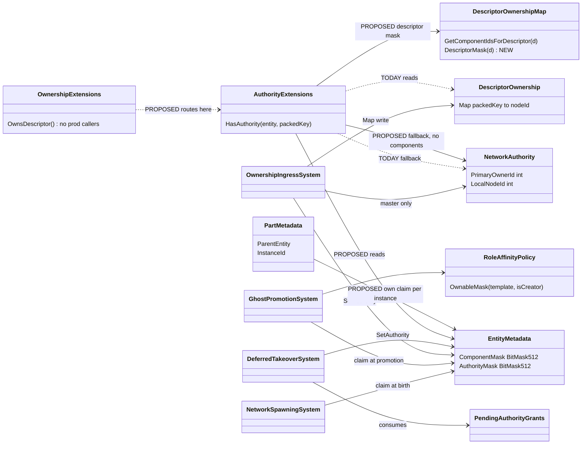
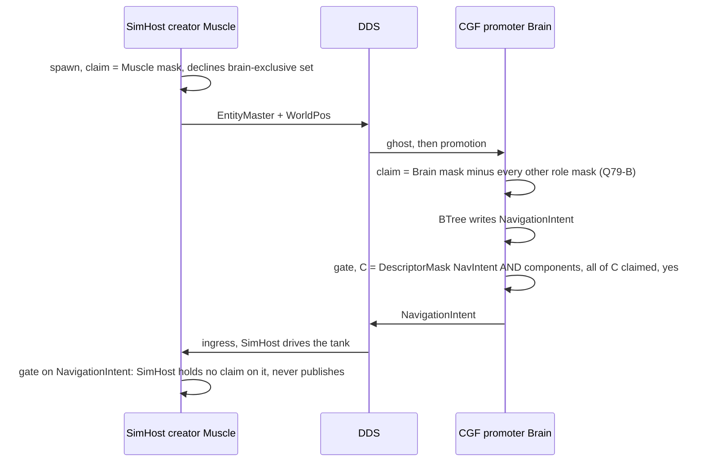
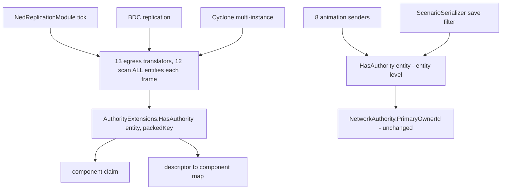
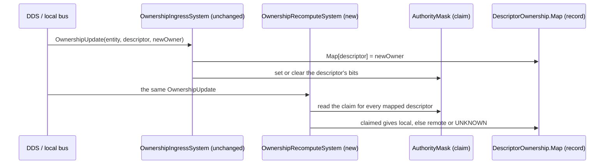
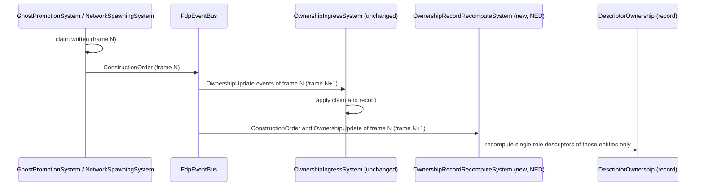

<!--STATUS
state: LIVE
updated: 2026-10-01
build-state: DESIGN — nothing built. NO interim fix (user: "skip the interim fix").
current-answer: §0 ONLY — the consolidated state (user rulings · measured facts · design intent · open questions · §0.7 the proposed solution · §0.6 the next session's task).
stale-below: EVERYTHING under "⛔ HISTORY" — the trail of proposals (§4 §8 §9 §9a §9a′ §9b §9c §11.x). Cite §7 (proofs) and §10 (probe) only via §0.
known-rot: §2's diagrams describe the superseded "one derived gate" proposal, not §0's direction.
known-conflict: DESIGN_Role_Affinity_Ownership.md §3.9c (complement tables used on BOTH legs) and DESIGN_Node_Roles_And_Policies.md §4.1 (IG declines non-role components at create) conflict with the user's rule R-160 — not yet reconciled in those docs beyond pointers.
related-designs:
  - docs/DESIGN_Role_Affinity_Ownership.md — owns WHO claims WHICH component (role tables, birthright, promote leg, shard seam §3.8); §0 changes its tables' meaning.
  - docs/DESIGN_Entity_Ownership_Transfer.md — owns transfer INITIATION (CE-276); unchanged by §0.
  - docs/DESIGN_Node_Roles_And_Policies.md — §4.1 the two distribution mechanisms; §0 supersedes its IG create-leg row.
  - docs/DESIGN_Entity_Genesis_End_To_End.md — the stage sequence (create → grant → ghost → promote → takeover).
  - docs/DESIGN_Distributed_Scenario_Persistence.md — owns the SAVE gate (PrimaryOwnerId); untouched.
  - docs/reference/BDC_NED_SST_Descriptor_Rules.md — the wire spec (per-descriptor owners, OwnershipUpdate, default-to-master).
-->

# Architect Question 79 — **ownership: one owner per component, and the network record derived from it**

## 0. ⭐⭐⭐ CURRENT STATE — consolidated `2026-10-01` *(read THIS; everything else is history)*

**Started from `CE-500`** *(SimHost-created entity: CGF's brain writes `NavigationIntent`, nothing sends it)* and widened, at the user's
direction, into the ownership model itself. ⛔ **No interim fix** — user: *"yes, consolidate first, skip the interim fix"*.

### 0.1 The user's rulings *(verbatim, all `2026-10-01`; ledger rows R-157…R-161)*

| id | ruling |
|---|---|
| R-158 | *"basically i do not want to change the existing network protocols like deferred takover. This took lots of effort to make them working. Every change is very risky. It means i need a minimalistic change"* · *"We should not invent workarounds to a bug."* |
| R-159 | *"network recosrd must be recomputed on every ownership transfer, independently on if it already has an enttry"* · *"i needed to recompute on promotion AND any other ownership changes"* |
| R-160 | *"the rule is that if i am creator, i own all but the stuff other roles own. If i am not creator, i own just what my role claims. No role claims should be allowed to overlap"* |
| R-161 | *"yes, map2d empty list"* |
| R-162 | *"one node per role is wrong. Map2d is a role on multiple nodes already."* — ⛔ **SUPERSEDES R-157** and its duplicate-role guard (Q79 §8 D4, never built). The design is sharding (*"I thought sharding picks the owning node if more nodes implements same role"*) |
| (earlier) | *"Per instance ownership should be honored even if not currently used. Unused is not equal to unneeded."* · correctness must be *"derived logically"*, not from today's test data |

### 0.2 Measured facts *(code — how it IS)*

| # | fact | where |
|---|---|---|
| F1 | two records: the per-component **claim** (`AuthorityMask`) and the **network record** (`NetworkAuthority.PrimaryOwnerId` + `DescriptorOwnership.Map`) | §10.3 |
| F2 | every SENDER gates on the record (`AuthorityExtensions.cs:16-56`, ~30 sites); the claim is read by kinematics/Stride (`SimTransform`), the brain (`BehaviorState`, `BrainInterrupts`) and **every attribute change** (`JsonAttributeCompiler.cs:40,58`, `BinaryInterpreterBuilder.cs:111`) | §10.1, §11.1 |
| F3 | the claim is set in 4 places: create (`NetworkSpawningSystem.cs:263`), promote (`GhostPromotionSystem.cs:324`), grant (`DeferredTakeoverSystem.cs:118`), transfers (`OwnershipIngressSystem.cs:79`, `OwnershipTransferInitiationSystem.cs:93`, `LocalAuthorityYieldSystem` `NedReplicationModule.cs:752`) | §10.5 |
| F4 | `RoleAffinityPolicy.OwnableMask` = ∪(tables of the roles I serve) **+ birthright if creator** — creator-ness adds ONLY the birthright (`RoleAffinityPolicy.cs:148-193`) | §11.2 |
| F5 | tables (`HrotRoleComponentSets.cs:163-215`): Brain = ALL − birthCritical; Muscle = Brain − brainOnly; Map2D = {EditablePolyline, RoutePlan} | §11 |
| F6 | ⇒ live probe: **17 (CGF creates) / 22 (SimHost creates) components claimed by BOTH nodes**; record exclusive | §10 |
| F7 | handover: the creator yields its `SimTransform` claim at frame 1 but its record says "mine" until the Muscle's `OwnershipUpdate` (frame 5) — **that window carries the only initial WorldPos sample**; without it the Muscle's ghost never promotes | §10 timeline |
| F8 | the Muscle's share today arrives ONLY by the creator's grant: `BrainMuscleOwnershipStrategy` (least-loaded Muscle from 1 Hz heartbeats) → `dtWorldPos`+`dtNavigationStatus`; composed on CGF/IG only (`NedNetworkFactory.cs:303`) | §11.3 |
| F9 | `BrainInterrupts` is brain-only in use (`CognitiveRuntimeModule`, composed only by `CgfLogicPack.cs:159`) but missing from `brainOnly` | §11 |
| F10 | sharding seam `IRoleShardProvider` has ONE implementation, `SingleNodePerRoleShardProvider` (ignores the key) | §11.1 |
| F11 | every claim change already emits a one-shot next-frame bus event: `ConstructionOrder` (create, promote), `OwnershipUpdate` (grant, transfer, ingress); `LocalAuthorityYield` emits none | §9c |
| F13 | an IG UI-created tank is NOT created by IG: `IgEntityCreationRequests.cs:65` sends `OwnerAppInstanceId = 0` (untargeted, deliberately — R-140, class remarks :26-28); IG is not the broadcast arbiter (`IgNodeBootstrapper.cs:544`) ⇒ forwarded, CGF creates it and CGF's strategy grants. IG creates only a request TARGETED at its node id — then IG's own strategy grants (CE-271 seams ①④, `IgNodeBootstrapper.cs:506-550`; verified live 2026-09-13, Node_Roles §4.1) | Node_Roles §4.1 |
| F14 | the GRANT is decided independently of the role policy: `CreateEntityRequestSystem.cs:361-370` publishes whenever the servicing node holds a strategy; `BrainMuscleOwnershipStrategy.GetInitialGrants(entityType, masterNodeId)` reads ONLY the heartbeat cache (`GetLeastLoadedNode(MuscleGround)`) and the master id — `entityType` is UNUSED ⇒ every entity a CGF/IG node creates (tank, overlay, anything with the components) gets `dtWorldPos`+`dtNavigationStatus` granted. R-160/R-161 change the CLAIM (`OwnableMask`), not this ⇒ under them IG still grants | `BrainMuscleOwnershipStrategy.cs:40-55` |
| F15 | the pre-genesis yield (`LocalAuthorityYieldSystem`) is registered ONLY when `pureBrainRole` (`NedReplicationModule.cs:504-514`). ⛔ No design gives a reason — Transfer design :63 and Persistence :851 only say *"stays pure-Brain (separate concern)"*; the code comment is a role NAME (*"the Brain yielding its bits"*) — the exact shape Q65 §5.3 refuted for `CE-142` (mechanism gated by a role) and against `R-138`. It acts only on grants to OTHER nodes, which only a strategy-holding creator issues (CGF, IG) ⇒ ungating changes behaviour on IG only: today an IG creator keeps its `SimTransform` claim until SimHost's `OwnershipUpdate`, so `GeoSpatialIngressTranslator.cs:90` ignores SimHost's positions in that window. Filed `CE-508` | `NedReplicationModule.cs:504-514` |
| F16 | SimHost and Stride build `EntityCreationPack` WITHOUT the network adapters: no `NetworkRequestSource`, `AckSink`, `JsonAttributeCompiler`, `OwnershipStrategy` or `RequestEgress` (`SimHostNodeBootstrapper.cs:474-512`, `StrideNodeBootstrapper.cs:472-490`); CGF and IG pass them from `INetworkFactory.CreateCgfEntityLifecycleAdapters()` (`IgNodeBootstrapper.cs:506-550`). ⇒ SimHost cannot be asked over the network to create, cannot forward, and never grants. ⭐ Already ruled: `DESIGN_Subsystem_Composition_Unification.md` §4.1d (`2026-09-03`, user: *"unified entity creation is our desire"*) — *"UNIFY — pass everywhere … the current split is a per-host decision nobody recorded, not a capability boundary"*; ⛔ *"Not built"*, no tracker id ⇒ filed `CE-509` | §4.1d |
| F12 | side defects: `CE-507` (perception/EQS senders use a raw ordinal as key); an unused spec-shaped `OwnershipUpdate` topic (`GenericMessages.cs:33`) | §10.4-10.5 |

### 0.3 Design intent *(docs — how it was MEANT to be)*

| doc | intent |
|---|---|
| Role-Affinity §3.1 · Node_Roles §4.1 | **two mechanisms:** non-birth-critical components ⇒ derived from role (*"the creator declines, the role-holder claims on promotion"*, no message); birth-critical (`SimTransform` only) ⇒ creator birthright, then the EXISTING grant hand-off |
| Role-Affinity §0a / `CE-256` | the grant path is the failure mode (no Muscle known at creation ⇒ never granted); re-grant REJECTED as a second mechanism. ⚠ derivation fixes it only for non-birth-critical components |
| Role-Affinity §3.8 | several nodes per role ⇒ `ServesRole` from inputs IDENTICAL on every node, stable per entity; balancing = one authority publishes the assignment |
| Role-Affinity §2.3 | ownership is network-agnostic: role sets are COMPONENT masks, never descriptors |
| wire spec | per-descriptor owners; only the owner publishes; ownership is "not true during the short time of ownership update" (= F7) |

### 0.4 What R-160 implies *(derived; not built)*

- role claims are **positive, disjoint** lists; **creator** = ALL − ∪(claims of roles it does not serve) + birthright; **non-creator** = ∪(claims of
  roles it serves), shard-gated. ⇒ every component has exactly one claimant per entity (with a correct shard provider).
- Map2D claim = ∅ (R-161). Brain claim = `brainOnly` + `BrainInterrupts` + …. Muscle claim = its non-birth-critical components (§0.3) + ….
- `SimTransform` keeps the grant; the record for the descriptors carrying it keeps the protocols' handover timing (F7).
- then R-159: the record is recomputed from the claim on create, promote and every `OwnershipUpdate` (F11) — for every descriptor
  whose components are all non-birth-critical.

### 0.5 OPEN — the only questions left

| # | question | how to answer it |
|---|---|---|
| O1 | the complete **Brain** and **Muscle** claim lists | classification pass (§0.6) |
| O2 | `dtWorldPos` bundles `SimTransform` (grant) with `SimVelocity`/`VehicleState`/`VehicleParams`/`NavState` (Muscle by role) — keep the whole descriptor on the grant, or split? ⚠ **The designs disagree on `SimVelocity`:** Role-Affinity §3.1 (table, line ~343) puts *"spatial / kinematic — `SimTransform`, `SimVelocity`"* under the creator birthright + grant; Node_Roles §4.1 (line ~266) lists `SimVelocity` as non-birth-critical, claimed by role on promote, *"no grant"*; `SimComponents.cs:40` marks it NOT `[BirthCritical]`. The code follows neither: `BrainMuscleOwnershipStrategy.cs:40-55` grants the whole `dtWorldPos` block + `dtNavigationStatus` (per-descriptor transfer) | from O1's result + Transfer design §1 (per-descriptor transfers); reconcile the two docs |
| O3 | which components does NO role claim (stay with the creator) — and is that right for each? | O1's complement, reviewed |
| O4 | does changing the claim break any CLAIM READER (F2) — esp. attribute changes on IG-created entities | per reader, after O1 |
| O5 | the shard IMPLEMENTATION (R-162): where `ServesRole`'s identical, stable input comes from | `CE-506` — orchestrator-published assignment vs the creator's per-entity decision; measure what the orchestrator already publishes |

### 0.7 ⭐⭐⭐ PROPOSED SOLUTION *(`2026-10-01`, user: "propose a solution and explain how it would work" — awaiting approval; UML goes in a DESIGN doc before build)*

**Three components, one rule each.**

| # | piece | the rule | rests on |
|---|---|---|---|
| ① | **one creation composition on every ECS node** | every networked host passes the network adapters to `EntityCreationPack` (request source, ack sink, compiler, ownership strategy, egress) and registers the pre-genesis yield — no role gates on mechanism | F15, F16 · Composition §4.1d · Q65-A′/§5.3 · R-138 · `CE-508`, `CE-509` |
| ② | **the CLAIM is exclusive** | role claims are positive, disjoint component lists **classified by who WRITES them** (Brain list, Muscle list, Map2D ∅); birth-critical components are in no list. **Creator** = ALL − (lists of roles it does not serve) + birthright. **Non-creator** = lists of roles it serves (shard-gated, one node per role today). Every host gets this policy (IG, Stride included) | R-160, R-161 · F4-F6 · Role-Affinity §3.1, §3.8 |
| ③ | **the RECORD is derived from the claim** | on `ConstructionOrder` and every `OwnershipUpdate` (F11), for each descriptor whose components are ALL non-birth-critical: record = me iff I claim them, else the named remote owner, else UNKNOWN. Descriptors carrying a birth-critical component (`dtWorldPos`) stay **protocol-owned** — the grant/`OwnershipUpdate` hand-off and its lag (F7) are untouched | R-158, R-159 · F7, F11 · wire spec |

**Why it is correct (derivation):** the requirement is NOT one node per role — it is that the **shard picks exactly one node per role per
entity** (Role-Affinity §3.8's `ServesRole` contract), however many nodes hold the role. Map2D's list is empty, so any number of IGs is fine. A birth-critical component
has one owner — the creator, until the single grantee confirms. A component in role R's list is claimed only by the node serving R for that
entity (creator lists exclude other roles; non-creators claim only their roles). Any other component is claimed only by the creator. ⇒ exactly one claimant per component. With descriptors homogeneous
(checked by the classification), exactly one node's record says "mine" ⇒ one publisher. Because lists are classified by WRITER, the
publisher is the producer. The save gate (`PrimaryOwnerId`) is untouched.

**What changes, per creation path:** CGF creates — claims everything except the Muscle list; the grant still hands `dtWorldPos`+`dtNavigationStatus`
to the Muscle (same node the Muscle list points at). SimHost creates — claims everything except the Brain list; CGF claims the Brain list on
promotion and its record follows ⇒ **`CE-500` fixed**. IG creates — keeps everything except the Brain and Muscle lists (today it keeps only
`SimTransform`); grants as today. The 17/22 double claims disappear; `MasterOnly` transfers keep the giver's other descriptors (Transfer §3
becomes true).

**Build order (each step testable alone):** S1 classification pass (no code) → S2 composition ① (`CE-508`, `CE-509`) → S3 claims ② with the
§10 probe turned into a rail "no component claimed by two nodes, all three paths" → S4 record ③ + `EntityMissionEgressTranslator` declares
`MissionPlanQueue` so mission plans are covered → S5 cleanups (`CE-507`, rename the `Cgf` adapters via Roslyn).

**Rejected:** re-gate every sender on the claim (§8) — 30 senders, and the record is still needed for hand-off timing · recompute birth-critical
descriptors too (§9b) — deadlocks the hand-off (F7) · promoter sends `OwnershipUpdate` — protocol change (R-158) · patch only `NavigationIntent`
(§9) — a workaround, leaves 17/22 overlaps · Muscle list empty, grant only — contradicts Role-Affinity §3.1 / Node_Roles §4.1.

**⭐ Sharding (R-162; user: *"multiple nodes can have same claim list. sharding selects what node gets the ownership"*):** generic for EVERY
role — Role-Affinity §3.8 (user ruling `2026-09-10`). Several nodes may hold the same role and the same list; `ServesRole(role, entity)`
picks the one that owns that list for that entity. The rule reads: **creator** = ALL − ∪{list(R) : the shard says I do NOT serve R for this
entity} + birthright; **non-creator** = ∪{list(R) : the shard says I serve R for this entity}. ⇒ exclusive for any number of nodes per role,
PROVIDED the shard obeys §3.8: inputs IDENTICAL on every node, mapping STABLE per entity. ⚠ Today's only implementation
(`SingleNodePerRoleShardProvider`) answers "do I declare R?" — exclusive only while each role with a non-empty list has one node. The real
implementation is `CE-506` — open: WHERE the identical, stable input comes from (§3.8: *"a shard assignment published by ONE authority and
replicated"*), e.g. an orchestrator-published assignment, or the creator's per-entity decision as the grant already is for `dtWorldPos`.
⛔ Superseded same day: an earlier version of this paragraph special-cased Muscle onto the grant and kept Brain single-node.

**Known unknowns:** the lists themselves (O1); a descriptor that mixes classes (O2); claim readers affected by the change, esp. attribute
changes (O4); a role with no live node leaves its list unowned (Role-Affinity §3.8 rules: log once, no fallback); N nodes per role (O5).

### 0.6 ⭐ THE NEXT SESSION'S TASK — **complete before proposing anything**

1. `RELEARN`, then read §0 only.
2. **Classification pass** — for every component present on a CGF- or SimHost-created entity (the §10 probe lists them): which
   systems WRITE it, composed on which host *(graph `search_graph`/`trace_path` + grep; the graph under-reports extension and
   generic dispatch — F2)*. Output: one table component → writer hosts → proposed claimant (Brain / Muscle / creator).
3. Answer O2–O4 from that table, then bring the user **ONE** complete proposal covering all three creation paths
   (CGF, SimHost, IG creates), with UML, a claim table and rejected alternatives one line each.
4. Only then: build (R-160 tables + policy; R-159 recompute system), proven through `CE-500`'s rail and the role-affinity rails.


## ⛔ HISTORY — the trail that led to §0 *(2026-10-01)*

⛔ **Everything below this heading is history: proposals, refutations and corrections in the order they happened. Do NOT quote any of it as current — §0 is the state. Kept because the measurements in §10 and the proofs in §7 are cited from §0.**

### (original title) one ownership truth: senders derive descriptor ownership from the component claim

> 🔒 **User, `2026-10-01`:** *"How can we make them agree in a clean way? We should not invent workarounds to a bug."* ·
> *"Per instance ownership should be honored even if not currently used. Unused is not equal to unneeded."* ·
> *"There must have been some reason for why it is implemented using the current mechanism. There is likely some trade off."*

**Trigger:** [`CE-500`](Blueprint_Issues_Tracker.md) — on Role-Affinity *Path B* (SimHost creates, CGF thinks) the brain
writes `NavigationIntent` and never sends it: CGF **claims** the component, but every sender reads a **different** record.

## 1. INVENTORY

| query | total | list |
|---|---|---|
| `search_graph name_pattern=".*(Authority\|Ownership).*" label=Class` *(production)* | 25 | `AuthorityExtensions` · `OwnershipExtensions` · `NetworkAuthority` · `DescriptorOwnership` · `DescriptorOwnershipMap` · `PendingAuthorityGrants` · `DescriptorAuthorityChanged` ×2 · `OwnershipIngressSystem` · `OwnershipEgressSystem` · `OwnershipTransferInitiationSystem` · `LocalAuthorityYieldSystem` · `BrainMuscleOwnershipStrategy` · `DeferredTakeOwnership` (+command, egress, ingress) · `OwnershipUpdate` ×3 · `OwnershipUpdateTranslator` · `TransferEntityOwnershipRequest` · `QueryBuilderAuthorityExtensions` · `WorldIdAuthority.AllocatorAuthority` *(unrelated: id allocation)* · `SplitAuthorityStrideSyncScript` |
| `grep "HasAuthority(<entity>, <packedKey>)"` *(production)* | 18 | 13 senders (NED ×10, BDC ×2, Cyclone multi-instance ×1) · `EntityInfoIngressTranslator:176` · `UpdateEntityDescriptorRequestSystem:142,190` · `OwnershipTransferInitiationSystem:155` · debug API |
| `grep "HasAuthority(<entity>)"` *(entity-level, production)* | 10 | 8 animation senders · `WeaponFireIntentEgressTranslator:87` · `ScenarioSerializer:612` (save filter) |
| `OwnsDescriptor` / `GetDescriptorOwner` *(a THIRD gate, `OwnershipExtensions.cs:40-90`)* | 0 production callers | ignores the map entirely — *"per-descriptor ownership map was removed as part of Core simplification (BATCH-07)"* |
| live world descriptor→component map, SimHost + CGF *(probe, `2026-10-01`)* | 6 / 5 | `EntityMaster`→NetworkIdentity,TkbIdentity · `EntityInfo`→EntityInfo · `MapVisualOverlay`→EditablePolyline · `MapRoute`→RoutePlan · `NavigationStatus` · `NavigationIntent`. ⚠ The WorldPos block (`NedReplicationModule.cs:623`) is in the MODULE's map only |

## 2. THE DIAGRAMS

### 2.1 Class — as it IS (two records, three gates) → as PROPOSED (one truth, one gate)



*What the picture shows that prose hid:* **every writer already writes the claim** (`EntityMetadata.AuthorityMask`) — spawn,
promotion, both handover paths — but the one gate every sender calls reads `DescriptorOwnership` + `NetworkAuthority`, which
only the handover paths and spawn write. Promotion writes the claim and nothing else; that is CE-500. Proposed, the gate
reads what everyone writes.

### 2.2 Sequence — Path B under the proposal



*What it shows:* both nodes decide **locally from the same role tables** and agree without a message; exactly one publisher
per descriptor, which is the spec's only hard rule.

### 2.3 Module — who calls the gate each frame



*What it shows:* one function sits under every sender, so the change is made **once**; the entity-level gate (lifecycle,
save) is untouched.

## 3. ⭐⭐ WHY IT IS BUILT THIS WAY — AND WHAT DERIVATION LOSES

📐 **Why the current mechanism exists.** The replication toolkit was designed **wire-first**
([`FDP.Toolkit.Replication.md`](../../FDP/Docs/projects/toolkits/FDP.Toolkit.Replication.md) §2): three levels — the primary
owner, a per-descriptor override map, and parts inheriting their root. It mirrors the wire spec one-to-one, so the gate needs
**no knowledge of ECS components** and works for a translator that declares none (today: all but six). The per-component
`AuthorityMask` came separately, from the ECS core, for queries (`WithOwned<T>`). Role affinity (`2026-09`) then moved the
*decision* onto the mask because ownership must be network-agnostic (Role_Affinity §2.3) — and the senders stayed on the wire
record. That is how two truths arose: **each was right for the job it was built for.**

| # | what derivation LOSES (or makes harder) | measured | how the proposal handles it |
|---|---|---|---|
| **L1** | ⭐ **correctness now depends on the descriptor→component declarations.** A missing declaration falls back to today's behaviour (safe); a **wrong** one silently changes who publishes | 6 of ~19 descriptors declare components; WorldPos only in the module's map | Q79-C: one map + a rail that every sender either declares its components or is explicitly entity-level |
| **L2** | **two descriptors that share a component cannot have different owners** (e.g. `SimTransform` is in WorldPos and GeoSpatial). The spec allows it | ✅ `DescriptorOwnershipMap` reverse index is many-valued | accepted: two owners would both *write* that component on ingress — an ECS conflict the map could express but never made correct |
| **L3** | **a claim cannot exist before its component does** (`SetAuthority` throws, `EntityRepository.cs:1133`); the map can say "I own D" for a ghost that has no components yet | ✅ pre-genesis grants already staged in `PendingAuthorityGrants` | Q79-E: an `OwnershipUpdate` for absent components is staged the same way, never dropped |
| **L4** | **"who owns it" (a node id) is gone** — the claim says only *mine / not mine* | readers of an owner id: debug API, replay federation (`PrimaryOwnerId`, kept) | Q79-F: the map stays as **remote bookkeeping** (debug, routing a one-time update to the owner — spec L145), never read by the gate |
| **L5** | **implicit part inheritance is gone** — today a part needs no state; it borrows its root's answer | ✅ parts start with an empty claim (`EqsChildSensor.cs:66`) | Q79-D: a part's claim is set **at creation** from its root's claim (one helper, three creation sites); per-instance ownership becomes expressible without the map |
| **L6** | the gate now needs the transport's map at runtime (a toolkit → transport-populated dependency) | the world already holds it (`AttributeInterpreterProvider.GetDescriptorMap`) | no new dependency, but the map must be complete before the first sender runs |

⚠ **Stated honestly about speed (§5):** the gain is real but is **not** a reason to choose this. Most of today's cost is
generic per-type lookups through the interface, which an optimised version of today's gate could also shed. ⭐ The reason is
**one truth**.

## 4. THE SUB-QUESTIONS — each with a lean

| # | question | ⭐ lean | blast radius | would change it |
|---|---|---|---|---|
| **Q79-A** | Is the component claim the ONE ownership truth, with descriptor ownership DERIVED? Rule: C = D's components the entity has; **own D ⇔ C non-empty and every component of C claimed**; C empty ⇒ the EntityMaster owner (spec default); EntityMaster itself ⇒ `PrimaryOwnerId` | ✅ **yes** — Ownership_Transfer §3 already states it; "every" not "any" because only the owner may publish | the one gate (`AuthorityExtensions`), ~28 callers unchanged | a ruling that a descriptor must be ownable independently of its components (L2) |
| ⛔ **Q79-B — REFUTED by §7.3** | Precondition — claims disjoint: the promoter claims only **its role mask minus every other role's mask**; the creator keeps the unclassified rest | ✅ **yes** — uses the existing tables; makes "one publisher" true by construction | `GhostPromotionSystem` claim (one line of mask math) + rails | a deliberate shared component — none known |
| **Q79-C** | Precondition — ONE map: the world map carries the explicit blocks (WorldPos, NavigationStatus); a rail fails when a sender neither declares components nor is marked entity-level | ✅ **yes** | `NedReplicationModule` populate + one rail | — |
| **Q79-D** | Per-instance: an instance IS an entity (root = 0, part = N); the gate derives on the **instance's own entity**; a part's claim is set at creation from its root's; a per-instance transfer writes the part | ✅ **yes** — honours per-instance ownership *("unused is not unneeded")*; drops the implicit root redirect | three part-creation sites (weapon mounts, EQS child sensors, personal routes) + `OwnershipIngressSystem` instance routing | — |
| **Q79-E** | An ownership change for components not yet present is **staged** (`PendingAuthorityGrants`), applied when they appear | ✅ **yes** — reuse, do not invent | `OwnershipIngressSystem` | — |
| **Q79-F** | `DescriptorOwnership.Map` becomes remote bookkeeping (never read by the gate); `OwnsDescriptor`/`GetDescriptorOwner` are **routed** into the one gate, not deleted | ✅ **yes** | debug API, `OwnershipExtensions` | a reader that needs a remote owner id the map no longer tracks after a local promotion — then derive it from the wire's last writer |

**Rejected, one line each:**
- *each sender checks its own component* — 25 edits, and ambiguous where one component belongs to several descriptors.
- *sync the map on promotion* — still two truths kept in step; the next new writer drifts again.
- *send `OwnershipUpdate` on promotion* — that is the transfer protocol; it does not change the local gate.
- *"any component claimed" instead of "every"* — lets two nodes publish one descriptor.
- *cache the derived answer per entity* — a third record needing invalidation; the derivation is cheaper than the lookup it would save.

## 5. MEASUREMENTS *(`2026-10-01`, Release, 10 000 entities, 100 rounds, through `ISimulationView`, 3 runs)*

| gate | ns / call |
|---|---|
| today — keyed, no map entry | 557 – 636 |
| today — keyed, map entry | 620 – 670 |
| today — entity-level only | 160 – 238 |
| **derived** — descriptor mask ∧ component mask, then "all claimed?" | **52 – 74** |

12 of 13 senders scan every entity every frame ⇒ ~12 000 calls/frame at 1 000 entities ≈ **7 ms → 0.7 ms**
*(⚠ extrapolated from the micro-benchmark; not measured in a live cluster)*. No cache: one static mask per descriptor built
when the map is filled; the per-entity inputs are kept current by the ECS itself.

## 6. ACCEPTANCE *(for the batch that builds an approved answer)*

| rail | proves |
|---|---|
| `CgfSubsystemHeadlessTests.SimHost_MoveToLocationMission_…` green | CE-500 closed (Path B publishes) |
| new: Path B ⇒ exactly ONE node publishes `EntityInfo` | Q79-B — no over-claim publisher |
| `SplitAuthoritySpawnTests` green | Path A WorldPos handover unchanged (Q79-C) |
| new: a part transferred alone publishes from its new owner, its root does not | Q79-D per-instance |
| new: an `OwnershipUpdate` before the component exists takes effect when it appears | Q79-E |
| unit: derived gate == today's gate on every case where the two records agree | no behaviour change outside the bug |

## 7. ⭐⭐⭐ THE LOGICAL PROOF — and what it refuted *(`2026-10-01`)*

> 🔒 **User:** *"testing on todays (limited) data and use cases is not what proves correctness. can the correctness be derived
> logically?"* — ⭐ yes: correctness reduces to AXIOMS about finite DEFINITIONS (role tables, the descriptor→component map,
> templates). The theorem is proved once; each axiom is discharged by reading the definitions, not by running use cases.

### 7.1 The model and the (corrected) rule

| symbol | meaning |
|---|---|
| `D(d)` | the components descriptor `d` binds — ⭐ **a property of the descriptor, identical on every node** (axiom M) |
| `K(e,n)` | the components entity/instance `e` has on node `n` |
| `A(e,n)` | node `n`'s claim on `e` (`AuthorityMask`), always `⊆ K(e,n)` |
| `master(e)` | the EntityMaster owner (`PrimaryOwnerId`) |

**owns(n,d,e) ⇔** `D(d) = ∅ ∧ n = master(e)`  **∨**  `D(d) ≠ ∅ ∧ D(d)∩K(e,n) ≠ ∅ ∧ D(d)∩K(e,n) ⊆ A(e,n)`

⛔ **Correction to §4 Q79-A:** the fallback keys on `D(d) = ∅` (the GLOBAL definition), never on "this node has none of the
components". 📐 With a local fallback, a node lacking `d`'s components would fall to the master owner while another node claims
them — **two owners by construction**. A node holding none of `d`'s components simply cannot own `d` (it has nothing to send).

### 7.2 The axioms and the two theorems

| axiom | statement |
|---|---|
| **M** | `D(d)` is the same on every node |
| **X — exclusivity** | for every (entity/instance, component) at most ONE node holds the claim, outside the spec's own transfer window |
| **C — coherence** | a descriptor's components are never claimed by different nodes: whoever claims one member of `D(d)` claims every member it has |
| **P — master uniqueness** | `master(e)` is one node on every node's view (the spec: EntityMaster has one writer) |
| **E — claim follows execution** | a node writes a component only if it claims it (the `WithOwned` execution gate, Role_Affinity §3.5) |

**Theorem 1 — safety (at most one sender).** Under M, X, C, P: if `D(d) = ∅`, only `master(e)` owns `d` (P). If `D(d) ≠ ∅` and
`n₁ ≠ n₂` both own `d`, each claims some member of `D(d)`; by C each claims all members it has, so some component is claimed
by both, or the two hold disjoint parts of one descriptor — the first contradicts X, the second contradicts C. ∎
⚠ It holds **outside the transfer window**, exactly as the wire spec itself does (*"This is not true during the short time of
ownership update"*).

**Theorem 2 — liveness (the producer sends).** Under E: the node that writes `D(d)` claims it, so `D(d)∩K ⊆ A` and it owns `d`.
⚠ E is only as strong as the execution gate — §3.5 found un-gated writers; liveness is proved only where execution is gated.

**Per instance:** replace `e` by the instance's entity. Initialising a part's claim from its root's (Q79-D) copies an exclusive,
coherent claim onto a NEW entity, so X and C are preserved.

### 7.3 ⛔⛔ DISCHARGING THE AXIOMS AGAINST THE DEFINITIONS — **X FAILS, and Q79-B does not fix it**

📐 `HrotRoleComponentSets.cs:163-178`: `Brain = ALL − birthCritical` · `MuscleGround = ALL − birthCritical − brainOnly`.
⇒ ⭐ **the Muscle table is a SUBSET of the Brain table.** The overlap is not a "third bucket" — it is the **entire muscle set**.

| path | creator claims | promoter claims today | X? |
|---|---|---|---|
| **A** — CGF creates | Brain ∪ birth = **everything** | SimHost: MuscleGround = everything − brainOnly | ⛔ **violated for every muscle component** (both claim) |
| **B** — SimHost creates | MuscleGround ∪ birth = everything − brainOnly | CGF: Brain = everything − birth | ⛔ violated for every muscle component |

⇒ today works **only because no sender reads the claim** (§3.6). A derived gate on top of these tables would create two
senders on Path A and Path B alike.

⛔⛔ **Q79-B as written ("promoter claims its role minus every other role") is REFUTED.** Brain − Muscle = brainOnly ✅ (Path B
correct), but **Muscle − Brain = ∅** ⇒ on Path A SimHost would claim NOTHING by role, and every gated muscle system
(perception, weapons, kinematics outside the WorldPos handover) would stop on Brain-created entities — Theorem 2 violated.

**What M, C and P look like** *(read from the definitions)*: M ⛔ **fails today** (the world map is per-node and a subset — §1);
C ✅ holds for the six declared descriptors under the current transfers (whole descriptors move); P ✅ by the spec and creation.

### 7.4 ⭐ THE QUESTION THAT REMAINS — how does the claim become EXCLUSIVE?

⇒ the derivation is **provably correct once X and M hold**; the open design decision is **X**, and it touches the `2026-09-13`
ruling that the role tables are COMPLEMENTS (Role_Affinity §3.9c). Candidates, NOT yet leaned — each needs its own check
against Theorem 2:

| option | X by construction? | cost |
|---|---|---|
| promoter claims `role − creator's ownable set` | ✅ | Path A: the Muscle claims ∅ by role ⇒ its computed state must arrive by explicit descriptor handover (extend `DeferredTakeOwnership` beyond WorldPos/NavigationStatus) |
| tables become disjoint POSITIVE sets | ✅ | ⛔ the `2026-09-13` ruling rejected it (fails toward un-ownership, `CE-256`) |
| creator DECLINES every component another role in the cluster serves | ✅ | the creator must know which roles are present — the start-order race §0a removed |

⛔ **Do not approve §4 until §7.4 is decided.**

### 7.5 ⭐⭐ OPTION 1 CHECKED AGAINST THEOREM 2 *(`2026-10-01` — definitions + the live composition, not use cases)*

**Option 1:** the promoter claims `its role table − the creator's ownable set`. ⇒ Path B: CGF claims **brainOnly**;
Path A: SimHost claims **∅ by role**, and gets kinematics only through the `DeferredTakeOwnership` grant (WorldPos block,
NavigationStatus — `BrainMuscleOwnershipStrategy`).

📐 **Method.** Theorem 2 constrains only components bound to a descriptor (unbound ones are never published). The live
composition of a SimHost + CGF pair was dumped (`ArchitectureDiagnosticsService`, 41 SimHost / 58 CGF systems) and the
writers of every bound component were read.

| descriptor (bound components) | producer | Path A — CGF creates | Path B — SimHost creates |
|---|---|---|---|
| `EntityMaster` (NetworkIdentity, TkbIdentity) | creator | ✅ | ✅ |
| `EntityInfo` | creator *(per-spawn name/faction)* | ✅ CGF | ✅ SimHost |
| `NavigationIntent` | CGF BTree | ✅ creator claims | ✅ brainOnly — **CE-500 closed** |
| `WorldPos` (SimTransform, SimVelocity, VehicleState, VehicleParams, NavState) | SimHost after birth; CGF's birth baseline | ✅ **only via the creation-time grant** · ⛔ **no muscle known at creation ⇒ no grant ⇒ the producer never owns** | ✅ creator |
| `NavigationStatus` | SimHost | same as WorldPos | ✅ |
| `MapVisualOverlay` / `MapRoute` | creator | ✅ — Map2D is a pure consumer (Role_Affinity §6i-b) | ✅ |

Two suspected two-node writers were checked and cleared: `LocomotionChannel` (SimHost's bridge write is guarded by
`IsComponentTypeRegistered`, `NavigationIntentBridgeSystem.cs:187`, and SimHost does not register channels) · `WeaponState`
(written only on CGF, `AimAndFireExecutor.cs:53`).

⇒ ⭐⭐ **Option 1 satisfies Theorem 2 everywhere EXCEPT Path A kinematics with a late-joining Muscle** — which is exactly
`CE-256` (Role_Affinity §0a). ⚠ It is **no worse than today** (today the gate also publishes WorldPos only through the grant),
but it does **not** deliver what role affinity promised there — *"the creator declines, the role-holder claims on promotion"*
was never true for publication, because no sender read the claim.

### 7.6 ⭐ The residual, and the lean to close it

The late joiner must take the kinematic block **itself, on promotion**, without the creator knowing the cluster at creation
time. ⭐ **Lean: a promoter-initiated `OwnershipUpdate`** for the descriptors its role produces but the creator owns
(WorldPos, NavigationStatus). It is the **wire spec's own transfer** (*"an arbitrary node sends OwnershipUpdate"*; the
current owner stops, the new owner writes to confirm), **already built** (`CE-276`), and it keeps X and C: the block moves as
a whole, the creator clears before the promoter claims.
⚠ **Why this is not the "re-grant on node-join" §0a rejected:** that was a creator-side re-evaluation — a second policy. Here
the role-holder asks for what its role produces, through the one transfer mechanism. ⛔ **Not yet proved:** the case of two
promoters of the same role (sharding, §3.8) racing for one block — the shard provider's single answer per entity is the
candidate guarantee and needs its own check.

### 7.7 ⭐⭐⭐ SHARDING — Theorem 3, and what it requires *(`2026-10-01`)*

**Axiom S — partition.** For every role `R` and entity key `k`, **at most one node in the cluster** answers
`ServesRole(R, k) = true`. ⚠ Role_Affinity §3.8's contract ① (inputs identical on every node) and ② (stable for the entity's
life) make nodes **agree**; ⛔ **neither says only ONE node answers yes.** S must be stated as contract ③.

**Theorem 3 — sharded promotion with a promoter-initiated transfer (§7.6) is race-free.** Under S, ②, X and C:
1. per (entity, role) at most one node promotes as that role's holder (S) ⇒ at most one claimant per role-exclusive component (X);
2. a promoter requests only the descriptors its role produces; role-produced blocks are disjoint (C) ⇒ **at most one initiator
   per descriptor**;
3. one initiator ⇒ one `OwnershipUpdate` per descriptor ⇒ every node applies the same final owner — the spec's single-transfer
   protocol holds;
4. ② ⇒ no second initiator appears later (no remapping of a live entity). ∎

📐 **Why one initiator is NECESSARY, not just sufficient:** `OwnershipIngressSystem.cs:57-67` applies updates **last-write-wins
per node, in that node's arrival order**, and DDS gives no total order across different writers ⇒ two initiators for one
descriptor can leave nodes disagreeing (A believes B owns it, B believes A does) — a silent two-writer or zero-writer state.

### 7.8 ⛔⛔ DISCHARGING S AGAINST THE DEFINITIONS

| deployment | S holds? | measured |
|---|---|---|
| **one node per role** *(every shipped launch mode: `launchSettings.json` starts one SimHost, one CGF)* | ✅ with `SingleNodePerRoleShardProvider` (it ignores the key; one declarer ⇒ one "yes") | ⚠ **not ENFORCED** — no code detects a second node declaring the same role *(searched: none)* |
| **N > 1 nodes per role** | ⛔ **the default provider answers yes on EVERY declarer** ⇒ two muscles both promote, both claim, both initiate | ⚠ today's grant path ANTICIPATES N muscles (`BrainMuscleOwnershipStrategy` → `GetLeastLoadedNode`) — there ONE decider (the creator) picks one, which is why today does not race |
| **N > 1 with a locally computed rule** *(e.g. hash over the roster)* | ⛔ **unprovable** — the roster comes from 1 Hz heartbeats and is not identical across nodes at the same moment (violates ①); membership changes violate ② | — |

⇒ ⭐⭐ **RESULT.**
- **One node per role: the proof is complete** — given X, C, M (§7.2-7.6) and ONE guard: ⛔ a second node declaring a role
  already held must be **detected and refused loudly** (the roster already knows — `NodeRoster.NodesWithRole`), or S breaks
  silently. Same shape as §5 ②'s approved boot warning.
- **N nodes per role: provably correct only with a SINGLE DECIDER** publishing `(role, entity) → node`, fixed once assigned —
  the shard-table authority §3.8 deliberately left undesigned. ⭐ It must assign **when a holder exists**, not only at
  creation — that is what closes the late joiner for N > 1. ⛔ **No locally computed provider can satisfy S under changing
  membership.**
- ⚠ **Adopting §7.6 with the default provider would REGRESS a multi-muscle cluster** (today the creator's single decision
  prevents the race). ⇒ the guard above is a precondition of §7.6, not an extra.

## 8. ⭐⭐⭐ THE CURRENT ANSWER — consolidated *(`2026-10-01`, after §7)*

> 🔒 **User, `2026-10-01`, verbatim, scope ruling (`R-157`):** *"one node per role with the guard for now"*

| # | decision | basis | status |
|---|---|---|---|
| **D1** | **One truth:** the component claim (`AuthorityMask`). Every sender derives: `owns(n,d,e) ⇔ (D(d)=∅ ∧ n=master(e)) ∨ (D(d)≠∅ ∧ D(d)∩K ≠ ∅ ∧ D(d)∩K ⊆ A)`; EntityMaster ⇒ `PrimaryOwnerId` | §7.1, Theorems 1-2 | ⭐ lean — awaiting approval |
| **D2** | **The promoter claims `its role table − the creator's ownable set`** (replaces the refuted Q79-B) | §7.3 refutation · §7.5 check | ⭐ lean |
| **D3** | **The promoter requests the descriptors its role produces but the creator owns** (WorldPos, NavigationStatus) by an `OwnershipUpdate` through the built transfer (`CE-276`) — closes the late joiner (`CE-256`) | §7.6 · Theorem 3 | ⭐ lean |
| **D4** | ⭐⭐ **Duplicate-role guard:** a node declaring a role another live node already holds is **refused loudly** (from `NodeRoster.NodesWithRole`). One node per role is the supported topology | §7.8 — S holds only with it | ✅ **RULED** (`R-157`) |
| **D5** | **One global map:** the descriptor→component map is a property of the descriptor, identical on every node, including the explicit WorldPos / NavigationStatus blocks; a rail fails when a sender neither declares components nor is marked entity-level | axiom M (§7.2) | ⭐ lean |
| **D6** | **Per instance:** the gate derives on the instance's own entity; a part's claim is set at creation from its root's; a per-instance transfer writes the part | §7.2 "per instance" | ⭐ lean *(user: "unused is not unneeded")* |
| **D7** | An ownership change for components not yet present is **staged** (`PendingAuthorityGrants`), never dropped | L3 | ⭐ lean |
| **D8** | `DescriptorOwnership.Map` becomes **remote bookkeeping** (never read by the gate); `OwnsDescriptor` / `GetDescriptorOwner` are **routed** into the one gate | L4 · Q79-F | ⭐ lean |
| **D9** | **N nodes per role is OUT OF SCOPE** — it needs a single decider (an orchestrator-published, per-entity-fixed shard assignment) and is its own design: [`CE-506`](Blueprint_Issues_Tracker.md) | §7.8 | ✅ **RULED out of scope** (`R-157`) |

⚠ **What the proofs still assume, stated so nobody over-reads them:** Theorem 2 (the producer sends) was discharged for the
**descriptor-bound** components only (§7.5); most simulation writers are un-gated (§7.5's audit), so axiom E is a property of
the descriptor-bound set, not of every component. The transfer window is excluded, exactly as the wire spec excludes it.


## 9. ⭐⭐⭐ THE MINIMAL FIX — no protocol change *(`2026-10-01`, the CURRENT proposal)*

> 🔒 **User, `2026-10-01`, verbatim:** *"basically i do not want to change the existing network protocols like deferred takover.
> This took lots of effort to make them working. Every change is very risky. It means i need a minimalistic change"*

⇒ **§8 is DEFERRED** (D3 adds a new `OwnershipUpdate` initiator; D1/D8 re-gate every sender). **Built instead: ONE gate.**

**Decision:** `NavigationIntentEgressTranslator` gates on the component claim of its source component —
`repo.HasAuthority<NavigationIntent>(entity)` — instead of the network record (`view.HasAuthority(entity, packedKey)`).
Exactly the shape `TacticalIntentEgressTranslator.cs:72` already uses (`HasAuthority<BehaviorState>`). No message, no system,
no `DeferredTakeOwnership` / `OwnershipUpdate` / `PendingAuthorityGrants` change; every other sender untouched.

| the fix rests on | code — how it IS | design — how it was MEANT |
|---|---|---|
| the egress exists ONLY on a networked Brain node | ✅ built only by `CognitiveTranslatorPack.cs:57`, only `if (_roleHasBrain)` (`NedReplicationModule.cs:290`); the editor runs `OfflineNetworkFactory` → `NullReplicationModule`; IG is `Map2D` | ✅ `CognitiveTranslatorPack.cs:25` "Brain and AllInOne" |
| one networked Brain node per cluster | ✅ `R-157` + D4 guard | ✅ §8 D4, ruled |
| Path A (CGF creates): CGF's claim holds `NavigationIntent` | ✅ creator = role table ∪ birthright | ✅ Role-Affinity §3.1 |
| Path B (SimHost creates): CGF's promote leg claims it | ✅ `GhostPromotionSystem.cs:313-324` claims role table ∩ live mask, AFTER template `Inject`; the executors only `GetComponent<NavigationIntent>` (never add it) ⇒ it is template-materialised before the claim | ✅ Role-Affinity §3.2 promote leg |
| the Muscle never claims it | ✅ `NavigationIntent` is in `brainOnly` (muscle READ set), `HrotRoleComponentSets.cs:163-178` | ✅ Role-Affinity §3.1 |
| the receiver does not filter by sender | ✅ `NavigationIntentIngressTranslator.cs:67-89` resolves the entity and writes — no owner check | ⛔ searched `docs/`, no ruling — wire spec says only the owner *publishes*, not that a receiver checks |
| the §3.9c promote over-claim cannot create a second sender | ✅ it is a Brain-only component; the over-claim matters only for components both roles produce | ✅ `known-conflict` above — unaffected for this one component |

**Proof obligation** (§7.2 Theorem 1 restricted to one descriptor): at most one node composes the sender (rows 1-2) and that node
holds the claim on both paths (rows 3-4) ⇒ exactly one sender, and it is the producer (Theorem 2). Late joiner (`CE-256`) does not
arise — no grant is involved.

**Blast radius:** 1 production line · 7 unit tests in `NavigationIntentEgressTranslatorTests` set the claim
(`SetAuthority<NavigationIntent>`) beside the `NetworkAuthority` they set today. **Acceptance:**
`CgfSubsystemHeadlessTests.SimHost_MoveToLocationMission_EntityMovesWithoutGhostTick` green; the feature's own suite
(`NavigationIntentEgressTranslatorTests`) green plus a rail *"no claim ⇒ no publish even with `PrimaryOwnerId == local`"*.

**Rejected (one line each):**
- **§8 full unification** — re-gates 13 senders. That is the protocol-wide risk the user ruled out.
- **D3 (promoter sends `OwnershipUpdate`)** — adds a new initiator to the built transfer, and `OwnershipIngressSystem.cs:57-67` is last-write-wins, so two initiators race.
- **Creator decides the target** — the creator is SimHost on Path B, which has no strategy (`BrainMuscleOwnershipStrategy` is composed on CGF/IG only). Giving it one changes the takeover flow.
- **Spawn on CGF in the test** — hides a real Path B gap.

**What stays open (named, not fixed):** other Brain-produced descriptors that a SimHost-created entity needs published get the same
one-line treatment **only when a rail shows the gap**. The network record and the claim still disagree for every other sender; §8 is
the record of how to unify them later.

### 9a. ⭐⭐⭐ THE USER'S VARIANT — recompute the network record from the claim *(`2026-10-01`, the CURRENT lean)*

> 🔒 **User, `2026-10-01`:** *"but we can recompute the network ownership from component ownership. This must be doable without
> changing the network protocols"*

**Decision:** yes, if it is restricted twice. **At the promote leg** (`GhostPromotionSystem.cs:313-324`, right after the claim), for
every descriptor `d` whose components are **all in the local role's EXCLUSIVE set** (its table minus every other role's table) and
are claimed: write `DescriptorOwnership.Map[d] = local`, **only if `Map` has no entry for `d`**. No sender gate changes.

| the variant rests on | code — how it IS | design — how it was MEANT |
|---|---|---|
| writing `Map` puts nothing on the wire | ✅ the only `Map`-diff→`OwnershipUpdate` publisher, `OwnershipEgressSystem`, is registered only in FDP's `ReplicationLogicModule.cs:46` (examples); NED registers `OwnershipIngress`/`TransferInitiation`/`DeferredTakeover` only (`NedReplicationModule.cs:275,483,489`) | ✅ wire spec: `OwnershipUpdate` is the transfer protocol, not a mirror of local state |
| the protocols always write mask AND `Map` together | ✅ `OwnershipIngressSystem.cs:64-77` · `DeferredTakeoverSystem.cs:94+` · `OwnershipTransferInitiationSystem.cs:76+` | ✅ §7.2 C (coherence) |
| ⛔ an UNRESTRICTED recompute breaks a sender | ✅ `EntityInfo` is not `[BirthCritical]` (`EntityInfo.cs:9`) ⇒ in BOTH the Brain and Muscle tables (`HrotRoleComponentSets.cs:172-175`). On Path B both nodes claim it ⇒ CGF's `EntityInfoEgressTranslator.cs:116` would publish beside SimHost's, and CGF's `EntityInfoIngressTranslator.cs:176` would DROP SimHost's samples. Same for `EntityDamage` | ✅ §7.3 (X fails) · Role-Affinity §3.9c (the over-claim is "tolerated" only because no sender reads it) |
| the exclusive sets | ✅ Brain = `brainOnly` (incl. `NavigationIntent`); Muscle = ∅ (Muscle ⊂ Brain); Map2D = ∅ (Brain ⊇ Map2D) | ✅ `HrotRoleComponentSets` "Brain and Muscle are still DISJOINT over the classified set" |
| "no entry only" ⇒ never overrides a protocol | ✅ by construction; DeferredTakeover's `WorldPos`/`NavigationStatus` are muscle components, disjoint from `brainOnly` | — |

⇒ **The only node that ever writes is a Brain promoter, and only brain-only descriptors** (today: `dtNavigationIntent`). Path A
(CGF is master) and every SimHost/IG promotion are byte-identical to today. One-shot at promotion ⇒ zero per-frame cost.

**Behaviour changes, named:** ① Path B — CGF publishes `NavigationIntent` (the fix). ② An IG-created tank promoted on CGF — same.
③ After an EntityMaster hand-away FROM CGF (Path A, `CE-276`), CGF keeps its brain-only descriptors — but only if they were written at
promotion, which on Path A they are not ⇒ unchanged.

**Gaps it does not close:** `EntityMissionEgressTranslator` gates on `MissionPlanQueue` but declares no `TargetComponentIds`, so no
descriptor→component entry exists and the recompute cannot see it (axiom M). Not needed for movement.

**vs §9:** same reach for `NavigationIntent`; §9a leaves every gate untouched and covers every future brain-only descriptor, at the
cost of ~20 lines in a shared FDP system instead of one line in one translator.

**Root cause of the non-exclusive claim** *(user asked, `2026-10-01`)*: ONE table serves TWO legs. The owned tables are complements
(Role-Affinity §3.9c: Brain = ALL − birthCritical, Muscle = Brain − brainOnly), so the unclassified bucket (`EntityInfo`, health,
map display… ~496 of 512 bits) is in BOTH. On the CREATE leg that is right — the creator keeps what no role claims. On the PROMOTE
leg (`GhostPromotionSystem.cs:313-324`, bare `BitwiseOr`) the same table makes the promoter claim that bucket too — which contradicts
§3.1's own rule *("owns it if, and only if, it holds the role that component belongs to")*; §3.9c records it as *"tolerated, not
correct"*. Re-measured `2026-10-01`: the claim's production readers are still only `SimTransform` ×2, `Position` ×1, `BehaviorState`
×2 — none in the unclassified bucket. ⇒ **Option §9a′:** narrow the promote leg to the role's CLASSIFIED set (Brain: `brainOnly`;
Muscle: ∅; Map2D: ∅ — its two are inside the Brain/Muscle create tables, see Role-Affinity §3.9c `2026-10-01`) — local, no protocol, nothing observable changes today — and then the recompute needs no restriction of its own.

### 9b. ⭐⭐⭐ RECOMPUTE ON EVERY OWNERSHIP CHANGE — overwrite, not fill *(user rule, `2026-10-01`; CURRENT lean, not built)*

> 🔒 **User, verbatim:** *"network record must be recomputed on every ownership transfer, independently on if it already has an entry"*

**The rule** (node `n`, entity/part `e`, every descriptor `d` in `n`'s descriptor map whose components are present, `D(d)∩K ≠ ∅`;
`EntityMaster` excluded — `PrimaryOwnerId` stays as the protocols write it):

```
claimed(n, d, e)  ⇒  Map[d,inst] = n
otherwise         ⇒  Map[d,inst] = the remote owner if the entry already names one, else UNKNOWN (-1)   // "not me"
```

**When:** at the create claim (`NetworkSpawningSystem`) and the promote claim (`GhostPromotionSystem`, with §9a′'s role list), and
after EVERY `OwnershipUpdate` the node sees. Every transfer path already puts one on the local bus — `DeferredTakeoverSystem` and
`OwnershipTransferInitiationSystem` publish it, the receiver gets it from DDS — so ONE new system, scheduled after
`OwnershipIngressSystem`, covers all transfers **without editing any protocol handler**.



*What the picture shows: the protocol handler is untouched; the recompute is a second reader of the same event and overwrites only
the local record.*

| the rule rests on | code — how it IS | design — how it was MEANT |
|---|---|---|
| a record entry means "mine iff it names me" | ✅ `AuthorityExtensions.cs:47-52` (`specificOwner == LocalNodeId`) | ✅ wire spec, per-descriptor owner |
| nothing publishes the record | ✅ `OwnershipEgressSystem` unregistered in NED (§9a) | ✅ |
| every transfer emits a local `OwnershipUpdate` | ✅ `DeferredTakeoverSystem.cs:125` · `OwnershipTransferInitiationSystem.cs:99-105` · ingress via `OwnershipUpdateTranslator.cs:122` | ✅ `DESIGN_Entity_Ownership_Transfer.md` §2.2 |
| transfer resolution is already claim-based | ✅ `OwnershipTransferInitiationSystem.Owns` → gate; §3 says "authority-based, not Map-based" | ✅ `DESIGN_Entity_Ownership_Transfer.md` §3 |
| claims are exclusive | ⛔ not today — needs §9a′ (promote leg claims only the role list) | ✅ Role-Affinity §3.1 rule |

**Behaviour changes, named:**
1. Path B: CGF publishes `NavigationIntent` (`CE-500`).
2. ⚠ **`MasterOnly` transfer:** today the giver's spawn-owned descriptors have no entry, so they FOLLOW the master in the record. After
   9b the giver keeps them — which is exactly `DESIGN_Entity_Ownership_Transfer.md` §3: *"just `EntityMaster` … leave every other
   descriptor where it is"*. ⇒ today's record contradicts that design; 9b makes it true.
3. A creator's declined brain-only descriptors read "not mine" instead of "mine by default" — no sender for them is composed on a
   Muscle node, so nothing observable.
Everything else (Path A, `DeferredTakeover`, `AllOwnedByThisNode`) produces the record it produces today.

**Not covered:** descriptors with no component mapping (`dtEntityMission`) keep their protocol-written entry; the per-node descriptor
map is a subset (axiom M) — a node recomputes only descriptors it has translators for, which are the only ones its gate is asked about.
A transfer for a component not yet present (`D7`) leaves that descriptor's entry as the protocol wrote it.

## 10. ⭐⭐⭐ MEASURED — the live ownership state on both paths *(`2026-10-01`, probe in `ClusterRunner.Integration.Tests`, deleted after)*

> 🔒 **User, `2026-10-01`:** *"i still feel like you have not enough info … can you read owning designs … can you measure the current
> state? every my question changes something. This is the sign your leans are not grounded well enough."*

📐 One `simhost,cgf` cluster per path, entity `Tank_M1Abrams`, dumped after both nodes reach `Active` + 120 frames; Path A also
frame by frame from spawn. Raw output kept out of the repo (scratchpad).

| | Path A — CGF creates, grants WorldPos+NavStatus | Path B — SimHost creates |
|---|---|---|
| **record**, CGF | `PrimaryOwnerId=400` (self) · Map `{WorldPos→1, NavStatus→1}` | `PrimaryOwnerId=-1` · Map **absent** ⇒ every gate "no" |
| **record**, SimHost | `PrimaryOwnerId=-1` · Map `{WorldPos→1, NavStatus→1}` | `PrimaryOwnerId=1` (self) · Map absent ⇒ every gate "mine" |
| **claim**, components BOTH nodes claim | ⛔ **17** — `EntityInfo`, `Health`, `WeaponState`, `BrainInterrupts`, `SensorContactList`, `PerceptionReceptor`, `TargetMemory`, `PhysicsCollider`, `FormationController`, … | ⛔ **22** — the 17 + `SimVelocity`, `VehicleState`, `VehicleParams`, `NavState`, `NavigationStatus` |
| claim, CGF only | the brain set (`BehaviorState`, channels, `NavigationIntent`, `MissionPlanQueue`, `PreviousCapabilities`, …) | the same brain set |
| claim, SimHost only | `SimTransform` + the WorldPos/NavStatus grant block | `SimTransform` |
| senders that fired | CGF: EntityMaster, EntityInfo, EntityDamage, **WorldPos ×1**, EntityMission · SimHost: WorldPos, NavStatus | SimHost: EntityMaster, EntityInfo, EntityDamage, WorldPos, NavStatus · CGF: **none** (`NavigationIntent` claimed, gate "no") = `CE-500` |

**Path A, frame by frame** — the handover:

| frame | CGF (creator) | SimHost |
|---|---|---|
| 1 | claim `SimTransform` **false** (pre-genesis yield, `NedReplicationModule.cs:718-757`) · record gate `dtWorldPos` **true** | Ghost, no `SimTransform`, `PendingAuthorityGrants` |
| 2 | (unchanged) — **the one WorldPos sample CGF ever sends goes out here** | Ghost, `SimTransform` arrived |
| 3 | (unchanged) | promoted; takeover claims, Map→self |
| 5 | Map `WorldPos→1` ⇒ record gate false | Active |

### 10.1 What this refutes

| proposal | refuted by |
|---|---|
| ⛔ **§9b** — recompute the record from the claim on EVERY change, overwriting | ① the claim is **not exclusive on either path** (17 / 22 shared components) ⇒ CGF would publish `EntityInfo`/`EntityDamage` beside SimHost on Path A, SimHost beside CGF… ② ⛔⛔ **the record lags the claim ON PURPOSE during handover**: at frames 1-4 the creator has already yielded its `SimTransform` claim but its record still says "mine", and that is what sends the first WorldPos. Recomputed, no position is ever sent ⇒ SimHost's ghost never gets `SimTransform` (a derived HARD promotion gate, `tkb-1` §6.6a) ⇒ never promotes ⇒ never takes over. **Deadlock.** `DeferredTakeoverSystem.cs:71-74` states the intent: *"Brain publishes the initial WorldPos before delegating authority, GhostPromotionSystem promotes the ghost, and only then we claim here."* — the wire spec's *"not true during the short time of ownership update"* |
| ⚠ **§9a′** — promote leg claims only the role's positive list — ⭐ **REFUTATION WITHDRAWN `2026-10-01`**: `BrainInterrupts` is read ONLY by the brain (`CognitiveRuntimeModule` is composed only by `CgfLogicPack.cs:159`) ⇒ it is a brain component MISSING from `brainOnly` — a classification gap, not a flaw in the rule. Original objection: | `BrainInterrupts` is in neither special set yet is READ through the claim by `CognitiveInterruptSystem.cs:74,92` and `CognitiveCleanupSystem.cs:40` (gate ON for CGF, §6i) ⇒ CGF would stop processing interrupts on Path B. And `DESIGN_Node_Roles_And_Policies.md` §4.1 relies on promote-leg claims of non-role components for IG-created entities |
| ⚠ my earlier readership count ("SimTransform ×2, Position, BehaviorState ×2") | **undercount** — I grepped `HasAuthority<`/`WithOwned<` and missed `WithOwnedWhen<` and `Stride/`. Real claim readers: `SimTransform` (kinematics, 6 Stride physics systems, `GeoSpatialIngress`), `BehaviorState` (brain tick, channel arbitration, mission director, tactical intent ×2), `BrainInterrupts` (interrupt + cleanup), `Position` |

### 10.2 What survives

- **§9a** — at promotion, fill an EMPTY record entry for a descriptor whose components are all brain-only and claimed. Its premises,
  now measured: SimHost claims **none** of the brain set on either path; CGF's record has **no** entry on Path B; it never touches a
  handover entry (Path A's Map is untouched; a Muscle promoter's exclusive set is ∅). Covers `dtNavigationIntent` only —
  `dtEntityMission` maps no components.
- **§9** — the one-line gate in `NavigationIntentEgressTranslator`.

### 10.3 What the two records actually are *(stated from the measurement, not from a principle)*

| | claim (`AuthorityMask`) | record (`NetworkAuthority` + `DescriptorOwnership`) |
|---|---|---|
| answers | "may I **simulate/write** this locally" | "may I **publish** this" |
| derived from | the role tables (network-agnostic, `R`-ruling 2026-09-01) + birthright + grants | the entity master + explicit transfers (wire spec) |
| exclusive across nodes? | ⛔ no — by the complement ruling, tolerated (§3.9c) | ✅ yes, by construction |
| during a handover | the creator yields FIRST | the creator keeps publishing until the new owner confirms |

⇒ they are **not two copies of one fact**. The record cannot be derived from today's claim without first making the claim exclusive —
which the complement ruling (§3.9c) deliberately does not do, and which the handover lag rules out at the transfer moments anyway.

### 10.4 Side finding — `CE-507`
`PerceptionTranslators.cs:62` and `EqsSensorConfigEgressTranslator.cs:88,180,236` call `view.HasAuthority(entity, DescriptorOrdinal)`
with the RAW ordinal; the record is keyed by `PackKey(d,i) = d<<32 | i` (`OwnershipExtensions.cs:16-18`), so the descriptor lookup can
never hit and the gate is always the entity-master owner.

### 10.5 INVENTORY — graph vs grep *(codebase-memory, re-indexed `2026-10-01 21:35Z`; `check_index_coverage` on every cited path: no recorded issue — best-effort, not proof)*

| query | graph | grep | verdict |
|---|---|---|---|
| `search_graph name_pattern=".*(Ownership\|Authority\|Takeover\|Promotion\|Yield).*" label=Class` | **48** classes (production subset: `AuthorityExtensions`, `OwnershipExtensions`, `DescriptorOwnership`, `DescriptorOwnershipMap`, `NetworkAuthority`, `PendingAuthorityGrants`, `GhostPromotionSystem`, `DeferredTakeoverSystem`, `LocalAuthorityYieldSystem` *(nested)*, `OwnershipIngress/Egress/TransferInitiation`, `OwnershipUpdateTranslator`, `DeferredTakeOwnership(Egress\|Ingress)Translator`, `BrainMuscleOwnershipStrategy`, `SplitAuthorityStrideSyncScript`, 3× `OwnershipUpdate`, 2× `DescriptorAuthorityChanged`) | — | ✅ graph only: grep cannot enumerate |
| `search_graph … label=Interface` | **4** — `IOwnershipDistributionStrategy`, `IRoleAffinityPolicy`, `IRoleShardProvider`, `IWorldIdAuthority` | — | ✅ |
| claim WRITERS — `trace_path EntityRepository.SetAuthority inbound` | **4 production**: `OwnershipIngressSystem`, `DeferredTakeoverSystem`, `OwnershipTransferInitiationSystem`, `LocalAuthorityYieldSystem` | the same 4 + the two bitmask writers (`NetworkSpawningSystem:236/263`, `GhostPromotionSystem:324`) the graph cannot see | ✅ agree |
| record gate READERS — `trace_path AuthorityExtensions.HasAuthority inbound` | ⛔ **2** | **~30** call sites (NED/BDC/Cyclone senders, ingress loopback guards, request systems) | ⛔ graph under-reports extension-method dispatch — **grep is the set** |
| claim READERS — `EntityRepository.HasAuthority<T>` / `WithOwned` / `WithOwnedWhen` | ⛔ 1 / 0 / 0 | 19 sites incl. 6 Stride | ⛔ same — **grep is the set** |
| `OwnsDescriptor` | 1 caller, a test | 0 production | ✅ agree: unused in production |

⭐ **New from the graph:** a THIRD `OwnershipUpdate` — `Hrot.NED.Messages.OwnershipUpdate` (`GenericMessages.cs:33-57`, DDS topic `"OwnershipUpdate"`,
`NodeId NewOwner {Domain, Node}`) — **the wire spec's exact struct, referenced by nothing in production.** Production transfers ride
`SST_OwnershipUpdate` (`Fdp.Network.Cyclone.Topics`, `int NewOwner`). ⚠ The graph lists 2 callers for it; both are a name collision
with the bus `OwnershipUpdate`. ⇒ an EXTERNAL spec-compliant peer that sends `OwnershipUpdate` would not be heard — the compliance
gap `DESIGN_Distributed_Scenario_Persistence.md` §6c records. Not this question's scope; noted, not decided (unreferenced ≠ unintended).

## 9c. ⭐⭐⭐ THE USER'S RULE, WITHIN WHAT §10 MEASURED — recompute on promotion AND every ownership change, single-role components *(`2026-10-01`, CURRENT proposal, not built)*

> 🔒 **User:** *"i needed to recompute on promotion AND any other ownership changes, what happened to this?"* · *"how that system can
> be scheduled to run just once after ownership change?"*

**Scope:** descriptors whose components are all in ONE role's exclusive set (today `brainOnly`, incl. `NavigationIntent`). §10 measured
why the rest is out: shared claims (17/22) and the handover lag. **Rule** (overwrite, as ruled): claimed ⇒ `Map[d]=local`; else keep a
remote owner the entry names, else `UNKNOWN (-1)`.

**Scheduling — event-driven, no per-frame scan.** Every claim change already emits a one-shot bus event; `FdpEventBus` delivers each
event once, on the NEXT frame (`FdpEventBus.cs` — *"visible in the next frame (after SwapBuffers)"*); `ReadEvents` is non-consuming, so a
second reader costs nothing to the existing ones.

| claim change | writer | event it already emits |
|---|---|---|
| create leg | `NetworkSpawningSystem.cs:263` | `ConstructionOrder` — `_elm.BeginConstruction` is its last call (`:273-274`) |
| promote leg | `GhostPromotionSystem.cs:324` | `ConstructionOrder` — `BeginConstruction` right after the claim (`:331-336`) |
| takeover (gain) | `DeferredTakeoverSystem.cs:118` | `OwnershipUpdate` (`:125`) |
| hand-away (lose) | `OwnershipTransferInitiationSystem.cs:93` | `OwnershipUpdate` (`:100`) |
| remote transfer applied | `OwnershipIngressSystem.cs:79` | consumes the `OwnershipUpdate` itself — the recompute reads the SAME event and runs AFTER it |
| pre-genesis yield | `LocalAuthorityYieldSystem` (`NedReplicationModule.cs:752`) | none — ⚠ but it only touches granted WorldPos/NavStatus, outside the single-role scope |



*What the picture shows: one new reader of two existing events, ordered after the ingress handler; nothing upstream changes.*

**The one-frame latency is harmless** — the recompute lands at N+1; the brain only ticks `Active` entities (`QueryBuilder.cs:125`, default
lifecycle filter `Active`), and `Active` needs `ConstructionAck`s that are themselves published in response to the N+1 `ConstructionOrder`
⇒ earliest N+2. 📐 §10 timeline: promoted f3, Active f5. ⇒ the record is set before any intent can be written, so the egress's
`QueryDelta` watermark cannot skip the first intent.

| rests on | code | design |
|---|---|---|
| each claim change emits an event | ✅ table above | ✅ ELM `BeginConstruction` contract; wire spec `OwnershipUpdate` |
| next-frame, once, non-consuming delivery | ✅ `FdpEventBus.cs` doc; `ConstructionOrder` already has 3 readers | — |
| intent cannot precede the record | ✅ `QueryBuilder.cs:125` + §10 timeline | ⛔ none found |

## 11. ⭐⭐⭐ THE USER'S OWNERSHIP RULE, STATED *(`2026-10-01`)*

> 🔒 **User, verbatim:** *"the rule is that if i am creator, i own all but the stuff other roles own. If i am not creator, i own just what
> my role claims. No role claims should be allowed to overlap, should they?"*

⭐ This is Role-Affinity §3.1's own rule. The overlap measured in §10 is NOT in the rule — it comes from using ONE complement table
(`ALL − birthCritical[− brainOnly]`) as "what my role claims" on the PROMOTE leg. ⇒ a role's claim must be a POSITIVE, disjoint set;
the creator's set is `ALL − ∪(other roles' claims)` (+ birthright). Today's positive sets: Brain = `brainOnly` (+ `BrainInterrupts`,
missing), Map2D = {`EditablePolyline`, `RoutePlan`}, Muscle = **none** (its share — WorldPos block + NavigationStatus — travels only as an
explicit grant). Open: the full Brain list, and whether Muscle gets a positive set or keeps the grant.

### 11.1 Two corrections *(user questions, `2026-10-01`: "why one node per role? … Why map2d role owns EditablePolyline, RoutePlan?")*

- **"One node per role" is a SCOPE LIMIT, not the design.** The design is sharding: `IRoleShardProvider.ServesRole(role, key)`
  (Role-Affinity §3.8, user ruling `2026-09-10`: *"shard provider interface … implemented for single brain and single muscle case we have
  now, but reimplementable later"*). 📐 Graph (`IMPLEMENTS`): ONE production implementation, `SingleNodePerRoleShardProvider`, which
  ignores the key and answers *"do I declare this role?"* ⇒ two nodes declaring a role BOTH claim. `R-157` limited scope to what is
  built; `CE-506` is the decider a real shard provider needs (§3.8's constraints: identical inputs on every node, stable per entity).
  ⭐ §9c/§11 do not depend on N=1 — only on the provider being correct.
- **The Map2D set's recorded reason is false.** `HrotRoleComponentSets.cs` says an empty Map2D row would make an IG-created overlay's
  *"MapVisualOverlayEgress HasAuthority gate fail"*. 📐 That egress gates on the RECORD (`MapVisualOverlayEgressTranslator.cs:77`), the
  IG creator is the entity's primary owner, `EditablePolyline` has no attribute path (written directly by the IG edit tool), and
  nothing reads either claim ⇒ an empty row changes nothing observable today. ⚠ And the row is used as a CREATE set — "IG keeps ONLY
  these" — the inverse of the user's rule (§11): an IG-created tank declines `EntityInfo`, which then both promoters claim.
  ⇒ lean: `P(Map2D) = ∅` (IG is passive, `R-140`); IG owns what it creates as CREATOR, like any node.
- **The claim has a GENERIC reader the earlier counts missed:** attribute changes — `JsonAttributeCompiler.cs:40,58` and
  `BinaryInterpreterBuilder.cs:111` skip any field whose component the node does not claim (`EcsPatchContext.CanWrite<T>`).

### 11.2 ✅ `P(Map2D) = ∅` RULED — and it is NOT automatic *(user, `2026-10-01`: "yes, map2d empty list")*

📐 `RoleAffinityPolicy.OwnableMask` (`RoleAffinityPolicy.cs:148-193`) = **∪ (owned table of each role this node declares)**, shard-gated,
**+ birthright if creator**. `isCreator` adds ONLY the birthright. ⇒ with an empty Map2D row an IG creator owns `SimTransform` and
nothing else. Brain/Muscle creators *look* like the user's rule only because their tables happen to be complements.

**To implement the user's rule (§11) two things change, both local, no protocol:**
1. `HrotRoleComponentSets`: tables become POSITIVE role claims — Brain = `brainOnly` + `BrainInterrupts` (+ the classification pass),
   Muscle = ∅ (its share stays the explicit grant), Map2D = ∅.
2. `RoleAffinityPolicy.OwnableMask`: creator ⇒ `ALL − ∪(claims of roles this node does NOT serve) + birthright`; non-creator ⇒ ∪(claims
   of roles it serves) — shard gate unchanged.

| creator | today | under the rule |
|---|---|---|
| CGF (Brain) | ALL − birthCritical + birthright = ALL | ALL (nothing to exclude) — **unchanged** |
| SimHost (Muscle) | ALL − brainOnly | ALL − brain claim — **+ declines `BrainInterrupts`** |
| IG (Map2D) | `SimTransform` + overlay/route | **ALL − brain claim** — keeps `EntityInfo`, health, nav, sensors, `SimVelocity`… |

| promoter | today | under the rule |
|---|---|---|
| CGF | ALL − birthCritical (17/22 overlap) | brain claim only |
| SimHost | ALL − birthCritical − brainOnly | ∅ — WorldPos/NavStatus still arrive by the grant |
| IG | overlay/route | ∅ |

⚠ **Supersedes** `DESIGN_Node_Roles_And_Policies.md` §4.1's *"creator declines at CREATE, role-holders claim on PROMOTE (brain, nav,
sensors, SimVelocity)"* for non-brain components: they stay with the creator unless granted. ⚠ **Not measured:** which node applies an
attribute change to an IG-created entity today — IG declines `EntityInfo` and the patch path gates on the claim, so such changes may
already be dropped there.

### 11.3 ⚠ CORRECTION — how a Muscle node is MEANT to get ownership *(design intent read `2026-10-01`, user: "you need to read the design intents first")*

| design | says |
|---|---|
| Role-Affinity §3.1 | **two categories**: non-birth-critical ⇒ ROLE AFFINITY (*"the creator declines, the role-holder claims on promotion"*, no handshake); birth-critical (`SimTransform` only) ⇒ creator birthright, then the EXISTING `DeferredTakeOwnership` → `OwnershipUpdate` hand-off (*"the kinematic half keeps the handshake it already has, and needs it"*) |
| Node_Roles §4.1 | non-role, non-birth-critical *(brain, nav, sensors, `SimVelocity`)* ⇒ declined at create, claimed by role holders on promote — **no grant**; birth-critical ⇒ auto-takeover grant |
| Role-Affinity §0a / `CE-256` | the grant path is the FAILURE mode (no Muscle known at creation ⇒ no grant, ever); role derivation removes it *"by construction"*; a re-grant is REJECTED as a second mechanism |
| Q65 §5.3 | `BrainMuscleOwnershipStrategy` is POLICY (creator-relative, one-directional); the transport is mechanism |
| Role-Affinity §3.8 | several nodes per role ⇒ `ServesRole` reads only inputs IDENTICAL on every node; balancing = an assignment published by ONE authority |

⇒ ⛔ §11/§11.2's *"Muscle claim = ∅, its share travels only by the grant"* **contradicts the intent.** The Muscle role HAS a claim — its
non-birth-critical components (`SimVelocity`, `VehicleState`, `VehicleParams`, `NavState`, `NavigationStatus`, physics, sensors… —
classification pending, like the Brain's); only `SimTransform` is meant to travel by grant. Today's grant moves more (`dtWorldPos` block +
`dtNavigationStatus`) only because a transfer is per DESCRIPTOR and `dtWorldPos` bundles them (Transfer design §1).
⚠ **The design overclaims on `CE-256`:** role derivation removes the late-joiner failure for non-birth-critical components only —
`SimTransform` still waits on the creator's grant, so a Muscle that joins late still moves nothing. ⭐ Observation for `CE-506`: the
creator's grant (one authority, on the wire, fixed per entity) already has the shape §3.8 asks of a shard assignment.
