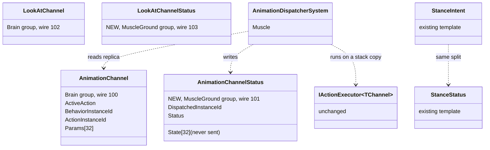
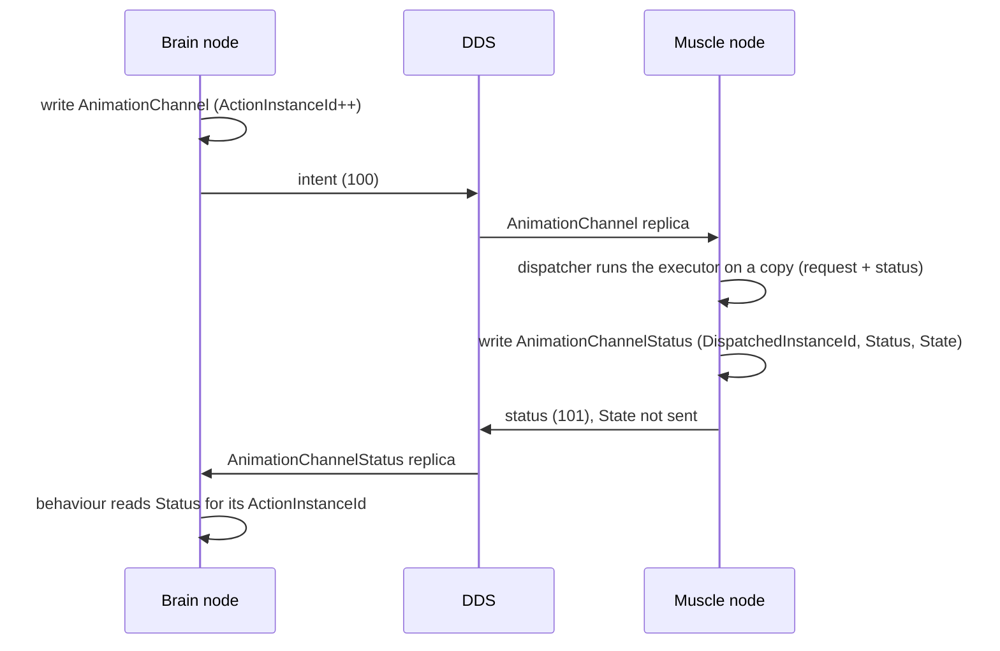
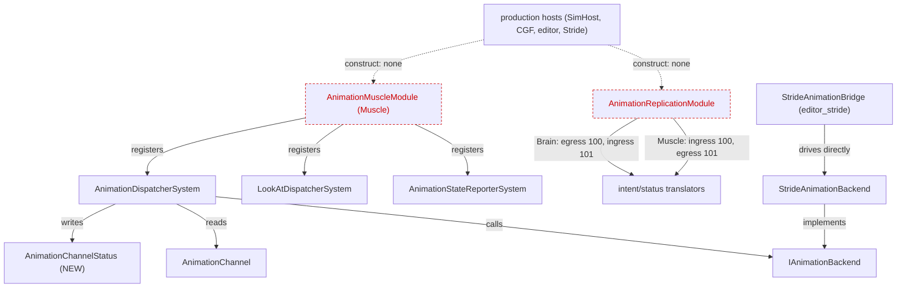

<!--STATUS
state: LIVE
updated: 2026-10-03
build-state: READY-TO-BUILD — all of §0 APPROVED by the user 2026-10-03 (R-180); nothing built yet.
current-answer: §0 (the APPROVED decisions, one row per sub-question); §3 the UML; §1b the measured Stride consequence (none).
stale-below: nothing
known-rot: docs/DESIGN_Ownership_Groups_And_Grants.md §5.10's first lean ("change IActionExecutor for every channel") was formed before §1's inventory — superseded by this question; §5.10 is updated to point here.
related-designs:
  - docs/DESIGN_Ownership_Groups_And_Grants.md — owns the ownership groups (R-172) and finding F-9; §5.10 points here for the decision.
  - .dev/_DONE/anim-ctrl/DD-1_MuscleCharacterRuntime_v1_2.md — owns the channel shape for animation (§5.1) and the dispatch handshake (§6.1, §13).
  - .dev/_DONE/anim-ctrl/DD-2_AnimationReplication_v1_1.md — owns the animation wire: intent/status as separate topics (§2.1) and the field-level ownership this question replaces (§7).
  - docs/designs/anim-ctrl/AnimationControl_BrainMuscle_MiniDesign_v0_3.md — owns StanceIntent/StanceStatus, the template proposed here (§2).
  - FDP/Docs/projects/behavior-control/DESIGN.md — owns the generic channel (§3.1, §11); it scoped network distribution OUT (§13), which is why one struct carries both directions.
  - docs/designs/navig-2/Navigation_Design_v2_0.md — owns the locomotion precedent (NavigationIntent/NavigationStatus, §4).
  - docs/DESIGN_Subsystem_Composition_Unification.md — owns B5 (the Muscle-side ActionDispatch executor set, :798), which sub-question C must stay compatible with.
-->

# Architect Question 80 — **who owns the animation channels, now that ownership is per component**

Tracker: [`CE-513 (backend)`](Blueprint_Issues_Tracker.md). Basis: R-172 (one owner group per component).

## 0. The decisions — ✅ **APPROVED** *(user, `2026-10-03`: "looks good. pls record." — ledger `R-180`)*

⭐ Every lean below (A–F) is now the decision. Build as a small standalone backend batch (F).

`AnimationChannel` and `LookAtChannel` carry a Brain half and a Muscle half in one component. DD-2 §7 made the
split **by field** (*"Channel intents (`AnimationChannel`, `LookAtChannel` …) are Brain-owned … Channel statuses
(`Status` …) are Muscle-owned"*). Ownership is now per component, so one component cannot be both.

| # | sub-question | ✅ decision | rejected (one fact each) | blast radius |
|---|---|---|---|---|
| **A** | what shape? | ⭐ **split each channel into the request (stays `AnimationChannel`/`LookAtChannel`, Brain group) + a NEW status component (`AnimationChannelStatus`/`LookAtChannelStatus`, MuscleGround group)** — the `StanceIntent`/`StanceStatus` shape the same file already uses | **A2** locomotion-style bridge (channel Brain-local, a Brain executor copies it to a new intent component) — adds a component and a system for nothing: the wire already splits exactly at the channel's field boundary (§1). **A3** keep field-level ownership — needs a per-field ownership engine; R-172 is per component | 2 new components, 2 ids, 4 group bits, the 4 status translators, 5 Muscle systems — all inside the two animation assemblies |
| **B** | does the generic executor contract `IActionExecutor<TChannel>` change? | ⭐ **no.** The Muscle's two dispatchers run executors on a stack copy (request from the replica + status from the status component) and write back ONLY the status component | **B2** change the contract to `(ref intent, ref status)` for every channel — touches 9 locomotion/weapon/interaction executors that have no defect (their channels never leave the Brain node, §1) | none outside animation |
| **C** | a rule for the other channels? | ⭐ **"a channel that crosses nodes is split; a node-local channel stays one struct."** Locomotion, weapon and interaction stay as they are. B5's Muscle executor set (Composition :798) must consume the cross-node components (`NavigationIntent`), never a replicated channel | a split of every channel now — no channel but these two crosses nodes | a sentence in two designs |
| **D** | who may clear the request / fail the action? | ⭐ **the Brain alone writes the request** (`ChannelArbitrationSystem` already clears it). The Muscle reports failure only through the status component (`Status = Failure`, bump `DispatchedInstanceId` — DD-1 §13); its teardown clear of `ActiveAction` is dropped (the dispatcher already tracks its own previous action for `OnExit`) | the Muscle keeps clearing `ActiveAction` — a write into a Brain-owned component | 2 lines in each dispatcher |
| **E** | where does `State[32]` go? | ⭐ **into the status component, never serialized** — it is Muscle-written executor scratch and the wire never carried it (`DdsAnimationChannelStatus` has `Status` + `DispatchedInstanceId` only) | leave it in the channel — the Muscle would still write the Brain's component | part of A |
| **F** | when? | ⭐ **a small standalone backend batch, not urgent.** Dormant today (no production host constructs `AnimationMuscleModule` or `AnimationReplicationModule`), self-contained, and four existing suites rail it | wait until animation replication is composed — the two-writer shape keeps being the example new channels copy | — |

## 1. INVENTORY *(codebase-memory `search_graph` + grep, `2026-10-03`)*

| query | total | what it found |
|---|---|---|
| `search_graph name_pattern=".*Channel$"` | 51 (5 components) | `LocomotionChannel`, `WeaponChannel`, `InteractionChannel` (`ChannelComponents.cs:8-51`) · `AnimationChannel`, `LookAtChannel` (`ReplicatedComponents.cs:39-96`) |
| `search_graph name_pattern=".*(Executor\|DispatcherSystem\|ActionDispatch.*)$" label=Class` | 36 | locomotion/weapon/interaction: 3 dispatchers + 9 executors under `ActionDispatchModule`; animation: 2 dispatchers + 8 executors (5 montage, 3 look-at) |
| `search_graph name_pattern=".*(Intent\|Status)$"` (components) | 13 | `NavigationIntent`/`NavigationStatus`, `StanceIntent`/`StanceStatus` — the two existing splits |
| grep `new ActionDispatchModule` (production) | 1 | `CgfLogicPack.cs:164` — the locomotion/weapon executors run on the **Brain** node |
| grep `AnimationMuscleModule(` / `AnimationReplicationModule(` (production) | 0 | dormant: tests only |
| grep `<AnimationChannel>`/`<LookAtChannel>`/`typeof(...)` outside the two animation assemblies | 0 | no generic Brain-side code reads them (blueprint `WaitForChannel`, arbitration: none) |
| `HrotOwnershipGroups.cs:56-68` | — | `StanceIntent`, `AnimationMontageQueue` → Brain; `StanceStatus`, `AnimationMontageQueueState` → MuscleGround; **the two channels: in no group** |

⚠ `check_index_coverage` was not run for §1's rows (graph connected intermittently); every absence above is backed by grep over `Hrot/ FDP/ Stride/`.

### 1b. Stride consequence — ✅ **NONE**, measured `2026-10-03` *(user: "make sure you measured the consequence to the stride application")*

| check | result |
|---|---|
| `search_code` (graph) over `^Stride/` for `AnimationChannel\|LookAtChannel\|AnimationDispatcherSystem\|LookAtDispatcherSystem\|AnimationMuscleModule\|AnimationReplicationModule\|AnimationStateReporterSystem\|MontageQueueAdvanceSystem\|AnimationCapabilityChangeReactorSystem\|PlayMontageExecutor\|LookAtPointExecutor\|DispatchedInstanceId` | 0 files |
| grep, same names + `AnimationExecutorState\|LookAtExecutorState\|IActionExecutor`, `Stride/**/*.cs` | 1 file — `StrideAnimationBridge.cs:16`, a **doc comment** (the graph text search missed it) |
| `search_graph query="animation channel montage look at dispatcher" file_pattern=Stride/*` | 157 hits, all the Stride **backend** side (`StrideAnimationBackend`, `StrideAnimationBridge`, `PerEntityBlendTreeBuilder` + tests) — none touch a channel |
| what Stride actually does | `StrideAnimationBridge` drives `StrideAnimationBackend` straight from `SimTransform`/`SimVelocity`, identifying entities by `TkbIdentity`; it states editor_stride runs none of the Muscle animation pipeline (`StrideAnimationBridge.cs:11-18`) |
| the seam between them | `IAnimationBackend` (`Hrot.MuscleCharacter.Animation/Contracts/IAnimationBackend.cs`) has **no channel, status or `NodeStatus` type** in its surface ⇒ the split sits ABOVE the backend; `StrideAnimationBackend` is untouched |
| stance | `BulletCharacterMotor.cs:21-71` mentions `StanceStatus` in comments only; stance is unchanged by this decision anyway |
| `check_index_coverage` on `Stride/Hrot.Stride.Animation`, `HrotStrideApp.Game`, `Hrot.Stride.Core`, `HrotStrideApp.Windows` | no gaps except excluded `bin/obj` and one `parse_partial` line in `FdpNavigationOrders.cs:89` (not animation) — best-effort, not proof |

⇒ the build touches no Stride file. ⚠ A Stride Muscle node that later composes `AnimationMuscleModule` gets the split for free, because the dispatchers are where it lands.

## 2. Claim table

| the leans rest on | code — how it IS | design — how it was MEANT to be |
|---|---|---|
| the Muscle writes the channel | ✅ `AnimationDispatcherSystem.cs:60-94`, `AnimationStateReporterSystem.cs:43-62`, `AnimationCapabilityChangeReactorSystem.cs:83,118`, `MontageQueueAdvanceSystem.cs:56` | ✅ DD-2 §7: statuses Muscle-owned, by field |
| the wire already splits at the field boundary | ✅ `AnimationDdsMessages.cs:15-54` — intent: action, instance ids, params; status: `Status`, `DispatchedInstanceId` | ✅ DD-2 §2.1 *"intent and status are strictly directional"* |
| stance is the template | ✅ `StanceTransitionSystem.cs:44-62` writes only `StanceStatus` (`AckVersion` = the handshake) | ✅ MiniDesign v0.3 §2 *"following the `NavigationIntent` / `NavigationStatus` precedent"* |
| locomotion channels never leave the Brain node | ✅ `CgfLogicPack.cs:164`; `MoveToExecutor.cs:68-122` bridges to `NavigationStatus` | ✅ MOD1-DESIGN.md:993 (`LocomotionChannel` → `NavigationIntent`) |
| one struct was never meant for two nodes | — | ✅ behavior-control DESIGN §13: *"Network distribution (DDS replication per-component ownership split)"* out of scope |
| no ruling already splits channel components | — | ⛔ searched `docs/` + `.dev/` (incl. all `Architect_Question_*_ANSWERS.md`), none found |
| B5's Muscle executor set is compatible with C | ⛔ not built | ⚠ Composition :798 says only *"Muscle (local actuator)"* — what its executors consume is not specified; C's lean constrains it |

## 3. The proposed shape *(build-state: DESIGN)*

*What the picture shows that prose hid:* every box keeps one writer, and the executor contract is untouched — only the dispatcher learns where the two halves live.

### 3.1 Module — who registers what *(and what nothing runs today)*

*What the picture shows that prose hid:* no production host constructs either animation module (dashed, red), so the split is dormant by construction; and Stride reaches the backend through its own bridge, never through the dispatchers this decision changes.

## 4. Design docs checked

| doc | verdict |
|---|---|
| DD-2 §7 | applies — the field-level split this replaces |
| DD-1 §5.1 / §6.1 / §13 | applies — the shape, the handshake, the capability-loss failure path (kept, moved to the status component) |
| AnimationControl MiniDesign v0.3 §2 | applies — the stance template |
| behavior-control DESIGN §3.1, §11, §13 | applies — why one struct: the component limit, and networking was out of scope |
| Navigation_Design_v2_0 §4 | applies — the locomotion precedent |
| Composition Unification :798 (B5) | applies to C only |
| Architect_Question_74 (channel lifecycle) | does not apply — blueprint claim/arbitration, not ownership |
| eyes-and-muscle DESIGN, Unified_Behaviour_Run, Behavior_Action_Binding | do not apply — no channel ownership content |
