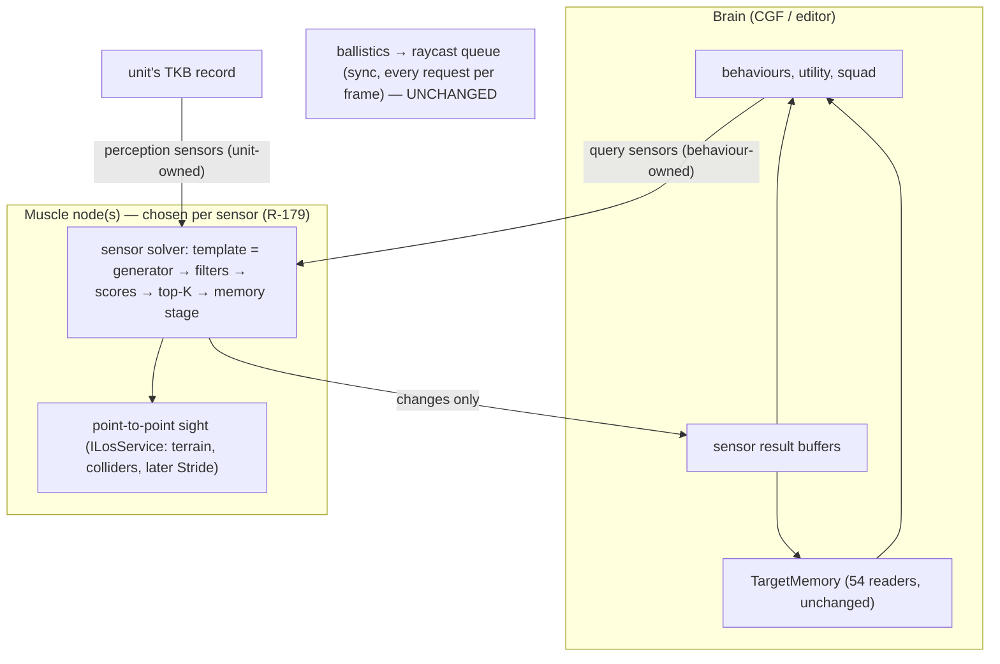

<!--STATUS
state: LIVE
updated: 2026-10-04
build-state: DESIGN — ✅ A–L APPROVED (user, 2026-10-04); M, N open with leans. Nothing is built yet — the WHAT goes into a DESIGN doc with UML first.
current-answer: §0 (the proposal), §3 (the sub-questions; A–L approved), §4 (M, N — open).
stale-below: nothing — new document.
known-rot: nothing yet.
related-designs:
  - docs/designs/eqs-2/EQS_Design_v1.3_final.md — owns the EQS sensor form this proposes to reuse (§2 the sensor, §7 the solver and its budget bands, §17.6 child sensors, §19 terrain sight); G changes §7.5–7.6's wall-clock slicing.
  - docs/designs/modularizing/MOD1-DESIGN.md — §3.6.2 owns the only multi-sensor design (per-modality receptors merged into TargetMemory); unbuilt. This question replaces its receptor-component shape and keeps its TargetMemory merge.
  - docs/DESIGN_Terrain_World.md — owns the terrain sight (SegmentBlocked) and TerrainWorldLosStrategy the sensors call.
  - docs/DESIGN_Subsystem_Composition_Unification.md — §4.1ab owns CE-210 (the 3-D LOS seam, Stride raycasts); A1 here is its point-to-point primitive.
  - docs/HROT-Engine-Guide/HROT-Engine-Guide.md — §12.1 states the perception / EQS responsibility split this keeps; its "multi-modal" claim (§12) overstates what is built.
-->

# Architect Question 82 — **one sensor form for perception and EQS?**

> ✅ **APPROVED `2026-10-04`** — 🔒 user, verbatim: *"Approved, all leans A–L."* (ledger `R-185`)

Tracker: [`CE-3033`](Blueprint_Issues_Tracker.md). Raised from the `2026-10-04` discussion; 🔒 user: *"Isnt the eqs and sensor
differing just in the responsibilities, not in the form? … Cant the smart sensors reuse the eqs shape as is?"* ·
*"Raycasts still need to be batched and deterministic as they are used by ballistics."*

## 0. The proposal *(the summary the user asked for, `2026-10-04`)*

*What the picture shows that prose hid:* there is ONE solver path for both kinds of sensor; the two differ only in who creates
them and which template they run. The raycast queue ballistics uses sits outside it.

| layer | rule |
|---|---|
| point-to-point sight | ⭐ the one primitive the AI never calls directly: `ILosService` (3-D, heights applied by the caller); terrain world, colliders, later Stride raycasts (`CE-210`). ⛔ Sensors never use the ballistics raycast queue |
| the sensor form | ⭐ an EQS-form child entity: template → Muscle solver → ranked, filtered results → Brain buffer. **Query sensors** (cover, flank, …) are behaviour-owned; **perception sensors** (visual now, thermal / radar / acoustic later) are unit-owned, created from the TKB |
| what the form gains | capability parameters (TKB) · a memory stage (acquired / lost / remembered, plus push stimuli) · full sight (terrain + moving units) for perception · changes-only wire |
| the Brain's picture | `TargetMemory` stays, fed from perception sensors ⇒ its 54 production readers are untouched |
| performance | ⛔ no dropping cap, ⛔ no wall-clock slicing; a deterministic per-tick budget (G), priority bands, every result carries its age, scale-out across Muscle nodes (R-179) |
| migration | visual perception MOVES onto the form (no second implementation, ruling 9); its suites stay green |
| out of scope | partial visibility, camouflage, lighting — later TESTS inside sensing templates, no change to the form |

## 1. INVENTORY *(measured `2026-10-04`)*

| query | result |
|---|---|
| `search_graph name_pattern=".*Eqs.*" label=Class` | 119 (incl. tests); 7 `[EqsTemplate]`-carrying types after `CE-3030` |
| perception systems (`FDP/Toolkits/Fdp.Toolkits/Perception/Systems/`) | 7 — `LocalGridBuilder`, `VisionBroadphase`, `LosRequestBatching`, `SensorTrackDebounce`, `ActiveSensorTracksUpdate`, `ThreatEvaluation`, `AudioPerception` |
| sensor-capability descriptor | 1 — `SensorCapabilitiesDto` (vision / hearing range, FOV, three eye heights); no spectrum, optics, or sensor list |
| production files reading `TargetMemory` / `SensorContactList`+`ActiveSensorTracks` | 54 / 19 (grep) |
| files carrying `SensorTrackStateEvent` / `LosCheckRequestEvent` | 9 production |
| raycast queue users | `BallisticsSystem`, BTree `Action_QueryRaycast`, EQS `AccurateLineOfSightTest` |
| a design owning perception as a whole | ⛔ searched `docs/` + `.dev/` by content, none found (MOD1 §3.6 is the only multi-sensor section) |

## 2. Claim table

| the proposal rests on | code — how it IS | design — how it was MEANT |
|---|---|---|
| both run on the Muscle, background, 10 Hz | ✅ `EqsModule.cs:33`, `CognitiveSpatialModule.cs:18` | ✅ EQS §7.1 |
| both cap results at 16 | ✅ `EqsResultPool.MaxTopK`, `PerceptionConstants.cs:11` | ✅ EQS §4.3 |
| a visual sensor already fits the template shape | ✅ `FindThreatsInView` = entities in radius + force + alive + LOS (`StarterTemplates.cs`) | ✅ EQS §6.6 #3 |
| perception has memory between runs; EQS has none | ✅ `SensorTrackDebounceSystem.cs:40` (2 s) | ⛔ searched, no design of a stateful EQS stage |
| perception sends changes, EQS snapshots | ✅ `PerceptionEvents.cs:125-147` vs `EqsResultEvent` | ✅ EQS §3.2 (publish policies) |
| ballistics' raycasts are sync, per frame, deterministic, outside both | ✅ `CombatModule.cs:34-37`, `RaycastSolverSystem.cs:44` | ⛔ searched, no design names this invariant — §3 H records it |
| perception today has NO cap and blacks out on overrun | ✅ `ExecutionPolicy.cs:86-88` (100 ms, 5 failures, 10 s), `ModuleHostKernel.cs:850` | ⛔ none — filed `CE-3032` |
| EQS slices by wall clock | ✅ `EqsSolverSystem.cs` `QueryTimeSliced(..., WallClockTime)` | ✅ EQS §7.6 |
| `TargetMemory` is the AI's one picture | ✅ 54 readers | ✅ MOD1 §3.6.2 (modalities OR-merged into it) |

## 3. Sub-questions — each with a lean (K, L added `2026-10-04`) *(reply "approved" or name the one to change)*

| # | question | ⭐ lean | why / blast radius |
|---|---|---|---|
| **A** | capability parameters: a fixed block on the sensor, or a per-kind payload? | ⭐ **per-kind payload, TKB-defined** — `SensorCapabilitiesDto` grows a LIST of sensors, each `{kind, range, fov, spectrum, …}`; the sensing template of that kind reads its own fields | a fixed block is the 2-D-API mistake again (`CE-210` ③) — the next sensor kind breaks it. Blast: TKB schema + `PerceptionTkbTranslator` |
| **B** | where the memory stage runs | ⭐ **Muscle, after scoring, before the wire** — the Muscle sees every evaluation, so it can debounce (as `SensorTrackDebounceSystem` does today) and send only transitions | Brain-side memory would need every snapshot sent. Blast: a stateful stage in the solver (it already keeps `SensorEvalState`) |
| **C** | perception sensors: child entities, or on the unit itself? | ⭐ **child entities**, created on the MUSCLE from the TKB (no Brain→Muscle config sample for them) | one shape, one lifetime model; Muscle-created avoids a config descriptor per unit per sensor. Cost: N units × k sensors entities — measured cheap (a carrier is 3 components) |
| **D** | how `TargetMemory` is fed | ⭐ unchanged contract: the perception results' transitions feed `ActiveSensorTracks` → `TargetMemory` exactly as `SensorTrackState` does now | its 54 readers do not move. Blast: the ingress only |
| **E** | push stimuli (a shot heard, being hit) | ⭐ **inputs to the memory stage** of the sensor of that kind (acoustic), not a poll | a generator cannot represent "it happened"; `AudioPerceptionSystem` is the measured case |
| **F** | sight for perception templates | ⭐ the full entity-to-entity rule (terrain + moving colliders, eye → aim, as `TerrainWorldLosStrategy`), run SYNCHRONOUSLY in the sensor batch; ⛔ never the raycast queue | keeps ballistics' queue untouched (H) and today's semantics |
| **G** | scheduling under load *(user, `2026-10-04`: "what if some sensor is way more demanding than others?")* | ⭐ **a per-tick budget in deterministic COST UNITS, not sensors and not milliseconds.** Each evaluation counts the work it actually did — candidates generated, sight checks, path queries, each with a fixed weight — and the tick stops dispatching new sensors when the budget is spent. A heavy sensor uses more of the tick, so fewer others run in it; a single sensor over the whole budget still completes (it then runs alone). Order = priority band, then oldest result first. Every result carries its age. | ⛔ a sensor COUNT treats a 200-candidate thermal sweep like a 4-point offset query; ⛔ milliseconds are not deterministic. Counted work is both proportional and repeatable. Blast: EQS §7.5–7.6 and the solver loop |
| **H** | the ballistics raycast queue | ⭐ **unchanged and outside the sensor budget** — sync, every request per frame, deterministic; recorded here as an invariant | user requirement; nothing in the proposal needs it to move |
| **I** | migration order | ⭐ ① the form gains A–C + the memory stage, proven by a NEW sensor kind in tests only → ② visual perception moves onto it behind its existing suites, old systems deleted in the same change → ③ thermal / acoustic as templates | ⛔ never two live visual pipelines (ruling 9). 🔒 Old replays: **irrelevant** (user, `2026-10-04`) — no converter |
| **K** | how the BRAIN represents a sensor the Muscle created from the TKB *(user, `2026-10-04`)* | ⭐ **the same TKB translator creates the sensor child on EVERY node, deterministically from the TKB list** — on the Muscle with its solver config, on the Brain with a result buffer and its `SensorKind`. Both sides derive the same part id from the sensor's index in the TKB list, so the existing result key `(parent net id, part id)` matches with **no config crossing the wire**. Part ids `1000 + index` are reserved for TKB sensors so behaviour-spawned children (allocated from 1) never collide | the existing child-sensor key and result ingress work unchanged; ⛔ no new "sensor announced" message. Blast: the TKB translator, the part-id allocator (skip the reserved range) |
| **L** | how game AI finds and reads them *(user, `2026-10-04`)* | ⭐ **two levels.** ① The FUSED picture stays `TargetMemory` — what most AI reads (threats, last known positions, which modalities saw each target); unchanged API. ② A specific sensor's own ranked results through one lookup, `Sensors.Of(unit, SensorKind.Thermal)` → its result buffer (the reader API EQS already has: `IsReady`, `GetTop`, `GetRanked`, `IsFresh`) — plus a blueprint/BTree "read sensor" node keyed by kind, beside the existing `ReadEqsResult` | ⛔ AI never enumerates children or knows part ids. Blast: one lookup helper + one node |
| **J** | the overrun blackout today (`CE-3032`) | ⭐ fix independently now (perception must not overrun into the circuit breaker) — G removes the cause later | a live defect, not a design question |

⛔ **Not asked:** partial visibility, camouflage, lighting, thermal signatures — they are tests inside a sensing template and do
not change the form; each will get its own design when wanted.

## 4. Follow-up sub-questions *(user, `2026-10-04`)* — OPEN, with leans

> 🔒 *"Will the behavior be able to create sensors of any type on demand, not just from tkb? How Could we enable/disable sensors
> created automatically from tkb if entity does not need them (from behaviors for example), to save performance?"*

| # | question | ⭐ lean | why / blast radius |
|---|---|---|---|
| **M** | can a behaviour create a sensor of ANY kind on demand? | ⭐ **yes — through the existing behaviour-owned child-sensor path** (`SpawnEqsSensor` / `EqsChildSensor`), with any template, query or sensing. ⚠ **One rule: a SENSING sensor is bounded by the unit's TKB capability of that kind** — a behaviour can point the unit's thermal sight somewhere, narrow it, re-prioritise it, but cannot give a rifleman thermal vision he does not have; a kind the unit's TKB does not list is refused at spawn (loudly). Its results go to its own buffer AND, being the unit perceiving, into `TargetMemory` with its modality | query sensors are already free-form; capability bounds are what keeps the simulation honest. Blast: a spawn-time capability check, the memory-stage feed for behaviour-owned sensing children |
| **N** | enabling / disabling the TKB-created sensors | ⭐ **reuse `EqsSensor.Suspended` (CE-486): a suspended sensor costs NOTHING** — the solver skips it and drops its evaluation state. The switch crosses the wire as ONE small Brain-owned per-unit field (a bitmask: which TKB sensors are on — K sends no per-sensor config, so this is the only thing that must). Default per sensor from the TKB (`enabledByDefault`). ⭐ **A behaviour's disable is behaviour-owned** (as behaviour-owned parts, CE-485): it lasts while that behaviour run lives and reverts to the TKB default when the run ends or faults — so a unit can never stay blind because a behaviour forgot. ⭐ **Push stimuli (E) still arrive while a sensor is off** — being hit or hearing a shot reaches `TargetMemory`, so the AI can react and re-enable | Blast: one replicated per-unit field + the Muscle applying it to the carriers' `Suspended`; a behaviour-owned "sensor override" like the existing parts |

