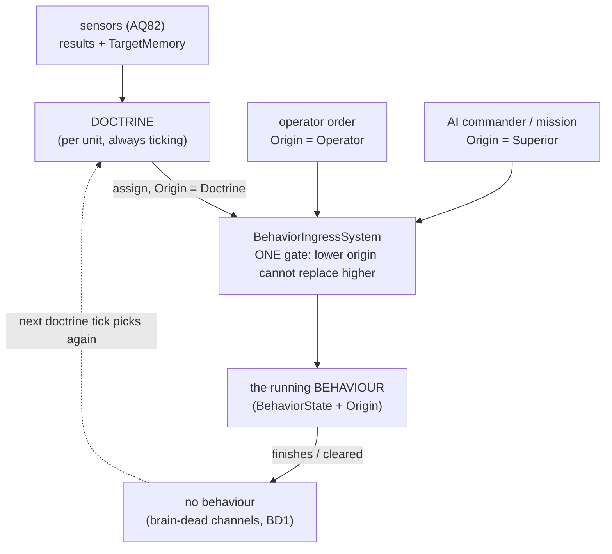

<!--STATUS
state: LIVE
updated: 2026-10-04
current-answer: §3 (A–F APPROVED) and §4 (G APPROVED — the doctrine is a second behaviour slot, any tier). Design: docs/DESIGN_Sensors_And_Doctrine.md
stale-below: nothing yet
known-rot: "doctrine" is RENAMED "SOP" (R-198, user 2026-10-04) — read every doctrine as SOP; planned identifiers become SopState / AssignSopEvent / ClearSopEvent / DefaultSop {Name, ParamsJson}; the SOP model (task · SOP · reaction, R-199) lives in docs/DESIGN_Decision_Layer.md §4.
known-conflict: none
related-designs:
  - docs/DESIGN_Sensors_And_Doctrine.md — the DESIGN (UML, build plan) that builds these rulings.
  - docs/blueprints/Architect_Question_82_One_Sensor_Form.md — OWNS the sensors and their results the doctrine reads (L: `Sensors.Of`, read-sensor node; N′: sensors default ON because a threat is what starts a behaviour).
  - docs/designs/brain-death/BD1-DESIGN.md — OWNS brain death: a finished behaviour resets the channels; this adds WHO picks the next one.
  - docs/blueprints/Architect_Question_77_Blueprint_As_A_Behaviour.md — OWNS Instance vs Behaviour blueprints (attached + lifecycle-free vs assigned + start/finish/preempt).
  - docs/blueprints/Architect_Question_33_Blueprint_Brain_Tier.md — OWNS tier composition ("strategical HSM on top with tactical BTree or blueprint under it").
  - docs/designs/utility-ai/Utility_AI_Design_v1_1.md — OWNS scoring; §7 "a selector primitive the existing systems call into", §10.4 "assignment as one input, not an order".
  - docs/designs/group-maneuvers/Squad_Coordination_Design_v1_1.md — §8.0 "The scorer is the autonomous default; orders win when present" (the commander precedent for D).
  - docs/UX/UX_Feature_Entity_Commanding.md — OWNS operator orders (InstanceId as the preemption token).
  - docs/blueprints/batches/FRAME_Eqs_Consuming_Behaviours.md — the behaviours lane's EQS-consuming behaviours; a doctrine is what would assign them.
-->

# Architect Question 83 — the DOCTRINE (autonomy) and the ORIGIN of a behaviour

> 🔒 **User, `2026-10-04`:** *"Just now the unit is brain dead if there is no behavior. For absolute control we probably want to
> have the brain dead state on the entity. So 'autonomous' entity would still need to run some decision logic what behavior to run
> based on what sensor results."* · *"Cant the doctrine stay listening while other behavior still runs so it is able to switch to
> other if necessary, because needed by the main mission the autonomous entity has? That sounds like close to goal oriented."* ·
> *"How to recognize Order-invoked behavior (user ruled, disables the autonomy) from doctrine invoked one (retains the autonomy)?"*
> · on A–F: ✅ *"Approved with your leans."* · then: *"blueprint doctrine is one option, the most flexible one. Couldn't btrees or
> hsms be used as a doctrine? Would it bring some benefits?"*

## 0. The shape

*What the picture shows that prose hides:* the doctrine is not the behaviour — it sits BESIDE it and keeps ticking, so when an
order ends the unit falls back to autonomy, not to brain death; and the origin rule lives in the ingress, the one place every start
already passes through.

## 1. INVENTORY *(measured `2026-10-04`)*

| query | total | what it found |
|---|---|---|
| `search_graph name_pattern=".*Doctrine.*"` | 2 | a hill-attack test and an AQ78 section — ⛔ no doctrine concept in code |
| `search_graph name_pattern=".*Autonom.*"` | 106 | `AutonomousPerceptionModule` (perception) and agent-guide prose — ⛔ no autonomy decision layer |
| `search_graph name_pattern=".*BehaviorRunner.*"` | 4 | `IBehaviorRunner` + `BehaviorRunners.For(brainTier)` — ⭐ BTree / HSM / Blueprint runners behind ONE interface |
| `search_graph name_pattern=".*BehaviorState.*"` | 18 | ONE `BehaviorState` per entity (one behaviour slot) |
| `search_graph name_pattern=".*Origin.*"` | 263 | geometry / UI origins — ⛔ no behaviour origin |
| grep assign/clear event fields | — | `AssignBehaviorEvent {Entity, BehaviorName, JsonParams}` · `AssignBehaviorHashEvent {Entity, BehaviorHash}` · `ClearBehaviorEvent {Entity}` · `AssignTacticalIntentEvent {Entity, IntentId, JsonParams}` — ⛔ no origin |

⚠ `check_index_coverage` is not available through the CLI — the absence claims above rest on the graph plus grep, not on a
coverage check.

## 2. Claim table

| claim | code — how it IS | design — how it was MEANT |
|---|---|---|
| no behaviour ⇒ nothing decides | ✅ `BrainTickSystem.cs:167` skips an entity with no definition | ✅ BD1 §1.0b *"No explicit `Idle` task"* |
| nothing records who started a behaviour | ✅ the four event structs above | ✅ Entity Commanding: hash · `InstanceId++` · tier only |
| every start passes one place | ✅ `BehaviorIngressSystem.Start` (assign by name / hash; the mission director publishes hash events) | ⛔ searched; no design names it as the gate |
| an Instance blueprint ticks beside the behaviour | ✅ `BlueprintTickSystem`; `BrainTickSystem.cs:44` excludes it | ✅ AQ77 §3 A |
| an Instance blueprint can start a behaviour | ✅ `SendIntent` → `TacticalIntentResolutionSystem.cs:86` → `AssignBehaviorEvent` | ✅ Engine Guide §11.6 |
| the runners are slot-agnostic | ✅ `IBehaviorRunner.Tick(ref BehaviorRunContext …)` — context carries `Self`, `InstanceId`, `OccurrenceKey`; nothing reads `BehaviorState` | ⛔ searched; not designed as such |
| `Idle` = hold | ✅ `CuratedMachines.cs:34` one state, no transitions | ✅ Entity Commanding maps `Idle` to `Stop` |
| nothing interrupts a running behaviour on a threat | ✅ `ObserverSelector` = plain selector (`Interpreter.cs:267`); only HSM interrupt is MobilityLost | ✅ When design §1 *"uniformly polling-based"* |

## 3. Sub-questions — ✅ A–F APPROVED `2026-10-04` (*"Approved with your leans."*)

| # | question | ✅ approved answer |
|---|---|---|
| **A** | where autonomy lives | a **DOCTRINE** per unit, BESIDE the behaviour, ticking always — it switches its own behaviours whenever its goal needs it (goal-oriented). No doctrine ⇒ brain-dead = absolute control |
| **B** | default | the TKB names a default doctrine per entity type (Engine Guide §11.6 *"born with its doctrine"*); a scenario overrides per instance; detach for permanent manual control |
| **C** | how a behaviour knows who started it | an **`Origin`** on every assign / clear event (`Operator`, `Superior`, `Doctrine`), copied by the ingress onto the running behaviour |
| **D** | the rule | **one gate, in `BehaviorIngressSystem`: an assignment cannot replace a running behaviour of HIGHER origin** — `Operator > Superior > Doctrine`. ⭐ A doctrine author cannot forget it. ✅ **A superior's order outranks the doctrine** (a soldier told to hold does not wander off to flank) |
| **E** | what ends an override | the ordered behaviour finishing or being cleared ⇒ nothing outranks the doctrine ⇒ its next tick picks again. **Hold** = the operator orders `Idle` (never ends) |
| **F** | the gaps to build | the AQ82 read-sensor node + `Sensors.Of`; `TargetMemory` accessors (top threat, count above score); hit / shot-heard as blueprint-visible events (`TargetVisibleEvent` is catalogued but reported never to reach the main bus — **verify**); the `Origin` field + gate; verify the `When` EQS modes are live (design banner calls them stubs) |

⏳ **Later, not now:** a superior's order as a GOAL the doctrine pursues rather than a behaviour it obeys (Utility §10.4).

**Rejected:** a top-level HSM *behaviour* as the decider (an order replaces it ⇒ brain-dead after) · mission-director triggers
(fixed phase list) · a new C# autonomy system (Utility §7: decisions are a primitive the hosts call) · utility AI as the host
(a scorer) · a yes/no "ordered" flag (cannot protect a superior's order) · an order detaching the doctrine · each doctrine checking
origin itself · a separate autonomy on/off mode.

## 4. G — what can HOST a doctrine — ✅ APPROVED `2026-10-04` (🔒 *"G approved, go with the design doc"*)

| # | question | ⭐ lean | why / blast radius |
|---|---|---|---|
| **G** | blueprint only, or BTree / HSM too? | ⭐ **any tier: the doctrine is a SECOND behaviour SLOT** (`DoctrineState {Hash, BrainTier, InstanceId}`), ticked by the SAME three runners (`BehaviorRunners.For(tier)`) under its own occurrence key. ⚠ **This amends A's first sketch** (an *Instance* blueprint): a blueprint doctrine becomes a `Behavior`-kind blueprint in the doctrine slot | ⭐ the runners already take everything through `BehaviorRunContext` ⇒ the slot is mostly a component + a tick loop. ⭐ Every tier gets a lifecycle (start / finish / fault, `CE-449`), latent waits, and the existing debugger. Blast: the occurrence key must include the slot (today `ComputeRootStateKey(ActiveBehaviorHash)` — the same asset in both slots would collide); an "assign behaviour to self, Origin = Doctrine" action for BTree / HSM (prior art: `CommanderNodes.cs:80` publishes intents to subordinates) |

| what each tier brings as a doctrine | |
|---|---|
| **HSM** | explicit MODES (patrol / engaged / withdraw) with hysteresis; the current mode is visible in the debugger; matches AQ33 *"strategical HSM on top"* |
| **BTree** | a priority list re-evaluated from the root every tick — the classic reactive "if threatened → cover, else if goal → advance"; cheapest; no latent leaves needed since a doctrine leaf only assigns |
| **Blueprint** | most flexible — events, `When` on sensor results, utility scoring inline |

**Rejected for G:** Instance blueprint only (no lifecycle, cannot wait in Event graphs — BP1658, one tier for a job three can do) ·
an Instance blueprint hosting a BTree / HSM (BP1659 forbids it, and it would be a fourth runner path) · a doctrine as a BTree
subtree inside every behaviour (an order replaces it).
