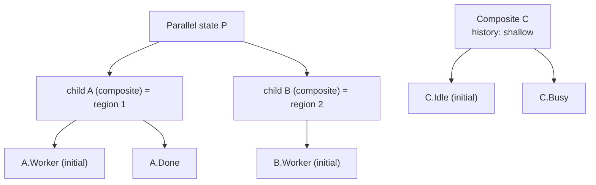
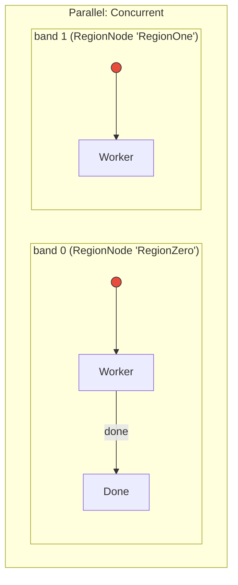
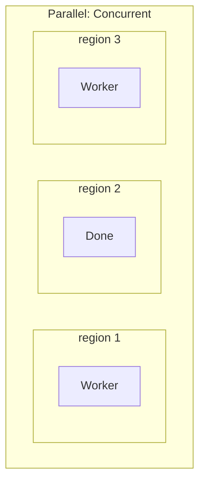
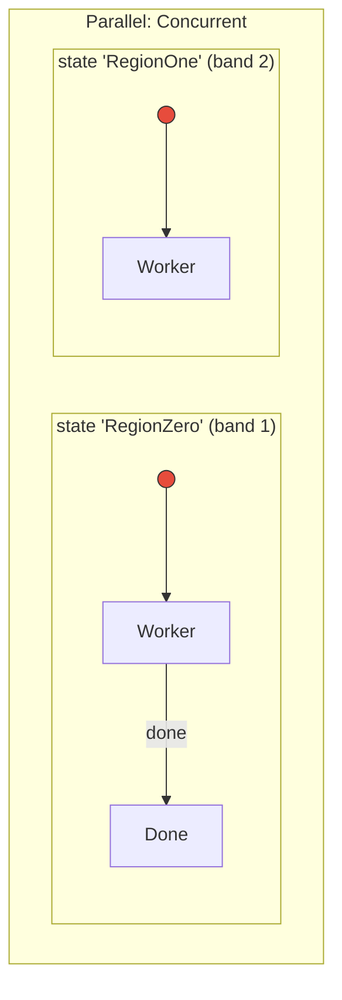

<!--STATUS
state: LIVE
updated: 2026-10-06 (all answered)
current-answer: §6 — ALL DECIDED 2026-10-06: A0 (regions stay as designed; fix compiler + emitter), B (region's
  InitialChild for parallel, child IsInitial for plain composite; circle + arrow, incl. top level), C1 (history on the
  composite), D1 (migrate HsmShowcase.HistoryPseudo). §0-§3 superseded where §6 says so.
stale-below: nothing
known-rot: none
known-conflict: HSM_Editor_NodeEditor_Host_Design.md §6.2 (regions as editor objects holding several states) and §8.2
  (history as a separate pseudo-state node, "Option B") — both contradict the kernel; this question proposes superseding them.
related-designs:
  - DESIGN_Hsm_Canvas_Authoring.md — owns canvas geometry and gestures; its slice S4 (drag the initial marker) waits on this.
  - HSM_Editor_NodeEditor_Host_Design.md — owns the HSM editor model; §6.2 and §8.2 are what this question would supersede.
  - Hsm_Issues_Tracker.md — HSM-001, -002, -003, -005, -010 are the symptoms this question resolves.
  - docs/projects/FDP/ExtDeps/FastHSM/Fhsm.Compiler.md — owns the kernel's builder semantics (`.History()` on the composite).
-->

# Architect Question 84 — what a parallel REGION is, who owns "INITIAL", and what HISTORY is (HSM editor model)

## 0. Why this exists, and a retraction

On `2026-10-06` I proposed, and the user approved, *"each region's `InitialChild` becomes the single source of truth"*
for HSM-003. ⛔ **Measured afterwards, that lean was built on a false premise.** The FastHSM kernel has **no region that
holds several states**: every **child of a parallel state IS a region**, and all of them are entered at once.

| claim | code — how it IS | design — how it was MEANT |
|---|---|---|
| each child of a parallel state is its own region | ✅ `HsmFlattener.cs:381-394` — one `RegionDef` per child, `InitialStateIndex = child` | ✅ `HsmGraphValidator.cs:343` *"Parallel states implicitly enter all children"* |
| the editor's `RegionNode` reaches the kernel | ⛔ only as layout metadata — `HsmEmitCore.cs:684` emits `.Region(...)` into the layout method; the structure is emitted from `.Parallel()` + `.Initial()` per child | ⛔ searched `docs/` + `.dev/`: no design maps an editor region to kernel structure |
| "initial" reaches the kernel | ✅ only via the child's `IsInitial` → `.Initial()` (`HsmEmitCore.cs:780`); `RegionNode.InitialChild` is never emitted | — |
| history is a flag on the composite being re-entered | ✅ `HsmKernelCore.cs:846` saves on exit, `:877` restores on entry of the state carrying `IsHistory` | ✅ `Fhsm.Compiler.md` §Example 3 `.State("Engaging").History()` |

📌 **A live case:** `HsmCuratedBindingDemo.hsm.json` draws a parallel state `Concurrent` with **two** regions —
`RegionZero` (Worker → Done) and `RegionOne` (Worker). The kernel builds **three** regions (`RegionZeroWorker`,
`RegionOneWorker`, `RegionZeroDone`), all active at once. ⇒ the editor shows a machine the runtime does not run.
No test runs this asset (grep: no C# reference).

## 1. INVENTORY *(measured `2026-10-06`)*

| query | result |
|---|---|
| grep `RegionNode\b\|RegionNodes\|RegionIndex` (non-test `.cs`) | **32 files** — 12 generic NodeEditor (container regions), **20 HSM/persistence/emit/debug-API** |
| same, test files | **37 files** |
| writers of `IsInitial` / `.InitialChild` (non-test) | `IsInitial`: projector, mapper (load), new-asset service, facet `Flags` checkbox · `InitialChild`: projector, mapper, `HsmFacetDispatcher:259` — ⛔ **nothing keeps the two in step** |
| `*.hsm.json` in the repo | **10** assets · 3 with a parallel state · **1** with a multi-state region (`HsmCuratedBindingDemo`) · **1** with a history pseudo-node (`HsmShowcase.HistoryPseudo`) |
| `HsmNodeCatalog` | still offers `History State` + `Deep History State` |
| `HsmValidator.CheckInitialChildren` (`:115`) | counts `IsInitial` over ALL children, parallel or not ⇒ HSM-001 (correct parallel = error), HSM-002 (region without initial = clean) |
| `HsmCommandSink.ApplyRemoveRegion` (`:359`) | re-indexes regions, not the children of later regions ⇒ HSM-005 |

⚠ The CLI path has no `check_index_coverage`; the counts are graph + grep.

## 2. The shape, if the leans are taken

> ⛔ **SUPERSEDED by §6** — picture ③ / lean A1 is withdrawn; ① is the designed model, ② is the compiler defect.

*What the picture shows:* there is no separate "region" object — a lane on the canvas **is** a child state of the parallel
state, and "initial" and "history" are properties of a composite. One model, the kernel's.

## 2a. One example, three pictures — `HsmCuratedBindingDemo`

> ⛔ **SUPERSEDED by §6** — picture ③ / lean A1 is withdrawn; ① is the designed model, ② is the compiler defect.

**① What the editor DRAWS today** — a parallel state split into two bands; band 0 holds two states in sequence.

**② What the runtime RUNS today** — the band objects never reach it; it sees three children of a parallel state,
so it makes **three** regions and runs all three at once. `Done` is active from the start.

**③ The lean (A1)** — each band IS a child state of the parallel state (`RegionZero`, `RegionOne`). The sequence lives
INSIDE that child, with its own start circle. The editor draws exactly what the runtime runs.

*What the three pictures show:* ① and ③ look the same on the canvas — the difference is what a band IS. In ① it is an
editor-only object the runtime never sees (hence ②); in ③ it is an ordinary state, so the runtime builds the same
machine the author drew.

## 3. Sub-questions, each with a recommended answer

### A — What is a parallel region in the editor?
- **A1 ⭐ (lean)** Kernel-faithful: **a region IS a child state of the parallel state**. The canvas draws each child as a
  lane (NodeEditor's region layout, region count = child count). Dropping a state *into a lane* adds it to that child
  composite; dropping it *onto the parallel state itself* adds a new lane. `RegionNode` leaves the HSM model.
- A2 Editor sugar lowered at emit: keep `RegionNode`; the emitter wraps each multi-state region in a synthetic
  composite. ⛔ The debugger and traces then show states the author never drew, and two models stay in step by hand.
- A3 Keep `RegionNode` but forbid more than one state per region (validator). ⛔ Keeps two writers for "initial" and a
  concept the runtime does not have.
- **Blast radius A1:** ~20 HSM-side files and their tests lose `RegionNode`/`RegionIndex`; the 12 generic NodeEditor
  region files stay (Demo uses them). Closes HSM-001, HSM-002 and HSM-005 by removing what they are about.

### B — Who owns "this child is initial"?
- **B1 ⭐ (lean)** Storage stays the child's `IsInitial` flag (it is what the DTO, the emitter and the kernel compiler
  already use), but it gets **one writer**: `HsmAsset.SetInitial(child)`, which clears the siblings. The facet checkbox,
  the context menu "Set as initial state" and the canvas marker drag all call it. Validator: a composite has exactly one;
  a parallel state has none (all children enter). Mirrors `HsmGraphValidator.ValidateInitialStates`.
- B2 A pointer on the parent (`StateNode.InitialChild`) with `IsInitial` derived. ⛔ Changes the DTO for no runtime gain.
- ⛔ **Withdrawn:** *"region `InitialChild` as the single source"* (my `2026-10-06` lean) — there are no regions to own it.
- **Blast radius B1:** small — one method, three callers rerouted, one validator rule rewritten.

### C — What is history?
- **C1 ⭐ (lean)** A property of the composite: **"On re-entry: start at initial / resume last child / resume last
  leaf"** (none / shallow / deep). Remove the two palette entries and the history glyph node; the card shows `H`/`H*`
  in its header. Transitions simply target the composite.
- C2 Keep the pseudo-node as sugar and lower it onto the parent at emit. ⛔ A node that does nothing on its own, and
  transitions into it need a special case the validator currently rejects (HSM-010).
- **Blast radius C1:** catalog entries, the history-glyph renderer's pseudo-node path, the `StateFacet` flags, and the
  `HsmShowcase` migration (one node).

### D — How do existing assets move?
- **D1 ⭐ (lean)** One-time migration in `HsmAssetMapper` on load: a region with several states becomes a composite
  child named after the region; a history pseudo-node becomes the flag on its parent (and is removed); the old fields
  are read, never written. The ten repo assets are re-saved in the same commit, so the diff is reviewable once.
- D2 A separate migration tool. ⛔ Ten assets do not justify a tool.

### E — The generic NodeEditor region commands (`AddRegion`, `RemoveRegion`, `ReorderRegions`)
- **E1 ⭐ (lean)** Keep them generic. The HSM sink maps "add region" to "add a child composite to the parallel state",
  "remove" to removing that child, "reorder" to reordering children.
- E2 Delete them. ⛔ The Demo and container tests use them; not HSM's to remove.

## 4. What each answer unblocks

| answer | unblocks |
|---|---|
| A1 + D1 | HSM-001, HSM-002, HSM-005 close; `HsmCuratedBindingDemo` shows what it runs |
| B1 | HSM-003 closes; canvas slice S4 (drag the initial marker) can be built |
| C1 + D1 | HSM-010 closes; two palette entries go |

## 5. ANSWERS *(user, `2026-10-06`)*

| sub-question | answer |
|---|---|
| **A** region model | ⏳ user asked for a picture — §2a added; awaiting the nod on A1 |
| **B** who owns "initial" | ✅ **B1 approved** — 🔒 *"as long as it is in the end graphically represented as a circle with arrow pointing to the first state, approved."* 📐 Measured: `HsmInitialArrowRenderer.CollectInitialMarkers` (`:129`) draws the circle + arrow for composites and parallel bands but **skips the top-level start state** (the synthetic root has no body) ⇒ the build adds the root marker. Under A1 a parallel state has no start circle of its own (all children start); each band state has its own |
| **C** history | ✅ **C1 approved** — *"OK"* |
| **D** migration | ✅ **D1 approved** — *"OK"* |
| **E** generic region commands | ⏳ user asked what "regions vs lanes" means — they are the SAME thing (one word too many in my summary): the shared canvas library draws a container split into **bands** and has add / remove / reorder-band commands that know nothing about HSM. E1 only says: keep those commands, and have the HSM editor turn "add band" into "add a child state to the parallel state" |

## 6. ⛔ CORRECTION `2026-10-06` — the regions were RIGHT; the compiler is what is wrong

> 🔒 **User:** *"the question is not how runtime interprets the edited graph - this part might be wrong. my question
> targets what it was meant to be … i thought the HSM implementation has support for the regions."*

⛔ **§0–§3 reasoned from how the compiler BEHAVES and called that the kernel's model. The design says otherwise.**

| claim | design — how it was MEANT | code — how it IS |
|---|---|---|
| a composite declares **named regions**, each with a priority and its **own initial state**; its children are spread over them | ✅ `FastHSM/docs/design/HSM-Implementation-Design.md` §2.2 (JSON: `"regions": [{name: Movement, initial: approach}, {name: Weapon, initial: ready}]`, children `approach, ready, firing`) and §2.3 `BuilderRegion {Name, Priority, InitialState}` | ⚠ `Fhsm.Compiler/Graph/StateNode.Regions` + `RegionNode {Name, InitialState}` exist — ⛔ **nothing fills or reads them** |
| the flattener emits one `RegionDef` per **declared** region | ✅ design §2.4 step 4 *"Flatten Regions: foreach region in state.Regions"* | ⛔ `HsmFlattener.FlattenRegions` emits one per **child** of a parallel state (`:381-394`) |
| the runtime keeps one active leaf per region | ✅ design §3 (per-region transition check) | ✅ `activeLeafIds[regionIndex]`, `RegionDef {ParentStateIndex, InitialStateIndex}` — the table has the designed shape |
| the editor's regions reach the compiler | — | ⛔ `HsmEmitCore.cs:684` emits them into the LAYOUT method only |

⇒ **Your model is the designed one:** a parallel (orthogonal) composite contains regions, each region is a sub-state
machine with a start circle, and states inside a region run in sequence. The editor already models exactly that
(`RegionNode`, `StateNode.RegionIndex`, `RegionNode.InitialChild`).

**What is broken, and where:**
1. **Compiler** — `HsmFlattener` ignores declared regions and the fluent builder has no way to declare one. ⇒ fix it
   to the design: a region API on the builder, `FlattenRegions` from declared regions (fallback: one per child, for
   hand-written machines that declare none).
2. **Emitter** — `HsmEmitCore` must emit each region as structure (name, priority, initial child, members), not only
   as layout.
3. **Editor** — the two writers for "initial" (HSM-003): ⭐ the region's `InitialChild` owns it for a parallel
   composite, the child's `IsInitial` for a plain composite, one setter each; validator becomes region-aware (HSM-001,
   HSM-002); fix `ApplyRemoveRegion` (HSM-005).

**Revised answers:**

| | |
|---|---|
| **A** | ⛔ **A1 withdrawn.** ✅ **A0 APPROVED `2026-10-06`** (🔒 *"Regions: OK"*): **keep the regions as designed and fix the compiler + emitter** (above). No asset migration for regions; `HsmCuratedBindingDemo` becomes correct by the fix |
| **B** | ✅ approved, re-confirmed after §6 (🔒 *"Initial state: OK"*) — circle + arrow to the first state; owner per the item 3 above (my first lean, which §0 wrongly retracted) |
| **C** | ✅ C1 approved — history as a composite property |
| **D** | ✅ D1 approved — narrowed to the history migration (`HsmShowcase.HistoryPseudo`) |
| **E** | moot — the library's region commands keep doing what they do |

⚠ **Not yet measured:** whether a transition between two states of the same region resolves correctly in
`HsmKernelCore` once the flattener builds real regions (the region table has the right shape; the LCA path with a
non-initial region member is untested). The fix carries a rail for exactly that.

**Separate canvas issue the user named:** regions **auto-size** to their children, which makes placing states inside
a region hard → `CE-1004`.
