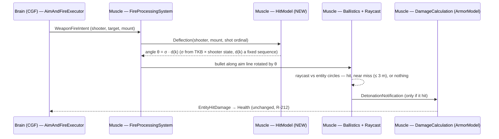
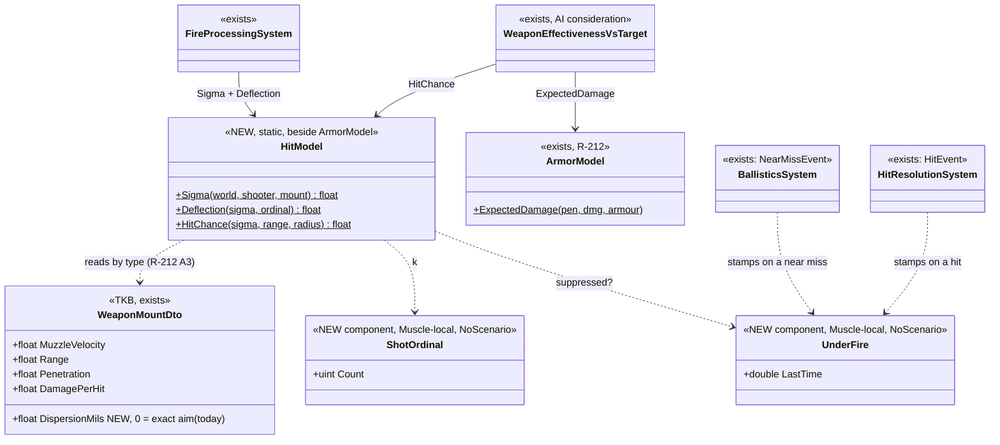

<!--STATUS
state: LIVE
updated: 2026-10-06
current-answer: §3 — sub-questions A–F, each with a RECOMMENDED answer, awaiting the user's approval. Nothing is built.
stale-below: nothing yet
known-rot: none
known-conflict: R-212 A2 ("expected damage, no random roll", docs/DESIGN_Utility_AI_Demo_Scenarios.md §9) — §3 A keeps its
  reason (no dice, rails stay exact) and applies it to HITS; it does not reopen damage.
related-designs:
  - ../DESIGN_Terrain_Combat_Tuning.md — reference library, premise tests and shot diagnostics for hit chance demos
  - ../DESIGN_Building_Interiors.md — the shared terrain Trace that §D bullets use (B4)
  - docs/DESIGN_Utility_AI_Demo_Scenarios.md §9 — OWNS ammunition vs armour (R-212: ArmorModel drives the real damage AND the
    AI estimate; no dice). This question adds the term BEFORE it: does the round hit at all.
  - docs/designs/brain-split/BS-1-DESIGN.md §2.1 — OWNS where combat runs: the Brain orders, the Muscle spawns the bullet and
    resolves the hit ("NO bullets, NO damage" on the Brain).
  - docs/DESIGN_Thermal_And_Acoustic_Sensing.md §6 G — OWNS the near miss (R-206): a round passing within 3 m of another side's
    unit, detected in the ballistics step. Today almost nothing misses, so it almost never fires.
  - docs/DESIGN_Terrain_World.md §7.1 W5 — OWNS stance-dependent eye and silhouette height (sight only, today).
  - docs/blueprints/Architect_Question_8_Wave_Core.md Q-C · Architect_Question_78 C3 — OWN "randomness must be sim-derived and
    reproducible" (SimRng).
  - docs/TUTORIAL_Universal_Soldier.md §8 — the gap this answers, measured (CE-3094).
-->

# Architect Question 85 — HIT CHANCE: when does a round actually hit?

> 🔒 **User, `2026-10-06`:** *"Arch q on hit chance"* — after the universal-soldier runs (CE-3094) showed that, with the fire
> pipeline fixed (CE-3095), a lone rifleman against three equals loses by arithmetic: both sides see each other in the same
> frame, fire in the same frames, and every round that is fired at a visible target hits.

## 0. The shape

*What the picture shows that prose hid:* the only new decision is ONE angle at the moment the bullet is spawned. Everything
after it — the hit, the near miss, the bystander struck, armour, damage — already exists and stays physical. Range needs no
term of its own: a fixed angular error misses a 0.3 m target more often at 120 m than at 30 m.

*What the picture shows that prose hid:* one function family serves BOTH the shot and the AI's estimate (the R-212 A1 shape),
and the suppression effect needs no new sensor — the near-miss and hit producers already run on the node that fires.

## 1. INVENTORY

| query (codebase-memory graph, `2026-10-06`) | total | what matters |
|---|---|---|
| `search_graph name_pattern=.*(Fire\|Ballistic\|Hit\|Damage\|Detonation\|NearMiss\|Suppress\|Armor\|Accuracy\|Weapon).* label=Class` | 15 production combat types (the rest examples/tests) | the chain: `AimAndFireExecutor` → `WeaponFireIntent` → `FireProcessingSystem` → `BallisticsSystem` → `RaycastSolverSystem` → `HitResolutionSystem` → `DamageCalculationSystem` (`ArmorModel`) → `HealthApplicationSystem`. ⛔ **no accuracy / dispersion type** |
| `search_graph name_pattern=.*(Stance\|Cover\|Suppress\|NearMiss\|RecentSense\|Exposure\|Concealment).* label=Class` | 133 (mostly unrelated name matches) | `NearMissEvent`, `NearMissSensingSystem`, `RecentSenses`, EQS cover (`CoverPoint`, `FindCoverFromTarget`, `ThreatExposureTest`), `SuppressAndManeuverManeuver`. ⛔ **nothing that changes a shot** |
| grep `Random` over non-test `FDP/Toolkits`, `FDP/Engine`, `Hrot/Engine` | 0 in combat | the one sim RNG, `SimRng`, lives in `Hrot.AI.Behaviors` — unreachable from `Fdp.Toolkits/Combat` |

| fact the leans rest on | code — how it IS | design — how it was MEANT |
|---|---|---|
| the bullet flies exactly at the target's current position | ✅ `FireProcessingSystem.cs` (direction = normalise(target − shooter)) | ⛔ searched `docs/` + `.dev/`: no hit-chance design exists |
| hits are 2-D: a segment against the target's 0.3 m circle | ✅ `RaycastSolverSystem.cs` `Intersection2D.RaycastCircle`; collider radius 0.3 measured on 2002 | `DESIGN_Terrain_World.md` W5 (`PhysicsCollider.Height` exists, used by sight only) |
| bullets never hit buildings | ✅ the raycast tests `PhysicsCollider` entities only | ⛔ searched, none found |
| the Muscle owns the shot | ✅ `FireProcessingSystem` runs on SimHost only | ✅ `BS-1-DESIGN.md` §2.1 |
| damage takes no dice, on purpose | ✅ `ArmorModel.HitDamage` | ✅ R-212 A2 — *"a seeded roll per hit … makes every combat rail statistical"* (rejected) |
| a near miss is detected but is only a sense / ROE signal | ✅ `BallisticsSystem` `ReportNearMisses`, `CombatConstants.NearMissRadius = 3` | ✅ R-206; ⛔ no design gives it an effect on the target |
| stance is never written at runtime | ✅ `LosStrategies.cs` — `StanceStatus` unwritten on perception nodes (`CE-3010`) | `DESIGN_Terrain_World.md` W5 |

## 2. What is measured

📐 `ua-universal-soldier` (CE-3094, after CE-3095): at ~37 m the rifleman and Hostile 1 fire in the SAME frames (f6958,
f7025) and trade hit for hit; at ~120 m every round fired on a visible target lands. ⇒ with exact aim and symmetric sight,
**the side with more rifles wins, always**: cover, movement, range and suppression change nothing about a shot.

## 3. The sub-questions — each with a recommended answer

### A. The mechanism — ⭐ RECOMMENDED: a DETERMINISTIC AIM DEFLECTION at spawn

The bullet's direction is rotated by `θ = σ · d(k)`, where `σ` is the shooter's angular dispersion (§C) and `d(k)` is a fixed
low-discrepancy sequence in [−1, 1] over the shooter's shot ordinal `k` (golden-ratio: `d(k) = 2·frac(k·0.618…) − 1`).
Whether it hits is then decided by the physics that already exists.

| why | |
|---|---|
| no dice — R-212 A2's reason holds | the same scenario gives the same hits every run; rails stay exact, not statistical |
| range comes free | `P(hit) = clamp(atan(r / range) / σ, 0, 1)` for a uniform spread — 30 m and 120 m differ by 4× with no range table |
| misses become REAL | they fly on, pass other units (the R-206 near miss finally fires), and can hit a bystander |

Rejected: **expected-value damage per shot** (every round hits for `DamagePerHit × P`) — nothing ever misses, so near misses,
suppression and bystanders stay dead · **a seeded random roll** — needs a sim RNG stream in `Fdp.Toolkits` and makes combat rails
statistical (the R-212 A2 rejection) · **a hit/miss flag decided on the Brain** — the Brain has no bullets (BS-1 §2.1).

### B. Where it runs — ⭐ RECOMMENDED: in `FireProcessingSystem` on the Muscle

The node that spawns the bullet deflects it. The Brain keeps sending the intent only. ⛔ Rejected: the Brain choosing an aim
point (it would need the Muscle's positions a frame late, and BS-1 gives it no bullets).

### C. What changes σ — ⭐ RECOMMENDED: four factors in the first slice, all from data that exists

| factor | value (first cut, tunable) | source |
|---|---|---|
| the weapon | `WeaponMountDto.DispersionMils` (NEW), **default 0 = exact aim** | TKB by type (R-212 A3) |
| shooter moving | × 2 when its speed > 0.5 m/s | `SimVelocity` on the Muscle |
| shooter under fire (= SUPPRESSED) | × 2 for 5 s after a hit or near miss on it | `UnderFire` (§E) |
| shooter stance | prone × 0.5, crouched × 0.75 | `StanceStatus` — ⚠ reads Standing until stance is written (`CE-3010`) |

Range is not a factor (§A). ⭐ **Default 0 keeps every existing scenario and rail unchanged** until a TKB entry opts in. The
first opt-ins: the 2002 rifleman (UrbanCombat) and BDC rifle, calibrated to ~50 % at 100 m standing still (`σ ≈ 6 mils`, the half-width of a uniform spread, for a
0.3 m circle: P = 3 mrad / 6 at 100 m, ~1 at 37 m, 0.42 at 120 m, half that while moving).

Rejected: a range-falloff table (redundant with geometry) · target stance in the first slice (§D).

### D. Target exposure and cover — ⭐ RECOMMENDED: NOT in the first slice, named as the next step

Hits are 2-D (a circle), so a prone or crouched TARGET cannot present less of itself, and bullets pass through buildings.
Cover today works only through sight: you cannot be aimed at from where you are not seen. ⭐ The next step, separately decided:
3-D bullets from muzzle height to the target's centre, tested against `PhysicsCollider.Height` scaled by stance (W5), and against
terrain walls. ⛔ Rejected for now: a cover multiplier on σ — it would fake what geometry should decide, then need unpicking.

### E. Suppression — ⭐ RECOMMENDED: `UnderFire` stamped on the Muscle by the hit and near-miss producers

`BallisticsSystem` (near miss) and `HitResolutionSystem` (hit) already run on the firing node; each stamps
`UnderFire.LastTime` on the unit. `HitModel.Sigma` reads it (§C). ⇒ **Suppress becomes meaningful**: fire that misses still
spoils the target's aim. Rejected: reading the Brain's `RecentSenses` (it lives on the other node) · a morale / pinned state (a
behaviour concern, already expressible as a posture — not a shot property).

### F. The AI's estimate — ⭐ RECOMMENDED: one function, the R-212 A1 shape

`WeaponEffectivenessVsTarget` (the AI's "share of a kill per shot") becomes `HitChance(σ, range, radius) × ExpectedDamage / Health.Max`,
using the SAME `HitModel` the shot uses. The posture scorer's "enemy strength" and the approach scorer can then prefer range,
standing still, and suppressing first. Rejected: an AI-only estimate (R-212 A1: the AI would plan for a world that does not
exist).

## 4. Blast radius

| touched | how |
|---|---|
| `FireProcessingSystem` | one rotation of the direction vector before the bullet spawns |
| `WeaponMountDto` / TKB catalogs | + `DispersionMils` (default 0); rifle entries opt in |
| NEW `HitModel`, `ShotOrdinal`, `UnderFire` | beside `ArmorModel`; two Muscle-local components (NoScenario) |
| `BallisticsSystem`, `HitResolutionSystem` | stamp `UnderFire` |
| AI `WeaponEffectivenessVsTarget` | × `HitChance` |
| rails | unchanged until a TKB opts in; then the universal-soldier, posture and hill-attack baselines are re-pinned in the same change |

## ⛔ HISTORY

*(nothing yet)*
