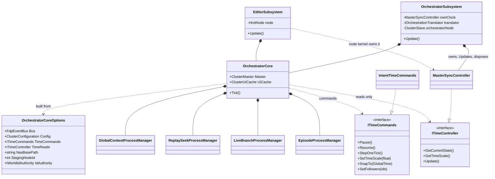
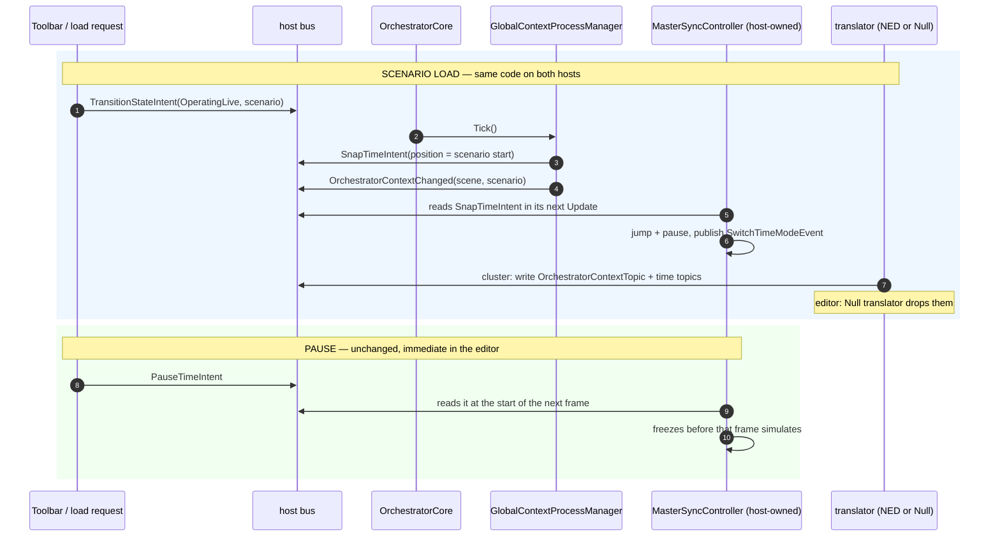
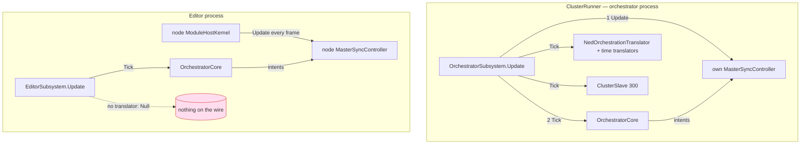

<!--STATUS
state: LIVE
updated: 2026-10-07
build-state: DESIGN — leans below await the user's approval; nothing in §5's slices S2+ is built.
current-answer: §3 (the three diagrams) and §4 (sub-questions A–F with leans). §1 is the measured INVENTORY.
stale-below: nothing.
known-rot: none.
known-conflict: DESIGN_Cluster_Load_Phase.md §7.2b and DESIGN_Deterministic_Network_Ids.md §11 describe the editor's
  HAND-BUILT ClusterMaster as the intended "one-node cluster" master. This question keeps two hosts but ONE copy of the
  code — their "two masters / two authorities" wording stays true; their implied "the editor builds its own" does not.
  RESUME_Distributed_Scenario_Persistence.md:28 ("NO orchestrator to build") is overtaken by §4-A.
related-designs:
  - docs/DESIGN_Cluster_Load_Phase.md — owns the LOAD sequence (§7.2b: both masters park on the same path); this
    question owns WHO HOSTS the master that runs it.
  - docs/blueprints/DESIGN_Time_Architecture.md — owns the clock (§12a: SnapAndPause is the one time discontinuity);
    this question owns how the orchestrator core COMMANDS a clock it does not own.
  - docs/designs/hexag-2/DESIGN.md — owns the "domain logic must not touch DDS" rule (§1.4); §4-B here applies it to the
    one handler that rule's migration missed.
  - docs/designs/mgmt-1/DESIGN.md — owns the Context Plane (§1.2, OrchestratorContextTopic for late joiners); §4-B keeps it.
  - docs/blueprints/Architect_Question_63_Unify_Subsystem_Composition.md — owns host composition (§9.3: the editor's
    offline ClusterMaster is "an extra" in the UI half); this question removes the extra.
  - docs/PROGRAMME_Cgf_Equals_Editor_Gap_Map.md — owns "the editor is a one-node cluster" (ruling 66).
  - docs/DESIGN_Headless_Testability.md — §330-340: the editor clock is a MasterSyncController with an empty slave roster.
  - docs/DESIGN_Deterministic_Network_Ids.md — §11: one id authority per world (the editor's IdAuthority wiring moves with §4-A).
-->

# Architect Question 86 — **the editor runs the ORCHESTRATOR CORE; the clock master stays in the editor**

> 🔒 **User, `2026-10-07`, verbatim:**
> *"Wait how comes editor has non orchestrator side load handler? There shoumd be no differences from cgf"* ·
> *"Clock handling and loading etc this all needs to be unified and shared, editor just run these without network."* ·
> *"when I press stop or pause, The clock stops immediately, which is very important for deterministic time stepping and
> for diagnosing problems … Best if we could share the handler code for many stuff with the orchestrator and instantiate
> the orchestrator master inside the editor, but let the clock master staying inside the editor."* ·
> *"we should use the bus events that are translated to network by translators, should't we?"* ·
> *"Interface expresses the api clearly so i am a bit reluctant to start inferring the intended api from bus events."*

📌 **How this came up:** `CE-122` *(a scenario load does not reset the clock to zero and pause)*. The cluster half is fixed
(`d6bdc1d6b`, then `SnapAndPause` made complete — `DESIGN_Time_Architecture.md` §12a). ⛔ **The editor half could not be
fixed without a second copy of the load handler**, because the editor does not run the orchestrator's code at all — it
builds its own copy, and the copy has drifted.

---

## 1. INVENTORY — measured `2026-10-07`

⭐ Queries: `search_graph(name_pattern=".*(ProcessManager|Aggregator|MergeWorker)$", label=Class, file_pattern=Hrot.Orchestrator/*)`
→ **total 15**, `has_more:false`; `search_graph(name_pattern=".*(Time|Clock|Sync).*", label=Interface)` → **total 12**;
grep of both hosts' construction blocks. ⚠ `check_index_coverage` was NOT run (not reachable this session).

| piece *(Hrot.Orchestrator)* | `OrchestratorSubsystem` *(cluster)* | `EditorSubsystem` *(hand-built copy, `:2192-2250`)* |
|---|---|---|
| `ClusterMaster` (+ `IdAuthority`, `AssetSync`) | ✅ `:134` | ✅ `:2192` — `Mandatory = []` |
| `ReplaySeekProcessManager` + `ReplaySeekAggregator` | ✅ | ✅ |
| `ReplayProcessManager` + `ReplayConsensusAggregator` | ✅ | ✅ |
| `StorageProcessManager` + `StorageConsensusAggregator` | ✅ | ✅ |
| `AssetInventoryProcessManager` · `AssetPrefetchProcessManager` | ✅ | ✅ |
| `DiagnosticsDumpProcessManager` + `DiagnosticsConsensusAggregator` · `DiagnosticLogMergeWorker` | ✅ | ✅ |
| `ClusterUiCache` · `ClusterScenarioPanel` · `ClusterDiagnosticsPanel` | ✅ | ✅ |
| ⛔ **`GlobalContextProcessManager`** *(scenario load → clock jump, context)* | ✅ `:237` — ⚠ only when a DDS participant exists (`:216`) | ⛔ **missing** |
| ⛔ **`EpisodeProcessManager` + 2× `EpisodeConsensusAggregator`** | ✅ `:203-204`, `:256` | ⛔ **missing** |
| ⛔ **`LiveBranchProcessManager` (+ `ReplayMasterModule`)** | ✅ `:263` | ⛔ **missing** |
| ⛔ **`PendingTimeMode` → pause-with-roster** | ✅ `Update` `:336-349` | ⛔ **missing** |
| the orchestrator as a cluster NODE (`ClusterSlave` 300 + diagnostics handler) | ✅ `:136` | — *(the editor is its own node: `HrotNodeBuilder`)* |
| the clock | creates + `Update`s + disposes its own `MasterSyncController` (`:181`, `:322`, `:410`) | the node's clock (`:1190`), advanced by the node's kernel |

⭐ **The clock surface the pieces use** *(graph + grep)*: `ClusterUiCache`, `ReplayProcessManager` already take
**`ITimeController`** (reads only). Only `ReplaySeekProcessManager` and `LiveBranchProcessManager` take the concrete
`MasterSyncController` — for `SnapAndPause` alone. Of the 12 time interfaces, ⛔ none declares a snap or a pause-with-roster.

---

## 2. Claim table — what the leans rest on

| claim | code — how it IS | design — how it was MEANT |
|---|---|---|
| the editor's pause is immediate because ITS clock reads the intent and has no followers | ✅ `MasterSyncController.cs:161` (reads `PauseTimeIntent`), `:549` (frozen in barrier), toolbar → `IntentTimeCommands` `EditorSubsystem.cs:1271` | ✅ `DESIGN_Headless_Testability.md:330-340` |
| a follower clock overshoots 1–2 frames, then snaps back | ✅ `SlaveSyncController.cs:187-205`, `:354` | ✅ `mgmt-DESIGN` §5.6.4 |
| the orchestrator's pause logic gives the editor ZERO followers | ✅ it lists only `SimHost`/`IG`/`CGF` (`OrchestratorSubsystem.cs:340-344`); the editor node is `"Editor"` | ⛔ searched, none |
| the load handler is the one orchestrator piece writing DDS directly | ✅ `GlobalContextClusterOpHandler.cs:105`, `:218` | ✅ violates `hexag-2` §1.4 |
| nothing reads `OrchestratorContextTopic` | ✅ grep over `Hrot`/`FDP`/`Stride`/`tools` — zero readers, tests included | ⚠ designed: `mgmt-1` §1.2 Context Plane (late joiners) — reader never built |
| the cluster translator already turns bus events into DDS samples | ✅ `NedOrchestrationTranslator.cs:26-45` (cluster state, op status, inventory, commands) | ✅ `hexag-2` §4.2 |

---

## 3. The design — diagrams first

### 3.1 Classes — one core, two hosts

*What the picture shows that prose hid:* the core holds **no** `MasterSyncController`. It can only **publish commands**
(`ITimeCommands` → intents on its bus) and **read**. ⇒ "who advances the clock" needs no flag: only the host that
created it can. The ~15 pieces of §1 move into `OrchestratorCore` unchanged; the 4 drifted ones arrive in the editor
by construction.

### 3.2 Sequences — load, and pause

*What the picture shows:* the load path and the pause path are **both** "intent on the bus → the host's clock reads it
in its next `Update`". ⚠ The snap therefore lands **one frame later** than today's direct call (§4-C's open measurement).

### 3.3 Modules — who registers, who ticks

*What the picture shows:* each host has **exactly one** caller of its clock's `Update` (the cluster subsystem; the
editor's kernel). The core is ticked by its host and never touches `Update`. The red node is the deliberate dead end:
in the editor nothing reaches a network, by construction and with no "no-DDS mode".

---

## 4. Sub-questions, each with a lean

| # | question | ⭐ lean | blast radius | what would change it |
|---|---|---|---|---|
| **A** | Editor: run the real orchestrator, or keep a copy? | ⭐ **one `OrchestratorCore`, built by both hosts** (§3.1). The editor stays its own clock master *(user ruling above)*; the orchestrator-as-node (`ClusterSlave` 300) and the translators stay in `OrchestratorSubsystem`, outside the core | both hosts' composition; all orchestrator pieces move file-for-file | a piece that genuinely cannot run on the editor's bus — none found in §1 |
| **B** | The load handler writes DDS directly | ⭐ **publish a bus event; `NedOrchestrationTranslator` writes `OrchestratorContextTopic`** (as it does for cluster state). Keep the topic *(mgmt-1 Context Plane — a designed late-joiner capability, reader unbuilt)*. Fix `ScenarioId = dto.SceneId` (`:220`) on the way. The handler is then built unconditionally — no "no-DDS mode" | the handler + one translator + one bus event type | a reader that needs the DDS sample before the bus event can be translated — none exists |
| **C** | How does the core command a clock it does not own? | ⭐ **`ITimeCommands`** *(existing typed API, `IntentTimeCommands` publishes intents)* extended with **`SnapTo(GlobalTime)`** and **`SetFollowers(ids)`**; reads through the existing **`ITimeController`**. The core never holds the concrete clock | `ITimeCommands` + its 2 impls, `MasterSyncController.Update` reads 2 new intents, seek / live-branch / load switch to it | ⚠ **OPEN, measure first:** the snap lands one frame later. If the seek or live-branch suites show that frame matters, that caller keeps a direct call and says so |
| **D** | The orchestrator's two windows (Orchestrator, Diagnostics) in the editor | ⭐ **the core builds `ClusterUiCache` + the two panels; each host registers the windows it wants.** The editor already shows both panels today | window registration only | — |
| **E** | Host-specific inputs | ⭐ **one `OrchestratorCoreOptions` record**: bus, `ClusterConfiguration` (editor: `Mandatory = []`), NAS root, staging node id, id authority, time commands + reads. ⛔ No `if editor` inside the core | the core's constructor | — |
| **F** | `PendingTimeMode` → pause-with-roster lives in `OrchestratorSubsystem.Update` (`:336-349`), the editor has none | ⭐ **move it into the core**, issued through `ITimeCommands` (`SetFollowers` + `Pause`). In the editor the roster is empty ⇒ pause stays immediate | the core's tick | ⚠ the editor already pauses on its own preview exit (`EditorSubsystem.cs:679`) — measure whether a transition now pauses twice; harmless if idempotent (`SwitchToContinuous` is; check `SwitchToDeterministic`) |

### ⛔ Rejected — one line each

- **Editor as a CGF-style follower of the real orchestrator** — the follower overshoots 1–2 frames and every step waits a round-trip (§2 rows 1–2); the user's ruling keeps the clock master in the editor.
- **A shared builder that both hosts call but which owns the clock** — the core would `Update` the editor's clock a second time per frame (double time).
- **An "owns the clock" flag on the core** — a mode the caller can get wrong; host ownership already says it.
- **A new `IClusterTimeMaster` interface** — duplicates `ITimeCommands`, which exists for exactly this.
- **Raw bus events in the core with no interface** — the API is only discoverable by reading publishers *(user)*.
- **`ResetForLoadedScenario` on the clock** — a use-case method on a time API; deleted (`DESIGN_Time_Architecture.md` §12a).
- **A "no-DDS mode" on the load handler** — a special case; §4-B removes the reason for it.
- **Deleting the `OrchestratorContextTopic` write because nothing reads it** — it is a designed capability (mgmt-1 §1.2): route, do not delete.

### Design docs checked

| doc | applies? |
|---|---|
| `DESIGN_Cluster_Load_Phase.md` §7.2b | ✅ applies — the load sequence is unchanged; "two masters park on one path" stays true |
| `DESIGN_Time_Architecture.md` §11–§12a | ✅ applies — one clock per host, intents as the control path (§11), the one snap (§12a) |
| `hexag-2/DESIGN.md` §1.4, §4.2 | ✅ applies — the rule §4-B enforces |
| `mgmt-1/DESIGN.md` §1.2 | ✅ applies — why the context topic stays |
| `Architect_Question_63` §9.3 | ✅ applies — names the editor's master an extra in the UI half |
| `HANDOFF_Cgf_Bootstrap_Unification.md:36` | ✅ applies — "time authority (master vs slave) … MUST be preserved" |
| `RESUME_Distributed_Scenario_Persistence.md:28` | ⛔ overtaken — "NO orchestrator to build" was true of the copy, not of the shared core |
| `DESIGN_Deterministic_Network_Ids.md` §11 | ✅ applies — the editor's id authority is passed in through §4-E unchanged |

---

## 5. Slices — each keeps both hosts' suites green

| slice | what | proves it |
|---|---|---|
| **S1** ✅ | `SnapAndPause(GlobalTime, roster?)` — whole position, roster kept; `ResetForLoadedScenario` deleted | `MasterSyncControllerTests.SnapAndPause_*` (red-proved) |
| **S2** | §4-B: load handler → bus event; translator writes the topic; built unconditionally | `GlobalContextProcessManager` rails + the cluster load suites |
| **S3** | §4-C: `ITimeCommands.SnapTo` / `SetFollowers` + 2 intents; seek, live branch, load switch over | seek + live-branch suites (the one-frame measurement) |
| **S4** | §4-A/E: extract `OrchestratorCore` from `OrchestratorSubsystem`, no behaviour change | `Hrot.Orchestrator.Tests`, `ClusterRunner.Tests`, the time integration suites |
| **S5** | the editor builds `OrchestratorCore`; delete `EditorSubsystem.cs:2192-2250`; §4-D/F | editor suites + a new rail: an editor scenario load leaves the clock at 0, paused |
| **S6** | live: load `hill-attack-close` twice in the editor and the cluster, clock 0 + paused each time | `docs/RUNBOOK_Cluster_Debugging_Over_Http.md` |
