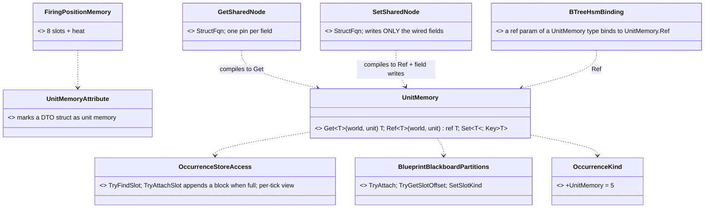
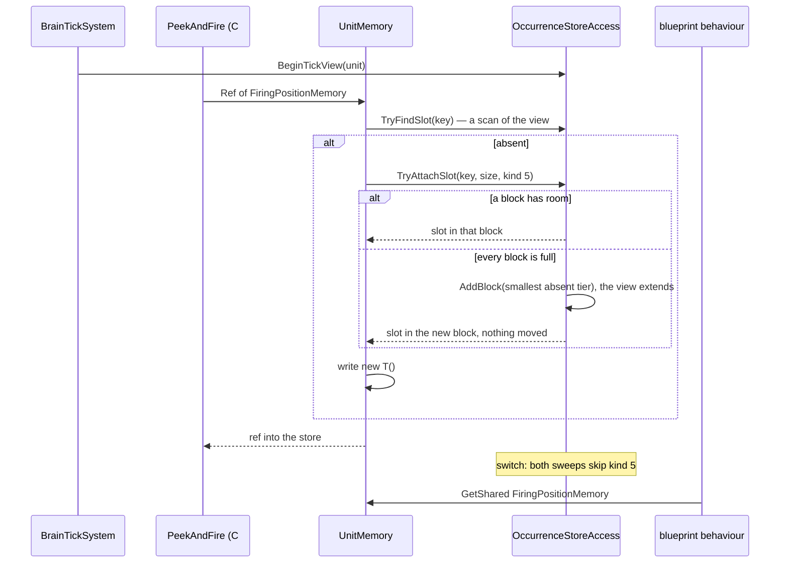
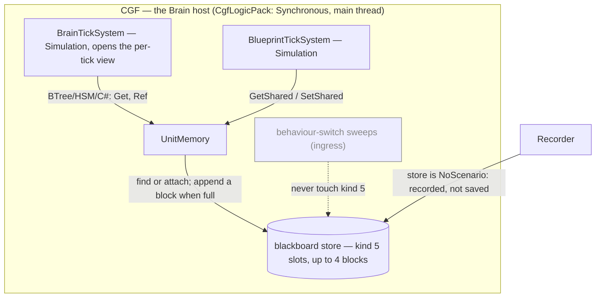

<!--STATUS
state: LIVE
updated: 2026-10-09 (U-0 built: §0, §2, C and U-1 restated without the pending buffer and promotion — see §8 HISTORY)
build-state: READY-TO-BUILD — A–G APPROVED by the user 2026-10-09 (R-237; D″ already BUILT as U-0); H is an explanation, asked for, not a decision — revised 2026-10-09 after the user's questions: fully lazy creation, two nodes, §3a why a tier move strands pointers and why the store moves at all
current-answer: §0 the requirement · §2 diagrams · §3 decisions A–H · §3a why the store moved and why D″ need not · §3b lookup performance (measured) · §5 slices
stale-below: §8 HISTORY (two superseded leans — do not quote them)
known-rot: none yet
known-conflict: DESIGN_Parameter_Model.md:386 — "True entity-wide data is an ECS component field — not a variable section. No new variable owner is needed." (user, 2026-08-16). The user's 2026-10-09 requirement (§0) overrides its second sentence for behaviour-owned data: unit memory IS a new variable owner. Engine-read data stays an ECS component (§4)
related-designs:
  - Architect_Question_76_One_Blackboard_Block_Per_Primitive.md — OWNS the removal of the Entity scope and GetShared/SetShared (decisions A, C; §9 provenance; R-150). This question re-implements the capability on a different key and lifetime, and §3 H answers each failure Q76 measured
  - DESIGN_Occurrence_Scoped_Storage.md — OWNS the store unit memory lives in: slots, kinds, tiers, the "no structural change inside a tick" rule (§27) and the hosted-demand sizing (O7b-3) that unit memory copies
  - DESIGN_Parameter_Model.md — OWNS the variable model; unit memory is a fourth owner beside occurrence params, occurrence state and ECS components (see known-conflict)
  - Blueprint_SharedState_GetShared_Design.md — HISTORICAL: the first shared-memory design (2026-07); its NEEDS still hold, its name-keyed Entity scope does not come back
  - Blueprint_Component_Access_Design.md — OWNS GetComponent/SetComponent; NOT unit memory's access path (the user rejected components, §8)
  - ../DESIGN_Peek_And_Fire.md — OWNS the first consumer: FiringPositionMemory (§8 B1)
-->

# Architect Question 87 — Unit memory: unit-scoped shared blackboard structs *(backend, `2026-10-09`)*

> 🔒 **User, `2026-10-09`, verbatim — the requirement:**
> *"it is required to re-implement the unit-scoped shared blackboard structs"* ·
> *"designer-declared unit memory seems exactly right. Where to define it? it is a c# DTO struct that can be added to c#
> code of the ai behaviors assembly (even by a non-programmer i guess). … And how will we access those shared slots?
> GetShared/SetShared functions with equivalent blueprint nodes configurable for certain existing DTO?"* ·
> *"maybe the editor-defined list is not necessary if we create the shared slot the first time any behavior touches it at
> runtime? It would always be created with defaults as defined in the structure declaration (C# 10 and above)."*
>
> 🔒 **And the rejection of the component route:** *"no. no automatic component allocations. Component id range is very
> limited. We can have hundresds of behaviors."*

> 🔒 **User, `2026-10-09`, verbatim:** *"A-G approved, explain H"* ⇒ **R-237**. ⭐ U-1 + U-2 are next (P-6 needs only those).

## 0. The design in one paragraph

A **unit memory** is a C# DTO struct a designer writes in the AI behaviours assembly, marked `[UnitMemory]`, with its defaults
as field initializers. At runtime it is **one slot in the unit's existing blackboard store**: a new slot kind
`OccurrenceKind.UnitMemory`, **keyed by the struct's TYPE** (one per unit). It is **created the first time any behaviour
touches it**, filled with `new T()`, and **lives as long as the unit**: no behaviour switch sweeps it. The *"group"* of
behaviours sharing it is simply every behaviour that touches the type, so nobody maintains a list. Access is through
**two blueprint nodes, `GetShared` and `SetShared`** (the latter writes only the fields you wire), configured by picking the struct,
a **BTree/HSM action or guard parameter of that type**, and **`UnitMemory.Ref<T>` in C#**. ⭐ **Fully lazy, with nothing declared
ahead**: the first touch claims a slot on the spot — in a block with room, or in a block **appended** to the unit's store
mid-tick (D″, built as U-0: the store is multi-block and never moves a slot, so every pointer a running tree holds stays valid).
Nothing is lost, nothing is listed, and there is no pending buffer or promotion (both retired with U-0; §8 HISTORY).

## 1. INVENTORY — measured `2026-10-09` (graph CLI `search_graph` + grep + `git show`)

| query | total | what it found |
|---|---|---|
| `search_graph ".*UnitMemory.*"` | **0** | nothing exists under that name |
| `search_graph ".*(GetShared\|SetShared).*"` | 15 | docs, the editor's behaviour-scope `GetSharedScopeKeys`, the Make/Break palette's `ISharedStructTypeProvider` (**survived CE-440**, now feeds Make/Break). ⛔ **no runtime accessor** |
| `git show 5de52edab` (CE-440) | 1 commit | removed `BlueprintSharedState` (215 lines: `TryGetShared`/`TrySetShared`/`TrySetSharedField`, a `StructureHash` guard `TypeNameHash ^ size`), the node kinds, IR ops, validator BP2040–2042, the drawers |
| `search_graph ".*StatefulSlot.*"` | 27 | `StatefulSlotScope { Node, Behavior }`; `Entity = 2` retired, *"Do not reuse 2"* |
| `search_graph ".*OccurrenceKind.*"` | 3 | `Invalid 0, Blueprint 1, BTree 2, Hsm 3, BlueprintBehavior 4`; a 4-bit nibble ⇒ **11 free values** |
| grep `BlueprintTierLadder.cs` | 4 tiers | **256 B / 3 slots · 1 KB / 12 · 4 KB / 16 · 16 KB / 16** |
| read `BehaviorIngressSystem.cs` | — | the switch sweeps: `DetachStatefulSlots` frees **the manifest's keys only** (`:1661`); `DetachHostedOccurrenceSlots` frees **kinds `Hsm`/`Blueprint` only** (`:1218`). ⇒ ⭐ **a new kind is untouched by both, by construction** |
| read `BehaviorIngressSystem.cs:1402-1430` | — | ⭐ the **precedent**: hosted occurrences attach LAZILY, so their room is **added to the assign-time demand** (*"nothing later can grow the tier… a structural change inside a tick"*) |
| read `BlueprintTickSystem.cs:202` | — | `TryAttach` **inside a tick** already happens (lazily attached hosted blueprints) — attaching into existing room is not a structural change |
| read `EntityRepository.cs:958-1000` + `:1182-1200` | — | ⭐ an FDP add writes the type's own table + a mask bit (nothing else moves); a remove only clears the bit (bytes stay); a mid-phase add is allowed unless the phase is ReadOnly |
| read `CgfLogicPack.cs:58` | — | ⭐ the CGF pack is `ExecutionPolicy.Synchronous()`: the brain ticks **on the main thread, on the live world**. ⇒ no threads race on the store |
| read `BTreeRunner.cs:38` | — | ⭐ the runner holds a **raw pointer to the tree's state slot for the whole tick** (*"slots attach lazily without moving an existing payload, and only CopyToLargerTier … moves payloads"*) |
| read `OccurrenceStoreAccess.cs:27-38` | — | ⭐ **the LIFETIME RULE**: a tier swap *"adds the larger component and removes the smaller, so the old pointer is stale the moment it returns"* |
| read `Blueprint_Subsystem_Runtime_Detailed_Design.md` §7 | — | ⭐ **the designed growth path**: a tick that cannot attach ECB-adds the next tier; `BlueprintMaintenanceSystem` (BeforeSync) copies and removes the old one: **two frames**. Registered on CGF (`CgfLogicPack.cs:241`) |
| `trace_path` inbound `BlueprintTierTable.Promote` | 9 | ingress `UpgradeTier`, `EnsureAtLeast`, `BlueprintMaintenanceSystem.UpgradePair`, tests. ⛔ **CORRECTED `2026-10-09` (U-0 build):** the `return; // tier capacity exhausted` this row cited (`BlueprintTickSystem.cs:207`) is in `EnsureAndTickSingleton` — the **world-singleton** path (`spec.EnsureSingletonMemory`, one shared block per tier), **not** a unit's store. A unit's Instance attach (`BlueprintInstanceService`, `BlueprintMaterializationSystem`) never went through it. The singleton drop remains, outside U-0's scope |
| read `Architect_Question_16_Component_Write.md:38` | — | the OLD `SetShared` was **one** node: *"`SetShared` multi-pin → `TrySetSharedField` writes only wired fields"*. `TrySetSharedField` was the runtime helper, never a node |
| grep `Fbt.Kernel/BlackboardAnnotations.cs` | — | `[BlackboardDtoStruct]` (editor-only marker for the variable type picker) — the pattern `[UnitMemory]` follows |

**Measured language facts** (scratch net8.0, C# 12 as this repo):

| | result |
|---|---|
| field initializers without a declared constructor | ⛔ **CS8983** — the designer must write `public Foo() {}` |
| generic `new T()` · `Activator.CreateInstance<T>()` | ✅ **45** (the declared default) |
| `default(T)` · an array element | ⛔ **0** — so the store must initialise through `new T()`, never by zeroing |

## 2. Diagrams

### 2.1 Classes — grey = exists; new = the kind, the accessor, the attributes, the demand, the three node kinds

*What the picture shows that prose hid: the storage, slot table, kind nibble, lazy attach and growth (U-0) are all grey. The new
runtime is one accessor and one enum value. The bulk of the new code is the authoring surface (two nodes, and the binding arm in
the BTree/HSM emitters).*

### 2.2 Sequence — first touch, first touch on a full store, switch

*What it shows: a full store costs one append, mid-tick, and no pointer anyone holds moves — so there is no pending buffer, no
second frame and no promotion. And nothing anywhere needs to know in advance which types a behaviour uses.*

### 2.3 Modules — who creates, who grows, who reads each frame

*What it shows: nothing moves payloads any more (the BeforeSync maintenance system is retired by U-0). The grey edge is the sweep
that must never reach a unit memory.*

## 3. Decisions — one lean each

| # | question | ⭐ lean | rejected (one line each) | blast radius · what would change it |
|---|---|---|---|---|
| **A** | **where is it stored?** | ⭐⭐ **a slot in the unit's existing blackboard store, `OccurrenceKind.UnitMemory = 5`** | **an ECS component per type**: rejected by the user, since component ids are capped at 512 and behaviours number in the hundreds. · **a separate store component just for unit memory**: a second store, ladder and inspector path for one concept | one enum value; the nibble has 11 free |
| **B** | **the key** | ⭐⭐ **the TYPE**: `FNV(typeof(T).FullName) & 0x7FFFFFFF`, kind 5, plus the old `StructureHash` guard (`TypeNameHash ^ Unsafe.SizeOf<T>()`) | **a variable name** (the old Entity scope): Q76 measured its collision domain. · **type + asset**: then it is behaviour memory, not unit memory | ⚠ renaming the struct starts fresh memory; acceptable for runtime-only data |
| **C** | **how is room found without a list?** | ⭐⭐ **fully lazy**: the first `Ref`/`Set` attaches **in place** — in a block with room, else in an APPENDED block (D″, built as U-0); nothing moves, so every pointer a running tree holds stays valid. Nothing is declared ahead | **build-time demand + `[UsesUnitMemory]` on C# actions** (my previous lean): the list you ruled out, in attribute form, plus a compiler arm per asset kind. · **an editor list**: ruled unnecessary. · **fixed headroom per brain**: the 256 tier has 3 slots | ⭐ reuses the existing attach; no compiler or ingress change |
| **D** | **the tier is full at first touch** | ⛔ **MOOT — D″ was approved and built (U-0); kept as the record of the fallback:** **the existing two-frame promotion** (runtime design §7): ECB-add the next tier; `BlueprintMaintenanceSystem` copies and removes the old one in BeforeSync. Meanwhile the value lives in a **one-frame pending buffer**: `Ref` returns a ref into it, `Get` reads it, and maintenance copies it into the new slot right after the promotion. **No write is lost** | **swap the tier immediately inside the tick**: §3a, it strands the pointers the running tree holds. · **drop the write** (what `BlueprintTickSystem.cs:207` does today for blueprints): silent. · **throw**: the brain dies over a capacity detail | ⚠ **finding:** §7's promotion was designed but **no tick starts it**: blueprint attach failure is a silent `return`. U-1 wires the trigger, and the blueprint path can use the same one |
| **D″** | ✅ **APPROVED `2026-10-09`** (🔒 user: *"new lean works"*) — **the store becomes multi-block and NEVER MOVES a slot** | growth **adds the next tier as an extra block** (the existing `BlueprintBlackboard256/1024/4096/16384` types, at most one of each ⇒ up to 4 blocks, **47 slots, ~21 KB**, **no new component ids**); allocated slots stay where they are. `OccurrenceStoreAccess` gains the key-based seam (`TryGetSlot`, `ResolveOrAttach`, `Detach`, `ForEachSlot`) that loops the blocks; the 23 key sites route through it mechanically; the 4 walkers and `BlueprintTickSystem` loop blocks; the copy-promotion (`UpgradeTier`, `CopyToLargerTier`, `BlueprintMaintenanceSystem`'s two-tier rule) is retired for "add a block". ⇒ **an attach that does not fit adds a block on the spot, mid-tick** (FDP allows the add and moves nothing, §3a) ⇒ **no pending buffer, no two-frame promotion, no stale pointer, ever**, and `BlueprintTickSystem.cs:207`'s silent drop is fixed by construction | **D** (pending + promotion): machinery that only exists because the store moves. · **D′** (separate unit-memory pages): fixes unit memory only, leaves the behaviour store's move and its silent drop, and adds new ids | ⚠ blast radius is the behaviour store's (`DESIGN_Occurrence_Scoped_Storage.md`), not just unit memory: ~29 sites + 2 walkers + the promotion path, mostly mechanical. ⭐ no premise about cached offsets: nothing moves, so an offset stays valid (user: *"who cares when we do not move anything?"*) |
| **D′** | ⛔ **rejected in favour of D″: unit memory in its own never-moving blocks** | the alternative to D. Unit memory does not share the behaviour store; it lives in **pages**: a fixed set of page component types (e.g. 4 × 1 KB, 12 slots each), using the same partition allocator. When a page is full the next page is **added** (FDP moves nothing on an add, and allows it mid-phase, §3a). ⇒ no move, no stale pointer, no pending buffer, no promotion, and the behaviour store's sizing is untouched (77 % of behaviours sit on the 3-slot 256 tier, `DESIGN_Occurrence_Scoped_Storage.md` §5a) | ⚠ **it is an automatic component add**, which the user ruled out; the stated reason was the id range, and this costs **4 fixed ids**, never one per struct or per behaviour | ⇒ **the user decides D vs D′** |
| **E** | **creation and defaults** | ⭐⭐ **created on the first `Ref`/`Set`, filled with `new T()`**. **`Get` on an absent slot returns `new T()` without creating it** (a read costs no room) | **create on Get too**: spends room on a type only ever read. · **zero-fill**: loses the declared defaults (§1: `default` gives 0) | the analyzer flags a `[UnitMemory]` struct with initializers but no constructor (the compiler already does: CS8983) |
| **F** | **lifetime and policy** | ⭐ **the unit's lifetime**: never swept by a switch, freed only with the store. Inherits the store's policy, **`NoScenario`**: recorded for replay, never saved in a scenario. Not on the wire; lost on a brain failover | **cleared on behaviour switch**: is behaviour memory, which already exists. · **saved in scenarios**: a scenario is the authored start, not a remembered past. · **a "forget" rule**: a designer writes `new T()` to reset | a `StructureHash` mismatch (a changed struct meeting old replay bytes) **re-initialises to `new T()`**, never reads garbage |
| **G** | **access surfaces** | ⭐⭐ **blueprint: TWO nodes.** `GetShared(T)` gives a pin per field. `SetShared(T)` takes a pin per field and **writes only the wired ones; the rest keep their value** (the old `SetShared` and today's `SetComponent` both work this way: Q16 `:38`). **BTree/HSM**: an action or guard whose `ref` parameter is a `[UnitMemory]` type binds to it **automatically**, with no variable to create. **C#**: `UnitMemory.Ref<T>` / `Get<T>`. **Self only** | **a third `SetSharedField` node**: my mistake, since it was only ever the runtime helper behind `SetShared`. · **a whole-struct `SetShared`**: forces get, break, make, set to change one field, and clobbers concurrent writers' other fields. · **a variable id + scope**: the R-150 complexity. · **a cross-entity read pin**: one demo in 14 months (Q76 §1.4) | ⚠ resetting to defaults is not a node yet; add a "reset" option on `SetShared` if a designer asks |
| **H** | **does it repeat Q76's failures?** | ⭐⭐ **no**: ① **survives switches**: kind 5 is outside both sweeps by construction (§1). 📐 The old `Entity`-scoped slot did NOT: it was a manifest key (`ComputeStatefulSlotKey(…, Entity, …, variableId)`), and `DetachStatefulSlots` freed every manifest key on every switch, scope unchecked (`7d15977d8^:BehaviorIngressSystem.cs:965`). ② **no collisions**: the key is the type. ③ **ownership decided**: the unit owns it, every behaviour may read and write it, last writer in tick order wins. ④ **a real consumer**: `FiringPositionMemory`. ⑤ **R-150**: the author holds one idea, *"a struct I declare and touch"*. No scope, no variable, no list | — | ⚠ **per-unit slot budget**: 16 at most. A unit touching many unit-memory types *and* a slot-heavy behaviour can hit it; the validator warns on a definition whose demand exceeds 4 types |

## 3a. Why the store cannot change TIER inside a tick — measured, answering the user

> 🔒 **User, `2026-10-09`:** *"pls explain why storage can not grow during tick? If it grows only in same blackboard component or
> by allocating bigger one, what could break? there are no races on the main thread, are they?"*

| case | what happens | safe mid-tick? |
|---|---|---|
| **grow inside the same component** (free slot + free payload) | `TryAttach` claims room; **no existing payload moves** (`BTreeRunner.cs:33-37` relies on exactly this) | ✅ **yes**, and it already happens for lazily attached hosted occurrences (`BlueprintTickSystem.cs:202`) |
| **grow to a bigger tier** | a **different component type**: `UpgradeTier` adds `BlueprintBlackboard4096`, `CopyToLargerTier`, removes `…1024` (`OccurrenceStoreAccess.cs:31-33`). **Every payload moves to new memory** | ⛔ **no**, for the reason in the next row |
| **why a bigger tier MOVES the payload at all** | ⭐ **not an FDP limitation, a store design choice.** FDP adds a component by writing into **that type's own table** and setting a mask bit; **nothing else moves** (`EntityRepository.cs:958-975`), and a mid-phase add is **explicitly allowed** (`ValidateWriteAccess`, `:1189`: *"Allow adding new components (structural change) unless ReadOnly"*). The move happens because the store is **ONE block per unit**: one header, one slot table, every offset relative to that block (runtime design §4.1, §4.6). An entity carries **at most one tier**, and the probe takes the first match (`OccurrenceStoreAccess.cs:40-42`); `BlueprintMaintenanceSystem` treats two tiers on one entity as "promotion in progress" (runtime design §7.5). A component's size is fixed by its type, so "bigger" means another type, and one block means copying into it | — |
| **what breaks if it moves mid-tick** | ⭐ **not a race**: CGF ticks the brain synchronously on the main thread (`CgfLogicPack.cs:58`). ⛔ **Stale pointers**: the runner holds a raw pointer to the tree's state slot for the whole tick (`BTreeRunner.cs:38`), and every running node holds a `ref` to its own working state. After the copy they point into the **old** tier: `RemoveComponent` only clears the mask bit and leaves the bytes (`EntityRepository.cs:981-1000`), so the rest of the tick's writes land in memory that is **no longer the store** and are **silently lost** (no crash: an earlier draft of this table said the chunk could be decommitted; that was wrong) | — |
| **keeping the old block where it is** | ⭐⭐ **nothing fundamental prevents it** (user, `2026-10-09`: *"the only thing needing to know where a data is is the one that looks up the byte pointer of the slot, no?"* — measured: **yes, almost**). Every `TryGetStore` site **classified by what it does next**: **13 key→pointer lookups** (`TryGetSlotOffset`/`TryGetSlotIndex`) · **4 resolve-or-attach** · **6 detach-by-key** · **4 walk-all-slots** (two ingress sweeps; the editor and debug-API slot lists via `BlueprintTierSummary.AppendSlots`) · **2 capacity checks** (ingress tier sizing `:1487`, hot-reload `EnsureAtLeast` `AiHotReloadCoordinator.cs:654`). ⇒ **23 of 29 only need "pointer for key K"**, and they already sit in ~6 thin accessor classes (`RootState/RootParams/RootHsmAccess`, `OccurrenceWorkingState`, `HostedSubtree`, `HsmOccurrence`). Outside `TryGetStore`: `BlueprintTickSystem` walks the tier queries itself, and `BlueprintMaintenanceSystem` reads "two tiers" as "promotion" | ⭐ **§3 D″** |
| **the designed answer** | promote between ticks: ECB-add now, migrate in **BeforeSync** (runtime design §7.1: *"structural mutations during Simulation must go through ECB"*; FDP `architectural-rules.md` §7, which is written for background-thread modules) | ⭐ **D uses it**, unless D′ is chosen |

## 3b. Lookup performance across blocks — measured `2026-10-09`

> 🔒 **User:** *"pls check the performance considerations of the slot lookup across multiple blackboard components"*

📐 **Method:** a Release micro-benchmark against the real `Fdp.Toolkits` (`BlueprintTierTable`, `BlueprintBlackboardPartitions`),
1 000 entities, 3 000 rounds, `DOTNET_TieredCompilation=0`, three passes (spread ±20 %; the first unforced run was JIT noise
and is discarded). ns per lookup:

| what | ns | ⭐ reading |
|---|---|---|
| **today**: `TryGetStore` + `TryGetSlotOffset`, 1 block (slot 1 · slot 6) | **145–180** | the whole of today's hot path |
| ↳ **probe only**: `BlueprintTierTable.Of` (finds the 1024 tier, 3 `Has` calls via delegates) | **140** | ⭐⭐ **the probe IS the cost**, ~45 ns per `HasComponent` |
| ↳ fetch only: `spec.Memory` (`GetComponentRW`) | 35 | per block touched |
| ↳ scan only: pre-resolved pointer, slot 6 of 12 | **14** | the slot scan is noise |
| multi-block naive, 1 block | 185–240 | +1 `Has` (all 4 tiers) and an RO-then-RW double fetch |
| multi-block naive, 2 blocks, hit in the first searched | 180–280 | |
| multi-block naive, 2 blocks, hit in the second | **310–385** | ~2× today, only on units that actually grew |
| multi-block naive, full miss | 285–305 | `Get` of an absent unit memory |
| ⭐ **per-tick view**: 2 pre-resolved blocks, hit in the second | **27** | ⭐⭐ ~6× cheaper than TODAY's single-block lookup |

**Before vs after, measured per BRAIN-TICK** (a second run, same method; one brain doing 6 lookups):

| | ns per brain-tick | 1 000 brains × 60 Hz |
|---|---|---|
| ⛔ **TODAY**: 6 full lookups (probe + fetch + scan, each) | **1 155–1 350** | ~70–80 ms/s |
| ⭐ **AFTER** (①+②): one mask probe + 2 block fetches + 6 scans, **2 blocks** | **88–112** | **~5–7 ms/s** |
| ↳ the probe alone: one mask read + 4 bit tests vs today's `Of()` | **10–18** vs 116–135 | |

⇒ ⭐ **~12× cheaper per brain-tick than today, with two blocks.** At the estimated 3–8 lookups per brain per tick (from the runner,
stateful nodes and unit memory; **not measured**), that is **~36–96 ms/s today vs ~4–9 ms/s after**, i.e. from 4–10 % of one core to
under 1 %.

⭐⭐ **The design consequence — it makes D″ CHEAPER than today, not dearer:**

| ⭐ | |
|---|---|
| **① resolve the blocks ONCE per brain per tick** | a small stack `StoreView` (≤ 4 block pointers), built by the runner at tick start and passed through the bridge context; every lookup in that tick is a pure scan (14–27 ns). ⭐ **Safe ONLY because D″ never moves a block**: an appended block extends the view, and nothing is removed mid-tick. Under today's moving store such a cache would be the stale-pointer bug of §3a |
| **② probe with ONE mask read** | `EntityRepository.GetComponentMask(index)` is public (`:1462`): one `IsAlive` + one mask read + 4 bit tests instead of 4 delegate `HasComponent` calls. It helps every remaining direct caller, including today's code |
| **③ RW only where the slot is** | scan blocks through the RO fetch; take `GetComponentRW` only for the block that holds the slot, so reading does not stamp every block's chunk version (recorder deltas, `DeltaQuery`; `OccurrenceStoreAccess.cs` RO-overload remarks) |
| **④ search order** | the assign-time block first: root state, root params and the behaviour's slots live there, so the hot keys hit on the first block; unit memory and later growth sit in appended blocks |
| ⚠ **cost of a miss** | `Get` of a never-written unit memory scans every block (still ≤ 47 entries, ~30 ns with the view) |

⇒ ⭐ **U-0 carries ①–④**, with a benchmark rail: the per-tick-view lookup must not exceed today's single-block lookup.

## 4. The generality rule — which home for per-unit data

| the data is read or written by… | home |
|---|---|
| **engine systems** (non-behaviour code needs it) | an **ECS component** in a toolkit, registered by its module (as today) |
| **behaviours only**: any mix of C# nodes, BTree, HSM, blueprints, and instance blueprints standing in for engine C# | ⭐ **a unit memory struct**: declared next to its readers (behaviours assembly; or a toolkit when a toolkit C# node reads it) |
| **one running behaviour only** | its own block (Q76 B): already exists |

## 5. Slices — after approval

| slice | content | rail |
|---|---|---|
| **U-0** store ✅ **BUILT `2026-10-09`**, per-tick view included (U-0c: ~5× cheaper per lookup on 2 blocks than a 1-block probe, rail `U0_R7`; see §34.6) — ⭐ **build design: `DESIGN_Occurrence_Scoped_Storage.md` §34** (steps U-0a…e) | multi-block `OccurrenceStoreAccess` seam + the §3b per-tick `StoreView`, one-mask-read probe, RO scan / RW hit; route the 23 key sites; walkers loop blocks; growth = add a block; retire the copy-promotion; `DESIGN_Occurrence_Scoped_Storage.md` updated | a running tree's state pointer stays valid across a mid-tick attach that adds a block; a blueprint attach on a full tier no longer drops silently; ⭐ benchmark rail: a per-tick-view lookup ≤ today's single-block lookup |
| **U-1** runtime | `OccurrenceKind.UnitMemory`, `UnitMemory.Get/Ref/Set/Key` on the U-0 seam (`TryFindSlot` / `TryAttachSlot`), `StructureHash` guard + re-init. ⛔ No pending buffer, no promotion trigger, no maintenance flush — U-0 made them unnecessary | a value written under behaviour A is read under B after a switch; a fresh unit reads the declared defaults (not zeros); `Get` on an absent type creates nothing; **on a full store, the first write appends a block and is read back in the same tick** |
| **U-2** C# + BTree/HSM | `[UnitMemory]`; the BTree/HSM emitters bind `ref T` params of unit-memory types | a C# tree and an HSM on one unit share one `FiringPositionMemory` |
| **U-3** blueprint | `GetShared`/`SetShared` (type picker only; wired fields only), compiler arms, validator | a blueprint reads what a C# node wrote; an unwired field keeps its value |
| **U-4** first consumer | `FiringPositionMemory` (`DESIGN_Peek_And_Fire.md` §8 B1) | P-6: a window burned after 3 uses stays burned across a posture switch |

⇒ **P-6 needs U-1 + U-2 only**; U-3 can follow.

## 6. Claim table

| claim | code — how it IS | design — how it was MEANT |
|---|---|---|
| a new kind survives both switch sweeps | ✅ `BehaviorIngressSystem.cs:1661` (manifest keys), `:1218` (kinds Hsm/Blueprint) | ✅ `DESIGN_Occurrence_Scoped_Storage.md` §13 (D1′: kind declared by the attacher) |
| attach inside a tick moves nothing; a tier swap moves everything | ✅ `BTreeRunner.cs:33-38` · `BlueprintTickSystem.cs:202` · `OccurrenceStoreAccess.cs:27-38` | ✅ runtime design §7.1 · same doc §27 |
| the brain ticks on the main thread on CGF | ✅ `CgfLogicPack.cs:58` (`Synchronous`) | ✅ FDP `architectural-rules.md` §6 |
| a two-frame promotion exists and runs every frame on CGF | ⛔ **SUPERSEDED `2026-10-09`:** `BlueprintMaintenanceSystem` is **retired** by U-0 (`R-236`) — growth appends a block, nothing moves. *(Was: registered `CgfLogicPack.cs:241`; the `:207` citation was the world-singleton path, see the inventory row.)* | ✅ runtime design §7.2 |
| tier budgets 3/12/16/16 slots | ✅ `BlueprintTierLadder.cs:92,102,115,125` | ✅ same doc §5a (slots axis) |
| the store is recorded, not scenario-saved | ✅ `OccurrenceKind.cs` remarks (CE-2028) | ✅ `DESIGN_Unified_Behaviour_Run.md` "S8c as-built" |
| the old accessor's guard is reusable | ✅ `git show 5de52edab^:…/BlueprintSharedState.cs` (`TypeNameHash ^ size`) | ✅ `Blueprint_SharedState_GetShared_Design.md` §2 |
| defaults only through a constructor | ✅ measured, §1 | n/a |
| the emitters can see a `ref` param's type to bind it | ⛔ **assumed**: the BTree/HSM emitters bind by variable today; U-2's first step measures the action schema export | ⛔ not searched |
| `Unsafe.SizeOf` matches the store's payload size for an `[InlineArray]` struct | ⛔ **assumed**; U-1's rail measures it, with 8 explicit fields as the fallback | ⛔ not searched |

## 7. What this does NOT change

⛔ No ECS component per type, no editor list, no scope enum (Q76 C stands), no cross-entity read. ⛔ Behaviour-run blocks,
hosted occurrences and their sweeps are untouched; only the tier sizing adds one demand term.

## 8. ⛔ HISTORY — superseded leans, do not quote

⛔ **Superseded `2026-10-09` by U-0 (D″ built):** §0's "one-frame pending buffer while the store moves to the next tier", the `UnitMemoryPending` class and `BlueprintMaintenanceSystem` flush in §2.1, the full-tier branch of §2.2 (ECB-add the next tier, `CopyToLargerTier` in BeforeSync, copy the pending bytes in) and §2.3's maintenance node, and U-1's pending/promotion/flush items. All existed only because the store moved; it no longer does.

- **First lean, `2026-10-09`:** a store slot keyed by type, created lazily. Set aside for the component lean below. ⭐ **It is
  essentially §3 again**, now with the room problem solved by build-time demand.
- **Third lean's first cut, `2026-10-09` (revised the same day after the user's questions):** room was reserved at assign from
  build-time demand plus a `[UsesUnitMemory]` attribute on C# actions, an overflow grew the tier "at the next ingress", and
  there were three nodes (`SetSharedField` separately). ⛔ Superseded: the demand is the list again in attribute form, the next
  ingress only runs on assign, and `SetSharedField` was never a node (Q16 `:38`).
- **Second lean, `2026-10-09` — REJECTED by the user:** *"no automatic component allocations. Component id range is very
  limited. We can have hundresds of behaviors."* It proposed each unit memory as its own ECS component (id block 410–449,
  created on assign, reached through `GetComponent`/`SetComponent`). ⛔ **Dead: 40 ids cannot cover hundreds of behaviours.**
