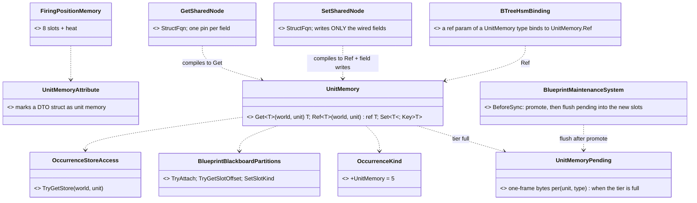
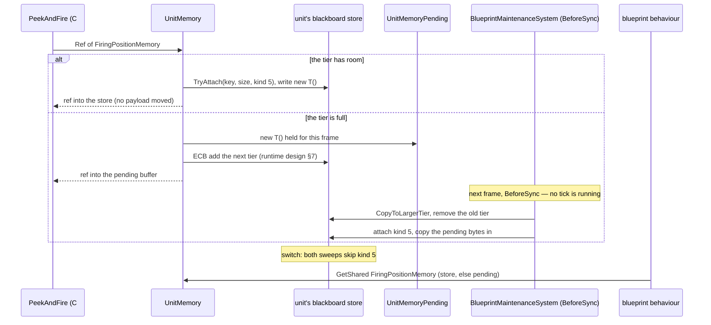
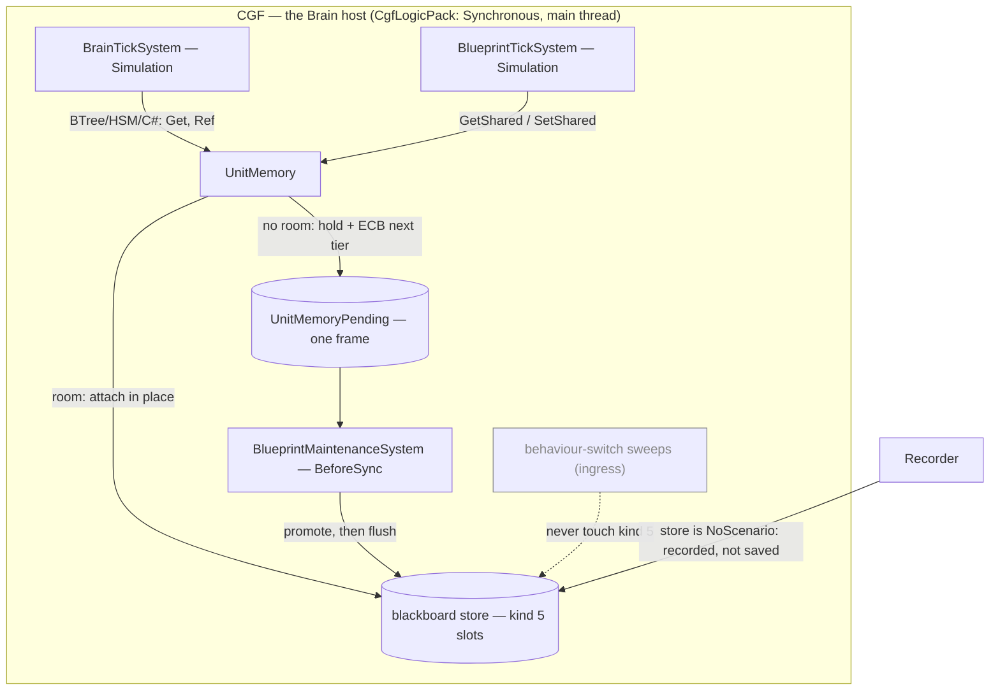

<!--STATUS
state: LIVE
updated: 2026-10-09 (rewritten after the user rejected the ECS-component lean — see §8 HISTORY)
build-state: DESIGN (leans A–H proposed; awaiting the user) — revised 2026-10-09 after the user's questions: fully lazy creation, two nodes, §3a why a tier cannot change mid-tick
current-answer: §0 the requirement · §2 diagrams · §3 decisions A–H · §3a why the store cannot change TIER inside a tick (measured) · §5 slices
stale-below: §8 HISTORY (two superseded leans — do not quote them)
known-rot: none yet
known-conflict: DESIGN_Parameter_Model.md:386 — "True entity-wide data is an ECS component field — not a variable section. No new variable owner is needed." (user, 2026-08-16). The user's 2026-10-09 requirement (§0) overrides its second sentence for behaviour-owned data: unit memory IS a new variable owner. Engine-read data stays an ECS component (§4)
related-designs:
  - Architect_Question_76_One_Blackboard_Block_Per_Primitive.md — OWNS the removal of the Entity scope and GetShared/SetShared (decisions A, C; §9 provenance; R-150). This question re-implements the capability on a different key and lifetime, and §3 H answers each failure Q76 measured
  - DESIGN_Occurrence_Scoped_Storage.md — OWNS the store unit memory lives in: slots, kinds, tiers, the "no structural change inside a tick" rule (§27) and the hosted-demand sizing (O7b-3) that unit memory copies
  - DESIGN_Parameter_Model.md — OWNS the variable model; unit memory is a fourth owner beside occurrence params, occurrence state and ECS components (see known-conflict)
  - Blueprint_SharedState_GetShared_Design.md — HISTORICAL: the first shared-memory design (2026-07); its NEEDS still hold, its name-keyed Entity scope does not come back
  - Blueprint_Component_Access_Design.md — OWNS GetComponent/SetComponent; NOT unit memory's access path (the user rejected components, §8)
  - ../DESIGN_Peek_And_Fire.md — OWNS the first consumer: FiringPositionMemory (§8 B1)
-->

# Architect Question 87 — Unit memory: unit-scoped shared blackboard structs *(backend, `2026-10-09`)*

> 🔒 **User, `2026-10-09`, verbatim — the requirement:**
> *"it is required to re-implement the unit-scoped shared blackboard structs"* ·
> *"designer-declared unit memory seems exactly right. Where to define it? it is a c# DTO struct that can be added to c#
> code of the ai behaviors assembly (even by a non-programmer i guess). … And how will we access those shared slots?
> GetShared/SetShared functions with equivalent blueprint nodes configurable for certain existing DTO?"* ·
> *"maybe the editor-defined list is not necessary if we create the shared slot the first time any behavior touches it at
> runtime? It would always be created with defaults as defined in the structure declaration (C# 10 and above)."*
>
> 🔒 **And the rejection of the component route:** *"no. no automatic component allocations. Component id range is very
> limited. We can have hundresds of behaviors."*

## 0. The design in one paragraph

A **unit memory** is a C# DTO struct a designer writes in the AI behaviours assembly, marked `[UnitMemory]`, with its defaults
as field initializers. At runtime it is **one slot in the unit's existing blackboard store**: a new slot kind
`OccurrenceKind.UnitMemory`, **keyed by the struct's TYPE** (one per unit). It is **created the first time any behaviour
touches it**, filled with `new T()`, and **lives as long as the unit**: no behaviour switch sweeps it. The *"group"* of
behaviours sharing it is simply every behaviour that touches the type, so nobody maintains a list. Access is through
**two blueprint nodes, `GetShared` and `SetShared`** (the latter writes only the fields you wire), configured by picking the struct,
a **BTree/HSM action or guard parameter of that type**, and **`UnitMemory.Ref<T>` in C#**. ⭐ **Fully lazy, with nothing declared
ahead**: if the store has room, the first touch claims it on the spot. If it does not, the value lives in a one-frame **pending
buffer** while the store moves to the next tier through the **existing two-frame promotion** (`BlueprintMaintenanceSystem`,
runtime design §7). Nothing is lost and nothing is listed; §3a says why the tier itself cannot change mid-tick.

## 1. INVENTORY — measured `2026-10-09` (graph CLI `search_graph` + grep + `git show`)

| query | total | what it found |
|---|---|---|
| `search_graph ".*UnitMemory.*"` | **0** | nothing exists under that name |
| `search_graph ".*(GetShared\|SetShared).*"` | 15 | docs, the editor's behaviour-scope `GetSharedScopeKeys`, the Make/Break palette's `ISharedStructTypeProvider` (**survived CE-440**, now feeds Make/Break). ⛔ **no runtime accessor** |
| `git show 5de52edab` (CE-440) | 1 commit | removed `BlueprintSharedState` (215 lines: `TryGetShared`/`TrySetShared`/`TrySetSharedField`, a `StructureHash` guard `TypeNameHash ^ size`), the node kinds, IR ops, validator BP2040–2042, the drawers |
| `search_graph ".*StatefulSlot.*"` | 27 | `StatefulSlotScope { Node, Behavior }`; `Entity = 2` retired, *"Do not reuse 2"* |
| `search_graph ".*OccurrenceKind.*"` | 3 | `Invalid 0, Blueprint 1, BTree 2, Hsm 3, BlueprintBehavior 4`; a 4-bit nibble ⇒ **11 free values** |
| grep `BlueprintTierLadder.cs` | 4 tiers | **256 B / 3 slots · 1 KB / 12 · 4 KB / 16 · 16 KB / 16** |
| read `BehaviorIngressSystem.cs` | — | the switch sweeps: `DetachStatefulSlots` frees **the manifest's keys only** (`:1661`); `DetachHostedOccurrenceSlots` frees **kinds `Hsm`/`Blueprint` only** (`:1218`). ⇒ ⭐ **a new kind is untouched by both, by construction** |
| read `BehaviorIngressSystem.cs:1402-1430` | — | ⭐ the **precedent**: hosted occurrences attach LAZILY, so their room is **added to the assign-time demand** (*"nothing later can grow the tier… a structural change inside a tick"*) |
| read `BlueprintTickSystem.cs:202` | — | `TryAttach` **inside a tick** already happens (lazily attached hosted blueprints) — attaching into existing room is not a structural change |
| read `CgfLogicPack.cs:58` | — | ⭐ the CGF pack is `ExecutionPolicy.Synchronous()`: the brain ticks **on the main thread, on the live world**. ⇒ no threads race on the store |
| read `BTreeRunner.cs:38` | — | ⭐ the runner holds a **raw pointer to the tree's state slot for the whole tick** (*"slots attach lazily without moving an existing payload, and only CopyToLargerTier … moves payloads"*) |
| read `OccurrenceStoreAccess.cs:27-38` | — | ⭐ **the LIFETIME RULE**: a tier swap *"adds the larger component and removes the smaller, so the old pointer is stale the moment it returns"* |
| read `Blueprint_Subsystem_Runtime_Detailed_Design.md` §7 | — | ⭐ **the designed growth path**: a tick that cannot attach ECB-adds the next tier; `BlueprintMaintenanceSystem` (BeforeSync) copies and removes the old one: **two frames**. Registered on CGF (`CgfLogicPack.cs:241`) |
| `trace_path` inbound `BlueprintTierTable.Promote` | 9 | ingress `UpgradeTier`, `EnsureAtLeast`, `BlueprintMaintenanceSystem.UpgradePair`, tests. 🔴 **Nothing in a tick starts §7's promotion**: `BlueprintTickSystem.cs:207` just `return; // tier capacity exhausted` — a **silent** drop, a finding (§3 D) |
| read `Architect_Question_16_Component_Write.md:38` | — | the OLD `SetShared` was **one** node: *"`SetShared` multi-pin → `TrySetSharedField` writes only wired fields"*. `TrySetSharedField` was the runtime helper, never a node |
| grep `Fbt.Kernel/BlackboardAnnotations.cs` | — | `[BlackboardDtoStruct]` (editor-only marker for the variable type picker) — the pattern `[UnitMemory]` follows |

**Measured language facts** (scratch net8.0, C# 12 as this repo):

| | result |
|---|---|
| field initializers without a declared constructor | ⛔ **CS8983** — the designer must write `public Foo() {}` |
| generic `new T()` · `Activator.CreateInstance<T>()` | ✅ **45** (the declared default) |
| `default(T)` · an array element | ⛔ **0** — so the store must initialise through `new T()`, never by zeroing |

## 2. Diagrams

### 2.1 Classes — grey = exists; new = the kind, the accessor, the attributes, the demand, the three node kinds

*What the picture shows that prose hid: the storage, slot table, kind nibble, lazy attach and two-frame promotion are all grey.
The new runtime is one accessor, one enum value and a one-frame pending buffer. The bulk of the new code is the authoring
surface (two nodes, and the binding arm in the BTree/HSM emitters).*

### 2.2 Sequence — first touch with room, first touch without, switch

*What it shows: a payload only ever moves in BeforeSync, when no tick holds a pointer into the store. The full-tier branch costs
one frame of indirection, never a lost write. And nothing anywhere needs to know in advance which types a behaviour uses.*

### 2.3 Modules — who creates, who moves, who reads each frame

*What it shows: the only system that moves payloads is BeforeSync maintenance, which is registered on CGF and runs every
frame, not only on assign. The grey edge is the sweep that must never reach a unit memory.*

## 3. Decisions — one lean each

| # | question | ⭐ lean | rejected (one line each) | blast radius · what would change it |
|---|---|---|---|---|
| **A** | **where is it stored?** | ⭐⭐ **a slot in the unit's existing blackboard store, `OccurrenceKind.UnitMemory = 5`** | **an ECS component per type**: rejected by the user, since component ids are capped at 512 and behaviours number in the hundreds. · **a separate store component just for unit memory**: a second store, ladder and inspector path for one concept | one enum value; the nibble has 11 free |
| **B** | **the key** | ⭐⭐ **the TYPE**: `FNV(typeof(T).FullName) & 0x7FFFFFFF`, kind 5, plus the old `StructureHash` guard (`TypeNameHash ^ Unsafe.SizeOf<T>()`) | **a variable name** (the old Entity scope): Q76 measured its collision domain. · **type + asset**: then it is behaviour memory, not unit memory | ⚠ renaming the struct starts fresh memory; acceptable for runtime-only data |
| **C** | **how is room found without a list?** | ⭐⭐ **fully lazy**: the first `Ref`/`Set` attaches **in place** when the tier has room (no payload moves, so every pointer a running tree holds stays valid — §3a). Nothing is declared ahead | **build-time demand + `[UsesUnitMemory]` on C# actions** (my previous lean): the list you ruled out, in attribute form, plus a compiler arm per asset kind. · **an editor list**: ruled unnecessary. · **fixed headroom per brain**: the 256 tier has 3 slots | ⭐ reuses the existing attach; no compiler or ingress change |
| **D** | **the tier is full at first touch** | ⭐⭐ **the existing two-frame promotion** (runtime design §7): ECB-add the next tier; `BlueprintMaintenanceSystem` copies and removes the old one in BeforeSync. Meanwhile the value lives in a **one-frame pending buffer**: `Ref` returns a ref into it, `Get` reads it, and maintenance copies it into the new slot right after the promotion. **No write is lost** | **swap the tier immediately inside the tick**: §3a, it strands the pointers the running tree holds. · **drop the write** (what `BlueprintTickSystem.cs:207` does today for blueprints): silent. · **throw**: the brain dies over a capacity detail | ⚠ **finding:** §7's promotion was designed but **no tick starts it**: blueprint attach failure is a silent `return`. U-1 wires the trigger, and the blueprint path can use the same one |
| **E** | **creation and defaults** | ⭐⭐ **created on the first `Ref`/`Set`, filled with `new T()`**. **`Get` on an absent slot returns `new T()` without creating it** (a read costs no room) | **create on Get too**: spends room on a type only ever read. · **zero-fill**: loses the declared defaults (§1: `default` gives 0) | the analyzer flags a `[UnitMemory]` struct with initializers but no constructor (the compiler already does: CS8983) |
| **F** | **lifetime and policy** | ⭐ **the unit's lifetime**: never swept by a switch, freed only with the store. Inherits the store's policy, **`NoScenario`**: recorded for replay, never saved in a scenario. Not on the wire; lost on a brain failover | **cleared on behaviour switch**: is behaviour memory, which already exists. · **saved in scenarios**: a scenario is the authored start, not a remembered past. · **a "forget" rule**: a designer writes `new T()` to reset | a `StructureHash` mismatch (a changed struct meeting old replay bytes) **re-initialises to `new T()`**, never reads garbage |
| **G** | **access surfaces** | ⭐⭐ **blueprint: TWO nodes.** `GetShared(T)` gives a pin per field. `SetShared(T)` takes a pin per field and **writes only the wired ones; the rest keep their value** (the old `SetShared` and today's `SetComponent` both work this way: Q16 `:38`). **BTree/HSM**: an action or guard whose `ref` parameter is a `[UnitMemory]` type binds to it **automatically**, with no variable to create. **C#**: `UnitMemory.Ref<T>` / `Get<T>`. **Self only** | **a third `SetSharedField` node**: my mistake, since it was only ever the runtime helper behind `SetShared`. · **a whole-struct `SetShared`**: forces get, break, make, set to change one field, and clobbers concurrent writers' other fields. · **a variable id + scope**: the R-150 complexity. · **a cross-entity read pin**: one demo in 14 months (Q76 §1.4) | ⚠ resetting to defaults is not a node yet; add a "reset" option on `SetShared` if a designer asks |
| **H** | **does it repeat Q76's failures?** | ⭐⭐ **no**: ① **survives switches**: kind 5 is outside both sweeps by construction (§1). ② **no collisions**: the key is the type. ③ **ownership decided**: the unit owns it, every behaviour may read and write it, last writer in tick order wins. ④ **a real consumer**: `FiringPositionMemory`. ⑤ **R-150**: the author holds one idea, *"a struct I declare and touch"*. No scope, no variable, no list | — | ⚠ **per-unit slot budget**: 16 at most. A unit touching many unit-memory types *and* a slot-heavy behaviour can hit it; the validator warns on a definition whose demand exceeds 4 types |

## 3a. Why the store cannot change TIER inside a tick — measured, answering the user

> 🔒 **User, `2026-10-09`:** *"pls explain why storage can not grow during tick? If it grows only in same blackboard component or
> by allocating bigger one, what could break? there are no races on the main thread, are they?"*

| case | what happens | safe mid-tick? |
|---|---|---|
| **grow inside the same component** (free slot + free payload) | `TryAttach` claims room; **no existing payload moves** (`BTreeRunner.cs:33-37` relies on exactly this) | ✅ **yes**, and it already happens for lazily attached hosted occurrences (`BlueprintTickSystem.cs:202`) |
| **grow to a bigger tier** | a **different component type**: `UpgradeTier` adds `BlueprintBlackboard4096`, `CopyToLargerTier`, removes `…1024` (`OccurrenceStoreAccess.cs:31-33`). **Every payload moves to new memory** | ⛔ **no**, for the reason in the next row |
| **what breaks** | ⭐ **not a race**: CGF ticks the brain synchronously on the main thread (`CgfLogicPack.cs:58`). ⛔ **Stale pointers**: the runner holds a raw pointer to the tree's state slot for the whole tick (`BTreeRunner.cs:38`), and every running node holds a `ref` to its own working state. After the swap they all point into the **removed** tier: the tree's cursor and the nodes' writes for the rest of the tick land in memory that is no longer the store, so they are **silently lost**. And `NativeChunkTable` may **decommit** an emptied chunk (`:478`), which turns a stale write into an access violation | — |
| **the designed answer** | promote between ticks: ECB-add now, migrate in **BeforeSync** (runtime design §7.1: *"structural mutations during Simulation must go through ECB"*; FDP `architectural-rules.md` §7) | ⭐ **D uses it** |

## 4. The generality rule — which home for per-unit data

| the data is read or written by… | home |
|---|---|
| **engine systems** (non-behaviour code needs it) | an **ECS component** in a toolkit, registered by its module (as today) |
| **behaviours only**: any mix of C# nodes, BTree, HSM, blueprints, and instance blueprints standing in for engine C# | ⭐ **a unit memory struct**: declared next to its readers (behaviours assembly; or a toolkit when a toolkit C# node reads it) |
| **one running behaviour only** | its own block (Q76 B): already exists |

## 5. Slices — after approval

| slice | content | rail |
|---|---|---|
| **U-1** runtime | `OccurrenceKind.UnitMemory`, `UnitMemory.Get/Ref/Set/Key`, `StructureHash` guard + re-init, `UnitMemoryPending`, the ECB trigger for §7's promotion, and `BlueprintMaintenanceSystem` flushing pending after it promotes | a value written under behaviour A is read under B after a switch; a fresh unit reads the declared defaults (not zeros); `Get` on an absent type creates nothing; **on a full 256 tier, a write survives the two-frame promotion** |
| **U-2** C# + BTree/HSM | `[UnitMemory]`; the BTree/HSM emitters bind `ref T` params of unit-memory types | a C# tree and an HSM on one unit share one `FiringPositionMemory` |
| **U-3** blueprint | `GetShared`/`SetShared` (type picker only; wired fields only), compiler arms, validator | a blueprint reads what a C# node wrote; an unwired field keeps its value |
| **U-4** first consumer | `FiringPositionMemory` (`DESIGN_Peek_And_Fire.md` §8 B1) | P-6: a window burned after 3 uses stays burned across a posture switch |

⇒ **P-6 needs U-1 + U-2 only**; U-3 can follow.

## 6. Claim table

| claim | code — how it IS | design — how it was MEANT |
|---|---|---|
| a new kind survives both switch sweeps | ✅ `BehaviorIngressSystem.cs:1661` (manifest keys), `:1218` (kinds Hsm/Blueprint) | ✅ `DESIGN_Occurrence_Scoped_Storage.md` §13 (D1′: kind declared by the attacher) |
| attach inside a tick moves nothing; a tier swap moves everything | ✅ `BTreeRunner.cs:33-38` · `BlueprintTickSystem.cs:202` · `OccurrenceStoreAccess.cs:27-38` | ✅ runtime design §7.1 · same doc §27 |
| the brain ticks on the main thread on CGF | ✅ `CgfLogicPack.cs:58` (`Synchronous`) | ✅ FDP `architectural-rules.md` §6 |
| a two-frame promotion exists and runs every frame on CGF | ✅ `BlueprintMaintenanceSystem` (BeforeSync), registered `CgfLogicPack.cs:241` · ⛔ nothing in a tick starts it today (`BlueprintTickSystem.cs:207`) | ✅ runtime design §7.2 |
| tier budgets 3/12/16/16 slots | ✅ `BlueprintTierLadder.cs:92,102,115,125` | ✅ same doc §5a (slots axis) |
| the store is recorded, not scenario-saved | ✅ `OccurrenceKind.cs` remarks (CE-2028) | ✅ `DESIGN_Unified_Behaviour_Run.md` "S8c as-built" |
| the old accessor's guard is reusable | ✅ `git show 5de52edab^:…/BlueprintSharedState.cs` (`TypeNameHash ^ size`) | ✅ `Blueprint_SharedState_GetShared_Design.md` §2 |
| defaults only through a constructor | ✅ measured, §1 | n/a |
| the emitters can see a `ref` param's type to bind it | ⛔ **assumed**: the BTree/HSM emitters bind by variable today; U-2's first step measures the action schema export | ⛔ not searched |
| `Unsafe.SizeOf` matches the store's payload size for an `[InlineArray]` struct | ⛔ **assumed**; U-1's rail measures it, with 8 explicit fields as the fallback | ⛔ not searched |

## 7. What this does NOT change

⛔ No ECS component per type, no editor list, no scope enum (Q76 C stands), no cross-entity read. ⛔ Behaviour-run blocks,
hosted occurrences and their sweeps are untouched; only the tier sizing adds one demand term.

## 8. ⛔ HISTORY — superseded leans, do not quote

- **First lean, `2026-10-09`:** a store slot keyed by type, created lazily. Set aside for the component lean below. ⭐ **It is
  essentially §3 again**, now with the room problem solved by build-time demand.
- **Third lean's first cut, `2026-10-09` (revised the same day after the user's questions):** room was reserved at assign from
  build-time demand plus a `[UsesUnitMemory]` attribute on C# actions, an overflow grew the tier "at the next ingress", and
  there were three nodes (`SetSharedField` separately). ⛔ Superseded: the demand is the list again in attribute form, the next
  ingress only runs on assign, and `SetSharedField` was never a node (Q16 `:38`).
- **Second lean, `2026-10-09` — REJECTED by the user:** *"no automatic component allocations. Component id range is very
  limited. We can have hundresds of behaviors."* It proposed each unit memory as its own ECS component (id block 410–449,
  created on assign, reached through `GetComponent`/`SetComponent`). ⛔ **Dead: 40 ids cannot cover hundreds of behaviours.**
