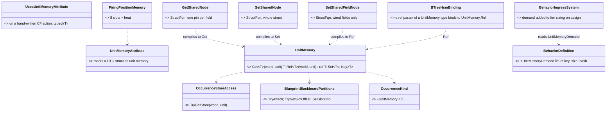
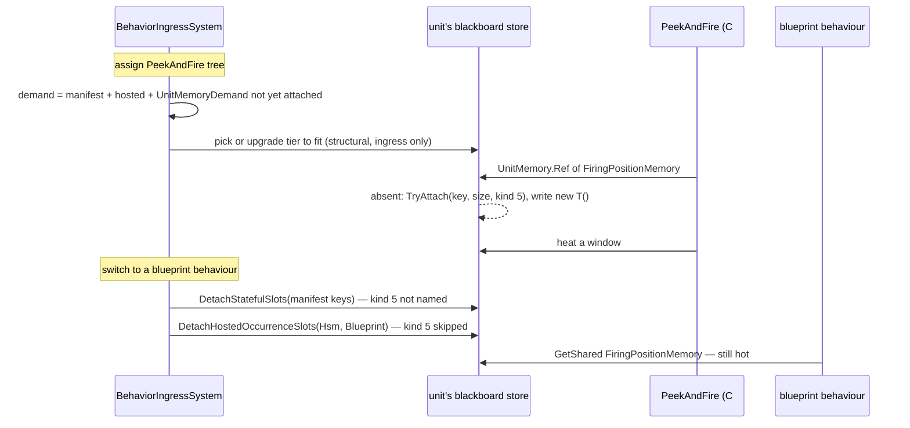
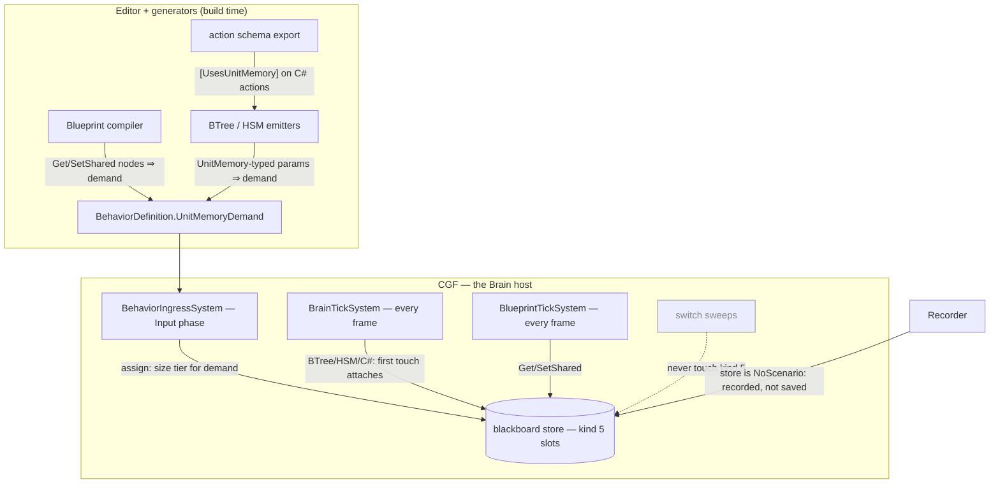

<!--STATUS
state: LIVE
updated: 2026-10-09 (rewritten after the user rejected the ECS-component lean — see §8 HISTORY)
build-state: DESIGN (leans A–H proposed; awaiting the user)
current-answer: §0 the requirement · §2 diagrams · §3 decisions A–H (one lean each) · §5 slices
stale-below: §8 HISTORY (two superseded leans — do not quote them)
known-rot: none yet
known-conflict: DESIGN_Parameter_Model.md:386 — "True entity-wide data is an ECS component field — not a variable section. No new variable owner is needed." (user, 2026-08-16). The user's 2026-10-09 requirement (§0) overrides its second sentence for behaviour-owned data: unit memory IS a new variable owner. Engine-read data stays an ECS component (§4)
related-designs:
  - Architect_Question_76_One_Blackboard_Block_Per_Primitive.md — OWNS the removal of the Entity scope and GetShared/SetShared (decisions A, C; §9 provenance; R-150). This question re-implements the capability on a different key and lifetime, and §3 H answers each failure Q76 measured
  - DESIGN_Occurrence_Scoped_Storage.md — OWNS the store unit memory lives in: slots, kinds, tiers, the "no structural change inside a tick" rule (§27) and the hosted-demand sizing (O7b-3) that unit memory copies
  - DESIGN_Parameter_Model.md — OWNS the variable model; unit memory is a fourth owner beside occurrence params, occurrence state and ECS components (see known-conflict)
  - Blueprint_SharedState_GetShared_Design.md — HISTORICAL: the first shared-memory design (2026-07); its NEEDS still hold, its name-keyed Entity scope does not come back
  - Blueprint_Component_Access_Design.md — OWNS GetComponent/SetComponent; NOT unit memory's access path (the user rejected components, §8)
  - ../DESIGN_Peek_And_Fire.md — OWNS the first consumer: FiringPositionMemory (§8 B1)
-->

# Architect Question 87 — Unit memory: unit-scoped shared blackboard structs *(backend, `2026-10-09`)*

> 🔒 **User, `2026-10-09`, verbatim — the requirement:**
> *"it is required to re-implement the unit-scoped shared blackboard structs"* ·
> *"designer-declared unit memory seems exactly right. Where to define it? it is a c# DTO struct that can be added to c#
> code of the ai behaviors assembly (even by a non-programmer i guess). … And how will we access those shared slots?
> GetShared/SetShared functions with equivalent blueprint nodes configurable for certain existing DTO?"* ·
> *"maybe the editor-defined list is not necessary if we create the shared slot the first time any behavior touches it at
> runtime? It would always be created with defaults as defined in the structure declaration (C# 10 and above)."*
>
> 🔒 **And the rejection of the component route:** *"no. no automatic component allocations. Component id range is very
> limited. We can have hundresds of behaviors."*

## 0. The design in one paragraph

A **unit memory** is a C# DTO struct a designer writes in the AI behaviours assembly, marked `[UnitMemory]`, with its defaults
as field initializers. At runtime it is **one slot in the unit's existing blackboard store**: a new slot kind
`OccurrenceKind.UnitMemory`, **keyed by the struct's TYPE** (one per unit). It is **created the first time any behaviour
touches it**, filled with `new T()`, and **lives as long as the unit**: no behaviour switch sweeps it. The *"group"* of
behaviours sharing it is simply every behaviour that touches the type, so nobody maintains a list. Access is through
**`GetShared`/`SetShared`/`SetSharedField` blueprint nodes** configured by picking the struct, a **BTree/HSM action or guard
parameter of that type**, and **`UnitMemory.Ref<T>` in C#**. ⭐ One thing must be known ahead, because the store cannot grow
inside a tick: **how much room to reserve.** The compiler works that out from each behaviour's uses (decision C), just as hosted
children's room is reserved today.

## 1. INVENTORY — measured `2026-10-09` (graph CLI `search_graph` + grep + `git show`)

| query | total | what it found |
|---|---|---|
| `search_graph ".*UnitMemory.*"` | **0** | nothing exists under that name |
| `search_graph ".*(GetShared\|SetShared).*"` | 15 | docs, the editor's behaviour-scope `GetSharedScopeKeys`, the Make/Break palette's `ISharedStructTypeProvider` (**survived CE-440**, now feeds Make/Break). ⛔ **no runtime accessor** |
| `git show 5de52edab` (CE-440) | 1 commit | removed `BlueprintSharedState` (215 lines: `TryGetShared`/`TrySetShared`/`TrySetSharedField`, a `StructureHash` guard `TypeNameHash ^ size`), the node kinds, IR ops, validator BP2040–2042, the drawers |
| `search_graph ".*StatefulSlot.*"` | 27 | `StatefulSlotScope { Node, Behavior }`; `Entity = 2` retired, *"Do not reuse 2"* |
| `search_graph ".*OccurrenceKind.*"` | 3 | `Invalid 0, Blueprint 1, BTree 2, Hsm 3, BlueprintBehavior 4`; a 4-bit nibble ⇒ **11 free values** |
| grep `BlueprintTierLadder.cs` | 4 tiers | **256 B / 3 slots · 1 KB / 12 · 4 KB / 16 · 16 KB / 16** |
| read `BehaviorIngressSystem.cs` | — | the switch sweeps: `DetachStatefulSlots` frees **the manifest's keys only** (`:1661`); `DetachHostedOccurrenceSlots` frees **kinds `Hsm`/`Blueprint` only** (`:1218`). ⇒ ⭐ **a new kind is untouched by both, by construction** |
| read `BehaviorIngressSystem.cs:1402-1430` | — | ⭐ the **precedent**: hosted occurrences attach LAZILY, so their room is **added to the assign-time demand** (*"nothing later can grow the tier… a structural change inside a tick"*) |
| read `BlueprintTickSystem.cs:202` | — | `TryAttach` **inside a tick** already happens (lazily attached hosted blueprints) — attaching into existing room is not a structural change |
| grep `Fbt.Kernel/BlackboardAnnotations.cs` | — | `[BlackboardDtoStruct]` (editor-only marker for the variable type picker) — the pattern `[UnitMemory]` follows |

**Measured language facts** (scratch net8.0, C# 12 as this repo):

| | result |
|---|---|
| field initializers without a declared constructor | ⛔ **CS8983** — the designer must write `public Foo() {}` |
| generic `new T()` · `Activator.CreateInstance<T>()` | ✅ **45** (the declared default) |
| `default(T)` · an array element | ⛔ **0** — so the store must initialise through `new T()`, never by zeroing |

## 2. Diagrams

### 2.1 Classes — grey = exists; new = the kind, the accessor, the attributes, the demand, the three node kinds

*What the picture shows that prose hid: the storage, slot table, kind nibble and lazy attach are all grey. The new runtime
is one static accessor and one enum value. The bulk of the new code is the authoring surface (three nodes, and the
binding arm in the BTree/HSM emitters).*

### 2.2 Sequence — assign, first touch, switch

*What it shows: the only structural change is at assign, where the room is reserved. The first touch only claims that room.
Neither switch sweep can see the slot, which is the exact place Q76's Entity scope failed.*

### 2.3 Modules — who sizes, who creates, who reads each frame

*What it shows: the room comes from build-time knowledge (no editor list), and every reader ticks on the host that owns the
store. The grey edge is the sweep that must never reach a unit memory.*

## 3. Decisions — one lean each

| # | question | ⭐ lean | rejected (one line each) | blast radius · what would change it |
|---|---|---|---|---|
| **A** | **where is it stored?** | ⭐⭐ **a slot in the unit's existing blackboard store, `OccurrenceKind.UnitMemory = 5`** | **an ECS component per type**: rejected by the user, since component ids are capped at 512 and behaviours number in the hundreds. · **a separate store component just for unit memory**: a second store, ladder and inspector path for one concept | one enum value; the nibble has 11 free |
| **B** | **the key** | ⭐⭐ **the TYPE**: `FNV(typeof(T).FullName) & 0x7FFFFFFF`, kind 5, plus the old `StructureHash` guard (`TypeNameHash ^ Unsafe.SizeOf<T>()`) | **a variable name** (the old Entity scope): Q76 measured its collision domain. · **type + asset**: then it is behaviour memory, not unit memory | ⚠ renaming the struct starts fresh memory; acceptable for runtime-only data |
| **C** | **how is room reserved without an editor list?** | ⭐⭐ **derived at build time**: the blueprint compiler, BTree/HSM emitters and hosted children emit `BehaviorDefinition.UnitMemoryDemand` (types the behaviour may touch). Assign adds the **not-yet-attached** ones to tier sizing, exactly as hosted demand (O7b-3). A hand-written C# action declares `[UsesUnitMemory(typeof(T))]` | **an editor list**: you ruled it unnecessary, and it goes stale. · **a fixed headroom per brain**: either too small (the 256 tier has 3 slots) or wasteful on every unit. · **grow at first touch**: a structural change inside a tick | the safety net is decision D |
| **D** | **first touch finds no room** (an undeclared C# use) | ⭐ **fail loudly, then grow at the next ingress**: `Ref`/`Set` return the not-stored path (Get gives `new T()`, the write is dropped), log once per (unit, type) naming the missing `[UsesUnitMemory]`, and queue a grow that the next Input phase applies | **silently drop**: the CE-3091 failure mode. · **throw**: brain dies on a missing attribute | ⚠ one frame of lost writes, visible in the log, never silent |
| **E** | **creation and defaults** | ⭐⭐ **created on the first `Ref`/`Set`, filled with `new T()`**. **`Get` on an absent slot returns `new T()` without creating it** (a read costs no room) | **create on Get too**: spends room on a type only ever read. · **zero-fill**: loses the declared defaults (§1: `default` gives 0) | the analyzer flags a `[UnitMemory]` struct with initializers but no constructor (the compiler already does: CS8983) |
| **F** | **lifetime and policy** | ⭐ **the unit's lifetime**: never swept by a switch, freed only with the store. Inherits the store's policy, **`NoScenario`**: recorded for replay, never saved in a scenario. Not on the wire; lost on a brain failover | **cleared on behaviour switch**: is behaviour memory, which already exists. · **saved in scenarios**: a scenario is the authored start, not a remembered past. · **a "forget" rule**: a designer writes `new T()` to reset | a `StructureHash` mismatch (a changed struct meeting old replay bytes) **re-initialises to `new T()`**, never reads garbage |
| **G** | **access surfaces** | ⭐⭐ **blueprint** `GetShared(T)` (a pin per field), `SetShared(T)` (whole), `SetSharedField(T)` (wired fields only): **configured by picking the struct, nothing else**. **BTree/HSM**: an action or guard whose `ref` parameter is a `[UnitMemory]` type binds to it **automatically**, with no variable to create. **C#**: `UnitMemory.Ref<T>` / `Get<T>`. **Self only** | **a variable id + scope on the node** (the old shape): the author-facing complexity R-150 removed. · **cross-entity read pin** (the old `Target`): one demo used it in 14 months (Q76 §1.4); add when a leader needs it | the picker lists `[UnitMemory]` types from the existing struct-type scan (`ISharedStructTypeProvider`, kept by CE-440) |
| **H** | **does it repeat Q76's failures?** | ⭐⭐ **no**: ① **survives switches**: kind 5 is outside both sweeps by construction (§1). ② **no collisions**: the key is the type. ③ **ownership decided**: the unit owns it, every behaviour may read and write it, last writer in tick order wins. ④ **a real consumer**: `FiringPositionMemory`. ⑤ **R-150**: the author holds one idea, *"a struct I declare and touch"*. No scope, no variable, no list | — | ⚠ **per-unit slot budget**: 16 at most. A unit touching many unit-memory types *and* a slot-heavy behaviour can hit it; the validator warns on a definition whose demand exceeds 4 types |

## 4. The generality rule — which home for per-unit data

| the data is read or written by… | home |
|---|---|
| **engine systems** (non-behaviour code needs it) | an **ECS component** in a toolkit, registered by its module (as today) |
| **behaviours only**: any mix of C# nodes, BTree, HSM, blueprints, and instance blueprints standing in for engine C# | ⭐ **a unit memory struct**: declared next to its readers (behaviours assembly; or a toolkit when a toolkit C# node reads it) |
| **one running behaviour only** | its own block (Q76 B): already exists |

## 5. Slices — after approval

| slice | content | rail |
|---|---|---|
| **U-1** runtime | `OccurrenceKind.UnitMemory`, `UnitMemory.Get/Ref/Set/Key`, `StructureHash` guard + re-init, the overflow path (D) + queued grow, `UnitMemoryDemand` on `BehaviorDefinition` and its add in tier sizing | a value written under behaviour A is read under B after a switch; a fresh unit reads the declared defaults (not zeros); `Get` on an absent type creates nothing; an undeclared C# touch logs and works next frame |
| **U-2** C# + BTree/HSM | `[UnitMemory]`, `[UsesUnitMemory]`; the action-schema export carries it; BTree/HSM emitters bind `ref T` params of unit-memory types and emit demand | a C#-tree and an HSM on one unit share one `FiringPositionMemory` |
| **U-3** blueprint | `GetShared`/`SetShared`/`SetSharedField` nodes (type picker only), compiler arms + demand, validator | a blueprint reads what a C# node wrote |
| **U-4** first consumer | `FiringPositionMemory` (`DESIGN_Peek_And_Fire.md` §8 B1) | P-6: a window burned after 3 uses stays burned across a posture switch |

⇒ **P-6 needs U-1 + U-2 only**; U-3 can follow.

## 6. Claim table

| claim | code — how it IS | design — how it was MEANT |
|---|---|---|
| a new kind survives both switch sweeps | ✅ `BehaviorIngressSystem.cs:1661` (manifest keys), `:1218` (kinds Hsm/Blueprint) | ✅ `DESIGN_Occurrence_Scoped_Storage.md` §13 (D1′: kind declared by the attacher) |
| room must be reserved at assign; attach inside a tick is fine | ✅ `BehaviorIngressSystem.cs:1402-1430` · `BlueprintTickSystem.cs:202` | ✅ same doc §27, O7b-3 |
| tier budgets 3/12/16/16 slots | ✅ `BlueprintTierLadder.cs:92,102,115,125` | ✅ same doc §5a (slots axis) |
| the store is recorded, not scenario-saved | ✅ `OccurrenceKind.cs` remarks (CE-2028) | ✅ `DESIGN_Unified_Behaviour_Run.md` "S8c as-built" |
| the old accessor's guard is reusable | ✅ `git show 5de52edab^:…/BlueprintSharedState.cs` (`TypeNameHash ^ size`) | ✅ `Blueprint_SharedState_GetShared_Design.md` §2 |
| defaults only through a constructor | ✅ measured, §1 | n/a |
| the emitters can see a `ref` param's type to bind it | ⛔ **assumed**: the BTree/HSM emitters bind by variable today; U-2's first step measures the action schema export | ⛔ not searched |
| `Unsafe.SizeOf` matches the store's payload size for an `[InlineArray]` struct | ⛔ **assumed**; U-1's rail measures it, with 8 explicit fields as the fallback | ⛔ not searched |

## 7. What this does NOT change

⛔ No ECS component per type, no editor list, no scope enum (Q76 C stands), no cross-entity read. ⛔ Behaviour-run blocks,
hosted occurrences and their sweeps are untouched; only the tier sizing adds one demand term.

## 8. ⛔ HISTORY — superseded leans, do not quote

- **First lean, `2026-10-09`:** a store slot keyed by type, created lazily. Set aside for the component lean below. ⭐ **It is
  essentially §3 again**, now with the room problem solved by build-time demand.
- **Second lean, `2026-10-09` — REJECTED by the user:** *"no automatic component allocations. Component id range is very
  limited. We can have hundresds of behaviors."* It proposed each unit memory as its own ECS component (id block 410–449,
  created on assign, reached through `GetComponent`/`SetComponent`). ⛔ **Dead: 40 ids cannot cover hundreds of behaviours.**
