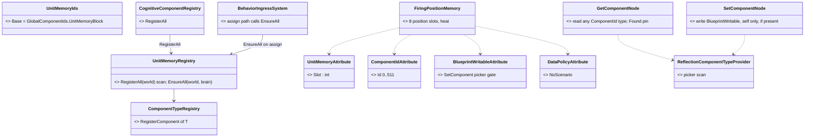
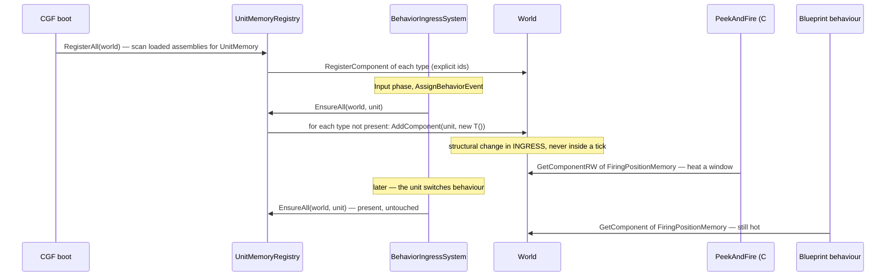
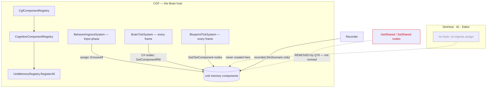

<!--STATUS
state: LIVE
updated: 2026-10-09
build-state: DESIGN (leans A–G proposed; awaiting the user)
current-answer: §0 the proposal · §2 diagrams · §3 decisions A–G (one lean each) · §4 the generality rule · §5 slices
stale-below: §8 HISTORY (my first lean — a blackboard-tier slot — superseded by the §1 measurement)
known-rot: none yet
known-conflict: Blueprint_Component_Access_Design.md (Q#16) — "Write-if-present (no implicit add)". This proposal keeps that rule; it adds the component BEFORE any write can happen (decision C), it does not add an implicit add
related-designs:
  - Architect_Question_76_One_Blackboard_Block_Per_Primitive.md — OWNS the removal of the entity-scope blackboard and GetShared/SetShared (decisions A, C; §9 provenance; R-150). This question is the replacement it never had, and §3 G answers its failure modes
  - DESIGN_Parameter_Model.md — OWNS the variable model and the ruling "True entity-wide data is an ECS component field" (:386). This question obeys that ruling instead of revising it
  - Blueprint_Component_Access_Design.md — OWNS the blueprint GetComponent/SetComponent nodes (Q#15/Q#16) that become unit memory's blueprint access, unchanged
  - DESIGN_Occurrence_Scoped_Storage.md — OWNS the per-behaviour blackboard store and its "no structural change inside a tick" rule (§27, O7b-3); unit memory deliberately does NOT live there (§3 A)
  - ../DESIGN_Peek_And_Fire.md — OWNS the first consumer: FiringPositionMemory (§8 B1)
  - Blueprint_SharedState_GetShared_Design.md — HISTORICAL: the first design of shared memory (removed by Q76); read for its needs, not its mechanism
-->

# Architect Question 87 — Unit memory: entity-wide memory a behaviour designer declares *(backend, `2026-10-09`)*

> 🔒 **User, `2026-10-09`, verbatim:**
> *"was the decision to remove entity-wide shared blackboard slots a good one? … Someone has to create that ECS component
> what some behaviors needs it. Different behavior groups might need different entity-level shared data. game ai designer
> who creates behaviors can not add new components."* ·
> *"designer-declared unit memory seems exactly right. Where to define it? it is a c# DTO struct that can be added to c#
> code of the ai behaviors assembly (even by a non-programmer i guess). … The decision c# ECS component vs DTO types
> blackboard slot should be about generality of the component"* ·
> *"maybe the editor-defined list is not necessary if we create the shared slot the first time any behavior touches it at
> runtime? It would always be created with defaults as defined in the structure declaration (C# 10 and above)."*

## 0. The proposal in one paragraph

A **unit memory** is a C# struct a designer writes in the AI behaviours assembly, marked `[UnitMemory]`, with its defaults
written as field initializers. ⭐ **It is an ordinary ECS component.** That is the one thing measurement changed: everything
a designer needs already exists for components. Blueprint `GetComponent`/`SetComponent` find it by reflection, C# nodes use
`GetComponentRW`, and the inspector, HTTP entity reads and recordings show it like any component. What is new is small:
**registration by scan**, **creation with `new T()` when a behaviour is assigned**, and **an id block** so the designer never
edits an engine file. There is no editor list, no scope dropdown, no new node kind, and no change to the blackboard store.

## 1. INVENTORY — measured `2026-10-09` (graph CLI `search_graph` + grep; the graph was re-indexed this session)

| query | total | what it found |
|---|---|---|
| `search_graph name_pattern=".*UnitMemory.*"` | **0** | nothing exists under that name |
| `search_graph ".*(GetShared\|SetShared).*"` | 15 | only docs, the editor's `GetSharedScopeKeys` (behaviour scope) and the Make/Break palette's `ISharedStructTypeProvider`: ⛔ **no runtime accessor survives** (removed, `CE-440`) |
| `search_graph ".*StatefulSlot.*"` | 27 | `StatefulSlotScope` has `Node`, `Behavior`; **`Entity = 2` retired, "Do not reuse 2"** (`StatefulSlotScope.cs:18`) |
| `search_graph ".*BlueprintWritable.*"` | 2 | `BlueprintWritableAttribute` (Fdp.Core) + its tests |
| `search_graph ".*(GetComponentNode\|SetComponentNode\|…)" label=Class` | 7 | ⭐ **`GetComponentNode` / `SetComponentNode` + drawers + `IrOp_WriteComponentFields`, shipped** |
| `search_graph ".*ComponentRegistry.*" label=Class` | 27 | per-module `*ComponentRegistry.RegisterAll` (explicit `RegisterComponent<T>()`); `CognitiveComponentRegistry` is called by **`CgfComponentRegistry` only** (the Brain host) |
| `search_graph ".*OccurrenceKind.*"` | 3 | the store's slot kinds (`Blueprint`, `BTree`, `Hsm`, `BlueprintBehavior`); 12 of 16 values free |
| grep `GlobalComponentIds.cs` | 157 consts, max id **343** | ids are limited to **[0, 511]** (`BitMask512`); `EnforceExplicitComponentIds = true` in production (`ClusterRunner/Program.cs:51`) |

**Measured language facts** (a scratch net8.0 project, C# 12 as this repo uses):

| | result |
|---|---|
| a struct with field initializers and no constructor | ⛔ **CS8983**: *"A 'struct' with field initializers must include an explicitly declared constructor"* |
| `struct Mem { public Mem() {} public float HalfLife = 45f; }`, generic `new T()` | ✅ **45** |
| `Activator.CreateInstance<Mem>()` | ✅ **45** |
| `default(Mem)` · `new Mem[1][0]` | ⛔ **0** · ⛔ **0** — the defaults run ONLY through a constructor call |

## 2. Diagrams

### 2.1 Classes — grey = exists; only `UnitMemoryAttribute`, `UnitMemoryRegistry` and the id block are new

*What the picture shows that prose hid: the blueprint access (two nodes and their pickers) is entirely grey. The whole
designer surface already exists. The new code is one scan and one call on the assign path.*

### 2.2 Sequence — assign, then two behaviours share one memory

*What it shows: the memory is created once, before any tick can touch it, and a behaviour switch passes it through untouched.
⛔ Q76's entity scope died at exactly that switch (the detach sweep had no scope filter); a component is not in the sweep at all.*

### 2.3 Modules — who registers, who creates, who reads each frame

*What it shows: the only creator is the brain's own ingress, and every reader is already ticking on the same host. The red
edge is the removed surface. This design does not revive it.*

## 3. Decisions — one lean each

| # | question | ⭐ lean | rejected (one line each) | blast radius · what would change the lean |
|---|---|---|---|---|
| **A** | **where does it live?** | ⭐⭐ **an ordinary ECS component** declared by the designer | **blackboard-store slot keyed by type**: needs a new node kind (GetShared/SetShared was a 1 356-line compiler slice, Q76 §4 A), competes for the 12–16 slot budget (Q76 §4 B) and sits in the sweep that killed entity scope. · **a managed per-entity dictionary component**: allocation, no per-field blueprint access, invisible to recordings | new code ≈ one attribute, one scan, one assign call. ⛔ Would change if component ids ran out (§3 B) |
| **B** | **how does a designer give it an id without editing an engine file?** | ⭐ **a reserved block in `GlobalComponentIds`** (`UnitMemoryBlock` = **410, 40 ids → 449**; 343 is the highest catalogued id, and a repo-wide grep finds no `[ComponentId]` in 401–449) and **`[UnitMemory(slot)]`**, so the id is `UnitMemoryBlock + slot`. The designer writes `[ComponentId(UnitMemoryIds.Base + 3)]` from a small catalog **in the behaviours assembly**, the same pattern as `NavigationContractsComponentIds` (`Fdp.Toolkits/Navigation`) | **an auto-assigned id (sorted names or a hash)**: a new type silently shifts or collides ids, and recordings carry raw component ids. · **a const in `GlobalComponentIds` per type**: an engine edit for every designer struct. · **448–511**: test types squat there ad hoc (`ClusterRunner.Tests` 500/501, `Fdp.Core.Tests` 460–480, a scenario test 505), and the ClusterRunner ones can share a world with the CGF registries | a startup check throws on a duplicate or out-of-block slot. ⛔ Would change if 40 types prove too few |
| **C** | **when is it created, and with what?** | ⭐⭐ **at behaviour assign, if absent, every `[UnitMemory]` type on that unit**, with **`new T()`** (the declared defaults, §1). It is never removed on a switch; it goes with the entity | **literal first touch**: a SetComponent add is an ECB-deferred structural change, so a read in the same tick sees nothing, and Q#16's "no implicit add" would have to bend. · **only the types the behaviour uses**: a compiled uses-manifest per asset kind; worth it only when there are many types (re-open past ~16 types or a large one). · **at spawn by a TKB translator**: runs on replicas too, and needs per-type spawn code (today's B1 wording) | ingress already adds tier components synchronously on assign (`BehaviorIngressSystem.cs:1430`). ⚠ **the analyzer must reject a `[UnitMemory]` struct without a declared constructor**, or `new T()` silently gives zeros |
| **D** | **how is it accessed?** | ⭐ **unchanged, existing surfaces**: blueprint `GetComponent` (any id'd type) and `SetComponent` (needs `[BlueprintWritable]`, which the designer adds); C# nodes use `GetComponentRW<T>`. The picker gains a **"Unit memory"** group (filter on the attribute) | new GetShared/SetShared nodes: duplicate surfaces for one concept (ruling 9). · a JSON BTree/HSM guard reading fields directly: an existing limit for every component, not this question's | ⛔ no change to the blueprint compiler. ⚠ an `[InlineArray]` field (8 slots) is C#-only; blueprints see its scalar fields |
| **E** | **save, replay, wire?** | ⭐ **`[DataPolicy(NoScenario)]`**: recorded for replay, never saved in a scenario (same as `RecentSenses`). **Not on the wire**: brain-local, lost on a brain failover | saved in scenarios: a scenario is the authored start, not a remembered past. · replicated: no reader on another node | ⚠ the analyzer requires the policy so the designer cannot forget it. ⛔ Would change if a unit memory ever had to survive a failover |
| **F** | **two behaviours writing the same memory?** | ⭐ **allowed; last writer in tick order wins**: brain and blueprint ticks run in a fixed system order, and SetComponent is self-only | a "second writer this tick" guard: Q76 found it had no call path in 14 months | ⛔ none until a real conflict is seen |
| **G** | **does this avoid Q76's three failures?** | ⭐⭐ **yes, by construction**: ① it survives a switch (not in the store, so no sweep touches it); ② no name collisions (keyed by C# type, one per entity); ③ no scope dropdown: an author holds one idea, "a struct I declare", which is R-150's test | — | the R-150 check is the reason for A and D: **zero new author-facing concepts** beyond the struct |

## 4. The generality rule — which home a piece of per-unit data gets

| the data is read or written by… | home |
|---|---|
| **engine systems** (not behaviour code) | an engine component in a toolkit, registered by its module (as today) |
| **behaviours only** (any mix of C# nodes, BTree, HSM and blueprints), designer-owned | ⭐ **a unit memory** in the behaviours assembly |
| **behaviours only, but by a C# node shipped in an engine toolkit** (e.g. `PeekAndFire` in `Fdp.Toolkits`) | ⭐ **a unit memory declared beside that node**: same attribute and mechanism, lives in the toolkit because its reader does |
| logic that could be an **instance blueprint** instead of engine C# | a unit memory: the logic and its memory both stay authorable |

## 5. Slices — after approval

| slice | content | rail |
|---|---|---|
| **U-1** | `UnitMemoryAttribute` + the 410–449 block + `UnitMemoryRegistry.RegisterAll` (scan) and `EnsureAll`; call from `CognitiveComponentRegistry` and the assign path; analyzer: declared constructor + `NoScenario` + block range | a unit assigned A, then B, keeps a value A wrote; a fresh unit reads the declared defaults (not zeros); a duplicate slot throws at boot |
| **U-2** | picker group "Unit memory" in Get/SetComponent | the picker lists a `[UnitMemory]` type under its group |
| **U-3** | `FiringPositionMemory` as the first unit memory (`DESIGN_Peek_And_Fire.md` §8 B1) | P-6's rail: a window burned after 3 uses stays burned across a posture switch |

## 6. Claim table — what the leans rest on

| claim | code — how it IS | design — how it was MEANT |
|---|---|---|
| per-unit data that outlives a behaviour belongs in an ECS component | ✅ `TargetMemory`, `RecentSenses` live that way | ✅ `DESIGN_Parameter_Model.md:386`, user 2026-08-16 |
| blueprint can read any id'd component and write the `[BlueprintWritable]` ones, no new node | ✅ `ComponentTypeProvider.cs` (both scans) · `Nodes.cs:1088`, `:1233` | ✅ `Blueprint_Component_Access_Design.md` (Q#15/Q#16) |
| a write never adds a component | ✅ `IrOp_HasComponent` drives `Found` | ✅ Q#16 "Write-if-present (no implicit add)", hence C creates at assign |
| ingress may add components on assign | ✅ `BehaviorIngressSystem.cs:1430` / `:1695` (`AddAndInitializeTier`) | ✅ `DESIGN_Occurrence_Scoped_Storage.md` §27 (not inside a tick) |
| defaults apply only through a constructor call | ✅ measured, §1 | n/a (language) |
| the brain's components register on CGF only | ✅ `CgfComponentRegistry` is the only caller of `CognitiveComponentRegistry.RegisterAll` | ⛔ searched `docs/` for a brain-host component rule; none beyond Ownership §5's Brain group |
| `BehaviorIngressSystem`'s assign path runs only where the brain runs | ⛔ **assumed**. Not load-bearing: if it also ran elsewhere, the memory would only be present and unused there | ⛔ not searched |
| an `[InlineArray(8)]` struct registers as an unmanaged component | ⛔ **assumed**. U-1's rail measures it; fallback is 8 explicit fields | ⛔ not searched |

## 7. What this does NOT change

⛔ The blackboard store, `OccurrenceKind`, the slot budget and the per-behaviour block (Q76 B) are untouched. ⛔ No
GetShared/SetShared revival, no scope enum, no editor list. ⛔ Q#16's write rules stand.

## 8. ⛔ HISTORY

- **`2026-10-09`, first lean (superseded the same day):** a blackboard-store slot keyed by type, created lazily inside
  reserved tier capacity. Measured away by §1: the blueprint component nodes already give the whole access surface, while
  the store would need a new node kind, slot budget and a sweep exclusion.
