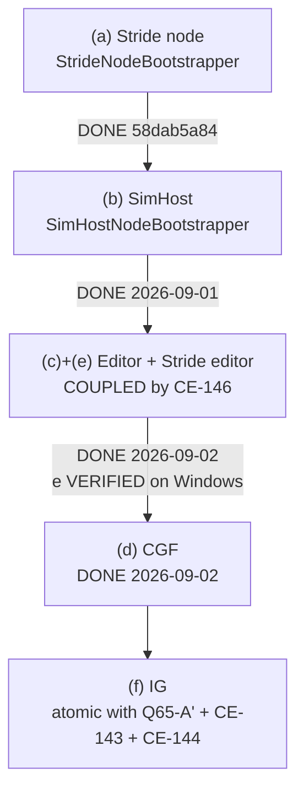

<!--STATUS
state: LIVE
updated: 2026-09-03
current-answer: ✅✅✅ READ §5.0 — THE AGREED PLAN (user-confirmed 2026-09-01). It is the ONLY section
  that carries live state. P1 (EntityCreationPack adoption) is COMPLETE across ALL SIX HOSTS as of
  2026-09-03: host (f) IG shipped with Q65-A' + CE-143 + CE-144 atomically, VERIFIED (GhostDestructionSystem
  deleted; IgNodeBootstrapper.cs:362 calls EntityCreationPack.Build; CE-141+CE-144 confirmed on a live
  four-process cluster). ⇒ THE NEXT BUILDABLE STEP IS P2 — relocate GhostPromotionSystem out of
  NedReplicationModule into EntityCreationPack, add+remove in ONE commit.
  ⭐⭐⭐ AND THE PROGRAMME IS NOT FINISHED WHEN P2 LANDS: P3 is AUTO-TAKEOVER (role-affinity ownership),
  which is FULLY DESIGNED AND ENTIRELY UNBUILT — ../DESIGN_Role_Affinity_Ownership.md, build-state
  READY-TO-BUILD, "Nothing here is built yet", §6 steps 0->3b, and its §5 holds THREE OPEN DECISIONS
  that are the USER's to settle before it starts. Do not let "P1 done" read as "unification done".
  This file is a SESSION BOOTSTRAP — a self-contained continuation point for the entity-creation
  unification work. Read it after docs/blueprints/RULINGS.md (RULE ZERO) and instead of reading
  RESUME_UI_Lane.md top-to-bottom.
stale-below: §5 is SUPERSEDED — it is headed "THE NEXT STEP: SimHost, host (b)", which shipped
  2026-09-01; it is retained only as the worked example of per-host adoption mechanics and is marked
  in place. §4.9's triage remains true but its CONSEQUENCE line ("host (f) is UNBLOCKED") is now
  history — (f) is DONE. §1's "12 commits" and the head sha in the banner are both behind.
folded-back: 2026-09-03 — this file, DESIGN_Entity_Creation_Unification.md §5 step 3 (which still said
  "IN PROGRESS, host (a) only" — five hosts out of date for three days) and RESUME_UI_Lane.md's
  current-answer were all behind the code. Cause: the work was reported in chat and commits, and the
  owning documents were not updated. That is the disease CLAUDE.md's obligation ⑤ exists to treat.
known-conflict: none. Where this file and RESUME_UI_Lane.md's STATUS block overlap they agree; that
  block is the longer log, this file is the ordered continuation point.
-->

# ⭐⭐⭐ BOOTSTRAP — entity-creation unification, UI lane

> 🔒 **Branch `claude/reset-working-branch-qd1qpv`** · head **`e762fe988`** *(`2026-09-03`)* · ids **`CE-`** *(next free **`CE-166`** — `CE-165` is the last allocated)*.
> ⚠ *(was `4a69ad3f8` / next free `CE-155` until the `2026-09-03` fold-back; both were three days behind.)*
> ⛔ Push nowhere else. ⛔ No PR unless the user asks.
> 📄 **Owning designs:** [`../DESIGN_Entity_Creation_Unification.md`](../DESIGN_Entity_Creation_Unification.md) ·
> [`Architect_Question_65_Entity_Genesis_Uniformity.md`](Architect_Question_65_Entity_Genesis_Uniformity.md) ·
> the lane log in [`RESUME_UI_Lane.md`](RESUME_UI_Lane.md)'s STATUS block.

---

## 0. 🔒🔒🔒 THE GOVERNING RULING — **quote it, do not paraphrase it**

> ⭐⭐⭐ **User, `2026-08-31`, verbatim:** *"the shared code for entity creation support should not restrict
> any ecs enabled node from creating own networked entities, whuch makes the subsystems equal in
> distributed architecture and rhe shared code more uniform, no exceptions, not removing capabilities by
> design, and only concrete authoring code picks the way it needs"*

| ⭐ what follows from it | |
|---|---|
| ⭐⭐ **BOTH paths are legitimate** | `OwnerAppInstanceId = 0` ⇒ the broadcast arbiter (CGF) owns most components — **correct for brain-enabled entities**. `OwnerAppInstanceId = localNodeId` ⇒ the originating node creates and owns it in-process — **IG map drawings** |
| ⭐⭐ **the AUTHORING CALL SITE picks** | ⛔ not a policy table, not a TKB flag, not config |
| ⛔⛔ **`EntityCreationPack.Build` gets NO flag that omits a system** | the request tier and the spawn system are **always** built — `DESIGN` §3.1 invariant 6, §3.4, acceptance ⑨–⑪ |
| ⭐ **`isDefaultProcessor` is a BROADCAST TIEBREAKER, not an authority gate** | `CreateEntityRequestSystem.cs:151-156` processes a self-targeted request regardless of the flag |

---

## 1. ⭐ WHERE WE ARE — **12 commits, all pushed**

| commit | what |
|---|---|
| `b525d59fa` | the governing ruling + request tier + UML redraw + the "halves" purge |
| `6ac497ec1` | **`CE-142`** filed — ownership delegation is mechanism gated by policy |
| `a7b6216ae` | architect review folded; **`CE-143`**; obstacle ① assembly chosen |
| `f237d11e0` | the 3-file move ruling; **`CE-144`** (destroy-side double consumption) |
| `7face3aee` | `DESIGN` §3.4a — **why** double consumption is possible (the bus is a broadcast double-buffer) |
| `f27717262` | ⭐ **pack step 4** — ONE unified UrbanCombat TKB catalogue |
| `fc5522f57` | the Windows handoff for `CE-145` |
| `71e766f9c` | ⭐ **obstacle ①** — request tier → `Hrot.Common.Systems` |
| `b9757d96d` | corrected the Windows session's diagnosis |
| `58dab5a84` | ⭐ **step 3a** — `EntityCreationPack` + Stride node adopts it |
| `47f9c1581` | merged `CE-145` (Windows lane); filed **`CE-146`** |
| `65a4ccfce` | **`CE-146` probed and resolved** — docs only |

### ⭐ What exists now that did not before

| file | role |
|---|---|
| `Hrot/Engine/Hrot.Common/EntityCreation/EntityCreationPack.cs` | ⭐⭐ **the pack.** `Build(ctx)` → translators + request source + `CreateEntityRequestSystem` + `EntityRequestFinalizationSystem` + `NetworkSpawningSystem` |
| `…/EntityCreationContext.cs` | required `World`/`EntityMap`/`TkbDb`/`IdAllocator`/`Elm`/`NodeId`; the ONE differing value is **`IsBroadcastArbiter`**; optional `NetworkRequestSource`, `AckSink`, **`ExtraTranslators` (add-only)**, `JsonAttributeCompiler`, `OwnershipStrategy`, `OnEntitySpawned`. ⛔ **no `ModuleHostKernel`**, ⛔ **no suppression flag** — both are asserted by tripwire rails |
| `…/EntityCreation.cs` | the built pieces + `Unserviceable(scheduled)`, which **names** each unscheduled piece |
| `Hrot/Engine/Hrot.Core/Tkb/UrbanCombatTkbCatalog.cs` | ⭐ the ONE source of TKB types 1001–2003, seeded by `HrotEnvironment.CreateTkb()` |
| `Hrot/Engine/Hrot.Common/Systems/` | the request tier, namespace `Hrot.Common.Systems` — ⛔ no longer `Hrot.CGF` |

### ⭐ Rails added (all in `Hrot/Subsystems/Hrot.SimHost.Tests/`)

`UrbanCombatCatalogRails` 14 · `RequestTierPlacementRails` 12 · `EntityCreationPackRails` 8.

---

## 2. ⭐ TEST STATE — **the baseline to compare against**

| gate | result |
|---|---|
| T1 `Hrot.SimHost.Tests` | ⭐ **818 pass / 1 fail / 3 skip** |
| the 1 fail | 🔒 **`QA-012`** = `FullBranchPipelineTests.BranchedRecording_CapturesHistoricalStateAsKeyframe`, proven pre-existing by `git stash -u` + rebuild on base |
| `Hrot.Editor.Tests` | 341 / 0 / 1 |
| `Hrot.NodeComposition.Tests` | 22 / 22 |
| `EntityCreationFlowTests` (integration) | 7 / 7 |

⚠ **Observed intermittency, not chased:** one T1 run reported 3 failures while naming only one (26 s vs
the usual 14–15 s); the two runs immediately after were 818/1/3. Steady state is 1.

⛔ **The Stride tree cannot build on Linux** (`Microsoft.WindowsDesktop.App`). The Windows lane verified
`CE-145` there: 0 errors, `MannequinAnimationDefIntegrationTests` 10/10, live editor `entities=6, visuals=6`.

---

## 3. ⭐⭐ STEP 3 — **the adoption order, and what is done**

| host | state |
|---|---|
| **(a) Stride node** | ✅ **done.** Closed a second gap — it had no `CreateEntityRequestSystem` at all |
| **(b) SimHost** | ✅ **DONE `2026-09-01`.** Closed the same second gap host (a) did — SimHost had **no** `CreateEntityRequestSystem`, so its only creation path was a raw bus `SpawnEntityCommand`. ⭐ Also dropped `.WithTranslators(...)`: promotion now reads the ONE list off the ELM *(`CE-155`)*, so the node holds a single instance rather than two equal copies |
| **(c) Editor + (e) Stride editor** | ✅ **DONE `2026-09-02`.** Both hosts build the tier through `EntityCreationPack`; both gained `EntityRequestFinalizationSystem`, which neither had registered before. ⭐ (e) forced `TranslatorPlacements` — its `InfantryVehicleStateStrip` has a POSITIONAL contract `BasePlus` cannot express (`CE-145`/`CE-146`), so the capability was put back as configuration rather than dropped (`R-137`). ✅✅ **(e) VERIFIED ON WINDOWS `2026-09-02`** — `dotnet build Stride\HrotStrideApp.sln` **0 errors** *(no call-site fix needed; all four predicted risk points compiled as written)*; the three Stride suites are **identical to base `2b0a703b3` over 9 runs per side**; and `STRIDE_SELFTEST=1` returns `initialHold=PASS repos=PASS pausedFreeze=PASS drive=PASS` with **no** `cannot place` and **no** `[EntityCreation]` warn ⇒ the anchor resolved and every pack piece was scheduled |
| **(d) CGF** | ✅ **DONE `2026-09-02`.** ⭐ The host the pack was SHAPED from — DESIGN §5 records *"CGF already composes exactly this"* of the composite-source arrangement — so adoption removed no decision it had not already made correctly, and the diff is a pure composition change. ⚠ **HOISTED**: the construction moved ~25 lines UP, above `CgfLogicPack`, because `_scenarioSource` is now `creation.LocalRequests` and the logic pack consumes it. ⭐ `DeleteEntityRequestSystem` now shares the pack's `FinalizationSystem` instead of the separately-built one |
| **(f) IG** | ⛔⛔ **must ship in ONE commit** with Q65-A′ + `CE-143` + `CE-144`, or IG double-spawns and double-destroys |

---

## 4. ⭐ OPEN IDS

| id | what | blocking? |
|---|---|---|
| **`CE-141`** | IG's translator width — needs a live `--mode all` probe | no |
| ✅ **`CE-142`** | **DONE `2026-09-01`** (`e888872a0`) — the three delegation pieces are ungated. ⚠ **Prerequisite, not a fix**: CGF's authority over a SimHost-originated entity is UNCHANGED, because nothing computes Brain-ward grants. ⭐ That policy half is superseded by `DESIGN_Role_Affinity_Ownership.md` | done |
| **`CE-143`** | add init-only `ReliableInitType` to `EntityCreationRequest`, default `AllPeers`; hardcoded at `CreateEntityRequestSystem.cs:302` and `:397`. ⚠ decide whether `:397`'s children inherit (lean: yes) | ⭐ prerequisite for IG drawings being **usable** |
| **`CE-144`** | drop `GhostDestructionSystem` from IG once it gains `NetworkSpawningSystem` | ships with (f) |
| **`CE-146`** | ✅ **DONE `2026-09-02`** — the Stride editor's SECOND pipeline is folded into the pack. ⛔ **The plan line said "the strip goes through `ExtraTranslators`" and that was WRONG** — `ExtraTranslators` appends, and the strip has a positional contract (`CE-145`). It goes through the new `TranslatorPlacements` instead | = host (e) |
| ✅ **`CE-155`** | **DONE `2026-09-01`** — `GhostPromotionSystem`'s empty translator list on the FACTORY path *(CGF)*. ⚠ **Filed late**: the id was cited in three production files with no row. ⚠ Its first scope claim *("every node")* was **wrong** — builder-path hosts did pass a list | done |
| ✅ **`CE-156`** | **DONE `2026-09-01`** — a composition-root source scan was passing on its own COMMENTS; SimHost **and IG** were green for the wrong reason, hiding a rail-doc/data contradiction. ⭐ Comments are now stripped before any such scan | done |
| — | two **stale diagnostics**, fix in words not code: `NavigationIntentBridgeSystem.cs:234-240`'s warning text; `Translator_Infantry200_DoesNotInjectVehicleState` (re-home onto the strip) | no |
| — | ✅ **SETTLED `2026-09-02` on Windows — the two `StrD21` reds are PRE-EXISTING, and they are NOT the entity-creation work.** 📐 Both fail **9/9 at `7a64572bf` AND 9/9 at base `2b0a703b3`**. ⭐⭐ **The hypothesis that they read `VehicleState`, so `CE-145`'s ordering fix could move them, is REFUTED BY THE SOURCE:** every `StrD21` test builds a bare `EntityRepository` and hand-adds `repo.AddComponent(entity, new VehicleState())`, then constructs `VehicleNavigationIntentSystem` standalone. ⛔ **No `TkbDatabase`, no translators, no pack** ⇒ the strip's position **cannot reach these tests**. ⭐ The defect is in the nav systems themselves. ⚠ Sibling `VehicleNavIntentSystem_WritesVehicleState_OnFirstTick_WithFakeNavmesh` **passes on both sides** | ✅ |

⭐ **After entity creation:** back to gizmos — **`CE-134`** (health bar) first, then `CE-133`, `CE-135`,
`CE-136` against [`../UX/UX_Feature_Entity_Symbology.md`](../UX/UX_Feature_Entity_Symbology.md) §3.8.

---

## 4.9 ✅✅✅ **THE 19 CLUSTER REDS — TRIAGED `2026-09-02`. ⛔ NONE is unification damage.**

> 🔒 **User, verbatim:** *"the 19 reds is actually a very bad sign, could it be because of the
> unification? how can we make sure after unification the system works if 19 integration tests are
> failing? shoildnt we first find out why?"*

⭐⭐⭐ **The question was right, and the triage it forced found two errors in this document's own
previous answer.** ⛔ **Do not re-derive this** — it cost a full suite run plus a baseline run.

### ⭐⭐⭐ THE TABLE — **all 19, each to an owning row** *(measured: `dotnet test … --logger trx`, 19/248/3 of 270, 9.1 min)*

| # | test | message (verbatim) | owner | unification-caused |
|---|---|---|---|---|
| 1 | `SpawnMovingVehicle_IgReceivesPositionChangesWithinFewFrames` | *"did not move … SimHost moved=0.0000m"* | **`CE-103`** | ⛔ **no** |
| 2 | `SpawnMovingVehicle_IgPositionContinuesToUpdate` | *"First position change was not observed"* | **`CE-103`** | ⛔ **no** |
| 3 | `CgfSubsystemHeadless.CGF_MovingVehicle_GhostPositionUpdates` | *"CGF ghost entity 1 position did not change"* | **`CE-103`** | ⛔ **no** |
| 4 | `CgfSubsystemHeadless.SimHost_WanderMission…` | *"did not move after WanderMilitary assignment"* | **`CE-103`** | ⛔ **no** |
| 5 | `CgfSubsystemHeadless.SimHost_MoveToLocationMission…` | *"did not move >= 5 m after MoveToLocation (dist=0.000)"* | **`CE-103`** | ⛔ **no** |
| 6 | `NetworkDemo_Phase2_BTreeNavigationIntent_FlowsToMuscle` | *"SimTransform.Position must change after CGF BTree writes NavigationIntent"* | **`CE-103`** | ⛔ **no** |
| 7 | `NetworkDemo_Phase3_PerceptionReaction_TargetMemoryPopulates` | *"the BTree must evaluate Condition_HasTarget → Action_AimAndFire"* | **`CE-103`** | ⛔ **no** |
| 8–11 | `FeatureSwitchRcu` ×4 | *"Module 'SimHostCoreLogicPack' is not currently installed in this kernel"* — **one identical stack** | **`CE-154`** | ⛔ **no** |
| 12 | `CgfRecording.BothNodes_LiveSimulation…` | *"SimHost recording not found: …/node_1.fdp"* | **`QA-031` ①** | ⛔ **no** |
| 13 | `DistributedScenarioLoad.DistributedLoad_TranslatesNetworkIds…` | *"CGF world must contain exactly 2 entities. Actual: 0"* | **`QA-031` ②** | ⛔ **no** |
| 14 | `UrbanCombatFileLifecycle.UrbanCombatExtractedToJson…` | *"Grand demo timed out. Latches: ambush=False, halt=False, hit=False, killed=False"* | **`QA-031` ③** | ⛔ **no** |
| 15 | `ClusterOpE2eScript.RecordAndReplaySeek_Passes` | *"StatusCode=13"* + *"assert_position x=0.0000, expected >= 5"* | **`QA-031` ➕** | ⛔ **no** |
| 16 | `ClusterOpE2eScript.LiveFromReplayBranch_Passes` | *"timed out after 30s waiting for SysOpStatus"* | **`QA-031` ➕** | ⛔ **no** |
| 17 | `GhostPromotion.OutOfOrder_GeoSpatialBeforeEntityMaster…` | *"Ghost entity was not promoted after EntityMaster descriptor arrived"* | ⭐ **`CE-157`** *(NEW)* | ⛔ **no** |
| 18 | `SensorMechanism_EndToEnd_CGFTargetMemoryPopulatesAndDecays` | *"CGF entity must gain ActiveSensorTracks with Count > 0"* | ⭐ **`CE-158`** *(NEW)* | ⛔ **no** |
| 19 | `MapPlacement.EndToEnd_DirectCreationTool_SpawnsEntityInSimHost` | *"CreationTool did not become active in time"* | ⭐ **`CE-159`** *(NEW)* | ⛔ **no** |

⇒ ⭐⭐ **FOUR owners cover 16 of 19** *(`CE-103` 7 · `CE-154` 4 · `QA-031` 5)*; **3 were genuinely
unowned and are now filed.** ⛔ **Three batches reported the NUMBER and none read the MESSAGES** — that
is the process defect this triage closes, and it is why the count told us nothing for three batches.

### ⭐⭐⭐ THE STRUCTURAL PROOF — **the break is UPSTREAM of everything the pack builds**

📐 `EntityCreationPack.Build` constructs exactly six things *(`EntityCreationPack.cs:105-146`)*:
`ScenarioEntityCreationRequestSource` · `CompositeEntityCreationRequestSource` · `NullEntityAckSink` ·
`EntityRequestFinalizationSystem` · `CreateEntityRequestSystem` · `NetworkSpawningSystem`, plus the
translator list and the ELM wiring. ⭐⭐ **Every one is the BIRTH tier.**

⭐⭐⭐ **`MissionToMovementChainProbe` — which runs GREEN in the same suite — proves BIRTH SUCCEEDED in
the very test that fails:**

| what the probe measured | verdict |
|---|---|
| CGF ghost carries **37** components, SimHost **35** | ✅ the entity is born on both nodes |
| `VehicleParams` · `VehicleState` · `NavState` · `PhysicsCollider` all present | ✅ **the translator list ran** — the pack's whole job |
| mission `ACK received=True ErrorCode=0` | ✅ the request/finalisation path works |
| ⭐ `behHash` column is **`0` on every one of 40 sampled frames** | 🔴 **the break is hop ONE of the COGNITIVE chain** |
| `btree=yes`, `chan 0/0/0/Failure`, CGF `intent None`, SIM `intent None`, `d=0.00m` | 🔴 nothing downstream ever fires |

⇒ ⭐⭐⭐ **the chain dies at `BehaviorState.ActiveBehaviorHash`, which NO system in the pack writes.**
📌 The probe's own legend: *"the FIRST column that never becomes non-default is the broken hop."*

⭐ **A second measured asymmetry points at the cause for whoever takes `CE-103` next:** the CGF ghost
**has** `ActiveMissionPlan` *(1 task, `MoveToLocation`)* and `MissionAdapterState` but reports
`HasAuthority<BehaviorState> = False`; SimHost reports `True` and is ⛔ **MISSING** `ActiveMissionPlan`
and `MissionAdapterState`. ⇒ **the node holding the plan cannot write the behaviour, and the node that
can write it has no plan.** ⚠ **Stated as an OBSERVATION, not a diagnosis** — no authority guard was
found in `BehaviorIngressSystem` or `MissionAdapterSystem`, so the mechanism is NOT yet established.
⭐ This is the shape [`DESIGN_Role_Affinity_Ownership.md`](../DESIGN_Role_Affinity_Ownership.md)
addresses *(P3, designed and NOT built)*.

### ⭐⭐ THE DATE PROOF — **every owner predates the pack**

📐 The unification window is **`2026-08-31` → `2026-09-02`** *(`58dab5a84` … `80ad9ccf5`)*.

| owner | first filed | evidence |
|---|---|---|
| ⭐⭐⭐ **`CE-103`** | **`2026-08-28`** — 🔒 **the USER's own visual check**: *"When i press Play, the tanks show blue line to their destination, but they do not move."* | `585748088` — **three days before `EntityCreationPack` existed** |
| **`CE-154`** | `2026-09-01` | `bc5fa2253`, root-caused to `EditorSubsystem:1462` adding packs to `logicPacks` that `:1388` never registers — ⛔ **before host (c) adopted the pack on `2026-09-02`** |
| **`QA-031`** | `2026-09-01` | filed as *"the `QA-017` residue — 3 tests that now reach `OperatingLive` and fail DOWNSTREAM"*, ⭐ **naming 5 of these tests verbatim** |

### ⭐⭐⭐ THE SET PROOF — **the gate hole `§4.9` named is now CLOSED**

⛔ **The hole:** hosts **(b) SimHost** and **(c)+(e) Editor/Stride editor** were never gated against this
suite — only (d) was. ⚠ **That was a gate-contract row-8 miss.**

⭐ **Closed by baselining `eabcbf660`** — ⭐⭐ the ideal comparison point: **AFTER** the `CE-148`/`CE-152`
test-infrastructure fixes *(so it is NOT confounded)* and **BEFORE** all four host adoptions
*(b · c · e · d)* and the `CE-142`/ghost-promotion ownership fixes.

✅✅✅ **RUN COMPLETE `2026-09-02` — THE SET-DIFF IS EMPTY IN BOTH DIRECTIONS, PER TEST NAME.**

| | `eabcbf660` *(before b · c · e · d)* | HEAD `4220d2f9d` *(after all four)* |
|---|---|---|
| failed | **19** | **19** |
| passed | 247 | 248 |
| skipped | 3 | 3 |
| total | 269 | ⭐ **270** — the +1 is `MissionToMovementChainProbe`, added in the window, and it **passes** |
| wall-clock | 9.19 min | 9.11 min |
| ⭐⭐⭐ **added at HEAD** | — | ⛔ **NONE** |
| ⭐⭐⭐ **fixed since baseline** | — | ⛔ **NONE** |

⇒ ⭐⭐⭐ **All four host pack adoptions — (b) SimHost · (c) Editor · (e) Stride editor · (d) CGF — PLUS
`CE-142`'s ownership-delegation fix and `e2e1a5a2c`'s ghost-promotion fix, added ZERO reds and removed
ZERO, name for name.** ⭐ **This is the measurement `§4.9` previously listed as ⛔-ASSUMED**, and it is
now ✅. ⛔ The gate hole is CLOSED for hosts (b), (c) and (d) — ⚠ **(e) is NOT exercised by this suite
at all**, so its evidence remains the Windows verification at `656b61a24`.

⭐ **Why this baseline and not `b9757d96d`:** the pre-pack commit predates **both** `CE-148` and
`CE-152`, so it would report ~49 reds inflated by harness interference — **the measuring apparatus
itself changed.** `eabcbf660` sits after both test-infrastructure fixes and before every host adoption,
so it is the one comparison point that is not confounded.

### ⛔⛔ WHAT THIS DOES **NOT** PROVE — *(stated so nobody over-trusts it)*

| ⛔ | |
|---|---|
| ⛔ **it does not say the system WORKS** | ⭐ 19 real defects remain, and `CE-103` is a **user-visible** one. ⇒ **the backlog is real; it is just not NEW** |
| ⛔ **it does not root-cause `CE-103`** | ⭐ it narrows it to **hop one of the cognitive chain** and hands over one measured asymmetry. ⚠ That is a separate batch |
| ⛔ **it proves nothing about hosts the cluster suite does not exercise** | ⚠ **(e) the Stride editor is NOT in this suite** — its evidence is the Windows verification at `656b61a24`, and that is a different kind of evidence |
| ⚠ **a green baseline row is not proof of no regression, only of no NEW RED** | ⭐ a test that passes on both sides can still have changed behaviour |

### ⭐⭐ CORRECTIONS THIS TRIAGE MAKES TO THE RECORD — **⛔ both were in this document**

| ⛔ what was written | ✅ what is measured |
|---|---|
| **`§4.9` pointed at `CE-103`'s WIRE-HOP cause** *(`SpawnEntityCommandEgressTranslator:143-160` drops all but 3 component types ⇒ `AccelGain 0`)* | ⚠ **that half is ALREADY FIXED.** `CE-113` *(`94867a8b7`, `2026-08-28`, "the TKB can express a Tank")* routed `BuildVehicleParams` into `VehicleKinematicsTkbTranslator:34`, which now applies a **`VehiclePresets` baseline**. ⇒ **`AccelGain = 0` is no longer the mechanism**, and the tracker's explanation would have misled the next reader |
| ⛔ **the previous session left question ①** — *"most of these tests inject via `TestHook_SetMovementIntent`, a DIRECT write production never does; measure whether they are a product defect AT ALL"* | ✅ **ANSWERED — they ARE a product defect.** 📐 6 of the 7 do use that hook, ⭐⭐ **but `NetworkDemo_Phase2` does NOT**: it sets only `BehaviorState.ActiveBehaviorHash` on CGF and then runs the ENTIRE production pipeline *(BTree → `MoveToExecutor` → `NavigationIntent` → egress → DDS → ingress → bridge → `NavState` → `CarKinematicsSystem`)*, and it fails. ⭐ Corroborated: `SimHost_MissionControlRequest_ActivatesMissionPlanQueue` **passes** through the real DDS chain ⇒ the mission **activates** and the entity still does not **move** |

### ⭐⭐⭐ CONSEQUENCE — **host (f) IG is UNBLOCKED**

⭐ `§5.0`'s order resumes at **(f) IG**, which must still ship in ONE commit with `Q65-A′` + `CE-143` +
`CE-144` *(or IG double-spawns and double-destroys)*.
⭐⭐ **AND the gate contract now binds this suite:** ⛔ **(f) does not merge without a
`Hrot.ClusterRunner.Integration.Tests` row naming the per-test set-diff** — 📌 not the count, the NAMES.

---

## 5.0 🔴🔴🔴 THE AGREED PLAN — **user-confirmed `2026-09-01`. START HERE.**

> 🔒 **User, `2026-09-01`:** *"yes adopt pack first, then relocate"* — after asking *"where will you
> instantiate the code? This should be part of the shared entity creation pack, right?"*

⭐⭐ **Why this order.** Relocating `GhostPromotionSystem` into `EntityCreationPack` is the end state
*(`DESIGN_Role_Affinity_Ownership.md` §3.7)*, ⛔ **but a host that has not adopted the pack would LOSE
ghost promotion the moment the NED module stops registering it.** ⇒ adopt first, relocate second; the
alternative is a temporary bridge that would itself be the second registrar the pack forbids.

| # | step | state |
|---|---|---|
| **P1** | ⭐⭐ **finish pack adoption** — hosts (b) SimHost → (c)+(e) Editor + Stride editor *(coupled, `CE-146`)* → (d) CGF → (f) IG *(atomic with `Q65-A′`+`CE-143`+`CE-144`)*. §3's order, §5's mechanics | ✅✅✅ **COMPLETE `2026-09-03` — ALL SIX HOSTS.** (b) `2026-09-01` · (c)+(e) `2026-09-02` *(e **VERIFIED on Windows**)* · (d) `2026-09-02` · ⭐ **(f) IG `2026-09-03`** — the §4.9 triage cleared the pause, then (f) shipped with its three atomic companions. 📐 **VERIFIED, not assumed:** `GhostDestructionSystem` is deleted *(only comments name it)*, `IgNodeBootstrapper.cs:362` calls `EntityCreationPack.Build`, `CE-143` is BUILT *(`Q65` §5.5)*, and `CE-141`+`CE-144` were confirmed on a **live four-process cluster** *(`DESIGN_Entity_Creation_Unification.md` §2.3c)* |
| **P2** | 🔴 **relocate `GhostPromotionSystem`** from `NedReplicationModule` into `EntityCreationPack`, **one commit, add+remove together** | ⭐⭐ **UNBLOCKED `2026-09-03` — the next buildable step.** ⭐ Also closes *"a BDC node never promotes its ghosts"* *(`BdcReplicationModule.cs:66`)* |
| **P3** | ⭐⭐⭐ **AUTO-TAKEOVER — role-affinity ownership.** ⛔ **DESIGNED, NOT BUILT — the unimplemented half of this whole programme** | blocked on P2. 📄 [`../DESIGN_Role_Affinity_Ownership.md`](../DESIGN_Role_Affinity_Ownership.md) `build-state: READY-TO-BUILD`, §6 steps 0→3b; ⚠ **its §5 holds THREE OPEN DECISIONS for the user** — settle them before starting. ⛔ Do not re-derive its three constraints: two categories *(birth-critical vs cognitive)* · network-agnostic *(no descriptor keying)* · authority does not stop execution *(needs the query filter too, or it is cosmetic)* |

### ⭐ What `2026-09-01` settled — ⛔ do not re-derive

| ⭐ | |
|---|---|
| ⭐⭐⭐ **ownership is NETWORK-AGNOSTIC** | 🔒 user: *"we can have multiple different network implementations - ownership can not be tied to one of them"*. 📐 Four factories: `Ned`, `Bdc`, `Offline`, + mocks. ⛔ **`DescriptorOwnershipMap` and `EDescriptorType` MUST NOT carry ownership** — the map is filled per implementation via `RegisterFromTranslator`. ⭐ The role carries a **`BitMask512` of component ids** |
| ⭐⭐⭐ **TWO ownership categories** | ⭐ **cognitive** *(safe to default)* ⇒ role affinity · ⭐ **birth-critical** *(must be valid at birth)* ⇒ **creator birthright**, then the existing `DeferredTakeOwnership` handoff. 🔒 Architect: *"the position can not start empty"* |
| ⭐⭐ **birth-criticality is a COMPONENT property declared by the TKB** | 🔒 user: *"TKB should define what components are birth critical"* — ⛔ not a descriptor *(networkless nodes have none)*. ⭐ Initial content: **`SimTransform` only**, via a new `TkbTemplate.BirthCriticalComponents` beside the existing `MandatoryComponents` |
| 🔴 **authority does NOT stop execution** | 📐 `BTreeTickSystem.cs:62-65` has **no authority filter**, and no production system uses `QueryBuilder:97`'s `.WithAuthority<T>()`. ⇒ P3 needs **both** a narrowed Muscle-only registration **and** the query filter, or the whole design is cosmetic |
| 🔴 **a BDC node never promotes its ghosts** | 📐 `BdcReplicationModule.cs:66` registers `GhostCreationSystem` but **no** `GhostPromotionSystem`. ⭐ P2 closes this as a side effect |

### 📌 Committed `2026-09-01` — `44195801c..4a69ad3f8`

| commit | what |
|---|---|
| `e2e1a5a2c` | ghost promotion role-independent + shares the ELM's translator list *(it was `Array.Empty` on **every** node — 6th instance of the omitted-`translators:` family)*. ⚠ **The role-gate half is SUPERSEDED by P2** — it disappears when registration relocates |
| `e888872a0` | `CE-142` + its tracker row + the Q65 §5.3 as-built |
| `d63445a18` · `47aa87600` · `9462c51ef` · `f7fa41608` · `4a69ad3f8` | [`../DESIGN_Role_Affinity_Ownership.md`](../DESIGN_Role_Affinity_Ownership.md) — written, then corrected four times *(architect's birth-critical flaw · the component/TKB correction · network-agnosticism · composition)* |

⚠ **Cluster reds are UNCHANGED** by all of it — 9 before, 9 after, same nine. ⭐ That is expected and
honest: everything so far is prerequisite. 📌 The acceptance test for the whole arc is
`CgfSubsystemHeadlessTests.SimHost_MoveToLocationMission_EntityMovesWithoutGhostTick`; ⚠ it may stay red
afterwards for its OWN subject *(it also guards `MissionDirectorSystem` against publishing a params-less
`AssignBehaviorHashEvent`)* — that would be the test working.

---

## 5. ⛔ HISTORY — **"THE NEXT STEP: SimHost, host (b)"** *(SUPERSEDED `2026-09-03`)*

> ⛔⛔⛔ **SUPERSEDED. Host (b) shipped `2026-09-01` and P1 is COMPLETE across all six hosts
> (`2026-09-03`).** ⭐ **The next step is now §5.0's P2** — relocate `GhostPromotionSystem` into
> `EntityCreationPack`. ⚠ **Kept below only as the worked example of the per-host adoption mechanics**,
> which the same shape of work can still be read off; ⛔ **do NOT read it as an instruction.**

⚠ *(Original text follows.)* **The user was asked and had not yet answered when the previous session ended.** ⛔ Confirm before
starting. ✅ (c)+(e)'s Windows verification pass is DONE (`2026-09-02`) — build, suites and self-test all green.

📌 **Seams, measured:** `Hrot/Subsystems/Hrot.SimHost/SimHostNodeBootstrapper.cs`

| line | today | becomes |
|---|---|---|
| `:152` | `_translators = TkbTranslatorSet.BasePlus(AiDiagnosticsTkbTranslator)` | `ctx.ExtraTranslators = [AiDiagnosticsTkbTranslator]` |
| `:273` | `elm.SetTranslators(_translators!)` | the pack does it — ⚠ **must still precede the kernel's `Initialize`** |
| `:275-282` | `new NetworkSpawningSystem(… onEntitySpawned: (world, entity, isLocalAuthority) => { … })` | `ctx.OnEntitySpawned = <that lambda, PRESERVED VERBATIM>` — 🔒 it is the **`AX-011` egress-shadow hook**; its `:304` comment explains why it lives here and not in `NetworkSpawningSystem` |
| `:160` | `.WithTranslators(_translators)` *(TKB-022, threads to `NedReplicationModule`)* | ⚠ **keep** — the same list must reach replication |

⭐ Then schedule `RequestSystem` / `FinalizationSystem` / `SpawnSystem` the way host (a) does, and call
`Unserviceable(scheduled)` so any unscheduled piece is **named**, not silently dropped.
⛔ `IsBroadcastArbiter = false`.

---

## 6. ⛔⛔ THE ERROR CLASS THAT COST THIS PROGRAMME SIX WRONG CLAIMS

⭐⭐⭐ **Every one was reasoning from a NAME, a COMMENT or a `using` LIST instead of the BODY or a probe.**

| ⚠ habit | |
|---|---|
| ⭐⭐ **a usings scan is NOT a dependency scan** | `CreateEntityRequestSystem.cs:394` constructs `Hrot.Common.Serializers.InitialUnitSubordinateIntent` **fully qualified** ⇒ invisible to a usings scan ⇒ my `Hrot.Core` target was a **reference cycle**. ⭐ grep the body for `<OtherAssembly>.` prefixes, **or just build it (8 s/project)** |
| ⭐⭐ **for a NAMESPACE move, grep the SEGMENTS too** | `CE-145`: relative-qualified refs (`Components.StanceId`), one fully-qualified ref that must NOT move, and a namespace whose **sole declarant** was the moved file ⇒ the rename deleted it |
| ⭐ **"Consumes" in a doc comment lied** | `ManagedEventStream.cs:95` is `Read() => _front` — **no pop, no claim flag.** The bus is a **broadcast double-buffer**; that is exactly why double consumption of *orders* is possible |
| ⭐ **do not size a deletion from production callers alone** | measure the **test** surface: a re-home is not a mechanical `s/old/new/` |
| ⭐ **red-proofs are INVERSE EDITS** | ⛔ never `git checkout --` |

### ⭐ Build/test discipline *(measured on this repo)*

| ⛔ don't | ⭐ do |
|---|---|
| `dotnet build <the.sln>` in the fix loop — **115 s** | `dotnet build <proj> --no-restore` — **8 s** |
| re-run the whole suite to "confirm" | prove the fix through **the rail that reddened for it** |
| sit on the E2E suite | **T3 is async**, never a foreground blocker |

---

## 7. 🔒 STANDING USER CONSTRAINTS — **preserve verbatim**

- 🔒 The editor's scenario path was **hand-tested manually** — be careful with any "fixes" there.
- 🔒 *"there should be nothinkg like cluster tKB and editor TKB; we need cgf==editor."*
- 🔒 **`R-137`:** *"we should not lose flexibility of the features, if unification takes some aways, this is
  a singal we should think how to put it back (via configuration for example)."*
- 🔒 *"if editor builds UrbanCombat stuff then everyone should, editor is the most advanced in that matter."*
  ⚠ **and:** the catalogue is a **development default** — the real system reads templates from files synced
  to all nodes.
- ⛔ **Ask questions in plain chat text — never the `AskUserQuestion` widget.**
- ⭐ **Always give GitHub blob links** for docs **and** task ids, on `claude/reset-working-branch-qd1qpv`
  — ⚠ **push first** or the link 404s (the user is on mobile).
- ⛔ **Never derive MCP capability from engine source** — read `tools/ai-debug-mcp/SKILL.md` first;
  ⛔ `SKILL.md` is **GENERATED**, never hand-edit it.
- ⭐ **When the codebase-memory MCP is offline, use its CLI** —
  `/opt/codebase-memory-mcp/codebase-memory-mcp cli <tool> '<json>'`. ⛔ "MCP not connected so I used
  grep" is a **MISS**. ⚠ `search_graph`/`trace_path`/`query_graph` return **text**;
  `list_projects`/`get_graph_schema` return **JSON**.
