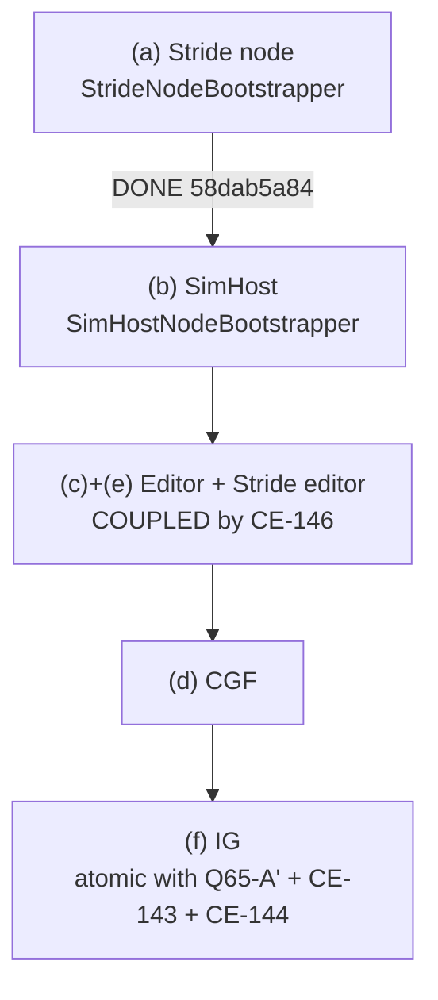

<!--STATUS
state: LIVE
updated: 2026-08-31
current-answer: §1 (where we are) then §5 (the next step). This file is a SESSION BOOTSTRAP — a
  self-contained continuation point for the entity-creation unification work on the UI lane. Read it
  after docs/blueprints/RULINGS.md (RULE ZERO) and instead of reading RESUME_UI_Lane.md top-to-bottom.
stale-below: nothing yet — this file was created 2026-08-31 and has no history.
known-conflict: none. Where this file and RESUME_UI_Lane.md's STATUS block overlap they agree; that
  block is the longer log, this file is the ordered continuation point.
-->

# ⭐⭐⭐ BOOTSTRAP — entity-creation unification, UI lane

> 🔒 **Branch `claude/reset-working-branch-qd1qpv`** · head **`65a4ccfce`** · ids **`CE-`** *(next free `CE-147`)*.
> ⛔ Push nowhere else. ⛔ No PR unless the user asks.
> 📄 **Owning designs:** [`../DESIGN_Entity_Creation_Unification.md`](../DESIGN_Entity_Creation_Unification.md) ·
> [`Architect_Question_65_Entity_Genesis_Uniformity.md`](Architect_Question_65_Entity_Genesis_Uniformity.md) ·
> the lane log in [`RESUME_UI_Lane.md`](RESUME_UI_Lane.md)'s STATUS block.

---

## 0. 🔒🔒🔒 THE GOVERNING RULING — **quote it, do not paraphrase it**

> ⭐⭐⭐ **User, `2026-08-31`, verbatim:** *"the shared code for entity creation support should not restrict
> any ecs enabled node from creating own networked entities, whuch makes the subsystems equal in
> distributed architecture and rhe shared code more uniform, no exceptions, not removing capabilities by
> design, and only concrete authoring code picks the way it needs"*

| ⭐ what follows from it | |
|---|---|
| ⭐⭐ **BOTH paths are legitimate** | `OwnerAppInstanceId = 0` ⇒ the broadcast arbiter (CGF) owns most components — **correct for brain-enabled entities**. `OwnerAppInstanceId = localNodeId` ⇒ the originating node creates and owns it in-process — **IG map drawings** |
| ⭐⭐ **the AUTHORING CALL SITE picks** | ⛔ not a policy table, not a TKB flag, not config |
| ⛔⛔ **`EntityCreationPack.Build` gets NO flag that omits a system** | the request tier and the spawn system are **always** built — `DESIGN` §3.1 invariant 6, §3.4, acceptance ⑨–⑪ |
| ⭐ **`isDefaultProcessor` is a BROADCAST TIEBREAKER, not an authority gate** | `CreateEntityRequestSystem.cs:151-156` processes a self-targeted request regardless of the flag |

---

## 1. ⭐ WHERE WE ARE — **12 commits, all pushed**

| commit | what |
|---|---|
| `b525d59fa` | the governing ruling + request tier + UML redraw + the "halves" purge |
| `6ac497ec1` | **`CE-142`** filed — ownership delegation is mechanism gated by policy |
| `a7b6216ae` | architect review folded; **`CE-143`**; obstacle ① assembly chosen |
| `f237d11e0` | the 3-file move ruling; **`CE-144`** (destroy-side double consumption) |
| `7face3aee` | `DESIGN` §3.4a — **why** double consumption is possible (the bus is a broadcast double-buffer) |
| `f27717262` | ⭐ **pack step 4** — ONE unified UrbanCombat TKB catalogue |
| `fc5522f57` | the Windows handoff for `CE-145` |
| `71e766f9c` | ⭐ **obstacle ①** — request tier → `Hrot.Common.Systems` |
| `b9757d96d` | corrected the Windows session's diagnosis |
| `58dab5a84` | ⭐ **step 3a** — `EntityCreationPack` + Stride node adopts it |
| `47f9c1581` | merged `CE-145` (Windows lane); filed **`CE-146`** |
| `65a4ccfce` | **`CE-146` probed and resolved** — docs only |

### ⭐ What exists now that did not before

| file | role |
|---|---|
| `Hrot/Engine/Hrot.Common/EntityCreation/EntityCreationPack.cs` | ⭐⭐ **the pack.** `Build(ctx)` → translators + request source + `CreateEntityRequestSystem` + `EntityRequestFinalizationSystem` + `NetworkSpawningSystem` |
| `…/EntityCreationContext.cs` | required `World`/`EntityMap`/`TkbDb`/`IdAllocator`/`Elm`/`NodeId`; the ONE differing value is **`IsBroadcastArbiter`**; optional `NetworkRequestSource`, `AckSink`, **`ExtraTranslators` (add-only)**, `JsonAttributeCompiler`, `OwnershipStrategy`, `OnEntitySpawned`. ⛔ **no `ModuleHostKernel`**, ⛔ **no suppression flag** — both are asserted by tripwire rails |
| `…/EntityCreation.cs` | the built pieces + `Unserviceable(scheduled)`, which **names** each unscheduled piece |
| `Hrot/Engine/Hrot.Core/Tkb/UrbanCombatTkbCatalog.cs` | ⭐ the ONE source of TKB types 1001–2003, seeded by `HrotEnvironment.CreateTkb()` |
| `Hrot/Engine/Hrot.Common/Systems/` | the request tier, namespace `Hrot.Common.Systems` — ⛔ no longer `Hrot.CGF` |

### ⭐ Rails added (all in `Hrot/Subsystems/Hrot.SimHost.Tests/`)

`UrbanCombatCatalogRails` 14 · `RequestTierPlacementRails` 12 · `EntityCreationPackRails` 8.

---

## 2. ⭐ TEST STATE — **the baseline to compare against**

| gate | result |
|---|---|
| T1 `Hrot.SimHost.Tests` | ⭐ **818 pass / 1 fail / 3 skip** |
| the 1 fail | 🔒 **`QA-012`** = `FullBranchPipelineTests.BranchedRecording_CapturesHistoricalStateAsKeyframe`, proven pre-existing by `git stash -u` + rebuild on base |
| `Hrot.Editor.Tests` | 341 / 0 / 1 |
| `Hrot.NodeComposition.Tests` | 22 / 22 |
| `EntityCreationFlowTests` (integration) | 7 / 7 |

⚠ **Observed intermittency, not chased:** one T1 run reported 3 failures while naming only one (26 s vs
the usual 14–15 s); the two runs immediately after were 818/1/3. Steady state is 1.

⛔ **The Stride tree cannot build on Linux** (`Microsoft.WindowsDesktop.App`). The Windows lane verified
`CE-145` there: 0 errors, `MannequinAnimationDefIntegrationTests` 10/10, live editor `entities=6, visuals=6`.

---

## 3. ⭐⭐ STEP 3 — **the adoption order, and what is done**

| host | state |
|---|---|
| **(a) Stride node** | ✅ **done.** Closed a second gap — it had no `CreateEntityRequestSystem` at all |
| **(b) SimHost** | ⭐⭐ **the next clean step** — §5 |
| **(c) Editor + (e) Stride editor** | ⛔ a **COUPLED PAIR** because of `CE-146`; (e) cannot be verified on Linux |
| **(d) CGF** | last of the materialising hosts |
| **(f) IG** | ⛔⛔ **must ship in ONE commit** with Q65-A′ + `CE-143` + `CE-144`, or IG double-spawns and double-destroys |

---

## 4. ⭐ OPEN IDS

| id | what | blocking? |
|---|---|---|
| **`CE-141`** | IG's translator width — needs a live `--mode all` probe | no |
| **`CE-142`** | ungate ownership delegation: mechanism on `participant != null`, policy on `_ownershipStrategy != null` (`NedReplicationModule.cs:206`, `:230`, `:232`) | with/after step 3 |
| **`CE-143`** | add init-only `ReliableInitType` to `EntityCreationRequest`, default `AllPeers`; hardcoded at `CreateEntityRequestSystem.cs:302` and `:397`. ⚠ decide whether `:397`'s children inherit (lean: yes) | ⭐ prerequisite for IG drawings being **usable** |
| **`CE-144`** | drop `GhostDestructionSystem` from IG once it gains `NetworkSpawningSystem` | ships with (f) |
| **`CE-146`** | fold the Stride editor's SECOND pipeline into the pack; the strip goes through `ExtraTranslators` | = host (e) |
| — | two **stale diagnostics**, fix in words not code: `NavigationIntentBridgeSystem.cs:234-240`'s warning text; `Translator_Infantry200_DoesNotInjectVehicleState` (re-home onto the strip) | no |
| — | the two `StrD21` navigation reds are **UNATTRIBUTED** — ⛔ do not claim them until host (e) is done and they are re-run | no |

⭐ **After entity creation:** back to gizmos — **`CE-134`** (health bar) first, then `CE-133`, `CE-135`,
`CE-136` against [`../UX/UX_Feature_Entity_Symbology.md`](../UX/UX_Feature_Entity_Symbology.md) §3.8.

---

## 5. ⭐⭐⭐ THE NEXT STEP — **SimHost, host (b)**

⚠ **The user was asked and had not yet answered when the previous session ended.** ⛔ Confirm before
starting; it is the clean next step because (c)+(e) need a Windows verification pass.

📌 **Seams, measured:** `Hrot/Subsystems/Hrot.SimHost/SimHostNodeBootstrapper.cs`

| line | today | becomes |
|---|---|---|
| `:152` | `_translators = TkbTranslatorSet.BasePlus(AiDiagnosticsTkbTranslator)` | `ctx.ExtraTranslators = [AiDiagnosticsTkbTranslator]` |
| `:273` | `elm.SetTranslators(_translators!)` | the pack does it — ⚠ **must still precede the kernel's `Initialize`** |
| `:275-282` | `new NetworkSpawningSystem(… onEntitySpawned: (world, entity, isLocalAuthority) => { … })` | `ctx.OnEntitySpawned = <that lambda, PRESERVED VERBATIM>` — 🔒 it is the **`AX-011` egress-shadow hook**; its `:304` comment explains why it lives here and not in `NetworkSpawningSystem` |
| `:160` | `.WithTranslators(_translators)` *(TKB-022, threads to `NedReplicationModule`)* | ⚠ **keep** — the same list must reach replication |

⭐ Then schedule `RequestSystem` / `FinalizationSystem` / `SpawnSystem` the way host (a) does, and call
`Unserviceable(scheduled)` so any unscheduled piece is **named**, not silently dropped.
⛔ `IsBroadcastArbiter = false`.

---

## 6. ⛔⛔ THE ERROR CLASS THAT COST THIS PROGRAMME SIX WRONG CLAIMS

⭐⭐⭐ **Every one was reasoning from a NAME, a COMMENT or a `using` LIST instead of the BODY or a probe.**

| ⚠ habit | |
|---|---|
| ⭐⭐ **a usings scan is NOT a dependency scan** | `CreateEntityRequestSystem.cs:394` constructs `Hrot.Common.Serializers.InitialUnitSubordinateIntent` **fully qualified** ⇒ invisible to a usings scan ⇒ my `Hrot.Core` target was a **reference cycle**. ⭐ grep the body for `<OtherAssembly>.` prefixes, **or just build it (8 s/project)** |
| ⭐⭐ **for a NAMESPACE move, grep the SEGMENTS too** | `CE-145`: relative-qualified refs (`Components.StanceId`), one fully-qualified ref that must NOT move, and a namespace whose **sole declarant** was the moved file ⇒ the rename deleted it |
| ⭐ **"Consumes" in a doc comment lied** | `ManagedEventStream.cs:95` is `Read() => _front` — **no pop, no claim flag.** The bus is a **broadcast double-buffer**; that is exactly why double consumption of *orders* is possible |
| ⭐ **do not size a deletion from production callers alone** | measure the **test** surface: a re-home is not a mechanical `s/old/new/` |
| ⭐ **red-proofs are INVERSE EDITS** | ⛔ never `git checkout --` |

### ⭐ Build/test discipline *(measured on this repo)*

| ⛔ don't | ⭐ do |
|---|---|
| `dotnet build <the.sln>` in the fix loop — **115 s** | `dotnet build <proj> --no-restore` — **8 s** |
| re-run the whole suite to "confirm" | prove the fix through **the rail that reddened for it** |
| sit on the E2E suite | **T3 is async**, never a foreground blocker |

---

## 7. 🔒 STANDING USER CONSTRAINTS — **preserve verbatim**

- 🔒 The editor's scenario path was **hand-tested manually** — be careful with any "fixes" there.
- 🔒 *"there should be nothinkg like cluster tKB and editor TKB; we need cgf==editor."*
- 🔒 **`R-137`:** *"we should not lose flexibility of the features, if unification takes some aways, this is
  a singal we should think how to put it back (via configuration for example)."*
- 🔒 *"if editor builds UrbanCombat stuff then everyone should, editor is the most advanced in that matter."*
  ⚠ **and:** the catalogue is a **development default** — the real system reads templates from files synced
  to all nodes.
- ⛔ **Ask questions in plain chat text — never the `AskUserQuestion` widget.**
- ⭐ **Always give GitHub blob links** for docs **and** task ids, on `claude/reset-working-branch-qd1qpv`
  — ⚠ **push first** or the link 404s (the user is on mobile).
- ⛔ **Never derive MCP capability from engine source** — read `tools/ai-debug-mcp/SKILL.md` first;
  ⛔ `SKILL.md` is **GENERATED**, never hand-edit it.
- ⭐ **When the codebase-memory MCP is offline, use its CLI** —
  `/opt/codebase-memory-mcp/codebase-memory-mcp cli <tool> '<json>'`. ⛔ "MCP not connected so I used
  grep" is a **MISS**. ⚠ `search_graph`/`trace_path`/`query_graph` return **text**;
  `list_projects`/`get_graph_schema` return **JSON**.
