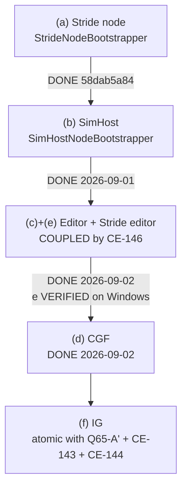

<!--STATUS
state: LIVE
updated: 2026-09-02
current-answer: 🔴🔴 §4.9 FIRST — THE 19 CLUSTER REDS (user, 2026-09-02: "shouldnt we first find out
  why?"). P1 is PAUSED at host (f) IG until the 19 are triaged to owning causes. THEN §5.0 — THE
  AGREED PLAN, user-confirmed 2026-09-01. Read §4.9, then §5.0, then §5 for the
  mechanics of its first step. This file is a SESSION BOOTSTRAP — a self-contained continuation point
  for the entity-creation unification work on the UI lane. Read it after docs/blueprints/RULINGS.md
  (RULE ZERO) and instead of reading RESUME_UI_Lane.md top-to-bottom.
stale-below: §5's opening caution "the user was asked and had not yet answered" is STALE — they
  answered on 2026-09-01 ("yes adopt pack first, then relocate"). Its measured seam table is current.
known-conflict: none. Where this file and RESUME_UI_Lane.md's STATUS block overlap they agree; that
  block is the longer log, this file is the ordered continuation point.
-->

# ⭐⭐⭐ BOOTSTRAP — entity-creation unification, UI lane

> 🔒 **Branch `claude/reset-working-branch-qd1qpv`** · head **`4a69ad3f8`** *(`2026-09-01`)* · ids **`CE-`** *(next free `CE-155`)*.
> ⛔ Push nowhere else. ⛔ No PR unless the user asks.
> 📄 **Owning designs:** [`../DESIGN_Entity_Creation_Unification.md`](../DESIGN_Entity_Creation_Unification.md) ·
> [`Architect_Question_65_Entity_Genesis_Uniformity.md`](Architect_Question_65_Entity_Genesis_Uniformity.md) ·
> the lane log in [`RESUME_UI_Lane.md`](RESUME_UI_Lane.md)'s STATUS block.

---

## 0. 🔒🔒🔒 THE GOVERNING RULING — **quote it, do not paraphrase it**

> ⭐⭐⭐ **User, `2026-08-31`, verbatim:** *"the shared code for entity creation support should not restrict
> any ecs enabled node from creating own networked entities, whuch makes the subsystems equal in
> distributed architecture and rhe shared code more uniform, no exceptions, not removing capabilities by
> design, and only concrete authoring code picks the way it needs"*

| ⭐ what follows from it | |
|---|---|
| ⭐⭐ **BOTH paths are legitimate** | `OwnerAppInstanceId = 0` ⇒ the broadcast arbiter (CGF) owns most components — **correct for brain-enabled entities**. `OwnerAppInstanceId = localNodeId` ⇒ the originating node creates and owns it in-process — **IG map drawings** |
| ⭐⭐ **the AUTHORING CALL SITE picks** | ⛔ not a policy table, not a TKB flag, not config |
| ⛔⛔ **`EntityCreationPack.Build` gets NO flag that omits a system** | the request tier and the spawn system are **always** built — `DESIGN` §3.1 invariant 6, §3.4, acceptance ⑨–⑪ |
| ⭐ **`isDefaultProcessor` is a BROADCAST TIEBREAKER, not an authority gate** | `CreateEntityRequestSystem.cs:151-156` processes a self-targeted request regardless of the flag |

---

## 1. ⭐ WHERE WE ARE — **12 commits, all pushed**

| commit | what |
|---|---|
| `b525d59fa` | the governing ruling + request tier + UML redraw + the "halves" purge |
| `6ac497ec1` | **`CE-142`** filed — ownership delegation is mechanism gated by policy |
| `a7b6216ae` | architect review folded; **`CE-143`**; obstacle ① assembly chosen |
| `f237d11e0` | the 3-file move ruling; **`CE-144`** (destroy-side double consumption) |
| `7face3aee` | `DESIGN` §3.4a — **why** double consumption is possible (the bus is a broadcast double-buffer) |
| `f27717262` | ⭐ **pack step 4** — ONE unified UrbanCombat TKB catalogue |
| `fc5522f57` | the Windows handoff for `CE-145` |
| `71e766f9c` | ⭐ **obstacle ①** — request tier → `Hrot.Common.Systems` |
| `b9757d96d` | corrected the Windows session's diagnosis |
| `58dab5a84` | ⭐ **step 3a** — `EntityCreationPack` + Stride node adopts it |
| `47f9c1581` | merged `CE-145` (Windows lane); filed **`CE-146`** |
| `65a4ccfce` | **`CE-146` probed and resolved** — docs only |

### ⭐ What exists now that did not before

| file | role |
|---|---|
| `Hrot/Engine/Hrot.Common/EntityCreation/EntityCreationPack.cs` | ⭐⭐ **the pack.** `Build(ctx)` → translators + request source + `CreateEntityRequestSystem` + `EntityRequestFinalizationSystem` + `NetworkSpawningSystem` |
| `…/EntityCreationContext.cs` | required `World`/`EntityMap`/`TkbDb`/`IdAllocator`/`Elm`/`NodeId`; the ONE differing value is **`IsBroadcastArbiter`**; optional `NetworkRequestSource`, `AckSink`, **`ExtraTranslators` (add-only)**, `JsonAttributeCompiler`, `OwnershipStrategy`, `OnEntitySpawned`. ⛔ **no `ModuleHostKernel`**, ⛔ **no suppression flag** — both are asserted by tripwire rails |
| `…/EntityCreation.cs` | the built pieces + `Unserviceable(scheduled)`, which **names** each unscheduled piece |
| `Hrot/Engine/Hrot.Core/Tkb/UrbanCombatTkbCatalog.cs` | ⭐ the ONE source of TKB types 1001–2003, seeded by `HrotEnvironment.CreateTkb()` |
| `Hrot/Engine/Hrot.Common/Systems/` | the request tier, namespace `Hrot.Common.Systems` — ⛔ no longer `Hrot.CGF` |

### ⭐ Rails added (all in `Hrot/Subsystems/Hrot.SimHost.Tests/`)

`UrbanCombatCatalogRails` 14 · `RequestTierPlacementRails` 12 · `EntityCreationPackRails` 8.

---

## 2. ⭐ TEST STATE — **the baseline to compare against**

| gate | result |
|---|---|
| T1 `Hrot.SimHost.Tests` | ⭐ **818 pass / 1 fail / 3 skip** |
| the 1 fail | 🔒 **`QA-012`** = `FullBranchPipelineTests.BranchedRecording_CapturesHistoricalStateAsKeyframe`, proven pre-existing by `git stash -u` + rebuild on base |
| `Hrot.Editor.Tests` | 341 / 0 / 1 |
| `Hrot.NodeComposition.Tests` | 22 / 22 |
| `EntityCreationFlowTests` (integration) | 7 / 7 |

⚠ **Observed intermittency, not chased:** one T1 run reported 3 failures while naming only one (26 s vs
the usual 14–15 s); the two runs immediately after were 818/1/3. Steady state is 1.

⛔ **The Stride tree cannot build on Linux** (`Microsoft.WindowsDesktop.App`). The Windows lane verified
`CE-145` there: 0 errors, `MannequinAnimationDefIntegrationTests` 10/10, live editor `entities=6, visuals=6`.

---

## 3. ⭐⭐ STEP 3 — **the adoption order, and what is done**



| host | state |
|---|---|
| **(a) Stride node** | ✅ **done.** Closed a second gap — it had no `CreateEntityRequestSystem` at all |
| **(b) SimHost** | ✅ **DONE `2026-09-01`.** Closed the same second gap host (a) did — SimHost had **no** `CreateEntityRequestSystem`, so its only creation path was a raw bus `SpawnEntityCommand`. ⭐ Also dropped `.WithTranslators(...)`: promotion now reads the ONE list off the ELM *(`CE-155`)*, so the node holds a single instance rather than two equal copies |
| **(c) Editor + (e) Stride editor** | ✅ **DONE `2026-09-02`.** Both hosts build the tier through `EntityCreationPack`; both gained `EntityRequestFinalizationSystem`, which neither had registered before. ⭐ (e) forced `TranslatorPlacements` — its `InfantryVehicleStateStrip` has a POSITIONAL contract `BasePlus` cannot express (`CE-145`/`CE-146`), so the capability was put back as configuration rather than dropped (`R-137`). ✅✅ **(e) VERIFIED ON WINDOWS `2026-09-02`** — `dotnet build Stride\HrotStrideApp.sln` **0 errors** *(no call-site fix needed; all four predicted risk points compiled as written)*; the three Stride suites are **identical to base `2b0a703b3` over 9 runs per side**; and `STRIDE_SELFTEST=1` returns `initialHold=PASS repos=PASS pausedFreeze=PASS drive=PASS` with **no** `cannot place` and **no** `[EntityCreation]` warn ⇒ the anchor resolved and every pack piece was scheduled |
| **(d) CGF** | ✅ **DONE `2026-09-02`.** ⭐ The host the pack was SHAPED from — DESIGN §5 records *"CGF already composes exactly this"* of the composite-source arrangement — so adoption removed no decision it had not already made correctly, and the diff is a pure composition change. ⚠ **HOISTED**: the construction moved ~25 lines UP, above `CgfLogicPack`, because `_scenarioSource` is now `creation.LocalRequests` and the logic pack consumes it. ⭐ `DeleteEntityRequestSystem` now shares the pack's `FinalizationSystem` instead of the separately-built one |
| **(f) IG** | ⛔⛔ **must ship in ONE commit** with Q65-A′ + `CE-143` + `CE-144`, or IG double-spawns and double-destroys |

---

## 4. ⭐ OPEN IDS

| id | what | blocking? |
|---|---|---|
| **`CE-141`** | IG's translator width — needs a live `--mode all` probe | no |
| ✅ **`CE-142`** | **DONE `2026-09-01`** (`e888872a0`) — the three delegation pieces are ungated. ⚠ **Prerequisite, not a fix**: CGF's authority over a SimHost-originated entity is UNCHANGED, because nothing computes Brain-ward grants. ⭐ That policy half is superseded by `DESIGN_Role_Affinity_Ownership.md` | done |
| **`CE-143`** | add init-only `ReliableInitType` to `EntityCreationRequest`, default `AllPeers`; hardcoded at `CreateEntityRequestSystem.cs:302` and `:397`. ⚠ decide whether `:397`'s children inherit (lean: yes) | ⭐ prerequisite for IG drawings being **usable** |
| **`CE-144`** | drop `GhostDestructionSystem` from IG once it gains `NetworkSpawningSystem` | ships with (f) |
| **`CE-146`** | ✅ **DONE `2026-09-02`** — the Stride editor's SECOND pipeline is folded into the pack. ⛔ **The plan line said "the strip goes through `ExtraTranslators`" and that was WRONG** — `ExtraTranslators` appends, and the strip has a positional contract (`CE-145`). It goes through the new `TranslatorPlacements` instead | = host (e) |
| ✅ **`CE-155`** | **DONE `2026-09-01`** — `GhostPromotionSystem`'s empty translator list on the FACTORY path *(CGF)*. ⚠ **Filed late**: the id was cited in three production files with no row. ⚠ Its first scope claim *("every node")* was **wrong** — builder-path hosts did pass a list | done |
| ✅ **`CE-156`** | **DONE `2026-09-01`** — a composition-root source scan was passing on its own COMMENTS; SimHost **and IG** were green for the wrong reason, hiding a rail-doc/data contradiction. ⭐ Comments are now stripped before any such scan | done |
| — | two **stale diagnostics**, fix in words not code: `NavigationIntentBridgeSystem.cs:234-240`'s warning text; `Translator_Infantry200_DoesNotInjectVehicleState` (re-home onto the strip) | no |
| — | ✅ **SETTLED `2026-09-02` on Windows — the two `StrD21` reds are PRE-EXISTING, and they are NOT the entity-creation work.** 📐 Both fail **9/9 at `7a64572bf` AND 9/9 at base `2b0a703b3`**. ⭐⭐ **The hypothesis that they read `VehicleState`, so `CE-145`'s ordering fix could move them, is REFUTED BY THE SOURCE:** every `StrD21` test builds a bare `EntityRepository` and hand-adds `repo.AddComponent(entity, new VehicleState())`, then constructs `VehicleNavigationIntentSystem` standalone. ⛔ **No `TkbDatabase`, no translators, no pack** ⇒ the strip's position **cannot reach these tests**. ⭐ The defect is in the nav systems themselves. ⚠ Sibling `VehicleNavIntentSystem_WritesVehicleState_OnFirstTick_WithFakeNavmesh` **passes on both sides** | ✅ |

⭐ **After entity creation:** back to gizmos — **`CE-134`** (health bar) first, then `CE-133`, `CE-135`,
`CE-136` against [`../UX/UX_Feature_Entity_Symbology.md`](../UX/UX_Feature_Entity_Symbology.md) §3.8.

---

## 4.9 🔴🔴🔴 **THE 19 CLUSTER REDS — the user's question, `2026-09-02`. READ BEFORE ANY MORE P1 WORK.**

> 🔒 **User, verbatim:** *"the 19 reds is actually a very bad sign, could it be because of the
> unification? how can we make sure after unification the system works if 19 integration tests are
> failing? shouldnt we first find out why?"*

⭐⭐⭐ **The question is right and P1 does NOT continue until it is answered.** ⛔ **Host (f) IG is PAUSED**
— see §5.0's amended order.

### ⭐ What is MEASURED, and what is NOT — ⚠ the distinction is the whole point

| claim | status |
|---|---|
| ⭐ host **(d) CGF** added **zero** reds | ✅ **measured** `2026-09-02` — 19 before / 19 after, `--no-build` both sides, **set-diff EMPTY in both directions** |
| ⭐⭐ the cluster red count has been going **DOWN**, hard, across exactly the period the unification ran | ✅ **measured, in the commit record**: **49 → 31** (`76b8eb406`, `CE-148` — the harness never resumed after boot) → **19** (`eabcbf660`, `CE-152` — two xUnit collections NAMED but never DEFINED ⇒ 12 interference failures) |
| ⭐⭐⭐ the surviving **19 are REAL defects, not interference** | ✅ **measured** — `551d43c53` ran a **per-class isolation sweep**, and `eabcbf660` verified the survivors are *"name-for-name exactly the set the per-class isolation sweep called real"* |
| ⛔⛔ **the 19 were NEVER attributed to a CAUSE, one by one** | 🔴 **NOT MEASURED. This is the hole.** They are known-real and known-stable; **nobody has mapped each to an owning defect** |
| ⛔⛔ hosts **(b) SimHost** and **(c)+(e) Editor/Stride editor** were **never gated against the cluster integration suite** | 🔴 **NOT MEASURED** — only (d) was. ⚠ **This is a gate-contract row-8 miss of mine**: a cross-cutting change must name the integration suite that exercises its invariant |

### ⛔ A CORRECTION I OWE — *(said in chat `2026-09-02`, wrong)*

⚠ I wrote *"the other 19 were NOT run in isolation and no claim is made about them."* 🔴 **False.**
⭐ They **were** run in isolation — by `551d43c53`'s per-class sweep, earlier in this same programme —
and **19 is the post-isolation REAL count**, which is a stronger and more worrying statement than what I
said, not a weaker one.

### ⭐⭐ THE LEAN — **probably NOT unification damage, but that is a LEAN and it has an ⛔-ASSUMED row**

| the lean rests on | measured |
|---|---|
| host (d) added zero, identical set | ✅ `2026-09-02`, both directions |
| the trajectory is 49 → 31 → 19 **downward** across the unification period ⇒ if unification were breaking things the number would CLIMB | ✅ `76b8eb406` · `eabcbf660` |
| both big reductions were **test-infrastructure** defects (harness boot, xUnit collection definitions), not production ones | ✅ their commit messages |
| **each of the 19 has a non-unification root cause** | ⛔⛔ **ASSUMED — and it is LOAD-BEARING.** If even one traces to the pack, the lean flips |

⇒ ⭐ **Therefore the lean does not license proceeding.** 🔒 `R-139`: no ⛔-assumed row may be load-bearing.

### ⭐⭐⭐ THE NEXT STEP — **triage the 19 to owning causes. This is the whole next batch.**

⛔ **Do NOT start by re-running the suite** — it is 9–13 min and the count is already known and stable.
⭐ **Start by reading the 19 failure MESSAGES**, which the count never showed:

```bash
# the names, and crucially the ASSERTIONS — the count alone has told us nothing for three batches
dotnet test Hrot/Runner/Hrot.ClusterRunner.Integration.Tests/Hrot.ClusterRunner.Integration.Tests.csproj \
  --no-build --logger "console;verbosity=detailed" 2>&1 | tee /tmp/reds.txt
```

⭐ **The 19, grouped as they fall** *(measured `2026-09-02`, stable across two full runs)*:

| # | group | first question to ask |
|---|---|---|
| 3 | `CgfSubsystemHeadlessTests` — `SimHost_WanderMission`, `SimHost_MoveToLocationMission`, `CGF_MovingVehicle_GhostPositionUpdates` | ⭐⭐ **the movement chain.** Related to `CE-103` *(intent produced, never consumed)* — ⚠ **the strongest unification-adjacent candidate, check FIRST** |
| 2 | `SpawnMovingVehicleIntegrationTests` | same chain, IG side |
| 2 | `NetworkDemoPatrolAndEngageTests` Phase2/Phase3 | same chain |
| 4 | `FeatureSwitchRcuIntegrationTests` | tracked as `CE-154`; RCU toggling, ⛔ not entity creation |
| 2 | `ClusterOpE2eScriptTests` | record/replay |
| 1 each | `CgfRecording` · `DistributedScenarioLoad` · `GhostPromotion` · `MapPlacement` · `SensorMechanism` · `UrbanCombatFileLifecycle` | ⭐ `GhostPromotion` and `DistributedScenarioLoad` are **entity-creation adjacent — check these second** |

⭐⭐ **The deliverable is a TABLE: each of the 19 → an owning tracker row → "unification-caused: yes/no,
with the file:line that shows it."** ⛔ Not a re-run, not a count.

⚠ **If the answer is "no" for all 19, that is a RESULT worth having** — it converts a scary number into a
known backlog and unblocks (f). ⭐ **If any is "yes", it outranks (f) entirely.**

### ⭐ The cheap corroboration, if the triage is inconclusive

📐 A pre-unification baseline is **CONFOUNDED and must not be quoted naively**: the pre-pack commit
`b9757d96d` *(parent of host (a) `58dab5a84`)* predates **both** `CE-148` and `CE-152`, so it would
report ~49 reds **inflated by interference** — the measuring apparatus itself changed. ⇒ ⭐ **the only
sound cross-commit comparison is per-test-NAME, never per-count.**

---

## 5.0 🔴🔴🔴 THE AGREED PLAN — **user-confirmed `2026-09-01`. START HERE.**

> 🔒 **User, `2026-09-01`:** *"yes adopt pack first, then relocate"* — after asking *"where will you
> instantiate the code? This should be part of the shared entity creation pack, right?"*

⭐⭐ **Why this order.** Relocating `GhostPromotionSystem` into `EntityCreationPack` is the end state
*(`DESIGN_Role_Affinity_Ownership.md` §3.7)*, ⛔ **but a host that has not adopted the pack would LOSE
ghost promotion the moment the NED module stops registering it.** ⇒ adopt first, relocate second; the
alternative is a temporary bridge that would itself be the second registrar the pack forbids.

| # | step | state |
|---|---|---|
| **P1** | ⭐⭐ **finish pack adoption** — hosts (b) SimHost → (c)+(e) Editor + Stride editor *(coupled, `CE-146`)* → (d) CGF → (f) IG *(atomic with `Q65-A′`+`CE-143`+`CE-144`)*. §3's order, §5's mechanics | ✅ (b) `2026-09-01` · ✅ (c)+(e) `2026-09-02` *(e **VERIFIED on Windows**)* · ✅ (d) `2026-09-02` ⇒ ⭐⭐ **all five materialising hosts are on the pack.** ⛔⛔ **(f) IG is PAUSED `2026-09-02`** — 🔒 user: *"shouldnt we first find out why?"* about the 19 cluster reds. ⭐ **§4.9 is the next batch**; (f) resumes after it, and still must ship in ONE commit with `Q65-A′` + `CE-143` + `CE-144` |
| **P2** | 🔴 **relocate `GhostPromotionSystem`** from `NedReplicationModule` into `EntityCreationPack`, **one commit, add+remove together** | blocked on P1 |
| **P3** | ⭐ **role-affinity ownership** — `DESIGN_Role_Affinity_Ownership.md` §6 steps 0→3b | blocked on P2 |

### ⭐ What `2026-09-01` settled — ⛔ do not re-derive

| ⭐ | |
|---|---|
| ⭐⭐⭐ **ownership is NETWORK-AGNOSTIC** | 🔒 user: *"we can have multiple different network implementations - ownership can not be tied to one of them"*. 📐 Four factories: `Ned`, `Bdc`, `Offline`, + mocks. ⛔ **`DescriptorOwnershipMap` and `EDescriptorType` MUST NOT carry ownership** — the map is filled per implementation via `RegisterFromTranslator`. ⭐ The role carries a **`BitMask512` of component ids** |
| ⭐⭐⭐ **TWO ownership categories** | ⭐ **cognitive** *(safe to default)* ⇒ role affinity · ⭐ **birth-critical** *(must be valid at birth)* ⇒ **creator birthright**, then the existing `DeferredTakeOwnership` handoff. 🔒 Architect: *"the position can not start empty"* |
| ⭐⭐ **birth-criticality is a COMPONENT property declared by the TKB** | 🔒 user: *"TKB should define what components are birth critical"* — ⛔ not a descriptor *(networkless nodes have none)*. ⭐ Initial content: **`SimTransform` only**, via a new `TkbTemplate.BirthCriticalComponents` beside the existing `MandatoryComponents` |
| 🔴 **authority does NOT stop execution** | 📐 `BTreeTickSystem.cs:62-65` has **no authority filter**, and no production system uses `QueryBuilder:97`'s `.WithAuthority<T>()`. ⇒ P3 needs **both** a narrowed Muscle-only registration **and** the query filter, or the whole design is cosmetic |
| 🔴 **a BDC node never promotes its ghosts** | 📐 `BdcReplicationModule.cs:66` registers `GhostCreationSystem` but **no** `GhostPromotionSystem`. ⭐ P2 closes this as a side effect |

### 📌 Committed `2026-09-01` — `44195801c..4a69ad3f8`

| commit | what |
|---|---|
| `e2e1a5a2c` | ghost promotion role-independent + shares the ELM's translator list *(it was `Array.Empty` on **every** node — 6th instance of the omitted-`translators:` family)*. ⚠ **The role-gate half is SUPERSEDED by P2** — it disappears when registration relocates |
| `e888872a0` | `CE-142` + its tracker row + the Q65 §5.3 as-built |
| `d63445a18` · `47aa87600` · `9462c51ef` · `f7fa41608` · `4a69ad3f8` | [`../DESIGN_Role_Affinity_Ownership.md`](../DESIGN_Role_Affinity_Ownership.md) — written, then corrected four times *(architect's birth-critical flaw · the component/TKB correction · network-agnosticism · composition)* |

⚠ **Cluster reds are UNCHANGED** by all of it — 9 before, 9 after, same nine. ⭐ That is expected and
honest: everything so far is prerequisite. 📌 The acceptance test for the whole arc is
`CgfSubsystemHeadlessTests.SimHost_MoveToLocationMission_EntityMovesWithoutGhostTick`; ⚠ it may stay red
afterwards for its OWN subject *(it also guards `MissionDirectorSystem` against publishing a params-less
`AssignBehaviorHashEvent`)* — that would be the test working.

---

## 5. ⭐⭐⭐ THE NEXT STEP — **SimHost, host (b)**

⚠ **The user was asked and had not yet answered when the previous session ended.** ⛔ Confirm before
starting. ✅ (c)+(e)'s Windows verification pass is DONE (`2026-09-02`) — build, suites and self-test all green.

📌 **Seams, measured:** `Hrot/Subsystems/Hrot.SimHost/SimHostNodeBootstrapper.cs`

| line | today | becomes |
|---|---|---|
| `:152` | `_translators = TkbTranslatorSet.BasePlus(AiDiagnosticsTkbTranslator)` | `ctx.ExtraTranslators = [AiDiagnosticsTkbTranslator]` |
| `:273` | `elm.SetTranslators(_translators!)` | the pack does it — ⚠ **must still precede the kernel's `Initialize`** |
| `:275-282` | `new NetworkSpawningSystem(… onEntitySpawned: (world, entity, isLocalAuthority) => { … })` | `ctx.OnEntitySpawned = <that lambda, PRESERVED VERBATIM>` — 🔒 it is the **`AX-011` egress-shadow hook**; its `:304` comment explains why it lives here and not in `NetworkSpawningSystem` |
| `:160` | `.WithTranslators(_translators)` *(TKB-022, threads to `NedReplicationModule`)* | ⚠ **keep** — the same list must reach replication |

⭐ Then schedule `RequestSystem` / `FinalizationSystem` / `SpawnSystem` the way host (a) does, and call
`Unserviceable(scheduled)` so any unscheduled piece is **named**, not silently dropped.
⛔ `IsBroadcastArbiter = false`.

---

## 6. ⛔⛔ THE ERROR CLASS THAT COST THIS PROGRAMME SIX WRONG CLAIMS

⭐⭐⭐ **Every one was reasoning from a NAME, a COMMENT or a `using` LIST instead of the BODY or a probe.**

| ⚠ habit | |
|---|---|
| ⭐⭐ **a usings scan is NOT a dependency scan** | `CreateEntityRequestSystem.cs:394` constructs `Hrot.Common.Serializers.InitialUnitSubordinateIntent` **fully qualified** ⇒ invisible to a usings scan ⇒ my `Hrot.Core` target was a **reference cycle**. ⭐ grep the body for `<OtherAssembly>.` prefixes, **or just build it (8 s/project)** |
| ⭐⭐ **for a NAMESPACE move, grep the SEGMENTS too** | `CE-145`: relative-qualified refs (`Components.StanceId`), one fully-qualified ref that must NOT move, and a namespace whose **sole declarant** was the moved file ⇒ the rename deleted it |
| ⭐ **"Consumes" in a doc comment lied** | `ManagedEventStream.cs:95` is `Read() => _front` — **no pop, no claim flag.** The bus is a **broadcast double-buffer**; that is exactly why double consumption of *orders* is possible |
| ⭐ **do not size a deletion from production callers alone** | measure the **test** surface: a re-home is not a mechanical `s/old/new/` |
| ⭐ **red-proofs are INVERSE EDITS** | ⛔ never `git checkout --` |

### ⭐ Build/test discipline *(measured on this repo)*

| ⛔ don't | ⭐ do |
|---|---|
| `dotnet build <the.sln>` in the fix loop — **115 s** | `dotnet build <proj> --no-restore` — **8 s** |
| re-run the whole suite to "confirm" | prove the fix through **the rail that reddened for it** |
| sit on the E2E suite | **T3 is async**, never a foreground blocker |

---

## 7. 🔒 STANDING USER CONSTRAINTS — **preserve verbatim**

- 🔒 The editor's scenario path was **hand-tested manually** — be careful with any "fixes" there.
- 🔒 *"there should be nothinkg like cluster tKB and editor TKB; we need cgf==editor."*
- 🔒 **`R-137`:** *"we should not lose flexibility of the features, if unification takes some aways, this is
  a singal we should think how to put it back (via configuration for example)."*
- 🔒 *"if editor builds UrbanCombat stuff then everyone should, editor is the most advanced in that matter."*
  ⚠ **and:** the catalogue is a **development default** — the real system reads templates from files synced
  to all nodes.
- ⛔ **Ask questions in plain chat text — never the `AskUserQuestion` widget.**
- ⭐ **Always give GitHub blob links** for docs **and** task ids, on `claude/reset-working-branch-qd1qpv`
  — ⚠ **push first** or the link 404s (the user is on mobile).
- ⛔ **Never derive MCP capability from engine source** — read `tools/ai-debug-mcp/SKILL.md` first;
  ⛔ `SKILL.md` is **GENERATED**, never hand-edit it.
- ⭐ **When the codebase-memory MCP is offline, use its CLI** —
  `/opt/codebase-memory-mcp/codebase-memory-mcp cli <tool> '<json>'`. ⛔ "MCP not connected so I used
  grep" is a **MISS**. ⚠ `search_graph`/`trace_path`/`query_graph` return **text**;
  `list_projects`/`get_graph_schema` return **JSON**.
