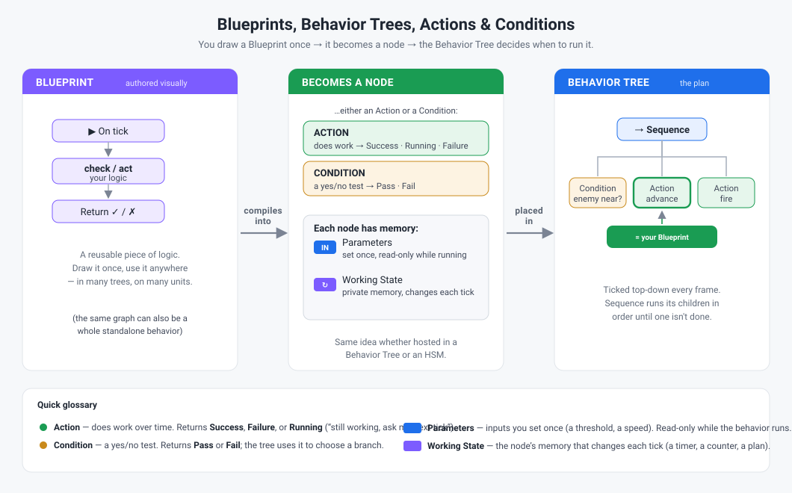

# Blueprints & Behavior Trees — The Big Picture

> **The gentle intro.** One picture for how the pieces fit; the
> [Variables Designer Quickstart](Variables_Designer_Quickstart.md) covers the *memory* choice next.
> For **what the system can actually do and how it's built**, see
> [Blueprints_Overview.md](Blueprints_Overview.md) (capabilities + architecture).

## In one breath

- A **Blueprint** is a piece of logic you **draw** (a node graph) instead of writing C#.
- When used in a behavior it **becomes a node** — either an **Action** (does work) or a
  **Condition** (a yes/no test).
- A **Behavior Tree** is the **plan**: it's ticked top-down each frame and decides *which* action or
  condition runs *now*.
- Every node has **Parameters** (set once, read-only) and **Working State** (its memory, changes
  each tick).

That's the whole model. Everything else — scopes, sharing, `Get/Set Shared` — is just *who else gets
to see a node's Working State*, which the quickstart's decision tree walks you through.
