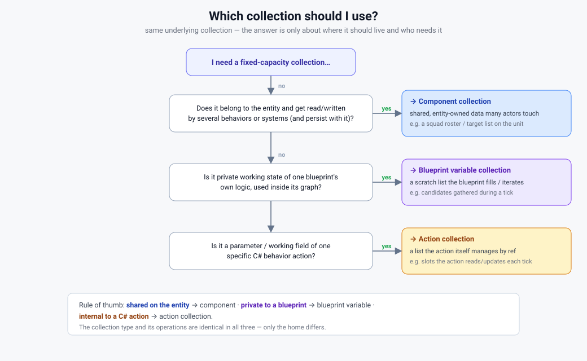
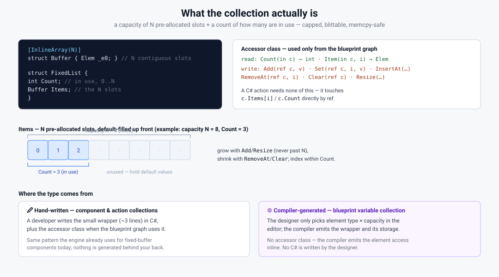
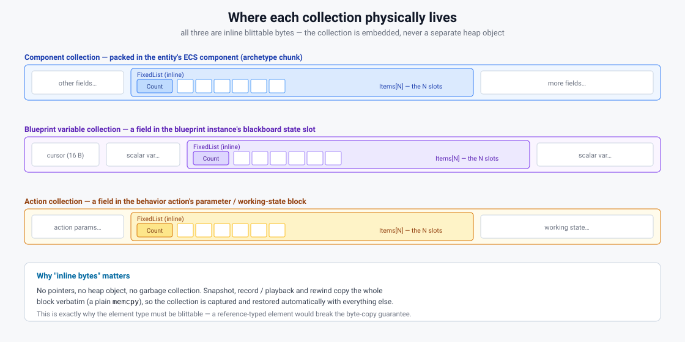
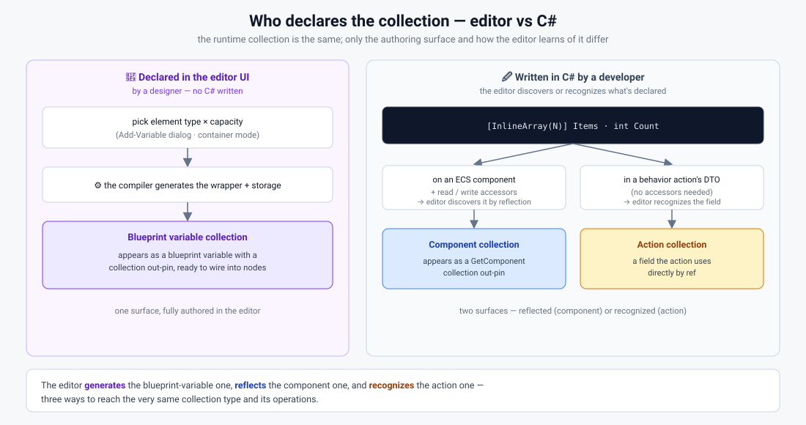

# Fixed Collections — diagrams

Visual companion to `Blueprint_Fixed_Collections_Design.md`. These describe the concept in its final,
fully-implemented state: one fixed-capacity, blittable, ordered collection (`[InlineArray(N)] Items + int Count`)
that can live in three places — a **component collection** (on an ECS component, shared on the entity), a
**blueprint variable collection** (a blueprint's own private blackboard variable), or an **action collection**
(a field in a behavior action's parameter / working-state struct). SVGs live in `diagrams/`.

## 1. How they fit the stack
Each home × who authors it × where it lives × how blueprints vs C# actions reach it.

## 2. Reading & writing in the graph
One pipeline; the emitted C# is chosen only at the final step by the collection's kind. The graph author never
sees which home it is. A C# action's own collection skips the pipeline (a plain field, mutated by ref).

## 3. Which one should I use?
A short decision: shared on the entity → component; private to a blueprint → blueprint variable; internal to a C#
action → action collection.

## 4. What the collection actually is
The `[InlineArray(N)]` slots + `Count` shape: N pre-allocated, default-filled slots with a count in use; capped,
blittable. Hand-written for component/action homes, compiler-generated for the blueprint-variable home.

## 5. Where it physically lives
All three are inline bytes — embedded in the component / the blueprint's blackboard slot / the action's block.
No pointers, no GC, so snapshot / record / playback copy them verbatim.

## 6. Editor vs hand-written C#
The authoring split: the editor *generates* the blueprint-variable one, *reflects* the component one, and
*recognizes* the action one — three ways to the same collection.

