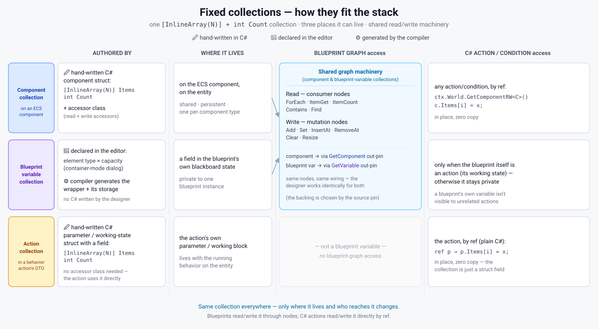
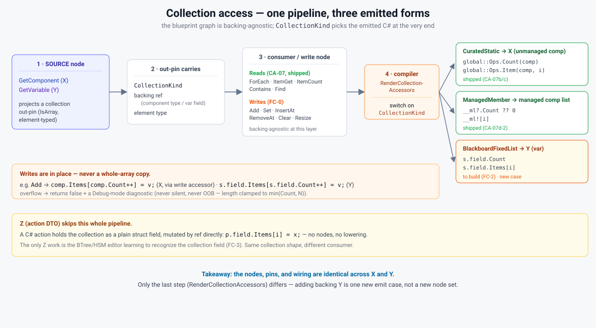

# Fixed Collections — diagrams

Visual companion to `Blueprint_Fixed_Collections_Design.md`. One fixed-capacity blittable collection
(`[InlineArray(N)] Items + int Count`) integrated across three backings (X ECS component · Y blueprint
blackboard variable · Z BTree/HSM action DTO). SVGs live in `diagrams/`.

## 1. Integration map — who authors what, who accesses what
The three backings × (authored by / storage / blueprint-graph access / C# action access).

## 2. Access dataflow — one pipeline, three emitted forms
How a collection access lowers to emitted C#. The blueprint graph is backing-agnostic; `CollectionKind` selects
the emitted code only at the final `RenderCollectionAccessors` step — so adding backing Y is *one new emit case*,
not a new node set. Z (a C# action's DTO field) skips the pipeline entirely and is mutated by ref directly.

## Further views (draft as needed)
- **3. "Which backing do I use?"** — decision tree (shared-on-entity → X · private-to-one-blueprint → Y ·
  an action's own scratch → Z).
- **4. Reusable type anatomy** — the `[InlineArray(N)]`+`Count`(+accessor class) shape, hand-written vs
  compiler-generated, capacity/Count/default-fill.
- **5. Storage layout** — where each backing physically lives (ECS component · `BlueprintBlackboard*` slot ·
  `BrainBlackboard`/partition slot) and the memcpy-safe snapshot story.
- **6. Editor vs hand-written C#** — the authoring-surface split (editor-declared Y vs hand-authored X/Z, and the
  BTree classifier gap for Z).
