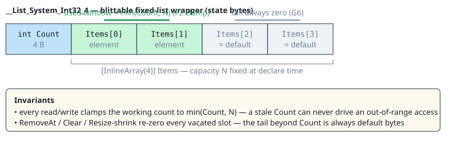

# Fixed-List Blueprint Variables (FC-2)

Fixed-capacity, blittable lists as blueprint variables — declared like any variable, mutated
in place, zero heap, zero reflection. Capacity is fixed at declare time; `Count` is the live
logical length.

## At a glance

| What | How | Where |
|---|---|---|
| Declare | My Blueprint ➕ → Container: **List (fixed)** → capacity + initial length (budget line shows state bytes) | `VariableCreateModal` → `BlueprintTypeRef.Capacity/InitialLength` |
| Read | The **same five collection consumers** as component collections: For Each / Get Item / Item Count / Contains / Find, wired from the list's GetVariable pin | Stage5 binds `ref s.MyList` (no entity, no component read) |
| Write | Six **`ListWrite`** verbs: Add / Set At / Insert At / Remove At / Clear / Resize (palette: *Variable → Add (List)* …) | `IrOp_ListWrite` → in-place Span-form mutation |
| Clone | `SetVariable(listB ← GetVariable(listA))`, **identical shape only** (same element type + capacity) | flat struct copy — no loop, no Span |
| Debug | Watch renders `List<Int32>[4] Count=2 {5, 7}` | `StateFields` descriptor + `BlueprintDebugSession` |
| Demo | `ListVariableDemo.bp.json` (Tutorial) — Add per tick, fills to capacity, 5th Add rejects | `Hrot.AI.Behaviors/Recipes/Blueprints/` |

## Write-verb contract

| Verb | Operands | Ok=false when | Zeroing (G6) |
|---|---|---|---|
| Add | Value | list full | — |
| Set At | Index, Value | index ∉ [0, Count) | — |
| Insert At | Index, Value | full, or index ∉ [0, Count] | — |
| Remove At | Index | index ∉ [0, Count) | vacated last slot |
| Clear | — | never (no Ok pin) | whole used prefix |
| Resize | Length | length ∉ [0, Capacity] | dropped tail on shrink |

Failed ops write nothing (probe-reported in Debug builds). Unwired required operands degrade
to a safe no-write at compile time.

## Diagnostics

| Code | Fires when |
|---|---|
| BP1504 | declared `InitialLength` outside `[0, Capacity]` |
| BP1505 | `ListWrite` target is not a declared fixed-list variable (empty binding flagged once exec-wired) |
| BP1506 | list value wired to a pin that can't take a list — anything but a consumer's `Collection` pin or an identical-shape `SetVariable` clone |
| BP2066 | consumer wired to a list but the wire-bake state is missing (Kind-aware) |

## Limits (v1)

- Element must be unmanaged (no `String`); no nested lists.
- Self-state only: instance `Variables` and AiPrimitive `WorkingState` (zero-on-attach guaranteed).
- Not accepted by `GetShared`/`Parameters`.
- Editor capacity UI clamp: 1–256.
