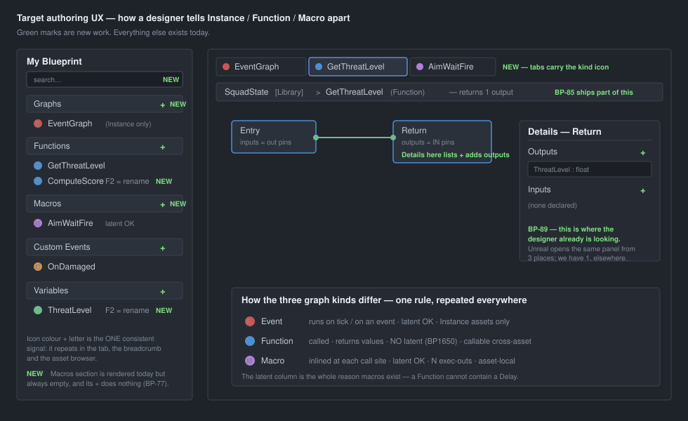

# Functions & Macros — the authoring plan (user's view)

> **Scope:** what a designer sees and does. Compiler mechanics only where they force a UX decision.
> **Yardstick:** Unreal, per the user — *"a cheap source of 'is that a good approach' responses."*
> **Status:** consolidates already-tracked items (`BP-74`…`BP-97`) into one sequence, and adds four
> new ones (`BP-98`…`BP-101`). ⚠ Uses Unreal as **evidence, not authority** — two parity checks
> already came back *"we already have it"*.

---

## The problem in one sentence

**Three graph kinds exist, and the UI gives the designer no way to tell them apart** — which is why the
Windows session produced *"I have no idea how to go to the instance graph"*, *"I have no idea how to add
3 function outputs"*, and *"the graph tab has been emptied"* (it had not — the canvas had switched).

---

## Target

---

## The mental model — two axes, one visual rule

| Axis | Values | Chosen | Today |
|---|---|---|---|
| **Asset dispatch** — what the file *is* | `Instance` · `AiPrimitive` · `Library` · *(later)* `MacroLibrary` | at **create** time | ❌ hardcoded `Instance` (`BlueprintNewAssetService:96`) |
| **Graph kind** — what a graph *inside* it is | `Event` · `Function` · `Macro` · `Construction` | per graph | ⚠ exists, invisible |

**The visual rule: one colour + one letter per graph kind, repeated in every surface.**
Panel row → tab → breadcrumb → palette entry → call-node header. Learn it once.

| | Colour | Runs how | Latent? | Returns? | Shared? |
|---|---|---|---|---|---|
| **E** Event | red | on tick / on an event | ✅ | ✗ | ✗ |
| **F** Function | blue | called | ❌ **BP1650** | ✅ N outputs | ✅ cross-asset |
| **M** Macro | purple | **inlined** at each call site | ✅ | ✅ | ⚠ asset-local (Q25-C1) |

⭐ **The latent column is the whole reason macros exist.** A Function compiles to a plain `static`
method and cannot contain a `Delay`; a Macro is copy-pasted into the caller, where the latent cursor
already lives. Unreal states the same rule for the same reason. **This is the sentence the UI must
teach** — put it in the Macros section tooltip and the create dialog.

---

## Gaps by area

### 1. New asset / open asset

| Unreal | Today | Fix |
|---|---|---|
| *Create Advanced Asset → Blueprint Class / **Function Library** / **Macro Library*** | every new asset is `Instance`, hardcoded | **BP-92** — dispatch picker at create; build it as an **extensible list**, not a toggle |
| Asset icon differs per Blueprint type | one icon for all | **BP-98** (new) |
| Asset browser shows what the asset *is* | name only | **BP-98** (new) |

⚠ This is upstream of everything else. `SquadState` is a functions-only asset labelled `Instance`
**because that is the only thing the editor can make** — fix this first or every other label lies.

### 2. My Blueprint panel

Unreal's six sections: *Add New · Graphs · Functions · Macros · Variables · Event Dispatchers*, plus a
**search box**.

| Section | Today | Fix |
|---|---|---|
| **Graphs** | rendered, **no `+`** (`BlueprintMyBlueprintModel:57` — `canCreate:false`) ⇒ no route to an Event graph at all | **BP-88** |
| **Functions** | ✅ `+` works (BP-24) | — |
| **Macros** | rendered with a live `+` that **does nothing**, list hardcoded empty (`:116`) | **BP-77** → closed by **BP-80** |
| **Custom Events** | ✅ works — ours, not Unreal's | — |
| **Variables** | ✅ `+` works | — |
| *Event Dispatchers* | deliberately absent (BP-09) | — |
| **Search box** | ❌ absent | **BP-99** (new) |

### 3. Telling graphs apart in the UI

| Surface | Today | Fix |
|---|---|---|
| Canvas tab | asset name only, no per-graph identity | **BP-85** (in flight) + **BP-100** (new — kind icon on tabs) |
| Breadcrumb | ❌ | **BP-85** — extend to `Asset [Dispatch] > Graph (Kind)` |
| My Blueprint rows | text only, no icon | **BP-100** (new) |
| Palette / drag | functions absent entirely | **BP-75** |
| Call-node header | ✅ shows the name (BP-68) | — |

### 4. Defining inputs and outputs

**The single worst gap.** It blocked verification of `BP-73`, the programme's largest unverified item.

| Unreal | Today |
|---|---|
| Details panel with **Inputs / Outputs** and `+` buttons | one **Graph Signature** window, elsewhere |
| Opens from **three** places: My Blueprint item · **entry node** · **result node** | **one** place, none of them the node you are looking at |
| Inputs → data-**out** pins on entry; outputs → data-**in** pins on Return | ✅ **identical** — BP-71/BP-73 got this right |

⇒ The data model is already at parity. **Only the control is in the wrong place.** Putting add/remove on
the Return node's Details is not a workaround — it is exactly what Unreal does. → **BP-89**

### 5. Rename

Unreal: **F2** *and* right-click *Rename*, on every item; double-click is an extra, never the only route.
Today: **double-click only, no affordance, no hint** — now the *third* instance of that pattern
(`BP-75`, `BP-89`, `BP-90`). → **BP-101** (new) — one keybinding + context entry across **all** panels,
rather than fixing one control at a time.

---

## Sequence

Ordered so each step makes the next honest. **Nothing here needs an architect round.**

| # | Item | Why here |
|---|---:|---|
| 1 | **BP-92** dispatch at create | Everything downstream labels the asset; do it before the labels exist |
| 2 | **BP-89** outputs on the Return node | Unblocks the **T-series** — `BP-73` is still unverified because of this |
| 3 | **BP-85** + **BP-100** breadcrumb + kind icons | Makes the three kinds visible; kills the "graph emptied" scare |
| 4 | **BP-101** F2 rename everywhere | Cheap, and closes the third instance of one pattern |
| 5 | **BP-88** Graphs `+` | Honest only *after* step 1 — else it cements the wrong dispatch |
| 6 | **BP-75** palette + drag · **BP-76** go-to-definition | Discoverability of what now exists |
| 7 | **BP-79**…**BP-83** macros | The Macros section stops lying; **BP-77** closes with BP-80 |
| 8 | **BP-95** one call node · **BP-97** wire feedback · **BP-96** conversions · **BP-87** types | Wiring polish, once the shapes are right |
| 9 | **BP-98** asset icons · **BP-99** panel search | Nice-to-have; genuinely last |

⚠ **Steps 1 and 2 are the ones that pay immediately.** Step 2 alone unblocks a verification that has
been stuck for four batches.

---

## What this plan does *not* change

- **Macros stay asset-local** (Q25-C1). A function caller needs only a *signature*; a macro consumer
  needs the *body*, and editing it must rebuild every consumer. `Dispatch: Library` does not help —
  see [Q25 § Consistency](Architect_Question_25_Macros.md).
- **Event Dispatchers stay absent** — superseded and removed in BP-09.
- **Blueprint Interfaces** are not proposed. No user report has asked for them; noted, not built.

**Sources:** [My Blueprint panel](https://docs.unrealengine.com/5.2/en-US/my-blueprint-panel-in-the-blueprints-visual-scripting-editor-for-unreal-engine/) ·
[Functions](https://dev.epicgames.com/documentation/en-us/unreal-engine/functions-in-unreal-engine) ·
[Macros](https://dev.epicgames.com/documentation/unreal-engine/macros-in-unreal-engine) ·
[Function Libraries](https://dev.epicgames.com/documentation/en-us/unreal-engine/blueprint-function-libraries-in-unreal-engine) ·
[Macro Library](https://dev.epicgames.com/documentation/en-us/unreal-engine/blueprint-macro-library-in-unreal-engine)
