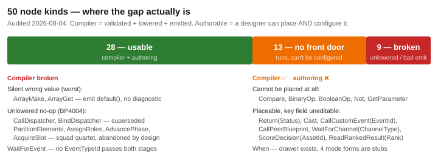

# Blueprint Gaps & QoL Audit (2026-08-04)

> **Scope:** planned-but-unimplemented blueprint features (function editing, macros, My Blueprint
> panel wiring) + quality-of-life parity against Unreal's Blueprint editor.
> **Method:** 4 parallel doc-vs-code scans over 89 design docs / 50 node kinds / 145 editor files.
> Headline claims re-verified by hand — see [Confidence](#confidence).
> **Supersedes for status purposes:** `Blueprint_Feature_Maturity_Matrix.md` (2026-07-16).

## Headline

**One defect explains most of the gaps: declared API surface with no registered handler.**
The NodeEdit core and the compiler both ship rich vocabularies that the Blueprint editor host never
wires up. This is good news for cost — most items below are *wiring jobs against existing
infrastructure*, not new subsystems.

The compiler/runtime layer is substantially more mature than the authoring layer. The July matrix's
thesis — *authoring is the critical path, not the runtime* — *still holds at 50 node kinds*.

## 1. My Blueprint panel — 1 of 14 commands wired

The panel is registered and reachable (`EditorSubsystem.cs:2923`) and renders 6 sections. Of the 14
commands it invokes, **one** has a handler. Failure is **silent**: `MyBlueprintPanel.InvokeCreate`
discards the `EditorCommandResult` (`MyBlueprintPanel.cs:288`), and `EditorCommandsImpl.Invoke`
merely returns `"Unknown command"` (`EditorCommandsImpl.cs:21`). Buttons render, click, do nothing.

| Command | Wired | Command | Wired |
|---|:--:|---|:--:|
| `editor.create-variable` | ✅ | `editor.create-custom-event` | ❌ |
| `editor.create-variable-get` | ❌ | `editor.create-event-dispatcher` | ❌ |
| `editor.create-variable-set` | ❌ | `editor.duplicate-item` | ❌ |
| `editor.create-function` | ❌ | `editor.rename-item` | ❌ |
| `editor.create-macro` | ❌ | `editor.delete-item` | ❌ |
| `editor.create-dispatcher-call/-bind/-unbind` | ❌ | `editor.find-references` | ❌ |

Consequences: a variable can be **created but not renamed, duplicated, or deleted**;
`create-variable-get/-set` is *drag-a-variable-into-the-graph*, the most-used motion in Unreal.

| Section | State |
|---|---|
| Graphs | lists correctly; double-click navigate is `_ => { }` (no-op) |
| Functions / Macros | hardcoded `Array.Empty<>()` — `BlueprintMyBlueprintModel.cs:108-109` |
| Custom Events / Event Dispatchers | display-only, no create/rename/delete path |
| Variables | create works; rename/duplicate/delete dead |

## 2. Function editing — a wiring gap, not a build

The **data + compiler layers already support author-defined functions**: `GraphKind.Function`,
`FunctionCallNode.TargetGraphId`, and real multi-graph assets on disk
(`DeepNestedBlueprint.bp.json` holds 3 Function graphs). `GraphSignatureWindow` does genuine
Add/Remove/Rename/Retype/Move CRUD on `Graph.Inputs`/`Outputs` and is properly wired.

Missing, and narrowly so:

| Gap | Evidence |
|---|---|
| **No create path** — nothing in the editor appends to `BlueprintAsset.Graphs` | verified: zero `Graphs.Add` outside compiler lowering |
| **No graph switching** — canvas binds to one graph permanently at open | `BlueprintDocumentFactory.cs:130-131` |
| **Per-function local variables absent from the data model** | `Graph` has no such field; all vars blueprint-scoped |

⚠ **Consequence worth escalating:** in any multi-graph asset, *every graph but the first is
unreachable through the UI*. The `FunctionCall` target picker can only select graphs hand-authored
in JSON.

**Macros: absent from the entire codebase** — no stub, no concept. (The only `macro` hits are a
cosmetic `"bp/macro"` icon key and an unrelated `NodeCategory.Macro` in the BTree/HSM editors.)
**Collapse-to-function/macro** likewise absent — and would have nothing to collapse into.

## 3. Node authoring front door — 13 of 50 run but can't be configured

See the diagram. Two sub-classes:

**Cannot be placed at all** (no palette entry, no bake path — instantiated only in tests):
`Compare`, `BinaryOp`, `BooleanOp`, `Not`, `GetParameter`. All are fully lowered and compile-tested.
`BlueprintMathPaletteEntries.cs` routes math to CLR helpers via `FunctionCall` instead, so the
functional need is partly covered — but the native vocabulary has no front door.

> `Blueprints_Overview.md:75` marks `Compare`/`BinaryOp`/`BooleanOp`/`Not` ✅ — misleading; it
> conflates the compiler axis with the authoring axis. **Fix that line.**

**Placeable but key field uneditable:** `Return`(Status — always Success), `Cast`,
`CallCustomEvent`(EventId), `CallPeerBlueprint`(target), `WaitForChannel`(ChannelType),
`ScoreDecision`(AssetId), `ReadRankedResult`(Rank). `When` has a drawer but all 4 mode forms are
`ImGui.TextDisabled` stubs (`WhenNodeDrawer.cs:166-189`).

Missing validators persist on `ScoreDecision`/`ReadRankedResult`/`CallCustomEvent`/`Cast`.

### Compiler-side breakage (9 kinds, unchanged in count since July)

- **`ArrayMake`/`ArrayGet` — silent wrong value.** Unlowered, output pin yields `default` with *no
  diagnostic*. Compiles clean, wrong result — the most dangerous class here.
- **`WaitForEvent` — structurally broken.** No `EventTypeId` satisfies both Stage2 and Roslyn;
  Stage5 never resolves it to an FQN. Documented by a `[Fact(Skip=…)]` regression test.
- **Abandoned by design, still placeable:** dispatcher pair (superseded by `PublishEvent`/
  `EventEntry`) and the squad quartet (superseded by `MemberSlotList`/`SlotRotation`).
  → **Recommend hard-gating or deleting these** rather than leaving them registrable.

**Fixed since July:** `Cast`'s invalid-C# emit — `StatementEmitter.cs:283-292` now emits a native
`(global::T)` cast. `When` FallingEdge is now implemented+tested for `ConditionMet`, still
`// TODO M3` for `ValueChanged` (`Stage5_Schedule.cs:862`).

## 4. Unreal QoL parity

**Where HROT already exceeds stock Unreal:** conditional/data breakpoints, **Step Back** in the
debugger, in-memory hot reload of a *running* blueprint with embedded PDBs, jump-to-C#-source via VS
DTE, and the node attachments/pills system. The debug story is strong.

The gaps are ergonomic:

| Gap | Severity | Evidence |
|---|:--:|---|
| **No copy / cut / paste / duplicate** on canvas | 🔴 | Paste hard-disabled `CanvasRenderer.cs:570`; zero handlers |
| **Inspector/drawer edits are not undoable** | 🔴 | drawers mutate fields + `MarkDirty`, never `view.Execute` |
| No align / distribute / straighten | 🟠 | `CommandCatalog.cs:83-91` declares 9, implements 0 |
| Cross-blueprint search is cosmetic | 🟠 | `FindEngine` ignores its `scope` arg by its own docstring |
| No error list / jump-to-next-error | 🟡 | `NextError`/`PrevError` declared, never registered |
| No minimap; no wire-level exec highlight | 🟡 | `ToggleMinimap` declared, unimplemented |
| No node rename; no collapse / advanced-pin hiding | 🟡 | `IsCollapsed`/`ShowAdvancedPins` hardcoded `false` |
| Bookmarks: no rename/delete | 🟢 | self-documented "V1" |
| Watch values render as raw hex bytes | 🟢 | `WatchPanelWindow.cs:28-63` |
| No visual graph diff/merge | 🟢 | `Comparison/` is an LLM-text sanitizer, different feature |

**Present and solid:** reroute/knot nodes, marquee select, context-sensitive pin-drag palette,
wire-drop auto-connect, inline pin defaults, comment boxes, frame-all/frame-selection, type-colored
wires, live link validation, dirty tracking + app-exit prompt.

> The two 🔴 items are undo-adjacent data-loss risks. Note there are **two parallel undo systems**:
> the live one is NodeEdit's `UndoStack`; Hrot's own `GraphEditor/CommandHistory` is **vestigial** —
> its `Undo`/`Redo` are never called outside unit tests. Worth deleting to avoid confusion.

## 5. Still-open items from the design docs

`WhenNodeDrawer`'s 4 mode forms · `When` FallingEdge for ValueChanged · cross-entity dispatch
(`BlueprintDeferredEvent` — most-cited Slice-2 gap, absent) · Custom Events 2b (events with no
backing C# struct) and 1d (event-definition UI) · generic `GetShared<T>` accessor · UX-1…UX-5
authoring ergonomics · DOC-3/DOC-4 SVGs · E6 cross-asset action picker · G7 resolver-authoring UX.

### Docs that are actively misleading

| Doc | Problem |
|---|---|
| `Blueprint_Subsystem_Implementation_Roadmap_v1.1.md` | **fully superseded** — M0–M16 predate component access, collections, custom events, 50 node kinds. History, not status. |
| `Custom_Events_BUILD_TRACKER.md` | 3d "still remaining" — shipped one commit later |
| `WaveCore_Slice_Design.md` | describes a fixed CS0400 bug + a since-reactivated parked asset |
| `Blueprint_Authoring_UX_Backlog.md` | DOC-2 marked "[next]", already shipped |
| `Blueprint_Component_Access_TASK_TRACKER.md`, `Blueprint_Editor_SaveOnClose_RESUME.md` | flag since-fixed items as open |
| `Blueprints_Overview.md:75` | marks unplaceable nodes ✅ (see §3) |

## 6. Recommended order

Cheapest-per-unit-pain first; all of 1–3 are wiring against shipped infrastructure.

| # | Work | Why |
|---|---|---|
| 1 | **Canvas copy/paste/duplicate** | single most-felt authoring gap; handler-only |
| 2 | **Register the 13 dead My Blueprint commands** | panel currently advertises features it lacks; `create-variable-get/-set` first |
| 3 | **Palette entries for `Compare`/`BinaryOp`/`BooleanOp`/`Not`/`GetParameter`** | compiler + tests already done; pure front-door |
| 4 | **Route drawer edits through `GraphCommand`** | closes the silent-unrecoverable-edit hole |
| 5 | **Function-graph create + canvas graph-switching** | unlocks a first-class capability already in the data model; unblocks multi-graph assets |
| 6 | **Guard `ArrayMake`/`ArrayGet`; gate the abandoned 6** | removes the silent-wrong-value trap |
| 7 | `WhenNodeDrawer` mode forms | ⚠ *not* one job — EventFired/ValueChanged are wiring; **ConditionMet is REAL WORK** (see below) |
| 8 | Align/distribute, error list, cross-blueprint search | steady ergonomic wins |

> **Corrections after the 2026-08-04 verification pass** (details in
> [Blueprint_Editor_Issue_List.md](Blueprint_Editor_Issue_List.md)):
> - **"Wire the existing predicate builder" was wrong.** `PredicateBuilderState` is referenced only
>   by its own test, and `DataBreakpointManagerPanel.DrawPredicateEditor` is **read-only**. There is
>   no predicate *editing* UI to reuse — `When`/ConditionMet needs new editors for 9
>   `SearchPredicateDto` subtypes.
> - **The undo defect is two unbridged stacks**, not drawers bypassing an available path. The undo
>   API isn't on `IEditService`, and `RecordPropertyEdit` records to a stack Ctrl+Z never drains.
>   Do not delete `CommandHistory` — its `Execute()` still performs the mutation.
> - **Copy/paste is cheaper than "REAL WORK"** — `AddNodeCommand` accepts a prebuilt `Node`, so paste
>   bypasses the 8-of-50 `ApplyInitialProperties` whitelist. Same-graph paste is upper-SMALL.

Macros and collapse-to-function are **genuinely new capability** (no data model) — architect round
required before either is scoped.

## Confidence

**Hand-verified:** the 14/1 command tally · no `Graphs.Add` in editor · single-graph canvas binding ·
macros absent · paste disabled + zero handlers · `FindEngine` ignoring scope · the 5 unplaceable
node types (instantiated only in tests) · `BlueprintMathPaletteEntries` routing to `FunctionCall`.

**Agent-reported, spot-checked but not exhaustively re-derived:** per-node lowering line numbers,
test-coverage classifications, the undo-path analysis.

**Explicitly unverified:** Universal Breakpoints engine classes; the AiPrimitive-side generalization
of concurrent working-state (C1). Both flagged rather than asserted.
