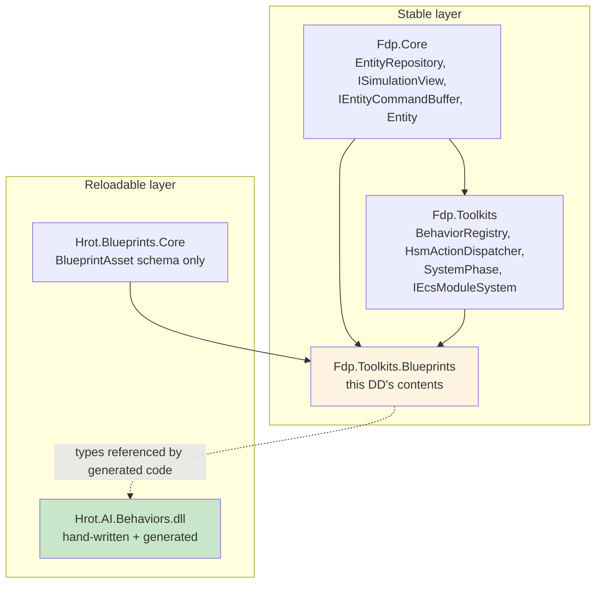

# Blueprint Subsystem — Runtime Detailed Design

> **Status:** Detailed design, derived from `Blueprint_Subsystem_Architecture_v1.2.md` + Final Resolutions + Inline Patches + Implementation Roadmap v1.1 + Compiler DD + Compiler DD Inline Patches. All Runtime DD inline patches integrated.
> **Audience:** Implementation agent and human reviewer.
> **Drives:** Milestones M8 (BlueprintRegistry), M9 (Blackboard tiers + partition allocator), M10 (BlueprintTickSystem + BlueprintMaintenanceSystem).
> **Doesn't cover:** Compiler (separate DD), test harness (Test Harness DD), debug protocol (Debug Protocol DD), editor (Editor DD), hot-reload coordinator (Hot Reload DD).
> **Companion code lives in:** `FDP/Toolkits/Fdp.Toolkits/Blueprints/` (per Roadmap §2).

---

## Table of Contents

1. Architecture of the runtime layer
2. `BlueprintRegistry` — definition store and lookup
3. `BlueprintDefinition` and delegate signatures
4. `BlueprintBlackboard*` components — layout
5. Partition allocator — algorithm and API
6. `BlueprintTickSystem` — Simulation-phase ticking
7. `BlueprintMaintenanceSystem` — tier upgrade
8. World-singleton dispatch
9. Reload reconciliation (per-slot soft / hard)
10. Hot path discipline — zero-allocation guarantees
11. Runtime test strategy
12. Open questions for implementation

---

## 1. Architecture of the runtime layer

### 1.1 What this layer owns

The runtime layer is the engine-side machinery that makes generated Blueprint code execute correctly inside the Hrot/FDP simulation. It is *not* the generated code itself — that lives in `Hrot.AI.Behaviors.dll`. The runtime layer is the stable infrastructure that the generated code plugs into.

Specifically, the runtime owns:

- **`BlueprintRegistry`** — the in-memory store of compiled `BlueprintDefinition`s, populated by `[BlueprintRegistrar]` classes during hot reload, queried by tick systems.
- **`BlueprintBlackboard{1024,4096,16384}` components** — the three storage tiers for Instance-dispatch state.
- **`BlueprintBlackboardPartitions`** — the partition allocator that slices a tier component into per-Blueprint slots.
- **`BlueprintTickSystem`** — the Simulation-phase system that ticks all Instance Blueprints across all entities, with per-slot reload reconciliation.
- **`BlueprintMaintenanceSystem`** — the BeforeSync-phase system that performs tier upgrades.
- **The `[BlueprintRegistrar]` attribute** — marker that the hot-reload coordinator scans for.
- **The `IBlueprintProbeSink` runtime interface** — the receiving end of `DebugProbe.NodeEnter` calls (specified in Debug Protocol DD; mentioned here for completeness).

### 1.2 What this layer does NOT own

- **AiPrimitive ticking.** AiPrimitives are invoked exclusively by `BTreeTickSystem` and `HsmTickSystem<T>` through registered thunks, never by `BlueprintTickSystem`. The runtime layer registers AiPrimitives into `BehaviorRegistry` and `HsmActionDispatcher` via `[BlueprintRegistrar].Register`, but does not tick them.
- **AiPrimitive working state allocation.** Generated thunks project directly over `Blackboard1024` inline (per Compiler DD §10.4); the runtime does not provide a helper class for this.
- **Hot reload coordination.** The hot-reload coordinator is a separate (engine-modified) component; the runtime exposes `BlueprintRegistry.BeginStaging/CommitStaging` for it to call.
- **Compilation.** The runtime knows nothing about `.bp.json` or the compiler pipeline; it consumes the artifacts (registrars in the loaded DLL).
- **Editor concerns.** The runtime is invisible to the editor's StructEdit code paths.

### 1.3 Module layout

```
FDP/Toolkits/Fdp.Toolkits/Blueprints/
├── BlueprintRegistry.cs                   # the registry concrete class
├── BlueprintDefinition.cs                  # the definition record + delegate types
├── BlueprintRegistrarAttribute.cs          # [BlueprintRegistrar]
├── BlueprintLatentCursor.cs                # 16-byte cursor struct
├── Components/
│   ├── BlueprintBlackboard1024.cs
│   ├── BlueprintBlackboard4096.cs
│   └── BlueprintBlackboard16384.cs
├── Partitioning/
│   ├── BlueprintBlackboardHeader.cs        # 32-byte header struct
│   ├── BlueprintSlotEntry.cs               # 16-byte slot table entry
│   └── BlueprintBlackboardPartitions.cs    # allocator static helpers
├── Systems/
│   ├── BlueprintTickSystem.cs              # Simulation phase
│   └── BlueprintMaintenanceSystem.cs       # BeforeSync phase
├── Catalogs/
│   ├── EngineEventCatalog.cs               # hand-curated Slice 1 entries
│   ├── ChannelCommandCatalog.cs            # hand-curated Slice 1 entries
│   ├── WaitPrimitiveCatalog.cs             # hand-curated Slice 1 entries
│   └── CatalogInterfaces.cs                # IEngineEventCatalog etc.
└── Attributes/
    ├── BlueprintExposedEventAttribute.cs   # for Slice 2 attribute-driven catalog
    └── BlueprintExposedChannelCommandAttribute.cs
```

### 1.4 Dependency picture



The runtime layer is stable (never reloaded). Generated code in `Hrot.AI.Behaviors.dll` references types from the runtime layer; the runtime layer's `BlueprintRegistry` holds references to delegates from the reloadable layer. The hot-reload protocol clears those references between reload cycles.

### 1.5 Initialization sequence

At engine boot:

1. `Fdp.Toolkits.Blueprints` assembly loads.
2. Static catalog instances (`EngineEventCatalog.Instance`, etc.) construct themselves with their hand-curated entries.
3. `BlueprintBlackboard{1024,4096,16384}` ComponentIds are registered with `GlobalComponentIds` (this happens at engine boot via the standard component-registration mechanism).
4. The host application constructs a `BlueprintRegistry` singleton.
5. `BlueprintTickSystem` and `BlueprintMaintenanceSystem` are constructed with a reference to the registry.
6. The `AiHotReloadCoordinator` (engine-side, modified per v1.2 §8) is constructed with a reference to the registry plus existing references to `BehaviorRegistry` and `HsmActionDispatcher`.
7. First load of `Hrot.AI.Behaviors.dll`: coordinator scans for `[BlueprintRegistrar]`-attributed classes, invokes their `Register` method on the main thread during `DrainPendingCallbacks`.
8. `BlueprintRegistry` is populated. Tick systems can now run.

---

## 2. `BlueprintRegistry` — definition store and lookup

### 2.1 Purpose

`BlueprintRegistry` is the runtime's authoritative directory of compiled Blueprints. It is:

- **Populated** by `[BlueprintRegistrar].Register` methods during hot reload.
- **Queried** by `BlueprintTickSystem` per-tick to look up `BlueprintDefinition` by `BlueprintId`.
- **Atomically swapped** between hot reloads via a staging+commit protocol so partial state is never visible to ticking.

### 2.2 Public API

```csharp
namespace Fdp.Toolkit.Blueprints;

public sealed class BlueprintRegistry
{
    // Registration — called by generated [BlueprintRegistrar] classes
    public void RegisterLibrary(int blueprintId, string name);
    public void RegisterAiPrimitive(int blueprintId, BlueprintDefinition def);
    public void RegisterInstance(int blueprintId, BlueprintDefinition def);

    // Lookup — called by tick systems
    public bool TryGetById(int blueprintId, out BlueprintDefinition def);
    public bool TryGetByName(string name, out BlueprintDefinition def);
    public IEnumerable<(int Id, BlueprintDefinition Def)> GetAll();

    // World singletons
    public void RegisterWorldSingleton(int blueprintId, BlackboardTier tier);
    public bool TryGetWorldSingleton(int blueprintId, out BlackboardTier tier);
    public IReadOnlyList<(int Id, BlackboardTier Tier)> GetAllWorldSingletons();   // pre-materialized, zero per-call alloc

    // Hot reload protocol — called by AiHotReloadCoordinator on main thread
    public BlueprintRegistryStaging BeginStaging();
    public void CommitStaging(BlueprintRegistryStaging staging);
}
```

### 2.3 Concrete implementation

```csharp
public sealed class BlueprintRegistry
{
    // Backing storage — immutable per snapshot
    private sealed class Snapshot
    {
        public Dictionary<int, BlueprintDefinition> ById { get; init; }
            = new Dictionary<int, BlueprintDefinition>();
        public Dictionary<string, int> ByName { get; init; }
            = new Dictionary<string, int>(StringComparer.Ordinal);
        public Dictionary<int, BlackboardTier> WorldSingletons { get; init; }
            = new Dictionary<int, BlackboardTier>();

        // Pre-materialized for zero per-call allocation in the hot path.
        // Built once at CommitStaging time.
        public IReadOnlyList<(int BlueprintId, BlackboardTier Tier)> WorldSingletonList { get; init; }
            = Array.Empty<(int, BlackboardTier)>();
    }

    private Snapshot _current = new();

    // Reads — lock-free; the field is replaced atomically by CommitStaging
    public bool TryGetById(int blueprintId, out BlueprintDefinition def)
    {
        var snapshot = _current;  // single read of reference
        return snapshot.ById.TryGetValue(blueprintId, out def!);
    }

    public bool TryGetByName(string name, out BlueprintDefinition def)
    {
        var snapshot = _current;
        if (!snapshot.ByName.TryGetValue(name, out var id))
        {
            def = default!;
            return false;
        }
        return snapshot.ById.TryGetValue(id, out def!);
    }

    public IEnumerable<(int Id, BlueprintDefinition Def)> GetAll()
    {
        var snapshot = _current;
        // Materialize so the caller can iterate safely even mid-reload
        return snapshot.ById.Select(kv => (kv.Key, kv.Value)).ToList();
    }

    public bool TryGetWorldSingleton(int blueprintId, out BlackboardTier tier)
    {
        var snapshot = _current;
        return snapshot.WorldSingletons.TryGetValue(blueprintId, out tier);
    }

    public IReadOnlyList<(int Id, BlackboardTier Tier)> GetAllWorldSingletons()
    {
        return _current.WorldSingletonList;  // single field read, no allocation
    }

    // Direct registration — used during cold boot and by staging buffer
    // (Called only during hot-reload commit, never concurrently with ticking.)
    public void RegisterLibrary(int blueprintId, string name)
    {
        var def = new BlueprintDefinition
        {
            Name = name,
            Kind = BlueprintDispatchKind.Library,
            StructureHash = 0,
            StateSize = 0,
        };
        RegisterDirect(blueprintId, def);
    }

    public void RegisterAiPrimitive(int blueprintId, BlueprintDefinition def)
    {
        if (def.Kind != BlueprintDispatchKind.AiPrimitive)
            throw new ArgumentException(
                $"RegisterAiPrimitive called with definition of kind {def.Kind}");
        RegisterDirect(blueprintId, def);
    }

    public void RegisterInstance(int blueprintId, BlueprintDefinition def)
    {
        if (def.Kind != BlueprintDispatchKind.Instance)
            throw new ArgumentException(
                $"RegisterInstance called with definition of kind {def.Kind}");
        RegisterDirect(blueprintId, def);
    }

    public void RegisterWorldSingleton(int blueprintId, BlackboardTier tier)
    {
        if (!_current.ById.ContainsKey(blueprintId))
            throw new InvalidOperationException(
                $"RegisterWorldSingleton({blueprintId:X8}): no Blueprint registered with that id.");
        _current.WorldSingletons[blueprintId] = tier;
    }

    private void RegisterDirect(int blueprintId, BlueprintDefinition def)
    {
        if (_current.ById.TryGetValue(blueprintId, out var existing))
            throw new InvalidOperationException(
                $"BlueprintId 0x{blueprintId:X8} collision: '{def.Name}' " +
                $"would replace '{existing.Name}'. Regenerate one asset's Guid.");
        _current.ById[blueprintId] = def;
        _current.ByName[def.Name] = blueprintId;
    }

    // Staging protocol — populated off-snapshot, then atomically swapped
    public BlueprintRegistryStaging BeginStaging() => new BlueprintRegistryStaging();

    public void CommitStaging(BlueprintRegistryStaging staging)
    {
        // Pre-materialize the world-singleton list for zero-alloc hot-path enumeration.
        var singletonList = staging.WorldSingletons
            .Select(kv => (kv.Key, kv.Value))
            .ToList()
            .AsReadOnly();

        // Build a new snapshot from the staging buffer
        var next = new Snapshot
        {
            ById = staging.Definitions.ToDictionary(kv => kv.Key, kv => kv.Value),
            ByName = staging.Definitions.ToDictionary(
                kv => kv.Value.Name, kv => kv.Key, StringComparer.Ordinal),
            WorldSingletons = staging.WorldSingletons.ToDictionary(kv => kv.Key, kv => kv.Value),
            WorldSingletonList = singletonList,
        };

        // Atomic publish -- readers see either the previous snapshot or the new one,
        // never a partial state.
        Interlocked.Exchange(ref _current, next);

        OnRegistryChanged?.Invoke();
    }

    public event Action? OnRegistryChanged;
}

public sealed class BlueprintRegistryStaging
{
    public Dictionary<int, BlueprintDefinition> Definitions { get; }
        = new Dictionary<int, BlueprintDefinition>();
    public Dictionary<int, BlackboardTier> WorldSingletons { get; }
        = new Dictionary<int, BlackboardTier>();

    public void Add(int blueprintId, BlueprintDefinition def)
    {
        if (Definitions.ContainsKey(blueprintId))
            throw new InvalidOperationException(
                $"BlueprintId 0x{blueprintId:X8} collision during staging.");
        Definitions[blueprintId] = def;
    }

    public void AddWorldSingleton(int blueprintId, BlackboardTier tier)
        => WorldSingletons[blueprintId] = tier;
}
```

### 2.4 Threading model

| Phase | Reader access | Writer access |
|---|---|---|
| Normal frame | Tick systems read `_current` lock-free | None |
| Hot reload commit (main thread) | Tick systems not running (engine guarantees) | `CommitStaging` does `Interlocked.Exchange` |

The `Interlocked.Exchange` is technically redundant because the engine guarantees `CommitStaging` runs while no tick system is executing (per the hot-reload coordinator's `DrainPendingCallbacks` design). But it's free, documents intent, and protects against future engine refactors that might run cleanup on background threads.

Field reads of `_current` are atomic for reference fields in .NET, so the lock-free read pattern is correct.

### 2.5 Diagnostic events

`OnRegistryChanged` fires after every commit. Used by the editor (refresh asset list) and by the debug protocol (re-resolve any active breakpoints that target Blueprints that may have been replaced).

### 2.6 BlueprintId collision handling

Per Compiler DD §12.2 (M-5), `BlueprintId` is FNV-1a 32-bit of the asset Guid. Collisions are astronomically rare (~1 in 4 billion per pair), but the registry throws explicitly if one is detected at registration time. The author resolves by re-Guiding one of the colliding assets (an Editor DD operation).

Hot reload exposes the collision early: the staging buffer's `Add` throws before commit, the coordinator catches the exception, rolls back the patch ALC, and surfaces the error in the hot-reload log window.

---

*Continued in Part 2 — §3 `BlueprintDefinition`, §4 `BlueprintBlackboard*` components.*

## 3. `BlueprintDefinition` and delegate signatures

### 3.1 Purpose

`BlueprintDefinition` is the unit of compiled-Blueprint metadata that lives in `BlueprintRegistry`. It carries everything `BlueprintTickSystem` needs to dispatch ticks and event-handler invocations, plus everything the editor and debug protocol need for introspection.

### 3.2 Shape

```csharp
namespace Fdp.Toolkit.Blueprints;

public sealed record BlueprintDefinition
{
    // Identity and validation
    public required string Name { get; init; }
    public required BlueprintDispatchKind Kind { get; init; }
    public required ulong StructureHash { get; init; }
    public required int StateSize { get; init; }      // bytes in slot; 0 for Library or AiPrimitive

    // For Instance dispatch — null for Library/AiPrimitive
    public InitDefaultDelegate? InitDefault { get; init; }
    public TickDelegate? Tick { get; init; }
    public IReadOnlyDictionary<string, EventHandlerDelegate> EventHandlers { get; init; }
        = new Dictionary<string, EventHandlerDelegate>(StringComparer.Ordinal);

    // For inspector / debugger
    public Type? StateClrType { get; init; }
    public IReadOnlyList<BlueprintFieldDescriptor> StateFields { get; init; }
        = Array.Empty<BlueprintFieldDescriptor>();
}

public sealed record BlueprintFieldDescriptor(
    string Name,
    Type ClrType,
    int OffsetBytes,
    int SizeBytes,
    string CategoryOrEmpty);
```

### 3.3 Delegate signatures

Three delegate types in `BlueprintRegistry`'s public surface. All take `Span<byte>` for state access and the real `Fdp.Core` types directly per the engine-direct interface model.

```csharp
public delegate void InitDefaultDelegate(Span<byte> stateBytes);

public delegate void TickDelegate(
    Span<byte> stateBytes,
    ISimulationView view,
    IEntityCommandBuffer ecb,
    Entity self,
    float time,
    float deltaTime,
    uint instanceVersion);                              // per Compiler DD Patch Q-18.1

public delegate void EventHandlerDelegate(
    Span<byte> stateBytes,
    ISimulationView view,
    IEntityCommandBuffer ecb,
    Entity self,
    float time,
    float deltaTime,                                    // per Compiler DD Patch Q-18.3
    ReadOnlySpan<byte> payload);
```

### 3.4 The `Span<byte>` + state projection contract

The compiler-emitted `TickThunk` (per Compiler DD §10.5) is:

```csharp
private static void TickThunk(
    Span<byte> bytes, ISimulationView view, IEntityCommandBuffer ecb,
    Entity self, float time, float deltaTime, uint instanceVersion)
{
    ref var s = ref Unsafe.As<byte, State>(ref MemoryMarshal.GetReference(bytes));
    Tick(ref s, view, ecb, self, time, deltaTime, instanceVersion);
}
```

This is the contract between the runtime and generated code:

- The runtime provides `Span<byte>` pointing into the slot's payload.
- The generated thunk projects via `Unsafe.As<byte, State>` to a `ref State`.
- All subsequent state access in the generated code uses the typed `ref` — zero allocation, zero indirection.

The `Span<byte>` length is exactly `def.StateSize`. The runtime guarantees this via the slot-table entry's `PayloadSize` field.

### 3.5 `EventHandlerDelegate.payload` shape

Event handlers receive a `ReadOnlySpan<byte>` carrying the engine event's serialized fields, in the order declared by the catalog entry. The generated event-handler thunk projects this span to the correct struct type:

```csharp
// Generated, in HealthRegen_Bp:
private static void OnHitThunk(
    Span<byte> bytes, ISimulationView view, IEntityCommandBuffer ecb,
    Entity self, float time, float deltaTime, ReadOnlySpan<byte> payload)
{
    ref var s = ref Unsafe.As<byte, State>(ref MemoryMarshal.GetReference(bytes));
    ref readonly var evt = ref Unsafe.As<byte, HitEvent>(
        ref MemoryMarshal.GetReference(payload));
    Event_OnHit(ref s, view, ecb, self, time, deltaTime,
        evt.Attacker, evt.Damage, evt.Direction);
}
```

**Note:** In Slice 1 the runtime does not invoke event handlers directly via this delegate. Engine events are *polled* inline in the generated `Tick` (per Compiler DD §10.5), not dispatched. The `EventHandlerDelegate` exists in the type system for:

1. Custom-event raise from inside the same Instance (the `IrOp_RaiseCustomEvent` lowering, which is a direct C# call — bypasses the delegate).
2. Slice 2: cross-entity event dispatch via deferred events.
3. Debug protocol: the editor can invoke an event handler programmatically (e.g., "trigger OnHit now" button).

For Slice 1 the `EventHandlers` dictionary is populated but only the editor/debug path reads it.

### 3.6 Lifecycle of delegates across hot reload

`TickDelegate` and `EventHandlerDelegate` are managed delegates — they point into method handles in the currently-loaded `Hrot.AI.Behaviors.dll` ALC. When that ALC is unloaded after hot reload, those method handles become invalid.

The hot-reload protocol ensures `BlueprintRegistry.CommitStaging` runs **before** the old ALC is unloaded, swapping all delegates atomically. The old ALC's `Unload()` is called only after the registry is fully repopulated with delegates from the new ALC. Tick systems running after `CommitStaging` see only the new delegates.

This is the same lifecycle pattern the engine already uses for `BTreeAction` delegates registered into `BehaviorRegistry`.

### 3.7 What `InitDefault` is for

When a slot is allocated for an Instance Blueprint (`BlueprintBlackboardPartitions.TryAttach`), the partition allocator zeros the slot's memory and writes the header. Then it calls `def.InitDefault(slotBytes)` to apply any non-zero default values declared in the asset's variables.

Generated `InitDefault`:

```csharp
public static void InitDefault(Span<byte> stateBytes)
{
    ref var s = ref Unsafe.As<byte, State>(ref MemoryMarshal.GetReference(stateBytes));
    s = default;                  // zero-init via struct default
    s.MaxHealth = 100;            // non-zero defaults from asset
    s.RegenRate = 10.0f;
}
```

For variables with default value of `0` / `false` / `default(T)`, no per-field assignment is emitted (the `s = default` covers them).

For Library and AiPrimitive dispatch, `InitDefault` is null (no state to initialize at allocation time).

### 3.8 Why `record` and not `class`

`BlueprintDefinition` is a `sealed record` so:

- It has structural equality semantics for free (useful for tests).
- It is immutable (no setters; `init` only). The registry never mutates an existing definition — it replaces the whole snapshot.
- It can be safely shared between threads as a read-only value.

---

## 4. `BlueprintBlackboard*` components — layout

### 4.1 Three tiers

Per v1.2 §6.2, three component types for Instance-dispatch state, sized 1024 / 4096 / 16384 bytes. Each is an unmanaged struct with a fixed-byte payload. Each has a unique `ComponentId` in `GlobalComponentIds` (engine-side change, three IDs reserved).

The total size is the entire component, including header, slot table, and payload. Layout invariant:

```
[ Header (32 bytes) ][ Slot table (MaxSlots × 16 bytes) ][ Payload (rest) ]
```

| Tier | Total | Header | Slot table | Payload | MaxSlots |
|---|---|---|---|---|---|
| 1024 | 1024 | 32 | 64 | 928 | 4 |
| 4096 | 4096 | 32 | 128 | 3936 | 8 |
| 16384 | 16384 | 32 | 256 | 16096 | 16 |

### 4.2 Tier component definitions

```csharp
namespace Fdp.Toolkit.Blueprints;

[StructLayout(LayoutKind.Sequential)]
[ComponentId(GlobalComponentIds.BlueprintBlackboard1024)]
public unsafe struct BlueprintBlackboard1024
{
    public const int TotalSize     = 1024;
    public const int HeaderSize    = 32;
    public const int MaxSlots      = 4;
    public const int SlotTableSize = MaxSlots * BlueprintBlackboardPartitions.SlotEntrySize; // 64
    public const int PayloadStart  = HeaderSize + SlotTableSize;                              // 96
    public const int PayloadSize   = TotalSize - PayloadStart;                                // 928

    public fixed byte Memory[TotalSize];
}

[StructLayout(LayoutKind.Sequential)]
[ComponentId(GlobalComponentIds.BlueprintBlackboard4096)]
public unsafe struct BlueprintBlackboard4096
{
    public const int TotalSize     = 4096;
    public const int HeaderSize    = 32;
    public const int MaxSlots      = 8;
    public const int SlotTableSize = MaxSlots * BlueprintBlackboardPartitions.SlotEntrySize; // 128
    public const int PayloadStart  = HeaderSize + SlotTableSize;                              // 160
    public const int PayloadSize   = TotalSize - PayloadStart;                                // 3936

    public fixed byte Memory[TotalSize];
}

[StructLayout(LayoutKind.Sequential)]
[ComponentId(GlobalComponentIds.BlueprintBlackboard16384)]
public unsafe struct BlueprintBlackboard16384
{
    public const int TotalSize     = 16384;
    public const int HeaderSize    = 32;
    public const int MaxSlots      = 16;
    public const int SlotTableSize = MaxSlots * BlueprintBlackboardPartitions.SlotEntrySize; // 256
    public const int PayloadStart  = HeaderSize + SlotTableSize;                              // 288
    public const int PayloadSize   = TotalSize - PayloadStart;                                // 16096

    public fixed byte Memory[TotalSize];
}
```

The `Memory` field is a single fixed-byte buffer covering the entire component. All access is via `BlueprintBlackboardPartitions` helpers, never directly by field offset.

### 4.3 `BlueprintBlackboardHeader` — 32 bytes

Lives at offset 0..31 of every tier component:

```csharp
[StructLayout(LayoutKind.Sequential, Size = 32)]
public struct BlueprintBlackboardHeader
{
    public uint   MagicAndVersion;     // 0x42504257 = 'BPBW' + version byte in high byte
    public byte   SlotCount;            // number of slots currently allocated (≤ MaxSlots)
    public byte   MaxSlots;             // capacity (constant per tier)
    public ushort FreeListHead;         // payload offset of first free block (0 = no free list, payload contiguous)
    public ushort PayloadStart;         // constant per tier; redundant with TierConstants but explicit
    public ushort PayloadSize;          // constant per tier
    public ushort PayloadFree;          // bytes currently free
    public ushort PayloadHighWater;     // highest allocated payload offset (for stats / Slice 2 defrag)
    public ulong  Reserved;             // padding to 32 bytes; for future use
}
```

Field roles:

- **`MagicAndVersion`**: detect uninitialized components (`0x00000000` = needs Initialize) vs corrupted (any other unexpected value).
- **`SlotCount`** / **`MaxSlots`**: bounds for slot-table iteration.
- **`FreeListHead`**: offset (relative to component start) of the first free block in the payload's free list. Zero means no free list yet (allocator is bumping pointer from `PayloadHighWater`).
- **`PayloadFree`** / **`PayloadHighWater`**: bookkeeping for allocator decisions (use free list vs bump-allocate).

### 4.4 `BlueprintSlotEntry` — 16 bytes

The slot table lives at offset 32..(32 + SlotTableSize) of each tier component:

```csharp
[StructLayout(LayoutKind.Sequential, Size = 16)]
public struct BlueprintSlotEntry
{
    public int    BlueprintId;          // 0 = unused slot; otherwise the Blueprint occupying this slot
    public uint   InstanceVersion;      // bumped on hard-reload; threads through BlueprintLatentCursor
    public ushort PayloadOffset;        // byte offset (relative to component start) of payload bytes
    public ushort PayloadSize;          // length of payload in bytes
    public ulong  StructureHash;        // structure hash of the Blueprint that owns this slot
}
```

For tier 1024: 4 entries × 16 bytes = 64 bytes total. For tier 4096: 8 entries × 16 = 128. For 16384: 16 × 16 = 256.

A slot with `BlueprintId == 0` is unallocated. The allocator scans the slot table linearly to find an empty entry on attach.

### 4.5 Free-block header in payload (4 bytes, in-line)

When a slot is deallocated, its payload bytes become a free block. The first 4 bytes of every free block carry:

```csharp
[StructLayout(LayoutKind.Sequential, Size = 4)]
public struct BlueprintFreeBlockHeader
{
    public ushort NextFreeOffset;       // offset (relative to component start) of next free block, or 0 = end
    public ushort Size;                  // size of this free block in bytes (includes the 4-byte header)
}
```

The allocator threads free blocks into a singly-linked list, sorted by ascending offset (so coalescing is efficient).

### 4.6 Layout invariants

A valid `BlueprintBlackboard*` component satisfies:

1. **Header magic**: `Memory[0..3] == 0x42504257`.
2. **SlotCount bound**: `header.SlotCount ≤ header.MaxSlots`.
3. **Slot table contiguous**: every slot at index `0 ≤ i < MaxSlots` exists. Unused slots have `BlueprintId == 0`.
4. **Allocated slots within payload**: for every slot with `BlueprintId != 0`: `PayloadStart ≤ slot.PayloadOffset < slot.PayloadOffset + slot.PayloadSize ≤ TotalSize`.
5. **No overlap between slots**: for any two allocated slots `a`, `b`: their `[PayloadOffset, PayloadOffset+PayloadSize)` ranges do not intersect.
6. **Free list well-formed**: `FreeListHead == 0` OR the linked list starting at `FreeListHead` has no cycles and every block is within payload bounds.
7. **PayloadFree accuracy**: `PayloadFree == sum-of-free-block-sizes + (TotalSize - PayloadHighWater)`.

The allocator maintains these invariants; the runtime never inspects them directly, but tests assert them after each operation.

### 4.7 Alignment

The allocator aligns every slot's `PayloadOffset` to 8 bytes. Generated state structs are `[StructLayout(LayoutKind.Sequential)]` which guarantees natural alignment for their fields, so an 8-byte slot alignment is sufficient for any field type the compiler emits.

The slot table itself starts at offset 32 (header end) — already 8-aligned.

### 4.8 Why fixed-byte buffer (no managed pointers inside)

The blackboard components must be:

- **Network-replicable** (Slice 2 may want this, even though Slice 1 says brain-role-only).
- **Replay-recordable** verbatim — `PlaybackSystem` saves and replays component bytes.
- **Zero-allocation in the hot path** — chunks are flat arrays; reading a component means a `ref` into chunk memory with no GC interaction.

A managed pointer or reference type inside the component would break all three. The fixed-byte design keeps every Instance Blueprint's full state inside the ECS chunk memory.

The cost: state types must be `unmanaged` (no `Entity` is allowed unless `Entity` itself is unmanaged — which it is in FDP, it's `(int Index, int Generation)` packed). No strings, no managed handles. This is the same constraint the engine puts on all its components.

---

*Continued in Part 3 — §5 Partition allocator.*

## 5. Partition allocator — algorithm and API

### 5.1 Design goals

The partition allocator slices a `BlueprintBlackboard*` component into per-Blueprint slots. Each Instance Blueprint attached to an entity occupies one slot; multiple Blueprints can share the same tier component on the same entity.

Requirements:

- **Zero-allocation operations** — every method works on a `byte*` pointer; no managed allocations, no LINQ, no boxing.
- **Deterministic layout** — given the same sequence of attach/detach operations from a known-initial state, the resulting layout is byte-identical. Needed for replay-safety.
- **Per-slot reload reconciliation** — must be able to identify each slot's Blueprint by `BlueprintId` for hot-reload hash-comparison.
- **Reasonable fragmentation tolerance** — first-fit with coalescing is sufficient for Slice 1 workloads. Slice 2 may add defragmentation if needed.

### 5.2 Public API

```csharp
namespace Fdp.Toolkit.Blueprints;

public static unsafe class BlueprintBlackboardPartitions
{
    public const int SlotEntrySize       = 16;            // sizeof(BlueprintSlotEntry)
    public const int FreeBlockHeaderSize = 4;             // sizeof(BlueprintFreeBlockHeader)
    public const int Alignment           = 8;             // payload offsets aligned to 8 bytes

    /// <summary>
    /// Initializes a freshly-zeroed component to be ready for slot allocation.
    /// Called once per entity attachment, typically during initialization.
    /// Idempotent if header magic already matches; otherwise overwrites.
    /// </summary>
    public static void Initialize(byte* memory, int totalSize, byte maxSlots);

    /// <summary>
    /// Linear scan of the slot table to find the slot occupied by the given
    /// BlueprintId. Returns true with payloadOffset set if found.
    /// Hot-path: called on every tick for every (entity, Blueprint) pair.
    /// Designed to JIT-inline; ≤ MaxSlots iterations.
    /// </summary>
    public static bool TryGetSlotOffset(byte* memory, int blueprintId, out int payloadOffset);

    /// <summary>
    /// Finds an empty slot, allocates payload bytes via free-list-first/bump-fallback,
    /// writes slot table entry, writes payload header. Returns false if no slot
    /// available or no payload space.
    /// </summary>
    public static bool TryAttach(
        byte* memory,
        int blueprintId,
        int requestedSize,
        ulong structureHash,
        out int payloadOffset);

    /// <summary>
    /// Marks the slot empty, returns its payload bytes to the free list,
    /// attempts to coalesce with adjacent free blocks. Returns true if a
    /// slot was found and freed.
    /// </summary>
    public static bool TryDetach(byte* memory, int blueprintId);

    /// <summary>Number of currently-allocated slots. Equals header.SlotCount.</summary>
    public static int GetSlotCount(byte* memory);

    /// <summary>Ref to a specific slot entry; for tick iteration and reconciliation.</summary>
    public static ref BlueprintSlotEntry GetSlot(byte* memory, int slotIndex);

    /// <summary>
    /// Zeros the slot's payload bytes (used during hard reload). Does not free
    /// the slot; payload offset/size remain intact, BlueprintId remains, hash
    /// is updated, InstanceVersion is bumped.
    /// </summary>
    public static void ResetSlot(byte* memory, int slotIndex, ulong newStructureHash);

    /// <summary>
    /// Copies header + slot table + payload from a smaller tier component to
    /// a larger one. Used by BlueprintMaintenanceSystem during tier upgrade.
    /// Caller has already added the new tier component and will remove the old.
    /// </summary>
    public static void CopyToLargerTier(
        byte* src, int srcSize,
        byte* dst, int dstSize, byte dstMaxSlots);
}
```

### 5.3 `Initialize`

```csharp
public static void Initialize(byte* memory, int totalSize, byte maxSlots)
{
    ref var header = ref Unsafe.AsRef<BlueprintBlackboardHeader>(memory);

    // Idempotent: if already initialized with our magic, do nothing
    if (header.MagicAndVersion == HeaderMagicV1)
        return;

    // Zero the entire component first (defensive — caller may have given us
    // garbage memory)
    Unsafe.InitBlock(memory, 0, (uint)totalSize);

    int slotTableSize = maxSlots * SlotEntrySize;
    int payloadStart  = sizeof(BlueprintBlackboardHeader) + slotTableSize;
    int payloadSize   = totalSize - payloadStart;

    header.MagicAndVersion  = HeaderMagicV1;
    header.SlotCount        = 0;
    header.MaxSlots         = maxSlots;
    header.FreeListHead     = 0;                              // no free list yet
    header.PayloadStart     = (ushort)payloadStart;
    header.PayloadSize      = (ushort)payloadSize;
    header.PayloadFree      = (ushort)payloadSize;
    header.PayloadHighWater = (ushort)payloadStart;            // bump-allocate from here
}

private const uint HeaderMagicV1 = 0x42504257;  // 'WBPB' little-endian = "BPBW"
```

### 5.4 `TryGetSlotOffset` (hot path)

The single hottest operation in the runtime — called for every (entity, Blueprint) pair on every tick. Optimized for cache locality and JIT inlining.

```csharp
public static bool TryGetSlotOffset(byte* memory, int blueprintId, out int payloadOffset)
{
    ref var header = ref Unsafe.AsRef<BlueprintBlackboardHeader>(memory);
    int slotCount = header.SlotCount;
    byte* slotTable = memory + sizeof(BlueprintBlackboardHeader);

    // Linear scan — ≤ 16 entries, all in one or two cache lines
    for (int i = 0; i < slotCount; i++)
    {
        ref var slot = ref Unsafe.AsRef<BlueprintSlotEntry>(slotTable + i * SlotEntrySize);
        if (slot.BlueprintId == blueprintId)
        {
            payloadOffset = slot.PayloadOffset;
            return true;
        }
    }
    payloadOffset = 0;
    return false;
}
```

`slotCount` here is `header.SlotCount`, **not** `header.MaxSlots`. The runtime maintains the slot table densely (no gaps between allocated slots) so the scan terminates at the first unused index.

Notes:
- The `ref` over the slot entry avoids copying the 16-byte struct.
- The function is small enough that the JIT should inline it into the tick loop.
- No bounds-check elimination needed because `slotCount ≤ MaxSlots ≤ 16`, all within payload.

### 5.5 `TryAttach`

```csharp
public static bool TryAttach(
    byte* memory,
    int blueprintId,
    int requestedSize,
    ulong structureHash,
    out int payloadOffset)
{
    ref var header = ref Unsafe.AsRef<BlueprintBlackboardHeader>(memory);
    byte* slotTable = memory + sizeof(BlueprintBlackboardHeader);

    // Bound check: any free slot in table?
    if (header.SlotCount >= header.MaxSlots)
    {
        payloadOffset = 0;
        return false;
    }

    // Round requested size to alignment
    int alignedSize = AlignUp(requestedSize, Alignment);

    // Bound check: any room in payload?
    if (alignedSize > header.PayloadFree)
    {
        payloadOffset = 0;
        return false;
    }

    // Try free list first; fall back to bump allocation
    int allocatedOffset = TryAllocateFromFreeList(memory, ref header, alignedSize);
    if (allocatedOffset == 0)
        allocatedOffset = BumpAllocate(memory, ref header, alignedSize);

    if (allocatedOffset == 0)
    {
        // Fragmented — there's free space but no contiguous block of requested size
        payloadOffset = 0;
        return false;
    }

    // Find unused slot — densely-packed table guarantees it's at index SlotCount
    int slotIndex = header.SlotCount;
    ref var slot = ref Unsafe.AsRef<BlueprintSlotEntry>(slotTable + slotIndex * SlotEntrySize);
    slot.BlueprintId     = blueprintId;
    slot.InstanceVersion = 1;                              // start at 1; 0 reserved for "never used"
    slot.PayloadOffset   = (ushort)allocatedOffset;
    slot.PayloadSize     = (ushort)alignedSize;
    slot.StructureHash   = structureHash;

    header.SlotCount++;
    header.PayloadFree = (ushort)(header.PayloadFree - alignedSize);

    payloadOffset = allocatedOffset;
    return true;
}
```

#### `TryAllocateFromFreeList` (first-fit with split)

```csharp
private static int TryAllocateFromFreeList(byte* memory, ref BlueprintBlackboardHeader header, int alignedSize)
{
    ushort prev = 0;                                       // 0 = list head pointer is in header
    ushort current = header.FreeListHead;

    while (current != 0)
    {
        ref var block = ref Unsafe.AsRef<BlueprintFreeBlockHeader>(memory + current);
        if (block.Size >= alignedSize + FreeBlockHeaderSize)
        {
            // Split: keep tail as smaller free block
            int remaining = block.Size - alignedSize;
            int allocOffset = current;
            int newFreeOffset = current + alignedSize;

            if (prev == 0) header.FreeListHead = (ushort)newFreeOffset;
            else
            {
                ref var prevBlock = ref Unsafe.AsRef<BlueprintFreeBlockHeader>(memory + prev);
                prevBlock.NextFreeOffset = (ushort)newFreeOffset;
            }

            ref var newFreeBlock = ref Unsafe.AsRef<BlueprintFreeBlockHeader>(memory + newFreeOffset);
            newFreeBlock.NextFreeOffset = block.NextFreeOffset;
            newFreeBlock.Size           = (ushort)remaining;

            return allocOffset;
        }
        else if (block.Size == alignedSize)
        {
            // Exact fit: unlink this block
            int allocOffset = current;
            if (prev == 0) header.FreeListHead = block.NextFreeOffset;
            else
            {
                ref var prevBlock = ref Unsafe.AsRef<BlueprintFreeBlockHeader>(memory + prev);
                prevBlock.NextFreeOffset = block.NextFreeOffset;
            }
            return allocOffset;
        }

        prev = current;
        current = block.NextFreeOffset;
    }
    return 0;                                              // no fitting block
}
```

The "split" case keeps the tail as a free block. The "exact fit" case unlinks the block entirely. If a fitting block is found but is smaller than `alignedSize + FreeBlockHeaderSize` (insufficient to hold a residual free block), we'd waste a few bytes by allocating the whole thing — but this would orphan space outside the free list. For Slice 1 we treat sub-`FreeBlockHeaderSize`-remainders as effectively the same as exact-fit (we don't generate them because `requestedSize` is always already aligned and free-block sizes are always aligned).

#### `BumpAllocate` (fallback for empty free list)

```csharp
private static int BumpAllocate(byte* memory, ref BlueprintBlackboardHeader header, int alignedSize)
{
    int payloadEnd = header.PayloadStart + header.PayloadSize;
    int available = payloadEnd - header.PayloadHighWater;
    if (available < alignedSize) return 0;

    int allocOffset = header.PayloadHighWater;
    header.PayloadHighWater = (ushort)(allocOffset + alignedSize);
    return allocOffset;
}
```

Bump allocation is the common case at startup. Free-list path takes over after the first detach.

### 5.6 `TryDetach`

```csharp
public static bool TryDetach(byte* memory, int blueprintId)
{
    ref var header = ref Unsafe.AsRef<BlueprintBlackboardHeader>(memory);
    byte* slotTable = memory + sizeof(BlueprintBlackboardHeader);

    // Find the slot
    int foundIndex = -1;
    for (int i = 0; i < header.SlotCount; i++)
    {
        ref var slot = ref Unsafe.AsRef<BlueprintSlotEntry>(slotTable + i * SlotEntrySize);
        if (slot.BlueprintId == blueprintId)
        {
            foundIndex = i;
            break;
        }
    }
    if (foundIndex < 0) return false;

    ref var foundSlot = ref Unsafe.AsRef<BlueprintSlotEntry>(slotTable + foundIndex * SlotEntrySize);
    int releasedOffset = foundSlot.PayloadOffset;
    int releasedSize   = foundSlot.PayloadSize;

    // Insert into free list (sorted by offset, with coalescing)
    ReturnToFreeList(memory, ref header, releasedOffset, releasedSize);
    header.PayloadFree = (ushort)(header.PayloadFree + releasedSize);

    // Densely compact slot table: move last entry into the freed slot
    int lastIndex = header.SlotCount - 1;
    if (foundIndex != lastIndex)
    {
        ref var lastSlot = ref Unsafe.AsRef<BlueprintSlotEntry>(slotTable + lastIndex * SlotEntrySize);
        foundSlot = lastSlot;                              // copy struct
    }
    // Clear the (now duplicated) last slot
    ref var clearedSlot = ref Unsafe.AsRef<BlueprintSlotEntry>(slotTable + lastIndex * SlotEntrySize);
    clearedSlot = default;
    header.SlotCount--;

    return true;
}
```

The dense-packing on detach is what lets `TryGetSlotOffset` iterate `0 .. SlotCount` rather than `0 .. MaxSlots` — a small win on hot path.

#### `ReturnToFreeList` (sorted insert with coalescing)

```csharp
private static void ReturnToFreeList(byte* memory, ref BlueprintBlackboardHeader header, int offset, int size)
{
    // Walk the free list to find insertion point (sorted by offset)
    ushort prev = 0;
    ushort current = header.FreeListHead;
    while (current != 0 && current < offset)
    {
        prev = current;
        ref var b = ref Unsafe.AsRef<BlueprintFreeBlockHeader>(memory + current);
        current = b.NextFreeOffset;
    }

    // Write the new block
    ref var newBlock = ref Unsafe.AsRef<BlueprintFreeBlockHeader>(memory + offset);
    newBlock.Size           = (ushort)size;
    newBlock.NextFreeOffset = current;

    // Link in
    if (prev == 0) header.FreeListHead = (ushort)offset;
    else
    {
        ref var prevBlock = ref Unsafe.AsRef<BlueprintFreeBlockHeader>(memory + prev);
        prevBlock.NextFreeOffset = (ushort)offset;
    }

    // Coalesce with successor (current)
    if (current != 0 && offset + size == current)
    {
        ref var succ = ref Unsafe.AsRef<BlueprintFreeBlockHeader>(memory + current);
        newBlock.Size           = (ushort)(newBlock.Size + succ.Size);
        newBlock.NextFreeOffset = succ.NextFreeOffset;
    }

    // Coalesce with predecessor (prev)
    if (prev != 0)
    {
        ref var pred = ref Unsafe.AsRef<BlueprintFreeBlockHeader>(memory + prev);
        if (prev + pred.Size == offset)
        {
            pred.Size           = (ushort)(pred.Size + newBlock.Size);
            pred.NextFreeOffset = newBlock.NextFreeOffset;
        }
    }
}
```

After detach + coalesce, contiguous free regions are always represented as single blocks. Worst case: free list length = number of fragmented gaps, bounded by the number of "alive" slots that punctuate them.

### 5.7 `ResetSlot` (used by reload reconciliation)

When a hot reload changes a Blueprint's structure hash, the runtime detects mismatch during tick and resets the slot in place:

```csharp
public static void ResetSlot(byte* memory, int slotIndex, ulong newStructureHash)
{
    byte* slotTable = memory + sizeof(BlueprintBlackboardHeader);
    ref var slot = ref Unsafe.AsRef<BlueprintSlotEntry>(slotTable + slotIndex * SlotEntrySize);

    // Zero the payload bytes
    Unsafe.InitBlock(memory + slot.PayloadOffset, 0, slot.PayloadSize);

    // Update hash, bump version (invalidates any in-flight latent cursors)
    slot.StructureHash    = newStructureHash;
    slot.InstanceVersion += 1;
}
```

The slot's `PayloadOffset` and `PayloadSize` stay the same — only the payload contents and metadata change. This means an Instance Blueprint that adds/removes fields *within* its previously-allocated payload size keeps its slot. A Blueprint that grows beyond its slot must detach and reattach (Slice 1: validator catches this at compile time by checking the asset's StateSize against the tier; if growth doesn't fit, the tier hint must change).

### 5.8 `CopyToLargerTier`

Used by `BlueprintMaintenanceSystem` to migrate state from a smaller tier to a larger one:

```csharp
public static void CopyToLargerTier(
    byte* src, int srcSize,
    byte* dst, int dstSize, byte dstMaxSlots)
{
    ref var srcHeader = ref Unsafe.AsRef<BlueprintBlackboardHeader>(src);
    if (srcHeader.MagicAndVersion != HeaderMagicV1)
    {
        // Source uninitialized; just initialize dest, nothing to copy
        Initialize(dst, dstSize, dstMaxSlots);
        return;
    }

    // Initialize the destination (writes correct header for the new tier)
    Initialize(dst, dstSize, dstMaxSlots);
    ref var dstHeader = ref Unsafe.AsRef<BlueprintBlackboardHeader>(dst);

    int srcSlotTableSize = srcHeader.MaxSlots * SlotEntrySize;
    int dstSlotTableSize = dstMaxSlots * SlotEntrySize;
    int payloadShift = dstSlotTableSize - srcSlotTableSize;  // dst has bigger slot table
    // payloads need to shift by this much

    // Copy slot table entries — adjusting PayloadOffset by payloadShift
    byte* srcSlots = src + sizeof(BlueprintBlackboardHeader);
    byte* dstSlots = dst + sizeof(BlueprintBlackboardHeader);
    for (int i = 0; i < srcHeader.SlotCount; i++)
    {
        ref var srcSlot = ref Unsafe.AsRef<BlueprintSlotEntry>(srcSlots + i * SlotEntrySize);
        ref var dstSlot = ref Unsafe.AsRef<BlueprintSlotEntry>(dstSlots + i * SlotEntrySize);
        dstSlot = srcSlot;
        dstSlot.PayloadOffset = (ushort)(srcSlot.PayloadOffset + payloadShift);

        // Copy payload bytes
        Unsafe.CopyBlock(
            destination: dst + dstSlot.PayloadOffset,
            source:      src + srcSlot.PayloadOffset,
            byteCount:   srcSlot.PayloadSize);
    }

    dstHeader.SlotCount        = srcHeader.SlotCount;
    dstHeader.PayloadFree      = (ushort)(dstHeader.PayloadSize - SumAllocated(srcHeader, srcSlots));
    dstHeader.PayloadHighWater = (ushort)(dstHeader.PayloadStart + (srcHeader.PayloadHighWater - srcHeader.PayloadStart));

    // Free list shift — same offset shift, but only if src had a non-empty free list
    if (srcHeader.FreeListHead != 0)
    {
        dstHeader.FreeListHead = (ushort)(srcHeader.FreeListHead + payloadShift);
        // Walk and shift NextFreeOffset pointers
        ushort cursor = dstHeader.FreeListHead;
        while (cursor != 0)
        {
            ref var block = ref Unsafe.AsRef<BlueprintFreeBlockHeader>(dst + cursor);
            // Copy free-block size from source location
            ref var srcBlock = ref Unsafe.AsRef<BlueprintFreeBlockHeader>(src + (cursor - payloadShift));
            block.Size = srcBlock.Size;
            block.NextFreeOffset = (ushort)(srcBlock.NextFreeOffset == 0
                ? 0 : srcBlock.NextFreeOffset + payloadShift);
            cursor = block.NextFreeOffset;
        }
    }
}

private static int SumAllocated(BlueprintBlackboardHeader header, byte* slots)
{
    int total = 0;
    for (int i = 0; i < header.SlotCount; i++)
    {
        ref var s = ref Unsafe.AsRef<BlueprintSlotEntry>(slots + i * SlotEntrySize);
        total += s.PayloadSize;
    }
    return total;
}
```

Tier upgrade is "rare" (per-entity, only when an attach fails for capacity reasons), so this code does not need to be allocation-free at runtime — but it is anyway, by construction. It runs on the main thread during `BeforeSync`, not during Simulation.

### 5.9 Allocation-free guarantee for the hot path

The hot-path operations (`TryGetSlotOffset` on every tick) and the warm-path operations (`TryAttach`/`TryDetach` during scenario-start or peer-call setup) are entirely pointer-based — no managed allocations.

The only `Unsafe.AsRef<T>` calls produce `ref T` views over the existing bytes; no boxing, no copy.

`Unsafe.InitBlock` and `Unsafe.CopyBlock` are intrinsics that lower to memset/memcpy at JIT time.

### 5.10 Test scenarios for the allocator

These tests live in `Hrot.Blueprints.Tests/Runtime/PartitionAllocatorTests.cs` (per Roadmap M9 acceptance):

| Test | Scenario |
|---|---|
| `Initialize_ZeroedMemory_SetsHeader` | A freshly-zeroed buffer passes through `Initialize` and emerges with correct magic, slot-count zero, payload-free equal to payload size. |
| `Attach_SingleBlueprint_AllocatesFromBump` | Empty allocator + one `TryAttach` → slot[0] populated, PayloadHighWater advanced, no free list activity. |
| `Attach_MultipleBlueprints_UsesContiguousBump` | Multiple consecutive attaches → all from bump allocator; slot table densely packed. |
| `Detach_Last_FreesSlot` | Attach 3, detach 3rd → slot count = 2, free list empty (bump pointer can simply roll back is *not* done; we use free list for simplicity). |
| `Detach_Middle_CreatesFreeBlock` | Attach 3, detach 2nd → slot table compacts (3rd moves into position 1), free list has 1 block. |
| `Detach_AdjacentFree_Coalesces` | Attach 3, detach 2nd and 3rd → free list has 1 block (coalesced), not 2. |
| `Attach_AfterDetach_ReusesFreeBlock` | Attach 3, detach 2nd, attach 4th of same size → 4th gets the freed slot's payload offset. |
| `TryGetSlotOffset_AbsentBlueprint_ReturnsFalse` | Lookup for unknown BlueprintId returns false; payload offset = 0. |
| `Attach_WhenSlotsFull_ReturnsFalse` | Attach `MaxSlots` Blueprints, then attempt one more → returns false. |
| `Attach_WhenInsufficientSpace_ReturnsFalse` | Try to attach a payload larger than `PayloadFree` → returns false. |
| `Attach_Fragmented_ReturnsFalseEvenIfTotalFreeBigEnough` | Attach 4 small, detach alternates → total free is big but no contiguous → returns false. |
| `ResetSlot_PreservesSlotIdentity` | Attach, ResetSlot → BlueprintId/PayloadOffset same, payload zeroed, InstanceVersion bumped. |
| `CopyToLargerTier_PreservesAllocations` | Attach to 1024, CopyToLargerTier to 4096 → all slot data accessible at adjusted offsets. |
| `CopyToLargerTier_PreservesFreeList` | Attach + detach pattern, then upgrade tier → free list correctly shifted. |
| `LayoutInvariants_HoldAfterEveryOperation` | A property test that runs a sequence of attach/detach/reset operations and asserts all seven invariants from §4.6 after each. |

---

*Continued in Part 4 — §6 BlueprintTickSystem and §7 BlueprintMaintenanceSystem.*

## 6. `BlueprintTickSystem` — Simulation-phase ticking

### 6.1 Purpose

`BlueprintTickSystem` is the engine system that drives all Instance-dispatch Blueprints once per simulation frame. For each entity holding a `BlueprintBlackboard*` component, it walks the slot table and invokes each slot's registered `Tick` delegate.

Per Compiler DD Patch 2 (and v1.2 Inline Patch 2), it declares `[UpdateBefore]` for the three CQRS dispatchers so channel commands authored in Blueprints are dispatched in the same frame they're issued.

### 6.2 Phase declaration

```csharp
namespace Fdp.Toolkit.Blueprints.Systems;

[UpdateInPhase(SystemPhase.Simulation)]
[UpdateBefore(typeof(LocomotionDispatcherSystem))]
[UpdateBefore(typeof(WeaponDispatcherSystem))]
[UpdateBefore(typeof(InteractionDispatcherSystem))]
public sealed class BlueprintTickSystem : IEcsModuleSystem, IProfiledSystem
{
    public string ProfileName => "BlueprintTickSystem";

    private readonly BlueprintRegistry _registry;

    public BlueprintTickSystem(BlueprintRegistry registry) => _registry = registry;

    public void Execute(ISimulationView view)
    {
        var ecb = view.GetCommandBuffer();

        TickTier_1024(view, ecb);
        TickTier_4096(view, ecb);
        TickTier_16384(view, ecb);

        TickWorldSingletons(view, ecb);
    }

    // ... per-tier methods below ...
}
```

The three `[UpdateBefore]` attributes are the architect-confirmed minimum set (names confirmed against the engine codebase per Q-12.1 resolution); if the engine introduces additional command-dispatcher systems, they must be added here.

### 6.3 Per-tier tick — concrete implementation for tier 1024

The three tier methods are structurally identical; only the component type differs. Showing the 1024 variant in full; the others are mechanical copies.

```csharp
private unsafe void TickTier_1024(EntityRepository repo, ISimulationView view, IEntityCommandBuffer ecb)
{
    foreach (var entity in _query1024!)
    {
        ref var bb = ref repo.GetComponentRW<BlueprintBlackboard1024>(entity);
        ref byte memoryRef = ref Unsafe.As<BlueprintBlackboard1024, byte>(ref bb);
        byte* memory = (byte*)Unsafe.AsPointer(ref memoryRef);

        ref var header = ref Unsafe.AsRef<BlueprintBlackboardHeader>(memory);

        // Defensive: skip uninitialized blackboards (shouldn't happen post-attach,
        // but covers race during initial scenario load).
        if (header.MagicAndVersion != 0x42504257) continue;

        int slotCount = header.SlotCount;
        byte* slotTable = memory + sizeof(BlueprintBlackboardHeader);

        for (int i = 0; i < slotCount; i++)
        {
            ref var slot = ref Unsafe.AsRef<BlueprintSlotEntry>(slotTable + i * SlotEntrySize);

            // Resolve current definition
            if (!_registry.TryGetById(slot.BlueprintId, out var def)) continue;

            // Per-slot reload reconciliation -- see §9
            if (slot.StructureHash != def.StructureHash)
            {
                BlueprintBlackboardPartitions.ResetSlot(memory, i, def.StructureHash);
                // Run InitDefault on the now-zeroed payload
                if (def.InitDefault is not null)
                {
                    var initSpan = MemoryMarshal.CreateSpan(
                        ref Unsafe.Add(ref memoryRef, slot.PayloadOffset),
                        slot.PayloadSize);
                    def.InitDefault(initSpan);
                }
            }

            // Tick this slot
            if (def.Tick is not null)
            {
                var tickSpan = MemoryMarshal.CreateSpan(
                    ref Unsafe.Add(ref memoryRef, slot.PayloadOffset),
                    slot.PayloadSize);
                def.Tick(tickSpan, view, ecb, entity,
                         view.Time, view.DeltaTime, slot.InstanceVersion);
            }
        }
    }
}

private const int SlotEntrySize = BlueprintBlackboardPartitions.SlotEntrySize;
```

A few important details:

- **`GetComponentRW`** is used because `ResetSlot` and `Tick` both write to the payload.
- **`MemoryMarshal.CreateSpan(ref Unsafe.Add(ref memoryRef, offset), length)`** is the engine's zero-overhead span idiom. No GC pinning instructions are emitted; see §10.5 for the safety argument.
- **`slot.InstanceVersion`** is read from the slot table entry on every tick and passed as the `instanceVersion` parameter (per Compiler DD Patch Q-18.1). Generated code uses it for latent cursor staleness checks.

### 6.4 Lazy query caching

The engine has no `OnAttach`-style lifecycle callback. Engine systems (e.g. `MovingEntitySystem`, `EditorZoneAuthoringSystem`) build queries lazily on first `Execute` using the `??=` operator. We follow the same pattern:

```csharp
public sealed class BlueprintTickSystem : IEcsModuleSystem, IProfiledSystem
{
    private readonly BlueprintRegistry _registry;
    private IEntityQuery? _query1024;
    private IEntityQuery? _query4096;
    private IEntityQuery? _query16384;

    public BlueprintTickSystem(BlueprintRegistry registry) => _registry = registry;

    public void Execute(ISimulationView view)
    {
        var repo = (EntityRepository)view;   // write-access escalation -- standard engine convention
        var ecb = view.GetCommandBuffer();

        _query1024  ??= repo.Query().With<BlueprintBlackboard1024>().Build();
        _query4096  ??= repo.Query().With<BlueprintBlackboard4096>().Build();
        _query16384 ??= repo.Query().With<BlueprintBlackboard16384>().Build();

        TickTier_1024(repo, view, ecb);
        TickTier_4096(repo, view, ecb);
        TickTier_16384(repo, view, ecb);

        TickWorldSingletons(repo, view, ecb);
    }
    // ...
}
```

The first `Execute` call pays the query-build cost; every subsequent call uses the cached query reference. Same pattern applies to `BlueprintMaintenanceSystem`.

### 6.5 Tick ordering within a single entity

A single entity may host multiple Instance Blueprints (multi-Blueprint per entity, per v1.2). Within one tick of one entity, slots are processed in **slot-table order** (index 0, 1, 2, ...). This is the order the partition allocator assigned them — first attached first ticked.

Implication: a peer call from slot 1 to slot 0 sees slot 0's state from this frame; a peer call from slot 0 to slot 1 sees slot 1's state from the previous frame. This is the engine's CQRS / within-frame consistency rule; Blueprint authoring must accept it.

The order is deterministic given the attach sequence, and the attach sequence is deterministic given the scenario. Replay-safe.

### 6.6 Tick ordering across entities

Entities are processed in the iteration order produced by `IEntityQuery`. The engine's query iteration is deterministic (chunk-ordered, entity-index-ordered within chunks). Replay-safe.

### 6.7 What `TickWorldSingletons` does

A handful of Instance Blueprints may be declared as world-singletons (per v1.2 §6.8). For these, the state lives in `EntityRepository.GetSingleton<TBB>()` rather than per-entity. The tick walks them separately:

```csharp
private unsafe void TickWorldSingletons(ISimulationView view, IEntityCommandBuffer ecb)
{
    var repo = (EntityRepository)view;

    foreach (var (blueprintId, tier) in _registry.GetAllWorldSingletons())
    {
        if (!_registry.TryGetById(blueprintId, out var def)) continue;

        switch (tier)
        {
            case BlackboardTier.B1024:
                TickWorldSingleton1024(repo, view, ecb, blueprintId, def);
                break;
            case BlackboardTier.B4096:
                TickWorldSingleton4096(repo, view, ecb, blueprintId, def);
                break;
            case BlackboardTier.B16384:
                TickWorldSingleton16384(repo, view, ecb, blueprintId, def);
                break;
        }
    }
}

private unsafe void TickWorldSingleton1024(
    EntityRepository repo, ISimulationView view, IEntityCommandBuffer ecb,
    int blueprintId, BlueprintDefinition def)
{
    if (!repo.HasSingleton<BlueprintBlackboard1024>()) return;
    ref var bb = ref repo.GetSingleton<BlueprintBlackboard1024>();
    fixed (byte* memory = bb.Memory)
    {
        if (!BlueprintBlackboardPartitions.TryGetSlotOffset(memory, blueprintId, out int payloadOffset))
            return;

        // Locate slot for reconciliation
        ref var header = ref Unsafe.AsRef<BlueprintBlackboardHeader>(memory);
        byte* slotTable = memory + sizeof(BlueprintBlackboardHeader);
        int slotIndex = FindSlotIndex(slotTable, header.SlotCount, blueprintId);
        ref var slot = ref Unsafe.AsRef<BlueprintSlotEntry>(slotTable + slotIndex * SlotEntrySize);

        if (slot.StructureHash != def.StructureHash)
        {
            BlueprintBlackboardPartitions.ResetSlot(memory, slotIndex, def.StructureHash);
            if (def.InitDefault is not null)
            {
                var slotSpan = new Span<byte>(memory + slot.PayloadOffset, slot.PayloadSize);
                def.InitDefault(slotSpan);
            }
        }

        if (def.Tick is not null)
        {
            var slotSpan = new Span<byte>(memory + slot.PayloadOffset, slot.PayloadSize);
            // Entity.Null for world-singleton — Self binding is unused
            def.Tick(slotSpan, view, ecb, Entity.Null,
                     view.Time, view.DeltaTime, slot.InstanceVersion);
        }
    }
}

private static int FindSlotIndex(byte* slotTable, int slotCount, int blueprintId)
{
    for (int i = 0; i < slotCount; i++)
    {
        ref var s = ref Unsafe.AsRef<BlueprintSlotEntry>(slotTable + i * SlotEntrySize);
        if (s.BlueprintId == blueprintId) return i;
    }
    return -1;
}
```

The 4096 and 16384 variants are mechanical copies with the component type swapped. Slice 1 allows one world-singleton Blueprint per tier (per v1.2 §6.8), so the inner code-path is simple.

### 6.8 Engine event polling — happens inside generated code

Engine event polling (e.g., `view.ReadEvents<HitEvent>()` followed by a per-event loop calling `Event_OnHit`) is *not* in `BlueprintTickSystem`. It's emitted by the compiler into the generated `Tick` method (per Compiler DD §14.1).

`BlueprintTickSystem` doesn't know which events any given Blueprint subscribes to. It just calls `def.Tick(...)` and lets the generated code do its own polling per-frame.

This keeps `BlueprintTickSystem` schema-free: it doesn't need to be updated when the engine event catalog grows.

### 6.9 Profiling integration

`IProfiledSystem.ProfileName = "BlueprintTickSystem"`. The engine's profiler reports the whole-system time. Per-Blueprint timing breakdown is left to the editor's Hot Reload Log / Diagnostics window, which can take its own samples.

For Slice 1 no per-Blueprint timing is captured by the runtime. Slice 2 may add lightweight stopwatch instrumentation gated behind a developer-mode toggle.

### 6.10 Error handling inside the tick

What happens if `def.Tick` throws? Three scenarios:

1. **A real bug in generated code** — e.g., null dereference, division by zero. The exception propagates out of `BlueprintTickSystem.Execute`, which is the engine's general system-error path. Engine handles by logging and pausing simulation (or per its own policy).

2. **An ECS contract violation** — e.g., GetComponentRO on an entity that was destroyed mid-frame. Same as 1: propagates, logged, halt.

3. **A user-driven assertion in a debug-mode build** — `Debug.Assert` fires. Falls through to 1.

For Slice 1, we don't try to sandbox Blueprint execution. A faulty Blueprint can crash the simulation, exactly like a faulty hand-written BTree action can. The mitigation is the test harness (M2-onwards), which lets authors validate behavior in unit tests before shipping.

Per-slot try/catch around `def.Tick` would let one Blueprint's crash spare others on the same entity. We don't do this in Slice 1 — exceptions are zero-cost on the success path but the noisy debugger interaction outweighs the resilience benefit for our small audience. Reconsider for Slice 2 if it becomes a friction point.

### 6.11 Frame structure

```
Frame N:
  ┌─────────────────────────────────────────────────────────────┐
  │  Simulation phase                                            │
  │  ┌──────────────────────────────────────────────────────┐   │
  │  │  ... (other Simulation systems, in their declared order) │
  │  │  BlueprintTickSystem.Execute                          │   │
  │  │    - For each entity with BlueprintBlackboard*:      │   │
  │  │      - For each slot:                                 │   │
  │  │        - Check StructureHash → reconcile if needed   │   │
  │  │        - Call def.Tick (generates ECB writes, may    │   │
  │  │          set ActiveAction on channel components)     │   │
  │  │                                                       │   │
  │  │  LocomotionDispatcherSystem.Execute                   │   │
  │  │    - Reads channel.ActiveAction set by Blueprints    │   │
  │  │    - Translates to NavigationIntent (CQRS boundary)  │   │
  │  │                                                       │   │
  │  │  WeaponDispatcherSystem.Execute                       │   │
  │  │  InteractionDispatcherSystem.Execute                  │   │
  │  └──────────────────────────────────────────────────────┘   │
  └─────────────────────────────────────────────────────────────┘
  ┌─────────────────────────────────────────────────────────────┐
  │  BeforeSync phase                                            │
  │  ┌──────────────────────────────────────────────────────┐   │
  │  │  BlueprintMaintenanceSystem.Execute                   │   │
  │  │    - Tier upgrade for entities with both old + new   │   │
  │  │      blackboard components                            │   │
  │  └──────────────────────────────────────────────────────┘   │
  └─────────────────────────────────────────────────────────────┘
  ┌─────────────────────────────────────────────────────────────┐
  │  Sync phase                                                  │
  │    - ECB playback (channel components, ECB writes applied)  │
  │    - All structural mutations now visible                    │
  └─────────────────────────────────────────────────────────────┘
```

The single-frame guarantee: a Blueprint that issues a channel command in `BlueprintTickSystem` sees that command picked up by the dispatcher *in the same frame*. The downstream Intent system reads the dispatcher's output and acts within the same frame. No one-frame latency for Blueprint-driven AI.

---

## 7. `BlueprintMaintenanceSystem` — tier upgrade

### 7.1 Purpose

Tier upgrade happens when an entity outgrows its current `BlueprintBlackboard*` tier — e.g., an entity has `BlueprintBlackboard1024` with three Blueprints attached, and a fourth Blueprint's attach attempt fails because the slot table is full or the payload is fragmented. The runtime must promote the entity to the next tier and migrate state.

Tier upgrade cannot happen during `Simulation` phase because it requires structural mutation (`AddComponent`/`RemoveComponent`). Per architect: structural mutations during Simulation must go through ECB, and the actual playback happens at the Sync phase boundary. `BlueprintMaintenanceSystem` runs in `BeforeSync` to perform the byte-level migration before old/new components co-exist.

### 7.2 Two-frame upgrade flow

```mermaid
sequenceDiagram
    participant TS as BlueprintTickSystem<br/>(Simulation)
    participant ECB as Entity Command<br/>Buffer
    participant Sync as Sync phase
    participant MS as BlueprintMaintenanceSystem<br/>(BeforeSync)

    Note over TS: Frame N
    TS->>TS: TryAttach fails (1024 full)
    TS->>ECB: AddEmptyComponent<BB4096>(entity)
    Note over TS: BB1024 still has the old data;<br/>BB4096 zeroed, will be initialized<br/>at first encounter
    ECB->>Sync: Playback at end of frame
    Note over Sync: Entity now has both BB1024 and BB4096

    Note over TS: Frame N+1, BeforeSync
    MS->>MS: Find entities with both tiers
    MS->>MS: CopyToLargerTier(BB1024 → BB4096)
    MS->>MS: repo.RemoveComponent<BB1024>(entity)
    Note over MS: Entity now has only BB4096<br/>with all state migrated

    Note over TS: Frame N+1, Simulation
    TS->>TS: Now sees BB4096 instead of BB1024<br/>continues ticking
```

Two frames is the right answer because the engine's structural-mutation rules require ECB for additions during Simulation, and ECB playback is at Sync.

### 7.3 Phase declaration

```csharp
[UpdateInPhase(SystemPhase.BeforeSync)]
public sealed class BlueprintMaintenanceSystem : IEcsModuleSystem, IProfiledSystem
{
    public string ProfileName => "BlueprintMaintenanceSystem";

    public void Execute(ISimulationView view)
    {
        var repo = (EntityRepository)view;
        UpgradeTier_1024_to_4096(repo);
        UpgradeTier_4096_to_16384(repo);
    }

    // ... methods below ...
}
```

Two upgrade paths: 1024 → 4096 and 4096 → 16384. There is no direct 1024 → 16384 path in Slice 1 (the runtime always upgrades to the next-smaller tier first). If an entity legitimately needs to skip a tier, it does so over two frames.

### 7.4 Per-step upgrade implementation

```csharp
private unsafe void UpgradeTier_1024_to_4096(EntityRepository repo)
{
    var query = repo.Query()
        .With<BlueprintBlackboard1024>()
        .With<BlueprintBlackboard4096>()
        .Build();

    foreach (var entity in query)
    {
        ref var oldBB = ref repo.GetComponentRW<BlueprintBlackboard1024>(entity);
        ref var newBB = ref repo.GetComponentRW<BlueprintBlackboard4096>(entity);

        fixed (byte* src = oldBB.Memory)
        fixed (byte* dst = newBB.Memory)
        {
            BlueprintBlackboardPartitions.CopyToLargerTier(
                src: src, srcSize: BlueprintBlackboard1024.TotalSize,
                dst: dst, dstSize: BlueprintBlackboard4096.TotalSize,
                dstMaxSlots: BlueprintBlackboard4096.MaxSlots);
        }

        // RemoveComponent on the main thread during BeforeSync is allowed —
        // structural mutations outside Simulation are direct.
        repo.RemoveComponent<BlueprintBlackboard1024>(entity);
    }
}

private unsafe void UpgradeTier_4096_to_16384(EntityRepository repo)
{
    var query = repo.Query()
        .With<BlueprintBlackboard4096>()
        .With<BlueprintBlackboard16384>()
        .Build();

    foreach (var entity in query)
    {
        ref var oldBB = ref repo.GetComponentRW<BlueprintBlackboard4096>(entity);
        ref var newBB = ref repo.GetComponentRW<BlueprintBlackboard16384>(entity);

        fixed (byte* src = oldBB.Memory)
        fixed (byte* dst = newBB.Memory)
        {
            BlueprintBlackboardPartitions.CopyToLargerTier(
                src: src, srcSize: BlueprintBlackboard4096.TotalSize,
                dst: dst, dstSize: BlueprintBlackboard16384.TotalSize,
                dstMaxSlots: BlueprintBlackboard16384.MaxSlots);
        }

        repo.RemoveComponent<BlueprintBlackboard4096>(entity);
    }
}
```

### 7.5 The "two co-existing tier components" check

The query `.With<BlueprintBlackboard1024>().With<BlueprintBlackboard4096>()` matches entities that have *both* components. By construction, this only happens for one frame (the frame after the ECB AddEmptyComponent played back, before `BlueprintMaintenanceSystem` removed the old). Once the old is removed, the entity has only the new tier and won't be re-matched.

This is the entire upgrade-detection mechanism: no flags, no separate signaling, no extra state. The mere presence of two tier components on an entity is the signal.

### 7.6 What about downgrade?

A Blueprint could be detached, leaving the entity with a much smaller working set than the tier it occupies. We don't downgrade in Slice 1. Reasons:
- Downgrade-vs-keep is a tuning decision; thrashing across tiers is worse than slightly oversized state.
- The high-water-mark allocator never re-uses high addresses below the bump pointer until detach happens, so payload usage stays low naturally.
- Memory savings would be marginal in a fixed-tier system.

Slice 2 may revisit if telemetry shows long-lived entities with persistently underutilized tiers.

### 7.7 Edge cases

**An entity gains a third tier component while transition is in progress.** Cannot happen — the runtime only ECBs the next-higher tier when an attach fails, and an attach can't fail twice in one frame because the new tier hasn't been processed yet. If somehow it does (e.g., third-party code adds tier components directly), `BlueprintMaintenanceSystem`'s 1024→4096 query won't match (entity also has 16384, but 1024 and 4096 are still both present — query still matches by `With` semantics; result is the migration completes and the 16384 tier still has its own zeroed state, which the next frame's 4096→16384 query will then process). Two-frame catch-up.

**`CopyToLargerTier` on uninitialized source.** Defensive code in `CopyToLargerTier` (per §5.8) checks `srcHeader.MagicAndVersion`; if uninitialized, just initializes dst and returns. No data lost.

**Replay across upgrade.** Tier upgrade is deterministic given the attach sequence; replay re-applies the same attaches, hits the same capacity threshold, upgrades at the same frame. State preserved.

### 7.8 Profiling

`ProfileName = "BlueprintMaintenanceSystem"`. Expected to be near-zero on most frames (no entities with two tier components). Spikes during scenario warmup or after a wave of Blueprint attaches.

---

*Continued in Part 5 — §8 World-singleton dispatch, §9 Reload reconciliation, §10 Hot path discipline, §11 Test strategy, §12 Open questions.*

## 8. World-singleton dispatch

### 8.1 What a world-singleton Instance Blueprint is

A normal Instance Blueprint has per-entity state stored in a slot inside a `BlueprintBlackboard*` component attached to that entity. A *world-singleton* Instance Blueprint has its state stored in the world's singleton `BlueprintBlackboard*` (`EntityRepository.GetSingleton<TBB>()`), with `Self == Entity.Null` during ticking.

Use case: a Blueprint that represents global game state, e.g., a "MissionDirector" that tracks objectives, or a "WeatherController" that decides when to spawn rain events. These are not entity-bound.

### 8.2 Slice 1 constraint

Per v1.2 §6.8: one world-singleton Blueprint per tier. So at most three world-singleton Instance Blueprints exist in a Slice 1 game (one in `BlueprintBlackboard1024`, one in 4096, one in 16384). Slice 2 lifts this to N per tier via the partition allocator's normal slot-table mechanics on the singleton component.

### 8.3 Registration flow

The compiler-emitted `RegisterAll` for a world-singleton asset declares the tier:

```csharp
public static void RegisterAll(BlueprintRegistry registry)
{
    registry.RegisterInstance(BlueprintId, new BlueprintDefinition { /* ... */ });
    registry.RegisterWorldSingleton(BlueprintId, BlackboardTier.B1024);
}
```

`RegisterWorldSingleton` is the marker — `BlueprintTickSystem` only walks Blueprints in `_registry.GetAllWorldSingletons()` for the singleton path; everything else goes through the per-entity tier ticks.

### 8.4 World-singleton lazy init inside `TickWorldSingletons`

Per Runtime DD Inline Patches Q-12.4, the `EnsureWorldSingletonAttached` pattern is replaced by inline lazy init inside `EnsureAndTickSingleton`. `BlueprintRegistry.EnsureWorldSingletonAttached` and `InitializeWorldSingletonBlueprints` are **removed** from the public API. The first frame after a registry commit auto-attaches and auto-initializes any new world-singleton entries.

```csharp
private unsafe void TickWorldSingletons(
    EntityRepository repo, ISimulationView view, IEntityCommandBuffer ecb)
{
    foreach (var (blueprintId, tier) in _registry.GetAllWorldSingletons())
    {
        if (!_registry.TryGetById(blueprintId, out var def)) continue;

        switch (tier)
        {
            case BlackboardTier.B1024:
                EnsureAndTickSingleton<BlueprintBlackboard1024>(
                    repo, view, ecb, blueprintId, def,
                    BlueprintBlackboard1024.TotalSize,
                    (byte)BlueprintBlackboard1024.MaxSlots);
                break;
            case BlackboardTier.B4096:
                EnsureAndTickSingleton<BlueprintBlackboard4096>(
                    repo, view, ecb, blueprintId, def,
                    BlueprintBlackboard4096.TotalSize,
                    (byte)BlueprintBlackboard4096.MaxSlots);
                break;
            case BlackboardTier.B16384:
                EnsureAndTickSingleton<BlueprintBlackboard16384>(
                    repo, view, ecb, blueprintId, def,
                    BlueprintBlackboard16384.TotalSize,
                    (byte)BlueprintBlackboard16384.MaxSlots);
                break;
        }
    }
}

private unsafe void EnsureAndTickSingleton<TBB>(
    EntityRepository repo, ISimulationView view, IEntityCommandBuffer ecb,
    int blueprintId, BlueprintDefinition def, int totalSize, byte maxSlots)
    where TBB : unmanaged
{
    // Lazy attach -- first encounter creates the singleton + allocates the slot
    if (!repo.HasSingleton<TBB>())
        repo.SetSingletonUnmanaged<TBB>(default);

    ref var bb = ref repo.GetSingleton<TBB>();
    ref byte memoryRef = ref Unsafe.As<TBB, byte>(ref bb);
    byte* memory = (byte*)Unsafe.AsPointer(ref memoryRef);

    // Initialize header if not yet done
    ref var header = ref Unsafe.AsRef<BlueprintBlackboardHeader>(memory);
    if (header.MagicAndVersion != 0x42504257)
        BlueprintBlackboardPartitions.Initialize(memory, totalSize, maxSlots);

    // Attach slot if not yet attached
    if (!BlueprintBlackboardPartitions.TryGetSlotOffset(memory, blueprintId, out int payloadOffset))
    {
        if (!BlueprintBlackboardPartitions.TryAttach(
                memory, blueprintId, def.StateSize, def.StructureHash, out payloadOffset))
            return;  // Tier capacity exhausted -- shouldn't happen with Slice 1 constraints

        if (def.InitDefault is not null)
        {
            var initSpan = MemoryMarshal.CreateSpan(
                ref Unsafe.Add(ref memoryRef, payloadOffset),
                def.StateSize);
            def.InitDefault(initSpan);
        }
    }

    // Locate slot for reconciliation
    byte* slotTable = memory + sizeof(BlueprintBlackboardHeader);
    int slotIndex = FindSlotIndex(slotTable, header.SlotCount, blueprintId);
    ref var slot = ref Unsafe.AsRef<BlueprintSlotEntry>(
        slotTable + slotIndex * BlueprintBlackboardPartitions.SlotEntrySize);

    // Reload reconciliation
    if (slot.StructureHash != def.StructureHash)
    {
        BlueprintBlackboardPartitions.ResetSlot(memory, slotIndex, def.StructureHash);
        if (def.InitDefault is not null)
        {
            var resetSpan = MemoryMarshal.CreateSpan(
                ref Unsafe.Add(ref memoryRef, slot.PayloadOffset),
                slot.PayloadSize);
            def.InitDefault(resetSpan);
        }
    }

    // Tick
    if (def.Tick is not null)
    {
        var tickSpan = MemoryMarshal.CreateSpan(
            ref Unsafe.Add(ref memoryRef, slot.PayloadOffset),
            slot.PayloadSize);
        def.Tick(tickSpan, view, ecb, Entity.Null,
                 view.Time, view.DeltaTime, slot.InstanceVersion);
    }
}

### 8.5 World-singleton lifecycle summary

- **First frame after `CommitStaging`** with a world-singleton entry: `EnsureAndTickSingleton` attaches the slot and calls `InitDefault` lazily. No engine boot code needed.
- **After hot reload adding a new world-singleton:** same flow. New entry appears in `GetAllWorldSingletons()`; next tick attaches and inits.
- **After hot reload removing a world-singleton:** entry no longer appears in `GetAllWorldSingletons()`; slot stays dormant in the singleton component. Slice 2 may add explicit detach.
- **Scenario reset:** host sets `repo.SetSingletonUnmanaged<TBB>(default)` to zero the component. The next tick re-attaches and re-inits lazily.

`BlueprintRegistry.EnsureWorldSingletonAttached` and `InitializeWorldSingletonBlueprints` are removed from the public API.

### 8.6 Soft clear interaction

Per the architect's earlier ruling (v1.2 §6.8): world-singleton state persists across `SoftClear`. The runtime does nothing special here — singleton components survive `SoftClear` by engine convention, and our slot table inside them survives byte-for-byte.

For a true scenario reset, the host explicitly sets `repo.SetSingletonUnmanaged<TBB>(default)` to zero the component, then re-runs `InitializeWorldSingletonBlueprints` to re-attach with `InitDefault` defaults.

### 8.7 Ticking — already covered in §6.7

`BlueprintTickSystem.TickWorldSingletons` walks the registered singleton Blueprints, looks up each one's slot, performs reload reconciliation, and calls `def.Tick` with `Self == Entity.Null`. Implementation already shown in §6.7.

The reconciliation logic is identical to the per-entity path: structure-hash mismatch → reset payload, bump InstanceVersion, run `InitDefault`. Hot reload of a world-singleton Blueprint behaves the same as any other Blueprint.

---

## 9. Reload reconciliation (per-slot soft / hard)

### 9.1 The reconciliation contract

After a hot reload, the registry holds new `BlueprintDefinition` instances with potentially-changed `StructureHash` values. Existing entities still have slot tables with old `StructureHash` values stored. The runtime must reconcile, per-slot:

- **Soft reload** (hash unchanged): keep the slot's payload bytes verbatim. Generated code reads the same memory layout; behavior continues with preserved state. Useful for body-only edits, comment changes, debug-mode toggle.

- **Hard reset** (hash changed): zero the slot's payload, re-run `InitDefault`, bump `InstanceVersion`. Any in-flight latent cursor on that slot becomes stale (its `InstanceVersion` no longer matches the slot's) and the next generated-code check exits cleanly. This handles add/remove/reorder/type-change of variables.

### 9.2 Where the decision is made

Inside `BlueprintTickSystem.TickTier_*` (per §6.3), at the start of each slot's tick:

```csharp
if (slot.StructureHash != def.StructureHash)
{
    BlueprintBlackboardPartitions.ResetSlot(memory, i, def.StructureHash);
    if (def.InitDefault is not null)
    {
        var slotSpan = new Span<byte>(memory + slot.PayloadOffset, slot.PayloadSize);
        def.InitDefault(slotSpan);
    }
}
```

Per-slot, per-tick. The check is a single 64-bit comparison (cheap). The reset path runs only when the hash differs (rare — only the frame immediately after a hot reload with hash change).

### 9.3 Why "lazy" reconciliation in the tick

The alternative is "eager" — walk all entities at `BlueprintRegistry.CommitStaging` time and reset slots whose hash changed. We don't do that because:

1. **Eager pass is unbounded work in a single frame.** A scenario with 1000 entities × 4 slots each = 4000 slot checks at reload time, potentially with 4000 InitDefault calls. Spreads badly.
2. **Lazy is naturally pay-as-you-go.** Only entities currently ticking pay the check cost. Inactive entities deferred until they re-enter the tick path.
3. **Lazy fits the existing tick loop.** No extra system needed.
4. **The runtime cost of the lazy check is ~1ns per slot per tick.** Negligible.

### 9.4 Cursor staleness mechanism

When `ResetSlot` runs, it does `slot.InstanceVersion += 1`. Any `BlueprintLatentCursor` in the slot's payload (lives at offset 0..15 of the State struct for Instance dispatch) carries the *old* `InstanceVersion`. After reset, the payload is zeroed, so the cursor is also reset to `{ ResumeAt = 0, InstanceVersion = 0, WaitUntilTime = 0 }`. The next tick enters the `case 0: goto __block_initial` path cleanly.

But what about a different scenario: a latent cursor that was *suspended* (not yet ticked) at reload time? After reset the payload is zeroed (`ResumeAt = 0`), so the next tick re-runs the initial path. The previous in-flight latent is silently abandoned. This is the right behavior: code changed, the in-flight state can't be safely resumed under new semantics.

### 9.5 Soft reload behavior with latent cursors

In the soft case (hash unchanged), the payload bytes survive. The cursor's `ResumeAt` and `InstanceVersion` are preserved. The slot's `InstanceVersion` is *also* preserved (no bump). The next tick resumes at the same cursor location with no version mismatch.

Soft reload of a Blueprint with running latent execution: the entity continues mid-Wait, with the new code. As long as the layout hasn't changed (hash unchanged), the new code sees the same fields at the same offsets. Body-only edits work transparently across active latents.

### 9.6 Cross-AiPrimitive reconciliation

AiPrimitive working state lives in `Blackboard1024`, not in `BlueprintBlackboard*`. The reconciliation logic is different — it's *inline* in the generated thunk (per Compiler DD §10.4 and v1.2 Inline Patch 1):

```csharp
ulong storedHash = *(ulong*)memory;
if (storedHash != StructureHash)
{
    Unsafe.InitBlock(memory, 0, (uint)sizeof(Blackboard1024));
    *(ulong*)memory = StructureHash;
    InitDefaultWorkingState((WorkingState*)(memory + 8));
}
```

The runtime layer (`BlueprintTickSystem`) does not participate in AiPrimitive reconciliation. AiPrimitives are invoked by BTree/HSM kernels, which call directly into the generated thunk; the thunk checks the hash itself.

This separation is intentional. AiPrimitive working state has a different invariant (one Blueprint per entity's Blackboard1024 in Slice 1), so its reconciliation is layout-aware in a way that's unsuitable for the general `BlueprintBlackboard*` partition path.

> ⚠ **STALE since Slice 1 — the "one Blueprint per entity" invariant no longer holds uniformly, and
> the two hosts now differ.** (Audit 2026-08-04, BP-48; failure mode tracked as **BP-30**.)
>
> | Host | Working-state storage | Multiple AiPrimitives per entity? |
> |---|---|---|
> | **BTree** | partition slot — `ComposeAiPrimitiveAction` auto-creates a distinct `Role=State, Scope=Node` host variable per placement (16 refs in `BTreeBridgeEmitCore`) | ✅ **yes**, they separate correctly |
> | **HSM** | the legacy fixed offset shown above (`Blackboard1024`+8, single 8-byte `StructureHash`) — **0 partition refs, no compose command** | ❌ **no — they collide** |
>
> The snippet above is the HSM path. With two stateful AiPrimitives on one HSM entity, each tick sees
> the *other's* `StructureHash`, takes the mismatch branch, and `InitBlock`-zeroes the whole
> `Blackboard1024` before re-initialising its own working state — so the two alternately wipe each
> other and **neither retains state**. Read this section as describing the HSM path only; for
> BTree-composed nodes the partition-slot path in the general `BlueprintBlackboard*` machinery
> applies instead.

### 9.7 Diagnostic surface

The Editor's "Hot Reload Log" window (per Editor DD) shows per-slot reconciliation events. For each tick after a reload, the runtime can optionally emit a single log line per reset:

```
[Reload] entity 42, slot 1, BlueprintId 0xC714_5A20 "HasVisibleTarget":
         hash changed 0xA3F7...AB → 0xB2E9...01 — HARD RESET
```

For Slice 1, this logging is gated behind a developer-mode toggle. The runtime emits to a `IReloadLogSink` interface; the editor subscribes; production builds use a no-op sink.

```csharp
public interface IReloadLogSink
{
    void OnSoftReload(int blueprintId, Entity entity, ulong hash);
    void OnHardReset(int blueprintId, Entity entity, ulong oldHash, ulong newHash);
}

internal sealed class NullReloadLogSink : IReloadLogSink
{
    public void OnSoftReload(int blueprintId, Entity entity, ulong hash) { }
    public void OnHardReset(int blueprintId, Entity entity, ulong oldHash, ulong newHash) { }
}
```

In Slice 1 the `BlueprintTickSystem` does *not* call `OnSoftReload` (would be once per slot per frame — too noisy). It only calls `OnHardReset` from the reconciliation branch. The editor displays a rolling log.

---

## 10. Hot path discipline — zero-allocation guarantees

### 10.1 The contract

On the simulation hot path (every frame, every entity, every slot), the runtime allocates zero managed objects. This is verifiable by the test harness (per Roadmap M9/M10 quality gates) and enforced by code review.

### 10.2 The hot-path code paths

In a single `BlueprintTickSystem.Execute` call, the code visits:

```
Execute
  ├── TickTier_1024
  │   ├── _query1024 (cached via ??=, no per-frame build)
  │   ├── foreach entity (iterator over IEntityQuery -- no allocation)
  │   │   ├── repo.GetComponentRW<T>(entity)  -- ref into chunk memory
  │   │   ├── Unsafe.As + Unsafe.AsPointer  -- no pin, no allocation
  │   │   └── For each slot (linear scan, no allocation)
  │   │       ├── _registry.TryGetById  -- dictionary lookup, no allocation
  │   │       ├── (rare) ResetSlot + InitDefault  -- no allocation
  │   │       ├── MemoryMarshal.CreateSpan(ref ...)  -- no allocation
  │   │       └── def.Tick(...)  -- delegate invocation, no allocation
  ├── TickTier_4096 (same shape)
  ├── TickTier_16384 (same shape)
  └── TickWorldSingletons
      └── _registry.GetAllWorldSingletons()  -- returns pre-materialized IReadOnlyList, no allocation
```

The hot path is **fully allocation-free** in steady state. Allocations only happen at `CommitStaging` (rare; hot-reload boundary).

### 10.3 Verification

A test in `Hrot.Blueprints.Tests/Runtime/AllocationFreeTests.cs`:

```csharp
[Fact]
public void BlueprintTickSystem_HotPath_AllocatesNothingBeyondBudget()
{
    using var fixture = new BlueprintTestFixture();
    var asset = TestData.LoadAsset("InstanceCounter");
    fixture.CompileAndLoad(asset);

    // Create 100 entities, each with the Blueprint attached
    for (int i = 0; i < 100; i++)
    {
        var e = fixture.World.CreateEntity();
        fixture.World.AddComponent(e, new BlueprintBlackboard1024());
        fixture.AttachBlueprint(asset, e);
    }

    // Warm up — get JIT to compile, get any one-time allocations out of the way
    for (int i = 0; i < 100; i++)
        fixture.TickFrame(1f / 60f);

    // Measure
    long beforeBytes = GC.GetAllocatedBytesForCurrentThread();
    for (int i = 0; i < 1000; i++)
        fixture.TickFrame(1f / 60f);
    long afterBytes = GC.GetAllocatedBytesForCurrentThread();

    long perFrame = (afterBytes - beforeBytes) / 1000;

    // Budget: 0 bytes per frame in steady state (all per-frame allocs eliminated)
    Assert.True(perFrame <= 0, $"Per-frame allocation {perFrame} bytes; expected zero");
}
```

The allocation budget is 0 bytes per frame in steady state. The `GetAllWorldSingletons()` pre-materialization in `CommitStaging` eliminated the last per-frame allocation.

### 10.4 JIT inlining hints

The JIT inlines methods up to ~32 bytes of IL by default. The hot-path methods (`TryGetSlotOffset`, `GetSlot`) are designed to fit. We don't use `[MethodImpl(MethodImplOptions.AggressiveInlining)]` on them — the JIT already inlines them, and overuse of the attribute can backfire by inlining things that shouldn't be inlined.

`def.Tick(...)` is a delegate invocation. Delegate dispatch in .NET 8 is ~1ns; the JIT cannot inline through delegates. This is the dominant per-slot cost. Slice 1 accepts it.

### 10.5 Span construction over `ref byte`

The runtime uses `MemoryMarshal.CreateSpan(ref Unsafe.Add(ref memoryRef, offset), length)` to project `Span<byte>` views into chunk memory. This is the engine's zero-overhead pattern: no GC pinning instructions are emitted, and the span's validity is guaranteed by the engine's Simulation-phase no-structural-mutation invariant.

- `memoryRef` is a managed `ref byte` to the start of the component's bytes, held via `ref var bb = ref repo.GetComponentRW<T>(entity)`.
- `Unsafe.Add(ref memoryRef, offset)` produces a `ref byte` at the desired payload offset.
- `MemoryMarshal.CreateSpan` wraps that ref into a `Span<byte>` of the desired length.

No pin is taken. The GC won't move the chunk during Simulation phase by engine convention; the span's validity holds for the duration of the iteration. Engine systems (e.g. `CarKinematicsSystem`, `MovingEntitySystem`) use the same idiom.

### 10.6 Bounds-check elimination

The linear scans (`TryGetSlotOffset`, slot-table walks in `TickTier_*`) iterate `0 .. slotCount` where `slotCount ≤ MaxSlots ≤ 16`. The JIT cannot prove the bound at compile time (since slotCount is read from memory), so it inserts bounds checks. These are sub-nanosecond per iteration — not worth eliminating manually with `Unsafe.Add` style code, which would obscure intent.

If profiling shows the bounds check is hot, we'd switch to a tighter pattern. Premature for Slice 1.

---

## 11. Runtime test strategy

### 11.1 Test categories

Tests live in `Hrot.Blueprints.Tests/Runtime/`:

```
Runtime/
├── BlueprintRegistry/
│   ├── RegistrationTests.cs            # RegisterLibrary/AiPrimitive/Instance happy paths
│   ├── LookupTests.cs                   # TryGetById/Name
│   ├── StagingTests.cs                  # BeginStaging / CommitStaging / atomicity
│   ├── CollisionTests.cs                # BlueprintId collision detection
│   └── EventTests.cs                    # OnRegistryChanged fires
├── PartitionAllocator/
│   ├── InitializeTests.cs
│   ├── AttachTests.cs                   # bump, free list, full, fragmented
│   ├── DetachTests.cs                   # middle/last, free list maintenance
│   ├── CoalescingTests.cs               # adjacent free blocks merge
│   ├── ResetSlotTests.cs                # version bump, payload zero
│   ├── CopyToLargerTierTests.cs
│   ├── LayoutInvariantsTests.cs         # property-style over op sequences
│   └── TryGetSlotOffsetPerfTests.cs     # hot-path microbench
├── BlueprintTickSystem/
│   ├── PhaseOrderingTests.cs            # runs before LocomotionDispatcherSystem
│   ├── SingleSlotTickTests.cs           # smallest end-to-end Instance dispatch
│   ├── MultiSlotPerEntityTests.cs       # two Blueprints same entity
│   ├── MultiEntityTickOrderingTests.cs  # deterministic iteration
│   ├── ChannelCommandSameFrameTests.cs  # Blueprint→dispatcher in 1 frame
│   ├── WorldSingletonTickTests.cs
│   └── ReloadReconciliationTests.cs     # soft + hard
├── BlueprintMaintenanceSystem/
│   ├── TierUpgrade_1024_to_4096_Tests.cs
│   ├── TierUpgrade_4096_to_16384_Tests.cs
│   ├── TwoFrameUpgradeTimingTests.cs
│   └── ReplayDeterminismTests.cs
└── AllocationFreeTests.cs               # the GC byte-count test
```

### 11.2 Phase-ordering test (M10 acceptance)

The most important single test in the runtime suite — it verifies the `[UpdateBefore]` declarations actually achieve the intended frame structure:

```csharp
[Fact]
public void BlueprintTickSystem_RunsBeforeLocomotionDispatcher_InSameFrame()
{
    using var fixture = new BlueprintTestFixture();
    var asset = TestData.LoadAsset("MoveToOnEntry");  // Blueprint that issues MoveTo on tick
    fixture.CompileAndLoad(asset);

    var e = fixture.World.CreateEntity();
    fixture.World.AddComponent(e, new BlueprintBlackboard1024());
    fixture.World.AddComponent(e, new LocomotionChannel());
    fixture.AttachBlueprint(asset, e);

    // Single frame
    fixture.TickFrame(1f / 60f);

    // Locomotion dispatcher should have observed the channel command
    var navIntent = fixture.World.GetComponentRO<NavigationIntent>(e);
    Assert.NotEqual(default, navIntent.Destination);  // dispatcher translated command to intent

    // Same frame, not one-frame-delayed
    Assert.Equal(1u, fixture.World.Tick);  // frame counter
}
```

### 11.3 Multi-slot per-entity test

```csharp
[Fact]
public void TwoInstanceBlueprints_OnSameEntity_BothTickAndCoexist()
{
    using var fixture = new BlueprintTestFixture();
    var assetA = TestData.LoadAsset("DoorActor");
    var assetB = TestData.LoadAsset("DoorSensor");
    fixture.CompileAndLoad(new[] { assetA, assetB });

    var e = fixture.World.CreateEntity();
    fixture.World.AddComponent(e, new BlueprintBlackboard1024());
    fixture.AttachBlueprint(assetA, e);
    fixture.AttachBlueprint(assetB, e);

    fixture.TickFrame(1f / 60f);

    // Each blueprint's state should be readable independently
    var stateA = fixture.GetBlueprintState(assetA, e);
    var stateB = fixture.GetBlueprintState(assetB, e);

    // Tick counter was incremented in DoorActor's state
    Assert.Equal(1, stateA.GetField<int>("TickCount"));
    // DoorSensor's separate counter also incremented
    Assert.Equal(1, stateB.GetField<int>("PollCount"));
}
```

### 11.4 Reload reconciliation tests

```csharp
[Fact]
public void Reload_StructureHashUnchanged_PreservesSlotPayload()
{
    using var fixture = new BlueprintTestFixture();
    var v1 = TestData.LoadAsset("CounterV1");  // has CurrentCount: int
    fixture.CompileAndLoad(v1);

    var e = fixture.World.CreateEntity();
    fixture.World.AddComponent(e, new BlueprintBlackboard1024());
    fixture.AttachBlueprint(v1, e);

    fixture.TickFrame(1f);
    fixture.TickFrame(1f);  // CurrentCount should be 2

    var beforeReload = fixture.GetBlueprintState(v1, e).GetField<int>("CurrentCount");
    Assert.Equal(2, beforeReload);

    // Reload with body-only change (same structure)
    var v1ModifiedBody = TestData.LoadAsset("CounterV1ModifiedBody");
    fixture.SimulateReload(new[] { v1ModifiedBody });

    // Tick — state should be preserved
    var afterReload = fixture.GetBlueprintState(v1, e).GetField<int>("CurrentCount");
    Assert.Equal(2, afterReload);
}

[Fact]
public void Reload_StructureHashChanged_ResetsSlotPayloadAndBumpsVersion()
{
    using var fixture = new BlueprintTestFixture();
    var v1 = TestData.LoadAsset("CounterV1");
    fixture.CompileAndLoad(v1);

    var e = fixture.World.CreateEntity();
    fixture.World.AddComponent(e, new BlueprintBlackboard1024());
    fixture.AttachBlueprint(v1, e);

    fixture.TickFrame(1f);
    fixture.TickFrame(1f);

    var slotBefore = fixture.GetSlotEntry(v1, e);
    Assert.Equal(1u, slotBefore.InstanceVersion);

    // Reload with a new variable added — different structure
    var v2 = TestData.LoadAsset("CounterV2WithBonus");
    fixture.SimulateReload(new[] { v2 });

    fixture.TickFrame(1f);

    var slotAfter = fixture.GetSlotEntry(v2, e);
    Assert.Equal(2u, slotAfter.InstanceVersion);  // bumped
    Assert.NotEqual(slotBefore.StructureHash, slotAfter.StructureHash);

    var stateAfter = fixture.GetBlueprintState(v2, e).GetField<int>("CurrentCount");
    Assert.Equal(1, stateAfter);  // reset + 1 tick of CounterV2
}
```

### 11.5 Tier upgrade tests

```csharp
[Fact]
public void TierUpgrade_1024Full_TwoFrameMigrationTo4096()
{
    using var fixture = new BlueprintTestFixture();
    var assets = LoadFourBlueprintsPlusOne();  // 4 fit in 1024, 5th forces upgrade
    fixture.CompileAndLoad(assets);

    var e = fixture.World.CreateEntity();
    fixture.World.AddComponent(e, new BlueprintBlackboard1024());

    // Attach 4 Blueprints — all fit
    for (int i = 0; i < 4; i++)
        fixture.AttachBlueprint(assets[i], e);
    Assert.True(fixture.World.HasComponent<BlueprintBlackboard1024>(e));
    Assert.False(fixture.World.HasComponent<BlueprintBlackboard4096>(e));

    // 5th attach: should trigger upgrade via ECB
    fixture.AttachBlueprint(assets[4], e);
    fixture.TickFrame(1f / 60f);  // ECB plays back at Sync

    // Frame 1: now has both
    Assert.True(fixture.World.HasComponent<BlueprintBlackboard1024>(e));
    Assert.True(fixture.World.HasComponent<BlueprintBlackboard4096>(e));

    fixture.TickFrame(1f / 60f);  // BlueprintMaintenanceSystem migrates

    // Frame 2: only 4096
    Assert.False(fixture.World.HasComponent<BlueprintBlackboard1024>(e));
    Assert.True(fixture.World.HasComponent<BlueprintBlackboard4096>(e));

    // All five Blueprints have valid slots
    for (int i = 0; i < 5; i++)
        Assert.True(fixture.HasSlot(assets[i], e));
}
```

### 11.6 Replay determinism test

```csharp
[Fact]
public void TickSequence_ReplayedFromSavedState_ProducesIdenticalState()
{
    using var fixtureA = new BlueprintTestFixture();
    using var fixtureB = new BlueprintTestFixture();
    var asset = TestData.LoadAsset("MoveToAndFire");
    fixtureA.CompileAndLoad(asset);
    fixtureB.CompileAndLoad(asset);

    // Run identical 60-frame sequences with same inputs
    var seed = 42;
    SimulateScenario(fixtureA, asset, seed, 60);
    SimulateScenario(fixtureB, asset, seed, 60);

    // Final blackboards byte-identical
    var aBytes = fixtureA.SnapshotAllBlackboards();
    var bBytes = fixtureB.SnapshotAllBlackboards();
    Assert.Equal(aBytes, bBytes);
}
```

### 11.7 Integration with `BlueprintTestFixture`

The `BlueprintTestFixture` (per Test Harness DD, M2) wires the real `BlueprintTickSystem` and `BlueprintMaintenanceSystem` to a real `EntityRepository` and the mock `MockSimulationView` + `MockEntityCommandBuffer`. All runtime tests run against this fixture; nothing about runtime testing requires the full engine kernel.

---

## 12. Open questions for implementation

### 12.1 `[UpdateBefore]` dispatcher names

**RESOLVED (Runtime DD Inline Patches Q-12.1):** The engine uses exactly:
- `LocomotionDispatcherSystem`
- `WeaponDispatcherSystem`
- `InteractionDispatcherSystem`

There is no `SystemPhase.SimulationCognitive` sub-phase. The explicit `[UpdateBefore]` attributes are the architecturally mandated approach. No changes to §6.2's code.

### 12.2 `EntityRepository` cast vs `ISimulationView` extension

**RESOLVED (Runtime DD Inline Patches Q-12.2):** The `var repo = (EntityRepository)view;` pattern is the engine convention, not brittle. Engine systems (`CarKinematicsSystem`, `InteractionDispatcherSystem`, `MissionAdapterSystem`) all use this exact cast to escalate from read-only `ISimulationView` to write-capable `EntityRepository`. No commentary or hedging needed.

### 12.3 Query lifecycle

**RESOLVED (Runtime DD Inline Patches Q-12.3):** `IEcsModuleSystem` has no `OnAttach` callback. Queries are cached lazily via `??=` in `Execute`, matching `MovingEntitySystem`, `EditorZoneAuthoringSystem`, and other engine systems.

### 12.4 World-singleton init timing

**RESOLVED (Runtime DD Inline Patches Q-12.4):** World-singleton attach and init are lazy inside `BlueprintTickSystem.TickWorldSingletons` via `EnsureAndTickSingleton`. No engine boot hook needed. `BlueprintRegistry.EnsureWorldSingletonAttached` and `InitializeWorldSingletonBlueprints` are dropped from the public surface.

### 12.5 Profile granularity

`BlueprintTickSystem.ProfileName = "BlueprintTickSystem"` reports the whole-system time. Per-Blueprint profiling (e.g., "MoveToAndFire took 2µs avg") is left to the editor. Slice 2 may add lightweight stopwatch instrumentation in the runtime.

**No decision needed for Slice 1.**

### 12.6 `IReloadLogSink` injection

§9.7 mentioned the optional log sink. Slice 1 default is a null sink; developer mode injects the editor's logger. The injection point is `BlueprintTickSystem`'s constructor (`new BlueprintTickSystem(registry, logSink)`), with a parameterless `NullReloadLogSink` default.

**Decision needed:** how the editor's logger gets into the engine's DI container. Editor DD will own the wiring.

---

*End of Runtime Detailed Design. Next document: Test Harness Detailed Design.*
