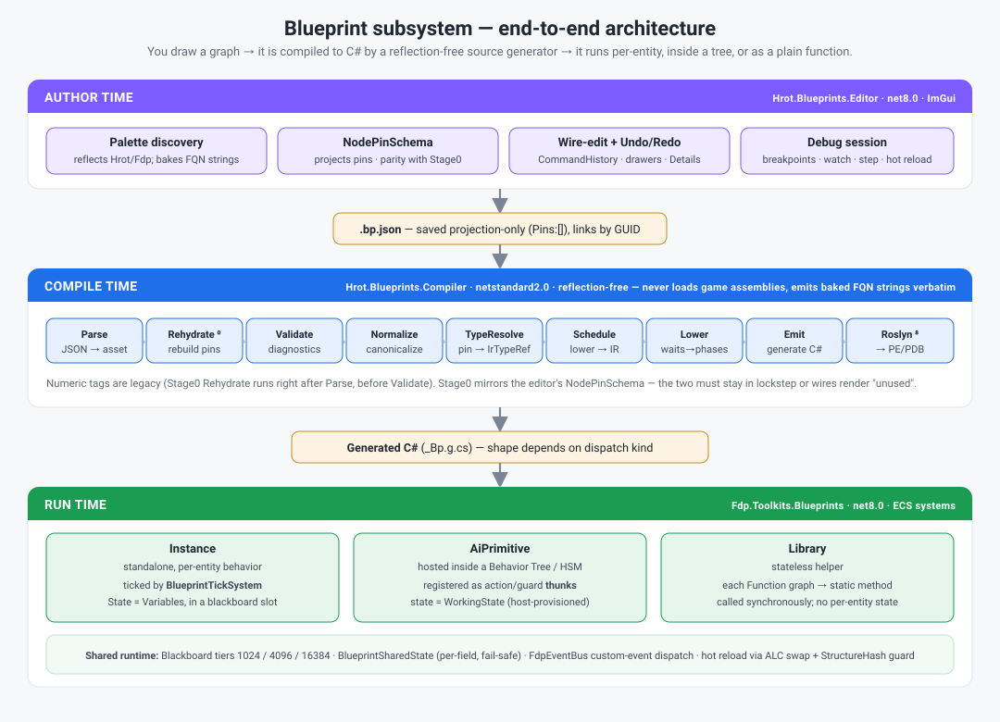

# Blueprints — Capabilities & Architecture Overview

> **Start here.** What the Blueprint subsystem can do today and how it is built, at a
> capabilities/architecture level. For the gentle conceptual intro see
> [Blueprint_Architecture_Overview.md](Blueprint_Architecture_Overview.md); for adding a node see
> [Blueprint_New_Node_Authoring_Guide.md](Blueprint_New_Node_Authoring_Guide.md). A doc index is at
> the bottom. *(Refreshed 2026-07-21 against the implemented system.)*

A **Blueprint** is game logic you *draw* as a node graph instead of writing C#. The graph is
compiled — by a **reflection-free source generator** — into ordinary C# that runs one of three ways:
per-entity, hosted inside a Behavior Tree / HSM, or as a stateless library function.

---

## 1. The three dispatch kinds

The single most important design axis. A blueprint's `Dispatch` picks the emitter, the state model,
and who ticks it.

| Kind | What it is | Who runs it | Per-entity state | Use when |
|------|------------|-------------|------------------|----------|
| **Instance** | A standalone per-entity behavior | `BlueprintTickSystem`, every Simulation frame, over blackboard slots | **Variables** (persistent), in a blackboard slot | The blueprint *is* the behavior for an entity |
| **AiPrimitive** | A leaf hosted inside a BTree/HSM | The host tree, when it ticks that leaf (via registered action/guard **thunks**) | **WorkingState** (scratch/latent), host-provisioned | The blueprint is one Action/Condition among many in a tree |
| **Library** | A stateless helper | Called synchronously by other code | *none* | Reusable pure logic; each Function graph → a static method |

Variables vs WorkingState is not cosmetic: **Variables** = Instance persistent state; **WorkingState**
= AiPrimitive scratch/latent state. Using the wrong one is a compile error (BP1031).

> ⚠ **"host-provisioned" WorkingState means different things per host — and only one of them works
> for multiple AiPrimitives on an entity.** (BP-48; failure mode is **BP-30**.)
> **BTree** provisions a real partition slot: `ComposeAiPrimitiveAction` auto-creates a distinct
> `Role=State, Scope=Node` host variable per placement, so two blueprints — or one placed twice —
> separate correctly. **HSM does not**: it still uses the legacy fixed offset (`Blackboard1024`+8,
> one `StructureHash`) with no compose command, so two stateful AiPrimitives on one HSM entity
> `InitBlock`-zero and re-init each other every tick and **neither retains state**.
> See [Runtime DD §9.6](Blueprint_Subsystem_Runtime_Detailed_Design.md) for the mechanism.

---

## 2. How it is built (assembly boundary)

| Assembly | Target | Role |
|----------|--------|------|
| `Hrot.Blueprints.Compiler` | **netstandard2.0** | The compiler pipeline — a Roslyn **source generator**. *Cannot* load game assemblies, so it never reflects real CLR types. |
| `Hrot.Blueprints.Core` | net8.0 | Asset model + IR + debug infra; links the final Roslyn compile (Stage8). |
| `Hrot.Blueprints.Generators` | netstandard2.0 | MSBuild incremental-generator wiring: `.bp.json` → `.g.cs`. |
| `Hrot.Blueprints.Editor` | net8.0, ImGui | The visual editor: palette, canvas, pin projection, drawers, debug, hot reload. |
| `Fdp.Toolkits.Blueprints` | net8.0 | The **runtime**: tick/maintenance ECS systems, blackboard, shared state, event dispatch. |

**The load-bearing constraint (AN2, "trust the string"):** because the compiler is netstandard2.0 and
cannot reflect game types, the *editor* bakes fully-qualified type/member strings onto nodes at author
time (component FQNs, event FQNs, accessor FQNs, struct FQNs, the FunctionCall trailing-context
decision), stamped with a `global::` sentinel. The compiler emits them verbatim; `StaticTypeRegistry`
accepts them as project/unmanaged types. This is why almost every "advanced" node carries a baked
`*Fqn` field rather than resolving anything at compile time.

---

## 3. Node vocabulary (~42 kinds)

Grouped by purpose. Status is coarse: **✅** shipped & used · **◐** runs but thin authoring surface ·
**⚠** legacy/avoid (superseded — see notes) · **⛔** rejected by the compiler. Per-node, per-axis detail
lives in the (dated) [Feature Maturity Matrix](Blueprint_Feature_Maturity_Matrix.md).

> ⚠ **These marks describe the *compiler* axis and the *authoring* axis together, and the two do not
> always agree.** A node can lower and run perfectly while being impossible to place or configure in
> the editor. Where they diverge the weaker axis wins the mark, with a note. See
> [Blueprint_Issues_Tracker.md](Blueprint_Issues_Tracker.md) for the live gap list.

**Entry / flow control** — `EventEntry` ✅ (graph entry; Function inputs *or* event payload fields),
`Return` ✅, `Branch` ✅, `Sequence` ✅.

**Variables / parameters** — `GetVariable` ✅, `SetVariable` ✅, `GetParameter` ✅ (host data-in
contract), `GetAllParameters` ✅.

**Shared & component state** (entity-scoped, foreign structs) — `GetShared` ✅, `SetShared` ✅ (both
support **per-field pins** — see §6), `GetComponent` ✅ (read a field off an ECS component).

**Struct values** — `MakeStruct` ✅, `BreakStruct` ✅, `SetMembers` ✅ (construct / deconstruct /
copy-modify a blittable struct inline). New in the Option-B work.

**Events** — `PublishEvent` ✅ (publish an engine/custom event on the bus, with per-field payload
pins), `CallCustomEvent` ◐ (blueprint-local custom event), `WaitForEvent` ⚠ / `CallDispatcher`
⚠ / `BindDispatcher` ⚠ (legacy dispatcher model — superseded by `PublishEvent` + `EventEntry`
subscribe).

**Data / pure ops** — `Literal` ✅, `Compare` ◐ (full `ComparisonOperator` set), `BinaryOp` ◐
(Add/Sub/Mul/Div/Mod), `BooleanOp` ◐ (And/Or), `Not` ◐, `Cast` ◐,
`ArrayMake` ⛔ / `ArrayGet` ⛔.

> **Why `Compare` / `BinaryOp` / `BooleanOp` / `Not` are ◐, not ✅.** All four are fully lowered and
> compile-tested — but they have **no palette entry**, so they cannot be placed in the editor at all
> (BP-04); they are reachable only from hand-authored JSON. The previous ✅ marked the compiler axis
> and hid the authoring gap. Math is partly covered in practice by `BlueprintMathPaletteEntries`,
> which routes through CLR `BlueprintMath` helpers as `FunctionCall`.
>
> **`Cast` is ◐, not ⚠.** Its emit bug is fixed — `StatementEmitter` intercepts `Cast.`-prefixed
> calls and emits a native `(global::T)` cast. It is also inserted implicitly by Stage3 Normalize.
> It simply has no drawer (BP-58).
>
> **`ArrayMake` / `ArrayGet` are ⛔ — they are now a compile error (BP1420).** They never had Stage5
> lowering: reading their output silently yielded `default(T)` with no diagnostic, so a graph using
> them compiled clean and returned wrong data. `V_UnloweredNodeKinds` rejects them outright (BP-16).
> Use a fixed-capacity list variable for collection storage.

**Calls** — `FunctionCall` ✅ (a CLR `[BlueprintCallable]` method *or* an in-blueprint Function graph;
bakes the self/view trailing-context decision), `CallPeerBlueprint` ◐.

**Behavior / channels** — `ChannelCommand` ✅ (a channel action, *or* a non-channel behavior action
via baked `ActionFqn`).

**EQS / utility** — `SpawnEqsSensor` ✅, `ReadEqsResult` ✅, `ScoreDecision` ◐, `ReadRankedResult` ◐.

**Loop** — `FlowForEach` ✅ (bounded, latent-free loop over a curated collection; body may not contain
latent/Branch nodes — BP2050).

**Reactive** — `When` ◐ (Rising/Falling edge trigger; modes: ValueChanged / EventFired / ConditionMet
/ EqsResult).

**Latent** — `Delay` ✅, `WaitForChannel` ◐ (runs, no drawer).

**Squad primitives** — `PartitionElements` ⚠ / `AssignRoles` ⚠ / `AdvancePhase` ⚠ / `AcquireSlot` ⚠
(façade over the FDP squad library; the lean `SlotRotation`/`MemberSlotList` path is preferred).

---

## 4. Compiler pipeline

`.bp.json` (saved projection-only — `Pins:[]`, links by GUID) → stages below → generated C# → optional
Roslyn PE/PDB. Shown in execution order; numeric tags are legacy.

| # | Stage | Does |
|---|-------|------|
| 1 | Parse | JSON → `BlueprintAsset` (polymorphic `kind` discriminator) |
| **0** | **Rehydrate** | Rebuilds each pin-less node's canonical pins + reassigns link GUIDs positionally. **Must mirror the editor's `NodePinSchema`.** |
| 2 | Validate | Structural/semantic diagnostics (BP15xx types, BP2050 FlowForEach, channel refs, …) |
| 3 | Normalize | Canonicalize wiring (e.g. implicit `Cast` insertion) before typing |
| 4 | TypeResolve | Every non-exec pin `TypeRef` → `IrTypeRef` via `StaticTypeRegistry`; wildcard propagation; unmanaged-state enforcement |
| 5 | Schedule | Topologically schedule nodes into IR blocks; lower each node to IR ops |
| 6 | Lower | Dispatch-specific lowering + **wait-lowering** (latent nodes → a `__phase` state machine) + field layout + StructureHash + debug probes |
| 7 | Emit | `CSharpEmitter` → `LibraryEmitter` / `AiPrimitiveEmitter` / `InstanceEmitter`; produces source + a node→line `DebugMap` |
| 8 | Roslyn | Optional finalize to portable PE/PDB with embedded source |

**Stage0 ⇄ NodePinSchema parity** is the subsystem's sharpest edge: the editor projects pins one way,
Stage0 must reconstruct them identically, or wires silently render "unused". Any change to one must be
mirrored in the other.

---

## 5. Runtime (`Fdp.Toolkits.Blueprints`)

- **`BlueprintTickSystem`** (Simulation phase) — walks each entity's blackboard slot table; guards each
  slot's `StructureHash` against the registry (hard-reset on drift); **dispatches any subscribed custom
  events before the tick**; then calls the generated `Tick(...)`. Also ticks world-singleton blueprints.
  Skips work when `dt <= 0` (respects pause/breakpoints).
- **Blackboard tiers** — per-entity state lives in one of three fixed-size unmanaged components
  (`BlueprintBlackboard1024 / 4096 / 16384`), chosen by size; `BlueprintMaintenanceSystem` upgrades a
  slot to a larger tier when it outgrows the current one.
- **`BlueprintSharedState`** — by-value, fail-safe entity-scoped shared slots: `TryGetShared<T>`,
  `TrySetShared<T>`, and `TrySetSharedField<TStruct,TField>` (true per-field write at a baked offset).
  Returns `false` (never throws) on layout drift or key collision.
- **Custom-event dispatch** — `BlueprintEventDispatch.DispatchForSlot`: for each Event-graph handler,
  resolves the event key → bus type-id, `HasEvent`-gates (absent events cost nothing), and invokes the
  handler once per event instance with the payload bytes.
- **Hot reload** — the editor coordinator drives an ALC swap (`QuickReloadService` fast path /
  `FullRebuildService`); the runtime reconciles per-slot via the StructureHash guard.

---

## 6. Editor (authoring surface)

- **Palette discovery** — the node vocabulary is assembled from many sources: the built-in set, plus
  *discovered* entries — per-action channel commands, `[BlueprintCallable]` methods, `[BlueprintEvent]`
  publishers, and a Make/Break/SetMembers triple per `[BlackboardDtoStruct]`. Discovery reflects
  Hrot/Fdp assemblies and **bakes** the resulting FQNs onto the created node.
- **Pin projection** — `NodePinSchema.GetCanonicalPins` computes each node's pins (authored → registry
  → fallback). Dynamic kinds (EventEntry, FunctionCall, Get/SetShared, Make/Break/SetMembers,
  PublishEvent, …) are computed with reflection + `global::` stamping, and must match Stage0 (§4).
- **Per-field ("expand") pins** — `GetShared`/`SetShared`/`PublishEvent` can show one pin per struct
  field instead of one whole-struct pin. `SetShared`'s multi-pin write is a **true per-field write** —
  unwired fields keep their existing value (no whole-struct clobber).
- **Wire editing + undo** — a full NodeEdit **Host** layer (`BlueprintNodeModel`/`GraphModel`/
  `NodePinSchema`/`BlueprintCommandSink`) with wire-drop, exec-out fan-out, and a `CommandHistory` that
  makes add/remove/replace-link and delete-node **undoable**.
- **Debug** — breakpoints, watch/callstack/step panels, a hot-reload log, and per-node source mapping
  (the runtime `DebugMap` + a frame-start callback).

---

## 7. Recently shipped capabilities

The features below post-date most existing docs (they are folded into the sections above):

| Capability | What it enables |
|------------|-----------------|
| **Custom events pub/sub** | Designer-authored bus events with typed payloads, published from one blueprint (`PublishEvent`) and handled by another's **Event graph** (`EventEntry`), optionally filtered to **Self** vs **Any** recipient. |
| **Multi-pin field access** | Per-field pins on `PublishEvent` / `GetShared` / `SetShared` — set/read individual struct fields without touching the rest. |
| **Struct-value nodes** | `MakeStruct` / `BreakStruct` / `SetMembers` — construct, deconstruct, and copy-modify blittable structs inline; whole structs flow along pins. |
| **Struct-typed Variables** | A Variable can hold a blittable struct; state offsets are derived from the emitted `State` layout. |
| **Wire-edit undo** | Link add/remove/replace and node delete are undoable through `CommandHistory`. |

---

## 8. Documentation index

`docs/blueprints/` has ~70 files. This is the map. **Current** = keep as reference; **Design record** =
accurate point-in-time design (architect Q&A, slice designs) kept as history; **Superseded** = pre-build
spec whose details no longer match — read this overview + the auto-generated project docs instead.

| Doc | Status | Note |
|-----|--------|------|
| **Blueprints_Overview.md** (this) | Current | Front door — capabilities + architecture |
| Blueprint_Architecture_Overview.md | Current | 1-page conceptual intro (Blueprint→Node→Tree) |
| Blueprint_New_Node_Authoring_Guide.md | Current | How to expose a new C# thing as a node |
| Blueprint_Feature_Maturity_Matrix.md | Current (dated) | Per-node/axis audit — snapshot 2026-07-16; see banner |
| Blueprint_Authoring_Examples.md | Current | When a blueprint earns its keep (worked cases) |
| Variables_Designer_Quickstart.md | Current | Variables vs Working State vs Shared decision tree |
| `docs/projects/Hrot/Blueprints/*.md` | Current | Auto-generated per-assembly API references |
| Custom_Events_Design.md, Custom_Events_BUILD_TRACKER.md | Design record | Pub/sub design + build log |
| Architect_Question_*.md (Q2–Q14) | Design record | Architect decision Q&A, in order |
| *_Slice_Design.md, WaveCore/EQS/TreeIntegration/… | Design record | Per-slice designs + build plans |
| Blueprint_Subsystem_Architecture_v1.2.md | Superseded | Frozen Slice-1 plan; assembly split + node set no longer match |
| Blueprint_Subsystem_Compiler_Detailed_Design.md | Superseded | Pre-build DD (no Stage0; ~22-node schema) |
| Blueprint_Subsystem_Editor_Detailed_Design.md | Superseded | Pre-build DD (canvas described as a "placeholder") |
| Blueprint_Subsystem_Runtime_Detailed_Design.md | Design record | Pre-build DD; core runtime model still broadly holds |
