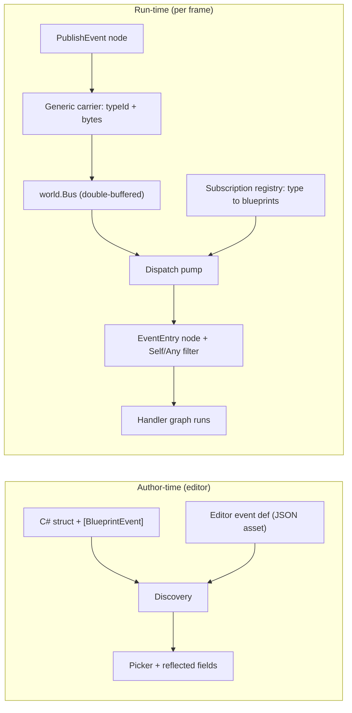

# Blueprint Custom Events + Pub/Sub — Implementation Design

**Status: 📐 DESIGN — for review (user + architect) before build.**
Decisions: **Q#14 APPROVED** (Option 2b + infrastructure); dispatch trace committed. This doc is the *how*.

## 1. Goal / non-goals

**Goal.** Named events blueprints can **publish** and **subscribe** to — *one behavior sends, any number
subscribe* — for **entity↔entity and intra-entity** communication. Two cases share one runtime:
1. **System-predefined** events (engine-defined structs) — already publish/subscribe; migrate discovery.
2. **Designer custom** events — the new work.

**Non-goals (explicit).**
- ❌ **No editor→C# code generation** (Option 2c dropped — the only high-risk leg).
- ❌ No complex/multi-field correlation filtering (single-field `Self`/`Any` only; branch in-graph if ever needed).
- ❌ No new bus; no change to the tick/frame model.

## 2. Two authoring paths, one runtime

| Path | Who | Editor | Payload representation |
|---|---|---|---|
| **2a — C# hand-authored** | advanced / engine | read-only (pick + use) | typed struct (existing `Publish<T>`) |
| **2b — editor-authored** *(primary)* | designers | define + edit + persist (JSON) | **generic carrier** (type-id + bytes) — no codegen |

Both surface in the same picker; both publish/subscribe the same way. 2a is a demand-driven fallback; 2b is the
designer path and the focus here.

## 3. End-to-end flow



## 4. Components

### 4.1 Discovery (kills the manual registry)
- `[BlueprintEvent(Category)]` attribute on the event carrier — mirrors approved `[BlueprintCallable]` (Q#12).
- Editor reflects public fields (existing `NodePinSchema` reflection); compiler **bakes** `EventTypeFqn` +
  per-field `(Name, TypeId)` strings into the `.bp.json` node (netstandard2.0 generator never reflects).
- **Two discovery sources, one picker:** reflected C# events (2a) + editor-authored event defs (2b, from the
  event-definition asset). Retires the hand-baked `PayloadFields` catalog; **migrate system events** to this (A2).

### 4.2 Editor-authored event definition (2b) — reuse blackboard authoring
- Designer defines `name + typed fields` in the editor — **reuse** `BlackboardAuthoringWindow` /
  `BlueprintVariablesWindow` (`(Name, FieldType)`).
- Stored in an **event-definition asset** (JSON), mirroring how blackboard/variables persist. **No `.cs` generated.**
- One field may be tagged **recipient/target** (drives the `Self`/`Any` filter). Optional.

### 4.3 Payload = generic carrier (no codegen)
- Reuse the engine's existing type-erased path: `PublishRaw` / `InjectIntoCurrentBySize(typeId, size, bytes)`
  + `UntypedNativeEventStream` (`FdpEventBus.cs`). Fields packed/read via a fixed-layout reinterpret over the
  byte span — the same pattern as the blueprint `State` struct over the blackboard slot.

### 4.4 Publish — `PublishEvent` node (generalize existing)
```
┌─ Publish: TargetSpotted ──┐
│► exec           exec ►     │
│● Target (Entity, opt→self) │   ← wire values; unwired Target → self
│● SpotterId                 │   ← one data-in pin per reflected field
│● Position                  │
└────────────────────────────┘
```
- Multi-pin, fields from discovery. **No write-ordering hazard** — lowers to a single struct/carrier
  initializer (pure construction, evaluated once). Make it **editor-addable** (palette entry per event).

### 4.5 Subscribe — named-event `EventEntryNode` + `Self`/`Any` filter
```
┌─ ◈ On TargetSpotted ───────────┐
│  Deliver to:  ◉ Self   ○ Any    │   ← shown only if event has a target field
│                           exec ▶ │   ← graph enters here on fire
│                       SpotterId ● │   ← payload → reflected data-out pins
│                        Position ● │
│                          Target ● │
└─────────────────────────────────┘
```
- Subscription primitive = the **named-event entry node** (NOT `WhenNode`). Payload projects onto its reflected
  data-out pins (reuse `EventEntryNode`'s existing one-out-per-`Graph.Inputs` projection, retargeted at fields).
- **Two filter axes, both declarative:** *name/type* (inherent — the node is keyed to the type) and *recipient*
  (`Self` = fire iff `event.<Target> == self`; `Any` = broadcast). Enforced at dispatch — **no in-graph branch.**
- JSON: `{ "kind": "EventEntry", "EventTypeId": "TargetSpotted", "TargetFilter": "Self" }` (`"None"` = Any).

### 4.6 Dispatch (the net-new core) — light up the orphaned seam
The compiler **already emits** `Event_{Name}` + `Event_{Name}_Thunk` and fills `BlueprintDefinition.EventHandlers`
— but `EventHandlers` is **never read** today (verified). Net-new work:
1. **Subscription registry** — event-type → interested blueprints/entities, built at load from the
   `[BlueprintRegistrar]` scan (extend the existing scan; identity registry stays).
2. **Dispatch pump** — a per-tick system: for each event on the bus this frame, resolve subscribers and invoke
   their thunk. Home: a new Input-phase system after `Bus.SwapBuffers()` / before `BlueprintTickSystem`, or
   folded into `BlueprintTickSystem`'s per-slot loop (it already holds `view/ecb/entity/def`). `BTreeTickSystem`
   already drains the bus — precedent.
3. **Recipient filter** — the pump delivers iff `TargetFilter == None` OR `event.<Target> == entity`.
4. **Payload marshalling** — `EmitEventThunk` currently stubs `default(T)`; fill from carrier bytes via the
   reinterpret-cast. Small + mechanical once routing exists.

## 5. Reuse vs net-new (from the trace)

| Concern | Status |
|---|---|
| Double-buffered bus, publish/read, per-frame swap | ✅ reuse (`FdpEventBus`) |
| Generic type-id+bytes carrier | ✅ reuse (`PublishRaw` / `InjectIntoCurrentBySize`) |
| Reflection field discovery + baked strings | ✅ reuse (`[BlueprintCallable]` / shared-state pattern) |
| Field-definition UI + JSON persistence | ✅ reuse (blackboard/variables authoring) |
| Byte-addressed payload struct | ✅ reuse (blueprint `State` reinterpret) |
| `Event_{Name}` + thunk + `EventHandlers` dict | ⚠️ built but **orphaned** — wire it up |
| Tick systems / registrar identity lookup | ✅ reuse |
| **Subscription registry (type→subscribers)** | ❌ net-new |
| **Dispatch/routing + payload marshalling** | ❌ net-new (the slice) |

## 6. Build phases (each independently gated)

| # | Phase | Reuse-heavy? | Gate |
|---|---|---|---|
| 1 | `[BlueprintEvent]` discovery + editor event-def asset (+migrate system events) | high | picker lists events; round-trip JSON |
| 2 | `PublishEvent` on the generic carrier — multi-pin, editor-addable | med | publish compiles + emits carrier write |
| 3 | **Dispatch** — registry + pump + payload marshalling (light the seam) | low (net-new) | published event invokes subscriber handler graph w/ real payload |
| 4 | `EventEntryNode` subscribe UX + `Self`/`Any` filter | med | Self-filtered + broadcast delivery correct |

Backward-compat: system events unchanged behavior after the A2 migration (byte-identical generated code where
they don't use the new path); existing proof suites green throughout.

## 7. Open implementation details (decide during build)
- **Event key reconciliation:** the Instance-emitter keys Event graphs by graph **Name**, but `EventEntryNode`
  carries `EventTypeId`. Pick one identity (lean: the event type, so it matches the carrier's type-id).
- **Delivery semantics:** broadcast-poll (pump reads each event, iterates all subscribers) vs an explicit
  per-event subscriber list. Lean: registry-indexed by type (avoids scanning every blueprint per event).
- **Which blueprint kinds subscribe:** Instance first (the emitter path that has `EventHandlers`); AiPrimitive
  (BTree/HSM-hosted) as a follow-up if needed.
- **Managed vs unmanaged carrier:** designer events are unmanaged (blittable fields) → native stream; string
  fields (if allowed) force the managed stream. Decide the allowed field-type set.

## 8. Risks
| Risk | Mitigation |
|---|---|
| Dispatch is genuinely net-new | seam (thunk/`EventHandlers`) + carrier already exist; scope is registry + pump + marshalling |
| Per-frame pump cost | index subscribers by event-type; only pump event-types actually present (`HasEvent`) |
| Field-type set / marshalling correctness | restrict to blittable field types first; reinterpret-cast is the proven `State` pattern |
| Stale-generator cache during build | clean-rebuild + `--no-incremental` (see project memory) |

## 9. Testing
- Phase 1: discovery unit tests (attribute + editor-def → picker list); JSON round-trip.
- Phase 2: `PublishEvent` compile + generated-carrier-write assertion; real `--no-incremental` compile.
- Phase 3: runtime test — publish event, assert subscriber handler graph ran with the correct payload +
  `Self`/`Any` filtering (mirror `WhenNodeRuntimeTests` / `HillAssault2_*_ProofTests` reflection-drive style).
- Phase 4: cross-entity (Self vs Any) delivery test; intra-entity self-notify test.
