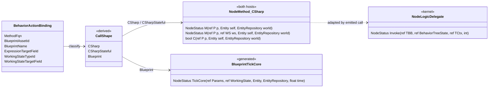
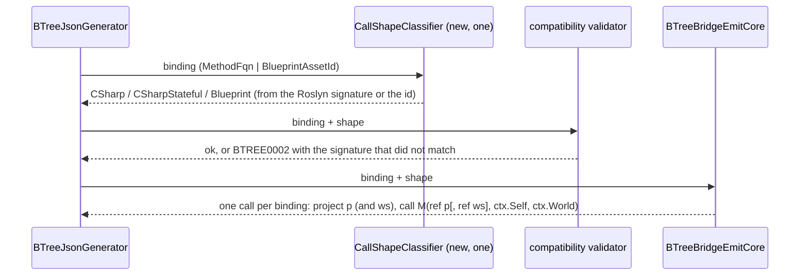
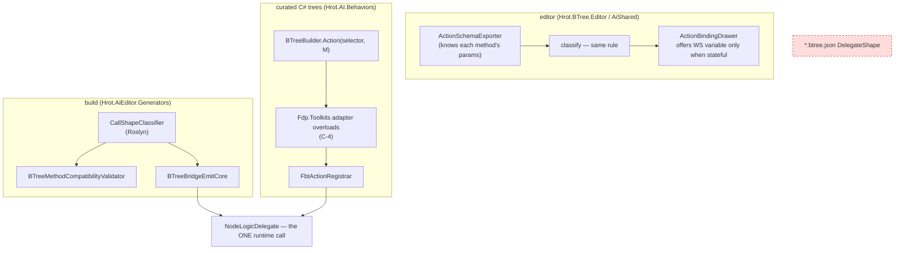

<!--STATUS
state: LIVE
updated: 2026-10-02
build-state: DESIGN — decisions C-1 … C-4 await the user (§4). Nothing is built.
current-answer: §4 (the four decisions, each with a lean) and §5 (slices).
stale-below: nothing.
known-rot: none.
known-conflict: Architect_Question_41_Blueprint_Driving_BTree_Params.md §6 — "the FourParamFull shape stays; B2 is
  built on it". C-3 proposes retiring FourParamFull as an ASSET-BINDING shape because B2's basis (TryGetShared) was
  removed by CE-440 and B2 was never built (§2 row S5). ⚠ Q41 is user-approved; this conflict is resolved only if the
  user approves C-3. The kernel's own NodeLogicDelegate (curated trees) is NOT affected either way.
related-designs:
  - DESIGN_Behavior_Action_Binding.md — owns the ONE binding record (CE-417) and decision B-5 (DelegateShape stays a
    BTree-side field). This document decides what that field is FOR, and proposes deriving it (C-1).
  - BTree_AiActionParameterBinding_Detailed_Design.md — owns the origin of ThreeParamReusable (§3) and the stateful
    4-param form (§4, PlatoonHillAttack's working state). This document proposes their C# signatures converge (C-2).
  - Architect_Question_41_Blueprint_Driving_BTree_Params.md — owns the FourParamFull "stays" ruling (§6); see known-conflict.
  - Architect_Question_75_One_Params_Pipeline_And_One_Action_Binding.md — §5.1b: DelegateShape is a set of BTree
    interpreter arities, not a host-neutral vocabulary.
-->

# BTree node call shapes — from four persisted shapes to one derived C# signature (`CE-504`)

📄 Tracker: `CE-504` in [`Blueprint_Issues_Tracker.md`](Blueprint_Issues_Tracker.md). Filed by the user `2026-10-01`:
*reduce BTree's four action call shapes; the HSM reaches the same needs with one C# signature.*

## 1. INVENTORY

| query | total | what it found |
|---|---|---|
| `search_graph name_pattern=.*DelegateShape.*` (CLI) | 2 types | `BTreeActionDelegateShape` (model enum, `BehaviorTreeAsset.cs:14`) · `BTreeDelegateShapeDto` (`BehaviorTreeAssetDto.cs:152`) |
| grep: the node delegate types (the graph does not index delegates — `.*Delegate$` returned 0 code nodes) | 5 | `NodeLogicDelegate<TBB,TCtx>` (Fbt kernel, 4-param) · `ReusableActionDelegate` / `ReusableConditionDelegate` (Fbt compiler, 3-param) · `ReusableStatefulActionDelegate` (Fdp.Toolkits, 4-param) · `BlueprintBehaviorTickDelegate` |
| python over every `*.btree.json` (25 files) | 40 bindings | `ThreeParamReusable` 14 · `ThreeParamReusableStateful` 9 · `AiPrimitiveTickCore` 10 · `FourParamFull` **7 — all `CgfNodes.Action_Wander`** |
| regex over production `[BTreeAction]`/`[BTreeCondition]`/`[SharedAi*]` methods | 30 | 23 BTree 3-param `(ref P, ref BehaviorTreeState, ref BTreeContext)` · 1 kernel 4-param (`CgfNodes.Action_Wander`) · 6 `[SharedAiAction]` `(ref P, Entity, EntityRepository)` |
| unattributed stateful methods (`HillAttackCommanderNodes`, `DemoCounterNodes`) | 7 | `(ref P, ref WS, ref BehaviorTreeState, ref BTreeContext)` |
| `[BTreeDeactivator]` | 12 | mirror their action's shape (3-param, or stateful + `int paramIndex`) |
| curated fluent `BTreeBuilder.Action/Condition(selector, method)` call sites | 23 (+ `StatefulTreeBuilderExtensions`) | `CgfNodes`, `HideInCoverBehavior`, `HillAttack*Nodes` |
| production files naming a shape | 24 | top: `BTreeMethodCompatibilityValidator` 35 · `BTreeBridgeEmitCore` 28 · `BTreeEmitCore` 12 · model 12 |

⚠ `check_index_coverage` is not reachable through the CLI; the counts are grep- and graph-corroborated, not proven exhaustive.

## 2. The claim table

| claim | code — how it IS | design basis |
|---|---|---|
| **S1** a BTree node's `BehaviorTreeState` parameter is never read by any node body | ✅ grep `state\.` over `Hrot.AI.Behaviors/Brains/*.cs`: 0 hits | ⛔ searched `docs/`+`.dev/`: no design assigns it a node-level use |
| **S2** `BTreeContext` is used by node bodies only for `Self` (88) and `World` (137); time/params live behind `IAIContext` and no node calls it | ✅ grep `ctx\.` / `IAIContext` in `Brains/` | ✅ `BTreeContext.cs:20-30` *"so that node delegates can call World.GetComponentRW(Self)"* |
| **S3** `BehaviorLog`'s `ref BTreeContext` overload reads exactly what its `(Entity, EntityRepository)` overload reads | ✅ `BehaviorLog.cs:164-186` | — |
| **S4** each shape is a distinct parameter list, so the shape is decidable from the method alone | ✅ `BTreeMethodCompatibilityValidator.cs:169-271` dispatches on the persisted shape, then checks exactly that list | ✅ Q75 §5.1b: *"these are BTree interpreter arities"* |
| **S5** `FourParamFull`'s only asset user, `CgfNodes.Action_Wander`, reads none of `blackboard`/`state`/`paramIndex` | ✅ `CgfNodes.cs:406-440` | ⚠ Q41 §2 kept the shape as the base of B2 (a "read shared slot → write host variable" node). ⛔ B2 was never built and its mechanism, `TryGetShared`, was removed by `CE-440` |
| **S6** the editor cannot author `ThreeParamReusableStateful` or (by a pick) `FourParamFull`: a C# pick never changes `DelegateShape`, so it stays `ThreeParamReusable` and the generator skips a mismatched method as `BTREE0002` | ✅ `BTreeFacetMapper.cs:191-195` (only blueprint picks move the shape); `BTreeCommandSink` sets only `AiPrimitiveTickCore`; the projector sets `FourParamFull` (`BehaviorTreeAssetProjector.cs:159`) | ⛔ searched: no design says stateful binding is hand-JSON only |
| **S7** the HSM already has the target signature and binds it per binding with no state base | ✅ `SharedAiBindings` (CE-417 slice 3a); BTree accepts it too since 3b (`BTreeBridgeEmitCore.EmitThreeParamCall`) | ✅ `DESIGN_Behavior_Action_Binding.md` B-2 (a′) |
| **S8** the stateful C# form does NOT exist on the HSM yet | ✅ `HsmOccurrence.KeyForCurated` kept, no caller (slice 3a box) | ✅ that box: *"kept for the stateful C# HSM action"* |

## 3. The target

*What it shows that prose hid:* the kernel delegate is not one of the author's shapes — it is what every emitted call
ADAPTS TO. The author sees two things (a C# method, optionally stateful; or a blueprint), and neither is persisted.

*Caption:* the red node is what C-1 removes. The curated subgraph is the blast radius prose kept hiding — the same
methods are bound a second way, through the fluent builder, so a signature change must land there too (C-4).

## 4. Decisions *(each with a lean; the user decides)*

| | decision | ⚖️ lean | rejected (one line each) |
|---|---|---|---|
| **C-1** | **Is the call shape persisted or derived?** | ⭐ **Derived** from the bound method's signature (generator: Roslyn; editor: the exporter's parameter list) or from `BlueprintAssetId`. Stop writing `DelegateShape`; read-tolerant (ignored when present). Fixes S6: the editor then authors a stateful binding by picking the method. Blast: the persistence-shape snapshot; emitted source unchanged by construction | *keep persisting it* — a second fact about the method that the editor already gets wrong (S6) |
| **C-2** | **One C# node signature for both hosts?** | ⭐ **Yes — the HSM's:** `(ref P, Entity self, EntityRepository world)`, plus the stateful `(ref P, ref WS, Entity self, EntityRepository world)`; conditions may return `bool`. S1–S3: nothing a node body uses is lost. Deactivators follow (`(ref P[, ref WS], Entity, EntityRepository)`). Blast: 23 + 7 methods, 12 deactivators, 23 curated call sites, the validator's three BTree checks, the registrar's 3-param adapter | *unify on BTree's `(ref P, ref BehaviorTreeState, ref BTreeContext)`* — two Fbt kernel types an HSM action can never be given · *keep both* — the "two implementations for one concept" this item was filed to end |
| **C-3** | **`FourParamFull` as an asset-binding shape** | ⭐ **Retire.** One method, reads nothing (S5); never authorable (S6); Q41 §6's reason is void (CE-440). `Action_Wander` becomes param-less: `(Entity self, EntityRepository world)` — ⭐ round-out: a node with no params is a legitimate third C# form, not a special case. The kernel `NodeLogicDelegate` and curated `.Action(Action_Wander)` are unaffected (via C-4) | *keep it as an escape hatch* — no user needs it and it is the one shape that hands a node the whole block by raw offset · ⚠ **this overrides Q41 §6 — approve explicitly** |
| **C-4** | **Curated fluent trees** | ⭐ **Adapter overloads in `Fdp.Toolkits`** (`BTreeBuilder.Action(selector, SharedNode
)`, stateful and param-less variants) that wrap the new signature into the kernel delegate ONCE at build time — no per-tick allocation, one extra indirect call. Then delete the 3-param `[BTreeAction]` path | *migrate curated trees to JSON assets first* — a much larger, unrelated change · *a source generator per method* — what `BTreeActionGenerator`'s 3-param adapters already were, and they are what this removes |

**Kept, deliberately:** the blueprint call (`AiPrimitiveTickCore`) — generated code, a different contract (`float time`,
generated `WorkingState`). The hand-written `DemoAiPrimitiveNodes.TickCore` fixtures keep it because they stand in for a
blueprint in the compose rails (T31/T34/T35/T39). **Out of scope:** the HSM's stateful C# action (S8) — enabled by C-2,
filed separately when wanted.

## 5. Slices *(one commit each, green at each; order matters)*

| # | slice | moves |
|---|---|---|
| 1 | **C-1** classifier (one rule, generator + editor) · validator and emitter dispatch on it · stop writing `DelegateShape` · rail: every corpus binding classifies to its persisted shape *(the equivalence that makes dropping the field safe)* | `btree-persistence-shape.txt`; ⛔ no emitted source |
| 2 | **C-2 accept** — BTree emits the stateful and param-less `(…, Entity, EntityRepository)` calls; `C-4` adapter overloads | additive; no golden |
| 3 | **C-2/C-3 migrate** — the 30 methods + 12 deactivators + `Action_Wander`; curated sites onto the adapters | BTree goldens (call text); `Hrot.AI.Behaviors` |
| 4 | **retire** — the 3-param/4-param BTree author paths (`ReusableStatefulActionDelegate`, the registrar's 3-param adapter, the validator's three BTree checks, `BTreeActionDelegateShape`/`BTreeDelegateShapeDto`) | deletions |

**Rails owed:** classifier = persisted shape for every corpus binding (slice 1, then deleted with the field) · the editor
authors a stateful binding by a pick (red today, S6) · each migrated method's behaviour unchanged through its feature
suite (`BrainTickSystemBTreeArmTests`, the hill-attack and EQS suites) · zero allocation across a steady BTree tick
(`CE505_R4`) after slice 3.
