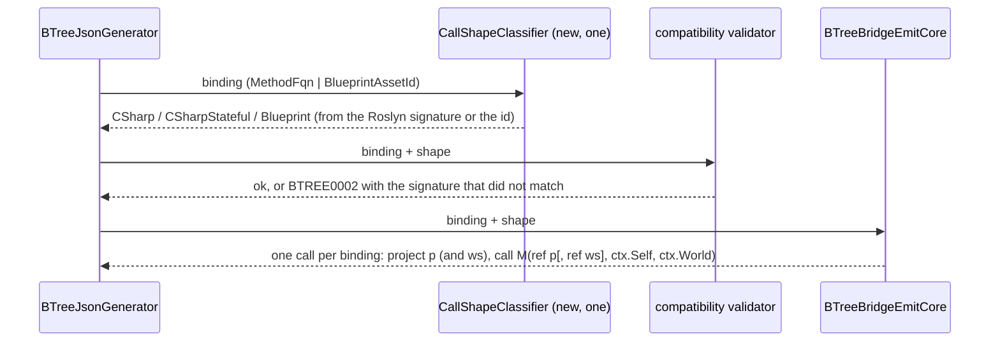
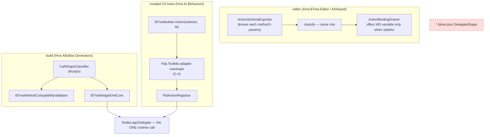

<!--STATUS
state: LIVE
updated: 2026-10-02
build-state: BUILT — C-1 … C-4 APPROVED by the user 2026-10-02 ("Approved"). Slices 1–4 BUILT (§5 boxes).
current-answer: §4 (the four decisions, each with a lean) and §5 (slices).
stale-below: nothing.
known-rot: none.
known-conflict: Architect_Question_41_Blueprint_Driving_BTree_Params.md §6 — "the FourParamFull shape stays; B2 is
  built on it". C-3 proposes retiring FourParamFull as an ASSET-BINDING shape because B2's basis (TryGetShared) was
  removed by CE-440 and B2 was never built (§2 row S5). ✅ RESOLVED 2026-10-02: the user approved C-3, which
  supersedes Q41 §6 for asset bindings. The kernel's own NodeLogicDelegate (curated trees) is NOT affected either way.
related-designs:
  - DESIGN_Behavior_Action_Binding.md — owns the ONE binding record (CE-417) and decision B-5 (DelegateShape stays a
    BTree-side field). This document decides what that field is FOR, and proposes deriving it (C-1).
  - BTree_AiActionParameterBinding_Detailed_Design.md — owns the origin of ThreeParamReusable (§3) and the stateful
    4-param form (§4, PlatoonHillAttack's working state). This document proposes their C# signatures converge (C-2).
  - Architect_Question_41_Blueprint_Driving_BTree_Params.md — owns the FourParamFull "stays" ruling (§6); see known-conflict.
  - Architect_Question_75_One_Params_Pipeline_And_One_Action_Binding.md — §5.1b: DelegateShape is a set of BTree
    interpreter arities, not a host-neutral vocabulary.
-->

# BTree node call shapes — from four persisted shapes to one derived C# signature (`CE-504`)

📄 Tracker: `CE-504` in [`Blueprint_Issues_Tracker.md`](Blueprint_Issues_Tracker.md). Filed by the user `2026-10-01`:
*reduce BTree's four action call shapes; the HSM reaches the same needs with one C# signature.*

## 1. INVENTORY

| query | total | what it found |
|---|---|---|
| `search_graph name_pattern=.*DelegateShape.*` (CLI) | 2 types | `BTreeActionDelegateShape` (model enum, `BehaviorTreeAsset.cs:14`) · `BTreeDelegateShapeDto` (`BehaviorTreeAssetDto.cs:152`) |
| grep: the node delegate types (the graph does not index delegates — `.*Delegate$` returned 0 code nodes) | 5 | `NodeLogicDelegate<TBB,TCtx>` (Fbt kernel, 4-param) · `ReusableActionDelegate` / `ReusableConditionDelegate` (Fbt compiler, 3-param) · `ReusableStatefulActionDelegate` (Fdp.Toolkits, 4-param) · `BlueprintBehaviorTickDelegate` |
| python over every `*.btree.json` (25 files) | 40 bindings | `ThreeParamReusable` 14 · `ThreeParamReusableStateful` 9 · `AiPrimitiveTickCore` 10 · `FourParamFull` **7 — all `CgfNodes.Action_Wander`** |
| regex over production `[BTreeAction]`/`[BTreeCondition]`/`[SharedAi*]` methods | 30 | 23 BTree 3-param `(ref P, ref BehaviorTreeState, ref BTreeContext)` · 1 kernel 4-param (`CgfNodes.Action_Wander`) · 6 `[SharedAiAction]` `(ref P, Entity, EntityRepository)` |
| unattributed stateful methods (`HillAttackCommanderNodes`, `DemoCounterNodes`) | 7 | `(ref P, ref WS, ref BehaviorTreeState, ref BTreeContext)` |
| `[BTreeDeactivator]` | 12 | mirror their action's shape (3-param, or stateful + `int paramIndex`) |
| curated fluent `BTreeBuilder.Action/Condition(selector, method)` call sites | 23 (+ `StatefulTreeBuilderExtensions`) | `CgfNodes`, `HideInCoverBehavior`, `HillAttack*Nodes` |
| production files naming a shape | 24 | top: `BTreeMethodCompatibilityValidator` 35 · `BTreeBridgeEmitCore` 28 · `BTreeEmitCore` 12 · model 12 |

⚠ `check_index_coverage` is not reachable through the CLI; the counts are grep- and graph-corroborated, not proven exhaustive.

## 2. The claim table

| claim | code — how it IS | design basis |
|---|---|---|
| **S1** a BTree node's `BehaviorTreeState` parameter is never read by any node body | ✅ grep `state\.` over `Hrot.AI.Behaviors/Brains/*.cs`: 0 hits | ⛔ searched `docs/`+`.dev/`: no design assigns it a node-level use |
| **S2** `BTreeContext` is used by node bodies only for `Self` (88) and `World` (137); time/params live behind `IAIContext` and no node calls it | ✅ grep `ctx\.` / `IAIContext` in `Brains/` | ✅ `BTreeContext.cs:20-30` *"so that node delegates can call World.GetComponentRW(Self)"* |
| **S3** `BehaviorLog`'s `ref BTreeContext` overload reads exactly what its `(Entity, EntityRepository)` overload reads | ✅ `BehaviorLog.cs:164-186` | — |
| **S4** each shape is a distinct parameter list, so the shape is decidable from the method alone | ✅ `BTreeMethodCompatibilityValidator.cs:169-271` dispatches on the persisted shape, then checks exactly that list | ✅ Q75 §5.1b: *"these are BTree interpreter arities"* |
| **S5** `FourParamFull`'s only asset user, `CgfNodes.Action_Wander`, reads none of `blackboard`/`state`/`paramIndex` | ✅ `CgfNodes.cs:406-440` | ⚠ Q41 §2 kept the shape as the base of B2 (a "read shared slot → write host variable" node). ⛔ B2 was never built and its mechanism, `TryGetShared`, was removed by `CE-440` |
| **S6** the editor cannot author `ThreeParamReusableStateful` or (by a pick) `FourParamFull`: a C# pick never changes `DelegateShape`, so it stays `ThreeParamReusable` and the generator skips a mismatched method as `BTREE0002` | ✅ `BTreeFacetMapper.cs:191-195` (only blueprint picks move the shape); `BTreeCommandSink` sets only `AiPrimitiveTickCore`; the projector sets `FourParamFull` (`BehaviorTreeAssetProjector.cs:159`) | ⛔ searched: no design says stateful binding is hand-JSON only |
| **S7** the HSM already has the target signature and binds it per binding with no state base | ✅ `SharedAiBindings` (CE-417 slice 3a); BTree accepts it too since 3b (`BTreeBridgeEmitCore.EmitThreeParamCall`) | ✅ `DESIGN_Behavior_Action_Binding.md` B-2 (a′) |
| **S8** the stateful C# form does NOT exist on the HSM yet | ✅ `HsmOccurrence.KeyForCurated` kept, no caller (slice 3a box) | ✅ that box: *"kept for the stateful C# HSM action"* |

## 3. The target

*What it shows that prose hid:* the kernel delegate is not one of the author's shapes — it is what every emitted call
ADAPTS TO. The author sees two things (a C# method, optionally stateful; or a blueprint), and neither is persisted.

*Caption:* the red node is what C-1 removes. The curated subgraph is the blast radius prose kept hiding — the same
methods are bound a second way, through the fluent builder, so a signature change must land there too (C-4).

## 4. Decisions — ✅ ALL FOUR APPROVED as leaned (user, `2026-10-02`: *"Approved"*)

| | decision | ⚖️ lean | rejected (one line each) |
|---|---|---|---|
| **C-1** | **Is the call shape persisted or derived?** | ⭐ **Derived** from the bound method's signature (generator: Roslyn; editor: the exporter's parameter list) or from `BlueprintAssetId`. Stop writing `DelegateShape`; read-tolerant (ignored when present). Fixes S6: the editor then authors a stateful binding by picking the method. Blast: the persistence-shape snapshot; emitted source unchanged by construction | *keep persisting it* — a second fact about the method that the editor already gets wrong (S6) |
| **C-2** | **One C# node signature for both hosts?** | ⭐ **Yes — the HSM's:** `(ref P, Entity self, EntityRepository world)`, plus the stateful `(ref P, ref WS, Entity self, EntityRepository world)`; conditions may return `bool`. S1–S3: nothing a node body uses is lost. Deactivators follow (`(ref P[, ref WS], Entity, EntityRepository)`). Blast: 23 + 7 methods, 12 deactivators, 23 curated call sites, the validator's three BTree checks, the registrar's 3-param adapter | *unify on BTree's `(ref P, ref BehaviorTreeState, ref BTreeContext)`* — two Fbt kernel types an HSM action can never be given · *keep both* — the "two implementations for one concept" this item was filed to end |
| **C-3** | **`FourParamFull` as an asset-binding shape** | ⭐ **Retire.** One method, reads nothing (S5); never authorable (S6); Q41 §6's reason is void (CE-440). `Action_Wander` becomes param-less: `(Entity self, EntityRepository world)` — ⭐ round-out: a node with no params is a legitimate third C# form, not a special case. The kernel `NodeLogicDelegate` and curated `.Action(Action_Wander)` are unaffected (via C-4) | *keep it as an escape hatch* — no user needs it and it is the one shape that hands a node the whole block by raw offset · ⚠ **this overrides Q41 §6 — approve explicitly** |
| **C-4** | **Curated fluent trees** | ⭐ **Adapter overloads in `Fdp.Toolkits`** (`BTreeBuilder.Action(selector, SharedNode
)`, stateful and param-less variants) that wrap the new signature into the kernel delegate ONCE at build time — no per-tick allocation, one extra indirect call. Then delete the 3-param `[BTreeAction]` path | *migrate curated trees to JSON assets first* — a much larger, unrelated change · *a source generator per method* — what `BTreeActionGenerator`'s 3-param adapters already were, and they are what this removes |

**Kept, deliberately:** the blueprint call (`AiPrimitiveTickCore`) — generated code, a different contract (`float time`,
generated `WorkingState`). The hand-written `DemoAiPrimitiveNodes.TickCore` fixtures keep it because they stand in for a
blueprint in the compose rails (T31/T34/T35/T39). **Out of scope:** the HSM's stateful C# action (S8) — enabled by C-2,
filed separately when wanted.

## 5. Slices *(one commit each, green at each; order matters)*

| # | slice | moves |
|---|---|---|
| 1 | ✅ **C-1** classifier (one rule, generator + editor) · validator and emitter dispatch on it · stop writing `DelegateShape` · rail: every corpus binding classifies to its persisted shape *(the equivalence that makes dropping the field safe)* | `btree-persistence-shape.txt`; ⛔ no emitted source |
| 2 | ✅ **C-2 accept** — BTree emits the stateful and param-less `(…, Entity, EntityRepository)` calls; `C-4` adapter overloads | additive; no golden |
| 3 | ✅ **C-2/C-3 migrate** — the 30 methods + 12 deactivators + `Action_Wander`; curated sites onto the adapters | BTree goldens (call text); `Hrot.AI.Behaviors` |
| 4 | ✅ **retire** — the 3-param/4-param BTree author paths (`ReusableStatefulActionDelegate`, the registrar's 3-param adapter, the validator's three BTree checks, `BTreeActionDelegateShape`/`BTreeDelegateShapeDto`) | deletions |

> ⭐⭐ **Slice 1 AS-BUILT (`2026-10-02`) — C-1, the shape is derived.**
> | | |
> |---|---|
> | **the rule** | `BTreeCallShapes` (Persistence): `FromSignature(params)` maps each distinct parameter list to its shape — `(ref P, ref BTS, ref Ctx)` and `[SharedAi*]` `(ref P, Entity, Repo)` → plain; `(ref P, ref WS, ref BTS, ref Ctx)` → stateful; `(ref TBB, ref BTS, ref Ctx, int)` → full; `(ref P, ref WS, Entity, Repo, float)` → blueprint call. `Classify` puts a blueprint id first. `Apply(dto, signatureOf)` sets every node; an unclassifiable method keeps the default, so the validator still reports `BTREE0002` |
> | **two signature sources, one rule** | generator: `RoslynCallSignatures` (a generated `…_Bp.TickCore` the compilation cannot see is recognised by the validator's own naming convention), called once in `BTreeJsonGenerator` after the 4c method derivation. Editor and tests: `BTreeCallShapes.ReflectionSignatures` / `LoadedAssemblySignatures` |
> | **editor** | `BTreeCallShapeResolver`: on open (`BTreeDocumentFactory`, not a heal — nothing persisted moves), on an inspector pick (`BTreeFacetMapper.ApplyShape`) and on a palette drop (`BTreeCommandSink`). A method this process cannot resolve keeps the node's shape |
> | **format** | `DelegateShape` is `[JsonIgnore]` on both DTOs; stripped from all 25 corpus files (40 lines); the v1→v2 migrator now drops it. ⭐ Emitted source unchanged (every generated-source golden green without regeneration); only `btree-persistence-shape.txt` moved — 18 files, each smaller by exactly its removed entries |
> | **rails** | `BTreeCallShapeTests` (Persistence, 4): all 40 corpus bindings classify to the shape their files recorded — the table was captured from the files by a script independent of the classifier, before the field was removed. `BTreeCallShapeEditorTests` (BTree editor, 3): a stateful pick makes the node stateful (S6, red before this slice); open derives; an unresolvable method keeps its shape. `ActionBindingMigrationTests` rule renamed to "the payload's DelegateShape is dropped". 🔴 Red-proved by mutation: classifier maps stateful → plain ⇒ the corpus rail reddens; the pick's derive arm removed ⇒ the editor rail reddens; the generator's `Apply` call removed ⇒ the real `Hrot.AI.Behaviors` build skips every non-plain binding (`BTREE0002`) and fails to compile |

> ⭐⭐ **Slice 2 AS-BUILT (`2026-10-02`) — C-2 accepted, C-4 adapters.** Additive: no method migrated, no golden moved.
> | | |
> |---|---|
> | **the attribute** | `[SharedAiAction]` / `[SharedAiCondition]` gain a parameterless form (`Fbt.Kernel`); the `(Type, field)` form stays legal. Every reader already tolerated missing arguments |
> | **the forms** | `SharedAiMethodInfo` gains `WorkingStateTypeFqn` / `HasParams` / `IsPlain`; `SharedAiMethodResolver` reads the three forms from the leading `ref` parameters. `BTreeCallShapes` classifies `(ref P, ref WS, Entity, Repo)` as stateful and `(Entity, Repo)` as a new derived shape **`NoParams` = 4** (both enums; never persisted) |
> | ⭐ **deviation: `NoParams`, not `FourParamFull`** | the plan let the param-less form ride the whole-block shape. ⛔ It cannot: `FourParamFull` is emitted as a method-group bind to the kernel delegate, which an `(Entity, Repo)` method does not satisfy. ⇒ its own shape, keyed by bare FQN in the topology (`BTreeEmitCore`) and registered by the bridge (`EmitNoParamsThunks`). The inspector treats it like the whole-block shape: no variable |
> | **emit** | the stateful thunk calls `M(ref dto, ref ws, ctx.Self, ctx.World)` for the shared form (`bool` → Success/Failure); param-less calls `M(ctx.Self, ctx.World)` with the plain form's channel release on Failure. Validator: the stateful arm accepts the shared form (params type must match the variable); a `NoParams` node must be a `[SharedAi*]` `(Entity, Repo)` method |
> | **HSM** | binds the plain form only; a stateful or param-less shared method bound in an HSM is now an `HSM0003` error (`SharedAiBindings.NonPlainBindings`) — never a silently skipped node. The stateful HSM action stays out of scope (§4 "Kept") |
> | **editor** | the exporter lists a param-less shared method with `DtoType = typeof(void)` (it was skipped for having no `ref` parameter) |
> | **C-4** | `SharedNodeBinder` (`Fdp.Toolkits`): four delegates (`SharedNodeAction
`, `SharedNodeCondition
`, `SharedNodeStatefulAction<P,WS>`, `SharedNodeNoParams` + its `bool` twin) curried ONCE into the kernel delegate, registered under the JSON keys (`fqn@off`, `fqn@po@so`, `fqn`). `SharedNodeBuilderExtensions` (`Hrot.AI.Behaviors`) exposes them as the builder's own verbs — `.Action(bb => bb.P, M)`, `.Condition(M)`, `.StatefulAction(…)`. A lambda is refused (no stable FQN to key by) |
> | **rails** | `SharedAiBindingCompilesTests.TheSharedStatefulAndParamLessForms_…` (stateful + param-less action + `bool` param-less condition compile with their own signatures, no `BTREE0002`, bare-FQN topology key); `CodeBuiltStatefulActionTests.CodeBuilt_SharedForms_…` (a curated tree ticks all four forms on a real interpreter: params written in place, the right state field advanced, the JSON keys registered) + the lambda refusal |
> | **deferred to slice 3** | shared-signature DEACTIVATORS (they mirror their action's shape and migrate with it); the inspector composing a working-state variable when a stateful method is picked |

> ⭐⭐ **Slice 3 AS-BUILT (`2026-10-02`) — the methods moved.**
> | | |
> |---|---|
> | **migrated** | 29 node methods in `Hrot.AI.Behaviors` (`CgfNodes` 6 incl. `Action_Wander` → param-less, `CommanderNodes` 1, `DemoCounterNodes` 4, `EqsCombatNodes` 4, `EqsLifecycleNodes` 4, `HillAttackCommanderNodes` 7, `HillAttackTankNodes` 5) to `[SharedAiAction]`/`[SharedAiCondition]` `(ref P[, ref WS], Entity self, EntityRepository world)`; bodies read `self`/`world` (`ctx` was used only for those, §2 S2); two private helpers followed. Direct test callers rewritten to pass `ctx.Self, ctx.World` |
> | **kept, on purpose** | the 6 production `[BTreeDeactivator]`s keep their old signatures — ⚠ two of their test suites live in `Hrot.IG.Tests` (another lane's path), and slice 2 had already deferred the shared deactivator form. `HideInCoverBehavior.BindSensorHandle` and the `FDP/Examples` nodes are whole-block KERNEL-delegate methods registered directly (`registry.Register(name, M)` / `.Action(M)`), which C-3 leaves alone |
> | 🔴 **deviation: C-4's runtime half was missing** | 📐 the zero-fallback rail (`BTreeActionRegistryFactoryTests.Scan_BindsEveryNode_…`) went RED: MoveToLocation/FollowRoute/JoinFormation/FireAtTarget unbound. ⭐ Cause, measured: a curated tree runs on the **`byte`** interpreter bound to the assembly-wide registry, and the curated registrar **discards** the builder's registry (typed by the tree's blackboard struct, unusable at `byte`). Those nodes had worked only because the retired per-method `FbtActionRegistrar` adapters registered `fqn@0`. ⭐ Fix: `SharedNodeBinder` also builds each binding's **runtime `byte` thunk** (the old adapter's projection, `BehaviorBlock.Require(ref bb) + offset`), held per builder registry in a `ConditionalWeakTable` (precedent: `AttributeInterpreterProvider`); `BTreeDefinitionGenerator` emits `FbtTreeCatalog.Get{Tree}(isResourceOwning, runtimeActions)` which copies them; `CuratedBehaviorGenerator` calls it. The rail is the red-proof (red before, green after) |
> | **consequence** | `Hrot.AI.Behaviors` no longer generates an `FbtActionRegistrar` (no `[BTreeAction]` left). `BTreeActionRegistryFactoryTests` re-homed onto the curated registrar filling the runtime registry (the registry hot reload hands it); the SimHost `CE304` rail re-homed onto the HullDownAttackRun asset bridge's thunk |
> | **tripwire** | `HsmDtoBoundActionTripwireTests` now counts only the legacy `(Type, field)` attribute form — its hazard (an HSM per-method thunk at a baked offset) was retired by CE-417 slice 3a, and the parameterless form binds no DTO |
> | **goldens** | BTree generated sources: 17 files, +83/−25 — call text only (`(ref dto[, ref ws], ctx.Self, ctx.World)`), plus `Action_Wander` keyed by bare FQN through a bridge thunk. No migrated method carries `[WritesChannel]`, so no channel-release behaviour changed |

> ⭐⭐ **Slice 4 AS-BUILT (`2026-10-02`) — the old paths retired; deactivators on the shared form.** The user approved
> doing the `Hrot.IG.Tests` call sites in this lane (*"no handing to other lanes"*).
> | | |
> |---|---|
> | **D4-1 deactivator forms** | a `[BTreeDeactivator]` takes the shared forms — `(Entity, EntityRepository)`, `(ref P, Entity, EntityRepository)`, `(ref P, ref WS, Entity, EntityRepository)` — and returns `void`. A param-less one pairs with any binding; a plain one needs the binding's params type; a stateful one needs a stateful binding with the same working-state type. The 5 production deactivators moved (`EqsLifecycleNodes` 2, `HillAttackCommanderNodes` 1, `HillAttackTankNodes` 2 — three of them read nothing, so they are param-less) |
> | 🔴 **D4-2 pairing is per BINDING, by METHOD** | ⚠ measured: the target was a hard-coded key `"…Action_X@0"`, matched against the asset's registered keys, so a deactivator paired **only** with a binding whose variable happened to sit at offset 0 — any other binding silently had none. ⭐ Now the target is the action's **method FQN** (a legacy `@n` suffix is tolerated and ignored), the deactivator must sit **beside** its action (same type), and it is registered under **every key the method is bound at**, fed that binding's own projection. JSON: `BTreeDeactivatorScanner.Scan(compilation, dto, out error)` runs BEFORE any emission; `BTreeBridgeEmitCore.EmitDeactivatorRegistrations` walks the nodes. Curated: `SharedNodeBinder.FindDeactivator` (same rule, reflection) pairs it in each `Register*` and adds it to the runtime copy; the generated catalogue now **copies before it compiles** (the resource-owning predicate reads the runtime registry) |
> | **D4-3 retired, loudly** | validator: only `[SharedAi*]` forms (+ the blueprint call) bind; the BTree-only `(ref P, ref BTS, ref Ctx)`, its stateful twin and the whole-block `(ref TBB, ref BTS, ref Ctx, int)` are reported by name (`BTREE0002`). Classifier: those three signatures classify to nothing. Bridge: only the shared call is emitted. Topology: the unmanaged field-selector arm and the method-group arm throw (unreachable from a valid asset). A retired deactivator form, or one a binding cannot feed, skips the asset (`BTREE0002`); a curated mismatch throws at build time. Analyzer: a 3-param `[BTreeAction]/[BTreeCondition]` is `BHU_022` (error) instead of getting an `"@0"` adapter |
> | **D4-4 deleted** | `FourParamFull` (both enums; value 1 left unused), `ReusableStatefulActionDelegate`, `StatefulBTreeActionBinder.RegisterBlockThunk`, `StatefulTreeBuilderExtensions`, the analyzer's 3-param bridge arm, `BTreeBridgeEmitCore.CollectRegisteredActionKeys` and the 3/4/5-param deactivator wrappers |
> | ⚠ **kept, deliberately** | ✅ ~~the enum NAMES `ThreeParamReusable`/`ThreeParamReusableStateful`~~ — **renamed `2026-10-02` to `Plain`/`Stateful`** on both `BTreeDelegateShapeDto` and `BTreeActionDelegateShape` (Roslyn over stdio, 24 files; safe for files: the shape is derived and `ActionBindingMigrator` drops the v1 key unread); the facet field `TargetsWholeBlackboard` (now "binds no variable"); the kernel `NodeLogicDelegate` and FastBTree's own `ReusableActionDelegate` builder overloads (`Fbt.Compiler`, a library with its own tests — C-3 never touched the kernel); the analyzer's 4-param direct `[BTreeAction]` registration and its kernel-form deactivators; `FDP/Examples` (kernel methods registered directly) · ✅ **residue RESOLVED `2026-10-02`:** `ActionSchemaExporter` no longer offers a bare `[BTreeAction]/[BTreeCondition]` method (rail `Rebuild_ABareBTreeActionOrCondition_IsNotOffered`, red-proved; the fixtures that used the bare attribute for unrelated claims now use `[SharedAiAction]`). ~~residue: `ActionSchemaExporter` still lists a bare `[BTreeAction]/[BTreeCondition]` method in the BTree picker (binding one now reports `BTREE0002`).~~ 📐 No production method carries one after slice 3; dropping that hosting reddens ~a dozen exporter fixtures that use `[BTreeAction]` for unrelated claims (access annotations, DTO fields) — a follow-up, not this slice |
> | **rails** | JSON (`BTreeJsonGeneratorTests`): a deactivator pairs with a binding at a **non-zero** offset under that binding's key (🔴 the `@0` defect — red under the old scanner, whose key set only ever held what the attribute spelled); a legacy `@0` target still pairs by method; a retired-form deactivator skips the asset. Curated (`CodeBuiltStatefulActionTests`): each shared form's deactivator is registered under its action's key and writes through the action's projection, and the runtime copy carries it; a deactivator its action cannot feed is refused at build time. Analyzer (`BTreeActionGeneratorTests.T2`): a 3-param `[BTreeAction]` is `BHU_022` and gets no `@0` adapter. `SharedAiBindingCompilesTests`' analyzer-vs-bridge projection parity (`BP-306`) became *the asset bridge is the ONE writer* — the analyzer's arm is gone. 🔴 Red-proved by mutation: the bridge keying every deactivator `@0` ⇒ the non-zero-offset and legacy-suffix rails redden; the curated plain form not pairing ⇒ the curated rails redden; the analyzer not reporting ⇒ `T2` reddens. Goldens: two registrars (`HullDownAttackRun`, `PlatoonHillAttack`) — the deactivator calls now take `(…, ctx.Self, ctx.World)` |

**Rails owed:** classifier = persisted shape for every corpus binding (slice 1, then deleted with the field) · the editor
authors a stateful binding by a pick (red today, S6) · each migrated method's behaviour unchanged through its feature
suite (`BrainTickSystemBTreeArmTests`, the hill-attack and EQS suites) · zero allocation across a steady BTree tick
(`CE505_R4`) after slice 3.
