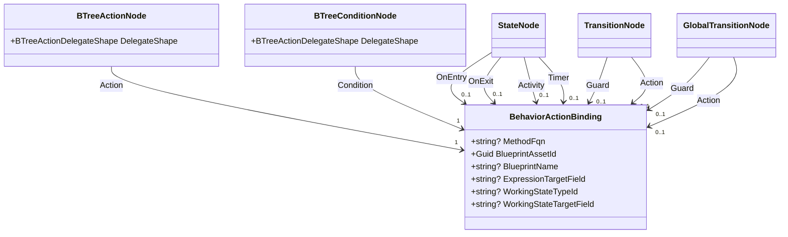
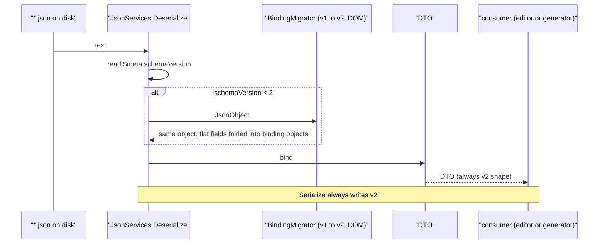
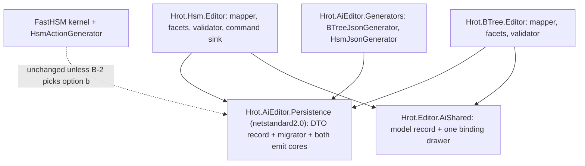

<!--STATUS
state: LIVE
updated: 2026-10-01
build-state: DESIGN — B-1, B-3, B-4, B-5 approved (user, 2026-10-01). B-2 approved then REVISED to (a′) after F7;
  awaiting the user on (a′) only. Slice 1's naming half (B-5) is independent and proceeds.
  Shape reduction (BTree's four call shapes) filed separately as CE-504, after this. ⛔ Nothing in the file format moves until then.
current-answer: §4 (the five decisions, each with a lean). §2 is why Q75-B needs them: four of its premises moved
  since it was approved on 2026-09-28.
stale-below: nothing yet.
known-rot: none.
known-conflict: Architect_Question_75 §4-B / §5 S5 — its "per-slot ExpressionTargetField" gain and its "six sites"
  count are both refined here (§2 F1, F3). This document is its build design and wins on those two points.
related-designs:
  - Architect_Question_75_One_Params_Pipeline_And_One_Action_Binding.md — owns decision B (one carrier, approved
    2026-09-28) and §5.1b (DelegateShape stays BTree-side). This document only BUILDS B.
  - DESIGN_Parameter_Model.md — §P.3 owns what an action binding MEANS (no copy, no resolver, reads its host
    variable live). Every field kept here serves §P.3; nothing here adds a resolver.
  - DESIGN_Occurrence_Scoped_Storage.md — §28.6 owns HsmParamBindings and the (machine, state, site) seed key
    that B-2 has to widen or replace.
  - DESIGN_Hsm_Blueprint_Behaviour_Authoring.md — owns the HSM authoring surface (§3.2 blueprint-by-Guid, §3.4
    the state binding, §3.5 compose). The facets and drawers this changes are its.
  - BTree_AiActionParameterBinding_Detailed_Design.md — owns how a BTree action binds its host variable
    (the `Fqn@offset` compound key).
-->

# CE-417 — one `BehaviorActionBinding` for BTree actions/conditions and HSM activities/guards

📄 Tracker: [`CE-417`](Blueprint_Issues_Tracker.md) · decision basis: [`Q75` §4-B, §5.1b](Architect_Question_75_One_Params_Pipeline_And_One_Action_Binding.md)

## 1. INVENTORY *(measured 2026-10-01, codebase-memory CLI + grep)*

| query | total | result |
|---|---|---|
| `search_graph name_pattern=.*ActionPayload.* label=Class` | 3 | `BTreeActionPayload` (in 41) · `BTreeActionPayloadDto` (in 24) · *(unrelated `AbortTransactionPayload`)* |
| `search_graph name_pattern=.*ConditionPayload.* label=Class` | 2 | `BTreeConditionPayload` (in 11) · `BTreeConditionPayloadDto` (in 7) |
| `search_graph name_pattern=.*ActionBinding.* label=Class` | 0 | ⇒ no existing carrier to reuse |
| `search_graph name_pattern=^(StateNode\|TransitionNode\|GlobalTransitionNode)(Dto)?$` | 5 | model `StateNode` (257) · `GlobalTransitionNode` (42) · DTOs `StateNodeDto` (23) · `GlobalTransitionNodeDto` (4) · *(+ FastHSM's own `StateNode`, unrelated)* |
| `search_graph .*(Migrat\|Upgrad\|FormatVersion).*` in `Hrot/Subsystems/AI/**` | 1 class | only a test class — ⇒ **no migrator exists**; both formats stamp `$meta.schemaVersion = 1` (`BTreeJsonServices.cs:25`, `HsmJsonServices.cs:20`) |
| grep `BTreeJsonServices.Deserialize\|HsmJsonServices.Deserialize` (production) | 7 | editor contributors ×2, new-asset services ×2, both generators, `GeneratedBehaviorSchemaCatalog` ⇒ **one read chokepoint per format** |
| `git ls-files *.btree.json / *.hsm.json` | 24 / 7 | the corpus a migration rewrites |

⚠ `check_index_coverage` is not reachable through the CLI this session, so the counts above are not proven exhaustive.

## 2. What moved since Q75-B was approved — the claim table

| claim | code — how it IS | design basis |
|---|---|---|
| **F1** a state's four action slots share ONE `ExpressionTargetField`, used as the **state-wide seed base** (`HsmParamBindings` site `Guid.Empty`) | ✅ `HsmBridgeEmitCore.cs:304-311`; kernel stamps `(region, state)` only, no slot kind (`HsmKernelCore.cs:348,580,842,889`) | ✅ `HsmAssetDto.cs:62-82` *("four fields would offer a distinction the storage model cannot express")*; `DESIGN_Occurrence_Scoped_Storage` §28.6 |
| **F2** a transition's ONE `ExpressionTargetField` does **double duty**: the C# `ActionFunction`'s address (`Fqn@offset`, E7b) **and** the guard blueprint's seed (CE-413) | ✅ `HsmEmitCore.cs:610,951`; `HsmBridgeEmitCore.cs:326-331` | ⛔ searched `docs/` + `.dev/`: no record that the two were meant to share it |
| **F3** there are **eight** binding sites, not six — `GlobalTransitionNodeDto` carries its own guard + action + ETF | ✅ `HsmAssetDto.cs:244-255` | ⛔ Q75 §2.3 counts six |
| **F4** ⚠ **latent defect**: a transition's `[SharedAiAction]` thunk is stamped with its SOURCE state (`HsmKernelCore.cs:857`) and adds `SeedParamsOffset(source state)` to its own field offset (`HsmActionGenerator.cs:620-621`) ⇒ if the source state is ALSO bound, the action reads the wrong bytes | ✅ read from code; ⛔ **no rail yet** — slice 1 writes it red first. Corpus does not hit it (no bound source state has a C# transition action) | ⛔ none — two models (compose base vs flat field) meet here unplanned |
| **F5** the two hosts name a blueprint target differently: BTree by **generated `TickCore` FQN** (`BTreeComposedBlueprintReferenceContributor`), HSM by **asset Guid + name** (`HsmAssetDto.cs:125-143`, Q36-B) | ✅ | ✅ HSM: `DESIGN_Hsm_Blueprint_Behaviour_Authoring` §3.2 *(Guid, because no authorable string reaches the thunk id)* |
| **F6** BTree `DelegateShape` value 2 is still unnamed in the model enum | ✅ `BehaviorTreeAsset.cs:21-23` | ✅ Q75 §5.1b *("S5 must first NAME value 2")* |
| **F7** 🔴 *(found 2026-10-01 AFTER B-2 was approved — it falsifies B-2's "already built for E7b")* the two hosts emit a C# action's thunk in different places. **BTree:** the ASSET's generator emits one thunk **per binding**, with the host offset baked from the asset's own packer (`BTreeBridgeEmitCore.cs:490-525`). **HSM:** `HsmActionGenerator` emits one thunk **per method**, with the offset of the field named in `[SharedAiAction(typeof(Dto), "field")]` (`HsmActionGenerator.cs:228,256`). ⇒ the HSM key `Fqn@hostOffset` (`HsmEmitCore.cs:951`) finds a thunk **only when the host's packed offset happens to equal the attribute DTO's field offset** | ✅ read from both generators | ⛔ searched: no design states that coincidence as a rule |
| **F8** BTree has the SAME per-method `[SharedAiAction]` path and the same offset coincidence: `BTreeActionGenerator` registers `Fqn@attrOffset` (`BTreeActionGenerator.cs:311,567-584`); a BTree asset's `ThreeParamReusable` binding registers `Fqn@hostOffset` with the BTree delegate signature (`BTreeBridgeEmitCore.cs:513-521`), which a `(ref Field, Entity, EntityRepository)` method does not match. ⇒ a `[SharedAiAction]` method bound in a BTree asset is unusable today; the registry is last-writer-wins (`ActionRegistry.cs:41`) | ✅ read from code; ⛔ not compiled — no corpus `.btree.json` binds a `[SharedAiAction]` method (grep, 0 of 24) | ⛔ searched: none |
| **F9** 🔴 the occurrence-key hash ALLOCATES on every call: `OccurrenceSlotKey.Compute` folds `Guid.ToByteArray()` and `Encoding.UTF8.GetBytes(variableId)` (`OccurrenceSlotKey.cs:85-91`). It is reached per tick per entity by every root access (`RootHsmAccess.KeyFor`, `RootStateAccess`, `RootParamsAccess.KeyFor` → `BrainTickSystem.cs:270,292,525`), by blueprint HSM activities/guards (`HsmOccurrence.KeyFor`, emitted at `AiPrimitiveEmitter.cs:548`) and by curated C# HSM actions (plus a string concat, `OccurrenceSlotKey.cs:307`). ⇒ the WHOLE brain tick allocates, BTree and HSM alike — wider than B-2 | ✅ read from code; ⛔ allocation not yet measured by a test | ⛔ searched: no design rules on hot-path allocation; user ruling 2026-10-01: *"there should be no allocation on the hot path"* |

## 3. The target

> **Caption.** One record, eight sites, two hosts. `DelegateShape` stays on the BTree node (Q75 §5.1b). What the
> picture shows that prose hid: a transition gets **two** bindings, so F2's double duty disappears by construction.
> The same record exists twice — editor model (`Hrot.Editor.AiShared`) and DTO (`Hrot.AiEditor.Persistence`) —
> because the persistence assembly is netstandard2.0 and references no editor type; the mapper is the seam.

> **Caption.** The migrator sits **inside** the single read chokepoint (§1: seven production readers, all through
> `Deserialize`), so neither the editor nor either generator can see a v1 shape. Shown because the alternative —
> a separate tool — leaves every unmigrated file unreadable by the generator.

> **Caption.** Who changes. The kernel edge is dashed: only B-2's rejected option would reach it.

## 4. Decisions — each with a lean

| | decision | ⚖️ lean | rejected (one line each) |
|---|---|---|---|
| **B-1** | **what names a blueprint target** (F5) | ✅ **APPROVED IN FULL by the user `2026-10-01`: both hosts resolve a blueprint by `BlueprintAssetId` (+`BlueprintName` to heal a rename); for a blueprint binding `MethodFqn` is DERIVED by the emitter from the blueprint catalog, never persisted.** BTree's generator already loads that catalog (`GeneratedBlueprintSchemaCatalog`). The 24 `.btree.json` files are rewritten where the catalog is reachable, because the generated FQN's hash cannot be inverted | *store both, BTree keeps resolving by FQN* — one record, two meanings for one field (my first lean, withdrawn) |
| **B-2** | **what a binding's `ExpressionTargetField` addresses** (F1, F2, F4, F7) | ⚠ **APPROVED as (a) on 2026-10-01, then REVISED the same day — F7 showed (a)'s mechanism was not built; re-asked.** **(a′) every binding's ETF is its own full address, and the HSM asset's generator emits a per-binding C# thunk exactly as BTree's does** (host offset baked from the asset's packer, projected as the method's `ref` parameter type, registered under `Fqn@hostOffset`; occurrence keyed by that compound). No state-wide base for any C# action ⇒ F4 goes away. ⛔ `HsmActionGenerator`'s per-method `[SharedAiAction]` thunks are then RETIRED (one implementation; they would otherwise register under the same id when offsets coincide) — rail ㊳ (`HsmOccurrenceKeyTests.O7_R38`) is re-homed onto a per-binding thunk. The `[SharedAiAction]` attribute's DTO stops deciding WHERE the field is — only its type must match the bound variable (a validator check, as BTree has). The blueprint activity/guard keep their `(state, childAsset)` site. Migration as before: the state's ETF → its Activity binding + every outgoing guard-blueprint binding with no ETF of its own; the transition's ETF → each of guard/action that is set. Corpus: 3 bound states, 1 bound transition, 1 bound C# action | **(a)** compile-time `Fqn@offset` alone — works only when offsets coincide (F7) · **(b)** widen the runtime site key to `(childAssetId, slotKind)` — needs a FastHSM stamp of the slot kind · **(c)** keep one ETF per state — leaves F2 and F4 |
| **B-3** | **global transitions** (F3) | ✅ **APPROVED.** **in** — eight sites. Same two bindings as a transition; their guard still reads the ACTIVE state's site (§28.6c), unchanged | *leave them flat* — a ninth spelling of the concept survives the unification |
| **B-4** | **how files migrate** | ✅ **APPROVED.** **schemaVersion 2 + an in-`Deserialize` DOM upgrade**, plus a one-time rewrite of the 31 corpus files so the tree is v2 and the goldens show the move once | *a separate migration tool* — unmigrated files stop compiling · *STJ setter shims on the DTO* — legacy names live forever on the public DTO |
| **B-5** | **`DelegateShape`** | ✅ **APPROVED.** **BTree-only, value 2 named `ThreeParamReusableStateful` in the model enum first** (Q75 §5.1b, F6) | *a host-neutral shape enum* — two vocabularies under one name (Q75 §5.1b) |

## 5. Slices *(one commit each, green at each)*

| # | slice | moves |
|---|---|---|
| 1 | F4 rail (red), name value 2 (B-5) | nothing on disk |
| 2 | DTO record + migrator + schemaVersion 2 + migrator round-trip rail over all 31 files | DTO, both `JsonServices`; no emit change |
| 3 | both emit cores read the carrier; B-2 (a′): the HSM asset generator emits per-binding C# thunks like BTree's; F4 rail green | goldens, whole HSM corpus + BTree corpus |
| 4 | editor model record, both mappers, facets, one shared drawer, validators | editor rails |
| 4b | BTree emitter resolves a blueprint binding by asset id through the catalog (B-1); FQN derived | BTree goldens unchanged by construction |
| 5 | rewrite the 31 corpus files to v2; delete the four payload classes and the flat HSM fields | corpus |

## 6. Rails owed

| rail | |
|---|---|
| **one carrier** | no type but `BehaviorActionBinding` carries a `MethodFqn` + `ExpressionTargetField` pair (Q75 §6) |
| **migrator round-trips** | every shipped v1 file migrates, re-serialises canonically, and emits byte-identical source to v1 (before slice 3) |
| **F4** | a bound source state + a bound C# transition action read the action's own variable |
| **transition split** | a transition with both a guard blueprint and a C# action bound to different variables seeds each from its own |
