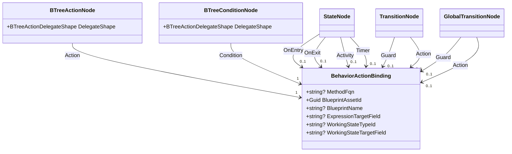
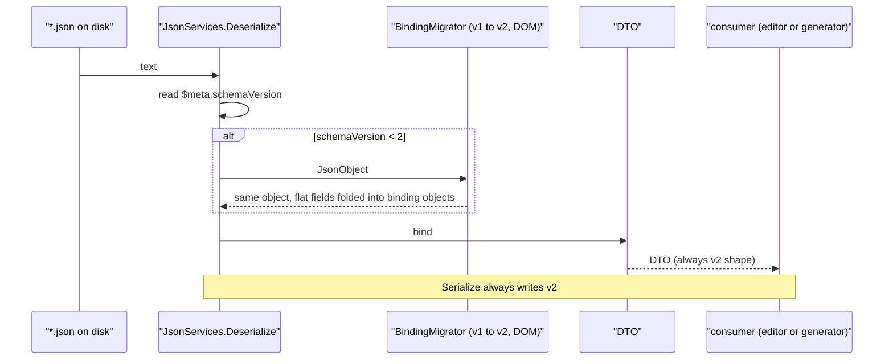
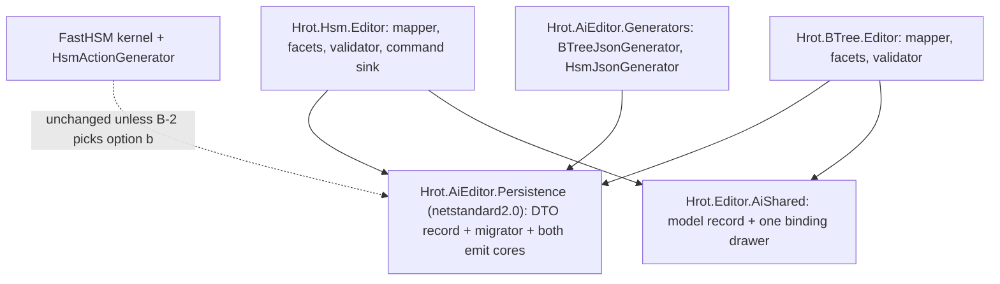
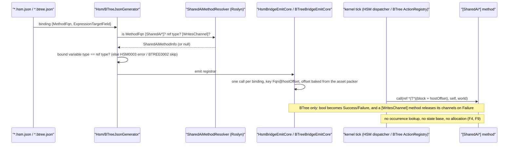
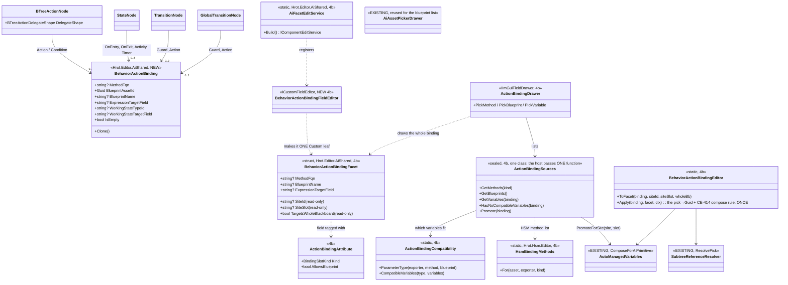
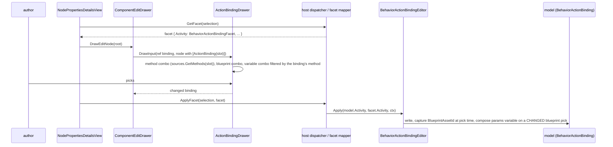
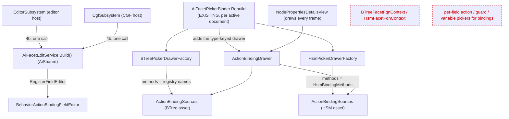
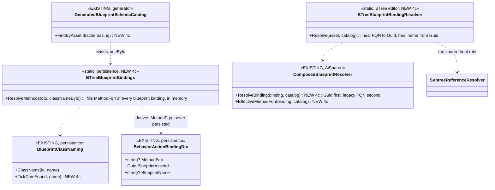
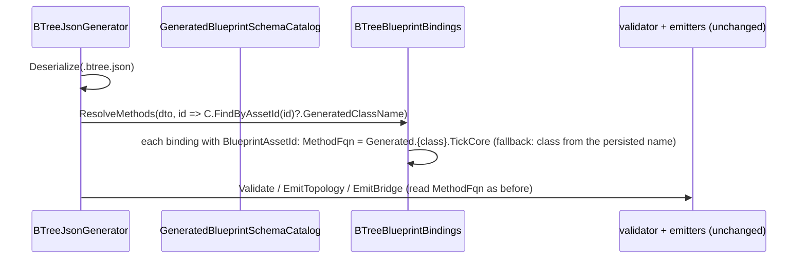
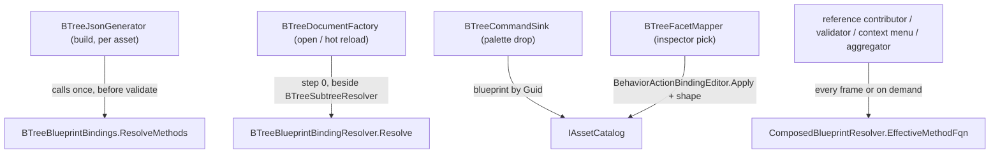

<!--STATUS
state: LIVE
updated: 2026-10-01
build-state: BUILT — slices 1…5 shipped 2026-10-01 (§5 slice table; as-built boxes per slice). B-1 … B-5 approved (user, 2026-10-01). B-2 = (a′), its tradeoffs accepted by the user after
  F7/F8/F9 were measured; it covers BOTH hosts (F8). The hot-path allocation half (F9) shipped separately as CE-505.
current-answer: §4 (the five decisions, each with a lean). §2 is why Q75-B needs them: four of its premises moved
  since it was approved on 2026-09-28.
stale-below: nothing yet.
known-rot: none.
known-conflict: Architect_Question_75 §4-B / §5 S5 — its "per-slot ExpressionTargetField" gain and its "six sites"
  count are both refined here (§2 F1, F3). This document is its build design and wins on those two points.
related-designs:
  - Architect_Question_75_One_Params_Pipeline_And_One_Action_Binding.md — owns decision B (one carrier, approved
    2026-09-28) and §5.1b (DelegateShape stays BTree-side). This document only BUILDS B.
  - DESIGN_Parameter_Model.md — §P.3 owns what an action binding MEANS (no copy, no resolver, reads its host
    variable live). Every field kept here serves §P.3; nothing here adds a resolver.
  - DESIGN_Occurrence_Scoped_Storage.md — §28.6 owns HsmParamBindings and the (machine, state, site) seed key
    that B-2 has to widen or replace.
  - DESIGN_Hsm_Blueprint_Behaviour_Authoring.md — owns the HSM authoring surface (§3.2 blueprint-by-Guid, §3.4
    the state binding, §3.5 compose). The facets and drawers this changes are its.
  - BTree_AiActionParameterBinding_Detailed_Design.md — owns how a BTree action binds its host variable
    (the `Fqn@offset` compound key).
-->

# CE-417 — one `BehaviorActionBinding` for BTree actions/conditions and HSM activities/guards

📄 Tracker: [`CE-417`](Blueprint_Issues_Tracker.md) · decision basis: [`Q75` §4-B, §5.1b](Architect_Question_75_One_Params_Pipeline_And_One_Action_Binding.md)

## 1. INVENTORY *(measured 2026-10-01, codebase-memory CLI + grep)*

| query | total | result |
|---|---|---|
| `search_graph name_pattern=.*ActionPayload.* label=Class` | 3 | `BTreeActionPayload` (in 41) · `BTreeActionPayloadDto` (in 24) · *(unrelated `AbortTransactionPayload`)* |
| `search_graph name_pattern=.*ConditionPayload.* label=Class` | 2 | `BTreeConditionPayload` (in 11) · `BTreeConditionPayloadDto` (in 7) |
| `search_graph name_pattern=.*ActionBinding.* label=Class` | 0 | ⇒ no existing carrier to reuse |
| `search_graph name_pattern=^(StateNode\|TransitionNode\|GlobalTransitionNode)(Dto)?$` | 5 | model `StateNode` (257) · `GlobalTransitionNode` (42) · DTOs `StateNodeDto` (23) · `GlobalTransitionNodeDto` (4) · *(+ FastHSM's own `StateNode`, unrelated)* |
| `search_graph .*(Migrat\|Upgrad\|FormatVersion).*` in `Hrot/Subsystems/AI/**` | 1 class | only a test class — ⇒ **no migrator exists**; both formats stamp `$meta.schemaVersion = 1` (`BTreeJsonServices.cs:25`, `HsmJsonServices.cs:20`) |
| grep `BTreeJsonServices.Deserialize\|HsmJsonServices.Deserialize` (production) | 7 | editor contributors ×2, new-asset services ×2, both generators, `GeneratedBehaviorSchemaCatalog` ⇒ **one read chokepoint per format** |
| `git ls-files *.btree.json / *.hsm.json` | 24 / 7 | the corpus a migration rewrites |

⚠ `check_index_coverage` is not reachable through the CLI this session, so the counts above are not proven exhaustive.

## 2. What moved since Q75-B was approved — the claim table

| claim | code — how it IS | design basis |
|---|---|---|
| **F1** a state's four action slots share ONE `ExpressionTargetField`, used as the **state-wide seed base** (`HsmParamBindings` site `Guid.Empty`) | ✅ `HsmBridgeEmitCore.cs:304-311`; kernel stamps `(region, state)` only, no slot kind (`HsmKernelCore.cs:348,580,842,889`) | ✅ `HsmAssetDto.cs:62-82` *("four fields would offer a distinction the storage model cannot express")*; `DESIGN_Occurrence_Scoped_Storage` §28.6 |
| **F2** a transition's ONE `ExpressionTargetField` does **double duty**: the C# `ActionFunction`'s address (`Fqn@offset`, E7b) **and** the guard blueprint's seed (CE-413) | ✅ `HsmEmitCore.cs:610,951`; `HsmBridgeEmitCore.cs:326-331` | ⛔ searched `docs/` + `.dev/`: no record that the two were meant to share it |
| **F3** there are **eight** binding sites, not six — `GlobalTransitionNodeDto` carries its own guard + action + ETF | ✅ `HsmAssetDto.cs:244-255` | ⛔ Q75 §2.3 counts six |
| **F4** ⚠ **latent defect**: a transition's `[SharedAiAction]` thunk is stamped with its SOURCE state (`HsmKernelCore.cs:857`) and adds `SeedParamsOffset(source state)` to its own field offset (`HsmActionGenerator.cs:620-621`) ⇒ if the source state is ALSO bound, the action reads the wrong bytes | ✅ read from code; ⛔ **no rail yet** — slice 1 writes it red first. Corpus does not hit it (no bound source state has a C# transition action) | ⛔ none — two models (compose base vs flat field) meet here unplanned |
| **F5** the two hosts name a blueprint target differently: BTree by **generated `TickCore` FQN** (`BTreeComposedBlueprintReferenceContributor`), HSM by **asset Guid + name** (`HsmAssetDto.cs:125-143`, Q36-B) | ✅ | ✅ HSM: `DESIGN_Hsm_Blueprint_Behaviour_Authoring` §3.2 *(Guid, because no authorable string reaches the thunk id)* |
| **F6** BTree `DelegateShape` value 2 is still unnamed in the model enum | ✅ `BehaviorTreeAsset.cs:21-23` | ✅ Q75 §5.1b *("S5 must first NAME value 2")* |
| **F7** 🔴 *(found 2026-10-01 AFTER B-2 was approved — it falsifies B-2's "already built for E7b")* the two hosts emit a C# action's thunk in different places. **BTree:** the ASSET's generator emits one thunk **per binding**, with the host offset baked from the asset's own packer (`BTreeBridgeEmitCore.cs:490-525`). **HSM:** `HsmActionGenerator` emits one thunk **per method**, with the offset of the field named in `[SharedAiAction(typeof(Dto), "field")]` (`HsmActionGenerator.cs:228,256`). ⇒ the HSM key `Fqn@hostOffset` (`HsmEmitCore.cs:951`) finds a thunk **only when the host's packed offset happens to equal the attribute DTO's field offset** | ✅ read from both generators | ⛔ searched: no design states that coincidence as a rule |
| **F8** BTree has the SAME per-method `[SharedAiAction]` path and the same offset coincidence: `BTreeActionGenerator` registers `Fqn@attrOffset` (`BTreeActionGenerator.cs:311,567-584`); a BTree asset's `ThreeParamReusable` binding registers `Fqn@hostOffset` with the BTree delegate signature (`BTreeBridgeEmitCore.cs:513-521`), which a `(ref Field, Entity, EntityRepository)` method does not match. ⇒ a `[SharedAiAction]` method bound in a BTree asset is unusable today; the registry is last-writer-wins (`ActionRegistry.cs:41`) | ✅ read from code; ⛔ not compiled — no corpus `.btree.json` binds a `[SharedAiAction]` method (grep, 0 of 24) | ⛔ searched: none |
| **F9** 🔴 the occurrence-key hash ALLOCATES on every call: `OccurrenceSlotKey.Compute` folds `Guid.ToByteArray()` and `Encoding.UTF8.GetBytes(variableId)` (`OccurrenceSlotKey.cs:85-91`). It is reached per tick per entity by every root access (`RootHsmAccess.KeyFor`, `RootStateAccess`, `RootParamsAccess.KeyFor` → `BrainTickSystem.cs:270,292,525`), by blueprint HSM activities/guards (`HsmOccurrence.KeyFor`, emitted at `AiPrimitiveEmitter.cs:548`) and by curated C# HSM actions (plus a string concat, `OccurrenceSlotKey.cs:307`). ⇒ the WHOLE brain tick allocates, BTree and HSM alike — wider than B-2 | ✅ read from code; ⛔ allocation not yet measured by a test | ✅ **FIXED by `CE-505` (`6b7599b0d`, `c14024fb6`)** — in-place folds, keys byte-identical (400-input oracle rail); a steady-state HSM brain tick allocates 0 bytes (red-proved). ⛔ searched: no design rules on hot-path allocation; user ruling 2026-10-01: *"there should be no allocation on the hot path"* |

## 3. The target

> **Caption.** One record, eight sites, two hosts. `DelegateShape` stays on the BTree node (Q75 §5.1b). What the
> picture shows that prose hid: a transition gets **two** bindings, so F2's double duty disappears by construction.
> The same record exists twice — editor model (`Hrot.Editor.AiShared`) and DTO (`Hrot.AiEditor.Persistence`) —
> because the persistence assembly is netstandard2.0 and references no editor type; the mapper is the seam.

> **Caption.** The migrator sits **inside** the single read chokepoint (§1: seven production readers, all through
> `Deserialize`), so neither the editor nor either generator can see a v1 shape. Shown because the alternative —
> a separate tool — leaves every unmigrated file unreadable by the generator.

> **Caption.** Who changes. The kernel edge is dashed: only B-2's rejected option would reach it.

> **Caption.** B-2 (a′) as built, both hosts (slices 3a, 3b). What the picture shows that prose hid: the ONLY place a
> binding becomes an address is the asset's emitter. The per-METHOD paths it replaced (`HsmActionGenerator`,
> `BTreeActionGenerator` `[SharedAi*]` expansion) took the address from the ATTRIBUTE DTO instead, which is F7/F8.

## 4. Decisions — each with a lean

| | decision | ⚖️ lean | rejected (one line each) |
|---|---|---|---|
| **B-1** | **what names a blueprint target** (F5) | ✅ **APPROVED IN FULL by the user `2026-10-01`: both hosts resolve a blueprint by `BlueprintAssetId` (+`BlueprintName` to heal a rename); for a blueprint binding `MethodFqn` is DERIVED by the emitter from the blueprint catalog, never persisted.** BTree's generator already loads that catalog (`GeneratedBlueprintSchemaCatalog`). The 24 `.btree.json` files are rewritten where the catalog is reachable, because the generated FQN's hash cannot be inverted | *store both, BTree keeps resolving by FQN* — one record, two meanings for one field (my first lean, withdrawn) |
| **B-2** | **what a binding's `ExpressionTargetField` addresses** (F1, F2, F4, F7) | ✅ **APPROVED as (a′) on 2026-10-01** (first approved as (a); F7 showed (a)'s mechanism was not built; (a′)'s tradeoffs were then measured and accepted). ⭐ **Both hosts** (F8): BTree's per-method `[SharedAiAction]` path is retired the same way. **(a′) every binding's ETF is its own full address, and the HSM asset's generator emits a per-binding C# thunk exactly as BTree's does** (host offset baked from the asset's packer, projected as the method's `ref` parameter type, registered under `Fqn@hostOffset`; occurrence keyed by that compound). No state-wide base for any C# action ⇒ F4 goes away. ⛔ `HsmActionGenerator`'s per-method `[SharedAiAction]` thunks are then RETIRED (one implementation; they would otherwise register under the same id when offsets coincide) — rail ㊳ (`HsmOccurrenceKeyTests.O7_R38`) is re-homed onto a per-binding thunk. The `[SharedAiAction]` attribute's DTO stops deciding WHERE the field is — only its type must match the bound variable (a validator check, as BTree has). The blueprint activity/guard keep their `(state, childAsset)` site. Migration: ⛔ *SUPERSEDED by the slice-2 as-built box in §5* (the guard-inheritance rule was replaced). Corpus: 3 bound states, 1 bound transition, 1 bound C# action | **(a)** compile-time `Fqn@offset` alone — works only when offsets coincide (F7) · **(b)** widen the runtime site key to `(childAssetId, slotKind)` — needs a FastHSM stamp of the slot kind · **(c)** keep one ETF per state — leaves F2 and F4 |
| **B-3** | **global transitions** (F3) | ✅ **APPROVED.** **in** — eight sites. Same two bindings as a transition; their guard still reads the ACTIVE state's site (§28.6c), unchanged | *leave them flat* — a ninth spelling of the concept survives the unification |
| **B-4** | **how files migrate** | ✅ **APPROVED.** **schemaVersion 2 + an in-`Deserialize` DOM upgrade**, plus a one-time rewrite of the 31 corpus files so the tree is v2 and the goldens show the move once | *a separate migration tool* — unmigrated files stop compiling · *STJ setter shims on the DTO* — legacy names live forever on the public DTO |
| **B-5** | **`DelegateShape`** | ✅ **APPROVED.** **BTree-only, value 2 named `ThreeParamReusableStateful` in the model enum first** (Q75 §5.1b, F6) | *a host-neutral shape enum* — two vocabularies under one name (Q75 §5.1b) |

## 5. Slices *(one commit each, green at each)*

| # | slice | moves |
|---|---|---|
| 1 | ✅ name value 2 (B-5, `c20dace71`). ⏳ the F4 rail moves to slice 3 — its expected value is defined by B-2 (a′) | nothing on disk |
| 2 | ✅ **AS-BUILT** *(see the box below)*: DTO record at all 8 sites + `ActionBindingMigrator` inside both `Deserialize` + schemaVersion 2 + **all 31 corpus files rewritten to v2** + the four payload DTO classes and the flat HSM DTO fields deleted; both emit cores, both mappers, the generator validator read the record | ⭐ **emitted source byte-identical** (every emitted-source golden unchanged); only the two persistence-shape snapshots moved |
| 3a | ✅ HSM: B-2 (a′) per-binding C# calls, per-method `[SharedAi*]` thunks retired, F4 rail (see box) | HSM goldens (+`HsmCuratedBindingDemo`) |
| 3b | ✅ BTree: the same for a `[SharedAi*]` method bound in a BTree asset (F8); `BTreeActionGenerator`'s per-method `[SharedAi*]` adapters retired (see box) | BTree goldens (+`BTreeCuratedBindingDemo`) |
| 4 | ✅ editor side — designed in §5.4. ✅ 4a (model, no visible change) · ✅ 4b (one facet, one drawer, one applier); as-built boxes in §5.4 | editor rails |
| 4c | ✅ §5.5 (as-built box) — BTree emitter resolves a blueprint binding by asset id through the catalog (B-1); FQN derived; corpus heal FQN→Guid. ⚠ *Was numbered "4b" until `2026-10-01`; renamed when slice 4 split into 4a/4b (§5.4)* | BTree goldens unchanged by construction |
| 5 | ✅ cleanup (box below): the two §6 rails still owed (one carrier, transition split); `StateNode.StateWideTargetField` read-only; the HSM generated-source golden checks its baselined set | no golden moved |

> ⭐⭐ **Slice 2 AS-BUILT (`2026-10-01`) — where it deviated from the plan above, and why.**
> | | |
> |---|---|
> | **corpus rewrite pulled into slice 2** | the canonical-JSON goldens and `MigrationEquivalenceTests` compare the on-disk file with `Serialize(Deserialize(file))`, so a v1 corpus cannot be green under a v2 writer. ⭐ Rewritten with the editor's own writer (`Serialize` + `JsonAestheticFormatter`); 7 hand-compacted files were normalised to that writer's layout as a side effect |
> | ⛔ **B-2's migration rule was CORRECTED** | the plan said *"state field → Activity + outgoing blueprint guards without their own"*. 📐 `HsmStateParamSeedAuthoringTests` (CE-401) caught the loss: a field bound **before any action is chosen** has no Activity and no guard to land on. ⭐ **As built:** v1's ONE state field was shared by all four slots, so it goes to **every slot binding that is set**; a state with **no** slot keeps it on an **Activity binding that names nothing** (`BehaviorActionBindingDto.IsEmpty`). ⇒ the state-wide seed entry the emitter derives (`HsmBridgeEmitCore.StateWideField`) is exactly v1's, and the guard-inheritance rule became unnecessary — **deleted** |
> | **editor model still flat** | the HSM/BTree editor models keep their flat fields until slice 4; `HsmAssetMapper` / `BehaviorTreeAssetMapper` translate flat ↔ record. ⚠ Until slice 4 a transition whose guard and action are bound to DIFFERENT fields round-trips through the editor as one field (the model can hold only one) — no corpus asset has that shape |
> | **rails** | `ActionBindingMigrationTests` (13): 8 REAL pre-migration files (`Snapshots/MigrationV1/*.v1.json`) load into the same DTO as their v2 corpus file, plus one rail per migration rule. Suites: Persistence 148/0 · Generators 306/0 · BTree.Editor 639/0 · Hsm.Editor 623/0 |

> ⭐⭐ **Slice 3a AS-BUILT (`2026-10-01`) — the HSM half of B-2 (a′).**
> | | |
> |---|---|
> | **built** | `SharedAiBindings` + `BindingNamer` (persistence): every bound C# `[SharedAi*]` binding (all 8 slot kinds) is addressed `Fqn@hostOffset` and gets ONE generated call in the asset's registrar — offset baked, projected as the method's `ref` type, no occurrence, no state base. `SharedAiMethodResolver` (generators) answers "is it `[SharedAi*]`, what does it take" from Roslyn; a variable of the wrong type is **`HSM0003`**, an error. `HsmActionGenerator` no longer emits per-METHOD `[SharedAi*]` thunks (exit cleanups kept) |
> | **F4 fixed + red-proved** | `BrainTickSystemHsmArmTests.CE417_R2` on the new corpus asset **`HsmCuratedBindingDemo`** (two regions + a bound transition action; variables ordered so the old key would have resolved): putting the old `+ SeedParamsOffset` back makes all three CE-417 rails fail |
> | **F7 in the corpus, corrected** | 📐 `HsmVariableShowcase` bound `AlertNearbyUnits` (`ref DemoSharedActionParams`, 12 B) to `Threshold` (`float`, 4 B), and `AlertNearbyUnits` had **no registered thunk at all** (it lives in `Fdp.Toolkits`, which runs no `HsmActionGenerator`). ⭐ Unbound there, with a comment; the correctly typed bound action lives in `HsmCuratedBindingDemo` |
> | **rails moved** | rail ㊳ (`O7_R38`) → `CE417_R1`; `HsmOccurrenceCollisionTests.TheGeneratedThunk_…_Yet` retired with its subject; `HsmActionIdAgreementTests` now also runs the HSM asset registrars (a third id producer); `HsmExpressionTargetTests.TheAssetsIdIsTheRegistrarsId_ForABoundAction` compares the asset's own topology and registrar |
> | **zero allocation** | `CE417_R3`: two per-binding C# activities, 50 ticks, 0 bytes |
> | ⚠ **not covered** | global transitions' guards/actions are **not emitted by `HsmEmitCore` at all** (pre-existing; recorded here, not widened into this slice). `HsmOccurrence.KeyForCurated` has no production caller now — kept for the stateful C# HSM action (working memory) the carrier enables |
> | **gates** | Generators 321/0 · Toolkits 2398/0 · Hsm.Editor 623/0 · Blueprints 4019/0 (9 known skips) · ClusterRunner HSM 2/0 · Editor 442/1 = the known GC-timing flake (`TwoReloadCycles_OldAlcIsCollected`) |

> ⭐⭐ **Slice 3b AS-BUILT (`2026-10-01`) — the BTree half of B-2 (a′) (F8).**
> | | |
> |---|---|
> | **built** | `BTreeBridgeEmitCore.EmitThreeParamCall`: a `ThreeParamReusable` binding whose method `SharedAiMethodResolver` says is `[SharedAi*]` is called with ITS signature `(ref T, Entity, EntityRepository)` at the host offset already projected (`bool` → Success/Failure). A `[WritesChannel]` method releases its channels on `Failure` through **`ChannelClearEmit`** — ONE emitter, a linked file in both `Fdp.Toolkits.Analyzers` (the analyzer's 4-param wrapper) and `Hrot.AiEditor.Persistence` (the `HsmActionKey` pattern). `SharedAiMethodInfo` gained `WritesChannels` |
> | **retired** | `BTreeActionGenerator`'s per-METHOD `[SharedAi*]` adapters (`EmitSharedAiAdapter`, `AssignSharedAiToGroups`, `GroupEntry.SharedAiEntries`, the conditional `unsafe` registrar). ⚠ The attribute is still **validated** there (`BHU001/002/003`) — now for every assembly with a `[SharedAi*]` method, not only one that also has a 4-param `[BTreeAction]` group |
> | ⭐ **deviation: no `BTREE0004`** | the plan named a new type-mismatch id. ⭐ BTree's existing convention for an unbindable leaf is a **`BTREE0002` skip** (`BTreeMethodCompatibilityValidator`), and the 3-param check already compared the bound variable's type with param 0 — so the `[SharedAi*]` branch joins that check. HSM keeps its **`HSM0003` error** (slice 3a). ⚠ The two hosts therefore differ in severity for the same mistake — a deliberate match to each host's prior convention, not an oversight |
> | **F8 fixed + red-proved** | new corpus asset **`BTreeCuratedBindingDemo`** binds the curated `Action_ReadRegionParams` to `varA` (8) and `varB` (16) under a forever repeater; `varC` (0) — the attribute DTO's offset — is bound by nothing. `BrainTickSystemBTreeArmTests.CE417_R4`: each binding counts only its own variable (12/12/0); projecting the call at offset 0 instead makes it fail. `CE417_R5`: 50 ticks, 0 bytes |
> | **rails moved** | `SharedAiAdapterCompilesTests` (`BP-306`, subject retired) → **`SharedAiBindingCompilesTests`**: a synthetic asset binding an action, a `bool` condition and a `[WritesChannel]` action compiles through BOTH generators, keyed at the host offset, with no analyzer adapter; a wrong-typed variable is a `BTREE0002` skip; the analyzer/bridge one-spelling projection rail is kept |
> | ⚠ **finding, not fixed** | `BrainTickSystemHsmArmTests.CE417_R3` (zero-alloc) reported **64 B once** in a filtered parallel group run; 5/5 green since (alone ×3, group ×2). Not reproduced, so no fix guessed — recorded here so a recurrence is recognised |

> ⭐⭐ **Slice 5 AS-BUILT (`2026-10-01`) — cleanup.**
> | | |
> |---|---|
> | **§6 rails, all four now exist** | **one carrier** — `ActionBindingTests.OneCarrier_OnlyTheBindingRecordCarriesAMethodAndATargetField` (reflection over the five assemblies that author, persist or emit a binding, each named by an anchor type so a dropped reference fails the compile; allowed: `BehaviorActionBinding`, `BehaviorActionBindingDto`, `BehaviorActionBindingFacet`). **transition split** — `HsmStateParamBindingEmissionTests.TransitionSplit_GuardBlueprintAndCSharpAction_EachUseTheirOwnVariable` (guard blueprint → `Beta` sited at `(source, guard asset)`, C# `[SharedAi*]` action → `Alpha` as `Fqn@0` in both the registrar and the blob; neither borrows the other's, no state-wide entry appears). **F4** — `CE417_R2` (slice 3a). **migrator round-trips** — `ActionBindingMigrationTests` (slice 2) |
> | **retired** | the `StateNode.StateWideTargetField` setter — the v1 "one field to every slot" write path; after 4b only tests wrote it. The getter (the seed, derived exactly as `HsmBridgeEmitCore.StateWideField`) stays. Tests now author the seed on a slot binding |
> | **golden** | `GeneratedEmitGoldenTests.TheGeneratedRegistrarIsUnchanged` now requires produced hints == baselined hints, like the BTree tier since 4c. ⚠ Measured: with ONE baseline its `NotEmpty` already covered a vanished part, so it was not blind *today*; it would have been at the second baseline |
> | ⚠ **found, filed, not fixed: `CE-506`** | a **global** transition's guard and action are authorable (`GlobalTransitionFacet`, 4b) but **dropped at emit**: `HsmEmitCore` emits `builder.GlobalTransition(event, target, visualId)` and `HsmBuilder.GlobalTransition` has no guard/action/priority parameter, although the kernel's `GlobalTransitionDef` carries `GuardId`/`ActionId`/`Priority`. Pre-existing (the 3a box's *"not covered"* row); it is a FastHSM builder + emitter change, not binding cleanup |
> | **kept on purpose** | `HsmOccurrence.KeyForCurated` (no production caller since 3a) — the 3a box keeps it for the stateful C# HSM action; `CE-504` (BTree call shapes) decides its fate |

## 5.4 Slice 4 — the editor side *(design, `2026-10-01`; build-state: BUILT — diagrams below are the AS-BUILT, see the 4b box for what moved)*

**INVENTORY** *(codebase-memory CLI `search_graph` + grep, measured `2026-10-01`)*

| query | total | result |
|---|---|---|
| `search_graph name_pattern=.*Drawer.* label=Class` | 68 (non-test AI rows below) | BTree: `BTreePickerDrawerFactory` · `BehaviorHashPickerDrawer` · `BlackboardFieldPickerDrawer` · `CompositeStringDrawer`. HSM: `HsmPickerDrawerFactory` · `HsmActionPickerDrawer` · `HsmGuardPickerDrawer` · `HsmBlackboardFieldPickerDrawer` · `HsmCompositeStringDrawer` (+ event/state/sync-group pickers, out of scope). Shared: `AiAssetPickerDrawer` only |
| `search_graph name_pattern=.*Facet.* label=Class` | 38 | `BTreeFacetMapper`, `BTreeFacetFqnContext`, `HsmFacetMapper`, `HsmFacetDispatcher` (+ facet structs in `BTreeFacets.cs` / `HsmFacets.cs`) |
| grep the flat HSM binding fields (`OnEntryAction` … `GuardBlueprintName`) in `Hrot.Hsm.Editor` | 13 prod files · 10 test files | model, mapper, projector, facets ×3, pickers, validator, aggregator, reference contributor, label renderer, lane-mask inferrer |
| grep `BTreeActionPayload\|BTreeConditionPayload` | 4 prod · 24 test files | model, projector, mapper, command sink |
| grep `RegisterFieldEditor` | 3 production hosts | precedent: `ReplayBrowserSubsystem.cs:913-915` registers `PredicateValueFieldEditor` for `SearchPredicateDto` — a whole DTO edited by one type-keyed drawer |
| grep `new ComponentEditServiceBuilder().Build()` for the FACET service | 2 | `EditorSubsystem.cs:3211`, `CgfSubsystem.cs:1499` — the same line, twice |

**Claim table** *(the facts the shape rests on)*

| claim | code — how it IS | design basis |
|---|---|---|
| a container field renders READ-ONLY in a facet | ✅ `ComponentEditDrawer.DrawContainerNode` draws `ToString()` disabled | ⛔ searched: none — it is why a nested struct alone is not enough |
| a type can be made ONE leaf with ONE drawer | ✅ `ICustomFieldEditor` → `EditNodeKind.Custom` → `DrawLeafNode` → `_customDrawers[ClrType]` (`ComponentEditDrawer.cs:376`) | ✅ precedent `ReplayBrowserSubsystem.cs:913-915` |
| a field drawer cannot see its siblings | ✅ `EditNode` has `Children`, no parent | — ⇒ today's `BTreeFacetFqnContext`/`HsmFacetFqnContext` side channels exist only to pass the sibling `MethodFqn` |
| the dispatcher applies the WHOLE facet | ✅ `HsmFacetDispatcher.ApplyFacet` | — ⇒ a nested binding needs no path plumbing |
| pick→Guid and the CE-414 compose are written once per slot | ✅ `HsmFacetDispatcher.cs` activity + guard arms | ✅ `DESIGN_Hsm_Blueprint_Behaviour_Authoring.md` §3.2, §11.1a; `DESIGN_Occurrence_Scoped_Storage.md` §28.6c |

> **Caption.** What the picture shows that prose hid: the side channels (`*FacetFqnContext`) existed only because a
> per-FIELD drawer cannot see the sibling `MethodFqn`. A drawer for the WHOLE binding receives the method, the
> blueprint and the variable together, so the variable list filters by the binding's own method and both
> side channels go. Every EXISTING box is reused, not rebuilt: the blueprint list, the pick→Guid rule, the compose.

> **Caption.** One drawer and one applier serve all eight sites on both hosts. The sequence is identical for a BTree
> action, an HSM activity and a global-transition guard — only the slot kind on the attribute differs.

> **Caption.** Who calls what each frame, and what dies. Both hosts reach the field editor through ONE builder
> (today they duplicate the line). Red dashed boxes are retired in 4b. The event, state and sync-group pickers are
> untouched.

**The split, and why.** 4a and 4b are two commits so each is green and bisectable:

| | 4a — model, no visible change | 4b — inspector |
|---|---|---|
| builds | `BehaviorActionBinding` in `Hrot.Editor.AiShared`; `BTreeActionPayload`/`BTreeConditionPayload` deleted (the node carries `DelegateShape` + a binding); `StateNode` / `TransitionNode` / `GlobalTransitionNode` carry bindings; both persistence mappers become straight copies; every model reader moves | the facet, the field editor, the drawer, the applier, the one builder; per-binding pickers and both `*FacetFqnContext` retired; validators read the binding |
| facets | keep their CURRENT shape; the flat↔record translation moves from the persistence mapper to the facet boundary (the slice-2 rule: one state field goes to every set slot) | one `BehaviorActionBindingFacet` per site ⇒ each slot edits its OWN target field (B-2) |
| proof | every existing editor rail green, no golden moves | new drawer/applier rails; HSM authoring rails re-homed |

> ⭐⭐ **Slice 4a AS-BUILT (`2026-10-01`) — the editor model is one record; nothing visible changed.**
> | | |
> |---|---|
> | **built** | `BehaviorActionBinding` (`Hrot.Editor.AiShared`) + `BehaviorActionBindingMapping` (ONE copy, both hosts' mappers). BTree: `BTreeActionPayload`/`BTreeConditionPayload` deleted, `BTreeEditorNode.DelegateShape` added; `ComposeAiPrimitiveAction`/`…Condition` merged into ONE `ComposeAiPrimitive` (they existed only because the two payload classes shared no base). HSM: `StateNode.OnEntry/OnExit/Activity/Timer`, `TransitionNode.Guard/Action`, `GlobalTransitionNode.Guard/Action`; every model reader moved (validator, reference contributor, aggregator, lane-mask inferrer, label renderer, projector, command sink, pickers) |
> | **the state seed** | `StateNode.StateWideTargetField` — DERIVED by `HsmBridgeEmitCore.StateWideField`'s rule (Activity, else OnEntry, OnExit, Timer), so the editor and the emitter cannot disagree; its setter is the v1 shape (every bound slot; else an Activity that names nothing) |
> | **writer rule kept exact** | a transition is bound to a variable when EITHER binding targets it, a WRITER only through the Action (its field is the output, the guard's the input it seeds from) — identical to before while 4a's facets keep one field per node |
> | ⭐ **deviation: two editor-only rules the plan did not name** | ① `BehaviorActionBinding.NamesNothing` — stricter than the DTO's `IsEmpty`: a blueprint picked with no catalogue keeps its NAME and an empty Guid (§7.1a ③ never-erase), and the editor must keep that pick; saving still drops a Guid-less name. 📐 Caught by `CE414_R1/R3/R4`, which reddened when the first cut used `IsEmpty`. ② a transition target field typed BEFORE any guard/action is held on an Action that names nothing (the state already had this, on Activity) — otherwise the next frame's facet commit lost it |
> | **the boundary translation** | `HsmFacetBindings` — the slice-2 flat↔record rules, now at the facet boundary only. ⛔ Retired by 4b |
> | **save output** | unchanged: BTree keeps writing a node's binding even when empty (`keepWhenEmpty`), HSM writes an unbound slot as absent — the two slice-2 mappers' rules |
> | **gates** | Hsm.Editor 623/0 · BTree.Editor 639/0 · Persistence 148/0 · AiShared 2101/0 (1 skip) · Generators 322/0 (no golden moved) · Blueprints 4011/0 (17 known skips) · Toolkits 2399/1 = `SquadInputsP3Tests.AllReaders_ZeroAlloc_After1MillionCalls`, an allocation-count test that passes 3/3 alone (4a touches nothing under `FDP/`) · Editor 442/1 = the known GC-timing flake (`TwoReloadCycles_OldAlcIsCollected`). Editor and CGF hosts build. ~40 test files migrated mechanically; every rewritten read is parenthesised (`(s.Activity?.BlueprintName).Should()`) so a missing binding fails the assertion instead of short-circuiting it |

> ⭐⭐ **Slice 4b AS-BUILT (`2026-10-01`) — one binding facet, one drawer, one applier, both hosts.**
> | | |
> |---|---|
> | **built** | `BehaviorActionBindingFacet` + `[ActionBinding(kind, allowsBlueprint)]` on every site's facet field (BTree `Action`/`Condition`; HSM state `OnEntry`/`OnExit`/`Activity`/`Timer`, transition `Guard`/`Action`, global transition `Guard`/`Action`). `BehaviorActionBindingFieldEditor` makes it one Custom leaf; `ActionBindingDrawer` draws method · blueprint (Activity and transition Guard only, design §9 ③: picking one clears the other) · the binding's OWN variable / "Promote" / the whole-blackboard note; `BehaviorActionBindingEditor.Apply` is the one applier (pick→Guid through `SubtreeReferenceResolver.ResolvePick`, never-erase, the `CE-414` compose on a CHANGED blueprint pick). `ActionBindingCompatibility` is the one variable rule (method `DtoType`, or a blueprint's generated `Params`) |
> | **retired** | `BTreeFacetFqnContext`, `HsmFacetFqnContext`, `BehaviorHashPickerDrawer`, `BlackboardFieldPickerDrawer`, `HsmActionPickerDrawer`, `HsmGuardPickerDrawer`, `HsmBlackboardFieldPickerDrawer` and their five attributes; `HsmFacetBindings` (4a's boundary translation); the HSM dispatcher's per-slot compose/pick code; the flat facet fields (`*Action`, `*Function`, `*BlueprintName`, the one state/transition `ExpressionTargetField`) |
> | ⭐ **deviation: no `IActionBindingSources` per host** | the hosts differ ONLY in which methods a slot offers, so `ActionBindingSources` is one concrete class and the host passes one function (BTree: the behavior registry; HSM: `HsmBindingMethods`, the `CE-386` union). An interface per host would have been two implementations of everything else |
> | ⭐ **deviation: `AiFacetEditService` lives in `Hrot.Editor.AiShared`**, not `AiComposition` | AiShared already reaches `StructEdit.Reflection` through `Fdp.Presentation`, so no new project reference was needed, and the AiShared tests (SE1) can render facets with the production service |
> | ⭐ **deviation: per-slot promote names** | B-2 gives a node several variables, so `AutoManagedVariables.PromoteForSite` gained a slot: a secondary binding promotes `_auto_{id}_{slot}` (`entry`/`exit`/`timer`/`guard`); the primary (BTree node, HSM Activity, transition Action) keeps `_auto_{id}`, so pre-4b variables still match. ⚠ Before 4b an HSM state could not promote at all (no site id reached the drawer) |
> | **state seed** | each slot authors its own variable; the state's seed is still DERIVED (`StateWideTargetField`, Activity first). A variable typed before any method is picked is kept on a binding that names nothing (CE-401). `EditorSubsystem.ResolveExpressionTargetField` reads a transition's Action variable, else its Guard's |
> | **rails** | `ActionBindingTests` (15: the compatibility rule, pick rules, field editor, pick→Guid, never-erase, compose only on a change, author-owned variables kept, keep/drop, working-state fields preserved); `SE1` (the binding is one Custom leaf with its slot; a plain builder leaves it a container; which HSM slots allow a blueprint); `HsmBindingVariableTests`/`BTreeBindingVariableTests` (the old picker claims through the production factories, plus a secondary-slot promote); both `BB1D` suites (a transition's guard and action filter separately; a second node's list does not depend on the first). 🔴 Red-proved by mutation: compose on every apply, never-erase removed, field editor unregistered, promote slot dropped — each reddens its rail |

**Rejected**
- *A nested struct with per-field attribute drawers*: a container renders read-only (`DrawContainerNode`), and a field drawer cannot see its sibling method.
- *Reuse the DTO record in the editor*: the design keeps one record per layer (§3 caption), and the persistence assembly is netstandard2.0.
- *One commit for 4*: a model refactor and a UI change landing together leaves nothing to bisect.

## 5.5 Slice 4c — a BTree blueprint binding is named by its asset id *(design, `2026-10-01`; build-state: BUILT — see the as-built box)*

**INVENTORY** *(grep — the codebase-memory MCP was not connected this session; its CLI was not re-run for this slice)*

| query | total | result |
|---|---|---|
| `.btree.json` with `AiPrimitiveTickCore` | 6 files | **3 bindings** name a GENERATED blueprint (`*_Bp.TickCore`): T32 → `EnumDemo` (`d06f6a14…`, class `235986DF`), T33 + T39 → `ParamDemo` (`…0000d0`, `CEFE162F`). The other 7 (`DemoAiPrimitiveNodes(B).TickCore`) are hand-written C# methods and stay methods |
| `MethodFqn` readers in BTree editor + hosts (non-test) | 6 files | reference contributor, context menu ("Open Blueprint"), validator (2 rules), aggregator, command sink (palette drop), projector (runtime blob — keeps FQN) |
| BTree DTO consumers in the generator | 1 entry | `BTreeJsonGenerator.GenerateOneAsset` — validator, topology emit, bridge emit, deactivator scan all read the deserialized DTO after one point |

**Claim table**

| claim | code — how it IS | design basis |
|---|---|---|
| sibling generators cannot see the blueprint's generated class; the BTree generator re-derives it from `.bp.json` | ✅ `GeneratedBlueprintSchemaCatalog.cs:10-36`; `GeneratedClassName` from `AssetId` | ✅ B-1 *("BTree's generator already loads that catalog")* |
| two blueprints may share a NAME | ✅ two `EnumDemo.bp.json` with different ids — `Assets/` (compiled, the one T32 binds) and a `Recipes/` copy | ✅ §11.1a / Q36-B — the Guid is the identity, the name heals |
| the HSM emitter already resolves a blueprint binding by Guid | ✅ `HsmValidator.cs:310,324`; CE-383 ids baked from `.bp.json` | ✅ `DESIGN_Hsm_Blueprint_Behaviour_Authoring.md` §3.2 |
| the BTree editor's identity for a composed node is the FQN, "never a persisted AssetId" | ✅ `BTreeValidator.cs:197-200` (AIE-053) | ⛔ **superseded by B-1** (user, `2026-10-01`) |

> **Caption.** One derivation point per side: the generator fills each blueprint binding's `MethodFqn` from the catalog
> BY ASSET ID before anything reads the DTO, so every emitter, validator and the golden output are unchanged by
> construction; the editor asks one resolver (Guid first) instead of parsing an FQN.

> **Caption.** Who calls what: the build resolves once per asset; the editor heals once per open; every editor
> reader goes through one resolver. Nothing at runtime changes — the blob carries the same method name.

**Decisions (made in-frame, logged)**

| | decision | rejected |
|---|---|---|
| ① | the generator derives the class from the catalog BY ID; the persisted name is only a fallback (a `.bp.json` missing from the build) | *derive from the persisted name* — a stale name compiles a wrong class name (CS0234 at best) |
| ② | the BTree inspector allows a blueprint on an action and a condition; a blueprint pick composes params AND working state (`ComposeForAiPrimitive` with both names, the palette-drop rule) and sets `DelegateShape = AiPrimitiveTickCore`; clearing it drops both editor-owned variables and returns the shape to `ThreeParamReusable` | *params only, as HSM* — a composed BTree node needs its working-state slot (E2) |
| ③ | an editor load heals a legacy generated FQN to Guid+name when the catalog resolves it, and heals a stale name from the Guid (`SubtreeReferenceResolver`, kind Blueprint) | *migrate only the corpus* — user files outside the repo would keep the FQN form for ever |

**Rejected:** *store both FQN and Guid* — B-1 (one field, two meanings). *A new `schemaVersion`* — the DTO already carries the fields since slice 2; only values move.

> ⭐⭐ **Slice 4c AS-BUILT (`2026-10-01`).**
> | | |
> |---|---|
> | **built** | as the three diagrams above: `BTreeBlueprintBindings.ResolveMethods` (persistence) called once by `BTreeJsonGenerator` after deserializing, with `GeneratedBlueprintSchemaCatalog.FindByAssetId`; `BlueprintClassNaming.TickCoreFqn`; `ComposedBlueprintResolver.ResolveBinding` / `EffectiveMethodFqn`; `BTreeBlueprintBindingResolver` in `BTreeDocumentFactory` step 0; the palette drop (`BTreeCommandSink`, now given the catalogue) and the inspector pick (`BTreeFacetMapper`, now given the exporter) both write id + name; the BTree action/condition slots allow a blueprint. Readers moved: reference contributor, context menu, validator (unbound-leaf rule accepts a blueprint; dangling rule resolves by id), aggregator |
> | **corpus** | T32, T33, T39 rewritten (3 bindings): `MethodFqn` → `BlueprintAssetId` + `BlueprintName`. ⭐ **Emitted source unchanged** — every emitted-source golden passed without regeneration; only `btree-persistence-shape.txt` moved (3 lines, +13 bytes each) |
> | ⭐ **deviation: the heal is id-first, not the subtree rule** | `SubtreeReferenceResolver.Resolve` prefers the NAME (§7.1a). B-1 says the id resolves; and `EnumDemo` exists twice, so name-first could rebind silently. The never-erase rule is kept |
> | **the build-side fallback** | when the `.bp.json` is not part of the build, the class comes from the persisted name (`BlueprintClassNaming`); a wrong name fails the C# compile, never silently. Neither id nor name ⇒ left unbound ⇒ the existing `BTREE0002` skip |
> | **rails** | `BTreeBlueprintBindingsTests` (5, persistence): the corpus class is the one always emitted; id beats a stale name; name fallback; methods untouched; unresolvable left alone. `BTreeBlueprintBindingByIdTests` (8, BTree editor): legacy FQN healed to id; hand-written AiPrimitive method kept; id-first with two same-named blueprints + rename heal; never-erase; derived method; validator by id; palette drop persists id; inspector pick composes params + working state and clearing restores the plain shape. 🔴 Red-proved by mutation: persisted name preferred over the catalogue id, name-first heal, shape not set, palette drop keeps the FQN — each reddens its rail; removing the generator call reddens `TheGeneratedBTreeSourcesAreUnchanged` — ⚠ **only after fixing that test** (next row) |
> | 🔴 **finding: the generated-source golden could not see a MISSING asset** | it compared only the parts a run produced, so an asset that stopped generating (here: T32/T33/T39 skipped as BTREE0002 once the derivation was removed) left its baselines unread and the test GREEN. ⭐ Fixed in `BTreeGeneratedEmitGoldenTests`: the produced hint set must equal the baselined set; red-proved. ⚠ **Not fixed, recorded:** `GeneratedEmitGoldenTests` (the HSM generator's tier, `:117`) has the same loop |

## 6. Rails owed — ✅ all four exist since slice 5 (where each lives: slice 5 box)

| rail | |
|---|---|
| **one carrier** | no type but `BehaviorActionBinding` carries a `MethodFqn` + `ExpressionTargetField` pair (Q75 §6) |
| **migrator round-trips** | every shipped v1 file migrates, re-serialises canonically, and emits byte-identical source to v1 (before slice 3) |
| **F4** | a bound source state + a bound C# transition action read the action's own variable |
| **transition split** | a transition with both a guard blueprint and a C# action bound to different variables seeds each from its own |
