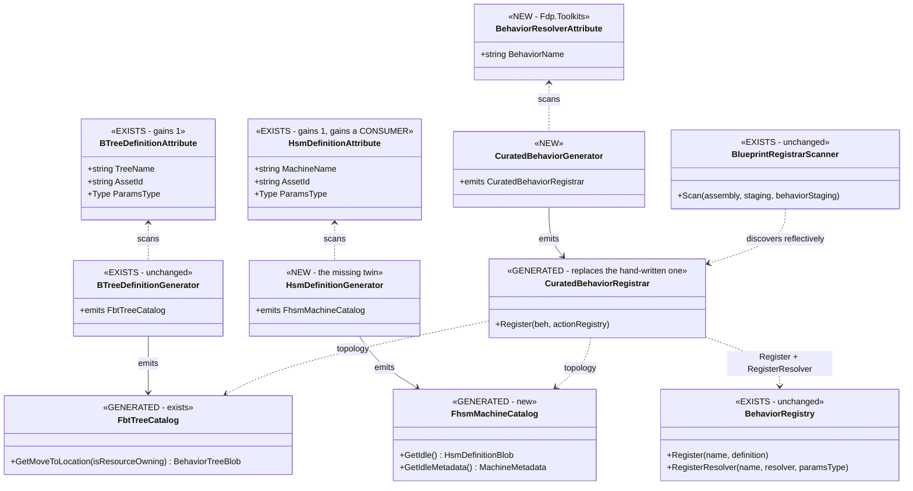
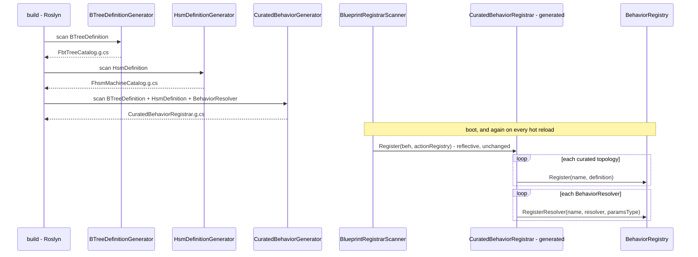
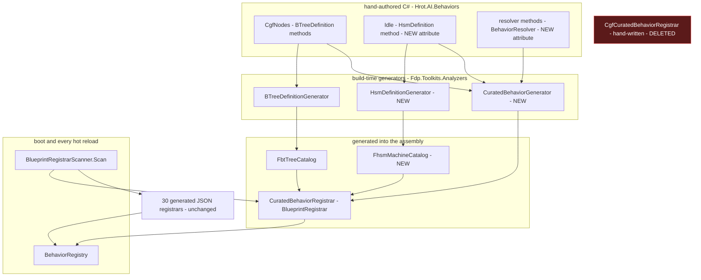

<!--STATUS
state: LIVE
build-state: READY-TO-BUILD
updated: 2026-09-27
current-answer: §4 is the decision, §5-§7 the UML, §9 the build items. ⭐ Start at §2 (INVENTORY)
  if you are about to argue that something here already exists — it probably does, and §2 says which.
stale-below: nothing yet.
known-rot: nothing yet.
known-conflict: ⚠ Behavior_Parameter_Resolver_Detailed_Design.md §338 expresses R-132 as "RegisterResolver
  is reached ONLY from CgfCuratedBehaviorRegistrar". This design DELETES that class, so that sentence
  must be re-expressed against the attribute — §8 ①. ⛔ The RULING is unchanged; only its probe moves.
related-designs:
  - Behavior_Architecture_Implementation_Plan.md — ⭐⭐ Phase 2 RETIRED `AiBehaviorFactory` and ruled
    that "every behavior self-registers under its unique name via [BlueprintRegistrar] discovery".
    THIS design finishes that sentence for C#-defined behaviours; the plan owns the sequencing history.
  - Behavior_Parameter_Resolver_Detailed_Design.md — owns the RESOLVER OVERLAY and R-132's
    "curated wins by declaration". ⛔ This design owns only WHERE the overlay is declared, never
    whether it wins.
  - DESIGN_Occurrence_Scoped_Storage.md — §33 (`E6`) adds two registration lines to the class this
    design deletes. ⚠ SEQUENCING: land this BEFORE `CE-364`, or those lines are written twice.
  - DESIGN_Parameter_Model.md — owns what a params region IS. This design only carries its TYPE
    from an attribute to the registration.
-->

# DESIGN — **Behaviour self-registration: the curated registrar becomes generated**

> 🔒 **User, `2026-09-27`:** *"can the `CgfCuratedBehaviorRegistrar` be replaced with automatic
> boot-time reflection scan as almost everything else in the engine?"* → then, on being told the Idle
> HSM blocked it: *"why the idle HSM blocks it? for UI authored HSM there is also no hand written
> registrar so why for this one?"*

⭐⭐⭐ **The user was right and the first answer was wrong.** 🔴 *"No HSM catalog generator exists
today"* was stated as *"an HSM built in C# cannot be scanned"* — **a property of the current code
presented as a property of the design space.** ⛔ Nothing blocks it.

---

## 1. ⭐ THE ONE-LINE STATE

⛔⛔ **`CgfCuratedBehaviorRegistrar` is ALREADY discovered by reflection** — it carries
`[BlueprintRegistrar]` and `BlueprintRegistrarScanner.Scan` invokes it, exactly like the 30 generated
registrars. ⭐ **What is hand-written is its BODY**: 11 registrations and 5 resolver bindings that no
generator produces. ⇒ **this design generates that body and deletes the file.**

---

## 2. ⭐⭐⭐ INVENTORY — **measured `2026-09-27`**

📐 `search_graph` + grep, agreeing. ⚠ `check_index_coverage` is unavailable through the CLI, so
*"complete set"* means **two independent tools agreeing**, not a coverage proof.

### 2.1 The attribute-driven scan precedent — ⭐ **it is the engine's normal pattern**

📐 `search_graph(name_pattern=".*(Registrar|Definition|Template|Gizmo)Attribute.*", label="Class")` → **8**

| attribute | its consumer | |
|---|---|---|
| `[BTreeDefinition]` | `BTreeDefinitionGenerator` → `FbtTreeCatalog` | ✅ |
| `[FbtRegistrar]` | `BTreeActionRegistryFactory.BuildFromAssembly` | ✅ |
| `[HsmActionRegistrar]` | `HsmActionGenerator` → `HsmActionRegistrar.g.cs` | ✅ |
| `[EqsTemplate]` | `EqsTemplateGenerator` | ✅ |
| `[UtilityRegistrar]` | `UtilityDecisionGenerator` | ✅ |
| `[BlueprintRegistrar]` | `BlueprintRegistrarScanner` *(runtime)* | ✅ |
| ⛔⛔ **`[HsmDefinition]`** | 🔴 **NOTHING at build or boot.** 📐 The only reader in the repo is the EDITOR's `HsmAssetContributor:34`, for its asset catalogue | **THE GAP** |

⇒ ⭐⭐⭐ **`[HsmDefinition]` is the one attribute in the set with no consumer.** The Idle machine is not
an exception to the engine's pattern — it is the **symptom of a missing generator.**

### 2.2 What the hand-written body actually contains — **143 lines**

| part | count | derivable? |
|---|---|---|
| BTree topologies | 5 | ⭐ **yes** — `FbtTreeCatalog.Get<Name>` is already generated; only the params TYPE is extra |
| HSM topologies | 1 *(`Idle`)* | ⭐ **yes, once `[HsmDefinition]` has a generator** — §2.3 |
| named resolvers | 5 | ⭐ **yes** — 3 plain method refs + **2 arity adapters** *(3-arg → 6-arg)* |

### 2.3 ⭐⭐ The Idle HSM and a JSON HSM are the SAME SHAPE — **measured, and it is the whole argument**

| | JSON-authored | hand-written `Idle` |
|---|---|---|
| topology | `var blob = {core}.Compile();` | `HsmBuilder → Normalize → Flatten → Emit`, inline |
| registration | `beh.Register(id, name, new BehaviorDefinition { HsmDefinition = blob, … })` — `HsmBridgeEmitCore:152-157` | ⭐ **the same call**, hand-written |
| who writes the `Register` | ⭐ a generator | ⛔ **nobody** |

⭐ **`HsmBuilder.Build()` returns `StateMachineGraph`** ⇒ an `[HsmDefinition]` method can return
**either** a `HsmDefinitionBlob` **or** a `StateMachineGraph`, and the generated catalog runs the
pipeline — ⭐⭐ **exactly the two-return-shape trick `BTreeDefinitionGenerator` already does**
*(`BehaviorTreeBlob` or `BTreeBuilder<TBB,TCtx>`, `:138-148`)*.

⭐ **It serves more than `Idle`** — 📐 `FDP/Examples/Fdp.Examples.UrbanCombat/Brains/ApcHsmSetup.cs`
is another hand-built machine.

### 2.4 ⚠ Two facts that CONSTRAIN the mechanism

| | |
|---|---|
| ⭐⭐⭐ **hot reload re-runs registrars, under COLLECTIBLE ALCs** | 📐 `BlueprintRegistrarScanner:91` handles partial assembly loads explicitly ⇒ **whatever is built must survive a reload**, which rules out anything computed once at process start |
| ⭐⭐ **`R-149` already throws on two curated bindings for one params region** | `BehaviorRegistry.RegisterResolver` — ⛔ a generated registrar must not turn that throw into a race |

---

## 3. ⛔ WHAT THIS DESIGN DOES **NOT** TOUCH

⛔ **`R-132` — *"curated wins by declaration, not by arriving first"*** — 📄
`Behavior_Parameter_Resolver_Detailed_Design.md` §338. ⭐ **The ruling is unchanged.** 🔴 It exists
because a two-producer race left `PlatoonHillAttack` reading a wire format nothing wrote and **drove
a platoon to `(0,0)` silently.** ⚠ Only its *probe* moves — §8 ①.

---

## 4. ⭐⭐⭐ THE DECISION — **a GENERATOR emits a `[BlueprintRegistrar]` class**

🔒 **Each curated behaviour self-describes on the attribute it already carries, and a source
generator emits the registrar that today is typed by hand.** ⛔ **Discovery does not change at all** —
the emitted class carries `[BlueprintRegistrar]` and the existing scanner finds it.

| ⭐ why a generator rather than a runtime reflection scan | |
|---|---|
| ⭐⭐⭐ **no new discovery mechanism** | the emitted class is found by the scanner that already runs. ⛔ A second scan is a second thing to debug when a behaviour does not appear |
| ⭐⭐ **hot reload works by construction** | generated code is compiled INTO the assembly ⇒ a reload recompiles and re-runs it (§2.4) |
| ⭐⭐ **it is the engine's own shape** | 📐 `HsmActionGenerator` already emits `HsmActionRegistrar.g.cs`; the JSON assets already emit `[BlueprintRegistrar]` bridges. ⇒ **this adds no concept** |
| ⭐ **AOT-safe and debuggable** | the emitted source is readable, diffable and breakpointable — ⛔ a reflective boot scan is none of those |
| ⚠ **the cost** | one new generator + two attribute properties + one attribute. ⭐ Bounded, and `CE-371` pays for itself twice — see §8 ② |

---

## 5. ⭐ THE CLASSES — `classDiagram`

⚠ **Caption — what the picture shows that prose hid:** **only three boxes are new**, and
`BlueprintRegistrarScanner` and `BehaviorRegistry` are drawn **unchanged** on purpose — ⛔ the thing
people expect this design to touch is the thing it does not touch. ⭐ Note the two catalogs are
symmetric: that symmetry is the user's argument, drawn.

---

## 6. ⭐⭐ REGISTRATION — `sequenceDiagram`

⚠ **Caption:** the **`Note` is the load-bearing part** — registration re-runs on every hot reload, and
that is why the answer is a generator emitting a registrar rather than a boot-time reflective sweep
of its own. ⭐ The `SC → REG` arrow is **the arrow that does not change.**

---

## 7. ⭐⭐⭐ WHO PRODUCES WHAT — **the module diagram**

⭐⭐ **Caption — the edge that matters is `SCAN --> REGG`, and it is IDENTICAL to `SCAN --> JSONREG`.**
⇒ after this change a curated behaviour and a JSON behaviour reach `BehaviorRegistry` by **the same
path**, which is what *"as almost everything else in the engine"* actually means. ⛔ The red box is the
only deletion.

---

## 8. ⭐⭐ THE TWO THINGS THAT MUST MOVE WITH IT

| # | | |
|---|---|---|
| **①** | ⭐⭐⭐ **RE-EXPRESS `R-132`'s PROBE, not its ruling** | 📄 `Behavior_Parameter_Resolver_Detailed_Design.md` §338 says *"`RegisterResolver` is reached **only** from `CgfCuratedBehaviorRegistrar`"* ⇒ **that sentence becomes false the moment the file is deleted.** ⭐ The replacement: *"reached only from the generated `CuratedBehaviorRegistrar`, whose every call site is a `[BehaviorResolver]`-attributed method — **the attribute IS the human declaration**."* ⛔⛔ **A ruling whose probe silently stops matching is exactly how the ledger rots** — update it IN THE SAME COMMIT |
| **②** | ⭐⭐ **`CE-371` CLOSES `CE-370` FOR FREE** | 📐 measured `2026-09-27`: the generated HSM registrar **never sets `HsmMetadata`**, so only the hand-written `Idle` has it, while three consumers read it *(`HsmTraceWorkingMemoryTranslator:52`, `HsmTraceWorkingMemoryRenderer:55`, `BrainTickSystem:447`)*. ⭐ **`FhsmMachineCatalog` is the ONE place that knows both the blob and its `MachineMetadata`** ⇒ emit both, and the gap closes for **every** HSM at once rather than per-emitter |

---

## 9. ⭐⭐ THE BUILD — **five items**

| # | id | item | where | risk |
|---|---|---|---|---|
| **1** | `CE-371` | ⭐⭐⭐ **`HsmDefinitionGenerator` → `FhsmMachineCatalog`** — the missing twin of `BTreeDefinitionGenerator`. Accept **both** return shapes *(`HsmDefinitionBlob` or `StateMachineGraph`, running `Normalize → Flatten → Emit`)*, exactly as the BTree one accepts a blob or a builder. ⭐⭐ **Emit `MachineMetadata` beside the blob** ⇒ closes `CE-370` (§8 ②). ⚠ Mirror `BTree002`'s invalid-method diagnostic | `Fdp.Toolkits.Analyzers` | ⭐⭐ medium |
| **2** | `CE-372` | ⭐ **the declarations** — `ParamsType` on `[BTreeDefinition]` and `[HsmDefinition]`; a new `[BehaviorResolver(name)]`. ⛔ **No new behaviour-identity concept**: the NAME stays the attribute's existing tree/machine name | `Fbt.Kernel` · `Fhsm.Kernel` · `Fdp.Toolkits` | ⭐ low |
| **3** | `CE-373` | ⭐⭐⭐ **`CuratedBehaviorGenerator` → `CuratedBehaviorRegistrar.g.cs`**, decorated `[BlueprintRegistrar]`. Emits one `beh.Register` per attributed topology and one `beh.RegisterResolver` per `[BehaviorResolver]`. ⛔⛔ **It must handle BOTH resolver arities** — the 6-param `ParseParamsDelegate` and the 3-param `(json, ptr, capacity)` form, wrapping the latter. 🔒 Precedent: the deactivator bridge already dispatches 3/4/5-param shapes | `Fdp.Toolkits.Analyzers` | ⭐⭐⭐ **the core item** |
| **4** | `CE-374` | ⭐⭐ **attribute the sources and DELETE the hand-written file** — `[HsmDefinition("Idle")]` on an `Idle` builder method, `ParamsType` on the five BTree definitions, `[BehaviorResolver]` on the five resolvers, then remove `CgfCuratedBehaviorRegistrar.cs`. ⛔ **Includes §8 ①'s doc edit — same commit** | `Hrot.AI.Behaviors` · `docs/` | ⭐⭐ medium |
| **5** | `CE-375` | ⭐⭐ **the rails** — §10 | tests | ⭐⭐ medium |

⭐ **Order:** `2 → 1 → 3 → 4 → 5`. ⛔ **`CE-374` last of the build items** — the file is the fallback
until the generated one demonstrably registers the same set.

⛔⛔ **SEQUENCING AGAINST `E6`: land this BEFORE `CE-364`**, which adds two registration lines to the
file this design deletes. ⚠ Two lines either way, but writing them twice is avoidable.

---

## 10. ⭐⭐⭐ THE RAILS — **and the acceptance gate is a SET COMPARISON**

| rail | what it must do |
|---|---|
| ⭐⭐⭐ **`SR_R1` — THE SET IS IDENTICAL** | register through the **old hand-written** path and through the **generated** one, and assert the two `BehaviorRegistry` contents are **equal as SETS** — names, `BrainTier`, params type, resolver presence. ⛔⛔ **Not a count.** 🔒 *"A matching NET count is not an explanation — diff the SETS"* (`CE-355`'s lesson, paid for once already) |
| ⭐⭐ **`SR_R2` — the name-agreement rail** | every `BehaviorNames` constant resolves to a registered definition. 📐 **The real hazard today**: `BehaviorNames.MoveToLocation`, `[BTreeDefinition("MoveToLocation")]` and `FbtTreeCatalog.GetMoveToLocation` are **three spellings and NOTHING checks they agree** — registering the right blob under a wrong name compiles fine |
| ⭐⭐ **`SR_R3` — the Idle machine still ticks** | through `BrainTickSystem`, from the generated catalog. ⛔ Not *"the catalog has an entry"* — 🔒 the `E6` lesson: the retired orchestrator passed its shape rails for months because nothing ever RAN what it emitted |
| ⭐⭐ **`SR_R4` — `MachineMetadata` is present for a JSON-authored HSM** | `CE-370`'s gap, pinned. ⛔ Currently would FAIL — that is the point |
| ⭐ **`SR_R5` — both resolver arities bind** | the 6-param and the 3-param forms, each asserted by ACTUALLY PARSING a params blob, not by presence |
| ⭐ **`SR_R6` — two curated resolvers for one name still THROW** | `R-149` survives the move to attributes |
| ⭐ **`SR_R7` — hot reload re-registers** | a second `Scan` over the same assembly yields the same set, and `HostedChildren`-style last-writer-wins is unaffected |

⛔ **`SR_R1` is the acceptance gate.** ⚠ It is also **temporary by design** — it needs the old file,
so it runs in `CE-374`'s commit and is **deleted with it**, leaving `SR_R2`…`SR_R7` as the standing
cover. ⭐ Say so in the report rather than leaving a rail that silently references a deleted class.

---

## 11. ⛔ REJECTED

| | why not |
|---|---|
| ⛔ **a runtime reflective sweep of `[BTreeDefinition]`/`[HsmDefinition]` at boot** | it is the literal reading of *"boot-time reflection scan"*, and it is worse: a **second** discovery mechanism beside `BlueprintRegistrarScanner`, not AOT-friendly, and not debuggable. ⭐ The generator gets the same result through the scan that already exists |
| ⛔ **keep the file and only generate the BTree half** | leaves the central file, adds a mechanism ⇒ worst of both. 🔴 **This was my recommendation before the user pushed back, and it rested on the false claim that Idle could not be scanned** |
| ⛔ **a new `[CuratedBehavior]` attribute carrying the name again** | a second spelling of an identity two attributes already carry — the exact drift `SR_R2` exists to kill |
| ⛔ **delete the file first, then build the generator** | no fallback while the generated set is unproven; `SR_R1` needs both |
| ⚠ **RESIDUAL — other hand-written registrars are NOT in scope** | `CgfBehaviorSetup`, `EqsModule`, `AnimationNodeRegistrar` are hand-written `[BlueprintRegistrar]`s too. ⭐ **They are not behaviour-topology lists and this design does not touch them** — ⛔ do not let *"replace the hand-written registrar"* grow into them without their own measurement |
