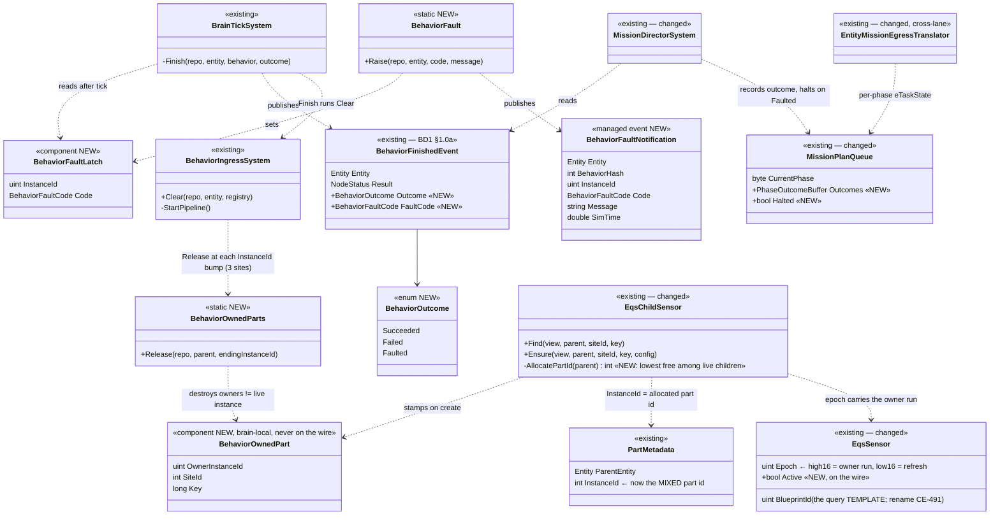
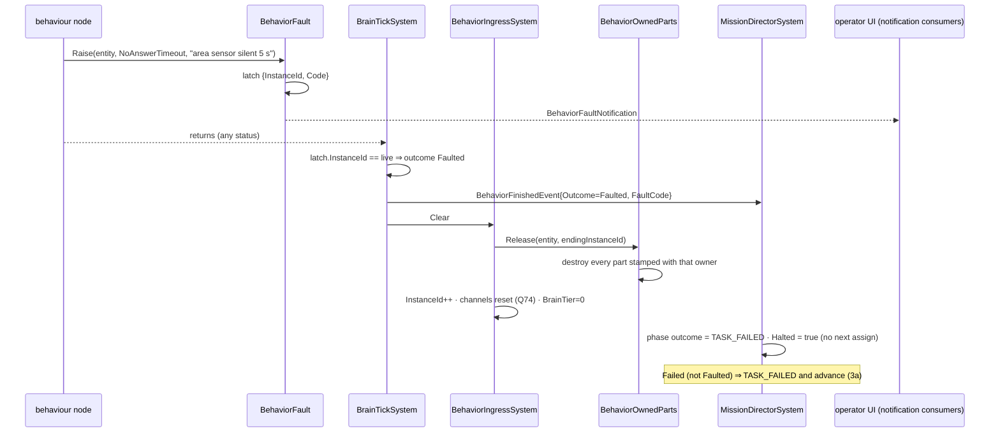
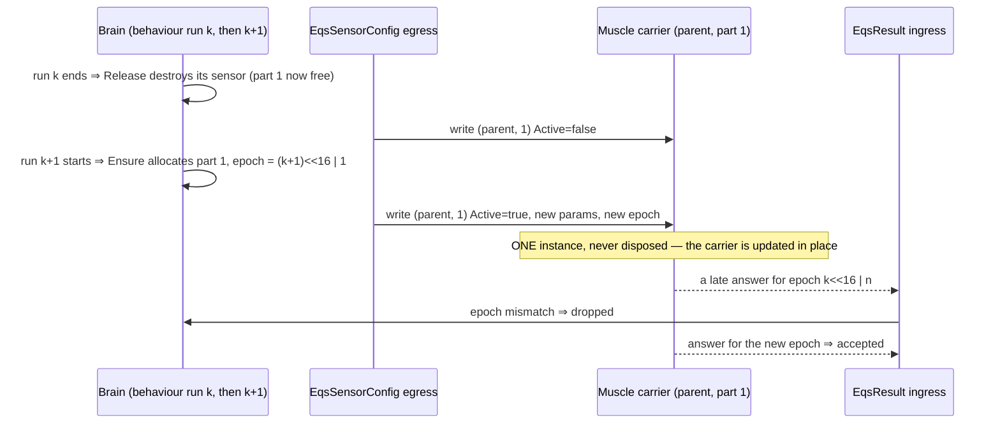
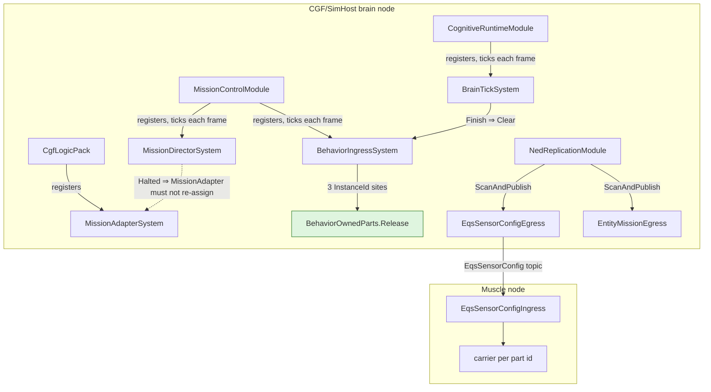

<!--STATUS
state: LIVE
updated: 2026-10-01
build-state: READY-TO-BUILD — every decision below APPROVED by the user on 2026-10-01 (section 1). Nothing is built.
  D5 was REVISED the same day (descriptor rules) — section 5 holds the superseded form.
current-answer: section 1 (the decisions, as approved) → section 3 (the diagrams — they ARE the design) → section 4 (the work
  items CE-482..CE-487). Section 2 is the claim table every decision rests on.
stale-below: section 5 (HISTORY) — the superseded per-lifetime-part-id D5.
known-rot: none.
known-conflict: none.
related-designs:
  - docs/designs/brain-death/BD1-DESIGN.md — OWNS BehaviorFinishedEvent (§1.0a), ClearBehaviorEvent (§1.0b) and "finishing is
    terminal and runs the clear" (CE-449). This design ADDS an outcome to that event and a release step to that clear; it does
    not change who publishes or who clears.
  - docs/blueprints/Architect_Question_74_Blueprint_Channel_Lifecycle.md — OWNS the channel half of behaviour teardown
    (ownership stamped with BehaviorInstanceId, reset by ChannelArbitrationSystem). Section 1 D4 is the same pattern applied to
    behaviour-owned ENTITIES (parts).
  - docs/designs/eqs-2/EQS_Design_v1.3_final.md — OWNS the child sensor, its wire key (ParentNetworkId, LocalChildIndex) and the
    Muscle carrier. D5 changes how LocalChildIndex is CHOSEN (allocated, reused), adds `Active`, and puts the lifetime in
    the epoch — the key's shape is unchanged.
  - docs/blueprints/DESIGN_Hill_Attack_Eqs_Migration.md — the behaviour-side sensor lifecycle (EqsChildSensor) this extends; its
    §6 records the abort residual (a sensor surviving a cleared behaviour) that D4 closes.
  - docs/designs/SIM/DESIGN-SIMHOST.md — designed MarkTaskFailed (around line 787) for the SimHost mission path; never built.
    D3 is the first writer of TASK_FAILED.
  - docs/reference/BDC_NED_SST_Descriptor_Rules.md — OWNS the descriptor lifecycle rule ("descriptors cannot be deleted from a
    live entity") that shapes D5; a SPEC, not a design of our code.
  - docs/designs/ai-btree-deactivator-1/DESIGN.md — BTree-only per-node deactivators. Kept for per-node cleanup; NOT the
    behaviour-wide mechanism (rejected in section 1).
-->

# DESIGN — behaviour fault (fail loud) · behaviour-owned parts torn down at instance end

🔒 **User, `2026-10-01`:** *"The system needs to be reliable."* · *"#2 failure should fail loud (finish the behavior with
error, likely firing a notification event that can be acted upon, like telling the user about the failure, not just loging
it). #1 might need behavior wide deactivator/teardown concept to clean up the dangling sensors etc."* · *"approving the task
finish/failure"* · *"yes 3a included. Yes to Delete sensors at behavior end with the per lifetime number."* · *"ok no network
id if the sensor is replicated as a sub-part of the network representation of the main entity. Ok mixed instance number with
new instance (part id) for new sensor instance."*

## 1. Decisions — all APPROVED `2026-10-01`

| | decision | why |
|---|---|---|
| **D1** | ⭐ a **fault** is a signal of its own, raised explicitly with a code and a message (`BehaviorFault.Raise` in C#, a *Fault Behaviour* node in a blueprint). ⛔ `NodeStatus.Failure` keeps its meaning | Failure is normal control flow — the commander ends its wave loop with it (`HillAttackCommanderNodes.cs:606`, `CE-459`) |
| **D2** | ⭐ a fault ends the behaviour through the existing `Finish` → `Clear` (`CE-449`); `BehaviorFinishedEvent` gains `Outcome` (Succeeded · Failed · Faulted) + `FaultCode`; a managed `BehaviorFaultNotification` is published for anyone to act on | one terminal event that cannot disagree with a second one; the notification is what tells the user |
| **D3** | ⭐ the mission tier records each phase's outcome: Succeeded ⇒ `TASK_DONE` and advance · **Failed ⇒ `TASK_FAILED` and advance (3a)** · **Faulted ⇒ `TASK_FAILED` and HALT** until an operator command | `TASK_FAILED` is on the wire and drawn as ✗ (`MissionPanel.cs:161`) but nothing writes it |
| **D4** | ⭐ an entity a behaviour creates through `EqsChildSensor` is **behaviour-owned**: stamped `BehaviorOwnedPart{OwnerInstanceId, SlotId}` and **destroyed when that behaviour instance ends** — at every site that bumps `BehaviorState.InstanceId` | every end (finish, clear, reassign, re-assign of the same behaviour, hot-reload restart, abort, fault) bumps it — one release step, three call sites, no per-route hook |
| **D5** *(REVISED `2026-10-01` — see §5 for the superseded form)* | ⭐ the sensor stays a **part** of its parent's network representation (⛔ no network id) and its descriptor instance is **never disposed** while the parent lives. ① **part ids are ALLOCATED and REUSED**: the lowest id ≥ 1 not held by a live sensor child of that parent — the children ARE the table, no allocator component; `Ensure` creates the child **immediately** on the live world so a second creation in the same frame sees it · ② **the lifetime rides in the epoch**: high 16 bits = the owning behaviour run's `InstanceId`, low 16 = the refresh count ⇒ any answer to an earlier run fails the epoch check · ③ **a sensor ends by an explicit `Active = false` write** to its instance (a new non-key field on `EqsSensor` + `EqsSensorConfigTopic`); the solver skips inactive carriers · ④ **a new authority sweeps orphans**: brain nodes also read the config topic and write `Active = false` to any instance under their entity they hold no sensor for · ⑤ **Spawn EQS Sensor gains an optional `Key` pin** so one spawn node in a loop owns one sensor per key | 🔒 the BDC/NED descriptor rules: *"descriptors cannot be deleted from a live entity"* (`docs/reference/BDC_NED_SST_Descriptor_Rules.md`); a dispose of a non-master descriptor means ownership-return or entity-deletion, never "this part is gone" |

**Rejected — one line each:**
- *Root Failure = fault* — breaks every tree that ends with Failure on purpose (`CE-459`).
- *Log only* — the status quo, and the complaint.
- *Adopt the old sensor on restart* — correct only if `Ensure` copies every parameter; you rejected optimising a case of unknown probability.
- *A teardown-callback registry* — every new resource kind must remember to register; managed state across hot reload.
- *Fire BTree deactivators on clear* — BTree only; HSM and blueprints get nothing.
- *A reaper system later in the frame* — a same-frame restart would see the old sensor before it is reaped.
- *Give the sensor its own network id* — id allocation plus an acknowledged spawn/teardown on every restart, seen by every node, first answer later.
- *A new key field on the two EQS topics* — the same unbounded-instance problem as a per-lifetime part id.
- *A per-lifetime (mixed) part id* — the first form of D5: a new descriptor instance per restart that may never be disposed ⇒ unbounded, and a late-joining Muscle solves every dead one.
- *Baked or hashed part ids* (today: node-GUID hash, a C# constant, `entityIndex << 8 | slot`) — no loops, no repeated subtrees, collisions undetectable, and the index form overflows.
- *An allocator component on the parent* — a second record of which ids are used; it drifts whenever a child dies outside our release step.
- *`BlueprintId = 0` as the idle marker* — overloads "which query" with "on/off", and a template hash can be 0.
- *The unused `PublishPolicy` value 2 as idle* — that field says when to publish, not whether to solve.
- *Let the Muscle age out unrefreshed sensors* — a long-running sensor is legitimately never refreshed.
- *Wait for the dispose acknowledgement before re-creating* — adds a wait state to every behaviour, and acknowledgements are lost when a node drops.

## 2. Claim table

| claim | code — how it IS | design — how it was MEANT |
|---|---|---|
| the finish event has no reason | `BehaviorFinishedEvent.cs:22-30` | BD1 §1.0a — no fault concept |
| the director advances on Failure exactly as on Success | `MissionDirectorSystem.cs:173-199` | — searched `docs/`+`.dev/`, none found |
| nothing writes `TASK_DONE`/`TASK_FAILED` | grep: 0 production writers. ⚠ the mission egress derives every state from `CurrentPhase` alone ⇒ ACTIVE or PLANNED, so a **finished task reads PLANNED** (`EntityMissionEgressTranslator.cs:124`) | DESIGN-SIMHOST `MarkTaskFailed` (~787); `.dev/_DONE/map-features/orbat-specs.md:263` |
| faults are silent today | commander: missing area `:257`, no answer in 5 s `:303-319`; engine: no blueprint tick ⇒ `Debug.WriteLine` and skip (`BrainTickSystem.cs` `TickBlueprint`) | — |
| three sites end an instance | `BehaviorIngressSystem.cs:163` (unhosted assign), `:255` (the start pipeline — also re-assign of the SAME behaviour and hot reload), `:980` (`Clear`) | BD1 §1.0b |
| Clear does not touch child entities | `BehaviorIngressSystem.cs:930-980` | — |
| children die only with their parent | `SubEntityCleanupSystem.cs:24-25` | — |
| the sensor is a part, not an entity, on the wire | key `(ParentNetworkId, LocalChildIndex)` (`EqsDdsTopics.cs:19-21`, `:85-87`); the Muscle builds a carrier (`EqsSensorConfigIngressTranslator`) | EQS 1.3 H5; FDP parts pattern (`Fdp.Network.Cyclone.md` — `PartMetadata`, `ChildMap`, `MultiInstanceCycloneTranslator`) |
| ① same-scan write-then-dispose of ONE key | `EqsSensorConfigEgressTranslator.cs:117-141` — writes the new sensor, then disposes the old one's identical key; state is per local entity so it never re-sends | — |
| ② dispose + write in one Muscle batch | `EqsSensorConfigIngressTranslator.cs:111` queues the carrier's destroy, `:170` applies the new config to that same doomed carrier, `:152` marks it done | — |
| ③ the result cache keeps a dead entity | `EqsResultIngressTranslator.cs:79` (no liveness check on a hit), evicted only on a dispose sample `:59` — which a KeepLast-1 topic can collapse | — |
| ④ every new sensor starts at epoch 1 | `HillAttackCommanderNodes.cs:62`; the guard is `evt.Epoch != sensor.Epoch` (`EqsResultUpdateSystem.cs:56`) | EQS 1.3 §4 — epoch is the staleness guard |
| ⑤ `Find` returns a doomed sensor | `EqsChildSensor.Find` matches parent + id only | — |

⇒ ①–③ make a restarted sensor **silent**; ④ gives it **the old question's answer**. All five exist today on the C# commander's
deactivate-then-restart path. Revised D5: no dispose ⇒ ① ② cannot happen · lifetime in the epoch ⇒ ④ · owner-stamped `Find` ⇒
⑤ · ③ stays and makes `CE-487` REQUIRED.

| revised-D5 claim | code — how it IS | design basis |
|---|---|---|
| a descriptor instance may not be disposed while its entity lives | the config egress disposes today (`EqsSensorConfigEgressTranslator.cs:141`) and the Muscle reads it as "destroy carrier" (`EqsSensorConfigIngressTranslator.cs:111`) — ⛔ both against the spec; the result egress never disposes (`EqsResultEventEgressTranslator.cs:113`) | Descriptor Rules, *Disposal* |
| same-frame immediate creation is safe and visible | behaviours get the live world (`BrainTickSystem.cs:312`, `:414`); a created entity is Active at once (`EntityRepository.cs:327`) and the default query is Active (`QueryBuilder.cs:125`); component storage is reserve-and-commit, never moved (`NativeChunkTable.cs:231-245`); a sensor child carries no `BehaviorState`, so the tier walk never visits it (`BrainTickSystem.cs:129-166`) | — |
| an unknown template is NOT idle today | `EqsSolverSystem.cs:147-159` publishes an empty answer every solve | — |
| a new authority holds no record of old part ids | brain nodes register only the config EGRESS (`SimHostAuxiliaryTranslatorPack.cs:67`; ingress is Muscle-only, `:92`); the old node stops ticking but never ends the behaviour (`BrainTickSystem.cs:129`, owned-only) | — |
| `BlueprintId` is the EQS query TEMPLATE, not a behaviour blueprint | `EqsComponents.cs:138`; `EqsTemplateRegistry.BlueprintIdOf` (`:40`); the C# commander fills it too (`HillAttackCommanderNodes.cs:56-61`) | EQS 1.3 — templates were authored as "query blueprints" ⇒ rename filed as `CE-491` |

**INVENTORY** — ① fault/notification: `search_graph name_pattern=.*(Fault|Notification|BehaviorFinished|BehaviorOwned|OwnedPart|TaskFailed).*`
(Class, 53 rows, `has_more:false`) found **no behaviour fault or notification type**. The near misses, and why each does not
apply: `ModuleFaultReportingRails`/`CE-189` (an engine EXCEPTION in a module — not a behaviour outcome) · `DebugApiFault` (HTTP
error shape) · `EditorNotification`/`NotificationOverlay` (editor-local UI — a possible CONSUMER of D2) ·
`WeaponFireNotification` + its egress translator (the precedent for a notification that crosses the wire) ·
`DetonationNotification`, `SelectionChangedNotification` (unrelated domains). Struct pass for `BehaviorOwned|PartMetadata` — 0
rows (PartMetadata is a component the graph labels otherwise; grep confirms `Fdp.Toolkit.Replication.Components`).
② part-id allocation: `search_graph name_pattern=.*(PartId|ChildIndex|InstanceIdAlloc|IdAllocator|ChildMap|PartMetadata).*`
label Class ⇒ **21** (`has_more:false`): every allocator is a NETWORK ENTITY id allocator (`DdsIdAllocator(Server)`,
`SequentialIdAllocator`, `IgSequentialIdAllocator`, `HostedIdAllocatorServer`, test stubs) or StructEdit's union `IdAllocator`;
`ChildMap` is an id→entity lookup kept by the receiving side; `PartMetadata` is the stamp ⇒ **no part-id allocator exists**, and
D5's scan-the-children allocator duplicates nothing. `check_index_coverage` was not run.

## 3. Diagrams

*What the picture shows that prose hid:* the stamp is **brain-local** — the wire sees only the allocated part id, the epoch
and the new `Active` flag; the key of both EQS topics is untouched. And the fault reaches the mission tier
through the **existing** finish event, not a second channel.

*What it shows:* the fault does not need its own teardown — it rides the CE-449 finish, so D4's release runs for it exactly as
for any other end.

*What it shows:* the descriptor instance outlives every sensor that uses it, exactly as the descriptor rules require; what tells
two lifetimes apart is the EPOCH, not the key. ⚠ the brain-side result cache (key → local entity) still points at run k's dead
entity after the swap ⇒ `CE-487` is load-bearing.

*What it shows:* every system on the path is already ticked each frame by a registered module on the brain node — ⛔ no new
system and no new module. The one dependency to honour is the dashed edge: `MissionAdapterSystem` must read `Halted` or it
would re-issue the halted phase.

## 4. Work items

| id | what | lane |
|---|---|---|
| **CE-482** | D1+D2: `BehaviorFault.Raise`, `BehaviorFaultLatch`, `BehaviorOutcome`/`FaultCode` on `BehaviorFinishedEvent`, `BehaviorFaultNotification`; the blueprint *Fault Behaviour* node; the commander faults on missing area and on 5 s silence; `BrainTickSystem` faults (`NoDefinition`) instead of `Debug.WriteLine` | behaviours |
| **CE-483** | D3: `MissionPlanQueue.Outcomes` + `Halted`; director records the outcome, halts on Faulted; `MissionAdapterSystem` honours `Halted`; mission control commands clear it. ⚠ cross-lane: `EntityMissionEgressTranslator.cs:124` sends the recorded state (today a finished task reads PLANNED) | behaviours + backend (egress) |
| **CE-484** | the notification reaches the operator: an egress topic on the `WeaponFireNotification` precedent + a UI consumer (`NotificationOverlay`/IG) | backend + UI |
| **CE-485** | D4+D5 brain side: `BehaviorOwnedPart{Owner, Site, Key}`, `BehaviorOwnedParts.Release` at the three InstanceId sites; `EqsChildSensor` allocates the part id (lowest free among live children), creates immediately on the live world (asserts one creation per parent per frame on any other view), stamps the epoch with the owner run, matches `Find` on owner + site + key; the `Key` pin on *Spawn EQS Sensor*; retire the three baked-id schemes; re-home the tick-count rails (`Ensure` now returns the child on the creating call ⇒ the `-2` marker goes) | behaviours |
| **CE-486** | D5 ③ wire side: `Active` on `EqsSensor` + `EqsSensorConfigTopic`; the config egress NEVER disposes a child-sensor instance — it writes `Active=false`; the Muscle ingress stops treating a dispose as "destroy carrier"; the solver skips inactive carriers | backend |
| **CE-487** | ③ the result ingress cache must check the cached entity is alive (and its part id still matches) on every hit — ⭐ REQUIRED by D5 | backend |
| **CE-490** | D5 ④: brain nodes also read `EqsSensorConfig`; on gaining authority over an entity, write `Active=false` to every instance under it that has no local sensor | backend |
| **CE-491** | rename `EqsSensor.BlueprintId` / the topic field → `TemplateId` (Roslyn rename; the field is the EQS query template) | backend |

**Acceptance (behaviours lane):** ① a rail where the commander faults on a missing area ⇒ `BehaviorFinishedEvent.Outcome ==
Faulted`, one notification, task `TASK_FAILED`, plan halted · ② a plain-Failure behaviour ⇒ `TASK_FAILED`, plan advances · ③
finish/clear/reassign/same-behaviour re-assign each leave **zero** stamped parts of the ending instance · ④ end then
immediately restart a sensor-using behaviour in the SAME frame ⇒ the restarted sensor answers (split Brain/Muscle rail, the
`EqsDistributedTests` harness) · ⑤ live `--mode all` hill-attack, both commanders, unchanged outcome.

## 5. ⛔ HISTORY — superseded D5 *(do not quote as current)*

**D5, first form (approved `2026-10-01`, SUPERSEDED the same day):** *"each lifetime gets a new part id:
`LocalChildIndex = Mix(SlotId, OwnerInstanceId)`."* ⛔ Withdrawn on the user's question about the BDC/NED descriptor rules: a
new part id per lifetime is a new descriptor instance that may never be disposed while the parent lives ⇒ instances grow
without bound and TransientLocal hands every dead one to a late-joining Muscle. Replaced by allocated, reused part ids with the
lifetime in the epoch (§1 D5).
