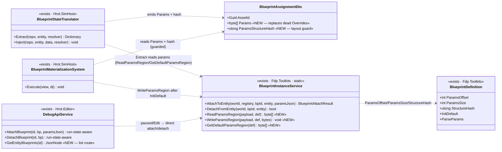
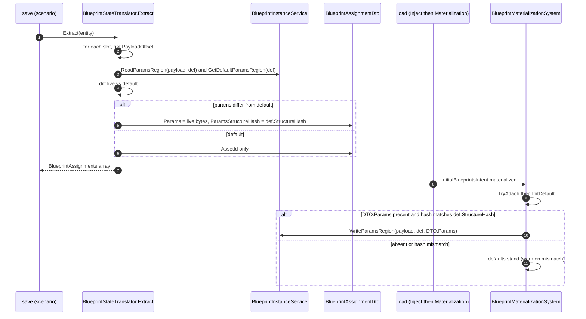

<!--STATUS
state: LIVE
build-state: BUILT
updated: 2026-08-26
current-answer: this whole file. §2 INVENTORY (measured). §3 the DECISION (resolver-shape bytes, not the
  Overrides dict). §4/§5 the class + sequence UML. §6 the MCP wire. §7 QA-023. §8 out of scope.
design-basis: Architect_Question_61 (the reframe + A/B/C/D leans) · EXPLAINER_Where_Parameters_And_State_Live.md
  §"two supply shapes, one concept" (line ~287 — the ruling that resolver shape > Overrides dict) ·
  BLUEPRINT-SCENARIO-DESIGN.md §6 (the ORIGINAL Overrides intent, deferred for UX) · DESIGN_Parameter_Model.md
  §3.3 (parse-before-commit, InitDefault-then-params order) · HANDOFF_Blueprint_Param_Persistence.md (the FRAME).
known-conflict: touches Fdp.Toolkits + Hrot.SimHost (backend lane's neighbourhood) — fenced to the MCP lane
  this batch per the handoff §4; backend's concurrent batch is fenced OFF these exact files.
-->
# DESIGN — **Persisted instance-blueprint parameters + the MCP wire** *(MX-030..036)*

> 🎯 Make per-entity instance-blueprint **params survive save→reload** (they are dropped today), then ship the
> **run-state-aware attach/detach + list** MCP wire that becomes worth having once params persist. Fold `QA-023`.

## 1. ⭐⭐⭐ THE FRAME — the finding
🔴 Assigning an instance blueprint **with persisted per-entity params is impossible today by ANY path**. The
runtime params pipeline is built (`AttachToEntity(paramsJson)` → `ParseParams` → param region @16), but
**save drops params**: `BlueprintStateTranslator.Extract` writes `AssetId` only; `BlueprintMaterializationSystem`
calls `InitDefault` only; `BlueprintAssignmentDto.Overrides` is dead. ⇒ a parametric assignment is hollow.

## 2. ⭐⭐ INVENTORY — measured `2026-08-26`
| query / symbol | home | role | measured |
|---|---|---|---|
| `BlueprintInstanceService.AttachToEntity` | Fdp.Toolkits | the write seam; **the ONLY source of params** — copies resolved bytes to `payload+ParamsOffset` after `InitDefault` | ⭐ the pattern the round-trip reuses |
| `BlueprintDefinition{ ParamsOffset=16, ParamsSize, StateSize, StructureHash, InitDefault, ParseParams }` | Fdp.Toolkits | payload layout `[Cursor 16][Params N][State M]`; ⛔ **no bytes→JSON inverse of `ParseParams`** exists | 📐 `ParseParams` is JSON→bytes only |
| `BlueprintAssignmentDto{ AssetId, Overrides }` | Fdp.Toolkits | `Overrides` **dead** — only two DOC-COMMENT references, zero code reads/writes | 📐 grep, `2026-08-26` |
| `BlueprintStateTranslator.Extract/Inject` | Hrot.SimHost | save snapshots slots→`AssetId` only; load parses the array→`InitialBlueprintsIntent`. **Inject only matches `JsonArray`** ⇒ `QA-023` | 📐 `Test5b` passes a `JsonElement` |
| `BlueprintMaterializationSystem` | Hrot.Common(SimHost) | load-time: `TryAttach`+`InitDefault` per blueprint into a pre-provisioned aggregate tier — **no params applied** | ⭐ where load-apply lands |
| `BlueprintBlackboardPartitions.{GetSlot,TryGetSlotOffset,TryAttach}` · `BlueprintSlotEntry.{BlueprintId,PayloadOffset,StructureHash}` | Fdp.Toolkits | slot table read/alloc; a slot's `PayloadOffset` locates its payload | ⭐ Extract reads the live params via it |
| `AttachBlueprint/DetachBlueprint` (Group Q) · `AttachInstanceBlueprintEvent` | Hrot.Editor | MCP attach — always publishes the next-**tick** event; ⛔ never lands in frozen Edit state | G1 |
| `EntityBlueprintsPanel.ExecuteCommitPlan` | Hrot.Blueprints.Editor | `timing = _isRunning ? Running : Paused`; **paused → direct `BlueprintInstanceService`**, running → event | ⭐ the branch MCP must mirror |

## 3. ⭐⭐⭐ THE DECISION — persist the RESOLVER SHAPE (bytes), not the `Overrides` dict
📄 **[`EXPLAINER_Where_Parameters_And_State_Live.md`](./EXPLAINER_Where_Parameters_And_State_Live.md) §"two supply
shapes, one concept"** rules it: a name→value `Overrides` dict and the resolver's byte region are **two
implementations of one concept** *(ruling 9)*; the **resolver shape wins** — it already carries defaults, overlay
and world-context, which `Overrides` carries none of. `BLUEPRINT-SCENARIO-DESIGN.md` §6's per-variable `Overrides`
was **deferred for authoring-UX reasons, not chosen** — so we do NOT revive it.

⇒ ⭐⭐ **The persisted format is the resolved param BYTE REGION** `[ParamsOffset .. ParamsOffset+ParamsSize)` — the
exact bytes `AttachToEntity` produces and the tick reads. **One source of truth** (the live slot; a *snapshot of a
live component*, AQ61 §1), **no side table**, **no second parser**. Since no bytes→JSON inverse exists, a JSON form
would require inventing one (a second representation) — rejected.

| decision | choice | why |
|---|---|---|
| format | **resolved param bytes** (`byte[]`, JSON-serialized as base64) | resolver shape; EXPLAINER §287; no inverse serializer to build |
| DTO | **replace dead `Overrides`** with `byte[]? Params` + `ulong? ParamsStructureHash` | ruling 9 — one mechanism, not a dead field beside a live one |
| what to persist | **only params that DIFFER from `InitDefault`** | keeps scenarios clean; a default assignment stays `{AssetId}` only |
| layout guard | apply on load **only if `ParamsStructureHash == def.StructureHash`**, else `InitDefault` + warn | bytes are layout-versioned; a recompiled blueprint must not read stale bytes |
| tradeoff | ⚠ the blob is **opaque** in the scenario file (vs the rejected human-readable dict) and **layout-versioned** | accepted — the ruling decides shape; a recompile falling back to defaults is safe, not silent-wrong |

## 4. ⭐⭐ CLASS DIAGRAM *(existing shown as `<<exists>>`; drawn after the INVENTORY)*

## 5. ⭐⭐ SEQUENCE — save→reload param round-trip

## 6. ⭐ THE MCP WIRE *(Q61-A + Q61-B)*
- **Run-state-aware attach/detach (A)** — `AttachBlueprint`/`DetachBlueprint` branch on **sim advancing**
  (`_preview.IsInPreviewMode && !_time.IsPaused`): advancing → publish the event (today); **frozen/Edit/paused →
  `BlueprintInstanceService.AttachToEntity/DetachFromEntity` directly (same frame)**, surfacing the
  `BlueprintAttachStatus` (`ParamsParseFailed`→400, `NotInstanceKind`→400, `Attached`/`AlreadyAttached`→200). ⭐ ONE
  route that mirrors the panel's own branch *(ruling 9)* — ⛔ NOT a parallel `/assign`. The reply names the path taken.
- **List (B)** — `GET /entities/{networkId}/blueprints` → `GetEntityBlueprints` reads the slot table (the source
  `Extract` uses) → the attached instance blueprints `[{ blueprintId, name, assetId, tier }]`.
- Node wrappers for the list tool; attach/detach RouteDocs updated to note the branch **and that params now persist
  through save** (Q61-C is CLOSED by §3–§5, so the old "overrides don't survive" caveat is removed).

## 7. ⭐ QA-023 — `Inject` mixed-keys
🔴 `Inject` matches only `rawValue is JsonArray`, but the value arrives as a `JsonElement` (Array) ⇒ intent never
set (`Test5b_BackwardCompat_MixedOldAndNewKeys_OnlyAssignmentsApplied` red). ✅ Fix: deserialize from **`JsonArray`
OR `JsonElement`(Array) OR any `JsonNode`**. Legacy blackboard keys stay black-holed.

## 8. ⛔ OUT OF SCOPE — the same blueprint twice on one entity
Slot identity is `blueprintId` **alone** and attach is idempotent on it; "two Patrols, different waypoints" needs
`(blueprintId, instanceKey)` — a separate, larger identity change *(EXPLAINER §"slot identity"). Single-instance
persist only.*

## 9. ✅ AS-BUILT — Batch HN-124, `2026-08-26` *(obligation ⑤)*
Built as designed; ids **MX-030..036**. The §4/§5 UML holds — one deviation, one addition, both minor:

| # | as-built vs §4/§5 | why |
|---|---|---|
| **D1** | **Materialization keeps its low-level aggregate-tier path** (`TryAttach`+`InitDefault`) and **adds `WriteParamsRegion` after InitDefault**, rather than delegating to `AttachToEntity`. | `AttachToEntity` chooses a per-blueprint tier; Materialization must pre-provision the **aggregate** tier so multiple blueprints share one component. Both write params through the SAME `WriteParamsRegion`, so there is still one param writer. |
| **D2** | The list route reports `payloadSize` (not `tier`). | `SlotSummary` carries no tier field; `payloadSize` is the useful per-slot fact it does carry. |
| **D3** | ⭐ Round-trip rail added: `BlueprintScenarioIntegrationTests.ParamPersistence_NonDefaultParams_SurviveSaveThenReload` — attach → set non-default param → Extract → Inject → Materialize → param survives; **inverse-edit red-proof** noted in the test. QA-023 (`Test5b`) green. | acceptance |

⭐ **Q61-C is CLOSED, not deferred** — the FRAME elevated the param-persistence engine work into this batch, so
the AQ61 §3 "defer C" lean is superseded by the handoff. **Gates:** Fdp.Toolkits + Hrot.SimHost + Hrot.Editor +
ClusterRunner build clean; `EveryRouteIsDocumented` 4/4; blueprint scenario 6/0 (+2 pre-existing skips); SimHost
translator/materialization/genesis 25/0; Fdp.Toolkits blueprint 38/0 + DTO 2/0; `gen:catalog`/`gen:skill`/
`test:catalog` green (98 tools).
