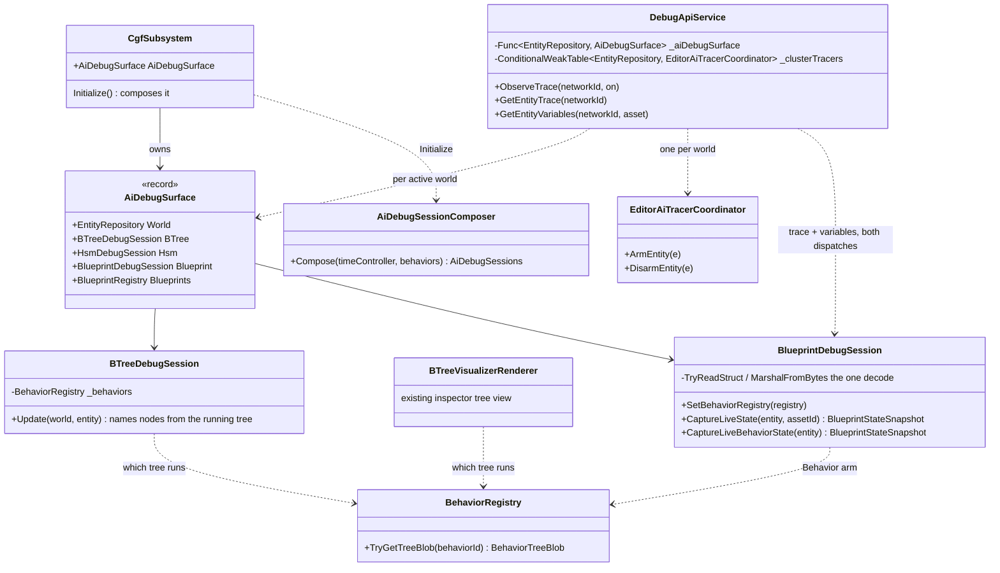
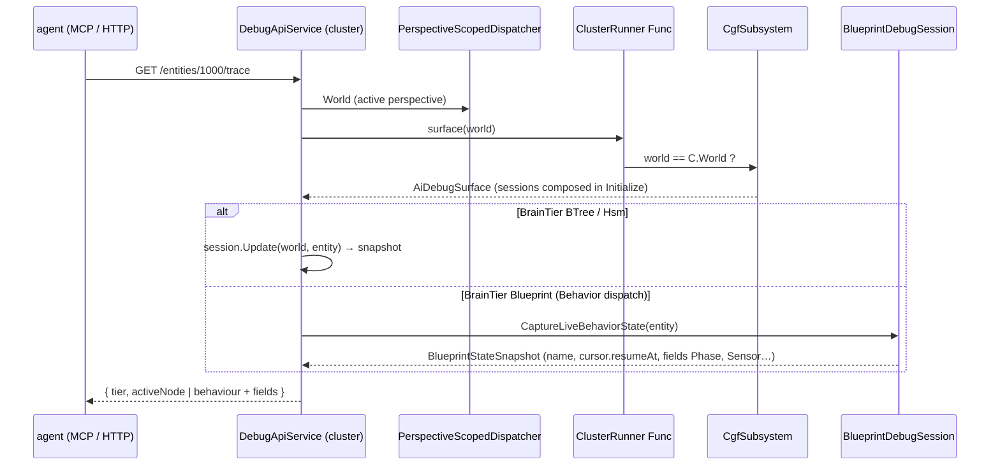
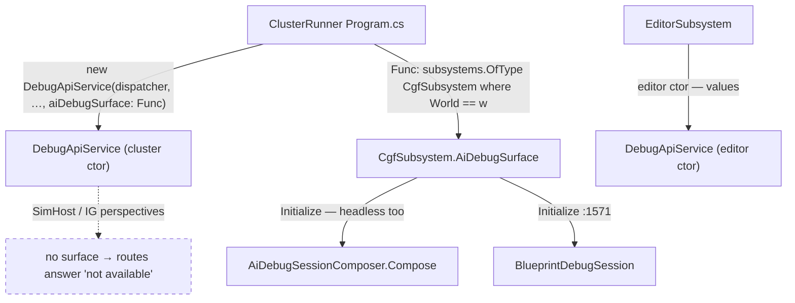

<!--STATUS
state: LIVE
build-state: BUILT (2026-10-01) — §4 is the as-built
updated: 2026-10-01
current-answer: §2 (decisions), §3 (the UML — true as built) and §4 (as-built + rails). §1 is the measured inventory.
stale-below: nothing.
known-rot: none.
known-conflict: HANDOFF_AreaQuery_Retirement_And_Cluster_Ai_Debug.md B-D3 assumes CGF has a per-perspective trace-arming
  tracer (CE-351) — measured false, see §1 row ③. B.3 ③ asks for "a blueprint trace naming the active graph" — a Behavior
  blueprint has no runtime record of which graph runs, see §1 row ⑤.
related-designs:
  - docs/blueprints/Architect_Question_54_Cluster_Mcp_Contract.md — owns the --mode all DebugApi contract; Q54-2 rules that
    perspective-dependent commands route from the selected perspective's subsystem. This design applies it to the AI debug surface.
  - docs/blueprints/DESIGN_Occurrence_Scoped_Storage.md — §32.24 (CE-349) owns the shared AI debug-session composition
    (AiDebugSessionComposer) and the one time control; §32.18–32.21 the shared-binder pattern used here.
  - docs/blueprints/Architect_Question_77_Blueprint_As_A_Behaviour.md — owns the Behavior-dispatch blueprint (CE-446): the
    root block, BrainTier 3. §5 is the as-built this reader decodes.
  - docs/blueprints/Blueprint_Subsystem_Debug_Protocol_Detailed_Design.md — owns the Blueprint debug session's probe protocol
    (node history exists only for instrumented builds).
  - docs/blueprints/BTree_Editor_NodeEditor_Host_Design.md — owns the BTree debug overlay (RunningNodeIndex → VisualId); §4 here
    makes the session symbolicate per tree, which that overlay already assumed.
  - docs/blueprints/batches/HANDOFF_AreaQuery_Retirement_And_Cluster_Ai_Debug.md — the frame this designs (part B, CE-476).
  - docs/blueprints/batches/REPORT_AreaQuery_Retirement_And_Cluster_Ai_Debug.md — the batch report.
-->

# DESIGN — the AI debug surface on a cluster (`CE-476`)

> 🔒 **User, `2026-10-01`:** *"The system needs to be reliable."* — the trace and variables routes are the instrument for
> proving two commanders behave the same; on `--mode all` they answered nothing.

## 1. Inventory — measured, `2026-10-01`

`search_graph` + grep over `Hrot/Subsystems/Hrot.Editor/DebugApi`, `Hrot.CGF`, `Hrot.ClusterRunner`, `Hrot.Editor.AiComposition`,
`Hrot.Blueprints.Editor`.

| # | what the route needs | editor | cluster (`--mode all`) | evidence |
|---|---|---|---|---|
| ① | BTree / HSM debug session | ✅ composed in `Initialize` (`EditorSubsystem.cs:1225`), passed | ⛔ the lifted ctor (`DebugApiService.cs:607`) takes none; ⚠ and CGF composes them in `BuildAiShell` (`CgfSubsystem.cs:1981`) — **only when windowed** (`RegisterWindows` returns when headless, `:1793`) | |
| ② | Blueprint debug session | ✅ passed | ⛔ not passed — CGF builds one in `Initialize` (`:1571`) | |
| ③ | the trace-ARMING tracer (`EditorAiTracerCoordinator(world)`) | ✅ one, over the editor world | ⛔ none. 📐 **CGF has none to give** — B-D3's "CE-351 tracer" is the runtime panes, not an arming coordinator. The class needs only a world: it publishes `PatchDebugStateCommand`, which CGF's `BehaviorDiagnosticsModule` consumes (`CgfCapabilities.cs:84`) | |
| ④ | the **blueprint registry** (variables route: *which blueprints does the entity carry*) | ✅ passed | ⛔ not passed ⇒ *"no blueprint registry wired"* even with a session | `DebugApiService.Variables.cs:42` |
| ⑤ | a **Behavior-dispatch** blueprint's state (`PlatoonHillAttackBp`, BrainTier 3) | ⛔ **unreadable on BOTH hosts.** Its registrar registers only a `BehaviorDefinition` (`BlackboardLayoutType = typeof(State)`), **no `BlueprintDefinition`** ⇒ the session's `_registry.TryGetById` misses and its AiPrimitive reader walks only `OccurrenceKind.Hsm` slots (`BlueprintDebugSession.cs:1621`); the root block is kind `BlueprintBehavior`. ⚠ The root block **is** the emitted `State` — `[Cursor 16 B][Params][Phase, Sensor, …]` (golden `PlatoonHillAttackBp.cs.txt:66`, `:1727`) — and its latent cursor holds only `ResumeAt`, ⛔ **no graph id** | same | |

## 2. Decisions

| | decision | why | rejected |
|---|---|---|---|
| **D1** | ⭐ the cluster API gets `Func<EntityRepository, AiDebugSurface?>` — resolved against the **active perspective's world**; ClusterRunner answers it with the CGF subsystem whose world that is | the sessions are bound to a world; keying on the world cannot pick the wrong node (Q54-2's "route from the selected perspective's subsystem", made exact). Same lazy-`Func` shape and boot-order reason as `behaviorRegistry` beside it (CE-169) | a perspective-NAME key — two strings to keep in step · a second composition in the runner — two sessions for one world |
| **D2** | `AiDebugSurface` (in `Hrot.Editor.AiComposition`, beside `AiDebugSessionComposer`) = BTree + HSM + Blueprint sessions + the blueprint registry | one record both hosts can build; `Hrot.Presentation`'s provider cannot name these types | widening `ISubsystemDebugProvider` — engine layer would reference the AI editors |
| **D3** | ⭐ CGF composes its sessions in **`Initialize`**, headless included; `BuildAiShell` reuses the fields | a headless cluster is exactly where an agent reads the trace; ⇒ the EQS-drawer lesson (§17.8): a window hook must not own a capability | composing on demand in the API — a third place sessions are created |
| **D4** | the arming tracer is `EditorAiTracerCoordinator(world)`, **one per world**, created by the API on first use | stateless but for its armed set; nothing else arms on CGF, so one per world is one per world | B-D3's premise (a CGF tracer) — measured absent (§1 ③) |
| **D5** | ⭐ a Behavior blueprint is read by the **Blueprint debug session itself** — `BlueprintDebugSession.CaptureLiveBehaviorState(entity)` → the same `BlueprintStateSnapshot` (fields + latent cursor) an Instance blueprint yields; the session gets the behaviour registry through `SetBehaviorRegistry` (both hosts, beside `SetDataBreakpointManager`). The **trace** and **variables** routes consume that snapshot — the variables route through ONE `TryCaptureBlueprint` shared by both dispatches | the session already owns *"THE decode loop — one body, four former copies"* (`DecodeStateFields`) and the exact managed-layout struct read (`MarshalFromBytes` → `TryReadStruct`); the root block IS the emitted `State` (`BlackboardLayoutType`), so it is read with that struct arm and each field gets the session's fixed-list formatting | ⛔ a separate reader beside the session (built first, then deleted — §⛔ HISTORY) — a fifth decode copy · `RootParamsProjection`'s `Marshal.PtrToStructure` decode — the marshalled model mis-reads `bool` and an `[InlineArray]` · a `BlueprintDefinition` for Behavior blueprints — a compiler change (Q77 §5.2 chose not to) |
| **D7** | ⭐ the BTree session names an entity's nodes from **the blob its interpreter runs** — `BehaviorRegistry.TryGetTreeBlob(ActiveBehaviorHash)`, the ONE lookup now shared with the inspector's tree view (`BTreeVisualizerRenderer`); the composer passes the registry (both hosts hold it) | it is the tree actually executing, so its node indices are exactly the ones `BehaviorTreeState` holds; the visualizer already did this, the session did not | ⛔ a per-tree table fed by the catalogue (built first, then deleted — §⛔ HISTORY) — a second source for the same fact · the single `SetDebugMetadata` slot alone — last-wins over every catalogued tree (stays the fallback: a JSON-compiled blob carries no `DebugMetadata`) |
| **D6** | the blueprint trace arm reports **what exists**: behaviour + asset name, the latent `resumeAt`, the working fields (incl. `Phase`), and the session's node history **when the build is instrumented** | ⛔ B.3 ③'s "active graph" has no runtime record (§1 ⑤); a Behavior blueprint ticks one root graph — reporting a graph name would be invented | a stub note (what was there) |

## 3. UML

*What the picture shows that prose hid:* the API builds no session and **no decoder** — it borrows CGF's sessions through a
world-keyed `Func` and reads every blueprint through the session's one decode; the only thing it creates is the stateless arming
tracer. And the two BTree readers (the inspector view and the debug session) now ask the registry the SAME question.

*Caption:* the dashed edge is the deliberate absence — a perspective whose node owns no AI sessions (SimHost, IG) gets `null`
and the routes say so, rather than borrowing CGF's sessions for a different world.

## 4. As-built *(`2026-10-01`)*

⭐ §2's seven decisions and §3's three diagrams are TRUE as built (after the same-day unification — §⛔ HISTORY).

| piece | where |
|---|---|
| `AiDebugSurface` record (World, BTree, Hsm, Blueprint, Blueprints); `Compose(timeController, behaviors)` | `Hrot.Editor.AiComposition/AiDebugSessionComposer.cs` |
| CGF composes BTree/HSM in `Initialize` and publishes `AiDebugSurface`; `BuildAiShell` no longer composes | `CgfSubsystem.cs` (after the Blueprint session) |
| ⭐ CGF composes its **asset catalogue** in `Initialize` too (`BuildAssetCatalog`), as the editor does — its `BTreeAssetContributor` is what calls `SetDebugMetadata` on the BTree session (`CE-345`) | `CgfSubsystem.cs`, right after the surface |
| ⭐ `BehaviorRegistry.TryGetTreeBlob` — the one *"which tree does this entity run"* lookup; `BTreeVisualizerRenderer` routed to it; `BTreeDebugSession` (given the registry by the composer) names nodes from it, the `SetDebugMetadata` slot as fallback | `Fdp.Toolkits/Behavior/BehaviorRegistry.cs` · `Hrot.Presentation/Renderers/BTreeVisualizerRenderer.cs` · `Hrot.BTree.Editor/Debug/BTreeDebugSession.cs` |
| ⭐ `DtoDiagnosticMapper` reads an `[InlineArray]` element generically (`Unsafe.Add` over the array) instead of `Marshal.SizeOf`/`StructureToPtr` | `Fdp.Toolkits/Diagnostics/DtoDiagnosticMapper.cs` |
| the cluster ctor's `aiDebugSurface: Func<EntityRepository, AiDebugSurface?>`; the five dependencies are properties — editor value, else the active world's surface; the tracer is a `ConditionalWeakTable` per world | `DebugApiService.cs` (Group K fields) |
| ClusterRunner passes the world-keyed Func | `Hrot.ClusterRunner/Program.cs` |
| `BlueprintDebugSession.SetBehaviorRegistry` + `CaptureLiveBehaviorState` — the root block read as `BlackboardLayoutType` with the session's own `TryReadStruct`, fields formatted by its fixed-list arm; both hosts call the setter | `Hrot.Blueprints.Editor/BlueprintDebugSession.cs` · `CgfSubsystem.cs` · `EditorSubsystem.cs` |
| trace: a Behavior arm (behaviour, `resumeAt`, `waitUntilTime`, variables, node history) and an Instance arm (attached assets, node history) replace the stub | `DebugApiService.GetEntityTrace` |
| variables / variable: ONE `TryCaptureBlueprint` for both dispatches (the running behaviour first, else the attached Instance slot), then the same `DescribeVariable`; a behaviour's fields come out `writable: false` (staging maps only AiPrimitive and Instance layouts) | `DebugApiService.Variables.cs` |

| deviation from §2 | why |
|---|---|
| ⚠ Behavior-blueprint variables are **read-only** over the API | writing the root block would need the staged-write resolver to learn the `BlueprintBehavior` layout — out of `CE-476`'s scope, recorded here |
| ⭐ D3 widened: the **catalogue** moves to `Initialize` with the sessions — and the session symbolicates **per tree** | 🔴 measured live (`--mode all`, `hill-attack-close`): the C# commander traced as `BTree` and armed, but `activeNode` was `null` and every `nodeVisualId` `Guid.Empty`. Two causes, one under the other: ① only `BuildAiShell` (windowed) composed the catalogue that feeds the session its tables; ② with the catalogue composed (re-measured: still null), the session held **one** table, last-wins over all 65 catalogued assets — it modelled *"the debugger window bound to the open asset"*, and a cluster opens none. ⭐ The design intent was always per-node symbolication of the running tree (`BTree_Editor_NodeEditor_Host_Design.md` *"RunningNodeIndex is symbolicated through the metadata array"*; `AI_Editor_Shared_Infrastructure.md` §15.5 *"BTree needs an equivalent [symbolicator] over NodeDebugMetadata"*) — nothing chose one-table-per-session. Railed: `BTreeContributorDebugSessionTests.AnEntityIsNamedFromTheTreeItRuns_NotTheLastOneRegistered` |
| ⭐ a **mapper** defect fixed on the way | 🔴 measured live: `/entities` on the Scenario perspective returned **500** once the blueprint commander ran — `Marshal.SizeOf` throws for an enum element type, and `HillAttackSlot` is one. Railed by `EventSerializationHelperTests.MapObject_InlineArrayOfAnEnum_ReadsEveryElementExactly` (red on the old code) |

**Rails** — `TheClusterAiDebugSurfaceAnswersTests` (ClusterRunner, a real headless CGF + SimHost; the API built as `Program.cs`
builds it): a headless CGF publishes its surface · the C# `PlatoonHillAttack` traces as `BTree` and arms · the blueprint
`PlatoonHillAttackBp` traces as `Blueprint`/`Behavior` with `Phase` + `Sensor`, and `/variables` lists them · the SimHost
perspective borrows nothing. ⭐ Red-proofed: with `aiDebugSurface: null` the BTree trace fails. ⚠ The commanders are assigned
**through a mission** (`CMD_REPLACE_MISSION`), and the routes are read in the assignment frame: with a bare two-entity platoon the
doctrine concludes in a few frames (measured) — a long-running commander is the live `--mode all` run's job.

**Live** *(`2026-10-01`)* — `ClusterRunner --mode all`, a fresh cluster per run, `Scenario` perspective: C# `hill-attack-close` — `tier:BTree`, `observe` ⇒ `armed:true`, `activeNode` `…00a3` → `…00b4` (symbolicated, changing), node history fills; blueprint `hill-attack-close-bp` — `tier:Blueprint`/`Behavior`/`PlatoonHillAttackBp`, `armed:true`, `/variables` mid-fight `Phase=AwaitWave`, `Sensor` valid; both runs: hostiles 1006/1007 `Health 0`, the commander finishes (t≈51 s / t≈50 s), the platoon back on the baseline line. ⚠ The blueprint run predates the per-tree symbolication change, which does not touch the Behavior arm.

## ⛔ HISTORY — superseded the same day *(user, `2026-10-01`: "share and unify, do not duplicate")*

⛔ Two pieces of the first build were **duplicates of existing owners**, found by a `search_graph` sweep run only after the user
asked (`.*(Symbolicat|DebugMetadata|NodeVisualId).*`, `.*(BlackboardLayout|RootParams|ReadRoot|BehaviorBlueprint).*`,
`.*(MarshalFromBytes|FromBytes|ReadTyped|ProjectAndFormat).*`) — ⛔ do not quote them as current:

| deleted | what it duplicated |
|---|---|
| `BlueprintBehaviorStateReader` (`Hrot.Blueprints.Editor`) — a reflection reader of the root block | `BlueprintDebugSession`'s decode (`DecodeStateFields` / `MarshalFromBytes` / `TryReadStruct`) and its snapshot type — the session is the owner of *"what does this blueprint hold"*. Also the decode rule `RootParamsProjection` and `LiveBlackboardValueProvider` already share |
| `BTreeDebugSession.RegisterTreeMetadata` + a per-tree table fed by `BTreeAssetContributor` | `BTreeVisualizerRenderer`'s lookup — `registry → def.BTreeInterpreter.Blob.DebugMetadata` |
| `AiDebugSurface.Behaviors` | only the deleted reader needed it; the session holds the registry now |
