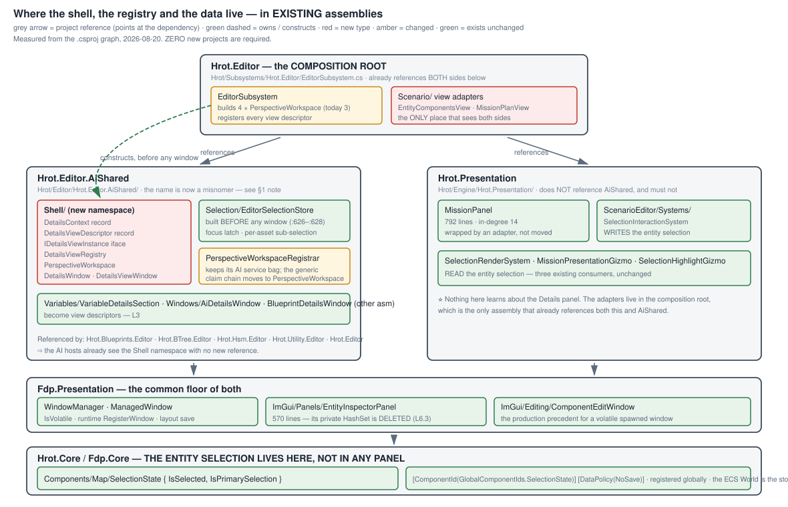

<!--STATUS
state: LIVE
updated: 2026-08-20
current-answer: sections 1-6. Section 1 is the PLACEMENT SPEC (where every type lives and
  who owns it); section 6 is the task breakdown. Everything from "## HISTORY" down is the
  record of how the answer was reached, including leans that were withdrawn.
stale-below: "## HISTORY" and everything under it. Do NOT quote it as the design.
known-rot: none.
known-conflict: Q38's live answer says "RuntimeInspectorWindow IS the shell". Section 1
  places the shell in AiDetailsWindow's line instead: the WINDOW's chrome is reusable, its
  PANE REGISTRY keys on asset kind, and R-112 rules that a feed difference. Stated here
  rather than silently changed.
-->
# ⭐⭐⭐ DESIGN — **the Details panel: one shell, N views, chosen by a predicate**

⭐ **The HOW for rulings already made** — 📄 [`Q38`](Architect_Question_38_One_Details_Panel.md) ·
📄 [`Q47`](Architect_Question_47_The_Entity_Context.md) · `R-98`–`R-122`.
⚠ **`R-27` gates the BUILD on the visual check.** ⛔ No batch dispatches until it passes.

---

## 1. ⭐⭐⭐ WHERE IT LIVES — **the placement spec**



### ⭐⭐ Every type, its home, its owner, its lifetime

| type | assembly · path | ⭐ constructed by | lives for |
|---|---|---|---|
| ⭐⭐⭐ **`SelectionState`** *(the ENTITY selection)* | ✅ **`Hrot.Core`** · `Components/Map/SelectionState.cs` | ⭐ the **ECS World** — a component on the entity | the entity |
| ⭐⭐ **`EditorSelectionStore`** *(asset · sub-selection · focus)* | ✅ `Hrot.Editor.AiShared` · `Selection/` | `EditorSubsystem:626`–`:628` | ⭐⭐ **the session — before any window exists** |
| **`DetailsContext`** | 🆕 `Hrot.Editor.AiShared` · `Shell/` | rebuilt by the workspace when the store fires | one frame's read |
| **`DetailsViewDescriptor`** · **`DetailsViewRegistry`** | 🆕 `Hrot.Editor.AiShared` · `Shell/` | the workspace, at registration | the session |
| **`PerspectiveWorkspace`** *(store + registry + claim chain)* | 🆕 `Hrot.Editor.AiShared` · `Shell/` | ⭐ `EditorSubsystem`, **one per perspective ×4** | the session |
| **`DetailsWindow`** *(the shell)* · **`DetailsViewWindow`** *(float / pin)* | 🆕 `Hrot.Editor.AiShared` · `Shell/` | the composition root · the pin/float gesture | the layout |
| **`IDetailsViewInstance`** implementations | ⭐ **beside the panel each one wraps** | ⭐⭐ **its HOST** — `Create()` per host | its host |
| **scenario view adapters** *(Components · Mission plan)* | 🆕 **`Hrot.Editor`** · `Scenario/` | `EditorSubsystem` | the session |
| `MissionPanel` · `SelectionInteractionSystem` · the three selection renderers | ✅ `Hrot.Presentation` — **unchanged, and it never learns about Details** | — | — |
| `WindowManager` · `ManagedWindow` · `EntityInspectorPanel` · `ComponentEditWindow` | ✅ `Fdp.Presentation` — **unchanged** | — | — |

### ⭐⭐ Why those homes — **measured from the `.csproj` graph, and it needs ZERO new projects**

| 📐 fact | ⇒ |
|---|---|
| `Hrot.Editor.AiShared` → `Fdp.Presentation`, `Fdp.Core` | ⭐ the Shell can use `WindowManager` and `Entity` |
| `Hrot.Blueprints.Editor` · `BTree.Editor` · `Hsm.Editor` · `Utility.Editor` · `Hrot.Editor` → **`AiShared`** | ⭐ **every AI host already sees `Shell/` with no new reference** |
| ⛔ `Hrot.Presentation` ↮ `AiShared` — **neither references the other** | ⭐⭐ so scenario panels **cannot** implement a Shell interface… |
| ⭐⭐⭐ `Hrot.Editor` → **BOTH** `AiShared` **and** `Hrot.Presentation` | …⇒ ⭐⭐ **the scenario adapters live in the composition root**, the only assembly that sees both sides. ⛔ **No new project, and `Hrot.Presentation` stays clean** |

> ⚠ **One honest wart:** ⭐ the Shell is perspective-generic, and it is living in an assembly called
> **`AiShared`**. ⛔ **A rename is NOT part of this design** — it is mechanical, touches ~10 `.csproj`
> files, and buys nothing today. ⭐ **The trigger to do it:** the first non-editor host that needs the
> Shell. Until then the misnomer is cheaper than the churn *(📌 `R-13`)*.

### ⭐⭐ Where the DATA is — **the one-line answer per axis**

| axis | ⭐ owned by | ⛔ NOT owned by |
|---|---|---|
| **entity selection** | ⭐⭐⭐ **the ECS World**, on the entity *(`SelectionState`)* | ⛔ `EntityInspectorPanel`'s `HashSet` · ⛔ `SharedEntitySelection`'s cell — **both deleted** |
| **canvas sub-selection** | `EditorSelectionStore`, keyed by `AssetId` | ⛔ any window |
| **focus** | `EditorSelectionStore.FocusedSurface` *(a latch)* | ⛔ any window |
| **the asset** | the document manager | — |
| **the run state / mode** | `IDebugSessionRegistry` | — |
| ⭐ **an uncommitted edit buffer / a cache / a scroll position** | ⭐⭐ **the view instance — legitimately** | — |

---

## 2. ⭐⭐ THE TYPES

```csharp
// CONTEXT — immutable; focus and selection are TWO axes (R-115).
public sealed record DetailsContext(
    SelectionOrigin                   Focus,
    IReadOnlyList<IAssetSubSelection> Selection,    // a SET, never one-or-null
    IReadOnlyList<Entity>             Entities,     // read from the World, not from a panel
    IEditableAsset?                   Asset,
    string                            Perspective,
    VariableRunState                  Mode);

// VIEW — a DESCRIPTOR + FACTORY. The predicate ships with the view (R-116).
public sealed record DetailsViewDescriptor(
    string Id, string Title, int Rank,
    Func<DetailsContext, bool> AppliesTo,           // over the whole context (R-117)
    Func<IDetailsViewInstance> Create);             // one instance per HOST

public interface IDetailsViewInstance : IDisposable { void Draw(DetailsContext ctx, string imGuiId); }

// REGISTRY  — offer set = descriptors whose predicate passes, ordered by Rank; default = highest.
// WORKSPACE — per perspective: the store, the registry, the claim chain. No services.
// HOSTS     — DetailsWindow (docked) · DetailsViewWindow (float | pin). They differ ONLY in
//             where the context comes from.
```

### ⭐ The three hosting modes

| mode | context | window | predicate false ⇒ | layout save |
|---|---|---|---|---|
| **DOCKED** | live | the shell, one view at a time | falls back by `Rank` | ✅ |
| ⭐⭐ **FLOAT — contextual** | **live** | its own window, anywhere | ⭐⭐ **stays open, grey line** | ✅ **persists** |
| **FLOAT — pinned** *(`R-100`)* | **frozen** at pin time | its own window, titled | n/a | ⛔ `IsVolatile` |

### ⭐ The context key — what "remember my pick" is keyed on

`(Perspective, AssetId, selection SHAPE)`. ⭐ Node A → node B keeps the view; a variable pick remembers
its own. ⛔ When the chosen view stops applying, fall back by `Rank` — ⛔ **never to a blank panel.**

---

## 3. ⭐⭐ THE RULES — **ruling → mechanism, one line each**

| ruling | ⭐ mechanism in this design |
|---|---|
| `R-98` toolbar is a panel switch | offer set from the predicates; default by `Rank`; user's pick remembered per §2's key |
| `R-100` a pin is one titled, volatile instance | `DetailsViewWindow` + frozen context; `TryGetWindow` ⇒ focus a duplicate |
| `R-110` Details in all perspectives, pluggable | `PerspectiveWorkspace` ×4 |
| `R-111` the mode joins the context | `DetailsContext.Mode`; one view, many modes |
| `R-112` "is it about the selection?" | ⛔ **`AssetKind` is never a view key** — a host says so in its own predicate |
| `R-115` context = focus + selection | two independent fields; a pan writes the same set ⇒ same context |
| `R-116` the predicate ships with the view | `DetailsViewDescriptor.AppliesTo` |
| `R-117` a blank panel is a defect | the grey line, at **two** sites: empty offer set · a float whose predicate is false |
| `R-118` the bridge reports, never filters | `MapSelection` → a list; ⭐ the `Count != 1` rule reappears in **one** predicate |
| `R-119` three hosting modes | one window class, one parameter |
| `R-120` a view owns no shared state | descriptor + factory; ⛔ no `Instanceable`, no arbitration |
| `R-121` all four perspectives built alike | `PerspectiveWorkspace` extracted from the registrar's generic half |
| `R-122` entity selection is on the entity | the context reads the World |

---

## 4. ⭐⭐ WHICH SHELL — **three candidates, measured**

| candidate | 📐 | verdict |
|---|---|---|
| `RuntimeInspectorWindow` *(57 ln)* | chrome + `_panes.Find(p => p.TargetKind == asset.Kind)` | ⭐ chrome reusable · ⛔ **registry on the wrong axis** *(`R-112`)* ⇒ **dissolves**: 3 panes → 3 predicated views, chrome → mode-conditional content *(approved)* |
| ⭐⭐ **`AiDetailsWindow`** | one arm, per-perspective, does not claim focus | ⭐⭐⭐ **grow this into `DetailsWindow`** |
| `BlueprintDetailsWindow` *(350 ln)* | two arms + hand-written focus arbitration, `sealed` | ⚠ both arms become views; ⭐ the registry does its arbitration generically |

---

## 5. ⭐⭐ WHAT THE "REGISTRY" IS, AND WHY SCENARIO NEEDS ONE *(`R-121`)*

📐 `PerspectiveWorkspaceRegistrar` fuses **two things**:

| half | what | generic? |
|---|---|---|
| ⭐⭐ **wiring hub** — `RegisterExtraWindow` | a **claim chain**, 9 × `if (window is IX)`; ⭐ windows self-wire, the root passes nothing extra | ✅ **fully** |
| ⚠ **service bag** — the constructor | 21 params: validators · breakpoints · aggregator · facet drawers · live provider/writer | ⛔ AI-authoring only |

⛔ **The generic half is trapped inside the specific one** — which is why Scenario got a bespoke
*"scenario branch"*. ⇒ ⭐ extract **`PerspectiveWorkspace`**; the registrar keeps its bag; **Scenario gets
a workspace carrying scenario services.** ⭐ **Same mechanism, different contents.**

⚠ **The key is inconsistent too:** it is `"Editor"`, relabelled `"Scenario"` *(`EditorSubsystem:3612`)*.
⇒ rename it — ⛔ **with a load migration**, because `CurrentPerspective` and every `OwningPerspective`
are **persisted** and a bare rename silently resets layouts.

---

## 6. ⭐⭐⭐ THE LAYERS — **the task breakdown**

⭐ Each layer is independently shippable and independently railable. ⭐ Every task's rail asserts on a
**store or a returned model** — 📌 `R-21`/`R-62`: the draw is unrailed by construction.

### `L0` — the context *(no UI change)*

| # | task | 📐 seam |
|---|---|---|
| `L0.1` | **selection SET on the store** — `ActiveSubSelections`; `ActiveSubSelection` becomes the derived single | ⭐ every existing reader unchanged |
| ⭐⭐ `L0.2` | ⛔ **the bridge REPORTS, never filters** *(`R-118`)* — map every selected node; empty list only when nothing is selected; an unresolvable node is **dropped**, not fatal | `Blueprint:57` · `BTree:61` · `Hsm:79` — ⭐ three refusals **deleted**, ⛔ not unified. ⚠ **highest-risk task** |
| `L0.3` | `DetailsContext` + the builder | all five sources present |
| `L0.4` | ⛔ **entity selection: DELETE two copies**, read `SelectionState` from the World *(`R-122`)* | ⚠ return the **same list instance** when unchanged, or every view rebuilds per frame |
| **rail** | a marquee of two yields a 2-item context; **a pan yields the same context object as the frame before** | 📌 `M-22` |

### `L1` — the registry *(no UI change)*

`L1.1` descriptor + instance + registry · `L1.2` registration through the existing claim chain
*(⛔ no new root argument — `R-67`)* · `L1.3` `VariableDetailsSection` becomes the first descriptor ·
`L1.4` the node-properties predicate carries `L0.2`'s deleted rule: `ctx.Selection is [BlueprintNodeSelection]`.
**Rail:** the offer set for a measured context, on the **production-built** registry.

### `L2` — the shell *(first visible layer)*

`L2.1` `AiDetailsWindow` → `DetailsWindow` · `L2.2` the toolbar · `L2.3` ⛔ **the grey empty state**,
replacing `AiDetailsWindow:128` and `RuntimeInspectorWindow:54`/`:67`.
**Rail:** an empty offer set returns the grey string.

### `L3` — migrate the views *(all parallel — ⭐ the delegation layer)*

| view | from | predicate |
|---|---|---|
| Variables | `VariableDetailsSection` | outline focus ∧ variable rows |
| ⛔ **Node properties** | `BlueprintDetailsWindow`'s node arm · `InspectorWindow` *(697 ln, 4 arms)* | exactly one node — ⛔ **do not delegate this one** |
| Runtime | the 3 `RuntimeInspectorPane`s | `Mode != Planning` ∧ its asset kind |
| Layout / byte budget · Asset settings | `BlackboardAuthoringWindow` | asset context |
| Diagnostics | `VariablesPanelControl`'s host | asset context |
| Graph signature | `GraphSignatureWindow` *(388 ln)* | Blueprint ∧ a graph row |
| Utility | `InspectorWindow`'s utility arm | utility node / consideration |
| ⛔ Parameter sync | `PARAMETER SYNCHRONIZATION` | ⚠ **LAST** — after the orchestrator wiring *(`R-99`)* |

### `L4` — float and pin *(needs `L1`, not `L2`)*

`L4.1` `DetailsViewWindow(descriptor, contextSource)` · `L4.2` **contextual float** — live context,
`IsVolatile = false`, stable id · `L4.3` **pin** — frozen, `IsVolatile = true` · `L4.4` entry points
*(toolbar affordance + the View menu, so a float is reachable with Details closed)*.
⚠ **A float is restored into contexts that reject it** — that is ordinary, and the grey line is the
answer; ⛔ it may hold **no reference captured at open time**.

### `L5` — retire *(per item, after its replacement is live)*

⭐⭐ **`L4.2` makes retirement lossless** — folding a standalone window into a toolbar no longer removes a
designer's floating placement.
**Retire:** `WatchPanelWindow` *(`R-113`)* · `LiveBlackboardPanel` *(`R-114`)* · `BlueprintVariablesWindow` ·
`BlueprintVariablesManagedWindow` · `InspectorWindow` *(Blueprints)*.
⚠ **MOVED, not retired:** the breakpoint-watch list → Breakpoints *(`Q44`)*.
⛔ **Stays standalone:** `AiWatchWindow` — a curated list kept across selections *(`R-112`)*.

### `L6` — Scenario + the entity context *(`Q47`)*

`L6.1` extract `PerspectiveWorkspace`, give Scenario one, **rename the key with a layout migration** ·
`L6.2` register the entity arm · `L6.3` **Components** view wrapping `EntityInspectorPanel` *(⭐ its
`HashSet` is deleted here; `EntityInspectorPanelMultiSelectTests` re-points at the World)* ·
`L6.4` **Mission plan** view wrapping `MissionPanel`, predicate = brain-equipped *(`R-116`)* ·
`L6.5` the **TKB/component predicate helper**, so each entity-type view is a one-line predicate.
⛔ **Out of scope:** `DerEntityInspectorPanel` — IOS/ExCon only.

### ⭐ Dependency graph

```
L0.1 ─┬─ L0.2 ──┐
      └─ L0.3 ──┴─ L1.1 ─ L1.2 ─┬─ L1.3 / L1.4 ─ L2.1 ─ L2.2 ─ L2.3 ─┬─ L3.* (parallel) ─ L5.*
L0.4 ─────────────────────────── └─ L4.1 ─ L4.2 ─ L4.3 ─ L4.4 ────────┘
                                                    L6.1 ─ L6.2 ─ L6.3 / L6.4 / L6.5
```

⭐ `L0` is the only bottleneck · ⭐ `L3` fans out completely · ⚠ `L6.1` gates all of `Q47`.

### ⚠ Limits — **stated, not discovered later**

| ⚠ | |
|---|---|
| **the draw is unrailed** | `R-21`/`R-62` — ⛔ nothing asserts a toggle appears on screen |
| **`L0.2` is the risk** | three hosts, three current refusals; the *"same set ⇒ same context"* rule must be **measured per host** |
| **`InspectorWindow` is 697 lines / 4 arms** | ⛔ the one `L3` task that is not a mirror-pattern slice |
| **entity selection is `NoSave`** | ⛔ it does not survive a scenario reload — consistent with `94g`, and correct |

---

## ⛔ HISTORY — **how the answer was reached. ⛔ Not the design; do not quote it.**

### 📐 INVENTORY — **what was enumerated before any of this was decided** *(`R-74`, `2026-08-20`)*

```
search_graph(".*(RuntimeInspector|InspectorWindow|InspectorPane|DetailsWindow|DetailsPanel|
  VariablesWindow|VariablesPanel|BlackboardAuthoring|LiveBlackboard|WatchWindow|WatchPanel|
  GraphSignature|BreakpointsWindow).*", label="Class")                              → 52
search_graph(".*(TkbDescriptorRegistry|TkbEntityTypes|MissionPanel).*")             → 62
grep "Count != 1|Count == 0"  {Blueprint,BTree,Hsm}SelectionBridgeHelper.cs         → 3 of 3
grep -rn "IsVolatile" (excl Tests)                                                  → 6
grep "new EditorSelectionStore(" / "CreateRegistrar("  EditorSubsystem.cs           → 3 / 3
```

⭐ **Already built and reused:** the focus latch · the registrar's claim chain · the volatile-window pin
mechanism *(precedent `ComponentEditWindow`)* · the mode axis · per-asset selection memory.

### ⛔ Three leans of mine the user overturned

| my lean | ⭐ what was ruled instead |
|---|---|
| *"unify the three `Count != 1` refusals"* | ⛔ **`R-118`: delete them.** A bridge reports; a predicate decides availability. ⚠ `null` meant *"nothing"* **and** *"more than one"* **and** *"unresolvable"* — three facts flattened into one |
| *"`Instanceable: false` ⇒ re-host, and the shell shows *shown in its own window*"* | ⛔ **`R-120`: a view owns no shared state**, so nothing needs arbitrating. ⭐ `R-110`'s warning was about a symptom |
| *"give Scenario the lighter registrar"* | ⛔ **`R-121`: same mechanism, different contents.** ⚠ the lighter one kept the asymmetry and renamed it |

### ⭐ And one guess of the user's that measurement confirmed outright

*"likely the entity selection is a property of the entity itself, stored in ECS repo which is global"* —
📐 **`SelectionState { IsSelected, IsPrimarySelection }` already exists**, globally registered, written by
`SelectionInteractionSystem` *(click · box-select · `ClearAllSelections`)*, read by three renderers, and
it **already carries the primary**. ⇒ `EntityInspectorPanel`'s `HashSet` and `SharedEntitySelection` are
two later copies. ⚠ **`R-105` is upheld in intent, superseded in mechanism** — a cell shared by four
stores is still an editor-side copy; the World is what all four were trying to agree about.

### ⭐ Closed questions

| | |
|---|---|
| `Q-i` Scenario's registrar | ✅ `R-121` |
| `Q-ii` publish a multi-selection before a view consumes it | ✅ **approved** — the grey line makes it safe; the alternative is a context that lies |
| `Q-iii` `RuntimeInspectorWindow` | ✅ **approved: dissolve** — routed, then removed *(`R-13`)* |
| `Q-iv` two instances of an editing view | ✅ dissolved by `R-120` |
