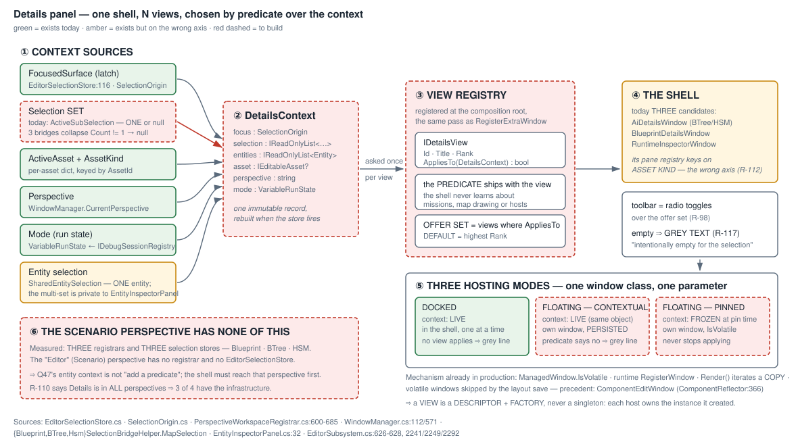

<!--STATUS
state: LIVE
updated: 2026-08-20
current-answer: this whole file — the IMPLEMENTATION design for the rulings made in
  Architect_Question_38 and Architect_Question_47, plus R-118..R-122 which the user ruled
  while reviewing it (sections 2b, 2c, 2d, 4b and 5 L0.2). Where a decision is still open,
  section 7 lists the question with a lean instead of answering it silently.
stale-below: nothing. Section 7's Q-i and Q-iv are struck through in place: both were
  ANSWERED by the user on 2026-08-20 and neither may be quoted as an open question.
known-rot: none. Two of my own leans were WITHDRAWN by the user on 2026-08-20 and are
  marked as withdrawn where they stood: the "Instanceable / shown in its own window"
  re-host rule (superseded by R-120) and "give Scenario the lighter registrar"
  (superseded by R-121). Do not resurrect either from an older reading.
known-conflict: Q38's live answer says "RuntimeInspectorWindow IS the shell". Section 4
  MEASURES three shell candidates and keeps that ruling only in part — the WINDOW is a
  fine shell, its PANE REGISTRY is keyed on asset kind, which R-112 rules is a feed
  difference and never a surface difference. Stated, not silently changed.
-->
# ⭐⭐⭐ DESIGN — **the Details panel: one shell, N views, chosen by a predicate**

> ⭐⭐ **This is the HOW.** ⛔ The WHAT is already ruled — 📄 **[`Q38`](Architect_Question_38_One_Details_Panel.md)**
> *(`R-98`, `R-100`, `R-110`–`R-115`)* and 📄 **[`Q47`](Architect_Question_47_The_Entity_Context.md)**
> *(`R-116`, `R-117`)*. ⛔ **Nothing here re-opens a ruling.**
>
> ⚠ **`R-27` still gates the BUILD on the visual check passing.** ⭐ This document may be written,
> reviewed and split into batches now; ⛔ **no batch dispatches until the check passes.**



---

## 1. ⭐⭐⭐ INVENTORY — **enumerated before deciding anything** *(`R-74`, `2026-08-20`)*

```
search_graph(name_pattern=".*(RuntimeInspector|InspectorWindow|InspectorPane|DetailsWindow|
             DetailsPanel|VariablesWindow|VariablesPanel|BlackboardAuthoring|LiveBlackboard|
             WatchWindow|WatchPanel|GraphSignature|BreakpointsWindow).*", label="Class")   → total 52
search_graph(name_pattern=".*(TkbDescriptorRegistry|TkbEntityTypes|MissionPanel).*")       → total 62
grep -n  "Count != 1|Count == 0"  {Blueprint,BTree,Hsm}SelectionBridgeHelper.cs            → 3 of 3
grep -rn "IsVolatile"      (excl Tests)                                                    → 6
grep -n  "new EditorSelectionStore("  EditorSubsystem.cs                                   → 3
grep -n  "CreateRegistrar("           EditorSubsystem.cs                                   → 3
```

### ⭐⭐ What EXISTS and is REUSED — **the good news, and it is most of the machinery**

| seam | 📐 where | ⭐ what it already gives |
|---|---|---|
| ⭐⭐⭐ **the FOCUS axis** | `EditorSelectionStore:116` `FocusedSurface` + `SelectionOrigin` | **`R-115`'s focus half is BUILT** — a latch, per-frame, idempotent, with the *"only CONTRIBUTORS notify"* rule already enforced |
| ⭐⭐⭐ **the self-wiring registrar** | `PerspectiveWorkspaceRegistrar.RegisterExtraWindow:600`–`685` | ⭐ **a chain of `if (window is IX)` claims.** ⛔ A view registry needs **no new composition-root argument** — 📌 `R-67`, and the reason four services were forgotten before |
| ⭐⭐⭐ **the PIN mechanism** | `ManagedWindow.IsVolatile` · `WindowManager.RegisterWindow:112` · `Render:571` | ⭐⭐ **spawn at runtime · auto-removed when closed · excluded from the saved layout · `Render` iterates a COPY**, so registering mid-frame is safe. ⭐ **Production precedent: `ComponentEditWindow`** *(`ComponentReflector:366`)* ⇒ ⛔ `R-100` needs **no new machinery** |
| ⭐⭐ **the MODE axis** | `VariableRunState` ← `IDebugSessionRegistry`, already threaded as `_runState` | `R-111` reads it; nothing to build |
| ⭐⭐ **per-asset selection memory** | `_subSelectionsByAsset` keyed by `AssetId` | ⭐ **`R-115`'s *"switching document never touches the sub-selection"* is already true of the STORE** |
| ⭐ **a Details window per AI perspective** | `AiDetailsWindow` *(BTree/HSM)* · `BlueprintDetailsWindow` | the shell exists **three times** — §4 |
| ⭐ **the view-sized unit** | `VariableDetailsSection` — *"the host draws it; it does not own a window"* | ⭐⭐ **the `IDetailsView` shape already has one implementation in all but name** |

### ⛔⛔ What is MISSING or on the WRONG AXIS — **the actual work**

| # | gap | 📐 measured |
|---|---|---|
| **G1** | ⛔⛔ **there is no SELECTION SET** | `ActiveSubSelection` is ONE `IAssetSubSelection?`. **All three** bridges write it **every frame**; Blueprint and BTree return `null` on `Count != 1`; ⚠ **HSM is a third variant** — it refuses only `Count == 0` and then re-refuses on a second node. ⇒ ⛔ **a pan can clear the selection** and ⛔ **a multi-pick is indistinguishable from nothing** |
| **G2** | ⛔⛔ **the ENTITY selection is COPIED, twice** | ⭐⭐⭐ **The world already owns it** — `SelectionState { IsSelected, IsPrimarySelection }`, a globally-registered ECS component *(§2d)*. ⛔ `EntityInspectorPanel:32` keeps a private `HashSet<Entity>` and publishes to the editor bus **only when `Count == 1`** *(`:183`)*; `SharedEntitySelection` keeps a **single** `Entity?`. ⇒ ⭐ **the fix is DELETION, not widening** |
| **G3** | ⛔ **no view registry, and the nearest one keys on the wrong thing** | `RuntimeInspectorWindow:59` picks `_panes.Find(p => p.TargetKind == activeAsset.Kind)`. 📌 **`R-112`: a different ASSET TYPE is a FEED difference and never justifies a surface** ⇒ ⛔ **asset kind is not a view key** |
| **G4** | ⛔ **no context record** | focus, selection, asset, perspective and mode are read from five places by whoever needs them |
| **G5** | ⛔⛔ **the SCENARIO perspective is INCONSISTENT with the other three** | **3** `EditorSelectionStore`s and **3** `CreateRegistrar` calls — `Blueprint`, `BTree`, `HSM`. The `"Editor"` *(Scenario)* perspective has **neither** and is *"handled by the scenario branch"* *(`EditorSubsystem:4312`)*. ⚠ **And its very NAME is inconsistent** — the key is `"Editor"`, relabelled `"Scenario"` for display *(`:3612`)*. ⇒ ⭐⭐ **`Q47` is not "add a predicate"; it is "make the fourth perspective like the other three"** — §4b |
| **G6** | ⛔ **no empty-state contract** | `AiDetailsWindow:128` says *"No variable selected."*; `RuntimeInspectorWindow:54`/`:67` say *"No active session."* — ⭐ both honest, ⛔ neither is `R-117`'s **"intentionally empty for the current selection"** |

---

## 2. ⭐⭐ THE MODEL — **four types, and only one of them is new thinking**

```csharp
// ① the CONTEXT — immutable, rebuilt when the store fires. R-115: focus and selection are TWO axes.
public sealed record DetailsContext(
    SelectionOrigin                    Focus,        // ⭐ already latched by the store
    IReadOnlyList<IAssetSubSelection>  Selection,    // ⛔ G1 — a SET, never one-or-null
    IReadOnlyList<Entity>              Entities,     // ⛔ G2 — same, on the entity axis
    IEditableAsset?                    Asset,
    string                             Perspective,  // R-110
    VariableRunState                   Mode);        // R-111

// ② the VIEW is a DESCRIPTOR + A FACTORY — ⛔ NOT a singleton instance. See the measurement below.
public sealed record DetailsViewDescriptor(
    string Id,                                   // stable — every host id and layout key is built from it
    string Title,                                // the toolbar toggle's label
    int    Rank,                                 // highest applicable Rank is the DEFAULT (R-98)
    Func<DetailsContext, bool>       AppliesTo,  // ⭐⭐ R-117 — the whole context, SET included
    Func<IDetailsViewInstance>       Create);    // ⭐ one instance per HOST, not one per registry
    // ⛔ NO "Instanceable" flag — §2c: a view owns no shared state, so every view instances freely.

public interface IDetailsViewInstance : IDisposable
{
    void Draw(DetailsContext ctx, string imGuiId);
}

// ③ the REGISTRY — offer set = every descriptor whose predicate says yes, ordered by Rank.
// ④ the HOSTS — three of them, and they differ ONLY in where the context comes from. See §2b.
```

### ⛔⛔ WHY A FACTORY — **measured, and it is not a style preference** *(`2026-08-20`)*

⭐ **Not because instances must be limited** — 📌 **§2c: they must not be.** ⭐⭐ Because a view legitimately
holds a **cache or an edit buffer**, and two hosts sharing one of those would share a scroll position, a
cached session and a half-typed edit. ⇒ ⭐ **each host calls `Create()` and owns what it made.**

📐 **Every candidate view carries per-instance MUTABLE state:**

| view | what it holds |
|---|---|
| `BlueprintDetailsWindow` | `_session` / `_sessionNodeId` / `_sessionGraphId` / `_sessionNode` — ⭐ **a cached `INodeEditSession` keyed to a node** |
| ⛔⛔ **`GraphSignatureWindow`** | `GraphSignatureEditModel` **Inputs/Outputs** + `_lastSnappedCanvasGraphId` — ⭐⭐ **an UNCOMMITTED EDIT** |
| `VariableDetailsSection` | `_heading` / `_headingAtReadTime` / the table model |

⇒ ⭐⭐⭐ **A singleton view drawn by two hosts would share one scroll position, one cached session and —
on `GraphSignatureWindow` — one half-typed signature edit.** ⛔ **That is a defect, not a quirk**, and it
only becomes reachable the moment a view can live in more than one place *(§2b)*.
⇒ ⭐ **the registry holds DESCRIPTORS; each host calls `Create()` and owns what it made.**

---

## 2b. ⭐⭐⭐ THREE HOSTING MODES — **and they differ ONLY in the context source**

> ⭐⭐ **User, `2026-08-20`, verbatim:** *"if they could optionally live as standalone windows, similarly
> to the pinning, but in this case not being pinned to a concrete context, but stay contextual. so if
> the current context not fitting them… such a window would show just a gray informative text about
> being empty because having nothing to show for that context… the use case is the ability to keep such
> a view floating anywhere the user wants, independently on the detail panel toolbar state."*

| mode | context source | window | ⛔ when the predicate says NO | survives a layout save? |
|---|---|---|---|---|
| ⭐ **DOCKED** *(the toolbar)* | **LIVE** | the shared Details shell, **one view at a time** | it leaves the offer set; the shell falls back by `Rank` | ⭐ yes — it is the shell |
| ⭐⭐⭐ **FLOATING — CONTEXTUAL** *(new)* | ⭐⭐ **LIVE, the same object the shell reads** | ⭐ **its own window, anywhere the user drags it** | ⭐⭐ **it stays open and draws `R-117`'s GREY LINE** — ⛔ it does not close, and ⛔ it does not go blank | ⭐⭐ **YES** — ⛔ **not volatile**: this is a durable layout choice, exactly like today's standalone windows |
| ⭐⭐ **FLOATING — PINNED** *(`R-100`)* | ⛔ **FROZEN** at pin time | its own window, titled by the captured context | ⛔ **not applicable** — its context never changes | ⛔ **no — `IsVolatile`**, by ruling |

⭐⭐⭐ **This collapses two mechanisms into one.** 📌 Ruling 9, at the right level: the pin was going to be
*"the shell with a frozen context source"*; the contextual float is *"the shell with the LIVE context
source"* — ⇒ ⭐ **one window class, one parameter**, and the pin stops being a special case.

### ⭐⭐ Three consequences worth stating

| ⭐ | |
|---|---|
| ⭐⭐⭐ **RETIREMENT BECOMES LOSSLESS** | 📌 `L5` retires `GraphSignatureWindow`, the byte-budget view, the diagnostics list — ⚠ **every one of which a designer may today keep floating beside the canvas.** ⛔ Folding them into a toolbar would have TAKEN that away. ⭐ **With a contextual float it is preserved**, and `R-13`'s *"no rush removals"* is satisfied by construction rather than by argument |
| ⭐⭐ **`R-117`'s grey line has TWO sites, one mechanism** | the shell with an **empty offer set**, and a contextual float whose **own predicate** says no. ⭐ Same string, same rule: ⛔ **a blank panel is a defect, not a state** |
| ⭐⭐⭐ **EVERY view is freely instanceable** | ⛔⛔ **`Instanceable` and *"shown in its own window"* are WITHDRAWN** *(user, `2026-08-20`)*. ⭐ **They solved the wrong problem** — see §2c: a view that owns no shared state can be instanced without limit, so there is nothing to arbitrate |

### ⭐ Three decisions this shape encodes — **each traced to a ruling**

| ⭐ | ruling |
|---|---|
| **the shell asks the VIEW, never a type-switch** | `R-116` — *"each view knows via the predicate what entities it wants to be available for"* ⇒ ⛔ the shell never learns about missions or map drawing |
| **`AppliesTo` takes the CONTEXT, not a selection item** | `R-117` — over a SET; ⭐ a single-entity view **says so in its own predicate** |
| **`Rank` decides the default, the USER's pick wins after that** | `R-98` — *"the context decides which are OFFERED and which is DEFAULT; the user picks with radio toggles"* |

### ⚠ One thing the shape deliberately does NOT do

⛔ **It does not make a view an `IRuntimeInspectorPane`, and it does not key anything on `AssetKind`.**
📌 `R-112`. ⭐ A host-specific view expresses its host **in its predicate** — `ctx.Asset?.Kind == BTree` —
which is a **feed** statement made by the view, ⛔ not a surface distinction made by the shell.

---

## 2c. ⭐⭐⭐ WHO OWNS THE STATE — **the view owns none of it** *(user, `2026-08-20`)*

> ⭐⭐⭐ **User, verbatim:** *"Better if the view does not need to own its state; the state the view is
> viewing should rather be stored elsewhere outside of a concrete view instance, shareable and watchable
> by any number of views; only a local and temporary editing/caching context can be local to the view.
> The shell that should owns the shareable state should exist independently on whether any view is shown
> at all and before any UI is instantiated."*

⛔⛔ **This WITHDRAWS `Instanceable` and the re-host rule**, and it is a better answer than either.
⭐⭐ **`R-110`'s *"sharing is preferred for editing views"* was a WARNING ABOUT A SYMPTOM.** ⇒ ⭐⭐⭐ **remove
the cause and the warning has nothing left to warn about.**

### ⭐ Three tiers, and the line between them is sharp

| tier | ⭐ owned by | lives | example |
|---|---|---|---|
| ⭐⭐⭐ **SHARED, WATCHABLE STATE** | ⭐⭐ **a store built at the COMPOSITION ROOT, before any window exists**, and outliving every view instance | the whole session | the asset · the selection · the entity world · the run state |
| ⭐ **LOCAL EDITING / CACHING CONTEXT** | the view instance — ⭐ **legitimately** | as long as that instance | an uncommitted edit buffer · a scroll position · a memoised lookup |
| ⛔ **anything else** | ⛔ **nobody** — ⭐ **a view holds no fact another view would need** | — | — |

⭐⭐ **The pattern is already established, not invented here:** 📐 `EditorSelectionStore` is constructed at
`EditorSubsystem:626`–`:628` — **before any window**, with no UI dependency, and windows subscribe to
`OnSelectionChanged`. ⇒ ⭐ **this design GENERALISES that object rather than adding a new idea.**

### 📐 Re-measured against the three views — **and the picture is better than §2 first suggested**

| view state | ⭐ which tier | ⇒ |
|---|---|---|
| `BlueprintDetailsWindow._session` *(cached `INodeEditSession` + its node/graph ids)* | ⭐ **a CACHE** | ✅ **stays local** — ⚠ it must be **keyed on the context and re-derived when the context changes**, ⛔ never trusted across a change |
| `GraphSignatureWindow`'s `GraphSignatureEditModel` Inputs/Outputs | ⭐ **an uncommitted EDIT BUFFER**; ⭐⭐ **the committed signature already lives in `BlueprintAsset`** — shared | ✅ **stays local.** ⛔ Two instances holding two buffers is **the same as two text editors on one file** — the user's own doing, not an architecture defect; ⭐ **the shared asset raises the change and each buffer re-reads** |
| `VariableDetailsSection._heading` / `_headingAtReadTime` | ⚠ **DERIVED from the context** | ⛔ **stops being stored** — the context already says what the panel is about |
| ⛔⛔ **`EntityInspectorPanel._selectedEntities`** | ⛔⛔ **SHARED STATE HELD PRIVATELY** | ⭐⭐⭐ **the one genuine violation** — and §2d shows the world already owns it |

### ⭐⭐ The checkable rule this produces

> ⛔ **A view may not hold a fact that another view, a rail, or a headless caller would have to ask it
> for.** ⭐ If something wants to ask a view a question, the answer belongs in the store.

⭐ **And that is also what makes the views RAILABLE** — 📌 `R-21`/`R-62`: the draw cannot be exercised, so
**every assertion in this design is on a store or a returned model.** ⛔ A view that owned state would be
a view whose state no rail could reach.

---

## 2d. ⛔⛔⛔ THE ENTITY SELECTION IS A PROPERTY OF THE ENTITY — **and it is ALREADY BUILT**

> ⭐⭐ **User, verbatim:** *"The entity selection on the map or anywhere else we show the selectable
> entity list is something that is editor global and should not be a local property of any concrete
> perspective… Not even entity inspector should be the owner of the entity selection set… likely the
> entity selection is a property of the entity itself (stored in ECS repo which is global) so it should
> not need any hash in entity inspector."*

📐 **MEASURED — the guess is exactly right, and the component exists today:**

```csharp
// Hrot.Core/Components/Map/SelectionState.cs — namespace Hrot.IG.Components
[ComponentId(GlobalComponentIds.SelectionState)] [DataPolicy(DataPolicy.NoSave)]
public struct SelectionState { public bool IsSelected; public bool IsPrimarySelection; }
```

| | 📐 |
|---|---|
| **registered globally** | `PresentationComponentRegistry:18` · `IgRoleComponentRegistry:26` |
| **written by** | `SelectionInteractionSystem` — click, **box-select**, and `ClearAllSelections()` |
| **read by** | `SelectionRenderSystem` · `MissionPresentationGizmo` · `SelectionHighlightGizmo` |
| ⭐⭐ **and it already carries the PRIMARY** | `IsPrimarySelection` — *"only one entity holds it at a time"* |

⇒ ⭐⭐⭐ **`EntityInspectorPanel._selectedEntities` and `SharedEntitySelection.Selected` are TWO MORE
COPIES of a fact the world already holds** — ⛔ **and one of them is a SET flattened to a single entity.**

### ⚠⚠ This does NOT overturn Batch 95 — **say so plainly**

📌 **`R-105`** ruled *"`SelectedEntity` is GLOBAL"* and `95b` built `SharedEntitySelection` to fix a real
defect *(four stores, one connected ⇒ every live value `(pending)`)*. ⭐⭐ **The intent is UPHELD and the
mechanism is superseded by a strictly more global one**: ⛔ a cell shared by four stores is still an
editor-side copy; **the world is the thing all four were trying to agree about.**

### ⭐ What this changes in the plan

| ⭐ | |
|---|---|
| **`G2` shrinks** | ⛔ **not** *"widen the shared cell to a set"* ⇒ ⭐ **"delete two copies and query the world"** |
| **`L0.4` becomes a RETIREMENT** | `EntityInspectorPanel` publishes nothing and keeps no `HashSet`; it **queries** `With<SelectionState>()` like every other reader |
| ⚠ **one implementation note** | ⭐ the context builder must return **the same list instance when the selection has not changed** — ⛔ otherwise `DetailsContext` compares unequal every frame and every view rebuilds. 📌 the same rule `L0.2` needs for the pan |
| ⚠ **and one limit** | `[DataPolicy(NoSave)]` ⇒ ⛔ **the selection does not survive a scenario reload** — ⭐ consistent with `94g`, and correct |

---

## 3. ⭐⭐⭐ THE CONTEXT KEY — **what "remember my pick" is keyed on**

⚠ **`R-98` gives the user a pick; nothing says how long it survives.** ⭐ The measured store already
answers it: `_subSelectionsByAsset` is keyed by `AssetId`, so **the pick follows the same rule**.

| the pick is remembered per… | ⭐ so that |
|---|---|
| `(Perspective, AssetId, selection SHAPE)` | ⭐⭐ clicking node A then node B **keeps** the chosen view; ⭐ clicking a VARIABLE offers the variable views and **remembers its own last pick** independently |
| ⛔ **not per selected item** | otherwise every node click resets the toolbar — 📌 the failure `R-98` calls *"the panel changing what it is about"* |
| ⛔ **cleared when the chosen view stops applying** | ⭐ falls back to the highest-`Rank` applicable view; ⛔ **never to a blank panel** *(`R-117`)* |

---

## 4. ⛔⛔ WHICH SHELL — **`Q38` said one thing, the measurement says one and a half**

📄 `Q38`'s live answer: *"`RuntimeInspectorWindow` **IS the shell**, and the pane registry the toolbar
needs is already there."* ⭐ **The first half survives measurement. The second does not.**

| candidate | 📐 measured | verdict |
|---|---|---|
| **`RuntimeInspectorWindow`** *(57 lines)* | renders lifecycle status + mode controls + scrub bar, then `_panes.Find(p => p.TargetKind == activeAsset.Kind)` | ⭐ **the CHROME is reusable · ⛔ the REGISTRY is on the wrong axis** *(`R-112`)* ⇒ its three panes become **views with predicates**, and its runtime chrome becomes **mode-conditional content** *(`R-111`)* |
| **`AiDetailsWindow`** *(BTree/HSM)* | ONE arm, hosts `VariableDetailsSection`, **deliberately does not claim focus** | ⭐⭐ **THIS IS THE SHELL TO GROW.** It is already the window titled *"Details"*, already per-perspective, already non-claiming |
| **`BlueprintDetailsWindow`** *(350 lines)* | TWO arms + focus arbitration + `sealed`, and its own doc says unsealing it *"would drag `Hrot.Blueprints.Editor` into the AI perspectives"* | ⚠ **its arms become TWO VIEWS**; ⭐ the arbitration it does by hand *(`:261`)* is exactly what the registry does generically |

⇒ ⭐⭐⭐ **The shell is `AiDetailsWindow` generalised and moved to `AiShared`, hosting a toolbar over the
registry.** ⛔ **Not a fourth window** — 📌 ruling 9, and the reason `Q38` warned *"do not write a third
shell."*

⚠ **`BlueprintDetailsWindow` is retired only when both of its arms are views** — 📌 `R-13`: this is
**duplicate CODE** *(route it)*, ⛔ not a duplicate surface and ⛔ not dead.

---

## 4b. ⭐⭐⭐ WHAT THE "REGISTRY" IS, AND WHY SCENARIO MUST HAVE ONE *(user, `2026-08-20`)*

> ⭐⭐ **User:** *"you mentioned that editor perspective (it should be rather called scenario perspective)
> is missing some kind of registry the other perspective have; this is not consistent; what kind of
> registry is it? scenario perspective should be consistent with others."*

### ⭐ What it actually is — **TWO things fused into one class**

📐 `PerspectiveWorkspaceRegistrar` takes **21 constructor parameters**, and they split cleanly:

| half | what it is | ⭐ perspective-generic? |
|---|---|---|
| ⭐⭐⭐ **the WIRING HUB** — `RegisterExtraWindow` | ⭐ a **claim chain**: `if (window is IX) …` ×9 today *(outline↔details · edit gestures · live projection · watch toggle · properties host · focus claims)*. ⛔ **Windows self-wire; the composition root passes nothing extra** *(`R-67`)* | ✅ **entirely generic** — nothing in it is about AI authoring |
| ⚠ **the SERVICE BAG** — the constructor | validators · breakpoints · sanitizers · comparison export · blackboard aggregator · action-schema exporter · facet drawers · live value provider · live writer | ⛔ **AI-authoring specific** |

⇒ ⭐⭐⭐ **The inconsistency is real, and it is that the GENERIC half is trapped inside the SPECIFIC one.**
⛔ Scenario was given a bespoke *"scenario branch"* because taking the hub meant taking the bag.

### ✅ The answer — **same mechanism, contents differ** *(this is what consistency MEANS here)*

| ⭐ | |
|---|---|
| **①** | ⭐⭐ **Extract the wiring hub** — a `PerspectiveWorkspace` that owns the perspective's **selection store**, the **view registry** and the **claim chain**. ⛔ **No services** |
| **②** | ⭐ `PerspectiveWorkspaceRegistrar` **keeps its name and its bag** and becomes the AI hosts' workspace **plus** those services |
| **③** | ⭐⭐⭐ **Scenario gets a workspace too — the SAME class**, carrying **scenario** services *(entity world access · TKB registry · mission service)* instead of blackboard ones |
| **④** | ⇒ ⭐⭐ **all four perspectives are built the same way**, and `R-110`'s *"Details in ALL perspectives"* becomes true by construction rather than by a fourth special case |

⛔⛔ **This SUPERSEDES my earlier lean** *(old `Q-i`: *"give Scenario only the lighter one"*)* — ⚠ **that
would have kept the asymmetry and merely renamed it.** ⭐ **The user's rule is better: one mechanism,
different contents.**

### ⚠ And the NAME is inconsistent too — **worth fixing in the same pass**

📐 The perspective **key** is `"Editor"`; `EditorSubsystem:3612` calls
`RegisterPerspectiveLabel("Editor", "Scenario")` so the menu reads *"Scenario"*.
⇒ ⭐ **rename the key to `"Scenario"`** and drop the relabel.
⚠⚠ **One consequence, and it is checkable:** the key is **persisted** — `WindowManager.SaveSettings`
stores `CurrentPerspective`, and `OwningPerspective` strings key every window's saved state.
⇒ ⛔ **a bare rename silently resets a user's layout** — ⭐ **it needs a one-line migration on load**
*(`"Editor"` → `"Scenario"`)*, ⛔ not a find-and-replace.

---

## 5. ⭐⭐⭐ THE LAYERS — **each is independently shippable and independently railable**

> ⭐ **Layer N does not need layer N+1 to be useful.** ⛔ No layer leaves the editor in a worse state
> than it found it. ⭐ **Each task names its acceptance rail**, because a rail asserted on the
> CONSTRUCTED object is what this programme has learned to demand *(`M-22`, `R-67`)*.

### ⭐⭐ `L0` — **the CONTEXT, and the two conflicts it fixes** *(no UI change at all)*

| task | ⭐ what | 📐 seam verified |
|---|---|---|
| **`L0.1`** | ⭐⭐⭐ **a SELECTION SET on the store** — `ActiveSubSelections` *(list)* with `ActiveSubSelection` kept as **the derived single** *(`Count == 1 ? [0] : null`)* | ⭐ **every existing reader is unchanged** — the same optional-and-preferred shape the row seams used seven times |
| **`L0.2`** | ⛔⛔⛔ **THE BRIDGE REPORTS; IT NEVER FILTERS** — `MapSelection` returns **every** selected node mapped, and an **empty list** only when nothing is selected. ⭐ **A PAN that reports the same set writes the same set** ⇒ no clear | 📌 **all three measured**: `Blueprint:57` · `BTree:61` · `Hsm:79` — ⚠ **three different refusals of the same shape** ⇒ ⭐ **deleted, not unified** — see the box below |
| **`L0.3`** | ⭐ the **`DetailsContext`** record + a builder that reads the store, the window manager and the run state | ⭐ all five sources measured and present |
| **`L0.4`** | ⛔⛔ **the ENTITY set is a DELETION, not a widening** *(§2d)* — the context reads **`SelectionState` from the world**; ⭐ `EntityInspectorPanel`'s private `HashSet` and `SharedEntitySelection`'s single cell both **go** | 📐 `SelectionState` is globally registered and already written by `SelectionInteractionSystem` *(click · box-select · `ClearAllSelections`)* and read by three renderers. ⚠ **`R-105`'s INTENT is upheld** — the world is strictly more global than the cell `95b` built |
| ⭐ **rail** | **a marquee of two nodes yields a 2-item context; a pan yields the SAME context object as the frame before** — ⛔ not *"the bridge was called"* | 📌 `M-22` |

> ### ⭐⭐⭐ `L0.2` — **the same predicate concept, one layer down** *(user, `2026-08-20`)*
>
> ⭐⭐ **User, verbatim:** *"lets use same concept of predicates that can read the selection set and
> decide to be available or not."*
>
> ⛔⛔ **The three `Count != 1` lines are a VIEW'S JOB done in the WRONG PLACE.** 📐 Each bridge is
> deciding *"is this selection usable?"* — ⭐ **but usable BY WHOM?** A node-properties view wants
> exactly one; a *"3 nodes selected"* summary wants many; a byte-budget view does not care at all.
> ⇒ ⭐⭐⭐ **the bridge cannot answer that question, and today it answers it for everybody — as `null`.**
>
> | ⭐ the rule | |
> |---|---|
> | ⭐⭐⭐ **REPORTING and AVAILABILITY are two jobs** | the bridge **reports what is selected**; the **predicate decides who applies to it** |
> | ⛔ **an empty list means NOTHING IS SELECTED** | ⚠ today `null` means *"nothing selected"* **and** *"more than one"* **and** *"a node I could not resolve"* — ⭐ **three facts flattened into one**, which is why a pan is indistinguishable from a deselect |
> | ⭐ **a node that resolves to no record is DROPPED, and that is not a refusal** | ⛔ it must not cause the **other** selected nodes to vanish — 📌 today's `Blueprint:65`–`:70` walk returns `null` for the whole selection when one node is unknown |
> | ⭐⭐ **the `Count != 1` logic is not moved — it is DELETED** | ⭐ it **reappears as one line in the node-properties view's predicate**: `ctx.Selection is [BlueprintNodeSelection]`. ⛔ Nothing is lost; ⭐ it is stated where it is true |
>
> ⇒ ⭐⭐ **`L0.2` gets SMALLER, not larger** — three refusal blocks removed, one `Select` kept.

⚠ **`L0.2` is the one place a behaviour visibly changes without any new UI** — ⭐ and it changes it
**towards** `R-115`. ⛔ If it is deferred, every later layer inherits a context that lies.

### ⭐⭐ `L1` — **the registry** *(still no UI change: one view registered, same output)*

| task | ⭐ what |
|---|---|
| **`L1.1`** | ⭐⭐ **`DetailsViewDescriptor` + `IDetailsViewInstance` + `DetailsViewRegistry`** *(offer set · `Rank` default · the remembered pick, §3)* — ⛔ **descriptors, never instances** *(§2)* |
| **`L1.2`** | ⭐⭐ **registration through the registrar's existing claim chain** — `if (window is IDetailsViewSource src) registry.AddRange(src.Views);` ⛔ **no new composition-root argument** *(`R-67`)* |
| **`L1.3`** | ⭐ **`VariableDetailsSection` becomes the FIRST descriptor** — predicate: *"the focus is the outline and the selection names variable rows"*; ⭐ `Create()` returns a fresh section, which is already how it is built |
| ⚠ **`L1.4`** | ⭐ **the node-properties predicate carries `L0.2`'s deleted rule** — `ctx.Selection is [BlueprintNodeSelection]` ⇒ ⛔ **the single-selection requirement is stated ONCE, by the view that has it** |
| ⭐ **rail** | ⭐⭐ **the offer set for a measured context**, asserted on the **registry built by the production registrar** — ⛔ never on a registry a test `new`s |

### ⭐⭐⭐ `L2` — **the shell and the toolbar** — *the first layer the user SEES*

| task | ⭐ what |
|---|---|
| **`L2.1`** | `AiDetailsWindow` → **`DetailsWindow` in `AiShared`**, hosting toolbar + active view; ⭐ **one instance per perspective**, as today |
| **`L2.2`** | ⭐ **the toolbar** — radio toggles over the offer set, default by `Rank`, pick remembered per §3's key |
| **`L2.3`** | ⛔⛔ **the EMPTY STATE** — `R-117`'s grey *"intentionally empty for the current selection"*, ⭐ **including the multi-node case `R-115` left open**. ⛔ Replaces `AiDetailsWindow:128` and `RuntimeInspectorWindow:54`/`:67` |
| ⭐ **rail** | a context with **no applicable view** renders the grey line — ⭐ **asserted as a STRING the panel returns**, ⛔ not by drawing *(`R-21`/`R-62`: the draw is unrailed by construction)* |

### ⭐ `L3` — **migrate the views** — *one task per view, all independent, all mirror-pattern*

⭐⭐ **This is the layer to delegate** *(a Sonnet subagent per the model-delegation preference)* — ⛔ each
one is *"wrap an existing panel, write its predicate, register it."*

| view | from | ⭐ its predicate, in one line |
|---|---|---|
| **Variables** | `VariableDetailsSection` | outline focus ∧ the selection names variable rows |
| **Node properties** | `BlueprintDetailsWindow`'s node arm · `InspectorWindow` *(AiShared, 697 lines — facets, default value, param sync, utility)* | canvas focus ∧ selection is exactly one node |
| **Runtime** | the **three** `RuntimeInspectorPane`s | ⭐ `Mode != Planning` ∧ the asset kind this feed serves |
| **Layout / byte budget** | `BlackboardAuthoringWindow`'s bin-pack | ⭐ asset context *(no sub-selection)* |
| **Asset settings** | `BlackboardAuthoringWindow`'s asset switches | asset context — ⚠ **genuinely mis-homed today** |
| **Diagnostics** | `VariablesPanelControl`'s host *(auto-allocations, unbound requirements)* | asset context |
| **Graph signature** | `GraphSignatureWindow` *(388 lines)* | Blueprint ∧ a graph row is selected |
| **Utility** | `InspectorWindow`'s utility arm | selection is a utility node or consideration |
| ⛔ **Parameter sync** | `PARAMETER SYNCHRONIZATION` | ⚠ **LAST, and only after the orchestrator wiring** — 📌 `R-99`: *"promoting an inert panel is worse than leaving it buried"* |

### ⭐⭐ `L4` — **view INSTANCES: float and pin** *(`R-100` + the user's `2026-08-20` float)* — ⭐⭐ **verified: no new machinery**

⭐⭐⭐ **One window class, `DetailsViewWindow`, parameterised by its context source** *(§2b)*. ⛔ **Not two.**

| task | ⭐ what | 📐 verified |
|---|---|---|
| **`L4.1`** | ⭐⭐ **`DetailsViewWindow(descriptor, contextSource)`** — hosts **one** view instance from `Create()`, draws the grey line when `AppliesTo` is false | ⭐ `ComponentEditWindow` already spawns a runtime window in production |
| **`L4.2`** | ⭐⭐⭐ **CONTEXTUAL float** — `contextSource = LIVE`, ⛔ **`IsVolatile = false`** *(it survives the layout save — it is a durable placement, not a captured moment)*, id `= details_view_{viewId}_{perspective}` | `WindowManager.SaveSettings` keys on the window id ⇒ a stable id is all persistence needs |
| **`L4.3`** | ⭐ **PINNED float** — `contextSource = FROZEN snapshot`, `IsVolatile = true` *(`R-100`)*, id `= (viewId, assetId, selectionKey)`, title carries the captured context | `ManagedWindow.Title` has a `protected set`; volatile windows are skipped by `SerializeToIniSection` **and** `SaveSettings` |
| **`L4.4`** | ⭐ **the entry points** — a small *"open in own window"* affordance on the toolbar toggle *(contextual)* beside the existing pin gesture *(frozen)*; ⭐ **and the contextual float appears in the View menu** | `ManagedWindow.ShowInMenu` exists — ⭐ ⇒ ⛔ **a float is discoverable without the Details panel being open at all**, which is the point of it |
| ⛔ ~~`L4.5`~~ | ⛔⛔ **WITHDRAWN — there is no re-host and no `Instanceable`** | 📌 **§2c**: ⭐ a view owns no shared state ⇒ **every view floats freely, docked or not** |
| ⚠ **known limits** | ⛔ a **pin** does not survive a scenario reload *(the open `94g`)*, ⭐ and `IsVolatile` means it does not survive a layout save **by ruling**. ⭐ **A contextual float survives both** — ⚠ **and must therefore tolerate being restored into a context its predicate rejects**, which is exactly the grey line |

### ⭐ `L5` — **retire** — ⛔ **only after the view that replaces each one is live**

> ⭐⭐⭐ **`L4.2` changes what "retire" COSTS.** ⛔ Before the contextual float, folding
> `GraphSignatureWindow` *(or the byte budget, or diagnostics)* into a toolbar **took away a window a
> designer could keep beside the canvas.** ⭐ **With the float, the same surface is still available as a
> standalone window — it is now just contextual and predicate-gated.**
> ⇒ ⭐⭐ **`R-13`'s *"no rush removals"* is satisfied BY CONSTRUCTION**, not by argument, and every row
> below is honestly a **duplicate CODE** case rather than a lost affordance.

| retire | ⭐ label *(`R-13`)* |
|---|---|
| `WatchPanelWindow` *(`R-113`)* · `LiveBlackboardPanel` *(`R-114`)* | **duplicate SURFACE**, and the design says retire |
| `BlueprintVariablesWindow` · `BlueprintVariablesManagedWindow` · `InspectorWindow` *(Blueprints, 70 lines)* | **duplicate CODE** ⇒ routed by `L3`, then removed |
| ⚠ **the breakpoint-watch list** | ⛔ **not retired — MOVED** to the Breakpoints window *(`R-113` + `Q44`)* |
| ⛔ **`AiWatchWindow`** | ⭐ **STAYS STANDALONE** — a curated list kept across selections *(`R-112`)* |

### ⛔⛔ `L6` — **the SCENARIO perspective and the entity context** *(`Q47`)* — **a layer, not a task**

⚠⚠ **This is the finding that reorders the plan.** 📐 The Scenario perspective has **no
`EditorSelectionStore` and no `PerspectiveWorkspaceRegistrar`.**

| task | ⭐ what |
|---|---|
| **`L6.1`** | ⭐⭐⭐ **extract `PerspectiveWorkspace` and give SCENARIO one, the same as the other three** — 📌 **§4b**; ⭐ **and rename the perspective key `"Editor"` → `"Scenario"` with a layout migration** |
| **`L6.2`** | the **entity** arm of `DetailsContext` becomes real — ⭐ `L0.4` already supplies it **from the world**, so this is registration, not plumbing |
| **`L6.3`** | **Components** view — wrap `EntityInspectorPanel` *(570 lines, already multi-select-capable)*; predicate: ≥1 entity. ⭐⭐ **Its `_selectedEntities` field is deleted here** *(§2d)* — ⚠ `EntityInspectorPanelMultiSelectTests` must be re-pointed at the world, ⛔ not at the panel |
| **`L6.4`** | **Mission plan** view — wrap `MissionPanel` *(792 lines, in-degree 14)*; ⭐ predicate: **brain-equipped entities only** — 📌 `R-116` |
| **`L6.5`** | ⭐⭐ **the TKB/component predicate helper** — `TkbDescriptorRegistry` keyed by `TkbEntityTypes` ⇒ *"this entity has component X / TKB record Y"*, ⭐ **so every entity-type view writes a one-line predicate** |
| ⛔ **out of scope** | `DerEntityInspectorPanel` — **IOS/ExCon only** *(`R-116`)* |

---

## 6. ⭐⭐ THE DEPENDENCY GRAPH — **what may run in parallel**

```
L0.1 ─┬─ L0.2 ──┐
      └─ L0.3 ──┴─ L1.1 ─ L1.2 ─┬─ L1.3 / L1.4 ─ L2.1 ─ L2.2 ─ L2.3 ─┬─ L3.* (all parallel) ─ L5.*
L0.4 ─────────────────────────── └─ L4.1 ─ L4.2 (float) ─ L4.3 (pin) ─┘
                                                    L6.1 ─ L6.2 ─ L6.3 / L6.4 / L6.5
```

| ⭐ | |
|---|---|
| ⭐⭐ **`L0` is the only true bottleneck** | everything reads the context |
| ⭐⭐ **`L3` fans out completely** | ⭐ nine independent mirror-pattern tasks once `L2` lands — **the delegation opportunity** |
| ⭐⭐ **`L4` needs only `L1`, NOT `L2`** | ⭐⭐⭐ **a float is a descriptor + a live context + a window — the toolbar is not involved.** ⇒ ⛔ **the ordering assumption changed**: a contextual float could ship **before** the shell, and `L5`'s retirements would already be lossless. ⚠ Kept after `L2` only because the *"open in own window"* affordance lives on the toolbar — ⭐ **the View menu is an entry point that does not** |
| ⚠ **`L6.1` gates all of `Q47`** | ⛔ and it is a design question first — §7 |
| ⛔ **`L5` is last, per item** | ⭐ retire a surface only when its replacement view is live *(`R-13`)* |

---

## 7. ⛔ WHAT THIS DESIGN DOES **NOT** DECIDE — **three questions, with my lean**

⭐ **Stated rather than assumed** — 📌 the rule that an uncited design claim is a defect.

| # | question | ⭐ my lean, for approval |
|---|---|---|
| ~~**Q-i**~~ | ~~Does Scenario get a full registrar, or only a store + registry?~~ | ✅✅ **ANSWERED `2026-08-20` by the user — §4b.** ⭐⭐ **Same mechanism for all four perspectives; the CONTENTS differ.** ⛔ **My *"give Scenario the lighter one"* lean is WITHDRAWN** — ⚠ it would have kept the asymmetry and merely renamed it |
| **Q-ii** | ⚠ **Does `L0.2` publish a multi-selection that no view yet consumes?** | ⭐ **Yes — and `L2.3`'s grey line is exactly what makes that safe.** ⛔ The alternative *(keep collapsing until a view exists)* means the context lies for three more layers |
| **Q-iii** | ⚠ **Does `RuntimeInspectorWindow` survive as a window, or dissolve entirely into views?** | ⭐ **Dissolve.** Its chrome is `R-111` mode-conditional content and its registry is on the wrong axis ⇒ ⛔ keeping it is keeping a second shell. ⚠ **`R-13`: this is duplicate CODE, so it is ROUTED then removed — not deleted first.** ⭐ **And `L4.2` means nothing is lost** — anyone who kept it floating keeps a floating Runtime view |
| ~~**Q-iv**~~ | ~~What happens when a view holding an uncommitted edit is floated while also docked?~~ | ✅✅ **DISSOLVED `2026-08-20` by the user — §2c.** ⭐⭐⭐ **The question only existed because a view owned state it should not own.** ⛔ `Instanceable` and *"shown in its own window"* are **withdrawn**; ⭐ an edit BUFFER is legitimately view-local and the committed state was always in the asset |

---

## 8. ⭐ WHAT WOULD MAKE THIS DESIGN WRONG — **the honest limits**

| ⚠ | |
|---|---|
| ⛔ **The DRAW is unrailed by construction** *(`R-21`/`R-62`)* | ⭐ every rail here asserts on a **returned model** — the offer set, the empty-state string, the chosen view id. ⛔ **Nothing asserts a toggle appears on screen**, and no rail in this programme ever can |
| ⚠ **`L0.2` is the highest-risk task** | ⭐ it changes selection behaviour on **three hosts** with **three different current refusals**. ⛔ If any host's canvas reports a transiently-empty selection during a pan, the *"same set ⇒ same context"* rule is what saves it — ⭐ **that must be measured per host, not assumed** |
| ⚠ **`InspectorWindow` is 697 lines with four arms** | ⭐ `L3`'s node-properties task is the one that is **not** a mirror-pattern slice. ⛔ Do not delegate that one |
| ⚠⚠ **a restored contextual float can outlive its own predicate** | ⭐ `L4.2` persists the float across sessions ⇒ ⛔ **it WILL be restored into a context that rejects it** — on the wrong perspective, with nothing selected, on a document that was not reopened. ⭐ **That is not an error path, it is the ordinary case**, and the grey line is the whole answer. ⚠ **A float must therefore hold NO reference captured at open time** — it reads the live context every frame or it lies |
| ⭐ **`R-27` gates everything** | ⛔ the visual check has not been re-run since Batches 96–98 |
