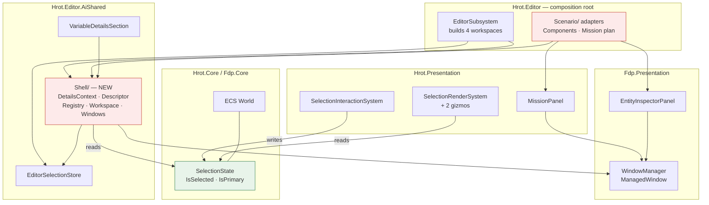
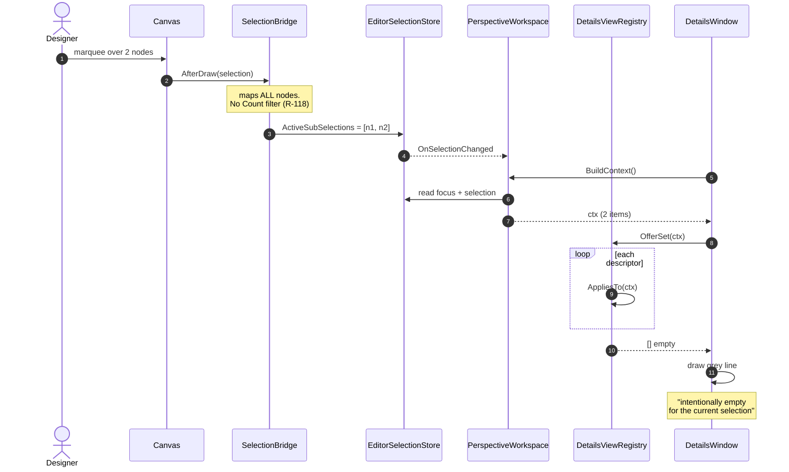
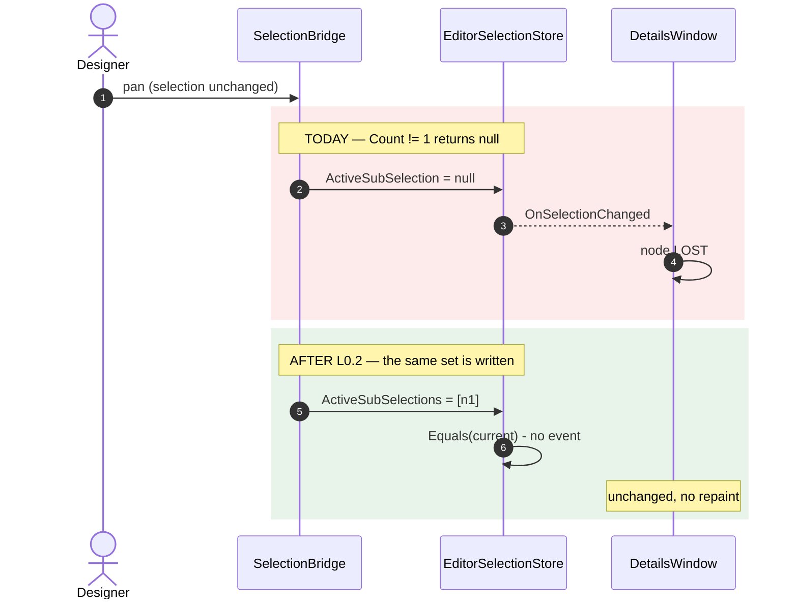
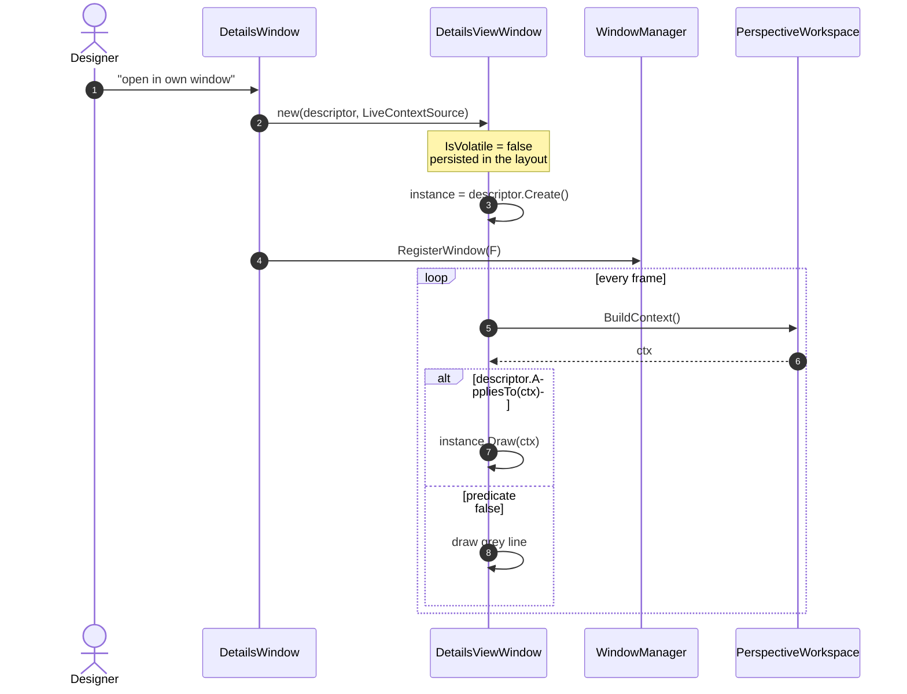
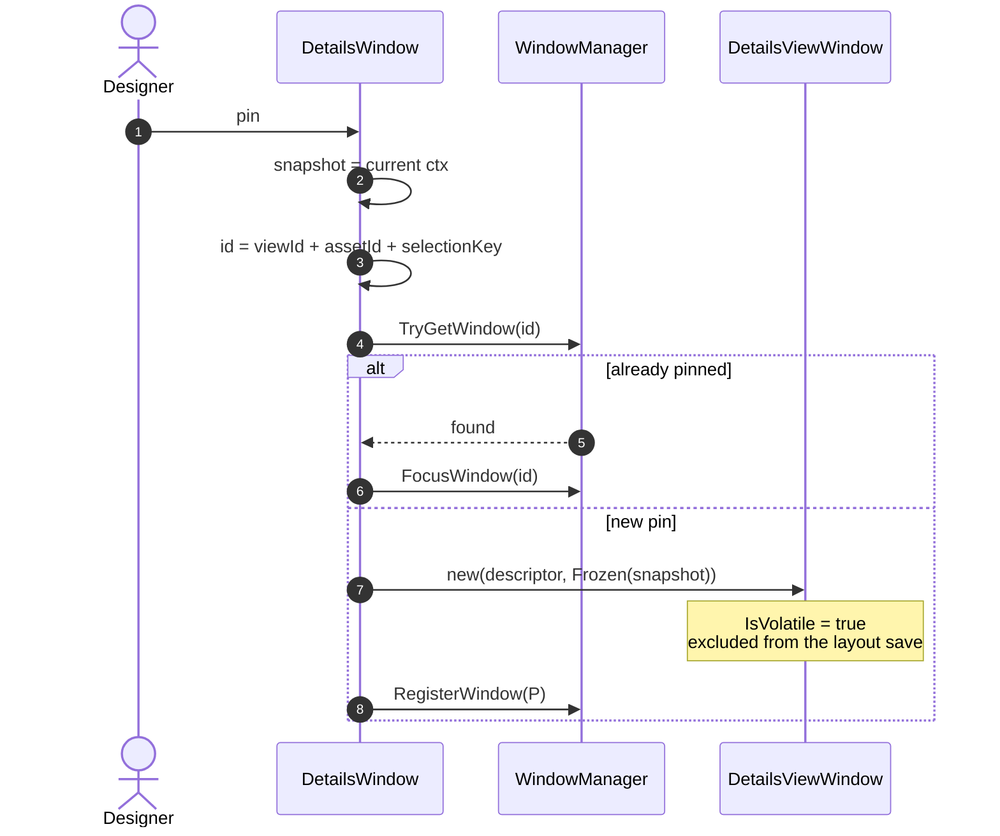
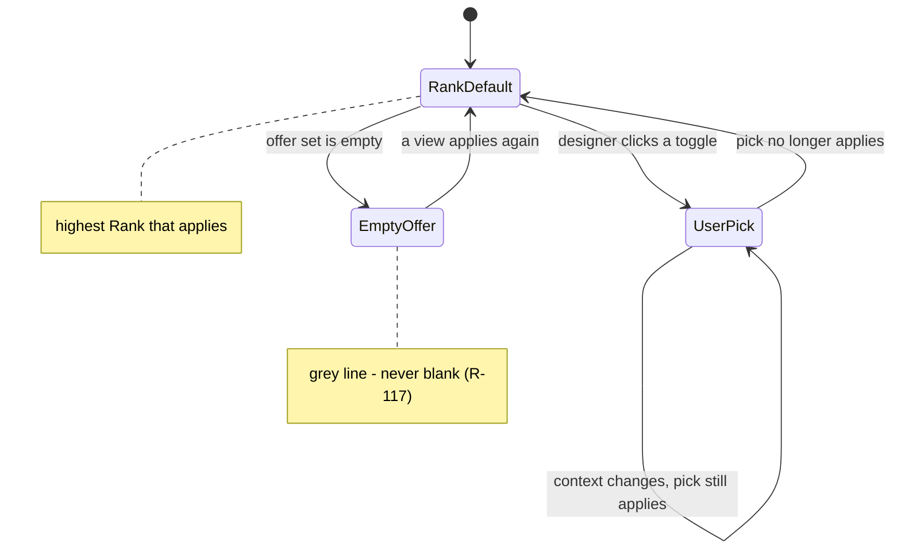
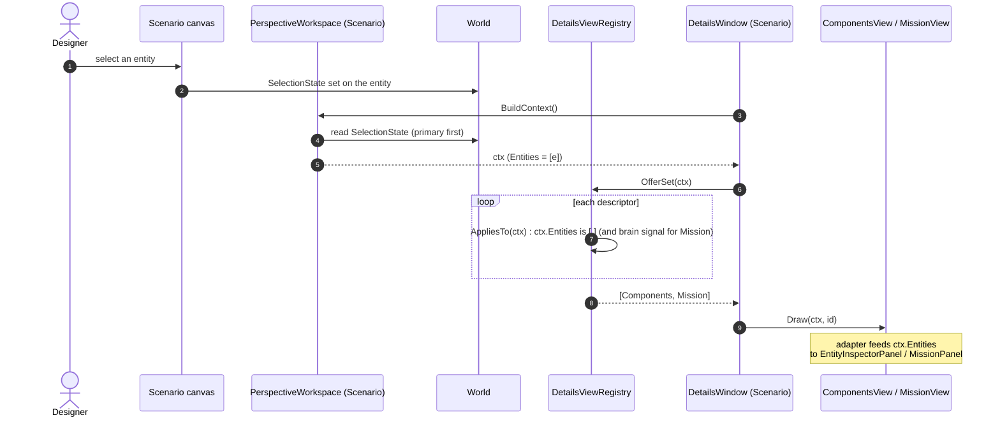
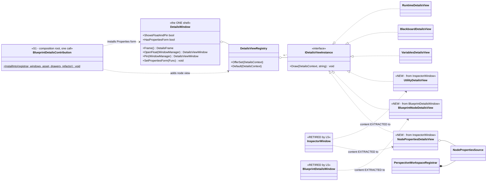
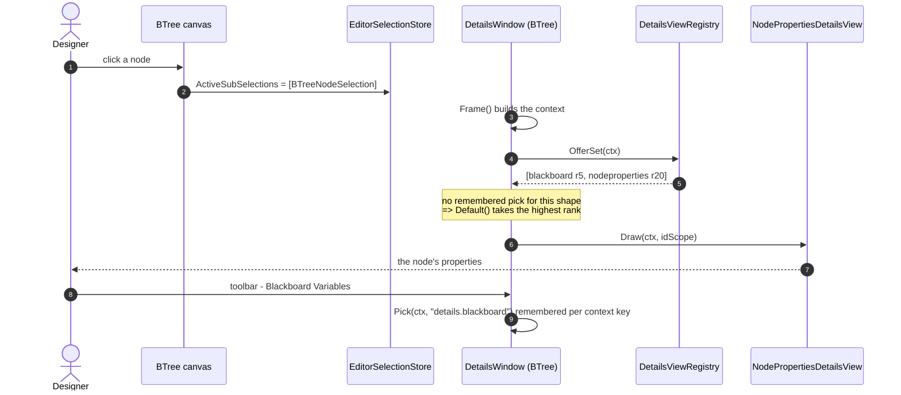

<!--STATUS
state: LIVE
build-state: BUILDING
updated: 2026-08-22
current-answer: sections 1-7. Section 1 is the PLACEMENT SPEC (where every type lives and
  who owns it); section 6 is the task breakdown; SECTION 7 IS THE TARGET STATE for the one shell
  (user ruling 2026-08-22) and re-stages BP-399 against it. L0-L5 are BUILT (L3 partial: 4 views
  migrated, its remaining rows are BP-399, re-staged in §7.6); L6 is RE-STAGED as-built (see §6 L6
  and its sequence). Everything from "## HISTORY" down is the record of how the answer was reached.
stale-below: "## HISTORY" and everything under it. Do NOT quote it as the design.
known-rot: none. L6's original wording (entity already-in-context, brain-equipped predicate exists,
  L6.1 as one item) was corrected 2026-08-22 in §6 L6 against the as-built; the prior phrasing is in HISTORY.
  §6 L3's "Node properties" row is SUPERSEDED BY §7.6 (see §7.7): it named two sources and no order.
  §4's BlueprintDetailsWindow row stands but §7.3 turns it into a dated, ordered commitment.
known-conflict: Q38's live answer says "RuntimeInspectorWindow IS the shell". Section 1
  places the shell in AiDetailsWindow's line instead: the WINDOW's chrome is reusable, its
  PANE REGISTRY keys on asset kind, and R-112 rules that a feed difference. Stated here
  rather than silently changed.
-->
# ⭐⭐⭐ DESIGN — **the Details panel: one shell, N views, chosen by a predicate**

⭐ **The HOW for rulings already made** — 📄 [`Q38`](Architect_Question_38_One_Details_Panel.md) ·
📄 [`Q47`](Architect_Question_47_The_Entity_Context.md) · `R-98`–`R-122`.
⚠ **`R-27` gates the BUILD on the visual check.** ⛔ No batch dispatches until it passes.

---

## 1. ⭐⭐⭐ WHERE IT LIVES — **the placement spec**



⛔ **`Hrot.Presentation` and `AiShared` do NOT reference each other** — ⭐ that is why the scenario
adapters live in `Hrot.Editor`, the only assembly that already sees both. ⇒ **zero new projects.**

### ⭐⭐ Every type, its home, its owner, its lifetime

| type | assembly · path | ⭐ constructed by | lives for |
|---|---|---|---|
| ⭐⭐⭐ **`SelectionState`** *(the ENTITY selection)* | ✅ **`Hrot.Core`** · `Components/Map/SelectionState.cs` | ⭐ the **ECS World** — a component on the entity | the entity |
| ⭐⭐ **`EditorSelectionStore`** *(asset · sub-selection · focus)* | ✅ `Hrot.Editor.AiShared` · `Selection/` | `EditorSubsystem:626`–`:628` | ⭐⭐ **the session — before any window exists** |
| **`DetailsContext`** | 🆕 `Hrot.Editor.AiShared` · `Shell/` | rebuilt by the workspace when the store fires | one frame's read |
| **`DetailsViewDescriptor`** · **`DetailsViewRegistry`** | 🆕 `Hrot.Editor.AiShared` · `Shell/` | the workspace, at registration | the session |
| **`PerspectiveWorkspace`** *(store + registry + claim chain)* | 🆕 `Hrot.Editor.AiShared` · `Shell/` | ⭐ `EditorSubsystem`, **one per perspective ×4** | the session |
| **`DetailsWindow`** *(the shell)* · **`DetailsViewWindow`** *(float / pin)* | 🆕 `Hrot.Editor.AiShared` · `Shell/` | the composition root · the pin/float gesture | the layout |
| **`IDetailsViewInstance`** implementations | ⭐ **beside the panel each one wraps** | ⭐⭐ **its HOST** — `Create()` per host | its host |
| **scenario view adapters** *(Components · Mission plan)* | 🆕 **`Hrot.Editor`** · `Scenario/` | `EditorSubsystem` | the session |
| `MissionPanel` · `SelectionInteractionSystem` · the three selection renderers | ✅ `Hrot.Presentation` — **unchanged, and it never learns about Details** | — | — |
| `WindowManager` · `ManagedWindow` · `EntityInspectorPanel` · `ComponentEditWindow` | ✅ `Fdp.Presentation` — **unchanged** | — | — |

### ⭐⭐ Why those homes — **measured from the `.csproj` graph, and it needs ZERO new projects**

| 📐 fact | ⇒ |
|---|---|
| `Hrot.Editor.AiShared` → `Fdp.Presentation`, `Fdp.Core` | ⭐ the Shell can use `WindowManager` and `Entity` |
| `Hrot.Blueprints.Editor` · `BTree.Editor` · `Hsm.Editor` · `Utility.Editor` · `Hrot.Editor` → **`AiShared`** | ⭐ **every AI host already sees `Shell/` with no new reference** |
| ⛔ `Hrot.Presentation` ↮ `AiShared` — **neither references the other** | ⭐⭐ so scenario panels **cannot** implement a Shell interface… |
| ⭐⭐⭐ `Hrot.Editor` → **BOTH** `AiShared` **and** `Hrot.Presentation` | …⇒ ⭐⭐ **the scenario adapters live in the composition root**, the only assembly that sees both sides. ⛔ **No new project, and `Hrot.Presentation` stays clean** |

> ⚠ **One honest wart:** ⭐ the Shell is perspective-generic, and it is living in an assembly called
> **`AiShared`**. ⛔ **A rename is NOT part of this design** — it is mechanical, touches ~10 `.csproj`
> files, and buys nothing today. ⭐ **The trigger to do it:** the first non-editor host that needs the
> Shell. Until then the misnomer is cheaper than the churn *(📌 `R-13`)*.

### ⭐⭐ Where the DATA is — **the one-line answer per axis**

| axis | ⭐ owned by | ⛔ NOT owned by |
|---|---|---|
| **entity selection** | ⭐⭐⭐ **the ECS World**, on the entity *(`SelectionState`)* | ⛔ `EntityInspectorPanel`'s `HashSet` · ⛔ `SharedEntitySelection`'s cell — **both deleted** |
| **canvas sub-selection** | `EditorSelectionStore`, keyed by `AssetId` | ⛔ any window |
| **focus** | `EditorSelectionStore.FocusedSurface` *(a latch)* | ⛔ any window |
| **the asset** | the document manager | — |
| **the run state / mode** | `IDebugSessionRegistry` | — |
| ⭐ **an uncommitted edit buffer / a cache / a scroll position** | ⭐⭐ **the view instance — legitimately** | — |

---

## 2. ⭐⭐ THE TYPES — **class diagram**

```mermaid
classDiagram
    direction LR

    class DetailsContext {
        <<record>>
        +SelectionOrigin Focus
        +IReadOnlyList~IAssetSubSelection~ Selection
        +IReadOnlyList~Entity~ Entities
        +IEditableAsset Asset
        +string Perspective
        +VariableRunState Mode
    }
    class DetailsViewDescriptor {
        <<record>>
        +string Id
        +string Title
        +int Rank
        +AppliesTo(DetailsContext) bool
        +Create() IDetailsViewInstance
    }
    class IDetailsViewInstance {
        <<interface>>
        +Draw(DetailsContext, string) void
        +Dispose() void
    }
    class DetailsViewRegistry {
        +Add(DetailsViewDescriptor) void
        +OfferSet(DetailsContext) IReadOnlyList~DetailsViewDescriptor~
        +Default(DetailsContext) DetailsViewDescriptor
    }
    class IDetailsContextSource {
        <<interface>>
        +Current() DetailsContext
    }
    class LiveContextSource {
        +Current() DetailsContext
    }
    class FrozenContextSource {
        -DetailsContext snapshot
        +Current() DetailsContext
    }
    class PerspectiveWorkspace {
        +string Perspective
        +Register(ManagedWindow) void
        +BuildContext() DetailsContext
    }
    class EditorSelectionStore {
        +IEditableAsset ActiveAsset
        +IReadOnlyList~IAssetSubSelection~ ActiveSubSelections
        +SelectionOrigin FocusedSurface
        +OnSelectionChanged
    }
    class World {
        <<ECS>>
        +Query~SelectionState~() IEnumerable~Entity~
    }
    class SelectionState {
        <<component>>
        +bool IsSelected
        +bool IsPrimarySelection
    }
    class ManagedWindow {
        <<abstract>>
        +bool IsVolatile
        +DrawClientArea() void
    }
    class DetailsWindow {
        <<docked shell>>
        +DrawClientArea() void
    }
    class DetailsViewWindow {
        <<float or pin>>
        +DrawClientArea() void
    }

    class ScenarioComponentsView {
        <<comp-root adapter>>
        +Draw(DetailsContext, string) void
    }
    class ScenarioMissionView {
        <<comp-root adapter>>
        +MissionPanel Panel
        +Draw(DetailsContext, string) void
    }
    class EntityInspectorPanel {
        <<Fdp.Presentation, existing>>
        +DrawComponentsFor(IInspectableSession, Entity) void
    }
    class MissionPanel {
        <<Hrot.Presentation, existing>>
        +int SelectedEntityId
        +DrawContent(IMissionEditorService, IMapPickService) void
    }

    ManagedWindow <|-- DetailsWindow
    ManagedWindow <|-- DetailsViewWindow
    IDetailsContextSource <|.. LiveContextSource
    IDetailsContextSource <|.. FrozenContextSource

    PerspectiveWorkspace *-- DetailsViewRegistry
    PerspectiveWorkspace o-- EditorSelectionStore
    PerspectiveWorkspace ..> World : reads entity selection
    PerspectiveWorkspace ..> DetailsContext : builds
    World o-- "0..*" SelectionState

    DetailsViewRegistry o-- "0..*" DetailsViewDescriptor
    DetailsViewDescriptor ..> IDetailsViewInstance : creates
    LiveContextSource o-- PerspectiveWorkspace

    DetailsWindow o-- DetailsViewRegistry
    DetailsWindow o-- IDetailsContextSource
    DetailsWindow *-- "0..1" IDetailsViewInstance
    DetailsViewWindow o-- DetailsViewDescriptor
    DetailsViewWindow o-- IDetailsContextSource
    DetailsViewWindow *-- "1" IDetailsViewInstance

    IDetailsViewInstance <|.. ScenarioComponentsView
    IDetailsViewInstance <|.. ScenarioMissionView
    ScenarioComponentsView o-- EntityInspectorPanel : borrows the root's
    ScenarioMissionView *-- "1" MissionPanel : owns its own
```



⭐⭐ **The `o--` vs `*--` on the last two lines is the whole `L6.3`/`L6.4` asymmetry, and it is
MEASURED** *(as-built (e))*: the root wires ~60 lines into its one `EntityInspectorPanel`, so the
Components view must borrow it; it wires **nothing** into a `MissionPanel` after construction, and the
update loop writes that panel's `SelectedEntityId` from the LEGACY selection every frame — ⛔ so the
Mission view owns a private one instead of fighting for the property.

| ⭐ what the diagram asserts | |
|---|---|
| ⭐⭐⭐ **the two window classes differ ONLY in `IDetailsContextSource`** | `Live` ⇒ docked or contextual float · `Frozen` ⇒ pin *(`R-119`)* |
| ⭐⭐ **the registry holds DESCRIPTORS; each window COMPOSES its own instance** | ⛔ no view instance is shared ⇒ ⛔ no arbitration *(`R-120`)* |
| ⭐⭐ **`SelectionState` hangs off `World`, not off any window** | *(`R-122`)* |
| ⭐ **only the workspace builds a context** | ⛔ no window reads the store directly |

### ⭐ The three hosting modes

| mode | context source | window | predicate false ⇒ | layout save |
|---|---|---|---|---|
| **DOCKED** | `Live` | the shell, one view at a time | falls back by `Rank` | ✅ |
| ⭐⭐ **FLOAT — contextual** | `Live` | its own window, anywhere | ⭐⭐ **stays open, grey line** | ✅ **persists** |
| **FLOAT — pinned** *(`R-100`)* | `Frozen` | its own window, titled | n/a | ⛔ `IsVolatile` |

---

## 2b. ⭐⭐⭐ BEHAVIOUR — **sequence diagrams**

### ⭐ A marquee selection reaches the panel — **and finds no view** *(`R-117`, `R-118`)*



### ⛔ A PAN must change nothing — **the defect `L0.2` fixes**



### ⭐⭐ Opening a CONTEXTUAL float, and a later context that rejects it *(`R-119`)*



### ⭐ PINNING — **frozen context, and a duplicate FOCUSES** *(`R-100`)*



### ⭐ The toolbar's remembered pick — **state**



⭐ The pick is remembered per **`(Perspective, AssetId, selection SHAPE)`** — see below.

### ⭐ The context key — what "remember my pick" is keyed on

`(Perspective, AssetId, selection SHAPE)`. ⭐ Node A → node B keeps the view; a variable pick remembers
its own. ⛔ When the chosen view stops applying, fall back by `Rank` — ⛔ **never to a blank panel.**

---

## 3. ⭐⭐ THE RULES — **ruling → mechanism, one line each**

| ruling | ⭐ mechanism in this design |
|---|---|
| `R-98` toolbar is a panel switch | offer set from the predicates; default by `Rank`; user's pick remembered per §2's key |
| `R-100` a pin is one titled, volatile instance | `DetailsViewWindow` + frozen context; `TryGetWindow` ⇒ focus a duplicate |
| `R-110` Details in all perspectives, pluggable | `PerspectiveWorkspace` ×4 |
| `R-111` the mode joins the context | `DetailsContext.Mode`; one view, many modes |
| `R-112` "is it about the selection?" | ⛔ **`AssetKind` is never a view key** — a host says so in its own predicate |
| `R-115` context = focus + selection | two independent fields; a pan writes the same set ⇒ same context |
| `R-116` the predicate ships with the view | `DetailsViewDescriptor.AppliesTo` |
| `R-117` a blank panel is a defect | the grey line, at **two** sites: empty offer set · a float whose predicate is false |
| `R-118` the bridge reports, never filters | `MapSelection` → a list; ⭐ the `Count != 1` rule reappears in **one** predicate |
| `R-119` three hosting modes | one window class, one parameter |
| `R-120` a view owns no shared state | descriptor + factory; ⛔ no `Instanceable`, no arbitration |
| `R-121` all four perspectives built alike | `PerspectiveWorkspace` extracted from the registrar's generic half |
| `R-122` entity selection is on the entity | the context reads the World |

---

## 4. ⭐⭐ WHICH SHELL — **three candidates, measured**

| candidate | 📐 | verdict |
|---|---|---|
| `RuntimeInspectorWindow` *(57 ln)* | chrome + `_panes.Find(p => p.TargetKind == asset.Kind)` | ⭐ chrome reusable · ⛔ **registry on the wrong axis** *(`R-112`)* ⇒ **dissolves**: 3 panes → 3 predicated views, chrome → mode-conditional content *(approved)* |
| ⭐⭐ **`AiDetailsWindow`** | one arm, per-perspective, does not claim focus | ⭐⭐⭐ **grow this into `DetailsWindow`** |
| `BlueprintDetailsWindow` *(350 ln)* | two arms + hand-written focus arbitration, `sealed` | ⚠ both arms become views; ⭐ the registry does its arbitration generically |

---

## 5. ⭐⭐ WHAT THE "REGISTRY" IS, AND WHY SCENARIO NEEDS ONE *(`R-121`)*

📐 `PerspectiveWorkspaceRegistrar` fuses **two things**:

| half | what | generic? |
|---|---|---|
| ⭐⭐ **wiring hub** — `RegisterExtraWindow` | a **claim chain**, 9 × `if (window is IX)`; ⭐ windows self-wire, the root passes nothing extra | ✅ **fully** |
| ⚠ **service bag** — the constructor | 21 params: validators · breakpoints · aggregator · facet drawers · live provider/writer | ⛔ AI-authoring only |

⛔ **The generic half is trapped inside the specific one** — which is why Scenario got a bespoke
*"scenario branch"*. ⇒ ⭐ extract **`PerspectiveWorkspace`**; the registrar keeps its bag; **Scenario gets
a workspace carrying scenario services.** ⭐ **Same mechanism, different contents.**

⚠ **The key is inconsistent too:** it is `"Editor"`, relabelled `"Scenario"` *(`EditorSubsystem:3612`)*.
⇒ rename it — ⛔ **with a load migration**, because `CurrentPerspective` and every `OwningPerspective`
are **persisted** and a bare rename silently resets layouts.

> 📐 **AS-BUILT `2026-08-22`:** `PerspectiveWorkspace` **does NOT exist yet** — `PerspectiveWorkspaceRegistrar`
> still holds the registry *(`.DetailsViews`)*, the `LiveContextSource` builder lambda, the entity source
> *(`.EntitySelection`)* and the `IDetailsViewSource` claim chain directly *(the `L1`/`L2` "stated placement
> deviation")*. ⭐ **`L6.1a` is the extraction** *(§6)*, and it is split from the risky key rename *(now
> `L6.1b`, deferred)*. ⚠ **The rename is COSMETIC today** — a `RegisterPerspectiveLabel("Editor","Scenario")`
> map; the persisted key is still `"Editor"`, so the workspace can be stood up on Scenario without touching it.

---

## 6. ⭐⭐⭐ THE LAYERS — **the task breakdown**

⭐ Each layer is independently shippable and independently railable. ⭐ Every task's rail asserts on a
**store or a returned model** — 📌 `R-21`/`R-62`: the draw is unrailed by construction.

### `L0` — the context *(no UI change)*

| # | task | 📐 seam |
|---|---|---|
| `L0.1` | **selection SET on the store** — `ActiveSubSelections`; `ActiveSubSelection` becomes the derived single | ⭐ every existing reader unchanged |
| ⭐⭐ `L0.2` | ⛔ **the bridge REPORTS, never filters** *(`R-118`)* — map every selected node; empty list only when nothing is selected; an unresolvable node is **dropped**, not fatal | `Blueprint:57` · `BTree:61` · `Hsm:79` — ⭐ three refusals **deleted**, ⛔ not unified. ⚠ **highest-risk task** |
| `L0.3` | `DetailsContext` + the builder | all five sources present |
| `L0.4` | ⛔ **entity selection: DELETE two copies**, read `SelectionState` from the World *(`R-122`)* | ⚠ return the **same list instance** when unchanged, or every view rebuilds per frame |
| **rail** | a marquee of two yields a 2-item context; **a pan yields the same context object as the frame before** | 📌 `M-22` |

### `L1` — the registry *(no UI change)*

`L1.1` descriptor + instance + registry · `L1.2` registration through the existing claim chain
*(⛔ no new root argument — `R-67`)* · `L1.3` `VariableDetailsSection` becomes the first descriptor ·
`L1.4` the node-properties predicate carries `L0.2`'s deleted rule: `ctx.Selection is [BlueprintNodeSelection]`.
**Rail:** the offer set for a measured context, on the **production-built** registry.

### `L2` — the shell *(first visible layer)*

`L2.1` `AiDetailsWindow` → `DetailsWindow` · `L2.2` the toolbar · `L2.3` ⛔ **the grey empty state**,
replacing `AiDetailsWindow:128` and `RuntimeInspectorWindow:54`/`:67`.
**Rail:** an empty offer set returns the grey string.

### `L3` — migrate the views *(all parallel — ⭐ the delegation layer)*

| view | from | predicate |
|---|---|---|
| Variables | `VariableDetailsSection` | outline focus ∧ variable rows |
| ⛔ **Node properties** | `BlueprintDetailsWindow`'s node arm · `InspectorWindow` *(697 ln, 4 arms)* | exactly one node — ⛔ **do not delegate this one** |
| Runtime | the 3 `RuntimeInspectorPane`s | `Mode != Planning` ∧ its asset kind |
| Layout / byte budget · Asset settings | `BlackboardAuthoringWindow` | asset context |
| Diagnostics | `VariablesPanelControl`'s host | asset context |
| Graph signature | `GraphSignatureWindow` *(388 ln)* | Blueprint ∧ a graph row |
| Utility | `InspectorWindow`'s utility arm | utility node / consideration |
| ⛔ Parameter sync | `PARAMETER SYNCHRONIZATION` | ⚠ **LAST** — after the orchestrator wiring *(`R-99`)* |

### `L4` — float and pin *(needs `L1`, not `L2`)*

`L4.1` `DetailsViewWindow(descriptor, contextSource)` · `L4.2` **contextual float** — live context,
`IsVolatile = false`, stable id · `L4.3` **pin** — frozen, `IsVolatile = true` · `L4.4` entry points
*(toolbar affordance + the View menu, so a float is reachable with Details closed)*.
⚠ **A float is restored into contexts that reject it** — that is ordinary, and the grey line is the
answer; ⛔ it may hold **no reference captured at open time**.

### `L5` — retire *(per item, after its replacement is live)*

⭐⭐ **`L4.2` makes retirement lossless** — folding a standalone window into a toolbar no longer removes a
designer's floating placement.
**Retire:** `WatchPanelWindow` *(`R-113`)* · `LiveBlackboardPanel` *(`R-114`)* · `BlueprintVariablesWindow` ·
`BlueprintVariablesManagedWindow` · `InspectorWindow` *(Blueprints)*.
⚠ **MOVED, not retired:** the breakpoint-watch list → Breakpoints *(`Q44`)*.
⛔ **Stays standalone:** `AiWatchWindow` — a curated list kept across selections *(`R-112`)*.

### `L6` — Scenario + the entity context *(`Q47`)* — ⭐⭐ **RE-STAGED `2026-08-22`, as-built reconciled**

⚠⚠ **The as-built moved three premises this section rested on — measured `2026-08-22`, folded in here
per obligation ⑤** *(prior wording moved to `## ⛔ HISTORY`)*:

| # | ⛔ what L6 assumed | 📐 as-built truth |
|---|---|---|
| **a** | *"register the entity arm"* implies the entity is not yet in context | ✅ **`DetailsContext.Entities` ALREADY carries the selected entities** *(`L0.4`, from the World via `IEntitySelectionSource`)* — every AI perspective's builder populates it today. ⇒ ⛔ nothing to add to the context; what is missing is DESCRIPTORS that READ `ctx.Entities` |
| **b** | the views hang off the existing details panel | ⛔⛔ **the Scenario perspective has NO `PerspectiveWorkspaceRegistrar`, no `DetailsWindow`, no registry** — it uses a bespoke `RegisterPane` and `ResolveDocumentForCurrentPerspective` returns null for it. ⇒ ⭐ **the real work is STANDING UP a details host on Scenario**, which is exactly what extracting `PerspectiveWorkspace` enables |
| **c** | *"predicate = brain-equipped"* names an existing check | ⛔ **no `HasBrain`/`IsBrainEquipped` exists.** ⭐ The behavioural signal is `IMissionEditorService.GetMissionSnapshot`/`GetAvailableBehaviors` returning empty ⇒ `L6.5`'s helper writes the predicate FRESH |
| ⛔⛔ **d** *(added `2026-08-22`, from the build)* | *"the panel OWNS its selection via a `HashSet`"* ⇒ **DELETE it** | ⛔⛔ **`_selectedEntities` is a read-WRITE INTERACTION MODEL, not a cache.** 📐 `HandleRowClick` *(:409)* writes it in all three arms *(shift-range / ctrl-toggle / plain click)* and `Select All` writes it too. ⇒ **deleting it deletes multi-select interaction** unless clicks instead write `SelectionState` to the World — 📌 that is `UX_Feature_Selection.md`'s `UXI-11` migration, which `L0.4` put OUT OF SCOPE. ⭐ **And the deletion is not needed:** `DrawEntityDetails:530` shows the renderer takes the entity, so the adapter renders the World's entity without touching the `HashSet`. ⇒ ⭐⭐ **the deletion is `UXI-11`'s, not `L6.3`'s** |
| ⭐⭐ **e** *(added `2026-08-22`, from the build)* | both views *"wrap"* the editor's existing panel | ⭐ **BORROW vs OWN, decided per panel by what the root wires into it.** `EntityInspectorPanel` gets ~60 lines *(reflector · 2 buffer-view providers · serializer · mutation interceptor · edit-context factory)* ⇒ **borrowed**, or the view would render with none of it *(the `2026-08-16` silent-default shape)*. `MissionPanel` gets **nothing** after construction, and `EditorSubsystem.Update:1810–1823` writes its `SelectedEntityId` every frame from the LEGACY `DefaultSelectionState` ⇒ ⛔ **sharing it would make the view and the Mission Editor window overwrite each other within one frame** ⇒ **the Mission view OWNS a private panel** |

⭐⭐⭐ **And the risk is SPLIT** *(`no rush removals`)*: `L6.1` bundled a **persisted-key rename +
layout migration** *(§5: `"Editor"`→`"Scenario"`, which silently resets saved layouts)* with the
workspace extraction. ⛔ **These are separated.** The rename is `L6.1b`, DEFERRED to its own gated task —
the workspace and the entity views ship WITHOUT touching the persisted key.

#### ⭐ The optimal order — **each item independently gated; a STAGE GATE after the enabling refactor**

| stage | item | what | visible? |
|---|---|---|---|
| **1 · enabling** | ⭐⭐ **`L6.1a`** | **extract `PerspectiveWorkspace`** — split the registrar's GENERIC half *(the `DetailsViewRegistry`, the `LiveContextSource` builder, the entity source, the `IDetailsViewSource` claim chain)* from its 21-param AI service bag *(§5)*. ⛔ **Pure refactor of the THREE existing AI perspectives** *(BTree/HSM/Blueprint)* — no behaviour change, railed on the unchanged offer sets. ⭐ **STAGE GATE: all three perspectives still host their views before proceeding** | ⛔ no |
| **2 · the host** | ⭐⭐ **`L6.1c`** | **give the Scenario perspective a `PerspectiveWorkspace` + `DetailsWindow`**, built from SCENARIO services, not the AI bag. ⛔ Does NOT rename the persisted key *(`L6.1b`)*. + wire `WorldEntitySelectionSource` into its context builder so `ctx.Entities` flows on Scenario too *(the old `L6.2`, now trivial — the source already exists)* | ✅ **Scenario gains a details panel** |
| **3 · the views** | ⭐⭐ **`L6.5`** *(before `L6.4`)* | the **entity/component predicate helper** — `ctx.Entities is [{ }]` and the behavioural brain signal — so each entity-type view is a one-line predicate. ⛔ Built BEFORE the view that needs it | ⛔ no |
| **3 · the views** | ⭐⭐⭐ **`L6.3`** | **Components view** — an **adapter in the composition root** *(`Hrot.Editor`/`Scenario/` — the ONLY assembly seeing both `Fdp.Presentation`'s `EntityInspectorPanel` and `AiShared`'s `IDetailsViewSource`; §3's reference wall)* wrapping the FDP `EntityInspectorPanel`. ⭐ The adapter renders `ctx.Entities[0]` through `EntityInspectorPanel.DrawComponentsFor(session, entity)` — the renderer half **extracted** from `DrawEntityDetails` *(`R-13`)*, so the caller's entity is the one that lands. ⛔⛔ **The `HashSet` is NOT deleted — see as-built (d): it is `UXI-11`'s, not this item's**, and `EntityInspectorPanelMultiSelectTests` stays as it is | ✅ **Components in Scenario** |
| **3 · the views** | ⭐⭐⭐ **`L6.4`** | **Mission plan view** — an adapter *(same comp-root rule)* over `Hrot.Presentation`'s `MissionPanel`; it selects by `SelectedEntityId` — ⚠ an **int NETWORK id**, so the root supplies the `Entity`→`NetworkIdentity` translation *(one place, the same lookup `Update:1816` already does)*; predicate = `L6.5`'s brain signal. ⛔ **It OWNS a private `MissionPanel` rather than sharing the editor's — see as-built (e)** | ✅ **Mission in Scenario** |
| ⛔ **DEFERRED** | ⚠ **`L6.1b`** | the persisted-key rename `"Editor"`→`"Scenario"` **+ layout migration** — its own gated task *(silently resets layouts; §5)*. ⛔ **NOT in the L6 batch** | — |

⛔ **Out of scope:** `DerEntityInspectorPanel` *(IOS/ExCon only)*. ⛔ **Not this batch:** `BP-399` *(L3's
remaining AI-authoring views — Node properties/Utility/Parameter sync — a SEPARATE migration)*.

### ⭐ Dependency graph

```
L0.1 ─┬─ L0.2 ──┐
      └─ L0.3 ──┴─ L1.1 ─ L1.2 ─┬─ L1.3 / L1.4 ─ L2.1 ─ L2.2 ─ L2.3 ─┬─ L3.* (parallel) ─ L5.*
L0.4 ─────────────────────────── └─ L4.1 ─ L4.2 ─ L4.3 ─ L4.4 ────────┘
              (L6, re-staged 2026-08-22)   L6.1a ─ L6.1c ─ L6.5 ─┬─ L6.3
                                           [STAGE GATE]           └─ L6.4        (L6.1b deferred)
```

⭐ `L0` is the only bottleneck · ⭐ `L3` fans out completely · ⚠ `L6.1a` gates all of `Q47` and is the
enabling refactor — the STAGE GATE holds until the three AI perspectives still host their views.

### ⭐⭐ `L6` SEQUENCE — **the Scenario host builds a context, and the entity views are offered**



### ⚠ Limits — **stated, not discovered later**

| ⚠ | |
|---|---|
| **the draw is unrailed** | `R-21`/`R-62` — ⛔ nothing asserts a toggle appears on screen |
| **`L0.2` is the risk** | three hosts, three current refusals; the *"same set ⇒ same context"* rule must be **measured per host** |
| **`InspectorWindow` is 697 lines / 4 arms** | ⛔ the one `L3` task that is not a mirror-pattern slice |
| **entity selection is `NoSave`** | ⛔ it does not survive a scenario reload — consistent with `94g`, and correct |
| ⭐⭐ **`L6.3`'s offer half cannot be railed on the PRODUCTION root** *(measured `2026-08-22`)* | 📐 `_fdpRepoAdapter` — the `IInspectableSession` Components renders through — is built at `EditorSubsystem.cs:1579`, **inside `if (!_headless)` (:1565)** ⇒ a headless editor never has one, and correctly never offers Components. ⭐ The gate therefore SPLITS: the REAL root proves REGISTRATION *(`R-67`)*, and the production descriptor factory over a stubbed session proves the PREDICATE. ⛔ Neither half alone is the gate |
| ⭐ **two Details windows on one perspective would share the borrowed `EntityInspectorPanel`'s search filter** | ⚠ `R-120` is not breached *(the shared state lives at the root and is handed in)*, but it is a real limit. ⛔ Cannot occur today — Scenario hosts one `DetailsWindow` |
| ⚠ **the brain signal calls `GetAvailableBehaviors` from a per-frame predicate** | ⭐ Same order of cost as today: `MissionPanel.DrawContent` already calls it every frame. ⛔ If the service ever becomes expensive, the signal is the one place to memoise |

---

## 7. ⭐⭐⭐ THE ONE SHELL — **target state** *(user ruling, `2026-08-22`, after the BTree visual check)*

> ✅ **APPROVED by the user, `2026-08-22`** — *"good design approved."*
> ⭐ **`build-state: READY-TO-BUILD`.** 📄 Dispatched as
> [`TASKS_One_Shell_BP399.md`](batches/TASKS_One_Shell_BP399.md) — ⛔ that file is a task list only; the
> design and its UML stay here.

> 🔒 **User, verbatim:** *"we have one Details window in Scenario/HSM/Btree/Blueprint perspectives and it
> is able to run multiple views and switch them and allow poping a floting window pinning/unpinned to
> current context. **This is what i call a shell and this needs to be same/reused across the
> perspectives, no parallel implementations.**"*
>
> 🔒 **And, for BTree specifically:** *"the 'Inspector' window there shows the selected-node details —
> and **this is exactly what should be the default view shown in the Details window for BTree**. The
> 'Blackboard Variables' view would be the other view selectable via Details window toolbar."*

⭐ **Confirmed by the same visual check:** the float and pin buttons **work**. `L4` is live.

### 7.1 ⛔⛔ AS-IS — **"the Details window" is TWO classes**

📐 Measured `2026-08-22`:

| perspective | window id | class | view registry | toolbar switch | float / pin |
|---|---|---|---|---|---|
| **Scenario** | `scenario_details` | ⭐ `DetailsWindow` | ✅ | ✅ | ✅ |
| **BTree** | `ai_details_btree` | ⭐ `DetailsWindow` | ✅ | ✅ | ✅ |
| **HSM** | `ai_details_hsm` | ⭐ `DetailsWindow` | ✅ | ✅ | ✅ |
| ⛔⛔ **Blueprint** | `ai_details_blueprint` | ⛔ **`BlueprintDetailsWindow`** — a separate `sealed class : ManagedWindow` | ⛔ **none** | ⛔ **none** | ⛔ **none** |

⭐⭐ **The mechanism, named so it is fixable rather than mysterious:** `PerspectiveWorkspaceRegistrar`
builds `Details = new DetailsWindow(…)` **inside `if (effectiveHost != null)`**, and
`HostKindOf("Blueprint")` returns **`null`** *(it answers only `BTree` and `Hsm`)*. ⇒ ⛔ the registrar
never builds a shell for Blueprint, and `EditorSubsystem` constructs `BlueprintDetailsWindow` instead —
**same id, same title, fewer capabilities.**

⚠ **Why it looks fine until you try something:** both are titled *"Details"* and dock in the same slot.
The difference only appears when a designer wants a second view, the toolbar, a float or a pin — none of
which Blueprint has.

### 7.2 ⛔ AS-IS — **BTree's Details shows Blackboard Variables permanently, and that is a RANK+PREDICATE fact**

| view | rank | predicate | ⇒ observed |
|---|---:|---|---|
| `details.blackboard` | **5** | `HasAsset` — *any* open document | ⭐ applies **always** ⇒ what the user sees |
| `details.variables` | **10** | outline focus ∧ `section.HasContent` | ⚠ applies **rarely** |
| ⛔ **node properties** | — | — | ⛔⛔ **does not exist as a view** — the content is stranded in `InspectorWindow`'s facet arm |

⇒ ⭐ The panel is not broken: **it is showing the only thing that ever claims it.**

### 7.3 ⭐⭐⭐ TARGET — **one shell class, per-perspective catalogues**

| ⭐ rule | |
|---|---|
| **①** | ⭐⭐⭐ **`DetailsWindow` is THE shell on all four perspectives.** ⛔ `BlueprintDetailsWindow` **dissolves** — its arms become views *(§4 already said so: "both arms become views; the registry does its arbitration generically")* |
| **②** | ⭐⭐ **A perspective differs only by its CATALOGUE**, never by its window class — 📌 `R-116`: the predicate ships with the view |
| **③** | ⭐⭐ **`HostKindOf` stops gating the shell.** ⚠ It answers *"which blackboard host is this?"* — a fair question that has **nothing to do with whether a perspective deserves a Details panel.** ⛔ Reusing it as the shell gate is the actual bug |
| **④** | ⛔ **The persisted id `ai_details_blueprint` is KEPT** — 📌 §5: a bare key rename *"silently resets layouts"*. ⭐ The TYPE changes, the KEY does not *(the same rule `L2.1` followed)* |

#### ⭐⭐ The target catalogue, per perspective — **with ranks**

| view | rank | predicate | Scenario | BTree | HSM | Blueprint |
|---|---:|---|:---:|:---:|:---:|:---:|
| `details.blackboard` | 5 | `HasAsset` | — | ✅ | ✅ | ✅ |
| `details.variables` | 10 | outline focus ∧ content | ✅ | ✅ | ✅ | ✅ |
| ⭐⭐⭐ **`details.nodeproperties`** *(NEW)* | **20** | **exactly one node selected** | — | ✅ | ✅ | ✅ |
| `details.components` | 30 | exactly one entity | ✅ | — | — | — |
| `details.mission` | 40 | one entity ∧ brain | ✅ | — | — | — |
| `details.runtime.*` | 50 | `Mode != Planning` ∧ kind | — | ✅ | ✅ | ✅ |
| `details.graphsignature` | *(as built)* | Blueprint ∧ ≥1 editable graph | — | — | — | ✅ |

⭐⭐⭐ **Rank 20 is what delivers the user's ask:** with a node selected on BTree, node properties
**outranks** Blackboard (5) and Variables (10) ⇒ it becomes the **default**, and Blackboard Variables
becomes the other toolbar entry. ⛔ Deselect the node and its predicate declines ⇒ Blackboard returns.

⚠ **One rank interaction, stated rather than buried:** `details.runtime.*` is **50**, so while a session
is LIVE the Runtime view still outranks node properties. ⭐ That is deliberate — you started a run to
watch it — and 📌 `R-98` means one toolbar click switches, remembered per context. ⭐⭐ **Approved by the
user, `2026-08-22`:** *"runtime having higher rank during live session is OK."*

#### ⛔⛔ AS-BUILT (`S1`, `2026-08-22`) — **the node predicate carries a SECOND clause**

📐 **The catalogue row above says `details.nodeproperties` applies on *"exactly one node selected"*.
⚠ As built it is `exactly one node selected ∧ the designer is NOT working in the variable outline`**
*(`DetailsViewPredicates.ExactlyOneNodeNotInTheOutline<T>`)*.

| | |
|---|---|
| 🔴 **Why the one-line version is not enough** | node properties is **Rank 20**, Variables is **10** ⇒ with only the *"one node"* clause a node selected on the canvas would **outrank the variables list while the designer is clicking rows in the outline** |
| ⭐ **What it preserves** | `Q32` ruling 2 — *"selection routes"* — the outline→Details routing built across batches 79–87. 📐 The retired `BlueprintDetailsWindow.ShowingVariables` encoded the SAME rule as `focus != GraphCanvas`; this is that rule stated from the node view's side |
| ⭐ **Where it lives** | **one** helper in `DetailsViewPredicates` *(`R-13`)*, used by `S1`'s Blueprint view and by `S2`'s BTree/HSM view — ⛔ not copied into two descriptors |
| ⚠ **What it does NOT read** | whether the outline has rows. That half is the Variables view's own `section.HasContent`; if both decline, `R-117`'s grey line is what the designer gets |

### 7.4 ⭐⭐ THE TARGET CLASS DIAGRAM



#### ⛔ AS-BUILT (`S2`, `2026-08-22`) — **`NodePropertiesSource`, and why the view is not enough**

| | |
|---|---|
| ⭐⭐ **the box** | `Shell/NodePropertiesSource` — the facet dispatcher, the StructEdit edit service, its custom drawers, the `ExpressionTargetField` accessor, **and the one facet cache** |
| ⭐ **why not on the view** | 📌 `R-120`: a view instance is per-**WINDOW** *(docked · float · pin)*, but these services are per-**PERSPECTIVE** and the composition root re-wires them when the document changes. ⛔ On the instance, one document switch would have to reach N windows |
| ⭐⭐⭐ **why the CACHE is there too** | the **predicate** asks *"can I map this selection to a facet?"* and the **draw** asks the same question ⇒ ⛔ two caches would be two answers *(ruling 9)*, and the failure is a view that claims the panel and renders nothing — `R-117` one floor down |
| ⚠ **what stays per-instance** | both StructEdit **sessions** — §1: *"an uncommitted edit buffer … the view instance, legitimately"*. ⚠ **Stated `L4` consequence:** a docked panel and a float of this view hold two sessions over one facet and the last dirty frame wins. ⭐ Same class of limit `VariablesDetailsView` records; ⛔ not introduced here and not solved here |
| ⭐ **how a re-wire reaches the instances** | a `Generation` counter the view compares — 📌 `R-126`'s pull: the retired window dropped its session *inside* `SetFacetEditService`, and there is no such call to hook when N instances exist |

⛔⛔ **AND TWO ARMS MOVED, NOT ONE** *(`BP-431`)* — §7.6 ② named only the **facet** arm. 📐 Measured: the
**default-value (`B-3`)** arm read the *same* `_currentFacet` field, so extracting one alone would force a
second facet cache. ⭐ Batch 74's own record settles that it belongs here: *"the surface earns itself: it
is **NODE-scoped** (you see the default of the variable this node writes) where Track C's table is
**ASSET-scoped**."* ⇒ **it IS node properties.**

⛔⛔ **AND WHO REGISTERS IT — measured the hard way** *(`BP-433`)*. §7.4 draws **two classes under one
id**; ⚠ registering the generic one for every perspective **collided with Blueprint's own** and
`DetailsViewRegistry.Add` **threw at startup** *(Batch 81's guard, first live catch)*.

| perspective | node view | registered by |
|---|---|---|
| **BTree · HSM** | `NodePropertiesDetailsView` *(facet-based)* | ⭐ the **registrar**, gated on `effectiveHost != null` |
| **Blueprint** | `BlueprintNodeDetailsView` *(drawer-based)* | ⭐ `BlueprintDetailsContribution`, at the root |

⭐⭐ **That gate is NOT §7.3 ③'s mistake repeated.** ③ objects to `HostKindOf` gating **the SHELL** —
*"which blackboard host is this?"* has nothing to do with deserving a Details panel. ⛔ It has
**everything** to do with whether a perspective's nodes are described by **facets**: the facet dispatcher
is a BTree/HSM concept, and Blueprint's nodes are drawn by `IBlueprintNodeDrawer`.

⛔⛔ **`InspectorWindow` NO LONGER EXISTS** *(`S5`, `2026-08-22`)* — ⚠ *(was: "still exists — its
parameter-sync arm (`S4`) and utility stub (`S3`) stay")*. ⭐ All six arms are Details views or
asset-row menu items; after `S4` it drew nothing at all. 📄 §7.6 ④⑤.
⭐⭐ **Its asset header and collision strip are GONE as of `S2b`** — see §7.4a; ⛔ the sentence that stood
here *("`S5` cannot delete it until the header and the strip have a home")* is **SUPERSEDED**: they have
homes, and ⛔ **neither home is a Details view.** ⭐ **Its utility stub is gone as of `S3`** — §7.4b.

⛔⛔ **AND `S5` IS BLOCKED ON `S4`, NOT ON `S3` — correcting a claim I made in the `S2b` report**
*(`BP-439`)*. 📐 Measured after `S3`: `InspectorWindow` is **301 lines with exactly ONE arm left** —
`PARAMETER SYNCHRONIZATION`. ⇒ ⭐ deleting the window deletes that arm, and §7.6 ④ **defers it by design**
*(`R-99`, after the orchestrator wiring)*. ⚠ §7.7's own row already said it: *"Only **parameter sync** is
genuinely sequenced."* ⇒ ⛔ **the `S2b` report's *"`S5` blocked on `S3` alone"* was wrong**, and §7.6's
④-before-⑤ order was right all along.

#### 7.4a ⭐⭐⭐ AS-BUILT (`S2b`, `2026-08-22`, `BP-434`–`BP-437`) — **the asset-scoped arms are NOT Details views**

🔒 **User ruling, `2026-08-22`, verbatim:** *"go to definition and rename and find references, these all
sound like context menu items of a blueprint graph node and not anything to put to a details panel
view."* … *"oh i see, asset related context menu items then, still nothing for a details panel view."*
… *"if collision strip is a warning about naming collision or something, it need to be routed to where
the collision can be seen or fixed."* … *"picker should not have that menu."*

⛔⛔ **`BP-431` assumed these arms needed a HOME IN THE SHELL, and that premise was wrong.** ⭐ A gesture
that acts on **the asset you are pointing at** belongs on the thing you point at; a **warning** belongs
in the window that lists warnings. ⇒ ⭐⭐ **the routing, not the relocation, is the design content:**

| arm | ⭐ where it went | why there |
|---|---|---|
| ⑥ **collision strip** | ⭐⭐ **`DiagnosticsWindow`**, as `AIE053` rows at **`Info`** severity *(`SubElementCollisionDiagnostics`)* | 📄 `docs/designs/blueprint-integ-1/DESIGN.md` §5.7: *"surface `SubElementCollision` diagnostics … **in the shared windows**"* — ⭐ this is that document's own home, not a new idea |
| ① **Find References · Rename…** | ⭐⭐ **the Asset Browser's row context menu**, opt-in per host via `AssetBrowserPanelOptions.RowCommands` | 📄 `AI_Editor_Shared_Infrastructure.md` §16.1: Find References is *"Used by **the right-click menu**, the Find Results window, and indirectly by the rename preview"* |
| ① **Go to Definition** | ⛔ **DELETED** | 📐 the Inspector's was an **empty placeholder body**; the real one is `CommandCatalog.GoToDefinition` on the graph *(`BP-76`)* ⇒ ⭐ ruling 9: there was never a second implementation to preserve |

⛔⛔ **THE STRIP WAS DEAD, and that is the load-bearing finding — not the move** *(`BP-435`)*. 📐 Measured:
`DrawCollisionDiagnosticStrip` called `SubElementCollisionDetector.GetBindingAmbiguities`, which returns
`Array.Empty` **unconditionally** *(by its own doc — surfacing it as a runtime error would be a false
positive)*. ⇒ ⚠ **the red strip could never draw, on any input, since it was written.** ⭐ The new rows
use `GetCollisions`, which the same doc invites, at **`Info`** — ⛔ bindings resolve by full FQN, so a
shared short name is never ambiguous at runtime, and an `Error` would be exactly the false positive the
detector refuses.

⭐⭐⭐ **ONE panel, TWO hosts, and the default is the SAFE one** *(`BP-436`)*. 📐 `AssetBrowserPanel` is the
**single** implementation *(in-degree 10)*, hosted by `AssetBrowserDockedWindow` **and**
`AssetPickerModal`. ⇒ ⛔ a menu added to the panel would appear in **both**, and *"Rename…"* mid-pick is
a different job wearing the same widget. ⭐ **`RowCommands` defaults to EMPTY**, so the picker is correct
**by omission** rather than by someone remembering to opt out — ⚠ the silent-default shape pointed the
safe way round, and railed on the **constructed** modal *(`R-67`)*.

⚠ **`AssetRenameModal` is EXTRACTED, not rewritten** *(§7.4's `..>`)*, and it keeps §16.2's split: OK
computes a **PREVIEW** into the Find Results window; ⛔ it never calls `ApplyRename`. ⭐ Drawn as a
**frame overlay** *(`BP-327`, fourth occurrence guarded)*.

#### ⛔ AS-BUILT (`S1`, `2026-08-22`) — **two boxes the design did not have, and why**

| box | why it exists |
|---|---|
| ⭐⭐ **`BlueprintDetailsContribution`** | 📐 **A reference-wall fact.** `VariablePropertiesModal` and `BlueprintNodeDrawerRegistry` live in `Hrot.Blueprints.Editor`, **above** `Hrot.Editor.AiShared` where the shell and the registrar live ⇒ the registrar cannot build either. ⭐ Same shape as `L6.3`/`L6.4`'s Scenario adapters. ⛔ **ONE call at the root, not three loose lines** — the node view, the Properties form and its frame overlay ship together, so a rail on the constructed editor covers all three |
| ⭐⭐ **`DetailsWindow.SetPropertiesForm` / `HasPropertiesForm`** | 📌 `R-109`: Properties is a CUSTOM form, so the shell cannot own one across the wall. ⭐ A delegate — the same shape as `W4`'s `ResolveStagedField` and `L6.5`'s brain signal. ⚠ **`HasPropertiesForm` REPLACES a type test**: `window is IVariablePropertiesFormHost` separated the perspectives only while Blueprint had its own window class; with one shell it answers `true` everywhere and says nothing |

⚠ **Two other as-built differences, named:**
① **The Properties form is a FRAME OVERLAY**, not a `DrawClientArea` line — 📌 `ManagedWindow.Render`
returns early when the window is closed or belongs to another perspective, so a modal drawn there
vanishes with the panel *(`BP-327`'s own lesson)*. ⇒ ⚠ it leaves
`EveryModalAWindowOwnsIsDrawnTests`'s scope *(that rail only sees modals held in a window FIELD)*; the
frame rail covers it instead, and now reddens if the installer never registers the overlay.
② **The asset is PULLED, not pushed** — `BlueprintDetailsWindow.Retarget(bpAsset)` is gone; the view
reads a `Func<BlueprintAsset?>` on the frame it needs it *(`R-126`)*, and detects a document switch by
comparing the asset rather than by being told. ⭐ The ASSIGNMENT still happens where `Retarget` was
called, so the timing is unchanged.

⛔⛔ **`..>` says EXTRACTED, not WRAPPED — and that is §6 `L3`'s *"do not delegate this one"*.**
⚠ `L3`'s default strategy IS delegation *(a thin view borrowing the existing surface, as
`RuntimeDetailsView` does)*; ⭐ the node rows are the exception because wrapping would leave both
697-line and 350-line windows standing as the implementation, which is the duplication this section
exists to end.

#### 7.4b ⭐⭐ AS-BUILT (`S3`, `2026-08-22`, `BP-438`) — **a stub that is honest, and DORMANT rather than dead**

📐 **The enumeration, before the port** *(`search_graph(name_pattern=".*UtilityConsideration.*")` ⇒ 7 nodes,
plus a repo-wide grep)*: `UtilityConsiderationSelection` has **exactly TWO** C# sites — its own record
declaration and the `if` in `InspectorWindow`. ⇒ ⛔⛔ **nothing in this repo RAISES it**, so the arm had
**never drawn**. 📐 A second query — `.*Utility.*` under `Hrot/` — returns **zero** nodes: there is no
utility-AI editor surface here at all.

⭐⭐⭐ **Which is exactly why it is PORTED and not DELETED** — 📌 the `2026-08-15` rule *("unreferenced is
not unintentional")*, and the design record claims it in three places:

| where | what it says |
|---|---|
| `docs/designs/utility-ai/Utility_AI_Design_v1_1.md` | a **LIVE** architecture document for the whole layer |
| `.dev/_DONE/utility-ai/Utility_AI_Editor_Wireframes.md` | specifies the **two-pane option × consideration host** this arm belongs to |
| `.dev/_DONE/utility-ai/batches/BATCH-14-INSTRUCTIONS.md` §1d | *"Add `UtilityConsiderationSelection` + inspector dispatch arm"* — ⭐ the arm was added **deliberately**, ahead of its producer |

⇒ ⭐ **DORMANT** *(a designed capability whose producer is unbuilt)*, not **DEAD** — 📌 the two-property
distinction: it overwrites nothing and harms nothing.

| ⭐ decision | why |
|---|---|
| ⭐⭐ **registered UNGATED** | its predicate is the SELECTION's existence, which is a **sharper** statement than any host-kind gate ⇒ a gate would be a second, weaker copy of the same rule. ⚠ No `R-117` risk: it never claims the panel while nothing raises the selection |
| ⭐⭐⭐ **it SAYS it is not built, and names the design** | ⛔ the retired arm drew a heading + an index pair and stopped, which reads as *"loading"*. ⚠ It also cited **`P5-02`**, a phase id that **does not exist** in the utility-AI record *(the corpus's only `P5-02` hits belong to `group-maneuvers`)* |
| ⭐ **Rank 20, same as node properties** | a consideration IS the selected element. ⚠ **Never a tie** — `details.nodeproperties` also needs its perspective's facet dispatcher to map the selection, and a consideration is not a graph node |
| ⭐ **the load-bearing rail is REGISTRATION, not behaviour** | ⛔ every behavioural rail on this view describes a case production cannot reach today ⇒ the assertion that matters is *"the REAL editor registers it"* — otherwise the port is a class nobody constructs *(`BP-327`'s shape)* |

### 7.5 ⭐ THE SEQUENCE — **selecting a BTree node**



### 7.6 ⭐ THE ORDER — **`BP-399` re-staged against this target**

| # | item | why here |
|---|---|---|
| **①** | ✅ **BUILT `2026-08-22` (`BP-428`)** — ⭐⭐⭐ **Blueprint gets the real shell**; `Details` no longer gated on `HostKindOf`, the id is kept, `BlueprintDetailsWindow` **deleted**, its node arm now `BlueprintNodeDetailsView` at `details.nodeproperties`/**Rank 20** | ⛔ **first**: until Blueprint has the shell, "node properties" has two homes and the extraction target is ambiguous. ⚠ **Atomic by necessity** — the old window claims `ai_details_blueprint` and `RegisterCore` throws on a duplicate |
| **②** | ✅ **BUILT `2026-08-22` (`BP-432`)** — ⭐⭐ **`details.nodeproperties` on BTree + HSM**, `Shell/NodePropertiesDetailsView` + `Shell/NodePropertiesSource`, registered by the registrar for every perspective | ⭐ one view id, three perspectives; ⚠ the two sources reconciled as ① promised. ⛔⛔ **TWO of `InspectorWindow`'s arms moved, not one** — see the as-built note below |
| **②b** | ✅ **BUILT `2026-08-22` (`BP-434`–`BP-437`)** — ⭐⭐⭐ **the asset-scoped arms leave `InspectorWindow`, and NONE of them becomes a Details view**: collision strip → **Diagnostics**, Rename…/Find References → **the Asset Browser row menu**, Go to Definition → **deleted**. 📄 **§7.4a** carries the routing and the user's ruling | ⛔⛔ **Not in `BP-399`'s original five rows, and it had to be:** `BP-431` measured that `S5` would strand them. ⭐ Doing it here is what **unblocks ⑤** |
| **③** | ✅ **BUILT `2026-08-22` (`BP-438`)** — ⭐ **`details.utility`**, `Shell/UtilityConsiderationDetailsView`, registered UNGATED on every AI perspective | ⭐ ported as the stub it is, and it now **SAYS SO** — ⛔⛔ **it was also UNREACHABLE**, see §7.4b |
| **④** | ✅ **BUILT `2026-08-22` (`BP-448`)** — ⭐ **`details.parametersync`** at **Rank 15**, `Shell/ParameterSyncDetailsView` + `ParameterSyncSource` | ⭐⭐ **`R-99` SATISFIED, not waived**: `Q49` made the sub-tree identity survive a reload and `Q50` made the master declare the slice ⇒ the bindings reach the runtime. ⚠ One limit stands *(`BP-446`)* |
| **⑤** | ✅ **BUILT `2026-08-22` (`BP-449`, `BP-450`)** — ⭐⭐ **`InspectorWindow` is DELETED**, and `ai_inspector_*` is out of `layout/default/imgui.ini` **and** `fdp_windows.json` | ⭐ After ④ the window drew **nothing**, so retiring it was the completion, not an extra. ⚠ **`BP-450`: I first claimed the layout half was a no-op and was WRONG** — the stale-layout rail caught it |

⚠ **Not in this list, deliberately:** the **Diagnostics** and **Layout/byte-budget · Asset settings** rows.
📐 `BlackboardAuthoringWindow` already contributes `details.blackboard`; ⇒ ⭐ **measure whether those rows
are already satisfied before building anything**, rather than adding views that duplicate it.

✅ **MEASURED `2026-08-22` (`S0`) — BOTH ARE ALREADY SATISFIED, and no code is owed.** 📐 `BlackboardDetailsView`'s
own header records that §6 `L3`'s **three** rows ship as **ONE** view: `BlackboardAuthoringWindow.DrawClientArea`
is a single flowing body with **no seam** to split, and `VariablesPanelControl`'s host **IS** that window
*(`:509`)*. ⇒ ⛔ adding views for those rows would duplicate `details.blackboard`, which is what this note
existed to prevent.

### 7.7 ⚠ WHAT THIS SECTION SUPERSEDES

| prior text | status |
|---|---|
| §4's row *"`BlueprintDetailsWindow` … ⚠ both arms become views"* | ⭐ **still true** — §7.3 ① makes it a dated, ordered commitment rather than an aside |
| §6 `L3`'s *"Node properties"* row | ⭐ **superseded by §7.6 ②** — the row named two sources and no order; §7.6 gives both |
| §7.4's *"`S5` cannot delete it until the header and the strip have a home (`BP-431`)"* | ⛔⛔ **SUPERSEDED by §7.4a.** ⭐ They have homes as of `S2b` — ⛔ and the premise underneath it *("a home" meant "a Details view")* was **wrong**: the user routed all three OUT of the panel. ⇒ ⭐ `S5` is blocked on `S3` alone |
| `BP-427`'s claim that *"the design gates two of `BP-399`'s five rows"* | ⛔⛔ **WRONG, corrected here.** *"Do not delegate this one"* is a **strategy** constraint *(extract, don't wrap)*, ⛔ not a blocker. Only **parameter sync** is genuinely sequenced |

---

## ⛔ HISTORY — **how the answer was reached. ⛔ Not the design; do not quote it.**

### 📐 INVENTORY — **what was enumerated before any of this was decided** *(`R-74`, `2026-08-20`)*

```
search_graph(".*(RuntimeInspector|InspectorWindow|InspectorPane|DetailsWindow|DetailsPanel|
  VariablesWindow|VariablesPanel|BlackboardAuthoring|LiveBlackboard|WatchWindow|WatchPanel|
  GraphSignature|BreakpointsWindow).*", label="Class")                              → 52
search_graph(".*(TkbDescriptorRegistry|TkbEntityTypes|MissionPanel).*")             → 62
grep "Count != 1|Count == 0"  {Blueprint,BTree,Hsm}SelectionBridgeHelper.cs         → 3 of 3
grep -rn "IsVolatile" (excl Tests)                                                  → 6
grep "new EditorSelectionStore(" / "CreateRegistrar("  EditorSubsystem.cs           → 3 / 3
```

⭐ **Already built and reused:** the focus latch · the registrar's claim chain · the volatile-window pin
mechanism *(precedent `ComponentEditWindow`)* · the mode axis · per-asset selection memory.

### ⛔ Three leans of mine the user overturned

| my lean | ⭐ what was ruled instead |
|---|---|
| *"unify the three `Count != 1` refusals"* | ⛔ **`R-118`: delete them.** A bridge reports; a predicate decides availability. ⚠ `null` meant *"nothing"* **and** *"more than one"* **and** *"unresolvable"* — three facts flattened into one |
| *"`Instanceable: false` ⇒ re-host, and the shell shows *shown in its own window*"* | ⛔ **`R-120`: a view owns no shared state**, so nothing needs arbitrating. ⭐ `R-110`'s warning was about a symptom |
| *"give Scenario the lighter registrar"* | ⛔ **`R-121`: same mechanism, different contents.** ⚠ the lighter one kept the asymmetry and renamed it |

### ⭐ And one guess of the user's that measurement confirmed outright

*"likely the entity selection is a property of the entity itself, stored in ECS repo which is global"* —
📐 **`SelectionState { IsSelected, IsPrimarySelection }` already exists**, globally registered, written by
`SelectionInteractionSystem` *(click · box-select · `ClearAllSelections`)*, read by three renderers, and
it **already carries the primary**. ⇒ `EntityInspectorPanel`'s `HashSet` and `SharedEntitySelection` are
two later copies. ⚠ **`R-105` is upheld in intent, superseded in mechanism** — a cell shared by four
stores is still an editor-side copy; the World is what all four were trying to agree about.

### ⭐ Closed questions

| | |
|---|---|
| `Q-i` Scenario's registrar | ✅ `R-121` |
| `Q-ii` publish a multi-selection before a view consumes it | ✅ **approved** — the grey line makes it safe; the alternative is a context that lies |
| `Q-iii` `RuntimeInspectorWindow` | ✅ **approved: dissolve** — routed, then removed *(`R-13`)* |
| `Q-iv` two instances of an editing view | ✅ dissolved by `R-120` |
