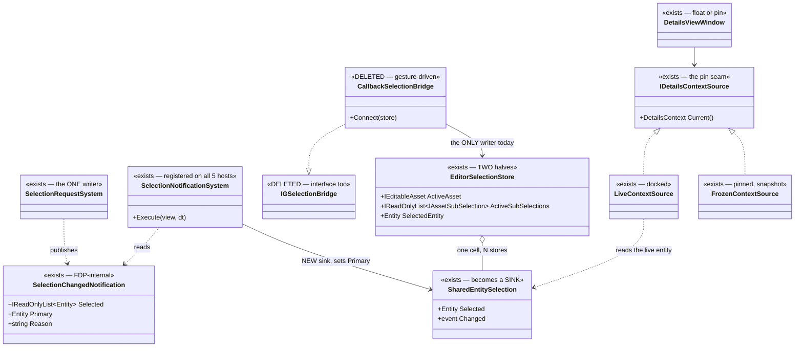
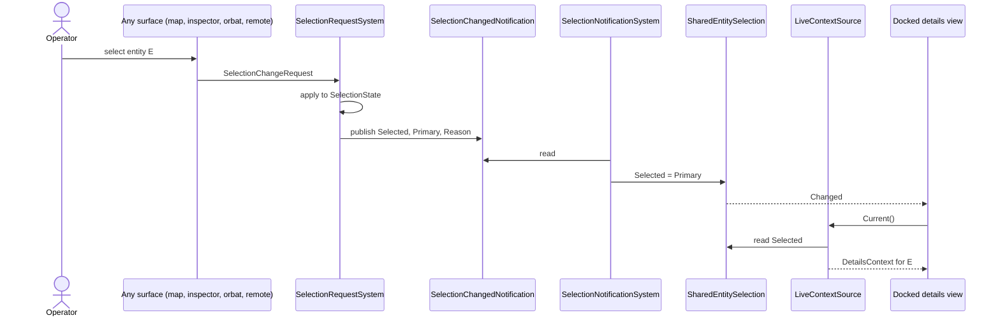
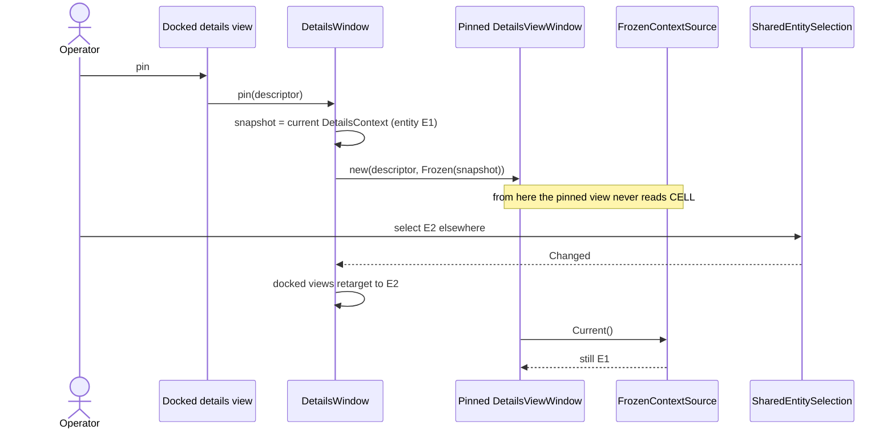
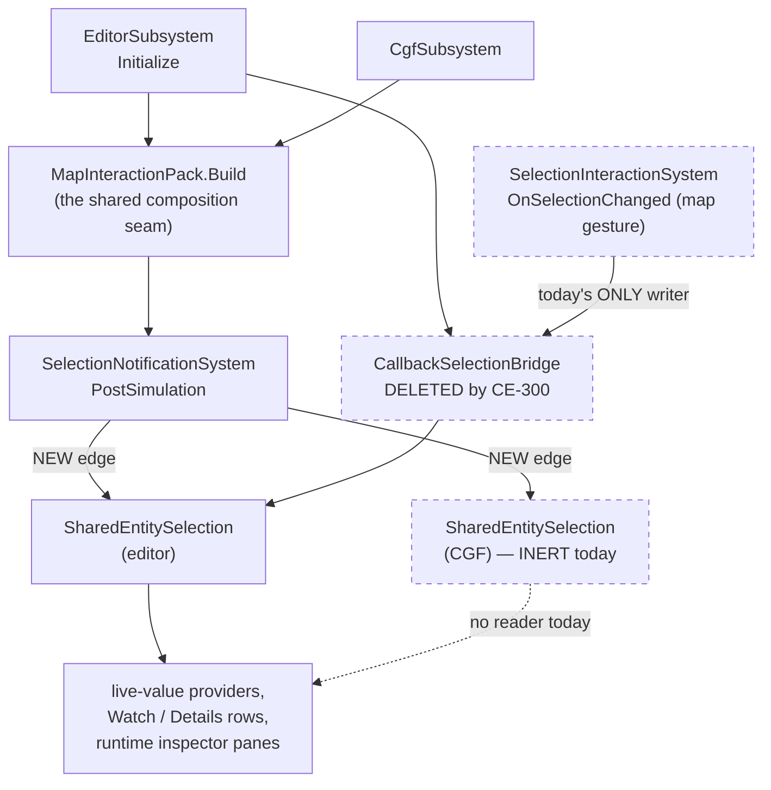

<!--STATUS
state: LIVE
build-state: BUILT (CE-300, CE-301, CE-305 and CE-302 landed 2026-09-21 — §9, §5.4 and §10.
  CE-303 is RE-SCOPED, not built: §11 — the pane is ALREADY a details view, the real defect is that
  RuntimeDetailsView discards its context, and fixing it needs a user ruling on whether
  RuntimeInspectorWindow finally dissolves as DESIGN_Details_Panel_View_Switching.md §4 says.)
updated: 2026-09-21
current-answer: this whole file. §2 is the class model, §3 the sequences, §4 the module/registration
  view, §5 the per-surface rulings, §6 the write path (measured NOT a duplicate), §7 what this
  supersedes in AI_Editor_Shared_Infrastructure.md, §8 the items.
stale-below: nothing — this file is new.
known-rot: none open. ⚠ §5.4 CORRECTED ITSELF TWICE and both corrections are recorded there.
  (a) It argued the read/write invariant "breaks the moment a view is pinned". Measured — it does not
  yet, because a pinned DetailsViewWindow is not an IVariableTableHost and so gets no edit gestures at
  all. The user's ruling stands, as a precondition rather than a repair.
  (b) The MECHANISM it proposed (thread IDetailsContextSource down to the writer, changing the
  WriteLiveValue delegate) was not needed: the rule already existed in StagedWriteView.EntityFor and
  the WRITE was the half ignoring it. Built as VariableRowOrigin.Resolve, no signature change.
  Both original framings are kept under §5.4's HISTORY heading.
  ⚠ §5 was ALSO wrong about CE-303: it listed BlueprintRuntimeInspectorPane as needing conversion into a
  details view. Measured 2026-09-21 — RuntimeInspectorWindow.RegisterPane:106 already adds a
  RuntimeDetailsViewDescriptor, so the pane IS one. §11 carries the corrected finding.
known-conflict: none. It SUPERSEDES AI_Editor_Shared_Infrastructure.md §5.3 (the DDS bridge as the
  ingress) and §5.4 (the per-window ChainToMap toggle); that file's known-rot points here.
design-basis: UX_Feature_Selection.md §2.7.8 (the announcement) and §2.7.17 (the egress; the same
  defect shape, twice) · DESIGN_Details_Panel_View_Switching.md §L4 + R-100 (float/pin, frozen
  context — BUILT) · AI_Editor_Shared_Infrastructure.md §5.1 ("plus the engine's selection-sync") and
  §5.1.1 ("SelectedEntity stays global") · DESIGN_Staged_Live_Write.md (the one write path) ·
  UXI-11 ruling ① (selection is global; ChainToMap retired) · user rulings 2026-09-21, quoted in §1.
related-designs:
  - docs/UX/UX_Feature_Selection.md — owns UXI-11: the ECS SelectionState component, the one store,
    the request/notification protocol and the egress. It does NOT own the AI editors' entity cell.
  - docs/blueprints/AI_Editor_Shared_Infrastructure.md — owns EditorSelectionStore's ASSET half
    (ActiveAsset + per-asset sub-selection), which this file does not touch. Its §5.3/§5.4 are
    superseded HERE.
  - docs/blueprints/DESIGN_Details_Panel_View_Switching.md — owns IDetailsContextSource, the Live /
    Frozen pair and the float+pin gesture. This file names WHAT FILLS the Live arm; it does not
    redraw that mechanism.
  - docs/blueprints/DESIGN_Staged_Live_Write.md — owns the staged live write, its drain and the
    yellow pending display. §6 here measures that it is ONE implementation, not two.
  - docs/blueprints/DESIGN_Variable_Details_And_Editing.md — owns the Details/Watch table, the
    colours and the optimistic display that the pinned-write question (§5.4) lands in.
-->

# DESIGN — **where an AI-editor view gets its entity**: follow when docked, frozen when pinned

## 0. ⭐⭐ INVENTORY — **the enumeration this design was drawn from** *(`2026-09-21`)*

⛔ **Graph FIRST, then grep — and the two disagreed, which is the point of running both.**

```
search_graph(project="home-user-HROT",
             name_pattern=".*(SharedEntitySelection|EditorSelectionStore|IGSelectionBridge|CallbackSelectionBridge).*",
             limit=60)                                    → total: 47, has_more: false
```

| what the enumeration returned | |
|---|---|
| **`SharedEntitySelection`** | ⭐ ONE class, `Hrot.Editor.AiShared/Selection/` — one `Entity?` cell |
| **`EditorSelectionStore`** | ⚠⚠ **TWO classes, not one** — `Hrot.Editor.AiShared/Selection/` *(250 lines, the live one)* **and** `Hrot.Blueprints.Editor/EditorSelectionStore.cs` *(19 lines, `in_degree: 75`)*. ⛔ Neither the handoff nor the prior sweep named the second |
| **`IGSelectionBridge`** | ONE interface, ONE implementation *(`CallbackSelectionBridge`)* |
| production holders | `EditorSubsystem.cs:360`, `CgfSubsystem.cs:199` |

⛔⛔ **WHERE THE GRAPH WAS WRONG, and it decided the whole task.** 📐 A prior graph-only sweep concluded
*"`CallbackSelectionBridge` has **ZERO** production construction sites — the only `new` is in its own
test."* 🔴 **False.** `grep` found `EditorSubsystem.cs:2092`, constructing it, with `:2105`
`Connect(_aiEditorSelectionStore)`, inside `Initialize()`, unconditional, **no `#if`**.
⇒ ⭐⭐⭐ **a graph query that misses a construction site is indistinguishable from a real absence** —
📌 exactly `CLAUDE.md` ③, and the reason an absence claim needs both tools.

⭐ **Corroborating greps run** *(each enumerating a SET, not confirming a guess)*: every
`SharedEntitySelection` site *(13)* · every production `.SelectedEntity` assignment · every
`VariableEditCommit` caller · every `AttachEditGestures` call · every `DetailsViewWindow` site.
⚠ **`check_index_coverage` is NOT available through the CLI**, and the MCP dropped repeatedly during
this session ⇒ ⛔ **no coverage check backs these totals**; they rest on graph+grep agreement.

## 1. ⭐⭐⭐ THE MODEL — **user-ruled, `2026-09-21`**

> 🔒 **User, verbatim:** *"Pinning is still a necessary option for debugging/monitoring views. … So
> while those diagnostic and monitoring views are docked within the detail panel, they need to follow
> the unified entity selection, but when in pinned mode, they need the entity captured at pinning
> time."*

> 🔒 **User, on the two stragglers:** *"`EntityBlueprintsManagedWindow` and
> `BlueprintRuntimeInspectorPane` sound like they need converting into proper details panel views with
> all the pinning support."* · **on the command:** *"`RunBlueprintOnEntityCommand` is a
> debug/development tool, it should be connected to the current unified entity selection (no
> pinning)."*

⭐⭐⭐ **The rule in one line:** **one unified selection is the only SOURCE; "pinned" is a per-view
CAPTURE of it, never a second source.**

⛔⛔ **What that forbids, and it is the whole point:** a surface that reads the entity from anywhere
other than the unified selection or its own frozen snapshot. 📌 Today exactly one production writer
feeds the AI cell and it is a **map gesture** — so "the unified selection" was not the source at all.

## 2. ⭐⭐ THE CLASS MODEL

⭐ **Read the colours first:** 🟩 exists and is correct · 🟨 exists and is REPOINTED by this design ·
🟥 exists and is DELETED · ⬜ new.



> 🖼 **Caption — what the picture shows that the prose hid.** ⭐⭐ **`SelectionNotificationSystem`
> already exists and already runs on every host**; the only missing edge is the one into
> `SharedEntitySelection`. ⛔ **And `CallbackSelectionBridge`'s edge comes from a GESTURE, not from the
> notification** — drawing both arrows on one canvas is what makes it obvious that the bridge is a
> second, narrower ingress beside a complete one. ⚠ `EditorSelectionStore`'s two halves are drawn as
> two blocks of members on purpose: the asset half is untouched by any of this.

## 3. ⭐⭐ THE SEQUENCES

### 3.1 Docked — **follow**



> 🖼 **Caption.** ⭐ **Every cause enters at `SRC` and they all converge before the cell** — that is the
> property a gesture-hung writer cannot have, and it is why this is a repoint and not a new mechanism.

### 3.2 Pinning — **capture, then ignore the source**



> 🖼 **Caption.** ⭐⭐ **The pinned window has NO edge to the cell at all** — that is the design, not an
> omission. ⛔ A "pinned" flag checked inside a live source would be the same fact in two places and
> would drift; `R-100`'s frozen snapshot already exists and already works (§L4 is confirmed live).

## 4. ⭐⭐ THE MODULE / REGISTRATION VIEW



> 🖼 **Caption — the dead edges, drawn.** ⭐⭐⭐ **`CGF` never gets a writer at all** *(measured: no
> bridge, and `CreateRegistrar` is called with no `liveValueProvider`, so no reader either)* — so its
> cell is **inert, not wrong**, and the fix gives it a writer for free rather than fixing a visible
> bug. ⚠ **The dashed `GEST → BRIDGE` edge is the defect**: it is the only thing feeding the editor's
> cell, and it fires for a map click and nothing else.

## 5. ⭐⭐ THE SURFACES — **what each one does, and under which ruling**

| surface | code | ruling |
|---|---|---|
| ⭐ **Details-panel switchable views** *(Watch, Details, the contributed views)* | `IDetailsContextSource` | ☑ **already correct by construction** — `Live` when docked, `Frozen` when pinned. ⭐ They only need §3.1's new edge to make `Live` actually live |
| 🟨 **`EntityBlueprintsManagedWindow`** | `EditorSubsystem.cs:3856` — `RegisterExtraWindow`, reads `_aiEditorSelectionStore?.SelectedEntity` **directly** | 🔒 **user:** convert into a proper details-panel view **with pinning** *(`CE-302`)* |
| 🟨 **`BlueprintRuntimeInspectorPane`** | `EditorSubsystem.cs:4156` — `SetResolvers(selectedEntityResolver: …)` reads the store **directly** | 🔒 **user:** same — convert, with pinning *(`CE-303`)* |
| ✅ **`RunBlueprintOnEntityCommand`** | `EditorSubsystem.cs:3794` — reads the store at button-press | 🔒 **user:** *"a debug/development tool … connected to the current unified entity selection (no pinning)."* ⭐ **Discharged by `CE-300` with no edit of its own** — once the cell IS the unified selection, reading it at press time is exactly the ruling. ⚠ Recorded so nobody "fixes" it into a pinned resolver later |
| ⚠ **the live variable WRITE** | `BlueprintLiveValueWriter` via `VariableEditCommit` | ⛔⛔ **UNRULED — §5.4 below** |

### 5.4 ✅ RULED — **a pinned view's edit writes to the entity that view READ**

> 🔒 **User, `2026-09-21`:** *"the write target should come from the same `IDetailsContextSource` the
> view read from."*

#### ⚠⚠ CORRECTION TO THIS SECTION'S OWN PREMISE — **measured `2026-09-21`, AFTER the ruling was given**

🔴 **This section argued the invariant "breaks the moment a view is pinned." 📐 It does not — yet.**
`DetailsViewWindow` *(the float/pin window)* **is not an `IVariableTableHost`**, and
`PerspectiveWorkspaceRegistrar.cs:862` attaches edit gestures **only** to a window that is one. ⇒
⭐⭐ **a pinned view is READ-ONLY today**, so the display/write divergence **cannot occur**.

| ⭐ what the correction changes, and what it does not | |
|---|---|
| ⛔ **the ruling is NOT a bug fix** | there is no live defect to repair — ⚠ I presented it as one, and that was wrong |
| ✅ **the ruling still STANDS, as a PRECONDITION** | ⭐ `CE-302`/`CE-303` convert two surfaces into details views *with pinning*; the moment any pinned view becomes editable, the divergence is real. ⇒ **the rule must exist before that, not after** |
| ⭐⭐ **it moves WHERE the work belongs** | ⛔ not a standalone refactor of `BlueprintLiveValueWriter` now — ⭐ it is a **constraint on `CE-302`/`CE-303`**, and the natural time to build it is when the first pinned view gains an edit gesture |

⚠ **Why this is recorded rather than quietly dropped:** 📌 the user ruled on a premise this design
stated, and the premise was measured false afterwards. ⛔ Silently building it anyway would spend a
refactor on a defect that does not exist; ⛔ silently dropping it would lose a rule that becomes
load-bearing two items later.

##### ☑ AS-BUILT `2026-09-21` — **the mechanism is NOT the one this section proposed, and the difference matters**

⛔⛔ **This section proposed threading the view's `IDetailsContextSource` down to the writer**, and named
the obstacle: `VariableEditGestureBinder` is one per PERSPECTIVE, attached to several table hosts, so it
does not know which host raised the gesture. ⇒ that would have meant a new parameter on the commit path
and a signature change to the `WriteLiveValue` delegate *(measured blast radius: 1 production
implementation, 1 commit site, ~8 test lambdas)*.

⭐⭐⭐ **NONE OF THAT WAS NEEDED — the rule already existed, implemented, and was UNDER-ADOPTED.**
📐 Measured: `StagedWriteView.EntityFor` read

```csharp
origin.Entity.Equals(default(Entity)) ? _selectedEntity() ?? default : origin.Entity
```

— which is exactly `R-78`'s two kinds: **a CONCRETE origin answers itself; the CHAMELEON sentinel falls
back to the selection.** 🔴 **The YELLOW obeyed this rule. The WRITE did not** —
`BlueprintLiveValueWriter` read `store.SelectedEntity` unconditionally, carrying a remark saying the
origin must *never* be consulted.

| ⭐ why that is the same ruling, satisfied | |
|---|---|
| 🔒 the user asked for *"the write target from the same `IDetailsContextSource` the view read from"* | ⭐ **a frozen (pinned) view produces CONCRETE rows**, because its snapshot holds the entity ⇒ its rows answer their own entity **without any surface asking a global what is selected** |
| ⭐⭐ **the row IS what the view read** | ⇒ resolving through the row *is* resolving through the view's context, and it needs no new plumbing |

⇒ ⭐ **`VariableRowOrigin.Resolve(Entity? chameleon)`** is now the ONE statement of the rule; the yellow
routes to it and the write now uses it *(📌 `R-13`: route, don't duplicate)*.

| ⛔ the defect this closed, stated exactly | |
|---|---|
| it was **not** a divergence that exists today | 📐 every production row is a chameleon, so both rules gave the same answer |
| it **was** a divergence one concrete row away | ⭐ the first concrete row anyone produced — i.e. **the first pinned view** — would have had *the designer watching one entity go yellow while another was written* |
| ⚠ **the writer's own invariant was the giveaway** | 🔒 its header: *"the write must target whatever the READ displayed."* ⭐ True only by accident; now true by construction |

##### ⚠ WHAT IS STILL NOT DONE, and `CE-302`/`CE-303` own it

⛔ **The live-value PROVIDERS are asset-scoped, not row-scoped** — `LiveBlackboardValueProvider:59` and
`BlueprintLiveValueProvider:103,138` answer *"the values for the selected entity"* and have no origin to
resolve. ⇒ ⭐ **a pinned view needs its provider built over the frozen entity**, which is part of making
a pinned view render at all — ⛔ not something this rule can do for them.

⭐ **The rails:** `AConcreteRow_IsWrittenToItsOwnEntity_NotTheSelectedOne` *(red-proved: restore the
unconditional store read and it reddens while every chameleon rail stays green)* and
`TheRowResolvesBothKinds_ConcreteWins_SentinelFallsBack` *(the rule itself, both kinds, including
"nothing selected")*. ⚠ **What the first cannot see:** which entity was staged — the rig's recording
manager does not record it ⇒ the discriminator is *"did the write resolve at all"*, with a chameleon
control in the same rail so a harness that broke everything cannot pass.

#### ⛔ HISTORY — **the original framing, kept because the ruling was given against it**

📐 **Measured:** `BlueprintLiveValueWriter` takes the entity from `EditorSelectionStore.SelectedEntity`
— *"the SAME OBJECT the READ takes it from"*, which was **true when every read came from that store**.
⇒ ⚠ **a pinned view breaks that invariant**: it *displays* `E1` from its frozen snapshot while the
writer resolves `E2` from the live cell. 🔴 **The designer edits one entity's value while looking at
another's** — the exact failure the writer's own header says it exists to prevent.

⭐ **Lean: the write target comes from the SAME `IDetailsContextSource` the view read from.** ⭐⭐ That
keeps the writer's stated invariant *(read and write take the entity from one object)* **true by
construction** rather than re-establishing it by care, and it makes a pinned view a genuinely
self-contained debugging instrument. ⛔ The alternative — refuse edits from a pinned view — is safe but
removes the main reason to pin a *debugging* view.
⚠ **Needs a user ruling before build** *(`CE-305`)*.

## 6. ⭐⭐⭐ THE WRITE PATH IS **ONE** IMPLEMENTATION — **measured, because the question was asked**

> 🔒 **User:** *"I thought the writing to a running blueprint variables has been solved from within the
> watch window … If it is doing the same as the `BlueprintLiveValueWriter` / `StagedWrites`, do we need
> two implementations for same thing?"*

✅ **No — there is one, and it is correctly factored. The Watch and the Details panel already share
it.** 📐 Measured `2026-09-21`:

| layer | what it is | measured |
|---|---|---|
| **`VariableEditCommit`** | ⭐⭐ **THE one commit path** — static, in `Hrot.Editor.AiShared/Variables/` | every editing gesture routes through it |
| **`VariableEditGestureBinder`** | the gesture → commit adapter | ⭐⭐⭐ **`PerspectiveWorkspaceRegistrar.cs:636` `AttachEditGestures(Details)` and `:690` `AttachEditGestures(Watch)`** — ⭐ **the SAME binder, attached to BOTH.** ⇒ the Watch's write IS the Details' write |
| **`BlueprintLiveValueWriter`** | ⛔ **NOT a second path — it is the `writeLive` STRATEGY plugged into the one path.** ⚠ Blueprint only; BTree/HSM pass `null` deliberately *(they have no staged-write path, and "faking one would be the unsafe route wearing the safe one's name")* | it exists because Batch 96 measured **zero** production call sites for `writeLive` — `R-67`, a caller that HAS a dependency must PASS it |
| **`StagedWriteView` / `StagedWrites`** | the **read-back** of pending staged writes — the optimistic yellow | ⭐ its resolver is `BlueprintLiveValueWriter.ResolveStagedField`, **the same call the WRITE makes.** 🔒 Its own header: *"`R-13`: route, don't duplicate. If the yellow resolved a field by any other route, a panel could go yellow for a field the write never touched"* |

⇒ ⭐⭐ **The naming is what misleads, not the structure.** `BlueprintLiveValueWriter` sounds like a
parallel writer; it is the Blueprint **arm** of the shared commit, and the yellow display deliberately
reuses its resolver so display and write cannot disagree. 📄 The owning design is
[`DESIGN_Staged_Live_Write.md`](DESIGN_Staged_Live_Write.md) — `build-state: BUILT`, `known-rot: none`.

⚠ **The per-ROW pinning the user remembers from the Watch is a DIFFERENT axis and it also exists:**
`PinnedVariableRowSource` pins **variable rows**, not the entity. ⛔ Do not conflate it with `R-100`'s
view pinning — 📌 they compose: a pinned row in a pinned view is a fixed variable on a fixed entity.

## 7. ⭐ WHAT THIS SUPERSEDES

| in `AI_Editor_Shared_Infrastructure.md` | verdict |
|---|---|
| **§5.3** — *"The DDS-published `SelectionChangedEvent` is consumed by an `IGSelectionBridge` service registered at editor startup"* | ⛔ **SUPERSEDED.** ⭐ The notification already carries **every** cause including remote ones *(`UXI-11` `S-6`)*; a DDS-level bridge would be a **second remote ingress** bypassing the unified path |
| **§5.4** — the per-window `ChainToMap` toggle | ⛔ **DEAD**, by `UXI-11` ruling ① — ⚠ and it is the **OUTBOUND** axis *("does this window's selection propagate out")*, which ruling ① settled globally. ⭐⭐ **Pinning is the INBOUND axis and is NOT touched by that ruling** — retiring §5.4 does not retire pinning |
| **§5.1 / §5.1.1** | ✅ **STAND, and they ARGUE FOR this change** — *"the single source of selection truth … plus the engine's selection-sync"* and *"`SelectedEntity` stays global"* |

## 8. ⭐ THE ITEMS

| id | what | state |
|---|---|---|
| ☑ **`CE-300`** | `SelectionNotificationSystem` gains the AI cell as a sink; `CallbackSelectionBridge` + `IGSelectionBridge` deleted | ✅ **BUILT `2026-09-21`** — §9 |
| ☑ **`CE-301`** | `SharedEntitySelection` is documented and railed as a **projection**, not a store — its only writer is the notification | ✅ **BUILT `2026-09-21`** — §9 |
| ☑ **`CE-302`** | `EntityBlueprintsManagedWindow` → a details-panel view, with float+pin | ✅ **BUILT `2026-09-21`** — §10 |
| ⚠ **`CE-303`** | `BlueprintRuntimeInspectorPane` → a details-panel view, with float+pin | ⛔⛔ **RE-SCOPED `2026-09-21` — IT IS ALREADY A DETAILS VIEW.** §11 states what is actually wrong and why it needs a user ruling before it is built |
| **`CE-304`** | `RunBlueprintOnEntityCommand` follows the unified current selection, no pinning | ✅ **discharged by `CE-300`**, recorded so it is not re-broken |
| ☑ **`CE-305`** | the write target for an edit issued from a **pinned** view comes from that view's context | ✅ **BUILT `2026-09-21`** — ⭐ and NOT as designed: the rule already existed in `StagedWriteView.EntityFor` and the WRITE was the half that ignored it. One method (`VariableRowOrigin.Resolve`) now states `R-78`'s two kinds; no signature change was needed. §5.4 |

⚠ **`CE-302`/`CE-303` are NOT prerequisites of `CE-300`** — they are conversions of two surfaces that
read the cell directly; both keep working after `CE-300` and simply keep following the selection until
converted.

## 9. ☑ AS-BUILT — **`CE-300` + `CE-301`, `2026-09-21`**

⭐ **The diagrams in §2–§4 are TRUE as drawn.** ⛔ One deviation, and it is an addition rather than a
change: the class diagram shows `SelectionNotificationSystem --> SharedEntitySelection` as a direct
edge; in code it is a `Action<Entity?>` threaded through `MapInteractionContext.AiEntitySelection`,
because `Hrot.Presentation` may not reference `Hrot.Editor.AiShared`. ⭐ Same shape and same reason as
`SelectionEgressSystem`'s publish delegate (`R-134`), and the **module diagram in §4 already draws it
that way** — the class diagram simplifies one hop.

| what landed | |
|---|---|
| `MapInteractionContext.AiEntitySelection` | the sink, optional — ⚠ only the two AUTHORING hosts have AI editors |
| `SelectionNotificationSystem` | a 4th ctor arg; invokes the sink with the **same `Primary`** the inspector gets. ⚠ `Entity.Null` → `null`, because the cell's `null` is a real state its readers gate on |
| `EditorSubsystem` · `CgfSubsystem` | each forwards its own cell — 🔒 `R-67`, the caller HOLDS it so it PASSES it. ⭐ **CGF's cell gets its FIRST production writer** |
| deleted | `CallbackSelectionBridge`, `IGSelectionBridge`, their test, the `_selectionBridge` field + dispose, and `DelegateDisposable` *(orphaned — its only caller was the bridge)* |

### ⭐ Rails, and what each can and cannot see

| rail | |
|---|---|
| `ASelectionFromANonMapCause_ReachesTheAiEditorsEntityCell` | ⭐ the request is published **directly**, the way the inspector publishes one — ⛔ driving it through `PublishStartedEvent` would assert the defect away, since the old bridge passed *that* case and only that case. ⭐ **Red-proved**: restricting the sink to `Map.` reasons reddens it while `AMapClickReachesTheInspectorContext` stays green |
| `ClearingTheSelection_HandsTheAiCellNull_NotEntityNull` | ⛔ asserts *"assigned, and assigned null"*, not *"still null"* — ⚠ an unchanged initial value would pass a test that never ran the system |
| `OnlyTheHostForwardWritesTheAiEditorsEntityCell` | the structural half: the exact FILE SET that assigns the cell, **plus** that nothing writes the store's delegating setter. ⭐ **Red-proved**: dropping CGF's forward reddens it |
| ⚠ **what the source scan cannot see** | that the sink is reached at RUNTIME — that is the first rail's job. ⭐ The two together are the claim |

### ⛔⛔ THE RAIL NEEDED THREE ATTEMPTS, AND THE REASON IS WORTH KEEPING

📐 `SelectedEntity` is a member name at least **three** types here carry. Two discriminators were built
and both were wrong, **in opposite directions**:

| attempt | why it failed |
|---|---|
| a **blacklist of receiver variable names** | ⛔ fragile by construction — it passes or fails on what someone called a local |
| a **file-level filter** *(does the file name `EditorSelectionStore`?)* | ⛔ **over-scoped**: both host files DO name the type, so their unrelated `_fdpInspectorState.SelectedEntity` writes were flagged. ⚠ I had called over-scoping *"the safe direction for a gate"* — ⛔ **it is not: a gate that is red on correct code is a broken gate, not a strict one** |
| ✅ **the receiver set DERIVED from declarations in the same file** | ⭐ learn which identifiers are stores, flag writes through those alone |

⇒ 📌 **the generic lesson, and it is `CLAUDE.md`'s own:** text cannot tell a real reference from a
same-named symbol. ⭐ Roslyn is the right instrument and is not available inside a unit test ⇒ **narrow
the text until it can**, and say in the rail which layer is still text.

## 10. ☑ AS-BUILT — **`CE-302`, `2026-09-21`**

⭐ `EntityBlueprintsDetailsView` + `EntityBlueprintsDetailsViewDescriptor` *(`details.entityblueprints`,
rank **15** — above Variables (10), below Node Properties (20), and `details.runtime.*` stays at 50)*,
registered from `EditorSubsystem` because of §3's **reference wall** *(the view lives in
`Hrot.Blueprints.Editor`, the registrar in `Hrot.Editor.AiShared` below it)*.

| ⭐ the property that matters | |
|---|---|
| ⭐⭐⭐ **the entity comes from `context.Entities[0]`** | ⇒ **LIVE when docked, FROZEN when pinned** *(`R-100`'s snapshot)*. ⛔ **Pinning is opted into NOWHERE** — there is no flag on this class, which is the whole design |
| ⭐ **one instance per window** *(`R-120`)* | ⇒ docked and pinned can show **two different entities at the same time** |
| ⚠ **an empty context clears the cell** | ⛔ a view that remembered would go on showing a selection that no longer exists |

### ⛔⛔ THE REACHABILITY RAIL FAILED FIRST, AND IT FAILED FOR A REASON WORTH KEEPING

📌 `BP-475`'s warning — *"landed BUILT AND UNREACHABLE and was nearly shipped that way … every one of
its unit rails passed"* — is why `TheEntityBlueprintsViewIsRegisteredTests` asserts on the
**CONSTRUCTED** editor. 🔴 **It reddened on the first run**, with
`ArgumentNullException(world)`:

⭐⭐ **`EditorSubsystem.RegisterWindows` runs BEFORE `Initialize` assigns `_world`.** The retired window
hid that inside a **lazy factory lambda**, so taking `world`/`registry` **by value** looked equivalent
to what was there and was not. ⇒ the descriptor takes `Func<…>` and resolves at `Create`, like every
other descriptor here *(`R-126`'s pull)*.
⚠ **`Create` cannot be reached before a world exists** — the predicate needs an entity in the context,
and the context's entities are read FROM the world ⇒ the throw in `Create` is a **wiring assertion**,
not a runtime path.

⭐ **Red-proved:** build the descriptor and never `Add` it — the `BP-475` defect exactly — and the
catalogue rail reddens while all four others stay green.

### ⚠ LEFT IN THE TREE, DELIBERATELY: `EntityBlueprintsManagedWindow`

📐 It now has **zero production construction sites** — the registration it existed for is the one this
item replaced. ⛔ **Not deleted**, and that is the rule, not hesitation: 🔒 *"what is not used does not
mean it is existing without reason"* and *"no rush removals"*.
⭐⭐ **And the precedent cuts against deleting:** `BP-475` converted `HsmEventsWindow` to a view and
**kept the window** — so on this codebase *"is a details view"* and *"is also a window"* have coexisted
before. ⇒ ⚠ **whether Entity Blueprints should keep a standalone window is a USER call**, and it is
asked rather than assumed.

## 11. ⛔⛔ `CE-303` IS RE-SCOPED — **`BlueprintRuntimeInspectorPane` IS ALREADY A DETAILS VIEW**

📐 **Measured `2026-09-21`, before building anything.** `RuntimeInspectorWindow.RegisterPane` *(`:102`)*
does `_detailsViews?.Add(RuntimeDetailsViewDescriptor.For(pane))` at `:106`. ⇒ ⭐ **every registered
pane — BTree, HSM and Blueprint — is already offered as `details.runtime.<kind>`**, built by `L3.1`.

⚠⚠ **So this design's §5 was WRONG about it.** It listed the pane beside
`EntityBlueprintsManagedWindow` as *"reads the store directly"* — **true** — and implied the same remedy
*(convert it)* — **false**. ⛔ The conversion happened at `L3.1`.

### ⭐ What is ACTUALLY wrong, and it is smaller and sharper

| 📐 measured | |
|---|---|
| 🔴 **`RuntimeDetailsView.Draw(context, idScope)` DISCARDS its context** | it calls `_pane.Draw()`, and `IRuntimeInspectorPane.Draw()` **takes no arguments** ⇒ the pane resolves its own entity from `SetResolvers(selectedEntityResolver: () => _aiEditorSelectionStore?.SelectedEntity)` — **a global** |
| ⇒ **it is a details view that cannot honour pinning** | a pinned copy would render the *currently selected* entity, not the pinned one — ⚠ **the exact display/write divergence `CE-305` closed on the write side**, still open on this read side |

### ⛔ WHY IT IS NOT BUILT HERE — **a question only the user can settle**

⭐ Fixing it means giving the pane its entity, i.e. changing `IRuntimeInspectorPane.Draw()` — **three
implementations** *(BTree, HSM, Blueprint)*. ⚠ **But the pane has TWO live draw paths**: the details
view, **and `RuntimeInspectorWindow` itself, which still draws panes at `:170`** by the asset-kind
lookup `_panes.Find(p => p.TargetKind == …)`.

🔴 **That standalone window was supposed to be GONE.** 📄 `DESIGN_Details_Panel_View_Switching.md` §4,
verbatim: `RuntimeInspectorWindow` *"⛔ registry on the wrong axis (`R-112`) ⇒ **dissolves**: 3 panes →
3 predicated views"* — ⭐ approved as closed question `Q-iii`. ⇒ ⚠ **the code kept BOTH**, and the design
says one of them should not exist.

| ⭐ the question, with a lean | |
|---|---|
| 🔒 **Does `RuntimeInspectorWindow` finally dissolve, as §4 says?** | ⭐ **LEAN: YES.** Then the pane has ONE caller, `Draw(DetailsContext)` is unambiguous, and pinning falls out. ⛔ Keeping both means the pane must serve a context-less caller too, and the *"which entity?"* answer forks again — which is the defect, re-introduced |
| ⚠ what would change the lean | ⭐ if the standalone Runtime Inspector is a **surface operators actually use** *(the `2026-08-17` rule: a duplicate SURFACE is usually KEPT — surfaces differ by context)*. ⛔ I have not measured operator usage and cannot |
