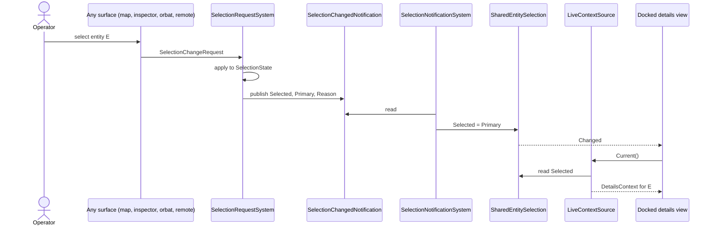
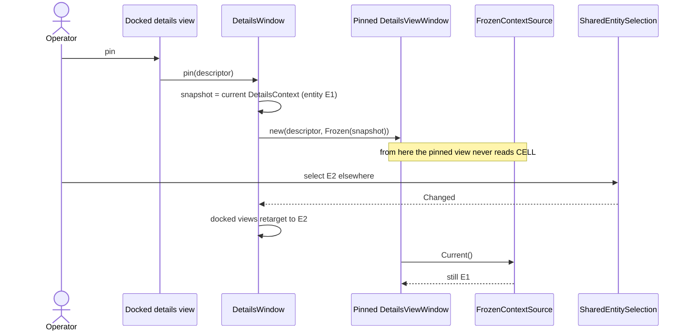
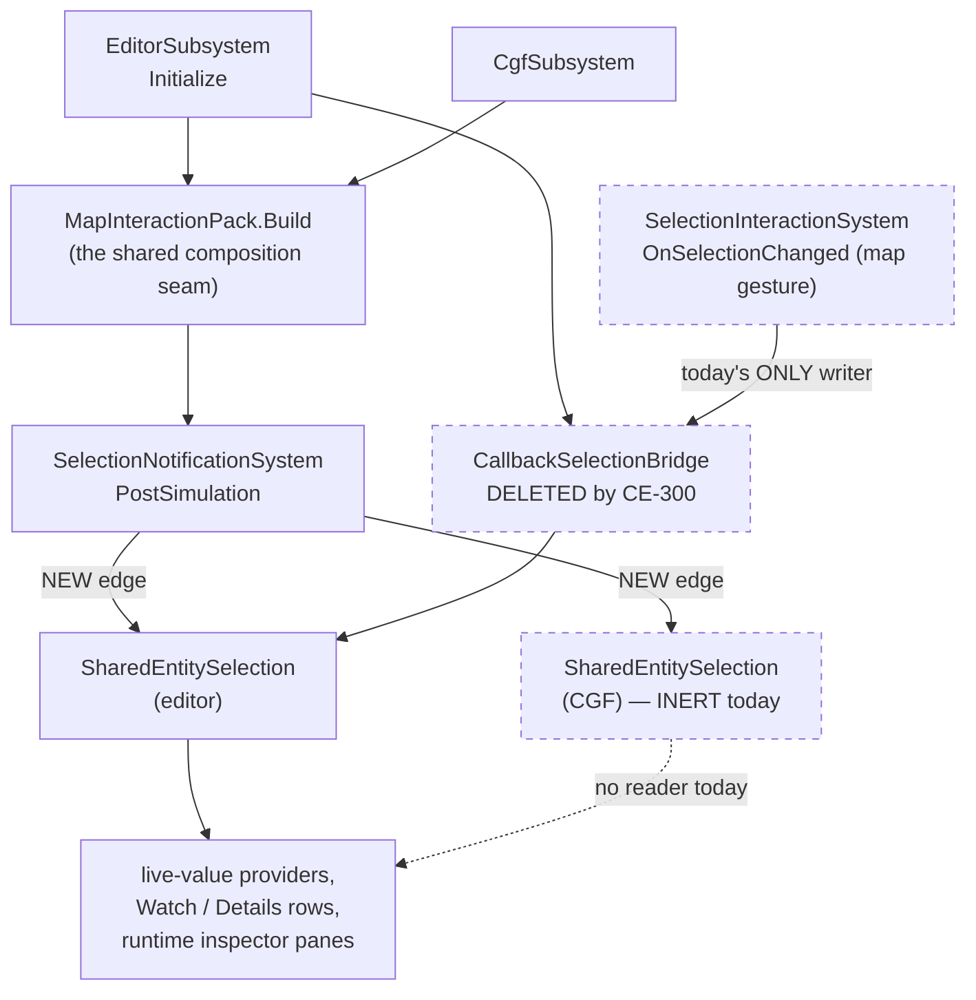

<!--STATUS
state: LIVE
build-state: READY-TO-BUILD
updated: 2026-09-21
current-answer: this whole file. §2 is the class model, §3 the sequences, §4 the module/registration
  view, §5 the per-surface rulings, §6 the write path (measured NOT a duplicate), §7 what this
  supersedes in AI_Editor_Shared_Infrastructure.md, §8 the items.
stale-below: nothing — this file is new.
known-rot: none open. ⚠ ONE question is UNRULED and is stated as such in §5.4: which entity a live
  variable WRITE targets when the view it was issued from is PINNED.
known-conflict: none. It SUPERSEDES AI_Editor_Shared_Infrastructure.md §5.3 (the DDS bridge as the
  ingress) and §5.4 (the per-window ChainToMap toggle); that file's known-rot points here.
design-basis: UX_Feature_Selection.md §2.7.8 (the announcement) and §2.7.17 (the egress; the same
  defect shape, twice) · DESIGN_Details_Panel_View_Switching.md §L4 + R-100 (float/pin, frozen
  context — BUILT) · AI_Editor_Shared_Infrastructure.md §5.1 ("plus the engine's selection-sync") and
  §5.1.1 ("SelectedEntity stays global") · DESIGN_Staged_Live_Write.md (the one write path) ·
  UXI-11 ruling ① (selection is global; ChainToMap retired) · user rulings 2026-09-21, quoted in §1.
related-designs:
  - docs/UX/UX_Feature_Selection.md — owns UXI-11: the ECS SelectionState component, the one store,
    the request/notification protocol and the egress. It does NOT own the AI editors' entity cell.
  - docs/blueprints/AI_Editor_Shared_Infrastructure.md — owns EditorSelectionStore's ASSET half
    (ActiveAsset + per-asset sub-selection), which this file does not touch. Its §5.3/§5.4 are
    superseded HERE.
  - docs/blueprints/DESIGN_Details_Panel_View_Switching.md — owns IDetailsContextSource, the Live /
    Frozen pair and the float+pin gesture. This file names WHAT FILLS the Live arm; it does not
    redraw that mechanism.
  - docs/blueprints/DESIGN_Staged_Live_Write.md — owns the staged live write, its drain and the
    yellow pending display. §6 here measures that it is ONE implementation, not two.
  - docs/blueprints/DESIGN_Variable_Details_And_Editing.md — owns the Details/Watch table, the
    colours and the optimistic display that the pinned-write question (§5.4) lands in.
-->

# DESIGN — **where an AI-editor view gets its entity**: follow when docked, frozen when pinned

## 1. ⭐⭐⭐ THE MODEL — **user-ruled, `2026-09-21`**

> 🔒 **User, verbatim:** *"Pinning is still a necessary option for debugging/monitoring views. … So
> while those diagnostic and monitoring views are docked within the detail panel, they need to follow
> the unified entity selection, but when in pinned mode, they need the entity captured at pinning
> time."*

> 🔒 **User, on the two stragglers:** *"`EntityBlueprintsManagedWindow` and
> `BlueprintRuntimeInspectorPane` sound like they need converting into proper details panel views with
> all the pinning support."* · **on the command:** *"`RunBlueprintOnEntityCommand` is a
> debug/development tool, it should be connected to the current unified entity selection (no
> pinning)."*

⭐⭐⭐ **The rule in one line:** **one unified selection is the only SOURCE; "pinned" is a per-view
CAPTURE of it, never a second source.**

⛔⛔ **What that forbids, and it is the whole point:** a surface that reads the entity from anywhere
other than the unified selection or its own frozen snapshot. 📌 Today exactly one production writer
feeds the AI cell and it is a **map gesture** — so "the unified selection" was not the source at all.

## 2. ⭐⭐ THE CLASS MODEL

⭐ **Read the colours first:** 🟩 exists and is correct · 🟨 exists and is REPOINTED by this design ·
🟥 exists and is DELETED · ⬜ new.

> 🖼 **Caption — what the picture shows that the prose hid.** ⭐⭐ **`SelectionNotificationSystem`
> already exists and already runs on every host**; the only missing edge is the one into
> `SharedEntitySelection`. ⛔ **And `CallbackSelectionBridge`'s edge comes from a GESTURE, not from the
> notification** — drawing both arrows on one canvas is what makes it obvious that the bridge is a
> second, narrower ingress beside a complete one. ⚠ `EditorSelectionStore`'s two halves are drawn as
> two blocks of members on purpose: the asset half is untouched by any of this.

## 3. ⭐⭐ THE SEQUENCES

### 3.1 Docked — **follow**

> 🖼 **Caption.** ⭐ **Every cause enters at `SRC` and they all converge before the cell** — that is the
> property a gesture-hung writer cannot have, and it is why this is a repoint and not a new mechanism.

### 3.2 Pinning — **capture, then ignore the source**

> 🖼 **Caption.** ⭐⭐ **The pinned window has NO edge to the cell at all** — that is the design, not an
> omission. ⛔ A "pinned" flag checked inside a live source would be the same fact in two places and
> would drift; `R-100`'s frozen snapshot already exists and already works (§L4 is confirmed live).

## 4. ⭐⭐ THE MODULE / REGISTRATION VIEW

> 🖼 **Caption — the dead edges, drawn.** ⭐⭐⭐ **`CGF` never gets a writer at all** *(measured: no
> bridge, and `CreateRegistrar` is called with no `liveValueProvider`, so no reader either)* — so its
> cell is **inert, not wrong**, and the fix gives it a writer for free rather than fixing a visible
> bug. ⚠ **The dashed `GEST → BRIDGE` edge is the defect**: it is the only thing feeding the editor's
> cell, and it fires for a map click and nothing else.

## 5. ⭐⭐ THE SURFACES — **what each one does, and under which ruling**

| surface | code | ruling |
|---|---|---|
| ⭐ **Details-panel switchable views** *(Watch, Details, the contributed views)* | `IDetailsContextSource` | ☑ **already correct by construction** — `Live` when docked, `Frozen` when pinned. ⭐ They only need §3.1's new edge to make `Live` actually live |
| 🟨 **`EntityBlueprintsManagedWindow`** | `EditorSubsystem.cs:3856` — `RegisterExtraWindow`, reads `_aiEditorSelectionStore?.SelectedEntity` **directly** | 🔒 **user:** convert into a proper details-panel view **with pinning** *(`CE-302`)* |
| 🟨 **`BlueprintRuntimeInspectorPane`** | `EditorSubsystem.cs:4156` — `SetResolvers(selectedEntityResolver: …)` reads the store **directly** | 🔒 **user:** same — convert, with pinning *(`CE-303`)* |
| ✅ **`RunBlueprintOnEntityCommand`** | `EditorSubsystem.cs:3794` — reads the store at button-press | 🔒 **user:** *"a debug/development tool … connected to the current unified entity selection (no pinning)."* ⭐ **Discharged by `CE-300` with no edit of its own** — once the cell IS the unified selection, reading it at press time is exactly the ruling. ⚠ Recorded so nobody "fixes" it into a pinned resolver later |
| ⚠ **the live variable WRITE** | `BlueprintLiveValueWriter` via `VariableEditCommit` | ⛔⛔ **UNRULED — §5.4 below** |

### 5.4 ⛔⛔ THE ONE OPEN QUESTION — **which entity does a PINNED view's edit write to?**

📐 **Measured:** `BlueprintLiveValueWriter` takes the entity from `EditorSelectionStore.SelectedEntity`
— *"the SAME OBJECT the READ takes it from"*, which was **true when every read came from that store**.
⇒ ⚠ **a pinned view breaks that invariant**: it *displays* `E1` from its frozen snapshot while the
writer resolves `E2` from the live cell. 🔴 **The designer edits one entity's value while looking at
another's** — the exact failure the writer's own header says it exists to prevent.

⭐ **Lean: the write target comes from the SAME `IDetailsContextSource` the view read from.** ⭐⭐ That
keeps the writer's stated invariant *(read and write take the entity from one object)* **true by
construction** rather than re-establishing it by care, and it makes a pinned view a genuinely
self-contained debugging instrument. ⛔ The alternative — refuse edits from a pinned view — is safe but
removes the main reason to pin a *debugging* view.
⚠ **Needs a user ruling before build** *(`CE-305`)*.

## 6. ⭐⭐⭐ THE WRITE PATH IS **ONE** IMPLEMENTATION — **measured, because the question was asked**

> 🔒 **User:** *"I thought the writing to a running blueprint variables has been solved from within the
> watch window … If it is doing the same as the `BlueprintLiveValueWriter` / `StagedWrites`, do we need
> two implementations for same thing?"*

✅ **No — there is one, and it is correctly factored. The Watch and the Details panel already share
it.** 📐 Measured `2026-09-21`:

| layer | what it is | measured |
|---|---|---|
| **`VariableEditCommit`** | ⭐⭐ **THE one commit path** — static, in `Hrot.Editor.AiShared/Variables/` | every editing gesture routes through it |
| **`VariableEditGestureBinder`** | the gesture → commit adapter | ⭐⭐⭐ **`PerspectiveWorkspaceRegistrar.cs:636` `AttachEditGestures(Details)` and `:690` `AttachEditGestures(Watch)`** — ⭐ **the SAME binder, attached to BOTH.** ⇒ the Watch's write IS the Details' write |
| **`BlueprintLiveValueWriter`** | ⛔ **NOT a second path — it is the `writeLive` STRATEGY plugged into the one path.** ⚠ Blueprint only; BTree/HSM pass `null` deliberately *(they have no staged-write path, and "faking one would be the unsafe route wearing the safe one's name")* | it exists because Batch 96 measured **zero** production call sites for `writeLive` — `R-67`, a caller that HAS a dependency must PASS it |
| **`StagedWriteView` / `StagedWrites`** | the **read-back** of pending staged writes — the optimistic yellow | ⭐ its resolver is `BlueprintLiveValueWriter.ResolveStagedField`, **the same call the WRITE makes.** 🔒 Its own header: *"`R-13`: route, don't duplicate. If the yellow resolved a field by any other route, a panel could go yellow for a field the write never touched"* |

⇒ ⭐⭐ **The naming is what misleads, not the structure.** `BlueprintLiveValueWriter` sounds like a
parallel writer; it is the Blueprint **arm** of the shared commit, and the yellow display deliberately
reuses its resolver so display and write cannot disagree. 📄 The owning design is
[`DESIGN_Staged_Live_Write.md`](DESIGN_Staged_Live_Write.md) — `build-state: BUILT`, `known-rot: none`.

⚠ **The per-ROW pinning the user remembers from the Watch is a DIFFERENT axis and it also exists:**
`PinnedVariableRowSource` pins **variable rows**, not the entity. ⛔ Do not conflate it with `R-100`'s
view pinning — 📌 they compose: a pinned row in a pinned view is a fixed variable on a fixed entity.

## 7. ⭐ WHAT THIS SUPERSEDES

| in `AI_Editor_Shared_Infrastructure.md` | verdict |
|---|---|
| **§5.3** — *"The DDS-published `SelectionChangedEvent` is consumed by an `IGSelectionBridge` service registered at editor startup"* | ⛔ **SUPERSEDED.** ⭐ The notification already carries **every** cause including remote ones *(`UXI-11` `S-6`)*; a DDS-level bridge would be a **second remote ingress** bypassing the unified path |
| **§5.4** — the per-window `ChainToMap` toggle | ⛔ **DEAD**, by `UXI-11` ruling ① — ⚠ and it is the **OUTBOUND** axis *("does this window's selection propagate out")*, which ruling ① settled globally. ⭐⭐ **Pinning is the INBOUND axis and is NOT touched by that ruling** — retiring §5.4 does not retire pinning |
| **§5.1 / §5.1.1** | ✅ **STAND, and they ARGUE FOR this change** — *"the single source of selection truth … plus the engine's selection-sync"* and *"`SelectedEntity` stays global"* |

## 8. ⭐ THE ITEMS

| id | what | state |
|---|---|---|
| **`CE-300`** | `SelectionNotificationSystem` gains the AI cell as a sink; `CallbackSelectionBridge` + `IGSelectionBridge` deleted | ⭐ **ready** — the edit is one sink argument and two deletions |
| **`CE-301`** | `SharedEntitySelection` is documented and railed as a **projection**, not a store — its only writer is the notification | ⭐ **ready**, lands with `CE-300` |
| **`CE-302`** | `EntityBlueprintsManagedWindow` → a details-panel view, with float+pin | ⭐ ready |
| **`CE-303`** | `BlueprintRuntimeInspectorPane` → a details-panel view, with float+pin | ⭐ ready |
| **`CE-304`** | `RunBlueprintOnEntityCommand` follows the unified current selection, no pinning | ✅ **discharged by `CE-300`**, recorded so it is not re-broken |
| **`CE-305`** | the write target for an edit issued from a **pinned** view | ⛔ **BLOCKED on a user ruling** — §5.4 |

⚠ **`CE-302`/`CE-303` are NOT prerequisites of `CE-300`** — they are conversions of two surfaces that
read the cell directly; both keep working after `CE-300` and simply keep following the selection until
converted.
