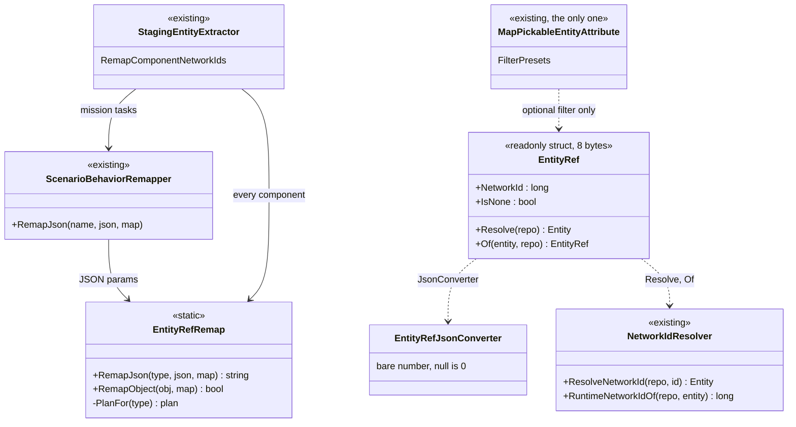
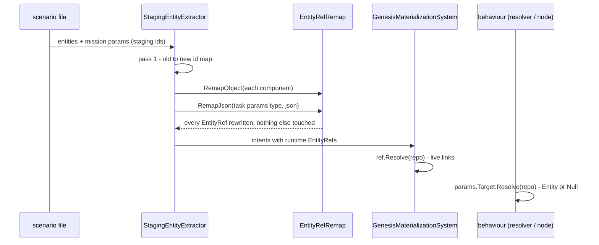
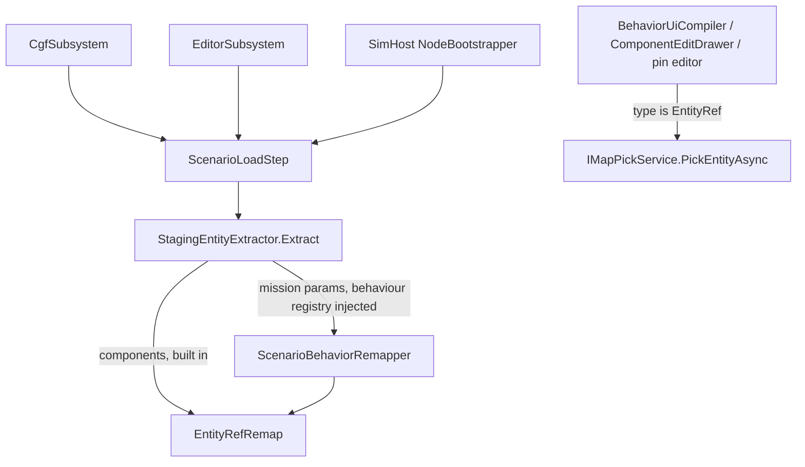

<!--STATUS
state: LIVE
updated: 2026-10-03
build-state: BUILDING (user, 2026-10-03: "Approved, do all 3 steps … refactor freely")
current-answer: §2 (the diagrams) and §3 (the decisions). §1 is the measured inventory; §5 is the as-built.
stale-below: nothing yet.
known-rot: none.
known-conflict: none.
related-designs:
  - Behavior_Parameter_Resolver_Detailed_Design.md — §4.2 named the authored "Entity reference" as `long` + `[RemapNetworkId]`
    + `[MapPickableEntity]`; this document replaces that triple with one TYPE (that row is SUPERSEDED here).
  - ../designs/cgf-scn/DESIGN.md — Decision 7 / C005 owns the scenario-load remap seam (per-behaviour delegates); this
    document makes the TYPE the remap schema and retires `[RemapNetworkId]` and the extractor's hand-coded intent cases.
  - DESIGN_Unified_Behaviour_Run.md — "S8o" built the type-plan JSON walker this document generalises (objects, lists).
  - ../designs/hill-attack/DESIGN.md — §6.1's `TargetAreaNetworkId` (`long` + attributes) becomes an `EntityRef`.
  - Architect_Question_55_Watch_Concrete_Entity_Picker.md — flagged the TWO `MapPickableEntityAttribute` classes; one is
    deleted here.
  - DESIGN_Variable_Watch_Pinning.md — owns the staging↔runtime map a watch pin uses; unaffected (it binds an entity,
    not an authored field).
  - ../designs/navig-2/Navigation_Design_v2_0.md — unaffected; listed because FollowRoute's `RouteEntityId` changes type.
-->

# Entity reference — one TYPE for an authored reference to another entity

> 🔒 **User, 2026-10-03:** *"Shouldn't entity reference be a special data type in blackboard variables/structs? It could
> have special entity picker and automatic scenario load remapping etc."* → lean approved: *"Approved, do all 3 steps.
> … You are the only lane touching the code now, refactor freely."*

## 1. INVENTORY *(measured 2026-10-03: `search_graph` Class/Struct/Field/Property + grep, two read-only sweeps; the
graph's `check_index_coverage` is not reachable from the CLI, so the absence claims below are grep-corroborated, not proven)*

| what | measured |
|---|---|
| a dedicated reference type | ⛔ **none** — no `EntityRef`/`NetworkEntityId`/`EntityHandle` type in code or `docs/` |
| authored id members | 4 contract members: `FireAtTargetParamsJsonDto.TargetNetworkId`, `FollowRouteParamsJsonDto.RouteEntityId`, `PlatoonHillAttackParamsJsonDto.TargetAreaNetworkId` (`long` + both attributes) and `HullDownAttackIntentDto.TargetNetworkId` (⛔ **no attributes: never remapped, no picker**); a private parse twin of the hill-attack DTO in `HillAttackCommanderNodes.cs`; the blueprint parameter `PlatoonHillAttackBp.TargetAreaNetworkId` (`System.Int64`, CE-2055) |
| load-transient ids | 6 `Initial*Intent` components (`GenesisIntentComponents.cs`, `[DataPolicy(Transient)]`): passengers (`List<long>`), vehicle, hierarchy ×3, route, targets (`List<TargetEntry>` with `NetworkId`), unit commander — written by 6 scenario translators from GUIDs, remapped by **6 hand-coded cases** in `StagingEntityExtractor.RemapComponentNetworkIds` |
| remap code | `StagingEntityExtractor` (hand cases + `ScenarioBehaviorRemapper` for mission params) · `BehaviorParamRemapperCompiler` (JSON, `[RemapNetworkId]`, no lists) · load steps: CGF passes a remapper, ⛔ **editor and SimHost pass none** (CE-2056) |
| pickers | `BehaviorUiCompiler` (mission panel, `long` + attribute) · `ComponentEditDrawer` (StructEdit, writes a LOCAL `Entity`) · `DtoJsonSchemaExtractor` (`picker:"entity"`, matches BOTH attributes by name) · ⛔ **two `MapPickableEntityAttribute` classes** (Fdp.Toolkits, Fdp.Presentation — the latter has no production user) |
| palettes | blueprint: `StaticTypeRegistry` + `BlueprintTypeSystem.SelectableTypeIds` (Entity added by hand) · BTree/HSM: `BlackboardTypeHelper` (no Entity) · pin editors: none for Entity |
| resolvers | ⭐ `NetworkIdResolver.ResolveNetworkId` (map + stale check — "THE one place") · `BlueprintWorldLibrary.EntityFromNetworkId` (map only, no stale check) · per-resolver `map.TryGetEntity` copies (`CgfNodes`, `HillAttackCommanderNodes`, `GenesisMaterializationSystem`, …) |
| replication | blackboards are never replicated (`Architect_Question_32_…_ANSWERS` §2c) ⇒ no wire change |

## 2. The design

*What the picture shows that prose hid: the meaning moves from three attributes repeated on every field to ONE type, and
every consumer — picker, remap, resolve, palette — keys on the type.*

*Who calls it: the extractor owns the remap on every host that loads a scenario. ⛔ The dead edges today — the editor and
SimHost load steps that pass no behaviour remapper — are closed by giving them the remapper from their own registry.*

## 3. Decisions *(approved by the user as a whole, 2026-10-03)*

| # | decision | rejected — one line each |
|---|---|---|
| D1 | ⭐ `Fdp.Toolkit.Replication.EntityRef` — readonly 8-byte struct, `NetworkId` (0 = none); JSON is the **bare number** (`[JsonConverter]` on the type, so every deserializer — blueprint `ParseParams`, the C# resolvers, StructEdit — honours it and existing files load unchanged) | a flag on `ParameterDecl` (CE-2055's old lean — repeated per surface, `long` stays ambiguous) · storing `Fdp.Core.Entity` (a local, recycled handle — `cgf-scn-2` Rule 3) |
| D2 | ⭐ **resolve through `NetworkIdResolver.ResolveNetworkId`** — `EntityRef.Resolve(repo)`, `EntityRef.Of(entity, repo)`; blueprint nodes *Entity From Ref* / *Ref From Entity*; *Entity From Network Id* routes there too | keep per-resolver `map.TryGetEntity` copies — no stale check |
| D3 | ⭐ **ONE type plan, two appliers** (`EntityRefRemap`): members of type `EntityRef`, arrays/lists of it, and nested classes/structs/lists that contain it; `RemapJson` (in place, original string when unchanged — S8o) and `RemapObject` (in-memory components). ⛔ `[RemapNetworkId]` and `BehaviorParamRemapperCompiler` are RETIRED | keep the attribute alongside — two schemas for one fact |
| D4 | ⭐ the extractor remaps EVERY component through the plan — the six hand-coded `Initial*Intent` cases are deleted; the editor and SimHost load steps get a behaviour remapper from their registry (closes CE-2056) | a remap delegate per intent type — what exists, and a new intent silently stays unmapped |
| D5 | ⭐ the TYPE triggers the picker (mission panel, component editor, schema, pin editor); `MapPickableEntityAttribute` survives only to narrow the pick (`FilterPresets`) and only in Fdp.Toolkits — the Fdp.Presentation copy is deleted | a picker attribute per field — the duplicate AQ55 flagged |
| D6 | ⭐ offered in every palette: blueprint (`StaticTypeRegistry` + `BlueprintTypeSystem`), BTree/HSM (`BlackboardTypeHelper`); blueprint default literal = `new EntityRef(N)` | — |
| D7 | ⭐ authored data uses `EntityRef`; `Fdp.Core.Entity` stays for RUNTIME state | — |

### Phasing (all three approved)

| step | content |
|---|---|
| 1 | D1 · D2 · D3 · D5 — the type, converter, resolve, the remap plan (JSON + objects), one picker attribute, pickers keyed on the type |
| 2 | D6 · nodes · `PlatoonHillAttackBp.TargetAreaNetworkId` → `EntityRef` (closes CE-2055) |
| 3 | D4 · migrate the four contract members, the hill-attack parse twin and the six intents; retire `[RemapNetworkId]` |

## 4. Design docs checked

`Behavior_Parameter_Resolver_Detailed_Design.md` §4.2 — applies, superseded in its entity row · `cgf-scn/DESIGN.md`
Decision 7 — applies, the type becomes the schema · `cgf-scn-2` Rule 3 ("Entity handles never cross scenario
boundaries") — applies, the reason the type holds a network id · `hill-attack/DESIGN.md` §6.1 — applies, migrated ·
`Architect_Question_32_…_ANSWERS` §2c (blackboards never replicated) — applies, no wire change ·
`Architect_Question_55` — applies, the duplicate attribute · `DESIGN_Variable_Watch_Pinning.md` — does not apply (pins
bind entities, not authored fields).

## 5. As-built

*(filled per step)*
