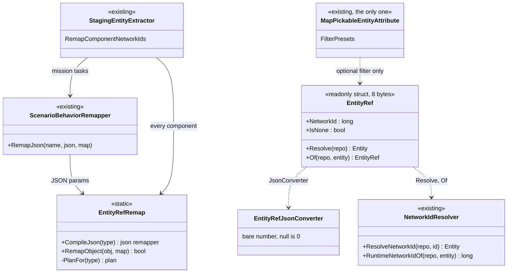
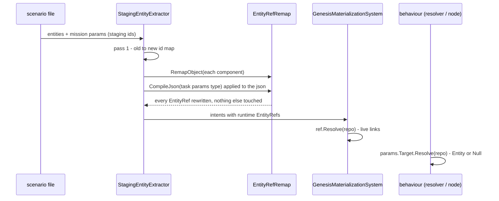
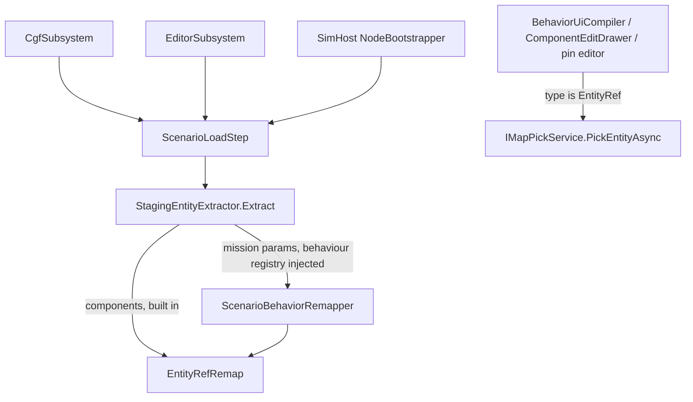

<!--STATUS
state: LIVE
updated: 2026-10-03
build-state: BUILT (all three steps, 2026-10-03 — §5)
current-answer: §2 (the diagrams) and §3 (the decisions). §1 is the measured inventory; §5 is the as-built.
stale-below: nothing.
known-rot: none.
known-conflict: none.
related-designs:
  - Behavior_Parameter_Resolver_Detailed_Design.md — §4.2 named the authored "Entity reference" as `long` + `[RemapNetworkId]`
    + `[MapPickableEntity]`; this document replaces that triple with one TYPE (that row is SUPERSEDED here).
  - ../designs/cgf-scn/DESIGN.md — Decision 7 / C005 owns the scenario-load remap seam (per-behaviour delegates); this
    document makes the TYPE the remap schema and retires `[RemapNetworkId]` and the extractor's hand-coded intent cases.
  - DESIGN_Unified_Behaviour_Run.md — "S8o" built the type-plan JSON walker this document generalises (objects, lists).
  - ../designs/hill-attack/DESIGN.md — §6.1's `TargetAreaNetworkId` (`long` + attributes) becomes an `EntityRef`.
  - Architect_Question_55_Watch_Concrete_Entity_Picker.md — flagged the TWO `MapPickableEntityAttribute` classes; one is
    deleted here.
  - DESIGN_Variable_Watch_Pinning.md — owns the staging↔runtime map a watch pin uses; unaffected (it binds an entity,
    not an authored field).
  - ../designs/navig-2/Navigation_Design_v2_0.md — unaffected; listed because FollowRoute's `RouteEntityId` changes type.
-->

# Entity reference — one TYPE for an authored reference to another entity

> 🔒 **User, 2026-10-03:** *"Shouldn't entity reference be a special data type in blackboard variables/structs? It could
> have special entity picker and automatic scenario load remapping etc."* → lean approved: *"Approved, do all 3 steps.
> … You are the only lane touching the code now, refactor freely."*

## 1. INVENTORY *(measured 2026-10-03: `search_graph` Class/Struct/Field/Property + grep, two read-only sweeps; the
graph's `check_index_coverage` is not reachable from the CLI, so the absence claims below are grep-corroborated, not proven)*

| what | measured |
|---|---|
| a dedicated reference type | ⛔ **none** — no `EntityRef`/`NetworkEntityId`/`EntityHandle` type in code or `docs/` |
| authored id members | 4 contract members: `FireAtTargetParamsJsonDto.TargetNetworkId`, `FollowRouteParamsJsonDto.RouteEntityId`, `PlatoonHillAttackParamsJsonDto.TargetAreaNetworkId` (`long` + both attributes) and `HullDownAttackIntentDto.TargetNetworkId` (⛔ **no attributes: never remapped, no picker**); a private parse twin of the hill-attack DTO in `HillAttackCommanderNodes.cs`; the blueprint parameter `PlatoonHillAttackBp.TargetAreaNetworkId` (`System.Int64`, CE-2055) |
| load-transient ids | 6 `Initial*Intent` components (`GenesisIntentComponents.cs`, `[DataPolicy(Transient)]`): passengers (`List<long>`), vehicle, hierarchy ×3, route, targets (`List<TargetEntry>` with `NetworkId`), unit commander — written by 6 scenario translators from GUIDs, remapped by **6 hand-coded cases** in `StagingEntityExtractor.RemapComponentNetworkIds` |
| remap code | `StagingEntityExtractor` (hand cases + `ScenarioBehaviorRemapper` for mission params) · `BehaviorParamRemapperCompiler` (JSON, `[RemapNetworkId]`, no lists) · load steps: CGF passes a remapper, ⛔ **editor and SimHost pass none** (CE-2056) |
| pickers | `BehaviorUiCompiler` (mission panel, `long` + attribute) · `ComponentEditDrawer` (StructEdit, writes a LOCAL `Entity`) · `DtoJsonSchemaExtractor` (`picker:"entity"`, matches BOTH attributes by name) · ⛔ **two `MapPickableEntityAttribute` classes** (Fdp.Toolkits, Fdp.Presentation — the latter has no production user) |
| palettes | blueprint: `StaticTypeRegistry` + `BlueprintTypeSystem.SelectableTypeIds` (Entity added by hand) · BTree/HSM: `BlackboardTypeHelper` (no Entity) · pin editors: none for Entity |
| resolvers | ⭐ `NetworkIdResolver.ResolveNetworkId` (map + stale check — "THE one place") · `BlueprintWorldLibrary.EntityFromNetworkId` (map only, no stale check) · per-resolver `map.TryGetEntity` copies (`CgfNodes`, `HillAttackCommanderNodes`, `GenesisMaterializationSystem`, …) |
| replication | blackboards are never replicated (`Architect_Question_32_…_ANSWERS` §2c) ⇒ no wire change |

## 2. The design

*What the picture shows that prose hid: the meaning moves from three attributes repeated on every field to ONE type, and
every consumer — picker, remap, resolve, palette — keys on the type.*

*Who calls it: the extractor owns the remap on every host that loads a scenario. ⛔ The dead edges today — the editor and
SimHost load steps that pass no behaviour remapper — are closed by giving them the remapper from their own registry.*

## 3. Decisions *(approved by the user as a whole, 2026-10-03)*

| # | decision | rejected — one line each |
|---|---|---|
| D1 | ⭐ `Fdp.Toolkit.Replication.EntityRef` — readonly 8-byte struct, `NetworkId` (0 = none); JSON is the **bare number** (`[JsonConverter]` on the type, so every deserializer — blueprint `ParseParams`, the C# resolvers, StructEdit — honours it and existing files load unchanged) | a flag on `ParameterDecl` (CE-2055's old lean — repeated per surface, `long` stays ambiguous) · storing `Fdp.Core.Entity` (a local, recycled handle — `cgf-scn-2` Rule 3) |
| D2 | ⭐ **resolve through `NetworkIdResolver.ResolveNetworkId`** — `EntityRef.Resolve(repo)`, `EntityRef.Of(entity, repo)`; blueprint nodes *Entity From Ref* / *Ref From Entity*; *Entity From Network Id* routes there too | keep per-resolver `map.TryGetEntity` copies — no stale check |
| D3 | ⭐ **ONE type plan, two appliers** (`EntityRefRemap`): members of type `EntityRef`, arrays/lists of it, and nested classes/structs/lists that contain it; `RemapJson` (in place, original string when unchanged — S8o) and `RemapObject` (in-memory components). ⛔ `[RemapNetworkId]` and `BehaviorParamRemapperCompiler` are RETIRED | keep the attribute alongside — two schemas for one fact |
| D4 | ⭐ the extractor remaps EVERY component through the plan — the six hand-coded `Initial*Intent` cases are deleted; the editor and SimHost load steps get a behaviour remapper from their registry (closes CE-2056) | a remap delegate per intent type — what exists, and a new intent silently stays unmapped |
| D5 | ⭐ the TYPE triggers the picker (mission panel, component editor, schema, pin editor); `MapPickableEntityAttribute` survives only to narrow the pick (`FilterPresets`) and only in Fdp.Toolkits — the Fdp.Presentation copy is deleted | a picker attribute per field — the duplicate AQ55 flagged |
| D6 | ⭐ offered in every palette: blueprint (`StaticTypeRegistry` + `BlueprintTypeSystem`), BTree/HSM (`BlackboardTypeHelper`); blueprint default literal = `new EntityRef(N)` | — |
| D7 | ⭐ authored data uses `EntityRef`; `Fdp.Core.Entity` stays for RUNTIME state | — |

### Phasing (all three approved)

| step | content |
|---|---|
| 1 | D1 · D2 · D3 · D5 — the type, converter, resolve, the remap plan (JSON + objects), one picker attribute, pickers keyed on the type |
| 2 | D6 · nodes · `PlatoonHillAttackBp.TargetAreaNetworkId` → `EntityRef` (closes CE-2055) |
| 3 | D4 · migrate the four contract members, the hill-attack parse twin and the six intents; retire `[RemapNetworkId]` |

## 4. Design docs checked

`Behavior_Parameter_Resolver_Detailed_Design.md` §4.2 — applies, superseded in its entity row · `cgf-scn/DESIGN.md`
Decision 7 — applies, the type becomes the schema · `cgf-scn-2` Rule 3 ("Entity handles never cross scenario
boundaries") — applies, the reason the type holds a network id · `hill-attack/DESIGN.md` §6.1 — applies, migrated ·
`Architect_Question_32_…_ANSWERS` §2c (blackboards never replicated) — applies, no wire change ·
`Architect_Question_55` — applies, the duplicate attribute · `DESIGN_Variable_Watch_Pinning.md` — does not apply (pins
bind entities, not authored fields).

## 5. As-built

### Step 1 — the type, the remap plan, the pickers *(2026-10-03)*

| decision | as built | deviation from §2–§3 |
|---|---|---|
| D1 | `FDP/Toolkits/Fdp.Toolkits/Replication/EntityRef.cs` — readonly struct, `NetworkId`, `None`/`IsNone`, `Resolve(repo \| view)`, `TryResolve`, `Of(repo, entity)`, `Remap(map)`, explicit casts to and from `long` (C# code may cross, never silently); `EntityRefJsonConverter` reads a number, `null`, a numeric string or `{"NetworkId":n}`, writes the number | `Of` takes `(repo, entity)` (§2 corrected) |
| D2 | `EntityRef.Resolve` → `NetworkIdResolver.ResolveNetworkId`; `BlueprintWorldLibrary.EntityFromNetworkId` now routes there (it gains the stale check); nodes *Entity From Ref* / *Ref From Entity* | — |
| D3 | `EntityRefRemap` (same folder): one plan per type (`ConditionalWeakTable`), entry kinds `Ref · RefSequence · Nested · NestedSequence`, public fields and properties, JSON key = `[JsonPropertyName]` or the member name (case-insensitive), `[JsonIgnore]` skipped for JSON; appliers `CompileJson(Type)` and `RemapObject(object, map)` (a boxed struct is rewritten in its box, a list of structs is stored back element by element). ⛔ `BehaviorParamRemapperCompiler` and `[RemapNetworkId]` **deleted**; `ScenarioBehaviorRemapper` compiles through `EntityRefRemap` | the JSON applier was drawn as `RemapJson(type, json, map)`; it is `CompileJson(type)` returning a cached delegate — the shape the remapper's registry already stored (§2 corrected) |
| D5 | ① mission panel: `BehaviorUiCompiler` draws the picker for a property **of type** `EntityRef`; `[MapPickableEntity]` only supplies the filter. ② component editor: `EntityRefFieldEditor` (`Fdp.Presentation/ImGui/Editing/`) collapses the struct into one `Scalar` leaf; `ComponentEditDrawer` shows *Pick Entity* for it and writes the picked reference; `IComponentPickerContext.TryConsumeEntityPick` yields an `EntityRef`, so `MapPickServiceBridge` lost its repository parameter (the reverse lookup to a local `Entity` fed only the deleted attribute). ③ `DtoJsonSchemaExtractor`: an `EntityRef` member is `{type:integer, format:entityRef, picker:entity}`; the `RemapNetworkIdAttribute` case is gone. ⛔ The Fdp.Presentation `MapPickableEntityAttribute` is **deleted**; the Fdp.Toolkits one now targets fields too | — |

*Rails:* `Fdp.Toolkits.Tests/Replication/EntityRefTests.cs` (D1 every JSON form, the bare-number write, D2 resolve and `Of`, D3 both appliers over every shape) · `BehaviorRemappingTests` ported to the type · `ComponentEditDrawerTests.D5_AnEntityRefField_IsOneLeaf_AndAPickLandsInTheComponent` (draws a real ImGui frame) · `BehaviorUiCompilerTests.CE2023_AnEntityPickOnAStructContract_LandsInTheJson` (now keyed on the type, no attribute on `FireAtTarget`). 🔴 Red-proved: dropping the drawer's type check, and dropping the store-back of a rewritten struct element, each fail their rail.

### Step 2 — palettes and the hill-attack blueprint *(2026-10-03)*

| decision | as built |
|---|---|
| D6 | blueprint: `StaticTypeRegistry` type table + alias `EntityRef`, in `EditorOfferableTypeIds` (so `BlueprintTypeSystem.SelectableTypeIds` offers it); `DefaultLiteral` writes `new EntityRef(NL)` (a parameter default, a pin default and a Literal node); pin default editor = text (`StringPinEditor`, the id); its own pin colour; a SendIntent contract member of type `EntityRef` is a pin (`IntentContractPaletteEntries`). ⛔ **No `Int64`↔`EntityRef` coercion rung** — a rung is inserted silently and the table's invariant is "lossless numeric widenings only" (`CoercionTable_ContainsOnlyLosslessWidenings`); a silent number↔reference crossing is the very ambiguity the type removes, so a graph crosses with *Ref From Entity* / *Entity From Ref*. BTree/HSM: `BlackboardTypeHelper` offers `EntityRef` (primitive table and the Add-Variable list) |
| CE-2055 | `PlatoonHillAttackBp.bp.json`, regenerated from its authoring script (`PlatoonHillAttackBpAuthoring`, `HILL_ATTACK_BP_REGENERATE=1`): the parameter `TargetAreaNetworkId`, the `CurNet` variable, the `TargetNetId` function's output and the `HullDownAttack` intent pin are `EntityRef`; the area resolves with *Entity From Ref*, and `TargetNetId` is one *Ref From Entity* call (the alive-and-replicated rule its old branch spelled out). The C# twin of the params DTO in `HillAttackCommanderNodes.cs` was deleted — the node parses the one `Hrot.Core` contract |

### Step 3 — the intents, the extractor, the editor's remapper *(2026-10-03)*

| decision | as built |
|---|---|
| D4 | the six `Initial*Intent` components (`Hrot.Core/Scenario/Genesis/GenesisIntentComponents.cs`) hold `EntityRef` / `List<EntityRef>`, and `TargetEntry.NetworkId` is an `EntityRef` — member names unchanged. Producers wrap the id they already resolved (six SimHost translators, `CreateEntityRequestSystem`); `GenesisMaterializationSystem` reads `.NetworkId` / `.IsNone` through the entity map it already used. ⭐ `StagingEntityExtractor.RemapComponentNetworkIds` keeps the mission-plan JSON pass and replaces the six hand-coded cases with ONE loop: `EntityRefRemap.RemapObject(component, oldToNew)` over every extracted component, in place. 🔴 The deleted target-memory case had dropped `PosZ` on every load (`CE-2062`) |
| CE-2056 | `EditorSubsystem` builds its `ScenarioLoadStep` with `CgfBehaviorSetup.CreateBehaviorRemapper(_behaviorRegistry)`. 📐 SimHost, Stride and IG pass no scenario extractor to `NodeBootstrapper.BuildOrchestration`, so their step is never built — the §2 module graph's "SimHost NodeBootstrapper" edge is dormant in production, not a gap |

*Rails:* `StagingEntityExtractorTests.Extract_InitialTargetsIntent_RemapsTheReference_AndKeepsEveryOtherField` (new — the reference remapped AND `PosZ`/`Score` kept), the existing passenger/commander remap rails and every intent translator/materialisation rail, ported to the type. ⚠ CE-2056 has no composition-root rail (`EditorSubsystem.Initialize` needs a full host).

*Out of scope, measured:* `JoinFormationParams.LeaderNetworkId` (an `int` in a contract with no authoring surface) and the EQS sensor wire keys (`ParentNetworkId` — runtime keys on a DDS topic, not authored data) stay as they are.

*Live (`2026-10-03`, `--mode all`, `scenarios/hill-attack-close-bp`):* load `OperatingLive`, 8 entities; the blueprint commander resolved its `EntityRef` area (1005) and dispatched `HullDownAttack` with `EntityRef` targets; both hostiles fell 50 → 25 → 0 by simTime 60 s; zero exceptions in the log. ⚠ In this file the staging ids coincide with the live ones, so the live run proves the type end to end, not the renumbering — `DistributedScenarioLoadTests` (non-coinciding ids) and the extractor rails prove that.

