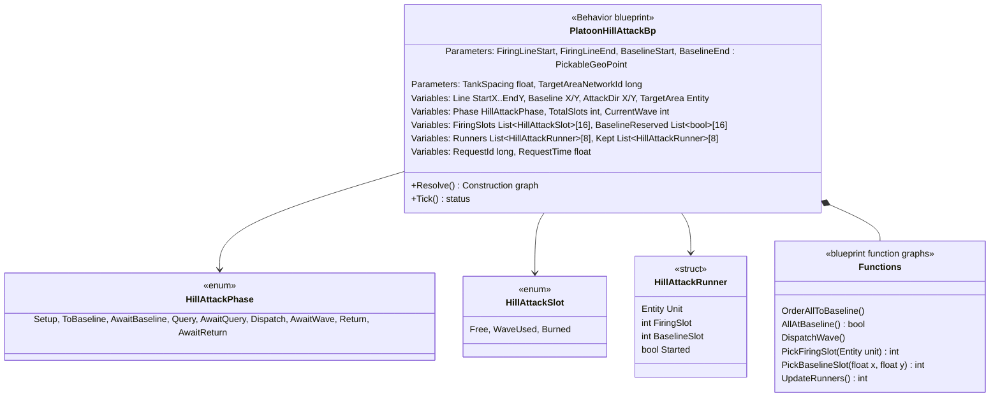
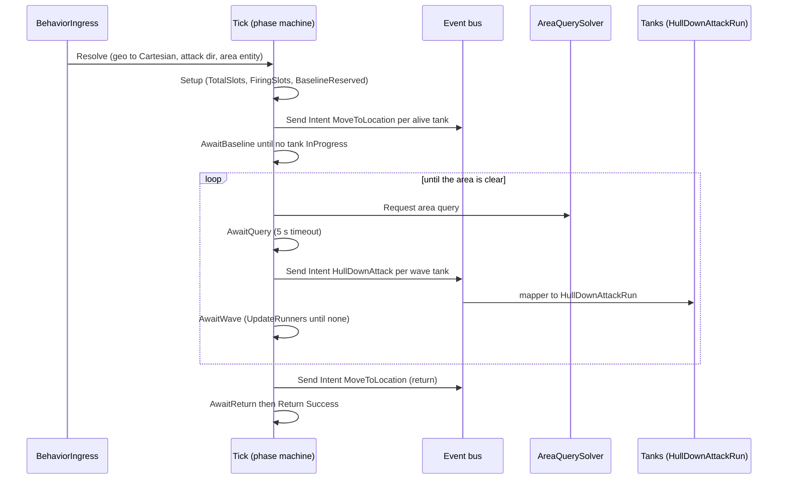
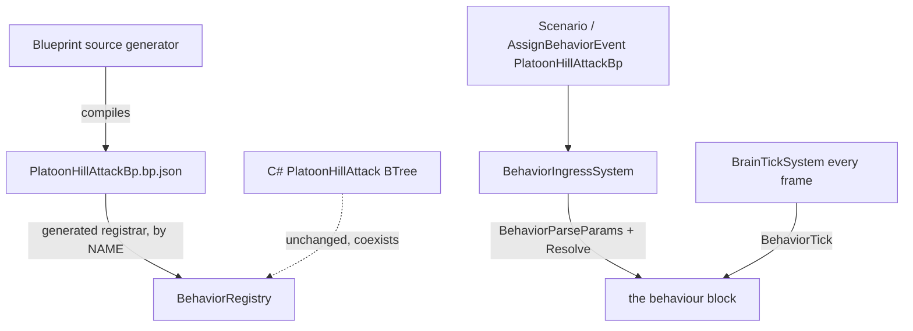

<!--STATUS
state: LIVE
updated: 2026-09-30
build-state: BUILT
current-answer: §3 (diagrams) · §4 (decisions — leans TAKEN, decide-and-log, overridable) · §5 (C# → graph map) · §6 (AS BUILT — read it)
stale-below: nothing yet
known-rot: none
known-conflict: none
related-designs:
  - docs/designs/hill-attack/DESIGN.md — owns the DOCTRINE (the spec, CE-460 quirk included); this doc owns only its blueprint form
  - docs/blueprints/Architect_Question_78_Hill_Attack_The_Blueprint_Node_Way.md — owns WHY (R-156, §3 A1 one behaviour, §7 plan row 11 = CE-464)
  - docs/blueprints/Architect_Question_77_Blueprint_As_A_Behaviour.md — owns the blueprint-behaviour runtime this runs on (block, BehaviorTick, own resolver §5.11)
  - docs/blueprints/DESIGN_Typed_Intent_And_Json_Nodes.md — owns the Send Intent node the orders go through (CE-472)
  - docs/blueprints/Blueprint_Fixed_Collections_Design.md — owns the fixed-list variables the slot and runner state use
-->

# The hill-attack commander as ONE blueprint behaviour — `CE-464`

> 🔒 **User, `2026-09-30`:** *"The C# helpers for basically everything is exactly what i found non elegant. The goal was
> making it the blueprint node way."* · *"Agreed on the single blueprint behavior, could be broken to blueprint functions
> whenever suitable."* · `R-156`: *"Non-generic c# helpers are a band aid and last resort."*

## 1. INVENTORY *(measured `2026-09-30`: two Explore sweeps + direct reads; codebase-memory CLI available)*

| the C# commander (`HillAttackCommanderNodes.cs`) | lines | what the graph needs |
|---|---|---|
| `Action_CalculateSegments` | 51–73 | float math, int cast, clamp |
| `Action_DispatchAllToBaseline` | 81–130 | loop over the roster, alive check, lerp, **Send Intent `MoveToLocation`** |
| `Condition_AreAllAtBaseline` | 140–180 | loop, **read another entity's** `NavigationStatus` |
| `Action_RequestAreaQuery` / `Condition_IsAreaQueryResolved` | 190–280 | generic area-query built-ins (`AreaQueryBatchOps`), sim time |
| `Action_DispatchWaveWithTargets` | 289–447 | loop + **inner loops** (free slots, closest baseline), seeded random, round-robin target, **Send Intent `HullDownAttack`** |
| `Condition_IsWaveCompleted` | 457–513 | loop over runners, alive, read **another entity's** `BehaviorState`, remove finished runners |
| `ResolvePlatoonHillAttackParams` | 667–811 | geo → Cartesian (with a Cartesian fallback), attack-direction maths, network id → entity |

| capability | exists? | where |
|---|---|---|
| loop over self's roster, Branch/Send Intent/SetVariable/ListWrite in the body | ✅ | `FlowForEachNode` (P1b lifted the branch-free rule; `Stage2_Validate.cs:2530`) |
| a loop INSIDE a loop | ⛔ as a nested node · ✅ **through a function call** — a Function graph may contain its own loop and is callable from a loop body | `Stage5_Schedule.cs:1679`, BP1650 forbids only latent nodes in a function |
| counted loop / Break | ⛔ | ⇒ iterate a fixed-LIST variable whose length is the count (the slots ARE lists — §4 C) |
| read another entity's component | ✅ `GetComponentNode` + `Target`, `Found` in the multi-field form | `Stage5_Schedule.cs:2864` |
| fixed-list of a project struct | ✅ spelled with a DOTTED id; the generator's oracle sizes the element | `Stage4_TypeResolve.cs:185-216` |
| a blueprint behaviour's own resolver | ✅ the asset's single Construction graph: reads Parameters, writes Variables, may call library functions | `InstanceEmitter.cs:499-513`, `V_ResolverPurity.cs:30-34` |
| JSON → Parameters | ✅ flat object, key = parameter name; a `PickableGeoPoint` parameter uses its own `[lat, lon]` converter ⇒ **the existing scenario JSON parses unchanged** | `InstanceEmitter.cs:299-337` |
| name = identity; a second registration of a name THROWS | ⚠ | `BehaviorRegistry.cs:450-460` ⇒ §4 A |

## 2. Claim table

| claim | code — how it IS | design — how it was MEANT |
|---|---|---|
| orders are `AssignTacticalIntentEvent`s (`MoveToLocation`, `HullDownAttack`) | ✅ `HillAttackCommanderNodes.cs:118,431` | ✅ `tactical-intent/DESIGN.md` §6 |
| "alive" = health > 0 | ✅ `CombatLife.IsAlive` (CE-466) | ✅ `hill-attack/DESIGN.md` destruction note |
| slot choice is deterministic per (subordinate, wave, time) | ✅ `SimRng.FromSim(sub.Index, wave, time)` `:363` | ✅ Q#8-C (deterministic) |
| the end of the attack returns the platoon to the baseline | ✅ `:583-585` (CE-459) | ✅ `hill-attack/DESIGN.md` §4.1/§4.2 |
| tests run WITHOUT a geo transform, using lon/lat as X/Y | ✅ `:732-739`; `HillAttackIntegrationTests` registers none | ⛔ searched `docs/` — the fallback is code-only ⇒ **NOT ported** (§6): production always has a transform; the blueprint's rails register one |

## 3. The design — diagrams

### 3.1 Classes (what the asset declares)

*What it shows that prose hid: the ONLY C# types are three plain data types (two enums, one struct) — no helper logic.
The C# bitmasks become lists (`FiringSlots`, `BaselineReserved`), which is also what gives the graph its counted loops.*

### 3.2 Sequence — one attack

### 3.3 Modules — who registers it and who ticks it

*What it shows: nothing new is registered by hand — the generator's registrar does it by name, and the brain tick already
runs blueprint behaviours. The C# doctrine stays registered beside it (§4 A).*

## 4. Decisions — leans TAKEN (decide-and-log; each is cheap to reverse)

| # | decision | ⭐ taken | rejected (one line each) |
|---|---|---|---|
| **A** | name | **`PlatoonHillAttackBp`, coexisting** with the C# `PlatoonHillAttack` until the proofs pass; the switch (delete the C# tree, rename) is a separate step for the user | *replace now* — a same-name registration throws (`BehaviorRegistry.cs:450`), so it would mean deleting the reference before the copy is proven |
| **B** | shape | one Tick = a **phase machine** (`Phase` enum, Compare + Branch chain), each phase's work in a **blueprint function graph** | *latent Delay/When per phase* — they cannot sit in loops or functions, and the waits are condition polls, not timers |
| **C** | slot bookkeeping | **lists instead of bitmasks**: `FiringSlots : List<HillAttackSlot>[16]`, `BaselineReserved : List<bool>[16]` sized to `TotalSlots` | *masks + the new bit operators* — faithful, but a mask gives no loop to scan its bits (no counted loop) |
| **D** | the runner list | `Runners : List<HillAttackRunner>[8]`; completion copies survivors into `Kept`, then `Runners := Kept` by Clear + re-Add | *remove while iterating* — the loop reads its count once (`Stage5` FlowForEach), so an in-place remove skips entries |
| **E** | nested loops | an inner loop lives in a **function** called from the outer loop body | *a new nested-loop node* — not needed; functions already allow it |
| **F** | generic built-ins added to `BlueprintWorldLibrary` (all engine-level, R-156) | `Random Int Seeded(seed, salt, min, max)` — the C# seeds by the SUBORDINATE, not self; `Behavior Hash(name)`; `Has Geographic Transform` for the Cartesian fallback | *doctrine helpers* — R-156 |
| **G** | proof | new SimHost rails driving `PlatoonHillAttackBp` through the real pipeline (the `HillAttackIntegrationTests` harness), parity against the C# on the same scenario, then one live `ClusterRunner` run | — |

## 5. C# → graph map (the parity checklist)

| C# | graph |
|---|---|
| `CalculateSegments` | Setup phase: `TotalSlots = clamp(int(len/spacing),1,16)`; Resize `FiringSlots`/`BaselineReserved` to `TotalSlots`, fill Free/false; wave 0; `RequestId = -1` |
| `DispatchAllToBaseline` | `OrderAllToBaseline()`: clear `BaselineReserved`; ForEach roster (index i, count n): alive → `t = n>1 ? i/(n-1) : .5`; Send Intent `MoveToLocation {X,Y,Speed 15,ArrivalRadius 5}`; `i<16` ⇒ reserve i |
| `AreAllAtBaseline` | `AllAtBaseline()`: ForEach roster: alive and (no `NavigationStatus` or `Result == InProgress`) ⇒ false |
| `RequestAreaQuery` + `IsAreaQueryResolved` | Query/AwaitQuery phases over `AreaQueryBatchOps` (Request / IsReady / TargetCount / TargetGroupHandle / Free), 5 s timeout via `Get Sim Time`; count 0 ⇒ Return phase |
| `DispatchWaveWithTargets` | `DispatchWave()`: reset WaveUsed→Free; ForEach roster (runners < 8, alive, parity unless n ≤ 3): `slot = PickFiringSlot(unit)`, skip if −1; `base = PickBaselineSlot(fx,fy)`; target = `TargetAt(handle, k % count)`, alive + `NetworkIdentity` ⇒ net id; add runner; Send Intent `HullDownAttack`; free the query; flip wave |
| `PickFiringSlot` (inner loop) | two passes over `FiringSlots`: count Free, then take the `RandomIntSeeded(unit.Index, wave, 0, avail)`-th Free |
| `PickClosestBaselineSlot` | pass over `BaselineReserved` (unreserved, min d²), fallback pass ignoring reservation |
| `IsWaveCompleted` | `UpdateRunners()`: ForEach runners: dead ⇒ burn slot + release baseline; not started ⇒ started when `BehaviorState.ActiveBehaviorHash == Hash("HullDownAttackRun")`, keep; started and hash differs ⇒ release baseline; else keep. Then `Runners := Kept` |
| `Resolve…Params` | Construction graph: 4 × (Has transform ? GeoToCartesian : (lon, lat)); attack dir = firing-line normal, flipped away from the baseline centre (degenerate ⇒ approach vector ⇒ (1,0)); `TargetArea = EntityFromNetworkId` |

⚠ **Parity note (declared, not hidden):** the C# swap-removes runners (order changes), the graph keeps order. Runner ORDER is
not observable (it only decides iteration order of the completion check), so outcomes match.

## 6. As built `2026-09-30`

**Where it lives:** `Hrot/Subsystems/Hrot.AI.Behaviors/Assets/Blueprints/PlatoonHillAttackBp.bp.json` (editor-loadable; 11 graphs:
Tick, Resolve, Setup, OrderAllToBaseline, AllAtBaseline, SlotT, PickFiringSlot, PickBaselineSlot, TargetNetId, DispatchWave,
UpdateRunners). ⭐ It is AUTHORED by `Hrot.Blueprints.Tests/Authoring/PlatoonHillAttackBpAuthoring.cs` over the real asset model
(pins from the editor's own `NodePinSchema`), and `PlatoonHillAttackBpAuthoringTests` pins the file to that output
(`HILL_ATTACK_BP_REGENERATE=1` rewrites it) and requires ZERO compiler diagnostics (a `BP4004` warning silently drops a node).
The only C# it adds: `HillAttackBlueprintTypes.cs` (two enums + the runner struct — data, no logic).

| ⚠ deviation from §3–§5 | why |
|---|---|
| **no Cartesian fallback** in the resolver (C# `:732-739` used lon/lat as X/Y without a transform) | production always has a transform; porting the test convenience would need a doctrine branch in every geo read. The rails and the scenario run WITH one |
| one extra generic built-in: `Lat/Lon To Cartesian`, `Has Geographic Transform` (§4 F said "Has Geographic Transform" only) | the `PickableGeoPoint` parameters break into lat/lon; `GeoPoint` would need a Make |
| `Cast` used as a PURE node | ⛔ an exec-chained Cast is dropped (`BP4004`) — `CE-475` |

**Compiler defects the first large blueprint behaviour exposed — FIXED in this batch** (each one was latent; none is hill-attack specific):

| defect | symptom | fix |
|---|---|---|
| block labels resolved from ONE asset-wide map while Stage5 numbers blocks PER GRAPH | an asset with branches in ≥ 2 graphs: `goto` names a label in another method (`CS0159`) | `EmissionContext.LabelForBlock` looks in `CurrentGraph` first |
| an enum list element keeps the `global::` sentinel | `global::global::Ns.E` (`CS0400`) | `TypeRefToCSharp` leaves an already-qualified name alone |
| `ListWrite`'s unwired `Ok` is assigned, never read | `CS0219` — an ERROR in the real generator build (warnings as errors) | emit `_ = __tN;` |
| parameter JSON keys matched EXACTLY | a scenario's camelCase `"firingLineStart"` silently ignored ⇒ default parameters | `switch (key.ToLowerInvariant())` — the platform options' own `PropertyNameCaseInsensitive` rule |

**Proof** (`Hrot.SimHost.Tests/HillAttackBlueprintTests.cs`, real ingress + brain tick + EQS solver):
**A** empty area ⇒ platoon staged, returned, commander FINISHES · **B** 🔴 the C# and blueprint commanders on twin worlds send the
SAME first wave (tanks, firing slots, baseline slots, attack direction, round-robin targets) · **C** full cycle: wave → runs start →
runs end, area cleared → re-query → return → finish. Live: `scenarios/hill-attack-close-bp` (the C# scenario with
`behaviorName: PlatoonHillAttackBp`) on `ClusterRunner --mode all` (xvfb).

**Live A/B, `2026-09-30`, read through the AI debug HTTP API** (`GET /entities/{id}/state` on the `Scenario` perspective
— the CGF node where brains run; a FRESH cluster per run, because a second `POST /scenario/load/live` into a running
cluster answered `sawWorldChange:false` and did not reset the world):

| | C# `hill-attack-close` | blueprint `hill-attack-close-bp` |
|---|---|---|
| commander reports | `PlatoonHillAttack`, brainTier 2 | ⭐ **`PlatoonHillAttackBp`, brainTier 3** |
| baseline orders | 4 × `MoveToLocation` → (523,401) (526,450) (529,499) (532,548) | **identical** |
| wave 1 | 1002 + 1004 `HullDownAttackRun`, t≈10.9 | **1002 + 1004**, t≈12.4 |
| wave 2 | 1001 + 1003, t≈28.1 | **1001 + 1003**, t≈35.6 |
| firing slots used | {(580,444), (581,474), (582,504)} | same set, different picks per tank |
| return point after a run | (528,474) | (528,474) |
| hostiles `Health 0` | t≈17.8 / 35.1 | t≈19.8 / 46.1 |
| return + commander finishes | t≈51.0 (same sample) | t≈56.9 (same sample) |
| all four `Arrived` on the baseline | t≈58.1 | t≈69.1 |

⇒ the same chain in the same order. The slot choice per tank differs; both implementations seed from the sim time
(`HillAttackCommanderNodes.cs:356` CE-202, `SimRng.FromSim`), so it also differs between two runs of the same one.
Timings differ within the scenario's known non-determinism (`RUNBOOK_Cluster_Debugging_Over_Http.md` §8).
⚠ Not verified: node-level trace. `POST /trace/observe` answered *"Trace coordinator not available"* on `--mode all`
for both. ⚠ Seen in BOTH runs, so not this change: a tank mid-`HullDownAttackRun` briefly shows a
`NavigationIntent.FinalDestination` of x≈10 560.
