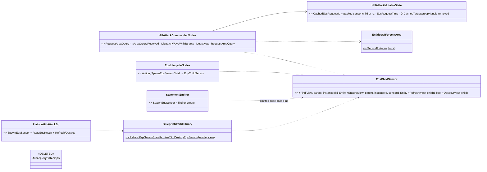
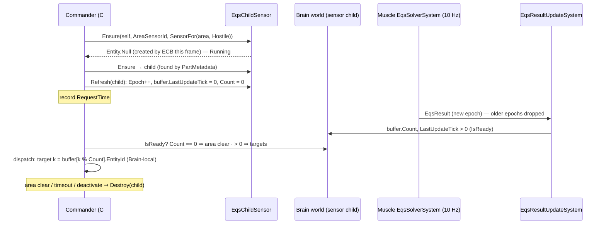
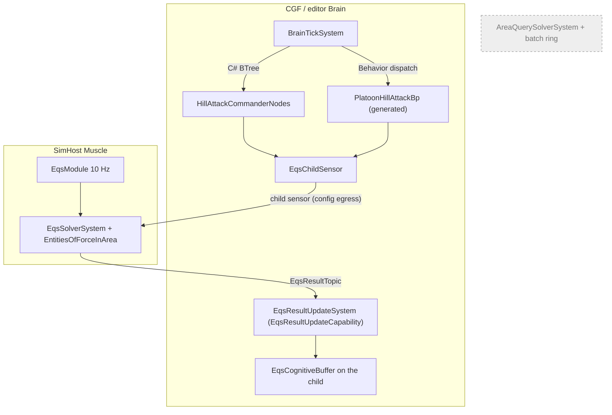

<!--STATUS
state: LIVE
updated: 2026-10-01
build-state: BUILT
current-answer: §6 (as built) — §3/§4 are true with the deviations §6 lists.
stale-below: nothing.
known-rot: none.
known-conflict: docs/blueprints/When_Reactivity_Iteration_Design_v2_2.md says SpawnEqsSensor is "one-shot per invocation —
  each execution creates a new sensor child entity". §4 D3 changes that to find-or-create; that doc's §7 is NOT edited (its
  own banner says it is the original iteration design) — this doc is the newer record for the node's runtime semantics.
related-designs:
  - docs/designs/eqs-2/EQS_Design_v1.3_final.md — owns the EQS area template, the Brain/Muscle split (§17.2) and the migration
    recipe (§17.6) this follows; §16.3 lists the AreaQuery footprint this empties of callers
  - docs/blueprints/DESIGN_Hill_Attack_Blueprint_Behaviour.md — owns PlatoonHillAttackBp (CE-464); this doc changes only its
    area-query phases
  - docs/designs/hill-attack/DESIGN.md — owns the DOCTRINE both commanders implement (the invariant: hostiles destroyed,
    platoon back on the baseline)
  - docs/blueprints/When_Reactivity_Iteration_Design_v2_2.md — owns the SpawnEqsSensor / ReadEqsResult node pair (§2.4, §2.5, §7)
  - docs/blueprints/batches/REPORT_EQS_Unification.md — the backend lane's report: the three designed differences (16-cap,
    no-polygon ⇒ nothing, no 0..1000 m footprint)
-->

# Hill attack on EQS 1.3 — both commanders off the old area query

🔒 **User, `2026-10-01`:** *"go ahead with the EQS migration of PlatoonHillAttackBp, also the csharp commander should be
migrated to prepare for the old area query retirement."* ⇒ **scope:** both callers move; the AreaQuery pipeline itself
stays (its retirement is a separate step). ⛔ The C# `PlatoonHillAttack` is kept and migrated, not retired (user `2026-10-01`).

## 1. INVENTORY *(measured `2026-10-01`)*

| query | total | what |
|---|---|---|
| `grep AreaQueryBatchHelper\|AreaQueryBatchOps` over `*.cs`, `*.json` outside the pipeline itself | **2 callers** | `HillAttackCommanderNodes` (5 methods + 1 deactivator) · `AreaQueryBatchOps` → called only by `PlatoonHillAttackBp.bp.json` |
| EQS Brain-side sensor helpers (`grep "PartMetadata" Hrot.AI.Behaviors`) | **1** | `EqsLifecycleNodes.Action_SpawnEqsSensorChild` + `FindExistingChild` — the find-or-create prior art |
| blueprint EQS nodes (`BuiltInNodeRegistry`) | **2** | `SpawnEqsSensorNode` (exec), `ReadEqsResultNode` (pure) — no refresh, no destroy |
| runtime rails that run blueprint spawn → read | **0** | only lowering/validator/editor tests; one asset uses the pair (`CoverAwarePatrol` recipe, first-tick spawn) |
| state-field users outside the lane | **1** | ⛔ `Hrot.IG.Tests/Brains/HillAttackCommanderNodesDeactivatorTests.cs` sets `CachedEqsRequestId` and calls `Deactivate_RequestAreaQuery` — a **STOP path**; both names must survive |

## 2. Claim table

| the design rests on | code — how it IS | design basis |
|---|---|---|
| a stale-epoch result is dropped on the Brain | ✅ `EqsResultUpdateSystem.cs` (`evt.Epoch != sensor.Epoch ⇒ continue`, both paths) | ✅ EQS §17.6 *"bump Epoch … wait for LastUpdateTick"* |
| an empty area publishes READY + 0; a missing area publishes nothing | ✅ `EqsSolverSystem.cs:202` (`count < 0` ⇒ return), `:214-224` (`count == 0` ⇒ empty event) | ✅ EQS §17.5 last row |
| a child sensor needs a parent with `NetworkIdentity` | ✅ `EqsSolverSystem.cs:99-101` | ✅ EQS §16.2 H5, user *"every parent has network identity"* |
| result entities are Brain-local on the reading node | ✅ backend FIX ④ | ✅ EQS §17.2 |
| 🔴 the blueprint `SpawnEqsSensor` handle is an ECB **placeholder** | ✅ `StatementEmitter.cs:1274` stores `ecb.CreateEntity()`; `EntityCommandBuffer.cs:62-63` *"placeholder … negative index … remapped during playback"*; `ReadEqsResult` tests `view.IsAlive(handle.ChildId)` ⇒ **never ready** | ⛔ v2.2 §7 assumed the handle is the entity — searched `docs/`, `.dev/`: no record of the placeholder |
| destroying the child disposes the Muscle carrier | ⛔ not re-measured here | ✅ EQS §17.6 last-but-one row, §17.7 row 1 (backend-measured) |

## 3. The design — diagrams

### 3.1 Classes

*What the picture shows that prose hid:* **one** find/ensure/refresh/destroy implementation serves all three Brain-side
callers — the C# commander, the existing BTree EQS nodes and the emitted blueprint code. The template is the backend's,
unchanged.

### 3.2 Sequence — one wave, either commander

*What the picture shows that prose hid:* the old **request → poll → free per wave** becomes **refresh → poll** on one
persistent sensor; *"a fresh answer per wave"* is guaranteed by the epoch filter, not by a new request id.

### 3.3 Modules — who ticks what

*What the picture shows that prose hid:* after this change the old pipeline (grey) still **runs** on every host but has
**no caller** — retirement removes registrations only, no behaviour code.

## 4. Decisions — leans TAKEN (decide-and-log)

| # | decision | taken | rejected (one line each) |
|---|---|---|---|
| **D1** | one helper for the Brain-side child sensor | **`EqsChildSensor`** in `Fdp.Toolkits/Spatial/Eqs` (beside `EqsComponents`); `EqsLifecycleNodes` routed to it | *a copy in each caller* — three implementations of one lookup (ruling 9) · *in `Hrot.AI.Behaviors`* — the blueprint compiler would emit a call into a game assembly |
| **D2** | a fresh answer per wave | **`Refresh` = Epoch++ and clear the Brain buffer**, then wait for `IsReady` | *wait for `LastUpdateTimeSeconds > t0`* — a result computed just before t0 still passes · *destroy + re-spawn per wave* — re-creates the Muscle carrier and DDS instance every wave |
| **D3** | the blueprint `SpawnEqsSensor` placeholder handle | **find-or-create**: the emitted block first `EqsChildSensor.Find(self, InstanceId)`; found ⇒ that handle; else ECB-create and output a **default** (pending) handle | *keep one-shot* — its handle is never alive, so the node pair cannot work · *remap the ECB* — a Fdp.Core change (STOP path) for one node. ⚠ Semantics change: re-executing the node no longer creates a duplicate — which BP2032 already treated as a key collision |
| **D4** | blueprint refresh and destroy | **two built-in functions** `RefreshEqsSensor(handle)`, `DestroyEqsSensor(handle)` in `BlueprintWorldLibrary` (`[BlueprintCallable("EQS")]`) | *two new node kinds* — ~5 files each for what a function call already lowers (R-156: built-in functions are first-class) · *no destroy* — an idle commander's sensor would keep the Muscle evaluating at 10 Hz |
| **D5** | the C# state | **keep `CachedEqsRequestId`** (now *the sensor child, packed; −1 none*) **and `Deactivate_RequestAreaQuery`**; drop `CachedTargetGroupHandle` | *rename to `SensorChild`* — breaks `Hrot.IG.Tests` (STOP path) for a name. The doc comment carries the new meaning |
| **D6** | sensor lifetime | **persistent across waves; destroyed on area clear, timeout and deactivate**; a sensor left by an abort is re-found by its fixed `InstanceId` (no growth) and cleaned with the parent by `SubEntityCleanupSystem` | *per-wave sensor* — see D2 |
| **D7** | `AreaQueryBatchOps` | **delete** once the blueprint stops calling it | *keep for retirement* — it is our helper, not the pipeline; unreferenced it is only drift |

⚠ **Designed differences the doctrine inherits** (EQS §17.5, backend report §4): ≤ 16 targets (a wave uses ≤ 8 tanks) ·
a missing area ⇒ no answer ⇒ the 5 s timeout ends it (**no false "area clear"**) · no 0..1000 m footprint.
⚠ **Order** is not grid order (EQS §16.2 H9): which tank gets which target may differ from the old run; the outcome rail is
`hill-attack-close`.

## 5. Acceptance

| | proof |
|---|---|
| ① | `HillAttackIntegrationTests` / `HillAttackNodeTests` rewired to `EqsSolverSystem` + `EqsResultUpdateSystem` (not `AreaQuerySolverSystem`), all green — `EQS §16.2 H11` says these cannot alone prove "unchanged" ⇒ ⑤ |
| ② | `HillAttackBlueprintTests` (blueprint) green on the same EQS wiring, first wave still order-identical to the C# |
| ③ | a blueprint spawn → read rail through the real generated code (the pair had none — §1) |
| ④ | `grep AreaQueryBatchHelper` over the behaviours code ⇒ 0 |
| ⑤ | live `ClusterRunner --mode all`, both scenarios: hostiles `Health 0`, platoon back on the baseline |

## 6. As built `2026-10-01`

⭐ §3's three diagrams are true as built. Deviations and findings:

| | what the build found | what was done |
|---|---|---|
| ① | 🔴 **a sensor's CREATION must count as the question.** With "ensure, then refresh" the first answer came one tick later than the old request → poll, which broke the integration rail's tick contract *and* would have shifted the blueprint's dispatch tick against the C# one (both seed slot picks from sim time — CE-202) | the C# commander records `SensorBeingCreated` (−2) and the sensor is FOUND on the next tick; the blueprint refreshes only a sensor that already exists. Later waves refresh — §3.2 holds from wave 2 |
| ② | 🔴 **`SpawnEqsSensor` bakes `InstanceId` from its NODE id** ⇒ two spawn nodes are two sensors | the blueprint routes BOTH Query and AwaitQuery through ONE spawn node and branches on the phase after it |
| ③ | 🔴 **compiler defect: `Read EQS Result` inside a loop body or branch got a call and NO helper** — every helper collector in `InstanceEmitter` walked only top-level block statements (CS0103 in the real generator build) | one recursive `AllStatements` walker (`IrOp_ForEach.Body`, `IrOp_If.Then/Else`) for all five collectors (ConditionMet, When-EQS, ReadEqsResult, ScoreDecision, ReadRankedResult) |
| ④ | the SimHost fixtures played the brain's command buffer back AFTER the solver ⇒ a new sensor was invisible to it for a tick | brain playback → solver → playback → result update, the production order |
| ⑤ | a fixture "cleared" the area by emptying the perception grid — invisible to EQS, which walks entities (EQS §17.5) | the hostiles are killed instead (Health 0, CE-272) |
| ⑥ | the commander cannot reference `EntitiesOfForceInArea` (`Hrot.SimHost`, the Muscle) | it names the template by AssetId (`AreaTemplateAssetId`), like a blueprint; `HillAttackNodeTests.EQS_AreaSensor_AsksTheEntitiesOfForceInAreaTemplate` pins it to the template's constant and the registry |
| ⑦ | `HillAttackMutableState.CachedTargetGroupHandle` dropped | 4 explicit pad bytes keep the struct at 120 with no implicit padding |
| ⚠ | not done: `EqsLifecycleNodes.Action_SpawnEqsSensorChild` still stores the ECB placeholder in its handle (only its lookup was routed to `EqsChildSensor.Find`, which is what re-finds the child) | left: it returns Success on the creating tick by contract and has its own rails; recorded here |
| ⚠ | residual: a blueprint sensor left by an aborted run keeps the area it had (`Spawn EQS Sensor` re-finds, it does not re-configure) | same commander + a different area after an abort is the only case; the C# path re-applies its config on refresh |

**Live** *(`ClusterRunner --mode all`, a fresh cluster per run, read over the debug HTTP API)*: both commanders kill both
hostiles and bring the platoon back (C# finished t≈68 s, blueprint t≈67 s); about 10 s in, a 9th entity carrying
`PartMetadata` + `EqsSensor` + `EqsCognitiveBuffer` — the area sensor — is listed on the Muscle (SimHost) for both, and on the
Brain for the C# run. ⇒ the EQS path is the one in use.

**Rails:** `HillAttackNodeTests` SC-HA011-1…5 + SC-HA012-3/8 re-homed on a real sensor + buffer (SC-HA011-3 un-quarantined —
it was `Broken` on an AreaQuery registration) and the template-identity rail · `HillAttackIntegrationTests` on
`EqsSolverSystem` + `EqsResultUpdateSystem` (SC-HA015-1…5) · `HillAttackBlueprintTests` (first wave still order-identical
to the C#) · `EqsModuleTests.EqsChildSensor_*` (create once then find · refresh drops the old epoch · destroy) ·
`SpawnEqsSensorLoweringTests` re-homed on the `Ensure` call. ⚠ `SC_HA015_6` still tests the OLD `AreaQuerySolverSystem` —
a rail of the pipeline being retired, it goes with it.
