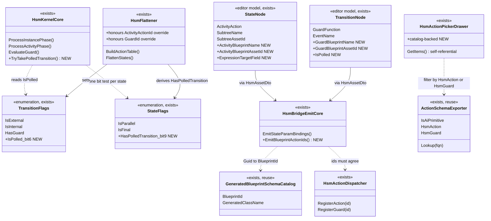
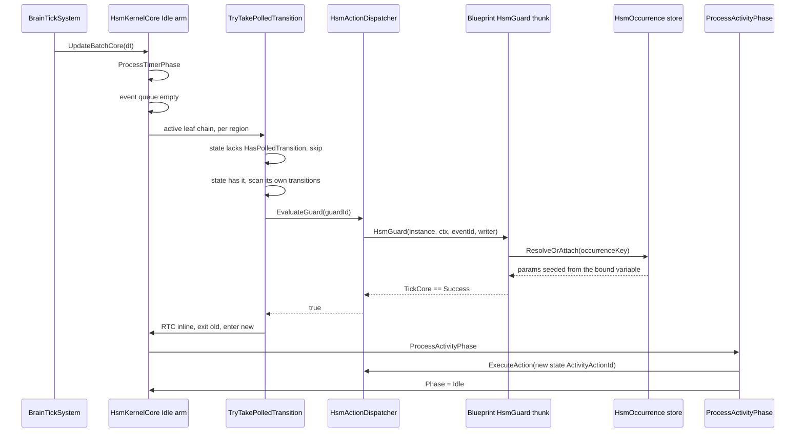
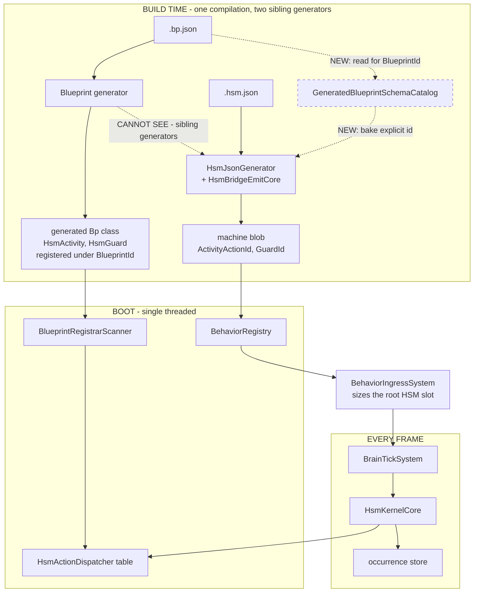
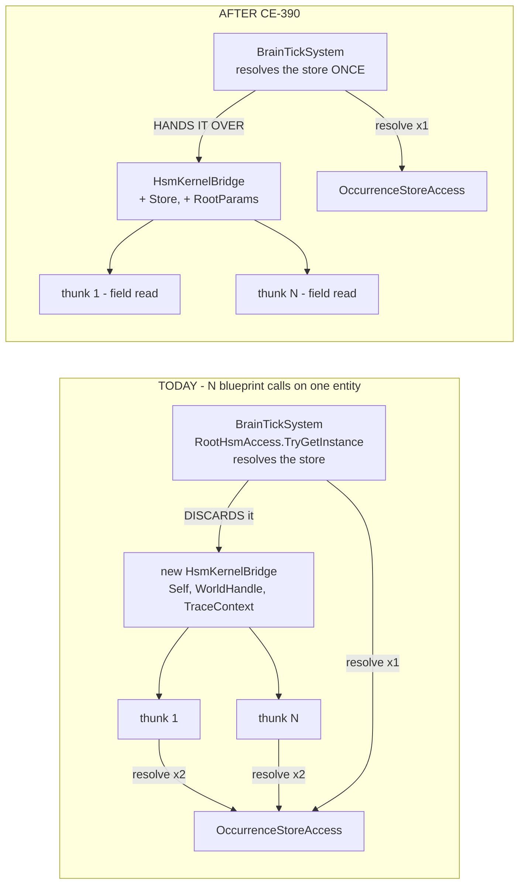

<!--STATUS
state: LIVE
build-state: READY-TO-BUILD
updated: 2026-09-30 (R-155 known-rot + §P link)
current-answer: ⭐⭐⭐ §3 is the decision, §4-§6 the UML, §8 the eight build items (CE-381..CE-388).
  ⭐⭐ §11 is the SEPARATE call-cost thread (CE-389..CE-392) — it is independent of §8 and can land
  before, after or alongside it; §11.4 answers "can we live without UnsafeShim", and §11.7 files the
  engine-wide version as CE-393, CROSS-LANE and deliberately NOT started by this lane.
  ⭐ Start at §2 (INVENTORY) if you are about to argue that something here already exists — most of
  it does, and §2 says which. ⚠ §2.4 carries a CORRECTION to a claim this design's own author made
  in chat on 2026-09-27; read it before quoting "the BTree side already solved this".
  ⭐⭐ §13 is the AS-BUILT: 13.1-13.3 = CE-381..CE-384 (the runtime spine), 13.4 = CE-385 + the §9 ③
  validator rule + CE-396, 13.5 = CE-386, 13.6 = CE-387, 13.7 = CE-397 (RAIL ④), 13.8 = CE-398/399/400
  (RAILS ⑨ and ⑥, plus a sizing defect the end-to-end run found), 13.9 = CE-401 (RAIL ⑦).
  ⭐⭐⭐ STAGE 1 AND STAGE 2 ARE COMPLETE — everything §8 lists except CE-388 (channels, separable)
  is BUILT.
  ⭐⭐⭐ ALL NINE §9 ACCEPTANCE RAILS ARE CLOSED as of 2026-09-28. §9's table carries the rail name
  per row. ⚠ An earlier version of this block said ⑥ and ⑨ were "NOT railed" and ⑦ was "covered by
  two rails either side of the DTO" — all three are now closed and that sentence is SUPERSEDED.
  ⏭ WHAT IS LEFT: CE-388; the §11 call-cost thread CE-389..CE-392; and CE-395 (priority bits).
stale-below: nothing yet.
known-rot: ⚠ 2026-09-30 (R-155) — the blueprint activity/guard thunk SEEDS its params from
  the host at activation (AiPrimitiveEmitter.EmitParamSeed) and then runs its own resolver. Target:
  it reads its host variable LIVE on every call, no seed, no resolver — like a BTree-composed
  blueprint node (DESIGN_Parameter_Model.md §P.3, CE-444 + CE-445). The per-site offset binding stays.
  earlier: ⚠ §3.3 used to claim `ActionSchemaExporter` exports the `hsmAction`/`hsmGuard` flags
  separately. MEASURED FALSE on 2026-09-27 — it collapses both into one `ActionHosting.Hsm` bit. The
  paragraph now carries the correction inline, and it makes CE-386 bigger than §8a ④ estimated.
known-conflict: ⚠ HSM_Editor_NodeEditor_Host_Design.md §10.4 says the `Lane` property on
  `[HsmAction]` "doesn't currently exist". It DOES — `HsmActionGenerator.cs:598` emits it. That line
  is rotted; this design does not depend on it either way.
related-designs:
  - DESIGN_Parameter_Model.md — ⭐⭐ §P is the CANONICAL parameter contract by kind (R-155): an HSM
    activity/guard is an ACTION: live host read, no resolver (§P.3).
  - Architect_Question_75_One_Params_Pipeline_And_One_Action_Binding.md — owns the UNIFICATION of the params pipeline (one
    ParseParams factory, G1's deserialize/resolve split, the HSM blackboard struct) and of the
    action-binding carrier. It is DESIGN, not built; it depends on this document's model and
    does not change it.
  - RESUME_Hsm_Blueprint_Behaviour.md — ⭐ THE LANE'S STATE DOC for this programme: what is built,
    what is next, the measurements already made and the fixture traps. ⛔ It is a SNAPSHOT; this
    design wins on any disagreement.
  - HSM_Editor_NodeEditor_Host_Design.md — ⭐⭐ owns the HSM EDITOR surface: §7 transitions, §8 final
    states, §10.1/§10.2 the action/guard pickers this design finally wires to a catalog. ⛔ It does
    NOT own the kernel phase machine or the blueprint bridge.
  - DESIGN_Occurrence_Scoped_Storage.md — ⭐⭐ owns the RUNTIME storage every hosted occurrence uses:
    §28/§29 the params seed and `HsmHostVariableAccess`, §32 an HSM state hosting a BTree. ⛔ It does
    NOT own action/guard IDENTITY, which is what §3.2 here settles.
  - AI_Editor_Shared_Infrastructure.md — ⭐ owns `ActionSchemaExporter` and the shared catalog that
    §3.3 reuses; §4.7 is the entry shape.
  - Architect_Question_74_Blueprint_Channel_Lifecycle.md — ⭐⭐ OWNS the resolution of §8's LAST
    unbuilt item, CE-388 (`WritesChannel` for blueprint-hosted activities). ⚠ It found that the item
    as filed was HALF the problem: a blueprint channel command is also never CLAIMED
    (`BehaviorInstanceId` unstamped), so arbitration wipes it next tick — filed separately as CE-402,
    which must land FIRST. ⛔ Do not build CE-388 from §8's one-line description; §8 does not say what
    the cleanup IS for a blueprint activity, and Q74 §4 is where that is decided.
  - Architect_Question_36_Subtree_Hosting_Runtime.md — APPROVED; `Q36-B = A`, "a name BESIDE a Guid".
    §7 here follows that ruling for the blueprint reference rather than inventing a second spelling.
  - Behavior_Parameter_Resolver_Detailed_Design.md — owns how a hosted occurrence's params are
    RESOLVED once seeded; this design only decides which variable seeds them.
-->

# DESIGN — An editor-authored HSM as an entity behaviour, with blueprint actions and guards

> 🔒 **The user's ask, verbatim (`2026-09-27`):** *"To use the editor defined HSM as entity behavior,
> To be able to define few states and transitions between them, thw transition controlled by a
> condition programned using a function in blueprint (taking params from hsm's blackboars variables),
> when in the state i would like to tick an action defined in blueprint taking params from hsm
> blackoard variables (or multiple actions in parallel, one per channel like one action for movement,
> one for weapon control), with possibility to transition to exit state to finish the behavior."*

---

## 1. ⭐ WHAT ALREADY WORKS — **measured `2026-09-27`, so the build does not rebuild it**

| the ask | state | the mechanism that already carries it |
|---|---|---|
| ① states + transitions authored in the editor, run as an entity behaviour | ✅ | editor → `.hsm.json` → generated bridge → `BehaviorIngressSystem` sizes the root HSM slot → `BrainTickSystem` ticks it |
| ④ parallel actions, one per channel | ✅ *(runtime)* | `ProcessActivityPhase` walks EVERY region each tick; `ChannelKind` is `Locomotion, Weapon, Interaction`; `[WritesChannel]` drives generated HSM exit-cleanup thunks |
| ⑤ an exit state finishes the behaviour | ✅ | `IsFinal` → `InstanceFlags.Terminated` (`HsmKernelCore.cs:342`, `:823`) → `BrainTickSystem` publishes `BehaviorFinishedEvent` once, then clears the latch |
| ③ params from the HSM's blackboard variables | ✅ *(runtime)* | `HsmOccurrence.SeedParamsOffset` → `HsmParamBindings` → `HsmHostVariableAccess` reads host variables BY NAME |

⇒ ⭐⭐ **This design adds no runtime storage and no new tick path.** It closes the four places where the
AUTHORING surface cannot reach a runtime that is already built, plus the one genuinely missing kernel
capability (§3.1).

---

## 2. ⛔⛔ INVENTORY — **run `2026-09-27`; every box in §4 is drawn against it**

```
search_graph(project=HROT, name_pattern=".*Polled.*")                    -> 2    (both prose, no code)
search_graph(project=HROT, name_pattern=".*HsmGuard.*")                  -> 24
search_graph(project=HROT, name_pattern=".*BehaviorActionCatalog.*", label=Class) -> 4
search_graph(project=HROT, name_pattern=".*Hsm.*", label=Class)          -> 93
find.sh AiPrimitiveHosting --glob '*.cs'                                 -> 68 files / 201 lines
```

⚠ **`check_index_coverage` is NOT reachable through the codebase-memory CLI**, so no coverage proof
backs the negative claims below; each one is graph **and** grep agreeing, which is what this session
could obtain.

### 2.1 ⭐⭐ EXISTS — **reuse, do not rebuild**

| # | what exists | where | verdict |
|---|---|---|---|
| ① | `AiPrimitiveHosting.HsmAction` / `.HsmGuard` — first-class hosting modes | `BlueprintAsset.cs:158-159` | ⭐⭐ **REUSE unchanged** |
| ② | `EmitHsmActivityThunk` / `EmitHsmGuardThunk` — the real thunks, occurrence-keyed | `AiPrimitiveEmitter.cs:573,583` | ⭐⭐ **REUSE unchanged** |
| ③ | `HsmActionDispatcher.RegisterAction/RegisterGuard` emitted for both | `CSharpEmitter.cs:473-476` | ⭐ **REUSE**; §3.2 changes only the KEY |
| ④ | `[GeneratedAiPrimitiveAction(hsmAction:, hsmGuard:)]` on the generated `TickCore` | `AiPrimitiveEmitter.cs:276` | ⭐⭐⭐ **THE DISCOVERY CHANNEL, ALREADY BUILT** |
| ⑤ | `ActionSchemaExporter` reads ④ and sets `IsAiPrimitive` + hosting flags + `DtoType` | `ActionSchemaExporter.cs:106` | ⭐⭐⭐ **REUSE — this is §3.3's whole answer** |
| ⑥ | `BTreeCommandSink` composes a catalog entry into an asset binding | `BTreeCommandSink.cs:170` | ⭐⭐ **THE PATTERN TO MIRROR** |
| ⑦ | `GeneratedBlueprintSchemaCatalog` — a blueprint's `BlueprintId` + `Params` from the `.bp.json`, at generation time | `GeneratedBlueprintSchemaCatalog.cs` | ⭐⭐⭐ **REUSE — it is why §3.2 is cheap** |
| ⑧ | explicit action-id override, already honoured for entry/exit | `HsmFlattener.cs:172-173` | ⭐⭐ **EXTEND to activity + guard** |
| ⑨ | `HsmParamBindings.Register` emitted from `StateNodeDto.ExpressionTargetField` | `HsmBridgeEmitCore.cs:316` | ⭐⭐ **REUSE — §3.4 only has to FEED it** |
| ⑩ | 6 spare bits in `TransitionFlags` (6-11), 7 in `StateFlags` (9-15), `StateDef.Reserved29` | `Fhsm.Kernel/Data/Enums.cs` | ⭐⭐ **no struct grows; `StateDef` stays 32 B, `TransitionDef` 16 B** |

### 2.2 ⛔ DOES NOT EXIST — **the five gaps this design closes**

| id | gap | measured |
|---|---|---|
| **G1** | an HSM asset cannot ADDRESS a blueprint-hosted thunk | the asset stores a string; `HsmFlattener.ComputeHash` = `FNV1a16(FQN)`. The thunk registers under `(ushort)BlueprintId` = FNV-1a32 of the asset GUID. **Two id spaces; no authorable string bridges them** |
| **G2** | the action/guard pickers list only names ALREADY in the asset | `HsmActionPickerDrawer.GetItems()` / `HsmGuardPickerDrawer.GetItems()` — self-referential, so the FIRST binding can never be made |
| **G3** | the per-state param binding cannot be authored | `StateNodeDto.ExpressionTargetField` exists and the emitter consumes it; **`StateNode` (editor model) has no such field** and `HsmAssetMapper` maps it for transitions only ⇒ always null ⇒ every state seeds from offset 0 |
| **G4** | a transition cannot be driven by a CONDITION | guards are evaluated only inside the event phase (`HsmKernelCore.cs:629`). In production exactly ONE event is ever posted (`BrainTickSystem.cs:360`, MobilityLost) |
| **G5** | a blueprint-hosted action cannot declare a channel | `[WritesChannel]` is an attribute on hand-written methods; nothing carries it from a `.bp.json` |

### 2.3 🔴 COMPLETION TRANSITIONS ARE **LIVE** — *(CORRECTED `2026-09-27`, pre-build measurement)*

⛔⛔ **THIS SECTION PREVIOUSLY READ *"nothing ever dispatches event 0, so the concept is half-present
and inert."* THE SECOND HALF IS FALSE.** 📐 Measured in the pre-build pass:
`ProcessRTCPhase` sets **`currentEventId = 0` after every executed transition** and loops
(`HsmKernelCore.cs:502-556`), and `SelectTransition` matches `trans.EventId == eventId` for both
global and state transitions (`:588`, `:629`). ⇒ **the RTC loop runs a COMPLETION PASS on every
iteration after the first**, and an eventless transition — which `HsmEmitCore.cs:491` compiles to
`.On(0)` — **is selected there today.**

⭐ **What IS true:** an eventless transition can only fire **as a follow-on to another transition**.
It is unreachable from `Idle`, which is the gap `G4` names. ⛔ *Unreachable from Idle* ≠ *inert*.

⭐⭐⭐ **AND THIS STRENGTHENS THE USER'S CHOICE OF (b), EXPLICIT** *(§3.1, §10 ③)*: reusing `EventId 0`
for polling would have **conflated COMPLETION with POLLED**, which are genuinely different — one
fires once, as a consequence of a transition; the other is evaluated every quiescent tick. ⛔ A single
encoding cannot express both. 🔒 That is a better argument than the one §10 ③ originally gave, and it
was only available after measuring.

⚠ **No collision risk with named events:** `HsmEmitCore.cs:216` treats `EventId == 0` as *unset* and
assigns a fallback ⇒ authored events start at 1 *(verified against `HsmShowcase`: 1, 2, 3)*.

### 2.4 🔴 CORRECTION — **"the BTree side already solved this" was WRONG**

📌 In chat on `2026-09-27` this design's author wrote that the BTree side had already solved G1
because its node stores a `MethodFqn`. **Half true, and the false half is the load-bearing one.**
📐 Measured: `T31_ComposedAiPrimitive.btree.json` binds `Hrot.AI.Behaviors.Brains.DemoAiPrimitiveNodes
.TickCore`, and that class's own header says it is a *"compile-time stand-in for a blueprint-authored
AiPrimitive's generated output … without the (not-yet-built) editor cross-compile path."*

⇒ ⭐⭐ **BTree established the CONVENTION** (`MethodFqn` + `DelegateShape` + `ExpressionTargetField`)
**against a hand-written twin, not against a real generated blueprint.** ⛔ So G1 is not "port BTree's
fix"; it is the first real crossing, and the reason it is still tractable is ②⑦ above, not precedent.

---

## 3. ⭐⭐⭐ THE DECISION — **four rulings, one per gap**

### 3.1 `G4` — a POLLED transition is an EXPLICIT flag 🔒 *(user, `2026-09-27`: "b, explicit")*

⛔⛔ **The rejected alternative — post a tick event every tick — is MEASURABLY HARMFUL, not merely
inelegant.** 📐 The phase machine advances **one phase per tick** (`UpdateBatchCore` is a flat `for`
with no inner loop), so an event round is `Idle → Entry → RTC → Activity → Idle` = **4 ticks**; and
`CE-334`'s per-tick activity runs **only in the `Idle` arm with an EMPTY queue**. ⇒ a permanent tick
event would cut state activities from every tick to ~1 in 4 and give every transition ~3 ticks of
latency — **it would break ③ and ④, which work today.**

⭐⭐ **So: `TransitionFlags.IsPolled = 1 << 6`, authored as a checkbox, evaluated in the `Idle` arm.**
⭐ Three layers of selectivity, and only the third is new:

| layer | gate | new? |
|---|---|---|
| by active configuration | only the leaf→root chain, per region | ⛔ already — the walk `ProcessActivityPhase` does |
| by state | `StateFlags.HasPolledTransition` (bit 9), set by the flattener ⇒ **one bit test** for a state with none | ⭐ new, and it is what makes this free |
| by transition | only transitions carrying `IsPolled` get a guard call | ⭐ new — the user's "explicit" |

⭐⭐ **Evaluated INLINE from `Idle`, not by parking in `RTC`** — the same shape `CE-334` chose for
activities, and for the same reason: parking costs a tick per phase. ⇒ a polled transition fires in
the tick its guard first passes, and **the newly-entered state's activity runs in that same tick**,
because the polled check runs BEFORE `ProcessActivityPhase` in the `Idle` arm.

### 3.2 `G1` — the asset carries an EXPLICIT ACTION ID, baked from the `.bp.json`

⛔ **Not a naming convention.** 📐 A blueprint's generated class is
`{SanitizedName}_{BlueprintId:X8}_Bp`, and **sibling Roslyn generators cannot see each other's
output** — `GeneratedBlueprintSchemaCatalog`'s own header states this is true *"not even in a fully
successful real build"*. ⇒ any scheme that asks the HSM generator to resolve that symbol is dead on
arrival, and any scheme that asks a human to type a hash into an asset is brittle.

⭐⭐⭐ **Instead: the HSM asset stores a NAME BESIDE A GUID** *(`Q36-B` = A, already approved)*, and the
bridge generator resolves the Guid to `(ushort)BlueprintId` through the catalog and emits it as an
**explicit id** — the override `HsmFlattener` already honours for entry/exit actions (`:172-173`),
extended to activity and guard. ⛔ The FQN hash path is untouched for hand-written actions.

### 3.3 `G2` — the pickers read the EXISTING catalog

⭐ `ActionSchemaExporter` already discovers blueprint-hosted actions and guards from
`[GeneratedAiPrimitiveAction]`. ⇒ the HSM pickers filter that catalog by the flag they need, exactly
as `BTreeCommandSink` does. ⛔ No new catalog, no new discovery mechanism. ⚠ The self-referential list
stays as a FALLBACK when no catalog is injected (the headless/test host) — **but a production caller
that HAS the catalog must pass it**, which is the forwarding rail in §9.

> 🔴 **CORRECTION, measured `2026-09-27` during `CE-385` — this paragraph used to claim the
> `hsmAction`/`hsmGuard` flags are *"already populated"* in the exported schema. HALF TRUE, and the
> false half is the one `CE-386` needs.** 📐 `ActionSchemaExporter.ProcessMethod:112-113` READS both
> attribute flags and then **collapses both into the single `ActionHosting.Hsm` bit**; `IsCondition`
> is set only by `BTreeCondition`. ⇒ **an `ActionSchemaEntry` cannot today tell an HSM ACTIVITY from
> an HSM GUARD**, so `CE-386` cannot filter the two pickers apart without first making the
> distinction representable. ⭐ The attribute itself does carry them separately
> (`GeneratedAiPrimitiveActionAttribute.HsmAction` / `.HsmGuard`), so nothing has to be re-discovered
> — only carried through. ⚠ `CE-386` is therefore **bigger than §8a ④ estimated**, in the exporter
> rather than in the drawers.

### 3.4 `G3` — the state inspector gains the binding the emitter already consumes

⭐ One field on `StateNode`, mapped both ways, drawn with the existing
`HsmBlackboardFieldPickerDrawer` (which already filters by the selected action's `DtoType`). ⛔ No
format invention: `StateNodeDto.ExpressionTargetField` is already in the file format and already read
by `HsmBridgeEmitCore.EmitStateParamBindings`.

### 3.5 ✅ `CE-414` — **THE PICK COMPOSES THE VARIABLE; THE AUTHOR NEVER TYPES ONE** *(`2026-09-28`)*

> ⚠⚠ **§3.4 IS NECESSARY AND WAS NOT SUFFICIENT, and this says why.** It gave the author a *picker* for
> the seed binding. ⛔ It did not say **what they should pick**, and the honest answer — *one variable
> whose TYPE is the hosted blueprint's generated `Params` struct* — is something the editor can produce
> itself. ⭐ **Leaving it to the author is what produced a spacer parameter in a shipped asset.**

🔒 **User, `2026-09-28`:** *"Actions and conditions have their param DTO. Blackboard variables are those
dtos basically … those dto define the offsets."* ⭐ **Correct, and the BTree host has done exactly that
since `E2`** — `BTreeCommandSink.ComposeAiPrimitiveAction` auto-creates one `IsAutoManaged` variable
typed from the blueprint's `Params` and points `ExpressionTargetField` at it.
📌 The shipped proof is `T33_ComposedParamBlueprint.btree.json`: **one** variable, `bpParams`, typed
`Hrot.AI.Behaviors.Generated.ParamDemo_CEFE162F_Bp+Params`.

| ⭐ the ruling | |
|---|---|
| ⭐⭐⭐ **picking a blueprint on a state (activity) or a transition (guard) COMPOSES its params variable** | `HsmFacetDispatcher.ComposeBlueprintParams`, gated on the pick actually CHANGING — ⛔ a facet apply round-trips every field on every edit, so an ungated compose would add a variable per keystroke |
| ⭐⭐ **the variable's TYPE is the DTO** | ⇒ the seed offset is that one variable's offset and the field offsets come from the struct. **Nothing to check, because there is no byte window** |
| ⭐ **unpick removes it; deleting the state or transition removes it** | only when `IsAutoManaged` — ⛔ a variable the author declared is never deleted by a node operation |
| ⛔ **no exporter ⇒ no compose** | a headless fixture legitimately has none, and the pick then behaves exactly as it did before. 🔒 But a production host **has** one and must pass it — `AiFacetPickerBinder` now hands the dispatcher the same `IActionSchemaExporter` it already gave the drawers two lines above |

📄 **The runtime half, the `CE-413` guard case and the two stated limits are
[`DESIGN_Occurrence_Scoped_Storage.md`](DESIGN_Occurrence_Scoped_Storage.md) §28.6c.**

---

## 4. ⭐⭐ THE CLASSES — `classDiagram`

> **What this picture shows that the prose hid:** the only NEW types are two flags and one editor
> service; everything else is an existing box gaining one member. The dashed boxes are the two id
> spaces that G1 joins — and they meet in exactly one place, `HsmBridgeEmitCore`.



---

## 5. ⭐⭐ ONE TICK, WITH A POLLED BLUEPRINT GUARD — `sequenceDiagram`

> **What this picture shows that the prose hid:** the polled check and the activity run in the SAME
> `Idle` arm, in that order — so a transition taken this tick is followed by the NEW state's activity
> this tick. Nothing parks in `RTC`, which is the whole reason the latency is 0 and not 3.



---

## 6. ⭐⭐ WHO PRODUCES WHAT, AND WHO CALLS IT EACH FRAME — the MODULE diagram

> **What this picture shows that the prose hid:** two generators run from the SAME pre-generation
> compilation and **cannot see each other's output** — the red edge. That is why the id is baked from
> the `.bp.json` and not resolved from a symbol. The dotted edge is the one that does not exist today
> and is what G1 builds.



⚠ **The dead edge, named:** `BPGEN -.-> HSMGEN` **can never carry anything** — it is drawn to record
why, not as a route to build. 📐 `GeneratedBlueprintSchemaCatalog`'s header states the generated class
is unresolvable from a sibling generator *"not even in a fully successful real build."*

---

## 7. ⭐ THE FILE-FORMAT DELTA — **five optional fields, all additive**

| where | field | why |
|---|---|---|
| `StateNodeDto` | `ActivityBlueprintName` + `ActivityBlueprintAssetId` | `Q36-B`: a name BESIDE a Guid, so a renamed blueprint HEALS instead of dangling |
| `StateNodeDto` | *(none — `ExpressionTargetField` already exists)* | G3 is an EDITOR-side gap only |
| `TransitionDto` | `GuardBlueprintName` + `GuardBlueprintAssetId` | same ruling, guard side |
| `TransitionDto` | `IsPolled` | the user's explicit flag |

⛔⛔ **A slot may name a METHOD or a BLUEPRINT, never both** — validator rule, §9 ③. ⭐ Every field is
optional and absent from all four shipped assets, so **their generated source stays byte-identical**
— the same gating rule `EmitStateParamBindings` already follows.

⚠ **Scope, stated so it is not mistaken for an omission:** only the state **Activity** slot and the
transition **Guard** slot learn the blueprint form. Entry/exit/timer actions and transition EFFECT
actions keep the method-only form. ⭐ Those are the two slots the user's ask needs; the remaining four
are the same mechanism again and can follow on demand rather than on speculation.

---

## 8. ⭐⭐ THE BUILD — **eight items**

| id | item | lane |
|---|---|---|
| **CE-381** | `TransitionFlags.IsPolled` + `StateFlags.HasPolledTransition`; flattener sets both | kernel + compiler |
| **CE-382** | `HsmKernelCore.TryTakePolledTransition`, called from the `Idle` arm BEFORE `ProcessActivityPhase`, RTC inline | kernel |
| **CE-383** | extend the explicit-id override to `ActivityActionId` and to transition `GuardId` (it already exists for entry/exit) | compiler |
| **CE-384** | `GeneratedBlueprintSchemaCatalog` reachable from the HSM generator; `HsmBridgeEmitCore.EmitBlueprintActionIds` bakes `(ushort)BlueprintId` | generators |
| **CE-385** | asset + model + mapper: the five §7 fields, both directions, round-tripped | persistence + editor |
| **CE-386** | pickers read `ActionSchemaExporter`, filtered by `HsmAction` / `HsmGuard`; self-referential list stays as the no-catalog fallback | editor |
| **CE-387** | `StateNode.ExpressionTargetField` + the state inspector's blackboard-field picker (G3) | editor |
| **CE-388** | ⛔⛔ **THIS ONE-LINE DESCRIPTION IS SUPERSEDED — DO NOT BUILD FROM IT.** 📄 `Architect_Question_74_Blueprint_Channel_Lifecycle.md` owns it; its §9 is the as-built. ⚠ Two things here are WRONG: ① *"the `.bp.json` declares channels"* — **nothing is declared**, the compiler DERIVES them *(`BuiltInChannelCommandCatalog` already names each command's channel; `Q74 D-A2`)*; ② *"the bridge emits the exit-cleanup registration"* presumes a cleanup THUNK on this route — ⭐ the cleanup body is generated, but **binding it is the flattener's job** *(`Q74 D-B1`)*, and there is no validator to fall back on because the chain had **three breaks** *(`CE-403`)*. ⚠ **And it was HALF the problem:** the CLAIM side was broken too — a blueprint channel command was wiped by arbitration on the next tick *(`CE-402`, filed separately, NOT HSM-specific)*. ✅ **BUILT so far:** `CE-402` (claim) · `CE-403` (declaration) · `CE-388` slice 1 (derivation). ⏭ **LEFT:** `D-B1`, gated on `D-F` (the shared id formula) | compiler + generators |

⭐ **CE-381…CE-384 are the spine** — with those four an HSM asset can address a blueprint guard and a
blueprint activity, and a polled transition fires. CE-385…CE-387 make it authorable rather than
hand-editable. **CE-388 is separable** and only matters once ④ is driven by blueprints.

> ⚠⚠ **`2026-09-28` — that last sentence is TRUE OF THE HSM HALF AND MISLEADING ABOUT THE REST.**
> 📐 Measured while resolving `CE-388`: the same investigation found that a blueprint channel command
> **never worked at all** — `ChannelCommandLowering` never stamped `BehaviorInstanceId`, so
> `ChannelArbitrationSystem` zeroed it on the next tick. ⛔ That is **not** separable and **not**
> HSM-specific: it broke a BTree-hosted blueprint identically. ⭐ Filed and fixed as `CE-402`.
> ⇒ 🔒 *"separable"* described the EXIT half; the ENTRY half was a live defect nobody had a rail for.
> 📄 `Architect_Question_74_Blueprint_Channel_Lifecycle.md` §0 ③.

⭐⭐ **§11 carries a SECOND, INDEPENDENT thread — `CE-389`..`CE-392`, the per-call cost.** ⛔ It shares
no file with the eight above except the emitter, and it gates on its own counter rail (§11.6). ⚠ Its
ORDER is load-bearing even though its scope is not: `CE-389` before `CE-390` before any decision on
`CE-392` — §11.4 says why.

---

## 8a. 📐 PRE-BUILD MEASUREMENT PASS — **`2026-09-27`, and it RESIZED three items**

> 🔒 **User:** *"rather do more measurements than taking wrong decisions."* ⭐ This section records what
> the pass found, so the next reader does not re-derive it — and so the two CORRECTIONS are visible.

| # | measured | effect on the plan |
|---|---|---|
| ① | **`SelectTransition` (`:566`) and `ExecuteTransition` (`:699`) are ALREADY separate**; `ProcessRTCPhase` is a loop over them | ⭐⭐ **`CE-382` shrinks**: the polled arm needs a SELECTION variant only and calls `ExecuteTransition` **unchanged**. ⛔ The feared "selection is fused into RTC" does not hold |
| ② | 🔴 **completion transitions are LIVE** — §2.3, corrected | ⭐ no code change, but the VALIDATOR must keep `IsPolled` and "no event" as DIFFERENT things, and §10 ③ gains its real argument |
| ③ | **`StructureHash` hashes `state.Flags` (`HsmEmitter.cs:185`) but NOT `trans.Flags`** | ⭐⭐ an asset with no polled transition keeps its hash ⇒ **no golden churn from `CE-381`**. ⭐ The DERIVED `StateFlags.HasPolledTransition` is what gives hash coverage. 🔒 **EDGE CASE — DECIDED `2026-09-27`, user: "accept and document"** — see §8b |
| ④ | **`AiFacetPickerBinder.Rebuild:95` — the ONE production site — already passes `services.ActionSchema`**, and `BuildDrawers` already takes an `IActionSchemaExporter?` | ⭐⭐⭐ **`CE-386` shrinks a lot**: no plumbing, no new service. Pass it into two existing drawers and filter by hosting flag. ⭐ Rail ⑧ re-aimed (§9). ⭐ Pattern to mirror: `BehaviorHashPickerDrawer.GetItems()` is already catalog-backed on the BTree side |
| ⑤ | **`CE-387` has a COMPLETE worked precedent** — `E7b` did exactly this for the TRANSITION `ExpressionTargetField`: model, mapper, command sink, validator rule, emitter and a golden (`HsmExpressionTargetTests`) | ⭐⭐ `CE-387` is *"do for states what `E7b` did for transitions"*, same field name, same file set. ⚠ Note the two consumers are DIFFERENT mechanisms: transitions feed a compound `{Fqn}@{offset}` key, states feed `HsmParamBindings` seed offsets |
| ⑥ | **`HsmAssetDto` uses `JsonIgnore(WhenWritingNull / WhenWritingDefault)` throughout**, and `HsmGoldenCorpusTests.TheCanonicalJsonOfEveryCorpusAssetIsUnchanged` compares canonical JSON | ⛔⛔ **A BUILD CONSTRAINT, not a hope:** `CE-385`'s five fields MUST carry those attributes or **all four shipped assets churn their golden.** ⭐ Now stated so it is checked, not discovered |

⚠ **Still unmeasured, and small:** `HsmBuilder` has `StateBuilder.Activity(string)` and
`TransitionBuilder.Guard(string)` but no id-taking form, so `CE-383` also adds those. ⭐ `FastHSM` is
vendored source co-evolved with this repo (`R-48`), so that is in-lane, not a cross-lane edit.

---

## 8b. 🔒 ACCEPTED LIMIT — **toggling `IsPolled` between two polled transitions in one state does not move `StructureHash`** *(user, `2026-09-27`: "accept and document")*

📐 **The mechanism.** `ComputeStructureHash` appends `state.Flags` and **not** `trans.Flags`
*(`HsmEmitter.cs:185`)*. `CE-381`'s `StateFlags.HasPolledTransition` is DERIVED — set when the state
owns **at least one** polled transition. ⇒ flipping `IsPolled` on **one of two** polled transitions in
the same state changes neither hashed value, so `StructureHash` is unchanged.

| ⭐ what follows, stated precisely | |
|---|---|
| ⭐⭐ **A LIVE instance does not observe the edit until it re-attaches** | `ValidateInstance` gates on `header->MachineId == definition.Header.StructureHash`; an unchanged hash means the running instance keeps its current behaviour |
| ⭐⭐⭐ **THE REASON THIS IS SAFE, AND IT IS THE DECIDING ONE:** `IsPolled` changes **no layout** | the hash's job is **instance-layout compatibility** — that a live instance's bytes still mean what the blob says. ⛔ A polling change moves no field, resizes nothing, and renumbers nothing ⇒ the stale instance is running *correct old behaviour*, not corrupt state |
| ⭐ **it is the SAME contract every other non-layout edit already has** | 📌 changing a guard's implementation, or an action's body, is likewise invisible to a running instance until reload |
| ⚠ **the observable symptom, so nobody debugs it twice** | edit polling in the editor while a cluster is live ⇒ **the change appears to do nothing** until the entity's behaviour is re-assigned or the machine hot-reloads |

⛔ **REJECTED: add `trans.Flags` to `ComputeStructureHash`.** ⭐ Correct, and it would re-bake **every**
asset that has any transition flag set — `IsExternal` is on essentially every transition — for a
property the hash does not exist to protect. 🔒 **What would reverse this decision:** wanting a polling
toggle to take effect on a LIVE cluster without a reload. ⚠ If that is ever wanted, the right fix is
probably a targeted reload trigger, **not** widening a layout hash to cover behaviour.

---

## 9. ⭐⭐⭐ ACCEPTANCE — **and every one is RED-PROVED**

> ### ✅✅ ALL NINE CLOSED — `2026-09-28`
>
> | # | closed by | where |
> |---|---|---|
> | ① | `CE382_R1_APolledTransitionFires_WithNoEventPosted` | `Fhsm.Tests` · `PolledTransitionKernelTests` |
> | ② | `CE382_R2_AnUnmarkedTransitionsGuardIsNeverCalledOnAQuiescentTick` | same |
> | ③ | `AStateBindingBothAnActionAndABlueprint_IsAnError` + `ATransitionBindingBothAGuardFunctionAndABlueprint_IsAnError` | `Hrot.Hsm.Editor.Tests` · `HsmBlueprintBehaviourAuthoringTests` |
> | ④ | `HsmBlueprintGuardIdAgreementTests` *(5 rails, `CE-397`)* | `Hrot.AiEditor.Generators.Tests` |
> | ⑤ | `CE382_R5_TheNewStatesActivityRunsInTheSameTick` | `Fhsm.Tests` · `PolledTransitionKernelTests` |
> | ⑥ | `CE400_R1` *(`CE-400`)* | `Fdp.Toolkits.Tests` · `BrainTickSystemHsmArmTests` |
> | ⑦ | `CE401_R1` *(`CE-401`)* | `Hrot.AiEditor.Generators.Tests` · `HsmStateParamBindingEmissionTests` |
> | ⑧ | `ActionPicker_…` + `GuardPicker_OffersRegisteredHsmGuards_…` + `TheFactoryWiresTheExporterIntoBothPickers` | `Hrot.Hsm.Editor.Tests` · `HsmPickerDrawerTests` |
> | ⑨ | `CE398_R1` + `R2` *(non-vacuity)* + `R3` *(`CE-398`)* | `Fdp.Toolkits.Tests` · `BrainTickSystemHsmArmTests` |
>
> ⚠ **① and ⑨ overlap deliberately and are NOT redundant.** ⭐ `CE382_R1` proves the **kernel phase
> machine** fires a polled transition on a hand-built machine with hand-registered ids; `CE398_R1`
> proves the **whole product** does it — real asset, real blueprint guard, real registrar scan, real
> ingress, real `BrainTickSystem`. ⛔ A kernel rail cannot catch a broken registrar scan, and an
> end-to-end rail cannot say *which* of ten components broke.

| # | rail | the red-proof that makes it load-bearing |
|---|---|---|
| ① | a polled transition whose guard returns true FIRES with **no event posted** | revert `IsPolled` on the transition ⇒ it must never fire |
| ② | an **un**marked transition's guard is **never called** on a quiescent tick | instrument the dispatcher; a call is a failure |
| ③ | a state naming BOTH a method and a blueprint is a **validator error** | remove the rule ⇒ the asset compiles and one binding silently wins |
| ④ | the id the blob addresses for a blueprint activity **equals** the id the blueprint registrar registers | bake the FQN hash instead ⇒ must go red. ⛔ Read the id from the **artefact** (the compiled blob + the emitted registration), never recompute it — `HsmActionIdAgreementTests` is the precedent and says why |
| ⑤ | the new state's activity runs in the **same tick** the polled transition fired | park in `RTC` instead ⇒ must go red |
| ⑥ | two parallel regions, each an activity on a different `ChannelKind`, both tick each frame | `HsmOrthogonalRegions` extended; drop one region ⇒ red |
| ⑦ | a state's `ExpressionTargetField` set in the editor survives save→load→generate and reaches `HsmParamBindings` | unmap it in `HsmAssetMapper` ⇒ red |
| ⑧ | 🔴 **RE-AIMED `2026-09-27`** — the two pickers **USE** the exporter they are already given. 📐 Measured: the ONE production site, `AiFacetPickerBinder.Rebuild:95`, **already passes `services.ActionSchema`** into `BuildDrawers`, which already takes it — it simply never reaches `HsmActionPickerDrawer`/`HsmGuardPickerDrawer`. ⇒ the forwarding is NOT the defect; the CONSUMPTION is | assert on the CONSTRUCTED drawer's `GetItems()`, with a catalog holding an `hsmGuard` entry the asset does not mention |
| ⑨ | a final state still publishes `BehaviorFinishedEvent` exactly once **after** a polled transition reaches it | — |

⚠ **Rail ⑧ exists because of a named repeat offender** — `HsmValidator._isStatefulSubtree` and
`BlackboardAuthoringWindow._actionSchemaExporter` were both defaulted to nothing by a caller that held
the value. ⭐ The catalog is optional here for the headless host; that is exactly the shape that has
gone silently inert twice.

---

## 10. ⛔ REJECTED

| # | alternative | the one fact that killed it |
|---|---|---|
| ① | **post a tick event every tick** so guards are evaluated | one phase per tick ⇒ activities drop to ~1 in 4 and transitions gain ~3 ticks of latency (§3.1) |
| ② | **name the generated blueprint class by FQN** in the asset | sibling generators cannot resolve each other's symbols, and the FQN embeds the `BlueprintId` hash |
| ③ | **revive `EventId 0` as "completion"** so an eventless transition is implicitly polled | it makes a blank event field a silent per-tick blueprint evaluation — the silent-non-execution shape this programme keeps filing. 🔒 The user chose explicit |
| ④ | **register the blueprint thunk a second time under `FNV1a16(FQN)`** | two ids for one thunk, and `RegisterAction` is last-writer-wins — a collision would be silent |
| ⑤ | **make guards cheap by caching the last result** | a guard over live blackboard state is not cacheable without an invalidation source, and there is none |
| ⑥ | **a new picker/catalog for the HSM editor** | `ActionSchemaExporter` already carries the `hsmAction`/`hsmGuard` flags — building a second one is the duplicate-implementation `R-137`/ruling 9 forbids |

---

## 11. ⭐⭐⭐ THE COST OF A BLUEPRINT CALL — **what is CACHEABLE, and what is simply WASTE** *(`2026-09-27`)*

> 🔒 **User:** *"now lets talk about how to make blueprint calls cheaper. Wha can be cached to mnimize
> the cpu ticks on repeated calls"* — and, on the accessor layer: *"unsafeShim does not look like it is
> something be can not live without, is it?"*

⭐⭐ **The headline: the largest item is NOT a cache candidate, it is a value computed on every call and
READ ON THE FIRST ONLY.** ⛔ Cache nothing until that is deleted — caching a redundant computation is
the second-best fix to not doing it.

### 11.1 📐 ONE CALL, STEADY STATE — **measured `2026-09-27`, HSM-hosted thunk, not the first dispatch**

| # | work | per call | cacheable? |
|---|---|---|---|
| ① | `GCHandle.FromIntPtr(WorldHandle).Target` + castclass | 1 handle deref | ⛔ no — cannot live in an unmanaged struct, and `TickCore` needs the repo |
| ② | **`RootParamsAccess.RequireRootBytes`** — `HasComponent<BehaviorState>` + `GetComponentRO` + `BlueprintTierTable.Of` *(≤4 `spec.Has`)* + `spec.Memory` + a slot scan | **≈7 indirect ECS ops** | 🔴 **NOT A CACHE PROBLEM — §11.2** |
| ③ | `HsmOccurrence.KeyFor` — an FNV fold | negligible | — |
| ④ | **`ResolveOrAttach`** → `OccurrenceStoreAccess.TryGetStore` **again** *(≤4 `spec.Has` + `spec.Memory`)* + a second slot scan | **≈5 indirect ECS ops** | ⭐⭐ **YES — §11.3** |
| ⑤ | `HsmActionDispatcher` `Dictionary<ushort, IntPtr>` lookup | 1 hash + probe | ⭐ yes — §11.5 |
| ⑥ | `TickCore` | the actual work | — |

⚠ **Each "indirect ECS op" is TWO indirect calls deep:** `BlueprintTierSpec.Has`/`.Memory` are `Func<>`
fields *(`BlueprintTierSpec.cs:45,164,167`)*, and beneath them `HasComponent<T>` routes through
`UnsafeShim.UnmanagedAccessor<T>`, whose members are delegates built by `Delegate.CreateDelegate` over
`MakeGenericMethod` *(`UnsafeShim.cs:168-198`)*. ⛔ **None of it inlines.**

### 11.2 🔴 `CE-389` — **`RequireRootBytes` IS COMPUTED EVERY CALL AND READ ONLY ON THE FIRST**

📐 `AiPrimitiveEmitter.EmitHsmOccurrenceBody` emits `byte* __hostParams = RequireRootBytes(...)`
**unconditionally**; its only consumer is `HsmHostVariableAccess.For(...)`, which `EmitParamSeed` emits
**inside `if (freshlyAttached)`**. ⇒ row ② is pure waste on every dispatch after the first.

⭐⭐⭐ **The precedent is IN THE SAME METHOD.** `EmitParamSeed` declares `__rootParams` inside that arm
with the comment *"a thunk on an entity that legitimately has none must not pay that on every dispatch
— only on the one that would actually read the seed."* ⛔ **`__hostParams` never got the same
treatment.** ⇒ the fix is to sink it, and it is one line in the emitter.

### 11.3 ⭐⭐ `CE-390` — **THE STORE IS RESOLVED `1 + 2N` TIMES PER ENTITY PER TICK; ONE WOULD DO**

> **What this picture shows that the prose hid:** `BrainTickSystem` ALREADY holds the store pointer
> when it builds the bridge — and throws it away on the next line. Every thunk then re-derives it.



⭐⭐⭐ **THE SAFETY INVARIANT, AND IT IS CHECKED NOT HOPED:** the store **BASE** is stable within a tick —
only a TIER PROMOTION moves it, and that is `BlueprintMaintenanceSystem`, a **separate global system**
which cannot run inside `BrainTickSystem.Execute`. ⛔⛔ **Slot OFFSETS are NOT stable** — `ResolveOrAttach`
may `TryAttach` mid-tick. ⇒ **cache the base, never an offset**, and never either across ticks.

### 11.4 ⛔⛔ `UnsafeShim` — **WE CANNOT DELETE IT, AND WE DO NOT NEED TO** *(the user's question, answered)*

| the question | the measurement |
|---|---|
| *is it per-call reflection?* | ⛔ **No.** `UnmanagedAccessor<T>` is a static generic class; the reflection runs **once per `T`** in its static ctor. The per-call cost is **one delegate invoke** — cheap in absolute terms, but **never inlinable** |
| *can we delete it?* | ⛔ **No.** It solves a real C# limitation: `EntityRepository.HasComponent<T>` is **unconstrained**, while the storage methods are `where T : unmanaged` / `where T : class`, and **you cannot overload on a constraint**. ⚠ And the facade has **3 099 call sites** *(`HasComponent<` 1263, `GetComponentRO<` 1100, `GetComponentRW<` 736)* |
| *so is it unavoidable?* | ⭐⭐⭐ **Only where the constraint is genuinely unknown.** 📐 **`BlueprintTierSpec.For<TTier>()` is declared `where TTier : unmanaged`** and its lambdas still call the UNCONSTRAINED `repo.HasComponent<TTier>(e)` — paying constraint-erasure it had already paid for |
| *does fixing that cross a lane?* | ⛔ **No, and this is the find.** `Fdp.Core.csproj` already grants **`InternalsVisibleTo("Fdp.Toolkits")`**, and the constrained methods are `internal`, not private ⇒ `repo.HasUnmanagedComponent<TTier>(e)` is callable **today**, from the toolkit, **with no `Fdp.Core` edit** |

⇒ ⭐ **`CE-392`**: in `Fdp.Toolkits`, where a generic parameter is ALREADY constrained `unmanaged`, call
the constrained method directly and skip the shim. ⛔ **Do NOT widen this into an engine-wide campaign**
— that is `Fdp.Core`'s API surface and the BACKEND lane's property, and it would be a `R-137`-scale
change for a delegate call.

⚠⚠ **AND IT IS THE LOWEST-VALUE OF THE FOUR, BY CONSTRUCTION:** once `CE-390` lands, the hot path stops
calling `BlueprintTierTable.Of` at all. ⇒ 🔒 **optimising an access you no longer make is the wrong
order — `CE-389`, then `CE-390`, and only then decide whether `CE-392` still pays.**

### 11.5 ⭐ WHAT ELSE, AND WHAT **NOT**

| | |
|---|---|
| ⭐ **`CE-391`** | `HsmActionDispatcher`'s two `Dictionary<ushort, IntPtr>` → flat `IntPtr[65536]` *(512 KB each, allocated once)*. Hash+probe becomes an array index. Small, zero-risk |
| ⛔ **the slot scan is NOT the problem** — 🔴 **a correction to this session's own earlier claim** | 📐 slot tables are **3 / 12 / 16 / 16 entries × 16 B** *(`BlueprintTierLadder.cs:92-125`, `SlotEntrySize = 16`)* = **48–256 bytes, 1–4 cache lines.** Real, but an order below the delegate-dispatched probes |
| ⛔ **never cache a guard's RESULT** | no invalidation source exists — §10 ⑤ |
| ⛔ **never cache a slot OFFSET across ticks** | a re-attach after a structure change moves it; that is what `ResolveOrAttach`'s `existingHash` re-check exists for |

### 11.6 ⭐⭐⭐ HOW IT IS PROVEN — **a COUNTER rail, not a stopwatch**

⛔⛔ **A wall-clock benchmark cannot gate in CI** — it is noisy, machine-dependent, and a regression hides
inside the variance. ⭐⭐ **Instrument `OccurrenceStoreAccess.TryGetStore` with a call counter** and assert
the INVARIANT:

> **one store resolution per entity per tick, however many blueprint calls that entity makes.**

⭐ Deterministic, CI-able, and **red-proves by construction**: revert `CE-390` and the count becomes
`1 + 2N`. ⚠ Wall-clock numbers may be reported as INFORMATION in the batch report; ⛔ they are not the gate.

### 11.7 ⚠⚠ `CE-393` — **THE ENGINE-WIDE CAMPAIGN, FILED AND DELIBERATELY NOT STARTED** *(cross-lane)*

⭐ §11.4 scopes `CE-392` to the one place the `behaviors` lane owns. ⛔ **The general version — "component
access in this engine is never inlinable" — is a DIFFERENT item with a different owner**, and it is filed
rather than folded in so it does not ride into a batch on the back of a blueprint measurement.

📐 **Measured `2026-09-27`:** **1 486** production facade call sites, **458** of them in `*System*.cs`
across **102** files.

🔴🔴 **AND THE PRIOR-ART PASS CAME BACK NEGATIVE, WHICH IS THE FINDING.** ⭐ This repo's rule of thumb is
that *"we need a shared X"* usually means **X exists and is under-adopted** — 📐 **not here.**
`EntityQuery` exposes `ForEach(Action<Entity>)`, an `EntityEnumerator` whose `Current` is an `Entity`,
`ForEachChunked` and `ForEachParallel` — **all of them yield an `Entity` and nothing else.** ⛔ There is
**no typed chunk/array accessor** to adopt, so every system that iterates a query then pays a per-entity,
per-component lookup through the shim. ⇒ ⭐⭐ **this is ADD-A-SEAM, not ADOPT-A-SEAM**, which is exactly
the class of change that needs an architect round rather than a batch.

| ⭐ the two halves, and they are separable | owner |
|---|---|
| **A — contained.** Make the indirection cheaper **without touching a single call site**: constrained entry points for callers that already hold the constraint, or a cached `delegate*<…>` in place of the `Delegate` in `UnmanagedAccessor<T>`. ⚠ The function-pointer form needs a SPIKE, not an assertion — generic instantiation + `GetFunctionPointer` is viable for value-type `T` and fragile in general | BACKEND *(`Fdp.Core` internals)* |
| **B — architectural.** A typed accessor / chunk seam so a system resolves a component array **once per chunk** instead of once per entity. ⛔ Large blast radius, needs an architect question | BACKEND *(+ the user)* |

⛔⛔ **AND THE HONEST PART: THIS DESIGN IS NOT ITS JUSTIFICATION.** ⭐ Once `CE-390` puts the store on the
bridge, the blueprint hot path **stops making these calls at all** ⇒ the blueprint programme measures a
cost it is about to stop paying. 🔒 **A campaign over 102 system files must be justified by ITS OWN
profile, on a real `--mode all` run, not by this section.** ⚠ Quoting §11 as the reason would be the
mirror of the mistake §2.4 records — a real measurement carried into a decision it does not support.

---

## 12. 📐 THE GATE BASELINE — **captured `2026-09-27` at `9ead2fb14`, BEFORE any code change**

> 🔒 **User:** *"shouldnt we run some system test like T3 before starting changes to know the baseline
> state and to fix the system to start with a clean table?"* ⭐⭐ **Yes — and the reason is the gate
> contract, not caution:** a red must be *confirmed pre-existing against a NAMED base sha*. ⛔ Captured
> after the change, that confirmation is archaeology done with your own diff in the tree — which is
> exactly how a real regression gets filed as *"pre-existing"*.

### 12.1 ⭐ UNIT SUITES — **the ones `CE-381`..`CE-387` touch**

| suite | result |
|---|---|
| `Fhsm.Tests` — ⭐⭐ **the kernel `CE-381`/`CE-382` edit** | ✅ **309 / 309** |
| `Fdp.Toolkits.Tests` | ✅ 2342 / 2342 ⚠ *(`DEBT-AIB-030`'s rotating flakes did not fire this run — a green here is weak evidence by construction)* |
| `Hrot.Hsm.Editor.Tests` — `CE-386`/`CE-387` | ✅ 587 / 587 |
| `Hrot.Blueprints.Tests` | ✅ 4036 passed, 18 skipped |
| `Hrot.AiEditor.Generators.Tests` — `CE-384`/`CE-385` | ⚠ **4 failed / 317** — ⭐ **exactly `CE-376`'s four, BY NAME.** 🔴 **SUPERSEDED `2026-09-27`: `CE-376` IS FIXED ⇒ this suite is now `321/321`, FULLY GREEN.** ⭐ The baseline row is kept because it is what the pre-build run measured; the CURRENT number is 321/321 |

### 12.2 ⭐⭐ `T3` — **6 failed / 111 passed / 117, and EVERY ONE IS PRE-EXISTING**

⭐⭐⭐ **Proved by NAME against the previous recorded run, not by "it looks familiar":**
`RESUME_Occurrence_Storage.md:305` lists the prior **13** as *"3 `DeterminismRails` · 3
`ClusterConformanceRails` (… entity-delete) · 2 `TheUiBaselineIsPinnedPerHostRails` · 2
`PanelGoldenRails` · `CrossHostPanelKindRails` · `VariableAddressingTests` ·
`PreviewLeavesNoTraceRails`"*.

| today's 6 | in the prior 13? |
|---|---|
| 3 × `DeterminismRails` *(`A_reload_in_one_process…`, `A_reload_rebuilds…`, `Two_fresh_processes…`)* | ✅ the 3 |
| `ClusterConformanceRails.An_agent_can_delete_an_entity_and_the_world_loses_it` | ✅ the *entity-delete* one |
| `VariableAddressingTests.A_staged_variable_write_is_pending_then_lands` | ✅ |
| `PreviewLeavesNoTraceRails.A_runtime_spawn_breaks_the_entity_listing_HN_015` | ✅ |

⭐⭐ **And the arithmetic closes:** 13 − 6 = **7 now GREEN** *(2 `TheUiBaselineIsPinnedPerHostRails` +
2 `PanelGoldenRails` + `CrossHostPanelKindRails` + 2 `ClusterConformanceRails`)* ⇒ `CE-354`/`355`/`356`/
`357` landed. 🔒 **ZERO new reds; the trend is 14 → 13 → 6.**

### 12.3 ⛔ THE THREE CAUSES BEHIND THE SIX — **not six problems**

| # | shape | evidence |
|---|---|---|
| ① | **4 × identical** `POST /sim/step failed (504): the master never entered the step barrier and the clock never advanced` | ⭐⭐ **DETERMINISTIC, not load** — 📐 re-run of `DeterminismRails` ALONE *(5 tests, 3m12s)* reproduces **3 failed / 2 passed**. ⛔ Not contention: 13 GB RAM free, 17 GB disk, 4 cores. ⚠ The master DOES step in the passing cases *(15 clean steps, `AwaitingACKs=[]`)*, and **no engine-side exception appears in the log** ⇒ it is not a throwing control plane |
| ② | `Connection refused (localhost:40579)` — the editor process was not there | plausibly a cascade of ①; not separately diagnosed |
| ③ | ⭐⭐⭐ **A TRIPWIRE FIRING AS DESIGNED — and it is GOOD NEWS** | `PreviewLeavesNoTraceRails` asserts `500` and got **`200`**. Its own header: *"⛔ When the converters are applied this reddens — then assert the listing SUCCEEDS and close `HN-015`."* ⇒ **the entity listing after a runtime spawn WORKS now; `HN-015` is fixed and nobody noticed.** ⛔ `Hrot/Runner/Hrot.SystemTests/` is the **BACKEND lane's** harness ⇒ STOP-and-report, filed as `CE-394` |

### 12.4 ⭐ WHAT THIS MEANS FOR THE BUILD

⭐⭐ **Nothing in `T3`'s reds sits in this programme's path** — they are cluster-time/step-barrier and
preview/spawn; none touches HSM authoring, the transition kernel or the blueprint bridge.
⭐⭐⭐ **The two suites `CE-381`/`CE-382` edit are 100% green.**

⇒ 🔒 **Any red in `Fhsm.Tests` during this programme is OURS**, with no ambiguity. ⛔ That property is
the whole value of this section, and it expires the moment someone else's merge lands — **re-capture
after a rule-7 re-sync.**

---

## 13. ✅ AS-BUILT

### 13.1 `CE-381` — the two flags *(`2026-09-27`)*

⭐⭐⭐ **ONE DEVIATION FROM §8's ITEM, AND IT IS A REAL ADDITION: `ReservedEventIds.Polled = 0xFFFD`,
plus a NORMALISATION in the flattener.**

🔴 **Why it was needed, found while writing the authoring surface.** A transition is created through
`StateBuilder.On(...)`, so a polled transition authored the obvious way — `.On(0).GoTo(X).Polled()` —
carries **`EventId 0`**. ⛔ And §2.3's correction says event 0 is the RTC loop's **completion pass**.
⇒ that transition would be selected by the completion pass **as well as** the polled scan: exactly the
POLLED/COMPLETION conflation §10 ③ rejected, reintroduced through the back door by the authoring API.

⭐⭐ **The fix keeps the two disjoint BY CONSTRUCTION rather than by discipline.** `HsmFlattener` sets
`def.EventId = node.IsPolled ? ReservedEventIds.Polled : node.EventId`. ⭐ It lives in the FLATTENER,
not the builder, so **every** authoring route — fluent, the compiler's JSON parser, and the DTO
emitter `CE-385` will add — lands on the same id with no per-route rule to remember.

| what shipped | where |
|---|---|
| `TransitionFlags.IsPolled = 1 << 6` · `StateFlags.HasPolledTransition = 1 << 9` · `ReservedEventIds` *(`Completion`/`Polled`/`Timer`)* | `Fhsm.Kernel/Data/Enums.cs` |
| `TransitionNode.IsPolled` | `Fhsm.Compiler/Graph/TransitionNode.cs` |
| `TransitionBuilder.Polled(bool = true)` | `Fhsm.Compiler/HsmBuilder.cs` |
| `"polled": true` — optional, absent by default | `Fhsm.Compiler/IO/JsonStateMachineParser.cs` |
| the flag, the DERIVED state bit, and the id normalisation | `Fhsm.Compiler/HsmFlattener.cs` |
| **12 rails** | `Fhsm.Tests/Compiler/PolledTransitionFlagTests.cs` |

⭐⭐ **Red-proved, one inverse edit per load-bearing claim, each reddening EXACTLY its own rail:**
removing the normalisation ⇒ only `APolledTransitionIsNormalisedOntoTheReservedId…` fails; removing
the derivation ⇒ only `Flattener_DerivesHasPolledTransition_OnTheSourceStateOnly` fails; restored ⇒
12/12.

📐 **Gates:** `Fhsm.Tests` **321/321** *(309 pre-existing + 12 new)* · `Hrot.AiEditor.Generators.Tests`
**321/321** · `Fdp.Toolkits.Tests` **2342/2342** · ⭐⭐ **working tree CLEAN — no golden regenerated**,
which is §8a ③'s no-churn prediction met rather than assumed.

⚠ **Two rails exist only because `CE-395` proved bit drift is live in this very enum:** the bit
POSITIONS are asserted *(`1 << 6`, `1 << 9`)*, and `IsPolled` is asserted clear of **both** priority
spellings — the declared `Priority_Mask = 0xF000` and the bits 8-11 the flattener actually writes. ⇒
fixing `CE-395` cannot silently land on top of polling.

⛔ **NOT done here, deliberately:** global transitions cannot be polled. `SelectTransition` scans them
before the active-state walk and they are source-agnostic, so "polled global" needs its own decision
about where it is evaluated. ⚠ Nothing rejects it yet either — a `GlobalTransitionNode` has no
`IsPolled` to set, so it is unrepresentable rather than mishandled.

### 13.2 `CE-382` — the polled arm *(`2026-09-27`)*

⭐⭐⭐ **BUILT SMALLER THAN DESIGNED, AND `CE-381` IS WHY.** §8's item said *"a selection variant"*.
⛔ **No selection code was written at all.** `CE-381` normalises every polled transition onto
`ReservedEventIds.Polled`, so `SelectTransition` **with that id already matches exactly the polled
set** — guards, priority, region handling and the region-index plumbing all come from the one
existing implementation. ⚠ A second walk would have been a duplicate of the thing it copied.

⭐⭐ **And the arm DELEGATES TO `ProcessRTCPhase` rather than executing a transition itself**, which
is what gives polling **full run-to-completion semantics**: the loop executes the winner, sets
`currentEventId = 0` and keeps going, so the newly entered state's COMPLETION transitions fire in the
same tick exactly as they do after an event-driven transition. 🔒 Hand-rolling *"execute one
transition"* would have made polled transitions second-class in a way no rail would have noticed.

| what shipped | where |
|---|---|
| `TryTakePolledTransition` + `AnyActiveStateHasAPolledTransition` | `Fhsm.Kernel/HsmKernelCore.cs` |
| the call, in the `Idle` arm **before** `ProcessActivityPhase` | same, `CE-334`'s empty-queue branch |
| **6 rails** | `Fhsm.Tests/Kernel/PolledTransitionKernelTests.cs` |

⭐ **Order is load-bearing and railed:** the polled check runs BEFORE the activities, so a transition
taken this tick is followed by the **new** state's activity in that tick (`CE382_R5`), not the
activity of the state being left.

### 13.2a ⚠ THE RED-PROOF, INCLUDING THE RAIL IT DID **NOT** PROVE

| inverse edit | what reddened |
|---|---|
| the arm is not called at all | **`R1`, `R3`, `R5`, `R6`** — the four asserting the feature DOES something |
| the cheap gate always returns true | **`R4` only** — precisely the gate's own rail |
| restored | **6/6** |

⛔⛔ **`CE382_R2` — the SELECTIVITY rail — stayed GREEN under BOTH inverse edits, and that is worth
saying rather than glossing.** It asserts an unmarked transition's guard is never called on a
quiescent tick, and it is protected by the **event-id normalisation** (`CE-381`), not by this item:
with the gate bypassed the arm still calls `SelectTransition` with the polled id, which an
event-`7` transition cannot match. ⭐ Its red-proof therefore lives in `CE-381`'s
`APolledTransitionIsNormalisedOntoTheReservedId…`. ⚠ **A rail that survives every inverse edit of
the item it ships with is not proving that item** — recorded here so nobody reads six green rails as
six independent proofs.

📐 **Gates:** `Fhsm.Tests` **327/327** *(321 + 6)* · `Fdp.Toolkits.Tests` **2342/2342** ·
`Hrot.AiEditor.Generators.Tests` **321/321** · `Hrot.Hsm.Editor.Tests` **587/587** · tree clean.

⛔ **Still NOT reachable from an asset** — an HSM asset cannot yet name a polled transition, because
that is `CE-385`'s DTO field. ⭐ Until then polling is exercised through `HsmBuilder.Polled()` and the
compiler's `"polled": true`.

### 13.3 `CE-383` + `CE-384` — explicit ids, baked from the `.bp.json` *(`2026-09-27`)*

⭐⭐ **`CE-383`** extended the explicit-id override — already honoured for entry/exit since the JSON
parser needed one — to **activity** and **guard**, at both flatten sites, plus
`StateBuilder.ActivityId(ushort)` / `TransitionBuilder.GuardId(ushort)`. **8 rails.**

🔴 **It also FIXED a silent drop, and that is a deviation from §8's "name it, do not fix it".**
`TransitionNode.ActionId` existed and `JsonStateMachineParser:92` already SET it, but the flattener
ignored it ⇒ a JSON-authored transition action was **parsed and discarded**. 📐 Measured: that parser
has **test-only callers**, so blast radius is zero. ⚠ Leaving one slot inconsistent inside the very
expression being made consistent is the worse outcome — argued here rather than done quietly.

### 13.3a 🔴 TWO CORRECTIONS TO §8's OWN ITEMS

| §8 said | what is true |
|---|---|
| *"`HsmBridgeEmitCore.EmitBlueprintActionIds`"* | ⛔ **wrong emitter.** The action NAMES go into the fluent builder from **`HsmEmitCore`** (`BuildStateConfig`, `EmitTransitionCall`); `HsmBridgeEmitCore` writes the REGISTRAR. The id is emitted where the name would have been |
| *"`CE-381`..`CE-384` are the spine ⇒ an HSM asset can address a blueprint"* | ⛔ **not without DTO fields**, which §8 put in `CE-385`. ⇒ the four DTO fields *(`ActivityBlueprintAssetId/Name`, `GuardBlueprintAssetId/Name`)* plus `IsPolled` were **pulled forward into `CE-384`**; the editor MODEL, mapper and inspector stay in `CE-385` |

### 13.3b ⭐⭐ HOW THE ID CROSSES — **a delegate, because a symbol cannot**

⭐ `EmitTopologyCore` gained a `Func<Guid, ushort?>? blueprintIdResolver`, **exactly the shape
`sizeResolver` already uses**. The generator builds it from `GeneratedBlueprintSchemaCatalog`, which
parses the `.bp.json` AdditionalTexts — the only available source, because sibling Roslyn generators
cannot see each other's output.

⭐ `GeneratedBlueprintSchema` now carries **`AssetId`**. It had already parsed the Guid to derive
`BlueprintId` and simply did not keep it; carrying it lets a consumer match on **the handle an asset
can author** instead of re-implementing `ComputeBlueprintId` at the call site.

| ⛔ two refusals, both deliberate | |
|---|---|
| **an unresolved reference emits NOTHING** | ⭐ `0` is a VALID action id, so a fallback would **mis-dispatch silently** instead of failing — the `E6` disease. Red-proved: a `?? 0` fallback reddens `AnUnresolvedBlueprintReference_EmitsNoIdAtAll_NeverZero` |
| **a non-`AiPrimitive` blueprint resolves to null** | a Library or Instance blueprint emits no `HsmActivity`/`HsmGuard` thunk, so baking its id would address something nothing registers. ⚠ **UNRAILED** — the rails use a stub resolver, so this gate is asserted by reading, not by a test |

📐 **Gates:** `Fhsm.Tests` **335/335** · `Fdp.Toolkits.Tests` **2342/2342** ·
`Hrot.AiEditor.Generators.Tests` **329/329** · `Hrot.Hsm.Editor.Tests` **587/587** ·
`Hrot.Blueprints.Tests` **4036 + 18 skipped** · ⭐ tree clean, **no golden moved** — the new DTO
fields are all `WhenWritingDefault`, and a rail asserts an asset naming no blueprint emits
**byte-identically** with and without a resolver.

⚠ **What is NOT proved here, said plainly:** these rails test the **emitter**. The end-to-end claim
*"the blob addresses the id the blueprint registrar registers"* needs the blueprint compiler in the
loop and an asset that carries the reference — that is `CE-385`/`CE-386`. §9 ④ remains OPEN.

### 13.4 `CE-385` + the §9 ③ validator rule + `CE-396` — the editor half *(`2026-09-27`)*

⭐⭐⭐ **What this closes: the five fields are now AUTHORABLE.** `CE-384` shipped the DTO and the
emitter; the editor MODEL had none of them, so a blueprint-hosted activity or guard could only be
bound by hand-editing the `.hsm.json`.

| layer | what landed |
|---|---|
| **model** | `StateNode.ActivityBlueprintAssetId` / `ActivityBlueprintName`; `TransitionNode.GuardBlueprintAssetId` / `GuardBlueprintName` / `IsPolled` |
| **mapper** | all five, **both directions** (`HsmAssetMapper`) |
| **inspector** | `StateFacet` + `TransitionFacet` gain the picker, the read-only id and the polled checkbox; `HsmFacetMapper` reads them, `HsmFacetDispatcher` writes them |
| **validator** | 🔴 **rule 12 `MethodAndBlueprintBothBound`** — see below |

#### ⭐⭐ `ResolvePickedAssetId` — ONE pick rule, not three

⭐ The subtree pick (§11.1a) and both blueprint picks are the same rule: *a picked catalogue NAME
becomes a stable Guid AT PICK TIME, and a name that does not resolve keeps the Guid already
captured*. ⇒ `ApplySubtreePick`'s body was extracted to `HsmFacetDispatcher.ResolvePickedAssetId` and
all three now call it. ⛔ Three spellings of one rule is how the never-erase branch quietly stops
being true in one of them.

#### 🔴 THE §9 ③ RULE WAS NEITHER BUILT NOR FILED — **now built**

⛔⛔ A state naming BOTH `ActivityAction` and a blueprint was **silently accepted**. 📐 It is not a
harmless duplicate: `HsmFlattener`'s explicit-id override (`CE-383`) makes the **blueprint win**, so
the asset compiles and the named action is discarded with no message.
⭐ `HsmDiagnosticCode.MethodAndBlueprintBothBound` (Error), checked for states *(activity)* and
transitions *(guard)*. ⚠ **Keyed on the GUID, not the name** — a stale display name left by a rename
must not manufacture a conflict; there is a rail for exactly that.
⛔ **Global transitions are NOT checked**, because `GlobalTransitionNodeDto` has no blueprint-guard
field — `CE-385` deliberately mirrored the DTO the emitter reads. ⚠ If a global ever gains one, this
rule gains a third arm.

#### 🔴 `CE-396` — **a latent picker defect this build would otherwise have shipped**

⛔⛔ `HsmCompositeStringDrawer` keyed its registry by attribute **TYPE**, and `BuildDrawers`
registered ONE `AiAssetPickerDrawer` hard-wired to `AssetKind.BTree`. With only
`StateFacet.SubtreeName` in the tree that was invisible — ⇒ **`CE-385`'s `[AiAssetPicker(Blueprint)]`
fields would have silently drawn the BTREE list.** ⭐ A picker offering the wrong KIND is worse than
one offering nothing: the names are plausible, so nothing looks broken until the emitted id addresses
the wrong asset.
⭐ **Fix:** the registry maps an attribute type to a factory over the attribute INSTANCE, and the
asset-picker registration builds one drawer PER KIND. ⚠ Every other picker is kind-less and registers
through the unchanged constant overload.

#### 📐 GATES + THE RED-PROOFS

| gate | result |
|---|---|
| `Hrot.Hsm.Editor.Tests` *(build the TEST project, `--no-build` after)* | **603 / 603** — baseline 587, **+16 new rails**, zero pre-existing reds |
| working tree after every run | **clean**, no golden moved |
| a rail asserts an asset binding none of this **serialises without the new keys** | ⭐ the golden-corpus constraint of §8a ⑥, asserted rather than hoped |

⭐⭐ **Four inverse edits, four reds** — every load-bearing claim is proved:

| inverse edit | rail that went red |
|---|---|
| drop `CheckMethodAndBlueprintBothBound` from `Validate` | `AStateBindingBothAnActionAndABlueprint_IsAnError` |
| drop `IsPolled` from the dto→model arm | `TheFiveFieldsSurviveSaveAndReopen` |
| drop the activity arm from `ApplyStateFacet` | `PickingAnActivityBlueprint_WritesTheNameAndCapturesTheGuid` |
| revert the picker to the hard-wired `AssetKind.BTree` | `AiAssetPicker_OffersTheKindTheFieldAsksFor…` |

⚠ **What is still NOT proved, said plainly:** §9 ④ *(the blob addresses the id the registrar
registers)* remains **OPEN** — it needs the blueprint compiler in the loop, and the asset can only
now carry the reference. ⭐ It is reachable for the first time as of this item.

### 13.5 `CE-386` — the pickers read the catalog, and the exporter had to learn the ROLE first *(`2026-09-27`)*

⭐⭐⭐ **What this closes: the FIRST binding is now makeable.** Both HSM pickers built their list
**only from names the asset already bound** ⇒ an action could be picked once it was already in use.
⛔ A picker that can only offer what you have already chosen is not a picker.

#### 🔴 IT WAS BIGGER THAN §8a ④ ESTIMATED — **and §3.3 is why**

📐 §8a ④ measured the PLUMBING correctly: `AiFacetPickerBinder.Rebuild:95`, the one production site,
already passes `services.ActionSchema` into `BuildDrawers`, which already takes it. ⛔ **But §3.3's
claim that the `hsmAction`/`hsmGuard` flags were "already populated" was HALF TRUE**, and the false
half is the one this item needs: `ActionSchemaExporter.ProcessMethod` **read both flags and folded
both into the single `ActionHosting.Hsm` bit**. ⇒ an `ActionSchemaEntry` could not say whether an
entry was an HSM ACTIVITY or an HSM GUARD, so the two pickers could not be filtered apart.

| ⭐ what shipped | |
|---|---|
| **`ActionHosting.HsmGuard` (bit 4) + `HsmActivity` (bit 5)** | set BESIDE the existing `Hsm`, from `[HsmAction]`/`[HsmGuard]`, `[SharedAiAction]`/`[SharedAiCondition]`, and a blueprint's `hsmAction`/`hsmGuard` |
| **the DtoType-fallback arm keeps the role** | ⚠ `hosting = ActionHosting.Hsm` used to OVERWRITE, discarding the role on the very path that only exists because an HSM attribute supplied the DtoType — it would have put the entry in NEITHER picker |
| **both drawers take an `IActionSchemaExporter?`** and the factory passes it | rail ⑧'s CONSUMPTION half |

#### ⛔ REJECTED: reuse `IsCondition` to mean "HSM guard"

⭐ Tempting — `[SharedAiCondition]` already sets it, and the HSM *generator* uses its own
`entry.IsCondition` to mean guard. 🔴 **But `BTreeNodeCatalog.cs:104` turns `IsCondition` into the
PERSISTED node kind** (`bt/condition` vs `bt/action`) ⇒ a blueprint declaring both `bTreeAction` and
`hsmGuard` would silently flip from an action leaf to a condition leaf. ⚠ **Two vocabularies that
happen to overlap are not one vocabulary.** ⭐ The new bits are purely additive, so the one production
reader of `ActionHosting.Hsm` (`BehaviorActionCatalog.MapHosting`) is untouched.

#### ⚠ TWO HONEST LIMITS

| | |
|---|---|
| ⛔ **the guard picker will be EMPTY on today's content** | 📐 measured across every tracked `.bp.json`: **34 `BTreeAction`, 9 `BTreeCondition`, 2 `HsmAction`, ZERO `HsmGuard`**. ⭐ That is the feature working, not a gap — but it means **acceptance rail ④ still cannot be closed by existing content**; it needs a guard blueprint authored first |
| ⭐ **the asset's own names stay in the union even WITH a catalog** | ⛔ dropping a name the current assembly no longer exports would HIDE a dangling binding instead of showing it — the same never-erase reasoning as the subtree reference |

### 13.6 `CE-387` — the per-state params seed, which the emitter had consumed all along *(`2026-09-27`)*

⭐⭐⭐ **A member reporting success while doing nothing.** `StateNodeDto.ExpressionTargetField` has
existed since `E3b-0`, and `HsmBridgeEmitCore.EmitStateParamBindings:316` already turns it into a
`HsmParamBindings.Register` table. ⛔ But `StateNode` (the EDITOR model) had no such field and
`HsmAssetMapper` mapped it for **transitions only** ⇒ the DTO value was **always null**, the table was
never emitted, and **every state's hosted occurrence seeded from offset 0** — precisely the defect
`E3b-0` was built to remove.

⭐ Shipped: the model field, the mapper **both directions**, `StateFacet` + the two facet halves, and
`CountNodesReferencingVariable` widened to states.

#### ⛔⛔ ONE NAME, TWO CONCEPTS — **and the rails pin the difference**

⚠ `TransitionNode.ExpressionTargetField` and `StateNode.ExpressionTargetField` are **not the same
thing**, which is the trap the shared name sets for the next reader.

| | transition | state |
|---|---|---|
| direction | ⭐ **OUTPUT** — the field that RECEIVES the action's expression result | ⭐ **INPUT** — the variable the occurrence SEEDS its params FROM |
| consumer | the compound `{Fqn}@{offset}` thunk key | `HsmParamBindings` seed offsets |
| cross-region writer-conflict rule | ✅ **participates** — two regions writing one variable race | ⛔ **must NOT** — §9.6 permits concurrent READERS; folding states in would manufacture a hard error on a legal asset. **There is a rail for this** |
| auto-managed variable cleanup on delete | ✅ `RemoveTransitionInternal` removes the promoted variable | ⛔ **deliberately none** — a state names an EXISTING packed input that other states may also seed from; deleting the state must not delete it |
| `CountNodesReferencingVariable` | ✅ counts | ✅ **counts too** — the caller's question is `IsUnused`, and a variable something seeds from is plainly used. ⚠ Omitting it would resurrect trap #5 for the state case |

### 13.7 `CE-397` — **ACCEPTANCE RAIL ④ IS CLOSED** *(`2026-09-28`)*

⭐⭐⭐ **The id the blob addresses for a blueprint guard EQUALS the id the blueprint's registrar
registers — proved against the artefacts, not against a recomputation.**

#### 🔴 WHY IT COULD NOT BE CLOSED BEFORE: THE CORPUS HAD NO GUARD BLUEPRINT

📐 Measured across every tracked `.bp.json`: **34 `BTreeAction` · 9 `BTreeCondition` · 2 `HsmAction` ·
ZERO `HsmGuard`.** The whole chain existed and nothing exercised it. ⇒ two new assets:

| asset | what it is |
|---|---|
| **`Assets/Blueprints/HsmGuardDemo.bp.json`** | ⭐ the FIRST AiPrimitive in the corpus hosted as an `HsmGuard`. `Intent: Condition`, one `bool` parameter `Open` wired into `Return`'s runtime `Success` pin (`BP-131`), so the verdict comes from the SEEDED parameter |
| **`Assets/HSMs/HsmPolledGuardDemo.hsm.json`** | ⭐ `Waiting → Finished`, **POLLED**, guarded by that blueprint **by GUID**, with the source state's `ExpressionTargetField` (`CE-387`) seeding the guard's params from the blackboard. ⭐⭐ It is the user's whole acceptance description in one asset: a few states, a blueprint-programmed condition reading blackboard variables, and an exit state |

⭐ **Both compile through the REAL generators**: `waiting.On(0).GoTo("Finished", …).GuardId(36109).Polled();`
and `RegisterGuard(unchecked((ushort)HsmGuardDemo_C2A38D0D_Bp.BlueprintId), &…HsmGuard)`.

#### ⭐⭐⭐ THE RAIL — **neither side recomputes the key**

| side | where it comes from |
|---|---|
| **LEFT** | `HsmPolledGuardDemo.Compile()` → `TransitionDef.GuardId`. Asset strings → HSM generator → flattener → blob |
| **RIGHT** | RUN the blueprint's own generated `[BlueprintRegistrar].Register(staging)`, then read the keys out of `HsmActionDispatcher`'s private `GuardTable` |

⛔ **`(ushort)BlueprintId` is deliberately NOT the right-hand side** of the headline rail — that would
be the blueprint half asserting itself. ⭐ The dispatcher table is **what the kernel actually looks a
guard up in**, so it is the only right side that can fail for the real reason. 📌 The precedent
`HsmActionIdAgreementTests` records why: its first draft recomputed the right side and a revert probe
left it GREEN. **5 rails**, and the polled half (`IsPolled`, `EventId == ReservedEventIds.Polled`,
the derived `HasPolledTransition`) is asserted on the blob too.

#### 🔴🔴 A GOLDEN THAT UNDER-RECORDED — **found because this asset is the first to bind a blueprint**

⛔⛔ `AiAssetCorpus`'s HSM `Emit` delegate called `HsmEmitCore.EmitTopologyCore(dto)` — **with no
blueprint id resolver** — so the recorded baseline showed `.Polled()` and **no `.GuardId(36109)`**
while the shipped file had both. ⚠ That contradicts the delegate's own contract three lines above it:
*"These MUST be the same calls the production generator makes."*
⭐ **Fixed**, by building the same resolver `HsmJsonGenerator:115` builds, over the same
`Assets/Blueprints/*.bp.json` inputs, through the production `GeneratedBlueprintSchemaCatalog.Parse`.
⭐⭐ **Measured no-churn:** after the fix, **only the new asset's baseline moved** — every other corpus
asset is byte-identical, because none of them binds a blueprint.
⚠ **This is the silent-default shape again**: harmless from `CE-384` until the day an asset used the
third argument, and invisible until then.

#### 📐 GATES + THE RED-PROOFS

📐 `Hrot.AiEditor.Generators.Tests` **338/338** · `Hrot.Blueprints.Tests` **4039 / 18 skipped** ·
`Fdp.Toolkits.Tests` **2342/2342** · `Hrot.Hsm.Editor.Tests` **614/614** · `Fhsm.Tests` **335/335** ·
`Hrot.AiEditor.Persistence.Tests` **147/147** · `Hrot.AI.Behaviors` builds clean, no new warnings.

⭐⭐ **Golden diff across the whole tree: 2 insertions, 0 deletions** *(two shape rows + 4 new
baseline files)* — ⛔ **zero existing baseline lines changed.** ⚠ **A new corpus asset needs
baselines in BOTH harnesses**: the HSM corpus AND the blueprint corpus *(Tier1, Tier2, shape,
canonicalisation)*, and two hard-coded corpus counts went 47 → 48.

| inverse edit | rail that went red |
|---|---|
| the emitter bakes `gid + 1` | `TheBlobsBlueprintGuardId_IsRegisteredByTheBlueprintsOwnRegistrar` |
| the blueprint stops emitting `RegisterGuard` | same rail — ⭐ proving the RIGHT side is real, not vacuous |
| the emitter drops `.Polled()` | `TheGuardedTransitionIsPolled_AndNormalisedOffTheCompletionEvent` |
| the corpus emits with no blueprint resolver | `TheEmittedSourceOfEveryCorpusAssetIsUnchanged` — ⭐ the golden fix is load-bearing |

⚠ **What rail ④ still does NOT prove, said plainly:** that the guard's params are seeded with the
RIGHT bytes at runtime, or that the machine actually leaves `Waiting` when `Open` is true. ⭐ Those
are the runtime claims `PolledTransitionKernelTests` and the `HsmOccurrence` suites already make for
their own halves; ⛔ an end-to-end "entity ticks, guard fires, behaviour finishes" rail through the
real `BrainTickSystem` is a separate, larger item and is **not** what §9 ④ asked for.

### 13.8 `CE-398` + `CE-399` + `CE-400` — **RAILS ⑥ AND ⑨, AND WHAT RUNNING IT FOUND** *(`2026-09-28`)*

🔒 **User:** *"now do rail 6 and 9, whatever that proves the mechanism is working end to end."*

#### ⭐⭐⭐ `CE-398` / RAIL ⑨ — the whole chain, through the real system

One entity, the real `HsmPolledGuardDemo` blob, the real blueprint guard registered by the real
`BlueprintRegistrarScanner` over `Hrot.AI.Behaviors`, assigned through the real
`BehaviorIngressSystem`, ticked by the real `BrainTickSystem`:

**polled scan → blueprint guard thunk → params seeded from the blackboard → transition → final state
→ `BehaviorFinishedEvent`, exactly once**, with **no event ever posted**.

| rail | claim |
|---|---|
| `CE398_R1` | it finishes, and **exactly once** across 12 ticks |
| `CE398_R2` | ⛔ **the non-vacuity half** — with `Open = false` the guard REFUSES and the machine **never** finishes. Without this, a machine that simply fell through would pass `R1` and prove nothing |
| `CE398_R3` | the instance's event queue is **empty on every tick**, so the transition can only have been taken by the polled scan |

#### ⭐⭐ `CE-400` / RAIL ⑥ — one action per channel, in parallel

📐 Measured first: `HsmOrthogonalRegions`' two regions bind **no activity at all**, and the only
channel-writing HSM actions live in `FDP/Examples`, which the game assembly does not reference ⇒ rail
⑥ had **no subject**. ⭐ New: `HsmChannelRegionNodes` (two `[HsmAction]` thunks, one per channel) and
`HsmTwoChannelRegionsDemo.hsm.json` (a parallel composite whose region 0 drives `LocomotionChannel`
and region 1 `WeaponChannel`).

⛔⛔ **"Both ran" is NOT the claim — "both tick EVERY FRAME" is.** A channel write is idempotent, so
one write and a per-frame write are indistinguishable from the channel's contents. ⇒ each activity
bumps its own `ActionInstanceId`, and the rail asserts the two counters **advance together**.

#### 🔴 `CE-399` — A REAL SIZING DEFECT THE END-TO-END RUN SURFACED

⛔⛔ `HostedOccurrenceDemandCalculator.BuildActionIdIndex` indexed **`def.StateSize` alone**, while
`OccurrenceWorkingState.ResolveOrAttach<TParams, TWorkingState>` attaches
**`AlignedBytes(sizeof(TWorkingState)) + sizeof(TParams)`** (`:121`, `:146`). ⇒ the params bytes were
never reserved and the state size was summed **unaligned**. 📌 Measured on the guard: reserved **8**,
needed **9**. ⭐ `BlueprintDefinition.ParamsSize` already existed; the **AiPrimitive registration
simply never filled it** — its own header called `0` truthful *"for the Library/AiPrimitive kinds that
do not attach through BlueprintInstanceService"*, which was true of that service and **false of the
hosted-occurrence path that arrived later**.

⚠⚠ **SAID PLAINLY, BECAUSE A RED-PROOF CAUGHT ME ABOUT TO CLAIM OTHERWISE: `CE-399` is NOT what
unblocked rail ⑨.** Reverting it left `CE398_R1` **green** — that entity's tier had slack once the
FIXTURE stopped attaching an oversized root-params slot of its own. ⇒ it is a correctness fix with
**its own rail** (`CE399_R1`, which compares the reserved bytes against what the generated class says
the runtime attaches), not a prerequisite of ⑨. ⛔ The slack is not a guarantee: a machine hosting
several occurrences exhausts it, and the failure is a hard throw on the first tick.

#### ⚠ THE FIXTURE LESSON, WORTH CARRYING

🔴 The first draft hand-provisioned the entity (`EnsureRootInstance` + its own
`ResolveOrAttachRoot(MaxBehaviorParamByteSize)`) and the guard's occurrence had nowhere to live.
⭐ **A fixture that provisions differently from production is testing a world that does not exist** —
the rail now publishes an `AssignBehaviorEvent` and lets ingress size the tier, which is both correct
and a stronger claim.

#### 📐 GATES + RED-PROOFS

⭐⭐ **Four inverse edits, four reds:** the demand drops the params bytes ⇒ `CE399_R1` · the registrar
stops emitting `ParamsSize` ⇒ `CE399_R1` · region 1 loses its channel activity ⇒ `CE400_R1` · the
transition is unmarked `IsPolled` ⇒ `CE398_R1`.

⚠ **Golden churn, and it is the largest of this programme:** the `ParamsSize` emission adds **two
lines to every AiPrimitive's generated source** — **34 files, 67 insertions, 0 deletions** in all.
⛔ **No existing baseline LINE changed** — every hunk is a pure insertion.

| where | files | insertions |
|---|---|---|
| `Hrot.Blueprints.Tests/Snapshots/Golden/Emit/` | 30 | 60 |
| `Hrot.Blueprints.Tests/Snapshots/Emit/` | 2 | 4 |
| ⚠ `Hrot.Blueprints.Tests/Snapshots/Demos/` | **1** | 2 |
| `Hrot.AiEditor.Generators.Tests/.../hsm-persistence-shape.txt` | 1 | 1 |

#### ⛔⛔ THE REGENERATION LESSON — **enumerate the snapshot ROOTS, not the files your diff touched**

🔴 **Measured cost `2026-09-28`: one wasted 3 m 14 s full-suite gate run.** The first regeneration pass
covered `Snapshots/Emit/` and `Snapshots/Golden/Emit/` — **the directories the diff already showed** —
and the batch gate then came back with a single red, `Demos.MoveToAndFireDemoTests
.MoveToAndFire_GeneratedSource_Snapshot`. ⭐ `Hrot.Blueprints.Tests/Snapshots/` has **FIVE** roots
*(`DebugMap`, `Demos`, `Emit`, `Golden`, `Schedule`)*, and `Demos/MoveToAndFire.cs.txt` is a **second
copy of the same generated source** under a different root.

⇒ ⭐⭐⭐ **This is the `INVENTORY`-before-design rule in miniature, applied to baselines:** *"the files
my change touched"* is a grep answer; *"every place this generated shape is recorded"* is a set
question. ⭐ **`ls <project>/Snapshots/` costs nothing** — do it before the expensive run, not after
it fails. 📐 **For the record, the other three roots were genuinely untouched** — `DebugMap 0`,
`Schedule 0` — so the complete enumeration cost one command and would have saved the whole run.

---

### 13.9 `CE-401` — **ACCEPTANCE RAIL ⑦ IS CLOSED, AND §9 IS NOW COMPLETE** *(`2026-09-28`)*

🔒 **User:** *"now do the remaining acceptance rails."*

#### ⭐ WHAT WAS ACTUALLY MISSING — **not a gap in coverage, a gap BETWEEN two coverages**

📐 Measured before writing anything. Rail ⑦'s claim — *a state's `ExpressionTargetField` set in the
EDITOR survives save → load → generate and reaches `HsmParamBindings`* — had **two** suites either
side of the DTO and **nothing spanning it**:

| half | suite | where it stops |
|---|---|---|
| authoring | `HsmStateParamSeedAuthoringTests.TheSeedBindingSurvivesSaveAndReopen` | ⛔ editor model → DTO → **model**. Never reaches an emitter |
| emission | `HsmStateParamBindingEmissionTests` ×3 | ⛔ starts from a **hand-built `HsmAssetDto`**. Never sees `HsmAssetMapper` |

⛔⛔ **Both stay green if `HsmAssetMapper` drops the field** — the authoring half still round-trips
its own model, and the emission half is handed the value by its own fixture. 🔴 **That is not a
hypothetical: it is the exact defect `CE-387` fixed.** The DTO field and the emitter had existed
since `E3b-0`; the mapper carried `ExpressionTargetField` for **transitions only**; the production
value was therefore **always `null`** and **nothing was red.**

⇒ ⭐⭐⭐ **`CE401_R1` is the span**, and its ACT is the production path: **SAVE** is
model → `HsmAssetMapper.ToDto` → JSON, **GENERATE** is JSON → DTO → `HsmBridgeEmitCore.EmitBridge`.
⛔ It deliberately does NOT re-hydrate the editor model after loading — the generator never does,
so that would exercise a path nothing walks.

#### ⚠ WHERE IT LIVES, AND WHY NOT WHERE IT WAS FIRST WRITTEN

📌 The first draft went into `Hrot.AiEditor.Generators.Tests`, on the reasoning that it is the only
project referencing **both** ends. ⛔ **It does not compile there: `HsmAsset`'s constructor is
`internal`**, and that project is not in `Hrot.Hsm.Editor`'s `InternalsVisibleTo` list.

⭐⭐ **The fix was not to widen `InternalsVisibleTo` — it was to notice the premise was wrong.**
📐 `Hrot.Hsm.Editor` **references `Hrot.AiEditor.Persistence`**, so `HsmBridgeEmitCore` is reachable
from `Hrot.Hsm.Editor.Tests` too — which is **the feature's own suite** (`T-1`), already has the
`InternalsVisibleTo`, already owns `MakeMachine`, and runs in **948 ms** against the generators
project's **1 m 9 s**. ⇒ 🔒 **a production-visibility change to host a test is a smell; the cheaper
read of the reference graph removed the need for one.**

#### ✅ THE RED-PROOF — §9 ⑦'s own stated inverse edit

⭐ Stop mapping `ExpressionTargetField` for **states** in `HsmAssetMapper` *(leave the transition arm
alone)* ⇒ `CE401_R1` reddens. ⛔ **`TheSeedBindingSurvivesSaveAndReopen` reddens too, and that is the
point** — it proves the two rails are not testing the same thing from the same side: the authoring
rail dies at the mapper, the span rail dies at the emitted table.

#### ⭐⭐ §9 IS NOW COMPLETE — **and ① / ⑨ overlapping is deliberate**

⚠ Worth saying plainly so a later reader does not "collapse the duplicate": `CE382_R1` and
`CE398_R1` both assert *"a polled transition fires"*. ⭐ **They are different claims.** `CE382_R1`
runs the **kernel phase machine** on a hand-built machine with hand-registered ids — it can say
*which component* broke. `CE398_R1` runs the **product** — real asset, real blueprint guard, real
registrar scan, real ingress, real `BrainTickSystem` — it can catch a broken registrar scan the
kernel rail cannot see, and names nothing when it fails. ⛔ **Deleting either loses a distinct
signal.**
