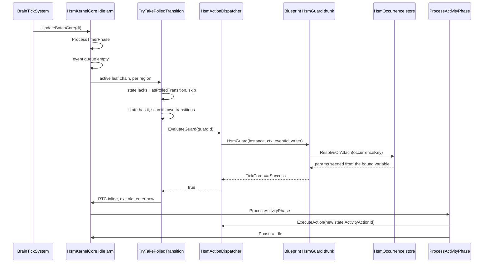
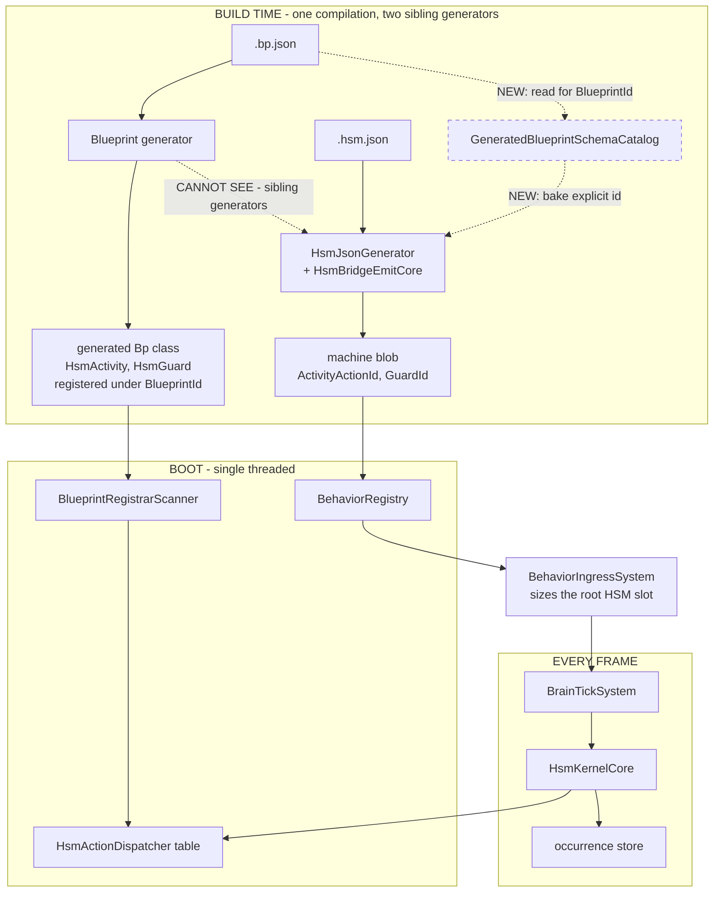

<!--STATUS
state: LIVE
build-state: READY-TO-BUILD
updated: 2026-09-27
current-answer: ⭐⭐⭐ §3 is the decision, §4-§6 the UML, §8 the eight build items (CE-381..CE-388).
  ⭐ Start at §2 (INVENTORY) if you are about to argue that something here already exists — most of
  it does, and §2 says which. ⚠ §2.4 carries a CORRECTION to a claim this design's own author made
  in chat on 2026-09-27; read it before quoting "the BTree side already solved this".
stale-below: nothing yet.
known-rot: nothing yet.
known-conflict: ⚠ HSM_Editor_NodeEditor_Host_Design.md §10.4 says the `Lane` property on
  `[HsmAction]` "doesn't currently exist". It DOES — `HsmActionGenerator.cs:598` emits it. That line
  is rotted; this design does not depend on it either way.
related-designs:
  - HSM_Editor_NodeEditor_Host_Design.md — ⭐⭐ owns the HSM EDITOR surface: §7 transitions, §8 final
    states, §10.1/§10.2 the action/guard pickers this design finally wires to a catalog. ⛔ It does
    NOT own the kernel phase machine or the blueprint bridge.
  - DESIGN_Occurrence_Scoped_Storage.md — ⭐⭐ owns the RUNTIME storage every hosted occurrence uses:
    §28/§29 the params seed and `HsmHostVariableAccess`, §32 an HSM state hosting a BTree. ⛔ It does
    NOT own action/guard IDENTITY, which is what §3.2 here settles.
  - AI_Editor_Shared_Infrastructure.md — ⭐ owns `ActionSchemaExporter` and the shared catalog that
    §3.3 reuses; §4.7 is the entry shape.
  - Architect_Question_36_Subtree_Hosting_Runtime.md — APPROVED; `Q36-B = A`, "a name BESIDE a Guid".
    §7 here follows that ruling for the blueprint reference rather than inventing a second spelling.
  - Behavior_Parameter_Resolver_Detailed_Design.md — owns how a hosted occurrence's params are
    RESOLVED once seeded; this design only decides which variable seeds them.
-->

# DESIGN — An editor-authored HSM as an entity behaviour, with blueprint actions and guards

> 🔒 **The user's ask, verbatim (`2026-09-27`):** *"To use the editor defined HSM as entity behavior,
> To be able to define few states and transitions between them, thw transition controlled by a
> condition programned using a function in blueprint (taking params from hsm's blackboars variables),
> when in the state i would like to tick an action defined in blueprint taking params from hsm
> blackoard variables (or multiple actions in parallel, one per channel like one action for movement,
> one for weapon control), with possibility to transition to exit state to finish the behavior."*

---

## 1. ⭐ WHAT ALREADY WORKS — **measured `2026-09-27`, so the build does not rebuild it**

| the ask | state | the mechanism that already carries it |
|---|---|---|
| ① states + transitions authored in the editor, run as an entity behaviour | ✅ | editor → `.hsm.json` → generated bridge → `BehaviorIngressSystem` sizes the root HSM slot → `BrainTickSystem` ticks it |
| ④ parallel actions, one per channel | ✅ *(runtime)* | `ProcessActivityPhase` walks EVERY region each tick; `ChannelKind` is `Locomotion, Weapon, Interaction`; `[WritesChannel]` drives generated HSM exit-cleanup thunks |
| ⑤ an exit state finishes the behaviour | ✅ | `IsFinal` → `InstanceFlags.Terminated` (`HsmKernelCore.cs:342`, `:823`) → `BrainTickSystem` publishes `BehaviorFinishedEvent` once, then clears the latch |
| ③ params from the HSM's blackboard variables | ✅ *(runtime)* | `HsmOccurrence.SeedParamsOffset` → `HsmParamBindings` → `HsmHostVariableAccess` reads host variables BY NAME |

⇒ ⭐⭐ **This design adds no runtime storage and no new tick path.** It closes the four places where the
AUTHORING surface cannot reach a runtime that is already built, plus the one genuinely missing kernel
capability (§3.1).

---

## 2. ⛔⛔ INVENTORY — **run `2026-09-27`; every box in §4 is drawn against it**

```
search_graph(project=HROT, name_pattern=".*Polled.*")                    -> 2    (both prose, no code)
search_graph(project=HROT, name_pattern=".*HsmGuard.*")                  -> 24
search_graph(project=HROT, name_pattern=".*BehaviorActionCatalog.*", label=Class) -> 4
search_graph(project=HROT, name_pattern=".*Hsm.*", label=Class)          -> 93
find.sh AiPrimitiveHosting --glob '*.cs'                                 -> 68 files / 201 lines
```

⚠ **`check_index_coverage` is NOT reachable through the codebase-memory CLI**, so no coverage proof
backs the negative claims below; each one is graph **and** grep agreeing, which is what this session
could obtain.

### 2.1 ⭐⭐ EXISTS — **reuse, do not rebuild**

| # | what exists | where | verdict |
|---|---|---|---|
| ① | `AiPrimitiveHosting.HsmAction` / `.HsmGuard` — first-class hosting modes | `BlueprintAsset.cs:158-159` | ⭐⭐ **REUSE unchanged** |
| ② | `EmitHsmActivityThunk` / `EmitHsmGuardThunk` — the real thunks, occurrence-keyed | `AiPrimitiveEmitter.cs:573,583` | ⭐⭐ **REUSE unchanged** |
| ③ | `HsmActionDispatcher.RegisterAction/RegisterGuard` emitted for both | `CSharpEmitter.cs:473-476` | ⭐ **REUSE**; §3.2 changes only the KEY |
| ④ | `[GeneratedAiPrimitiveAction(hsmAction:, hsmGuard:)]` on the generated `TickCore` | `AiPrimitiveEmitter.cs:276` | ⭐⭐⭐ **THE DISCOVERY CHANNEL, ALREADY BUILT** |
| ⑤ | `ActionSchemaExporter` reads ④ and sets `IsAiPrimitive` + hosting flags + `DtoType` | `ActionSchemaExporter.cs:106` | ⭐⭐⭐ **REUSE — this is §3.3's whole answer** |
| ⑥ | `BTreeCommandSink` composes a catalog entry into an asset binding | `BTreeCommandSink.cs:170` | ⭐⭐ **THE PATTERN TO MIRROR** |
| ⑦ | `GeneratedBlueprintSchemaCatalog` — a blueprint's `BlueprintId` + `Params` from the `.bp.json`, at generation time | `GeneratedBlueprintSchemaCatalog.cs` | ⭐⭐⭐ **REUSE — it is why §3.2 is cheap** |
| ⑧ | explicit action-id override, already honoured for entry/exit | `HsmFlattener.cs:172-173` | ⭐⭐ **EXTEND to activity + guard** |
| ⑨ | `HsmParamBindings.Register` emitted from `StateNodeDto.ExpressionTargetField` | `HsmBridgeEmitCore.cs:316` | ⭐⭐ **REUSE — §3.4 only has to FEED it** |
| ⑩ | 6 spare bits in `TransitionFlags` (6-11), 7 in `StateFlags` (9-15), `StateDef.Reserved29` | `Fhsm.Kernel/Data/Enums.cs` | ⭐⭐ **no struct grows; `StateDef` stays 32 B, `TransitionDef` 16 B** |

### 2.2 ⛔ DOES NOT EXIST — **the five gaps this design closes**

| id | gap | measured |
|---|---|---|
| **G1** | an HSM asset cannot ADDRESS a blueprint-hosted thunk | the asset stores a string; `HsmFlattener.ComputeHash` = `FNV1a16(FQN)`. The thunk registers under `(ushort)BlueprintId` = FNV-1a32 of the asset GUID. **Two id spaces; no authorable string bridges them** |
| **G2** | the action/guard pickers list only names ALREADY in the asset | `HsmActionPickerDrawer.GetItems()` / `HsmGuardPickerDrawer.GetItems()` — self-referential, so the FIRST binding can never be made |
| **G3** | the per-state param binding cannot be authored | `StateNodeDto.ExpressionTargetField` exists and the emitter consumes it; **`StateNode` (editor model) has no such field** and `HsmAssetMapper` maps it for transitions only ⇒ always null ⇒ every state seeds from offset 0 |
| **G4** | a transition cannot be driven by a CONDITION | guards are evaluated only inside the event phase (`HsmKernelCore.cs:629`). In production exactly ONE event is ever posted (`BrainTickSystem.cs:360`, MobilityLost) |
| **G5** | a blueprint-hosted action cannot declare a channel | `[WritesChannel]` is an attribute on hand-written methods; nothing carries it from a `.bp.json` |

### 2.3 ⚠ ADJACENT, AND DELIBERATELY NOT TOUCHED

⭐ `TransitionDef.EventId`'s own comment says **`0 = completion`**, and `HsmEmitCore.cs:491` compiles a
transition with no event name to `.On(0)` — but **nothing ever dispatches event 0**, so the concept is
half-present and inert. ⛔ This design does NOT revive it (§10 ③ says why), and does not change the
meaning of any existing eventless transition. 📐 Measured: all 7 transitions across the 4 shipped
assets name an event, so the blast radius of leaving it inert is zero.

### 2.4 🔴 CORRECTION — **"the BTree side already solved this" was WRONG**

📌 In chat on `2026-09-27` this design's author wrote that the BTree side had already solved G1
because its node stores a `MethodFqn`. **Half true, and the false half is the load-bearing one.**
📐 Measured: `T31_ComposedAiPrimitive.btree.json` binds `Hrot.AI.Behaviors.Brains.DemoAiPrimitiveNodes
.TickCore`, and that class's own header says it is a *"compile-time stand-in for a blueprint-authored
AiPrimitive's generated output … without the (not-yet-built) editor cross-compile path."*

⇒ ⭐⭐ **BTree established the CONVENTION** (`MethodFqn` + `DelegateShape` + `ExpressionTargetField`)
**against a hand-written twin, not against a real generated blueprint.** ⛔ So G1 is not "port BTree's
fix"; it is the first real crossing, and the reason it is still tractable is ②⑦ above, not precedent.

---

## 3. ⭐⭐⭐ THE DECISION — **four rulings, one per gap**

### 3.1 `G4` — a POLLED transition is an EXPLICIT flag 🔒 *(user, `2026-09-27`: "b, explicit")*

⛔⛔ **The rejected alternative — post a tick event every tick — is MEASURABLY HARMFUL, not merely
inelegant.** 📐 The phase machine advances **one phase per tick** (`UpdateBatchCore` is a flat `for`
with no inner loop), so an event round is `Idle → Entry → RTC → Activity → Idle` = **4 ticks**; and
`CE-334`'s per-tick activity runs **only in the `Idle` arm with an EMPTY queue**. ⇒ a permanent tick
event would cut state activities from every tick to ~1 in 4 and give every transition ~3 ticks of
latency — **it would break ③ and ④, which work today.**

⭐⭐ **So: `TransitionFlags.IsPolled = 1 << 6`, authored as a checkbox, evaluated in the `Idle` arm.**
⭐ Three layers of selectivity, and only the third is new:

| layer | gate | new? |
|---|---|---|
| by active configuration | only the leaf→root chain, per region | ⛔ already — the walk `ProcessActivityPhase` does |
| by state | `StateFlags.HasPolledTransition` (bit 9), set by the flattener ⇒ **one bit test** for a state with none | ⭐ new, and it is what makes this free |
| by transition | only transitions carrying `IsPolled` get a guard call | ⭐ new — the user's "explicit" |

⭐⭐ **Evaluated INLINE from `Idle`, not by parking in `RTC`** — the same shape `CE-334` chose for
activities, and for the same reason: parking costs a tick per phase. ⇒ a polled transition fires in
the tick its guard first passes, and **the newly-entered state's activity runs in that same tick**,
because the polled check runs BEFORE `ProcessActivityPhase` in the `Idle` arm.

### 3.2 `G1` — the asset carries an EXPLICIT ACTION ID, baked from the `.bp.json`

⛔ **Not a naming convention.** 📐 A blueprint's generated class is
`{SanitizedName}_{BlueprintId:X8}_Bp`, and **sibling Roslyn generators cannot see each other's
output** — `GeneratedBlueprintSchemaCatalog`'s own header states this is true *"not even in a fully
successful real build"*. ⇒ any scheme that asks the HSM generator to resolve that symbol is dead on
arrival, and any scheme that asks a human to type a hash into an asset is brittle.

⭐⭐⭐ **Instead: the HSM asset stores a NAME BESIDE A GUID** *(`Q36-B` = A, already approved)*, and the
bridge generator resolves the Guid to `(ushort)BlueprintId` through the catalog and emits it as an
**explicit id** — the override `HsmFlattener` already honours for entry/exit actions (`:172-173`),
extended to activity and guard. ⛔ The FQN hash path is untouched for hand-written actions.

### 3.3 `G2` — the pickers read the EXISTING catalog

⭐ `ActionSchemaExporter` already discovers blueprint-hosted actions and guards from
`[GeneratedAiPrimitiveAction]`, **with the `hsmAction`/`hsmGuard` flags already populated**. ⇒ the HSM
pickers filter that catalog by the flag they need, exactly as `BTreeCommandSink` does. ⛔ No new
catalog, no new discovery mechanism. ⚠ The self-referential list stays as a FALLBACK when no catalog
is injected (the headless/test host) — **but a production caller that HAS the catalog must pass it**,
which is the forwarding rail in §9.

### 3.4 `G3` — the state inspector gains the binding the emitter already consumes

⭐ One field on `StateNode`, mapped both ways, drawn with the existing
`HsmBlackboardFieldPickerDrawer` (which already filters by the selected action's `DtoType`). ⛔ No
format invention: `StateNodeDto.ExpressionTargetField` is already in the file format and already read
by `HsmBridgeEmitCore.EmitStateParamBindings`.

---

## 4. ⭐⭐ THE CLASSES — `classDiagram`

> **What this picture shows that the prose hid:** the only NEW types are two flags and one editor
> service; everything else is an existing box gaining one member. The dashed boxes are the two id
> spaces that G1 joins — and they meet in exactly one place, `HsmBridgeEmitCore`.


---

## 5. ⭐⭐ ONE TICK, WITH A POLLED BLUEPRINT GUARD — `sequenceDiagram`

> **What this picture shows that the prose hid:** the polled check and the activity run in the SAME
> `Idle` arm, in that order — so a transition taken this tick is followed by the NEW state's activity
> this tick. Nothing parks in `RTC`, which is the whole reason the latency is 0 and not 3.



---

## 6. ⭐⭐ WHO PRODUCES WHAT, AND WHO CALLS IT EACH FRAME — the MODULE diagram

> **What this picture shows that the prose hid:** two generators run from the SAME pre-generation
> compilation and **cannot see each other's output** — the red edge. That is why the id is baked from
> the `.bp.json` and not resolved from a symbol. The dotted edge is the one that does not exist today
> and is what G1 builds.



⚠ **The dead edge, named:** `BPGEN -.-> HSMGEN` **can never carry anything** — it is drawn to record
why, not as a route to build. 📐 `GeneratedBlueprintSchemaCatalog`'s header states the generated class
is unresolvable from a sibling generator *"not even in a fully successful real build."*

---

## 7. ⭐ THE FILE-FORMAT DELTA — **five optional fields, all additive**

| where | field | why |
|---|---|---|
| `StateNodeDto` | `ActivityBlueprintName` + `ActivityBlueprintAssetId` | `Q36-B`: a name BESIDE a Guid, so a renamed blueprint HEALS instead of dangling |
| `StateNodeDto` | *(none — `ExpressionTargetField` already exists)* | G3 is an EDITOR-side gap only |
| `TransitionDto` | `GuardBlueprintName` + `GuardBlueprintAssetId` | same ruling, guard side |
| `TransitionDto` | `IsPolled` | the user's explicit flag |

⛔⛔ **A slot may name a METHOD or a BLUEPRINT, never both** — validator rule, §9 ③. ⭐ Every field is
optional and absent from all four shipped assets, so **their generated source stays byte-identical**
— the same gating rule `EmitStateParamBindings` already follows.

⚠ **Scope, stated so it is not mistaken for an omission:** only the state **Activity** slot and the
transition **Guard** slot learn the blueprint form. Entry/exit/timer actions and transition EFFECT
actions keep the method-only form. ⭐ Those are the two slots the user's ask needs; the remaining four
are the same mechanism again and can follow on demand rather than on speculation.

---

## 8. ⭐⭐ THE BUILD — **eight items**

| id | item | lane |
|---|---|---|
| **CE-381** | `TransitionFlags.IsPolled` + `StateFlags.HasPolledTransition`; flattener sets both | kernel + compiler |
| **CE-382** | `HsmKernelCore.TryTakePolledTransition`, called from the `Idle` arm BEFORE `ProcessActivityPhase`, RTC inline | kernel |
| **CE-383** | extend the explicit-id override to `ActivityActionId` and to transition `GuardId` (it already exists for entry/exit) | compiler |
| **CE-384** | `GeneratedBlueprintSchemaCatalog` reachable from the HSM generator; `HsmBridgeEmitCore.EmitBlueprintActionIds` bakes `(ushort)BlueprintId` | generators |
| **CE-385** | asset + model + mapper: the five §7 fields, both directions, round-tripped | persistence + editor |
| **CE-386** | pickers read `ActionSchemaExporter`, filtered by `HsmAction` / `HsmGuard`; self-referential list stays as the no-catalog fallback | editor |
| **CE-387** | `StateNode.ExpressionTargetField` + the state inspector's blackboard-field picker (G3) | editor |
| **CE-388** | `WritesChannel` for blueprint-hosted HSM actions (G5) — the `.bp.json` declares channels, the bridge emits the exit-cleanup registration | compiler + generators |

⭐ **CE-381…CE-384 are the spine** — with those four an HSM asset can address a blueprint guard and a
blueprint activity, and a polled transition fires. CE-385…CE-387 make it authorable rather than
hand-editable. **CE-388 is separable** and only matters once ④ is driven by blueprints.

---

## 9. ⭐⭐⭐ ACCEPTANCE — **and every one is RED-PROVED**

| # | rail | the red-proof that makes it load-bearing |
|---|---|---|
| ① | a polled transition whose guard returns true FIRES with **no event posted** | revert `IsPolled` on the transition ⇒ it must never fire |
| ② | an **un**marked transition's guard is **never called** on a quiescent tick | instrument the dispatcher; a call is a failure |
| ③ | a state naming BOTH a method and a blueprint is a **validator error** | remove the rule ⇒ the asset compiles and one binding silently wins |
| ④ | the id the blob addresses for a blueprint activity **equals** the id the blueprint registrar registers | bake the FQN hash instead ⇒ must go red. ⛔ Read the id from the **artefact** (the compiled blob + the emitted registration), never recompute it — `HsmActionIdAgreementTests` is the precedent and says why |
| ⑤ | the new state's activity runs in the **same tick** the polled transition fired | park in `RTC` instead ⇒ must go red |
| ⑥ | two parallel regions, each an activity on a different `ChannelKind`, both tick each frame | `HsmOrthogonalRegions` extended; drop one region ⇒ red |
| ⑦ | a state's `ExpressionTargetField` set in the editor survives save→load→generate and reaches `HsmParamBindings` | unmap it in `HsmAssetMapper` ⇒ red |
| ⑧ | **the forwarding rail** — the production registrar that HAS the catalog PASSES it to the pickers | assert on the CONSTRUCTED drawer, not on registrar source |
| ⑨ | a final state still publishes `BehaviorFinishedEvent` exactly once **after** a polled transition reaches it | — |

⚠ **Rail ⑧ exists because of a named repeat offender** — `HsmValidator._isStatefulSubtree` and
`BlackboardAuthoringWindow._actionSchemaExporter` were both defaulted to nothing by a caller that held
the value. ⭐ The catalog is optional here for the headless host; that is exactly the shape that has
gone silently inert twice.

---

## 10. ⛔ REJECTED

| # | alternative | the one fact that killed it |
|---|---|---|
| ① | **post a tick event every tick** so guards are evaluated | one phase per tick ⇒ activities drop to ~1 in 4 and transitions gain ~3 ticks of latency (§3.1) |
| ② | **name the generated blueprint class by FQN** in the asset | sibling generators cannot resolve each other's symbols, and the FQN embeds the `BlueprintId` hash |
| ③ | **revive `EventId 0` as "completion"** so an eventless transition is implicitly polled | it makes a blank event field a silent per-tick blueprint evaluation — the silent-non-execution shape this programme keeps filing. 🔒 The user chose explicit |
| ④ | **register the blueprint thunk a second time under `FNV1a16(FQN)`** | two ids for one thunk, and `RegisterAction` is last-writer-wins — a collision would be silent |
| ⑤ | **make guards cheap by caching the last result** | a guard over live blackboard state is not cacheable without an invalidation source, and there is none |
| ⑥ | **a new picker/catalog for the HSM editor** | `ActionSchemaExporter` already carries the `hsmAction`/`hsmGuard` flags — building a second one is the duplicate-implementation `R-137`/ruling 9 forbids |
