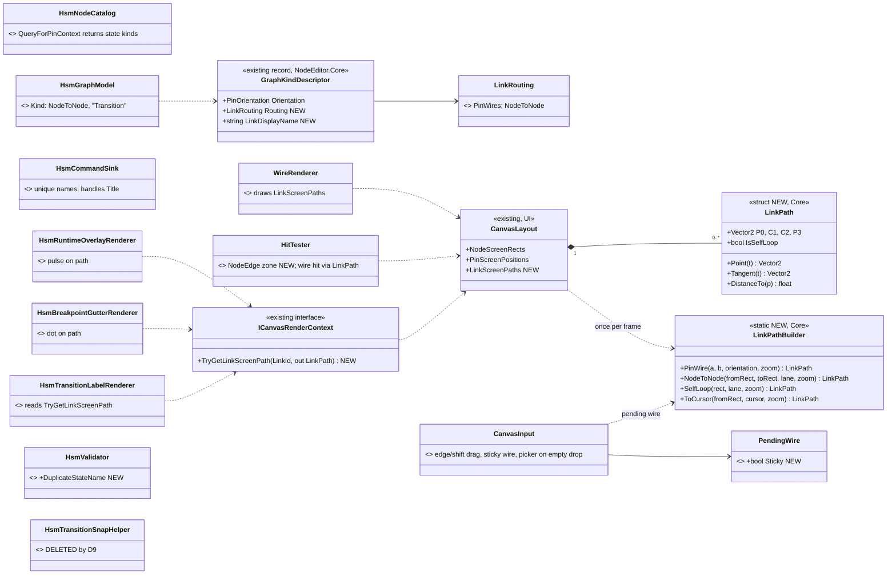
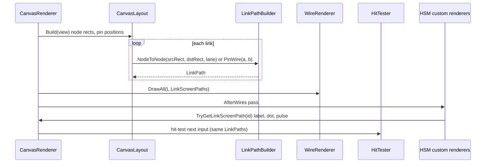
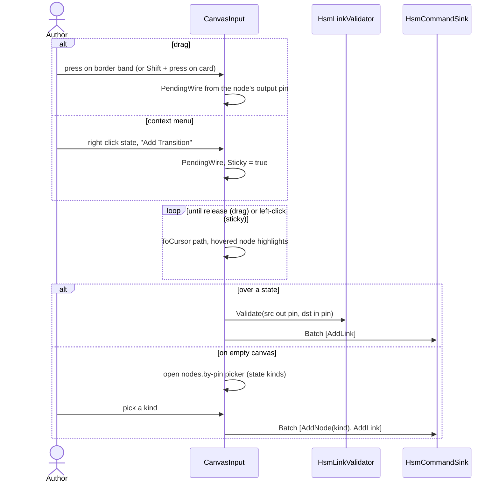
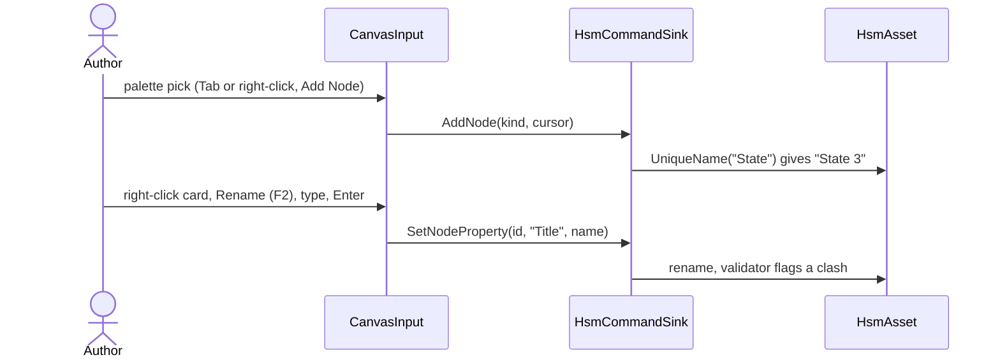
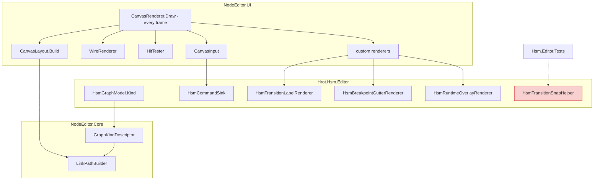
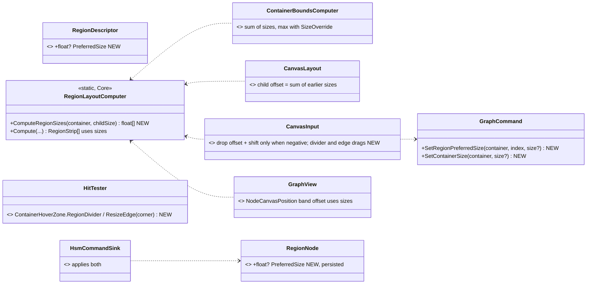
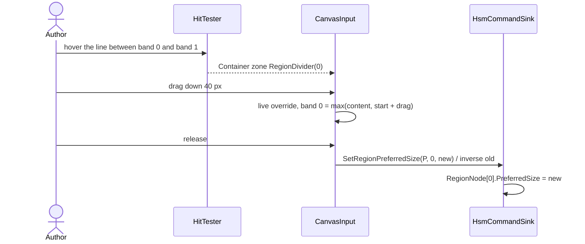

<!--STATUS
state: LIVE
updated: 2026-10-06
build-state: BUILT (S1-S3, 2026-10-06 — §8a; CE-1004 — §11a) · S4 waits on Q84 · revised 2026-10-06 (D4/D6 consistency, D8 withdrawn)
current-answer: §2 decisions, §3-§5 diagrams, §8 slices, §8a AS-BUILT (S1-S3 built 2026-10-06).
stale-below: nothing
known-rot: none yet
known-conflict: HSM_Editor_NodeEditor_Host_Design.md §7.1 chose "two invisible pins, NodeEditor unchanged" for
  transitions. This design KEEPS the pins as the link's identity (commands, undo, sink unchanged) and SUPERSEDES §7.1
  only for geometry and gestures. §7.3 (label at the Bezier midpoint) is superseded by §6 here.
related-designs:
  - HSM_Editor_NodeEditor_Host_Design.md — owns the HSM model, facets, validator and renderer list; this doc owns
    the canvas GEOMETRY and the authoring GESTURES only.
  - Architect_Question_84_Hsm_Region_Initial_History_Model.md — owns which child is "initial", what a parallel
    region IS, and how history is modelled. S4 (drag the initial marker) waits on it.
  - NodeEditor_Extension_CustomCanvasRenderer.md — owns the custom-renderer seam; this doc adds ONE accessor to it
    (TryGetLinkScreenPath, §3).
  - NodeEditor_Extension_ContainerNodes.md — owns composite/container layout and drop-into-container; §11 (CE-1004)
    supersedes its §5.3 (no manual size), §5.4 as-built drop shift, §13.2 (divider drag deferred) — marked there.
  - Hsm_Issues_Tracker.md — the HSM-0xx rows this design closes or depends on (§9).
  - BTree_HSM_Editor_State_And_Forward_Plan.md — ⛔ HISTORICAL (HSM-011): it still says HSM "cannot author at
    all". Quote only its §1 substrate reconciliation; THIS doc owns what authoring does today.
-->

# HSM canvas authoring — UnityHFSM-style geometry and gestures

> 🔒 **User, `2026-10-06`:** *"make it very easy to place nodes and connect them with transition arrows, so the
> graphics geometry is similar to what can be found on images in the readme page of
> [UnityHFSM](https://github.com/Inspiaaa/UnityHFSM)"* — leans approved the same day; ⭐ **revised the same day** — *"no double-click to place node … this should be from palette as in btree and blueprints to stay consistent"* · *"the context menu way needs to stay"* · D8 withdrawn · D9, D10 approved.

**Target look** (UnityHFSM README): rounded state cards with a centred name · arrows leave and enter the **nearest
border** · `A→B` and `B→A` are **two separate arcs** · the label sits **on** the arc · a filled dot + arrow marks
the initial child · composites are boxes with a header band and children inside.

## 1. INVENTORY — what exists today (measured `2026-10-06`)

| query | result |
|---|---|
| `search_graph` Method `.*(Bezier\|Tangent\|Arrowhead\|PendingWire).*` (non-test), 28 hits | ⛔ **curve maths in 5 places**: `HitTester.WireTangents` + `HitTester.BezierPoint` · `ImDrawListExtensions.BezierPoint/BezierTangent/AddBezierWithArrow` · `WireRenderer.DrawBezierSegment` · `CanvasRenderer.DrawPendingWire` · `HsmTransitionLabelRenderer` (straight chord + `ComputeArrowheadGeometry`) |
| `trace_path` inbound `WireTangents` | 3 callers: `WireRenderer`, `CanvasRenderer.DrawPendingWire`, `HitTester.BezierHit` |
| `search_graph` Class `.*(Wire\|Link\|Arrow\|Snap).*` | `HsmTransitionLink`, `HsmLinkValidator`, `HsmInitialArrowRenderer`, `HsmTransitionSnapHelper`, `PendingWire`, `GraphCommand.ReplaceLinkEndpoint` |
| `trace_path` inbound `HsmTransitionSnapHelper.FindNearestSnapTarget` | ⛔ **1 caller, a test** — built, never fed |
| grep `GraphCommand.ReplaceLinkEndpoint` handlers | NodeEditor + DebugApi JSON only; ⛔ `HsmCommandSink` does not handle it |
| `HitTester.cs:204` | pins are hit-tested **even when `PinShape.None`** ⇒ HSM's invisible pins are the only drag start |
| `HsmNodeCatalog.QueryForPinContext` | returns **empty** ⇒ wire-drop on empty canvas opens an empty picker |
| `HsmCommandSink.cs:178` | every new state is named `"State"` (HSM-006) |
| `CanvasInput.cs:308` + `CommentsRenderer` | ⭐ inline-rename precedent: `InteractionState.RenamingComment` |
| `CanvasInput.cs:545-768` | ⭐ drag-into-container already emits `ChangeParentMultiple` |
| `CanvasRenderer.cs:276-280` | container backgrounds → wires → nodes ⇒ an arrow into a nested child is drawn **over** the composite body, under the cards — no reorder needed |
| HSM renderers drawing transition overlays | `HsmBreakpointGutterRenderer` puts a transition's dot on the **source state's corner** (same spot as the state's own dot); `HsmRuntimeOverlayRenderer` pulses the **source state centre** — neither is on the arrow |
| `*.hsm.json` `Waypoints` | all empty in the repo's assets — no authored arrow shape to preserve |

## 2. Decisions

| # | decision *(🔒 all approved `2026-10-06`, D4/D6 revised for consistency with BTree/Blueprint, D8 withdrawn)* | rejected — one line each |
|---|---|---|
| **D1** | ⭐ A **generic NodeEditor option**, `GraphKindDescriptor.Routing = NodeToNode`; HSM opts in, BTree/Blueprint unchanged | HSM-only overlay that hides the links and draws its own — hit-test and selection would diverge (a 6th copy of the maths) · visible pin dots — keeps left→right S-curves |
| **D2** | ⭐ **ONE geometry**: `LinkPathBuilder` in `NodeEditor.Core` computes every link path once per frame into `CanvasLayout.LinkScreenPaths`; renderer, hit-tester, pending wire and custom renderers all read it | keep per-consumer maths — measured drift (arrowhead aimed along the chord of an S-curve) |
| **D3** | ⭐ **Start a transition** three ways: drag from a state's **border band** (8 px) · **Shift-drag** anywhere on it · **right-click the state → "Add Transition"**, after which the arrow follows the cursor and a left-click on a state finishes it (Esc / right-click cancels). Plain drag inside still moves | border only — too fiddly on small cards · a modifier only — undiscoverable · drag only — 🔒 the context-menu way must stay |
| **D4** | ⭐ **Drop on empty canvas opens the state picker** — the same `nodes.by-pin` picker BTree and Blueprint open there, with `Simple State` first; picking creates the state **and** the transition in one undo step. `HsmNodeCatalog.QueryForPinContext` (empty today) returns the state kinds | create a plain state with no picker — ⛔ revised: BTree/Blueprint open a picker here, and the HSM canvas must behave like them |
| **D5** | ⭐ **Always a gentle arc**, bending to the left of travel ⇒ `A→B` and `B→A` separate by construction; more bend per extra parallel link | straight unless paired — two code paths, and labels of a pair collide |
| **D6** | ⭐ **Placing states is unchanged — the palette** (Tab / right-click canvas → "Add Node…"), exactly as BTree and Blueprint (neither has double-click placement — measured: `CanvasInput` handles double-click only on links and comment headers). **Renaming uses the existing canvas "Rename… (F2)"** (`CanvasRenderer.cs:787`, sends `SetNodeProperty(node, "Title", …)`) — ⛔ **which `HsmCommandSink.ApplySetNodeProperty` silently ignores today** (it handles only `isBreakpoint`), so S2 makes it work | double-click placement — ⛔ user: not in BTree/Blueprint, so not here · a new inline rename box — the shared modal already exists |
| **D7** | ⭐ **Names are unique on create** (`State`, `State 2`, …) **and** a validator rule `DuplicateStateName` (Error) — names are load-bearing in emit (HSM-006) | uniquify only — the inspector can still rename into a clash |
| **D8** | ⛔ **WITHDRAWN** — state nodes keep the current Blueprint look. 🔒 User: *"probably ok as it is … Unity-HFSM does not bring anything new"* — agreed: the pictures differ only in compactness; the value is in the arrows | — |
| **D9** | ⭐ Fold `HsmTransitionSnapHelper` into the border-band/drop-on-node hover (**route, then delete** — its job is what D3 does); record in `Hrot.Hsm.Editor.md` | keep it — a second "which state is under the cursor" next to the hit-tester |
| **D10** | ⭐ Transition overlays move **onto the arrow**: breakpoint dot at the path's 25 % point, fired-transition pulse runs along the path | keep source-corner placement — collides with the state's own breakpoint dot |

⚠ Decided elsewhere, **not** here: what "initial" is, what a region is, history → [`Q84`](Architect_Question_84_Hsm_Region_Initial_History_Model.md). Save policy → [`BP-93`](Blueprint_Issues_Tracker.md) (§9).

## 3. Classes

*What the picture shows that prose hid:* `LinkPath` has **one producer** (`CanvasLayout`) and every consumer reads it —
the five existing curve copies collapse into `LinkPathBuilder`. Everything new sits in `NodeEditor.Core`
(ImGui-free, `R-47`); HSM only **sets three descriptor fields** and adopts the accessor.

## 4. Sequences

**4a — a frame** *(the only place paths are computed)*

**4b — draw a transition** *(D3, D4)*

**4c — name a state** *(D6, D7 — placement itself is the existing palette path, unchanged)*

## 5. Modules — who calls what each frame

*Caption:* the red box has **no production caller** today (D9 deletes it). Every other box is reached from
`CanvasRenderer.Draw` each frame — the HSM canvas window already drives it, so nothing new needs registering.

## 6. Geometry rules *(screen space, scaled by zoom)*

| element | rule |
|---|---|
| endpoints | where the arc's chord meets each card's **rounded border**, offset ±6 px along the normal by lane so parallel arrows never share an end |
| bend | control points at ⅓ and ⅔ of the chord, pushed **left of travel** by `max(18, 0.12·len) + 14·lane` |
| lane | index among links with the same unordered node pair *and* direction; opposite directions both use lane 0 and still separate (left-of-travel) |
| self-loop | external self-transition: loop on the card's top-right corner; internal: dashed loop inside (today's §7.4 look) |
| arrowhead | filled triangle at `P3`, aimed along `Tangent(1)` — never along the chord |
| label | at `Point(0.5)`, offset to the outer side of the bend, background pill; hidden below the low-zoom threshold |
| into a composite's child | uses the **child's** rect; to the composite itself, the composite's rect |
| hit | `DistanceTo ≤ 6 px`, sampled from the same `LinkPath` |
| waypoints | if present: arcs through them, segment by segment (no repo asset has any today) |

## 7. What does NOT change

`ILinkModel` (still pin-to-pin), every `GraphCommand`, undo, `HsmCommandSink`'s link handling, persistence, emit.
BTree and Blueprint keep `PinWires` and draw exactly as today (`WireTangentTests` must stay green — they pin the
current tangents, which move into `LinkPathBuilder.PinWire` unchanged).

## 8. Slices

| slice | scope | acceptance (railable headlessly, `R-124`) |
|---|---|---|
| **S1** | `LinkPath`/`LinkPathBuilder`, `LinkScreenPaths`, `TryGetLinkScreenPath`; `WireRenderer`/`HitTester`/`DrawPendingWire` read it; `NodeToNode` routing; `NodeEdge` hover zone; edge/Shift drag; drop on a state | `WireTangentTests` unchanged and green · new `LinkPathBuilderTests` (endpoints on border, `A→B`/`B→A` disjoint, tangent at P3) · HSM: one drag creates one transition, one undo removes it |
| **S2** | context-menu "Add Transition" (sticky wire); `HsmNodeCatalog.QueryForPinContext` → picker on empty drop; unique names; `HsmCommandSink` handles `Title`; `DuplicateStateName` | two palette placements ⇒ `State`, `State 2` · canvas Rename (F2) renames the state and one undo restores it · rename into a clash ⇒ Error diagnostic · "Add Transition" then click a state ⇒ one transition |
| **S3** | label/arrowhead/breakpoint dot/fired pulse on the path; delete `HsmTransitionSnapHelper` | label point lies on the drawn path · breakpoint dot of a transition ≠ its source state's dot · Windows visual check against the UnityHFSM pictures |
| **S4** | initial-marker drag + "Set as initial" context item | ⏸ **waits on [`Q84`](Architect_Question_84_Hsm_Region_Initial_History_Model.md)** |

## 8a. ✅ AS-BUILT `2026-10-06` — S1, S2, S3 (CE-1000, CE-1001, CE-1002)

| design said | built | deviation / addition, and why |
|---|---|---|
| `LinkPath` + `LinkPathBuilder` in Core, `CanvasLayout.LinkScreenPaths`, `TryGetLinkScreenPath` | ✅ as drawn (§3) — `LinkPath` holds 1..n `BezierSegment`s (n > 1 with waypoints); `TryGetLinkScreenPath` is a default interface member returning false, so the 5 existing test fakes need no change | — |
| renderer / hit-tester / pending wire read the path | ✅ `WireRenderer.DrawPath` (+ `DrawArrowhead` along `Tangent(1)`), `HitTester` samples `path.DistanceTo`, `DrawPendingWire` draws `ToPoint`/`NodeToNode`/`SelfLoop` | `HitTester.WireTangents` kept as a one-line delegate (the `WireTangentTests` rails name it) |
| `NodeEdge` hover zone, border/Shift drag | ✅ `HoverKind.NodeEdge` (z 67: above node body and container header, below wires/pins); Shift on a node body or container header | ➕ **pins are NOT hit-tested in node-to-node graphs** — otherwise HSM's invisible pins (left/right mid-edge) still win and start a pin-wire. ➕ a NodeEdge or container-HEADER right-click opens the NODE menu — 📐 composites had **no context menu at all** before |
| a click is not a link; no accidental self-transition | ✅ `PendingWire.SourceNode` / `LeftSourceNode` / `AddToSelectionOnClick` | — |
| "Add Transition" context item (sticky wire) | ✅ generic "Add {`LinkDisplayName`}" in the node menu of node-to-node graphs; `PendingWire.Sticky` finishes on a left PRESS, Esc / right-click cancels | — |
| drop on empty canvas → state picker, one undo step | ✅ shared `OpenPickerForWire` (extracted from the pin path); the new node's pin comes from ➕ **`IGraphModel.NodeLinkPin`** (default: the node's first pin of that direction; HSM overrides it from the StableId so it answers for a not-yet-created state) | the catalogue carries no pin signatures for whole-node links, so the pin-signature match could never link |
| (not in the design) | ➕ **`ScopedPickerRegistry`**, used by the BTree, Blueprint AND HSM document factories; HSM gains `HsmPickerSources` | 📐 **found while building D4:** all AI documents registered `nodes.all` / `nodes.by-pin` in ONE process-wide registry — the last opened BTree/Blueprint document owned them for every canvas. HSM registered none, so Tab / "Add Node…" on an HSM canvas offered another editor's nodes (or nothing), and two open blueprints offered each other's. ⚠ cross-editor change (BTree, Blueprint factories) |
| unique names + `DuplicateStateName` | ✅ `HsmCommandSink.UniqueStateName` ("State", "State 2", …); validator rule (Error) | — |
| canvas Rename (F2) works on HSM | ✅ `HsmCommandSink` handles `SetNodeProperty("Title")` (trimmed; empty refused) | — |
| S3: label / bp dot / pulse on the path | ✅ `HsmTransitionLabelRenderer.LabelAnchor` (outer side of the bend), `HsmBreakpointGutterRenderer.TryTransitionDotCenter` (25 % along), `HsmRuntimeOverlayRenderer` highlights the fired arrow + a diamond moving along it | the HSM renderer's own chord-aimed arrowhead (`ComputeArrowheadGeometry`) and its 5 tests are deleted — the canvas draws the arrowhead now |
| D9 delete `HsmTransitionSnapHelper` | ✅ deleted with its tests; `Hrot.Hsm.Editor.md` updated | — |

## 9. Neighbouring work — measured `2026-10-06`, so nothing surprises the build

| row | state today | relation to this design |
|---|---|---|
| [BP-93](Blueprint_Issues_Tracker.md) (BTree/HSM written to disk 0.5 s after any edit, no Save) | ⛔ still live — `EditorSubsystem.cs:4631` schedules every change, the flush writes JSON | ✅ **lean accepted `2026-10-06`:** gate the BTree/HSM JSON write like the Blueprint arm; edits persist only via Save / Save All. Separate slice (touches BTree) |
| HSM-006 (duplicate names) | open | ⭐ closed by S2 (D7) |
| HSM-009 / [BP-91](Blueprint_Issues_Tracker.md) (no event create/delete) | partial — `CE-2088` declares engine events on pick | next after S2: an "Add event" row in the Events table + "New event…" in the transition's event picker |
| HSM-001/002/003/005/010 | open | ⭐ all fold into [`Q84`](Architect_Question_84_Hsm_Region_Initial_History_Model.md) |
| HSM-012 (Timer slot never fires) | open — kernel never arms a timer | hide the facet field until the kernel arms timers (cheap, independent) |
| HSM-017 (variable rename dangles HSM bindings) | open — no HSM variable reference contributor | independent; mirror `BTreeBlackboardVariableContributor` |
| [BP-61](Blueprint_Issues_Tracker.md) (concurrency validators inert) | ✅ fixed — both validator sites get the catalogue (`EditorSubsystem.cs:3422`, `HsmDocumentFactory.cs:128`) | none — the tracker row is stale |
| [BP-30](Blueprint_Issues_Tracker.md) (HSM AiPrimitives collide) | ✅ fixed — `HsmOccurrence.KeyFor` per (region, state) | none — the tracker row is stale |
| [BP-53](Blueprint_Issues_Tracker.md) (cross-asset blueprint pick) | ✅ effectively done — `ActionBindingDrawer` blueprint combo (`allowsBlueprint`) | none |
| [BP-56](Blueprint_Issues_Tracker.md) (no wire-level execution highlight) | open | ⭐ D10's pulse-along-path is the HSM half; the shared `LinkPath` makes the Blueprint half cheap |
| [BP-101](Blueprint_Issues_Tracker.md) (no F2 rename on panel items) | open | the canvas already has Rename (F2) for nodes; S2 makes it work on HSM |
| [CE-299](Blueprint_Issues_Tracker.md) (HSM dispatcher-id collision) | open, runtime | unrelated to the canvas |

## 10. Design docs checked

| doc | verdict |
|---|---|
| `HSM_Editor_NodeEditor_Host_Design.md` §7.1/§7.3 | **applies, superseded in part** — keeps the pins as identity; geometry and label placement move here |
| `.dev/_DONE/ai-hsm-btree-vis-edit-2/RHS/RHS-PLAN.md` visual checklist | **applies, supports** — it already asked for "clean state-edge→state-edge arrows"; it got visible S-curves |
| `NodeEditor_Extension_CustomCanvasRenderer.md` | **applies** — exposes node rects and pin points only; §3 adds the link-path accessor |
| `NodeEditor_Extension_ContainerNodes.md` | **does not change** — drop-into-container and region layout are reused as is |
| `docs/projects/Hrot/AI/Hrot.Hsm.Editor.md` (lists `HsmTransitionSnapHelper`) | **inventory only**, no intent beyond "snap while dragging" — D9 keeps that behaviour via the hit-tester |

## 11. CE-1004 — region and container sizing *(designed `2026-10-06`, user-approved A + C + R1)*

> 🔒 **User:** *"regions are auto-sizing which makes the control where the sub-SM nodes are placed within the region
> pretty difficult"* · approval: *"If it still be possible to drop a node outside of lane to disconnect it from the
> lane, then go with A + C + R1"* — ✅ it is: the drop target is the container under the CURSOR
> (`CanvasInput.UpdateContainerDropTarget`), unaffected by A/C/R1; a rail pins it.

**Measured causes:** ① every drop shifts the children so the top-left one is at 0 and MOVES THE CONTAINER by that
amount (`CommitNodeDrop` "shift" block) — contrary to `NodeEditor_Extension_ContainerNodes.md` §5.4 *"The canvas
doesn't auto-translate containers"*; ② a band's size is its content's extent (no author control — divider drag was
"deferred to Slice 2+", §13.2); ③ the band geometry is computed in FOUR places that disagree (spare space, default vs
measured child sizes).

| # | decision | rejected |
|---|---|---|
| **A** | ⭐ ONE band-size function, `RegionLayoutComputer.ComputeRegionSizes`, used by the band drawing, the child offset, the drop and the container bounds. Spare space goes to the LAST band, so a band's start depends only on the bands before it | keep four copies — they drift |
| **C** | ⭐ the drop shift happens only when a child would sit ABOVE or LEFT of the interior (the container grows that way, children keep their canvas place); never to remove space the author left. A child dropped above a later band's start is clamped to that band | design §5.4 literally (never translate; grow right only) — a child dropped above would sit outside the box |
| **R1** | ⭐ author sizes: a band's size = max(its **preferred size**, its content, 60); drag the divider between bands to set the upper band's preferred size; drag the container's **bottom-right corner grip** to set its **preferred outer size** *(as-built: the grip only — the right/bottom border band already starts a transition, §2 D2)* (= `INodeModel.SizeOverride`, already persisted for HSM states and ignored for containers until now). Two new generic commands, undoable | fixed equal bands — content overflows |

*What it shows:* one producer of band geometry with five readers (as-built: `GraphView.NodeCanvasPosition` was a FIFTH
copy, found while building), and the two new commands as the only new write path.

### 11a. AS-BUILT *(2026-10-06)*

| item | as built | deviation from §11 |
|---|---|---|
| A | `RegionLayoutComputer.ComputeRegionSizes` + `RegionOffset`; read by `ContainerBoundsComputer`, `CanvasLayout` (offset + bounds), `CanvasInput.CommitNodeDrop` (measured sizes from the spatial index, dragged nodes skipped), `HitTester` (dividers), `ContainerRenderer`, **`GraphView.NodeCanvasPosition`** | ⚠ the 5th copy (`GraphView`, Core) has no measured sizes, so it counts a child as `SizeOverride ?? 160×64`; the canvas uses measured sizes. Same as before for that copy — now at least it honours preferred sizes |
| C | `shift = min(0, shift)` per axis; children of a later band take only the cross-axis shift; a drop above a later band's start clamps to that band | none |
| R1 | divider: `HitTester` ±4 px on the line between bands → `ResizingContainer` mode → live preview (`InteractionState.RegionSizePreview`) → release commits `SetRegionPreferredSize` (inverse = old value, label *Resize Region*). Grip: 12 px corner → `SetContainerSize` (*Resize Container*). Cursors NS/EW/NWSE; hovered handle drawn in the accent colour | **corner grip only**, no edge drag (see the table above). The debug API (`GraphCommandJson`) also accepts both commands |
| HSM | `RegionNode.PreferredSize` → `RegionDescriptor`; `RegionNodeDto.PreferredSize` written only when set (existing files do not move); `HsmCommandSink` applies both commands (`SetContainerSize` → `StateNode.SizeOverride`, already persisted) | ⚠ `HsmAutoLayout` sets `SizeOverride = 400×200` on composites it lays out — that is now a minimum size for them (it was ignored for containers before). Intended size, so kept |
| detach | dropping a state where no container is under the cursor still reparents it to the root | none — pinned by `ContainerDragTests.CE1004_DroppingAChildOutsideItsContainer_StillDetachesIt` |

Rails: `ContainerDragTests` (C, grow-up, detach, divider + grip commit/undo) · `RegionLayoutComputerTests` (preferred,
preview, spare-to-last) · `ContainerBoundsTests` (minimum size) · `HsmCommandSinkRegionTests` (sink + file round trip).

