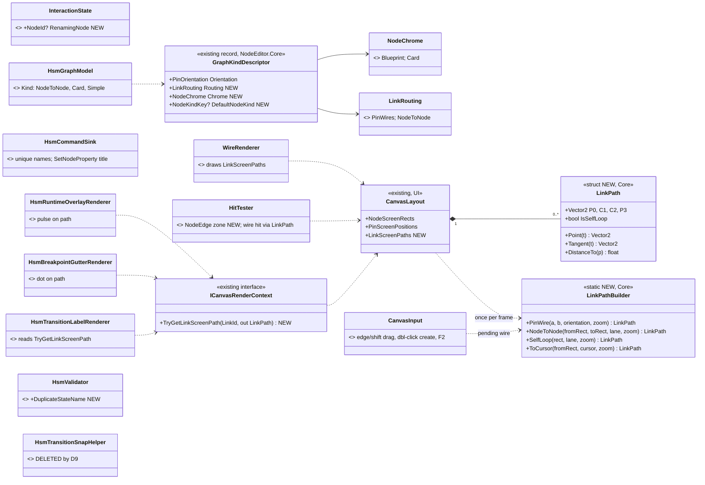
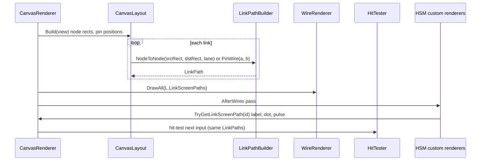
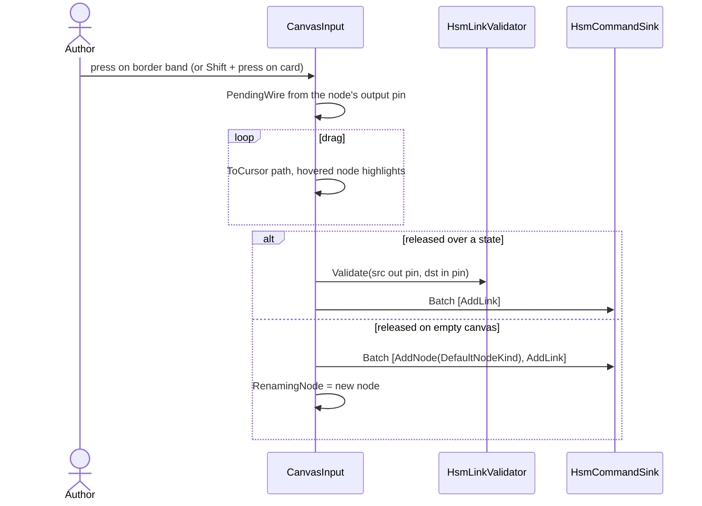
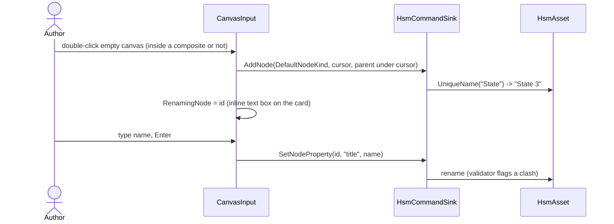
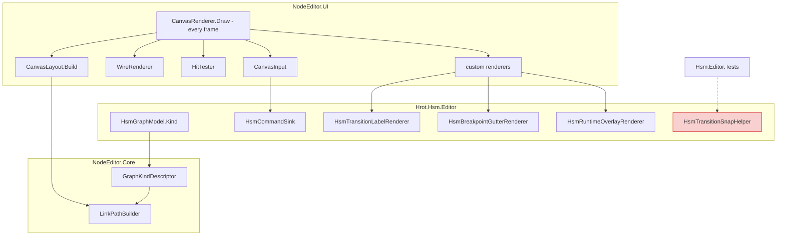

<!--STATUS
state: LIVE
updated: 2026-10-06
build-state: READY-TO-BUILD (S1-S3) · S4 waits on Q84
current-answer: §2 decisions, §3-§5 diagrams, §8 slices. Everything here is the target; nothing is built yet.
stale-below: nothing
known-rot: none yet
known-conflict: HSM_Editor_NodeEditor_Host_Design.md §7.1 chose "two invisible pins, NodeEditor unchanged" for
  transitions. This design KEEPS the pins as the link's identity (commands, undo, sink unchanged) and SUPERSEDES §7.1
  only for geometry and gestures. §7.3 (label at the Bezier midpoint) is superseded by §6 here.
related-designs:
  - HSM_Editor_NodeEditor_Host_Design.md — owns the HSM model, facets, validator and renderer list; this doc owns
    the canvas GEOMETRY and the authoring GESTURES only.
  - Architect_Question_84_Hsm_Region_Initial_History_Model.md — owns which child is "initial", what a parallel
    region IS, and how history is modelled. S4 (drag the initial marker) waits on it.
  - NodeEditor_Extension_CustomCanvasRenderer.md — owns the custom-renderer seam; this doc adds ONE accessor to it
    (TryGetLinkScreenPath, §3).
  - NodeEditor_Extension_ContainerNodes.md — owns composite/container layout and drop-into-container; unchanged here.
  - Hsm_Issues_Tracker.md — the HSM-0xx rows this design closes or depends on (§9).
-->

# HSM canvas authoring — UnityHFSM-style geometry and gestures

> 🔒 **User, `2026-10-06`:** *"make it very easy to place nodes and connect them with transition arrows, so the
> graphics geometry is similar to what can be found on images in the readme page of
> [UnityHFSM](https://github.com/Inspiaaa/UnityHFSM)"* — leans D1–D7 approved the same day; D8–D10 are new.

**Target look** (UnityHFSM README): rounded state cards with a centred name · arrows leave and enter the **nearest
border** · `A→B` and `B→A` are **two separate arcs** · the label sits **on** the arc · a filled dot + arrow marks
the initial child · composites are boxes with a header band and children inside.

## 1. INVENTORY — what exists today (measured `2026-10-06`)

| query | result |
|---|---|
| `search_graph` Method `.*(Bezier\|Tangent\|Arrowhead\|PendingWire).*` (non-test), 28 hits | ⛔ **curve maths in 5 places**: `HitTester.WireTangents` + `HitTester.BezierPoint` · `ImDrawListExtensions.BezierPoint/BezierTangent/AddBezierWithArrow` · `WireRenderer.DrawBezierSegment` · `CanvasRenderer.DrawPendingWire` · `HsmTransitionLabelRenderer` (straight chord + `ComputeArrowheadGeometry`) |
| `trace_path` inbound `WireTangents` | 3 callers: `WireRenderer`, `CanvasRenderer.DrawPendingWire`, `HitTester.BezierHit` |
| `search_graph` Class `.*(Wire\|Link\|Arrow\|Snap).*` | `HsmTransitionLink`, `HsmLinkValidator`, `HsmInitialArrowRenderer`, `HsmTransitionSnapHelper`, `PendingWire`, `GraphCommand.ReplaceLinkEndpoint` |
| `trace_path` inbound `HsmTransitionSnapHelper.FindNearestSnapTarget` | ⛔ **1 caller, a test** — built, never fed |
| grep `GraphCommand.ReplaceLinkEndpoint` handlers | NodeEditor + DebugApi JSON only; ⛔ `HsmCommandSink` does not handle it |
| `HitTester.cs:204` | pins are hit-tested **even when `PinShape.None`** ⇒ HSM's invisible pins are the only drag start |
| `HsmNodeCatalog.QueryForPinContext` | returns **empty** ⇒ wire-drop on empty canvas opens an empty picker |
| `HsmCommandSink.cs:178` | every new state is named `"State"` (HSM-006) |
| `CanvasInput.cs:308` + `CommentsRenderer` | ⭐ inline-rename precedent: `InteractionState.RenamingComment` |
| `CanvasInput.cs:545-768` | ⭐ drag-into-container already emits `ChangeParentMultiple` |
| `CanvasRenderer.cs:276-280` | container backgrounds → wires → nodes ⇒ an arrow into a nested child is drawn **over** the composite body, under the cards — no reorder needed |
| HSM renderers drawing transition overlays | `HsmBreakpointGutterRenderer` puts a transition's dot on the **source state's corner** (same spot as the state's own dot); `HsmRuntimeOverlayRenderer` pulses the **source state centre** — neither is on the arrow |
| `*.hsm.json` `Waypoints` | all empty in the repo's assets — no authored arrow shape to preserve |

## 2. Decisions

| # | decision *(🔒 D1–D7 approved `2026-10-06`; ⚠ D8–D10 are new leans, not yet approved)* | rejected — one line each |
|---|---|---|
| **D1** | ⭐ A **generic NodeEditor option**, `GraphKindDescriptor.Routing = NodeToNode`; HSM opts in, BTree/Blueprint unchanged | HSM-only overlay that hides the links and draws its own — hit-test and selection would diverge (a 6th copy of the maths) · visible pin dots — keeps left→right S-curves |
| **D2** | ⭐ **ONE geometry**: `LinkPathBuilder` in `NodeEditor.Core` computes every link path once per frame into `CanvasLayout.LinkScreenPaths`; renderer, hit-tester, pending wire and custom renderers all read it | keep per-consumer maths — measured drift (arrowhead aimed along the chord of an S-curve) |
| **D3** | ⭐ **Start a transition** by dragging from a state's **border band** (8 px) **or Shift-drag anywhere** on it; plain drag inside still moves | border only — too fiddly on small cards · a modifier only — undiscoverable |
| **D4** | ⭐ **Drop on empty canvas creates a plain state + the transition** in one undo step (no picker) | open the kind picker — an extra click on the most common gesture |
| **D5** | ⭐ **Always a gentle arc**, bending to the left of travel ⇒ `A→B` and `B→A` separate by construction; more bend per extra parallel link | straight unless paired — two code paths, and labels of a pair collide |
| **D6** | ⭐ **Double-click empty canvas creates a plain state** under the cursor and opens **inline rename**; F2 / double-click a card renames it | inspector-only rename (today) |
| **D7** | ⭐ **Names are unique on create** (`State`, `State 2`, …) **and** a validator rule `DuplicateStateName` (Error) — names are load-bearing in emit (HSM-006) | uniquify only — the inspector can still rename into a clash |
| **D8** | ⭐ **`NodeChrome = Card`** for HSM: rounded box, category fill, name centred (≤2 lines), no header strip; composites keep their container header | restyle via theme only — the header strip and pin rows are layout, not colour |
| **D9** | ⭐ Fold `HsmTransitionSnapHelper` into the border-band/drop-on-node hover (**route, then delete** — its job is what D3 does); record in `Hrot.Hsm.Editor.md` | keep it — a second "which state is under the cursor" next to the hit-tester |
| **D10** | ⭐ Transition overlays move **onto the arrow**: breakpoint dot at the path's 25 % point, fired-transition pulse runs along the path | keep source-corner placement — collides with the state's own breakpoint dot |

⚠ Decided elsewhere, **not** here: what "initial" is, what a region is, history → [`Q84`](Architect_Question_84_Hsm_Region_Initial_History_Model.md). Save policy → [`BP-93`](Blueprint_Issues_Tracker.md) (§9).

## 3. Classes

*What the picture shows that prose hid:* `LinkPath` has **one producer** (`CanvasLayout`) and every consumer reads it —
the five existing curve copies collapse into `LinkPathBuilder`. Everything new sits in `NodeEditor.Core`
(ImGui-free, `R-47`); HSM only **sets three descriptor fields** and adopts the accessor.

## 4. Sequences

**4a — a frame** *(the only place paths are computed)*

**4b — draw a transition** *(D3, D4)*

**4c — place and name a state** *(D6, D7)*

## 5. Modules — who calls what each frame

*Caption:* the red box has **no production caller** today (D9 deletes it). Every other box is reached from
`CanvasRenderer.Draw` each frame — the HSM canvas window already drives it, so nothing new needs registering.

## 6. Geometry rules *(screen space, scaled by zoom)*

| element | rule |
|---|---|
| endpoints | where the arc's chord meets each card's **rounded border**, offset ±6 px along the normal by lane so parallel arrows never share an end |
| bend | control points at ⅓ and ⅔ of the chord, pushed **left of travel** by `max(18, 0.12·len) + 14·lane` |
| lane | index among links with the same unordered node pair *and* direction; opposite directions both use lane 0 and still separate (left-of-travel) |
| self-loop | external self-transition: loop on the card's top-right corner; internal: dashed loop inside (today's §7.4 look) |
| arrowhead | filled triangle at `P3`, aimed along `Tangent(1)` — never along the chord |
| label | at `Point(0.5)`, offset to the outer side of the bend, background pill; hidden below the low-zoom threshold |
| into a composite's child | uses the **child's** rect; to the composite itself, the composite's rect |
| hit | `DistanceTo ≤ 6 px`, sampled from the same `LinkPath` |
| waypoints | if present: arcs through them, segment by segment (no repo asset has any today) |

## 7. What does NOT change

`ILinkModel` (still pin-to-pin), every `GraphCommand`, undo, `HsmCommandSink`'s link handling, persistence, emit.
BTree and Blueprint keep `PinWires` and draw exactly as today (`WireTangentTests` must stay green — they pin the
current tangents, which move into `LinkPathBuilder.PinWire` unchanged).

## 8. Slices

| slice | scope | acceptance (railable headlessly, `R-124`) |
|---|---|---|
| **S1** | `LinkPath`/`LinkPathBuilder`, `LinkScreenPaths`, `TryGetLinkScreenPath`; `WireRenderer`/`HitTester`/`DrawPendingWire` read it; `NodeToNode` routing; `NodeEdge` hover zone; edge/Shift drag; drop-on-empty batch | `WireTangentTests` unchanged and green · new `LinkPathBuilderTests` (endpoints on border, `A→B`/`B→A` disjoint, tangent at P3) · HSM: one drag creates one transition, one undo removes it · empty-drop creates state+link, one undo removes both |
| **S2** | double-click create (`DefaultNodeKind`), `RenamingNode` inline rename + F2, unique names, `DuplicateStateName` | two placements ⇒ `State`, `State 2` · rename into a clash ⇒ Error diagnostic · rename commits through the sink (undoable) |
| **S3** | `NodeChrome.Card`; label/arrowhead/breakpoint dot/fired pulse on the path; delete `HsmTransitionSnapHelper` | label point lies on the drawn path · breakpoint dot of a transition ≠ its source state's dot · Windows visual check against the UnityHFSM pictures |
| **S4** | initial-marker drag + "Set as initial" context item | ⏸ **waits on [`Q84`](Architect_Question_84_Hsm_Region_Initial_History_Model.md)** |

## 9. Neighbouring work — measured `2026-10-06`, so nothing surprises the build

| row | state today | relation to this design |
|---|---|---|
| [BP-93](Blueprint_Issues_Tracker.md) (BTree/HSM written to disk 0.5 s after any edit, no Save) | ⛔ **still live** — `EditorSubsystem.cs:4631` schedules every change, the flush writes JSON | ⚠ easier editing = more accidental writes. Lean: gate the JSON write like the Blueprint arm and rely on Save/Save-All. **Needs the user's nod — touches BTree too** |
| HSM-006 (duplicate names) | open | ⭐ closed by S2 (D7) |
| HSM-009 / [BP-91](Blueprint_Issues_Tracker.md) (no event create/delete) | partial — `CE-2088` declares engine events on pick | next after S2: an "Add event" row in the Events table + "New event…" in the transition's event picker |
| HSM-001/002/003/005/010 | open | ⭐ all fold into [`Q84`](Architect_Question_84_Hsm_Region_Initial_History_Model.md) |
| HSM-012 (Timer slot never fires) | open — kernel never arms a timer | hide the facet field until the kernel arms timers (cheap, independent) |
| HSM-017 (variable rename dangles HSM bindings) | open — no HSM variable reference contributor | independent; mirror `BTreeBlackboardVariableContributor` |
| [BP-61](Blueprint_Issues_Tracker.md) (concurrency validators inert) | ✅ fixed — both validator sites get the catalogue (`EditorSubsystem.cs:3422`, `HsmDocumentFactory.cs:128`) | none — the tracker row is stale |
| [BP-30](Blueprint_Issues_Tracker.md) (HSM AiPrimitives collide) | ✅ fixed — `HsmOccurrence.KeyFor` per (region, state) | none — the tracker row is stale |
| [BP-53](Blueprint_Issues_Tracker.md) (cross-asset blueprint pick) | ✅ effectively done — `ActionBindingDrawer` blueprint combo (`allowsBlueprint`) | none |
| [BP-56](Blueprint_Issues_Tracker.md) (no wire-level execution highlight) | open | ⭐ D10's pulse-along-path is the HSM half; the shared `LinkPath` makes the Blueprint half cheap |
| [BP-101](Blueprint_Issues_Tracker.md) (no F2 rename) | open | S2 adds F2 for canvas nodes |
| [CE-299](Blueprint_Issues_Tracker.md) (HSM dispatcher-id collision) | open, runtime | unrelated to the canvas |

## 10. Design docs checked

| doc | verdict |
|---|---|
| `HSM_Editor_NodeEditor_Host_Design.md` §7.1/§7.3 | **applies, superseded in part** — keeps the pins as identity; geometry and label placement move here |
| `.dev/_DONE/ai-hsm-btree-vis-edit-2/RHS/RHS-PLAN.md` visual checklist | **applies, supports** — it already asked for "clean state-edge→state-edge arrows"; it got visible S-curves |
| `NodeEditor_Extension_CustomCanvasRenderer.md` | **applies** — exposes node rects and pin points only; §3 adds the link-path accessor |
| `NodeEditor_Extension_ContainerNodes.md` | **does not change** — drop-into-container and region layout are reused as is |
| `docs/projects/Hrot/AI/Hrot.Hsm.Editor.md` (lists `HsmTransitionSnapHelper`) | **inventory only**, no intent beyond "snap while dragging" — D9 keeps that behaviour via the hit-tester |
