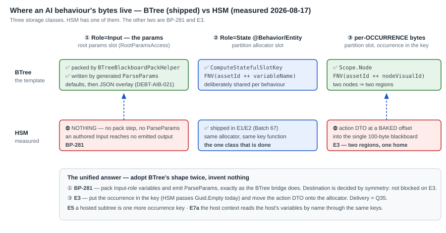

<!--STATUS
state: LIVE
updated: 2026-08-18
current-answer: the whole file
note: section 2 CORRECTS the coordinator - BP-281 is NOT blocked. Read it before
  scheduling anything that assumes it is.
-->
# DESIGN — the HSM storage model *(`2026-08-17`)*

> ⭐⭐⭐ **`BP-281` · `E3` · `E5` · `E7a` are ONE question:** *where do an HSM occurrence's bytes live?*
> ⛔ **Four items that each re-derive it is how this programme has been paying for it.** This document
> answers it once.
>
> 📄 **Subordinate to [`DESIGN_Parameter_Model.md`](DESIGN_Parameter_Model.md)** — that doc wins on any
> disagreement. ⭐ **This adds nothing new to the model; it says where HSM stands against it.**
> 📄 Delivery *(how the occurrence reaches the thunk)* is [`Architect_Question_35`](Architect_Question_35_Hsm_Occurrence_Delivery.md) — ⚠ **still open.**

---

## 1. ⭐ Three storage classes — **HSM has one of them**

📐 **Measured `2026-08-17`.**

| # | class | BTree | HSM |
|---|---|---|---|
| ① | **`Role=Input`** — the params | ✅ packed by `BTreeBlackboardPackHelper` into `BrainBlackboard.BehaviorParameters[100]`, written by the generated `ParseParams` | ⛔⛔ **NOTHING.** No pack step, no `ParseParams` ⇒ **`BP-281`** |
| ② | **`Role=State` @ `Behavior`/`Entity`** | ✅ partition slot, `FNV(assetId ++ variableName)` | ✅ **SHIPPED `E1`/`E2`** — `HsmBridgeEmitCore.EmitStatefulWorkingSlotsArray`, **the same allocator and the same key function** |
| ③ | **per-OCCURRENCE bytes** | ✅ `Scope.Node`, `FNV(assetId ++ nodeVisualId)` ⇒ two nodes, two regions | ⛔⛔ the action DTO sits at a **baked offset into the single 100-byte blackboard** ⇒ **`E3`** |

⭐⭐ **The one class HSM has, it got by adopting BTree's algorithm verbatim.** ⇒ **the other two are the
same move, twice more.** ⛔ **Nothing here needs a new mechanism.**

📌 **Two measurements that make ③ concrete:**
`EmitStatefulWorkingSlotsArray` passes **`Guid.Empty`** for `nodeVisualId` — ⭐ **so even HSM's shipped
slots carry no occurrence** *(correct for ②, which is deliberately shared; ⛔ not for ③)*.
And `BTreeBlackboardPackHelper` skips `Role == State` — ⇒ ⭐ **class ① is exactly the non-State
variables**, which is why ① and ② do not overlap.

---

## 2. ⭐⭐⭐ `BP-281` is **NOT blocked.** *(correcting the coordinator, `2026-08-17`)*

> ⛔ **I pulled it from Batch 74 saying its destination was undecided.** 📐 **Measured: it is decided,
> by symmetry with BTree, and has been all along.**

| | |
|---|---|
| ⭐ **destination** | `BrainBlackboard.BehaviorParameters` at packed offsets — **the same place BTree's inputs live** |
| ⭐ **mechanism** | pack non-`State` variables, emit `ParseParams` **as the BTree bridge does after `DEBT-AIB-021`**: baked defaults first, then the incoming JSON overlays per variable by name, unknown keys ignored |
| ⚠ **the two guards** | ⛔ **emit whenever there is ≥1 packed variable, NOT ≥1 default** *(defect (b))*, and the `JsonSerializerOptions` field carries the same guard *(defect (c))*. ⭐ **Copying the pre-`-021` BTree shape reproduces both** |
| ⛔ **what IS blocked** | ⭐ only the **hosted / multi-occurrence** case — *"which occurrence's params?"* — and that is `E3`, not `BP-281`. **The ROOT behaviour has one params area and always did** |

⇒ ⭐⭐ **`BP-281` can be dispatched immediately.** ⚠ **My pull was right for the wrong reason** — the
user's instinct *"are we building authoring for a not-ready runtime?"* was correct about the **picker**;
`BP-281` is the opposite, **runtime catching up to authoring that shipped years ago.**

---

## 3. `E3` — **the occurrence goes in the key; the DTO moves to the allocator**

| | |
|---|---|
| ⛔ **today** | the generated thunk resolves its DTO at `bb.BehaviorParameters[0] + <baked offset>` ⇒ ⭐⭐ **two concurrently-active regions running one action have ONE HOME BY CONSTRUCTION** |
| ⭐ **the move** | per-occurrence bytes from `BlueprintBlackboardPartitions` under `ComputeStatefulSlotKey(assetId, Scope.Node, occurrence, variableId)` — ⭐⭐ **class ③'s existing algorithm, with HSM's `Guid.Empty` replaced by a real occurrence** |
| ⭐ **ONE path, not two** | ⛔ **do NOT keep the baked-offset path "for the simple case"** — 📄 ruling 9, and ⚠ **the divergence is exactly what made this invisible** |
| ⚠ **delivery is open** | 📄 **`Q35`** — the lean is that the delegate does **not** widen: `HsmCommandWriter` is a kernel struct already passed to every action and can carry `(regionSlotIndex, stateId)` |
| 🔴 **what the occurrence IS** | ⭐ `(regionSlotIndex, stateId)` — ⛔ **region alone aliases** when one region re-enters different states hosting the same action |

---

## 4. `E5` and `E7a` — ⭐ **they are the same mechanism, not new ones**

| | |
|---|---|
| **`E5`** — a state hosts a subtree | ⭐⭐ **a hosted subtree is ONE MORE OCCURRENCE KEY.** 📄 **`Q34` §7 already rules it**: provision **by key**, ⛔ **never through `AttachToEntity`** — a hosted occurrence has no reason to be visible to the registry. ⚠ Still needs `DEBT-AIB-028`(a): `StateNode.SubtreeAssetId` is not persisted |
| **`E7a`** — the host context | ⭐ `IHostVariableAccess` reads the **host's** variables **by name** ⇒ it resolves through **the host's keys**, which are the same keys as everything above. ⛔ **Name-keyed, read-only, `null` for a root, fails closed** — 📄 `DESIGN_Parameter_Model.md` §3.4 |

⇒ ⭐⭐⭐ **Once `E3`'s key carries an occurrence, `E5` is "mint one more" and `E7a` is "look one up".**

---

## 5. ⭐ Sequence — **and what each one unblocks**

| # | item | blocked by | unblocks |
|---|---|---|---|
| **1** | ⭐⭐ **`BP-281`** | ⛔ **nothing** *(§2)* | HSM inputs work at all |
| **2** | 🔴 **`E3`** | ⚠ **`Q35`** *(delivery — a user call)* | ⭐ `E5`, `E7a`, and the per-occurrence half of `BP-281` |
| **3** | **`E5`** | `E3` · `DEBT-AIB-028`(a) | HSM-over-BTree/blueprint composition |
| **4** | **`E7a`** | `E5` | wired params across a host boundary |

---

## 6. ⛔ What this design does NOT change

| | |
|---|---|
| ✅ **class ② stays shared** | `State@Behavior`/`@Entity` are **meant** to be one region per behaviour/entity. ⛔ **Adding an occurrence to their key would be a bug, not an improvement** |
| ✅ **hand-written DTOs are untouched** | 📄 `DESIGN_Parameter_Model.md` §4.2 — a DTO's offsets are **relative to the struct base** ⇒ **same offsets, different instance** |
| ✅ **`StructureHash` / `persistence-shape`** | ⛔ **must not move** — this is runtime storage and thunk text. ⭐ **Batch 73's generated-code tier is what watches it** |
| ⛔ **the 100-byte tail** | interrupts and soft advices have **no relation to params** — 📄 §4.3, user correction. **Carry the params area only** |
