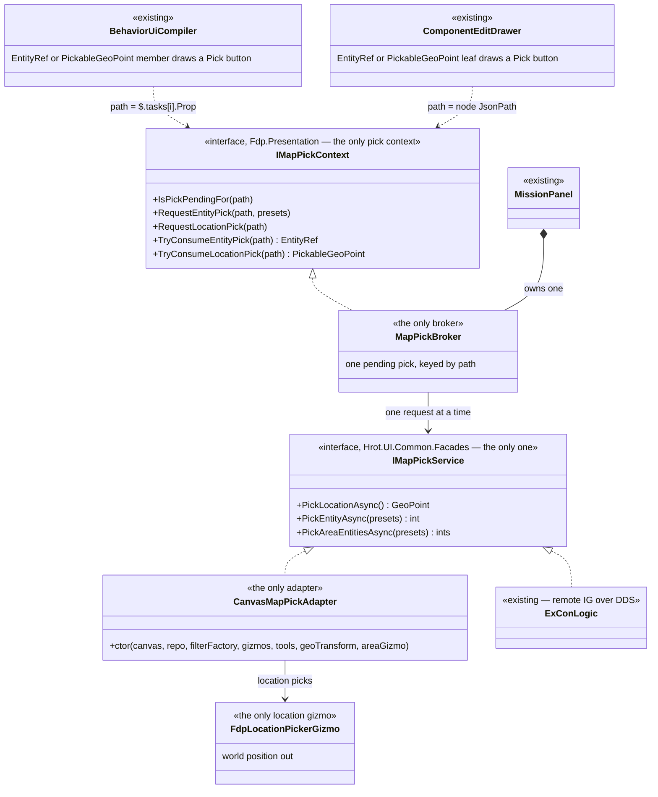
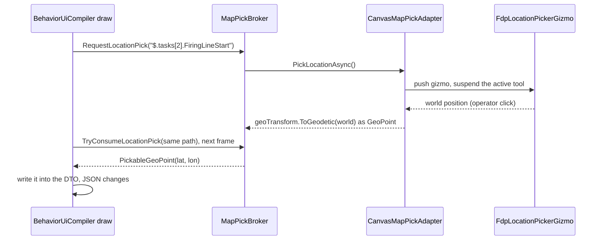
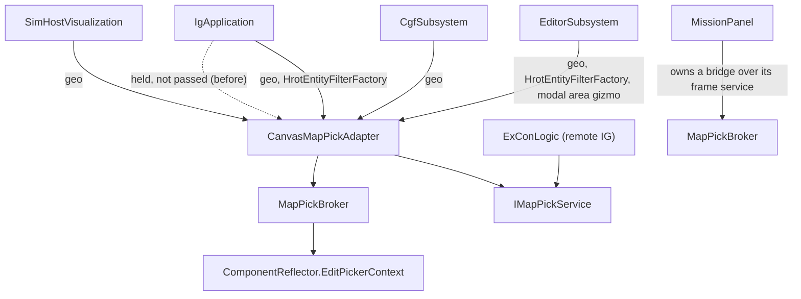

<!--STATUS
state: LIVE
updated: 2026-10-03
build-state: BUILT (2026-10-03 — §5)
current-answer: §2 (diagrams) and §3 (decisions). §1 is the measured inventory; §5 is the as-built.
stale-below: nothing yet.
known-rot: none.
known-conflict: none.
related-designs:
  - DESIGN_Entity_Reference.md — owns the EntityRef TYPE and the rule "the type makes a field pickable"; this document
    applies that rule to locations and collapses the picking machinery underneath it.
  - Architect_Question_55_Watch_Concrete_Entity_Picker.md — flagged two of the duplicates closed here (two
    IMapPickService, two MapPickableEntityAttribute) and ruled the Facades IMapPickService the keeper (Q55-B).
  - ../DESIGN_Cgf_Scenario_Windows_Slice.md — §8 D2 / §10 F1 deferred CE-063 (the two map-pick adapters) pending a
    capability comparison; §1 below is that comparison.
  - ../designs/comp-edit-1/DESIGN.md — §2.1/§2.2 defined the component editor's picker attributes and
    IMapPickContext; their attribute half is superseded here (the type decides), the interface becomes THE one.
-->

# Map picking — one service, one adapter, one context, one gizmo

> 🔒 **User, 2026-10-03:** *"unification is our goal as always, so pls unify rather duplicate whatever you do… keep
> working autonomously."*

## 1. INVENTORY *(measured 2026-10-03 — `search_graph` `.*MapPickable.*` (15), `.*Pick.*Context.*` (42), grep for
every constructor and implementer; a read-only agent compared the two adapters line by line. `check_index_coverage` is
not reachable from the CLI, so absence claims are grep-corroborated, not proven)*

| layer | before | users |
|---|---|---|
| pick **service** | ⛔ 2 × `IMapPickService`: `Hrot.UI.Common.Facades` (3 members) and `Hrot.ExCon.Services` (the same minus `PickAreaEntitiesAsync`), bridged by `ExConMapPickShim` ("temporary … until Phase 6") | Facades: MissionPanel, WatchEntityPicker, ScenarioMissionView, every adapter · ExCon: `ExConLogic` only |
| pick **adapter** | ⛔ 2: `CanvasMapPickAdapter` (IG, CGF, SimHost) and `EditorMapPickAdapter` (editor) — same ctor shape, same `PickerToolHost`, same `EntityPickerGizmo` (**CE-063**) | — |
| location **gizmo** | ⛔ 2, line-for-line identical: `FdpLocationPickerGizmo` (returns the world position) and `LocationPickerGizmo` (converts to geodetic first) | one per adapter |
| per-frame **broker** | ⛔ 2: `MapPickBroker : IMapPickContext` (component editor; jsonPath keys; `EntityRef`/`Vector3`) and `MissionPanel : IPickInteractionContext` (task+property keys; `long`/`PickableGeoPoint`) — the same one-pending-pick state machine written twice | — |
| **attribute** | ⛔ 2 × `MapPickableWorldLocationAttribute` (Toolkits; Fdp.Presentation) — the entity twin was deleted by DESIGN_Entity_Reference | Fdp.Presentation's: no production user · Toolkits': exactly the five `PickableGeoPoint` members |

🔴 **Found while comparing the adapters:** `CanvasMapPickAdapter.PickLocationAsync` returns the world X/Y *in the
latitude/longitude fields* (its header documents it). Every host that builds it (IG `IgApplication.cs:531`, CGF
`CgfSubsystem.cs:1873`, SimHost `SimHostVisualization.cs:369`) holds a geographic transform it does not pass, so a
mission-panel location pick on those hosts writes metres where degrees belong. IG also builds an
`HrotEntityFilterFactory` (`IgApplication.cs:1050`) and does not pass it, so its filter presets are ignored.

## 2. The design

*What the picture shows that prose hid: two parallel stacks — editor and everyone else, mission panel and component
editor — collapse into one column, and the two capabilities that differed (geodetic conversion, the domain filter)
become constructor dependencies that every host already holds.*

*Who builds what — every host passes the geographic transform and the filter factory it already holds (the
silent-default rule); the dashed edges are the dependencies that were held and not passed.*

## 3. Decisions

| # | decision | rejected — one line each |
|---|---|---|
| P1 | ⭐ **one service**: delete `Hrot.ExCon.Services.IMapPickService` and `ExConMapPickShim`; `ExConLogic` implements the Facades interface (area pick answers empty, as the shim did) | keep the shim — two contracts for one capability (AQ55 Q55-B already ruled the keeper) |
| P2 | ⭐ **one adapter** (CE-063): `CanvasMapPickAdapter` gains optional `IGeographicTransform` (location → geodetic) and an area-gizmo factory; the editor builds it with `HrotEntityFilterFactory`, its transform and its modal area gizmo; `EditorMapPickAdapter` and `LocationPickerGizmo` are deleted. Every host passes the transform it holds; IG passes its filter factory | merge toward the shared adapter as it was — silently degrades the editor to metres-as-degrees (the risk CE-063 named) |
| P3 | ⭐ **one location gizmo**: `FdpLocationPickerGizmo` returns the world position; conversion is the adapter's job | two gizmos differing only in a conversion line |
| P4 | ⭐ **one context, one broker**: `IMapPickContext` (string path keys) is the only pick context; `IPickInteractionContext` is deleted. Its consume results are `EntityRef` and `PickableGeoPoint`. `MapPickBroker` is the only broker; `MissionPanel` owns one over its per-frame service instead of its own pending-pick fields | keep two interfaces with an adapter between them — the state machine would still exist twice |
| P5 | ⭐ **the type makes a field pickable, for locations too**: `PickableGeoPoint` gets the Pick-Map button in the mission panel, the component editor and the agent schema; `MapPickableWorldLocationAttribute` (both copies) is deleted | keep the attribute — it marks exactly the members of that type, so it says nothing the type does not |

## 4. Design docs checked

`DESIGN_Entity_Reference.md` D5 — applies, the rule this extends · `Architect_Question_55` — applies, Q55-B names the
keeper service and flags the duplicates · `DESIGN_Cgf_Scenario_Windows_Slice.md` §8 D2 / §10 F1 — applies, it asked
for exactly the capability comparison in §1 before merging · `comp-edit-1/DESIGN.md` §2.1/§2.2 — applies, its
attributes are superseded and its interface is kept as the one · `UX_Feature_Tool_Model.md` (lists each adapter's
gizmos) — applies as history, no ruling.

## 5. As-built *(2026-10-03)*

| decision | as built | deviation |
|---|---|---|
| P1 | `Hrot.ExCon/Services/IMapPickService.cs` and `ExConMapPickShim` deleted; `ExConLogic : Hrot.UI.Common.Facades.IMapPickService` (area pick answers empty); `IExConLogic.MapPickService` is the shared type; `ExConMock` hands `_logic.MapPickService` to the mission panel | — |
| P2 | `CanvasMapPickAdapter` gains `geoTransform` and `areaGizmo`; a location pick converts through the passed transform, else the world's `IGeographicTransform` singleton (SimHost publishes one and holds no field), else returns world X/Y as before. Editor: built with `HrotEntityFilterFactory`, its transform and `ModalBoxSelectionGizmo`. IG: passes its filter factory and transform. CGF: passes its transform. `EditorMapPickAdapter` deleted; its tests moved onto the shared adapter | ⭐ the world-singleton fallback was added so SimHost needs no new field — the singleton is the same one behaviour resolvers read |
| P3 | `LocationPickerGizmo` deleted; `FdpLocationPickerGizmo` is the one | — |
| P4 | `IPickInteractionContext` deleted. `IMapPickContext` is the one context (entity → `EntityRef`, location → `PickableGeoPoint`); `MapPickBroker` is the one broker (a fixed service, or one read at request time); `MissionPanel` owns one over its frame service and passes it to `BehaviorUiCompiler`, which keys `$.tasks[i].Prop` (`BehaviorUiCompiler.PickPath`). The panel's pending-pick fields, `PollPickCompletion`, `HandlePickLocation/Entity` and `TestHook_PollPickCompletion` are gone | — |
| P5 | `MapPickableWorldLocationAttribute` (both copies) deleted. `BehaviorUiCompiler`, `ComponentEditDrawer` and `DtoJsonSchemaExtractor` key on `PickableGeoPoint`; `PickableLeafFieldEditor(Type)` collapses `EntityRef` OR `PickableGeoPoint` into one leaf (it replaced the step-1 `EntityRefFieldEditor`) | — |
| + | **Watch entity picker, one implementation:** `WatchEntityIdentity.PickerOver(pick)` turns a map pick into a concrete binding; the editor's private `PickWatchEntityBindingAsync` is deleted and CGF — which holds the adapter — now passes the same picker. ⛔ SUPERSEDED: CGF's comment "EntityPicker is deliberately ABSENT … `IMapPickService` lives in `Hrot.ExCon`" (it lives in Facades and CGF builds it) | found while unifying; same family |

*Renamed `2026-10-04` (user: "more intuitive names are of course better"), through Roslyn:* `IComponentPickerContext` → `IMapPickContext`, `MapPickServiceBridge` → `MapPickBroker`, the hosts' `_mapPickBridge`/`GetMapPickBridge()`/`PickBridge` → `…Broker`; tests named after deleted classes → `MapPickAdapterTests`, `IMapPickContextTests`, `EntityRefJsonRemapTests`. Older documents keep the old names as history.

*Rails:* `AdapterTests` A004 (moved onto the shared adapter) + `PickLocationAsync_IsGeodetic_ThroughTheHostTransform` + `PickLocationAsync_FallsBackToTheWorldsTransformSingleton` · `ComponentEditDrawerTests.P5_APickableGeoPointField_IsOneLeaf_AndALocationPickLandsInTheComponent` · `MissionPanelRegistryTests` (the panel picks through the broker; path-keyed; once-only consume; no frame service ⇒ ignored) · `BehaviorUiCompilerTests` (asks the context for `$.tasks[0].TargetNetworkId`) · `PresentationAttributeTests` C008 SC2 (only the `PickableGeoPoint` member is pickable).
