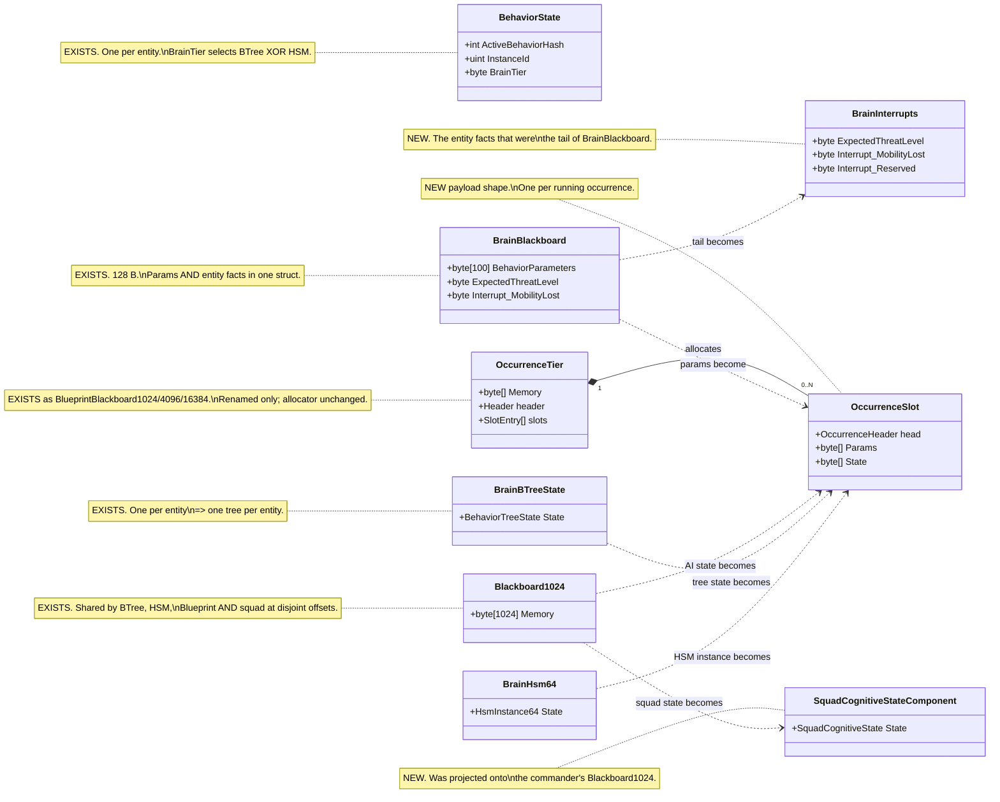
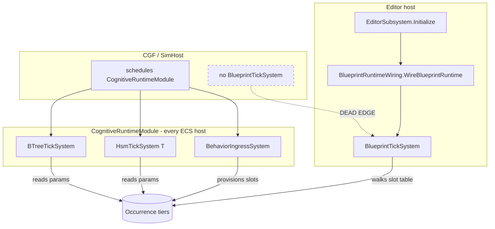
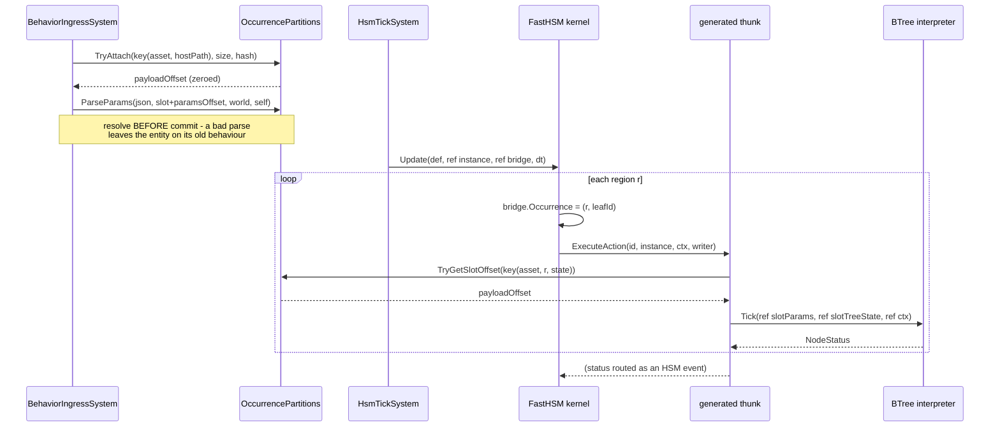

<!--STATUS
state: LIVE
updated: 2026-09-19
build-state: DESIGN
current-answer: the whole document. §4 is the ExtDeps justification; §6 is the sequence.
stale-below: nothing.
known-rot: none at authoring time.
known-conflict: none. This document EXTENDS DESIGN_Parameter_Model.md §4 rather than
  overturning it; where they disagree, DESIGN_Parameter_Model.md wins and this file is wrong.
related-designs:
  - DESIGN_Parameter_Model.md — owns WHAT a parameter is, the {Input,State} role model, the
    one-resolver rule and the "params belong to the occurrence" ruling. This document owns
    WHERE the bytes live and HOW an occurrence is addressed.
  - EXPLAINER_Where_Parameters_And_State_Live.md — owns the file:line measurement record of
    the current storage map. This document owns the target map.
  - Architect_Question_34_Blueprint_Occurrence_Identity.md — owns blueprint Instance slot
    identity (attach the same asset twice). This document owns the behaviour-side occurrence.
  - Blueprint_Subsystem_Runtime_Detailed_Design.md §4–§5 — owns the partition allocator's
    header, slot entry and free-list contract. This document does not change that contract.
  - docs/designs/btree-hsm-unif/DESIGN.md — owns hot reload, terminal-state routing and the
    interrupt path across the two paradigms. It does NOT cover storage; nothing in it moves here.
-->
# DESIGN — occurrence-scoped storage

> **The goal, in one sentence.** Let one entity run an HSM (strategic), a BTree hosted inside an
> HSM state (tactical), and blueprints as their actions and conditions — concurrently, including
> across parallel HSM regions — by making **the occurrence, not the entity, the unit that owns
> memory**.
>
> **This is not a new mechanism.** The allocator exists, is production-proven, and one of the three
> behaviour systems already runs entirely on it. The work is adoption, plus one small and
> well-bounded change inside `FastHSM`.

---

## 1. INVENTORY

Graph first, grep to corroborate; neither alone settles an exhaustive claim.

| query | tool | result |
|---|---|---|
| complete set of tick systems | `search_graph(".*TickSystem.*", label=Class)` | **10, `has_more:false`** — 6 production: `BTreeTickSystem`, `HsmTickSystem`, `BlueprintTickSystem`, `PlaybackTickSystem`, `RecorderTickSystem`, `CommanderUtilityTickSystem` |
| the storage components | `search_graph("^(BrainBlackboard\|Blackboard1024\|BrainBTreeState\|BrainHsm64\|BrainHsm128\|BehaviorState)$")` | **23, `has_more:false`** — one component each per entity |
| the allocator | `search_graph(".*BlueprintBlackboard.*")` | `BlueprintBlackboardPartitions` + `BlueprintBlackboardHeader` + 3 tier components + `BlueprintBlackboardTiers` |
| `BlueprintTickSystem` production construction | `search_code("new BlueprintTickSystem")` → `trace_path(WireBlueprintRuntime, inbound)` | **1 production site**, reached only from `EditorSubsystem.Initialize` + the two Stride editor boots |
| `NodeType.Subtree` execution | `search_code("NodeType.Subtree", limit=60)` | one kernel site — `Interpreter.ExecuteNode` (`:229-231`), returns `Failure` |
| `ExecuteAction` call sites | `search_code("ExecuteAction(")` | `HsmKernelCore.ExecuteAction` (`:762-782`); 5 internal callers — `InitializeSlot:306`, `ProcessActivityPhase:450`, `ExecuteTransition:683,698,730` |
| consumer file set | `scripts/find.sh BrainBlackboard --glob '*.cs'` · same for `Blackboard1024` | **⚠ both graph pages TRUNCATED at the 500-match cap.** Counted from grep instead: **75** production files touch `BrainBlackboard`, **52** touch `Blackboard1024` (excluding tests, `obj/`, generated) |

**Coverage:** `check_index_coverage` over the four behaviour/kernel scopes → `no_recorded_issue`,
index generated `2026-09-18 20:36Z`, `index_mode: full`, `generation_matches: true`. Best-effort,
never proof of completeness.

⚠ **Two claims deliberately NOT re-measured here**, carried from `BP-297` and flagged as inherited:
*"zero DTO-bound HSM thunks exist in any binary"* and the 55-method `[HsmAction]` census. The
attribute sweep truncated at 150 of 173 results. **§6 does not depend on either.**

---

## 2. The structure

### 2.1 As-is vs to-be



**What the picture shows that prose hid:** `BrainBlackboard` and `Blackboard1024` are each **two
unrelated things in one struct**. Splitting them by *lifetime* — entity fact vs occurrence state —
is what makes the migration tractable, and it is why "delete both components" is the wrong framing:
two of the four outgoing edges go to new **named** components, not to slots.

### 2.2 Who ticks what, on which host



**Caption — what only this diagram shows, stated precisely.**

⭐ **Blueprints DO run on CGF — in their other mode.** A blueprint whose `Dispatch == AiPrimitive`
compiles into a BTree/HSM **action or condition** and executes inside the behaviour thunk, driven by
`BTreeTickSystem`/`HsmTickSystem`, which CGF schedules. That is the mode the shipped CGF content
uses, and nothing here is wrong with it.

🔴 **Blueprint *Instances* are the half that is broken, and it is a HALF-WIRED state rather than an
absent one.** `CgfSubsystem:1004` calls `BlueprintGenesisRuntimeRegistration.RegisterBlueprintGenesisSystems`,
which registers **`BlueprintMaterializationSystem`** (resolves `InitialBlueprintsIntent` from scenario
state and **pre-provisions the tier**) and **`BlueprintEventIngressSystem`** (attach/switch by event).
Neither is the tick system. The only production code that constructs and schedules
`BlueprintTickSystem` is `BlueprintRuntimeWiring.WireBlueprintRuntime` + `SpliceIntoSimulation`,
called from **`EditorSubsystem.Initialize:1585/1595` and nowhere else** (the integration `EditorHarness`
is the only other caller).

⇒ **CGF attaches Instances, allocates their slots and dispatches their attach/switch events — and
never ticks them.** That is worse than missing: it looks wired. Scheduling twin of the registration
gap that crashed `--mode all` on `2026-09-03` (recorded in `BlueprintBlackboardTiers`' own header).
**Independent of everything else here** — item `O0`.

### 2.3 Activating and ticking a nested occurrence



**Caption.** The only new information crossing the ExtDeps boundary is the single
`bridge.Occurrence = (r, leafId)` write. Everything below it — key, lookup, params base, tree state —
is resolved on our side of the line.

---

## 3. The model

**An occurrence is a running instance of an asset on an entity.** Its identity is
`(assetId, hostPath)`, where `hostPath` is the chain of `(hostOccurrence, siteId)` pairs from the
root. A root behaviour has an empty host path. This is not a new key function:
`ComputeStatefulSlotKey(assetId, scope, nodeVisualId, variableId)` already puts an occurrence
discriminator into the slot table's `BlueprintId` field, and `Q34 §7` measured that the field is
**already polymorphic** — blueprint ids and stateful slot keys coexist in one table, correctly.

**Slot payload:** `[OccurrenceHeader][Params P][State S]`. `DESIGN_Parameter_Model.md` §3.3 already
rules that params must not sit at offset 0 for blueprint Instances (the 16-byte
`BlueprintLatentCursor` lives there); the header generalises that reservation.

**Why every thunk survives.** `NodeLogicDelegate<TBlackboard, TContext>` is generic and the
interpreter never touches the blackboard's members — measured at `Interpreter.ExecuteAction`
(`:643-671`), which calls `actionDelegate(ref bb, ref state, ref ctx, node.PayloadIndex)` and
nothing else. A `[SharedAiAction]` thunk bakes only the **field** offset within the DTO, so it is
valid wherever that DTO lives. Same offsets, different base.

### 3.1 ⭐⭐ Hosting one graph inside another ALREADY SHIPS — and it is the template

⛔ **Correction to an earlier reading of mine: `NodeType.Subtree`'s `Failure` stub is NOT how BTree
hosts a BTree, and BTree-hosts-BTree is not a missing feature.** Measured:

- `BTreeEmitCore.EmitSubtree` (`:858-865`) emits `.Subtree("Name", …)` into the fluent builder;
- `BTreeOrchestratorEmitCore` (`:135-176`) generates a **`[BTreeAction] Orchestrate_<Sub>_Tick`**
  whose whole body is
  `ref var subBb = ref master.<VarName>; return <Sub>.GetInterpreter().Tick(ref subBb, ref state, ref ctx);`
  — with an *Approach B* variant that does **COPY IN → tick → COPY OUT** over `SubtreeSyncBindings`.

⇒ ⭐⭐⭐ **Subtree hosting is implemented as "an action that ticks the child interpreter inline,
handing it its own blackboard."** That is *exactly* the mechanism HSM-hosts-BTree needs. The child's
blackboard is a **compile-time slice of the master's** (`master.<VarName>`), so this design's
migration is *"replace the compile-time slice with an allocated slot"* — a narrowing of an existing
mechanism, not a new one. ⛔ **Nothing here removes, deprecates or reroutes it.**

🔴 **But it exposes a live defect of precisely this document's shape.** The generated orchestrator
ticks the child with **`ref state` — the MASTER's `BehaviorTreeState`**. The hosted occurrence has
**no runtime state of its own**: `RunningNodeIndex` and the local registers are shared between host
and child. With one child at a time and no suspension it mostly survives; with two hosted children,
or a child left `Running` while the host advances, host and child overwrite each other. **This is the
BTree twin of the HSM two-region collision, and it is in shipped code today.** `O4` fixes it by
giving the hosted occurrence its own `BehaviorTreeState` in its own slot — which is the same
machinery `O8` needs, so the fix and the feature are one piece of work.

⚠ **The `NodeType.Subtree` kernel stub is a separate, unused path.** It is not what ships, and this
design does not touch it; whether it is ever implemented or deleted is out of scope here.

---

## 4. ExtDeps — what must change, and why it cannot live anywhere else

> The standing rule: an ExtDeps edit needs a reason of the form *"this information exists only
> here"*, not *"this is where it was convenient to patch."*

### 4.1 FastBTree — **no change at all**

| candidate | verdict |
|---|---|
| `Interpreter<TBlackboard,TContext>` | ⛔ **no change.** The type argument is supplied by the caller and the kernel never reads the blackboard's members (`Interpreter.cs:643-671`). Pointing a tree at slot-resident params is a change to **our** call site and **our** generator |
| `BehaviorTreeState` | ⛔ **no change.** It moves from a component field to a slot payload field; the struct is unmodified |
| `NodeType.Subtree` stub (`Interpreter.cs:229-231`) | ⚠ **deliberately left alone for now** — see `Q1` in §8. Hosting a tree under an HSM state does **not** need it; it is BTree-hosts-BTree, a different axis |

### 4.2 FastHSM — **one change, and here is why it belongs there**

The occurrence — region index `r` and active state `current` — exists **only inside
`HsmKernelCore`'s own loops** (`ProcessActivityPhase:436-454`) and is discarded at the private
`ExecuteAction` wrapper (`:762-782`), which forwards `(actionId, instancePtr, contextPtr, writerPtr)`
and nothing else. The context struct is built **once per entity per tick**, before the region loop
starts. **No amount of work on our side can recover which region is executing.** That is the
justification: the fact is created in ExtDeps and is destroyed in ExtDeps.

| option | ExtDeps delta | verdict |
|---|---|---|
| **(a)** widen `HsmActionDispatcher.ExecuteAction` + the thunk delegate to carry `r` | signature change to `delegate*<void*,void*,HsmCommandWriter*,void>` ⇒ **ABI break** reaching every attributed method and all five thunk emitters (`BP-291`'s census) | ⛔ **rejected** — pays a full ABI break to move 4 bytes |
| **(b)** kernel writes the occurrence into the **context** it already carries | ① one new 4-byte `HsmOccurrence {ushort RegionIndex; ushort StateId;}` in `Fhsm.Kernel.Data`; ② a documented contract that `TContext` begins with it; ③ `in TContext` → `ref TContext` on `HsmKernel.Update`/`UpdateBatch`; ④ five assignments in `HsmKernelCore` | ✅ **CHOSEN.** Additive. **No delegate change, no thunk signature change** — every existing `[HsmAction]` keeps compiling |
| **(c)** kernel writes the occurrence into the **instance** header | `InstanceHeader` is `Size=16` and **fully packed** (offsets 0–15, measured) ⇒ growing it shifts `ActiveLeafIds` at offset 16 in every tier | ⛔ **rejected** — changes every instance layout to avoid a context field |
| **(d)** reuse `HistorySlots` scratch | documented "dual-purpose… simple counters/flags" | ⛔ **rejected** — overloads persistent state with a per-call value; silent corruption if a machine uses history |

**The precedent that makes (b) the house pattern, not an invention.** `HsmTraceContext*` is already
threaded from the kernel entry through `ProcessActivityPhase` into `ExecuteAction` purely to serve an
Hrot diagnostic concern (`behav-diag-1`). `HsmKernelBridge` — the struct behind `contextPtr` — is
**ours**, in `Fdp.Toolkits` (`HsmTickSystem.cs:24-36`), and already carries `Self`, `WorldHandle` and
`TraceContext*`. Option (b) adds one more field to a struct we own and four assignments to a kernel
that already threads two such pointers.

⚠ **Two honest caveats on (b).** ① `HsmKernel.Update` declares the context `in` and pins it with
`fixed`; writing through the resulting pointer violates that contract in spirit, so the entry point
changes to `ref` rather than relying on the pointer being physically writable. ② `UpdateBatch` shares
**one** context across a `Span` of instances — safe only because the kernel processes instances
sequentially on one thread. That assumption becomes a rail (§7).

### 4.3 Explicitly NOT changing

`HsmCommandWriter` · `HsmEventQueue` · the tier instance layouts · `BehaviorTreeState` ·
`HsmDefinitionBlob` · the `[HsmAction]`/`[HsmGuard]`/`[SharedAi*]` attribute shapes ·
`HsmActionDispatcher`'s tables and signatures.

---

## 5. Blast radius

75 production files touch `BrainBlackboard`, 52 touch `Blackboard1024`. They are not one problem —
they are seven, and only two are large.

| # | consumer class | files | what it needs | size |
|---|---|---|---|---|
| **1** | **squad / commander state** — `SquadCognitiveState`, `SquadInputs`, `StandardInputs`, 4 squad systems, `ForceManeuverMapper`, `ThreatMatrixAssignmentSystem`, the overlay | ~12 | ⭐ **nothing to do with occurrences.** `SquadCognitiveState.Project(ref bb)` projects the **commander's whole** `Blackboard1024` ⇒ it is entity-scoped and wants its own typed component | **S — do it first, independently** |
| **2** | **entity facts** — `CognitiveInterruptSystem`, `CognitiveCleanupSystem`, `RouteContextSystem`, `HsmTickSystem:168`, `BlackboardOffsets` | ~6 | the `BrainBlackboard` tail becomes `BrainInterrupts`. ⚠ **`R-41`/`R-39` pin byte offsets 126/127 and the param-region size — both ledger rows need updating**, not silently invalidating | **S** |
| **3** | **behaviour runtime** — `BehaviorIngressSystem`, `BehaviorRegistry`, the two tick systems, `BTreeActionRegistryFactory` | ~6 | the real work: key, allocate, resolve into the slot, tick against it | **L** |
| **4** | **generators / emitters** — `BTreeBridgeEmitCore`, `BTreeEmitCore`, `HsmBridgeEmitCore`, `BTreeBlackboardPackHelper`, `AiEmitCoreBase`, the two analyzers | ~8 | emit a slot lookup instead of a fixed component projection. **Mechanical but must be exact** — the registry key is `Method@byteOffset` | **M** |
| **5** | **blueprint compiler** — `AiPrimitiveEmitter`, `InlineActionLowering`, `CSharpEmitter`, `WorkingStateLayout`, `IrOperation`, `BlueprintCompilerContracts` | ~6 | ⭐ **this is the half the user flagged.** A blueprint reaches params two ways: as an AiPrimitive action (via the thunk — follows class 4) **and** as an Instance (already slot-resident). `FieldLayout`'s `startOffset: 0` is the one real trap | **M** |
| **6** | **editor / diagnostics / replay** — renderers, view providers, `BlackboardReflection`, `LiveBlackboardValueProvider`, `BlueprintDebugSession`, `VariableEditCommit`, `BlueprintLiveValueWriter`, `PredicateCompiler`, 2 field drawers, `SearchPredicateDto.BlackboardTarget` | ~15 | every one resolves *"where are this entity's params"* — they need the same `TryResolveOccurrence` seam, **once**, not 15 times. ⚠ `R-52`'s live corruption defect (whole-component staged write) is fixed for free by per-slot writes | **M** |
| **7** | **scenario translators** — `BrainBlackboardTranslator`, `Blackboard1024Translator` | 2 | ✅ **measured harmless.** Both are scenario/clipboard **extract-only** with `Inject` a documented no-op, over `[DataPolicy(NoScenario)]` components. **Not DDS translators** ⇒ **no wire format change, no `R-136` exposure** | **XS** |

---

## 6. Sequence

Ordered so that each step is provable on its own and the expensive irreversible one comes last.

| # | item | why here | ExtDeps |
|---|---|---|---|
| **O0** | **Re-home `BlueprintTickSystem` into a module every ECS host schedules** | independent of everything else; until it lands, blueprint Instances are editor-only and the tripod has no third leg on CGF | — |
| **O1** | **`SquadCognitiveState` gets its own component** | removes the largest non-AI consumer of `Blackboard1024`; pure win even if the rest is cancelled | — |
| **O2** | **Split `BrainBlackboard` → `BrainInterrupts` + a params region type** | the params region becomes addressable; the tail stops travelling with it. Updates `R-39`/`R-41` | — |
| **O3** | **The occurrence seam** — `OccurrenceKey`, `TryResolveOccurrence`, the slot header; rename the tiers | one lookup that classes 4/5/6 all call. **No behaviour changes yet** | — |
| **O4** | **BTree onto occurrence storage** — tree state and params into slots, **including a hosted subtree's own `BehaviorTreeState`** | ⭐ **proves the whole model with ZERO ExtDeps change** (§4.1) **and closes the shared-`BehaviorTreeState` defect in §3.1**. If this does not work, stop before paying for `O6` | **none** |
| **O5** | **Blueprint Instances take params** (`DESIGN_Parameter_Model.md` §3.3) | the slot layout is now shared with `O4`; closes `R4`, which has no design today | — |
| **O6** | **`HsmOccurrence` in the kernel** (§4.2 option b) | the one ExtDeps change, paid **once**, after `O4` has proved the storage model | **the only one** |
| **O7** | **HSM per-region actions key on the occurrence** — closes `BP-297`/`E3` | needs `O6` | — |
| **O8** | **BTree hosted under an HSM state** — the strategic/tactical composition | needs `O3`+`O6`; the child is just another occurrence | — |

⭐ **`O0`–`O5` deliver real value with no ExtDeps edit at all.** The boundary is crossed once, at
`O6`, and only after `O4` has demonstrated the model on the paradigm that needs no kernel change.

---

## 7. Rails

| rail | asserts |
|---|---|
| **two occurrences, distinct bytes** | the same asset twice on one entity ⇒ different param bytes. This is `DESIGN_Parameter_Model.md` §8's rail and it is what stops the shared-region assumption returning |
| **the tail is untouched** | resolving params for any occurrence writes neither interrupt byte nor `ExpectedThreatLevel` |
| **cursor intact** | a blueprint Instance with params keeps its `BlueprintLatentCursor` at offset 0 after a resolve — the `startOffset: 0` trap |
| **parse before commit** | a failing resolve at attach leaves the entity without the new occurrence |
| **two regions, two slots** | two concurrently-active HSM regions running the same action write **different** bytes. ⚠ `BP-297` measured that today's fixture cannot redden this — the two regions run an **empty** action. **A DTO-bound HSM action must be authored as part of `O7`, or the rail is vacuous** |
| **one context per instance** | `UpdateBatch` with N instances: each `ExecuteAction` sees the occurrence of *its* instance (§4.2 caveat ②) |
| **a hosted subtree keeps its own cursor** | host tree `Running` at node A, hosted child `Running` at node B ⇒ **both survive a tick**. ⛔ Must be written to go RED before `O4` — it reproduces the §3.1 defect in shipped code |
| **every host ticks blueprints** | a `--mode all` run shows a blueprint **Instance** advancing on CGF, not only in the editor (`O0`). ⚠ Anti-vacuity: CGF already materialises and event-attaches Instances, so the rail must assert the *tick counter advances*, not that the slot exists |
| **one supply mechanism** | unchanged from `DESIGN_Parameter_Model.md` §8 — a second `Overrides`-style applier fails it |

---

## 8. Open questions

| id | question | lean |
|---|---|---|
| **Q1** | ~~Does `NodeType.Subtree` come with this?~~ **WITHDRAWN — the question was wrong.** See §3.1 | ✅ **BTree-hosts-BTree SHIPS and is KEPT.** `O4` improves it |
| **Q2** | ~~The shared event queue is unmeasured for cross-region hazards~~ | ✅ **MEASURED — see §9. Five hazards, four of them structural.** None blocks `O0`–`O7`; **H1–H3 block `O8`** and are dispatch semantics, not storage |
| **Q3** | Rename `BlueprintBlackboard*`, given it already stores BTree/HSM state | ✅ **names proposed — see §10.** Roslyn-driven, off the critical path |
| **Q4** | ~~Does the root brain stay exclusive once nesting works?~~ | ✅ **RULED, user, `2026-09-19`, verbatim: *"there is still just up to one assignable behavior per entity."*** `BehaviorState` stays singular; `InstanceId` preemption and `ChannelArbitrationSystem` are untouched. Concurrency comes from nesting, never from a second assignable root |

---

## 9. The shared event queue — measured (`Q2`)

⭐⭐ **Headline: the hazards are real and structural, but they are DISPATCH SEMANTICS, not storage.**
They live entirely inside `HsmKernelCore` and `HsmEventQueue`, they would exist with or without this
design, and **none of them blocks `O0`–`O7`.** Three of them block `O8`.

### 9.1 The five hazards

| # | hazard | measured at | bites when |
|---|---|---|---|
| **H1** | 🔴🔴 **ONE region consumes the event; the others never see it.** `SelectTransition` scans every region and returns **a single** best transition (`:564-610`); `ExecuteTransition` fires it; then `ProcessRTCPhase` sets `currentEventId = 0` — *"Event consumed"* (`:517`) — and the loop continues with epsilon transitions only. ⛔ **UML orthogonal-region semantics require the event to be offered to EVERY region**, each firing independently | `HsmKernelCore.cs:497-518`, `:564-610` | **any** event that two regions both have a transition for |
| **H2** | 🔴 **Priority arbitration is GLOBAL, not per-region.** `bestTransition` is chosen by `priority > highestPriority` **across all regions** (`:592`) ⇒ a low-priority transition in region 0 loses to a high-priority one in region 1, and (via H1) region 0 then loses the event entirely | `:588-600` | any two regions with different transition priorities on one event |
| **H3** | 🔴 **A GLOBAL transition always reports region 0.** `SourceStateIndex = activeLeafIds[0]` unconditionally (`:551`) and `regionIndex` stays at its `0` initialisation (`:538`) — it is only assigned inside the per-region loop (`:599`). ⇒ a global transition fired while >1 region is active rewrites **region 0's** leaf and leaves the others untouched. ⚠ **This is the surviving half of the bug the `:747-749` comment says was fixed** *("a transition fired in region 1 used to overwrite region 0's leaf… corrupting two regions with one event. Harmless while regionCount == 1, which is why it survived")* — fixed for per-region transitions, **still live for global ones** | `:538`, `:551`, `:747-750` | any global transition on a multi-region machine |
| **H4** | ⚠ **The queue is sized by LEFTOVER BYTES, not by the region count — at every tier.** `HsmInstance128`: **4 regions, 4 timers, 1 interrupt slot + a 1-slot ring** ⇒ 2 events. `HsmInstance256`: **8 regions, 8 timers, ring 5** ⇒ 6. ⛔ **Every tier has `ring < regions`.** ⇒ **`ProcessTimerPhase` loops all timers and `FireTimerEvent` enqueues one each — 4 expiring timers on a 128 = 2 enqueued, 2 lost.** ⚠ **CORRECTION to an earlier wording of this row:** Tier2/Tier3 **REJECT** on a full ring (`EnqueueTier2:262` returns `false`); it is `HsmInstance64`'s header that documents *eviction*. Either way the event is gone — but 🔴 **`FireTimerEvent:368` discards `TryEnqueue`'s bool**, so the loss is silent, untraced and unlogged | `HsmEventQueue.cs:11-27`, `:249-265`; `HsmKernelCore.cs:335-350`, `:361-369` | N regions or N timers on one tick — i.e. normal operation for a multi-region machine, not an edge case |
| **H5** | ⚠ **Drain order decides the winner.** `ProcessEventPhase` drains up to `MaxEventsPerTick = 10`, each through a full RTC pass. Deterministic, but with H1 the queue order silently determines which region acts | `:381-392` | any multi-event tick |

⭐ **Timer events are not exempt:** `FireTimerEvent` enqueues into the same shared queue, so H1 and H4
apply to timers too — even though `TimerDeadlines[]` is itself per-slot.

### 9.2 ⭐ What is already right, and it is the shape of the fix

`ArbitrateOutputLanes` runs **only when `RegionCount > 1`** (`:645-647`). ⇒ **the OUTPUT side already
has region arbitration; it is the INPUT side that has none.** The fix has a precedent in the same
file: offer the event to each region, collect at most one transition **per region**, execute them,
and let the existing output-lane arbiter resolve conflicting effects.

### 9.3 Consequence for this design

| | |
|---|---|
| ⭐⭐ **`O0`–`O7` are unaffected** | they change **where bytes live**. H1–H5 are about **which region gets an event**. No dependency either way |
| ⛔ **`O8` (BTree hosted under an HSM state) needs H1 fixed** if two regions are meant to host trees concurrently — otherwise one hosted tree stops receiving the events that drive it | |
| ⚠ **H4 is a capacity decision, not a bug** | see §9.4 — the answer is **allocate a bigger slot payload**, which arrives with `O7`. ⛔ Not a new component |
| 🔒 **This is a SEPARATE ExtDeps change from §4.2** | it must be justified on its own terms — *"orthogonal-region event dispatch is wrong"* — and **not** smuggled in as part of the storage work. ⛔ Exactly the failure mode the standing ExtDeps rule exists to prevent |

### 9.4 The tiers — what they give, and who chooses

| | `HsmInstance64` | `HsmInstance128` | `HsmInstance256` |
|---|---|---|---|
| regions | 2 | **4** | **8** |
| timers | 2 | 4 | 8 |
| history / scratch | 2 | 8 | 16 |
| **events in flight** | **1** *(single shared slot)* | **2** *(1 interrupt + ring 1)* | **6** *(1 interrupt + ring 5)* |
| ECS wrapper | `BrainHsm64` | `BrainHsm128` | 🔴 **none** |

⭐ **Interrupts are safe at every tier** — the reserved interrupt slot cannot be crowded out by normal
traffic (`EnqueueTier2:238-247`), so `MobilityLost`-class interrupts always land. **It is normal and
timer traffic that is tight.**

#### 🔴 Who chooses the tier: **nothing does — it is hard-coded to 128**

📐 Measured. `BehaviorTkbTranslator.cs:118-122` is the only production attach:

```csharp
else if (dto.BrainTier == BehaviorConstants.BrainTierHsm)
    if (registered && !has) repo.AddComponent(entity, new BrainHsm128());
```

⇒ **every HSM entity gets 128, regardless of what its machine declares.** `BrainHsm64` is
*registered* (`CognitiveComponentRegistry:47`) and *ticked* (`CognitiveRuntimeModule:65`) and
`BehaviorIngressSystem.ResetHsmComponents:748` handles it — but **every `new BrainHsm64()` in the
tree is in a test** (measured: 14 lines, 6 files, all `*.Tests`). There is no production path that
selects a tier, so "the tier system" is currently one tier with two unused neighbours.

⭐ **The selector already exists in the data:** `definition.Header.RegionCount` is read by the kernel
(`:172`, `:645`). A machine's compiled blob knows how many regions it has, so the attach can size the
instance instead of guessing.

#### ⛔⛔ CORRECTION — **there is no `BrainHsm256`, because after `O7` there is no `BrainHsm*` at all**

🔒 **User, `2026-09-19`:** *"i thought the HSM state will be also allocated as occurrence so why would
we need a component for it?"* — **correct, and §9.4's first draft contradicted §2.1 of this very
document.** The classDiagram already says `BrainHsm64 ..> OccurrenceSlot : HSM instance becomes`.

📐 **And the kernel agrees — measured.** `HsmKernelCore` is `internal` and `UpdateBatchCore` already
takes exactly `(definition, void* instances, int count, int instanceSize, void* ctx, float dt,
CommandPage*, HsmTraceContext*)`. **Every public `HsmKernel.Update<TInstance,TContext>` overload is a
thin generic wrapper** that does `fixed (TInstance* instPtr = &instance)` and passes
`sizeof(TInstance)` (`HsmKernel.cs:82-104`). ⇒ ⭐⭐⭐ **the kernel wants a POINTER AND A SIZE, not a
component type.** The generic wrapper exists only to pin a managed `ref`. `HsmEventQueue.TryEnqueue`
likewise switches on `int size`, not on a type.

⇒ ⭐⭐ **The tier stops being a TYPE and becomes a PAYLOAD SIZE**, chosen at attach from
`definition.Header.RegionCount`:

| | before `O7` | after `O7` |
|---|---|---|
| where the instance lives | `BrainHsm64` / `BrainHsm128` component | a slot in the entity's occurrence store |
| how the tier is chosen | ⛔ hard-coded 128 | ⭐ `TryAttach(key, sizeFor(Header.RegionCount), …)` |
| getting 8 regions / 6 events | needs a **new component + id + registration + tick registration** | ⭐ **free** — allocate 256 bytes instead of 128 |
| `BrainHsm64` / `BrainHsm128` | exist | ⭐ **deleted** |

⇒ ⛔ **Do NOT create `BrainHsm256`.** It would be a new component, a new `GlobalComponentIds` entry
and a new tick registration that `O7` then deletes. The capacity answer is *"allocate the bigger
payload"*, and it arrives with the occurrence work rather than ahead of it. ⚠ The only reason to
build it anyway would be needing 8 regions **before** `O7` lands — and multi-region HSM needs **H1**
fixed regardless, so there is no such urgency.

⭐ **This also subsumes a second recorded problem.** `docs/designs/btree-hsm-unif/DESIGN.md` §Q6 says
`HotReloadManager.TryReload` *"assumes a single contiguous span of all component instances… there is
no world-wide contiguous span"* and must be refactored. With instances in slots, reload is a **slot
walk** — the same walk `BlueprintTickSystem.TickTier_*` already performs, including its
`StructureHash`-mismatch hard reset. ⇒ the occurrence model **closes** Q6 instead of inheriting it.

#### ⭐ What crossing the ExtDeps line costs, if anything

| option | ExtDeps delta |
|---|---|
| **(a)** three payload structs on our side — `struct HsmPayload64 { fixed byte _[64]; }` etc. — and call the existing `Update<HsmPayload256, HsmKernelBridge>(ref Unsafe.AsRef<HsmPayload256>(slotPtr), …)`, so `sizeof(TInstance)` is right | ⭐⭐ **ZERO.** Works today, at the cost of three dummy structs and a 3-way switch |
| **(b)** ⭐ **one additive `public` pointer overload** — `HsmKernel.Update(definition, byte* instance, int instanceSize, void* context, …)` forwarding to the already-existing `UpdateBatchCore` | one new public method, **no existing signature touched** |

⭐⭐ **Lean: (b), folded into `O6`.** `O6` is already editing `HsmKernel.Update`'s signature (`in
TContext` → `ref TContext`, §4.2) ⇒ **adding the pointer overload in the same change costs one
crossing instead of two**, and avoids three dummy structs whose only job is to lie about a size. ⛔ If
`O6` is ever cancelled, fall back to (a) — the slot model does **not** depend on the ExtDeps edit.

⛔ **Do not read "≤2 event-driven regions" as a design limit to accept** — it was my shorthand for
*"don't exceed the queue"*, and the honest statement is: **the queue was never sized against the
region count, so the limit is an accident of byte budgeting rather than a decision.** Fix it by
choosing the tier, not by capping the design.

🔴 **And one line worth fixing whatever else happens:** `FireTimerEvent:368` calls
`HsmEventQueue.TryEnqueue(...)` and **discards the result.** A dropped timer event is currently
invisible. It belongs with the H1–H3 dispatch work as the same ExtDeps change.

#### ⛔ HISTORY — the superseded first answer *(kept because the tier TABLE above is still true)*

📄 **This is already a recorded future task, not a new idea** —
`docs/designs/btree-hsm-unif/DESIGN.md` §"Q1: HsmInstance256 / BrainHsm256": *"`HsmInstance256` exists
in `Fhsm.Kernel` but no `BrainHsm256` ECS component exists. `HsmTickSystem<T>` is generic, so it could
technically support 256-byte instances. A future task should add `BrainHsm256`… This design does not
add it."*

⛔ **This document's first draft took that literally and proposed adding the component.** That was
wrong for the reason above: after `O7` there is no `BrainHsm*` to add a sibling to. ⭐ **The facts in
it still hold** — `HsmInstance256` exists, is size-tested, `HsmEventQueue` already routes `case 256`,
and the extra capacity costs **+128 bytes on the entities that need it**. ⚠ And either way it does
**not** fix H1–H3: a bigger queue delivers more events; it does not make region 1 see an event
region 0 consumed.

---

## 10. Rename proposal (`Q3` — ✅ names agreed by the user, `2026-09-19`)

**What the thing actually is:** a per-entity, tiered, slab-allocated arena holding **one payload per
running occurrence** — blueprint Instance, BTree stateful slot, HSM slot. The word `Blueprint` in its
name has been wrong since `BehaviorIngressSystem` started allocating from it.

| today | ⭐ proposed | why |
|---|---|---|
| `BlueprintBlackboard1024/4096/16384` | **`OccurrenceStore1024/4096/16384`** | names the unit of identity the design turns on; *store* avoids **blackboard**, which already means three different things here |
| `BlueprintBlackboardHeader` | **`OccurrenceStoreHeader`** | |
| `BlueprintSlotEntry` | **`OccurrenceSlotEntry`** | |
| `BlueprintFreeBlockHeader` | **`OccurrenceFreeBlockHeader`** | |
| `BlueprintBlackboardTiers` | **`OccurrenceStoreTiers`** | keeps the `RegisterAll` role obvious |
| `BlueprintBlackboardPartitions` | ⭐ **`OccurrencePartitions`** — **keep the word `Partitions`** | ⛔ do NOT rename this to `Allocator`: `Blueprint_Subsystem_Runtime_Detailed_Design.md` §5 is cited across the corpus as *"the partition allocator"*, and renaming orphans those citations for no gain |
| `BlueprintBlackboard1024Renderer` … | **`OccurrenceStore1024Renderer`** … | |

**Rejected alternatives, one line each:**
`SlotBlackboard*` — keeps the overloaded word we are trying to disambiguate from ·
`OccurrenceArena*` — *arena* is precise allocator jargon but reads oddly in a military sim ·
`BehaviorStateStore*` — collides conceptually with the `BehaviorState` component ·
`AiStateArena*` — too narrow, blueprint Instances are not all AI ·
`EntityScratch*` — says nothing about occurrence identity.

| ⚠ constraints on doing it | |
|---|---|
| 🔴 **Roslyn only** | never a text rename — the standing rule, and a preview here will reach assemblies a reference list does not name |
| 🔴 **Rename the FIELD, never the VALUE** | `GlobalComponentIds.BlueprintBlackboard*` field names change; **the numeric ids must not** — `R-44`: ids are globally unique and partitioned for multi-process determinism |
| ⚠ **union rule** | query from a root-solution project **and** check `HrotStrideApp.Windows` separately — it is the one project outside `IOS-IG-SimHost.sln` |
| ⭐ **do it AFTER `O3`** | `O3` already touches the slot header; renaming first means two passes over the same files |
