<!--STATUS
state: LIVE
updated: 2026-09-22
build-state: READY-TO-BUILD
current-answer: ⭐⭐⭐ NEXT TO BUILD IS §31 — O7c, RETIRE THE ROOT BRAIN COMPONENTS (2026-09-22).
  P4 is COMPLETE: BrainBlackboard and Blackboard1024 are DELETED and the live-cluster acceptance
  passed (§30.28). §31 carries O7c's INVENTORY, its three UML diagrams and FOUR slices.
  ⭐ THE DRIVER IS CAPABILITY, NOT BYTES (user: "i thought the reason is to allow for subtrees
  (multiple trees on a single entity)") — a slot-resident root can be KEYED, so a hosted subtree
  gets its own state instead of sharing the master's ref. ⛔ Memory is a GUARD; §31.6 prices it
  only so a regression would stop us.
  📐 O7c IS RE-RATED: §24.3's "L — 188 references" counted TESTS. Production is 42 lines /
  12 files. O7c-1 (delete BrainHsm64) is FREE — nothing in production ever attaches it, so its
  tick query has always been empty.
  ⭐⭐⭐ RE-SEQUENCED 2026-09-22 ON A USER CHALLENGE — BTREE FIRST (§31.5 / §31.5a). The first
  draft put BTree LAST "so the shared walk exists to adopt"; that reason was WRONG — BrainTickWalk
  is extracted from BlueprintTickSystem's EXISTING tier walk and never needed the HSM slice.
  ORDER: (1) delete BrainHsm64, free · (2) the BTREE root into a slot (CE-319) + extract
  BrainTickWalk · (3) CE-318 · (4) the HSM instance into a slot · (5) HsmDebugSession as a list.
  ⭐⭐ WHY BTREE FIRST, and it is two separate arguments: BehaviorTreeState is ONE FIXED 64-BYTE
  TYPE, so Interpreter.Tick's plain `ref` becomes Unsafe.AsRef and there is NO ExtDeps change, no
  tier ladder, no hot-reload consumer and no CE-318 dependency — AND hill-attack-close runs
  PlatoonHillAttack, a BTREE, so it is the ONLY slice the golden test can SEE. Doing HSM first
  lands the hard slice with no acceptance signal, which is how CE-304 reached a pushed commit.
  ⚠ The counterweight is real and stated in §31.5a: BTree's blast radius on running content is
  far higher. That argues FOR it — high blast radius with a test beats low blast radius without.
  The HSM slice still needs ONE ExtDeps addition (§31.8: public size-driven Initialize/Reset; the
  pointer+size Update O6 added is already there and has ZERO production adopters).
  ⛔⛔ LAND CE-318 BEFORE THE HSM SLICE MEASURES ANY TIER: the demand charges each slot's 16-byte entry
  TWICE on the payload axis, which promotes an HSM entity 256 -> 1024 by EIGHT BYTES. Conservative,
  never unsafe — but it would record an artifact as a fact (§31.6).
  ⭐⭐ AND §31.7 IS THE PART TO NOT SKIP: three tick systems converge on ONE tier walk. Growing a
  private walk on HsmTickSystem gives the repo two discovery shapes for one concept, then three —
  the duplication B3 already paid to remove once.
  (previous head) ✅ READ §29.12 FIRST (2026-09-22). CE-304's MECHANISM IS FOUND AND FIXED:
  BTreeActionGenerator.cs:655 — the 3-param [BTreeAction] bridge — still projected params out of
  the BrainBlackboard COMPONENT, whose only writer P3-C cut, so 23 production thunks read an
  all-zero region. §29.10 is the (correct) failure record; §29.11's "size is load-bearing" is NOT
  explained by this and is demoted to unconfirmed. §29.13 is CE-305, a second, latent extent bug
  found in the same sweep. ✅ RE-VALIDATED ON A LIVE CLUSTER: §29.12a records 2/2 gold at the fixed
  HEAD (both targets dead, all four members home), so the gate line below ("THE GOLDEN TEST IS
  GREEN") is TRUE AGAIN AT HEAD and P4 is UNPARKED.
  ⭐⭐ NEXT TO BUILD: §30 — P4 re-scoped 2026-09-22 on two user rulings. TBlackboard is BOUND
  TO byte (no FastBTree change) and StructEdit takes an offset (no new view API), so BOTH
  ExtDeps changes P4 was carrying are GONE. §30.9 lists what it supersedes in the PLAN and
  in RESUME_Occurrence_Storage §0c.
  🔴🔴 BUT READ §30.12 BEFORE §30.1 OR §30.5 — re-measured 2026-09-22, they UNDER-COUNT.
  P4-(1) is 54 code files not ~6; the wrappers are 7 not 5; the @0 premise is FALSE for the two
  HideInCover layouts (multi-field, so they STAY); three identity-keyed readers were missed
  (HillAttackGizmo, PredicateCompiler, BrainBlackboardTranslator); and SearchPredicateDto
  .BlackboardTarget is PERSISTED JSON with designed intent, so it needs a migration not a delete.
  §30.13 argues WHY Blackboard1024 can go (all three tenants left, each by a named decision) and
  names the ONE residual absence claim to settle with Roslyn first. §30.14 is how every debug /
  ai-debug reader reaches params and working state afterwards — two seams, both already built.
  ⭐ Then §16 — the READY-TO-PLAN checklist (settled / measured / still open, and
  the corrected dispatch order). §4 is the ExtDeps justification; §6 is the sequence.
  ⭐ §15 is the LIVE-RUN record and it OVERTURNS two earlier claims — read it before quoting §3.2's
  severity or §5a's C1 credit.
  ✅ THE GOLDEN TEST IS GREEN (§15.3, measured 2026-09-20, reproduced 3x): both targets destroyed
  and all 4 platoon members back on the baseline. It stays the GATE — green before and after every
  O-item — it is simply already satisfied. An earlier STATUS line here said it was RED and blocked
  the programme; that was a measurement error (spawn read as baseline), filed as CE-296 and refuted.
stale-below: nothing. Superseded wording lives under §15's "⛔ HISTORY" heading.
known-rot:
  - §3.2 was written as a "shipped" defect. MEASURED 2026-09-20: it is LATENT — gated on
    HeavyDtoType, which production sets nowhere, so Blackboard1024 is on zero entities.
    Corrected in place; the prior wording is in §15's HISTORY row.
  - §5a's "net saving on any heavy-DTO entity" is RETIRED for the same reason. Consequence:
    O3b (the 256 tier) is load-bearing, not an optimisation.
  - §5a/§16.2 originally called PlatoonHillAttack2 "the golden test's behaviour". It is NOT —
    hill-attack-close runs PlatoonHillAttack (hand-written nodes, 1 stateful slot). Corrected
    in place; the ladder conclusion survives, the framing did not.
  - AI entity count: MEASURED 2026-09-20 as single-digit in every shipped scenario (4 brained
    of 8 entities in hill-attack/-close; test-move 1, test-fire 2). ⚠ The repo contains NO
    exercise-scale scenario, so production scale remains unrepresented — say so, do not
    extrapolate from these.
known-conflict: none. This document EXTENDS DESIGN_Parameter_Model.md §4 rather than
  overturning it; where they disagree, DESIGN_Parameter_Model.md wins and this file is wrong.
reopens: Architect_Question_37_Unify_On_The_Allocator.md — PARKED by the user 2026-08-17
  ("keep this open and return to it a bit later"). THIS DOCUMENT IS THAT RETURN. Q37's
  measurements are banked and marked do-not-re-measure; they are cited here, not re-derived.
related-designs:
  - PLAN_Occurrence_Storage_Build.md — ⭐ THE BUILD BREAKDOWN of this design: 14 tasks, 5 increments,
    the under-specified register and the dispatch grouping (2026-09-20). ⛔ Where it and this design
    disagree, THIS design wins.
  - RESUME_Occurrence_Storage.md — the `behaviors` lane resumption. Its §4 is the trap list this
    session paid for; its current-answer names the one job in flight.
  - RESUME_Assets_And_Occurrences.md — the COORDINATOR resumption (2026-09-19), owning TWO programmes.
    ⛔ SUPERSEDED IN PART: it says this document has no PLAN (now false — see above), treats §3.2's
    defect as "shipped" (now measured LATENT) and names the AI entity count as the first measurement
    to take (taken; and it was the wrong one to take first — §5a). ⚠ A state snapshot, not canon.
  - Architect_Question_37_Unify_On_The_Allocator.md — THE OWNING QUESTION. Owns whether all
    parameter storage moves to the allocator, its two real costs (the ~1 KB floor, indirection
    from some actions to all) and the option set A/B/C. This document is its build-out.
  - Architect_Question_35_Hsm_Occurrence_Delivery.md — RESOLVED 2026-08-17. Owns HOW the
    occurrence reaches an HSM thunk (HsmCommandWriter + the (regionSlotIndex, stateId) pair,
    one path, guards unserved). §4.2 here implements it; it does not re-decide it.
  - Architect_Question_36_Subtree_Hosting_Runtime.md — owns WHICH brain runs a hosted child
    and HOW the child is resolved (by name, not asset id). This document owns its storage.
  - Architect_Question_34_Blueprint_Occurrence_Identity.md — owns blueprint Instance slot
    identity (attach the same asset twice) and §7's three-cases table.
  - DESIGN_Hsm_Storage_Model.md — owns the three storage classes and where HSM stands against
    each. This document does not restate them; §3 cites them.
  - DESIGN_Parameter_Model.md — AUTHORITATIVE. Owns WHAT a parameter is, the {Input,State}
    role model, the one-resolver rule and the "params belong to the occurrence" ruling.
  - EXPLAINER_Where_Parameters_And_State_Live.md — the file:line measurement record of the
    current storage map. This document owns the target map.
  - Blueprint_Subsystem_Runtime_Detailed_Design.md §4–§5 — owns the partition allocator's
    header, slot entry and free-list contract. This document does not change that contract.
  - docs/designs/btree-hsm-unif/DESIGN.md — owns hot reload, terminal-state routing and the
    interrupt path. Its Q1 (BrainHsm256) and Q6 (TryReload's contiguous-span assumption) are
    both CLOSED by this design rather than inherited.
-->
# DESIGN — occurrence-scoped storage

> **The goal, in one sentence.** Let one entity run an HSM (strategic), a BTree hosted inside an
> HSM state (tactical), and blueprints as their actions and conditions — concurrently, including
> across parallel HSM regions — by making **the occurrence, not the entity, the unit that owns
> memory**.
>
> **This is not a new mechanism.** The allocator exists, is production-proven, and one of the three
> behaviour systems already runs entirely on it. The work is adoption, plus one small and
> well-bounded change inside `FastHSM`.
>
> ### ⭐⭐⭐ This document is the REOPENING of `Architect_Question_37`
>
> 🔒 **The user raised it on `2026-08-17`, in their own words:** *"why not using the allocator always
> and leave the brainblackboard for parameters? is there any good reason not to unify everything to
> allocatable blackboard components? would it harm the hardcoded behaviors or something?"* — and
> **parked it themselves**: *"I would certainly keep this open and return to it a bit later."*
>
> ⛔ **`Q37`'s measurements are banked and marked *do not re-measure*.** They are **cited** below, not
> re-derived. ⚠ An earlier draft of this document re-derived five of them and omitted the two costs
> that actually decide the question (§5a). That is corrected.

---

## 1. INVENTORY

Graph first, grep to corroborate; neither alone settles an exhaustive claim.

| query | tool | result |
|---|---|---|
| complete set of tick systems | `search_graph(".*TickSystem.*", label=Class)` | **10, `has_more:false`** — 6 production: `BTreeTickSystem`, `HsmTickSystem`, `BlueprintTickSystem`, `PlaybackTickSystem`, `RecorderTickSystem`, `CommanderUtilityTickSystem` |
| the storage components | `search_graph("^(BrainBlackboard\|Blackboard1024\|BrainBTreeState\|BrainHsm64\|BrainHsm128\|BehaviorState)$")` | **23, `has_more:false`** — one component each per entity |
| the allocator | `search_graph(".*BlueprintBlackboard.*")` | `BlueprintBlackboardPartitions` + `BlueprintBlackboardHeader` + 3 tier components + `BlueprintBlackboardTiers` |
| `BlueprintTickSystem` production construction | `search_code("new BlueprintTickSystem")` → `trace_path(WireBlueprintRuntime, inbound)` | **1 production site**, reached only from `EditorSubsystem.Initialize` + the two Stride editor boots |
| `NodeType.Subtree` execution | `search_code("NodeType.Subtree", limit=60)` | one kernel site — `Interpreter.ExecuteNode` (`:229-231`), returns `Failure` |
| `ExecuteAction` call sites | `search_code("ExecuteAction(")` | `HsmKernelCore.ExecuteAction` (`:762-782`); 5 internal callers — `InitializeSlot:306`, `ProcessActivityPhase:450`, `ExecuteTransition:683,698,730` |
| consumer file set | `scripts/find.sh BrainBlackboard --glob '*.cs'` · same for `Blackboard1024` | **⚠ both graph pages TRUNCATED at the 500-match cap.** Counted from grep instead: **75** production files touch `BrainBlackboard`, **52** touch `Blackboard1024` (excluding tests, `obj/`, generated) |

**Coverage:** `check_index_coverage` over the four behaviour/kernel scopes → `no_recorded_issue`,
index generated `2026-09-18 20:36Z`, `index_mode: full`, `generation_matches: true`. Best-effort,
never proof of completeness.

⚠ **Two claims deliberately NOT re-measured here**, carried from `BP-297` and flagged as inherited:
*"zero DTO-bound HSM thunks exist in any binary"* and the 55-method `[HsmAction]` census. The
attribute sweep truncated at 150 of 173 results. **§6 does not depend on either.**

---

## 2. The structure

### 2.1 As-is vs to-be


```mermaid
classDiagram
    direction LR

    class BehaviorState {
        +int ActiveBehaviorHash
        +uint InstanceId
        +byte BrainTier
    }
    note for BehaviorState "KEPT, unchanged. One per entity.\nUser ruling: up to ONE assignable\nbehaviour per entity. Preemption\nis defined against it."

    class BrainBlackboard {
        +byte[100] BehaviorParameters
        +byte ExpectedThreatLevel
        +byte Interrupt_MobilityLost
    }
    note for BrainBlackboard "DELETED. 128 B. Params AND\nentity facts in one struct."

    class Blackboard1024 {
        +byte[1024] Memory
    }
    note for Blackboard1024 "DELETED. Shared by BTree, HSM,\nBlueprint AND squad at disjoint offsets."

    class BrainBTreeState
    class BrainHsm64
    class BrainHsm128
    note for BrainHsm64 "DELETED. The tier stops being a\nTYPE and becomes a payload SIZE."

    class OccurrenceStoreTier {
        +OccurrenceStoreHeader header
        +OccurrenceSlotEntry[] slots
        +byte[] payload
    }
    note for OccurrenceStoreTier "EXISTS as BlueprintBlackboard*.\n256 is NEW (Q37 option B).\n256 / 1024 / 4096 / 16384"

    class OccurrenceSlot {
        +Params
        +State
    }
    note for OccurrenceSlot "One per running occurrence:\nblueprint Instance, BTree,\nHSM instance, stateful slot."

    class BehaviorDefinition {
        +HsmDefinitionBlob HsmDefinition
        +StatefulSlotInfo[] StatefulWorkingSlots
        +int HsmInstanceBytes
    }
    note for BehaviorDefinition "THE MANIFEST. Declares size AND type.\nSame record the inspector reads."

    class StatefulSlotInfo {
        +int SlotKey
        +int PayloadSize
        +Type WorkingStateType
        +string NodeLabel
    }

    class BrainInterrupts {
        +byte ExpectedThreatLevel
        +byte Interrupt_MobilityLost
        +byte Interrupt_Reserved
    }
    note for BrainInterrupts "NEW. Entity facts, per entity.\nNever per occurrence."

    class SquadCognitiveStateComponent
    note for SquadCognitiveStateComponent "NEW. Commander-scoped.\nWas projected onto Blackboard1024."

    BehaviorDefinition "1" *-- "0..N" StatefulSlotInfo : declares
    OccurrenceStoreTier "1" *-- "0..N" OccurrenceSlot : allocates
    StatefulSlotInfo ..> OccurrenceSlot : sizes and TYPES
    BrainBlackboard ..> BrainInterrupts : tail becomes
    BrainBlackboard ..> OccurrenceSlot : params become
    Blackboard1024 ..> OccurrenceSlot : AI state becomes
    Blackboard1024 ..> SquadCognitiveStateComponent : squad state becomes
    BrainBTreeState ..> OccurrenceSlot : tree state becomes
    BrainHsm64 ..> OccurrenceSlot : HSM instance becomes
    BrainHsm128 ..> OccurrenceSlot : HSM instance becomes
```

**What the picture shows that prose hid:** `BrainBlackboard` and `Blackboard1024` are each **two
unrelated things in one struct**. Splitting them by *lifetime* — entity fact vs occurrence state —
is what makes the migration tractable, and it is why "delete both components" is the wrong framing:
two of the four outgoing edges go to new **named** components, not to slots.

### 2.2 Who ticks what, on which host

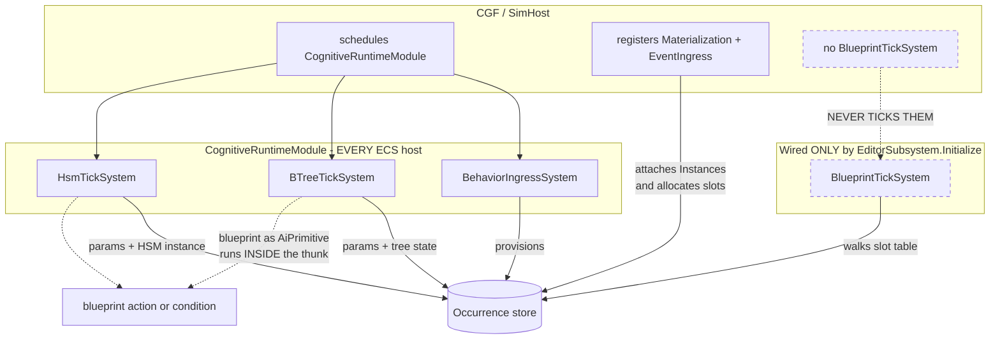
```mermaid
graph TD
    subgraph Every["CognitiveRuntimeModule - EVERY ECS host"]
        C3[BehaviorIngressSystem]
        C1[BTreeTickSystem]
        C2[HsmTickSystem]
    end
    subgraph EditorOnly["Wired ONLY by EditorSubsystem.Initialize"]
        E3[BlueprintTickSystem]
    end
    subgraph CGF["CGF / SimHost"]
        H1[schedules CognitiveRuntimeModule]
        H2[registers Materialization + EventIngress]
        H3[no BlueprintTickSystem]
    end

    H1 --> C3
    H1 --> C1
    H1 --> C2
    H2 -->|attaches Instances<br/>and allocates slots| T1
    H3 -.NEVER TICKS THEM.-> E3

    C3 -->|provisions| T1[(Occurrence store)]
    C1 -->|params + tree state| T1
    C2 -->|params + HSM instance| T1
    E3 -->|walks slot table| T1

    C1 -.->|blueprint as AiPrimitive<br/>runs INSIDE the thunk| BP[blueprint action or condition]
    C2 -.-> BP

    classDef dead stroke-dasharray: 5 5
    class H3,E3 dead
```

**Caption — what only this diagram shows, stated precisely.**

⭐ **Blueprints DO run on CGF — in their other mode.** A blueprint whose `Dispatch == AiPrimitive`
compiles into a BTree/HSM **action or condition** and executes inside the behaviour thunk, driven by
`BTreeTickSystem`/`HsmTickSystem`, which CGF schedules. That is the mode the shipped CGF content
uses, and nothing here is wrong with it.

🔴 **Blueprint *Instances* are the half that is broken, and it is a HALF-WIRED state rather than an
absent one.** `CgfSubsystem:1004` calls `BlueprintGenesisRuntimeRegistration.RegisterBlueprintGenesisSystems`,
which registers **`BlueprintMaterializationSystem`** (resolves `InitialBlueprintsIntent` from scenario
state and **pre-provisions the tier**) and **`BlueprintEventIngressSystem`** (attach/switch by event).
Neither is the tick system. The only production code that constructs and schedules
`BlueprintTickSystem` is `BlueprintRuntimeWiring.WireBlueprintRuntime` + `SpliceIntoSimulation`,
called from **`EditorSubsystem.Initialize:1585/1595` and nowhere else** (the integration `EditorHarness`
is the only other caller).

⇒ **CGF attaches Instances, allocates their slots and dispatches their attach/switch events — and
never ticks them.** That is worse than missing: it looks wired. Scheduling twin of the registration
gap that crashed `--mode all` on `2026-09-03` (recorded in `BlueprintBlackboardTiers`' own header).
**Independent of everything else here** — item `O0`.

### 2.3 Activating and ticking a nested occurrence

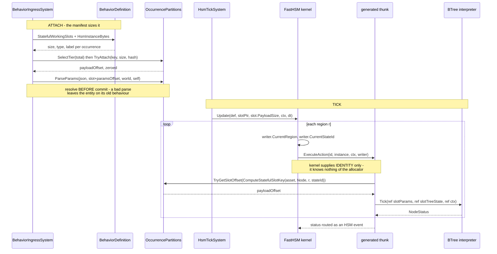
```mermaid
sequenceDiagram
    participant Ing as BehaviorIngressSystem
    participant Def as BehaviorDefinition
    participant Alloc as OccurrencePartitions
    participant Hsm as HsmTickSystem
    participant Kern as FastHSM kernel
    participant Thunk as generated thunk
    participant BT as BTree interpreter

    Note over Ing,Def: ATTACH - the manifest sizes it
    Ing->>Def: StatefulWorkingSlots + HsmInstanceBytes
    Def-->>Ing: size, type, label per occurrence
    Ing->>Alloc: SelectTier(total) then TryAttach(key, size, hash)
    Alloc-->>Ing: payloadOffset, zeroed
    Ing->>Alloc: ParseParams(json, slot+paramsOffset, world, self)
    Note over Ing,Alloc: resolve BEFORE commit - a bad parse<br/>leaves the entity on its old behaviour

    Note over Hsm,BT: TICK
    Hsm->>Kern: Update(def, slotPtr, slot.PayloadSize, ctx, dt)
    loop each region r
        Kern->>Kern: writer.CurrentRegion, writer.CurrentStateId
        Kern->>Thunk: ExecuteAction(id, instance, ctx, writer)
        Note over Kern,Thunk: kernel supplies IDENTITY only -<br/>it knows nothing of the allocator
        Thunk->>Alloc: TryGetSlotOffset(ComputeStatefulSlotKey(asset, Node, r, stateId))
        Alloc-->>Thunk: payloadOffset
        Thunk->>BT: Tick(ref slotParams, ref slotTreeState, ref ctx)
        BT-->>Thunk: NodeStatus
    end
    Thunk-->>Kern: status routed as an HSM event
```

**Caption.** The only new information crossing the ExtDeps boundary is the single
`bridge.Occurrence = (r, leafId)` write. Everything below it — key, lookup, params base, tree state —
is resolved on our side of the line.

---

## 3. The model

⚠ **F6 — the thesis sentence needs its carve-out stated:** *the occurrence owns memory **except where
a scope deliberately shares it***. `StatefulSlotScope.Entity` hashes the variable name **only**, by
design, *"so an owner and a member entity agree on the key"* (`BlueprintSharedState.cs:22-26`). ⛔ That
is a FEATURE — `R-137`: the unification may not delete it.

**An occurrence is a running instance of an asset on an entity.** Its identity is
`(assetId, hostPath)`, where `hostPath` is the chain of `(hostOccurrence, siteId)` pairs from the
root. A root behaviour has an empty host path. ⛔⛔ **F5 — but the EXISTING key cannot express this, and it is not one function.** 📐 Measured:
**three entry points and two enums** — `StatefulBTreeActionBinder.ComputeStatefulSlotKey(Guid,
StatefulSlotScope, Guid, string)` (`:89`), `BTreeBridgeEmitCore.ComputeStatefulSlotKey(Guid,
WorkingStateScope, Guid, …)` (`:227`) and a 2-arg overload (`:187`), hand-mirrored byte-identically in
≥4 test copies. ⛔ **None carries a region, a state id, or a chain**, so depth-2 nesting is not
representable at all — while §11.2 renders it as a tree. ⇒ ⭐⭐ **unifying the key is `O3`'s FIRST
job** *(ruling 9 applies to the key itself)*, not an assumption `O3` may lean on. ⚠ `Q34 §7`'s *"the
field is already polymorphic"* describes coexistence, ⛔ **not a discriminant** — see `D1`.

**Slot payload:** unchanged in shape — a blueprint Instance keeps `[BlueprintLatentCursor 16][Params N][State M]`. ✅ **`Kind` is NOT in the payload** *(`D1′`, §13)*: it is a nibble per slot in `OccurrenceStoreHeader.Reserved`, so the payload and the slot entry are both untouched. `DESIGN_Parameter_Model.md` §3.3 already
rules that params must not sit at offset 0 for blueprint Instances (the 16-byte
`BlueprintLatentCursor` lives there); the header generalises that reservation.

**Why `[SharedAiAction]` thunks survive.** `NodeLogicDelegate<TBlackboard, TContext>` is generic and
the interpreter never touches the blackboard's members — measured at `Interpreter.ExecuteAction`
(`:643-671`), which calls `actionDelegate(ref bb, ref state, ref ctx, node.PayloadIndex)` and
nothing else. A `[SharedAiAction]` thunk bakes only the **field** offset within the DTO, so it is
valid wherever that DTO lives. Same offsets, different base.

⛔⛔ **CORRECTION `2026-09-19` — "EVERY thunk survives" was TOO BROAD, and the exception is a live
corruption defect.** It holds for `[SharedAiAction]`. It is **false for all four `AiPrimitive`
hosting modes**, which bake the **component type** — see §3.2.

### 3.2 ⚠ THE SECOND DEFECT — **an AiPrimitive zeroes the WHOLE shared component** *(LATENT, not shipped — the gate is below)*

> ⛔⛔ **CORRECTED `2026-09-20`, from a LIVE RUN (§15).** An earlier wording of this section — *"a
> **shipped** data-corruption bug"*, *"the strongest single argument the programme has"* — **overstated
> it**, and the coordinator folded that wording in on the `behaviors` lane's say-so. The mechanism below
> is real and unchanged; ⛔ **its REACHABILITY is not.** The prior claim is kept in §15's HISTORY row so
> it cannot be re-quoted.

📐 **Measured `2026-09-19`** *(found by the `behaviors` lane's review; verified here independently)*.
All four `AiPrimitive` hosting modes — `BTreeAction`, `BTreeCondition`, `HsmAction`, `HsmGuard` —
emit the same preamble (`AiPrimitiveEmitter.cs:349, 387, 421, 449`):

```csharp
ref var bb1024 = ref ctx.World.GetComponentRW<Blackboard1024>(ctx.Self);   // ⇐ the COMPONENT, baked
fixed (byte* memory = bb1024.Memory) {
    ulong storedHash = *(ulong*)memory;                 // hash at offset 0
    if (storedHash != StructureHash) {
        Unsafe.InitBlock(memory, 0, sizeof(Blackboard1024));   // 🔴 ZEROES ALL 1024 BYTES
        *(ulong*)memory = StructureHash;
        InitDefaultWorkingState((WorkingState*)(memory + 8));
    }
    ref var ws = ref Unsafe.AsRef<WorkingState>(memory + 8);   // state at offset 8
```

The emitter says so itself (`:91`): *"`FieldLayout` lays an AiPrimitive's state out from 8, **which is
its position inside `Blackboard1024`**"*.

| ⇒ what this means today | |
|---|---|
| ⛔ **at most ONE AiPrimitive working state per entity** | hash at 0, state at 8, whole component owned |
| 🔴🔴 **two of them MUTUALLY THRASH, every tick** | A sees B's hash ⇒ zeroes 1024 B ⇒ writes A's; then B sees A's ⇒ zeroes 1024 B ⇒ writes B's |
| 🔴🔴 **and the blast radius is the WHOLE component** | `R-65`: `Blackboard1024` is shared by BTree, HSM **and** Blueprint at disjoint offsets — plus the commander's `SquadCognitiveState` (§5 class 1). ⇒ **one AiPrimitive hash mismatch wipes the squad contact pool and the BTree heavy DTO** |

#### 🔴 THE GATE — **why this is LATENT, and what would make it live** *(measured live, `2026-09-20`)*

| # | the gate, in order | measured |
|---|---|---|
| ① | the preamble needs **`Blackboard1024` on the entity** | — |
| ② | the **only** production attach is `BehaviorIngressSystem:137/226`, gated on `def.HeavyDtoType != null` | ✅ every other `AddComponent(…Blackboard1024)` in the tree is a **test** |
| ③ | 🔴 **production sets `HeavyDtoType` NOWHERE** | ✅ both mappers hardcode `HeavyDtoType = null` — `HsmAssetMapper.cs:493`, `BehaviorTreeAssetMapper.cs:443`; the retirement is deliberate and pinned by `T30_BehaviorScopedShared_ProofTests.cs:295` *("Blackboard1024 HeavyDtoType hack is gone")* |
| ④ | ⇒ **`Blackboard1024` is attached to ZERO entities in a real run** | ✅ `hill-attack-close`, `--mode all`, both nodes — §15 |

⭐⭐⭐ **And a BTree-hosted blueprint never reaches this preamble at all.** 🔒 **Architect ruling,
`2026-06-15`** *(`SLICE1-DESIGN.md §9` Q1, CONFIRMED)*: *"the BTree generator **ignores** the blueprint's
standalone `BTreeTick` … and emits a **per-node adapter**"*; `SLICE2-DESIGN.md §6.2`: *"(The blueprint's
own `BTreeTick`/`Memory+8` path stays the **standalone** blueprint-as-behavior hosting.)"*
📐 **Confirmed in the emitted code that actually runs** — `PlatoonHillAttack2.Registrar.g.cs` routes every
`HillAssault2*` primitive through **`BlueprintBlackboard1024`** *(the allocator)*, **guarded** with
`HasComponent` (`:85, :148, :211, :268, :331, :388, :448`), and declares them as `StatefulWorkingSlots`
(`:591-595`). ⛔ It does not mention `Blackboard1024` once.

⇒ ⭐⭐ **The honest statement.** This is the exact twin of §3.1's BTree defect, one layer down, and
per-occurrence slots fix it by construction — ⛔ **but it is LATENT: reachable only through *standalone*
blueprint-as-behaviour hosting, which needs `HeavyDtoType`, which nothing sets.** ⚠ **It is not a vestige
either** — `AiPrimitiveHosting.BTreeAction`/`BTreeCondition` is an opt-in capability the design record
defends *(the `CLAUDE.md` "unreferenced is not unintentional" case)*, so the day standalone hosting is
used, two primitives on one entity thrash. ⛔ **Do not price the programme on this defect**, and ⛔ do not
re-quote *"shipped"*. ⭐ §3.1's BTree-hosts-BTree defect is the one that **is** in shipped, reachable code.

### 3.1 ⭐⭐ Hosting one graph inside another ALREADY SHIPS — and it is the template

⛔ **Correction to an earlier reading of mine: `NodeType.Subtree`'s `Failure` stub is NOT how BTree
hosts a BTree, and BTree-hosts-BTree is not a missing feature.** Measured:

- `BTreeEmitCore.EmitSubtree` (`:858-865`) emits `.Subtree("Name", …)` into the fluent builder;
- `BTreeOrchestratorEmitCore` (`:135-176`) generates a **`[BTreeAction] Orchestrate_<Sub>_Tick`**
  whose whole body is
  `ref var subBb = ref master.<VarName>; return <Sub>.GetInterpreter().Tick(ref subBb, ref state, ref ctx);`
  — with an *Approach B* variant that does **COPY IN → tick → COPY OUT** over `SubtreeSyncBindings`.

⇒ ⭐⭐⭐ **Subtree hosting is implemented as "an action that ticks the child interpreter inline,
handing it its own blackboard."** That is *exactly* the mechanism HSM-hosts-BTree needs. The child's
blackboard is a **compile-time slice of the master's** (`master.<VarName>`), so this design's
migration is *"replace the compile-time slice with an allocated slot"* — a narrowing of an existing
mechanism, not a new one. ⛔ **Nothing here removes, deprecates or reroutes it.**

🔴 **But it exposes a live defect of precisely this document's shape.** The generated orchestrator
ticks the child with **`ref state` — the MASTER's `BehaviorTreeState`**. The hosted occurrence has
**no runtime state of its own**: `RunningNodeIndex` and the local registers are shared between host
and child. With one child at a time and no suspension it mostly survives; with two hosted children,
or a child left `Running` while the host advances, host and child overwrite each other. **This is the
BTree twin of the HSM two-region collision, and it is in shipped code today.** `O4` fixes it by
giving the hosted occurrence its own `BehaviorTreeState` in its own slot — which is the same
machinery `O8` needs, so the fix and the feature are one piece of work.

⚠ **The `NodeType.Subtree` kernel stub is a separate, unused path.** It is not what ships, and this
design does not touch it; whether it is ever implemented or deleted is out of scope here.

---

## 4. ExtDeps — what must change, and why it cannot live anywhere else

> The standing rule: an ExtDeps edit needs a reason of the form *"this information exists only
> here"*, not *"this is where it was convenient to patch."*

### 4.1 FastBTree — **no change at all**

| candidate | verdict |
|---|---|
| `Interpreter<TBlackboard,TContext>` | ⛔ **no change.** The type argument is supplied by the caller and the kernel never reads the blackboard's members (`Interpreter.cs:643-671`). Pointing a tree at slot-resident params is a change to **our** call site and **our** generator |
| `BehaviorTreeState` | ⛔ **no change.** It moves from a component field to a slot payload field; the struct is unmodified |
| `NodeType.Subtree` stub (`Interpreter.cs:229-231`) | ⚠ **left alone — and it is NOT how BTree hosts a BTree** (§3.1). Hosting a tree under an HSM state does not need it |

### 4.2 FastHSM — ✅ **ALREADY RULED by `Q35`, `2026-08-17`, with the user**

> 🔒 **User, verbatim (`Q35` §7):** *"putting to HsmCommandWriter is ok. pair rather than hash. one
> path."*

⛔⛔ **CORRECTION — an earlier draft of this section proposed carrying the occurrence on
`HsmKernelBridge` and presented it as a fresh choice. That is `Q35`'s option `C`, and it was
REJECTED a month ago for a better reason than I gave:** ⛔ **and the reason `Q35` gave — and that I repeated — is itself FALSE (F11):** the
layout convention across the boundary **already exists and is load-bearing**, since every shipped HSM
thunk casts `void* context` → `HsmKernelBridge*` (`ApcHsmActions.cs:48`, `AiPrimitiveEmitter.cs:444`).
⭐⭐ **The ruling stands on a better reason: the writer is PER-DISPATCH, the bridge is
PER-ENTITY-TICK** — and the occurrence changes between two actions inside one tick, so only the
writer can carry it.

| `Q35` sub-question | ✅ the ruling |
|---|---|
| **`Q35-A`** delivery | **`HsmCommandWriter`** — a `Fhsm.Kernel` type the kernel constructs and already passes to **every action**. The kernel stamps the occurrence before each dispatch. ⛔ **No delegate signature changes anywhere**; the 55 attributed methods, both `FDP/Examples` projects and FastHSM's own demos compile untouched |
| **`Q35-B`** what identity | **the PAIR `(regionSlotIndex, stateId)`** — ⛔ **not a pre-hashed key.** Both are already in scope at the `HsmKernelCore` call site, and the key algorithm stays in ONE home (`ComputeStatefulSlotKey`), outside ExtDeps |
| **`Q35-C`** who moves | **ONE PATH** — the plain single-region case moves to the allocator too. ⛔ No baked-offset route kept *"for the simple case"* (ruling 9; that divergence is what made the bug invisible) |

🔒 **The division of labour, and it is the sentence to remember:**
> ⭐⭐⭐ **The kernel supplies IDENTITY. The thunk does the LOOKUP.**

⛔ **The kernel knows nothing about the partition allocator and must not learn.** The thunk already
contains the code shape it needs — the tier probe + `TryGetSlotOffset` that stateful BTree actions
have used since `S2`; what it lacked was four bytes of *"who am I"*.

⭐ **Independently re-confirmed here:** `HsmKernelCore.ExecuteAction:778-781` does
`fixed (HsmCommandWriter* writerPtr = &cmdWriter) HsmActionDispatcher.ExecuteAction(actionId,
instancePtr, contextPtr, writerPtr)` ⇒ **the writer pointer reaches every thunk already.**

| the ExtDeps delta, in full | |
|---|---|
| **two fields on `HsmCommandWriter`** | `Fhsm.Kernel/Data/HsmCommandWriter.cs` — additive |
| **the kernel assigns them before each dispatch** | the `ExecuteAction` call sites in `HsmKernelCore` |
| ⭐ **`EvaluateGuard` widens to carry the writer** *(`D2`)* | the dispatcher signature + its registered guard pointers. 📐 **Single-digit blast radius, measured above** |
| ⛔ **nothing else** | ⛔ **the ACTION delegate is untouched** — the 55 attributed methods, both `FDP/Examples` projects and FastHSM's own demos still compile unchanged; no instance-layout change |

#### ✅ GUARDS ARE SERVED TOO — `D2`, approved `2026-09-19` *(supersedes `Q35`'s "accepted limit")*

⛔ **`Q35` accepted "guards are unserved" on the strength of `VE-DEBT-004` — zero production
`[HsmGuard]`. That measurement counted HAND-AUTHORED guards and missed the EMITTER.**
📐 `AiPrimitiveHosting.HsmGuard` is a first-class hosting mode and `AiPrimitiveEmitter.EmitHsmGuardThunk`
(`:441-467`) emits one ⇒ ***"blueprint as an HSM condition"* — this document's own goal sentence — is
exactly the composition an unserved guard cannot deliver.**

⛔⛔ **CORRECTED `2026-09-20` (`G2`) — the census I gave on `2026-09-19` does not reproduce.** I
reported a per-file *line count* as a count of attributed methods without opening the lines — exactly
the *"`search_code` is TEXT"* trap. 📐 **The real picture, every line opened:**

| what | where |
|---|---|
| ✅ **8 genuinely attributed `[HsmGuard]` methods — ALL demos and test fixtures** | `Fhsm.Demo.Visual/Actions.cs:239,246,253` · `ActionDispatchTests.cs:26` · `HsmSourceGenIntegrationTests.cs:19` · `HsmTerminalStateIntegrationTests.cs:20` · `ActionSchemaExporterTests.cs:45,81` |
| ⛔ **4 were COMMENTS, not attributes** | and 🔴 **`UtilityTransitionArbiter.cs:10` says the opposite of what I claimed** — verbatim: *"does NOT use the `[HsmGuard]` attribute because FastHSM guards expect `(void*, void*, ushort)` signatures"* |
| ⛔ **3 were a DIFFERENT attribute** | `[HsmGuardPicker]` — `HsmFacets.cs:73,178`, `SE2_PickerDrawerRebuildTests.cs:256` |

⇒ ⭐⭐⭐ **ZERO production attributed `[HsmGuard]` exists** — the honest figure, and stronger than the
one I gave. ⛔ **But "the population is single-digit" is the WRONG reason to accept the widening**, and
the review is right about that. **The real population is the GENERATORS**, which `F2` already named:
`HsmActionGenerator.cs` bakes the guard signature as literal text (`:551, :564, :567, :633, :659`),
plus `AiPrimitiveEmitter.EmitHsmGuardThunk` and `CSharpEmitter.EmitAiPrimitiveRegistration`.

⭐⭐ **THAT is why it is safe: `R-50` — emitted behavior source is MACHINE-OWNED and regenerated whole
on save.** Changing what a generator emits is a rebuild, not a migration. ⭐ And a measured bonus:
`SharedAiHsmTests.cs:80` binds `EvaluateGuard` **by name**, so it survives the widening untouched;
`ActionDispatchTests.cs:70,86` call it positionally and do not.

⇒ ✅ **`EvaluateGuard` gains the writer:** `delegate*<void*, void*, ushort, bool>` →
`delegate*<void*, void*, ushort, HsmCommandWriter*, bool>`. ⭐ **One mechanism for actions and guards
alike** — the occurrence arrives the same way in both, so there is no second route to keep in step
*(ruling 9)*.

⚠ **This is a DIFFERENT question from §9.4.** `Q35` settles how a *thunk* learns which occurrence it
is. §9.4 settles how `HsmTickSystem` *invokes the kernel on a slot-resident instance* — the pointer
overload. Both are needed; neither substitutes for the other.

### 4.3 Explicitly NOT changing

`HsmCommandWriter` · `HsmEventQueue` · the tier instance layouts · `BehaviorTreeState` ·
`HsmDefinitionBlob` · the `[HsmAction]`/`[HsmGuard]`/`[SharedAi*]` **attribute shapes** ·
`HsmActionDispatcher`'s **tables** and its **ACTION** signature.

⛔⛔ **CORRECTED `2026-09-20` (`G3`) — this list used to say *"`HsmActionDispatcher`'s tables AND
signatures"*, which `D2` contradicts.** ✅ **`EvaluateGuard`'s signature DOES change** (§4.2). The
action signature, the tables and every attribute shape are still untouched.

---

## 5a. ⭐⭐⭐ The two costs `Q37` measured — **and the small tier that prices them**

⛔ **These decide the question, and an earlier draft of this document omitted both.** Cited from
`Q37` §2, not re-measured.

| # | the cost | `Q37`'s measurement |
|---|---|---|
| ⚠ **C1** | ~~a ~1 KB floor, **~8×**~~ ⛔ **CORRECTED `2026-09-19` (F4) — the ~8× was against the WRONG BASELINE** | `Q37` priced 1024 B against `BrainBlackboard` (128) **alone**, but §2.1 also deletes `BrainBTreeState` (64) and `BrainHsm64/128` (64/128). ⭐ **Honest ratios below** — the floor is still real, just far smaller. ⛔⛔ **`Blackboard1024` buys NO bytes** *(corrected `2026-09-20`, §3.2's gate)*: it is attached to **zero entities** in a real run, so deleting it frees a component id and 52 files of consumer churn — **not memory** |
| ⚠ **C2** | **indirection moves from SOME actions to ALL** | today one field access on a component already in hand; under the allocator: tier probe → `GetComponentRW` → `fixed` → `TryGetSlotOffset` *(linear scan)*. ⭐ Generated **stateful** thunks already do exactly this, so it is proven — ⛔ but it goes from *"the stateful ones pay it"* to *"every action, every tick"* |

#### 📐 The honest simple-case arithmetic *(F4)*

| simple case | today | @1024 | ⭐ @256 |
|---|---|---|---|
| **BTree root** | `BrainBlackboard` 128 + `BrainBTreeState` 64 = **192 B** | 5.3× | ⭐ **1.33×** |
| **HSM root** | 128 + `BrainHsm128` 128 = **256 B** | 4× | ⭐ **1.0× — free** |

⛔⛔ **BOTH ROWS ARE STALE AS OF `2026-09-22` — `BrainBlackboard` NO LONGER EXISTS** *(`P4` §2 ②, §30.28)*,
so the "today" column's 128-byte term is gone from both. 📐 **§31.6 carries the re-measured
arithmetic** against real root-params extents *(52 for `PlatoonHillAttack`, 16 for `MoveToLocation`)*:
the BTree root move **SAVES 64 B** and stays on tier 256, and the HSM root move costs **+640 B** only
because of `CE-318`'s double-charged slot entry — without it, it saves 128 B. ⚠ The ratios above are
kept because `O3b`'s load-bearing conclusion rests on them; ⛔ **do not quote the byte figures.**
| ⛔ ~~any heavy-DTO entity → a NET SAVING~~ | **RETIRED `2026-09-20`** — there are no heavy-DTO entities (§3.2 gate ③). ⚠ **The programme gets NO byte credit from `Blackboard1024`** | — | — |

⇒ ✅ **THE BYTES-PER-AI-ENTITY MEASUREMENT IS TAKEN** *(`2026-09-20`, §15)*, and it is the table
above: **192 B** for a BTree root, **256 B** for an HSM root, and ⛔ **no heavy-DTO credit.** ⇒ the
256 tier lands between **free and 1.33×**; the 1024 tier costs **4–5.3×**. ⭐⭐ **So `O3b` is what
makes the floor acceptable, and it is now load-bearing rather than an optimisation** — without it the
programme asks for 4–5.3× on every AI entity. ⚠ The AI entity count *(still unmeasured)* only scales
that per-entity delta; ⭐ it can no longer change its **sign**.

⭐ **And two objections that `Q37` measured DO NOT exist** — do not re-raise them: **hardcoded
behaviours are not harmed** *(every direct `bb.BehaviorParameters[0]` reference is inside an EMITTER;
hand-written nodes take `ref dto`, hand-written resolvers take a destination `byte*` — both already
base-agnostic)*, and **replay / snapshot is unaffected** *(`BrainBlackboard` and all three tiers are
alike `[DataPolicy(NoScenario)]`)*.

### ✅ The small tier is IN SCOPE *(user, `2026-09-19`)*

🔒 **User:** *"small tier in scope pls; is likely does not break anything, hopefully an additive
stuff"* — ⭐ this is `Q37` option **B** *(unify **and** add a smaller tier)*, its own recommended lean,
chosen over **A** *(unify unconditionally, pay the floor)* and **C** *(root inline, children
allocated — the two-mechanism answer `Q35-C` already ruled against)*.

#### 📐 Sizing it — measured, so the constant is not a guess

| datum | value |
|---|---|
| `BehaviorTreeState` | **exactly 64 B** *(`[StructLayout(Explicit, Size = 64)]`)* |
| `HsmInstance64 / 128 / 256` | 64 / 128 / 256 B |
| params cap | **100 B** (`MaxBehaviorParamByteSize`) — a ceiling, not a typical: `MoveToLocation` is 4 fields |
| an `OccurrenceStore256` | header 32 + slot table `MaxSlots`×16 ⇒ **payload 208 B at `MaxSlots=1`, 192 B at 2** |

| the case | ⭐ slots | fits 256? |
|---|---|---|
| **BTree root**, typical params + `BehaviorTreeState` (64) | **1** | ✅ comfortably |
| **HSM root** on `HsmInstance64` + typical params | **1** | ✅ |
| **HSM root** on `HsmInstance128` + typical params | **1** | ✅ *(~150 B)* |
| ⚠ **HSM root** on `HsmInstance128` + params near the 100 B cap | **1** | ⛔ ~236 B — **spills to 1024 on BYTES** |
| **`HsmInstance256`**, or any nesting (2+ occurrences) | **2+** | ⛔ **1024** — correctly so; neither is the simple case |

#### 📐 THE SLOTS AXIS — **measured `2026-09-20` over all 30 generated behaviours** *(`F3`'s missing column)*

⭐ **The rule:** an entity needs **1 root occurrence + one slot per distinct `(scope, key)` stateful
binding** *(⚠ `Behavior`- and `Entity`-scope bindings **dedupe** — `T30…:291-293`: two co-bound nodes
share one slot)*, plus one per attached blueprint Instance and one per hosted child.

| stateful slots **today** | assets | ⇒ slots **after** *(+1 root)* | smallest tier by SLOTS |
|---|---|---|---|
| 0 | **17** *(57 %)* | 1 | ⭐ **256** *(`MaxSlots` 1)* |
| 1 | **6** *(20 %)* | 2 | ⭐ **256** *(`MaxSlots` 2)* |
| 2 | **5** *(17 %)* | 3 | 1024 |
| 3 | 1 | 4 | 1024 *(exactly full)* |
| 🔴 **8** — `PlatoonHillAttack2` ⚠ *(NOT the golden test — see below)* | 1 | **9** | 🔴🔴 **16384** |

| ⇒ two conclusions, and the second is new | |
|---|---|
| ✅ **`O3b` is JUSTIFIED on real content** | **23 of 30 assets (77 %)** land on a 256 tier at `MaxSlots ≤ 2`. ⭐ This was an assumption; it is now a measurement |
| 🔴 **the `MaxSlots` LADDER 4 / 8 / 16 IS TOO COARSE** | `PlatoonHillAttack2` holds **8** stateful slots today and fits **4096** (`MaxSlots` 8) exactly. ⛔ **The root occurrence makes it 9 ⇒ it jumps to `16384`** — a **4× allocation** bought by ONE slot, with payload bytes nowhere near the limit. ⛔⛔ **CORRECTED `2026-09-20`: this is NOT "the golden test's behaviour".** `hill-attack-close` names **`PlatoonHillAttack`** *(`behaviorParams` → `behaviorName`)*, the **hand-written** `HillAttackCommanderNodes.Action_*` tree, which holds **1** stateful slot ⇒ **2 after the root occurrence, comfortably inside a 256 tier**. `PlatoonHillAttack2` is its blueprint-hosted port and is **not what runs**. ⭐ The ladder conclusion stands — `PlatoonHillAttack2` is real content and still the worst case measured — ⛔ but the dramatic framing that hung it on the golden test does not |
| ⭐⭐ **and a finding that fell out of the correction** | 🔒 **the golden test exercises the HAND-WRITTEN node path, not the blueprint path.** ⇒ the `AiPrimitive` machinery this design is built around is **less exercised by the golden test than assumed** — worth knowing before `O4`/`O5` lean on it for proof |

⇒ ⭐⭐⭐ **`O3a`'s `TierSpec` table must RE-PICK `MaxSlots` per tier, not inherit 4 / 8 / 16.**
📐 `MaxSlots` is a free choice traded against payload: on the 1024 tier, `MaxSlots` **12** costs
`32 + 12×16 = 224` and still leaves **800 B** of payload — ample for 12 occurrences averaging 66 B.
⛔ **Today's 4 is arbitrarily conservative**, and it is the only reason a 9-occurrence entity would
reach for 16 KB. ⇒ **the ladder is an `O3a` deliverable with its own sizing rationale**, not a constant
to carry forward.

⛔⛔ **F3 — BYTES ARE ONLY ONE AXIS, and the table above prices only that one.** `MaxSlots` is
**4 / 8 / 16** for 1024 / 4096 / 16384 (`BlueprintBlackboard*.cs:17`) and `SelectTierForPayload`
gates on **both** (`BehaviorIngressSystem.cs:558-566`). ⚠ **And the root occurrence is a slot that
does not exist today**, so every tier loses one stateful slot to it. ⇒ a 256 tier at `MaxSlots` 1–2
fits only a behaviour with **zero stateful nodes and zero Instances**. ⭐ **`O3b` must be sized on
slots as well as bytes, or the tier whose whole job is to price the simple case will rarely be
selected** — the fit table gains a slots column before `O3b` is dispatched.

⭐⭐ **The spill is PREDICTED, never discovered.** Because `BehaviorDefinition` declares the sizes
(§9.5), `SelectTier` picks correctly at attach — ⛔ there is no runtime guess and no surprise
promotion on a hot path.

#### ⚠ "Additive" is right about the CONCEPT — one place it is not

| | |
|---|---|
| ✅ **component-id space** | `MAX_COMPONENT_TYPES = 512`, highest allocated **301** ⇒ room for one more *(`R-44`: the id is allocated, never recycled)* |
| ✅ **the allocator itself** | `CopyToLargerTier(src, srcSize, dst, dstSize, dstMaxSlots)` is **already generic over sizes** — it needs nothing |
| ⚠ **the per-tier BRANCHING is hand-rolled and repeated** | `BehaviorIngressSystem` alone mentions `BlueprintBlackboard16384` **28 times** across ~10 methods, each a 3-way `if/else` on tier size; `BlueprintTickSystem` has **three near-identical ~65-line `TickTier_*` methods**; there are **three near-identical renderers**. A 4th tier is a 4th arm in each |
| 🔴 **and promotion dispatch grows QUADRATICALLY — in TWO places** | ⛔ **`PromoteTier` does not exist (F12)**, and promotion lives in **THREE** places (`G7`): `BehaviorIngressSystem.UpgradeTier` (`:600`), `BlueprintMaintenanceSystem.UpgradeTier_1024_to_4096` / `_4096_to_16384` (`:40/:60`), **and the editor's own `EntityBlueprintsPanel.UpgradeTier` (`:299`, calling `CopyToLargerTier` directly at `:320`/`:327`)**. Today 3 arms; with 256, **6** — across three files. ⛔ **The one part that is not simply additive** |

⇒ ⭐⭐⭐ **Collapse the per-tier branching to a TABLE first, then the 4th tier is genuinely additive.**
A `TierSpec { Type, TotalSize, MaxSlots, PayloadSize }[]` turns ~10 three-way chains, 3 copied tick
methods and 3 copied renderers into one loop, and turns promotion from N² arms into *"copy src→dst
given two specs"* — **which is what the allocator already does.** ⚠ **`G7`: it has THREE consumers, not two** — the editor panel is one of them. ⭐ It also makes §10's rename one
pass instead of four, and it is the natural home for the `O3` slot header. ⇒ items `O3a` / `O3b`.

---

## 5. Blast radius

75 production files touch `BrainBlackboard`, 52 touch `Blackboard1024`. They are not one problem —
they are seven, and only two are large.

| # | consumer class | files | what it needs | size |
|---|---|---|---|---|
| **1** | **squad / commander state** — `SquadCognitiveState`, `SquadInputs`, `StandardInputs`, 4 squad systems, `ForceManeuverMapper`, `ThreatMatrixAssignmentSystem`, the overlay | ~12 | ⭐ **nothing to do with occurrences.** `SquadCognitiveState.Project(ref bb)` projects the **commander's whole** `Blackboard1024` ⇒ it is entity-scoped and wants its own typed component | **S — do it first, independently** |
| **2** | **entity facts** — `CognitiveInterruptSystem`, `CognitiveCleanupSystem`, `RouteContextSystem`, `HsmTickSystem:168`, `BlackboardOffsets` | ~6 | the `BrainBlackboard` tail becomes `BrainInterrupts`. ⚠ **`R-41`/`R-39` pin byte offsets 126/127 and the param-region size — both ledger rows need updating**, not silently invalidating | **S** |
| **3** | **behaviour runtime** — `BehaviorIngressSystem`, `BehaviorRegistry`, the two tick systems, `BTreeActionRegistryFactory` | ~6 | the real work: key, allocate, resolve into the slot, tick against it | **L** |
| **4** | **generators / emitters** — `BTreeBridgeEmitCore`, `BTreeEmitCore`, `HsmBridgeEmitCore`, `BTreeBlackboardPackHelper`, `AiEmitCoreBase`, the two analyzers | ~8 | emit a slot lookup instead of a fixed component projection. **Mechanical but must be exact** — the registry key is `Method@byteOffset` | **M** |
| **5** | **blueprint compiler** — `AiPrimitiveEmitter`, `InlineActionLowering`, `CSharpEmitter`, `WorkingStateLayout`, `IrOperation`, `BlueprintCompilerContracts` | ~6 | ⭐ **this is the half the user flagged.** A blueprint reaches params two ways: as an AiPrimitive action (via the thunk — follows class 4) **and** as an Instance (already slot-resident). `FieldLayout`'s `startOffset: 0` is the one real trap | **M** |
| **6** | **editor / diagnostics / replay** — renderers, view providers, `BlackboardReflection`, `LiveBlackboardValueProvider`, `BlueprintDebugSession`, `VariableEditCommit`, `BlueprintLiveValueWriter`, `PredicateCompiler`, 2 field drawers, `SearchPredicateDto.BlackboardTarget` | ~15 | every one resolves *"where are this entity's params"* — they need the same `TryResolveOccurrence` seam, **once**, not 15 times. ⚠ `R-52`'s live corruption defect (whole-component staged write) is fixed for free by per-slot writes | **M** |
| **7** | **scenario translators** — `BrainBlackboardTranslator`, `Blackboard1024Translator` | 2 | ✅ **measured harmless.** Both are scenario/clipboard **extract-only** with `Inject` a documented no-op, over `[DataPolicy(NoScenario)]` components. **Not DDS translators** ⇒ **no wire format change, no `R-136` exposure** | **XS** |

---

## 6. Sequence

Ordered so that each step is provable on its own and the expensive irreversible one comes last.

| # | item | why here | ExtDeps |
|---|---|---|---|
| **O0** | **WIRE `BlueprintTickSystem` on every ECS host** *(F13: not a re-home — it already lives in `Fdp.Toolkits`; only the wiring is editor-side)* | ⛔⛔ **`G4` — NOT independent, and NOT first.** It puts the unconditional slot-walker on every host, so it **must follow `O3`**, which owns `Kind` (`D1′`). Until both land, blueprint Instances are editor-only and the tripod has no third leg on CGF | — |
| **O1** | **`SquadCognitiveState` gets its own component** | removes the largest non-AI consumer of `Blackboard1024`; pure win even if the rest is cancelled | — |
| **O2** | **Split `BrainBlackboard` → `BrainInterrupts` + a params region type** | the params region becomes addressable; the tail stops travelling with it. Updates `R-39`/`R-41` | — |
| **O3** | **The occurrence seam** — ⭐ **FIRST: unify the key (`F5` — three entry points, two enums)**; then `TryResolveOccurrence` and ⭐ **`Kind` as the header nibble (`D1′`)**, with **all three** of its rails — ⛔⛔ **`H1`'s `Reserved` copy in `CopyToLargerTier` LANDS HERE, not in `O3a`** *(corrected `2026-09-20` from the PLAN)*: `Kind` is introduced in `O3`, so between `O3` and `O3a` **every tier promotion would zero the nibble array**. ⇒ the detach-compaction rail, the promotion rail and `Kind == 0 = Invalid` all ship with `Kind` | one lookup that classes 4/5/6 all call, and **the precondition for `O0`** (`G4`). **No behaviour changes yet** | — |
| ⭐ **O3a** | **Collapse per-tier branching to a `TierSpec` table** — ingress, tick, renderers. ⭐⭐ **AND RE-PICK THE `MaxSlots` LADDER** *(`2026-09-20`)*: 4 / 8 / 16 is arbitrarily conservative and the **+1 root occurrence promotes `PlatoonHillAttack2` from 4096 to 16384** (§5a). ⛔ The ladder ships with a sizing rationale, not as an inherited constant. ⚠ **`H1`'s `Reserved` copy MOVED OUT of this item to `O3`** *(`2026-09-20`)* — it must land with `Kind`, or promotion breaks in the gap between them | ⛔ **prerequisite for `O3b`, and it pays for itself**: ~10 three-way chains, 3 copied tick methods and 3 copied renderers become one loop; promotion stops being N² across three files | — |
| ⭐ **O3b** | **Add the `OccurrenceStore256` tier** — `Q37` option B. ⚠ **`MaxSlots` sized on SLOTS as well as bytes (`F3`)**, not fixed at 1–2 | ⛔⛔ **`G5` — the old numbers here were stale.** §5a's corrected arithmetic: the simple case is **5.3× / 4× at 1024** and **1.33× / 1.0× at 256**. ⛔⛔ **No heavy-DTO credit** *(`2026-09-20`)* ⇒ ⭐⭐ **`O3b` is LOAD-BEARING, not an optimisation**: without it every AI entity pays 4–5.3×. ⛔ Trivial after `O3a`, four copies before it | — |
| **O4** | **BTree onto occurrence storage** — tree state and params into slots, **including a hosted subtree's own `BehaviorTreeState`, and its RE-ENTRY RESET (F14)** | ⭐ **proves the whole model with ZERO ExtDeps change** (§4.1) **and closes the shared-`BehaviorTreeState` defect in §3.1**. ⚠ Own state removes the accidental continuity `ref state` gave, so the child's cursor must be reset when the host re-enters the hosting node — **its own rail**. If this does not work, stop before paying for `O6` | **none** |
| ~~**O5**~~ ✅ | ~~Blueprint Instances take params~~ — ⛔⛔ **ALREADY SHIPPED `2026-08-17`** *(commit `a957ed448`)*, a month before this table listed it. 📐 Measured `2026-09-20`: layout *(`FieldLayout.ParamsStructBase`)*, attach payload *(`ParamsJson` + `AttachToEntity`'s argument)* and parse-before-commit *(`ParamsParseFailed`)* are all present, with **10 rails** in `InstanceParamsSeamTests` — including the `startOffset: 0` one this plan asked for by name. ✅ **13 / 0** | ⇒ ⭐ **the sequence moves straight from `O4` to `O6`** | — |
| ~~**O6**~~ ✅ | ~~The kernel stamps the occurrence~~ — ✅ **DONE `2026-09-20`, as-built in §23.** All three rode it together: two fields + sentinels on `HsmCommandWriter`, `D2`'s `EvaluateGuard` widening, and §9.4's pointer overload. 📐 **The full 156-project solution build reported exactly TWO compile errors** — §4.2's *"single-digit blast radius"* held. 6 rails, red-proof exact *(4 red / 2 green with only the two stamps removed)* | ⇒ ⭐ **`O7` may proceed** — the identity exists; nothing reads it yet | ✅ **PAID** |
| **O7** | **HSM per-region actions key on the occurrence** — closes `BP-297`/`E3`; **and `HsmTickSystem` gains entity discovery across the tier components (F9)** | needs `O6`. ⚠ With `BrainHsm*` deleted the query has no root component — it takes `BlueprintTickSystem`'s shape, and **C2 must price per-tick discovery across archetypes, not only per-action indirection** | — |
| **O8** | **BTree hosted under an HSM state** — the strategic/tactical composition | needs `O3`+`O6`; the child is just another occurrence | — |
| ⭐ **O9** | **Blueprint as an ASSIGNED ROOT behaviour** — the third `BrainTier` *(`Q33`)* | 🔒 **user, `2026-09-19`: *"solved after the occurences"***. ⛔ **Not storage** — §12's gaps ②③④: registry resolution, a root tick path, and joining `BehaviorState.InstanceId` preemption | — |

⭐ **`O0`–`O5` deliver real value with no ExtDeps edit at all.** The boundary is crossed once, at
`O6`, and only after `O4` has demonstrated the model on the paradigm that needs no kernel change.

### ✅ AS-BUILT `2026-09-20` — **`O2` is SHIPPED** *(task `B2`, obligation ⑤)*

⭐ `BrainBlackboard` is now **the params region and nothing else**: `128 → 100` bytes, no `FieldOffset`
tail. The three entity facts moved to a new `BrainInterrupts` component
(`[ComponentId] = 302`, `[DataPolicy(NoScenario)]`, 3 bytes, `LayoutKind.Sequential`).

| what shipped | |
|---|---|
| `BrainInterrupts` — `ExpectedThreatLevel`, `Interrupt_MobilityLost`, `Interrupt_Reserved` | ⭐ the interrupt PROTOCOL is untouched: `CognitiveInterruptSystem` sets, `CognitiveCleanupSystem` clears at end of frame. Only the home moved |
| `BehaviorConstants.BrainBlackboardByteSize` `128 → MaxBehaviorParamByteSize` (100) | ⭐⭐ the 28 bytes between the params region and the old interrupt registers were **dead weight on every brain entity** — the split pays for itself before any occurrence work |
| the attach | ⭐ `BehaviorTkbTranslator`, on the line **beside** `BrainBlackboard`'s, under the identical `IsComponentTypeRegistered && !HasComponent` guard — `B1`'s lesson applied: hook the FACT ("this template has a brain"), not a consumer |
| consumers converted | `CognitiveInterruptSystem`, `CognitiveCleanupSystem`, `HsmTickSystem`, `RouteContextSystem`, `BrainBlackboardTranslator` (extract keeps reporting the tail, `R-137`), `BrainBlackboardRenderer` |
| ledger | **`R-39` ✅ RECONCILED** (it was doc-vs-code, not code-vs-code); **`R-41` ⚠ SUPERSEDED** — it pinned bytes 126/127, and those bytes no longer exist |

| ⚠ two things measured that the design did not say | |
|---|---|
| ⭐⭐ **SPLITTING A COMPONENT SPLITS ITS AUTHORITY** — and a rail caught it, not a review | `CognitiveRuntimeModuleTests.WithTheGateOn_AnUnownedBrainIsNeverTouched` went red: the gate keys on the component the cleanup system reads, which is now `BrainInterrupts`, so granting authority for `BrainBlackboard` alone stopped discriminating. ⛔ **Not a live defect** — `gateOnAuthority` is `false` on every host today — ⭐ but **`BrainInterrupts` MUST join `BrainBlackboard`'s ownership set before that gate is ever turned on**, or `P3`'s guarantee is silently void. Recorded in the rail's own header too |
| ⚠ **`BrainInterrupts` is registered MORE WIDELY than `BrainBlackboard`** | 📐 measured on the live run: brain entities on the **SimHost** perspective carry `BrainInterrupts` and **no** `BrainBlackboard`. Cause: `BrainBlackboard` is registered by `CognitiveComponentRegistry` (reached only via `CgfComponentRegistry`), while `BrainInterrupts` went into `HrotSharedComponentRegistry` — the `CE-161` path. ⭐ **Deliberate and it changes no query's host-set**: every `BrainInterrupts` consumer is either Brain-side or in `Hrot.CGF`, and a CGF host registers **both**. ⇒ the only effect is 3 bytes per brain entity on non-CGF hosts, which is the correct home for a fact about the ENTITY (§2.1's own framing: *"entity facts, per entity, never per occurrence"*) |

⭐ **Golden test re-run after `B2`** *(port 8141, `--mode all`)*: `simTime 132`, platoon at
`523.0 · 525.1 · 529.2 · 530.9`, both targets at `Health 0`, **0 faults in the log**, and every brain
entity carries a `BrainInterrupts` that reads `0/0/0` after cleanup.

⭐ **One dead thing the split exposed:** `Hrot.CGF/Systems/Routing/BlackboardOffsets.cs` is an EMPTY
class whose whole premise — blind byte offsets into `BrainBlackboard` — is retired by named fields.
Zero members, zero references *(`scripts/find.sh`, graph and grep agreeing)*. ⛔ **Not deleted**: its
owning design is `ROUTES1-DESIGN`, so it is flagged a deletion candidate in its own header rather
than removed by a task that does not own routes-1.

### ✅ AS-BUILT `2026-09-20` — **`O1` is SHIPPED** *(task `B1`, obligation ⑤)*

⭐ `SquadCognitiveState` is now its **own ECS component** (`[ComponentId] = 270`), not a projection over
the commander's `Blackboard1024`. `SquadCognitiveState.Project` is **deleted**; ⚠ `Blackboard1024.Project<T>`
itself is untouched — BTree and HSM still use it (`R-65`).

| what shipped | |
|---|---|
| the component + its id | `GlobalComponentIds.SquadCognitiveState = 270` |
| ⭐ **`SquadStateProvisioning.EnsureForCommander`** | the ONE place that decides when an entity acquires squad state |
| provisioning call sites | **both** roster creators — `UnitHierarchySystem` *(assign event)* and `GenesisMaterializationSystem` *(scenario genesis)* |
| registration | `HrotSharedComponentRegistry.RegisterAll` — the `CE-161` path, so no host can be missing it |
| ~58 consumer sites converted | `HasComponent<Blackboard1024>(cmdr)` + `Project(ref bb)` → `HasComponent/GetComponentRO|RW<SquadCognitiveState>(cmdr)`, preserving each site's RW/RO choice |

| 🔴🔴 **THREE THINGS THIS COST, AND THEY ARE THE VALUE OF THE TASK** | |
|---|---|
| ⛔⛔ **HOOK THE FACT, NOT A WRITE PATH** | I first provisioned inside `UnitHierarchySystem`'s assign handler — *"the one system that establishes the commander relationship"*. 📐 **It is not**: `GenesisMaterializationSystem:180` builds a commander's `UnitRoster` independently for scenario-loaded hierarchies. ⇒ a live `--mode all` run showed the commander with **no** squad state. ⭐ The invariant is *"an entity that owns a `UnitRoster` is a commander"*, and the helper exists so a third creator has one thing to remember |
| 🔴 **A GREEN GOLDEN TEST HID IT** | the run passed — targets destroyed, platoon on baseline — while the commander carried no squad state at all. ⛔ **The gate cannot answer *"is the feature on?"***; only reading the entity could |
| ⚠ **AND MY FIRST DIAGNOSIS OF THAT WAS ALSO WRONG** | I called it a *"silent regression"*. 📐 Measured: commander `1000` has **no `Blackboard1024` either**, so the OLD gate `HasComponent<Blackboard1024>(commander)` was **already false** — squad systems had never run for it. ⇒ ⭐ `O1` does not disable squad behaviour, it **ENABLES** it where the accidental blackboard gate kept it off. **That is a behaviour change, in the intended direction, and it is stated rather than buried** |

| ⚠ id allocation | |
|---|---|
| 🔴 **my first id, 265, COLLIDED** with `NavigationContractsComponentIds.CrowdMotorIntent` | the tests **passed in isolation and failed only in the full suite** — `ComponentTypeRegistry` is process-global, the `QA-008` shape |
| 📐 censusing **every** `*Ids*.cs` found **three PRE-EXISTING collisions** — 262, 263, 264 each allocated twice *(`GlobalComponentIds` squad ids vs `NavFakeIds`)* | filed as **`QA-036`**'s neighbour **`QA-037`** for the backend lane; `O1` uses **270**, clear of the contested 262–269 band |

⭐ **Golden test re-run after `B1`:** `523.0 · 525.2 · 529.2 · 531.0`, both targets at `Health 0`, **0 faults** —
and this time verified that commander `1000` carries `UnitRoster` **and** `SquadCognitiveState`.

### ✅ AS-BUILT `2026-09-20` — **`O0` is SHIPPED** *(task `A4`, obligation ⑤)*

⛔⛔ **`F13` was half right and its second clause was misleading. SUPERSEDED.** It said *"not a re-home
— the system already lives in `Fdp.Toolkits`; only the **wiring** is editor-side… `O0` is smaller than
it sounds."* ⭐ No type moved — true. ⛔ But *"only the wiring"* glossed the one part with no shared
home: **`BlueprintTickSystem` is `[UpdateInPhase(Simulation)]`, which `RegisterGlobalSystem` rejects**,
so it must be spliced into some host's Simulation list — and `CE-161` had already measured that a
per-host call is a per-host chance to forget *(three of four bootstrappers missed the tier
registration)*.

| what shipped | where |
|---|---|
| ⭐ the splice moved down beside the systems — `BlueprintRuntimeComposition.SpliceIntoSimulation` | `Fdp.Toolkits/Blueprints/Systems/`; `Hrot.Blueprints.Editor`'s copy is now a forwarder, as its `RegisterTierComponents` already was |
| ⭐⭐ **`CgfLogicPack` performs the splice ONCE**, into its own `SimulationSystems`, before the action dispatchers it contributes | so **CGF and the Editor** inherit it from one path. `CgfCapabilities.Brain` already feeds that list into both plans |
| the BeforeSync **maintenance** system rides a `SingleSystemModule` from `CgfCapabilities.Brain` | ⛔ not a `RegisterGlobalSystem` line per root. 🔴 Without it a host ticks Instances but cannot PROMOTE a tier — which since `A3` is also what carries the `Kind` nibble array (`H1`) |
| `CgfLogicPack` takes `BlueprintRegistry` as a **required** parameter | ⛔ not optional: a defaulted empty registry ticks nothing — a silent no-op, and the silent-default shape this codebase keeps finding |
| 🔴 the Editor's **root splice was DELETED, not merely made redundant** | `DistinctByType` runs BEFORE the root splice and cannot see it ⇒ keeping both would put **two** `BlueprintTickSystem` instances in one group and tick every slot twice |
| ⭐⭐⭐ the walker filters on the **declared `Kind`** | `BlueprintTickSystem`'s three tier walkers now test `GetSlotKind(...) == OccurrenceKind.Blueprint` **before** the registry lookup, which retires `F7`'s accidental filter |

| ⚠ two things the design did not say, and the next task needs | |
|---|---|
| 🔒 **SCOPE IS `CGF` + EDITOR, not literally "every ECS host"** *(user ruling, `2026-09-20`: "cgf + editor scope")* | ⭐ Blueprint Instances attach where behaviours run — the Brain — and `O0`'s acceptance is a tick counter advancing on CGF. ⛔ SimHost and IG use `SimHostCoreLogicPack` and are **not** covered; extending to them is a separate decision, not an oversight |
| 🔴🔴 **THE `Kind` FILTER BROKE 120 TESTS, AND THAT WAS THE POINT** | 📐 `A3` stamped the **five production** attach sites, but test harnesses call the allocator directly and kept the kind-less overload ⇒ their slots read `Invalid` and the walker skipped them: *"expected 5, actual 0"* tick counters. ⭐ **Fixed at the four harnesses that attach an INSTANCE** *(`BlueprintTestFixture`, `FIX2_009`, `BlueprintTierSummaryTests` ×3)*, ⛔ **NOT by defaulting the overload to `Blueprint`** — that would rebuild the "undeclared means blueprint" accident `D1′` exists to retire. ⚠ Two sites attaching a **shared/Entity-scope** slot were deliberately left undeclared: the walker MUST skip them. ⇒ ⭐ **any future hand-rolled attach must declare, and `BlueprintRunHarness`'s own header already says this attach belongs in a production service** |

---

## 7. Rails

| rail | asserts |
|---|---|
| **two occurrences, distinct bytes** | the same asset twice on one entity ⇒ different param bytes. This is `DESIGN_Parameter_Model.md` §8's rail and it is what stops the shared-region assumption returning |
| **the tail is untouched** | resolving params for any occurrence writes neither interrupt byte nor `ExpectedThreatLevel` |
| **cursor intact** | a blueprint Instance with params keeps its `BlueprintLatentCursor` at offset 0 after a resolve — the `startOffset: 0` trap. ✅ **Still TRUE under `D1′`**, which is why `D1` was revised (`G1`): the payload is untouched |
| 🔴 **kind survives a detach** | `TryDetach` **compacts the slot table** (last entry moves into the freed slot, `:188-199`) ⇒ the `Kind` nibble array must compact in lockstep. ⛔ **Write it to go RED first** — a stale nibble silently mislabels every occurrence after the hole. ⚠ **And it must CLEAR the vacated tail nibble** (`H2`): `:197-198` zeroes the duplicated last *entry*, but that write cannot reach the header, so a stale nibble survives at `lastIndex` for the next attach to inherit |
| 🔴🔴 **kind survives a TIER PROMOTION** *(`H1`, `2026-09-20` — the hazard `D1′` did not record)* | 📐 **`CopyToLargerTier` never copies `Reserved`.** `:249` calls `Initialize`, which at `:38` does `InitBlock(memory, 0, totalSize)` and then sets **eight** header fields explicitly (`:44-51`) — ⛔ `Reserved` is not among them; `:272-290` then copy `SlotCount`, `PayloadFree`, `PayloadHighWater` and the free list, **and nothing else**. ⇒ **every tier upgrade silently zeroes the whole nibble array** while entries and payloads copy correctly (`:263`), so **all** occurrences read `Kind 0` — strictly worse than the detach case, and it fires on the ordinary growth path. ⭐ **Slot ORDER is preserved (`i → i`), so the fix is one line** — `dstHeader.Reserved = srcHeader.Reserved` beside `:272` — and it covers all **three** promotion sites at once, because they all funnel through `CopyToLargerTier`. ⛔ **Its own red-first rail**: a zeroed nibble array is indistinguishable from "everything is kind 0" |
| ⭐ **`Kind == 0` is `Invalid`, never a valid kind** *(`H2`)* | `Initialize:38` zeroes the component, so 0 is what an un-migrated, un-promoted or never-written slot reads. ⛔ If 0 meant `Blueprint`, `O0`'s walker would resume filtering **by accident** — the very hash-miss filter `F7`/`D1′` exist to retire. ⭐ With 0 reserved, a missing declaration trips §11.4's *"every allocated occurrence is renderable"* rail **at allocation** |
| **parse before commit** | a failing resolve at attach leaves the entity without the new occurrence |
| **two regions, two slots** | two concurrently-active HSM regions running the same action write **different** bytes. ⚠ `BP-297` measured that today's fixture cannot redden this — the two regions run an **empty** action. **A DTO-bound HSM action must be authored as part of `O7`, or the rail is vacuous** |
| **one context per instance** | `UpdateBatch` with N instances: each `ExecuteAction` sees the occurrence of *its* instance (§4.2 caveat ②) |
| **a hosted subtree keeps its own cursor** | host tree `Running` at node A, hosted child `Running` at node B ⇒ **both survive a tick**. ⛔ Must be written to go RED before `O4` — it reproduces the §3.1 defect in shipped code |
| **every host ticks blueprints** | a `--mode all` run shows a blueprint **Instance** advancing on CGF, not only in the editor (`O0`). ⚠ Anti-vacuity: CGF already materialises and event-attaches Instances, so the rail must assert the *tick counter advances*, not that the slot exists |
| **one supply mechanism** | unchanged from `DESIGN_Parameter_Model.md` §8 — a second `Overrides`-style applier fails it |

---

## 8. Open questions

| id | question | lean |
|---|---|---|
| **Q1** | ~~Does `NodeType.Subtree` come with this?~~ **WITHDRAWN — the question was wrong.** See §3.1 | ✅ **BTree-hosts-BTree SHIPS and is KEPT.** `O4` improves it |
| **Q2** | ~~The shared event queue is unmeasured for cross-region hazards~~ | ✅ **MEASURED — see §9. Five hazards, four of them structural.** None blocks `O0`–`O7`; **H1–H3 block `O8`** and are dispatch semantics, not storage |
| **Q3** | Rename `BlueprintBlackboard*`, given it already stores BTree/HSM state | ✅ **names proposed — see §10.** Roslyn-driven, off the critical path |
| **Q4** | ~~Does the root brain stay exclusive once nesting works?~~ | ✅ **RULED, user, `2026-09-19`, verbatim: *"there is still just up to one assignable behavior per entity."*** `BehaviorState` stays singular; `InstanceId` preemption and `ChannelArbitrationSystem` are untouched. Concurrency comes from nesting, never from a second assignable root |

---

## 9. The shared event queue — measured (`Q2`)

⭐⭐ **Headline: the hazards are real and structural, but they are DISPATCH SEMANTICS, not storage.**
They live entirely inside `HsmKernelCore` and `HsmEventQueue`, they would exist with or without this
design, and **none of them blocks `O0`–`O7`.** Three of them block `O8`.

### 9.1 The five hazards

| # | hazard | measured at | bites when |
|---|---|---|---|
| **H1** | 🔴🔴 **ONE region consumes the event; the others never see it.** `SelectTransition` scans every region and returns **a single** best transition (`:564-610`); `ExecuteTransition` fires it; then `ProcessRTCPhase` sets `currentEventId = 0` — *"Event consumed"* (`:517`) — and the loop continues with epsilon transitions only. ⛔ **UML orthogonal-region semantics require the event to be offered to EVERY region**, each firing independently | `HsmKernelCore.cs:497-518`, `:564-610` | **any** event that two regions both have a transition for |
| **H2** | 🔴 **Priority arbitration is GLOBAL, not per-region.** `bestTransition` is chosen by `priority > highestPriority` **across all regions** (`:592`) ⇒ a low-priority transition in region 0 loses to a high-priority one in region 1, and (via H1) region 0 then loses the event entirely | `:588-600` | any two regions with different transition priorities on one event |
| **H3** | 🔴 **A GLOBAL transition always reports region 0.** `SourceStateIndex = activeLeafIds[0]` unconditionally (`:551`) and `regionIndex` stays at its `0` initialisation (`:538`) — it is only assigned inside the per-region loop (`:599`). ⇒ a global transition fired while >1 region is active rewrites **region 0's** leaf and leaves the others untouched. ⚠ **This is the surviving half of the bug the `:747-749` comment says was fixed** *("a transition fired in region 1 used to overwrite region 0's leaf… corrupting two regions with one event. Harmless while regionCount == 1, which is why it survived")* — fixed for per-region transitions, **still live for global ones** | `:538`, `:551`, `:747-750` | any global transition on a multi-region machine |
| 🔴 **H4** | ⛔ **F10: this is an IDENTITY bug first, a capacity bug second — `FireTimerEvent` takes `timerIndex`, `activeLeafIds` and `regionCount` and USES NONE**, so every timer enqueues the same `TimerEventId` and, with H1, a region-1 timer can fire a region-0 transition. ⇒ **`O8` depends on timers being per-region.** ⚠ **The queue is also sized by LEFTOVER BYTES, not by the region count — at every tier.** `HsmInstance128`: **4 regions, 4 timers, 1 interrupt slot + a 1-slot ring** ⇒ 2 events. `HsmInstance256`: **8 regions, 8 timers, ring 5** ⇒ 6. ⛔ **Every tier has `ring < regions`.** ⇒ **`ProcessTimerPhase` loops all timers and `FireTimerEvent` enqueues one each — 4 expiring timers on a 128 = 2 enqueued, 2 lost.** ⚠ **CORRECTION to an earlier wording of this row:** Tier2/Tier3 **REJECT** on a full ring (`EnqueueTier2:262` returns `false`); it is `HsmInstance64`'s header that documents *eviction*. Either way the event is gone — but 🔴 **`FireTimerEvent:368` discards `TryEnqueue`'s bool**, so the loss is silent, untraced and unlogged | `HsmEventQueue.cs:11-27`, `:249-265`; `HsmKernelCore.cs:335-350`, `:361-369` | N regions or N timers on one tick — i.e. normal operation for a multi-region machine, not an edge case |
| **H5** | ⚠ **Drain order decides the winner.** `ProcessEventPhase` drains up to `MaxEventsPerTick = 10`, each through a full RTC pass. Deterministic, but with H1 the queue order silently determines which region acts | `:381-392` | any multi-event tick |

⭐ **Timer events are not exempt:** `FireTimerEvent` enqueues into the same shared queue, so H1 and H4
apply to timers too — even though `TimerDeadlines[]` is itself per-slot.

### 9.2 ⭐ What is already right, and it is the shape of the fix

`ArbitrateOutputLanes` runs **only when `RegionCount > 1`** (`:645-647`). ⇒ **the OUTPUT side already
has region arbitration; it is the INPUT side that has none.** The fix has a precedent in the same
file: offer the event to each region, collect at most one transition **per region**, execute them,
and let the existing output-lane arbiter resolve conflicting effects.

### 9.3 Consequence for this design

| | |
|---|---|
| ⭐⭐ **`O0`–`O7` are unaffected** | they change **where bytes live**. H1–H5 are about **which region gets an event**. No dependency either way |
| ⛔ **`O8` (BTree hosted under an HSM state) needs H1 fixed** if two regions are meant to host trees concurrently — otherwise one hosted tree stops receiving the events that drive it | |
| ⚠ **H4 is a capacity decision, not a bug** | see §9.4 — the answer is **allocate a bigger slot payload**, which arrives with `O7`. ⛔ Not a new component |
| 🔒 **This is a SEPARATE ExtDeps change from §4.2** | it must be justified on its own terms — *"orthogonal-region event dispatch is wrong"* — and **not** smuggled in as part of the storage work. ⛔ Exactly the failure mode the standing ExtDeps rule exists to prevent |

### 9.4 The tiers — what they give, and who chooses

| | `HsmInstance64` | `HsmInstance128` | `HsmInstance256` |
|---|---|---|---|
| regions | 2 | **4** | **8** |
| timers | 2 | 4 | 8 |
| history / scratch | 2 | 8 | 16 |
| **events in flight** | **1** *(single shared slot)* | **2** *(1 interrupt + ring 1)* | **6** *(1 interrupt + ring 5)* |
| ECS wrapper | `BrainHsm64` | `BrainHsm128` | 🔴 **none** |

⭐ **Interrupts are safe at every tier** — the reserved interrupt slot cannot be crowded out by normal
traffic (`EnqueueTier2:238-247`), so `MobilityLost`-class interrupts always land. **It is normal and
timer traffic that is tight.**

#### 🔴 Who chooses the tier: **nothing does — it is hard-coded to 128**

📐 Measured. `BehaviorTkbTranslator.cs:118-122` is the only production attach:

```csharp
else if (dto.BrainTier == BehaviorConstants.BrainTierHsm)
    if (registered && !has) repo.AddComponent(entity, new BrainHsm128());
```

⇒ **every HSM entity gets 128, regardless of what its machine declares.** `BrainHsm64` is
*registered* (`CognitiveComponentRegistry:47`) and *ticked* (`CognitiveRuntimeModule:65`) and
`BehaviorIngressSystem.ResetHsmComponents:748` handles it — but **every `new BrainHsm64()` in the
tree is in a test** (measured: 14 lines, 6 files, all `*.Tests`). There is no production path that
selects a tier, so "the tier system" is currently one tier with two unused neighbours.

⭐ **The selector already exists in the data:** `definition.Header.RegionCount` is read by the kernel
(`:172`, `:645`). A machine's compiled blob knows how many regions it has, so the attach can size the
instance instead of guessing.

#### ⛔⛔ CORRECTION — **there is no `BrainHsm256`, because after `O7` there is no `BrainHsm*` at all**

🔒 **User, `2026-09-19`:** *"i thought the HSM state will be also allocated as occurrence so why would
we need a component for it?"* — **correct, and §9.4's first draft contradicted §2.1 of this very
document.** The classDiagram already says `BrainHsm64 ..> OccurrenceSlot : HSM instance becomes`.

📐 **And the kernel agrees — measured.** `HsmKernelCore` is `internal` and `UpdateBatchCore` already
takes exactly `(definition, void* instances, int count, int instanceSize, void* ctx, float dt,
CommandPage*, HsmTraceContext*)`. **Every public `HsmKernel.Update<TInstance,TContext>` overload is a
thin generic wrapper** that does `fixed (TInstance* instPtr = &instance)` and passes
`sizeof(TInstance)` (`HsmKernel.cs:82-104`). ⇒ ⭐⭐⭐ **the kernel wants a POINTER AND A SIZE, not a
component type.** The generic wrapper exists only to pin a managed `ref`. `HsmEventQueue.TryEnqueue`
likewise switches on `int size`, not on a type.

⇒ ⭐⭐ **The tier stops being a TYPE and becomes a PAYLOAD SIZE**, chosen at attach from
`definition.Header.RegionCount`:

| | before `O7` | after `O7` |
|---|---|---|
| where the instance lives | `BrainHsm64` / `BrainHsm128` component | a slot in the entity's occurrence store |
| how the tier is chosen | ⛔ hard-coded 128 | ⭐ `TryAttach(key, sizeFor(Header.RegionCount), …)` |
| getting 8 regions / 6 events | needs a **new component + id + registration + tick registration** | ⭐ **free** — allocate 256 bytes instead of 128 |
| `BrainHsm64` / `BrainHsm128` | exist | ⭐ **deleted** |

⇒ ⛔ **Do NOT create `BrainHsm256`.** It would be a new component, a new `GlobalComponentIds` entry
and a new tick registration that `O7` then deletes. The capacity answer is *"allocate the bigger
payload"*, and it arrives with the occurrence work rather than ahead of it. ⚠ The only reason to
build it anyway would be needing 8 regions **before** `O7` lands — and multi-region HSM needs **H1**
fixed regardless, so there is no such urgency.

⭐ **This also subsumes a second recorded problem.** `docs/designs/btree-hsm-unif/DESIGN.md` §Q6 says
`HotReloadManager.TryReload` *"assumes a single contiguous span of all component instances… there is
no world-wide contiguous span"* and must be refactored. With instances in slots, reload is a **slot
walk** — the same walk `BlueprintTickSystem.TickTier_*` already performs, including its
`StructureHash`-mismatch hard reset. ⇒ the occurrence model **closes** Q6 instead of inheriting it.

#### ⭐ What crossing the ExtDeps line costs, if anything

| option | ExtDeps delta |
|---|---|
| **(a)** three payload structs on our side — `struct HsmPayload64 { fixed byte _[64]; }` etc. — and call the existing generic `Update<HsmPayload256, HsmKernelBridge>(ref Unsafe.AsRef<HsmPayload256>(slotPtr), …)` so `sizeof(TInstance)` is right | ⭐⭐ **ZERO** |
| **(b)** ⭐ **one additive `public` pointer overload** forwarding to the already-existing internal `UpdateBatchCore` | one new public method, **no existing signature touched** |

**What (b) actually is.** The only public entry today is generic, and the generic exists for exactly
two reasons — to pin the managed `ref`, and to supply `sizeof(TInstance)`:

```csharp
public static unsafe void Update<TInstance, TContext>(
    HsmDefinitionBlob definition, ref TInstance instance, in TContext context,
    float deltaTime, ref CommandPage commandPage)
    where TInstance : unmanaged where TContext : unmanaged
{
    fixed (TInstance* instPtr = &instance) fixed (TContext* ctxPtr = &context)
    fixed (CommandPage* cmdPtr = &commandPage)
        HsmKernelCore.UpdateBatchCore(definition, instPtr, 1, sizeof(TInstance), ctxPtr, …);
}
```

`UpdateBatchCore` is `internal` and **already has the shape a slot needs.** (b) is one method that
makes it reachable:

```csharp
public static unsafe void Update(
    HsmDefinitionBlob definition,
    byte* instance, int instanceSize,        // ⭐ straight from slot.PayloadOffset / slot.PayloadSize
    void* context, float deltaTime,
    CommandPage* commandPage, HsmTraceContext* traceCtx = null)
    => HsmKernelCore.UpdateBatchCore(definition, instance, 1, instanceSize, context, deltaTime, commandPage, traceCtx);
```

| | ⭐ (a) payload structs | ⭐ (b) pointer overload |
|---|---|---|
| ExtDeps | ✅ **none** | ⚠ one additive public method |
| ⭐⭐⭐ **where the SIZE comes from** | 🔴 **a type we invented** — `sizeof(HsmPayload256)` | ✅ **the allocation** — `slot.PayloadSize` |
| 🔴 **memory safety** | ⛔⛔ **pass `HsmPayload256` at a 128-byte slot and the kernel reads 128 bytes past the payload — into the NEXT OCCURRENCE'S bytes.** No compiler check, no runtime check | ✅ **cannot disagree with the slot by construction** |
| new call sites (reload, debug snapshot, editor) | each repeats a 3-way switch | one call, any size |
| a future 4th size | a 4th struct + a 4th switch arm | ⭐ nothing |
| misuse risk | low — the types constrain it | ⚠ a caller can pass a wrong `instanceSize`; mitigate by keeping the generic overloads as the documented surface |
| reversibility | entirely ours | needs an ExtDeps revert |

⭐⭐⭐ **Lean: (b), and the deciding argument is MEMORY SAFETY, not convenience.** In (a) the size is
a property of an invented type; in (b) it is a property of the allocation. With occurrence payloads
packed adjacently inside one component, an overstated size reads into the **neighbouring
occurrence** — ⛔ **precisely the silent cross-occurrence corruption this whole design exists to
eliminate**, reintroduced at the tick site. ⭐ Fold it into `O6`, which is already editing
`HsmKernel.Update` (§4.2): **one crossing instead of two.** ⛔ If `O6` is cancelled, (a) remains a
working fallback — the slot model does not depend on the ExtDeps edit — but then the size/slot
agreement needs an explicit assert at every call site.

### 9.5 Who declares the instance size — ✅ `BehaviorDefinition`, per the user

🔒 **User, `2026-09-19`:** *"the behavior definition record… could say what size of the HSM to use."*
⭐⭐ **Agreed, and it is the EXISTING pattern rather than a new one** — measured.

`BehaviorDefinition` (`BehaviorRegistry.cs:74-198`) already carries `HsmDefinition` (`:96`), and
already carries **`StatefulWorkingSlots: IReadOnlyList<StatefulSlotInfo>`** (`:197`) where every entry
declares an explicit **`PayloadSize`** (`:63`) plus `SlotKey`, `StructureHash`, `WorkingStateType`,
`Role` and `Scope`. ⇒ **the definition record is already how the ingress learns what to allocate**,
and `BehaviorIngressSystem.ProvisionStatefulSlots` already allocates from it. The HSM instance is one
more entry of the same shape.

#### 📐 Why DECLARED beats DERIVED here — the header cannot answer the question

`HsmDefinitionHeader` is 32 bytes and carries `StateCount`, `TransitionCount`, **`RegionCount`**,
`GlobalTransitionCount`, `EventDefinitionCount`, `ActionCount`, `GuardCount`. ⛔ **It carries NO timer
count and NO history-slot count** — and the tiers differ in all four axes *(regions 2/4/8, timers
2/4/8, history 2/8/16, queue depth 1/2/6)*. Timer usage lives in the **state definitions**, not the
header. ⇒ ⛔ **deriving the tier at runtime from `Header.RegionCount` alone UNDER-SPECIFIES it**, and
the alternative — adding counts to the header — is an ExtDeps format change for something the
compiler already knows.

⭐⭐ **So: declared on the record, but COMPUTED AT BUILD TIME by the generator**, exactly as
`StatefulWorkingSlots` is emitted today. The compiler scans the machine (regions, timers, history,
event depth), snaps to 64/128/256, and emits it. **No ExtDeps change, no runtime guessing.**

⚠ **Drift is already guarded** — `StatefulSlotInfo.StructureHash` and the slot-vs-definition hash
check that `BlueprintTickSystem.TickTier_*` performs, with `ResetSlot` on mismatch. A machine
recompiled to need a bigger instance changes its structure hash, so the stale slot is reset rather
than silently under-read. ⭐ This is what makes a declared size safe here and unsafe in general.

⛔ **Do not read "≤2 event-driven regions" as a design limit to accept** — it was my shorthand for
*"don't exceed the queue"*, and the honest statement is: **the queue was never sized against the
region count, so the limit is an accident of byte budgeting rather than a decision.** Fix it by
choosing the tier, not by capping the design.

🔴 **And one line worth fixing whatever else happens:** `FireTimerEvent:368` calls
`HsmEventQueue.TryEnqueue(...)` and **discards the result.** A dropped timer event is currently
invisible. It belongs with the H1–H3 dispatch work as the same ExtDeps change.

#### ⛔ HISTORY — the superseded first answer *(kept because the tier TABLE above is still true)*

📄 **This is already a recorded future task, not a new idea** —
`docs/designs/btree-hsm-unif/DESIGN.md` §"Q1: HsmInstance256 / BrainHsm256": *"`HsmInstance256` exists
in `Fhsm.Kernel` but no `BrainHsm256` ECS component exists. `HsmTickSystem<T>` is generic, so it could
technically support 256-byte instances. A future task should add `BrainHsm256`… This design does not
add it."*

⛔ **This document's first draft took that literally and proposed adding the component.** That was
wrong for the reason above: after `O7` there is no `BrainHsm*` to add a sibling to. ⭐ **The facts in
it still hold** — `HsmInstance256` exists, is size-tested, `HsmEventQueue` already routes `case 256`,
and the extra capacity costs **+128 bytes on the entities that need it**. ⚠ And either way it does
**not** fix H1–H3: a bigger queue delivers more events; it does not make region 1 see an event
region 0 consumed.

---

## 10. Rename proposal (`Q3` — ✅ names agreed by the user, `2026-09-19`)

**What the thing actually is:** a per-entity, tiered, slab-allocated arena holding **one payload per
running occurrence** — blueprint Instance, BTree stateful slot, HSM slot. The word `Blueprint` in its
name has been wrong since `BehaviorIngressSystem` started allocating from it.

| today | ⭐ proposed | why |
|---|---|---|
| `BlueprintBlackboard1024/4096/16384` | **`OccurrenceStore1024/4096/16384`** | names the unit of identity the design turns on; *store* avoids **blackboard**, which already means three different things here |
| `BlueprintBlackboardHeader` | **`OccurrenceStoreHeader`** | |
| `BlueprintSlotEntry` | **`OccurrenceSlotEntry`** | |
| `BlueprintFreeBlockHeader` | **`OccurrenceFreeBlockHeader`** | |
| `BlueprintBlackboardTiers` | **`OccurrenceStoreTiers`** | keeps the `RegisterAll` role obvious |
| `BlueprintBlackboardPartitions` | ⭐ **`OccurrencePartitions`** — **keep the word `Partitions`** | ⛔ do NOT rename this to `Allocator`: `Blueprint_Subsystem_Runtime_Detailed_Design.md` §5 is cited across the corpus as *"the partition allocator"*, and renaming orphans those citations for no gain |
| `BlueprintBlackboard1024Renderer` … | **`OccurrenceStore1024Renderer`** … | |

**Rejected alternatives, one line each:**
`SlotBlackboard*` — keeps the overloaded word we are trying to disambiguate from ·
`OccurrenceArena*` — *arena* is precise allocator jargon but reads oddly in a military sim ·
`BehaviorStateStore*` — collides conceptually with the `BehaviorState` component ·
`AiStateArena*` — too narrow, blueprint Instances are not all AI ·
`EntityScratch*` — says nothing about occurrence identity.

| ⚠ constraints on doing it | |
|---|---|
| 🔴 **Roslyn only** | never a text rename — the standing rule, and a preview here will reach assemblies a reference list does not name |
| 🔴 **Rename the FIELD, never the VALUE** | `GlobalComponentIds.BlueprintBlackboard*` field names change; **the numeric ids must not** — `R-44`: ids are globally unique and partitioned for multi-process determinism |
| ⚠ **union rule** | query from a root-solution project **and** check `HrotStrideApp.Windows` separately — it is the one project outside `IOS-IG-SimHost.sln` |
| ⭐ **do it AFTER `O3`** | `O3` already touches the slot header; renaming first means two passes over the same files |

---

## 11. Observability — inspector, debug sessions and the HTTP API

> 🔒 **User, `2026-09-19`:** *"The Occurrences are just a memory pool component, would it know what
> the memory means…? if not, who knows where in the occurrences the data is and what they mean?"*

⭐⭐⭐ **Correct that the pool knows nothing — and the question is already answered by shipped code.
`BlueprintBlackboard1024` is a memory pool with a custom renderer TODAY, and it renders typed,
per-slot content.** This section is a generalisation of that, not a new mechanism.

### 11.1 Who knows what the bytes mean

📐 **Measured, `StatefulWorkingStateProjection.cs`** — the join, in five lines:

| step | line | what |
|---|---|---|
| ① | `:55` | `registry.TryGetDefinition(bs.ActiveBehaviorHash, out var def)` — `BehaviorState` ⇒ `BehaviorDefinition` |
| ② | `:56` | `def.StatefulWorkingSlots` — **the manifest** |
| ③ | `:61` | `s.WorkingStateType` — ⭐ **the managed TYPE, per slot** |
| ④ | `:118` | `TryGetSlotOffset(memory, s.SlotKey, out payloadOffset)` — **where** |
| ⑤ | `:126` | `Marshal.PtrToStructure((IntPtr)(memory + payloadOffset), s.WorkingStateType)` ⇒ `:80` `ImGuiPropertyTree.Render(boxed, contextType: …)` |

⇒ ⭐⭐ **The MANIFEST is the answer.** `BehaviorDefinition.StatefulWorkingSlots[]` already carries
`SlotKey` *(where)*, `WorkingStateType` *(what)*, `NodeLabel` *(how to name it)*, `Scope` *(how to tag
it)* and `PayloadSize`. The renderer joins manifest to pool; neither half knows alone.

🔒 **THE INVARIANT THIS MAKES EXPLICIT — and it is a design obligation, not a nicety:**
**an occurrence may not be allocated without declaring how to read it.** The same manifest entry that
tells `TryAttach` how many bytes to take tells the inspector what those bytes are. ⇒ **a slot that
cannot be rendered is a defect at ALLOCATION time**, catchable by a rail (§11.4), not a gap
discovered later in the UI.

### 11.2 The pool renderer already exists

`BlueprintBlackboard1024Renderer` is `[ImGuiRenderer(typeof(BlueprintBlackboard1024))]` +
`IEntityAwareImGuiRenderer`, and it:

- reads the slot count for its **summary** line — *"Instance Blueprints (N attached)"*;
- renders **one row per slot** via `BlueprintTierSummary.Read(mem, registry)` — Name · InstanceVersion · Size · Id;
- then calls `StatefulWorkingStateProjection.RenderWorkingState(session, entity, mem)` for the **typed** per-slot property tree;
- returns `true` to **suppress the default byte dump**.

⇒ **The work is to widen it, not to invent it:** the row gains a **Kind** column
*(Blueprint · BTree · HSM)*, the summary becomes *"Occurrences (N running)"*, and the typed section
renders each occurrence's **params** and **state** rather than only stateful working slots. ⭐ Nested
occurrences render as children, using the `hostPath` the key already carries (§3).

### 11.3 What actually changes, per consumer

| consumer | today | after |
|---|---|---|
| **entity inspector** | 3 renderers — `BrainBlackboardRenderer`, `Blackboard1024Renderer`, `BlueprintBlackboard*Renderer` | ⭐ **one family**, `OccurrenceStore*Renderer`, widened as §11.2. `BrainInterrupts` keeps a small renderer of its own |
| 🔴 **`HsmDebugSession`** | `:88-120` — `HasComponent<BrainHsm64>` / `<BrainHsm128>`, builds **ONE** `HsmInstanceSnapshot` into `_currentSnapshot`, with tier-specific `DecodeLeaves64/128`, `DecodeEventQueue64/128`, … | **a LIST of snapshots**, one per HSM occurrence; the decoders become **size**-driven rather than type-driven — the same shape as the kernel change (§9.4) |
| **`BlueprintDebugSession`** | already slot-based | ⭐ unchanged in shape |
| ⭐⭐ **the HTTP API** | 📐 **measured: it does NOT read `BrainHsm*` / `BrainBTreeState` at all.** `DebugApiService.cs:2749` reads `BehaviorState.BrainTier`, then delegates to `_btreeSession` / `_hsmSession` and stamps `["tier"] = "BTree" \| "Hsm"` | ⭐ **the routes are insulated — the migration surface is the SESSIONS, not the endpoints** |
| **HTTP discovery of slot state** | ⭐ **already built**: `DebugApiService.Variables.cs:39-69 AttachedBlueprints` walks all three tiers with `BlueprintTierSummary.AppendSlots` and returns `List<SlotSummary>` — its own comment: *"the same scan the Entity Inspector uses… without it, every call would need an asset Guid nobody can guess"* | ⭐ widen the same scan to every occurrence kind |
| **scenario/clipboard translators** | `BrainBlackboardTranslator`, `Blackboard1024Translator` — extract-only | follow the manifest; no wire impact (§5 class 7) |

#### ✅✅ `D3` — **the AI-state route BECOMES A LIST** — APPROVED by the user, `2026-09-20`

> 🔒 **User, `2026-09-20`:** *"OK with HTTP ai state route to become a list"*.

⇒ ⭐ **Decided, not open.** The shape below is the ruling; the compatibility window is the part to
build deliberately. ⚠ **`O7` owns it** *(it is the item where the sessions stop being one-per-entity —
`F9`)*, and it lands with `HsmDebugSession` becoming a **list** of snapshots (§11.3).

`DebugApiRouteDocs.cs:1675` documents the AI-state route as returning *"BTree active node path +
history, **or** HSM active leaves, **or** blueprint live state"* with a single `tier` field
(`:1684`). ⛔ **That shape assumes one brain per entity.** With nesting it must return a **list of
occurrences**, each with its own `kind`, `assetName`, `hostPath` and state.

✅ **RULED: make it a list, and keep the current object as the list's first element for one release**,
so an existing agent script keeps working while the new field appears beside it. ⛔ Do **not** silently
change the single object's meaning — an agent reading `tier` would start getting the root's tier for
a tree that is no longer the only one running. ⚠ **The first element must be the ROOT occurrence**,
deterministically — 📐 measured `2026-09-20`: `DebugApiService.cs:2749` reads `BehaviorState.BrainTier`
and stamps `["tier"]`, so "first" has to mean the entity's assigned root or the old field silently
starts answering for a hosted child.

### 11.4 Rails

| rail | asserts |
|---|---|
| ⭐⭐ **every allocated occurrence is renderable** | for each slot in the store, the manifest resolves a `Kind`, a label and a type. ⛔ **Fails at allocation, not in the UI** — this is §11.1's invariant made checkable |
| **the inspector shows N occurrences** | an entity running HSM + 2 hosted BTrees + 1 blueprint Instance ⇒ **4 rows**, each with its own typed state |
| **nesting is visible** | a hosted occurrence renders under its host, not as a sibling |
| **the HTTP list matches the inspector** | `AttachedBlueprints`' successor and the renderer read the same manifest ⇒ same count, same names. ⛔ Two scans that can disagree is the `R-132` two-producers smell |
| **no default byte dump** | no occurrence store ever falls back to the raw hex renderer — that is the signal a manifest entry is missing |

---

## 12. Blueprint as an ASSIGNED ROOT behaviour — ✅ **COMMITTED, immediately after `O8`**

> 🔒 **User, `2026-09-19`:** *"Can a behavior assigned to an entity be represented by a blueprint
> instance now? does brain tier include the blueprint instance next to btree and hsm?"*
> 🔒 **and then:** *"I need it (using blueprint instance as root behavior) to be solved after the
> occurences."*
>
> ⇒ ⭐⭐⭐ **This is no longer "out of scope" — it is `O9`, the named follow-on.** ⛔ It is still not
> delivered BY the occurrence work; the occurrence work is its **prerequisite**. The distinction
> matters because three of its four gaps are not storage.

**📐 Measured: NO.** The complete `BrainTier` set is **two** values — `BrainTierHsm = 1`,
`BrainTierBTree = 2` (`BehaviorConstants.cs:35/38`); there is no blueprint value, and
`BehaviorState.BrainTier` is only ever written from `def.BrainTier` (`BehaviorIngressSystem:132`,
`:221`) or zeroed on clear (`:198`). ⚠ **`BlueprintRegistry.RegisterWorldSingleton(int, BlackboardTier)`
is NOT related** — that `tier` is the storage tier (1024/4096/16384).

⭐⭐ **But it is a settled intent, not an open question** — `Q33` §0, user, `2026-08-16`:
*"blueprint should be brain tier **exactly to inherit behavior lifecycle**"*, listed there as
**settled, not open**.

⭐⭐⭐ **And `Q33` §1.5.1 already fixed the SHAPE: a THIRD DISCRIMINANT VALUE, not a bitmask.** The
values are bit-distinct so a mask would *work*, ⛔ but every use is an equality test, and the two
questions differ: *"which interpreter does ingress START?"* is **singular — the root**, while *"which
interpreters are PRESENT?"* is a **set** once nesting exists. A mask answers the second and destroys
the first. ⇒ **add `BrainTierBlueprint = 3`; derive presence separately if it is ever needed.**

### ⛔ Two questions that get conflated — this design serves only one

| | what it is | status |
|---|---|---|
| ⭐ **blueprint as a HOSTED child** — under an HSM state or a BTree node | `Q33` §0 ruling 3: *"strategical HSM on top with tactical BTree **or blueprint** under it"* | ⭐⭐ **this design delivers it** — it is `O8`'s shape, and blueprint-as-`AiPrimitive` already works today |
| ⭐ **blueprint as an ASSIGNED ROOT** — a third brain tier | `Q33` §0 ruling 1 | ✅ **COMMITTED as `O9`, after `O8`** *(user, `2026-09-19`)*. ⛔ **Not delivered BY this design** — storage is only one of its four gaps |

### 📐 The four gaps for the ROOT case — none of them is storage

| # | gap | measured |
|---|---|---|
| ① | **no tier value** | `BrainTierBlueprint` does not exist |
| ② | 🔴 **the registries are separate, and resolution is by NAME** | ingress does `BehaviorRegistry.TryGetId(evt.BehaviorName, …)` (`BehaviorIngressSystem:65`); blueprints live in `BlueprintRegistry`, and `Q36` §2 measured **no asset-id index of any kind** on the behaviour side |
| ③ | **no root tick path** | `BTreeTickSystem`/`HsmTickSystem` gate on `BrainTier`; `BlueprintTickSystem` gates on **nothing** — it ticks every slot unconditionally ⇒ *"assigned root"* and *"attached Instance"* would be indistinguishable |
| ④ | ⚠ **two preemption tokens for one concept** | behaviours use `BehaviorState.InstanceId` (+ `ChannelArbitrationSystem` invalidating in-flight commands); blueprint slots use `BlueprintSlotEntry.InstanceVersion` (latent-cursor staleness). ⛔ A blueprint root must participate in the FIRST, and `Q33` §1.5.2's *"cancellation is already solved"* is about the second |

⇒ ⭐⭐ **This design is a PREREQUISITE, not the delivery.** Once params and state are occurrence-scoped,
a blueprint root's bytes already live where a behaviour's do — which removes the only *storage*
objection and leaves ②③④: identity, registry and preemption. 📄 **Those are `Q33`'s, it is UNPARKED,
and the user has now sequenced it: `O9`.**

✅ **The documentation conflict is RESOLVED** *(`2026-09-19`, on the user's instruction)*.
`DESIGN_Parameter_Model.md` said `Q33` was **PARKED**, contradicting `Q33`'s own **UNPARKED
`2026-08-16`** header. Both of its references — the supersedes row and §9's closing line — now read
*"out of scope for the parameter story, COMMITTED as a follow-on after `O8`"* and carry the user's
ruling verbatim.

---

## 13. Review from the `behaviors` lane — findings folded in *(`2026-09-19`)*

⭐ **A strong review.** Every load-bearing finding was re-verified here independently; **two are worse
than the review states**, and they are marked ⭐ below. Verdicts, then the two gating decisions.

| # | finding | verdict |
|---|---|---|
| **F1** | `AiPrimitive` thunks bake the component, and a hash mismatch zeroes all 1024 B | ✅ **ACCEPTED — §3.2.** The mechanism holds and the thrash/wipe amplification is right. ⛔⛔ **But the SEVERITY was wrong on both sides and is CORRECTED `2026-09-20` (§15): LATENT, not shipped** — `HeavyDtoType` is null everywhere, so `Blackboard1024` is on **zero entities**, and a BTree-hosted blueprint uses the allocator path instead *(architect ruling, `SLICE1 §9` Q1)* |
| **F2** | guards are NOT free — the compiler emits `EmitHsmGuardThunk` | ✅ **ACCEPTED — see `D2` below.** The goal sentence promises blueprints as conditions; §4.2's *"free today"* was about **hand-authored** guards only |
| **F3** | slot-count is the second axis; a 256 tier may never be selected | ✅ **ACCEPTED.** `MaxSlots` 4/8/16, `SelectTierForPayload` gates on both. §5a's fit table needs a **slots** column, and the root occurrence consumes one slot that does not exist today |
| **F4** | C1's ~8× is against the wrong baseline | ✅ **ACCEPTED.** Deleting `BrainBTreeState` (64) and `BrainHsm128` (128) too makes the honest simple-case ratio **5.3× / 4× at 1024**, and **1.33× / 1.0× at 256**. ⛔ **The "net saving on any heavy-DTO entity" half was WRONG and is RETIRED `2026-09-20`** — there are no heavy-DTO entities (§15). ⇒ `O3b` becomes load-bearing |
| **F5** | the key cannot express `(assetId, hostPath)` | ✅ **ACCEPTED.** ⭐ **Worse than stated: there are THREE entry points and TWO enums** — `StatefulBTreeActionBinder.ComputeStatefulSlotKey(Guid, StatefulSlotScope, Guid, string)` (`:89`), `BTreeBridgeEmitCore.ComputeStatefulSlotKey(Guid, WorkingStateScope, Guid, …)` (`:227`) and a 2-arg overload (`:187`), hand-mirrored in ≥4 test copies. **Ruling 9 applies to the key itself** |
| **F6** | `StatefulSlotScope.Entity` is deliberately entity-scoped | ✅ **ACCEPTED.** The thesis sentence must carve it out: *"the occurrence owns memory **except where a scope deliberately shares it**"*. `R-137` |
| **F7** | no `Kind` in the slot table, and no room | ✅ **ACCEPTED — see `D1` below.** `BlueprintSlotEntry` is `Size = 16` and its own comment says `StructureHash` was truncated to `uint` *specifically* to hold 16 B |
| **F8** | `O0` is not independent of `O4`/`O6` | ✅ **ACCEPTED.** Resolved by `D1`: with `Kind` in the payload header, `O0`'s walker skips non-blueprint occurrences by declaration, not by hash miss |
| **F9** | after `O7` the HSM tick query has no root | ✅ **ACCEPTED.** `O7` gains entity discovery across the tier components — `BlueprintTickSystem`'s shape — and C2 must price per-tick discovery, not only per-action indirection |
| **F10** | H4 is an identity bug, not a capacity bug | ✅ **ACCEPTED.** `FireTimerEvent` takes `timerIndex`/`activeLeafIds`/`regionCount` and **uses none**; every timer enqueues the same `TimerEventId`. ⇒ **H4 moves up beside H1–H3** as a correctness item |
| **F11** | §4.2's stated reason is false — the layout convention already exists | ✅ **ACCEPTED.** Every shipped HSM thunk casts `void* context` → `HsmKernelBridge*`. ⭐ **The conclusion stands on a better reason:** the writer is **per-dispatch**, the bridge is **per-entity-tick** — only the writer can carry a value that changes between two actions in one tick |
| **F12** | `PromoteTier` does not exist | ✅ **ACCEPTED.** ⭐ **Worse: promotion lives in TWO places** — `BehaviorIngressSystem.UpgradeTier` (`:600`) and `BlueprintMaintenanceSystem.UpgradeTier_1024_to_4096` / `_4096_to_16384` |
| **F13** | `O0`'s "re-home" reads as a type move | ✅ **ACCEPTED.** The system already lives in `Fdp.Toolkits`; only the **wiring** is editor-side. `O0` is smaller than it sounds |
| **F14** | `O4` under-specifies hosted-child reset | ✅ **ACCEPTED.** Own state removes the accidental continuity `ref state` gave. `O4` owns **re-entry reset**, with its own rail |

⚠ **One amplification of the review's own H2 note:** a global transition `return`s immediately at
`SelectTransition:540-560`, **before any per-region scan** — so it beats every per-region transition
regardless of priority. §9.1's H2/H3 wording is updated.

### ✅✅ `D1′` — **`Kind` is a NIBBLE PER SLOT in `OccurrenceStoreHeader.Reserved`** *(revised `2026-09-20`, `G1`)*

⛔⛔ **`D1` as approved on `2026-09-19` does NOT work, and the review caught it.** It put `Kind` in a
header at the head of the payload — but **the payload head is already occupied**: a blueprint Instance
payload *is* `[BlueprintLatentCursor 16][Params N][State M]`, and the params base is a **compile-time
constant baked into every emitted Instance**. ⇒ a header before the cursor **shifts every emitted
offset** *(all-asset recompile, plus `FieldLayout` / `InstanceEmitter` / `CSharpEmitter` /
`Stage2_Validate`)*, and a header overlaying it gives one field two meanings. 🔴 **And it silently
falsified §7's own rail — *"cursor intact at offset 0 after a resolve"*.**

📐 **The revision, measured `2026-09-20`:**

| fact | value |
|---|---|
| `OccurrenceStoreHeader.Reserved` | **`ulong` — 8 bytes, "reserved for future use"** (`BlueprintBlackboardHeader.cs:24`) |
| largest `MaxSlots` | **16** (`BlueprintBlackboard16384.cs:17`; 1024→4, 4096→8) |
| ⇒ **4 bits × 16 slots** | **= 64 bits — EXACTLY the reserved field** |
| every walker already reads the header | ✅ `BlueprintTickSystem.cs:79, 145, 211, 317` ⇒ **the nibble costs no extra fetch** |

⇒ ✅ **`Kind` becomes a 4-bit nibble indexed by slot index, living in the header's reserved 8 bytes.**

| against | why `D1′` wins |
|---|---|
| **`D1`** *(payload header)* | ⛔ collides with the shipped cursor; ⭐ `D1′` leaves the payload **untouched** — no recompile, and §7's rail is **true again** |
| **the review's lean** *(the cursor's 4 spare bytes)* | ⭐ mechanically viable — `BlueprintLatentCursor` is `ResumeAt(4) + WaitUntilTime(4) + InstanceVersion(4) + 4 reserved` — ⛔ **but it forces a BLUEPRINT-specific struct onto BTree and HSM occurrences that have no latent semantics**, and spends the cursor's only growth room |
| **growing `BlueprintSlotEntry`** | ⛔ changes `SlotEntrySize` ⇒ every tier's `MaxSlots`/`PayloadSize` + `BlackboardLayoutTests` |

| ⚠ the three things `D1′` owes | |
|---|---|
| 🔴 **`TryDetach` COMPACTS the slot table** — it moves the last entry into the freed slot | ⇒ **the nibble array must be compacted in lockstep**, or every kind after a detach is wrong. **Its own rail** |
| ⚠ **it spends the header's only spare field** | 4 bits × 16 is an exact fit, so this is a **one-shot**: after `D1′` the header has no room left. Say so rather than discovering it |
| ⚠ **it binds future tiers to `MaxSlots ≤ 16`** | ⭐ `O3b`'s 256 tier is 1–2, so it is fine — ⛔ but a future larger tier must widen the scheme deliberately |

⭐⭐ **`G6` dissolves with this revision** — §5a's *"payload 208 B at `MaxSlots=1`"* is correct again,
because **no header is added to the payload at all.**

#### ✅ AS-BUILT `2026-09-20` — **`D1′` is SHIPPED** *(task `A3`, obligation ⑤)*

⭐ **Built exactly as specified above.** What follows is what the build ADDED, and it is here because
the next task must not re-derive it.

| what shipped | where |
|---|---|
| ⭐ **`OccurrenceKind : byte`** — `Invalid=0` · `Blueprint=1` · `BTree=2` · `Hsm=3`, matching §11.2's row vocabulary. **12 of 16 values free** | `Fdp.Toolkits/Blueprints/Partitioning/OccurrenceKind.cs` |
| the nibble accessors — `GetSlotKind` / `SetSlotKind` / `GetKindOf` / `TryGetSlotIndex`, plus `MaxKindSlots = 16` and `MaxKind = 0xF` | `BlueprintBlackboardPartitions` |
| a `TryAttach` **overload** taking the kind; the 5-arg one delegates with `Invalid` | same |
| ⭐ **`H2`** — detach compacts the nibbles in lockstep **and clears the vacated tail** | `TryDetach`, beside `:188-199` |
| 🔴 **`H1`** — `dstHeader.Reserved = srcHeader.Reserved` | `CopyToLargerTier`, beside `:272` |

| ⭐ three as-built decisions the design did not state | why |
|---|---|
| ⭐⭐ **the attach ALWAYS writes the nibble, including `Invalid`** | ⛔ not an optimisation to skip: a reused slot index would otherwise INHERIT the previous occupant's declaration, and `Invalid` must mean *"nobody declared one"*, never *"nobody declared one recently"* |
| ⚠ **`GetSlotKind` answers `Invalid` out of range; `SetSlotKind` THROWS** | ⭐ deliberate asymmetry — a READ on a hot walk must never throw, but a WRITE out of range would silently LOSE the declaration, which is this scheme's whole failure mode |
| ⭐⭐ **the five production attach sites now DECLARE their kind** — `BlueprintTickSystem:324`, `BlueprintInstanceService:161`, `BlueprintMaterializationSystem:140` *(all `Blueprint`)*, and `BehaviorIngressSystem`'s two, threaded from `def.BrainTier` through `ProvisionStatefulSlots → AttachManifestSlots → AttachSlotsToMemory` | ⛔ a mechanism nothing declares into is a dead field that `O0` would then have to both fill AND read. ⇒ **`O0`'s precondition is now MET, not merely possible** |

| 🔴 four rails, in `PartitionAllocatorTests` *(the allocator's OWN suite — `R-142` ④)* | |
|---|---|
| `A3_R1` detach compaction + tail clear | ⭐ **seen RED**: `103` read `BTree` — the detached slot's kind |
| `A3_R2` promotion preserves the array | ⭐ **seen RED**: every occurrence read `Invalid` |
| `A3_R3` `Kind == 0` is `Invalid` | ⚠ guards a FUTURE enum edit, so it has no live defect to fail on — ⭐ red-proved by the inverse edit `Invalid = 4` |
| ⭐ `A3_R4` **NEW, not in the table above** — the nibble array covers every tier's `MaxSlots` | ⭐ turns the *"binds future tiers to ≤ 16"* caveat into a rail that **reddens** when `O3a` re-picks the ladder or `O3b` adds its tier, instead of dropping declarations at runtime. Red-proved with `MaxKindSlots = 8` |

⭐⭐ **A free guard nobody designed, found while red-proving `R3` — record it so it is not re-derived.**
📐 Renumbering `Blueprint` onto `0` does **not** redden a rail: it **fails the build**, with
*"Value of enumerator 'Blueprint' clashes with the value of enumerator 'Invalid'"*. ⇒ **"no two kinds
share a value" is enforced by the TOOLCHAIN**, and `A3_R3` covers only the half the toolchain cannot
know: that the reserved value is specifically `0`, because `0` is what zeroed memory reads.

⚠⚠ **WHY a brain enum reaches an IDL compiler at all — the chain, measured `2026-09-20`.**
⛔ **An earlier version of this block called the sweep *"indiscriminate"* on the strength of ONE
sample (`BlackboardTier`). That was an observation where a RULE was available, and it understated the
cause. SUPERSEDED by the four steps below.**

| # | step | evidence |
|---|---|---|
| ① | ⭐⭐ **`Fdp.Toolkits.csproj:70` carries `<PackageReference Include="CycloneDDS.NET" />`** — unconditional, per-project | ⛔ **no global setting**: `Directory.Build.props` sets nothing, and `Fdp.Core` does not reference it — which is why the engine core has **0** DDS types and gets **no** sweep |
| ② | that alone sets `CycloneDdsCodeGenActive = true` for the whole assembly | `CycloneDDS.NET.targets:65` |
| ③ | the detector fires on `rxDds.IsMatch(text) \|\| rxEnum.IsMatch(text)` — ⚠ **an enum alone is enough**, no DDS type required | `targets:94,105` |
| ④ | the generator's own stated discovery rule: *"type is `[DdsTopic]`/`[DdsStruct]`/`[DdsUnion]` **OR is an enum**"* ⇒ **all 86 enums** in the assembly get IDL + a `DdsIdlMapping` | `targets:75-76` |

⇒ ⭐⭐⭐ **`OccurrenceKind` is in IDL because it SHARES AN ASSEMBLY with wire types — not because
anything chose to publish it.** The four files that drag the package reference in are
`Spatial/Eqs/EqsDdsTopics.cs`, `Time/Messages/TimeMessages.cs`, `Commands/DdsCommandClient.cs` and
`Time/SwitchTimeModeDescriptorTranslator.cs` — **11 `[DdsTopic]` in 4 files**, all documented
(`docs/projects/FDP/Toolkits/Fdp.Toolkits.Spatial.Eqs.md` names `Fdp.Toolkit.Spatial.Eqs.Topics` as
the topics' home).

| ⭐ what this DOES and does NOT mean | |
|---|---|
| ✅ **`R-134` holds in the DATA path** | no DDS struct enters the brain path and no brain state leaves it: the crossing is done by `EqsResultIngressTranslator` / `EqsSensorConfigIngressTranslator`, which is the ruling's own sole-boundary pattern |
| ✅ **nothing is actually on the wire** | 📐 **no generated `.idl` `#include`s `OccurrenceKind.idl` / `BlackboardTier.idl` / `BlueprintDispatchKind.idl`** — each appears only in its own file ⇒ no struct references them, no topic, no reader, no writer. ⭐ And the tiers carry `[DataPolicy(NoScenario)]`, so the nibbles miss the save too |
| ⚠ **what DOES leak is SCHEMA, at the BUILD boundary** | ⛔ a network toolchain now has a say over brain enum VALUES — `idlc` refuses duplicate enumerators. Small, but it is the coupling the internal/wire enum duplication exists to prevent |
| ⛔ **a generated `.idl` is NOT evidence a type is on the wire** | the rule in ④, not a guess from one sample |

⛔ **Searched `docs/` then `.dev/`: no design owns the codegen sweep, and none justifies the ASSEMBLY
choice for the EQS/time wire types** — the arrangement is described, never argued. ⇒ filed for the
backend lane as **`QA-035`** (`Blueprint_Issues_Tracker.md` Area N); ⛔ **not this lane's to move.**

⚠ **`Reserved` IS NOW SPENT.** 📐 Checked: `BlueprintAssetTick`'s own header already **rejected** this
field for the per-instance tick counter — *"wrong granularity: the header is per entity-tier"* — so
nothing was displaced. ⭐ But it is the last spare word in the header: the next thing that wants one
must widen deliberately.

⚠ **Scope note, measured:** the nibbles never reach a saved scenario — all three tiers carry
`[DataPolicy(DataPolicy.NoScenario)]` (`BlueprintBlackboardNoSaveTests`) ⇒ ⛔ `R-42`'s
*"integer ids are permanent"* does **not** bind `OccurrenceKind`; it is runtime-only.

### ✅ AS-BUILT `2026-09-20` — **the EMITTED ladder is gone** *(task `A2b`, obligation ⑤)*

⛔⛔ **THERE WERE THREE EMITTED LADDERS, NOT TWO. My own `A2` census was wrong and the PLAN inherited
it.** §5 class 4 and `PLAN` `A2b` both say *"the emitter PAIR — `BTreeBridgeEmitCore:650, :726`"*.
📐 The third is **`EmitStatefulDeactivatorTierBlock`** (`S3-G`): it was missed because it is
**PARAMETERISED PER TIER** — one helper called three times — rather than written out inline, so a grep
for the ladder's shape does not see it. ⇒ ⭐ **the checkable form: a duplication census must count
CALLS, not occurrences of the pattern.**

| what shipped | |
|---|---|
| all three emitters now emit **one** `OccurrenceStoreAccess.TryResolveOccurrence` call | the action thunk (`S2-1`), the condition sibling (`E2`) and the deactivator (`S3-G`); the per-tier helper is deleted |
| ⭐⭐ **both diagnostics KEPT** | the emitted code distinguished *"no tier at all"* from *"tier present, slot missing"* with different messages; `TryResolveOccurrence` deliberately does not. ⭐ The `HasStore` probe that tells them apart sits **inside `Debug.Assert`'s argument**, and `Debug.Assert` is `[Conditional("DEBUG")]` ⇒ **Release evaluates neither the probe nor the strings**, so the hot path is strictly cheaper than the old ladder while `R-137` is honoured |
| behaviour identical | the seam preserves the probe order, the *"at most one tier, first match wins"* rule, and resolves through **`GetComponentRW`** exactly as the emitted arms did ⇒ the chunk-version behaviour is unchanged |

| 📐 **GOLDEN MOVEMENT, AS A DIFF SHAPE** *(gate row 3)* | |
|---|---|
| **11 files · +252 / −1234 · net −982 lines** | ⭐ purely the collapse |
| removed | **84** `HasComponent<BlueprintBlackboard*>` · **84** `GetComponentRW` · **84** `fixed (byte* mem = tier.Memory)` · **81** `TryGetSlotOffset` · **108** `return NodeStatus.Failure` · 28 no-tier fallthroughs |
| added | **28** `TryResolveOccurrence` · 28 `HasStore` *(inside the assert)* · the two preserved message strings |
| ⛔ **what did NOT move** | no thunk **key**, no baked **offset**, no **struct size**, no **registration**. The `Unsafe.AsRef<Ws>` and `TickCore(...)` lines appear on both sides — they changed **position**, not content |
| ⇒ | **28 thunks, each losing 3 tier arms and gaining 1 seam call.** ⭐ A fourth tier (`O3b`'s 256) is now free in generated code |

⚠ **Three assertion tests MOVED rather than being weakened** — `StatefulSlotKeyTests`,
`BlueprintActionThunkEmissionTests`, `BlueprintConditionThunkEmissionTests` pinned the literal
`TryGetSlotOffset`. ⭐ Their CLAIM is *"resolution goes through the partition slot, NOT
`Blackboard1024+8`"*, which is unchanged — so they now pin `OccurrenceStoreAccess.TryResolveOccurrence`,
the seam that calls it.

### ⛔ HISTORY — `D1` as first approved *(superseded `2026-09-20` by `G1`)*

| option | verdict |
|---|---|
| **a** grow `BlueprintSlotEntry` past 16 B | ⛔ **rejected** — changes `SlotEntrySize` ⇒ every tier's `MaxSlots` and `PayloadSize`, plus `BlackboardLayoutTests`. Pays a re-tiering to carry 2 bits |
| **b** steal spare bits from `PayloadOffset`/`PayloadSize` | ⛔ **rejected** — offsets need 14 of 16 bits at the 16384 tier; a silent overflow when a tier grows |
| ⭐ **c** **`Kind` in the `OccurrenceHeader` at the head of the payload** | ✅ **CHOSEN.** §3 already puts a header there (`[OccurrenceHeader][Params][State]`). ⭐ **The slot table stays byte-identical** — no `MaxSlots` churn, no layout-test churn — and every consumer that cares already dereferences the payload |

⇒ ⭐⭐ **`D1` resolves F7, F8 and §11's renderer column with one field.** ⛔ And it retires the
accidental filter F7 names: `_registry.TryGetById(slot.BlueprintId, …) → continue` works **only**
because `BlueprintRegistry` happens not to know an FNV stateful key. **`O0` must read a declared
`Kind`, never a hash miss** — that is the precondition that makes `O0` safe to ship early.

### ✅✅ `D2` — APPROVED `2026-09-19` — **widen `EvaluateGuard`; the guard population is tiny**

📐 **Measured census of attributed `[HsmGuard]`:** **3** in FastHSM's own visual demo, **3** in FastHSM
tests, **1** in `Fdp.Toolkits/Utility/Integration/UtilityTransitionArbiter.cs`; every other hit is
editor/analyzer **metadata** (facets, schema exporters, golden tests), not an attributed method.

⇒ ⛔ **The "55 methods / 25 directories" blast radius is the ACTION delegate's, not the guard's.**
Widening `EvaluateGuard` from `delegate*<void*,void*,ushort,bool>` to carry the writer touches a
**single-digit** population, almost all of it ExtDeps' own demos and tests.

| option | verdict |
|---|---|
| ⭐ **widen `EvaluateGuard` to take the writer** | ✅✅ **APPROVED.** One mechanism for actions *and* guards; the occurrence arrives the same way in both. Small, countable blast radius |
| **leave guards unserved and assert it** | ⛔ **insufficient now F2 is measured** — `AiPrimitiveHosting.HsmGuard` is a shipped hosting mode, so *"blueprint as an HSM condition"* — **this document's own goal sentence** — would be the one composition the delivery cannot serve |
| **a separate guard route** | ⛔ two mechanisms for one concept (ruling 9) |

✅ **The user approved it on `2026-09-19`**, which **overturns one sub-decision of `Q35`** — its
*"accepted limit: guards are unserved"*. ⭐ That limit rested on *"zero production `[HsmGuard]`"*,
true of **hand-authored** guards and blind to the emitter. ⛔ `Q35-A`/`B`/`C` are untouched.
📄 Recorded as an amendment in `Q35` itself, with the prior state marked superseded rather than
overwritten.


---

## 14. Review round 2 from the `behaviors` lane *(`2026-09-20`)* — `G1`–`G7`

⭐ **Both new decisions were wrong in their evidence, and one was wrong in its mechanism.** Verdicts:

| # | verdict |
|---|---|
| 🔴 **G1** | ✅✅ **ACCEPTED — `D1` REVISED to `D1′`** (§13). The payload head is occupied by a shipped, compiler-baked 16-byte cursor; `D1` would have forced an all-asset recompile **and silently falsified §7's own rail**. ⭐ **Neither `D1` nor the review's lean is the answer** — `Kind` goes in `OccurrenceStoreHeader.Reserved` as a nibble per slot *(8 bytes = 16 slots × 4 bits, an exact fit; every walker already reads the header)*. ⛔ The review's lean — the cursor's 4 spare bytes — is mechanically viable but forces a **blueprint-specific** struct onto BTree and HSM occurrences |
| 🔴 **G2** | ✅✅ **ACCEPTED — my census was wrong and the review is right.** I reported a per-file line count as attributed methods without opening the lines. ⭐ **The honest figure is stronger than the one I gave** *(ZERO production `[HsmGuard]`; all 8 are demos and test fixtures)* — ⛔ but *"single-digit population"* was the wrong REASON. The real population is the **generators**, and the reason it is safe is **`R-50`: emitted source is machine-owned and regenerated whole.** 🔴 And `UtilityTransitionArbiter.cs:10` says **verbatim** that it does NOT use the mechanism I cited it for |
| **G3** | ✅ **ACCEPTED.** §4.3 said *"`HsmActionDispatcher`'s tables and signatures"* are unchanged, which `D2` contradicts. Now scoped to the **action** signature |
| **G4** | ✅ **ACCEPTED.** `O0`'s row contradicted itself and `Kind` was owned by two items. ⇒ **`O3` owns `Kind`; `O0` FOLLOWS it** and is no longer described as independent |
| **G5** | ✅ **ACCEPTED.** `O3b` still carried the pre-`F4` numbers. ⇒ replaced with 5.3×/4× at 1024, 1.33×/1.0× at 256, and `MaxSlots` sized on slots per `F3` |
| ⭐ **G6** | ✅ **DISSOLVED by `D1′`** — with no header added to the payload, §5a's *"208 B at `MaxSlots=1`"* is correct as written |
| **G7** | ✅ **ACCEPTED.** Promotion lives in **three** places, not two — the editor's `EntityBlueprintsPanel.UpgradeTier:299` calls `CopyToLargerTier` directly. `O3a` has a third consumer |

⚠ **One correction to the review, for the record:** its `G2` line says *"`[HsmGuard]` returns 5 lines,
4 of them comments; the one real attribute is a test fixture."* 📐 **Measured: 15 lines — 8 real
attributes** *(3 FastHSM demo, 3 FastHSM tests, 2 `ActionSchemaExporterTests`)*, **4 comments**, and
**3 that are a different attribute, `[HsmGuardPicker]`**. ⭐ **The review's conclusion is unaffected and
its correction of me stands** — both of us over-collapsed a grep; the numbers above are the opened ones.

---

## 15. 📐 THE LIVE RUN — **what running the product settled, and what it overturned** *(`2026-09-20`)*

> 🔒 **User:** *"run the test, use http ai debug api, use 'hill attack close', both targets needs to be
> destroyed, all 4 platoon members must return back to the baseline … Note there were scenario file
> distribution issues fixed recently and never proven."*

⭐⭐⭐ **Two claims in this document were argued from reading and are now MEASURED — one of them was
WRONG in the direction that flattered the programme.** ⛔ That is the point of the run, and it is why
§3.2's severity and §5a's C1 credit both moved.

### 15.1 The run

| | |
|---|---|
| build | `Hrot.ClusterRunner` — **0 errors**, 65 s |
| launch | `--mode all`, `HROT_DEBUG_API_PORT=8111` ⇒ `providers=[SimHost, IG, ExCon, CGF]`, `perspectives=[ExCon, IG, Scenario, SimHost]` |
| faults | ⭐ **zero** — `grep -cE "Exception\|Unhandled\|StackTrace"` over the whole log = **0** |

### 15.2 ✅ Scenario distribution — **PROVEN** *(the user's "never proven" item)*

`POST /scenario/load/live {"name":"hill-attack-close","waitForReady":true}` →
`ok:true · target:OperatingLive · entityCount:8 · sawWorldChange:true · hadWorldAnchor:true`,
⭐ and verified the three independent ways §11's own rules demand rather than from the envelope:
`entityCount` 8 · `GET /entities` returns 8 on **both** `Scenario` (brain/CGF) and `SimHost` (muscle)
· correct names and component counts on each. ⛔ Nothing partial, no empty world.

### 15.3 ✅ The acceptance — **BOTH criteria MET; the golden test PASSES**

> ⛔⛔ **CORRECTED `2026-09-20`.** An earlier version of this section reported *"0 of 4 return to
> baseline"* and had this design **blocked on a red golden test**. 🔴 **That was my measurement error,
> not a defect** — I took the platoon's **SPAWN** position for the baseline. Filed as `CE-296` and
> **refuted in the same session**; the prior wording is in the HISTORY row below.

| criterion | result |
|---|---|
| ✅ **both targets destroyed** | `1006` and `1007` reach `Health.Current: 0` by **t≈64**, confirmed on both nodes |
| ✅ **all 4 platoon members return to baseline** | **4 of 4**, at `x≈523–531` |

📐 **The baseline is `x≈523–531`, and the trace proves it** — the tree's **opening** action is
`DispatchAllToBaseline`, which moves the platoon off its spawn and onto the baseline:

| `simTime` | platoon x | what it is |
|---|---|---|
| `0.0` | 446, 448, 449, 449 | ⭐ **spawn** — ⛔ NOT the baseline |
| `2.2` | 451, 453, 454, 454 | `DispatchAllToBaseline` moving them |
| **`11.3`** | **524, 528, 530, 534** | ⭐⭐ **ARRIVED — this is the baseline** |
| `47.6` | 531, 585, 528, 589 | waves push forward to the **firing line** |
| **end** | **523, 525, 529, 531** | ⭐⭐ **back on the baseline** ✅ |

⇒ `1002` driving **587 → 525** is a tank RETURNING to baseline. ⚠ **I measured that and read it
backwards.** 🔒 **User, `2026-09-20`:** *"what you call 'not on baseline' is what i consider 'correctly
on the baseline' … the test works ok and we can use it as a gold one."*
⭐ **Reproduced three times** — `--mode all` ×2 and editor mode ×1, same build, same scenario.

🔒 **THE LESSON, and it is the checkable form:** *"where they started"* is not *"where they belong"*.

### 15.4 ✅ RE-RUN `2026-09-20`, **after `A3` and `A4`** — the gate is still green

⭐ **The PLAN makes the golden test the gate *"green before AND after every task"*, so `A3` + `A4` owed
a re-run.** Build clean, `--mode all`, port 8121, `providers=[SimHost, IG, ExCon, CGF]`.

| criterion | result |
|---|---|
| load | `hill-attack-close` · `entityCount:8` · `sawWorldChange:true` · `hadWorldAnchor:true` |
| ✅ **both targets destroyed** | `1006` and `1007` at `Health.Current 0`, agreeing on **both** nodes |
| ✅ **all 4 back on baseline** | `523.0 · 525.2 · 529.2 · 531.0` at `t=107` — ⭐ within a hair of §15.3's recorded `523, 525, 529, 531` |
| ⭐ **faults** | **0** over the whole run (`grep -cE "Exception\|Unhandled\|StackTrace"`) |

⭐⭐ **`A4` verified at the seam:** `/diagnostics/architecture` shows `BlueprintTickSystem` **and**
`BlueprintMaintenanceSystem` scheduled on the **CGF** subsystem (73 systems) and ⛔ correctly **absent**
from SimHost (63) and IG (42) — the CGF+Editor scope, measured rather than asserted.

| ⛔⛔ WHAT THIS RUN DOES **NOT** PROVE — say it rather than let the green imply it | |
|---|---|
| 🔴 **`O0`'s stated acceptance — *"a blueprint Instance TICK COUNTER ADVANCING on CGF"* — is NOT demonstrated** | 📐 The one store in the scenario is on entity `1000` (the commander) and its header decodes to **`SlotCount = 0`**: `Magic 0x42504257 · MaxSlots 4 · PayloadStart 96 · HighWater 216 · FreeListHead 96 · Reserved [0×8]`. ⇒ **the walker ran for 107 s over a real, initialised, EMPTY store.** ⭐ That proves it is scheduled, reached and harmless; ⛔ it does not prove it ticks an Instance |
| ⭐ **why, and it was predicted** | grounded fact ⑨: `hill-attack-close` exercises the **hand-written node** path. ⇒ **closing `O0`'s acceptance needs a scenario that attaches a blueprint Instance** — ⛔ a green golden test must not stand in for it |
| ⚠ **`HighWater 216 > PayloadStart 96` with `SlotCount 0` and a free list at 96** | ⇒ slots WERE attached and detached during the run. ⭐ So `TryDetach` — `H2`'s nibble compaction — did execute live, and `Reserved` came back to all-zero, which is what a fully-drained store should read |

⚠ **One observation NOT investigated, and not attributable to this programme:** the platoon's
`Health.Current` reads **50 on CGF** and **3000 on SimHost** at the same instant, while the two targets
agree at **0** on both. ⛔ `A3`/`A4` touch neither health nor replication, and no baseline for this
field exists in §15.3. ⇒ **filed as `QA-035`'s neighbour `QA-036`** *(tracker Area N2, backend lane)*
with the mechanism found — `EntityDamageIngressTranslator` + **`CE-272`**, whose own header records
this exact SHAPE *("Brain Health 0, Muscle Health 50")* — and the decisive measurement not yet taken:
⭐ **compare `Health.Max`, not just `Current`**, because `CombatTkbTranslator:56` projects
`Current = platformDef.MaxHealth`, so a differing `Max` would mean two nodes projected **different TKB
platform definitions** rather than damage failing to replicate.
The baseline is **authored** (`behaviorParams.baselineStart`/`baselineEnd`) and the spawn sits behind
it, so ⛔ **a position check must resolve the AUTHORED baseline, never the `t=0` reading.**

#### ⛔ HISTORY — the superseded acceptance claim
> *"🔴 all 4 platoon members return to baseline — ⛔ 0 of 4 … a terminal state, not a slow return"*, and
> *"the surviving candidate is the commander … nothing remains to dispatch the return."*
> **SUPERSEDED `2026-09-20`.** Both statements rest on the spawn-as-baseline error. ⚠ The commander
> ending at `ActiveBehaviorHash: 0` is **correct** — it clears after dispatching, which the `t=49.9`
> trace row already showed.

### 15.4 ⛔⛔ What it OVERTURNED — the storage claims

| # | claim as it stood | measured |
|---|---|---|
| ① | §3.2: *"a **shipped** data-corruption bug … the strongest single argument the programme has"* | 🔴 **WRONG — LATENT.** `Blackboard1024` is attached to **zero entities**, both nodes. `BlueprintBlackboard1024` is on **entity 1000 only**, **Scenario node only** |
| ② | §5a C1: *"a **net saving** on any heavy-DTO entity"* | 🔴 **WRONG — there are no heavy-DTO entities.** ⇒ `O3b` promoted from optimisation to load-bearing |
| ③ | *"the AiPrimitive preamble is how blueprint actions reach their working state"* | 🔴 **WRONG for BTree-hosted blueprints.** `PlatoonHillAttack2.Registrar.g.cs` routes every `HillAssault2*` primitive through `BlueprintBlackboard1024`, **guarded** (`:85, :148, :211, …`), as `StatefulWorkingSlots` (`:591-595`) — matching the architect's `2026-06-15` ruling that the BTree generator **ignores** the standalone `BTreeTick` |

⭐⭐⭐ **The disconfirming evidence was in the run all along and went unused for one round: the assault
WORKED.** Fifteen waves, both targets killed, driven by the same `AiPrimitive` blueprints. ⇒ *"a missing
`Blackboard1024` breaks AiPrimitives"* was already falsified by the phase that succeeded. 🔒 **The habit:
when a hypothesis predicts a failure, check whether the SAME mechanism visibly succeeded elsewhere in the
same run before proposing a test for it.**

### ⛔ HISTORY — the superseded severity wording *(kept so it cannot be re-quoted as current)*

> *"§3.2 … it is a **shipped data-corruption bug** that per-occurrence slots fix by construction … the
> strongest single argument the programme has."* — **SUPERSEDED `2026-09-20`** by §3.2's gate table.
> ⭐ The mechanism it describes is unchanged and still correct; only its **reachability** was wrong.

---

## 16. ⭐⭐⭐ READY-TO-PLAN CHECKLIST *(`2026-09-20`)* — **what is settled, what is measured, what is left**

> 🔒 **User, `2026-09-20`:** *"the stuck platoon is worth investigation as this is the 'golden test'
> proving all works … So we need it fixed before we start modifying the engine. But before let's
> finalize the design issues and measurements you need for that."*

⇒ ⛔ **No `O`-item lands unless `hill-attack-close` is GREEN before and after it.** The golden test is
the only thing that proves scenario loading, the behaviours and replication together, and ⭐ **every
`O`-item edits the machinery it exercises** — so a red golden test means a change cannot be told from a
regression.

✅ **AND IT IS GREEN, measured `2026-09-20` (§15.3)** — both targets destroyed, all four members back on
the baseline, reproduced three times. 🔒 **User: *"the test works ok and we can use it as a gold one."***
⛔⛔ **An earlier version of this section said the opposite and BLOCKED the programme on it.** That was a
measurement error of mine *(spawn read as baseline)*, filed as `CE-296` and refuted in the same session.
⇒ ⭐ **the gate stands as a gate; it is simply already satisfied.**

### 16.1 ✅ SETTLED — do not re-open

| | |
|---|---|
| `Q37` option **B** — unify **and** add a small tier | user, `2026-09-19` |
| `BehaviorState` stays **singular**; concurrency comes from nesting | user, `2026-09-19` (`Q4`) |
| blueprint as an assigned **root** is `O9`, after `O8` | user, `2026-09-19` |
| the rename names (§10) | user, `2026-09-19` |
| ⭐ **`D1′`** — `Kind` is a **nibble per slot** in `OccurrenceStoreHeader.Reserved` | `2026-09-20`, after `D1` was withdrawn (`G1`) |
| ⭐ **`D2`** — `EvaluateGuard` widens to carry the writer | `2026-09-19`; ⚠ its *reason* is `R-50` (emitted source is machine-owned), **not** "single-digit population" |
| ⭐ **`D3`** — the AI-state HTTP route becomes a **list** | user, `2026-09-20` |
| the kernel supplies **identity**, the thunk does the **lookup** | `Q35`, `2026-08-17` |

### 16.2 📐 MEASURED — the numbers a PLAN may quote

| # | measurement | result |
|---|---|---|
| ① | **bytes per AI entity** *(the one `Q37` never took)* | **192 B** BTree root · **256 B** HSM root · ⛔ **no heavy-DTO credit** ⇒ 256 tier **free–1.33×**, 1024 tier **4–5.3×** (§5a) |
| ② | ⭐ **slots per behaviour**, all 30 generated assets | 0 slots ×17 · 1 ×6 · 2 ×5 · 3 ×1 · **8 ×1**. ⇒ **77 % fit a 256 tier**. 🔴 The worst case, `PlatoonHillAttack2`, needs **9** and is promoted **4096 → 16384** by the root occurrence ⇒ the ladder must be re-picked (§5a). ⛔ **CORRECTED `2026-09-20`: that is NOT the golden test's tree** — `hill-attack-close` runs `PlatoonHillAttack` *(1 slot ⇒ 2, fits 256)* |
| ③ | `Blackboard1024` attachment in a live run | **zero entities, both nodes** ⇒ §3.2 is latent, C1 gets no byte credit (§15) |
| ④ | attributed `[HsmGuard]` population | **8** in `.cs`, **zero in production** — 3 FastHSM demo, 3 FastHSM tests, 2 exporter tests (§14) |
| ⑤ | promotion sites | **three** — `BehaviorIngressSystem.UpgradeTier:600`, `BlueprintMaintenanceSystem:40/60`, `EntityBlueprintsPanel:299` |
| ⑥ | `OccurrenceStoreHeader.Reserved` | **`ulong`, 8 B** ⇒ 4 bits × 16 slots is an **exact** fit (§13) |

### 16.3 ⛔ STILL OPEN — and none of it blocks writing the PLAN

| # | open item | who settles it |
|---|---|---|
| ① | ~~the golden test is RED~~ | ✅ **CLOSED `2026-09-20` — it is GREEN** (§15.3). ⛔ The "red" reading was mine and is refuted (`CE-296`). ⭐ It stays the **gate**: green before and after every `O`-item |
| ①a | ⚠ **`CE-295` — `load_scenario_live` is a one-shot per process** | ⭐ a real defect, **filed not fixed** *(user)*. ⛔ Not a blocker for the PLAN, ⚠ **but it constrains how `O`-items are verified**: one scenario per process, or the harness silently re-tests the first |
| ② | the **AI entity count** | ⚠ genuinely unmeasured — but §16.2 ① fixed the **sign** of the per-entity delta, so it now only scales a known number. ⛔ Not a blocker |
| ③ | the `MaxSlots` **ladder** values | `O3a`, with a sizing rationale (§5a) |
| ④ | `OccurrenceHeader`'s own size | ⚠ only needed if a payload header is ever reintroduced — ⛔ **`D1′` removed that need**; recorded so it is not re-derived |
| ⑤ | whether `O8` waits on **H1** *(one region consumes the event)* | §9.3 already rules it does; the dispatch fix is a **separate** ExtDeps change and must be justified on its own terms |

### 16.4 ⭐ The dispatch order a PLAN should carry

⛔ **`O0` is no longer first** *(`G4`)*: it needs `D1′`'s declared `Kind`, which `O3` delivers.
⇒ ⭐ **`O3` → `O0` → `O1` → `O2` → `O3a` → `O3b` → `O4` → `O5` → `O6` → `O7` → `O8` → `O9`**,
with `O4` as the **stop-or-go gate** *(it proves the model with zero ExtDeps edits; if it fails, stop
before paying for `O6`)*.

---

## 17. `O3a` — **THE TIER TABLE** *(design authored `2026-09-20`, task `B3`)*

> ⭐ **build-state: READY-TO-BUILD.** This section is the design `B3` builds against; §5a already
> carries the *why* and the sizing arithmetic — ⛔ it is not restated here.

### 17.1 ⛔⛔ INVENTORY — **the census, and it is BIGGER than §5a and the PLAN assumed**

| query | result |
|---|---|
| `search_graph(name_pattern=".*BlueprintBlackboard(1024\|4096\|16384).*")` | **39 nodes, `has_more:false`** — 3 tier structs, 3 renderers, 3 `GlobalComponentIds` fields, the rest tests/docs |
| `search_code("BlueprintBlackboard16384", *.cs)` | ⛔⛔ **I FIRST READ THIS AS "37 files" AND IT WAS A TRUNCATED PAGE.** The same result said `results_returned: 100`, `total_results: 129`, **`has_more: true`** — the 37 was the file count of ONE page. 📐 The real census, by `grep -rln` over all three tier names: **75 files**, of which **17 non-test**. ⇒ ⭐ the sites table below was built from the truncated page and **missed three real ladders** *(`BlueprintTickSystem.TickWorldSingletons`, `BlueprintStateTranslator.GetConsumedComponentsMask`, and the `BlueprintStateTranslator` legacy-key list)*, all three found only by the full-solution build. ⚠ This is the `limit`-default trap `CLAUDE.md` names, paid in full |
| `grep -c` per production file | the table below |

| file | the shape | sites |
|---|---|---|
| `OccurrenceStoreAccess` *(the `A2` seam)* | ⚠ **the seam has FOUR ladders of its own** — `TryGetStore`, `TryGetStoreReadOnly`, `HasStore`, `GetStoreSize` | 4 |
| `BehaviorIngressSystem` | 5 memory-resolve ladders + `SelectTierForPayload` + `AddAndInitializeTier` + `UpgradeTier` | 8 |
| `BlueprintInstanceService` | `DetachFromEntity` · `TryFindExistingTier` · `EnsureTierComponent` · `GetTierMemoryAndMeta` · `ChooseTier` | 5 |
| `BlueprintMaterializationSystem` | select + resolve + the `16384`-cap truncation constants | 3 |
| `BlueprintTickSystem` | ⭐ **3 near-verbatim ~78-line `TickTier_*` methods** + 3 queries | 2 |
| `BlueprintMaintenanceSystem` | 2 pairwise upgrade methods + 2 pairwise queries | 1 |
| `BlueprintDebugSession` | `TryInstanceSlot` ladder · the RO resolve ladder | 2 |
| `EntityBlueprintsPanel` | the editor's own promotion (`CopyToLargerTier` called directly) | 1 |
| `EntityBlueprintsEditModel` | current-tier probe · select · the `16384` cap | 3 |
| `PredicateCompiler` *(replay search)* | typeId triple + RO resolve triple | 1 |
| `BlueprintBlackboardTiers.RegisterAll` | the registration triple | 1 |
| 🔴 `BlueprintTickSystem.TickWorldSingletons` | ⛔ **MISSED BY THE TRUNCATED CENSUS** — a `switch` over `BlackboardTier`, each arm calling `EnsureAndTickSingleton<T>` with that tier's `TotalSize` and `MaxSlots` re-quoted | 1 |
| 🔴 `BlueprintStateTranslator` | ⛔ **MISSED** — `GetConsumedComponentsMask` sets a bit per tier type; ⚠ **and a LEGACY-KEY list that must NOT follow the ladder** *(see `N4`)* | 2 |
| `EditorSubsystem:1145` · `CgfSubsystem:879` | the renderer-accessor triple, **twice** | 2 |
| `BlueprintBlackboard{1024,4096,16384}Renderer` | 3 near-identical ~80-line files | 3 |

⇒ **~39 sites across 14 production files + 3 renderers.** ⛔ §5a's *"~10 three-way chains, 3 copied
tick methods and 3 copied renderers"* undercounted by roughly **3×**, and the PLAN's *"across three
files"* named only the promotion trio.

#### 🔴🔴 THREE THINGS THE INVENTORY FOUND THAT NO PRIOR SECTION NAMES

| # | finding | why it is load-bearing |
|---|---|---|
| **N1** | ⛔⛔ **A FOURTH LADDER LIVES IN THE COMPILER, AS HARD-CODED LITERALS.** `Stage2_Validate.cs:503-508` spells the payload budgets **`928 / 3936 / 16096`** — not as references to `BlueprintBlackboard*.PayloadSize`, but as integers. 📐 They are correct **today** *(1024−96, 4096−160, 16384−288)*. ⛔ `Hrot.Blueprints.Compiler` targets **`netstandard2.0;net8.0`** and references `Fdp.Toolkits` **only under net8.0**, so it *cannot* see the constants under the older TFM — this is the netstandard wall this repo already knows about | ⇒ 🔴 **re-picking `MaxSlots` (the PLAN's `W1`) silently DESYNCS compile-time validation from runtime capacity.** The compiler would keep accepting an asset the runtime can no longer seat, or reject one it could. ⭐ **`W1` is not a one-file constant change**, which is what it looked like |
| **N2** | ⛔ **THREE `BlackboardTier` ENUMS.** `Fdp.Toolkit.Blueprints.BlackboardTier {B1024,B4096,B16384}` · `Hrot.Blueprints.Core.Compiler.BlackboardTier : byte {Blackboard1024,…}` · `BlackboardTierHint {Auto,Force1024,Force4096,Force16384}` | ⭐ exactly the `F5` shape `A1` already fixed for the slot key *("three entry points, two enums")*. ⚠ All three are **ordinal 0/1/2**, so `O3b`'s 256 tier must be **appended**, never inserted — the compiler one is `: byte` and reaches compiled artefacts |
| **N4** | ⛔⛔ **ONE LADDER-SHAPED LIST MUST NOT FOLLOW THE LADDER.** `BlueprintStateTranslator.LegacyBlackboardKeys` spells the same three names as string literals — but they are **historical SCENARIO KEYS**: what old files on disk actually contain, claimed and black-holed so `FdpAutoSerializer` never sees them. ⚠ That set is frozen by history | ⇒ 🔴 **a tier added today was never written by an old writer and gets no legacy key.** ⭐ Deriving this list from `BlueprintTierTable` is the natural-looking change and it is **wrong**. Its neighbour two methods down, `GetConsumedComponentsMask`, is the opposite and *must* follow the ladder. Both now carry a comment saying which they are |
| **N3** | ⭐⭐ **FIVE OF `BehaviorIngressSystem`'S LADDERS NEED NO TABLE AT ALL — the seam already answers them.** `GetTierFreePayload` · `GetTierFreeSlotCount` · `GetTierUsedPayload` · `GetManifestSlotsToBeFreedPayload` · `GetManifestSlotsAlreadyAttachedCount` · `GetTierUsedSlotCount` each take `(repo, entity, tierSize)` and resolve **that same entity's** store — and `tierSize` is `GetCurrentTierSize(repo, entity)` *(already delegating to `OccurrenceStoreAccess.GetStoreSize`)* computed one line earlier at `:287`. 📐 **And `BlueprintBlackboardHeader` already carries `PayloadSize`, `PayloadFree`, `MaxSlots`, `SlotCount`** — so even `GetTierUsedPayload`'s three-constant ternary is redundant: the store describes itself | ⇒ ⭐ **the seam law again: the seam exists and is under-adopted.** These six collapse to `TryGetStore` + header reads with **no tier knowledge whatsoever**. ✅ Provably equivalent: all six are called only inside the `currentTier != 0` branch (`:289`), so the `null` case is unreachable |

### 17.2 ⭐ The model — **`classDiagram`**

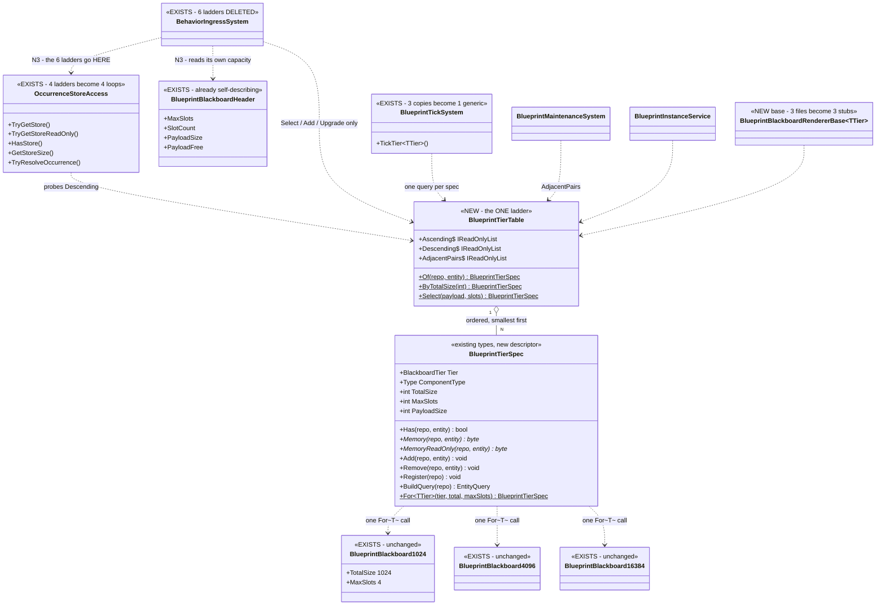
```mermaid
classDiagram
    class BlueprintTierSpec {
        <<existing types, new descriptor>>
        +BlackboardTier Tier
        +Type ComponentType
        +int TotalSize
        +int MaxSlots
        +int PayloadSize
        +Has(repo, entity) bool
        +Memory(repo, entity) byte*
        +MemoryReadOnly(repo, entity) byte*
        +Add(repo, entity) void
        +Remove(repo, entity) void
        +Register(repo) void
        +BuildQuery(repo) EntityQuery
        +For~TTier~(tier, total, maxSlots)$ BlueprintTierSpec
    }
    class BlueprintTierTable {
        <<NEW - the ONE ladder>>
        +Ascending$ IReadOnlyList
        +Descending$ IReadOnlyList
        +Of(repo, entity)$ BlueprintTierSpec
        +ByTotalSize(int)$ BlueprintTierSpec
        +Select(payload, slots)$ BlueprintTierSpec
        +AdjacentPairs$ IReadOnlyList
    }
    class BlueprintBlackboard1024 {
        <<EXISTS - unchanged>>
        +TotalSize 1024
        +MaxSlots 4
    }
    class BlueprintBlackboard4096 {
        <<EXISTS - unchanged>>
    }
    class BlueprintBlackboard16384 {
        <<EXISTS - unchanged>>
    }
    class OccurrenceStoreAccess {
        <<EXISTS - 4 ladders become 4 loops>>
        +TryGetStore()
        +TryGetStoreReadOnly()
        +HasStore()
        +GetStoreSize()
        +TryResolveOccurrence()
    }
    class BlueprintBlackboardHeader {
        <<EXISTS - already self-describing>>
        +MaxSlots
        +SlotCount
        +PayloadSize
        +PayloadFree
    }
    class BehaviorIngressSystem {
        <<EXISTS - 6 ladders DELETED>>
    }
    class BlueprintTickSystem {
        <<EXISTS - 3 copies become 1 generic>>
        +TickTier~TTier~()
    }
    class BlueprintMaintenanceSystem
    class BlueprintInstanceService
    class BlueprintBlackboardRendererBase~TTier~ {
        <<NEW base - 3 files become 3 stubs>>
    }

    BlueprintTierTable "1" o-- "N" BlueprintTierSpec : ordered, smallest first
    BlueprintTierSpec ..> BlueprintBlackboard1024 : one For~T~ call
    BlueprintTierSpec ..> BlueprintBlackboard4096 : one For~T~ call
    BlueprintTierSpec ..> BlueprintBlackboard16384 : one For~T~ call
    OccurrenceStoreAccess ..> BlueprintTierTable : probes Descending
    BehaviorIngressSystem ..> OccurrenceStoreAccess : N3 - the 6 ladders go HERE
    BehaviorIngressSystem ..> BlueprintBlackboardHeader : N3 - reads its own capacity
    BehaviorIngressSystem ..> BlueprintTierTable : Select / Add / Upgrade only
    BlueprintTickSystem ..> BlueprintTierTable : one query per spec
    BlueprintMaintenanceSystem ..> BlueprintTierTable : AdjacentPairs
    BlueprintInstanceService ..> BlueprintTierTable
    BlueprintBlackboardRendererBase ..> BlueprintTierTable
```

**What the picture shows that the prose hid:** two *different* collapses are happening, and conflating
them is how this task would grow a table nobody needs. ⭐ **`BehaviorIngressSystem`'s six ladders go to
`OccurrenceStoreAccess` + the HEADER** *(`N3` — no tier identity involved at all)*; only **`Select` /
`Add` / `Upgrade`**, where the *component type must be named*, reach for the table. ⛔ The table is for
sites that must **name a type**, never for sites that merely need **this entity's bytes**.

### 17.3 ⭐ Provisioning — **`sequenceDiagram`**

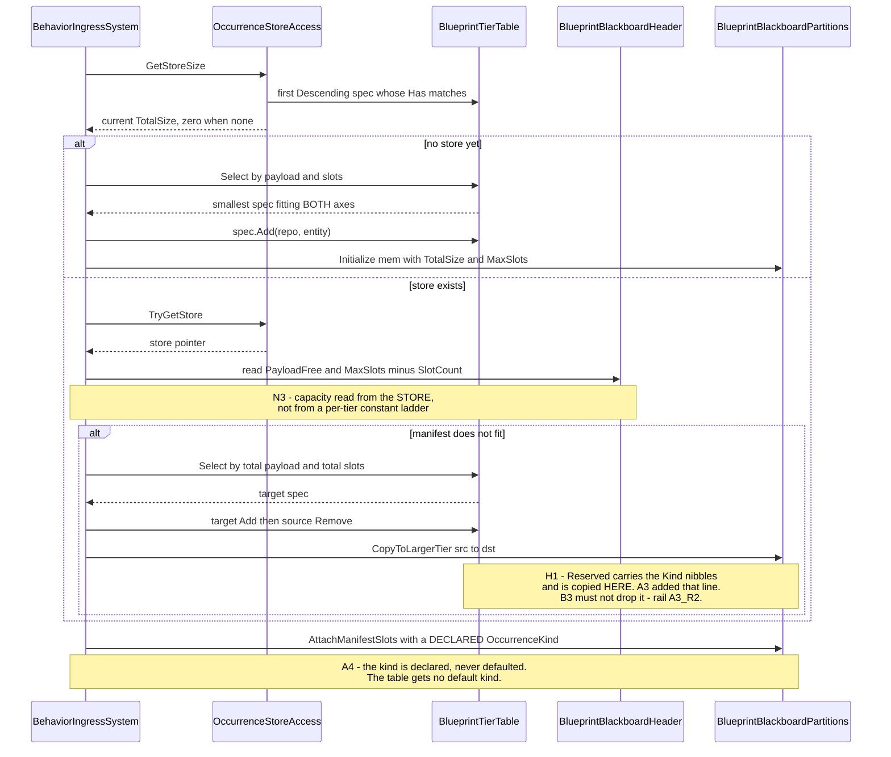
```mermaid
sequenceDiagram
    participant IN as BehaviorIngressSystem
    participant SA as OccurrenceStoreAccess
    participant TT as BlueprintTierTable
    participant HD as BlueprintBlackboardHeader
    participant AL as BlueprintBlackboardPartitions

    IN->>SA: GetStoreSize
    SA->>TT: first Descending spec whose Has matches
    SA-->>IN: current TotalSize, zero when none

    alt no store yet
        IN->>TT: Select by payload and slots
        TT-->>IN: smallest spec fitting BOTH axes
        IN->>TT: spec.Add(repo, entity)
        IN->>AL: Initialize mem with TotalSize and MaxSlots
    else store exists
        IN->>SA: TryGetStore
        SA-->>IN: store pointer
        IN->>HD: read PayloadFree and MaxSlots minus SlotCount
        Note over IN,HD: N3 - capacity read from the STORE,<br/>not from a per-tier constant ladder
        alt manifest does not fit
            IN->>TT: Select by total payload and total slots
            TT-->>IN: target spec
            IN->>TT: target Add then source Remove
            IN->>AL: CopyToLargerTier src to dst
            Note over TT,AL: H1 - Reserved carries the Kind nibbles<br/>and is copied HERE. A3 added that line.<br/>B3 must not drop it - rail A3_R2.
        end
    end
    IN->>AL: AttachManifestSlots with a DECLARED OccurrenceKind
    Note over IN,AL: A4 - the kind is declared, never defaulted.<br/>The table gets no default kind.
```

**What the picture shows that the prose hid:** the promotion arm calls `CopyToLargerTier`, which is
where **`H1`** lives. `A3` deliberately moved `H1` *out* of `O3a` and *into* `O3` so the `Kind` nibble
array could never be zeroed in the gap between them — ⇒ a table refactor that re-writes the promotion
call sites is exactly where that line gets dropped. ⭐ `A3_R2` is the rail that would catch it.

### 17.4 ⭐⭐ Who ticks it — **the MODULE diagram** *(obligation ①a: the dead edges matter)*

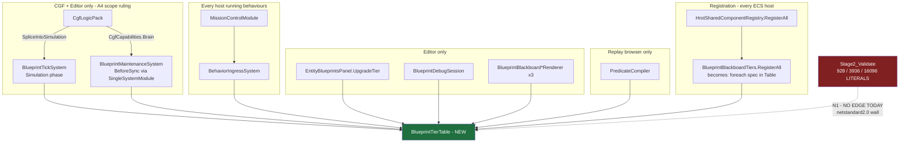
```mermaid
graph TD
    subgraph reg["Registration - every ECS host"]
        HSCR["HrotSharedComponentRegistry.RegisterAll"]
        BBT["BlueprintBlackboardTiers.RegisterAll<br/>becomes: foreach spec in Table"]
        HSCR --> BBT
    end

    subgraph cgf["CGF + Editor only - A4 scope ruling"]
        CLP["CgfLogicPack"]
        TICK["BlueprintTickSystem<br/>Simulation phase"]
        MAINT["BlueprintMaintenanceSystem<br/>BeforeSync via SingleSystemModule"]
        CLP -->|SpliceIntoSimulation| TICK
        CLP -->|CgfCapabilities.Brain| MAINT
    end

    subgraph every["Every host running behaviours"]
        MCM["MissionControlModule"]
        ING["BehaviorIngressSystem"]
        MCM --> ING
    end

    subgraph ed["Editor only"]
        PANEL["EntityBlueprintsPanel.UpgradeTier"]
        DBG["BlueprintDebugSession"]
        REND["BlueprintBlackboard*Renderer x3"]
    end

    subgraph rb["Replay browser only"]
        PC["PredicateCompiler"]
    end

    TABLE["BlueprintTierTable - NEW"]
    TICK --> TABLE
    MAINT --> TABLE
    ING --> TABLE
    PANEL --> TABLE
    DBG --> TABLE
    REND --> TABLE
    PC --> TABLE
    BBT --> TABLE

    COMP["Stage2_Validate<br/>928 / 3936 / 16096 LITERALS"]
    COMP -.->|N1 - NO EDGE TODAY<br/>netstandard2.0 wall| TABLE

    style COMP fill:#802020,color:#fff
    style TABLE fill:#1f6f3f,color:#fff
```

**What the picture shows that the prose hid — and it is the reason this diagram is required:** the
**red** box is a ladder with **no edge to the table at all**. Every other consumer can be made to read
one source of truth; `Stage2_Validate` cannot, because its assembly cannot reference `Fdp.Toolkits`
under `netstandard2.0`. ⇒ ⭐ **the tier budgets have a FOURTH, unreachable copy, and a `MaxSlots`
re-pick moves the numbers under it.** ⛔ That edge is the one piece of `O3a` that is not a refactor.

### 17.5 ⭐ `N1`'s fix — **the `A1` precedent, already proven on this programme**

⭐ `A1` hit this exact wall: `Hrot.AiEditor.Persistence` carries no project references by design, so
the unified slot key ships as an `internal`, netstandard2.0-subset source file **LINKED** into that
assembly *(the `BP-306` pattern)*. ⇒ ⭐⭐ **the tier ladder does the same**: a single
`BlueprintTierLadder.cs` holding *only* the `(TotalSize, MaxSlots, PayloadSize)` triples as `const`s,
in netstandard2.0-safe C#, **linked** into `Hrot.Blueprints.Compiler`. ⛔ Not the `BlueprintTierSpec`
type itself — that needs `EntityRepository` and is net8.0-only. **The numbers travel; the behaviour
does not.**

### 17.6 ⛔⛔ SCOPE — **`B3` splits in two, and the split is deliberate**

| step | what | risk |
|---|---|---|
| ⭐ **`B3`-① — THE COLLAPSE** | every site above onto the table / the seam, with the ladder values **UNCHANGED** (4 / 8 / 16) | ⭐⭐ **zero behaviour change by construction** — provable by the full suites plus the golden test. ⛔ Mechanical, and large |
| ⚠ **`B3`-② — THE RE-PICK** *(PLAN `W1`)* | new `MaxSlots` values + the linked ladder file for `N1` | 🔴 **a real behaviour change**: `MaxSlots` **12** on the 1024 tier costs `32+12×16=224` and drops payload `928 → 800`, so an asset whose state lands in **801–928 B** moves up a tier — and `Stage2_Validate`'s budget must move with it or the compiler and the runtime disagree |

⛔ **Doing both in one commit makes "did the collapse change anything?" unanswerable**, which is the
whole value of step ①. ⇒ they ship separately, in that order.


### ✅ AS-BUILT `2026-09-20` — **`B3`-① THE COLLAPSE IS SHIPPED** *(obligation ⑤)*

⭐ The ladder now exists once, as `BlueprintTierSpec` + `BlueprintTierTable`
*(`Fdp.Toolkits/Blueprints/Partitioning/`)*. 📐 **Diff shape: 18 files changed, +522 / −957 in C#
⇒ net −435 lines, plus 3 new files (543 lines, of which the majority is the rationale above).**
⛔ **Zero behaviour change intended, with ONE stated exception** — the editor hole in the table below.

| what collapsed | from → to |
|---|---|
| `OccurrenceStoreAccess` | 4 hand-rolled ladders → 4 calls to the table |
| `BehaviorIngressSystem` | **6** `N3` helpers → the seam + the header · `Select`/`Add`/`Upgrade` → the table. ⭐⭐ **`UpgradeTier` was the QUADRATIC one** — 3 tiers ⇒ 3 arms, 4 ⇒ 6 — and is now one body |
| `BlueprintTickSystem` | ⭐ **3 verbatim ~78-line `TickTier_*` methods → 1** *(verbatim proved by normalising the tier number and diffing: all three matched exactly)*, 3 query fields → one array, and the world-singleton `switch` → one call |
| `BlueprintMaintenanceSystem` | 2 copied `UpgradeTier_A_to_B` + 2 queries → `AdjacentPairs` + one `UpgradePair` |
| `BlueprintInstanceService` | 5 sites → the table; `GetTierMemoryAndMeta`'s 3-arm `switch` is 4 lines |
| `BlueprintMaterializationSystem` | select + resolve + add → the table; the `16384` caps → `Largest` |
| `EntityBlueprintsPanel` · `EntityBlueprintsEditModel` · `BlueprintDebugSession` · `PredicateCompiler` | each to the table; `BlueprintDebugSession.TryInstanceSlot<T>` **deleted** — its halves are `HasInView`/`BytesInView` |
| ⭐ **3 renderers** | 3 byte-identical ~80-line files → `BlueprintBlackboardRendererBase<TTier>` + 3 **fifteen-line** declarations *(the `[ImGuiRenderer]` attribute needs a concrete type)*, and **one** shared registry static instead of three ⇒ the wiring in `EditorSubsystem` **and** `CgfSubsystem` drops from 3 lines each to 1 |

| 🔴 the ONE behaviour change, and it is a FIX | |
|---|---|
| ⛔⛔ **`EntityBlueprintsPanel.UpgradeTier` silently corrupted a `1024 → 16384` jump** | its two hand-written `switch`es covered only ADJACENT promotions. A direct `1024→16384` added the 16384 component and matched **no copy arm** ⇒ the entity was left carrying **both**, the new one never initialised and never copied into. ⛔ Nothing repaired it: `BlueprintMaintenanceSystem` queries only ADJACENT pairs, and `1024+16384` is not one. ⚠ `BehaviorIngressSystem.UpgradeTier` always handled that jump ⇒ **the editor was the odd one out — an omission, not a policy.** ⭐ The generic body has no such gap |

| ⚠ what was deliberately NOT collapsed | why |
|---|---|
| `BlueprintStateTranslator.LegacyBlackboardKeys` | `N4` — historical scenario keys, frozen by history. ⛔ A new tier gets no legacy key |
| `BlackboardTier` / the compiler's `BlackboardTier : byte` / `BlackboardTierHint` | `N2` — unifying three enums is `A1`'s shape and its own task. ⚠ `B3` only requires that a new tier be **appended**, and `BlueprintTierTable`'s header says so |
| `Stage2_Validate`'s `928 / 3936 / 16096` | `N1` — it is `B3`-②'s work, together with the re-pick (§17.5, §17.6) |

| ⚠ one consequence of the SHARED renderer static, stated so it is not discovered later | ⭐ the three per-class `BlueprintRegistryAccessor` properties are KEPT as forwarders, so `BlueprintTierSummaryTests` and any other caller compile unchanged — ⛔ but they now address **one** backing field. ⇒ two test classes setting *different* tiers' accessors in parallel would clobber each other, where before they were independent. 📐 Measured: **`BlueprintTierSummaryTests` is the only class that touches them**, and xUnit runs a class serially, so there is no race today. ⚠ A second such class must share its collection |

| ⭐ rails — **7, in the seam's OWN suite** *(`R-142` ④, ⛔ not a new class)* | `OccurrenceStoreAccessTests.B3_R1..R7` |
|---|---|
| `B3_R1` ladder ordered ascending, `Descending` its exact reverse | `B3_R2` every spec agrees with its struct **and** `MaxSlots ≤ MaxKindSlots` |
| `B3_R3` `Select` gates on BOTH axes and falls through to `Largest` | `B3_R4` `Of` probes largest-first; the larger wins mid-promotion |
| `B3_R5` `AdjacentPairs` covers the ladder with no gaps | `B3_R6` `spec.Memory` is the SAME bytes the seam returns, and the header reports the spec's own capacity |
| `B3_R7` `RegisterAll` covers every tier *(the `CE-161` property)* | |

⭐ **Red-proof:** three inverse edits — `Descending` not reversed, `Select`'s slot axis dropped,
`AdjacentPairs` non-adjacent — reddened **4 rails** *(`R1`, `R3`, `R4`, `R5`)*; reverted, 18/18 green.

⭐⭐ **Golden test `hill-attack-close` re-run after `B3①`** *(port 8151, `--mode all`, `simTime 116`)*:
platoon at **`521.9 · 525.0 · 528.4 · 532.2`** on the baseline *(y `400 / 449 / 499 / 549`)*, both
targets at **`Health 0`**, **0 faults in the log**, `BrainInterrupts` present on every brain entity.
⚠ **Stated honestly: the x values are within ~1.3 m of the `B2` run, not bit-identical** — this is a
live multi-node run with real timing, not a deterministic replay, and the acceptance is *"the platoon
is back on the baseline and both targets are destroyed"*, which it is. ⛔ Do not read the golden as a
determinism check; `DeterminismRails` is that.

⭐ **The gate that mattered most here: `Hrot.AiEditor.Generators.Tests` 280/280, goldens UNMOVED.**
`B3①` touches no emitter, so any movement there would have meant the collapse reached further than
intended.

#### 🔴🔴 A NEW GATE FOUND BY BUILDING, NOT BY DESIGN — **`MaxSlots` has a HARD CEILING OF 16**

⛔⛔ **`W1` (the re-pick) cannot raise `MaxSlots` above `BlueprintBlackboardPartitions.MaxKindSlots`
= 16.** 📐 `A3`'s `Kind` nibble array lives in the header's 8-byte `Reserved` at **4 bits per slot**,
which is an exact fit for 16 and no more. ⇒ a tier with more slots has slots whose kind **cannot be
recorded**, and `BlueprintTickSystem`'s walker filters ON the declared kind — so every slot past the
16th would be **silently skipped**, not rejected.
⭐ §5a's suggested *"`MaxSlots` 12 on the 1024 tier"* is safely inside it; ⛔ but the ceiling was
nowhere written down, and *"12 leaves 800 B of payload"* reads like the only constraint.
✅ **Now enforced in `BlueprintTierSpec.For<T>`, which throws** — a gate, not a note — and pinned by
`B3_R2`.

### 📐 `B3②`'s PRE-MEASUREMENT — **the 801–928 B band is EMPTY, in BOTH populations** *(`2026-09-20`)*

⭐ The re-pick's only real risk was content moving up a tier: `MaxSlots 12` on the 1024 tier costs
`32 + 12×16 = 224` and drops payload **928 → 800**, so anything needing **801–928 B** would be
promoted. ⛔ That is a regression in someone's content, so it was measured before picking numbers.

| population | how it is gated | measured |
|---|---|---|
| **behaviour manifests** — 30 assets in `Hrot.AI.Behaviors/Assets/{HSMs,BTrees}` | `SelectTierForPayload(Σ(AlignUp(slot,8) + 16), slotCount)` | **max 320 B** *(`PlatoonHillAttack2`)*. ⭐ **Band population: 0** |
| **blueprint Instances** — 59 `.bp.json` in `Recipes/Blueprints` ⇒ 43 generated `*_Bp`, of which **41** expose `StateSize` *(the other two — `LibraryFunctionsDemo`, `SmokeMathLib` — are pure-function LIBRARIES with no instance state)* | `SelectByPayload(def.StateSize)` | **max 128 B** *(`HillAssault2DispatchWaveWithTargets`)*. ⭐ **Band population: 0** |

| behaviour-manifest distribution | assets |
|---|---|
| **0 B** *(no stateful slots)* | **17** |
| 1–64 B | 9 |
| 65–256 B | 3 |
| 257–800 B | **1** — `PlatoonHillAttack2`, 320 B |
| **801–928 B** | 🔴 **0** |
| > 928 B | **0** |

⇒ ⭐⭐⭐ **`MaxSlots 12` on the 1024 tier moves NOTHING.** The whole corpus sits **2.5× below** the
800 B floor it would create.

#### ⭐⭐ AND IT CONFIRMS §5a's CENTRAL CLAIM WITH REAL BYTES — **the binding axis is SLOTS, not bytes**

📐 `PlatoonHillAttack2` holds **8** stateful slots *(9 after `O4`'s root occurrence)* and **320 B**.
⛔ Today it is promoted to **16384** — on slot count alone, with payload **50× below** that tier's
capacity. ⭐ At `MaxSlots 12` the **1024** tier seats it *(12 slots, 800 B)* ⇒ **16× less memory for
the worst case in the corpus**, and every other asset fits too.

| ⚠ the ONE thing this measurement CANNOT settle, stated rather than assumed | |
|---|---|
| ⛔ **the root occurrence's own payload** | it does not exist until `O4`, so it cannot be measured — only bounded. ⭐ Using §5a's own figures *(`BehaviorTreeState` 64 B; root ≈ 64–164 B with params)*, one root slot costs **80–184 B**. ⇒ `PlatoonHillAttack2` becomes **9 slots / ~504 B**, still inside `1024@12`. ⚠ **Re-measure after `O4`**; the conclusion holds across the whole bounded range, but the number is an estimate, not a measurement |
| ⚠ **a consequence of the `MaxSlots ≤ 16` ceiling** | with 1024 at 12 slots, the 4096 and 16384 tiers can offer at most **4 more slots each** — ⇒ they exist for **BYTES**, not for slots. ⭐ Worth saying out loud: **nothing in the current corpus would select them at all** |

⭐ **Method, so it can be re-run:** the slot manifests are parsed from the **30 generated
`*.Registrar.g.cs`** under `Hrot.AI.Behaviors/obj/GeneratedFiles/` *(the production emitter output —
they carry `Marshal.SizeOf<T>()`, so the struct sizes came from reflection over the built
`Hrot.AI.Behaviors` assembly)*. ✅ **Cross-check: the slot COUNTS reproduce §5a's
`0×17 · 1×6 · 2×5 · 3×1 · 8×1` exactly**, which is what says the parse is faithful.

### ✅ AS-BUILT `2026-09-20` — **`B3②` THE RE-PICK IS SHIPPED** *(obligation ⑤)*

⭐ **The ladder is `12 / 16 / 16`** *(was `4 / 8 / 16`)*, and its numbers now live in ONE file —
`Fdp.Toolkits/Blueprints/Shared/BlueprintTierLadder.cs`, `internal`, `const`-only,
netstandard2.0-subset, **LINKED** into `Hrot.Blueprints.Compiler`.

| tier | `MaxSlots` | payload | change |
|---|---|---|---|
| 1024 | **4 → 12** | **928 → 800** | ⭐ costs 128 B, buys **8 slots** |
| 4096 | **8 → 16** | 3936 → 3808 | ⛔ **not optional** — see the hazard below |
| 16384 | 16 | 16096 | unchanged |

| what shipped | |
|---|---|
| ⭐⭐ **`BlueprintTierLadder`** — the numbers, once | `Stage2_Validate.cs:503-508`'s literals `928 / 3936 / 16096` are gone; it reads the linked consts. ⇒ **`N1` is CLOSED**: compile-time validation and runtime capacity can no longer drift, because they are one file |
| the tier structs READ the ladder | `BlueprintBlackboard{1024,4096,16384}` no longer declare `MaxSlots`/`TotalSize`/`PayloadSize` of their own |
| rails | **`B3_R8`** structs-agree-with-ladder · **`B3_R9`** ladder mirrors the allocator's `SlotEntrySize` / `MaxKindSlots` / header size · **`B3_R1`** gained the monotonic-`MaxSlots` assertion · `BlackboardLayoutTests` `SC3` updated to the new values |

| 🔴🔴 THE HAZARD THE RE-PICK CREATES, AND IT IS NOT OBVIOUS | |
|---|---|
| ⛔⛔ **`MaxSlots` must be NON-DECREASING up the ladder** | raising the small tier to 12 while leaving the medium tier at **8** makes promotion a **capacity REDUCTION**: `CopyToLargerTier` would be handed a `dstMaxSlots` **smaller than the slot count it is copying**. ⇒ 4096 had to go to 16 as well. 🔴 **And every other assertion in `B3_R1` would still have passed**, because `TotalSize` and `PayloadSize` kept increasing — the slots axis was simply not checked. ⭐ It is now |
| ⚠ **the ceiling makes the top two tiers share a value** | `MaxKindSlots` = 16, so 4096 and 16384 both sit at 16 ⇒ the assertion is **non-decreasing**, not strictly increasing. ⭐ Consequence worth saying out loud: **those two tiers now exist for BYTES only** — nothing in the current corpus would select them at all |

| ⚠ two things measured while building, neither of which was in the design | |
|---|---|
| ⛔ **`Hrot.Blueprints.Tests` cannot name the linked type** | it holds `InternalsVisibleTo` from **both** `Fdp.Toolkits` and `Hrot.Blueprints.Compiler`, so both copies are visible ⇒ **`CS0433`**. ⭐ `B3_R8`/`B3_R9` live in `Fdp.Toolkits.Tests` instead. ⚠ A property of that test assembly, **not** a defect in the link |
| ⭐ **drift between the two COPIES is impossible by construction** | it is one file on disk; dropping the link stops `Stage2_Validate` compiling. ⇒ what still needed a rail is a tier struct **re-declaring a literal of its own**, and that is exactly what `B3_R8` pins — red-proved by doing it |

⭐ **Red-proof:** three inverse edits — medium tier back to 8 slots, `SlotEntrySize` drifted to 8, and
a struct re-declaring `MaxSlots = 8` — reddened **`B3_R1`, `B3_R2`, `B3_R6`, `B3_R8`, `B3_R9`**.
Reverted, 20/20 green.

#### 🔴🔴 WHAT THE RE-PICK ACTUALLY COST — **THREE TESTS PINNED THE LADDER'S NUMBERS, NOT THEIR OWN INVARIANT**

⛔⛔ **The pre-measurement was right and I over-read it.** It measured **production content** and found
the 801–928 B band empty — that held. ⚠ It said nothing about **test fixtures**, and I took it to mean
*"nothing moves"*. 📐 Three tests reddened, in three different files, **all the same defect**:

| test | what it PINNED | what it actually OWNS |
|---|---|---|
| `BehaviorIngressStatefulTests.Assign_UpgradesTierSynchronously_BeforeFirstTick` | `const int = 900`, with the comment *"PayloadSize for 1024 = 928"* | *"a nearly-full tier is upgraded SYNCHRONOUSLY when a manifest does not fit"* |
| `BlueprintMaterializationSystemTests.Materialize_ExceedsCeiling_TruncatesWithoutThrowing` | `HasComponent<BlueprintBlackboard16384>` | *"exceeding the ceiling TRUNCATES and does not throw"* |
| `PartitionAllocatorTests.Attach_Fragmented_ReturnsFalseEvenIfTotalFreeBigEnough` | `112 / 112 / 112 / 496`, filling 928 **exactly** | *"total free ≥ request but no CONTIGUOUS block ⇒ fail"* |

| ⭐ the two things worth carrying forward | |
|---|---|
| ⛔⛔ **TWO OF THE THREE FAILED WHILE BUILDING THEIR SCENARIO** | ⚠ the nastier variant: the test is not wrong about behaviour, it simply **cannot reach its own assertion** any more. 📌 `Assign_Upgrades…` died on `Assert.True(ok, "Pre-existing slot must attach successfully")` — a **pre-condition** |
| ⭐⭐ **the ceiling test was a SECOND confirmation of the win** | 📐 20 blueprints × 50 B truncate to 16 slots / 800 B. Under `4/8/16` nothing below 16384 held 16 slots; at `12/16/16` the **4096** tier does — **4×**, independent of the `PlatoonHillAttack2` result |

⇒ ⭐ **All three now derive from `BlueprintTierLadder` / `BlueprintTierTable`**, so `B4`'s 256 tier
cannot reproduce it. ⚠ **And the general lesson is not "measure harder"** — the measurement was correct.
🔒 **It is that a CONSTANT-CHANGE task must grep the test tree for the OLD VALUES, not only reason about
production content.**

⭐⭐ **Golden test `hill-attack-close` re-run after `B3②`** *(port 8161, `--mode all`, `simTime 116`)*:
platoon at **`522.7 · 524.8 · 528.3 · 531.1`** on the baseline *(y `400 / 450 / 498 / 549`)*, both
targets at **`Health 0`**, **0 faults**. ⚠ Within ~1 m of the `B3①` run, as expected for a live
multi-node run — ⛔ still not a determinism check.

⭐ **Suites, all at or above baseline after the three fixture repairs:** `Fdp.Toolkits.Tests`
**2241/0** *(2239 + 2 new rails, exact)* · `Hrot.Blueprints.Tests` **3970/0** · `Hrot.SimHost.Tests`
**1004/3** *(the same three base-proved pre-existing)* · `Hrot.Presentation.Tests` **252/0** ·
`Hrot.Editor.Tests` **409/0** *(green on re-run; the known GC flake)* ·
⭐⭐ **`Hrot.AiEditor.Generators.Tests` 280/280 with goldens UNMOVED — through a LADDER CHANGE.**
🔒 That is not a null result: it proves the emitters bake **no tier constants** into generated code,
which is what makes `O3b`'s fourth tier additive rather than another regeneration.

⇒ ✅ **PLAN `W1` is ANSWERED and `O3a` is COMPLETE.** ⭐ `O3b` (the 256 tier, task `B4`) is now one
entry in `BlueprintTierTable.Ascending` plus a component struct and an id — ⛔ appended to
`BlackboardTier`, never inserted (`N2`).

### 📐 `B4`'s PRE-MEASUREMENT — **the 256 tier's `MaxSlots` is 3, not 2** *(`2026-09-20`)*

⛔⛔ **This OVERTURNS PLAN `W4`'s lean** *(*"1 or 2. 77 % of behaviours need ≤ 2 ⇒ **2** is the value
that earns the tier; 1 makes it near-useless"*)*. ⚠ That figure counted **slots only**. With the
BYTES included the answer moves, and `3` is a genuine maximum rather than a marginal preference.

| `MaxSlots` | payload | assets that fit | |
|---|---|---|---|
| 1 | 208 B | 17/30 | 56 % |
| 2 | 192 B | 22/30 | 73 % |
| ⭐ **3** | **176 B** | **25/30** | ⭐ **83 %** |
| 4 | 160 B | 24/30 | 80 % |
| 5 | 144 B | 24/30 | 80 % |
| 6 | 128 B | 18/30 | 60 % |

#### 📐 WHY THE ROOT OCCURRENCE IS NOW MEASURED, NOT BOUNDED

⭐ §5a priced the root from *"typical params"* — asserted, never measured. ⛔ That assumption was the
**whole 8-byte margin** the resumption warned about. 📐 Measured from the **baked param projections in
the 30 generated registrars** *(`Unsafe.As<byte, TParams>(… AddByteOffset(…, (nint)OFFSET))`, so the
region used is `max(offset + sizeof(TParams))`)*, with DTO sizes by reflection:

| | |
|---|---|
| **max params region used** | **89 B** *(`PlatoonHillAttack2`)* — against the **100 B** cap ⇒ ⭐ *"typical params"* is real, and one asset is within 11 B of the ceiling |
| **assets with ZERO baked params** | **16 of 30** |
| ⭐ **root occurrence** = `AlignUp(state + params, 8) + 16` | BTree state = `BehaviorTreeState` **64 B**; ⚠ HSM state = **`BrainHsm128`**, ✅ **verified hard-coded** at `BehaviorTkbTranslator.cs:121-122` *(§9.4's finding, confirmed in code rather than quoted)* |
| **total per asset** | root + every stateful slot, each `AlignUp(size,8) + 16` |

| ⚠ the five that fit NO 256 tier at any `MaxSlots`, and why that is correct | |
|---|---|
| `PlatoonHillAttack2` 9 slots / 496 B · `HillAssault2I_Smoke` 3 / 280 · `PlatoonHillAttack` 2 / 272 · `HsmVariableShowcase` 3 / 192 · `T39_TwoDistinctPrimitives` 4 / 184 | ⭐ none of these is *"the simple case"* the 256 tier exists to price. They land on **1024**, which at `MaxSlots 12` now holds all of them comfortably |

| ⛔ what this measurement does NOT settle | |
|---|---|
| ⚠ **it is POST-`O4` arithmetic for a design that is not built** | the root occurrence does not exist yet. The composition used here — **state + params in ONE slot** — is this document's own §5a reading. ⇒ ⭐ **re-measure after `O4`**, and treat `3` as the value to build toward rather than a constant already earned |
| ⚠ **`HsmVariableShowcase` sits exactly on the line** | 3 slots / **192 B** — it fits `@2`'s payload *exactly* but needs 3 slots, and at `@3` the payload drops to 176 so it misses on bytes. ⛔ A one-asset swing either way changes the 83 % |

### ✅ AS-BUILT `2026-09-20` — **`O3b` / `B4` — THE 256 TIER IS SHIPPED** *(obligation ⑤)*

⭐⭐ **And it was genuinely additive, which is what `O3a` was FOR.** The whole tier is:

| what | where |
|---|---|
| 3 consts | `BlueprintTierLadder.Tier256{TotalSize,MaxSlots,PayloadSize}` = `256 / 3 / 176` |
| 1 struct | `BlueprintBlackboard256` — reads the ladder, declares no number of its own |
| 1 id | `GlobalComponentIds.BlueprintBlackboard256 = 303` |
| 1 enum member | `BlackboardTier.B256 = 3` — ⛔ **APPENDED** |
| 1 table entry | first in `BlueprintTierTable.Ascending` *(size order)* |
| 1 renderer | **4 lines**, on `B3①`'s generic base |
| compiler | one `Auto` arm + `BlackboardTierHint.Force256` *(appended)* |

⛔ **Nothing else changed.** ⭐ Registration, promotion, probe order, adjacent pairs, the tick walker,
the seam, every consumer — all pick it up from the table. 📐 `AdjacentPairs` became **3** pairs with
no code edit; the ladder is `256 → 1024 → 4096 → 16384`, `MaxSlots` `3 → 12 → 16 → 16`
*(non-decreasing ✅)*, payload `176 → 800 → 3808 → 16096` *(strictly increasing ✅)*.

| ⚠ two places the enum ordinal bites, both handled | |
|---|---|
| ⛔⛔ **`BlackboardTier.B256 = 3`, the LAST member, though 256 is the SMALLEST tier** | the ordinal is **ABI** (§17.1 `N2`). ⇒ **the enum's numeric order deliberately is NOT the size order** — `BlueprintTierTable.Ascending` is the size order. ⭐ Pinned by **`B4_R2`**, which red-proves by "tidying" the enum into size order |
| ⛔ **`BlackboardTierHint.Force256` is also appended** | it is serialised into `.bp.json` as `TierHint`, so its ordinals reach assets on disk |

| ⭐ rails | |
|---|---|
| **`B4_R1`** — ⛔⛔ **ANTI-VACUITY, and it is the point** | adding a tier to the table proves nothing: `B3_R1/R2/R5/R8` all stay green for a tier `Select` never returns. This pins that the measured simple case — a bare root occurrence, and 3 occurrences filling the payload — **lands here**, and that it does **not** swallow one slot or one byte too many |
| **`B4_R2`** — the enum is append-only, not in size order | |
| ⭐ the four existing table rails cover the new tier **automatically** | `B3_R1` ordering + monotonic `MaxSlots` · `B3_R2` spec-vs-struct + the `MaxKindSlots` ceiling · `B3_R5` adjacent pairs · `B3_R8` ladder agreement. ⚠ `OccurrenceStoreAccessTests`'s world now calls `BlueprintTierTable.RegisterAll` instead of hand-listing three tiers — a hand-list would have left every rail silently testing a smaller ladder |

⭐ **Red-proof:** ① `Select` skipping the smallest tier reddened **`B4_R1`** *(and `B3_R3`)*;
② "tidying" the enum into size order reddened **`B4_R2`**. Reverted, 22/22 green.

## 17.7 🔴🔴🔴 `B4`'s REAL FIND — **the 256 tier broke the "at most one store" invariant, and the bug was in PRODUCTION** *(`2026-09-20`)*

> ⭐⭐ **This is not a test-fixture story.** `O3b` was designed as, and measured as, a purely additive
> change — §17's as-built says *"nothing else changed"*, and for the table, the registration, the probe
> order, the tick walker and the seam that was **true**. ⛔ It was not true for the two sites that pick a
> tier from **CONTENT** and then add that component.

### ⭐ What the gate found

📐 `Hrot.Blueprints.Tests` **192 failed / 3779 passed**, `Hrot.SimHost.Tests` **10 failed** — after
`Fdp.Toolkits.Tests` and `Hrot.AiEditor.Generators.Tests` had both been driven to green. ⚠ **Two
distinct causes wearing one label**, and only the second is a real defect:

| # | cause | verdict |
|---|---|---|
| **①** | ⛔ **`Component BlueprintBlackboard256 is not registered`** — 14 test worlds spelled a **hand-list** of `RegisterComponent<BlueprintBlackboard…>()` calls. ⭐ Production never had this: it registers from the table | ⚠ **a test-tree defect**, and the *exact* lesson §17's `B3②` retro already drew — *"a constant-change task must grep the test tree for the OLD VALUES"*. 🔴 **The retro was written and the sweep still missed this shape**, because the ladder change there was a NUMBER and this one is a TYPE |
| **②** | 🔴🔴 **an entity ended up carrying TWO blackboard components** | ⛔⛔ **a PRODUCTION defect in `BlueprintInstanceService.AttachToEntity` and `BlueprintMaterializationSystem`** |

### 🔴🔴 ② — the defect, exactly

📌 `AttachToEntity` chose its tier with `ChooseTier(def.StateSize)` — the payload-only selector — and then
called `EnsureTierComponent`, which adds that component **if absent**. ⛔ **Neither step looks at the tier
the entity already carries.** ⇒ whenever the content-derived pick differs from the tier already present,
a **second** store is added beside the first.

| ⚠ why it lay dormant until `O3b` | |
|---|---|
| ⭐ with the ladder `1024 / 4096 / 16384`, **1024 was the floor** | ⇒ `ChooseTier` could only ever name a tier **≥** one already present, so the mismatch needed a *large* instance landing on a small-tier entity — rare, and it left the smaller store **orphaned** rather than shadowing the new one |
| 🔴 **the 256 tier made the DOWNGRADE direction the common case** | every small instance attached to an entity already carrying 1024 now chose **256**. ⇒ the slots were written into a fresh 256 store while `OccurrenceStoreAccess` probes **largest-first** and returned the **empty 1024** |
| ⛔⛔ **and it is SILENT at the call site** | both attaches returned `BlueprintAttachStatus.Attached`. 📌 `BlueprintStateTranslatorTests.Extract_TwoBlueprintsAttached` asked for the assignments of two successfully-attached blueprints and got **0** |

⇒ ⭐⭐⭐ **The invariant broken is the one `OccurrenceStoreAccess`'s own header states and every consumer
reads through — *"an entity carries AT MOST ONE tier, so the first match is authoritative."*** ⚠ Nothing
enforced it; it was a convention held by the fact that the ladder had a floor.

### ✅ The fix — **one rule, in the table, shared by every site that provisions a store**

| what | where |
|---|---|
| ⭐⭐ **`BlueprintTierTable.EnsureAtLeast(repo, entity, required)`** — *"the tier this attach lands on, given what the entity already carries"*: **never a second store, never a downgrade**, and a **promotion** when the content genuinely outgrows the current tier | the two content-driven sites call it: `BlueprintInstanceService.AttachToEntity` and `BlueprintMaterializationSystem` |
| ⭐⭐ **`BlueprintTierTable.Promote(repo, entity, from, to)`** — **THE** promotion body: add larger, `CopyToLargerTier`, remove smaller | §17.1's inventory found **three** copies (`BehaviorIngressSystem.UpgradeTier`, `BlueprintMaintenanceSystem.UpgradePair`, `EntityBlueprintsPanel.UpgradeTier`); `B3①` left them as three because each was already correct. ⛔ `B4` needed a **fourth** caller, and a fourth copy is what ruling 9 forbids ⇒ all four now share one body |
| ⭐ **`BlueprintTierTable.RegisterUpTo(world, maxTotalSize)`** | cause ① — the 14 hand-lists become table-driven **while keeping their deliberate exclusion of the big tiers** (a registered component reserves `TotalSize × MAX_ENTITIES`; the 16384 tier alone is ~16 GB and exceeds the allocator's paranoid-mode cap) |
| ⭐ **`BlueprintTierSpec.IsRegistered(repo)`** | the type-erased probe a table-driven walk needs, because querying an unregistered component throws and those bounded worlds genuinely lack the big tiers |

| ⭐ rails | |
|---|---|
| **`B4_R3`** | attaching a **small** instance to an entity already carrying **1024** leaves **exactly one** tier — the one it had — and the slot is readable through the seam. ⛔ This is the failing case, pinned |
| **`B4_R4`** | an instance that **outgrows** the current tier **PROMOTES** it, carrying the pre-existing slot across — ⛔ not a second component with the old slots stranded |

### ⭐⭐⭐ THE LESSON, and it is about how "additive" was CLAIMED

⛔⛔ **`O3b` was called additive on the strength of the TABLE being additive.** 📐 That was measured and it
is true. ⚠ **What was never asked is the question that decides it:** *"which sites derive a tier from
CONTENT rather than from the entity, and what happens when those two disagree?"* ⇒ 🔒 **adding a member to
an ordered ladder is only additive for consumers that READ the ladder; it is a behaviour change for every
consumer that SELECTS from it** — and §17.1's inventory had already listed `Select` / `SelectByPayload`
sites separately from the probe sites. **The information was on the page; the question was not asked.**

⚠ **And the anti-vacuity rail `B4_R1` did not catch it**, correctly: it pins that `Select` *returns* the
new tier, which is exactly the behaviour that broke the invariant. ⇒ ⭐ **a rail proving a new thing is
reachable is not a rail proving it is safe to reach.**

### 🔴🔴 §17.7a — **THE SECOND DEFECT: `BlackboardTier` IS COMPARED WITH `>` AND ITS ORDINAL IS NOT THE SIZE ORDER**

⛔⛔ **Found the same way as the first — by the gate, not by the design.** ⭐ And it is the *exact*
consequence of a constraint this document already states and `B4_R2` already pins:

| the two facts, both already written down | |
|---|---|
| §17.1 `N2` | **the enum ordinal is ABI** ⇒ a new tier is **APPENDED**, never inserted ⇒ `BlackboardTier.B256 = 3` |
| §17.2 / the table's header | **`BlueprintTierTable.Ascending` is the SIZE order**, and 256 is **first** |

⇒ 🔴 **`B256 > B1024` is `true` by ordinal and `false` by size.** ⛔ Two sites in
`EntityBlueprintsEditModel` spelled the comparison as `tier > currentTier`:

| site | what it did once 256 existed |
|---|---|
| `ComputeProjection` | a **DOWNGRADE** to 256 set `UsageStatus.UpgradeNeeded` |
| `BuildCommitPlan` | the same downgrade was written into `plan.UpgradeToTier` ⇒ the editor would have offered *"upgrade"* to a **smaller** store |

⚠ **`BehaviorIngressSystem:319` has the identical-looking `targetTier > currentTier` and is CORRECT** —
📐 checked, not assumed: both operands there are `TotalSize` **ints**, because `SelectTierForPayload`
returns `.TotalSize`. ⭐ Worth stating, because the two lines read the same and only one is a bug.

✅ **Fixed** by `BlueprintTierTable.IsLargerThan(a, b)` — a **size** comparison with the reason in its
doc — and pinned by **`B4_R5`**, which asserts the ordinal order and the size order genuinely
**disagree** somewhere. ⭐ That framing is deliberate: the rail fails if someone ever "tidies" the enum
into size order, which is the ABI break `B4_R2` forbids, **and** it fails if the helper is inlined back
into `>`.

| ⭐⭐⭐ WHAT THIS ADDS TO §17.7's LESSON | |
|---|---|
| ⛔ §17.7 said: *"additive for consumers that READ the ladder, a behaviour change for every consumer that SELECTS from it."* | 🔒 **Extend it: and for every consumer that COMPARES tiers.** 📌 An append-only enum whose ordinal is ABI **cannot** stay size-ordered, so every `<`/`>` on it becomes wrong the first time a tier is added out of size order — which is the first time a tier is added at all, at the small end |
| ⚠ **the honest version of how this was found** | ⛔ **not by the inventory, and not by reasoning.** `BuildCommitPlan_Paused_RemoveAndAdd` failed with *"`Assert.Null()` Failure: `Nullable<BlackboardTier>` has a value"*, and only reading it explained why. ⇒ ⭐ the suites earned their keep here; the design did not predict it |

### ✅ §17.7b — **THE `B4` GATE, AFTER BOTH DEFECTS** *(`2026-09-20`)*

⭐⭐ **Golden test `hill-attack-close`** *(port 8171, `--mode all`, `simTime 120`)*: platoon at
**`523.1 · 525.1 · 529.2 · 531.0`** on the baseline *(y `399.5 / 450.2 / 498.3 / 549.2`)*, both targets
at **`Health 0`**, **0 faults** in a 439-line run log, `BrainInterrupts` present on every brain entity.
⚠ Within ~1 m of the `B3②` run — a live multi-node run, ⛔ **not a determinism check**.

| suite | result | vs baseline |
|---|---|---|
| `Fdp.Toolkits.Tests` | ✅ **2246 / 0** | 2243 + `B4_R3` + `B4_R4` + `B4_R5`, exact |
| `Hrot.Blueprints.Tests` | ✅ **3971 / 0** *(18 skipped)* | ⛔ **was 192 FAILED**; the 18 skips are the known environment-dependent set *(8 static `[Fact(Skip=)]` + 10 `Skip.If`)*, not a regression |
| `Hrot.SimHost.Tests` | ⚠ **3 failed / 1004** | ⭐ **exactly the pre-existing trio, by name**: `NodeRolePersistenceRails`, `MapPresentationParityRails`, `FullBranchPipelineTests`. ⛔ None blueprint-related |
| `Hrot.Diagnostics.Breakpoints.Tests` | ✅ **165 / 0** | unchanged |
| `Hrot.AiEditor.Generators.Tests` | ✅ **280 / 0** | ⭐⭐ **goldens UNMOVED through a ladder change** — the emitters bake no tier constants |
| `Hrot.ClusterRunner.Integration.Tests` | ⚠ **compiles, 0 errors** | ⛔ **not run** — outside this lane's gate set. Its two `ReadCount` ladders were collapsed here, so it is named rather than left silent |

⭐ **All seven projects built with 0 errors**, so no row above is a stale binary *(traps ⑦ / ⑫ / ⑱ / ㉑)*.

#### ⚠ THE TEST-SIDE COST, STATED HONESTLY — **192 failures in 14 classes, and NONE of them a bad test**

📐 Every one encoded the ladder rather than the property it protects, in **four** distinct shapes:

| shape | what it spelled | what it meant |
|---|---|---|
| **registration** | a hand-list of `RegisterComponent<BlueprintBlackboard…>` | *"this world can hold blueprint state"* ⇒ `BlueprintTierTable.RegisterUpTo` |
| **presence** | `HasComponent<BlueprintBlackboard1024>` | *"a store was provisioned"* ⇒ `OccurrenceStoreAccess.HasStore` |
| **resolution** | `GetComponentRW<BlueprintBlackboard1024>` — ⛔ often a **three-arm ladder summing across tiers an entity can only ever have one of** | *"this entity's bytes"* ⇒ `TryGetStore` |
| **capacity** | `"fill the B1024 tier (max 4 slots)"` | *"fill the store"* — ⛔⛔ and **`MaxSlots` is NOT the capacity**: 64 B of state fills the 256 tier's 176 B payload at **2**, while `MaxSlots` is 3 ⇒ fill until the store says full |

🔒 **The rule that falls out, and it is cheaper than any of this:** a test may name a tier **only when
the tier is its subject** — a promotion asserting the entity moved OFF one and ONTO another.
⭐ Three sites legitimately do, and now say so in a comment. ⛔ Everywhere else the name was a stand-in
for *"the store"*, and the seam has expressed that since `A2`.


## 18. 🔴 `O4` / `C1` — **RAIL ① IS RED, AND THE MECHANISM IS NOW MEASURED** *(`2026-09-20`)*

⭐⭐ §3.1 asserted the shared-`BehaviorTreeState` defect is *"in shipped code today"*. ✅ **It is, and
here is the measurement rather than the assertion** — rail
`HostedSubtreeCursorTests.O4_R1_AHostedSubtreeKeepsItsOwnCursor`
*(`FDP/Toolkits/Fdp.Toolkits.Tests/Behavior/`)*, red before any `O4` code:

```
BUILD errors=0     Expected: 1   Actual: 2
tick1: RunningNodeIndex=1  childFirstLeafEntries=1
tick2: RunningNodeIndex=1  childFirstLeafEntries=2     ← the child RESTARTED
```

### 18.1 ⭐ The mechanism, end to end

| step | what happens |
|---|---|
| **①** | `BTreeOrchestratorEmitCore` emits the hosting action as `…Tick(ref subBb, ref state, ref ctx)` — the **master's** state. ⚠ Approach A at **`:142`**, the COPY IN → TICK → COPY OUT variant at **`:171`** *(§3.1 cites `:143-144/:176`; the lines drifted, the shape did not)* |
| **②** | the child ticks, ends `Running` at its own leaf, and `ExecuteAction` writes `state.RunningNodeIndex = <child's node>` |
| **③** | 🔴 the host's own `ExecuteAction` then writes `state.RunningNodeIndex = <host's hosting node>` — **after** the action returns ⇒ **the host always wins; the CHILD is destroyed** |
| **④** | next tick, `ExecuteSequence` resumes by skipping a child only when `RunningNodeIndex >= childIndex + SubtreeOffset`. The host's index is **below** the child's running-leaf threshold ⇒ **the child re-enters its FIRST leaf** |

⇒ ⭐⭐ **`O4`'s fix — the hosted occurrence gets its own `BehaviorTreeState` in its own slot — makes
③ impossible, because there is no longer one field to overwrite.**

### 18.2 ⚠⚠ WHY NOTHING CAUGHT THIS — **every subtree test asserts the generated TEXT**

📐 Measured: `TheOrchestratorCopyTickCopyTests` · `TheMasterDeclaresTheSubtreeSliceTests` ·
`TheOrchestratorIsGeneratedTests` · `BTreeOrchestratorEmitterTests` — **all four are emit-level**, and
`Tick(ref subBb, ref state, ref ctx)` is exactly what the defect looks like **when it is correct**.
⇒ 🔒 **there was no runtime rail for hosted-subtree cursor behaviour at all.** ⭐ That is the gap rail ①
closes, and it is worth more than the fix: the fix is one argument, the rail is what keeps it fixed.

⛔ **It deliberately does NOT live in `Fbt.Tests`** — that is ExtDeps and outside the root solution,
and `O4`'s defining property is proving the model with **zero** ExtDeps change (§4.1). ⭐ The kernel is
not at fault; the ORCHESTRATOR's argument is.

### 18.3 ⛔⛔ TWO WRONG TURNS GETTING HERE, BOTH WORTH KEEPING

| # | the miss | the lesson |
|---|---|---|
| **①** | 🔴 **The first rail asserted the HOST resumes its hosting node — and PASSED.** ⇒ it reproduced nothing, while reading as if it had | ⭐⭐ **the host is the side that WINS**, because its `ExecuteAction` writes *after* the hosting action returns. 🔒 **When two parties share one field, measure the one that writes FIRST** — it is the one whose value is lost |
| **②** | 🔴🔴 **The corrected rail then "passed" too — from a STALE BINARY.** The test was launched with `--no-build` while a `dotnet build` was still in flight in another background job. ⇒ I reported *"two reproductions came out green"* and speculated the defect might be LATENT rather than shipped | ⛔⛔ **trap ㉑ covers a build that FAILED; it did not cover a build still RUNNING.** ⭐ The fix is the same shape: **the build verdict and the test result must come from ONE command**, serialized — `BUILD errors=0` printed directly above `Expected/Actual`, as in the block at the top of this section |

⚠ **Stated plainly because it nearly reached a document:** the *"maybe it is latent like §3.2"*
reading was **wrong**, and it was wrong because of tooling, not analysis. 📌 §3.2's correction was real;
this is not another one.

## 19. ⭐⭐⭐ `O4` / `C1` — **THE BUILD DESIGN** *(authored `2026-09-20`, `behaviors` lane)*

> ⭐ **build-state: READY-TO-BUILD**, pending the user's nod on §19.3's four decisions.
> ⛔ §3.1 and §18 carry the *why*; this section is the *what*.

### 19.1 ⛔ INVENTORY — **and the headline is that `O4` NEEDS NO NEW MACHINERY**

| query | result |
|---|---|
| `search_graph(name_pattern=".*StatefulSlot.*", label="Class")` | **4**, `has_more:false` — `StatefulSlotInfo`, `StatefulSlotManifestBuilder`, 2 test classes |
| `search_graph(name_pattern=".*(Occurrence\|StatefulSlot).*", label="Enum")` | **4**, `has_more:false` — `OccurrenceKind`, `OccurrenceSlotScope`, `StatefulSlotRole`, `StatefulSlotScope` |
| `grep` the orchestrator's emission | `BTreeOrchestratorEmitCore:142` · `:171` — two sites, both `ref state` |

| ⭐⭐⭐ what ALREADY EXISTS, measured — each one was a thing `O4` might have had to build | |
|---|---|
| ⭐⭐ **a chain-capable slot key** | `OccurrenceSlotKey.ComputeNested(hostKey, siteId, assetId, scope, nodeVisualId, variableId)` — **`A1` built it**, and its root case is the identity. ⇒ 🔒 **§3.1's `F5` objection *("the existing key cannot express this")* is already PAID.** `O4` computes a key; it does not design one |
| ⭐⭐ **a declared kind** | `OccurrenceKind.BTree = 2`, whose own doc-comment already reads *"stateful node working state, and (from `O4`) tree state + params"* ⇒ the nibble needs no new member |
| ⭐⭐ **the store, and a seam to reach it** | `OccurrenceStoreAccess.TryGetStore(repo, entity, out _)`; `BTreeContext` carries **`Self`** and **`World`**, so the emitted orchestrator can resolve bytes from what it is already handed |
| ⭐ **provisioning** | `BehaviorIngressSystem` already walks a manifest and attaches every slot, declaring each one's `Kind` (`A4`) |
| ⭐ **a role** | `StatefulSlotRole.State = 1` |

⇒ ⭐⭐⭐ **`O4` is: emit one more manifest entry per hosting site, and change one argument at two emit
sites.** ⛔ That is the whole shape — which is exactly what §6 predicted when it said `O4` proves the
model with **zero** ExtDeps change.

### 19.2 ⭐ The model — `classDiagram`

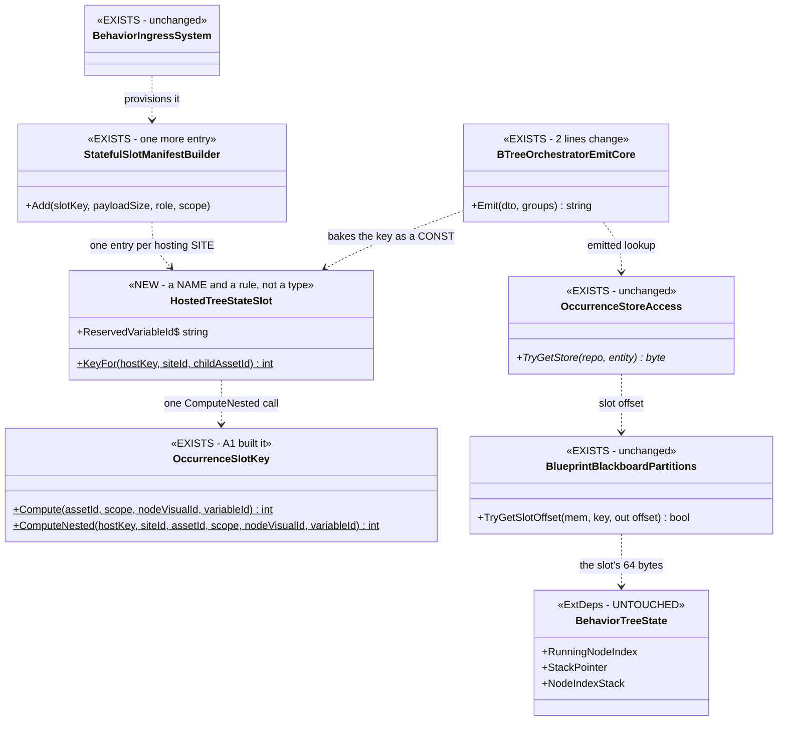
```mermaid
classDiagram
    class BTreeOrchestratorEmitCore {
        <<EXISTS - 2 lines change>>
        +Emit(dto, groups) string
    }
    class OccurrenceSlotKey {
        <<EXISTS - A1 built it>>
        +Compute(assetId, scope, nodeVisualId, variableId)$ int
        +ComputeNested(hostKey, siteId, assetId, scope, nodeVisualId, variableId)$ int
    }
    class HostedTreeStateSlot {
        <<NEW - a NAME and a rule, not a type>>
        +ReservedVariableId$ string
        +KeyFor(hostKey, siteId, childAssetId)$ int
    }
    class StatefulSlotManifestBuilder {
        <<EXISTS - one more entry>>
        +Add(slotKey, payloadSize, role, scope)
    }
    class OccurrenceStoreAccess {
        <<EXISTS - unchanged>>
        +TryGetStore(repo, entity) byte*
    }
    class BlueprintBlackboardPartitions {
        <<EXISTS - unchanged>>
        +TryGetSlotOffset(mem, key, out offset) bool
    }
    class BehaviorTreeState {
        <<ExtDeps - UNTOUCHED>>
        +RunningNodeIndex
        +StackPointer
        +NodeIndexStack
    }
    class BehaviorIngressSystem {
        <<EXISTS - unchanged>>
    }

    BTreeOrchestratorEmitCore ..> HostedTreeStateSlot : bakes the key as a CONST
    HostedTreeStateSlot ..> OccurrenceSlotKey : one ComputeNested call
    BTreeOrchestratorEmitCore ..> OccurrenceStoreAccess : emitted lookup
    OccurrenceStoreAccess ..> BlueprintBlackboardPartitions : slot offset
    BlueprintBlackboardPartitions ..> BehaviorTreeState : the slot's 64 bytes
    BehaviorIngressSystem ..> StatefulSlotManifestBuilder : provisions it
    StatefulSlotManifestBuilder ..> HostedTreeStateSlot : one entry per hosting SITE
```

**What the picture shows that the prose hid:** every box but one says **EXISTS**, and the one new box
is **a name and a rule, not a type**. ⛔ `BehaviorTreeState` is ExtDeps and is *untouched* — the slot
holds the existing 64-byte struct, it does not redefine it.

### 19.3 ⭐⭐ Sequence, and the four decisions — `sequenceDiagram`

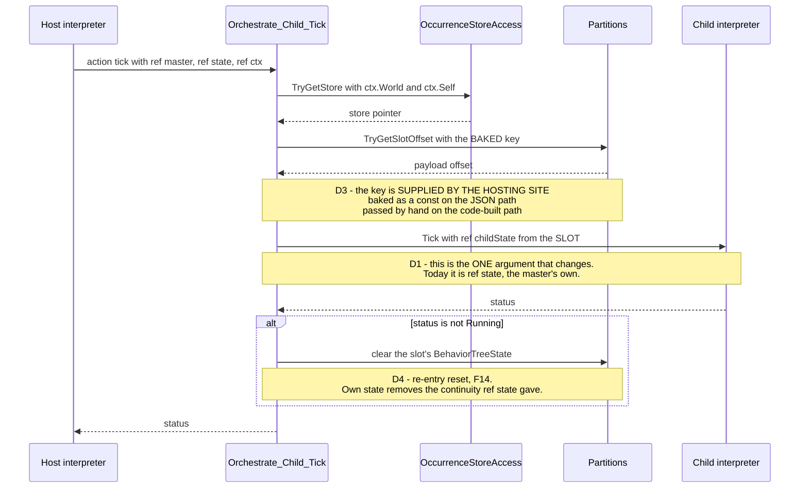
```mermaid
sequenceDiagram
    participant HO as Host interpreter
    participant OR as Orchestrate_Child_Tick
    participant SA as OccurrenceStoreAccess
    participant PA as Partitions
    participant CH as Child interpreter

    HO->>OR: action tick with ref master, ref state, ref ctx
    OR->>SA: TryGetStore with ctx.World and ctx.Self
    SA-->>OR: store pointer
    OR->>PA: TryGetSlotOffset with the BAKED key
    PA-->>OR: payload offset
    Note over OR,PA: D3 - the key is SUPPLIED BY THE HOSTING SITE<br/>baked as a const on the JSON path<br/>passed by hand on the code-built path
    OR->>CH: Tick with ref childState from the SLOT
    Note over OR,CH: D1 - this is the ONE argument that changes.<br/>Today it is ref state, the master's own.
    CH-->>OR: status
    alt status is not Running
        OR->>PA: clear the slot's BehaviorTreeState
        Note over OR,PA: D4 - re-entry reset, F14.<br/>Own state removes the continuity ref state gave.
    end
    OR-->>HO: status
```

| # | decision | ⭐ **my lean** | blast radius |
|---|---|---|---|
| **D1** | where the child's state comes from | ⭐⭐⭐ **a slot in the entity's occurrence store**, resolved through the seam from `ctx` | 2 emit sites. ⛔ The single line §18 proves is the defect |
| **D2** | what names it | ⭐⭐ a **reserved `variableId`** at `Behavior` scope, role `State`, kind `BTree` — ⛔ no new enum member anywhere | the manifest gains 1 entry per hosting site |
| **D3** | how the orchestrator knows its key | ⭐⭐⭐ **RE-LEANED `2026-09-20` — the key is RUNTIME-COMPUTABLE and SUPPLIED BY THE HOSTING SITE**; the const-bake is demoted to an emitter optimisation on the JSON path. ⛔ **Prior lean — *"baked as a `const`; hosting is static so the chain is fully known to the emitter"* — is SUPERSEDED**: it is true only of hosting the GENERATOR CAN SEE. §19.6 has the measurement | ⭐ still **no** new `NodeLogicDelegate` parameter, **no** `BTreeContext` field, **no** kernel change ⇒ `O4` keeps zero-ExtDeps |
| **D4** | re-entry reset (`F14`) | ⭐ **clear the slot when the child returns non-`Running`** — the host has left the hosting node by definition | rail ② |
| **D5** | what `siteId` IS | ⭐⭐ **fold the author's existing stable node `Guid`** — ⛔ **NOT a node ordinal.** `ComputeNested`'s own doc: *"must be stable across a recompile, or the child's slot moves; `StructureHash` catches the drift but the state is lost"* ⇒ an ordinal shifts the moment a node is inserted above it. ⭐ Authors already supply a stable `Guid` per node today *(the `visualId` argument of `StatefulAction`)* | the emitter and the builder extension both fold the same `Guid` |

### 19.4 ⚠ WHAT THIS COSTS THAT §17's SIZING DID NOT COUNT

⛔⛔ **Each hosting SITE adds a 64-byte `BehaviorTreeState` slot** *(`AlignUp(64,8) + 16` = **80 B** and
one slot)*. ⇒ 🔴 **this is the `O4` term `B4`'s `MaxSlots 3` measurement was explicitly bounded but not
measured against** (§17, *"`B4`'s PRE-MEASUREMENT"*, and `W4`'s *"re-measure after `O4`"*).
⭐ **Re-measure is part of `O4`, not a follow-up** — and the corpus figure to beat is `PlatoonHillAttack2`
at 8 slots / 320 B.

### 19.5 ⭐ Acceptance

| | |
|---|---|
| **rail ①** | ✅ **written and RED** — `HostedSubtreeCursorTests.O4_R1` (§18). ⇒ **green is the gate** |
| **rail ②** | ⛔ **not written.** Re-entry reset: host leaves the hosting node, re-enters, child starts fresh |
| **golden** | `hill-attack-close` green before and after |
| **sizing** | §19.4's re-measure, folded back into §17 |
| ⭐ **a debug assertion** | §19.6 ⑤ — a hosting site that supplies the WRONG key gets a silent slot miss, the exact failure `A1` exists to kill ⇒ `O4` ships an assertion, not an implicit contract |
| ⛔⛔ **the two halves are NOT independent** | §19.7 ① — the ROOT occurrence's own slot is what makes hosted children addressable at all. ⚠ `O4` cannot ship "hosted children" without "the root occurrence", and the plan reads as though it could |

### 19.6 🔴🔴 WHAT `D3`'s FIRST LEAN GOT WRONG — **"hosting is static" is true only of hosting the GENERATOR CAN SEE** *(user question, `2026-09-20`)*

> ⭐⭐⭐ **The two questions that produced this**, and neither had been asked: *"is it that we know the
> whole possible chains like HSM → BTree → sub-BTree → Blueprint action? how do we know it, by
> analyzing the json assets?"* — then, decisively: 🔒 ***"and how we would know if the relations are
> hardcoded in manually written code which is still a required possibility?"***

#### ① ⭐ What IS static, and the mechanism — *(which the first lean asserted without citing)*

| | |
|---|---|
| **the link** | a host asset's JSON carries `BlackboardAliasBindingDto`: **`RequiringAssetId`** (child asset GUID) + **`RequiringElementId`** (the node/state inside it) — `BlackboardAliasBindingDto.cs:33-36`. ⛔ Nothing picks a child at runtime on this path |
| ⭐⭐ **the whole corpus IS in hand** | `BTreeJsonGenerator` emits **per asset**, but every run also receives `rawFiles.Collect()` — *every* `*.btree.json` — and `bpJsonCollected` — *every* `*.bp.json` *(`:61`, `:69`)*. ⇒ **a global host graph is computable at build time.** 📌 That is why `GeneratedBTreeSchemaCatalog` exists — its own comment says *"the SIBLING TREES, for subtree-sync identity"* |

#### ② 🔴 THE FIRST STING — **a child's own slots are baked ROOT-FORM, and the child does not know its host**

📐 Measured in the generated registrars: slot keys are **integer literals** — `577338280`, `740138773` —
from `Compute(assetId, scope, visualId, name)`, **with no host term**. ⇒ a child asset is compiled
without knowing who hosts it, and **one asset can carry MORE THAN ONE occurrence key** *(hosted at two
sites; or root on one entity and hosted on another)* ⇒ ⛔ **one baked literal per asset is wrong.**
⭐ The *tree-state* slot escapes this — it is emitted in the **HOST's** file, where the site is known.
⚠ Making the child's **own** slots occurrence-scoped needs the global graph and is **not** in `O4`.

#### ③ 🔴🔴 THE DECISIVE STING — **HAND-WRITTEN HOSTS ARE INVISIBLE TO THE GENERATOR**

⛔⛔ The generator filters `AdditionalTexts` to `*.btree.json` / `*.bp.json` *(`:32`, `:52`)*. **A host
written in C# is not an AdditionalText and cannot be seen at all.** ⇒ 🔒 **no amount of build-time
analysis answers *"who hosts whom"* for code-built trees**, and the user is right that this is a
required possibility, not a corner case.

📐 **And it is PRODUCTION, not hypothetical** — 4 hand-written trees under `Hrot.AI.Behaviors/Brains/`:
`HideInCoverBehavior` · `HillAttackCommanderNodes` · `HillAttackTankNodes` · `CgfNodes`. ⭐⭐ §15 already
measured that **the golden test exercises the HAND-WRITTEN node path**, so this is the path that
actually runs.

#### ④ ⭐⭐⭐ THE WAY OUT — **the code-built path never needed build-time knowledge**

📐 It already computes keys **at runtime**: `StatefulBTreeActionBinder.ComputeStatefulSlotKey(
manifest.AssetId, scope, keyVisualId, variableId)` *(`:190`)*, with the author supplying the asset id
by hand — `HillAttackCommanderNodes.cs:562` constructs `new StatefulSlotManifestBuilder(new
Guid("1a000000-…-dd"))`.

⇒ ⭐⭐ **THE RE-LEAN: one runtime-computable identity serves BOTH paths, supplied by the HOSTING SITE.**

| path | who supplies `(hostKey, siteId)` |
|---|---|
| **JSON** | the emitter bakes the literal — exactly as it already bakes `577338280` for ordinary slots. ⭐ An optimisation, **not** the contract |
| **hand-written** | the author passes it, the same way they already pass the asset id |

| ⭐ why this keeps `O4` a valid stop-or-go gate | |
|---|---|
| ⛔ **no new `NodeLogicDelegate` parameter** — the signature is fixed, and a hand-written host hard-codes its key exactly as it already hard-codes its asset id | ⛔ **no `BTreeContext` field** · ⛔ **no kernel change** ⇒ **zero ExtDeps**, §4.1 intact |
| ⛔ **REJECTED — thread the host key through `BTreeContext`** | that IS runtime occurrence stamping, which §6 **deliberately defers to `O6`** as *"the one ExtDeps crossing, paid once, after `O4` has proved the storage model"*. ⭐ Doing it here destroys the very property that makes `O4` the gate |
| ⛔ **REJECTED — bake only, JSON only** | silently wrong the first time someone hand-writes a host, and **nothing would catch it** |

#### ⑤ ⚠ THE COST THIS CREATES, STATED RATHER THAN DISCOVERED LATER

⛔ It makes the **hosting site responsible for its own identity** ⇒ a site that supplies the WRONG key
gets a **silent slot miss** — 🔒 *"a compile-time key and a runtime key that disagree by one byte do not
fail loudly: the slot is simply never found"*, which is `OccurrenceSlotKey`'s own header and the exact
failure `A1` exists to kill. ⇒ ⭐ **`O4` ships a debug assertion on slot resolution**, not an implicit
contract *(acceptance §19.5)*.

#### ⑥ ⛔⛔ AND A REACHABILITY CORRECTION TO §3.1 — **the EMITTER ships the defect; no ASSET triggers it**

📐 Measured across the repo: **0** `.Orchestrators.g.cs` generated from **30** registrars, **0** JSON
files carrying `RequiringAssetId`, and **0** hand-written brains ticking a child interpreter
*(`GetInterpreter()` / `new Interpreter<` under `Brains/` — no hits)*. ⭐ The hosting actually in use is
`AiPrimitive`: **33 `BTreeAction` + 8 `BTreeCondition`**.

⇒ ⚠⚠ **§3.1's *"this is in shipped code today"* means the EMITTER ships it, not that an asset reaches
it.** ⛔ Rail ① (§18) proves the **mechanism** and stands; the **reachability** claim does not.
🔒 **This is the same latent-vs-shipped distinction §3.2 already had to make once** — and it was made
there by a live run, here by a corpus census. ⭐ Neither weakens `O4`: the tree-state slot is what `O8`
needs regardless, and §3.1 says so.

⚠ **Stated plainly: I asserted *"the chain is fully known to the emitter"* without measuring HOW, and
the how is what breaks it.** 📌 The generating question — *"what would have to be true for this to be
wrong?"* — had an answer one grep deep: **a host the generator cannot see.**

### 19.7 ⭐⭐ WHAT `(hostKey, siteId)` LOOKS LIKE IN HAND-WRITTEN CODE — **and three things writing it out exposed**

> ⭐ Asked for as an illustrative example; kept because **writing the call out is what found ①**, which
> changes what `O4` can ship. ⛔ This is PROPOSED shape — `O4` is not built.

#### ⭐ The idiom it extends *(this part EXISTS)*

📐 A hand-written tree already hard-codes its asset identity and a **stable `Guid` per node** —
`HillAttackCommanderNodes.cs:562` and the `StatefulAction` calls below it:

```csharp
var manifest = new StatefulSlotManifestBuilder(new Guid("1a000000-0000-0000-0000-0000000000dd"));

.StatefulAction<…>(bb => bb.Params, Action_CalculateSegments, manifest, "State",
    StatefulSlotScope.Behavior, new Guid("1a000000-…-a1"), "CalculateSegments")
//                              ^^^^^^^^^^^^^^^^^^^^^^^^^^ the author's stable node id — D5 folds THIS
```

#### ⭐ The proposed form — the same act of authorship, one level up

```csharp
static readonly Guid HostAsset   = new Guid("1a000000-…-dd");   // this tree
static readonly Guid PatrolAsset = new Guid("1a000000-…-77");   // the tree it hosts

// ① THE HOST'S OWN occurrence key. This tree is a root, so its host path is empty.
static readonly int HostOccurrenceKey =
    StatefulBTreeActionBinder.ComputeOccurrenceSlotKey(
        hostKey: 0, siteId: 0,                          // 0 == root
        assetId: HostAsset, scope: StatefulSlotScope.Behavior,
        nodeVisualId: Guid.Empty, variableId: OccurrenceSlots.TreeState);

// ② THE SITE — which node in THIS tree hosts the child (D5: the node's stable Guid).
static readonly Guid PatrolSite = new Guid("1a000000-…-c1");

// ③ THE CHILD'S tree-state slot.
static readonly int PatrolTreeStateKey =
    StatefulBTreeActionBinder.ComputeOccurrenceSlotKey(
        hostKey: HostOccurrenceKey, siteId: FoldGuid(PatrolSite),
        assetId: PatrolAsset, scope: StatefulSlotScope.Behavior,
        nodeVisualId: Guid.Empty, variableId: OccurrenceSlots.TreeState);
```

⭐ and the hosting action — **the one line `O4` is actually about**:

```csharp
byte* store = OccurrenceStoreAccess.TryGetStore(ctx.World, ctx.Self, out _);
if (store == null ||
    !BlueprintBlackboardPartitions.TryGetSlotOffset(store, PatrolTreeStateKey, out int off))
    return NodeStatus.Failure;                       // + the §19.6 ⑤ debug assert

ref var childState = ref Unsafe.AsRef<BehaviorTreeState>(store + off);
return Patrol.GetInterpreter().Tick(ref master.Patrol, ref childState, ref ctx);
//                                                     ^^^^^^^^^^^^^ NOT ref state
```

#### 🔴🔴 ① `hostKey: 0` SILENTLY DROPS `siteId` — **so the two halves of `O4` are NOT independent**

⛔ `ComputeNested` returns `Compute(...)` **verbatim** when `hostKey == 0` — deliberately, because that
is what keeps `A1`'s existing keys byte-identical. ⇒ 🔴 **a child CANNOT be keyed as
`(hostKey: 0, siteId: N)`**: two sites hosting the same child asset would collide, and the root case
would swallow the difference without a word.

⇒ ⭐⭐⭐ **the host must pass its OWN occurrence key**, which only exists once the **root occurrence has
its own slot**. ⚠⚠ **§6 and §19 read as though "give the hosted child its own state" and "give the root
occurrence a slot" were two independent deliverables. They are not** — the second is what makes the
first addressable. 🔒 **`O4` ships both or neither.**

#### ⚠ ② `StatefulSlotManifestBuilder.Add` IS `internal` — **so this arrives as a BUILDER EXTENSION**

⛔ A hand-written host in `Hrot.AI.Behaviors` cannot register the slot directly. ⭐ It comes through an
extension mirroring the existing `StatefulAction` in `StatefulTreeBuilderExtensions` — so `O4` ships
**`HostSubtree(...)`**, which registers the hosting action **and** the manifest entry together, and the
author never touches the key arithmetic above. ⇒ **the explicit form is what the extension does
underneath**, not what anyone writes.

#### ⭐ ③ `siteId` STABILITY — *(now `D5`)*

⛔ A node **ordinal** shifts the moment a node is inserted above it, and `ComputeNested`'s own doc says
the child's slot then moves — `StructureHash` catches the drift, **but the state is lost**. ⇒ fold the
author's existing stable node `Guid`, which they already supply for every `StatefulAction`.


## 20. ✅ AS-BUILT — **`O4` CORE IS IN, RAIL ① IS GREEN** *(`2026-09-20`, obligation ⑤)*

⭐⭐ **Rail ① went `Expected 1, Actual 2` before (§18) and passes now.** 📐 Red-proof: reverting ONLY the
hosting argument to `child.Tick(ref childBb, ref state, ref ctx)` reddens **only rail ①**
*(`INVERSE_BUILD_ERRORS=0`, 1 failed / 5 passed)* ⇒ the fix is pinned to exactly the argument that was
wrong, not to the rail's scaffolding.

| shipped | |
|---|---|
| ⭐ **`OccurrenceSlots`** | the reserved names *(`$occ.`-prefixed — ⛔ no author-chosen variable can collide, and a collision here is the silent alias `A1` exists to kill)*, `IdentityOf`, `SiteId` *(`D5`)*, and `TreeStateKeyFor` as the ONE key function both paths call |
| ⭐⭐ **`HostedSubtree.Tick`** | the hosting body: resolve the child's own state from its slot, tick, clear on completion. ⛔ A missing slot **throws** *(§19.6 ⑤)* |
| ⭐⭐ **`HostedSubtree.Reset`** | the `F14` body, invoked as the hosting node's **deactivator** |
| ⭐ **6 rails** | ① own cursor · ②a completion reset · ②b `Reset` clears a running child · ②c the wiring · ③ loud miss · ④ key discrimination |

### 20.1 🔴🔴 **`D4` WAS INCOMPLETE — it is TWO halves, and `Tick` cannot see the second**

⛔⛔ **`D4` said *"clear the slot when the child returns non-`Running`"*. That cannot be the whole of
`F14`.** ⭐ **A hosting action only runs when the host ENTERS it.** If the host abandons a still-`Running`
child — a sibling fails, a `Parallel` moves on — the action is never called again ⇒ nothing clears the
cursor and the next entry **resumes mid-tree**. 🔒 That is precisely the case `F14` names, and `Tick` is
structurally blind to it.

| half | where | what |
|---|---|---|
| **①** | `HostedSubtree.Tick` | the child COMPLETED. ⚠ **Not redundant with the kernel** — the interpreter's cleanup zeroes only `RunningNodeIndex`; this also clears `StackPointer`, `NodeIndexStack`, `LocalRegisters`, `InstanceFlags` |
| **②** | `HostedSubtree.Reset`, as the node's **DEACTIVATOR** | the host ABANDONED a running child — the real `F14` |

⭐⭐⭐ **And the hook already exists, so it stays zero-ExtDeps:** `Interpreter.SweepExitedNodes` invokes a
deactivator for any node leaving the active path that is `IsResourceOwning`, and `BTreeBuilder.Compile`
sets that bit **automatically** for a node whose key has a registered deactivator ⇒ **registration IS
the opt-in.** ⭐ Rail ②c pins that chain, so a refactor cannot quietly break `F14` while every other rail
stays green.

### 20.2 ⚠ WHAT IS NOT CLAIMED, AND WHAT IS LEFT

| ⚠ not claimed | |
|---|---|
| ⛔ **rail ②b drives `Reset` DIRECTLY**, not through a tree that abandons mid-flight | ⛔⛔ **SUPERSEDED `2026-09-20` — see §22.5.** As written: *"a genuine abandon needs a `Parallel` or a reactive abort."* 📐 Measured: **neither delivers one** — `PushNode`/`PopNode` have zero production callers, so the sweep's path is ONE entry wide and a mid-flight abandon is **unreachable in-tree**. ⭐ Rail ⑧ pins that premise instead |
| ⛔ **the EXTERNAL reset path is NOT covered** | ⛔⛔ **SUPERSEDED `2026-09-20` — FIXED, see §22 (`F14b`).** 📌 As found: `BehaviorIngressSystem:204` / `:235` set `BrainBTreeState.State = default` on a behaviour change. ⚠ That zeroes the HOST's cursor without a tick, so **no sweep fires and no deactivator runs** ⇒ a hosted child's slot keeps stale state across a behaviour swap. ⚠ **And the two line numbers were the wrong pair** — §22 measures which sites actually leak |

| ⭐ left to do | |
|---|---|
| the emitter's two sites *(`:142`, `:171`)* | route both through `HostedSubtree.Tick` with the baked key |
| **`HostSubtree(...)`** builder extension | registers the action, the **deactivator** and the manifest entry together *(§19.7 ②)* |
| §19.4's sizing re-measure | each hosting site costs **80 B + 1 slot**; feeds back into `B4`'s `MaxSlots 3` |


## 21. ✅ `O4` / `C1` IS COMPLETE — **the stop-or-go gate is GO** *(`2026-09-20`, obligation ⑤)*

⭐⭐ **Golden `hill-attack-close`** *(port 8181, `--mode all`, `simTime 116`)*: platoon
**`522.7 · 524.8 · 528.4 · 531.0`** on the baseline *(y `400.0 / 449.7 / 497.5 / 548.5`)*, both targets
`Health 0`, **0 faults**. ⚠ Within ~1 m of the `B3②`/`B4` runs, as a live multi-node run is — ⛔ not a
determinism check.

| suite | result |
|---|---|
| `Hrot.Blueprints.Tests` | ✅ **3971 / 0** — unchanged by `O4` |
| `Hrot.BTree.Editor.Tests` | ✅ **633 / 0** |
| `Hrot.AiEditor.Generators.Tests` | ✅ **280 / 0** |
| `Hrot.AiEditor.Persistence.Tests` | ✅ **151 / 151** *(+1: the new emit-level guard)* |
| `Hrot.SimHost.Tests` | ⚠ **3 / 1004** — the pre-existing trio, by name |
| `Fdp.Toolkits.Tests` | ⚠ **2252 total**, ⛔ **order-sensitive in the full run** — trap ㉗ |

### 21.1 ⭐ WHAT `O4` SHIPPED

| | |
|---|---|
| **runtime** | `OccurrenceSlots` *(reserved names, `IdentityOf`, `SiteId`, `TreeStateKeyFor`)* · `HostedSubtree.Tick` / `.Reset` |
| **the wall** | the names + arithmetic moved into the **LINKED** `OccurrenceSlotKey`, so emitter and runtime cannot drift — the `BlueprintTierLadder` pattern (§17.5) |
| **emitter** | `BTreeBridgeEmitCore` declares one tree-state slot per hosted subtree · `BTreeOrchestratorEmitCore` routes **both** sites through `HostedSubtree.Tick` |
| **editor** | `BTreeOrchestratorEmitter` now carries the real site/child ids — ⛔ it would have baked a key from `Guid.Empty`: well-formed, deterministic, **wrong**, and only detectable at runtime |
| **rails** | 6 runtime *(`HostedSubtreeCursorTests`)* + 2 emit-level guards |

### 21.2 ⚠ WHAT `O4` DID **NOT** DO — **stated so the next session does not assume otherwise**

| | |
|---|---|
| ⛔ **the root occurrence still lives in `BrainBTreeState`** | §19.7 ① concluded both halves must ship together; 📐 measuring proved that **too strong** — `hostKey` is a disambiguator folded into a hash and never dereferences anything, so a canonical IDENTITY suffices. ⭐ Moving the root state into a slot remains a separate change |
| ⛔ **end-to-end ABANDON is unmeasured** | ⛔⛔ **SUPERSEDED `2026-09-20` — §22.5 measured WHY, and the answer is that it CANNOT be measured:** the in-tree abandon does not exist. ⭐ Rail ⑧ is the tripwire that will say when it does |
| ✅ **the EXTERNAL reset path** | ⛔⛔ **SUPERSEDED `2026-09-20` — FIXED in §22 (`F14b`), with rails ⑤/⑥/⑦ and an exact red-proof.** As written here it was *"uncovered"*, and the two sites it named were **not the two that leak** |
| ⚠ **§19.4's sizing re-measure is VACUOUS TODAY, and that is the honest answer** | 📐 **0** assets carry an alias ⇒ no asset gains a hosting-site slot ⇒ `B4`'s `MaxSlots 3` is **unmoved**. ⭐ The 80 B + 1 slot cost becomes real when someone first authors a hosted subtree. ⛔ Re-deriving a number from content that does not exist would be invention |

### 21.3 ⭐⭐⭐ THE GATE VERDICT

🔒 **`O4` proved the model with ZERO ExtDeps change**, which is exactly what §6 asked of it:
`BehaviorTreeState` untouched, no new delegate parameter, no `BTreeContext` field, no kernel edit.
⇒ ⭐ **GO** — `O5` and `O6` may proceed on this storage model.

⚠ **One caveat on how much the golden proves here:** 📐 **0** assets exercise subtree hosting, so the
golden shows `O4` **broke nothing**; it does **not** exercise the new path. ⭐ That path's evidence is
the 6 runtime rails and the red-proof *(reverting only the hosting argument reddens only rail ①)*.


## 22. ✅ `F14b` — **THE EXTERNAL RESET PATH, CLOSED** *(`2026-09-20`, obligation ⑤)*

⭐⭐⭐ **`D4`'s two halves both arrive THROUGH A TICK. The ingress resets the host WITHOUT one.**
⇒ `SweepExitedNodes` never runs, the deactivator never fires, and a hosted child resumes mid-tree while
its host restarts at the root. 📌 Found while wiring `D4`; §20.2 and §21.2 carried it as an open hole.

### 22.1 ⭐ THE SEQUENCE — **what the picture shows that §21.2's prose hid**

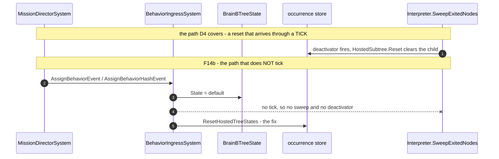
```mermaid
sequenceDiagram
    autonumber
    participant Dir as MissionDirectorSystem
    participant Ing as BehaviorIngressSystem
    participant Root as BrainBTreeState
    participant Store as occurrence store
    participant Sweep as Interpreter.SweepExitedNodes

    Note over Dir,Sweep: the path D4 covers - a reset that arrives through a TICK
    Sweep->>Store: deactivator fires, HostedSubtree.Reset clears the child

    Note over Dir,Sweep: F14b - the path that does NOT tick
    Dir->>Ing: AssignBehaviorEvent / AssignBehaviorHashEvent
    Ing->>Root: State = default
    Ing--xSweep: no tick, so no sweep and no deactivator
    Ing->>Store: ResetHostedTreeStates - the fix
```

⭐ **Caption:** the two paths reach the SAME child state and only one of them runs the interpreter.
⛔ The dashed edge is the one the prose could state but never forced anyone to look up.

### 22.2 🔴 THE SITES — **§21.2 named the wrong pair, and measuring is what found it**

| site | does it leak a hosted cursor? | why |
|---|---|---|
| **`:163`** `AssignBehaviorEvent` | 🔴 **YES** | detach is gated on `previousBehaviorId != behaviorId` (`:146`), and `AttachSlotsToMemory`'s idempotent arm **deliberately preserves** a slot whose size+hash match ⇒ a **re-assign of the same behaviour** keeps the cursor while the host's is zeroed one line later |
| **`:235`** `AssignBehaviorHashEvent` | 🔴🔴 **YES, worse** | the handler touches **no slots at all** — it neither detaches the outgoing manifest nor provisions the incoming one — yet zeroes `BrainBTreeState.State` like the others |
| **`:204`** `ClearBehaviorEvent` | ✅ **NO** | it `DetachStatefulSlots` first, and **`TryAttach` ZEROES the payload it hands out** (`SlotAttachZeroingTests`) ⇒ the next assign gets a clean cursor with no extra call. ⛔ **A reset call here would be dead code** |

⚠⚠ **§20.2/§21.2 named `:204`/`:235`.** 📐 `:204` was already safe and `:163` was not — the leak is where
**idempotent attach preserves state**, not where the cursor is zeroed. ⇒ 🔒 **the rule that would have got
this right first time: for "does this path leak state?", read the SLOT lifecycle, not the line that zeroes
the component.**

### 22.3 ⭐ WHAT SHIPPED

| | |
|---|---|
| `HostedSubtree.Reset(EntityRepository, Entity, int)` | the external overload; the `ref BTreeContext` form forwards to it ⇒ **one body** (ruling 9) |
| `HostedSubtree.IsTreeStateSlot(StatefulSlotInfo)` | ⭐⭐ **the manifest itself says which slots are cursors** — the emitter stamps `WorkingStateType = typeof(BehaviorTreeState)` on exactly the slots `CollectHostedTreeStateSlots` adds, and an authored `WorkingState` can never be that type. ⛔ A caller re-spelling this test is how the two would drift |
| `BehaviorIngressSystem.ResetHostedTreeStates` | called at `:163` and `:235`, **not** at `:204` |

⛔⛔ **Deliberately NARROW — and rail ⑦ is what holds it that way.** A blanket *"zero every slot of the
incoming manifest"* would have turned every no-op re-assign into a **working-state wipe**, destroying the
behaviour `AttachSlotsToMemory` documents as *"no churn on soft reload / no-op re-assign"*. ⭐ A cursor is
not working state.

### 22.4 ⭐ EVIDENCE

| | |
|---|---|
| rails | **⑤** by-name re-assign · **⑥** by-hash assign · **⑦** the narrowness — author state survives while the cursor does not. All in `HostedSubtreeCursorTests`, the feature's own suite (`T-1`) |
| non-vacuity | each asserts the **host's** cursor reset too — a fixture that never reached the reset would fail there first |
| red-proof | commenting out **only** the two `ResetHostedTreeStates` calls ⇒ **0 build errors**, exactly **3 failed / 6 passed**. ⭐ Restored ⇒ 9/9 |

### 22.5 🔴🔴🔴 **THE END-TO-END ABANDON RAIL CANNOT BE WRITTEN — the abandon is UNREACHABLE in-tree**

⚠⚠ **§20.2 and §21.2 said it *"needs a `Parallel` or a reactive abort."* 📐 Measured `2026-09-20`:
NEITHER DELIVERS ONE**, and the cause is one measurement upstream of all of them.

| 📐 the measurement | |
|---|---|
| 🔴 **`BehaviorTreeState.PushNode` / `PopNode` have ZERO production callers** | grep over `FDP/ Hrot/ Stride/` **and** `search_graph` agree: the only callers are `Fbt.Tests`' own `DataStructuresTests`. ⇒ the interpreter **never fills `NodeIndexStack`** |
| ⇒ ⭐⭐⭐ **the "active path" `SweepExitedNodes` diffs is ONE ENTRY WIDE** | `oldPath` is 8 stack slots + `RunningNodeIndex`, and the 8 are permanently `0` |

⇒ 🔒 **a deactivator can fire only for a node that LEAVES `RunningNodeIndex`** — and the only thing that
moves it off a hosting action is **the action returning non-`Running`**, which is the COMPLETION case
`HostedSubtree.Tick` already handles (`D4` half one).

| ⛔ why each candidate abort does NOT produce the other case | |
|---|---|
| `Sequence` / `Selector` | the resume test skips only children **before** the running one (`Interpreter.cs:574`/`:616`) ⇒ a higher-priority sibling is **never re-evaluated** |
| `ObserverSelector` | 📌 `Interpreter.cs:227` — *"uses standard selector semantics in the interpreter"*, routed straight to `ExecuteSelector`. ⛔ **The reactive abort its name promises is not implemented** |
| `Parallel` | it overwrites `RunningNodeIndex` with **its own** index (`:345`) ⇒ a hosting action under a Parallel never reaches the path at all, so the sweep cannot see it |
| `Cooldown` | its early-`Failure` arm is gated on a token written **only on child `Success`** (`:382`) ⇒ it cannot fire while the child is `Running` |
| the HOT-RELOAD sweep (`:68`) | it diffs against the **NEW** blob, and `SweepExitedNode` returns early for any index outside that blob's range — **the very condition that triggered the branch** ⇒ it can never fire a deactivator for the out-of-range node |

### 22.6 ⭐ WHAT WAS SHIPPED INSTEAD — **a TRIPWIRE on the premise**

⛔ **A test cannot be written for behaviour that cannot occur, and a silently-absent test says nothing.**
⭐⭐ **Rail ⑧ pins the PREMISE**: a nested tree is ticked, the hosting action is `Running` three levels
down, and **`StackPointer` and all eight `NodeIndexStack` slots are `0`.**

🔒 **A path stack is the prerequisite for any real abort.** ⇒ the day someone fills it, rail ⑧ reddens and
says exactly the right thing: *the end-to-end `F14` case has become reachable and now needs a real rail.*

| ⚠ what this does NOT say | |
|---|---|
| ⛔ **`F14`'s deactivator is not dead code** | it is correctly wired (rail ②c) and it is the RIGHT hook; today its in-tree trigger is unreachable. ⭐ `F14b` (§22.1–22.4) is the path that **is** reachable, and it is now closed |
| ⛔ **this is not a bug report against FastBTree** | `ObserverSelector`'s unimplemented abort is an ExtDeps fact recorded here because it DECIDED this question — ⚠ not something `O4` may change (§4.1: zero ExtDeps) |


## 23. ✅ `O6` — **THE ExtDeps CROSSING IS PAID** *(`2026-09-20`, obligation ⑤)*

🔒 **The sentence the whole item rests on:** ⭐⭐⭐ **the kernel supplies IDENTITY, the thunk does the
LOOKUP.** The kernel knows nothing about the partition allocator and did not learn; what a thunk lacked
was four bytes of *"who am I"*.

### 23.1 ⭐ THE SEQUENCE — **what the picture shows that §4.2's prose could not**

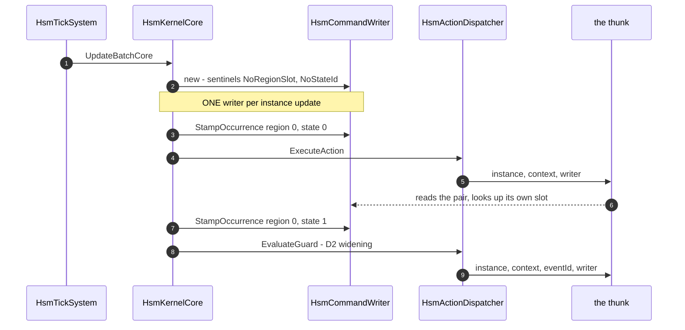
```mermaid
sequenceDiagram
    autonumber
    participant Tick as HsmTickSystem
    participant Core as HsmKernelCore
    participant W as HsmCommandWriter
    participant D as HsmActionDispatcher
    participant T as the thunk

    Tick->>Core: UpdateBatchCore
    Core->>W: new - sentinels NoRegionSlot, NoStateId
    Note over Core,W: ONE writer per instance update
    Core->>W: StampOccurrence region 0, state 0
    Core->>D: ExecuteAction
    D->>T: instance, context, writer
    T-->>W: reads the pair, looks up its own slot
    Core->>W: StampOccurrence region 0, state 1
    Core->>D: EvaluateGuard - D2 widening
    D->>T: instance, context, eventId, writer
```

⭐ **Caption:** the writer is created ONCE and stamped MANY times inside one update. ⛔ That is exactly
what `Q35` option `C` (carry it on `HsmKernelBridge`) could not do — the bridge is built once per entity
tick, so both dispatches above would report the same pair and the second occurrence would read the
first one's storage. **Rail ② is that picture, measured.**

### 23.2 ⭐ THE CLASSES

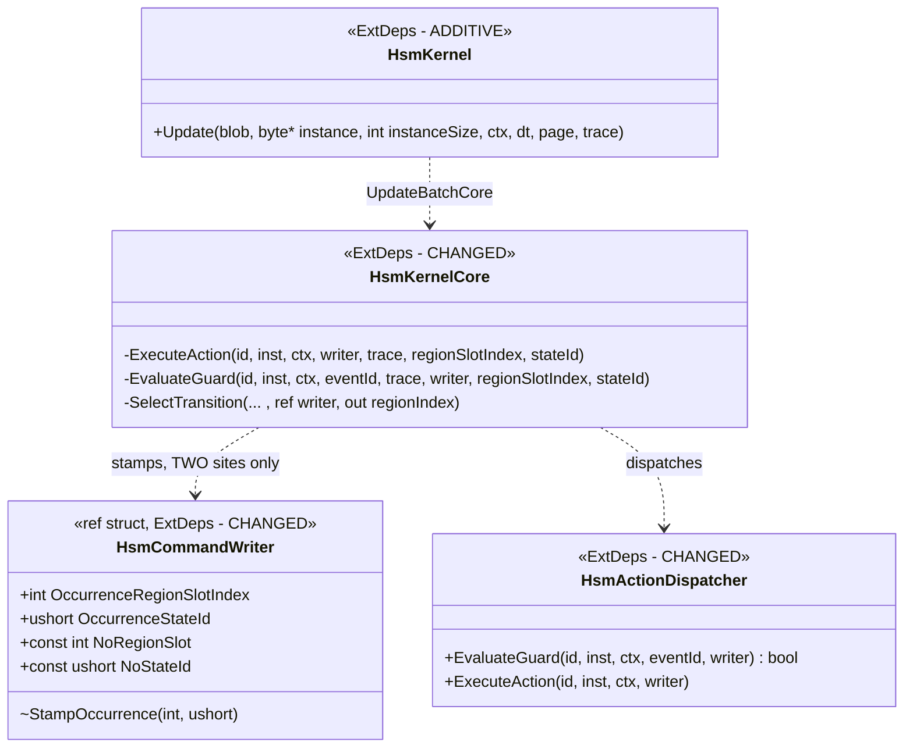
```mermaid
classDiagram
    class HsmCommandWriter {
        <<ref struct, ExtDeps - CHANGED>>
        +int OccurrenceRegionSlotIndex
        +ushort OccurrenceStateId
        +const int NoRegionSlot
        +const ushort NoStateId
        ~StampOccurrence(int, ushort)
    }
    class HsmKernelCore {
        <<ExtDeps - CHANGED>>
        -ExecuteAction(id, inst, ctx, writer, trace, regionSlotIndex, stateId)
        -EvaluateGuard(id, inst, ctx, eventId, trace, writer, regionSlotIndex, stateId)
        -SelectTransition(... , ref writer, out regionIndex)
    }
    class HsmActionDispatcher {
        <<ExtDeps - CHANGED>>
        +EvaluateGuard(id, inst, ctx, eventId, writer) bool
        +ExecuteAction(id, inst, ctx, writer)
    }
    class HsmKernel {
        <<ExtDeps - ADDITIVE>>
        +Update(blob, byte* instance, int instanceSize, ctx, dt, page, trace)
    }
    HsmKernelCore ..> HsmCommandWriter : stamps, TWO sites only
    HsmKernelCore ..> HsmActionDispatcher : dispatches
    HsmKernel ..> HsmKernelCore : UpdateBatchCore
```

⭐ **Caption:** `StampOccurrence` is `internal` — the kernel is the only thing entitled to say which
occurrence is running. ⛔ A thunk that could forge one would forge a silent cross-occurrence alias,
which is the failure this model exists to remove.

### 23.3 📐 THE MEASURED BLAST RADIUS — **§4.2 said "single-digit"; here is the actual count**

| what changed | where |
|---|---|
| ⭐ two fields + two sentinels + `internal StampOccurrence` | `Fhsm.Kernel/Data/HsmCommandWriter.cs` |
| ⭐⭐ **TWO stamping sites, and only two** | `HsmKernelCore.ExecuteAction` and `HsmKernelCore.EvaluateGuard` — every dispatch already funnelled through them, so the pair cannot go out of step with the dispatch it describes |
| the pair threaded to those two helpers | **7** call sites in `HsmKernelCore` (`:306` init-entry, `:450` activity, `:547` global-transition guard, `:590` per-region guard, `:708` exit, `:723` transition action, `:755` entry) — ⭐ every one already had both halves in scope, exactly as `Q35-B` claimed |
| ⚠ one signature threaded for the guard's sake | `SelectTransition` gains `ref HsmCommandWriter`; it writes no commands, it only needs to stamp before evaluating |
| ⭐ `D2` — the guard signature | `HsmActionDispatcher.EvaluateGuard` + its cast |
| the generators that BAKE that signature as text | `HsmActionGenerator` (**4** casts + the emitted dispatcher), `CSharpEmitter:385`, `AiPrimitiveEmitter.EmitHsmGuardThunk` |
| ⭐ §9.4 — the pointer overload | `HsmKernel.Update(blob, byte*, int, …)`, additive |
| out-of-solution guards that needed a parameter | `Fhsm.Demo.Visual` ×3, `Fhsm.Tests` ×3 + their call sites |

🔴 **THE HEADLINE NUMBER: the full 156-project solution build reported exactly TWO compile errors** —
both in `BlueprintTestFixture.InvokeHsmGuard`, which invokes a guard outside the kernel. ⇒ ⭐⭐ **the
ACTION delegate really is untouched**, so the attributed action methods, both `FDP/Examples` projects
and FastHSM's own demos compiled unchanged, as §4.2 predicted.

### 23.4 ⭐ WHY `D2` IS SAFE — **and the reason is NOT "the population is small"**

📐 Measured again here: **ONE** `[HsmGuard]` attribute exists in the whole repo outside FastHSM's own
tree, and it is an exporter-test DTO. ⛔ **That is the wrong reason to accept a signature change.**
⭐⭐ **The real population is the GENERATORS**, and `R-50` is the licence: emitted behaviour source is
machine-owned and regenerated whole on save ⇒ changing what a generator emits is a **rebuild, not a
migration**.

### 23.5 🔴 A FIXTURE DEFECT RAIL ③ FOUND — **`0` is a valid state index**

📌 The first rail ③ asserted one guard dispatch and reported *"the collection contained 4 items."*
⭐ `HsmInstance128` carries **four** region slots (`GetActiveLeafIds`: size 128 ⇒ count 4), and a zeroed
slot is **not** "empty" — **State 0 is a real state** — so the kernel read all four regions as sitting in
State 0 and evaluated the transition's guard four times. ⇒ ⚠ **an instance must mark unused regions
`0xFFFF`**; the fixture now does, and says why. ⭐ The same confusion in production would be a real
defect, not a test one.

### 23.6 ⭐ EVIDENCE

| | |
|---|---|
| rails | **6** in `HsmOccurrenceStampTests` (in-solution — ⛔ **not** `Fhsm.Tests`, which is outside the root solution and reports a stale bin): ① an action's own pair · ② **two dispatches, one tick, different stamps** — the rail that decides `Q35-A` · ③ `D2`, a guard is stamped · ④ the sentinels are distinguishable from `(0,0)` · ⑤ §9.4's pointer overload agrees with the generic one · ⑥ a non-positive size is refused |
| red-proof | commenting out **only** the two `StampOccurrence` calls ⇒ **0 build errors**, exactly **4 failed / 2 passed** — the two survivors being the sentinel and size-guard rails, which do not depend on the stamp. Restored ⇒ 6/6 |
| non-vacuity | ② and ③ assert the machine actually transitioned before reading any stamp |

### 23.6a ✅ THE GOLDEN GATE — **GREEN after `O6`**

📐 `hill-attack-close`, port 8191, `--mode all`, `simTime 145`: platoon on the baseline at
**`523.0 · 525.2 · 528.6 · 531.4`** *(y `399.6 / 450.2 / 499.1 / 549.4`)*, both targets **`Health 0`**,
**0 faults** in a 441-line log *(`grep -icE "Strict Mode Violation|Unhandled|Exception"` ⇒ 0)*.
⭐ Within ~1 m of every prior run — `B4`'s `523.1·525.1·529.2·531.0`, `O4`'s `522.7·524.8·528.4·531.0`.
⚠ **Positions vary run to run; this is a live multi-node run, ⛔ not a determinism check.**

⚠ **And §23.7's caveat applies to this number too** — see immediately below.

### 23.7 ⚠ WHAT `O6` DID **NOT** DO

| | |
|---|---|
| ⛔ **no thunk looks the pair up yet** | that is `O7` — *"HSM per-region actions key on the occurrence"*. `O6` delivers the identity and nothing reads it in production. ⭐ Stated plainly so nobody reads these rails as proof that per-region HSM storage works |
| ⛔ **the golden test does not exercise this** | 📐 `hill-attack-close` runs the hand-written BTree node path; **zero** shipped assets use `AiPrimitiveHosting.HsmGuard`. ⇒ the golden shows `O6` **broke nothing**, not that the new path works — the same honest caveat `O4` carried |
| ⚠ **`Fhsm.Tests` and `Fhsm.Demo.Visual` are updated but CANNOT gate** | they are outside `IOS-IG-SimHost.sln`, so a root-solution build does not build them and a `--no-build` run of them would report a stale bin |


## 24. ⏳ `O7` — **HSM PER-REGION ACTIONS KEY ON THE OCCURRENCE** *(started `2026-09-20`; SLICE 1 LANDED)*

<!-- build-state: BUILDING -->

### 24.1 📐 THE INVENTORY — **run before any of this was designed**

| query | result |
|---|---|
| `BrainHsm64` / `BrainHsm128` references | **188** across **18** production files *(7 of them `FDP/Examples`)* + tests |
| shipped assets declaring `AiPrimitiveHosting.HsmAction` | ⭐ **1** — `MoveAndFireCombo.bp.json` |
| shipped assets declaring `HsmGuard` | ⭐ **0** |
| *(for contrast)* `BTreeAction` / `BTreeCondition` | **33 / 9** |

⇒ ⭐⭐ **HSM hosting is declared once and hosted essentially nowhere**, so — exactly as in `O4` — an
emitter change is near-invisible to today's corpus and **the decisive rail must be authored, not
found**. §7 already demanded that: *"a DTO-bound HSM action must be authored as part of `O7`, or the
rail is vacuous."*

### 24.2 🔴 THE DEFECT, MEASURED — **`BP-297` / `E3` in one line**

📌 `AiPrimitiveEmitter` emits **all three** HSM thunks — `HsmAction`, `HsmActivity`, `HsmGuard` — as:

```csharp
ref var bb1024 = ref world.GetComponentRW<Blackboard1024>(bridge->Self);
fixed (byte* memory = bb1024.Memory) { … ref var ws = ref Unsafe.AsRef<WorkingState>(memory + 8); }
```

⇒ 🔴 **one working state per ENTITY, at a hard-coded offset.** Two concurrently-active HSM regions
running the same asset write the **same bytes**, silently.

⭐⭐ **And this is the seam law again:** the BTree hosting path has been occurrence-keyed since `S2`
*(manifest entry + `OccurrenceSlotKey` + `BlueprintBlackboardPartitions`)*. ⛔ Nothing needed inventing —
**the HSM path was simply never brought onto the mechanism that already existed.**

### 24.3 ⭐ THE SLICING — **and why it is sliced at all**

⛔ `O7` as written in §6 bundles three independent changes. 📐 The inventory prices them very
differently, so they ship separately, each green:

| slice | what | size |
|---|---|---|
| ✅ **`O7a` — THE KEY AND THE LOOKUP** *(LANDED)* | `ComputeHsmStateKey` in the **LINKED** `OccurrenceSlotKey` + `HsmOccurrence` — the runtime seam every thunk will call | **S** |
| ⏳ **`O7b` — THE EMITTER** | the three thunks call `HsmOccurrence` instead of `Blackboard1024 + 8`; the HSM host emits a manifest entry per hosting `(region, state)`; **a DTO-bound HSM action authored** so §7's *"two regions, two slots"* rail is not vacuous | **M** |
| ⏳ **`O7c` — THE STORAGE MIGRATION** | HSM instances move from `BrainHsm64`/`BrainHsm128` into slots; those components are **deleted**; `HsmTickSystem` gains entity discovery across the tier components (`F9`); `HsmDebugSession` becomes a list (§11.3) | ⛔⛔ **RE-RATED `2026-09-22` — §31.** ~~L — 188 references~~: 📐 **the 188 counted TESTS.** Production is **42 lines / 12 files**, and it is now **FIVE ordered steps, BTREE FIRST** *(§31.5)* — `O7c-1` *(delete `BrainHsm64`, which nothing attaches)* is free, and `CE-319`'s BTree root is the slice that PROVES the model |

⚠ **`O7c` is where `F9` and §9.4's *"the tier stops being a TYPE and becomes a PAYLOAD SIZE"* land.**
⛔ It is NOT a prerequisite for `O7a`/`O7b`: keying an occurrence is independent of where the HSM
*instance* lives.

### 24.4 ⭐ `O7a` AS BUILT — **the classes**

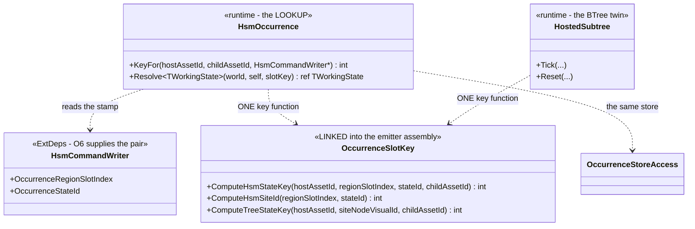
```mermaid
classDiagram
    class OccurrenceSlotKey {
        <<LINKED into the emitter assembly>>
        +ComputeHsmStateKey(hostAssetId, regionSlotIndex, stateId, childAssetId) int
        +ComputeHsmSiteId(regionSlotIndex, stateId) int
        +ComputeTreeStateKey(hostAssetId, siteNodeVisualId, childAssetId) int
    }
    class HsmOccurrence {
        <<runtime - the LOOKUP>>
        +KeyFor(hostAssetId, childAssetId, HsmCommandWriter*) int
        +Resolve~TWorkingState~(world, self, slotKey) ref TWorkingState
    }
    class HostedSubtree {
        <<runtime - the BTree twin>>
        +Tick(...)
        +Reset(...)
    }
    class HsmCommandWriter {
        <<ExtDeps - O6 supplies the pair>>
        +OccurrenceRegionSlotIndex
        +OccurrenceStateId
    }
    HsmOccurrence ..> HsmCommandWriter : reads the stamp
    HsmOccurrence ..> OccurrenceSlotKey : ONE key function
    HostedSubtree ..> OccurrenceSlotKey : ONE key function
    HsmOccurrence ..> OccurrenceStoreAccess : the same store
```

⭐ **Caption:** the two hosting paradigms are drawn on one canvas deliberately — **two paradigms, ONE
storage model, ONE key file.** ⛔ The picture is what makes a second key function obviously wrong.

### 24.5 ⭐⭐ THE SITE IS THE PAIR — **and how it differs from `D5`**

| | BTree site *(`D5`)* | HSM site *(`O7a`)* |
|---|---|---|
| what it is | an author-placed node with a stable `Guid` | ⭐ a **position in the compiled machine** — `(regionSlotIndex, stateId)` |
| where it comes from | the asset's own node id | ⭐ **the kernel's per-dispatch stamp** (`O6`) |
| stability across a recompile | ⭐ stable — the author owns the id | ⚠ **NOT stable if states renumber** — that is what the slot's `StructureHash` is for: the mismatch resets the state rather than misreading it |

⛔ **Both halves of the pair are load-bearing.** Two regions in the SAME state are different
occurrences; one region moving BETWEEN states is a different occurrence. ⭐ Rail ① asserts each half
**separately**, so a red tells you *which* half broke — and both red-proofs below confirm it does.

### 24.6 ⭐ `O7a` EVIDENCE

| | |
|---|---|
| rails | **6** in `HsmOccurrenceKeyTests`: ① region AND state each discriminate *(the `BP-297` claim)* · ② host and child discriminate · ③ an HSM site can never collide with a BTree site · ④ **`KeyFor` reads a stamp from a REAL kernel tick** and refuses an unstamped writer · ⑤ **two regions get two slots on one entity** — `BP-297` on real memory, not on arithmetic · ⑥ a missing slot throws |
| red-proof **A** | make the site ignore the REGION ⇒ **0 build errors**, exactly **2 red** — ① and ⑤, the two that carry the `BP-297` claim |
| red-proof **B** | make the site ignore the STATE ⇒ **0 build errors**, exactly **1 red** — ① alone |
| ⭐ why two red-proofs | ⛔ one would not distinguish *"the key changed"* from *"the right half of the key changed."* 📐 The pair of proofs is what shows each half is independently load-bearing |

### 24.7 ⚠ WHAT `O7a` DID **NOT** DO — **stated so the seam is not mistaken for adoption**

| | |
|---|---|
| ⛔⛔ **no emitted thunk calls it yet** | `O7a` is a seam **with rails but without a production caller**, which this repo's own rule warns about. ⭐ It is deliberate and time-boxed: `O7b` is the adoption, and until it lands the shipped thunks still hard-code `Blackboard1024 + 8` |
| ⛔ **the provisioning side is unwritten** | who attaches the per-`(region, state)` slot is `O7b`'s question. ⭐ The answer is already shaped: `BehaviorIngressSystem` provisions `def.StatefulWorkingSlots` **without consulting `BrainTier`** (`E1`/`E2`, pinned by `HsmStatefulProvisioningTests`) — so the HSM host emitting manifest entries is all that is missing |
| ⛔ **`BrainHsm*` still exist** | that is `O7c`, and §9.4's *"after `O7` there is no `BrainHsm*` at all"* remains the target, not the current state |

### 24.8 ⭐⭐ `O7b`'s FIRST DECISION — **LAZY attach, decided by measurement**

| the lean rests on | code — how it IS | design basis — how it was MEANT to be |
|---|---|---|
| the shipped thunk **already** self-initialises ⇒ lazy is like-for-like, not a new lifecycle | ✅ `AiPrimitiveEmitter:357-362` — `if (storedHash != StructureHash) { InitBlock; *(ulong*)memory = StructureHash; InitDefaultWorkingState(…); }` | ✅ §7 *"parse before commit"* governs **params**, not working state; nothing requires eager working state |
| the blueprint's emitter **cannot see its HSM host** ⇒ there is no host-side manifest to read at emit time | ✅ the thunk is emitted from the BLUEPRINT asset; the host is an HSM asset it never sees | ✅ §19.6 ③ records the same invisibility for hand-written hosts |
| a lazily-attached slot is **renderable** | ✅ `BlueprintBlackboardRendererBase:72` walks `GetSlotCount(mem)` — the **store**, not the manifest | ✅ §11.4's rail is *"every ALLOCATED occurrence is renderable"* — it does not require pre-allocation |
| lazy and eager **compose** | ✅ `AttachSlotsToMemory`'s idempotent arm preserves a matching slot ⇒ a manifest entry with the same key makes `ResolveOrAttach` a no-op lookup | ✅ `E1`/`E2` — `BehaviorIngressSystem` provisions without consulting `BrainTier` |

⇒ ⭐ **Lazy now; a manifest entry can be added later purely for TYPED LABELS in the inspector**, without
touching the thunk. ⚠ **The one real cost of lazy, stated:** with no manifest entry the slot has no
`WorkingStateType`/`NodeLabel`, so the inspector shows raw bytes until `O7b-2` adds one.

### 24.9 🔴🔴 `O7b` IS BLOCKED ON A MEASURED QUESTION — **what is `instance` in an HSM thunk?**

⛔⛔ **Stopped here deliberately rather than guessing.** Building the emitter change needs the thunk to
know **its host's identity**, and chasing that surfaced something that must be settled first.

📐 **Measured:**

| | |
|---|---|
| the kernel passes the **HSM INSTANCE** pointer | `HsmKernelCore.ExecuteAction:778-781` → `HsmActionDispatcher.ExecuteAction(actionId, instancePtr, contextPtr, writerPtr)`, where `instancePtr` is the `byte*` instance |
| the emitted HSM thunk casts it to **`Params`** | `AiPrimitiveEmitter` — `ref var p = ref *(Params*)instance;` |
| ⭐ the BTree thunk does something **different** | it projects params from `bb.BehaviorParameters[0]` (`EmitParamProjection`), never from a kernel pointer |
| ⚠ and these thunks register through the **same** table | `CSharpEmitter:382-385` — `RegisterAction(BlueprintId, &…HsmAction)` |

#### ✅ RESOLVED, same session — **`instance` IS the HSM instance, and the cast is a DEFECT (`CE-297`)**

📐 **The sibling generator settles it, and states the convention outright.** `HsmActionGenerator`'s
SharedAi HSM thunks take `void* instancePtr` and **ignore it**, reading their DTO from
`BrainBlackboard.BehaviorParameters[0]` at a baked offset (`:715`, `:753`) — the same projection the
BTree thunks use. ⇒ ⭐⭐ **two conventions for ONE dispatcher table, and only one matches what the kernel
passes.** ⛔ Filed as **`CE-297`**, to be fixed WITH the emitter change rather than in isolation: the fix
needs the authored DTO-bound HSM action that makes it testable.

⭐⭐⭐ **And the same header states `E3` verbatim, which is worth quoting because it is the defect this
whole item closes, written down by the generator's own author:**
> *"Every SharedAi entry below becomes a thunk that reads its DTO at a compile-time constant byte offset
> from `BrainBlackboard.BehaviorParameters[0]`… **One occurrence per entity is all such a thunk can ever
> address: a second occurrence of the same asset reads the first one's bytes, with no diagnostic.**"*

⇒ ⭐ **The consequence for `O7b` is now settled both ways:**

| ✅ the host identity | `((InstanceHeader*)instance)->MachineId` is the host's `StructureHash` — **free, per dispatch, no new plumbing** ⇒ `O8`'s HSM-hosts-HSM key is already served |
|---|---|
| ✅ the params projection | must move to `BrainBlackboard.BehaviorParameters[0]`, matching the sibling generator and the BTree path — **`CE-297`**. ⚠⚠ **SUPERSEDED `2026-09-21` by §28 (`E3a`)**: that projection is now the one-time **SEED** for a slot-local params region, not the live read. ⛔ Do not quote this row, or §24.9's surrounding params prose, as the current shape |

⭐⭐ **Why this has plausibly never bitten:** the inventory says **1** shipped asset declares `HsmAction`
and **0** declare `HsmGuard` — so this path is close to never executed in production.

⚠ **And note the key does not need the host TODAY:** `Q4` ruled one assignable behaviour per entity, so
one HSM machine is active at a time and `(region, state)` is already unique. ⛔ It stops being unique at
`O8` (HSM hosting HSM). ⇒ the host half is **future-proofing**, which is exactly why it must not be
guessed at now.

### 24.10 ⛔ HISTORY — `O7b`'s EMITTER SLICE WAS WITHDRAWN FOR ONE DAY *(`2026-09-21`)*

⚠⚠ **SUPERSEDED BY §24.11 — it is LANDED.** The account below is kept because its two measurements
*(the golden-baseline trap, and the consumer it left behind)* are the reasons §24.11 has the shape it has.

⛔⛔ **It works. It is withdrawn anyway, because it leaves a CONSUMER behind** — and a half-migration in
main-line code is worse than a well-specified next step. 📄 The diff is kept verbatim at
[`patches/O7b-emitter-slice.patch`](patches/O7b-emitter-slice.patch) so nothing has to be re-derived.

#### ⭐ What it did, and what that proved

| | |
|---|---|
| both HSM thunks moved onto `HsmOccurrence.KeyFor` + `ResolveOrAttach` | ⇒ `BP-297`/`E3` closed at the emitter |
| the params projection moved to `BrainBlackboard.BehaviorParameters[0]` | ⇒ **`CE-297` fixed**, matching the sibling generator and the BTree path |
| the child's `AssetId` emitted as a literal | ⭐ **only for assets that declare HSM hosting** — see the trap below |
| `BlueprintTestFixture` now dispatches **through a real kernel tick** | ⭐ because `StampOccurrence` is `internal` **on purpose**: a harness that could forge a stamp could forge a cross-occurrence alias. ⇒ the fixture became MORE truthful — it exercises kernel → dispatcher → thunk → store |

📐 **Result: 3965 / 6** — and the six are the whole story.

#### ⚠⚠ THE TRAP, MEASURED — **an unconditional const moved 11 GOLDEN BASELINES**

📌 The first version emitted `public static readonly Guid AssetId` on **every** asset. ⇒ **11 Tier-2
golden baselines moved** for assets that cannot even use HSM hosting. ⭐ Making it conditional on
`Hostings.Contains(HsmAction | HsmGuard)` returned **all 11 to byte-identical**.

🔒 **The rule this pays for again:** ⭐⭐⭐ **an emitter addition must be gated on the feature that needs
it**, or the corpus stops being byte-identical and *"did this change behaviour?"* loses its provable
answer — the property `O4` established and `B3①` leaned on.

#### 🔴 WHY IT IS WITHDRAWN — **the debug/inspector read path is a CONSUMER, and it has a UI question in it**

📐 After the change, `AiPrimitiveStateMetadataTests` ×3 fail with *"StateFields/StateLayout are
empty"*: the debug session still reads the working state from `Blackboard1024 + 8`, and the state now
lives in an occurrence slot. ⛔ **That is not a test artefact — it is a real consumer left behind.**

⭐⭐ **And fixing it is not mechanical, because the shape of the answer changed:**

> ⚠ The inspector used to show **one** working state for *"asset X on entity E"*. After `O7` there can
> be **N** — one per `(region, state)` the asset is hosted at. ⇒ **what should it show?** All of them,
> labelled by region and state? Only the currently-active region's? 🔒 **That is a UI decision, not a
> storage one**, and it belongs with the user rather than in a silent default.

⇒ ⭐ **`O7b` is re-sliced:**

| | |
|---|---|
| **`O7b-1`** | the emitter + `CE-297` + the kernel-dispatching fixture — ✅ **written and measured**, in the patch above |
| **`O7b-2`** | the debug/inspector read path follows the occurrence — ⛔ **needs the UI answer first** |
| ⭐ **they must land TOGETHER** | ⛔ shipping `O7b-1` alone leaves the inspector blind, which is exactly the *"a capability that looked built and did nothing"* shape this document already records three times |

⚠ **What remains GREEN and adopted-free on the branch:** the key arithmetic and the lookup
(`O7a` + `ResolveOrAttach`), 15 rails, two red-proofs. ⛔ **Still no production caller** — §24.7 stands.


## 25. ✅ `O7b` — **THE HSM PATH IS ON OCCURRENCE STORAGE, AND THE INSPECTOR SHOWS ALL OF IT** *(`2026-09-21`)*

🔒 **User ruling, verbatim:** *"Show all and properly labelled and properly decoded into readable
state."* ⇒ `O7b-1` *(the emitter)* and `O7b-2` *(the inspector)* landed **together**, as §24.10 said
they must.

### 25.1 ⭐⭐⭐ THE RULING CHANGED A DESIGN DECISION — **and that is worth recording**

⛔ §24.8 leaned **LAZY** attach, partly because *"a lazily-attached slot is renderable"*. ⭐⭐ **The
labelling requirement re-opened that**: labels and types conventionally come from the MANIFEST, and a
lazily-attached slot has no manifest entry ⇒ raw bytes.

📐 **Measured, and it changed the answer a second time:** the manifest would have to be emitted by the
**HOST** *(the HSM asset)*, and `HsmEmitCore` emits actions as **strings** — it has **no blueprint
catalog**, so it cannot know an action name refers to a blueprint, nor that blueprint's `WorkingState`
type. ⇒ ⛔ eager-by-manifest is a cross-asset dependency in the editor's persistence layer, i.e. its own
slice.

⇒ ⭐⭐⭐ **So the label is DERIVED at read time instead, and lazy stands.** The decode was never the
problem — `BlueprintDefinition.StateFields` already carries every field's offset, size and CLR type,
which is what *"properly decoded into readable state"* asks for.

### 25.2 🔴 HOW THE LABEL IS RECOVERED — **forward search, because the key cannot be inverted**

| the constraint | the measurement |
|---|---|
| the slot key is an **FNV fold** | ⛔ not invertible |
| ⛔ **nowhere to record the pair** | `BlueprintSlotEntry` is **exactly 16 bytes with no padding** *(4+4+2+2+4)*, and widening it changes every tier's capacity arithmetic — the one part of this store that is **not** additive |
| ⭐ **so search FORWARD** | computing a key is ~20 operations and the space is tiny *(regions 2/4/8; state ids small)*. ⭐⭐ **A hit is EXACT** — the key either equals the one the thunk computed or it does not |
| ⚠ **the honest limit** | a state id beyond the bound is **not found**, and the caller falls back to `Occurrence 0x…`. ⛔ **It never mislabels**, which is the property worth having: a plausible-but-wrong label would attribute one region's state to another — the very confusion `BP-297` is about |

### 25.3 ⭐ WHAT SHIPPED

| | |
|---|---|
| **emitter** | both HSM thunks call `HsmOccurrence.KeyFor` + `ResolveOrAttach` ⇒ **`BP-297`/`E3` closed** for WORKING STATE; params moved off the kernel's instance pointer onto `BrainBlackboard.BehaviorParameters[0]` ⇒ **`CE-297` fixed**. ⛔⛔ **But that region is PER-ENTITY, and `DESIGN_Parameter_Model.md` §4.1 rules it a *"live race"* for concurrent HSM regions** — filed as **`CE-298`**, see §25.6 |
| ⭐ **gated emission** | the `AssetId` literal is emitted **only** for assets declaring HSM hosting — ⛔ unconditional emission moved **11** Tier-2 golden baselines; gating returned all 11 to byte-identical |
| **inspector** | `CaptureAiPrimitiveState` walks the store for every slot of this asset, labels each `Region N / State M`, and decodes it. ⭐ The legacy `Blackboard1024 + 8` path remains as a fallback, so nothing un-migrated goes dark |
| ⭐⭐ **one decode loop** | four near-identical copies *(two readers × two arms)* collapsed into `DecodeStateFields` — ruling 9 |
| **fixture** | `BlueprintTestFixture` dispatches through a **real kernel tick** and parks the instance in `BrainHsm128`, as production does ⇒ the harness now exercises kernel → dispatcher → thunk → store |

### 25.4 ⭐ EVIDENCE

| | |
|---|---|
| rails | **17** in `HsmOccurrenceKeyTests` — ⑩ every occurrence is recoverable **and labelled exactly**, ⑪ an unrecognised key reports UNKNOWN rather than mislabelling; plus the emission guards asserting the thunks no longer mention `Blackboard1024` or `*(Params*)instance` |
| red-proof | revert **only** the emitter's occurrence call ⇒ **0 build errors, 5 red** — the 2 emission guards **and the 3 inspector rails**. ⭐⭐ That the INSPECTOR reddens is the point: it is a real consumer now, which is exactly what §24.10 said shipping the halves separately would break |
| suites | `Hrot.Blueprints.Tests` **3971 / 0** *(18 skipped)* · `Fdp.Toolkits.Tests` **2273 / 0** · goldens **byte-identical** |

### 25.5 ⚠ WHAT IS STILL OPEN

| | |
|---|---|
| ⛔ **eager manifest entries** *(`O7b-3`)* | would give the inspector typed labels from the manifest instead of derived ones, and would size the tier for hosting sites. ⚠ Needs `HsmEmitCore` to resolve an action name to a blueprint — a cross-asset dependency, and its own slice |
| ⛔ **`O7c`** | `BrainHsm*` deleted, instances into slots, `F9`'s tick-system reshape — **188 references across 18 production files** |
| ⚠ **the corpus still barely exercises this** | **1** asset declares `HsmAction`, **0** declare `HsmGuard` ⇒ the golden shows `O7b` **broke nothing**; the rails and the red-proof are what show it WORKS |


### 25.6 🔴🔴 `CE-298` — **PARAMS ARE STILL PER-ENTITY. `O7b` CLOSED HALF THE PROBLEM.**

🔒 **User, `2026-09-21`:** *"how can they live there and not in occurrence slot? If there are two btrees
running in parallel, each with its own params, or two actions running from hsm regions, each having its
params, they can not share same single place."* ⭐ **Correct, and the design said so first.**

📄 `DESIGN_Parameter_Model.md` §4.1 — the HSM row reads **⛔ *"per-behaviour, and concurrent ⇒ a live
race"***; §4.2 concludes ***"give each occurrence its own params region and tick it against that"***;
§4.4 adds ***"the params-base change folds into the same seam."*** ⇒ ⛔ **`O7b` built that seam and used
it for working state only.**

📐 **Measured per path:**

| path | params address | |
|---|---|---|
| BTree **bridge** per-node adapter | `BehaviorParameters[0] + baked NODE offset` *(bin-packed, `{fqn}@{offset}`)* | ✅ distinct nodes, distinct bytes |
| **HSM** thunks *(as shipped by `O7b`)* | `BehaviorParameters[0] + 0` | ⛔ two regions of one asset SHARE params |
| **standalone BTree `@0`** thunk | `BehaviorParameters[0] + 0` | ⛔ same |

⚠ **`CE-297` was still an improvement** — the HSM thunks previously read the kernel's `InstanceHeader`
as `Params`. ⛔ **The pointer is right now; the region is not.**

⭐ **The fix is two halves, and shipping ① alone is a REGRESSION:**

| | |
|---|---|
| **① storage** | the slot payload becomes `[Params N][WorkingState M]`, mirroring the Instance payload's `[Cursor 16][Params N][State M]`. ⭐ Every `[SharedAiAction]` thunk keeps working **unchanged** — a DTO's field offsets are relative to the struct base (§4.2) |
| **② supply** | 📐 measured: **nothing parses params for a hosted occurrence**, and **`IHostVariableAccess` has ZERO implementers** ⇒ this is `E7a`/`G1` |
| ⛔⛔ **why together** | ① alone gives each occurrence its own **zeroed** params region, where today it at least reads what the behaviour authored. **Worse than the defect.** ⚠ Same lesson as `O7b-1`/`O7b-2` |

## 26. 🔴🔴🔴 `O7d` — **AND THE RULE THREE FAILURES IN A ROW HAVE NOW EARNED** *(`2026-09-21`)*

### 26.1 ⭐⭐⭐ THE RULE — **STORAGE WITHOUT SUPPLY IS A REGRESSION, NOT A HALF-STEP**

📐 **Measured three times in two days, each time by building it and watching it break:**

| # | item | storage moved | supply followed? | outcome |
|---|---|---|---|---|
| ① | **`O7b-1`** *(emitter)* | ✅ working state → slot | ⛔ the inspector still read the old place | 🔴 withdrawn for a day; re-landed only WITH `O7b-2` |
| ② | **`CE-298`** *(params)* | — *(not attempted)* | ⛔ nothing writes a hosted occurrence's params; `IHostVariableAccess` has **0** implementers | ⭐ **filed, not built** — the lesson had landed |
| ③ | **`O7d`** *(standalone BTree)* | ✅ working state → slot | ⛔⛔ **nothing provisions the STORE** — `ProvisionStatefulSlots` only runs on a non-empty manifest, and a standalone occurrence has no manifest entry | 🔴 **reverted, same day it was written** |

🔒 **The rule, checkable before writing a line:** ⭐⭐⭐ **before moving ANY state into an occurrence
slot, name the thing that will (a) PROVISION the slot and (b) WRITE its initial contents. If either
answer is "nothing", the move is a REGRESSION — the old location at least had a producer.**

⚠ **Why this keeps happening, stated plainly:** the storage half is mechanical and satisfying — a key,
a resolve, a rail. ⛔ **The supply half lives in a different file, often a different lane**, and nothing
about the storage work forces you to look at it. ⇒ **the check has to be up front, not at the gate.**

### 26.2 📐 WHAT `O7d` MEASURED — **and two claims of mine it corrected**

| ⛔ what I said | ✅ what measuring found |
|---|---|
| *"42 shipped assets carry the `BP-297` shape"* | ⛔ **wrong.** The standalone `BTreeTick@0` thunk is **bound by nothing** in the asset corpus *(re-measured; matches `CLAUDE.md`'s own record)*. Per-node multi-occurrence goes through the **BRIDGE**, which bakes a slot key per adapter and **is** occurrence-keyed. ⇒ no shipped asset shares state through this path |
| *"route the standalone thunks onto the occurrence seam"* | ⛔ **not per-node, and it cannot be.** 📐 `Interpreter.cs:655` hands an action delegate only `node.PayloadIndex` — **no node identity** ⇒ one shared thunk cannot key itself per-occurrence without an ExtDeps signature change. ⭐ Per-node is the bridge's job **by design**; the standalone thunk is the degenerate single-occurrence case, which is what the `@0` in its registration key always said |

⭐⭐ **And a sharper defect than the one I filed:** `Blackboard1024` is on **zero** production entities
*(both `AddComponent` sites gated on `HeavyDtoType`, which nothing sets)*, and `GetComponentRW` **throws**
on a missing component *(measured)*. ⇒ 🔴 **the standalone thunk would THROW the moment it was bound** —
it is not "sharing state", it is **non-functional**.

### 26.3 ⭐ WHAT LANDED, AND WHAT DID NOT

| ✅ kept *(green, rail-covered, already used by the HSM path)* | |
|---|---|
| `OccurrenceWorkingState.ResolveOrAttach` | ⭐ **ONE body, two callers** (ruling 9) — `HsmOccurrence` now forwards to it; the standalone path will too |
| `OccurrenceSlotKey.ComputeStandaloneStateKey` + `OccurrenceSlots.StandaloneStateKeyFor` | the asset-scoped key, in the **LINKED** file so emitter and runtime cannot drift |

⛔ **Reverted:** the emitter change itself. 📐 It was CORRECT as far as it went: 0 build errors, and the
only runtime failure is *"carries no occurrence store"* — **the supply half, exactly.**

⇒ ⭐ **`O7d` is now BLOCKED ON THE SAME THING AS `CE-298`**: a manifest entry so
`BehaviorIngressSystem` provisions a store. ⚠ That is `O7b-3`'s *(tier capacity)* work, which is
therefore **no longer optional** — it is the unblocker for both.

> ✅ **SUPERSEDED THE SAME DAY BY §27.** `E-cap` supplied the store and the emitter slice re-landed
> unchanged. ⛔ **The kept patch file is DELETED** — a patch of code that is now in the tree is a second
> copy that rots; read the commit, or §27.3.

### 26.4 ⚠ THE PIN STAYS GREEN, AND THAT IS CORRECT

`ThunkEmissionTests.StandaloneBTreeThunks_StillUseTheLegacyBlackboard_O7d` is still green because the
defect is still there. ⭐ **That is the pin working** — it will redden the day `O7d` re-lands, which is
the whole reason it exists.

> ✅ **AND IT DID REDDEN, hours later.** §27 flipped it to
> `StandaloneBTreeThunks_UseTheOccurrenceStore_O7d`. ⭐ **That is the whole value of a defect pin**: the
> fix could not land silently.

## 27. ✅ `E-cap` + `O7d` — **SUPPLY FIRST, THEN STORAGE** *(`2026-09-21`)*

⭐⭐⭐ **This is §26.1's rule applied in the right order, and it worked on the first try** — the item that
had been reverted twice landed once its supply existed.

### 27.1 🔴 THE GAP `E-cap` CLOSES — **and `O7b` had it too**

📐 `ProvisionStatefulSlots` ran **only** when `def.StatefulWorkingSlots` was non-empty. ⇒ a behaviour
that HOSTS a blueprint but declares no stateful slots of its own got **no occurrence store at all** —
and a hosted occurrence **cannot create one**, because adding a tier component is a STRUCTURAL change
and must not happen inside a tick.

⚠⚠ **That gap was not only `O7d`'s.** 🔴 **`O7b`'s shipped HSM path had it as well**, and passed its
tests only because the fixture adds a store by hand. ⇒ **the production path would have thrown on the
first hosted dispatch.** ⭐ Exactly the shape §26.1 exists to catch, caught by applying it.

### 27.2 ⛔⛔ THE PART THAT NEEDED CARE — **do NOT widen the toolkit's contract**

📌 **First attempt: provision unconditionally. It broke 8 tests** with *"Component
`BlueprintBlackboard256` is not registered"* — the same trap `B4` hit when `O3b` added the 256 tier.

📐 **Measured:** tier registration is **Hrot-wide** (`HrotSharedComponentRegistry:174`, the `CE-161`
argument), ⛔ **but `BehaviorIngressSystem` lives in `Fdp.Toolkits`**, which a host may use *without*
Hrot. ⇒ unconditional provisioning would make tier registration a **hard new requirement** for every
host that assigns a brain behaviour — including ones that never host an occurrence.

⭐⭐ **So it SKIPS when the tier type is not registered** (`BlueprintTierSpec.IsRegistered`, which
already existed). ⚠ **And the skip is not silent where it matters:** a host that skips and then DOES
host gets `OccurrenceWorkingState`'s loud failure, whose message now **names tier registration as the
first cause**.

🔒 **The tell that the narrower contract was right:** the 8 failures disappeared **without touching a
single unrelated fixture.** ⛔ Had I "fixed" them by adding `RegisterAll` to eight test worlds, I would
have shipped the widened contract and never noticed.

### 27.3 ⭐ `O7d` AS BUILT

| | |
|---|---|
| both standalone BTree thunks | `OccurrenceSlots.StandaloneStateKeyFor(AssetId)` + `OccurrenceWorkingState.ResolveOrAttach` — ⭐ the **same shared body** the HSM path uses |
| ⛔ **ASSET-scoped, forced not chosen** | `Interpreter.cs:655` hands an action delegate only `node.PayloadIndex` — **no node identity**. Per-node is the BRIDGE's job (it bakes a key per adapter); the standalone thunk is the degenerate single-occurrence case, which is what its `@0` key always meant |
| fixture | `BlueprintTestFixture.CreateEntity` now provisions a store, because a **production** brained entity has one — ⛔ otherwise every blueprint-ticking test must remember to, and the first that forgot would read as a product defect |
| ⭐ **the defect pin FLIPPED** | `StandaloneBTreeThunks_StillUseTheLegacyBlackboard_O7d` → `..._UseTheOccurrenceStore_O7d`. **That is a pin doing its job**: it reddened the moment the fix landed, so the change could not ship silently |

### 27.4 📐 GOLDEN MOVEMENT — **reported as a DIFF SHAPE, not as "regenerated"**

**30 files, +330 / −420.** Per asset the shape is identical and nothing else moved:
① one added line — `public static readonly Guid AssetId = …`; ② the `Blackboard1024` + `fixed` + `memory + 8`
block replaced by the `StandaloneStateKeyFor` / `ResolveOrAttach` pair.
⭐ **Net −90 lines**, because the self-initialising `InitBlock`/`storedHash` dance collapses into
`freshlyAttached`. ✅ **Zero goldens still mention the legacy `Blackboard1024`** — measured.

### 27.5 ⚠ WHAT THIS DOES **NOT** CLOSE

| | |
|---|---|
| ⛔ **`CE-298`** — params are still per-entity | `E-cap` supplies the **store**; it does not supply **params**. That still needs `E7a` (`IHostVariableAccess`, zero implementers) |
| ✅ **the tier is the SMALLEST, not the RIGHT one** — **CLOSED by §27.7**, same day | `SelectTierForPayload(0, 0)`. A behaviour hosting several occurrences can still exhaust it ⇒ `ResolveOrAttach` throws *"no room"*. ⭐ Correct sizing is what a manifest would give — **`O7b-3` proper** |
| ⛔ **`E5`** — retiring the legacy `Blackboard1024` | ⭐ **now unblocked**: no emitted thunk reads it any more. What remains are the `HeavyDtoType`-gated consumers *(translator, renderer, view provider, replay drawers)* and the cleanup |

### 27.6 ✅ `O7b-3` PROPER — **its ONE open premise is now MEASURED**

⭐⭐ **The runtime join `O7b-3` needs is: *"which blueprint does this state's action id name?"*** — and the
action id **is** the blueprint id truncated to 16 bits
*(`CSharpEmitter.cs:383`/`:385` — `RegisterAction(unchecked((ushort)BlueprintId), …)`)*. 🔒 **That is why
the join can be RUNTIME and `HsmEmitCore` need never learn about blueprints** — the user's ruling.

⛔ **The premise the plan flagged — *"verify the `ushort` truncation cannot collide two blueprints"* — is
ANSWERED, two independent ways:**

| | |
|---|---|
| 📐 **measured `2026-09-21`** | the id is `FNV-1a-32` over the asset `Guid`'s bytes *(`BlueprintSignatureParser.cs:41-44`)*. Recomputed over every asset JSON in the tree: **85 distinct assets → 85 distinct low-16 values → 0 collisions** |
| ⭐⭐ **and it is GUARDED, not merely lucky** | `Fdp.Toolkits.Analyzers/HsmDispatcherIdAnalyzer.cs` raises **`BHU020_DuplicateDispatcherId`** on exactly this, and it **resolves constants**, so blueprint registrations are visible to it |

⇒ ⭐ **Within one compilation, a collision is a BUILD ERROR, not a silent alias.**

> 🔴🔴 **CORRECTION, `2026-09-21`, same day — the sentence that stood here was WRONG.** It read: *"the
> analyzer sees one compilation … ⛔ but they also never share a dispatcher table, so the collision
> cannot occur where it would matter."* ⛔⛔ **That second clause was ASSUMED and never measured, and it
> is FALSE.** 📐 `HsmActionDispatcher.ActionTable`/`GuardTable` are
> **`private static readonly Dictionary<ushort, IntPtr>`** — **process-global** — and
> `RegisterAction(ushort id, IntPtr a) => ActionTable[id] = a` is a plain indexer assignment ⇒
> **silent last-writer-wins, no throw.** Two blueprints in different assemblies with colliding low-16
> ids **do** share the table and the second **replaces** the first.
>
> ⭐ **Filed as `CE-299`** *(cross-assembly dispatcher-id collision is silent)* on the user's ruling:
> 🔒 *"it is [luck], if not yet resolved it has to be filed as an issue so we do not forget."*
> ⚠ **The risk is LATENT** — 85 assets, 0 collisions today — ⛔ but at 85 keys in a 16-bit space the
> birthday probability is already ≈ 5%, so *"0 today"* is a measurement, not a guarantee.
>
> ⚠ **What this does NOT change for `O7b-3`:** `BuildActionIdIndex` takes `Math.Max` of a colliding
> pair, so the STORE stays big enough either way. ⛔ The hazard is the **dispatch**, which is `CE-299`.

## 27.7 ✅ `O7b-3` PROPER — **THE TIER IS SIZED FOR WHAT THE BEHAVIOUR HOSTS** *(`2026-09-21`)*

⭐⭐⭐ **`E-cap` answered *"is there a store?"*. This answers *"is it BIG ENOUGH?"*** — the half §27.5
named as still open, closed the same day because §27.6 had already measured its one premise.

### 27.7.1 📐 THE MEASUREMENT THAT SIZED THE PROBLEM — **and it is smaller than it sounds**

| | |
|---|---|
| ⭐ the smallest tier holds | **3 slots · 176 payload bytes** *(`BlueprintTierLadder`: 256 total − 32 header − 3 × 16 slot table)* |
| 📐 assets declaring HSM hosting, whole tree | **ONE** — `MoveAndFireCombo.bp.json` *(the other 17 hits are `bin/` copies)* |
| 📐 its working state | **EMPTY** |

⇒ ⛔⛔ **Nothing shipped today can overflow the smallest tier.** ⭐⭐ **The rails exist anyway**, on the
standing ruling: 🔒 *"HSMs are under adopted now, but their time will come soon, so all the features need
to be covered with tests at least if not yet real usages."* ⚠ **Stated plainly so nobody reads §27.7 as a
bug fix** — it is a capability, red-proved on a synthetic machine.

### 27.7.2 ⭐⭐⭐ THE SHAPE — **derive the DEMAND, never the MANIFEST**

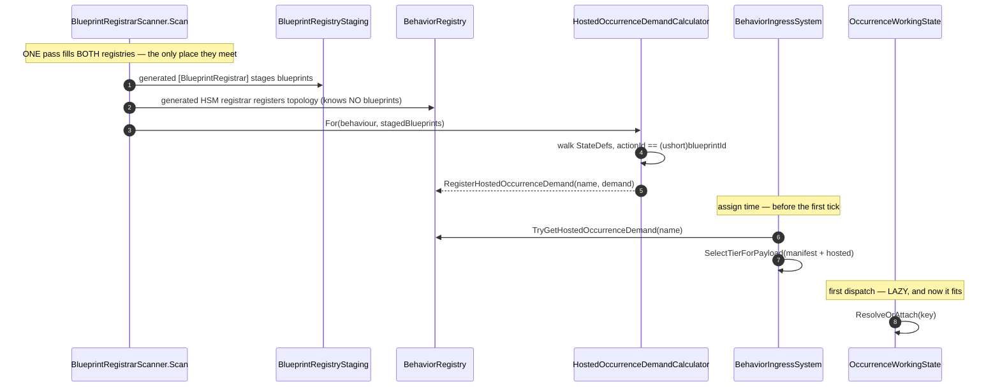
```mermaid
sequenceDiagram
    autonumber
    participant Scan as BlueprintRegistrarScanner.Scan
    participant BpS as BlueprintRegistryStaging
    participant BeR as BehaviorRegistry
    participant Calc as HostedOccurrenceDemandCalculator
    participant Ing as BehaviorIngressSystem
    participant Occ as OccurrenceWorkingState

    Note over Scan: ONE pass fills BOTH registries — the only place they meet
    Scan->>BpS: generated [BlueprintRegistrar] stages blueprints
    Scan->>BeR: generated HSM registrar registers topology (knows NO blueprints)
    Scan->>Calc: For(behaviour, stagedBlueprints)
    Calc->>Calc: walk StateDefs, actionId == (ushort)blueprintId
    Calc-->>BeR: RegisterHostedOccurrenceDemand(name, demand)

    Note over Ing: assign time — before the first tick
    Ing->>BeR: TryGetHostedOccurrenceDemand(name)
    Ing->>Ing: SelectTierForPayload(manifest + hosted)

    Note over Occ: first dispatch — LAZY, and now it fits
    Occ->>Occ: ResolveOrAttach(key)
```

*What the picture shows that the prose hid: the demand travels **registry → registry**, never through the
HSM emitter — and the arrow the user forbade (`HsmEmitCore → blueprint catalog`) simply is not on the
canvas.*

| ⭐ the decision, and why each piece is where it is | |
|---|---|
| ⭐⭐⭐ **a SIZE, not a manifest** | 🔒 the occurrence KEY needs the region slot the kernel picks at runtime, so it is not knowable at registration — ⭐ but the SIZE is, and the tier is all that must be decided before the first tick. ⇒ slots still attach lazily (§24.8) |
| ⭐⭐⭐ **an OVERLAY on `BehaviorRegistry`, not a field on `BehaviorDefinition`** | ⛔ `BehaviorDefinition`'s properties are `init` and the topology is registered by a generated registrar that must stay blueprint-ignorant ⇒ a post-pass would have to CLONE the definition, which breaks on every property added later. ⭐ `_resolversByName` and `_jsonParamsDtoByName` are **the same shape for the same reason** — order-independent reconciliation — so this is prior art, not a new mechanism |
| ⭐⭐ **the join runs in `BlueprintRegistrarScanner.Scan`** | 📐 it is **the only place in the tree where both registries are populated in one pass** *(its own parameter list: `BlueprintRegistryStaging` **and** `BehaviorRegistry`)* |
| ⭐⭐ **ADDITIVE to the manifest, in BOTH branches** | ⛔ the cheap wrong fix sizes only `EnsureOccurrenceStore`, which **never runs** for a behaviour that declares stateful slots of its own ⇒ rail `O7_R18` exists precisely to redden on it |

⛔ **Rejected, one line each:**
**inject `BlueprintRegistry` into `BehaviorIngressSystem`** — cascades through `MissionControlModule` and
3 production + ~18 test construction sites, and the silent-default rule then obliges every one of them to
pass it · **grow the tier inside `ResolveOrAttach`** — a structural change inside a kernel dispatch, which
the seam's own contract forbids · **emit the demand from `HsmBridgeEmitCore`** — the user's explicit
ruling · **store it on `BehaviorDefinition`** — see the table above.

### 27.7.3 ⚠ WHAT THE CALCULATOR COUNTS, AND THE ONE ARM THAT IS INEXACT

⭐ **Distinct `(state, blueprint)` pairs** — that is exactly what makes two distinct slot KEYS, because
the region a state runs in is fixed by the machine's topology. Sources: each `StateDef`'s
entry/exit/activity/timer action id, and each per-region transition's guard and action id **keyed by its
source state** *(`HsmKernelCore.cs:594`/`:727` dispatch against the source)*.

⛔⛔ **GLOBAL transitions are the inexact arm, and it is named rather than papered over.**
`HsmKernelCore.cs:551` evaluates a global guard against `activeLeafIds[0]` — *whatever region 0's leaf
happens to be* — so its occurrence key varies with the machine's current state. ⚠ Counting it **per
state** would multiply the demand by `StateCount` and push every machine with one global transition to
the largest tier; ⭐ it is counted **once**, which covers the common case, and
`OccurrenceWorkingState`'s loud *"no room"* remains the backstop for the rest.

⚠ **And a scan sees ONE assembly.** A behaviour whose machine hosts a blueprint staged by a **different**
scan records no demand — which is the pre-`O7b-3` state exactly (smallest tier, loud throw). ⛔ It is not
a silent mis-size: 🔒 **absent ≠ zero** is enforced by the API — `TryGetHostedOccurrenceDemand` returning
`false` means *"nobody computed one"*, while `SlotCount: 0` means *"measured, and it hosts nothing"*.

### 27.7.4 ⭐ EVIDENCE — **two red-proofs, each hitting only its own half**

| what was neutered | what reddened |
|---|---|
| the **CONSUMER** — `HostedPayloadCost` → `0` in both branches | ⭐ **exactly 3**: `O7_R16` *(a 4th occurrence)* · `O7_R17` *(a 512-byte state)* · `O7_R18` *(manifest + hosted)*. ⛔ The producer rails stayed green |
| the **PRODUCER** — one `Count(s, state.OnEntryActionId)` commented out | ⭐ **exactly 1**: `O7_R19` *(the demand is DERIVED)*. ⛔ The consumer rails stayed green |

⇒ ⭐⭐ **The two halves are independently pinned**, which is the property that matters: a future change
that keeps the plumbing and breaks the derivation reddens `R19` alone and says so.

⭐ **Seven rails** — `O7_R16`–`O7_R22`; ⑳ *(a non-blueprint action id costs nothing)*, ㉑ *(one state
hosting one blueprint three ways is ONE occurrence, because it is one key)* and ㉒ *(no machine ⇒ `null`,
not zero)* have no red-proof of their own because they pin **inverse** claims — each one is the rail that
reddens on the obvious wrong simplification.

## 28. 🔴🔴🔴 `E3a` / `CE-298` — **A HOSTED OCCURRENCE'S PARAMS MOVE INTO ITS SLOT** *(`2026-09-21`)*

### 28.1 ⛔⛔ THE REFRAME — **and a wrong inference of mine that the user caught**

📐 **Measured first, and it changed what `CE-298` is:**

| | |
|---|---|
| params live in the behaviour's **100-byte** `BehaviorParameters` region, at a **per-variable** packed offset | `BehaviorConstants.cs:32` · `BTreeBridgeEmitCore.cs:1236` writes `memory + field.ByteOffset` |
| a hosted blueprint's `Params` is a **VIEW** at a baked offset | `AiPrimitiveEmitter.EmitParamProjection` |
| ⭐ the **BTree bridge** bakes a real per-variable offset *(0, 4, 8 in `T20_MultiStateful`)* | ✅ correct already — §4.1 calls it *"the template"* |
| 🔴 **every HSM thunk bakes a literal `0`** | `AiPrimitiveEmitter.cs:344-347` |
| 🔴 the HSM generated registrars bake **NO** `BehaviorParameters` projection at all | measured over `HsmJsonGenerator/*.g.cs` — zero hits at any offset |
| an HSM state's action binding is a **bare method-name string**, with no params of its own | `HsmVariableShowcase.hsm.json` state keys |

⛔⛔ **I first argued that per-occurrence params storage *"buys nothing measurable today"*, on the
grounds that **0 of 27** AiPrimitive goldens mutate their `Params`. 🔒 **The user rejected that, and was
right:** *"how can we avoid moving params into the slot? the simplest case like two actions running in
two hsm regions would overwrite the params. Forget the fact it is not in use now. it will be."*

⚠ **The measurement was true; the INFERENCE was wrong** — it reasoned from today's corpus to answer a
**capability** question. ⭐ The hazard is in the **SHAPE**: `TickCore(ref Params p, …)` permits writes,
so the first action that keeps a cooldown in its params corrupts its sibling, silently.

⭐⭐⭐ **And it is WORSE than the overwrite, which the challenge surfaced:** even **READ-ONLY**, two
**DIFFERENT** blueprints hosted at two states of one asset both project **their own `Params` type** over
`BehaviorParameters[0] + 0`. ⇒ a **type-punned misread** of whichever variable is packed first. ⛔ **No
validator guards it** *(searched `Stage2_Validate*`, none found)*.

### 28.2 ⛔ WHY THE SLOT IS THE ONLY HOME — **the cheap fix is REFUTED, not merely rejected**

⭐ The obvious cheap fix is *"bake a per-site offset in the HSM thunk, like the bridge does per node."*
📐 **It cannot be done**: `AiPrimitiveEmitter` emits **ONE thunk per blueprint**, registered under one
action id (`CSharpEmitter.cs:383`), and **the blueprint's emitter cannot see its HSM hosts** — §24.8, the
same invisibility that forced lazy attach and that `O6`'s runtime stamp exists to work around. ⭐ The
BTree bridge can only bake an offset because it emits **one adapter per node** and sees the binding.

⇒ ⭐⭐⭐ **Only the occurrence slot can distinguish two regions, and it already does** — the
`(region, state)` stamp has been serving working state since `O7b`. 🔒 And the destination is not new:
`DESIGN_Hsm_Storage_Model.md`'s supersession banner already states that **`BrainBlackboard.BehaviorParameters`**
moves into per-occurrence slots. **`E3a` is one occupant leaving.**

### 28.3 ⭐⭐ THE LAYOUT AND THE SEAM

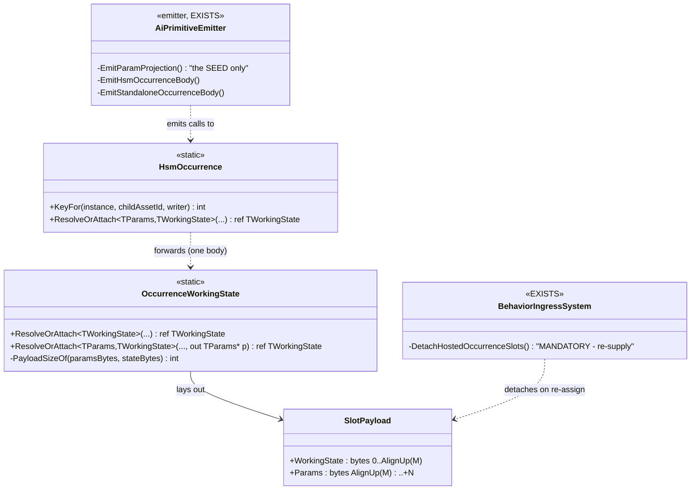
```mermaid
classDiagram
    class OccurrenceWorkingState {
        <<static>>
        +ResolveOrAttach~TWorkingState~(...) ref TWorkingState
        +ResolveOrAttach~TParams,TWorkingState~(..., out TParams* p) ref TWorkingState
        -PayloadSizeOf(paramsBytes, stateBytes) int
    }
    class HsmOccurrence {
        <<static>>
        +KeyFor(instance, childAssetId, writer) int
        +ResolveOrAttach~TParams,TWorkingState~(...) ref TWorkingState
    }
    class SlotPayload {
        +WorkingState : bytes 0..AlignUp(M)
        +Params : bytes AlignUp(M)..+N
    }
    class AiPrimitiveEmitter {
        <<emitter, EXISTS>>
        -EmitParamProjection() "the SEED only"
        -EmitHsmOccurrenceBody()
        -EmitStandaloneOccurrenceBody()
    }
    class BehaviorIngressSystem {
        <<EXISTS>>
        -DetachHostedOccurrenceSlots() "MANDATORY - re-supply"
    }
    HsmOccurrence ..> OccurrenceWorkingState : forwards (one body)
    OccurrenceWorkingState --> SlotPayload : lays out
    AiPrimitiveEmitter ..> HsmOccurrence : emits calls to
    BehaviorIngressSystem ..> SlotPayload : detaches on re-assign
```

*What the picture shows that the prose hid: `Params` and `WorkingState` are ONE slot, so there is one
key, one lookup and one lifetime — and `BehaviorIngressSystem` is a second writer of that slot's
lifetime, which is the edge §28.4 is about.*

### 28.3a 🔴🔴🔴 DEVIATION FROM THE DRAWN DESIGN — **the payload is `[WorkingState][Params]`, NOT the reverse**

⛔⛔ **§28.3 above was drawn as `[Params N][WorkingState M]`** *(following §4.2's wording in
`DESIGN_Parameter_Model`)*, **and it was built that way first. It is SUPERSEDED — the order is
reversed.** ⭐ Recorded rather than quietly corrected, because the reason generalises.

📐 **What it cost, measured:** params-first shifts the working state to `payload + AlignUp(sizeof(Params))`,
and **every existing reader decodes working state at the payload BASE** — `BlueprintDebugSession`, the
live renderers, `OccurrenceWorkingState.Resolve<T>`. ⇒ **three `AiPrimitiveStateMetadataTests` inspector
rails went red, reading zeros where a value had been written.**

| ⭐ the fix, and why it is better than teaching the readers | |
|---|---|
| ⭐⭐⭐ **working state FIRST** | every existing reader stays correct **BY CONSTRUCTION** — nothing had to learn that params exist |
| ⛔ **the rejected repair** | emit `ParamsSize` onto the AiPrimitive registration and add it at each decode site. ⚠ That is **N readers to find and keep in step**, and the next reader added would get it wrong |
| ⭐ **only the emitter needs the offset**, through `OccurrenceWorkingState.ParamsOffsetOf<TWorkingState>()` | ⛔ one spelling, so the seam and the emitter cannot disagree |

⭐⭐ **This is the `O7b-1` lesson repeating — *"the inspector is a real consumer"* — and this time a RAIL
caught it rather than the user.** ⚠ That is the whole value of `O7b-2` having wired the inspector to the
occurrence store: it made the inspector able to fail.

### 28.4 ⭐⭐⭐ THE SEED, AND WHY THE DETACH IS MANDATORY

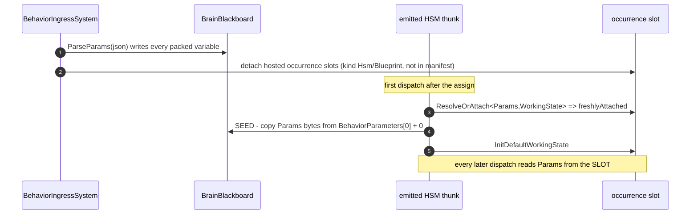
```mermaid
sequenceDiagram
    autonumber
    participant Ing as BehaviorIngressSystem
    participant BB as BrainBlackboard
    participant Thunk as emitted HSM thunk
    participant Slot as occurrence slot

    Ing->>BB: ParseParams(json) writes every packed variable
    Ing->>Slot: detach hosted occurrence slots (kind Hsm/Blueprint, not in manifest)
    Note over Thunk: first dispatch after the assign
    Thunk->>Slot: ResolveOrAttach<Params,WorkingState> => freshlyAttached
    Thunk->>BB: SEED - copy Params bytes from BehaviorParameters[0] + 0
    Thunk->>Slot: InitDefaultWorkingState
    Note over Thunk,Slot: every later dispatch reads Params from the SLOT
```

*What the picture shows that the prose hid: without step 2 the assign in step 1 never reaches the
thunk — the slot still holds the PREVIOUS assign's seed.*

| ⭐ | |
|---|---|
| ⭐⭐⭐ **the SEED is from `BehaviorParameters[0] + 0` — the exact bytes the thunk reads today** | ⇒ the move is **byte-identical** at the first dispatch, so it is provably not a downgrade. ⛔ Seeding from zeros/defaults would hand every occurrence zeroed params where today it gets the behaviour's authored ones — §26.1, the rule `O7d` was reverted twice for |
| ⛔⛔ **THE DETACH IS NOT OPTIONAL** | 🔴 Today the thunk reads the blackboard **live**, so a re-assign with new JSON takes effect on the next dispatch. ⭐ After `E3a` the slot holds a **copy** ⇒ **without the detach, new JSON would silently stop taking effect.** ⚠ That is a REGRESSION, which is why it is in this slice and not a follow-up |
| ⭐ **the detach is precise, and `A3` is what makes it possible** | the `Kind` nibble (`D1′`) distinguishes a lazily-attached hosted occurrence (`Hsm`/`Blueprint`) from a manifest slot. ⛔ Detaching by kind ALONE would also take manifest slots — so it is *kind AND not-in-manifest* |
| ⚠ **offset `0` is the SEED's source, never the destination** | it is inherited from the model being retired, and it dies at `E3b` when a per-site authored value exists. ⛔ It is NOT a new dependency on the blackboard |

### 28.5 ⚠ WHAT `E3a` DOES **NOT** CLOSE

| | |
|---|---|
| ⛔ **per-site authored VALUES** | every occurrence still seeds from the SAME variable ⇒ two regions get their own *copy* of one authored value. ⭐ That is `E3b` — `Q41-C1′` (the resolve hook) then `C2′`, both approved and unbuilt |
| ⛔ **the type-pun is not FIXED, it is CONTAINED** | two different blueprints still seed from offset `0`; ⭐ but they now write into **separate slots**, so neither corrupts the other. ⚠ The misread of the seed remains until `E3b` |
| ⚠ **a live binary upgrade over an existing slot** | the payload grows while `StructureHash` is unchanged, so the hash guard would not re-attach. ⛔ Not reachable within one process (slots are created by the binary that reads them); named so nobody is surprised by it in a hot-reload |

### 28.6 🔴🔴🔴 `E3b` DOES NOT REACH THE HSM PATH — **the missing site→variable binding** *(found `2026-09-21`)*

⭐⭐ **Found by re-measuring `Q41`/`Q43`'s premises a month after they were approved** — the user asked
*"do the decisions still look healthy from today's point of view?"*, and this is what the check turned up.
⛔ **It is not a flaw in those decisions**; it is a premise that only became load-bearing when `E3a`
made the HSM path per-occurrence.

📐 **The measurement.** `C1′`/`C2′` resolve **per VARIABLE**, and a hosting site reaches a variable
through **`ExpressionTargetField`**:

| where | carries `ExpressionTargetField`? |
|---|---|
| **BTree action / condition nodes** | ✅ `BehaviorTreeAssetDto:177`/`:204` |
| **HSM transitions** *(and global transitions)* | ✅ `TransitionNodeDto:137`, `GlobalTransitionNodeDto:157` |
| 🔴 **HSM STATES** — `OnEntryAction` · `OnExitAction` · `ActivityAction` · `TimerAction` | ⛔ **NO.** Bare method-name strings |

⭐⭐⭐ **And it is genuinely the params address, not decoration:**
`BTreeBridgeEmitCore.EmitManagedActionThunks` **skips any node whose `ExpressionTargetField` is empty**,
then bakes `offsetMap[targetField].ByteOffset` as that site's params offset.
⚠ *(`HsmAsset.cs:263` calls the same field an "OUTPUT binding" — that is the editor's variable-usage
counter describing the other half of the same thing: a reusable action's DTO **is** the variable, read
as params and written as a result. ⛔ Not a contradiction, and worth saying because it reads like one.)*

⇒ 🔴 **Two parallel HSM regions hosting one asset have nothing to bind them to different variables**, so
they resolve to the same one — which is exactly `E3a`'s offset-`0` seed. **`E3b` as designed closes the
BTree case and leaves the HSM one open**, and the HSM parallel-regions case is what `CE-298` was filed for.

| ⭐ why the decisions are still healthy | |
|---|---|
| ⭐⭐ **`Q41` was written from a BTree question** | 🔒 *"what if i need to set the speed or destination from a blackboard?"* — HSM applicability was never in scope, never measured, and never claimed |
| ⭐ **everything `Q41`/`Q43` DID decide re-measured true** *(`2026-09-21`)* | `GraphKind.Construction` still has no emitter consumer *(only the `Stage5_Schedule:4837` map + an editor label)* · `IrOp_MakeStruct`/`IrOp_SetMembers` still have live arms *(`StatementEmitter.cs:238/258`)* · `IHostVariableAccess` still has **zero** implementers · `host: null` at **two** production sites now *(`BehaviorIngressSystem:100`, `BlueprintInstanceService:143`)* |

⇒ ⭐⭐⭐ **`E3b-0` — give an HSM STATE's four action slots a target field, mirroring `TransitionNodeDto`.**
⭐ Same shape, same picker, no new concept — and it names a variable in the **HSM's own blackboard**, so
it does **not** make the HSM learn about blueprint catalogs *(the user's ruling)*.
⛔ **It sequences BEFORE `C1′`**: without it a resolver cannot produce different values for two regions
however good it is.

⛔ **Rejected:** give the resolver the occurrence identity and let it branch on region — that makes every
resolver aware of the hosting topology, and `Q41-A2`'s *"no second supply mechanism"* rules against it.

#### 28.6a ⛔⛔ `E3b-0` IS BIGGER THAN "ADD A DTO FIELD" — **the HSM path has no per-site DISPATCH**

⚠ **My first statement of `E3b-0` was *"add `ExpressionTargetField` to `StateDto`'s four action slots,
mirroring `TransitionNodeDto`"*. 📐 **Measuring the runtime showed that is NECESSARY AND NOT SUFFICIENT.**

📐 **The asymmetry, measured:**

| | how a site is dispatched |
|---|---|
| ⭐ **BTree bridge** | emits **ONE ADAPTER PER NODE**, registered at a **per-site key** — `{MethodFqn}@{offset}[@{slotKey}]` (`BTreeBridgeEmitCore:473`) ⇒ the offset is **baked per site** |
| 🔴 **HSM** | `HsmActionDispatcher.RegisterAction(ushort id, IntPtr)` — **ONE thunk per action id**, and the kernel dispatches from `StateDef.OnEntryActionId`, a single `ushort`. ⇒ **there is nowhere to bake a per-site offset** |

⇒ ⛔ **A target field on the state would be AUTHORING WITH NO CONSUMER** — the mirror of §26.1's rule
*(storage without supply)*, and the same disease: a field nothing reads.

⭐⭐⭐ **What makes it tractable is that `E3a` already moved the params.** The binding does **not** need
to reach the thunk's address computation at all — the params are in the slot. It only needs to reach
**the SEED** (§28.4), which already runs inside the thunk and already holds `O6`'s `(region, state)`
stamp. ⇒ **the seed reads offset `X` instead of `0`.**

| ⭐ so `E3b-0` is three parts, and all three are in this lane | |
|---|---|
| **①** | `StateDto`'s four action slots gain a target field *(authoring)* |
| **②** | **`HsmBridgeEmitCore` emits a `stateId → packedOffset` table** beside the blob. ⭐⭐ It maps **its own states to its own blackboard variables** ⇒ 🔒 **the HSM still learns nothing about blueprint catalogs** — the user's ruling holds |
| **③** | the seed consults that table through the stamp, instead of the literal `0` |

⚠ **The editor PICKER for ① is a UI-lane surface** *(`Hrot.Hsm.Editor`'s `HsmPickerDrawers` /
`HsmFacetDispatcher`)*. ⭐ The field is authorable in JSON without it, which is enough to rail ②+③ —
⛔ so the picker is flagged for the UI lane, not smuggled in here.

#### 28.6b ✅ `E3b-0` AS BUILT — **and a COVERAGE GAP it exposed** *(`2026-09-21`)*

| part | where |
|---|---|
| **①** the authoring binding | `StateNodeDto.ExpressionTargetField` — **ONE field for all four action slots**, because the occurrence key is `(region, state, childAsset)`: every action slot of one state hosting one blueprint resolves to the SAME slot. ⛔ Four fields would offer a distinction the storage cannot express |
| **②** the table | `HsmBridgeEmitCore.EmitStateParamBindings` bakes `(StableId, offset)` pairs; `HsmParamBindings.Register` resolves them to flat indices through the blob's own `MachineMetadata.StateStableIds` ⇒ ⭐ **the emitter never needs the flattener's ordering** |
| **③** the consumer | `HsmOccurrence.SeedParamsOffset(instance, writer)` — reads the **same stamp** `KeyFor` does, so params and working state cannot resolve for different occurrences |

⭐⭐ **Additive by construction:** an unbound state answers `UnboundOffset` (`0`) — the pre-`E3b-0`
behaviour byte-for-byte — and an asset with no bound state **emits nothing at all**, so every asset
authored before this stays byte-identical. ⚠ That gating is the `AssetId` lesson applied.

🔒 **The user's ruling holds:** the HSM registrar maps its **own** states to its **own** blackboard
variables; the blueprint side only asks *"what offset for this `(machine, state)`?"*.

⛔⛔ **THE COVERAGE GAP — measured, and it is why `E3b-0` moved ZERO goldens.**
📐 **Not one asset in the golden corpus declares HSM hosting** *(`grep -rl "hsmAction: true|hsmGuard: true"`
over `Snapshots/` ⇒ **0 files**)*. ⇒ ⚠ **the emitted HSM thunk shape has NO golden coverage whatsoever**;
its only guard is `ThunkEmissionTests`. 🔴 **That is why an HSM emitter change can look free** — and it
is the same blind spot that let `BP-297` ship. ⭐ Worth a golden asset with HSM hosting; ⛔ filed as an
observation here rather than smuggled into this slice.

### 28.7 ✅ `C1′` + `E7a` — **THE RESOLVE STAGE RUNS, AND IT SEES THE HOST** *(`2026-09-21`)*

⭐⭐⭐ **`IHostVariableAccess` has an implementation for the first time since it was declared on
`2026-08-16`** — and the reason it could not have had one earlier is the point of this section.

### 28.7.1 🔒 THE DECISION, AND THE USER'S QUESTION THAT SETTLED IT

⭐ I had framed the open call as *"root-only resolve, or a hosted resolve pass at seed time?"*.

> 🔒 **User, `2026-09-21`:** *"isn't there something like function based param resolution, allowing to
> take params from wherever the function/graph has access to? this would mean own resolve pass."*

📐 **Measured, and it settles it by SIGNATURE rather than by preference** — `BehaviorParams.cs:19`:

```csharp
public delegate void ResolveParams<TDto>(
    ref TDto dto, EntityRepository world, Entity self, IHostVariableAccess? host)
```

⇒ ⭐⭐⭐ **a resolver reads from `world`, `self` AND `host`, so its result depends on the OCCURRENCE's
context.** ⛔ Running it once per behaviour and copying the result into every occurrence would be wrong
**by construction** — and `host` can only ever be non-null in a per-occurrence pass. ⇒ **own resolve
pass, at the seed.**

### 28.7.2 ⭐ WHAT SHIPPED

| | |
|---|---|
| `HsmHostVariableAccess` | the **first** `IHostVariableAccess` implementation — NAME-keyed over the host's params region, **read-only**, **fails closed** on an absent name, a width disagreement or an unknown machine |
| `HsmParamBindings.RegisterVariables` | the host's own `name → (offset, size)` map, emitted from the **same `packedFields`** that drive its `ParseParams` and its `ManagedBlackboardVariables` ⇒ ⛔ the three cannot disagree |
| `HostedParamResolvers` | the resolve stage, keyed by ASSET; **a miss is free and silent** (§3.1's common case), **a wrong-typed registration THROWS** |
| the emitted seed | `bake/copy → RESOLVE → init` inside `if (freshlyAttached)` ⇒ **resolve-ONCE** at activation (§3.1, `R-84`), never per dispatch |

⭐ **The STANDALONE thunk gets the stage too, with `host: null`** — it has no host by construction, but
a resolver may still compute from `world`/`self`. ⛔ Omitting it would make the two paths differ for no
reason the model expresses.

⚠ **The width check is a type check in disguise, and it is the honest one available**: the packed map
records a byte size, not a CLR type, so an `int` read as a `float` is NOT caught. ⛔ Said plainly rather
than implied — pretending otherwise would be worse than the gap.

### 28.7.3 ⚠ WHAT IS STILL OPEN

| | |
|---|---|
| ⛔ **`C2′` — the resolver PICKER** | it is `Hrot.Hsm.Editor`, a **UI-lane** surface. 🔒 User, `2026-09-21`: *"with UI related parts let's wait, we will need first to integrate the stuff not yet merged from the ui branch."* ⇒ resolvers are registered in CODE until then |
| ⛔ **`Q43`** — a resolver authored AS A BLUEPRINT | the `GraphKind.Construction` emitter arm + `V_ResolverPurity`. ⭐ Approved and unbuilt; deliberately held until this proves out |
| ⚠ **the generated `ParseParams` hook for the ROOT path** | `C1′` as `Q41` words it. ⭐ The hosted half is what carried the capability; the root half is additive and has no blocked consumer |

---

## 29. ⛔ `P3` — **THE ROOT BEHAVIOUR'S PARAMS MOVE INTO A SLOT** *(DESIGN, `2026-09-21`)*

> **`build-state: DESIGN`** — ⛔ nothing here is built. 📄 `PLAN_Occurrence_Storage_Build.md` "THE PATH"
> `P3`; it is what makes `P4` *(retire `BrainBlackboard`)* possible.

### 29.1 ⭐⭐ INVENTORY — **the LIVE params surface, re-measured after `E3a` + `P2`**

```
grep BehaviorParameters --include=*.cs (production)   -> 28 files / 60 refs
```

⛔⛔ **The plan's framing is now STALE, and by a lot.** It says `P3` re-homes *"the root behaviour's
live params home — `AiPrimitiveEmitter` · `HsmBridgeEmitCore` · `JoinFormationExecutor` ·
`PredicateCompiler`"*. 📐 Measured today: **`AiPrimitiveEmitter` has NO live root-params read left.**
Its only two `BehaviorParameters` emits are `:461` *(the SEED, inside `freshlyAttached`)* and `:607`
*(the HOST pointer for `IHostVariableAccess`)* — ⚠ the hits at `:389` and `:425` are **history
comments**, not code. `E3a` already took the blueprint half.

| # | what still reads the blackboard as the LIVE params home | where |
|---|---|---|
| ⭐⭐⭐ **A** | **the BTree per-node ADAPTERS** — three `BlackboardParamsExpression.At("bb", entry.Offset)` sites | `BTreeActionGenerator.cs:700,713,730` |
| ⭐ **B1** | `JoinFormationExecutor.OnEnter` — `*(JoinFormationParams*)&bb.BehaviorParameters[0]`, hand-written | `:88-91` |
| ⭐ **B2** | `PredicateCompiler` — the replay-browser search projecting `TDto` at offset 0 | `:354-360` |
| ⚠ **C** | the HSM bridge's `__parseParams` **write** target *(role ③)* | `HsmBridgeEmitCore.cs:243` |
| ⚠ **D** | the ingress **commit** — memcpy of the parse shadow into the live component *(role ③)* | `BehaviorIngressSystem.cs:113` |
| ✅ **E** | the SEED *(②)* and the HOST params pointer *(④)* — ⛔ **these STAY**, see 29.3 | `AiPrimitiveEmitter.cs:461,607` |

⇒ ⭐⭐ **`A` is the whole of the remaining hard work, and it is `P2`'s twin.** The BTree adapter does
exactly what `HsmActionGenerator` did an hour ago, through the **same** `BlackboardParamsExpression`
home *(`BP-306`)*.

### 29.2 ⭐⭐⭐ WHY `A` IS EASIER THAN `P2` WAS — **BTree already HAS a per-site key**

⛔ `P2` needed a new identity *(`ComputeHsmStateKeyForCurated`)* because the HSM dispatcher registers
**one thunk per `ushort` action id**, so there was nowhere to put a per-site discriminator.
⭐⭐⭐ **The BTree bridge has the opposite shape and always did** — 🔒 `HsmParamBindings`' own header
says so: *"the BTree bridge does not have this problem because it emits **one adapter per node** at a
per-site key `{MethodFqn}@{offset}`."*

⇒ ⭐ **`ComputeTreeStateKey(hostAssetId, siteNodeVisualId, childAssetId)` already exists** and already
keys per node. `A` re-points the adapter at a slot resolved by **that** key — ⛔ no new identity, and
no `P2-A`-style decision to make.

### 29.3 🔴 WHAT MUST NOT MOVE — **the two roles that keep the blackboard alive until `P4`**

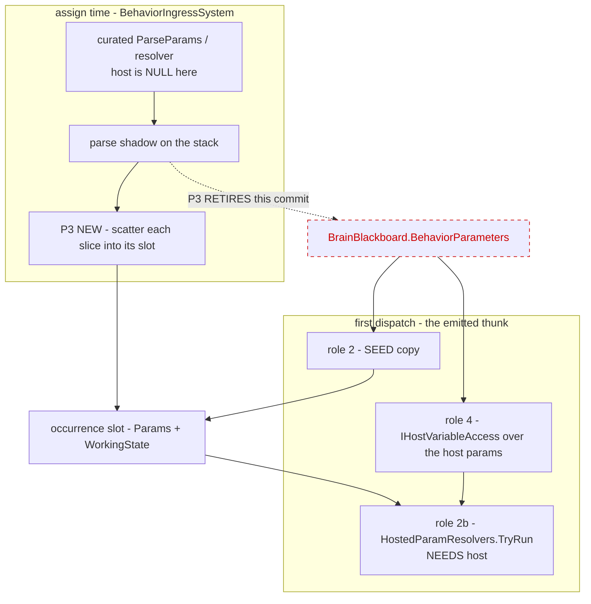
```mermaid
graph TD
    subgraph ingress["assign time - BehaviorIngressSystem"]
        SHADOW[parse shadow on the stack]
        RESOLVER[curated ParseParams / resolver<br/>host is NULL here]
        SCATTER[P3 NEW - scatter each slice into its slot]
    end
    subgraph dispatch["first dispatch - the emitted thunk"]
        SEED[role 2 - SEED copy]
        RESOLVE[role 2b - HostedParamResolvers.TryRun<br/>NEEDS host]
        HOSTP[role 4 - IHostVariableAccess over the host params]
    end
    BB[BrainBlackboard.BehaviorParameters]
    SLOT[occurrence slot - Params + WorkingState]

    RESOLVER --> SHADOW
    SHADOW --> SCATTER
    SCATTER --> SLOT
    SHADOW -.->|P3 RETIRES this commit| BB
    BB --> SEED
    SEED --> SLOT
    SLOT --> RESOLVE
    BB --> HOSTP
    HOSTP --> RESOLVE

    classDef gone stroke-dasharray: 5 5,stroke:#c00,color:#c00
    class BB gone
```

> ⭐⭐ **Caption — what the picture shows that the prose hid.** Drawing the two columns forces the
> question *"where does `host` come from?"*, and the answer is the edge `BB → HOSTP`: the host's
> variable table. ⛔ **That edge is why `P3` cannot simply delete the blackboard** — it is `P4`'s job,
> after the root's slot becomes the host table. ⚠ And `RESOLVE` sits in the **right-hand** column on
> purpose: it runs at FIRST DISPATCH, not at assign time, because `IHostVariableAccess` does not
> exist until the child activates *(`BehaviorIngressSystem.cs:100` passes `host: null` and says so)*.

### 29.4 ⭐ The sequence — **assign time gains a scatter; first dispatch keeps its resolve**

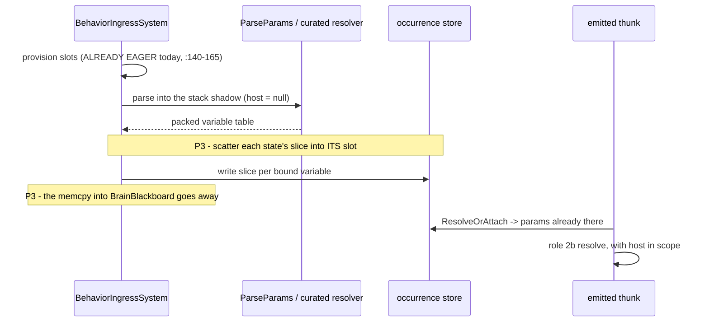
```mermaid
sequenceDiagram
    participant Ing as BehaviorIngressSystem
    participant PP as ParseParams / curated resolver
    participant Store as occurrence store
    participant Thunk as emitted thunk

    Ing->>Ing: provision slots (ALREADY EAGER today, :140-165)
    Ing->>PP: parse into the stack shadow (host = null)
    PP-->>Ing: packed variable table
    Note over Ing,Store: P3 - scatter each state's slice into ITS slot
    Ing->>Store: write slice per bound variable
    Note over Ing: P3 - the memcpy into BrainBlackboard goes away
    Thunk->>Store: ResolveOrAttach -> params already there
    Thunk->>Thunk: role 2b resolve, with host in scope
```

> ⭐ **Caption.** The provisioning arrow is drawn as *already eager* because it is — `P3` adds a
> scatter beside work that happens today, it does not introduce a new phase.

### 29.5 ⚠ OPEN — **to settle before `build-state: READY-TO-BUILD`**

| # | question | why it is not answered here |
|---|---|---|
| ⚠ **`P3-A`** | what key does the **root** behaviour's own params slot use? | ⭐ Hosted uses `ComputeHsmStateKey`, curated uses `…ForCurated`, BTree sites use `ComputeTreeStateKey`. ⛔ The ROOT has no site — it needs its own, and that is a `P2-A`-shaped decision |
| ⚠ **`P3-B`** | do `B1`/`B2` read the root slot, or keep a helper? | ⭐ `JoinFormationExecutor` and `PredicateCompiler` are hand-written and outside the generators ⇒ they need a public accessor, which is new surface |
| ⚠ **`P3-C`** | does the scatter replace the ingress commit, or run beside it for one release? | ⛔ Dual-write is `R-132`'s second producer; ⭐ but a clean cut breaks the 7 UI readers before the UI lane migrates them *(`P4`(a))* |

### 29.6 ⛔⛔ CORRECTION `2026-09-21` — **IT IS NOT A "SCATTER". IT IS ONE SLOT AND N RE-ANCHORINGS**

⚠ **29.1–29.5 describe `P3` as *"ingress scatters each state's slice into its slot"*. That is WRONG,
and thinking the build through is what exposed it.**

📐 **The refutation is `SeedParamsOffset` itself.** It returns an offset **INTO the packed variable
table** — `HsmParamBindings.SeedOffsetFor(machineId, state)` is `field.ByteOffset` from
`BTreeBlackboardPackHelper`. ⇒ **the table must stay CONTIGUOUS** for those offsets to mean anything.
⛔ Scattering it into per-state slots destroys the very indexing `E3b-0` built.

| ⭐ the correct shape | |
|---|---|
| ⭐⭐⭐ **ONE root slot holds the WHOLE packed table**, exactly as `BrainBlackboard.BehaviorParameters` does today | keyed by `ComputeRootParamsKey(BehaviorState.ActiveBehaviorHash)` — ⭐ **computed, never stored**, like every other key here *(user, `2026-09-21`: the identity is already on the entity)* |
| ⭐⭐ **every reader changes ONE thing: its ANCHOR** | `bb.BehaviorParameters[0] + X` → `rootSlotBase + X`. ⛔ No offset arithmetic changes anywhere — which is why the BTree adapters, the seed, the host-params pointer and the two hand-written readers are all one-line edits |
| ⭐⭐ **ingress writes the shadow into the root slot** instead of memcpying it into the component | ⭐ `P3-C` **clean cut** *(user)*: the blackboard write STOPS |
| ⚠ **the tier demand grows by ONE slot + the params bytes** | 📐 §5a already priced this shape *("the root occurrence consumes one slot that does not exist today")* ⇒ `HostedOccurrenceDemandCalculator` must add it, or a behaviour at its slot ceiling fails to attach |

⇒ ⭐⭐⭐ **`P3` is much smaller than 29.1 implied**: one new key, one accessor, one ingress change, one
demand bump, and **N one-line re-anchorings**. ⛔ The "scatter" reading would have been a rewrite of
`E3b-0`.

### 29.7 ✅ THE THREE OPEN QUESTIONS, SETTLED *(user, `2026-09-21`)*

| # | answer |
|---|---|
| **`P3-A`** | ⭐⭐⭐ **No storage needed.** 🔒 *"the key that leads to the slot allocated for the behavior params… where is this key stored? maybe where the BrainTier is?"* — ⭐ `BehaviorState.ActiveBehaviorHash` **already identifies the root behaviour and is already on the entity**, and every occurrence key here is COMPUTED, never stored. ⇒ `ComputeRootParamsKey(behaviourHash)` |
| **`P3-B`** | ⭐⭐ **Add the accessor** — `BehaviorParams.TryGetRoot<T>(world, entity, out T*)`. ⭐⭐ **And the EMITTERS can use the same one for the ROOT path**, because the root key is a RUNTIME value needing no baking. ⛔ Per-SITE occurrences stay inlined in the emitter: their identity comes from the `writer` stamp, which no generic accessor can see. ⚠ Cost: one more public surface, and a non-inlined generic call — the same call the emitter already makes |
| **`P3-C`** | ⭐⭐ **CLEAN CUT.** The ingress memcpy into `BrainBlackboard` stops; slots are the only home. ⛔ Dual-write would be `R-132`'s second producer, and in this codebase a temporary one becomes permanent. ⚠ The 7 UI readers are re-anchored **in the same programme** rather than left stale — the lane fence was lifted for this work |

### 29.8 ⛔⛔⛔ AS-BUILT `2026-09-21` — **`CE-302` IS TWO FIXES, AND THE SECOND ONE WAS A LIVE DEFECT**

⚠ **§29.6's demand row describes only HALF of what `CE-302` turned out to be.** Building it exposed a
defect `P3` step 2 had already shipped.

| # | what | where |
|---|---|---|
| **①** | ⭐⭐ **THE DEMAND** *(as §29.6 predicted)* — the root slot's **aligned payload + one `BlueprintSlotEntry`** is added to the tier demand in **BOTH** provisioning branches, before the tier is chosen | `BehaviorIngressSystem.RootParamsCost` ⇒ `ProvisionStatefulSlots` and `EnsureOccurrenceStore` |
| **②** | 🔴🔴🔴 **THE ORDERING — NOT PREDICTED, AND IT WAS TOTAL PARAMS LOSS ON EVERY HSM BRAIN** | the `P3` attach block now sits **AFTER** `DetachHostedOccurrenceSlots` |
| **③** | ⚠ **THE LEAK** — a BTree brain's root slot is invisible to that sweep, so each behaviour change stranded one | new `RootParamsAccess.DetachRoot`, called on `previousBehaviorId != behaviorId` |

#### 🔴 Why ② is the one worth writing down

⛔ The root slot is attached with **`KindOf(def)`** — `OccurrenceKind.Hsm` on an HSM brain
*(`A3`/`D1′`: the kind follows the brain tier)*. ⭐ `DetachHostedOccurrenceSlots` sweeps exactly
**"kind `Hsm` or `Blueprint`, and not named by the manifest"** — which the root slot satisfies on both
counts. ⇒ **with the attach above the sweep, the slot was created and destroyed inside one call, on
every assign, on every HSM behaviour.**

⭐⭐ **Nothing noticed because the blackboard commit still ran** — params still arrived, no behaviour
changed. 🔒 **That is the shape this programme keeps filing, and the reason `P3` was deliberately built
additive-first: the cut would have turned a silent no-op into silent zeroed params.**

| ⚠ the asymmetry that makes it a RAIL, not a comment | |
|---|---|
| ⭐ a **BTree** brain's root slot has kind `BTree`, which the sweep does not look at ⇒ **it was always fine** | ⛔ so a rail covering only BTree would have proved nothing. `O7_R39` asserts **both**, HSM first |
| ⭐ conversely the **leak** (③) is **BTree-only** — the HSM sweep was already detaching the old root slot by accident | ⇒ `O7_R41` churns four BTree assigns and asserts the slot count stays **1** |

#### ✅ Rails and red-proofs

| rail | asserts | red-proof *(measured, `2026-09-21`)* |
|---|---|---|
| **`O7_R39`** | an HSM behaviour's root params survive its own assign; the BTree sibling too | move the attach back above the sweep ⇒ **RED at the HSM `TryGetRoot`**, BTree-only `O7_R41` stays green |
| **`O7_R40`** | a behaviour whose hosted demand fills the 256 tier's **3** slots still gets room for its root params | drop `rootParamsCost` from either branch ⇒ **RED** |
| **`O7_R41`** | four consecutive assigns leave **one** slot, carrying the newest values | delete `DetachRoot` ⇒ **RED, `Expected: 1  Actual: 3`** |

⇒ ⭐⭐ **`P3` steps 1–3 are now safe to cut behind.** ⛔ Step 4 *(re-anchor the readers)* and the cut
itself still land together — §29.7 `P3-C`.

### 29.9 ✅ AS-BUILT `2026-09-21` — **`P3-C` THE CLEAN CUT, and the five things measuring it changed**

⭐⭐ **The re-anchoring and the cut landed together**, as §29.7 `P3-C` required: cutting first blanks
every params reader in one commit.

#### ⭐ What moved

| | |
|---|---|
| ⭐⭐⭐ **the EMITTERS — ONE edit, in `BlackboardParamsExpression`** | 📐 `BP-306` had already collapsed all four emitters onto one home, so `Base()`/`At()` changing from `ref {bb}.BehaviorParameters[0]` to `ref RootParamsAccess.RootRef(world, self)` re-anchored **45 generated files**. ⚠ The signature had to change shape — the old form took the name of a blackboard LOCAL, the new anchor needs `(world, entity)`, which each emitter spells differently (`ctx.World`/`ctx.Self`, `repo`/`bridge->Self`, `world`/`bridge->Self`) |
| ⭐ **the hand-written readers** | `JoinFormationExecutor` · `PredicateCompiler` · `HillAttackGizmo` · `BrainBlackboardTranslator` |
| ⭐ **the ingress** | the shadow is seeded from the CURRENT root slot and zeroed when there is none; the commit back into the component is **gone** |

#### 🔴 THE FIVE FINDINGS — **each one a thing the design did not predict**

| # | finding | why it matters |
|---|---|---|
| **①** | **`RootParamsBytes` returned 0 for a behaviour with a PARSER but no manifest and no `BlackboardLayoutType`** — and the original comment called that *"correctly means this behaviour has no params"*. ⛔ It does not: before the cut the whole 100-byte region existed whether declared or not. ⇒ that arm now reserves `MaxBehaviorParamByteSize` | 🔒 Found by `BehaviorIngress_ParsesFleeBlackboard_FromJson`, which is exactly what a rail is for. Silently dropping the parse would have been invisible in production |
| **②** | **THREE reader postures, not one.** `Require` THROWS *(execution paths: emitted thunks, `JoinFormationExecutor`)*; `Try` returns false *(diagnostics: the translator, the gizmo)*; and the **replay search predicate** must `Try` because it runs over EVERY entity in a frame and "no params region" is an ordinary non-match | ⛔ Using the loud accessor in `PredicateCompiler` would turn a browse into a crash. ⭐ The posture is a property of the CALLER, not of the data |
| **③** | **A read-only `ISimulationView` door was missing.** `HillAttackGizmo` is handed a view that may be a SNAPSHOT, and every `OccurrenceStoreAccess` entry point took an `EntityRepository`. ⇒ new `TryGetStoreInView` / `TryGetRootBytesInView`, built on `BlueprintTierSpec`'s existing view resolvers | ⚠ Before the cut a gizmo read params off an ordinary component, which every view serves. ⛔ Casting the view would throw on a snapshot or read the live world while drawing a snapshot frame |
| **④** | **The toolkit's narrow contract becomes visible at assign.** `E-cap` (§27.2) SKIPS provisioning when the tier components are not registered. ⭐ That is right for a behaviour that merely MIGHT host an occurrence; ⛔ it is wrong for one that HAS parameters, which would then run on an all-zero region — no crash, just quietly wrong. ⇒ ingress now **throws**, naming both causes | 🔒 This is the one place `P3-C` widens what a host must do: a host that assigns a params-carrying behaviour must register the tiers. The user's ruling covers it — *"ABI can and must change"* |
| **⑤** | **The proof tests could no longer hold a stack-local blackboard.** `T10`'s bodies were `var bb = new BrainBlackboard(); var ctx = new BTreeContext();` — **no world, no entity** — because params were a struct you could own. ⇒ they now build a real entity through `RootParamsTestHarness` | ⭐ Not a weakening: the assertions are about the same bytes at the same offsets, and the fixture is closer to production than a stack local ever was |

#### ⚠ WHAT IS DELIBERATELY LEFT FOR `P4`

⭐ **The two StructEdit/ImGui surfaces** — `BrainBlackboardRenderer` and `BrainBlackboardViewProvider` —
are keyed on `typeof(BrainBlackboard)` and on the buffer path `$.BehaviorParameters`. ⛔ They cannot be
re-anchored; they have to be **re-homed onto the occurrence inspector** (§25 already shows every
occurrence, labelled and decoded), which is a `P4` job because it is the component's deletion that
forces it. ⚠ **Between this commit and `P4` those two panels render zeros** — stated here rather than
discovered.

#### ✅ Gates

| suite | result |
|---|---|
| `Fdp.Toolkits.Tests` | **2303 / 0** |
| `Hrot.AiEditor.Generators.Tests` | **279 passed, 4 failed — the SAME 4 as the base commit**, measured by stashing the change and re-running *(`S3_BehaviorScopedThunkTests`, `S3_SharedSlotProvisioningTests` ×2, `T30_BehaviorScopedShared_ProofTests`)* |
| BTree generated goldens | **14 files, 38 lines changed, +38/−38 — one-for-one anchor replacement, zero net movement**, which is the shape a pure re-anchoring must have |

### 29.10 🔴🔴🔴 `P3-C` IS NOT VALIDATED — **the golden test regresses on a live cluster** *(`2026-09-22`)*

⛔⛔ **§29.9 reports `P3-C`'s gates as green and they were — on the UNIT SUITES. The live product
disagrees, and the live product wins.** 📄 The issue is filed as **`CE-304`**; this section records
what the design got WRONG, because the fault is in the design of §29.6/§29.7, not only in the code.

#### 📐 The measurement — `clusterrunner --mode all`, `hill-attack-close`, acceptance per `CE-296`

| build | trials | end positions (x) |
|---|---|---|
| `9e20d3f97` *(session start — `P0`–`P2`, `P3` steps 1–2)* | ✅ **3/3 PASS** | `523 525 529 531` — gold to the metre |
| `e9d124326` *(`CE-302` only)* | ✅ **2/2 PASS** | `523 525 529 531` |
| `3d4547a8d`+ *(`P3-C`)* | 🔴 **3/3 FAIL** | `579 587 524 590` — three tanks left on the FIRING LINE |

⭐⭐ **Deterministic on every build**, identical across trials ⇒ ⛔ not the scenario's documented
non-determinism. **`CE-302` is EXONERATED by bisection** — and with it the tier-demand bump, the
attach/sweep ordering and `DetachRoot`, all three of which §29.8 introduced.

#### 🔴🔴 RETRACTED `2026-09-22` — **this section's claim was WRONG**

⛔⛔ **A full component dump refutes it.** `NavState.FinalDestination` IS `[523, 401]` on a stranded tank —
⚠ **but `NavState` is the last intent that CARRIED values; it is stale state.** The LIVE command is
`NavigationIntent`, reading `FinalDestination [0,0,0]`, `TargetSpeed 0`, while still carrying
`IntentId 50, Mode DirectPoint` — **issued, with zeros.** `LocomotionChannel.Params` is zero with
`Status: Running`. ⇒ 🔒 **`thunk → LocomotionChannel.Params → MoveToExecutor → NavigationIntent`, and the
THUNK WROTE ZEROS** on the later dispatches. ⇒ ⭐⭐ **params ARE implicated**, and the RE-ASSIGN path is the
prime suspect. 📄 `RESUME_CE304_Params_Regression.md` §2/§4.

⚠ **The methodological lesson, worth more than the finding:** ⛔ a targeted read of one downstream field that
looks correct is NOT proof of a chain. ⭐ `NavState` is STATE; `NavigationIntent` is the COMMAND. A full
component dump was two commands away and would have shown this immediately.

#### ⛔ ~~WHAT IS *NOT* BROKEN~~ — **SUPERSEDED by the retraction above**

~~⭐⭐⭐ Parameter delivery is correct END TO END.~~ On a **stranded** tank the authored value survives
the whole chain — JSON → ingress → root slot → emitted thunk → `NavState.FinalDestination: [523, 401]`,
matching the authored `baselineStart` exactly — and all four subordinates hold **distinct** correct
regions. ⇒ the supply chain, the key derivation, and the thunk-side read are all **fine**.
⚠ The failure is `VehicleState {Speed: 0, Accel: 2.5}`, velocity `0.000` — **commanded to move, not
moving** — i.e. something *other than params* is corrupted.

#### 🔒 THE TELL — **three probes each MOVED WHICH TANKS COME HOME, and none fixed it**

| probe | result |
|---|---|
| `DetachRoot` disabled | ⛔ still fails — `577 587 525 588` |
| root params resolved through `TryGetStoreReadOnly` rather than the `GetComponentRW` path | ⚠ **PARTIAL** — `527 588 536 585`, **2** home instead of 1 |
| `RootParamsBytes` forced to the legacy `MaxBehaviorParamByteSize` | ⏳ in flight when this was written |

⭐⭐⭐ **All three change SLOT ADJACENCY, and all three change WHICH neighbour is damaged.** 🔒 That is
the signature of a **memory-overlap / adjacency fault** — ⛔ **not** three independent partial causes.
⇒ ⭐ look for **a projection that exceeds its slot**, or a pointer held across a re-attach.

#### ⛔⛔ THE DESIGN DEFECT — **§29.6 specified the ANCHOR and never specified the EXTENT**

> §29.6, verbatim: *"every reader changes ONE thing: its ANCHOR … ⛔ **No offset arithmetic changes
> anywhere**"*.

⭐ **That is true of the OFFSETS and it is silent about the SIZE, which is the half that mattered.**

| | `BrainBlackboard` *(before)* | the root slot *(after)* |
|---|---|---|
| region size | ⭐ **always `MaxBehaviorParamByteSize` = 100**, a `fixed byte[100]` on every entity | ⚠ **`RootParamsBytes(def)`** — the manifest extent, or `sizeof(BlackboardLayoutType)` |
| who decides it | ⭐ **nobody — it is a constant** | ⚠ **one DECLARED layout** |
| who writes into it | ⛔ **every emitted thunk, at its own baked `offset` with its own `TDto`** | ⛔ **unchanged** |
| what bounds a projection | ⭐⭐⭐ **the constant 100, by construction — any `offset + sizeof(TDto)` under 100 fits** | 🔴 **NOTHING CHECKS IT** |

⇒ 🔒 **The old region was safe by ACCIDENT OF SHAPE.** A flat, generously-sized, per-entity buffer
cannot be overrun by a projection that fits in 100 bytes, and **no rail ever had to state that**.
⛔ Replacing it with a slot sized from a declared type removes the guarantee **silently** — and a slot
has a NEIGHBOUR, where the blackboard's spare bytes had none.

⚠⚠ **STATED HONESTLY: the overrun is the design's KNOWN HOLE, not yet the PROVEN cause.** 📐 The one
behaviour checked in detail does NOT overrun — `HullDownAttackRun`'s manifest declares
`("Params", HullDownAttackParams, 0)` ⇒ extent **52**, and its four thunks project
`HullDownAttackParams` at offset **0** ⇒ **52 ≤ 52, it fits.** ⭐ So either another behaviour on the
entity overruns, or the mechanism is a different adjacency fault. ⛔ **Do not close `CE-304` on the
sizing argument alone.**

#### ⭐⭐ THE CORRECT SOLUTION — **the extent is an EMIT-TIME fact, and it must be DERIVED, not declared**

| # | | |
|---|---|---|
| **①** | ⭐⭐⭐ **Size the root region from `max(baked offset + sizeof(TDto))` over the behaviour's OWN thunks**, reconciled with `max(ByteOffset + sizeof(Type))` over the manifest — ⭐ **the emitters already know every one of those offsets**, because they bake them | ⛔ **NOT** `sizeof` of one declared layout, which is what `RootParamsBytes` does today |
| **②** | ⭐⭐ **The bound belongs in the BEHAVIOUR DEFINITION**, emitted beside `ManagedBlackboardVariables` | ⚠ computing it at runtime from the registry would make the toolkit read a blueprint catalog — ⛔ the exact thing `O7b-3`'s ruling forbids |
| **③** | ⛔ **`MaxBehaviorParamByteSize` for everything is the LAZY fix and is rejected** | 📐 100 bytes against the 256 tier's **176-byte** payload throws away what the tier ladder exists for. ⚠ Acceptable only as a temporary belt while ① is built, and only if said out loud |
| **④** | 🔒 **A projection that would exceed its region is a BUILD ERROR** | ⭐ the emitters can see it; an analyzer diagnostic beats a silent neighbour-clobber, and this whole class disappears |

#### ⛔⛔⛔ THE RAIL THAT MUST LAND FIRST — **the gap that let this ship**

📐 `P3-C` passed `Fdp.Toolkits.Tests` **2303/0**, `Hrot.Blueprints.Tests` **4017/0**,
`Hrot.Editor.Tests` **420/0**, `Hrot.Presentation.Tests` **299/0** — and regressed the product.

⭐⭐ **Every rail this programme wrote tests the store's BOOKKEEPING** — slot counts, key derivation,
attach/detach, each red-proofed by an inverse edit. ⛔⛔ **NOT ONE asserts that a projection STAYS
INSIDE ITS SLOT.** ⇒ 🔒 **before any fix:** attach a root slot, attach an occurrence AFTER it, write
through the params `ref`, and assert **the neighbour is byte-unchanged**. ⚠ A patch without that rail
leaves the hole that produced this.


### 29.11 ⚠⚠ `2026-09-22` — **SIZE IS PROVEN LOAD-BEARING; THE MECHANISM IS STILL UNKNOWN**

⭐ **PROVEN:** forcing `RootParamsBytes` to the legacy `MaxBehaviorParamByteSize` (100) makes the golden
test PASS **2/2**. ⇒ the root slot's SIZE decides `CE-304`.

🔴🔴 **RETRACTED:** §29.10's framing — *"a projection exceeds its slot and clobbers the neighbour"* — has
**NO demonstrated instance.** 📐 Every behaviour measured **fits its own slot**: `HullDownAttackRun`
**56 ≤ 56**, `PlatoonHillAttack` **52 ≤ 52**, `MoveToLocation` **16 ≤ 16**. ⚠ §29.10's *design* point
stands — **nothing BOUNDS the extent, and that is a real hole** — but it is **not shown to be this bug**.

| # | live candidate | the size link | status |
|---|---|---|---|
| **A** | **truncated CARRY-OVER** — ingress seeds its parse shadow from the PREVIOUS behaviour's slot, `min(prevLen, 100)`, rest zeroed | ⭐ a 100-byte `BrainBlackboard` carried **everything** across a behaviour switch; a per-behaviour slot carries only the smaller size | ⚠ needs a PARTIAL parser. The curated ones write whole structs; ⭐ **the GENERATED `__parseParams` is partial** |
| **B** | **truncated COMMIT** — `Buffer.MemoryCopy(src, rootParams, rootBytes, rootBytes)` from a 100-byte shadow | anything written past `rootBytes` is dropped | ⛔ untested |
| **C** | **a FOREIGN baked offset** — `ActionRegistry` is process-wide, keyed `{MethodFqn}@{bakedOffset}` | a thunk baked for another asset can address past THIS slot | ⛔ untested — ⭐ the only reason the per-behaviour table may be the wrong lens |

⇒ ⭐⭐⭐ **SETTLE IT WITH ONE PRINT, BEFORE ANY CODE:** at registration log `def.Name` ·
`RootParamsBytes(def)` · `sizeof(JsonParamsDtoType)` · `sizeof(BlackboardLayoutType)` · manifest extent,
and assert `rootBytes >= everything the parser can write`. ⛔ **A and B need a different fix from C.**

⚠ **The methodological note, because it happened three times in one session:** a probe that makes the
symptom disappear proves the *variable* matters, ⛔ **never the STORY about why**. Each time the story was
written before the measurement, and each time it was wrong.

---

### 29.12 ✅✅✅ `CE-304` — **THE MECHANISM, FOUND. A FOURTH PARAMS READER THAT `P3-C` NEVER RE-ANCHORED** *(`2026-09-22`)*

> ⭐⭐⭐ **In one line:** `BTreeActionGenerator.cs:655` — the **3-param `[BTreeAction]`/`[BTreeCondition]`
> bridge** — projected params out of the `BrainBlackboard` COMPONENT, and `P3-C` cut that component's
> only writer. ⇒ **23 production thunks began reading an all-zero region**, silently.

#### 🔴 What the code did

```csharp
// emitted for EVERY 3-param [BTreeAction], key "{MethodFqn}@0"
ref var p = ref Unsafe.As<BrainBlackboard, HullDownAttackParams>(ref bb);   // offset 0 of the COMPONENT
```

`BTreeTickSystem.cs:123` hands the kernel `repo.GetComponentRW<BrainBlackboard>(entity)`, and
`BehaviorParameters` sits at offset 0 of it ⇒ before `P3-C` this WAS the params region. **After the cut
NOTHING WRITES IT**: 📐 a full-repo sweep finds no production writer of the region left — the ingress
commit was the only one.

⚠ **Stated precisely, because an earlier draft of this line overclaimed.** Production still *reads* the
component in three places, and all three now read zeros: `BrainBlackboardRenderer` ·
`BrainBlackboardViewProvider` *(both `CE-303`)* · **`LiveBlackboardValueProvider`** *(found by the same
sweep; folded into `CE-303`)*. ⛔ Those are DISPLAY surfaces, which is why the product still ran —
the defect below is the one on the EXECUTION path. *(`FDP/Examples`' `BehaviorValidationScenario` also
touches the buffer, but it both writes and reads it as private scratch, so it is self-consistent.)*

#### 📐 The blast radius — measured on a fresh build of `Hrot.AI.Behaviors` at `3911494e0`

**23 thunks**, i.e. **every curated BTree node in the product**: `HillAttackTankNodes` ×5
*(`Condition_HasTarget`, `CreepToAndBeyondSlot`, `AimAndFireSpecific`, **`ReverseToBaseline`**,
`AbortEngagement`)* · `HillAttackCommanderNodes.Condition_AreAllAtBaseline` ·
`CgfNodes` ×5 *(incl. **`Action_WriteMoveToChannel`**)* · `EqsCombatNodes` ×4 · `EqsLifecycleNodes` ×4 ·
`DemoCounterNodes` ×3 · `CommanderNodes.Action_IssueTacticalIntent`.

⇒ ⭐⭐ **This is §29.10's measured diff, explained exactly.** `Action_ReverseToBaseline` writes
`MoveToParams.Destination = (p.BaselineX, p.BaselineY)` into `LocomotionChannel.Params`; with `p`
all-zero the channel carries `[0,0,0]`, `TargetSpeed 0`, `ArrivalRadius 0` — which is precisely what the
`HEAD` dump showed, and why `NavigationIntent.IntentId` kept climbing without the tank ever arriving.

#### ⛔⛔ WHY THE INVENTORY MISSED IT — **and the lesson is about the METHOD, not the diligence**

🔒 **§29.1 states its own method: `grep BehaviorParameters --include=*.cs` → 28 files / 60 refs.**
⛔ **Line 655 does not contain that string.** The other three sites in the same file spell the region
out (`BlackboardParamsExpression.At(...)`); this one reached the same bytes by **casting the whole
component**, so a text sweep keyed on the region's NAME could not see it.

| ⭐ the rule this earns | |
|---|---|
| ⭐⭐⭐ **an inventory of *"who reads X"* must be keyed on the STORAGE, not on a spelling of it** | ⭐ here: *"who is handed `ref BrainBlackboard`"* — which is a **type** question the graph answers, not a grep one. 📐 `search_graph` on the component's consumers, or Roslyn `find_references` on the TYPE, both reach line 655; the grep does not |
| ⭐⭐ **a cast is a read** | ⛔ `Unsafe.As<TComponent, TDto>` is a params projection with no offset in it, so every offset-shaped search misses it by construction |

#### ⛔⛔ WHY 7 000+ GREEN TESTS MISSED IT

📐 Every tank rail calls `HillAttackTankNodes.Action_ReverseToBaseline(ref p, …)` with a **hand-built
`p`** *(`HillAttackNodeTests.cs` `SC-HA007`/`SC-HA008`, and the same shape throughout)*. ⇒ **the suites
test the node BODY and never the params ADDRESSING.** `T-1`③ applies: the blindness is fixed in place.

#### ✅ THE FIX, AND THE RAIL

| | |
|---|---|
| ⭐ **fix** | `BTreeActionGenerator.cs:655` now emits `BlackboardParamsExpression.At("ctx.World","ctx.Self", 0)` — the same anchor its three siblings use. ⭐ The registration key was **already `@0`**, so the offset arithmetic is unchanged; this is §29.6's *"every reader changes ONE thing: its ANCHOR"*, applied to the one reader that was missed |
| ⭐⭐ **rail** | `HillAttackNodeTests.CE304_ReverseToBaseline_Thunk_ReadsAuthoredParams_FromTheRootSlot` — drives `AssignBehaviorEvent` → the real `BehaviorIngressSystem` → the root slot → the **real generated thunk** from `FbtActionRegistrar`, dispatched with the same `ref BrainBlackboard` the kernel gets. ⛔ It constructs no `HullDownAttackParams` at all |
| 📐 **red-proof** | before the fix: **`Expected: 523  Actual: 0`**. After: green |

#### ⚠ WHAT IS **NOT** CLAIMED

⚠ **ONE OBSERVATION IS STILL UNEXPLAINED, AND IT IS RECORDED RATHER THAN ARGUED AWAY.** 📐 The platoon
spawns at **x ≈ 446–449** *(`scenarios/hill-attack-close/scenario.json`)* and the FAILING runs ended at
**579 / 587 / 524 / 590**, so it reached the firing line; and the stranded tank's `NavState.FinalDestination`
read a **correct** `[523, 401]`. ⛔ An all-zero region from the first dispatch should have commanded
`(0,0)`.

📐 **What the sweep DID settle:** there is **no spawn-time value writer** — `BehaviorTkbTranslator.cs:126`
is the one production site that gives an entity a brain and it adds a **zeroed** `new BrainBlackboard()`;
`BrainBlackboardTranslator.Inject` is a documented no-op. ⇒ the component is zero from spawn to death
after `P3-C`, and *"an early dispatch read good bytes"* has no mechanism behind it that I can name.

⇒ ⭐ **Demoted, not dismissed:** the gold test is GREEN at the fixed HEAD *(§29.12a)*, so this is no
longer load-bearing on `CE-304`. ⛔ **But it is not explained**, and a future session must not read this
section as if it were.

⛔ **And it does not explain §29.11's probe.** Widening `RootParamsBytes` to 100 cannot revive a component
nobody writes, so the *"size is load-bearing"* observation remains **unexplained by this mechanism**.
⚠ Its own trial numbers differ from every other pass (`522` vs `523`), and the harness has a documented
stale-`bin/` trap. ⇒ **§29.11's three candidates are NOT closed by this section** — they are demoted to
*unconfirmed*, and the live-cluster re-run is what settles whether anything remains.

### 29.12a ✅✅✅ THE LIVE RE-RUN — **`CE-304` IS CLOSED. 2/2 GOLD AT THE FIXED HEAD** *(`2026-09-22`)*

📐 `clusterrunner --mode all`, `hill-attack-close`, acceptance per `CE-296`, each trial from a fresh
process with `sawWorldChange: true`:

| build | trials | end positions (x) | targets |
|---|---|---|---|
| `9e20d3f97` *(pre-`P3`)* | ✅ 3/3 PASS | `523 525 529 531` | dead |
| `e9d124326` *(`CE-302`)* | ✅ 2/2 PASS | `523 525 529 531` | dead |
| `3d4547a8d`+ *(`P3-C`, broken)* | 🔴 3/3 FAIL | `579 587 524 590` | dead |
| ⭐⭐ **`9830ca2cb` *(this fix)*** | ✅✅ **2/2 PASS** | **`521.7 525.7 528.2 532.2`** · **`523.0 525.3 529.2 531.0`** | **dead** |

⇒ ⭐⭐⭐ **Both `CE-296` criteria met on both trials** — `Health.Current: 0` on entities `1006`/`1007`,
all four platoon members back on the baseline with `LocomotionChannel.Status: Success`. ⭐ **Trial 2
reproduces the recorded gold to the metre.**

#### ⭐ The direct byte evidence, same field §29.10 measured

| field, tank `1001` | `P3-C` broken | ✅ this fix |
|---|---|---|
| `LocomotionChannel.Params` | `[0,0,0,…]` | **`[1,192,2,68, 0,128,200,67, …]`** ⇒ floats **523.0 / 401.0** |
| `LocomotionChannel.Status` | `Running` *(never arrives)* | **`Success`** |
| `NavigationIntent.FinalDestination` | `[0,0,0]` | the authored baseline |

⛔ Nothing about the fix is inferred from the unit rail alone: this is the same field, on the same
entity, in the same scenario, that the bisect table was built on.

### 29.13 ⚠ `CE-305` — **THE EXTENT WAS STILL A CONSTANT ON THE HOST-PARAMS PATH** *(found in the same sweep)*

📐 `AiPrimitiveEmitter.EmitHsmOccurrenceBody` built `IHostVariableAccess` as
`HsmHostVariableAccess.For(instance, __hostParams, MaxBehaviorParamByteSize)` — a **hard-coded 100** —
while `RequireRootBytes` returns a region that is now only `RootParamsBytes(def)` wide *(52 for
`PlatoonHillAttack`, 16 for `MoveToLocation`)*. ⇒ `HsmHostVariableAccess`'s `InBounds` check permits a
read of up to **48 bytes past the end of the slot**, into whatever occurrence the allocator placed after it.

🔒 **This is §29.10's design defect stated exactly — *"§29.6 specified the ANCHOR and never the
EXTENT"*** — met on the one path that carried an extent at all. ⭐ Fixed by a new
`RootParamsAccess.RequireRootBytes(world, self, out int length)`; the emitter passes the slot's own
guard. ⚠ **Latent, not the live cause** — the hill-attack brains are BTree and host no HSM occurrence —
which is why it is a separate id.

---

## 30. ⭐⭐⭐ `P4` — **RETIRE `BrainBlackboard` AND `Blackboard1024`** *(DESIGN, `2026-09-22`)*

> **`build-state: READY-TO-BUILD`.** 📄 Supersedes the `P4` framing in
> [`PLAN_Occurrence_Storage_Build.md`](PLAN_Occurrence_Storage_Build.md) § "THE PATH" — see §30.9.

### 30.0 🔒 THE TWO RULINGS THAT RE-SCOPED IT *(user, `2026-09-22`)*

> ⭐⭐⭐ **On the BTree type parameter:** *"Regarding btree now referencung brainblackboard, cant we
> simply pass byte reference instead, pointing to the slot's memory region?"*
>
> ⭐⭐⭐ **On StructEdit:** *"Struct edit hardly needs fixing. It should now nothing about the dto is
> inside some ither structure. The thunk calling it should provide the DTO struct reference,
> calculated from the offset within the blueprintblackboard component."*

⇒ ⭐⭐ **Both remove an `ExtDeps` change this plan had been carrying.** The first retires
*"drop `TBlackboard` from `Interpreter`/`ActionRegistry`/`ITreeRunner`"* — **the parameter stays and is
bound to `byte`.** The second retires *"StructEdit needs a sub-range view API"* — ⛔ **it already
projects at an arbitrary base offset; only the caller's ability to supply one is missing.**

### 30.1 ⛔⛔ INVENTORY — **measured `2026-09-22`, before any of this was designed**

> 🔴🔴 **PARTLY SUPERSEDED by §30.12 (re-measured `2026-09-22`, later the same day).** This block
> **under-counts**: `P4`-① is 54 code files not ~6, the wrappers are 7 not 5, and the identity-keyed
> reader set misses `HillAttackGizmo`, `PredicateCompiler` and `BrainBlackboardTranslator`.
> ⛔ **Read §30.12 before acting on any row here.** ⚠ §5 class 6/7 of this same document already
> carried most of it — this block was built from a narrower query and did not consult it.

| query | result |
|---|---|
| `grep -rl BrainBlackboard --include=*.cs` *(production, non-test)* | **78 files** |
| …of which **type-parameter-only** *(`Interpreter<BrainBlackboard, BTreeContext>` and friends)* | **46** |
| emitted 3-param bridge thunks in `Hrot.AI.Behaviors` | **23** *(`CE-304`)* |
| `TBlackboard` used **by value or sized** anywhere in `FDP/ExtDeps/FastBTree/src` | 🔴 **ZERO** — every use is `ref TBlackboard` or a type argument. The only non-`ref` hits are `typeof(TBlackboard).FullName` as authoring metadata *(`BTreeBuilder.cs:310,351`)* and generator bookkeeping strings |
| `Interpreter<TBlackboard, TContext>` constraint | `where TBlackboard : struct` *(`Interpreter.cs:9`)* ⇒ ⭐ **`byte` satisfies it** |
| `StructEdit` field binding | `new NativeFieldBinding(native, NativeOffset + Marshal.OffsetOf(viewType, f), …)` *(`BufferViewRequest.cs:88-102`)* ⇒ ⭐ **already offset-relative**; `NativeOffset`/`Buffer` are `internal`, which is the ONLY obstacle |
| editor surfaces bound to the component by IDENTITY | **3** — `BrainBlackboardRenderer.cs:19` *(attribute)*, `BrainBlackboardViewProvider.cs:22` *(component+path match)*, `LiveBlackboardValueProvider.cs:81` *(session component lookup)*, plus `BlackboardReflection.cs:50`'s `EditContextFactory` arm |
| entities carrying `Blackboard1024` in production | **0** — `HeavyDtoType` is assigned `null` everywhere |

### 30.2 ⭐ THE MODEL AFTER `P4` — `classDiagram`

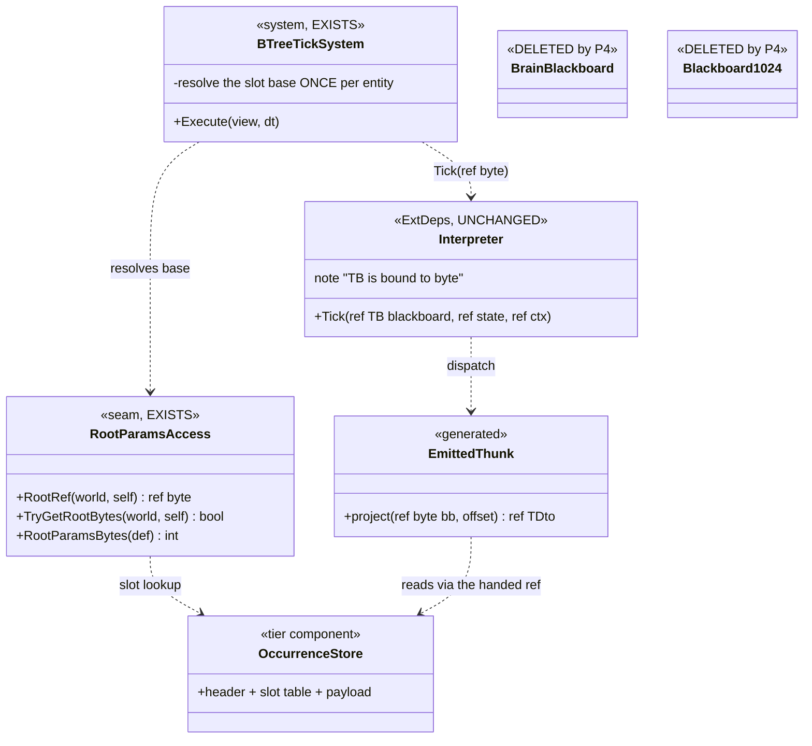
```mermaid
classDiagram
    class BTreeTickSystem {
        <<system, EXISTS>>
        +Execute(view, dt)
        -resolve the slot base ONCE per entity
    }
    class RootParamsAccess {
        <<seam, EXISTS>>
        +RootRef(world, self) ref byte
        +TryGetRootBytes(world, self) bool
        +RootParamsBytes(def) int
    }
    class Interpreter {
        <<ExtDeps, UNCHANGED>>
        +Tick(ref TB blackboard, ref state, ref ctx)
        note "TB is bound to byte"
    }
    class EmittedThunk {
        <<generated>>
        +project(ref byte bb, offset) ref TDto
    }
    class OccurrenceStore {
        <<tier component>>
        +header + slot table + payload
    }
    class BrainBlackboard {
        <<DELETED by P4>>
    }
    class Blackboard1024 {
        <<DELETED by P4>>
    }

    BTreeTickSystem ..> RootParamsAccess : resolves base
    RootParamsAccess ..> OccurrenceStore : slot lookup
    BTreeTickSystem ..> Interpreter : Tick(ref byte)
    Interpreter ..> EmittedThunk : dispatch
    EmittedThunk ..> OccurrenceStore : reads via the handed ref
```

*What the picture shows that prose hid: after `P4` there is **no arrow from a thunk to a lookup**. The
base is resolved once, by the tick system, and handed down — which is why the kernel needs no change and
why `CE-301`'s per-dispatch cost disappears without a cache.*

### 30.3 ⭐ ONE TICK — `sequenceDiagram`

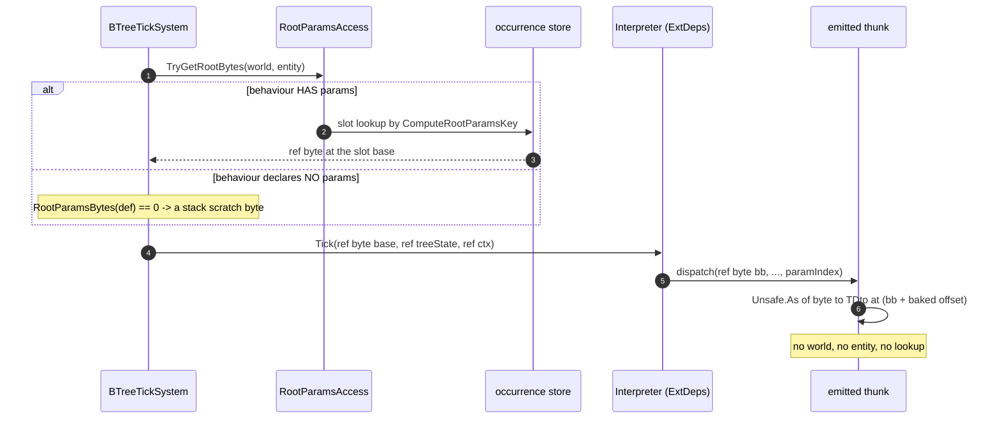
```mermaid
sequenceDiagram
    autonumber
    participant Tick as BTreeTickSystem
    participant RPA as RootParamsAccess
    participant Store as occurrence store
    participant Int as Interpreter (ExtDeps)
    participant Thunk as emitted thunk

    Tick->>RPA: TryGetRootBytes(world, entity)
    alt behaviour HAS params
        RPA->>Store: slot lookup by ComputeRootParamsKey
        Store-->>Tick: ref byte at the slot base
    else behaviour declares NO params
        Note over Tick: RootParamsBytes(def) == 0 -> a stack scratch byte
    end
    Tick->>Int: Tick(ref byte base, ref treeState, ref ctx)
    Int->>Thunk: dispatch(ref byte bb, ..., paramIndex)
    Thunk->>Thunk: Unsafe.As of byte to TDto at (bb + baked offset)
    Note over Thunk: no world, no entity, no lookup
```

*What the picture shows that prose hid: the ONLY branch is at step 1 — and it is decided by a
**checkable** predicate (`RootParamsBytes(def) == 0`), not by a null-guess on a pointer.*

### 30.4 ⭐⭐ WHO CALLS WHAT — the MODULE diagram *(obligation ①a: the dead edges matter)*

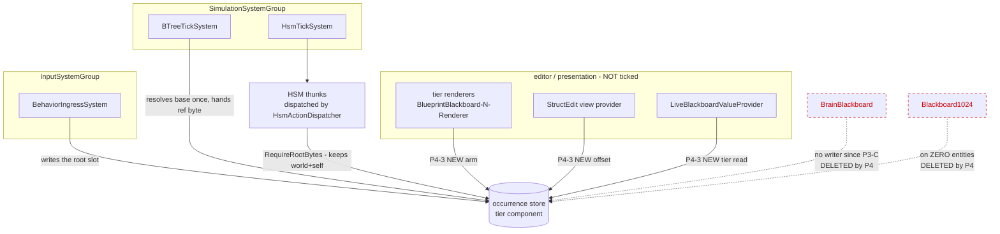
```mermaid
graph TD
    subgraph sim["SimulationSystemGroup"]
        BTS[BTreeTickSystem]
        HTS[HsmTickSystem]
    end
    subgraph input["InputSystemGroup"]
        ING[BehaviorIngressSystem]
    end
    subgraph editor["editor / presentation - NOT ticked"]
        REN[tier renderers<br/>BlueprintBlackboard-N-Renderer]
        SE[StructEdit view provider]
        LIVE[LiveBlackboardValueProvider]
    end
    STORE[(occurrence store<br/>tier component)]
    HSMT[HSM thunks<br/>dispatched by HsmActionDispatcher]

    ING -->|writes the root slot| STORE
    BTS -->|resolves base once, hands ref byte| STORE
    HTS --> HSMT
    HSMT -->|RequireRootBytes - keeps world+self| STORE
    REN -->|P4-3 NEW arm| STORE
    SE -->|P4-3 NEW offset| STORE
    LIVE -->|P4-3 NEW tier read| STORE

    OLD1[BrainBlackboard]
    OLD2[Blackboard1024]
    OLD1 -.->|no writer since P3-C<br/>DELETED by P4| STORE
    OLD2 -.->|on ZERO entities<br/>DELETED by P4| STORE

    classDef dead stroke-dasharray: 5 5,stroke:#c00,color:#c00
    class OLD1,OLD2 dead
```

*Caption — the dead edges are drawn deliberately: `BrainBlackboard` has had **no writer since `P3-C`**
and `Blackboard1024` is on **zero entities**, so both dashed edges are already non-functional. ⭐ The
load-bearing asymmetry the picture makes visible: **`HsmActionDispatcher` does not hand the thunk a
blackboard ref**, so the HSM arm keeps `world`+`self` while the BTree arm loses it.*

### 30.5 ⭐⭐⭐ THE THREE SLICES

| # | slice | why it is separable |
|---|---|---|
| **`P4`-①** | ⭐ **Delete `Blackboard1024`** and its three surfaces *(`Blackboard1024Renderer`, `Blackboard1024ViewProvider`, `BlackboardReflection`'s arm)* | 📐 **zero entities carry it** — nothing to re-home, no behaviour change possible |
| **`P4`-②** | ⭐⭐⭐ **Bind `TBlackboard` to `byte` and hand the interpreter the slot base** | ⛔ **no `ExtDeps` change** (§30.1). ⭐ It also SIMPLIFIES `CE-304`'s fix: `BlackboardParamsExpression`'s BTree arm reverts to `bb`-relative, and the resolve moves from per-dispatch to **once per entity per tick** |
| **`P4`-③** | ⭐ **Re-home the three editor surfaces** onto the occurrence inspector | ⚠ display only; the sim is already correct. Independently testable |
| **`P4`-④** | ⭐ **Retire the 100-byte cap** — the analyzer, its mirror and the runtime throw | 📄 **§30.11.** Its premise is already false and the real bound is structural. ⚠ lands WITH or AFTER ② |

⚠ **`P4`-② has a second half, added `2026-09-22` on a user challenge — 📄 §30.10 (`P4`-②b):** the five
curated **wrapper blackboard structs go too**, and the curated builders name a **key** instead of a
type. ⛔ The first draft of this table kept them; that was too timid.

⭐ **`P4`-① should still land first** — it shrinks the surface `P4`-② has to sweep.
⛔⛔ **But it is NOT "a pure deletion with nothing to re-home" — see §30.12 ①:** 54 code-referencing
files *(17 production + 37 test)*, and one residual absence claim to settle with Roslyn first *(§30.13)*.
⚠ **`P4`-②b covers the SEVEN single-field wrappers only** — the two `HideInCover` layouts stay *(§30.12 ③)*.

### 30.6 ⚠⚠ WHAT `P4`-② COSTS — **two things, both stated rather than discovered**

| | |
|---|---|
| ⚠ **a behaviour with NO params has no root slot** | ingress attaches only when `ParseParams != null && rootBytes > 0`, so `RootRef` would THROW on `Idle` / `WanderMilitary`. ⇒ the tick needs a defined `ref byte`, gated on the **checkable** predicate `RootParamsBytes(def) == 0` — ⛔ **never on a null-guess**, which is the silent-default shape this programme keeps filing |
| ⚠ **`BlackboardParamsExpression` re-splits, partially** | the BTree arm becomes `bb`-relative; the HSM arm keeps `RequireRootBytes(world, self)` because `HsmActionDispatcher` hands the thunk `instance`/`context`, **never a blackboard ref**. ⇒ two forms in the one home. ⛔ **`BP-306` collapsed four SPELLINGS of one expression; this is two DIFFERENT expressions for two different dispatch shapes** — record it in the file's header so the next reader does not "re-collapse" them |

### 30.7 ⭐ `P4`-③ — **STRUCTEDIT TAKES AN OFFSET; IT LEARNS NOTHING**

🔒 **Per the ruling: StructEdit must not know a DTO sits inside another structure.** 📐 And it already
does not — `ProjectBufferAs` composes every binding as `NativeOffset + Marshal.OffsetOf(viewType, f)`.

⇒ ⭐ **The change is that the CALLER supplies the base**: an additive optional offset on
`ProjectBufferAs` *(or a sibling overload)*, with the provider computing it from
`ComputeRootParamsKey(BehaviorState.ActiveBehaviorHash)` → the slot's `PayloadOffset`.
⛔ **Not a new view API, not a sub-range concept, and not a redesign** — ⚠ **an earlier revision of this
programme's advice said it was; that is WITHDRAWN.**

⭐ **The other two surfaces need no new API at all:**

| surface | the re-home |
|---|---|
| `BrainBlackboardRenderer` | a root-params arm on the existing tier renderers *(`BlueprintBlackboard{256,1024,4096,16384}Renderer`, which §25.3 already made decode occurrences)*; then delete the file. ⭐ **The root slot is the EASIEST label in the store** — §25.2 needs a forward search because the FNV key cannot be inverted, but the root key is ONE computation and the hit is exact |
| `LiveBlackboardValueProvider` | read the **tier** component from the `IDebugSession`, walk the slot table to that key, project at its offset. Same shape, one indirection deeper |

### 30.8 ⭐ ACCEPTANCE

| # | |
|---|---|
| **①** | `BrainBlackboard` and `Blackboard1024` **do not exist**; the solution builds |
| **②** | ⭐⭐ **`hill-attack-close` stays 2/2 gold** on `--mode all` — the same gate `CE-304` closed on |
| **③** | a rail asserting the tick resolves the base **once per entity**, not once per dispatch *(the `CE-301` property, now free)* |
| **④** | ⭐ the `CE-304` rail *(`CE304_ReverseToBaseline_Thunk_ReadsAuthoredParams_FromTheRootSlot`)* **stays green through the rewrite** — it is the regression net for exactly this |
| **⑤** | a rail per re-homed surface: the tier inspector shows the ROOT PARAMS slot **labelled and decoded** *(the §25.1 ruling applies unchanged)* |
| **⑥** | ⛔ a behaviour with **no** params ticks without throwing |

### 30.9 ⛔ WHAT THIS SUPERSEDES

| where | the superseded claim |
|---|---|
| `PLAN_Occurrence_Storage_Build.md` § "THE PATH" `P4` | *"delete `BrainBlackboard`; **the BTree action's blackboard type parameter goes with it**"* ⇒ ⛔ **the parameter STAYS, bound to `byte`** |
| same, the "RETIREMENT (b)" row | *"the work is … **the `ActionRegistry<…>` type parameter**"* ⇒ ⚠ it is a type ARGUMENT change *(`BrainBlackboard` → `byte`)*, not a parameter removal |
| `RESUME_Occurrence_Storage.md` §0c `P4(a)` | *"the **7 UI readers** get **RE-ANCHORED**"* ⇒ ⛔⛔ **wrong verb and an unenumerated set.** Three of them are keyed on the component's IDENTITY *(attribute · component+path match · session lookup)*, so they cannot be re-anchored — they are **RE-HOMED**, and §30.1 enumerates them |

### 30.10 ⭐⭐⭐ `P4`-②b — **THE CURATED REGISTRAR NAMES NOTHING. THE WRAPPER BLACKBOARD STRUCTS GO TOO** *(user, `2026-09-22`)*

> 🔒 **User, verbatim:** *"What woukd the curated registrsar reference newly ut tgere imwill be no
> brainblackoard componrnt anymore? Why would it need to name the cincrete data type? Ahouldnt it
> live with the byte regerence as well?"*

⭐⭐ **Correct, and §30.5 as first drafted was too timid** — it kept
`BTreeBuilder<MoveToBlackboard, BTreeContext>` on the grounds that the fluent selector needs a struct
with fields. 📐 **Measured: the type is ceremony, and the builder already has the overload that removes it.**

#### 📐 THE TWO MEASUREMENTS THAT SETTLE IT

| | |
|---|---|
| ⭐⭐⭐ **`BTreeBuilder` ALREADY takes a raw key** | `Action(string methodKey, …)` *(`BTreeBuilder.cs:236`)* and `Condition(string methodKey, …)` *(`:263`)*. ⇒ ⛔ **no `ExtDeps` change is needed at all** — not even an additive overload |
| ⭐⭐ **the concrete type has NO in-product consumer** | `TargetDtoType`/`TargetFieldName` are written at `:309-310,:350-351`, copied into `LogicNode` at `:609-610`, and read by **one FastBTree unit test**. 📐 **`ToGraph()` has ZERO callers in the repo.** ⇒ the type name is authoring metadata nothing in HROT reads |

⇒ ⭐⭐⭐ **The five wrapper structs exist for ONE reason: to make `bb => bb.Params` resolve to offset 0.**
`MoveToBlackboard` · `FollowRouteBlackboard` · `JoinFormationBlackboard` · `HullDownAttackBlackboard` ·
`PlatoonHillAttackBlackboard` — each is `{ public XParams Params; }` with **exactly one use site**, its
own `[BTreeDefinition]` method. ⛔ **They are deleted with the component.**

#### ⭐ THE SHAPE

```csharp
// before — the wrapper exists only so Marshal.OffsetOf can yield 0
new BTreeBuilder<MoveToBlackboard, BTreeContext>()
    .Action(bb => bb.Params, Action_WriteMoveToChannel);

// after — the runtime blackboard IS the slot, and the key is written
new BTreeBuilder<byte, BTreeContext>()
    .Action($"{typeof(CgfNodes).FullName}.{nameof(Action_WriteMoveToChannel)}@0");
```

⚠⚠ **THE ONE THING THIS COSTS, AND IT MUST NOT BE GLOSSED.** The selector form is **compile-time
checked** — rename the method and the build breaks; move the field and the offset follows. The key form
is **not**, and the failure is SILENT-ish: 📐 `Interpreter.BindActions:697-709` binds an unknown key to a
**fallback delegate that returns `NodeStatus.Failure`**, after a single `Console.WriteLine`. ⇒ a typo is
a behaviour change with no exception and no test failure — **the exact shape `CE-304` just cost a day to.**

| ⭐ the mitigations, all cheap, and ⛔ none optional | |
|---|---|
| ⭐⭐⭐ **build the key with `nameof`** | `$"{typeof(CgfNodes).FullName}.{nameof(Action_WriteMoveToChannel)}@0"` keeps rename-safety for the half that actually moves. ⛔ Never a bare string literal |
| ⭐⭐ **a rail that asserts EVERY curated tree binds EVERY key** | walk `FbtTreeCatalog`'s blobs against a populated `ActionRegistry` and assert **zero** fallbacks. ⭐ That is the rail the `Console.WriteLine` should always have been |
| ⚠ **the `@0` is now hand-written, so assert it** | the curated params region starts at offset 0 by construction *(one packed variable)*; a rail pins it rather than a comment |

### 30.11 ⭐⭐ `P4`-④ — **RETIRE THE 100-BYTE CAP; ITS PREMISE IS ALREADY FALSE** *(`2026-09-22`)*

> 🔒 **User:** *"The roslyn compile time checker shoukd not need to know about 100byte blackboard size
> limit."* ⇒ ⭐ **it should not, and after `P4` the number has no referent at all.**

📐 **Measured — the cap is enforced in TWO live places and mirrored in a third:**

| site | what |
|---|---|
| `BehaviorConstants.cs:32` | `MaxBehaviorParamByteSize = 100` — the source of truth |
| 🔴 `BehaviorParameterSizeAnalyzer.cs:26,64` | a **Roslyn analyzer with its own `private const` mirror**, refusing any DTO above it *(the mirror is pinned by `InlineBudgetConstantAgreementTests`)* |
| `BehaviorRegistry.cs:319` | a runtime `throw` on the same cap |

#### ⛔⛔ TWO THINGS ABOUT IT ARE NOW FALSE

| the claim | 📐 the measurement |
|---|---|
| `BehaviorConstants.cs:29` — *"Enforced by `BTreeBuilder` at tree-compile time"* | 🔴 **there is NO size check anywhere in `Fbt.Compiler`.** Stale doc, and it is the reason the cap looked like an ExtDeps concern |
| the analyzer's message — exceeding it *"would corrupt the SoftAdvice and Interrupt registers in `BrainBlackboard`"* | 🔴 **those registers are not there.** `B2`/`O2` moved the tail into `BrainInterrupts`; `BrainBlackboard` has been *exactly* `fixed byte[100]` since. ⇒ **the stated reason for the cap no longer exists** |

⇒ ⭐⭐ **After `P3` the real bound is PER-BEHAVIOUR** — `RootParamsBytes(def)`, enforced **structurally**
by the slot allocator *(`TryAttach` fails when the payload will not fit)*. ⛔ And 100 is not even a
conservative stand-in: the 256 tier's **whole payload is 176 B**.

| ⭐ what `P4`-④ does | |
|---|---|
| **delete** `BehaviorParameterSizeAnalyzer` + its mirror + `InlineBudgetConstantAgreementTests`' mirror-agreement arm | the diagnostic is unreachable once the region it describes is gone |
| **delete** `BehaviorRegistry.cs:319`'s throw and `BehaviorConstants`' two constants | ⚠ `BrainBlackboardByteSize` is also the ingress parse-shadow's size — it becomes `RootParamsBytes(def)`, which is what the shadow is FOR |
| ⭐ **replace with the honest bound** | a behaviour whose params do not fit its tier fails **at attach**, loudly, where `P3-C` already put the throw *(`BehaviorIngressSystem`, naming `CE-302`)* |

⚠ **Sequencing:** `P4`-④ lands **with or after** `P4`-②, never before — the analyzer is the only thing
currently stopping an oversized curated DTO, and the structural bound only becomes the sole guard once
the component is gone.

### 30.12 ⛔⛔⛔ RE-MEASURED `2026-09-22` — **§30.1's INVENTORY UNDER-COUNTED; §5 OF THIS FILE ALREADY KNEW**

> 🔒 **User:** *"Measure first what is unknown now. No rush implementations."* ⇒ this section is the
> measurement. ⛔ **Where it disagrees with §30.1 or §30.5, THIS section wins.**

🔴🔴 **The finding that matters most is not any single surface — it is that §30 was written without
reading §5 of its own document.** §5's class-6 row already lists *"renderers, view providers,
`BlackboardReflection`, `LiveBlackboardValueProvider`, `BlueprintDebugSession`, `VariableEditCommit`,
`BlueprintLiveValueWriter`, `PredicateCompiler`, 2 field drawers, `SearchPredicateDto.BlackboardTarget`
— ~15"*, and class 7 the two scenario translators. ⇒ ⛔ **§30.1's "3 editor surfaces" is a REGRESSION
against §5, not a new measurement.** ⚠ *(The two are not strictly comparable — §5 counts every surface
needing the occurrence seam, §30.1 only those keyed on the component's IDENTITY. §30.1 is still an
undercount **of its own narrower question**: see ④ below.)*

#### ⭐ WHAT SURVIVED THE RE-MEASUREMENT

| §30 claim | verdict |
|---|---|
| `Blackboard1024` is on **zero** entities | ✅ **confirmed, and more strongly than §30.1 checked** — there is no production `AddComponent<Blackboard1024>` anywhere, *and* `HeavyDtoType` is non-null **only** in two ExtDeps attribute unit tests |
| `BTreeBuilder.Action(string)` / `Condition(string)` already exist | ✅ `BTreeBuilder.cs:236,263` — the key is stored verbatim as `BuilderNode.MethodName` ⇒ **no ExtDeps change**, exactly as §30.10 says |
| `BrainBlackboard` = 78 production files | ✅ exact |
| **zero** by-value/sized `TBlackboard` uses in `FDP/ExtDeps/FastBTree/src` | ⚠ **carried from the `2026-09-21` measurement, NOT re-measured today** |

#### ⛔ THE SIX CORRECTIONS

| # | correction |
|---|---|
| **①** | ⛔⛔ **`P4`-① is 54 code-referencing files (17 production + 37 test), not the ~6 §30.5 lists.** Unnamed by §30: `Blackboard1024Translator` + its registration *(`HrotScenarioSerializerFactory.cs:24-25`)* · `Blackboard1024Tests.cs` · `BlueprintDebugSession.cs` *(**5** read sites)* · `GlobalComponentIds.cs:244` · `HrotRoleComponentSets.cs:128` · `CognitiveComponentRegistry.cs:45`. ⭐ **This is the `HN-037` deletion-scoping lesson**: the production surface was measured, the TEST surface never was |
| **②** | ⚠ **The single-field wrappers are SEVEN, not five.** §30.10 missed `CgfNodes.FireAtTargetBlackboard` *(live — `CgfNodes.cs:666`)* and `CommanderNodes.IssueTacticalIntentBlackboard` *(declared at `:20` and **never used as a `TBlackboard`** — already dead)* |
| **③** | 🔴🔴 **§30.10's `@0` premise is FALSE for two curated blackboards.** `HideInCoverBlackboard` *(`EqsConfig` + `MoveConfig`)* and `HideInCoverV2Blackboard` *(`SpawnConfig` + `MoveConfig`)* are **not wrappers** — they are multi-field root-params DTOs with **7 leaf bindings across two distinct offsets**, plus **2 raw-delegate leaves** *(`CgfNodes.cs:659`, `HideInCoverBehavior.cs:135`)* that take `ref TBlackboard` directly and must be rewritten by hand under `TBlackboard = byte`. ⇒ the key form would need a hand-written `Marshal.OffsetOf(…, MoveConfig)` **literal**, which rots silently if `EqsParams` changes — into the `BindActions` fallback that returns `Failure`. ⭐⭐ **RESOLUTION: `P4`-②b covers the SEVEN wrappers only. The two `HideInCover` layouts STAY** — retiring a *layout* is a different job from retiring a *wrapper* |
| **④** | ⛔ **`CE-303`'s "three identity-keyed surfaces" is still an undercount.** Also keyed on the type: `HillAttackGizmo.cs:17` `[GizmoProjector(typeof(BrainBlackboard),…)]` *(its BODY is already root-slot-correct — only the **gate** names the component)* · `PredicateCompiler.cs:504` · `BrainBlackboardTranslator.cs:41,47`. ⚠ **The gizmo is new to §5 AND §30** |
| **⑤** | 🔴 **A PERSISTED-DATA surface nobody costed.** `SearchPredicateDto.BlackboardTarget` is a **JSON-serialised enum** `{BrainBlackboard, Blackboard1024}`, default `BrainBlackboard`, with a round-trip test *(`SR-T01`)*. 📄 [`docs/designs/breakpoints-1/DESIGN.md:194,583`](../designs/breakpoints-1/DESIGN.md) specifies it as *"typed projection over `BrainBlackboard` / `Blackboard1024`"* ⇒ ⛔ **designed intent, not vestige** *(`R-129` / "unreferenced is not unintentional")*. Saved predicates carry it; retiring it needs a MIGRATION answer, not a delete |
| **⑥** | ⚠ **A THIRD name collision** beyond §30's `BlueprintBlackboard1024` trap: `BlackboardTier.Blackboard1024` *(`BlueprintCompilerContracts.cs:12`)* and `BlackboardTarget.Blackboard1024` *(`SearchPredicateDto.cs:226`)* are **enum members**, not the component. ⛔ Neither may be deleted by a name sweep |

⚠ **Also found:** `FDP/Examples/Fdp.Examples.Scenarios/Cognitive/BehaviorValidationScenario.cs:196,214,262`
still writes params through `GetComponentRW<BrainBlackboard>` — a post-`P3-C` orphan writing a component
nothing reads. ⛔ Not a `P4` blocker; it is already broken.

### 30.13 ⭐⭐⭐ WHY `Blackboard1024` CAN GO — **all three of its tenants left, each by a named decision**

📐 This is the question §30 asserted and never argued. **It had three tenants. Every one moved.**

| tenant | where it went | the record |
|---|---|---|
| ⭐⭐ **AiPrimitive working state** *(the `Memory + 8` block behind an 8-byte `StructureHash`)* | the **Blueprint-owned tier ladder** `BlueprintBlackboard{256,1024,4096,16384}` under a partition allocator ⇒ the occurrence store | 📄 `.dev/_DONE/btree-ai-action-binding/SLICE2-DESIGN.md:18` — *"Move AiPrimitive working state **out of** the shared engine `Blackboard1024` … The architect explicitly **rejected** retrofitting a partition allocator onto the engine's `Blackboard1024`"*. ⭐ It also **lifted `SLICE1`'s one-stateful-AiPrimitive-per-entity limit** *(`:27`)*, which existed only because of the single `StructureHash` |
| ⭐⭐ **squad / commander working state** | its **own ECS component** `SquadCognitiveState`, with its own `[ComponentId]`, provisioned by `SquadStateProvisioning` | 📐 `SquadCognitiveState.cs:242-247` — *"`Project(ref Blackboard1024)` was **DELETED** by `O1` (2026-09-20) … it made 'has a `Blackboard1024`' an accidental proxy for 'is a commander with squad state'"* |
| ⭐ **behaviour param OVERFLOW** *(`HeavyDtoType` / `[SharedAiHeavyAction]`)* | **never adopted** | 📐 `HeavyDtoType` is `null` at both production assignment sites and non-null only in two ExtDeps attribute unit tests |

⇒ ⭐⭐⭐ **Nothing adds the component, so every remaining read is dead by construction** — and the code
says so itself: `BlueprintDebugSession.cs:1518` is commented **"legacy: one working state per entity, in
`Blackboard1024` at the +8 offset"**, sitting *after* an early-return through
`CaptureAiPrimitiveOccurrences` *(`:1515`)*, which walks `BlueprintTierTable.Ascending` instead.

> 🔴 **THE ONE RESIDUAL CLAIM TO SETTLE BEFORE DELETING.** `SquadCognitiveState.cs:250` asserts
> *"`Blackboard1024.Project<T>` itself is UNTOUCHED: BTree and HSM still use it (`R-65`)"*. ⛔ **That and
> "no production adder" cannot both be operative.** ⚠ Either the comment is stale *(written `2026-09-20`,
> before this measurement)* or there is an adder this sweep did not see. ⭐ **Settle it with Roslyn
> `find_references` on the component type before `P4`-① deletes anything** — ⛔ a text sweep is not
> sufficient for an ABSENCE claim about a type used through a generic.

### 30.14 ⭐⭐ HOW EVERY DEBUG / AI-DEBUG READER REACHES PARAMS AND WORKING STATE AFTER `P4`

⭐⭐⭐ **One seam, two keys — and both already exist and already have a production caller.**

| what | where it lives | the seam | proof it is already built |
|---|---|---|---|
| ⭐ **behaviour PARAMS** | the **root params occurrence slot** | `RootParamsAccess.TryGetRootBytes(repo, entity, …)` / `TryGetRootBytesInView(view, …)`, keyed `OccurrenceSlotKey.ComputeRootParamsKey(BehaviorState.ActiveBehaviorHash)` — **computed, never stored** *(`P3-A`)* | `BrainBlackboardTranslator.Extract` and `HillAttackGizmo.Draw` both already do exactly this |
| ⭐ **AiPrimitive WORKING STATE** | **occurrence slots in the tier ladder** | `BlueprintTierTable.Ascending` → `HasInView` / `BytesInView` → walk the slot table → project at the slot's `PayloadOffset` | `BlueprintDebugSession.CaptureAiPrimitiveOccurrences:1542-1551` is this loop, in production, today |

⇒ ⭐⭐ **Every reader in §5's class-6 list converges on those two calls.** Restated per surface:

| reader | after `P4` |
|---|---|
| `BrainBlackboardRenderer` | **deleted**; a root-params arm on the tier renderers *(§25.3 already decodes occurrences)*. ⭐ The root slot is the easiest label — `ComputeRootParamsKey` is ONE computation, so §25.2's forward search does not apply |
| `BrainBlackboardViewProvider` *(StructEdit)* | unchanged API; the **caller** supplies the slot's base offset *(§30.7)* |
| `LiveBlackboardValueProvider` | reads the **tier** component from `IDebugSession`, walks to the key, projects at its offset |
| `BlueprintDebugSession` | ⭐ **already correct** — delete the legacy `Blackboard1024` arm at `:1518` and the `ResolveAiPrimitiveField` gate at `:1016`; `CaptureAiPrimitiveOccurrences` is the whole answer |
| 🔴 `HillAttackGizmo` | body already correct; **re-gate** `[GizmoProjector]` on `BehaviorState` + `SimTransform` *(⛔ NOT on a tier — a tier component is not a proxy for "is a brain", which is the exact mistake `O1` deleted `Project(ref Blackboard1024)` for)* |
| 🔴 `PredicateCompiler` + `SearchPredicateDto` | ⭐⭐ **`BlackboardTarget` is RE-POINTED, not removed** — its two members become **root params slot** and **node working-state slot** *(§30.15)*. ⛔ **An earlier revision said "collapses to a single target" and then "a straight collapse, drop the enum" — BOTH WITHDRAWN**, see the note under §30.14 |
| `BrainBlackboardTranslator` | `Extract` is **already** root-slot-based; re-key `CanTranslate` + `GetConsumedComponentsMask` off `BehaviorState`, drop the component. ⚠ §5 class 7's *"measured harmless"* was about the **wire format** — it does **not** mean deletion-safe |

*Caption — what this table shows that §30.2's class diagram hid: the diagram drew "no arrow from a thunk
to a lookup" for the SIM path, and that is true. ⛔ But every DEBUG reader still performs a lookup — it is
just the **same two** lookups instead of nine different component projections.*

#### ⛔⛔⛔ `SearchPredicateDto.BlackboardTarget` — **TWO corrections, in opposite directions, same day**

> 🔒 **User ①:** *"no one using it yet besides rails, no migration needed."*
> 🔒 **User ②:** *"'no real users' does not mean 'not needed', be cautious before deleting anything."*

| what I claimed | verdict |
|---|---|
| *"the one place in `P4` where ABI costs more than a recompile"* — a deserialisation migration | ⛔ **WITHDRAWN.** Nothing outside the rails authors one. 📌 `R-139`: measured that the enum **is** serialised, never measured **whether anyone writes one** |
| then *"a straight collapse — drop `BlackboardTarget`"* | ⛔⛔ **ALSO WITHDRAWN, and it is the worse error.** I let *"no migration burden"* slide into *"therefore delete."* ⚠ Those are different questions and `CLAUDE.md`'s **UNREFERENCED IS NOT UNINTENTIONAL** owns the second: ⭐ prefer **ROUTING** |

⭐⭐⭐ **The answer the second correction produces is better than either:** `BlackboardTarget` answers
*"which memory region does this predicate read?"* — and **after `P4` there are still TWO regions**, just
different ones: the **root params slot** and the **node working-state slots** *(§30.15)*. ⇒ **re-point
the members; keep the axis.** ⛔ Deleting it would silently remove the ability to break on **working
state** — a capability `Blackboard1024` used to provide and the occurrence store still does.

#### ⭐⭐ THE STANDING TEST FOR EVERY `P4` DELETION — **apply it per item, in the report**

🔒 **User, `2026-09-22`:** *"be cautious before deleting anything."* ⇒ ⛔ **no `P4` item is cut until it
is classified out loud** *(`CLAUDE.md`'s three-way test)*:

| class | action | `P4` examples |
|---|---|---|
| **duplicate CODE** | ⭐ **ROUTE** | `BlackboardTarget` · the seven wrapper structs · `BrainBlackboardTranslator`'s gate |
| **duplicate SURFACE** | ⚠ **usually KEEP** — surfaces differ by context | the tier renderers vs the root-params arm |
| **genuinely DEAD, and the design record AGREES** | ✅ delete | `Blackboard1024` *(§30.13 — all three tenants left by a NAMED decision)* · `HeavyDtoType` |

⭐ **All six were then swept and settled — 📄 §30.16.**

### 30.16 ⭐⭐⭐ THE ABSENCE SWEEP — **six claims settled `2026-09-22`, Roslyn + corpus**

> 🔒 **User:** *"do the sweep, settle all six absence claims, measure whatever until you are sure."*

⚠ **Method note, and it matters for how much to trust each row.** `roslyn_find_references` on this server
**resolves MEMBERS, not type declarations** — 📐 `roslyn_get_type_members` returned `Blackboard1024`'s three
members while `find_references` on the same qualified type answered *"Symbol not found."* ⇒ ⛔ **that
"not found" is a TOOL LIMIT, never evidence of absence** *(`CLAUDE.md` ③)*. ⭐ The type question was
therefore answered through **member-level proxies** — `Project<T>`, `Memory`, `ByteSize` — which is
sufficient, because those three ARE every way to touch the component's bytes.
📐 Workspace verified real: `is_msbuild_workspace: true`.

| # | claim | 📐 verdict |
|---|---|---|
| **①** | 🔴 `SquadCognitiveState.cs:250` — *"`Blackboard1024.Project<T>` itself is UNTOUCHED: **BTree and HSM still use it** (`R-65`)"* | ⛔⛔ **FALSE — the comment is STALE.** `Project<T>` → **11 refs, EVERY ONE a test**. `Memory` → **8**: 2 tests · the declaration · the 4 surfaces `P4`-① already deletes · **1 always-false gate** *(`PredicateCompiler.cs:388`, behind `HasComponent`)*. `ByteSize` → **1**, its own declaration. ⇒ **no BTree, no HSM, no production consumer at all.** ✅ **DELETE — genuinely dead and the design record agrees** *(§30.13)*. ⚠ **Leave id 74 RESERVED, do not reuse** — ids are explicit `[ComponentId]` so nothing drifts, but a stale recording could bind a reused 74 to a different component |
| **②** | `CommanderNodes.IssueTacticalIntentBlackboard` — declared, never a `TBlackboard` | ⭐ **The ACTION is LIVE and registered** — `FbtActionRegistrar.g.cs:55` registers `…Action_IssueTacticalIntent@0` through the 3-param `[BTreeAction]` bridge *(the one `CE-304` fixed)*. ⇒ the **wrapper** existed only for the fluent-selector form and no C# tree ever used it. ✅ **Delete it with `P4`-②b's other seven** — ⛔ the capability is untouched, because `[BTreeAction]` registration never needed the wrapper |
| **③** | `BlueprintDebugSession`'s legacy `Blackboard1024` arm | 🔴🔴 **NOT DEAD — A SILENTLY BROKEN CAPABILITY. The biggest finding of this sweep — see §30.17** |
| **④** | `Blackboard1024Tests` | ⭐ It pins `Project<T>` **memory aliasing** *(P0.05 / `SC-P0-05-1`)*. 📐 The successor capability is **already covered on the live storage**: `OccurrenceStoreAccessTests` asserts round-trip, `DistinctVariableIds_AreIndependentSlots_NoCollision`, and `A2_R5_ResolveOccurrence_LandsAtTheAllocatorsOwnOffset`. ✅ **Delete with the component — the claim is re-homed, not lost** |
| **⑤** | `BlueprintCompilerContracts.BlackboardTier.Blackboard1024` | ✅ **KEEP — NOT A `P4` ITEM AT ALL.** 📐 It is the Blueprint compiler's **tier selector** *(`IrAsset.SelectedTier`, driven by `BlackboardTierHint.Force1024`, `Stage2_Validate.cs:519-526`)* naming the **1024 TIER**. ⛔ Only the spelling collides. ⚠ A **rename** candidate *(`Tier1024`)*, never a deletion |
| **⑥** | `HeavyDtoType` / `[SharedAiHeavyAction]` | ⭐ **Dead as STORAGE, and RAIL-PINNED**: `T30_BehaviorScopedShared_ProofTests.cs:304` asserts `def.HeavyDtoType.Should().BeNull("Blackboard1024 HeavyDtoType hack is gone")`. 📐 Roslyn: **16 refs, NO PRODUCER** — every one is a gate *(`BehaviorIngressSystem.cs:136,299`)*, a dying surface, or that rail; and **all 30 shipped assets declare it `null`**. ⚠⚠ **BUT it has THREE LIVE APPENDAGES that need their own call — see below** |

#### ⚠ ⑥'s three appendages — **the storage dies; these do not follow automatically**

| appendage | what it needs |
|---|---|
| `[SharedAiHeavyAction]` + `ActionSchemaExporter.cs:151-152` | an **authoring** surface still wired and still read by the editor's schema export. ⭐ Its successor is the **tier ladder** *(an action needing more than 176 B simply lands on a larger tier — §30.15)* ⇒ genuinely superseded, but **say so in the design before removing the attribute** |
| `BehaviorTreeAssetDto.HeavyDtoType` · `HsmAssetDto.HeavyDtoType` | **persisted asset-JSON fields present in all 30 shipped assets** *(always `null`)*. ⭐ Harmless to leave and ignore on read; ⛔ removing them is an asset-schema change — decide deliberately, exactly as `CE-308` |
| 🔴 **two design docs still describe heavy overflow as CURRENT, and carry NO STATUS block** | `BTree_AiActionParameterBinding_Detailed_Design.md:16` · `BTree_HSM_JSON_Persistence_Detailed_Design.md:71,163,215`. ⇒ **`P4` must mark them superseded** — a reader quoting them today is reasoning off a retired model |

#### 📌 A CORRECTION TO MY OWN MEASUREMENT METHOD

⚠ **§30.12 ①'s "54 code files" came from a comment-STRIPPING classifier — which by construction discarded
`<see cref>` references.** 📐 Roslyn counts them, and there are **15 production files documenting
`BrainBlackboard`** and **9 documenting `Blackboard1024`** in prose *(`JoinFormationExecutor.cs:17,58`,
`CgfNodes.cs:85`, `BehaviorRegistry.cs:17,159,206`, `BehaviorConstants.cs:28`, …)*.

⛔ **I briefly took this for a BUILD BREAK** *(`TreatWarningsAsErrors=true` + a dangling cref ⇒ `CS1574`)*.
📐 **It is not.** XML doc generation is enabled in exactly one project — `Hrot.AI.Behaviors` — and its
`NoWarn` lists **1574** explicitly. ⇒ ⭐ **stale documentation to correct for accuracy, NOT a compile
risk.** ⚠ Stated because the alarm was raised: **the correction matters as much as the finding.**

### 30.17 🔴🔴🔴 `P4` MUST ROUTE THE AI-PRIMITIVE **WRITE** PATH — **it is already silently broken**

📐 **`IBlueprintDebugSession.ResolveWorkingStateField` is the SINGLE field-address resolver in this
codebase** — `StagedWriteView.cs:26` says so verbatim: *"the only resolver in this codebase."*
**13 references**, of which the production ones are:

| caller | what breaks without it |
|---|---|
| `BlueprintLiveValueWriter.cs:109,183` | the editor's **live variable write** and the staged-write yellow display |
| 🔴 `DebugApiService.Variables.cs:345` | **the AI-debug HTTP API's variable write** |

⛔⛔ **Its `AiPrimitive` arm — `ResolveAiPrimitiveField:1013` — is `Blackboard1024`-ONLY**, while the
`Instance` arm *(`ResolveInstanceField:1051`)* got its slot path in Batch 102. ⚠ **And because nothing
carries the component, that arm already returns `null` on every call** ⇒ **AiPrimitive working-state
editing is ALREADY DEAD, silently, today.**

⇒ ⭐⭐⭐ **This is the `P4` item the design did not have, and it is a ROUTE, not a delete:** give
`ResolveAiPrimitiveField` an occurrence arm **by mirroring `CaptureAiPrimitiveOccurrences:1542-1551`** —
⭐ exactly the method Batch 102 used to build the `Instance` arm from the read. ⛔ Deleting the component
without it removes designer + debug-API working-state writing for good.

> ⭐ **The asymmetry to hold on to:** the **READ** path has both arms *(occurrence at `:1515`, legacy at
> `:1518`)*; the **WRITE** path has only the legacy one. 📌 The file's own header quotes the user who
> demanded they agree: *"if the read verifies identity before trusting an offset, the WRITE must too."*

### 30.18 ⭐⭐⭐ `P4` RE-SCOPED — **the buildable plan, `2026-09-22`**

⛔⛔ **This section SUPERSEDES §30.5's slice table.** Everything above it is the evidence; this is the plan.

#### 🔴 THE MEASUREMENT THAT RE-SHAPED IT — **`BTreeBuilder<T>` is BUILD-TIME ONLY**

📐 Three facts, each verified: ① `BTreeBuilder.Compile(string)` returns a **`BehaviorTreeBlob`** — *not*
generic. ② `Interpreter<TBlackboard,TContext>(BehaviorTreeBlob blob, ActionRegistry<TBlackboard,TContext>)`
takes that **untyped** blob. ③ the selector form *(`BTreeBuilder.cs:326-355`)* computes
`key = "{fqn}.{method}@{Marshal.OffsetOf}"`, registers a curried thunk into the builder's **OWN**
registry — and `CgfCuratedBehaviorRegistrar.cs:63` then binds the blob against the **GLOBAL generated**
registry instead, **discarding the builder's**.

⇒ ⭐⭐⭐ **The builder's `TBlackboard` NEVER reaches the interpreter. It exists only so `Marshal.OffsetOf`
can compute a key.** ⇒ ⛔⛔ **`P4`-②b IS WITHDRAWN** *(see below)*.

#### ⭐⭐ THE SLICES

| slice | scope | state |
|---|---|---|
| **`P4`-①** ⭐ **delete `Blackboard1024` + route the write path** | 54 code files *(17 prod + 37 test)*. ⭐⭐ **`CE-310` IS PART OF THIS SLICE, NOT A SEPARATE ONE** — `ResolveAiPrimitiveField:1013` is one of the sites being edited, so the occurrence arm goes in with the deletion or the write path dies *(§30.17)*. Also: the translator + `HrotScenarioSerializerFactory.cs:24-25` · `Blackboard1024Tests` · the 5 `BlueprintDebugSession` sites · `HrotRoleComponentSets.cs:128` · `CognitiveComponentRegistry.cs:45` · `GlobalComponentIds.cs:244` ⚠ **leave id 74 RESERVED** | ✅ **CLEARED TO BUILD** — §30.16 ① settled every absence claim |
| **`P4`-②** ⭐⭐⭐ **bind `TBlackboard` to `byte`** | see the site list below | ⚠ **needs `G2`+`G3` first** |
| ~~`P4`-②b~~ | ⛔⛔ **WITHDRAWN** | see below |
| **`P4`-③** **re-home the SIX identity-keyed surfaces** *(`CE-303`)* | renderer · StructEdit provider · `LiveBlackboardValueProvider` · `HillAttackGizmo`'s `[GizmoProjector]` gate · `PredicateCompiler`+`BlackboardTarget` *(`CE-308` — **RE-POINT**, two regions still exist)* · `BrainBlackboardTranslator`'s gate | ⚠ independent, display-only |
| **`P4`-④** **retire the 100-byte cap** *(`CE-307`)* | ⭐ now argued from the real ceiling: **16 096 B** *(§30.15)*, so the cap is **160× low** | ⚠ with or after ② |
| ⭐ **`P4`-⑤ NEW — fix the stale corpus** | 🔴 `BTree_AiActionParameterBinding_Detailed_Design.md:16` and `BTree_HSM_JSON_Persistence_Detailed_Design.md:71,163,215` describe heavy overflow as **CURRENT** and carry **no STATUS block** · plus 15 production files documenting `BrainBlackboard` and 9 documenting `Blackboard1024` in stale `<see cref>` prose *(⚠ **not** a build break — §30.16)* | ⭐ cheap, and `R-129` requires it |

#### ⛔⛔ WHY `P4`-②b IS WITHDRAWN — **the wrappers may STAY**

| | |
|---|---|
| ⭐ **they cost nothing at runtime** | the builder generic is erased at `Compile()`; ⇒ `BTreeBuilder<MoveToBlackboard,…>` and `Interpreter<byte,…>` coexist with **no change** |
| 🔴 **deleting them is ACTIVELY UNSAFE for `HideInCover`** | 📐 `HideInCoverBlackboard` has **two** sub-regions, so `bb => bb.MoveConfig` computes a **non-zero** key — and 📐 **every generated key for those Eqs nodes is `@0`** *(swept across all `*.g.cs`)*. ⇒ a hand-written key-form conversion would bind `Action_MoveToOptimalCover@0`, silently projecting **`EqsConfig` instead of `MoveConfig`** — ⛔ **wrong data, not a `Failure` fallback.** Worse than the hazard §30.10 feared |
| ⚠ **and those trees are not even registered** | 📐 `HideInCover_BT` / `_v2` have **no `BehaviorNames` entry and no registrar** ⇒ reference trees the generator scans. ⛔ Per *"no real users ≠ not needed"*, they stay |
| ⭐ **`IssueTacticalIntentBlackboard` is the one safe delete** | 📐 zero references, and its action is registered at `@0` through the `[BTreeAction]` bridge — ⚠ optional tidy-up, **not** a `P4` requirement |

#### ⭐⭐ `P4`-②'s FULL SITE LIST — **measured, and larger than §30 had**

| site | change |
|---|---|
| `BTreeTickSystem.cs:123` → `:159` | ✅ **clean** — the `ref var blackboard` has **exactly one** consumer, `def.BTreeInterpreter!.Tick(...)`. Replace with one root-slot resolve per entity |
| 🔴 `BehaviorRegistry.cs:141` | `Interpreter<BrainBlackboard, BTreeContext>? BTreeInterpreter` — **the registry itself is typed**, which is what forces every tree onto one `TBlackboard` |
| `BTreeActionRegistryFactory.cs:35,39,64` · `AiHotReloadCoordinator.cs:412,427,433` | the global `ActionRegistry<BrainBlackboard, BTreeContext>` |
| ⛔ `BlueprintRegistrarScanner.cs:97,**126**` | ⚠ **`:126` is a RUNTIME `typeof(...)` MATCH** — if it and the generator disagree, registrars **silently stop binding**. Change them in lockstep |
| 🔴 `HostedSubtree.Tick<TChildBb>` + `BTreeOrchestratorEmitCore.cs:151,182` | **a SECOND `TBlackboard` axis the design never named** — hosted subtrees run a child `Interpreter<TChildBb,…>` with `ref subBb`/`ref subDto`. ⚠ `BTreeOrchestratorEmitter.cs:79` already warns a registrar/host mismatch **throws at runtime** |
| the generator | `ref BrainBlackboard bb` → `ref byte bb`; ⭐ `CE-304`'s fix at `:655` **simplifies** back to `bb`-relative |
| ⛔ **124 golden/snapshot files** | 📐 they embed generated C# naming `BrainBlackboard` ⇒ **a large, deliberate golden move**. Report it as a DIFF SHAPE *(gate contract row 3)*, never a count |
| ✅ **HSM is untouched** | 📐 `HsmTickSystem` and `HsmOccurrence` contain **zero** `BrainBlackboard` references |

#### ⚠⚠ STILL UNMEASURED — **what to do before `P4`-② starts**

| id | gap | why it blocks |
|---|---|---|
| **`G1`** | the **shape** of the 37 + 73 test files *(mechanical `Register`/`Add` vs claim-asserting)* | ⭐ effort estimate only — ⛔ but it is the `HN-037` trap, so do it before promising a duration |
| 🔴 **`G2`** | **the golden diff shape** — run one regeneration on a scratch branch and read it | ⛔ 124 files is exactly where a silent semantic change hides in noise |
| 🔴 **`G3`** | the **exact emission edits** in `BTreeActionGenerator` · `BTreeBridgeEmitCore` · `BTreeOrchestratorEmitCore` | ⛔ `P4`-② is mostly a generator change and none of the three has been read for it |
| **`G4`** | the complete **no-params** set *(`RootParamsBytes(def) == 0`)* | 📐 `WanderMilitary` confirmed *(no `BlackboardLayoutType`, `CgfCuratedBehaviorRegistrar.cs:88`)*; `Idle` **unconfirmed** |
| **`G5`** | where a hosted subtree's `ref subBb` comes from today | ⛔ decides whether the child base is a second slot resolve |

⇒ ⭐⭐ **`P4`-① and `P4`-⑤ are cleared to build now. `P4`-② waits on `G2`+`G3`.**
⭐ **`G2` and `G3` were then closed — 📄 §30.19. `P4`-② is now CLEARED TOO, and it is SMALLER than feared.**

### 30.19 ⭐⭐⭐ `G2` + `G3` CLOSED — **`P4`-② is a type-parameter swap, and the generator needs NO change**

> 🔒 **User:** *"do G2 and G3 - measure whatever it takes."*

#### ⭐⭐⭐ `G3` — THE GENERATOR IS ALREADY POLYMORPHIC IN `TBlackboard`

📐 `BTreeActionGenerator.cs` mentions `BrainBlackboard` **twice, both in COMMENTS.** It reads
`TBlackboardType = symbol.Parameters[0].Type` *(`:62`, `:110`)* — **from the author's own 4-param
declaration** — groups by `TBlackboardType|TContextType` *(`:187`)* and emits
`ActionRegistry<" + tb + ", " + tc + ">` *(`:636`)*.

⚠ **And the grouping has a trap worth knowing:** `mergedGroups` is built **only** from 4-param
`registrable` methods *(`:194-201`)*; 3-param bridges and `[SharedAiAction]`s are *attached* to an
existing group. ⛔ `:209` — **`if (mergedGroups.Count == 0) return;`** ⇒ an assembly with no 4-param
`[BTreeAction]` generates **nothing at all**, however many `[SharedAiAction]`s it has.

⇒ ⭐⭐⭐ **`P4`-②'s generator work is ZERO. The edit surface is FOUR authored declarations:**

| file:line | |
|---|---|
| `CgfNodes.cs:417` · `CgfNodes.cs:609` | `ref BrainBlackboard blackboard,` → `ref byte` |
| `HillAttackTankNodes.cs:560` · `:580` | same |

*(plus 11 in `FDP/Examples` — its own assembly and its own registrar group — and 6 test files.)*

⭐ **Change those four and the generator emits `ActionRegistry<byte, BTreeContext>` by itself.**

⛔⛔ **THE LOCKSTEP HAZARD — three RUNTIME `typeof` matches must move in the same commit:**
`BTreeActionRegistryFactory.cs:64` · `BlueprintRegistrarScanner.cs:126` · `AiHotReloadCoordinator.cs:433`.
📐 Each compares `ps[0].ParameterType != typeof(ActionRegistry<BrainBlackboard, BTreeContext>)` and
**`continue`s on mismatch**. ⇒ if the generator and these disagree, `RegisterAll` is **silently skipped**
and every action falls back to `Failure`. ⚠ **A reflection filter — the compiler will not catch it.**

⭐ **Hard-coded spellings in the BLUEPRINTS compiler, 4 lines:** `AiPrimitiveEmitter.cs:513,530` ·
`CSharpEmitter.cs:204,438`. ⛔ `BlackboardParamsExpression` needs **nothing** — it already emits
`RootParamsAccess.RootRef(...)` and never names the component.

#### ⭐⭐⭐ `G2` — THE GOLDEN MOVE IS A SUBSTITUTION, **because `P3-C` ALREADY DID THE HARD PART**

📐 **The decisive read** — `T20_MultiStateful.Registrar.g.cs.txt`, a shipped golden:

```csharp
:33  ActionRegistry<BrainBlackboard, BTreeContext> actionRegistry     // ← the DISPATCH type
:47  ref var dto = ref Unsafe.As<byte, DemoCounterParams>(            // ← ALREADY byte-based
:48      ref Unsafe.AddByteOffset(ref RootParamsAccess.RootRef(ctx.World, ctx.Self), (nint)8));
```

⇒ ⭐⭐⭐ **Every projection is ALREADY `Unsafe.As<byte, TDto>` off the root slot.** 📐 Corroborated:
**zero** `Unsafe.As<BrainBlackboard` and **zero** `sizeof(BrainBlackboard)` anywhere in the goldens. ⇒
**the only surviving `BrainBlackboard` is the dispatch type parameter the thunk body now IGNORES.**

| shape | count | what happens |
|---|---|---|
| `BrainBlackboard,` *(type argument)* | 140 | ⭐ substitute |
| `ref BrainBlackboard` | 44 | ⭐ substitute |
| `Interpreter<BrainBlackboard` | 29 | ⭐ substitute |
| `ActionRegistry<BrainBlackboard` | 28 | ⭐ substitute |
| `<BrainBlackboard>` | 8 | ⭐ substitute |
| `BrainBlackboard.` | 9 | ⚠ **all COMMENTS / `<see cref>`** — prose, `P4`-⑤ |
| **total** | **356 lines / 124 files** | |

#### 🔴🔴 THE ONE THING `G2` FOUND THAT WOULD HAVE BITTEN — **DO NOT TOUCH `BlackboardTypeName`**

📐 26 shipped assets carry `"BlackboardTypeName": "Fdp.Toolkit.Behavior.Components.BrainBlackboard"`,
and the emitters **mangle it into GENERATED IDENTIFIERS** — 📐 **11 distinct structs across 44 files**,
e.g. `T20_MultiStateful_FdpToolkitBehaviorComponentsBrainBlackboard`.

⭐⭐ **But that struct is the asset's ROOT PARAMS LAYOUT, not the dispatch type:**

```csharp
public struct T20_MultiStateful_FdpToolkitBehaviorComponentsBrainBlackboard
{ public DemoCursorParams cursorA; public DemoCursorParams cursorB; public DemoCounterParams counter; }
```

⇒ ⛔⛔ **LEAVE THE ASSET FIELD ALONE.** Changing it to `byte`/`System.Byte` would ① rename 11 generated
structs across 44 files, and ② change **`SubtreeSyncIdentity.Derive`**, whose inputs are **PERSISTED**
*(`BehaviorTreeAssetDto:342`)* and which **matches subtrees by** `(SubtreeName, SubDtoTypeName,
SubDtoTypeNs)` ⇒ **a silent subtree-matching break.** ⚠ `NsOf("byte")` is also `null`, flipping every
one of them to a global-namespace type.

⭐ **The cost of leaving it:** the generated struct keeps a name ending `…BrainBlackboard` after the type
is gone — **cosmetically stale, functionally correct.** ⛔ Renaming it is a **separate, later** change
with its own migration, not part of `P4`. *(A better name would drop the blackboard type entirely —
it never belonged in a params-layout identifier.)*

#### ⭐ `P4`-② — CLEARED, with this gate table

| # | |
|---|---|
| **1** | change the **4** authored declarations + the **4** Blueprints-compiler lines |
| **2** | ⛔ change the **3 runtime `typeof` filters IN THE SAME COMMIT** — the reflection hazard above |
| **3** | change the typed seams: `BehaviorRegistry.cs:141` · `BTreeActionRegistryFactory.cs:35,39` · `AiHotReloadCoordinator.cs:412,427` · `BlueprintRegistrarScanner.cs:97` · `BTreeTickSystem.cs:123` |
| **4** | ⚠ `HostedSubtree.Tick<TChildBb>` + `BTreeOrchestratorEmitCore.cs:151,182` — the second axis |
| **5** | regenerate goldens; ⭐ **assert the diff is a PURE TYPE-NAME SUBSTITUTION** — ⛔ **any changed `(nint)` offset, any changed `@N` key, or any renamed `{Asset}_…` struct is a STOP** |
| **6** | ⭐⭐ run the **zero-fallback rail** *(§30.10)* — it is the only thing that catches the silent reflection-filter break |

⚠ **`G1`, `G4`, `G5` remain open** — ⭐ none blocks `P4`-②; they are effort-estimate and branch-coverage
questions, not correctness gates.

#### 🔴 CORRECTION TO `G3`, FOUND WHILE BUILDING `P4`-② *(`2026-09-22`)*

⛔⛔ **`G3` measured the ANALYZER generator (`BTreeActionGenerator`) thoroughly and UNDER-MEASURED the
ASSET-DRIVEN one (`BTreeBridgeEmitCore`).** ⭐ The analyzer conclusion stands — it is polymorphic and
needed **zero** changes. ⚠ But `BTreeBridgeEmitCore` is a **second, independent generator**, and it
derives the dispatch type from the asset: `bbShort = ShortTypeName(EffectiveBlackboardTypeName(
dto.BlackboardTypeName))` *(`:310`)*, threaded into **ten** emission sites — the `Register` signature's
`ActionRegistry<…>`, every thunk lambda's `ref … bb`, and the deactivator registrations.

⇒ ⭐⭐ **`G2`'s "leave `BlackboardTypeName` alone" ruling SURVIVES and is what made the fix safe.** The
asset field feeds **both** the params-layout struct name **and** this dispatch type; retargeting the
field would have renamed 11 structs and broken `SubtreeSyncIdentity`. ⭐ Retargeting the **type argument
at its emission site** — one assignment, `bbShort = "byte"` — does neither.

⚠ **And the generated BUILDER keeps the asset's type** *(`BTreeEmitCore.cs:408`)*: its selector-form
bindings need a struct with fields, and `byte` has none. ⭐ Consistent with `P4`-②b's withdrawal — a
builder's generic is build-time only, because `Compile()` returns an untyped blob.

### 30.20 🔴🔴 `P4`-① AS BUILT — **the deletion uncovered a SECOND dead-storage defect** *(`2026-09-22`)*

⭐⭐⭐ **The generalisable finding, and it is the third time this programme has hit it:**
🔒 **a capability whose STORAGE moved, whose CALLERS were never re-anchored, and whose RAIL kept it
green by building a world production stopped building.**

| # | the instance | how it failed | what kept it green |
|---|---|---|---|
| **`CE-304`** | the 3-param `[BTreeAction]` bridge | read an all-zero region | the tank rails passed a hand-built `p` |
| **`CE-310`** | `ResolveAiPrimitiveField` — the **write** path | returned `null` every call | `TheBlueprintLiveWriteLandsTests.Harness` **ADDED** `Blackboard1024` |
| 🔴 **`CE-311`** | `InlineActionLowering` — the inline **emitter** | ⛔ **would THROW** on the first inline call | `BlueprintTestFixture.cs:150` **REGISTERS** `Blackboard1024` |

⇒ ⛔⛔ **All three were invisible to every static signal.** `CE-311` in particular has an in-degree that
looks perfectly healthy: the emitter is called, its output compiles, and its rail passes. ⚠ **The only
thing that distinguishes a live consumer from a dead one here is whether anything still WRITES the
storage — which no reference search can answer.**

⭐⭐ **The check this earns, and it is cheap:** for each remaining surface `P4` touches, ask *"which
production site provisions the storage this reads?"* — ⛔ **not** *"who calls this?"*

#### ⭐ THE `CE-311` ROUTE — **a design call, made from the standalone thunk's own precedent**

⚠ An inline-hosted AiPrimitive has **no HSM instance**, so `HsmOccurrence.KeyFor(instance, …)` does not
apply and the occurrence key had to be chosen. ⛔ **That is a design decision, not a mechanical port** —
📐 so it was made from precedent rather than invented: `AiPrimitiveEmitter.EmitStandaloneOccurrenceBody`
already keys this exact asset's working state with `OccurrenceSlots.StandaloneStateKeyFor(AssetId)`.

| ⭐ what the choice does | |
|---|---|
| **one asset ⇒ one slot**, shared by its inline call and its standalone tick | ⭐ which is what the single `Memory+8` block already meant for them — **no semantic change** |
| ⭐⭐ **two different primitives now get two slots** | 🔴 **this LIFTS `SLICE1-DESIGN.md:27`'s "exactly one stateful AiPrimitive per entity"**, which existed *only* because one entity had one hash-guarded block. ⇒ a strict improvement, and the one `SLICE2` was for |
| ⚠ **the hash guard survives** | `ResolveOrAttach` resets the slot on a `StructureHash` mismatch ⇒ the manual `InitBlock` **and** the `fixed` pin both go, and the defence lives in its one owner |

#### ✅ `P4`-① IS COMPLETE AND LIVE-VALIDATED — **`hill-attack-close` is 2/2 GOLD** *(`2026-09-22`)*

📐 **Run on `--mode all` against the post-deletion build**, both trials to the acceptance in §30.8 ②:

| trial | `1001` | `1002` | `1003` | `1004` | locomotion | `1006`/`1007` |
|---|---|---|---|---|---|---|
| **1** | **523.03** | **525.25** | **529.14** | **531.37** | all `Success` | `Health 0` |
| **2** | **523.03** | **525.26** | **529.44** | **531.37** | all `Success` | `Health 0` |

⭐ Every tank inside the 523–531 baseline band, both targets dead, and **entity count 8** — the dead
bodies stay, as `CE-272` requires. ⚠ Compare the pre-existing gold record *(`521.7 525.7 528.2 532.2`
and `523.0 525.3 529.2 531.0`, §29.12a)*: **trial-for-trial indistinguishable**, which is the point —
`P4`-① is a retirement, and the simulation must not move at all.

⛔ **The component is gone.** What remains of `P4`-① is nothing; the table below is now HISTORY.

#### ⛔ HISTORY — WHAT `P4`-① STILL HAD TO DO

⭐ Both routes are landed and green. ⛔ **The component itself is NOT yet deleted** — the remaining
surfaces are the mechanical ones §30.12 ① enumerates, plus two that need a decision recorded first:

| surface | note |
|---|---|
| `PredicateCompiler.BuildBehaviorParamMatcherGenericHeavy` | 📐 **provably unreachable** — its caller short-circuits on `dtoType == null` and `HeavyDtoType` is null everywhere ⇒ delete the method; ⛔ leave `BlackboardTarget` itself to `P4`-③ / `CE-308` |
| the emitted comment in `EmitStandaloneOccurrenceBody` | ⚠ says *"NOT `Blackboard1024`"* — harmless prose, but it is why the `CE-311` rail's guard is matched **qualified** |

### 30.15 ⭐⭐⭐ THE HEAVY-DTO CONCEPT IS GONE — **and the real size ceiling is ~16 KB, not 100 B**

> 🔒 **User, `2026-09-22`:** *"how is the heavy dto concept done now? i am pretty sure the platoon hill
> attack used to use the blackboard1024 before; what is now the limits for parameter dto size…?"*

#### ⭐⭐ ① THE OLD MODEL — **two tiers of storage, and a HARD per-entity singleton**

📐 `.dev/_DONE/btree-ai-action-binding/SLICE1-DESIGN.md:19,26` — params ≤ **100 B** inline in
`BrainBlackboard.BehaviorParameters`; **overflow spilled to `Blackboard1024`** via `HeavyDtoType` +
`[SharedAiHeavyAction]`. ⛔ And `docs/designs/hill-attack/DESIGN.md:160,174` confirms the user's
recollection **verbatim**: *"all mutable working state into the `Blackboard1024` component"* ·
**`HillAttackMutableState` (projected onto `Blackboard1024.Memory`)**.

🔴 **Its defining limit was not size — it was ARITY.** `SLICE1-DESIGN.md:27`: *"Exactly **one stateful**
AiPrimitive working-state per entity (the `Blackboard1024` `Memory+8` / single `StructureHash`
collision)."* ⇒ one heavy block, one hash, one tenant.

#### ⭐⭐⭐ ② THE NEW MODEL — **there is no "heavy" any more; there is only a SLOT**

📐 `HillAttackCommanderNodes.cs:32`, in the code's own words: **"The old `Blackboard1024` +
`Unsafe.As` projection is gone."** ⭐ `HillAttackMutableState` is now a **`Behavior`-scoped occurrence
variable** *(`:29`)*, handed to the action as its own `ref`:

```csharp
// the 4-param [SharedAiAction] form — params AND working state, each from its own slot
ref PlatoonHillAttackParams p, ref HillAttackMutableState s,
ref BehaviorTreeState state, ref BTreeContext ctx
```

⇒ ⭐⭐ **the "heavy vs inline" split does not exist**: params and working state are *both* occurrence
slots, differing only in their key *(`ComputeRootParamsKey` vs the node's `{fqn}@{offset}@{slotKey}`,
`HillAttackCommanderNodes.cs:523`)*. ⛔ `HeavyDtoType` is a **vestige of the old split** — never adopted
in production, and `P4`-① removes its only storage.

#### 📐 ③ THE ACTUAL CEILINGS — **measured, not inferred**

| tier | total | header | slot table | ⭐ **payload** | max slots |
|---|---|---|---|---|---|
| `BlueprintBlackboard256` | 256 | 32 | 3 × 16 = 48 | **176** | 3 |
| `BlueprintBlackboard1024` | 1024 | 32 | 12 × 16 = 192 | **800** | 12 |
| `BlueprintBlackboard4096` | 4096 | 32 | 16 × 16 = 256 | **3 808** | 16 |
| ⭐ `BlueprintBlackboard16384` | 16384 | 32 | 16 × 16 = 256 | 🔴 **16 096** | 16 |

⭐⭐ **No hidden per-slot cap.** `BlueprintSlotEntry.PayloadSize` is a **`ushort`** *(65 535)*, and the
largest tier payload is 16 096 ⇒ **the width is not binding**: a single occurrence may take the whole
payload. `BlueprintTierTable.ResolveTier:139` picks on **both axes** —
`requiredPayload <= spec.PayloadSize && requiredSlots <= spec.MaxSlots`.

| ⭐ the answer, in one line each | |
|---|---|
| ⭐⭐⭐ **the STRUCTURAL ceiling for one params DTO** | **16 096 bytes** — the 16384 tier's whole payload, if it is the entity's only occurrence; otherwise 16 096 minus its neighbours, across **≤ 16** occurrences |
| ⛔⛔ **what is ENFORCED TODAY** | 🔴 **still 100 bytes** — `BehaviorParameterSizeAnalyzer` rejects it at COMPILE time *(`CE-307` / §30.11)*. ⚠ **That is a 160× understatement of the real bound, guarding a region that no longer exists** |
| ⭐ **what enforces it after `P4`-④** | the **allocator**, structurally: `TryAttach` fails when the payload will not fit its tier, and `ResolveTier` promotes up the ladder first. ⇒ **the bound becomes true by construction instead of by a constant** |
| ⚠ **the axis that actually binds in practice** | ⛔ **slots, not bytes** — 3 / 12 / 16 / 16. 📐 25 of 30 generated behaviours fit the 256 tier *(`BlueprintBlackboard256.cs` header)*, so the common case is slot-count-limited long before it is size-limited |

⇒ ⭐⭐⭐ **This strengthens `CE-307` rather than merely restating it**: the cap is not just resting on a
false premise *(§30.11)* — it is **two and a half orders of magnitude below the storage that actually
exists**, and the thing it protects was deleted.

---

### 30.21 ⭐⭐⭐ `P4`-② AS BUILT — **the zero-fallback rail, and why it is NOT the shape that was planned** *(`2026-09-22`)*

⛔ **This section SUPERSEDES the rail sketch carried in `RESUME_P4_Retire_Blackboards.md` §2 ①.** That
sketch said *"enumerate `FbtTreeCatalog.Get*` by reflection and assert every `MethodNames` key resolves
against `BTreeActionRegistryFactory.BuildFromAssembly`."* 📐 **Measured before building it — and it is
wrong on both halves.**

#### 🔴 ① THE MEASUREMENT THAT KILLED THE PLANNED SHAPE

📐 A probe ran exactly the sketched rail against `Hrot.AI.Behaviors`. **15 of 29 keys did not resolve**:

| tree | keys | misses | why |
|---|---|---|---|
| `MoveToLocation` · `FollowRoute` · `JoinFormation` · `WanderMilitary` · `FireAtTarget` | 6 | **0** | curated, `[FbtRegistrar]`-owned |
| `HullDownAttackRun` | 4 | **0** | |
| ⛔ `PlatoonHillAttack` | 7 | 🔴 **6** | keys are `…@0@1299152117` — registered by the **generated `[BlueprintRegistrar]`** *(`PlatoonHillAttack.Registrar.g.cs:53`)*, **not** by `[FbtRegistrar]`. ⇒ **`BuildFromAssembly` alone is the WRONG registry** |
| ⛔ `HideInCover_BT` / `_v2` | 13 | 🔴 **9** | keys are `…@44` / `…@56` — the **selector form's** `Marshal.OffsetOf` thunks, which live in the **builder's own registry** and are discarded at `Compile()` *(§30.18)*. ⇒ **these trees are not registered as behaviours at all and production never interprets them** |

⇒ ⭐⭐ **Two independent producers fill one registry**, and **the catalog is a superset of what production
ticks.** ⛔ The sketched rail would have been red on day one and would have had to grow an allowlist — the
exact shape that goes stale when a tree is added, which is what the sketch was trying to avoid.

#### ⭐⭐⭐ ② WHAT WAS BUILT INSTEAD — **ask the INTERPRETER, and enumerate by the SCAN**

| ⭐ the decision | ⛔ the rejected alternative, and the one fact that killed it |
|---|---|
| ⭐⭐⭐ **the interpreter records its own misses** — `Interpreter.UnboundMethodNames` *(`Fbt.Kernel/Runtime/Interpreter.cs`)*, populated by the **same branch** that installs the `Failure` fallback | ⛔ **capture `Console` output** — it is the SYMPTOM, not the definition, and a rail keyed on a log line drifts the moment the message changes |
| ⭐⭐⭐ **enumerate by running `BlueprintRegistrarScanner.Scan`** and walking the resulting `BehaviorRegistry` | ⛔ **enumerate `FbtTreeCatalog.Get*` by reflection** — ① it misses the generated registrars' own keys *(PlatoonHillAttack, 6 keys)* and ② it includes trees nothing interprets *(HideInCover, 9 keys)*. 📐 Both measured above |
| ⭐⭐ **a NEGATIVE CONTROL** — an interpreter built against an EMPTY registry must REPORT its miss | ⛔ without it, a bug that left `UnboundMethodNames` always empty makes the rail pass forever. ⚠ **This is the `T-1` ③ lesson: a rail that stays green while the feature is broken IS the finding** |

⭐ **Both rails live in `BTreeActionRegistryFactoryTests`** — the feature's existing suite *(`T-1` ④)*, not
a parallel class.

#### ⭐⭐ ③ WHAT THE RAIL ACTUALLY GUARDS

⛔ Three runtime sites filter registrars on an exact `typeof(ActionRegistry<byte, BTreeContext>)` and
**`continue` on mismatch** — `BTreeActionRegistryFactory.cs:64`, `BlueprintRegistrarScanner.cs:126`,
`AiHotReloadCoordinator.cs:433`. ⚠ **`BTreeActionRegistryFactory` additionally swallows a throwing
registrar** *(bare `catch {}`)*. ⇒ **two silent-skip paths**, both of which leave a tree that ticks,
returns `Failure` forever, and compiles cleanly.

| what sees it | |
|---|---|
| ⛔ the compiler | **no** — a reflection filter is invisible to it |
| ⛔ `Stage7Tests`' `ActionRegistry<byte, …>` assertion | ⭐ only the **GENERATOR** half — it cannot see the runtime filter |
| ⭐⭐⭐ **this rail** | **both halves, plus the swallowed-throw path**, because it asserts on the CONSTRUCTED interpreters |

⇒ ⭐⭐ **`Interpreter.UnboundMethodNames` is a production API addition, deliberately.** 🔒 The justification
is the one this programme keeps re-learning: **a silent behavioural fallback that only a `Console.WriteLine`
announces is indistinguishable from working code.** ⭐ Making the miss list inspectable is what lets a rail
assert the absence — and it is the same move as §30.20's dead-storage check: *ask the thing that PROVISIONS
the behaviour, not the thing that calls it.*

#### ⭐⭐ ④ THE CLUSTER ACCEPTANCE AFTER `P4`-② — **`hill-attack-close`, 2/2 GOLD** *(`2026-09-22`)*

📐 Run on `--mode all` against the post-`P4`-② build, **one trial per cluster process** *(see the trap
below)*:

| trial | `1001` | `1002` | `1003` | `1004` | locomotion | `1006`/`1007` | entities |
|---|---|---|---|---|---|---|---|
| **1** | **523.10** | **524.91** | **528.32** | **531.23** | all `Success` | `Health 0` | 8 |
| **2** | **523.03** | **525.27** | **528.46** | **531.14** | all `Success` | `Health 0` | 8 |

⭐ Inside the 523–531 band and **indistinguishable from the `P4`-① gold** *(`523.03 525.25 529.14
531.37` / `523.03 525.26 529.44 531.37`, §30.20)* — which is the whole assertion: **a retirement must
not move the simulation.**
⭐⭐ **And the live log carries ZERO `[FastBTree] Warning` lines** — the same fact the zero-fallback rail
asserts, observed on the running product rather than in a fixture.

#### 🔴🔴 THE TRAP THAT INVALIDATED THE FIRST "TRIAL 2" — **a RELOAD IS NOT A RESET**

📌 The second trial was first run by re-POSTing `/scenario/load/live` on the **same process**. It
answered **`sawWorldChange: false`** and `/sim/play` reported **`totalTime: 84.9`** — the world had
never reset, so the "results" were trial 1's end state drifting by hundredths. ⛔ **Two trials on one
process are ONE trial**, and the numbers looked plausible enough to report.

| ⭐ the checkable guard | |
|---|---|
| ⭐⭐⭐ **restart the cluster between trials** | ⛔ a reload is not sufficient |
| ⭐⭐ **require `sawWorldChange: true` AND `totalTime ≈ 0` at play time** | ⭐ both are in the responses already; neither was being read |

⚠ **And a SECOND instance of the self-kill trap** *(§3 of the resume doc)*: `pkill -f Xvfb` **kills its
own shell** — the pattern is in its own command line *(exit 144)*. ⛔ It is not an `awk` quirk; it is
**matching on the full command line at all**. ⭐ Filter on `comm` only.

---

### 30.22 🔴🔴🔴 `P4`-③ AS BUILT — **the dead-storage pattern, FOURTH instance, and this one RENDERED** *(`CE-312`, `2026-09-22`)*

#### ⭐⭐⭐ ① THE FINDING — **`BrainBlackboard` is ATTACHED BUT NEVER FILLED**

📐 Measured before touching anything, by asking §30.20's question — *"which production site
PROVISIONS the storage this reads?"*:

| | |
|---|---|
| ⭐ **who ATTACHES it** | `BehaviorTkbTranslator.cs:125` — `repo.AddComponent(entity, new BrainBlackboard())`. **One site, and it adds an EMPTY one.** |
| 🔴 **who FILLS `BehaviorParameters`** | ⛔ **NOBODY.** `P3` moved ingress to `RootParamsAccess.ResolveOrAttachRoot` *(`BehaviorIngressSystem.cs:193`)* and cut the blackboard write. 📐 Every remaining mention in production is a **doc comment** — the only code is the `fixed byte[100]` declaration itself and a JSON key **string** in the translator |

⇒ ⛔⛔ **Four reader surfaces have been projecting a permanently ZERO 100-byte region since `P3`.**

| surface | what the user saw |
|---|---|
| `BrainBlackboardRenderer` | the inspector's params tree, **all fields zero** |
| `BrainBlackboardViewProvider` + `BlackboardReflection.EditContextFactory` | StructEdit bound its editable fields to those zero bytes ⇒ **every edit wrote into memory nothing reads** |
| `LiveBlackboardValueProvider` | the asset editor's LIVE value column, **all zeros** |

#### 🔴 ② WHY THIS INSTANCE IS THE WORST OF THE FOUR

| instance | failure mode | how loud |
|---|---|---|
| `CE-304` | read an all-zero region | silent |
| `CE-310` | returned `null` every call | ⭐ visibly nothing |
| `CE-311` | would **throw** | ⭐⭐ loudest |
| 🔴🔴 **`CE-312`** | **renders plausible zeros, and accepts edits into them** | ⛔⛔ **silent AND confident** — a `0.0` reads as data, not as a fault |

⇒ ⭐⭐⭐ **The generalisation this earns:** the danger of a dead-storage instance is set by **what its
reader does with an unfilled region**, not by how central the code is. ⛔ A reader that THROWS is a bug
report; a reader that PROJECTS is a wrong answer nobody files.

#### ⛔⛔ ③ AND ITS RAILS WERE ALL GREEN — **the shape that let it live**

📐 `BrainBlackboardRendererTests` carried **six** tests. ⛔ **Every one handed the renderer a
`new BrainBlackboard()` and asserted only its REFUSALS** *(no `BehaviorState` ⇒ false, no registry ⇒
false, unknown hash ⇒ false)*. ⇒ **a zero-filled component is exactly what the test supplied**, so the
suite could not distinguish "correct" from "reading storage nobody fills."

⭐⭐ **The fix is the missing shape, not more tests:** `RootParamsProjectionTests` adds a **POSITIVE**
rail that builds a real occurrence store, attaches the root slot under
`RootParamsAccess.KeyForBehaviour`, writes known values, **and asserts they read back** — ⛔ not merely
that a lookup returned `true`, because `true` with zeros is precisely the broken state.

#### ⭐⭐ ④ THE RE-HOMES, AND THE ONE THAT WAS NOT MECHANICAL

| surface | as built |
|---|---|
| `BrainBlackboardRenderer` | ✅ **deleted.** Its params tree is now `RootParamsProjection`, a section on the **tier** renderers — the panel that already holds the store's base pointer. ⭐ Its `BrainInterrupts` tail rode along *(`R-137`: a retirement may not cost a feature)* |
| `BrainBlackboardViewProvider` | ✅ **replaced** by `RootParamsViewProvider`, keyed on the tier component's `$.Memory` + a slot offset |
| `BlackboardReflection.EditContextFactory` | ✅ gate re-asked as *"is this the entity's occurrence-store component?"*, of the tier TABLE. ⛔ **Not a named component** — the allocator may promote between frames, and a named gate would silently stop matching |
| `LiveBlackboardValueProvider` | ✅ step 5 reads the root slot through the shared walk; steps 1–4 untouched |
| `HillAttackGizmo` | ✅ `[GizmoProjector(BehaviorState, SimTransform)]`. ⛔ `BrainBlackboard` **dropped, not swapped for a tier** — a tier component means *"has SOME occurrence storage"*, which is not a proxy for *"has a brain"*, and it would pin the gizmo to one tier |
| `BrainBlackboardTranslator` | ✅ `CanTranslate`/`GetConsumedComponentsMask` on `BehaviorState`. ⚠ The mask is what the **promotion gate arbitrates on**, so naming a component this translator never opens was not merely stale |

#### 🔴 ⑤ THE ONE THAT WOULD HAVE BROKEN TWO HOSTS — **a silent default arriving as a BY-PRODUCT**

📐 Three hosts wire the inspector. **`EditorSubsystem` set both** `BrainBlackboardRenderer`'s registry
accessor and `StatefulWorkingStateProjection`'s; ⛔ **`CgfSubsystem` and `ReplayBrowserSubsystem` set
only the renderer's.** ⇒ deleting that renderer and simply dropping its line would have left **two
hosts with a registry-less panel** and a silently inert typed section.

⭐⭐ **Fixed structurally, not by remembering:** the accessor moved to **one** static,
`BlueprintBlackboardRenderers.BehaviorRegistry`, which the whole renderer family already does for the
blueprint registry. 🔒 **One static cannot be half-set.**

⇒ ⚠ **The generalisation:** *the silent-default rule fires on DELETIONS too.* ⛔ The usual shape is a
caller that has a dependency and does not pass it; this one was a caller that **stops** passing it
because the thing it passed to went away. ⭐ The check is the same — *does every production caller still
supply what the survivor needs?*

#### ⭐ ⑥ STRUCTEDIT — **the ruling held exactly** *(§30.7)*

`ProjectBufferAs(viewType, viewName, bufferOffset = 0)`. ⭐ One addend; StructEdit still learns nothing
about slots, keys or partitioning, and every existing caller is unchanged by the default.

---

### 30.23 ⭐⭐⭐ `CE-308` AS BUILT — **the axis is a SLOT KEY, not a renamed enum** *(`2026-09-22`)*

⛔⛔ **This SUPERSEDES §30.14's `BlackboardTarget` instruction** *("re-point the members; keep the
axis")*. The instruction rested on a premise that measurement broke.

#### 🔴 ① THE PREMISE THAT FAILED

📐 §30.14 argued: *"deleting it would silently remove the ability to break on **working state** — a
capability `Blackboard1024` used to provide and the occurrence store still does."*

⛔ **It never provided it.** The `Blackboard1024` arm resolved through `HeavyDtoType`, which is `null`
at every production site and in all 30 shipped assets *(§30.16 ⑥)*, and
`PredicateCompiler.cs:312` returns `static (_, _) => false` the moment the DTO type is null. ⇒ **the
branch short-circuited before it could ever run.** ⚠ *"The heavy arm never matched"* and *"there is
nothing worth searching"* are different claims, and an earlier revision of this section slid from the
first to the second in the opposite direction — asserting a capability existed because a branch
named it.

⭐⭐ **What IS true:** the storage it meant to read is real **now**. Working state lives in occurrence
slots *(`HillAttackMutableState` is one)*. ⇒ **the capability is worth building — it has simply never
existed.**

#### ⛔⛔ ② WHY A RENAMED ENUM WAS THE WRONG SHAPE — **the user's question that settled it**

> 🔒 **User, `2026-09-22`:** *"if there are two actions using its own working state the search would
> not know which one was found, so it is usable for simple cases only, correct?"*

📐 **Correct, and it is decisive.** A two-member enum names a **REGION**. A behaviour with two
stateful actions has **two** working-state regions, and the enum cannot say which. ⇒ the interim
proposal *(resolve only when a behaviour has exactly ONE typed slot, refuse otherwise)* would have
**refused precisely the behaviours most worth searching**.

⭐⭐⭐ **The fix the question implies: the axis is the SLOT KEY.** Occurrence storage keys root params
and every working state in **one key space** ⇒ *"which region does this predicate read?"* has exactly
one honest answer shape, and it is a key.

| | |
|---|---|
| **before** | `BlackboardTarget TargetBlackboard` — an enum of two **component** names, one of which never worked |
| **after** | `int WorkingSlotKey` — `0` = the behaviour's root params slot; anything else = that `StatefulSlotInfo.SlotKey` |

⚠ `0` is a safe sentinel: a real slot key is an FNV hash, the allocator never issues `0`, and the
root key is **computed** from the behaviour hash rather than stored.

#### ⭐⭐ ③ THE DUPLICATE THAT WAS ROUTED, NOT COPIED

📐 **Three callers carried the same expression verbatim** — `PredicateCompiler`,
`PropertyPathFieldDrawer`, `PredicateValueFieldDrawer` — in **two assemblies**:
`target == Blackboard1024 ? def.HeavyDtoType : def.BlackboardLayoutType`.

⇒ ⭐ **`BehaviorParamSlotResolver` is now the one answer to both halves** — *"what type does this slot
hold?"* and *"what slots may be chosen?"*

🔒 **Why sharing it is load-bearing rather than tidy:** the drawers decide what a user may PICK; the
compiler decides what can be BOUND. ⛔ **If they disagree the user builds a search that compiles to
`(_, _) => false` and silently matches nothing** — the same silent-wrong-answer shape as `CE-312`.
⭐ One resolver makes that **impossible** rather than unlikely, and the rail asserts it directly:
*every choice offered resolves to the type the compiler would bind.*

#### ⭐ ④ THE REST OF THE AS-BUILT

| | |
|---|---|
| **the new matcher** | `BuildBehaviorParamMatcherGenericWorkingSlot<TDto>` — resolves the entity's tier, finds the slot by key, projects. ⚠ **TRY, never Require**: a predicate runs over every entity in a frame, so *"no such slot"* is an ordinary non-match. ⛔ A loud accessor would turn a browse into a crash |
| **`CollectMandatoryComponents`** | now `BehaviorState` **alone**. ⛔ `BrainBlackboard` was listed and neither matcher has read it since `P3` ⇒ it filtered replay entities on a component that carries no information *(`CE-312`)*. ⚠ There is no tier component to demand instead — the tier varies per entity and may be promoted, so the matchers resolve it per entity |
| **the picker** | `WorkingSlotFieldDrawer` lists root params + each typed slot by label and scope. ⛔ Untyped slots are **omitted** — a property path cannot bind against an untyped region, so offering one would offer a search that cannot compile |
| ⚠ **an `int` router** | `ComponentEditDrawer` keys drawers by TARGET TYPE, one per `Type`, and `int` now needs two pickers. ⭐ `IntPickerRouterFieldDrawer` dispatches on the attribute, keeping each picker single-purpose |
| ⚠ **the suite had NO behaviour-param coverage at all** | 📐 `PredicateCompilerTests` carried none before this. ⇒ the whole path — enum, heavy arm, mandatory components — was unrailed, which is how a permanently-false branch survived |

---

### 30.24 ⭐⭐ `CE-313` — **THE GENERATED BUILDER'S `TBlackboard` IS `byte`** *(`2026-09-22`)*

⛔⛔ **This CORRECTS §30.18**, which said the generated builder must keep the asset's blackboard type
because *"selector-form bindings need a struct with fields; `byte` has none."*

#### 🔴 ① THE CORRECTION — **true of the MECHANISM, false of the EMITTED CODE**

📐 §30.18's claim was reasoned from what `BTreeBuilder` *can* do, not from what the generator *emits*.
Measured across every generated tree:

| | |
|---|---|
| builders emitted | **26**, all `new BTreeBuilder<BrainBlackboard, BTreeContext>()` |
| nodes bound by **explicit string key** | **all of them** — `seq.Action("…Action_CalculateSegments@0@1299152117", visualId: …)` |
| selector-form lambdas (`bb => bb.Field`) in any `.g.cs` | 🔴 **ZERO** |

⭐ The selector form is the **only** builder API that reads `TBlackboard` *(it computes the `@offset`
via `Marshal.OffsetOf` and registers a curried thunk)*, and `Compile()` **discards** the typed registry
it builds. ⇒ **on the generated path the type argument is never read.**

⚠ **Hand-written C# trees are a different case and are untouched** — `CgfNodes`, `HideInCover` DO use
`.Action(bb => bb.MoveConfig, …)`. They name their type in source, not through an asset.

#### ⭐⭐ ② WHY `byte` IS THE RIGHT VALUE — **it was not neutral before**

> 🔒 **User:** *"Why do we need the byte as the generic argument at all? Carries no information whatsoever"*

⭐ **Fair, and the answer is that the OLD value carried WRONG information.** The generated builder said
`BTreeBuilder<BrainBlackboard, …>` while the `Interpreter` that runs the resulting blob is
`Interpreter<byte, BTreeContext>` *(`P4`-②)*. ⇒ **the two disagreed in 26 files**, and the builder's
type was discarded anyway. `byte` makes builder and interpreter **agree**, and it is the type the tree
actually dispatches against.

⚠ **The type parameter itself is still vestigial on this path.** Removing it needs a NON-GENERIC
`BTreeBuilder` in `Fbt.Compiler` *(string-key + composites only)*, with the generic form retained for
hand-written selector trees. ⭐ That is a legitimate library-shaped change and **not** FDP leakage —
⛔ but it is a vendored-library refactor with its own test surface, and it does nothing for `P4` that
this substitution does not. 🔒 **User: *"Lets keep the byte."*** ⇒ deferred, deliberately.

#### ⭐ ③ WHAT DID *NOT* MOVE — **and why that is the whole safety argument**

⛔ `dto.BlackboardTypeName` is **untouched**. It still mangles into the params-layout struct names and
into `SubtreeSyncIdentity.Derive`, **which MATCHES SUBTREES** — 📄 §30.19: retargeting it renames 11
structs across 44 files and breaks subtree matching silently. ⭐ Only the builder's generic argument
moved.

📐 **The golden diff, as a SHAPE** *(gate contract row 3)* — **20 files**, and **exactly two forms**:

```
-    public static BTreeBuilder<BrainBlackboard, BTreeContext> CreateBuilder() =>   × 20
-        new BTreeBuilder<BrainBlackboard, BTreeContext>()                          × 20
+    public static BTreeBuilder<byte, BTreeContext> CreateBuilder() =>              × 20
+        new BTreeBuilder<byte, BTreeContext>()                                     × 20
```

✅ **None of §30.19's STOP conditions fired**: no `@0` key changed, no `(nint)` offset moved, no
`{Asset}_…` struct renamed.

#### ⚠ ④ THE ONE RAIL THAT HAD TO CHANGE — **and its claim SURVIVED**

`BTreeJsonGeneratorTests.EmitTopologyCore_EmptyTypeNames_DefaultsToBrainBlackboardAndBTreeContext`
pinned the old default. ⭐ Renamed to `…_NeverEmitAnUnboundGeneric`, because **that is what it was
really guarding**: an empty type name emitting `BTreeBuilder<, >` *(CS7003)*.
⭐⭐ **The blackboard half of that hazard is now structurally impossible** — the argument is a literal —
⚠ **but the CONTEXT half is not**, since `ctxShort` still comes from the asset. ⇒ the rail keeps its
reason to exist rather than being deleted as "about a retired type".

⚠ **A load flake, confirmed not a regression:** `T35_SharedWorkingState_ProofTests` reddened in the
full run and passed **2/2 in isolation** — the documented rotating family. The suite returned to
**281 / 4** with the 4 documented reds.

---

### 30.25 ⭐⭐⭐ `P4`-④ AS BUILT — **the cap was never a deletion, and the ORDER was the whole problem** *(`CE-307`, `2026-09-22`)*

> 🔒 **User:** *"Capping no longer needed as we allocate as much as we need, no?"* — ⭐ **correct, and
> §30.15 had already measured the real ceiling at 16 096. What §30.15 did NOT have is the list of
> sites, and two of them read 100 as a WIDTH.**

#### 🔴🔴🔴 ① THE SURFACE WAS SEVEN SITES, NOT THREE — **and `CE-307`'s own row named only three**

| # | site | what it did with `100` | after |
|---|---|---|---|
| 1 | `BehaviorConstants.MaxBehaviorParamByteSize` | source of truth | ⭐ **KEPT AT 100** — see ③ |
| 2 | `BehaviorParameterSizeAnalyzer` | 🔴 **compile ERROR** on a `[SharedAiAction]` DTO | repointed → 16 096 |
| 3 | `BehaviorRegistry.Register` | 🔴 **runtime THROW** at registration | repointed → 16 096 |
| 4 | `BlackboardBinPacker.MaxInlineBytes` | editor warn **+ spill to a deleted component** | 🔴 **LEFT AT 100 — the one copy not raised.** See ⑥ |
| 5 | 🔴 `BTreeBlackboardPackHelper.MaxInlineBytes` | **`BTreeJsonGenerator:257` skips the WHOLE ASSET** — no generated code at all | repointed → 16 096 |
| 6 | 🔴🔴 `BehaviorIngressSystem:57,97,98` | **a WIDTH** — `stackalloc byte[100]` parse shadow | ⭐ **sized per behaviour** |
| 7 | `RootParamsAccess.RootParamsBytes:298` | **a WIDTH** — the under-declared escape hatch | ⭐ unchanged, deliberately |

⭐⭐ **Rows 5 and 6 are why this could not be done by deleting a constant.** Row 5 means the cap was a
**hard authoring limit** — an over-budget blackboard produced *silence*, not a diagnostic you could
ignore. Row 6 means removing the cap **first** would have been a live defect.

#### 🔒 ② THE ORDER, AND WHY IT IS LOAD-BEARING

📐 The shadow was `stackalloc byte[BehaviorConstants.BrainBlackboardByteSize]` — the width of the
component being retired — and `def.ParseParams` writes into it. ⇒ for a behaviour whose packed table
exceeds 100 bytes, **`ParseParams` writes past the end of a stack buffer**, and the carry-over seed
clamps to a constant rather than to the region. ⛔⛔ **Both were unreachable ONLY because the analyzer
capped at 100.**

⇒ 🔒 **Remove the guard first and an impossible fault becomes a live one.** The shadow landed first:

```csharp
private byte[] _shadow = Array.Empty<byte>();            // grows; never a bound
private Span<byte> EnsureShadow(int bytes) { … }         // widened to RootParamsBytes(def)
// in the loop, hoisted so the shadow and the commit copy cannot drift:
int rootBytes = def.ParseParams != null ? RootParamsAccess.RootParamsBytes(def) : 0;
int copy = Math.Min(prevLen, shadow.Length);             // ⭐ the region's width, not a constant
```

⚠ **An instance field, not a `stackalloc`** — the width is a RUNTIME value now, and a `stackalloc`
inside the event loop is the `CA2014` hazard the original comment was avoiding. ⭐ It only grows, so
the steady state allocates nothing; `Execute` is not re-entrant (Input phase), which is what makes
per-system scratch safe.

#### ⭐⭐ ③ WHAT THE NUMBER BECAME — **a CAPACITY bound, not a corruption guard**

`BehaviorConstants.MaxRootParamsByteSize = BlueprintTierLadder.Tier16384PayloadSize` = **16 096**,
mirrored in the analyzer and the **build-time** packer, pinned by `InlineBudgetConstantAgreementTests`.
⚠ **Three copies, not four** — see ⑥.

⛔ **`MaxBehaviorParamByteSize` was NOT revalued and NOT renamed.** It is the declared width of
`BrainBlackboard.BehaviorParameters` (a `fixed byte[]`) and the escape-hatch reservation in
`RootParamsBytes`; revaluing it would have silently resized a struct field and several test scratch
buffers. ⭐ **It dies with the struct** (§2 ② of the `P4` resume).

⚠ **DEVIATION FROM §30.15, argued rather than silent.** §30.15 row 3 says the bound *"becomes true by
construction instead of by a constant"* — i.e. the allocator alone. ⭐ **The build-time and
registration-time checks were KEPT, repointed to the true structural maximum**, because a DTO wider
than the largest tier's whole payload can never be stored by any tier: that case is worth refusing
before it runs, and the `W5` mirror apparatus already exists to keep the copies honest. ⚠ **Below the
ceiling is NOT a guarantee of fit** — the region shares its tier with the behaviour's stateful slots —
and that case stays exactly where §30.15 put it: a loud ingress throw naming `CE-302`.

#### ⭐⭐⭐ ④ THE RAILS — **POSITIVE, in the feature's own suite**

`BehaviorIngressSystemTests` (`T-1`: the feature's own suite, not a parallel class) gains three, each
pinning a *different* one of the seven sites:

| rail | what it would have hit before |
|---|---|
| `…ParamsWiderThanTheRetiredCap_RoundTripInFull` | 256-byte behaviour; ⭐ **the assertion that matters is bytes at offsets ≥ 100** |
| `BehaviorRegistry_AcceptsALayoutTypeWiderThanTheRetiredCap` | row 3's throw |
| `…SwitchingFromWideToNarrow_ClampsTheCarryOverToTheNewWidth` | 🔴 with the constant clamp, that switch wrote **84 bytes past the shadow** |

⛔ **`InlineBudgetConstantAgreementTests` had to change its ANCHOR, not just its number.** Its second
test asserted *"the budget is the declared length of the buffer it bounds"* — pointing at
`BrainBlackboard.BehaviorParameters`. ⚠ That buffer stopped being what the budget bounds at `P3-C`, so
the rail was **true and meaningless**. ⭐ It now pins the ceiling to the largest tier's payload, plus a
new rail asserting **no tier may exceed it** — otherwise adding a bigger tier would leave four mirrors
agreeing with each other about a tier that is no longer the largest.

#### 🔴🔴🔴 ⑤ WHAT THIS SLICE UNCOVERED — **`P4`-② SILENTLY STOPPED GENERATING SIX ASSETS**

📐 Found by reading a build log, not by a rail. `P4`-② changed hand-written `[BTreeAction]` methods in
`CgfNodes.cs` to `ref byte`; **the 26 asset `.json` files still declare
`"BlackboardTypeName": "…BrainBlackboard"`**, and `BTreeMethodCompatibilityValidator` compares the two.
⇒ `BTREE0002`, and `BTreeJsonGenerator` treats an incompatible leaf as a **whole-asset skip**:

`BTreeRenderShowcase` · `CombatShowcase` · `T04_DecoratorRepeater` · `T05_DecoratorStack` ·
`T06_ObserverSelector` · `T08_ActionLeaf` — all six bind `Action_Wander`.

| ⛔ why nothing caught it | |
|---|---|
| 🔴 **the warnings appear only on a REAL recompile** | an incremental build prints nothing; the file must be touched |
| 🔴 **`P4`-②'s zero-fallback rail cannot see it** | it asserts *every REGISTERED node binds*. ⭐ **A skipped asset never registers** ⇒ the rail is green **by construction** — the same shape as `CE-312`'s six refusal-only rails |
| ⚠ **goldens exist for the skipped assets** | `Snapshots/Golden/Generated/BTree/T08_ActionLeaf.g.cs.txt`, `CombatShowcase.g.cs.txt` — so they demonstrably generated before |

⇒ ⭐⭐⭐ **This is §2 ③'s `BlackboardTypeName` blocker, already biting.** It is no longer *"a decision
needed before the struct can go"* — it is a **live regression to repair**, and it raises the priority
of settling what a BTree asset's `BlackboardTypeName` points at.

#### 🔴🔴 ⑥ THE ONE COPY `CE-307` DID **NOT** RAISE — **and why that is a decision, not an omission**

📐 **Raising `BlackboardBinPacker.MaxInlineBytes` reddened 11 tests**, and reading them is what produced
this decision rather than a fixture scaling. ⭐ **In the EDITOR packer the number is not only a ceiling
— it is the INLINE/HEAVY SPLIT POINT**, and the heavy side writes offsets into `Blackboard1024`, which
`P4`-① deleted (`CE-314`).

| ⛔ the two options, and why one is wrong | |
|---|---|
| **scale the heavy fixtures past 16 096** | ⛔ that means authoring ~670-variable fixtures **to exercise code that addresses a component which does not exist.** ⚠ It would make a dead arm *better tested* |
| ⭐ **remove the split** | ✅ **`CE-314`** — and §30.15 already ruled it: *"the 'heavy vs inline' split does not exist"*, `HeavyDtoType` is *"a vestige of the old split"* |

⇒ ⭐⭐ **The constant is raised in `CE-314`, in the same change that removes the concept it splits on.**
⚠ **Until then the EDITOR refuses a >100-byte authored blackboard while the GENERATOR accepts one** — a
stated, temporary inconsistency.

⛔⛔ **The exception is PINNED, not commented.** `InlineBudgetConstantAgreementTests` carries
`TheEditorPackersCopy_IsTheKnownException_UntilCe314`, which asserts the copy **disagrees** with the
ceiling and **equals** the legacy width. ⭐ `CE-314` makes that test fail, which is the point: 🔒 **an
excluded mirror with only a comment to explain it is how a deliberate exception rots into an undetected
drift** — exactly how the four copies came to agree on 100 long after 100 stopped meaning anything.

⚠ **One more consumer, outside every unit gate:** `Hrot.SystemTests/PanelGoldenRails.cs:213` asserts the
panel publishes `inlineBudget: 100` and `heavyBudget: 928`. ⭐ Its own comment says *"the day that number
moves, a rail says so"* — ⇒ it moves in `CE-314`, and that rail is part of that change. ⛔ It is a `T3`
E2E suite and does not gate here.

---

### 30.26 🔴🔴🔴 `CE-316` — **`CE-313` HAD AN UNFIXED TWIN, AND IT COST SIX ASSETS** *(`2026-09-22`)*

> ⚠ **This supersedes §30.25 ⑤'s framing.** That section reported the six skipped assets as *"§2 ③'s
> `BlackboardTypeName` blocker, already biting"* — implying the repair needed the asset-schema decision.
> ⛔ **It did not.** Measuring the validator showed a one-line source-of-truth error.

#### ⭐⭐⭐ ① THE DEFECT — **`TBB` was read from the ASSET, not from the EMITTER**

| what emits `TBB` | value |
|---|---|
| `BTreeBridgeEmitCore.cs:328` | `var bbShort = "byte";` — the registrar is `ActionRegistry<byte, TCtx>` |
| `BTreeEmitCore` *(`CE-313`, §30.24)* | `byte` |
| 🔴 `BTreeMethodCompatibilityValidator.cs:45` | **`dto.BlackboardTypeName`** — the asset's declared type |

⇒ the validator checked every bound method's param 0 against **`BrainBlackboard`**, while the code it
would be assigned into takes **`byte`**. ⛔ So every method `P4`-② converted to `ref byte` was refused —
and `BTreeJsonGenerator:257` turns a refused leaf into a **whole-asset skip**, not a warning.

⭐ **The check itself was never wrong.** A method whose param 0 is `ref SomeDto` genuinely would not
compile in the emitted registrar. **Only its source of truth was.** ⇒ 🔒 **a validator must be keyed on
what the emitter WRITES, never on what the asset DECLARES** — the two were the same thing until
`CE-313`, which is exactly why the coupling went unnoticed.

⛔⛔ **`dto.BlackboardTypeName` is deliberately UNTOUCHED.** It is a persisted input to
`SubtreeSyncIdentity.Derive`, which **matches subtrees** (§30.19); retargeting it renames structs across
the corpus and breaks matching silently. ⇒ ⭐ **the §2 ③ decision is NOT a prerequisite for this repair**
— it remains open on its own merits *(the namespace collector and the orchestrator still read the field)*.

#### 🔴🔴 ② WHY THREE LAYERS OF GATING MISSED IT

| layer | why it was blind |
|---|---|
| **the build** | ⛔ `BTREE0002` is emitted **only on a real recompile**. Every incremental build printed nothing. ⭐ `touch` the changed source first |
| 🔴🔴 **`P4`-②'s zero-fallback rail** | it asserts *every REGISTERED node binds*. ⭐⭐ **A skipped asset never registers** ⇒ green **by construction** — the `CE-312` shape one level up. 🔒 **A rail over a DERIVED collection cannot see items that never entered it** |
| **the golden suite** | it left the six goldens **stale** rather than failing on them |

⭐⭐⭐ **And the staleness is what proved the causation, for free.** `CE-313` regenerated goldens;
**exactly 6 of 26 still read `Interpreter<BrainBlackboard`, and they were exactly the 6 skipped assets.**
⇒ *"which goldens did NOT move when they should have"* answered a question a build could not.

⚠ **A worktree build at the pre-`P4`-② commit was attempted and DISCARDED**: it emitted
`Interpreter<byte, …>`, a shape that commit's source cannot produce, so generator output was leaking
across trees. 🔒 **Before trusting a historical build, check its output for something only the NEW code
could emit** — a new instance of *"a reload is not a reset"*.

#### ⭐⭐ ③ THE RAIL — **the fixture WAS the old rule, so fixing it IS the rail**

`ValidMethodStubs.CompatAction` took `ref StubBb` while its asset declared `BlackboardTypeName =
"Stub.StubBb"` — i.e. the suite encoded the retired coupling. ⭐ It now takes **`ref byte` while the
asset still declares `Stub.StubBb`**, which asserts the separation directly. ⛔ `DtoParamAction`
*(param 0 a DTO struct)* is unchanged and still refused — **the negative control that proves `CE-316`
moved the check's source of truth rather than removing the check.**

---

### 30.27 ⭐⭐ `CE-314` — **THE INLINE/HEAVY SPLIT IS REMOVED, AND THE REMOVAL HAD TO ROUTE** *(`2026-09-22`)*

⭐ Closes the exception `CE-307` §30.25 ⑥ declared: `BlackboardBinPacker.MaxInlineBytes` is **16 096**,
and the editor no longer refuses a blackboard the generator accepts.

#### ⛔ ① WHAT WENT

`PackTier` *(a two-valued enum whose second value named `Blackboard1024`)* · `PackedVariable.Tier` ·
`PackWarning.HeavyMemoryExceeded` · `PackResult.TotalHeavyBytes` / `RequiresHeavyComponent` ·
`MaxHeavyBytes` · the spill branch · the view model's three heavy members and their **three JSON export
keys** · the panel's two-line *Inline / Heavy* header.

⭐ **The `Pack` loop collapsed to one path.** Master and aggregated variables differed *only* by the
spill branch, so with it gone the two near-identical loop bodies became one `Place` helper — ⚠ two
copies of an alignment calculation are one edit away from drifting.

#### ⭐⭐⭐ ② THE PART THAT WAS NOT DELETION — **three deleted tests were the ONLY cover for surviving behaviour**

📐 Nine packer tests went with the heavy tier. ⛔ **Three of them were not really about the heavy tier
at all:** `Pack_heavy_offset_starts_at_zero` · `Pack_heavy_alignment_respected` ·
`Pack_master_overflow_does_not_trigger_heavy_placement` were the only place asserting that aggregated
variables **continue the master region's offsets**, **align across the master/aggregated boundary**, and
that an **over-budget pack still resolves every variable's offset** *(the panel draws the rows either
way)*.

⇒ ⭐ each got a direct replacement rail. 🔒 **This is the checkable form of "prefer ROUTING to
DELETING": before deleting a test, ask which of its assertions are about the thing being removed and
which merely used it as a fixture.** ⛔ A green suite after a deletion proves nothing about what the
deletion silently stopped covering.

#### ⚠ ③ AND THE BOUNDARY FIXTURES WERE ALREADY DEAD

📐 `ExactlyAtCeiling_NoWarning` packed **25 ints** and asserted **100**; `OverCeiling_…` packed **26**.
⛔ When `CE-307` moved the ceiling to 16 096 both fixtures fell far below it — **they stopped being
boundary tests the moment the boundary moved, while still passing.** ⭐ Both are now sized *from* the
constant. 🔒 **A boundary test that hard-codes the boundary has a silent expiry date.**

#### ⭐ ④ THE EXCEPTION-TEST DID ITS JOB BY FAILING

`CE-307` left this one mirror out of the agreement rail and pinned the gap with
`TheEditorPackersCopy_IsTheKnownException_UntilCe314`. ⭐ `CE-314` raised the copy, which **broke that
test** — and deleting it is the completion of the handshake, not a workaround. ⛔ Had the exception been
carried as a comment instead, nothing would have announced that the gap had closed.

⚠ **`heavyBudget` / `requiresHeavyComponent` are asserted ABSENT** in `PanelGoldenRails` rather than
simply dropped, so a revival is caught. ⛔ `T3`, so it does not gate here.

---

### 30.28 ⭐⭐⭐ `P4` §2 ② — **`BrainBlackboard` IS DELETED** *(`2026-09-22`)*

⭐ **The last slice of `P4`.** Two moves had already emptied the component: `O2` split the entity-fact
tail into `BrainInterrupts`, and `P3-C` moved the params into the root occurrence slot. ⇒ what was
deleted here is a component **nothing had filled for a month**.

#### 📐 ① THE SURFACE — **26 production lines, 18 files, and only 13 were code**

| deleted | |
|---|---|
| the struct + `BehaviorConstants.BrainBlackboardByteSize` | ⚠ `CE-307` had already taken the constant's OTHER consumer (the parse shadow); the `[StructLayout(Size=…)]` was its last reader |
| 🔴 `BTreeTickSystem`'s `.With<BrainBlackboard>()` | **`CE-315`** — see ③ |
| `BehaviorTkbTranslator`'s declare + attach | the ONE site that attached it, and it attached an **empty** one |
| 4 registration sites · the `HrotRoleComponentSets` read-bit | ⭐ replicating a permanently-zero region to every brain node |
| `GlobalComponentIds.BrainBlackboard` → **`BrainBlackboard_RESERVED`** | ⛔ id **23** is never reused — same rule `P4`-① applied to 74 |

⭐ **KEPT, deliberately: `BrainBlackboardTranslator`.** 🔴 It has not touched the component since
`P3-C` — `P4`-③ re-keyed it to `BehaviorState` + `BrainInterrupts` + the root slot — so what it
produces is a **live, wanted diagnostic dump** wearing a stale name. ⛔ Deleting it with the component
would have been the classic misclassification: 🔒 **a surface whose NAME went stale is not a dead
surface.** ⚠ Renaming it and its `"BrainBlackboard"` DOM key changes a diagnostic output contract that
scenario files already carry ⇒ **`CE-317`**, not a rider here.

#### ⚠ ② THE TEST SURFACE — **measured, because `HN-037` says a deletion is not "mechanical" until it is**

📐 **196 test references.** ⭐ **All 30 `BrainBlackboard.BehaviorParameters` usages turned out to be
COMMENTS**, and most of the rest were `AddComponent`/`RegisterComponent` lines or **string literals**
(`BlackboardTypeName = "…BrainBlackboard"`) that never referenced the type at all. ⇒ **112 lines across
43 files deleted mechanically; 5 compile errors left**, each needing judgement:

| site | call |
|---|---|
| `FdpAutoSerializerFixedBufferTests` | ⭐⭐ **RE-HOMED, not deleted** — the claim under test is the serializer's `DataPolicy.NoScenario` exclusion; the retired component was only its FIXTURE. Retargeted onto `BehaviorState`, which carries the same attribute. 🔒 `CE-314`'s lesson, applied again |
| `SharedAiAdapterCompilesTests` | the type was only a handle on an ASSEMBLY for Roslyn references ⇒ any type in it does |
| `CognitiveRuntimeModuleTests` | one `SetAuthority` line |
| 🔴 `LiveBlackboardValueProviderTests` | see ④ |

🔴🔴 **AND THE SCRIPTED SWEEP CREATED ONE DEFECT, which is why the rule to check exists.** Deleting an
`AddComponent` line that was an **unbraced `if` body** left `BlueprintTestFixture` with a dangling
`if` swallowing the next statement — `EnsureOccurrenceStore` would have run only when the component was
ABSENT. ⭐ Found by diffing for deleted lines preceded by a control statement; **exactly one site**.
🔒 *"Always check what a scripted edit did to the line ABOVE."*

#### 🔴 ③ `CE-315` — **dead storage as a QUERY PREDICATE**

`BTreeTickSystem` gated on `.With<BrainBlackboard>()`. ⚠ Redundant in production — the translator added
it unconditionally — ⛔ **but `BehaviorValidationScenario` only REGISTERED it and never attached it**,
so that example's agent was silently **excluded from the BTree tick entirely**. 🔒 **The fourth
dead-storage shape, and the only one that fails as NON-EXECUTION**: no rail asserting VALUES can see it,
because the code never runs to produce a wrong one.

#### 🔴🔴 ④ WHAT THE DELETION EXPOSED — **a suite that had been feeding a channel nothing read**

`LiveBlackboardValueProviderTests` handed its fake session a `BrainBlackboard` and asserted **positive**
formatted values. ⛔ But `LiveBlackboardValueProvider` has reached params through
`RootParamsProjection.TryCopyRootParams` — the root slot — since `P3-C`, and **never asks a session for
that component**. ⇒ the fixture was inert and the assertion could not have been doing its job.

⭐ **Fixed properly rather than deleted:** the fake now supplies a **boxed tier component holding a real
occurrence store**, with the behaviour's root params slot attached and the DTO written into it — which
works because `RootParamsProjection` **pins** the component the session hands back, so genuine store
bytes need no world. ⇒ a positive rail that means something.

⚠ **This is the same shape as `CE-312` and `CE-316` a third time:** the surface moved, the test's
fixture did not, and nothing failed loudly enough to notice.

---

## 31. ⭐⭐⭐ `O7c` — **RETIRE THE ROOT BRAIN COMPONENTS** *(DESIGN, `2026-09-22`)*

> 🔒 **The driver, in the user's words (`2026-09-22`):** *"i thought the reason is to allow for
> subtrees (multiple trees on a single entity)."* ⭐⭐ **Correct, and it is the whole point.** A root
> that lives in a slot can be **KEYED**, so a hosted subtree gets its own `BehaviorTreeState` instead
> of sharing the master's `ref state` — the shipped defect `C1` railed. The second driver is §9.4's:
> **the tier stops being a TYPE**, so eight HSM regions becomes *"allocate 256 bytes"* instead of a
> new component + id + registration + tick registration.
>
> ⛔⛔ **MEMORY IS A GUARD, NOT A REASON.** §31.6 prices it because a large regression would be a
> reason to stop — ⚠ **not** because bytes motivate the move. AI entity count is measured
> **single-digit in every shipped scenario** *(STATUS `known-rot`)*, so per-entity bytes here are
> noise.

### 31.1 ⛔⛔ INVENTORY — **measured `2026-09-22`, before any of this was designed**

| query | result |
|---|---|
| `search_graph(name_pattern=".*Hsm.*", label="Class")` *(via the CLI; the MCP dropped mid-session and reconnected)* | **93 rows, `has_more:false`** — the two ECS wrappers in it are `BrainHsm64` *(`BrainComponents.cs:16-22`)* and `BrainHsm128` *(`:24-30`)*; ⛔ there is **no `BrainHsm256`** |
| `grep -rn 'BrainHsm' --include='*.cs'` | **200 lines / 37 files** total |
| the same, excluding `*Tests*` / `Examples` / `demos` | ⭐⭐ **42 lines / 12 files** — ⛔⛔ **the plan's "188 references / 18 production files" counted TESTS**; `E4`'s `L` rating rests on that number |
| `grep -rn 'BrainBTreeState'`, production only | **36 lines / 14 files** |
| who **ATTACHES** a `BrainHsm*` in production | 🔴 **exactly one site — `BehaviorTkbTranslator.cs:121`, and it writes `BrainHsm128` unconditionally.** ⇒ **every `new BrainHsm64()` in the tree is a test** *(9 test files)* |
| adopters of the pointer+size `HsmKernel.Update(blob, byte*, int, …)` | 🔴 **one, and it is a guard test** *(`HsmOccurrenceStampTests.cs:308`, size `0`)* |
| adopters of `HsmInstanceManager.SelectTier(blob)` | 🔴 **tests only** |
| any **wire / egress / NED** translator naming `BrainHsm` | ⭐ **none** — corroborating `HrotRoleComponentSets.cs:134`'s own *"zero wire references"*. Both components are `[DataPolicy(NoScenario)]` |

⭐⭐ **The seam law, twice over: every enabling seam already exists and has ZERO production adopters.**
⛔ Nothing needs inventing; the HSM path was simply never brought onto the mechanism that was built
for it by `O6`.

### 31.2 ⭐ THE MODEL AFTER `O7c` — `classDiagram`

```mermaid
classDiagram
    class BehaviorState {
        <<EXISTS - stays>>
        +uint ActiveBehaviorHash
        +byte BrainTier
        +uint InstanceId
    }
    class OccurrenceStoreTier {
        <<EXISTS - BlueprintBlackboard 256/1024/4096/16384>>
        +BlueprintBlackboardHeader header
        +BlueprintSlotEntry[] slotTable
        +byte[] payload
    }
    class OccurrenceSlotKey {
        <<EXISTS - LINKED>>
        +ComputeRootParamsKey(behaviourHash) int
        +ComputeRootStateKey(behaviourHash) int
    }
    class RootStateAccess {
        <<NEW - mirrors RootParamsAccess>>
        +ResolveOrAttachRoot(world, self, hash, bytes, kind) byte*
        +TryGetRootState(world, self, out ptr, out len) bool
        +DetachRoot(world, self) void
    }
    class BrainTickWalk {
        <<NEW - the shared tier walk>>
        +ForEachOccurrence(repo, kind, visitor) void
    }
    class HsmTickSystem {
        <<EXISTS - reshaped>>
        -BehaviorRegistry registry
        +Execute(view, dt) void
    }
    class BTreeTickSystem {
        <<EXISTS - reshaped by CE-319>>
        +Execute(view, dt) void
    }
    class BlueprintTickSystem {
        <<EXISTS - already this shape>>
        +Execute(view, dt) void
    }
    class HsmKernel {
        <<EXISTS - ExtDeps>>
        +Update(blob, byte* inst, int size, void* ctx, float dt, CommandPage*, HsmTraceContext*) void
    }
    class HsmInstanceOps {
        <<NEW - the ONE ExtDeps addition>>
        +Initialize(byte* inst, int size, HsmDefinitionBlob) void
        +Reset(byte* inst, int size) void
    }
    class BrainHsm64 {
        <<DELETED by O7c-1 - step 1, free>>
    }
    class BrainHsm128 {
        <<DELETED by the HSM slice - step 4>>
    }
    class BrainBTreeState {
        <<DELETED FIRST - CE-319, step 2>>
    }

    BehaviorState "1" --> "0..1" OccurrenceStoreTier : one tier per entity
    OccurrenceStoreTier "1" *-- "0..MaxSlots" RootStateAccess : root state is ONE slot
    RootStateAccess ..> OccurrenceSlotKey : key is COMPUTED, never stored
    HsmTickSystem ..> BrainTickWalk : adopts 4th
    BTreeTickSystem ..> BrainTickWalk : adopts 2nd - FIRST
    BlueprintTickSystem ..> BrainTickWalk : EXTRACTED FROM
    HsmTickSystem ..> HsmKernel : pointer + size, never a type
    HsmTickSystem ..> HsmInstanceOps : reset on assign
    BrainHsm64 ..> RootStateAccess : instance becomes
    BrainHsm128 ..> RootStateAccess : instance becomes
    BrainBTreeState ..> RootStateAccess : tree state becomes
```

*Caption — what the picture shows that the prose hid: **three tick systems, one walk.** `O7c` is not
"delete two components"; it is the point at which the last two paradigms adopt the shape
`BlueprintTickSystem` has had since `B3`. ⭐ `RootStateAccess` is drawn as a SIBLING of the existing
`RootParamsAccess`, not a new mechanism — the key is computed, the slot attaches lazily, the detach
is mandatory. ⛔ `HsmInstanceOps` is the ONE box that does not exist anywhere today.*

### 31.3 ⭐ ONE HSM TICK, SLOT-RESIDENT — `sequenceDiagram`

```mermaid
sequenceDiagram
    participant ING as BehaviorIngressSystem
    participant STORE as occurrence store
    participant HTS as HsmTickSystem
    participant WALK as BrainTickWalk
    participant OPS as HsmInstanceOps
    participant K as HsmKernel

    Note over ING,STORE: ASSIGN - once per behaviour change
    ING->>ING: SelectTier(HsmInstanceManager.SelectTier(blob))
    ING->>STORE: EnsureOccurrenceStore(+rootStateCost, +1 slot)
    ING->>STORE: ResolveOrAttachRoot(key, instanceSize, kind Hsm)
    ING->>OPS: Initialize(ptr, instanceSize, blob)
    Note right of OPS: replaces ResetHsmComponents'<br/>two hand-rolled tier branches

    Note over HTS,K: EVERY TICK
    HTS->>WALK: ForEachOccurrence(repo, kind Hsm)
    WALK-->>HTS: (entity, byte* ptr, int payloadSize)
    HTS->>HTS: BrainTier == Hsm? registry.TryGetDefinition?
    HTS->>K: Update(blob, ptr, payloadSize, &bridge, dt, &page, traceCtx)
    K-->>HTS: instance mutated IN THE SLOT
    HTS->>HTS: read InstanceHeader at ptr+0 - Terminated? publish once
```

*Caption — the load-bearing detail prose keeps losing: **the size comes from the SLOT, never from a
type.** `HsmKernel.Update`'s own doc comment (`HsmKernel.cs:140-155`) states the reason and cites
§9.4 — with payloads packed adjacently, a generic overload whose `sizeof(TInstance)` exceeds the slot
reads into the **next occurrence's bytes**, with no compiler and no runtime check. ⛔ That is why
`O7c` may not keep `HsmTickSystem<T>` and merely change where the pointer comes from.*

### 31.4 ⭐⭐ WHO CALLS WHAT — the MODULE diagram *(obligation ①a: the dead edges matter)*

```mermaid
graph TD
    subgraph sim["SimulationSystemGroup - CognitiveRuntimeModule registers these"]
        BTS[BTreeTickSystem]
        HTS128["HsmTickSystem-BrainHsm128"]
        HTS64["HsmTickSystem-BrainHsm64"]
        BPS[BlueprintTickSystem]
    end
    subgraph input["InputSystemGroup"]
        ING[BehaviorIngressSystem]
    end
    subgraph editor["editor - NOT ticked"]
        HDS[HsmDebugSession]
        BDS[BlueprintDebugSession]
        HRC["AiHotReloadCoordinator<br/>ReloadHsmChunks-T"]
    end
    STORE[(occurrence store<br/>tier component)]
    TKB[BehaviorTkbTranslator]

    TKB -->|the ONE production attach| HTS128
    ING -->|provisions + resets| STORE
    BPS -->|tier walk since B3| STORE
    BTS -->|root params only| STORE
    HTS128 -->|root params only| STORE
    HDS -->|reads the component| HTS128
    BDS -->|MachineId only| HTS128
    HRC -->|chunk span per component| HTS128

    HTS64 -.->|NOTHING EVER ATTACHES IT<br/>query is always empty| TKB

    classDef dead stroke-dasharray: 5 5,stroke:#c00,color:#c00
    class HTS64 dead
```

*Caption — the dead edge is the finding. **`HsmTickSystem<BrainHsm64>` is registered, scheduled and
ticked every frame against a query that can never match**, because no production path attaches
`BrainHsm64`. It is also reset by ingress, read by two debug sessions and swept by hot reload. ⇒ that
is `O7c-1`, and it is free. ⭐ The picture also shows why hot reload is the awkward consumer:
`ReloadHsmChunks<T>` walks **component chunks**, and slot payloads are not contiguous — `btree-hsm-unif`
§Q6 called this out and said reload becomes a slot walk.*

### 31.5 ⭐⭐⭐ THE FOUR SLICES — **RE-SEQUENCED `2026-09-22`, BTREE FIRST**

> 🔒 **User, `2026-09-22`:** *"what moving brainbtreestate cost, isnt it easier to start with btree
> than with hsm state component retirement?"* — ⭐⭐ **Yes, and the first draft's reason for putting
> BTree LAST was wrong.** It said *"sequenced last so the shared walk exists to adopt."* 📐 But
> `BrainTickWalk` is EXTRACTED FROM `BlueprintTickSystem`'s existing tier walk, which is already there
> and already shared-shaped — it never needed the HSM slice to exist. ⛔ The original ordering is
> **SUPERSEDED**; the table below is the live one.

| order | slice | why HERE |
|---|---|---|
| **①** | ⭐⭐ **`O7c-1` — delete `BrainHsm64` alone**: the struct, its `GlobalComponentIds` entry *(burned `_RESERVED`, never reused)*, its registration, its role-set bit, its tick registration, its ingress reset branch, its two debug-session branches, its hot-reload sweep | 📐 **zero production attach sites** ⇒ no behaviour can change. Independent of everything below, and it shrinks the surface ③/④ must sweep. ⚠ Cost is 9 test files re-homing onto 128 |
| **②** | ⭐⭐⭐ **`O7c-2` — THE BTREE ROOT INTO A SLOT** *(`CE-319`)*, **and `BrainTickWalk` extracted from `BlueprintTickSystem` in the same change** | ⭐ **This is the slice that PROVES THE MODEL, and it is the cheap one** — §31.5a |
| **③** | ⭐ **`CE-318`** — stop double-charging the slot entry on the payload axis | ⛔⛔ **must precede ④**, or the HSM tier measurement records an artifact as a fact *(§31.6)*. ⚠ BTree does not need it — 152 ≤ 176 fits either way |
| **④** | **`O7c-3` — the HSM instance into a slot**, `BrainHsm128` deleted, `AiHotReloadCoordinator` onto a slot walk | ⭐ adopts a walk that is **already proven against the golden**. ⛔ needs the ONE `ExtDeps` addition *(§31.8)* |
| **⑤** | **`O7c-4` — `HsmDebugSession` becomes a LIST**; the decoders go size-driven | 📄 §11.3 + `D3`, already user-approved. ⭐ Insulated: 📐 `DebugApiService` does not read `BrainHsm*` at all — it reads `BehaviorState.BrainTier` and delegates ⇒ the surface is the SESSIONS, not the endpoints |

### 31.5a ⭐⭐⭐ WHY BTREE IS THE CHEAP SLICE **AND** THE ONE WITH A SIGNAL

⭐⭐ **Cheap, because `BehaviorTreeState` is ONE FIXED 64-BYTE TYPE.**
📐 `Interpreter.Tick(ref blackboard, ref BehaviorTreeState state, ref context)` takes a plain `ref`
⇒ the slot form is `ref Unsafe.AsRef<BehaviorTreeState>(ptr)`, and that is the whole substitution.
⛔⛔ **The entire "pointer AND a size" problem — the thing that forces `HsmInstanceOps` — exists ONLY
because an HSM instance is 64/128/256.** BTree does not have it.

| | **BTree** *(`CE-319`)* | **HSM** *(④)* |
|---|---|---|
| `ExtDeps` change | ⭐ **none** | 🔴 public size-driven `Initialize`/`Reset` |
| tier-ladder branches | ⭐ none — one type | 🔴 64/128 at every consumer |
| hot reload | ⭐⭐ **no consumer at all** — 📐 `AiHotReloadCoordinator` has `ReloadHsmChunks<T>` and **nothing** for BTree state | 🔴 chunk walk → slot walk *(`btree-hsm-unif` §Q6)* |
| debug session | one read pair *(`BTreeDebugSession.cs:112,118`)* | 🔴 `DecodeLeaves64/128` + `DecodeEventQueue64/128` size-driven, plus the list reshape |
| `CE-318` dependency | ⭐ **none** — 152 ≤ 176 | 🔴 blocked on it |
| real work | **9 files** — ⭐ of the 14 that name it, **5 are COMMENT-ONLY** *(`TacticalIntentResolutionSystem`, `BdcTkbBuilder`, `StrideNodeBootstrapper`, `HostedSubtree`, `OccurrenceSlots`)* | 12 files, all real |
| identity-keyed surface | 1 — `BTreeVisualizerRenderer`'s `[ImGuiRenderer(typeof(BrainBTreeState))]` | 2 debug sessions |
| ingress reset sites | 3 — `BehaviorIngressSystem:279`, `:327`, `:353` | 2 tier branches in `ResetHsmComponents` |

⭐⭐⭐ **AND THE DECIDING ARGUMENT IS ACCEPTANCE, NOT COST: the golden test can only SEE the BTree
path.** 📐 `hill-attack-close` runs `PlatoonHillAttack`, a **BTree**; only **four** `.hsm.json` assets
ship and they are showcase assets with essentially no production entities. ⇒ ⛔⛔ **doing HSM first
lands the HARD slice with NO acceptance signal at all** — which is exactly the blindness that let
`CE-304` reach a pushed commit and be found only by bisection against cluster gold.

⚠ **The honest counterweight, stated rather than hidden:** BTree's blast radius on RUNNING content is
far higher — every BTree brain, versus near-zero HSM entities. ⭐ **That is the argument FOR it, not
against**: high blast radius WITH a working acceptance test beats low blast radius WITHOUT one, because
the second ships silent breakage. 📐 Precedent: `C1`(`O4`) was chosen on exactly this basis — *"PROVES
THE WHOLE MODEL WITH ZERO ExtDeps CHANGE"*.

⛔ **`O7c-1` must not be bundled into ②.** It is independently green and independently revertible;
making a free deletion wait on a real migration is how a batch loses its own baseline.

### 31.6 📐 WHAT IT COSTS IN BYTES — **and the 8-byte miss that is an accounting bug**

📐 Constants, all measured: `Alignment 8` · `SlotEntrySize 16` · `HeaderSize 32` ·
`Tier256` = **176** payload / **3** slots · `Tier1024` = **800** / **12** ·
`BehaviorTreeState` is **exactly 64 B** *(`[StructLayout(LayoutKind.Explicit, Size = 64)]`)* ·
real root-params extents, cited in `RootParamsAccess`: **52** *(`PlatoonHillAttack`)*, **16**
*(`MoveToLocation`)*.

| | today | after the move | delta |
|---|---|---|---|
| **BTree root** *(params 52)* | `BrainBTreeState` 64 + tier **256** = **320 B** | demand 72 + 80 = **152 ≤ 176** at **2 ≤ 3** slots ⇒ stays tier **256** | ⭐ **−64 B** |
| **HSM root** *(params 16, instance 128)* | `BrainHsm128` 128 + tier **256** = **384 B** | demand 40 + 144 = **184 > 176** ⇒ promotes to tier **1024** | 🔴 **+640 B** |
| **HSM root, with `CE-318` fixed** | — | true need 24 + 128 = **152 ≤ 176** at 2 slots ⇒ stays tier **256** | ⭐ **−128 B** |

⛔⛔ **The HSM promotion is an ARTIFACT, not capacity — `CE-318`.** `BlueprintTierLadder` carves the
slot table out once *(`PayloadSize = TotalSize − 32 − MaxSlots × 16`)* and
`BlueprintBlackboardPartitions.Initialize:60-70` sets `PayloadFree` from that same derivation; the
allocator then charges the two axes **separately** — `TryAttach:239` tests slots, `:247` tests payload,
`:287` deducts `alignedSize` **only**. ⇒ the `+ SlotEntrySize` that `HostedPayloadCost` and
`ProvisionStatefulSlots` add to the **payload** requirement is a **second charge for the same 16
bytes**, and `BlueprintTierTable.Select:139` compares the inflated number against `PayloadSize`.
⚠ **Conservative, never unsafe** — it over-reserves, so nothing overflows.

⇒ ⭐ **BTree saves because 64 B lands inside the tier the entity already carries. HSM costs only
because of `CE-318`.** ⛔ Neither number is a reason to do or not do `O7c`.

### 31.7 ⭐⭐⭐ ONE WALK FOR THREE PARADIGMS — **the seam, and why it is built HERE**

📐 `BlueprintTickSystem.cs:58-70` already caches `BlueprintTierTable.Ascending` queries and resolves
memory through `spec.Memory(repo, entity)`; its own comment records that `TickTier`'s body **was three
verbatim ~78-line copies** before `B3` collapsed them. ⚠ And `BTreeTickSystem` / `HsmTickSystem` are
already substantially parallel to each other — same `_publishedTerminalForInstanceId` dedup, same
`DestructionOrder`/`ClearBehaviorEvent` pruning, same `BrainTier` guard, same terminal-event publish.

⇒ ⛔⛔ **If `O7c-2` grows a private tier walk on `HsmTickSystem`, the repo carries TWO discovery shapes
for one concept while `O7c-4` is open, and then three.** That is ruling 9 territory and it is the exact
duplication `B3` has already paid to remove once.

⭐⭐ **So `O7c-2` extracts `BrainTickWalk` as a shared seam and adopts it; `O7c-3`/`O7c-4` adopt it
unchanged.** ⚠ **It is sized by what all three need and nothing more** — `(entity, byte* payload, int
payloadSize)` filtered by `OccurrenceKind`. ⛔ It does **not** absorb the dedup cache or the terminal
publish; those differ per paradigm and collapsing them is a separate argument nobody has made.

### 31.8 ⛔ THE ONE `ExtDeps` ADDITION — **and why it is not avoidable**

| what exists | what is missing |
|---|---|
| ⭐ `HsmKernel.Update(blob, byte*, int, void*, float, CommandPage*, HsmTraceContext*)` — **public**, added by `O6` | — |
| ⭐ `HsmEventQueue.TryEnqueue/TryDequeue/GetCount(void* instance, int size, …)` — **public**, size-driven | — |
| ⭐ `HsmInstanceManager.SelectTier(blob)` → 64/128/256 — **public** | — |
| ⭐ `HsmKernelCore.ResetInstance(byte*, int)` — size-driven | 🔴 **`internal`**, and `InternalsVisibleTo` names only `Fhsm.Tests` and `Fhsm.Demo.Visual` |
| `HsmInstanceManager.Initialize<T>` / `Reset<T>` | 🔴 **generic on `T`** — `sizeof(T)`, which is the type-driven sizing `O7c` exists to remove |

⇒ ⭐ **Add `HsmInstanceOps.Initialize(byte*, int, blob)` and `Reset(byte*, int)`** — public size-driven
wrappers over the machinery already there. 📐 **This is the exact shape `O6` already added** *(the
pointer+size `Update`)*, so it is a mirrored precedent rather than a new kind of crossing.
⛔ Do **not** widen `InternalsVisibleTo` to `Fdp.Toolkits` instead: that exports the whole internal
kernel to buy two methods.

### 31.9 ⭐ ACCEPTANCE

| # | |
|---|---|
| **①** | ⭐⭐ **`hill-attack-close --mode all` matches gold** — ⚠ **on a QUIET machine**: it is a wall-clock sim at `timeScale 1` and trial 1 of the `P4` acceptance drifted purely on load |
| **②** | **the four shipped `.hsm.json` assets still run** *(`HsmShowcase`, `HsmOrthogonalRegions`, `HsmVariableShowcase`, `SampleGuard`)* — ⛔ this is the only HSM content there is, so it IS the HSM coverage |
| **③** | ⭐ **a red-first rail per slice**, each with an inverse-edit red-proof, per the standing discipline |
| **④** | ⛔⛔ **a rail that the `BrainHsm64` tick query was EMPTY before `O7c-1`** — 📐 otherwise the deletion's safety is an argument, not a measurement. ⚠ `CE-315` is the precedent: dead storage used as a QUERY PREDICATE fails as **silent non-execution**, which no value-asserting rail can see |
| **⑤** | **the memory row is re-measured AFTER `CE-318`**, not before |

### 31.10 ⛔ WHAT THIS SUPERSEDES

| where | what changes |
|---|---|
| **§24.3's `O7c` row** | ⛔ *"🔴 L — 188 references"* — 📐 **the 188 counted TESTS.** Production is **42 lines / 12 files**. The row is re-rated in place |
| **`PLAN_Occurrence_Storage_Build.md` row `E4`** | same correction; and `O7c` is now **four slices**, not one |
| **§9.4's *"who chooses the tier: nothing does"*** | ⭐ still true, and §31.8 names the public selector that ends it |
| **§21.2 row 1** | ⭐ *"the root occurrence still lives in `BrainBTreeState`"* now has an id — **`CE-319`** — and it is the FIRST real slice, not the last |

### 31.11 ⭐⭐⭐ `O7c`-① AS BUILT — **`BrainHsm64` IS DELETED, and the tests were pointing at the dead branch** *(`2026-09-22`)*

⭐ **Built exactly as §31.5 step ① specified.** ⛔ One thing it did **not** predict, and it is the finding.

#### 31.11.1 ⭐⭐ THE RAIL WENT RED FIRST — **acceptance ④ is a measurement, not an argument**

📄 `CognitiveRuntimeModuleTests.EveryHsmTickSystem_IsRegisteredForAnAttachableComponent_O7c1`
asserts that **every HSM tick system is registered for a component the PRODUCTION path can attach**,
comparing the module's `HsmTickSystem<T>` instantiations against
`BehaviorTkbTranslator.GetProducedComponents()`. 📐 Before the deletion it failed with:

> *Orphans: `BrainHsm64`. Attachable per `BehaviorTkbTranslator.GetProducedComponents()`:
> `ActorCapabilityState`, `BehaviorState`, `BrainBTreeState`, **`BrainHsm128`**, `EntityInfo`,
> `InteractionChannel`, `LocomotionChannel`, `MissionPlanQueue`, `PassengerBuffer`,
> `PreviousCapabilities`, `SimTier`, `WeaponChannel`.*

⭐⭐ **It asserts the AGREEMENT, not the absence**, so it keeps meaning something afterwards: adding a
tick system without an attach path reddens it. ⚠ It also guards against a vacuous pass
*(`Assert.NotEmpty` on the ticked set)* — ⛔ a rail that passes because it measured nothing is the
failure mode this programme keeps filing.

#### 31.11.2 🔴🔴 THE FINDING — **`HsmDebugSession`'s LIVE branch had ZERO test coverage**

📐 Measured while re-homing: **all 14 `BrainHsm*` sites in `HsmDebugSessionTests` were `BrainHsm64`.**
The file *registered* `BrainHsm128` and never attached one. ⇒ ⛔⛔ **every test in that suite exercised
the branch production NEVER takes, and the branch production ALWAYS takes was untested.**

⭐⭐ **So the re-home GAINS coverage rather than losing it** — the suite now runs against the only tier
that exists. ⚠ **And it was not a type swap**, which is why it is worth recording:

| what differs | 64 | 128 |
|---|---|---|
| leaf slots | 2 | **4** — ⛔ an unset slot defaults to `0`, which decodes as **leaf id 0**, not "absent" ⇒ the unused pair needs its `0xFFFF` sentinel or the count assertions see 4 |
| event queue | ONE shared slot at `EventBuffer[0]` | **interrupt slot `[0..23]` + ring from `[24]`**; `DecodeEventQueue128` reads `InterruptSlotUsed + EventCount` |
| timers / history | 2 / 2 | **4 / 8** — history needs `0xFFFF` in every unused slot |

⇒ 🔒 **this is the `HN-037` lesson again: a deletion's test surface is re-homed CLAIM BY CLAIM, never
`s/old/new/`.** A blanket swap would have compiled and failed on the count assertions — or worse,
passed while asserting something different.

#### 31.11.3 ⭐ TWO TESTS EXPIRED — **said out loud, because a deleted test and a weakened one look alike in a diff**

| test | why it is gone |
|---|---|
| `HsmTickSystemTests.HsmTick64_And_HsmTick128_AreIndependent` | it asserted that **two generic instantiations** each query only their own component. ⛔ With one instantiation the claim **cannot be false**. ⭐⭐ **The successor claim is real and belongs to the HSM slice**: once the instance is slot-resident, the tier walk must filter on `OccurrenceKind.Hsm` and must not touch a BTree or Blueprint slot in the same store — *the same "each walker sees only its own" property, at the level where it can still be violated* |
| `BhuIntegrationTests.A4_BrainHsm64_PublishesBehaviorFinishedEvent_LatchCleared` | its stated claim was *"covers both instance sizes"*, and it asserted **exactly** the three things `IT-BHU-A1` already asserts on 128 *(one `BehaviorFinishedEvent`, `Terminated` cleared, `Phase == Idle`)* ⇒ a **duplicate**, not lost coverage |

⚠ **Neither was deleted because it was inconvenient.** ⛔ *"Covers both sizes"* is exactly the kind of
claim that quietly becomes false while the test keeps passing, which is why the expiry is written here
rather than left in a commit message.

#### 31.11.4 ⭐⭐ WHAT WAS DELIBERATELY **NOT** DELETED

| kept | why |
|---|---|
| ⭐⭐⭐ **`HsmDebugSession.Decode{Leaves,EventQueue,TimerSlots,HistorySlots}64`** | ⛔ they take Fhsm's **`HsmInstance64`** — a LIVE kernel tier that `HsmInstanceManager.SelectTier` still returns — **not** the deleted wrapper. 📄 §11.3 / §31.5 step ⑤ turns these decoders **size-driven**, and the size-64 arm is exactly this code. ⇒ deleting them removes a capability the next slice needs — *"unreferenced is not unintentional"* |
| ⭐⭐ **`GlobalComponentIds` 35, as `BrainHsm64_RESERVED`** | burned, never reused — same reason as 23 and 74: a stale recording must not bind id 35 to a different component |
| ⭐ **`ResetHsmComponents` stays TYPE-driven** | making it size-driven is the HSM slice's job; it needs a public size-driven `Reset` that FastHSM does not expose yet *(§31.8)* |

#### 31.11.4a ⭐ THE PINNED SYSTEM COUNTS FIRED, AND THAT IS THEM WORKING

📐 Four hard-coded system counts reddened on the deletion and were re-baselined **with a reason
written beside each**: `CognitiveRuntimeModuleTests` **7 → 6** · `HsmBehaviorIntegrationTests`
*(ClusterRunner)* **7 → 6** · `CgfLogicPackTests` **18 → 17** *(×2)* and its combined
`Input + Simulation` **20 → 19**.

⭐⭐ **These are the ONLY tests that noticed a system had left the schedule**, and `CgfLogicPackTests`
already carries the lesson in its own comment — *"a hard-coded count is a tripwire for exactly this,
and it fired; nobody read it."* ⛔ **So the count is re-baselined, never silently**: each site now says
WHICH system left and why, in the same style as the `CE-221` and `A4`/`O0` notes above it.
⚠ A count moved with no explanation is indistinguishable from a regression someone shrugged at.

#### 31.11.5 ⛔⛔ THE POINT WORTH KEEPING — **the 64-byte TIER did not die**

🔒 **What was deleted is the ECS WRAPPER, not the tier.** `HsmInstance64` remains a live kernel tier and
`SelectTier` still returns 64. ⭐⭐ **And after the HSM slice a 64-byte instance becomes REACHABLE FOR
THE FIRST TIME**, because the slot is sized from the blob instead of from a hard-coded
`AddComponent(new BrainHsm128())`. ⇒ 📐 **§9.4's claim is literal: the tier stops being a TYPE and
becomes a PAYLOAD SIZE — and deleting the type is what starts that, not what ends it.**
