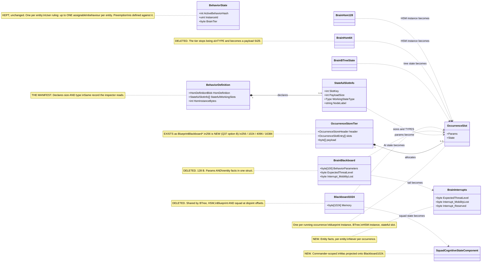
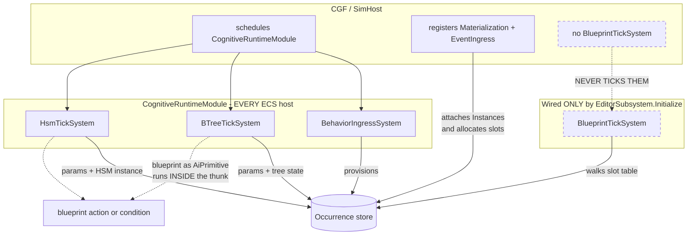
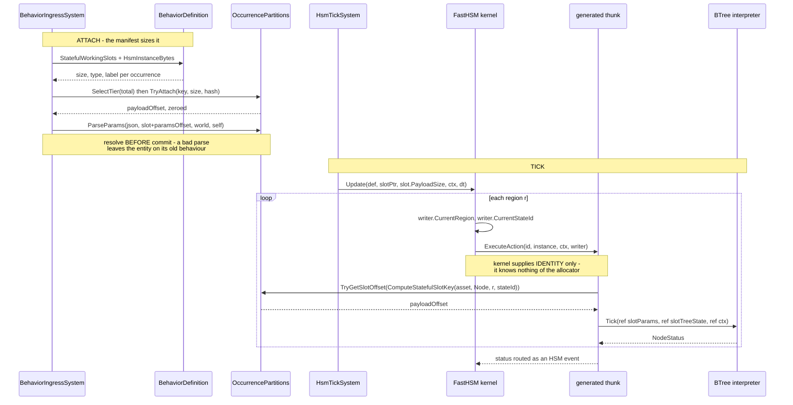

<!--STATUS
state: LIVE
updated: 2026-09-19
build-state: DESIGN
current-answer: the whole document. §4 is the ExtDeps justification; §6 is the sequence.
stale-below: nothing.
known-rot: none at authoring time.
known-conflict: none. This document EXTENDS DESIGN_Parameter_Model.md §4 rather than
  overturning it; where they disagree, DESIGN_Parameter_Model.md wins and this file is wrong.
reopens: Architect_Question_37_Unify_On_The_Allocator.md — PARKED by the user 2026-08-17
  ("keep this open and return to it a bit later"). THIS DOCUMENT IS THAT RETURN. Q37's
  measurements are banked and marked do-not-re-measure; they are cited here, not re-derived.
related-designs:
  - Architect_Question_37_Unify_On_The_Allocator.md — THE OWNING QUESTION. Owns whether all
    parameter storage moves to the allocator, its two real costs (the ~1 KB floor, indirection
    from some actions to all) and the option set A/B/C. This document is its build-out.
  - Architect_Question_35_Hsm_Occurrence_Delivery.md — RESOLVED 2026-08-17. Owns HOW the
    occurrence reaches an HSM thunk (HsmCommandWriter + the (regionSlotIndex, stateId) pair,
    one path, guards unserved). §4.2 here implements it; it does not re-decide it.
  - Architect_Question_36_Subtree_Hosting_Runtime.md — owns WHICH brain runs a hosted child
    and HOW the child is resolved (by name, not asset id). This document owns its storage.
  - Architect_Question_34_Blueprint_Occurrence_Identity.md — owns blueprint Instance slot
    identity (attach the same asset twice) and §7's three-cases table.
  - DESIGN_Hsm_Storage_Model.md — owns the three storage classes and where HSM stands against
    each. This document does not restate them; §3 cites them.
  - DESIGN_Parameter_Model.md — AUTHORITATIVE. Owns WHAT a parameter is, the {Input,State}
    role model, the one-resolver rule and the "params belong to the occurrence" ruling.
  - EXPLAINER_Where_Parameters_And_State_Live.md — the file:line measurement record of the
    current storage map. This document owns the target map.
  - Blueprint_Subsystem_Runtime_Detailed_Design.md §4–§5 — owns the partition allocator's
    header, slot entry and free-list contract. This document does not change that contract.
  - docs/designs/btree-hsm-unif/DESIGN.md — owns hot reload, terminal-state routing and the
    interrupt path. Its Q1 (BrainHsm256) and Q6 (TryReload's contiguous-span assumption) are
    both CLOSED by this design rather than inherited.
-->
# DESIGN — occurrence-scoped storage

> **The goal, in one sentence.** Let one entity run an HSM (strategic), a BTree hosted inside an
> HSM state (tactical), and blueprints as their actions and conditions — concurrently, including
> across parallel HSM regions — by making **the occurrence, not the entity, the unit that owns
> memory**.
>
> **This is not a new mechanism.** The allocator exists, is production-proven, and one of the three
> behaviour systems already runs entirely on it. The work is adoption, plus one small and
> well-bounded change inside `FastHSM`.
>
> ### ⭐⭐⭐ This document is the REOPENING of `Architect_Question_37`
>
> 🔒 **The user raised it on `2026-08-17`, in their own words:** *"why not using the allocator always
> and leave the brainblackboard for parameters? is there any good reason not to unify everything to
> allocatable blackboard components? would it harm the hardcoded behaviors or something?"* — and
> **parked it themselves**: *"I would certainly keep this open and return to it a bit later."*
>
> ⛔ **`Q37`'s measurements are banked and marked *do not re-measure*.** They are **cited** below, not
> re-derived. ⚠ An earlier draft of this document re-derived five of them and omitted the two costs
> that actually decide the question (§5a). That is corrected.

---

## 1. INVENTORY

Graph first, grep to corroborate; neither alone settles an exhaustive claim.

| query | tool | result |
|---|---|---|
| complete set of tick systems | `search_graph(".*TickSystem.*", label=Class)` | **10, `has_more:false`** — 6 production: `BTreeTickSystem`, `HsmTickSystem`, `BlueprintTickSystem`, `PlaybackTickSystem`, `RecorderTickSystem`, `CommanderUtilityTickSystem` |
| the storage components | `search_graph("^(BrainBlackboard\|Blackboard1024\|BrainBTreeState\|BrainHsm64\|BrainHsm128\|BehaviorState)$")` | **23, `has_more:false`** — one component each per entity |
| the allocator | `search_graph(".*BlueprintBlackboard.*")` | `BlueprintBlackboardPartitions` + `BlueprintBlackboardHeader` + 3 tier components + `BlueprintBlackboardTiers` |
| `BlueprintTickSystem` production construction | `search_code("new BlueprintTickSystem")` → `trace_path(WireBlueprintRuntime, inbound)` | **1 production site**, reached only from `EditorSubsystem.Initialize` + the two Stride editor boots |
| `NodeType.Subtree` execution | `search_code("NodeType.Subtree", limit=60)` | one kernel site — `Interpreter.ExecuteNode` (`:229-231`), returns `Failure` |
| `ExecuteAction` call sites | `search_code("ExecuteAction(")` | `HsmKernelCore.ExecuteAction` (`:762-782`); 5 internal callers — `InitializeSlot:306`, `ProcessActivityPhase:450`, `ExecuteTransition:683,698,730` |
| consumer file set | `scripts/find.sh BrainBlackboard --glob '*.cs'` · same for `Blackboard1024` | **⚠ both graph pages TRUNCATED at the 500-match cap.** Counted from grep instead: **75** production files touch `BrainBlackboard`, **52** touch `Blackboard1024` (excluding tests, `obj/`, generated) |

**Coverage:** `check_index_coverage` over the four behaviour/kernel scopes → `no_recorded_issue`,
index generated `2026-09-18 20:36Z`, `index_mode: full`, `generation_matches: true`. Best-effort,
never proof of completeness.

⚠ **Two claims deliberately NOT re-measured here**, carried from `BP-297` and flagged as inherited:
*"zero DTO-bound HSM thunks exist in any binary"* and the 55-method `[HsmAction]` census. The
attribute sweep truncated at 150 of 173 results. **§6 does not depend on either.**

---

## 2. The structure

### 2.1 As-is vs to-be



**What the picture shows that prose hid:** `BrainBlackboard` and `Blackboard1024` are each **two
unrelated things in one struct**. Splitting them by *lifetime* — entity fact vs occurrence state —
is what makes the migration tractable, and it is why "delete both components" is the wrong framing:
two of the four outgoing edges go to new **named** components, not to slots.

### 2.2 Who ticks what, on which host



**Caption — what only this diagram shows, stated precisely.**

⭐ **Blueprints DO run on CGF — in their other mode.** A blueprint whose `Dispatch == AiPrimitive`
compiles into a BTree/HSM **action or condition** and executes inside the behaviour thunk, driven by
`BTreeTickSystem`/`HsmTickSystem`, which CGF schedules. That is the mode the shipped CGF content
uses, and nothing here is wrong with it.

🔴 **Blueprint *Instances* are the half that is broken, and it is a HALF-WIRED state rather than an
absent one.** `CgfSubsystem:1004` calls `BlueprintGenesisRuntimeRegistration.RegisterBlueprintGenesisSystems`,
which registers **`BlueprintMaterializationSystem`** (resolves `InitialBlueprintsIntent` from scenario
state and **pre-provisions the tier**) and **`BlueprintEventIngressSystem`** (attach/switch by event).
Neither is the tick system. The only production code that constructs and schedules
`BlueprintTickSystem` is `BlueprintRuntimeWiring.WireBlueprintRuntime` + `SpliceIntoSimulation`,
called from **`EditorSubsystem.Initialize:1585/1595` and nowhere else** (the integration `EditorHarness`
is the only other caller).

⇒ **CGF attaches Instances, allocates their slots and dispatches their attach/switch events — and
never ticks them.** That is worse than missing: it looks wired. Scheduling twin of the registration
gap that crashed `--mode all` on `2026-09-03` (recorded in `BlueprintBlackboardTiers`' own header).
**Independent of everything else here** — item `O0`.

### 2.3 Activating and ticking a nested occurrence



**Caption.** The only new information crossing the ExtDeps boundary is the single
`bridge.Occurrence = (r, leafId)` write. Everything below it — key, lookup, params base, tree state —
is resolved on our side of the line.

---

## 3. The model

**An occurrence is a running instance of an asset on an entity.** Its identity is
`(assetId, hostPath)`, where `hostPath` is the chain of `(hostOccurrence, siteId)` pairs from the
root. A root behaviour has an empty host path. This is not a new key function:
`ComputeStatefulSlotKey(assetId, scope, nodeVisualId, variableId)` already puts an occurrence
discriminator into the slot table's `BlueprintId` field, and `Q34 §7` measured that the field is
**already polymorphic** — blueprint ids and stateful slot keys coexist in one table, correctly.

**Slot payload:** `[OccurrenceHeader][Params P][State S]`. `DESIGN_Parameter_Model.md` §3.3 already
rules that params must not sit at offset 0 for blueprint Instances (the 16-byte
`BlueprintLatentCursor` lives there); the header generalises that reservation.

**Why every thunk survives.** `NodeLogicDelegate<TBlackboard, TContext>` is generic and the
interpreter never touches the blackboard's members — measured at `Interpreter.ExecuteAction`
(`:643-671`), which calls `actionDelegate(ref bb, ref state, ref ctx, node.PayloadIndex)` and
nothing else. A `[SharedAiAction]` thunk bakes only the **field** offset within the DTO, so it is
valid wherever that DTO lives. Same offsets, different base.

### 3.1 ⭐⭐ Hosting one graph inside another ALREADY SHIPS — and it is the template

⛔ **Correction to an earlier reading of mine: `NodeType.Subtree`'s `Failure` stub is NOT how BTree
hosts a BTree, and BTree-hosts-BTree is not a missing feature.** Measured:

- `BTreeEmitCore.EmitSubtree` (`:858-865`) emits `.Subtree("Name", …)` into the fluent builder;
- `BTreeOrchestratorEmitCore` (`:135-176`) generates a **`[BTreeAction] Orchestrate_<Sub>_Tick`**
  whose whole body is
  `ref var subBb = ref master.<VarName>; return <Sub>.GetInterpreter().Tick(ref subBb, ref state, ref ctx);`
  — with an *Approach B* variant that does **COPY IN → tick → COPY OUT** over `SubtreeSyncBindings`.

⇒ ⭐⭐⭐ **Subtree hosting is implemented as "an action that ticks the child interpreter inline,
handing it its own blackboard."** That is *exactly* the mechanism HSM-hosts-BTree needs. The child's
blackboard is a **compile-time slice of the master's** (`master.<VarName>`), so this design's
migration is *"replace the compile-time slice with an allocated slot"* — a narrowing of an existing
mechanism, not a new one. ⛔ **Nothing here removes, deprecates or reroutes it.**

🔴 **But it exposes a live defect of precisely this document's shape.** The generated orchestrator
ticks the child with **`ref state` — the MASTER's `BehaviorTreeState`**. The hosted occurrence has
**no runtime state of its own**: `RunningNodeIndex` and the local registers are shared between host
and child. With one child at a time and no suspension it mostly survives; with two hosted children,
or a child left `Running` while the host advances, host and child overwrite each other. **This is the
BTree twin of the HSM two-region collision, and it is in shipped code today.** `O4` fixes it by
giving the hosted occurrence its own `BehaviorTreeState` in its own slot — which is the same
machinery `O8` needs, so the fix and the feature are one piece of work.

⚠ **The `NodeType.Subtree` kernel stub is a separate, unused path.** It is not what ships, and this
design does not touch it; whether it is ever implemented or deleted is out of scope here.

---

## 4. ExtDeps — what must change, and why it cannot live anywhere else

> The standing rule: an ExtDeps edit needs a reason of the form *"this information exists only
> here"*, not *"this is where it was convenient to patch."*

### 4.1 FastBTree — **no change at all**

| candidate | verdict |
|---|---|
| `Interpreter<TBlackboard,TContext>` | ⛔ **no change.** The type argument is supplied by the caller and the kernel never reads the blackboard's members (`Interpreter.cs:643-671`). Pointing a tree at slot-resident params is a change to **our** call site and **our** generator |
| `BehaviorTreeState` | ⛔ **no change.** It moves from a component field to a slot payload field; the struct is unmodified |
| `NodeType.Subtree` stub (`Interpreter.cs:229-231`) | ⚠ **left alone — and it is NOT how BTree hosts a BTree** (§3.1). Hosting a tree under an HSM state does not need it |

### 4.2 FastHSM — ✅ **ALREADY RULED by `Q35`, `2026-08-17`, with the user**

> 🔒 **User, verbatim (`Q35` §7):** *"putting to HsmCommandWriter is ok. pair rather than hash. one
> path."*

⛔⛔ **CORRECTION — an earlier draft of this section proposed carrying the occurrence on
`HsmKernelBridge` and presented it as a fresh choice. That is `Q35`'s option `C`, and it was
REJECTED a month ago for a better reason than I gave:** the kernel sees the context only as an opaque
`void*`, so filling a field in it means **a layout convention across the ExtDeps boundary** — the
coupling the chosen option avoids by using a type the kernel already owns.

| `Q35` sub-question | ✅ the ruling |
|---|---|
| **`Q35-A`** delivery | **`HsmCommandWriter`** — a `Fhsm.Kernel` type the kernel constructs and already passes to **every action**. The kernel stamps the occurrence before each dispatch. ⛔ **No delegate signature changes anywhere**; the 55 attributed methods, both `FDP/Examples` projects and FastHSM's own demos compile untouched |
| **`Q35-B`** what identity | **the PAIR `(regionSlotIndex, stateId)`** — ⛔ **not a pre-hashed key.** Both are already in scope at the `HsmKernelCore` call site, and the key algorithm stays in ONE home (`ComputeStatefulSlotKey`), outside ExtDeps |
| **`Q35-C`** who moves | **ONE PATH** — the plain single-region case moves to the allocator too. ⛔ No baked-offset route kept *"for the simple case"* (ruling 9; that divergence is what made the bug invisible) |

🔒 **The division of labour, and it is the sentence to remember:**
> ⭐⭐⭐ **The kernel supplies IDENTITY. The thunk does the LOOKUP.**

⛔ **The kernel knows nothing about the partition allocator and must not learn.** The thunk already
contains the code shape it needs — the tier probe + `TryGetSlotOffset` that stateful BTree actions
have used since `S2`; what it lacked was four bytes of *"who am I"*.

⭐ **Independently re-confirmed here:** `HsmKernelCore.ExecuteAction:778-781` does
`fixed (HsmCommandWriter* writerPtr = &cmdWriter) HsmActionDispatcher.ExecuteAction(actionId,
instancePtr, contextPtr, writerPtr)` ⇒ **the writer pointer reaches every thunk already.**

| the ExtDeps delta, in full | |
|---|---|
| **two fields on `HsmCommandWriter`** | `Fhsm.Kernel/Data/HsmCommandWriter.cs` — additive |
| **the kernel assigns them before each dispatch** | the `ExecuteAction` call sites in `HsmKernelCore` |
| ⛔ **nothing else** | no delegate change, no dispatcher change, no instance-layout change |

#### ⚠ The accepted limit — **guards are unserved, and it must be asserted**

`EvaluateGuard` is `delegate*<void*, void*, ushort, bool>`; the third argument is `eventId`, **so
there is no writer to carry the pair.** ⭐ Free today — `VE-DEBT-004`: **zero production `[HsmGuard]`
exists.** ⛔ But it is a real limit: **if a stateful guard is ever authored it needs `Q35-A` option
`A` or a route of its own.** ⇒ **assert it**, so it surfaces as a decision rather than a silent wrong
answer (§7).

⚠ **This is a DIFFERENT question from §9.4.** `Q35` settles how a *thunk* learns which occurrence it
is. §9.4 settles how `HsmTickSystem` *invokes the kernel on a slot-resident instance* — the pointer
overload. Both are needed; neither substitutes for the other.

### 4.3 Explicitly NOT changing

`HsmCommandWriter` · `HsmEventQueue` · the tier instance layouts · `BehaviorTreeState` ·
`HsmDefinitionBlob` · the `[HsmAction]`/`[HsmGuard]`/`[SharedAi*]` attribute shapes ·
`HsmActionDispatcher`'s tables and signatures.

---

## 5a. ⭐⭐⭐ The two costs `Q37` measured — **and the small tier that prices them**

⛔ **These decide the question, and an earlier draft of this document omitted both.** Cited from
`Q37` §2, not re-measured.

| # | the cost | `Q37`'s measurement |
|---|---|---|
| 🔴 **C1** | **a ~1 KB floor per AI entity** | the smallest tier is **1024 B** *(96 of it header + slot table)* against today's **128 B** `BrainBlackboard` ⇒ **~8× for the simple case**, plus **an archetype change for every AI entity**. ⚠ **Whether it matters depends on the AI entity count, which was NOT measured — still open** |
| ⚠ **C2** | **indirection moves from SOME actions to ALL** | today one field access on a component already in hand; under the allocator: tier probe → `GetComponentRW` → `fixed` → `TryGetSlotOffset` *(linear scan)*. ⭐ Generated **stateful** thunks already do exactly this, so it is proven — ⛔ but it goes from *"the stateful ones pay it"* to *"every action, every tick"* |

⭐ **And two objections that `Q37` measured DO NOT exist** — do not re-raise them: **hardcoded
behaviours are not harmed** *(every direct `bb.BehaviorParameters[0]` reference is inside an EMITTER;
hand-written nodes take `ref dto`, hand-written resolvers take a destination `byte*` — both already
base-agnostic)*, and **replay / snapshot is unaffected** *(`BrainBlackboard` and all three tiers are
alike `[DataPolicy(NoScenario)]`)*.

### ✅ The small tier is IN SCOPE *(user, `2026-09-19`)*

🔒 **User:** *"small tier in scope pls; is likely does not break anything, hopefully an additive
stuff"* — ⭐ this is `Q37` option **B** *(unify **and** add a smaller tier)*, its own recommended lean,
chosen over **A** *(unify unconditionally, pay the floor)* and **C** *(root inline, children
allocated — the two-mechanism answer `Q35-C` already ruled against)*.

#### 📐 Sizing it — measured, so the constant is not a guess

| datum | value |
|---|---|
| `BehaviorTreeState` | **exactly 64 B** *(`[StructLayout(Explicit, Size = 64)]`)* |
| `HsmInstance64 / 128 / 256` | 64 / 128 / 256 B |
| params cap | **100 B** (`MaxBehaviorParamByteSize`) — a ceiling, not a typical: `MoveToLocation` is 4 fields |
| an `OccurrenceStore256` | header 32 + slot table `MaxSlots`×16 ⇒ **payload 208 B at `MaxSlots=1`, 192 B at 2** |

| the case | fits 256? |
|---|---|
| **BTree root**, typical params + `BehaviorTreeState` (64) | ✅ comfortably |
| **HSM root** on `HsmInstance64` + typical params | ✅ |
| **HSM root** on `HsmInstance128` + typical params | ✅ *(~150 B)* |
| ⚠ **HSM root** on `HsmInstance128` + params near the 100 B cap | ⛔ ~236 B — **spills to 1024** |
| **`HsmInstance256`**, or any nesting (2+ occurrences) | ⛔ **1024** — correctly so; neither is the simple case |

⭐⭐ **The spill is PREDICTED, never discovered.** Because `BehaviorDefinition` declares the sizes
(§9.5), `SelectTier` picks correctly at attach — ⛔ there is no runtime guess and no surprise
promotion on a hot path.

#### ⚠ "Additive" is right about the CONCEPT — one place it is not

| | |
|---|---|
| ✅ **component-id space** | `MAX_COMPONENT_TYPES = 512`, highest allocated **301** ⇒ room for one more *(`R-44`: the id is allocated, never recycled)* |
| ✅ **the allocator itself** | `CopyToLargerTier(src, srcSize, dst, dstSize, dstMaxSlots)` is **already generic over sizes** — it needs nothing |
| ⚠ **the per-tier BRANCHING is hand-rolled and repeated** | `BehaviorIngressSystem` alone mentions `BlueprintBlackboard16384` **28 times** across ~10 methods, each a 3-way `if/else` on tier size; `BlueprintTickSystem` has **three near-identical ~65-line `TickTier_*` methods**; there are **three near-identical renderers**. A 4th tier is a 4th arm in each |
| 🔴 **and `PromoteTier`'s dispatch grows QUADRATICALLY** | today 1024→4096, 1024→16384, 4096→16384 = **3 arms**. With 256: +256→1024, 256→4096, 256→16384 = **6**. ⛔ **This is the one part that is not simply additive** |

⇒ ⭐⭐⭐ **Collapse the per-tier branching to a TABLE first, then the 4th tier is genuinely additive.**
A `TierSpec { Type, TotalSize, MaxSlots, PayloadSize }[]` turns ~10 three-way chains, 3 copied tick
methods and 3 copied renderers into one loop, and turns promotion from N² arms into *"copy src→dst
given two specs"* — **which is what the allocator already does.** ⭐ It also makes §10's rename one
pass instead of four, and it is the natural home for the `O3` slot header. ⇒ items `O3a` / `O3b`.

---

## 5. Blast radius

75 production files touch `BrainBlackboard`, 52 touch `Blackboard1024`. They are not one problem —
they are seven, and only two are large.

| # | consumer class | files | what it needs | size |
|---|---|---|---|---|
| **1** | **squad / commander state** — `SquadCognitiveState`, `SquadInputs`, `StandardInputs`, 4 squad systems, `ForceManeuverMapper`, `ThreatMatrixAssignmentSystem`, the overlay | ~12 | ⭐ **nothing to do with occurrences.** `SquadCognitiveState.Project(ref bb)` projects the **commander's whole** `Blackboard1024` ⇒ it is entity-scoped and wants its own typed component | **S — do it first, independently** |
| **2** | **entity facts** — `CognitiveInterruptSystem`, `CognitiveCleanupSystem`, `RouteContextSystem`, `HsmTickSystem:168`, `BlackboardOffsets` | ~6 | the `BrainBlackboard` tail becomes `BrainInterrupts`. ⚠ **`R-41`/`R-39` pin byte offsets 126/127 and the param-region size — both ledger rows need updating**, not silently invalidating | **S** |
| **3** | **behaviour runtime** — `BehaviorIngressSystem`, `BehaviorRegistry`, the two tick systems, `BTreeActionRegistryFactory` | ~6 | the real work: key, allocate, resolve into the slot, tick against it | **L** |
| **4** | **generators / emitters** — `BTreeBridgeEmitCore`, `BTreeEmitCore`, `HsmBridgeEmitCore`, `BTreeBlackboardPackHelper`, `AiEmitCoreBase`, the two analyzers | ~8 | emit a slot lookup instead of a fixed component projection. **Mechanical but must be exact** — the registry key is `Method@byteOffset` | **M** |
| **5** | **blueprint compiler** — `AiPrimitiveEmitter`, `InlineActionLowering`, `CSharpEmitter`, `WorkingStateLayout`, `IrOperation`, `BlueprintCompilerContracts` | ~6 | ⭐ **this is the half the user flagged.** A blueprint reaches params two ways: as an AiPrimitive action (via the thunk — follows class 4) **and** as an Instance (already slot-resident). `FieldLayout`'s `startOffset: 0` is the one real trap | **M** |
| **6** | **editor / diagnostics / replay** — renderers, view providers, `BlackboardReflection`, `LiveBlackboardValueProvider`, `BlueprintDebugSession`, `VariableEditCommit`, `BlueprintLiveValueWriter`, `PredicateCompiler`, 2 field drawers, `SearchPredicateDto.BlackboardTarget` | ~15 | every one resolves *"where are this entity's params"* — they need the same `TryResolveOccurrence` seam, **once**, not 15 times. ⚠ `R-52`'s live corruption defect (whole-component staged write) is fixed for free by per-slot writes | **M** |
| **7** | **scenario translators** — `BrainBlackboardTranslator`, `Blackboard1024Translator` | 2 | ✅ **measured harmless.** Both are scenario/clipboard **extract-only** with `Inject` a documented no-op, over `[DataPolicy(NoScenario)]` components. **Not DDS translators** ⇒ **no wire format change, no `R-136` exposure** | **XS** |

---

## 6. Sequence

Ordered so that each step is provable on its own and the expensive irreversible one comes last.

| # | item | why here | ExtDeps |
|---|---|---|---|
| **O0** | **Re-home `BlueprintTickSystem` into a module every ECS host schedules** | independent of everything else; until it lands, blueprint Instances are editor-only and the tripod has no third leg on CGF | — |
| **O1** | **`SquadCognitiveState` gets its own component** | removes the largest non-AI consumer of `Blackboard1024`; pure win even if the rest is cancelled | — |
| **O2** | **Split `BrainBlackboard` → `BrainInterrupts` + a params region type** | the params region becomes addressable; the tail stops travelling with it. Updates `R-39`/`R-41` | — |
| **O3** | **The occurrence seam** — `OccurrenceKey`, `TryResolveOccurrence`, the slot header | one lookup that classes 4/5/6 all call. **No behaviour changes yet** | — |
| ⭐ **O3a** | **Collapse per-tier branching to a `TierSpec` table** — ingress, tick, renderers | ⛔ **prerequisite for `O3b`, and it pays for itself**: ~10 three-way chains, 3 copied tick methods and 3 copied renderers become one loop; `PromoteTier` stops being N² | — |
| ⭐ **O3b** | **Add the `OccurrenceStore256` tier** (`MaxSlots` 1–2) — `Q37` option B | prices the simple case: ~8× floor → ~2× (§5a). ⛔ Trivial after `O3a`, four copies before it | — |
| **O4** | **BTree onto occurrence storage** — tree state and params into slots, **including a hosted subtree's own `BehaviorTreeState`** | ⭐ **proves the whole model with ZERO ExtDeps change** (§4.1) **and closes the shared-`BehaviorTreeState` defect in §3.1**. If this does not work, stop before paying for `O6` | **none** |
| **O5** | **Blueprint Instances take params** (`DESIGN_Parameter_Model.md` §3.3) | the slot layout is now shared with `O4`; closes `R4`, which has no design today | — |
| **O6** | **`HsmOccurrence` in the kernel** (§4.2 option b) | the one ExtDeps change, paid **once**, after `O4` has proved the storage model | **the only one** |
| **O7** | **HSM per-region actions key on the occurrence** — closes `BP-297`/`E3` | needs `O6` | — |
| **O8** | **BTree hosted under an HSM state** — the strategic/tactical composition | needs `O3`+`O6`; the child is just another occurrence | — |

⭐ **`O0`–`O5` deliver real value with no ExtDeps edit at all.** The boundary is crossed once, at
`O6`, and only after `O4` has demonstrated the model on the paradigm that needs no kernel change.

---

## 7. Rails

| rail | asserts |
|---|---|
| **two occurrences, distinct bytes** | the same asset twice on one entity ⇒ different param bytes. This is `DESIGN_Parameter_Model.md` §8's rail and it is what stops the shared-region assumption returning |
| **the tail is untouched** | resolving params for any occurrence writes neither interrupt byte nor `ExpectedThreatLevel` |
| **cursor intact** | a blueprint Instance with params keeps its `BlueprintLatentCursor` at offset 0 after a resolve — the `startOffset: 0` trap |
| **parse before commit** | a failing resolve at attach leaves the entity without the new occurrence |
| **two regions, two slots** | two concurrently-active HSM regions running the same action write **different** bytes. ⚠ `BP-297` measured that today's fixture cannot redden this — the two regions run an **empty** action. **A DTO-bound HSM action must be authored as part of `O7`, or the rail is vacuous** |
| **one context per instance** | `UpdateBatch` with N instances: each `ExecuteAction` sees the occurrence of *its* instance (§4.2 caveat ②) |
| **a hosted subtree keeps its own cursor** | host tree `Running` at node A, hosted child `Running` at node B ⇒ **both survive a tick**. ⛔ Must be written to go RED before `O4` — it reproduces the §3.1 defect in shipped code |
| **every host ticks blueprints** | a `--mode all` run shows a blueprint **Instance** advancing on CGF, not only in the editor (`O0`). ⚠ Anti-vacuity: CGF already materialises and event-attaches Instances, so the rail must assert the *tick counter advances*, not that the slot exists |
| **one supply mechanism** | unchanged from `DESIGN_Parameter_Model.md` §8 — a second `Overrides`-style applier fails it |

---

## 8. Open questions

| id | question | lean |
|---|---|---|
| **Q1** | ~~Does `NodeType.Subtree` come with this?~~ **WITHDRAWN — the question was wrong.** See §3.1 | ✅ **BTree-hosts-BTree SHIPS and is KEPT.** `O4` improves it |
| **Q2** | ~~The shared event queue is unmeasured for cross-region hazards~~ | ✅ **MEASURED — see §9. Five hazards, four of them structural.** None blocks `O0`–`O7`; **H1–H3 block `O8`** and are dispatch semantics, not storage |
| **Q3** | Rename `BlueprintBlackboard*`, given it already stores BTree/HSM state | ✅ **names proposed — see §10.** Roslyn-driven, off the critical path |
| **Q4** | ~~Does the root brain stay exclusive once nesting works?~~ | ✅ **RULED, user, `2026-09-19`, verbatim: *"there is still just up to one assignable behavior per entity."*** `BehaviorState` stays singular; `InstanceId` preemption and `ChannelArbitrationSystem` are untouched. Concurrency comes from nesting, never from a second assignable root |

---

## 9. The shared event queue — measured (`Q2`)

⭐⭐ **Headline: the hazards are real and structural, but they are DISPATCH SEMANTICS, not storage.**
They live entirely inside `HsmKernelCore` and `HsmEventQueue`, they would exist with or without this
design, and **none of them blocks `O0`–`O7`.** Three of them block `O8`.

### 9.1 The five hazards

| # | hazard | measured at | bites when |
|---|---|---|---|
| **H1** | 🔴🔴 **ONE region consumes the event; the others never see it.** `SelectTransition` scans every region and returns **a single** best transition (`:564-610`); `ExecuteTransition` fires it; then `ProcessRTCPhase` sets `currentEventId = 0` — *"Event consumed"* (`:517`) — and the loop continues with epsilon transitions only. ⛔ **UML orthogonal-region semantics require the event to be offered to EVERY region**, each firing independently | `HsmKernelCore.cs:497-518`, `:564-610` | **any** event that two regions both have a transition for |
| **H2** | 🔴 **Priority arbitration is GLOBAL, not per-region.** `bestTransition` is chosen by `priority > highestPriority` **across all regions** (`:592`) ⇒ a low-priority transition in region 0 loses to a high-priority one in region 1, and (via H1) region 0 then loses the event entirely | `:588-600` | any two regions with different transition priorities on one event |
| **H3** | 🔴 **A GLOBAL transition always reports region 0.** `SourceStateIndex = activeLeafIds[0]` unconditionally (`:551`) and `regionIndex` stays at its `0` initialisation (`:538`) — it is only assigned inside the per-region loop (`:599`). ⇒ a global transition fired while >1 region is active rewrites **region 0's** leaf and leaves the others untouched. ⚠ **This is the surviving half of the bug the `:747-749` comment says was fixed** *("a transition fired in region 1 used to overwrite region 0's leaf… corrupting two regions with one event. Harmless while regionCount == 1, which is why it survived")* — fixed for per-region transitions, **still live for global ones** | `:538`, `:551`, `:747-750` | any global transition on a multi-region machine |
| **H4** | ⚠ **The queue is sized by LEFTOVER BYTES, not by the region count — at every tier.** `HsmInstance128`: **4 regions, 4 timers, 1 interrupt slot + a 1-slot ring** ⇒ 2 events. `HsmInstance256`: **8 regions, 8 timers, ring 5** ⇒ 6. ⛔ **Every tier has `ring < regions`.** ⇒ **`ProcessTimerPhase` loops all timers and `FireTimerEvent` enqueues one each — 4 expiring timers on a 128 = 2 enqueued, 2 lost.** ⚠ **CORRECTION to an earlier wording of this row:** Tier2/Tier3 **REJECT** on a full ring (`EnqueueTier2:262` returns `false`); it is `HsmInstance64`'s header that documents *eviction*. Either way the event is gone — but 🔴 **`FireTimerEvent:368` discards `TryEnqueue`'s bool**, so the loss is silent, untraced and unlogged | `HsmEventQueue.cs:11-27`, `:249-265`; `HsmKernelCore.cs:335-350`, `:361-369` | N regions or N timers on one tick — i.e. normal operation for a multi-region machine, not an edge case |
| **H5** | ⚠ **Drain order decides the winner.** `ProcessEventPhase` drains up to `MaxEventsPerTick = 10`, each through a full RTC pass. Deterministic, but with H1 the queue order silently determines which region acts | `:381-392` | any multi-event tick |

⭐ **Timer events are not exempt:** `FireTimerEvent` enqueues into the same shared queue, so H1 and H4
apply to timers too — even though `TimerDeadlines[]` is itself per-slot.

### 9.2 ⭐ What is already right, and it is the shape of the fix

`ArbitrateOutputLanes` runs **only when `RegionCount > 1`** (`:645-647`). ⇒ **the OUTPUT side already
has region arbitration; it is the INPUT side that has none.** The fix has a precedent in the same
file: offer the event to each region, collect at most one transition **per region**, execute them,
and let the existing output-lane arbiter resolve conflicting effects.

### 9.3 Consequence for this design

| | |
|---|---|
| ⭐⭐ **`O0`–`O7` are unaffected** | they change **where bytes live**. H1–H5 are about **which region gets an event**. No dependency either way |
| ⛔ **`O8` (BTree hosted under an HSM state) needs H1 fixed** if two regions are meant to host trees concurrently — otherwise one hosted tree stops receiving the events that drive it | |
| ⚠ **H4 is a capacity decision, not a bug** | see §9.4 — the answer is **allocate a bigger slot payload**, which arrives with `O7`. ⛔ Not a new component |
| 🔒 **This is a SEPARATE ExtDeps change from §4.2** | it must be justified on its own terms — *"orthogonal-region event dispatch is wrong"* — and **not** smuggled in as part of the storage work. ⛔ Exactly the failure mode the standing ExtDeps rule exists to prevent |

### 9.4 The tiers — what they give, and who chooses

| | `HsmInstance64` | `HsmInstance128` | `HsmInstance256` |
|---|---|---|---|
| regions | 2 | **4** | **8** |
| timers | 2 | 4 | 8 |
| history / scratch | 2 | 8 | 16 |
| **events in flight** | **1** *(single shared slot)* | **2** *(1 interrupt + ring 1)* | **6** *(1 interrupt + ring 5)* |
| ECS wrapper | `BrainHsm64` | `BrainHsm128` | 🔴 **none** |

⭐ **Interrupts are safe at every tier** — the reserved interrupt slot cannot be crowded out by normal
traffic (`EnqueueTier2:238-247`), so `MobilityLost`-class interrupts always land. **It is normal and
timer traffic that is tight.**

#### 🔴 Who chooses the tier: **nothing does — it is hard-coded to 128**

📐 Measured. `BehaviorTkbTranslator.cs:118-122` is the only production attach:

```csharp
else if (dto.BrainTier == BehaviorConstants.BrainTierHsm)
    if (registered && !has) repo.AddComponent(entity, new BrainHsm128());
```

⇒ **every HSM entity gets 128, regardless of what its machine declares.** `BrainHsm64` is
*registered* (`CognitiveComponentRegistry:47`) and *ticked* (`CognitiveRuntimeModule:65`) and
`BehaviorIngressSystem.ResetHsmComponents:748` handles it — but **every `new BrainHsm64()` in the
tree is in a test** (measured: 14 lines, 6 files, all `*.Tests`). There is no production path that
selects a tier, so "the tier system" is currently one tier with two unused neighbours.

⭐ **The selector already exists in the data:** `definition.Header.RegionCount` is read by the kernel
(`:172`, `:645`). A machine's compiled blob knows how many regions it has, so the attach can size the
instance instead of guessing.

#### ⛔⛔ CORRECTION — **there is no `BrainHsm256`, because after `O7` there is no `BrainHsm*` at all**

🔒 **User, `2026-09-19`:** *"i thought the HSM state will be also allocated as occurrence so why would
we need a component for it?"* — **correct, and §9.4's first draft contradicted §2.1 of this very
document.** The classDiagram already says `BrainHsm64 ..> OccurrenceSlot : HSM instance becomes`.

📐 **And the kernel agrees — measured.** `HsmKernelCore` is `internal` and `UpdateBatchCore` already
takes exactly `(definition, void* instances, int count, int instanceSize, void* ctx, float dt,
CommandPage*, HsmTraceContext*)`. **Every public `HsmKernel.Update<TInstance,TContext>` overload is a
thin generic wrapper** that does `fixed (TInstance* instPtr = &instance)` and passes
`sizeof(TInstance)` (`HsmKernel.cs:82-104`). ⇒ ⭐⭐⭐ **the kernel wants a POINTER AND A SIZE, not a
component type.** The generic wrapper exists only to pin a managed `ref`. `HsmEventQueue.TryEnqueue`
likewise switches on `int size`, not on a type.

⇒ ⭐⭐ **The tier stops being a TYPE and becomes a PAYLOAD SIZE**, chosen at attach from
`definition.Header.RegionCount`:

| | before `O7` | after `O7` |
|---|---|---|
| where the instance lives | `BrainHsm64` / `BrainHsm128` component | a slot in the entity's occurrence store |
| how the tier is chosen | ⛔ hard-coded 128 | ⭐ `TryAttach(key, sizeFor(Header.RegionCount), …)` |
| getting 8 regions / 6 events | needs a **new component + id + registration + tick registration** | ⭐ **free** — allocate 256 bytes instead of 128 |
| `BrainHsm64` / `BrainHsm128` | exist | ⭐ **deleted** |

⇒ ⛔ **Do NOT create `BrainHsm256`.** It would be a new component, a new `GlobalComponentIds` entry
and a new tick registration that `O7` then deletes. The capacity answer is *"allocate the bigger
payload"*, and it arrives with the occurrence work rather than ahead of it. ⚠ The only reason to
build it anyway would be needing 8 regions **before** `O7` lands — and multi-region HSM needs **H1**
fixed regardless, so there is no such urgency.

⭐ **This also subsumes a second recorded problem.** `docs/designs/btree-hsm-unif/DESIGN.md` §Q6 says
`HotReloadManager.TryReload` *"assumes a single contiguous span of all component instances… there is
no world-wide contiguous span"* and must be refactored. With instances in slots, reload is a **slot
walk** — the same walk `BlueprintTickSystem.TickTier_*` already performs, including its
`StructureHash`-mismatch hard reset. ⇒ the occurrence model **closes** Q6 instead of inheriting it.

#### ⭐ What crossing the ExtDeps line costs, if anything

| option | ExtDeps delta |
|---|---|
| **(a)** three payload structs on our side — `struct HsmPayload64 { fixed byte _[64]; }` etc. — and call the existing generic `Update<HsmPayload256, HsmKernelBridge>(ref Unsafe.AsRef<HsmPayload256>(slotPtr), …)` so `sizeof(TInstance)` is right | ⭐⭐ **ZERO** |
| **(b)** ⭐ **one additive `public` pointer overload** forwarding to the already-existing internal `UpdateBatchCore` | one new public method, **no existing signature touched** |

**What (b) actually is.** The only public entry today is generic, and the generic exists for exactly
two reasons — to pin the managed `ref`, and to supply `sizeof(TInstance)`:

```csharp
public static unsafe void Update<TInstance, TContext>(
    HsmDefinitionBlob definition, ref TInstance instance, in TContext context,
    float deltaTime, ref CommandPage commandPage)
    where TInstance : unmanaged where TContext : unmanaged
{
    fixed (TInstance* instPtr = &instance) fixed (TContext* ctxPtr = &context)
    fixed (CommandPage* cmdPtr = &commandPage)
        HsmKernelCore.UpdateBatchCore(definition, instPtr, 1, sizeof(TInstance), ctxPtr, …);
}
```

`UpdateBatchCore` is `internal` and **already has the shape a slot needs.** (b) is one method that
makes it reachable:

```csharp
public static unsafe void Update(
    HsmDefinitionBlob definition,
    byte* instance, int instanceSize,        // ⭐ straight from slot.PayloadOffset / slot.PayloadSize
    void* context, float deltaTime,
    CommandPage* commandPage, HsmTraceContext* traceCtx = null)
    => HsmKernelCore.UpdateBatchCore(definition, instance, 1, instanceSize, context, deltaTime, commandPage, traceCtx);
```

| | ⭐ (a) payload structs | ⭐ (b) pointer overload |
|---|---|---|
| ExtDeps | ✅ **none** | ⚠ one additive public method |
| ⭐⭐⭐ **where the SIZE comes from** | 🔴 **a type we invented** — `sizeof(HsmPayload256)` | ✅ **the allocation** — `slot.PayloadSize` |
| 🔴 **memory safety** | ⛔⛔ **pass `HsmPayload256` at a 128-byte slot and the kernel reads 128 bytes past the payload — into the NEXT OCCURRENCE'S bytes.** No compiler check, no runtime check | ✅ **cannot disagree with the slot by construction** |
| new call sites (reload, debug snapshot, editor) | each repeats a 3-way switch | one call, any size |
| a future 4th size | a 4th struct + a 4th switch arm | ⭐ nothing |
| misuse risk | low — the types constrain it | ⚠ a caller can pass a wrong `instanceSize`; mitigate by keeping the generic overloads as the documented surface |
| reversibility | entirely ours | needs an ExtDeps revert |

⭐⭐⭐ **Lean: (b), and the deciding argument is MEMORY SAFETY, not convenience.** In (a) the size is
a property of an invented type; in (b) it is a property of the allocation. With occurrence payloads
packed adjacently inside one component, an overstated size reads into the **neighbouring
occurrence** — ⛔ **precisely the silent cross-occurrence corruption this whole design exists to
eliminate**, reintroduced at the tick site. ⭐ Fold it into `O6`, which is already editing
`HsmKernel.Update` (§4.2): **one crossing instead of two.** ⛔ If `O6` is cancelled, (a) remains a
working fallback — the slot model does not depend on the ExtDeps edit — but then the size/slot
agreement needs an explicit assert at every call site.

### 9.5 Who declares the instance size — ✅ `BehaviorDefinition`, per the user

🔒 **User, `2026-09-19`:** *"the behavior definition record… could say what size of the HSM to use."*
⭐⭐ **Agreed, and it is the EXISTING pattern rather than a new one** — measured.

`BehaviorDefinition` (`BehaviorRegistry.cs:74-198`) already carries `HsmDefinition` (`:96`), and
already carries **`StatefulWorkingSlots: IReadOnlyList<StatefulSlotInfo>`** (`:197`) where every entry
declares an explicit **`PayloadSize`** (`:63`) plus `SlotKey`, `StructureHash`, `WorkingStateType`,
`Role` and `Scope`. ⇒ **the definition record is already how the ingress learns what to allocate**,
and `BehaviorIngressSystem.ProvisionStatefulSlots` already allocates from it. The HSM instance is one
more entry of the same shape.

#### 📐 Why DECLARED beats DERIVED here — the header cannot answer the question

`HsmDefinitionHeader` is 32 bytes and carries `StateCount`, `TransitionCount`, **`RegionCount`**,
`GlobalTransitionCount`, `EventDefinitionCount`, `ActionCount`, `GuardCount`. ⛔ **It carries NO timer
count and NO history-slot count** — and the tiers differ in all four axes *(regions 2/4/8, timers
2/4/8, history 2/8/16, queue depth 1/2/6)*. Timer usage lives in the **state definitions**, not the
header. ⇒ ⛔ **deriving the tier at runtime from `Header.RegionCount` alone UNDER-SPECIFIES it**, and
the alternative — adding counts to the header — is an ExtDeps format change for something the
compiler already knows.

⭐⭐ **So: declared on the record, but COMPUTED AT BUILD TIME by the generator**, exactly as
`StatefulWorkingSlots` is emitted today. The compiler scans the machine (regions, timers, history,
event depth), snaps to 64/128/256, and emits it. **No ExtDeps change, no runtime guessing.**

⚠ **Drift is already guarded** — `StatefulSlotInfo.StructureHash` and the slot-vs-definition hash
check that `BlueprintTickSystem.TickTier_*` performs, with `ResetSlot` on mismatch. A machine
recompiled to need a bigger instance changes its structure hash, so the stale slot is reset rather
than silently under-read. ⭐ This is what makes a declared size safe here and unsafe in general.

⛔ **Do not read "≤2 event-driven regions" as a design limit to accept** — it was my shorthand for
*"don't exceed the queue"*, and the honest statement is: **the queue was never sized against the
region count, so the limit is an accident of byte budgeting rather than a decision.** Fix it by
choosing the tier, not by capping the design.

🔴 **And one line worth fixing whatever else happens:** `FireTimerEvent:368` calls
`HsmEventQueue.TryEnqueue(...)` and **discards the result.** A dropped timer event is currently
invisible. It belongs with the H1–H3 dispatch work as the same ExtDeps change.

#### ⛔ HISTORY — the superseded first answer *(kept because the tier TABLE above is still true)*

📄 **This is already a recorded future task, not a new idea** —
`docs/designs/btree-hsm-unif/DESIGN.md` §"Q1: HsmInstance256 / BrainHsm256": *"`HsmInstance256` exists
in `Fhsm.Kernel` but no `BrainHsm256` ECS component exists. `HsmTickSystem<T>` is generic, so it could
technically support 256-byte instances. A future task should add `BrainHsm256`… This design does not
add it."*

⛔ **This document's first draft took that literally and proposed adding the component.** That was
wrong for the reason above: after `O7` there is no `BrainHsm*` to add a sibling to. ⭐ **The facts in
it still hold** — `HsmInstance256` exists, is size-tested, `HsmEventQueue` already routes `case 256`,
and the extra capacity costs **+128 bytes on the entities that need it**. ⚠ And either way it does
**not** fix H1–H3: a bigger queue delivers more events; it does not make region 1 see an event
region 0 consumed.

---

## 10. Rename proposal (`Q3` — ✅ names agreed by the user, `2026-09-19`)

**What the thing actually is:** a per-entity, tiered, slab-allocated arena holding **one payload per
running occurrence** — blueprint Instance, BTree stateful slot, HSM slot. The word `Blueprint` in its
name has been wrong since `BehaviorIngressSystem` started allocating from it.

| today | ⭐ proposed | why |
|---|---|---|
| `BlueprintBlackboard1024/4096/16384` | **`OccurrenceStore1024/4096/16384`** | names the unit of identity the design turns on; *store* avoids **blackboard**, which already means three different things here |
| `BlueprintBlackboardHeader` | **`OccurrenceStoreHeader`** | |
| `BlueprintSlotEntry` | **`OccurrenceSlotEntry`** | |
| `BlueprintFreeBlockHeader` | **`OccurrenceFreeBlockHeader`** | |
| `BlueprintBlackboardTiers` | **`OccurrenceStoreTiers`** | keeps the `RegisterAll` role obvious |
| `BlueprintBlackboardPartitions` | ⭐ **`OccurrencePartitions`** — **keep the word `Partitions`** | ⛔ do NOT rename this to `Allocator`: `Blueprint_Subsystem_Runtime_Detailed_Design.md` §5 is cited across the corpus as *"the partition allocator"*, and renaming orphans those citations for no gain |
| `BlueprintBlackboard1024Renderer` … | **`OccurrenceStore1024Renderer`** … | |

**Rejected alternatives, one line each:**
`SlotBlackboard*` — keeps the overloaded word we are trying to disambiguate from ·
`OccurrenceArena*` — *arena* is precise allocator jargon but reads oddly in a military sim ·
`BehaviorStateStore*` — collides conceptually with the `BehaviorState` component ·
`AiStateArena*` — too narrow, blueprint Instances are not all AI ·
`EntityScratch*` — says nothing about occurrence identity.

| ⚠ constraints on doing it | |
|---|---|
| 🔴 **Roslyn only** | never a text rename — the standing rule, and a preview here will reach assemblies a reference list does not name |
| 🔴 **Rename the FIELD, never the VALUE** | `GlobalComponentIds.BlueprintBlackboard*` field names change; **the numeric ids must not** — `R-44`: ids are globally unique and partitioned for multi-process determinism |
| ⚠ **union rule** | query from a root-solution project **and** check `HrotStrideApp.Windows` separately — it is the one project outside `IOS-IG-SimHost.sln` |
| ⭐ **do it AFTER `O3`** | `O3` already touches the slot header; renaming first means two passes over the same files |

---

## 11. Observability — inspector, debug sessions and the HTTP API

> 🔒 **User, `2026-09-19`:** *"The Occurrences are just a memory pool component, would it know what
> the memory means…? if not, who knows where in the occurrences the data is and what they mean?"*

⭐⭐⭐ **Correct that the pool knows nothing — and the question is already answered by shipped code.
`BlueprintBlackboard1024` is a memory pool with a custom renderer TODAY, and it renders typed,
per-slot content.** This section is a generalisation of that, not a new mechanism.

### 11.1 Who knows what the bytes mean

📐 **Measured, `StatefulWorkingStateProjection.cs`** — the join, in five lines:

| step | line | what |
|---|---|---|
| ① | `:55` | `registry.TryGetDefinition(bs.ActiveBehaviorHash, out var def)` — `BehaviorState` ⇒ `BehaviorDefinition` |
| ② | `:56` | `def.StatefulWorkingSlots` — **the manifest** |
| ③ | `:61` | `s.WorkingStateType` — ⭐ **the managed TYPE, per slot** |
| ④ | `:118` | `TryGetSlotOffset(memory, s.SlotKey, out payloadOffset)` — **where** |
| ⑤ | `:126` | `Marshal.PtrToStructure((IntPtr)(memory + payloadOffset), s.WorkingStateType)` ⇒ `:80` `ImGuiPropertyTree.Render(boxed, contextType: …)` |

⇒ ⭐⭐ **The MANIFEST is the answer.** `BehaviorDefinition.StatefulWorkingSlots[]` already carries
`SlotKey` *(where)*, `WorkingStateType` *(what)*, `NodeLabel` *(how to name it)*, `Scope` *(how to tag
it)* and `PayloadSize`. The renderer joins manifest to pool; neither half knows alone.

🔒 **THE INVARIANT THIS MAKES EXPLICIT — and it is a design obligation, not a nicety:**
**an occurrence may not be allocated without declaring how to read it.** The same manifest entry that
tells `TryAttach` how many bytes to take tells the inspector what those bytes are. ⇒ **a slot that
cannot be rendered is a defect at ALLOCATION time**, catchable by a rail (§11.4), not a gap
discovered later in the UI.

### 11.2 The pool renderer already exists

`BlueprintBlackboard1024Renderer` is `[ImGuiRenderer(typeof(BlueprintBlackboard1024))]` +
`IEntityAwareImGuiRenderer`, and it:

- reads the slot count for its **summary** line — *"Instance Blueprints (N attached)"*;
- renders **one row per slot** via `BlueprintTierSummary.Read(mem, registry)` — Name · InstanceVersion · Size · Id;
- then calls `StatefulWorkingStateProjection.RenderWorkingState(session, entity, mem)` for the **typed** per-slot property tree;
- returns `true` to **suppress the default byte dump**.

⇒ **The work is to widen it, not to invent it:** the row gains a **Kind** column
*(Blueprint · BTree · HSM)*, the summary becomes *"Occurrences (N running)"*, and the typed section
renders each occurrence's **params** and **state** rather than only stateful working slots. ⭐ Nested
occurrences render as children, using the `hostPath` the key already carries (§3).

### 11.3 What actually changes, per consumer

| consumer | today | after |
|---|---|---|
| **entity inspector** | 3 renderers — `BrainBlackboardRenderer`, `Blackboard1024Renderer`, `BlueprintBlackboard*Renderer` | ⭐ **one family**, `OccurrenceStore*Renderer`, widened as §11.2. `BrainInterrupts` keeps a small renderer of its own |
| 🔴 **`HsmDebugSession`** | `:88-120` — `HasComponent<BrainHsm64>` / `<BrainHsm128>`, builds **ONE** `HsmInstanceSnapshot` into `_currentSnapshot`, with tier-specific `DecodeLeaves64/128`, `DecodeEventQueue64/128`, … | **a LIST of snapshots**, one per HSM occurrence; the decoders become **size**-driven rather than type-driven — the same shape as the kernel change (§9.4) |
| **`BlueprintDebugSession`** | already slot-based | ⭐ unchanged in shape |
| ⭐⭐ **the HTTP API** | 📐 **measured: it does NOT read `BrainHsm*` / `BrainBTreeState` at all.** `DebugApiService.cs:2749` reads `BehaviorState.BrainTier`, then delegates to `_btreeSession` / `_hsmSession` and stamps `["tier"] = "BTree" \| "Hsm"` | ⭐ **the routes are insulated — the migration surface is the SESSIONS, not the endpoints** |
| **HTTP discovery of slot state** | ⭐ **already built**: `DebugApiService.Variables.cs:39-69 AttachedBlueprints` walks all three tiers with `BlueprintTierSummary.AppendSlots` and returns `List<SlotSummary>` — its own comment: *"the same scan the Entity Inspector uses… without it, every call would need an asset Guid nobody can guess"* | ⭐ widen the same scan to every occurrence kind |
| **scenario/clipboard translators** | `BrainBlackboardTranslator`, `Blackboard1024Translator` — extract-only | follow the manifest; no wire impact (§5 class 7) |

#### ⚠ One deliberate HTTP contract change, to be decided rather than discovered

`DebugApiRouteDocs.cs:1675` documents the AI-state route as returning *"BTree active node path +
history, **or** HSM active leaves, **or** blueprint live state"* with a single `tier` field
(`:1684`). ⛔ **That shape assumes one brain per entity.** With nesting it must return a **list of
occurrences**, each with its own `kind`, `assetName`, `hostPath` and state.

⚖️ **Lean: make it a list, and keep the current object as the list's first element for one release**,
so an existing agent script keeps working while the new field appears beside it. ⛔ Do **not** silently
change the single object's meaning — an agent reading `tier` would start getting the root's tier for
a tree that is no longer the only one running.

### 11.4 Rails

| rail | asserts |
|---|---|
| ⭐⭐ **every allocated occurrence is renderable** | for each slot in the store, the manifest resolves a `Kind`, a label and a type. ⛔ **Fails at allocation, not in the UI** — this is §11.1's invariant made checkable |
| **the inspector shows N occurrences** | an entity running HSM + 2 hosted BTrees + 1 blueprint Instance ⇒ **4 rows**, each with its own typed state |
| **nesting is visible** | a hosted occurrence renders under its host, not as a sibling |
| **the HTTP list matches the inspector** | `AttachedBlueprints`' successor and the renderer read the same manifest ⇒ same count, same names. ⛔ Two scans that can disagree is the `R-132` two-producers smell |
| **no default byte dump** | no occurrence store ever falls back to the raw hex renderer — that is the signal a manifest entry is missing |
