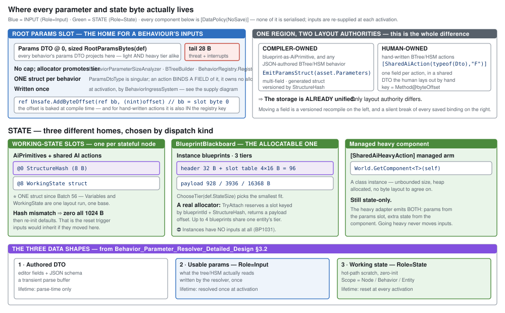
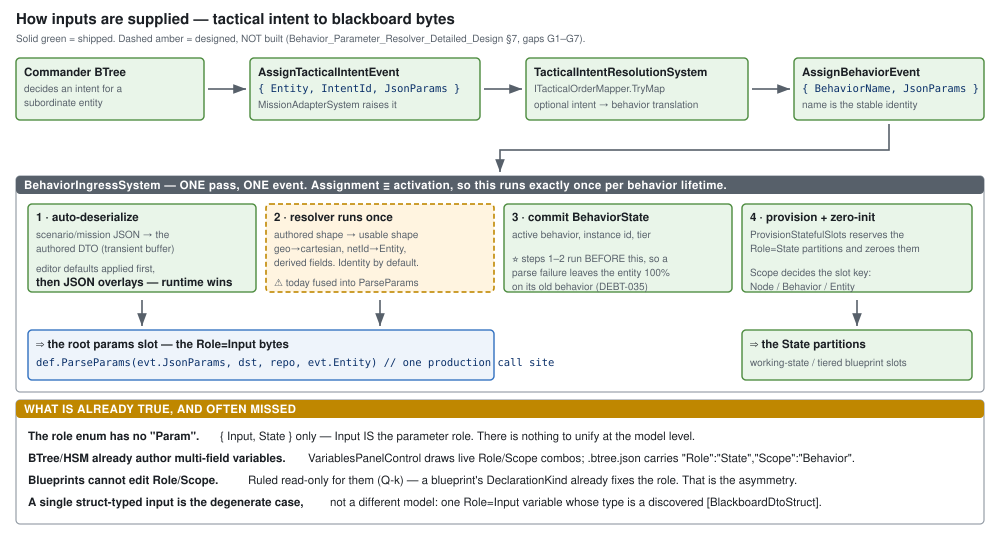
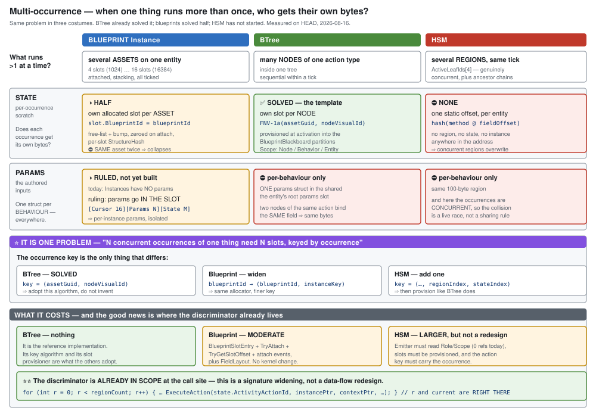

<!--STATUS
state: LIVE
updated: 2026-08-16
current-answer: the whole document; it is authoritative for parameters and storage
known-rot: describes BP1031 as live; BP1031 was RETIRED (Blueprint_Issues_Tracker, BP-278)
known-conflict: gives Scope three values; Q-b in Variable_Model_Unification rules two. UNRECONCILED.
-->
# DESIGN — the parameter model *(AUTHORITATIVE, `2026-08-16`)*

> ⭐⭐⭐ **THIS IS THE PARAMETER STORY. Read this before touching parameters, inputs, variables or
> blackboard storage in ANY host.** Everything here is either **measured on `HEAD`** (with file:line) or
> a **dated user ruling**. ⛔ **Nothing in it is an open question.**
>
> ### ⛔ Supersedes
>
> | document | what of it |
> |---|---|
> | 📄 [`Behavior_Parameter_Resolver_Detailed_Design.md`](Behavior_Parameter_Resolver_Detailed_Design.md) *(`2026-07-13`)* | ⭐ **its model and pipeline STAND and are quoted below.** ⛔ **§7's `G1`–`G7` gap list is STALE** — four had closed by `2026-08-16` (§6) |
> | 📄 `.dev/blueprint-scenario/BLUEPRINT-SCENARIO-DESIGN.md` §6 *(`Overrides`)* | ⛔ **SUPERSEDED as the mechanism** — Instances use the resolver, not a name→value dict (§3.3) |
> | 📄 [`PLAN_Cross_Host_Sequencing.md`](PLAN_Cross_Host_Sequencing.md) §2 (`D2`), §6 (Phase B) | ⛔ **superseded** — `W8`/`W12` dropped, `D2` dissolved |
> | 📄 [`EXPLAINER_Where_Parameters_And_State_Live.md`](EXPLAINER_Where_Parameters_And_State_Live.md) | ⭐ **kept as the measurement record + diagrams.** ⛔ **This doc wins on any disagreement** |
> | 📄 [`Architect_Question_33`](Architect_Question_33_Blueprint_Brain_Tier.md) | ⛔ **PARKED** — brain-tier / suspendable nesting. ⚠ **Not part of this story** |

---

## 0. ⛔⛔ Do not re-derive these — **each was got WRONG at least once in this programme**

| the wrong conclusion | the truth | evidence |
|---|---|---|
| *"the 100-byte region is carved up per action"* | ⭐ **ONE params struct per BEHAVIOUR.** An action **binds a FIELD** of it | `BehaviorDefinition.ParamsDtoType` is singular; `[SharedAiAction(typeof(Dto),"Field")]` |
| *"blueprints keep inputs in allocated space"* | ⛔ **A blueprint has params only when `Dispatch == AiPrimitive`**, and they land in the same 100 bytes | `asset.Parameters` has ONE emitter: `AiPrimitiveEmitter.EmitParamsStruct`. `InstanceEmitter` never emits them |
| *"the heavy tier moves params"* | ⛔ **heavy extends STATE, never INPUT** | `EmitHeavySharedAiAdapter` emits **both**: params from `bb.BehaviorParameters`, heavy from the component |
| *"`BP1031` means nothing supplies params"* | ⚠ **true of `Instance` dispatch ONLY** — behaviours are supplied at activation | `Stage2_Validate` (`BP1031`) vs `BehaviorIngressSystem` |
| *"`Q-k` means blueprint variables differ"* | ⛔ **It describes a MISSING MOVE IMPLEMENTATION**, not a semantic difference | §5.2 |
| *"copy the whole `BrainBlackboard` per occurrence"* | ⛔ **params area only** — interrupts/soft-advice are entity facts | §4.3 |
| *"`RegisterWorldSingleton` is a service locator"* | ⛔ **it registers a BLUEPRINT to tick as a singleton** | `BlueprintRegistry.RegisterWorldSingleton(blueprintId, tier)` |
| *"`paramIndex` is a per-node slot"* | ⛔ **the ordinal among distinct METHOD NAMES in the tree** | `TreeCompiler:155` — `GetOrAddMethodName(...)` |
| *"unreferenced ⇒ delete"* | ⛔ **search `.dev/` first** — `.claude/CLAUDE.md` | got wrong **3×** in this programme |
| *"absent in HSM ⇒ not needed"* | ⛔ **HSM is BEHIND, not scoped out** *(user ruling)* | §7 |

---

## 1. The model, in one page

| axis | values | ⛔ note |
|---|---|---|
| **`Role`** | `Input` · `State` | ⭐⭐ **There is NO "Param" role. `Input` IS the parameter role** — resolver design §3.2, verbatim |
| **`Scope`** *(State only)* | `Node` · `Behavior` · `Entity` | how widely the state is shared |
| **classification** | ⭐⭐⭐ **the SECTION it was created in** | ⛔ **no `Role`/`Scope` control on any host** (§5) |
| **ownership** | ⭐⭐⭐ **params belong to the OCCURRENCE** | not to the entity (§4) |
| **supply** | ⭐⭐ **ONE resolver pipeline, every host** | (§3) |

⭐ **True entity-wide data is an ECS component field** *(user, `2026-08-16`)* — **not** a variable
section. ⛔ **No new variable owner is needed.**

---

## 2. Storage



| region | holds | size |
|---|---|---|
| **`BrainBlackboard.BehaviorParameters`** @0 | ⭐ **one params struct, for one occurrence** | **100 B** (`MaxBehaviorParamByteSize`), cap enforced 3× — last is a runtime `throw` |
| `BrainBlackboard` tail @120/126/127 | ⭐ **entity facts** — `ExpectedThreatLevel`, 2 interrupts | ⛔ **unrelated to params** |
| `Blackboard1024.Memory` | AiPrimitive / shared-AI **state** — hash @0, state @8 | 1024 B |
| `BlueprintBlackboard{1024,4096,16384}` | ⭐ **Instance state — the allocator**: header 32 + slot table 4×16 + payload | **928 / 3936 / 16368 B** |
| a managed heavy component | `[SharedAiHeavyAction]` managed state | unbounded |

⭐ **All are `[DataPolicy(NoSave)]`** ⇒ nothing here is serialised; **inputs are re-supplied at every
activation.** ⇒ **the tier question is about ADDRESSING, never persistence.**

⚠ **`FieldLayout` lays parameters at `startOffset: 0`.** Safe today **only** because Instances have
none — an Instance payload **starts with the 16-byte `BlueprintLatentCursor`**. ⇒ **§3.3 changes this.**

---

## 3. Supply — one pipeline



### 3.1 The three data shapes *(resolver design §3.2)*

| shape | populated | lifetime |
|---|---|---|
| **authored DTO** | deserialized from JSON | parse-time only — a transient buffer |
| **usable params** — `Role=Input` | the **resolver** writes them *(identity ⇒ just the deserialize)* | ⭐ **resolved once at activation** |
| **working state** — `Role=State` | zero-init at provisioning | reset at activation; `Scope` decides sharing |

⭐ **One shape by default** — the authored DTO is an auto-generated mirror; two shapes only on
divergence *(geo point vs cartesian, network id vs `Entity`, derived fields)*.

### 3.2 The activation sequence — **behaviours (shipped)**

```
Commander → AssignTacticalIntentEvent{Entity, IntentId, JsonParams}
          → TacticalIntentResolutionSystem → AssignBehaviorEvent{BehaviorName, JsonParams}
          → BehaviorIngressSystem:  deserialize → resolve → commit → provision
```

⭐ **Parse before commit** — a failed parse leaves the entity **100% on its old behaviour**.
⭐ Defaults are baked, **scenario JSON overlays them, runtime wins** *(architect-approved `2026-06-06`)*.

> ### 🔴🔴 CORRECTION `2026-08-16` — **the overlay is NOT implemented on every path**
>
> ⛔ **This document stated the overlay as universally shipped. It is not.**
> 📄 **`DEBT-AIB-021` (P3)**, found by the Batch 68 triage: *"The generated `ParseParams` writes only
> baked defaults from `DefaultValueJson` — **it ignores the incoming `json` argument** at entity
> assignment time."*
>
> | path | overlay |
> |---|---|
> | **curated / hand-written `ParseParams`** *(e.g. `ParseMoveToParams`)* | ✅ **works** — this is what the architect approved and what ships |
> | 🔴 **GENERATED, managed BTree assets** *(`BTreeBridgeEmitCore.EmitParseParamsIfDefaults`)* | ⛔ **defaults only; the incoming JSON is DISCARDED** |
>
> ⇒ ⭐⭐ **"runtime wins" is the DESIGN and is true of the curated path; it is FALSE of the generated
> managed-asset path.** ⚠ **`G1`'s split does not fix this by itself** — the deserializer must dispatch
> per-variable by name. 📌 `DEBT-AIB-021` names the implementation: *"deserializing a wrapper JSON object
> keyed by variable name and dispatching to each variable's deserializer."*

### 3.3 ⭐⭐⭐ Instances use the SAME pipeline *(user ruling, `2026-08-16`)*

> *"Instances could and should reuse the param parsing and resolving."* ⇒ ⛔ **`Overrides` is NOT the
> mechanism.**

⭐⭐ **The delegate is already location-agnostic:**

```csharp
public unsafe delegate void ParseParamsDelegate(string json, byte* memory, EntityRepository world, Entity self);
```

| caller | passes as `memory` |
|---|---|
| `BehaviorIngressSystem` | `&bb.BehaviorParameters[0]` |
| ⭐ **an Instance attach** | **`slotPayload + paramsOffset`** — its own slot |

⇒ **the pipeline is reused UNCHANGED; only the pointer differs.**

| what must be built | |
|---|---|
| **slot layout** | ⭐ **`[Cursor 16][Params N][State M]`**; `StateStructBase` shifts by `N`. ⛔ **params must NOT be at 0** — that is the cursor |
| **attach carries a payload** | `AttachInstanceBlueprintEvent` today is `{Entity, BlueprintId}` — **no params field**; `AttachToEntity(...)` — **no params argument** |
| **resolve-before-commit at attach** | mirroring `BehaviorIngressSystem` |

### 3.4 ⭐⭐ The HOST CONTEXT — wired params *(user ruling, `2026-08-16`)*

⭐ **A hosted occurrence's params may be computed from its HOST's variables.** ⛔ **Not a new supply
mechanism** — the resolver does it, given one thing it lacks today: **addressing**.

> ⭐ **Ruled:** *"use that interface for host context"* — **a small interface, ONE new resolver argument.**

```csharp
/// Read-only, NAME-keyed access to the HOSTING occurrence's variables.
/// Null when the occurrence being resolved is a root behaviour — it has no host.
public interface IHostVariableAccess
{
    bool TryRead<T>(string variableName, out T value) where T : unmanaged;
    bool TryReadBytes(string variableName, Span<byte> destination, out int written);
}

public unsafe delegate void ParseParamsDelegate(
    string json, byte* memory, EntityRepository world, Entity self,
    IHostVariableAccess? host);          // ⭐ the one new argument
```

| rule | why |
|---|---|
| ⛔ **NAME-keyed, never a raw offset** | cross-asset reads are **`StructureHash`-versioned**; a name can be re-resolved, an offset cannot |
| ⛔ **READ-ONLY** | a resolver never writes its host. ⚠ **A write path here would be a second supply mechanism** *(ruling 9)* |
| **`null` for a root behaviour** | ⭐ makes *"do I have a host?"* answerable without a sentinel |
| ⭐ **fails CLOSED** | hash mismatch / absent name / type mismatch ⇒ `false`, and the resolver decides. ⛔ **Never a silent zero** |
| ⚠ **resolve-once still holds** | this reads the host **at the child's activation**, not continuously. ⛔ **Live binding stays out** — §3.1 |

📌 **If this signature ever needs a THIRD extension, bundle it into a `ResolveContext` then** — one
breaking change bought deliberately, rather than churning the delegate a third time. ⛔ **Not now.**

---

## 4. Multi-occurrence



⭐⭐⭐ **One problem in three costumes: *N concurrent occurrences need N regions, keyed by occurrence.***

### 4.1 Where each host stands

| host | what runs >1 | state | params |
|---|---|---|---|
| **BTree** | many **nodes** of one action type | ✅ **SOLVED — the template.** `FNV-1a(assetGuid, nodeVisualId)`, provisioned at activation | ⛔ per-behaviour |
| **Blueprint** | several **assets** per entity | ◑ own slot per **asset**; ⛔ **same asset twice collapses** (identity = `blueprintId`) | ◑ **ruled**: into the slot |
| **HSM** | several **regions**, same tick | ⛔ **none** — `hash(method @ fieldOffset)`, no occurrence in the address | ⛔ per-behaviour, and **concurrent** ⇒ a live race |

⭐ **Adopt BTree's key algorithm. Do not invent one.**

### 4.2 ⭐⭐ Hand-written DTO structs survive this UNCHANGED

| | |
|---|---|
| the kernel is **generic in the blackboard type** | `NodeLogicDelegate<TBlackboard, TContext>`; `Interpreter.Tick(ref blackboard, …)` — ⭐ **the CALLER supplies the instance** |
| ⭐⭐ **actions never see the blackboard** | the thunk calls `Method(ref field, ctx.Self, ctx.World)` ⇒ **the blackboard ref exists ONLY so the thunk can locate the params** |
| a DTO's offsets are **relative to the struct base** | `Method@byteOffset` bakes only the **field** offset ⇒ valid wherever the struct lives |

⇒ ⭐⭐⭐ **Give each occurrence its own params region and tick it against that.** Every
`[SharedAiAction]` thunk keeps working — **same offsets, different instance.**

### 4.3 ⛔ Carry the PARAMS AREA only — never the component *(user correction, `2026-08-16`)*

> *"params area in 128 byte behav blackboard component does not mean we copy whole component, just the
> param area! interrupts and soft advices have no relation to the params."*

⭐ **Measured: no generated thunk touches the tail.** Every production reader/writer is a **system** —
`CognitiveInterruptSystem` sets · `CognitiveCleanupSystem` clears · `HsmTickSystem:168` reads ·
`RouteContextSystem:190` writes `ExpectedThreatLevel`.

| occurrence | ticked with |
|---|---|
| root behaviour | `ref component.Params` |
| hosted sub-behaviour / Instance | `ref` its own params region in its slot |

### 4.4 Cost

| | |
|---|---|
| **BTree** | ⭐⭐ **no `ExtDeps` change** — delegate and interpreter are generic and never touch the blackboard's members ⇒ `ref bb.BehaviorParameters` → `ref bb` at 3 generator emit sites, the interpreter type argument, one line in `BTreeTickSystem` |
| **Blueprint** | ⚠ moderate — `BlueprintSlotEntry`, `TryAttach`, `TryGetSlotOffset`, attach/detach events, `FieldLayout`. **No kernel change.** ⚠ `InstanceVersion` is **NOT free** — it is the latent-cursor staleness token |
| **HSM** | ⚠ larger, ✅ **user accepted** — ⭐ **`r` (region) and `current` (state) are ALREADY IN SCOPE at the `ExecuteAction` call site** ⇒ a signature widening + thunk regeneration, **not** a data-flow redesign. ⚠ a `FastHSM` `ExtDeps` change. ⭐ **The params-base change folds into the same seam** |

📌 **Multiple BTrees/HSMs per entity: ⛔ not as PEERS** *(root exclusivity is what preemption is defined
against — `BehaviorState.ActiveBehaviorHash` is singular)*, ✅ **yes as NESTED sub-behaviours.**

---

## 5. Authoring & UI

### 5.1 ⭐⭐⭐ Sections are the classification *(user ruling, `2026-08-16`)*

> *"can't we have same single panel (an evolution of the MyBlueprint) listing different types of vars in
> different sections… same for all asset types, showing sections relevant for the asset."*

⇒ **A variable's classification is WHERE IT WAS CREATED.** ⛔ **No `Role`/`Scope` control anywhere.**

```csharp
public sealed record MyBlueprintSectionDescriptor(
    string Id, string DisplayName, int SortOrder, string? IconKey,
    bool CanCreateItems, bool CanHaveCategories, string? CreateCommandId);
```

| | status |
|---|---|
| section descriptors + per-section create commands | ✅ shipped |
| generic panel + interface **outside** the blueprint assembly | ✅ `MyBlueprintPanel` in `NodeEditor.UI`, `IMyBlueprintModel` in `NodeEditor.Core` |
| graph-scoped section precedent | ✅ `SectionLocalVariables` |
| ⛔ variables split by kind | `BuildVariableItems()` lists **only `DeclarationKind.Variable`** |
| ⛔ BTree/HSM models | only `BlueprintMyBlueprintModel` exists |

### 5.2 ⭐ Why `Q-k` dissolves

> `Q-k`: *"for blueprints `Role`/`Scope` are read-only — **a MOVE between storage classes, not a
> toggle.** So the honest answer is not to implement the setter but to **say the surface cannot edit
> them**."*

⭐ It describes the **edit operation** — blueprints encode the role as *which list holds the
declaration*, so changing it renumbers list-relative indices and invalidates `VariableRef`s. ⇒ **a
refactor, like rename.** ⛔ **Not a semantic difference.**

⇒ ⭐⭐ **Under §5.1 there is no `Role` control to be read-only.** `Q-k` stays true and stops mattering.
📌 **Reclassification** *(moving between sections)* is **off the critical path** — rare, deliberate, and
may start as delete-and-recreate.

### 5.3 Types

⭐ **A hand-written struct is selectable as a variable's type today** — `U-8`,
`DiscoverBlackboardDtoStructTypes()` over `[BlackboardDtoStruct]`. *"Discovery IS the existence proof."*

🔴 **`S5` blocks the unification:** the **parameter** combo reads `EditorOfferableTypeIds` — **18
hardcoded primitives, no structs** — while the **variable** modal reads `SelectableTypeIds` **plus**
discovered structs. ⇒ **a variable can be struct-typed; a parameter cannot.**

---

## 6. Built vs not — measured `2026-08-16`

| | status |
|---|---|
| `Role`/`Scope` model, persisted + round-trip tested | ✅ |
| behaviour supply: intent → ingress → `ParseParams` → commit → provision | ✅ |
| defaults + scenario overlay (runtime wins) | ⚠ **CURATED path only** — 🔴 **the GENERATED managed-asset `ParseParams` ignores the incoming JSON** (`DEBT-AIB-021`, §3.2 correction) |
| **`G2`** Library blueprint functions runtime-invocable ⇒ **a blueprint-authored resolver's seam** | ✅ |
| **`G5`** name-derived `ActiveBehaviorHash` · **`G6`** `AiBehaviorFactory` retired | ✅ |
| authored multi-field inputs — **BTree** (`BTreeBridgeEmitCore`, 45 `Role`/`Scope` refs) | ✅ |
| authored multi-field inputs — **HSM** | ⛔ **0 refs in either HSM emitter** |
| **`G1`** split deserialize from resolve | ◑ signature carries `world`/`self`; **the split does not exist** |
| **`G3`** geo + entity-map as world singletons · **`G4`** duplicate-name guard · **`G7`** editor affordances | ⛔ |
| Instance params — **anything** | ⛔ `.Overrides` is **never read**; attach carries no payload |
| multi-occurrence — blueprint identity, HSM everything | ⛔ |
| `S5` one picker · sections split · BTree/HSM `IMyBlueprintModel` | ⛔ |

---

## 7. The rulings, dated

| date | ruling |
|---|---|
| `2026-06-06` | **architect-approved**: defaults → scenario JSON overlay, **runtime wins**, once at assignment |
| `2026-07-13` | resolver design: **`{Input, State}` only — no "Param" role**; resolve **once** at activation |
| `2026-08-15` | ⭐ *"what is not used does not mean it is existing without reason — a design doc gives answers"* |
| `2026-08-16` | ⭐⭐⭐ **Instances use the RESOLVER shape**, not `Overrides` |
| `2026-08-16` | ⭐⭐⭐ **one mental model, one UI, one implementation** — blueprint vars are not different |
| `2026-08-16` | ⭐⭐⭐ **sections are the classification** — no `Role`/`Scope` control |
| `2026-08-16` | ⭐⭐ **carry the params area only**, never the whole component |
| `2026-08-16` | ⭐⭐ **HSM multi-occurrence cost ACCEPTED** |
| `2026-08-16` | ⭐ **"entity globals" = ASSET globals**; ECS component fields are the real entity data |
| `2026-08-16` | ⛔ **on HSM, absent NEVER means unwanted** — it is behind, not scoped out |

---

## 8. Rails

| | |
|---|---|
| ⭐⭐ **one supply mechanism** | a reflection/grep rail: **exactly one** parameter-resolution path exists. ⛔ **A second `Overrides`-style applier fails it** *(ruling 9)* |
| ⭐⭐ **params are occurrence-scoped** | two occurrences of one asset on one entity ⇒ **distinct param bytes**. ⛔ **This is the test that stops the shared-region assumption returning** |
| ⭐ **no `Role`/`Scope` control** | no UI path writes `Role` or `Scope`; the section is the only classifier |
| ⭐ **cursor is not overwritten** | an Instance with params: assert the `BlueprintLatentCursor` at offset 0 is **intact** after a resolve ⇒ the `startOffset: 0` trap, caught by a test |
| ⭐ **the tail is untouched** | resolving params for a hosted occurrence must not write `ExpectedThreatLevel` or either interrupt |
| ⭐ **parse-before-commit** | a failing resolve at attach leaves the entity **without** the new Instance, as ingress already guarantees for behaviours |
| ⭐ **one offerable type list** | `S5`: the parameter combo and the variable modal return the **same set**, structs included |

---

## 9. Sequence

**`S5`** *(one picker)* → **`G4`** *(duplicate-name guard — cheapest)* → **the surgical field write** →
**Track C**, leading with **`C-sections`** → table → dialog → Watch → **`C-outline`** *(BTree/HSM models)*
→ **`G1`** *(the split — now load-bearing for blueprints too)* → **`G3`** → **the Instance params seam**
*(§3.3)* → **blueprint multi-occurrence** *(§4)* → **the HSM emitter slice** *(`Role`/`Scope`)* →
**HSM multi-occurrence** *(§4.4)*.

⛔ **Out of scope here:** blueprint-as-brain-tier and suspendable nesting — 📄 `Architect_Question_33`,
**parked**.
